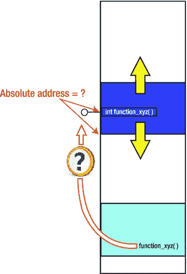
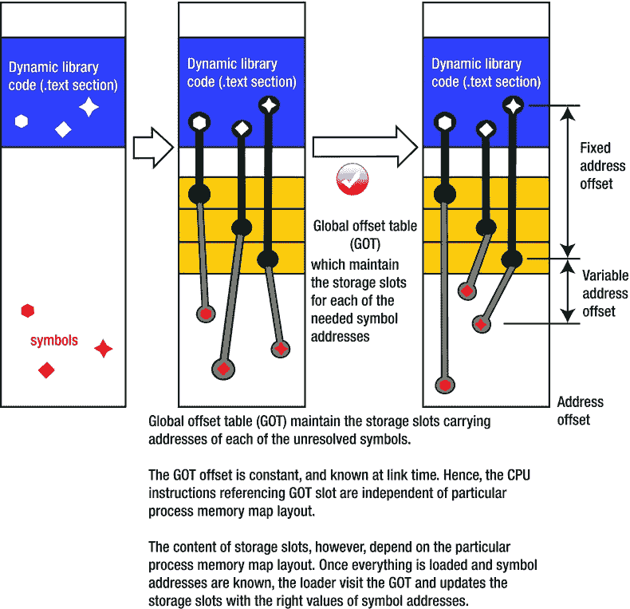
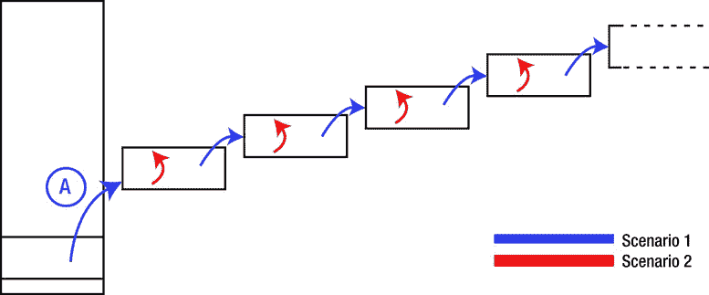

# 八、设计动态库：高级主题

Abstract

本章的目的是讨论动态链接过程的细节。这个过程中的一个关键因素是内存映射概念。基本上，它允许将已经加载到正在运行的进程的内存映射中的动态库映射到同时运行的另一个进程的内存映射中。

本章的目的是讨论动态链接过程的细节。这个过程中的一个关键因素是内存映射概念。基本上，它允许将已经加载到正在运行的进程的内存映射中的动态库映射到同时运行的另一个进程的内存映射中。

动态链接的重要规则是不同的进程共享动态库的代码段，但不共享数据段。期望加载动态库的每个进程提供其自己的数据副本，动态库代码在该数据上操作(即，库的数据段)。按照烹饪类比，几家餐馆的几个厨师可以同时使用同一本书的食谱(说明)。然而，很有可能不同的厨师会使用同一本书上的不同食谱。此外，根据同一本烹饪书的食谱准备的菜肴将提供给不同的顾客。显然，尽管厨师们阅读的是同一本食谱，但他们每个人都应该使用自己的一套餐具和厨房用具。否则，将是一个巨大的混乱。

尽管整个故事现在看起来既伟大又简单，但在这个过程中仍有几个技术问题需要解决。让我们仔细看看。

## 为什么解析内存地址是必须的

在深入研究动态链接实现设计过程中遇到的技术问题的细节之前，有必要重申一些简单的事实，这些事实植根于汇编语言和机器指令领域，最终决定了许多其他细节。

也就是说，某些指令组希望在运行时知道操作数在内存中的地址。一般来说，以下两组指令严格要求精确计算地址:

*   数据访问指令(`mov`等)。)需要内存中操作数的地址。例如，为了访问数据变量，X86 体系结构的 mov 汇编指令需要变量的绝对存储器地址，以便在存储器和 CPU 寄存器之间传输数据。

以下汇编指令序列用于递增存储在存储器中的变量:

`mov eax, ds:0xBFD10000 ; load the variable from address 0xBFD10000 to register eax`

`add eax, 0x1           ; increment the loaded value`

`mov ds:0xBFD10000, eax ; store the result back to the address 0xBFD10000`

*   子程序调用(`call`、`jmp`等)。)需要代码段中函数的地址。例如，为了调用一个函数，调用指令必须提供函数入口点的代码段内存地址。

下面的汇编指令序列执行实际的函数调用:

`call 0x0A120034 ; calling function whose entry point resides at address 0x0A120034`

这相当于

`push eip + 2    ; return address is current address + size of two instructions`

`jmp 0x0A120034  ; jumping to the address of my_function`

为了使事情变得简单一些，有些情况下仅仅是相对偏移起了作用。静态变量的地址以及局部范围的函数的入口点(在 C 编程语言的意义上，都是通过使用`static`关键字来声明的)可以通过仅知道相对于引用它们的指令的相对偏移量来解析。数据访问和/或子程序调用汇编指令都需要相对偏移量而不是绝对地址。然而，这并没有解决整个问题；这只是在一定程度上减少了它。

## 解析引用的一般问题

让我们考虑最简单的可能情况，其中可执行文件(应用程序)是加载单个动态库的客户端二进制文件。以下一组已知事实描述了工作场景:

*   可执行二进制代码提供了进程存储器映射蓝图的固定的、预定的部分。
*   一旦动态加载完成，动态库就成为该过程的一个合法部分。
*   通过可执行程序调用一个或多个由动态库实现并正确导出的函数，可执行程序和动态库之间的连接自然发生。

有趣的部分来了。

将库加载到进程内存映射中的过程从将库段的地址范围转换到新位置开始。一般来说，动态库将被加载的地址范围事先是不知道的。相反，它是由加载器模块的内部算法在加载时确定的。

在这种情况下，不确定性的程度仅仅因为可执行格式规定了动态库可以被加载的地址范围而稍微减少。然而，规定的允许地址范围相当宽，因为它被设计成容纳同时加载的许多动态库。这显然对猜测动态库最终将被加载到哪里没有太大帮助。

动态库加载期间发生的地址转换过程(如图 [8-1](#Fig1) 所示)是动态链接的关键问题，这使得整个概念相当复杂。

图 8-1。

Address translation inevitably happens as the loader tries to find a place for the dynamic library in the process memory map

地址转换到底出了什么问题？

地址转换本身不是问题。在前面的章节中，你已经看到，当链接器试图将目标文件拼接到进程内存映射中时，它通常会执行这个简单的操作。但是，由哪个模块执行地址转换非常重要。

更具体地说，链接器执行地址转换的场景与加载器执行相同操作的场景有很大的不同。

*   当执行地址转换时，链接器通常具有“干净的石板/未开垦的白雪”的情形。链接器在平铺过程中接受的对象文件都没有解析任何引用。这给了链接器很大的自由度，当它试图为目标文件找到正确的位置时，它可以灵活地处理它们。完成目标文件的初始放置后，链接器扫描未解析引用的列表，解析它们，并将正确的地址标记到汇编指令中。
*   另一方面，装载机在非常不同的环境下工作。它将动态库二进制文件作为输入，这个二进制文件已经通过了完整的构建过程，并且已经解析了所有的引用。换句话说，所有的汇编指令都标有正确的地址。

在链接器将绝对地址印入汇编指令的特殊情况下，由加载器执行的地址转换使得印入的地址完全没有意义。执行这种从根本上被破坏的指令最多只能给出虚假的结果，而且有可能非常危险。显然，在动态加载期间执行的地址转换属于“中国商店中的大象”范例的宽泛范畴。

总之，加载程序的地址转换是不可避免的，因为这是动态加载的固有思想。然而，它立即带来了一个非常严重的问题。幸运的是，尽管它无法避免，一些绕过它的方法已经成功实现。

### 哪些符号可能会受到地址转换的影响？

声明为 static 的函数和变量(在 C 语言中，只与它们所在的文件相关)没有危险，这几乎是显而易见的。事实上，由于只有附近的指令需要访问这些符号，所以所有的访问都可以通过提供相对地址偏移量来实现。

没有声明为静态的函数和变量是什么情况？

事实证明，没有被声明为 static 仍然不意味着这样的函数或变量将不可避免地遭受地址转换。

事实上，只有其符号由动态库导出的函数和变量肯定会受到地址转换的负面影响。事实上，当链接器知道某个符号被导出时，它通过绝对地址实现所有的访问。然后，地址转换使得这些指令不可用。

附录 A 中分析的代码示例说明了这一点，其中代码中有两个非静态变量，其中只有一个是由动态库导出的。如分析所示，导出变量是受动态加载地址转换影响的变量。

## 地址转换引起的问题

动态加载期间的地址转换有时会导致问题。幸运的是，这些可以被系统化为两个一般场景。

### 场景 1:客户端二进制文件需要知道动态库符号的地址

这是最基本的场景，当客户端二进制文件(可执行文件或动态库)指望加载的动态库的符号在运行时可用，但不知道最终地址是什么时，就会发生这种情况，如图 [8-2](#Fig2) 所示。

图 8-2。

Scenario 1: The client binary must resolve dynamic library symbols

如果您采用通常的方法，解析符号地址的任务传统上属于链接器(并且只属于链接器)，那么您就陷入了麻烦的境地。也就是说，链接器已经完成了构建客户端二进制文件和库的任务，库是动态加载的。

很快就变得非常明显，为了解决这种情况，需要应用某些“跳出框框”的思维。该解决方案将链接器解析符号的部分职责授予加载器。

在新的方案中，加载程序获取一些链接程序能力的新能力通常被实现为一个通常被称为动态链接程序的模块。

### 场景 2:加载的库不再知道它自己符号的地址

通常，动态库导出的 ABI 函数是库内部功能的封装良好的入口点。运行时发生的典型顺序是，客户端二进制文件通常调用一个 ABI 方法，该方法又调用库的内部函数，这些函数对客户端二进制文件没有特别的兴趣，因此不会被导出。

一种可能的不同场景(尽管不太常见)是动态库 ABI 函数在内部调用另一个 ABI 函数。

例如，让我们假设一个动态库拥有一个导出两个接口函数的模块:

*   `Initialize()`
*   `Uninitialize()`

这两个函数的内部执行流很可能采用库内部函数的调用顺序，用静态范围声明。调用内部方法通常由以相对地址为特征的汇编调用系列指令来执行。地址转换不会对调用功能的实现产生负面影响，如图 [8-3](#Fig3) 所示。

图 8-3。

Regardless of address translation, the calls to local functions (which may may be implemented as relative jumps) can be easily resolved

然而，库设计者完全有可能决定提供`Reinitialize()`接口函数。这个函数首先在内部调用`Uninitialize()`接口函数，紧接着调用`Initialize()`接口函数，这既不奇怪也不会错。

作为 ABI 接口函数，`Reinitialize()`函数的入口点必须属于动态库的输出符号集。引用此函数的跳转指令不能作为相对跳转来实现。相反，链接器必须将跳转/调用指令实现为到绝对地址的跳转。

显然，现在你有一个有趣的情况。在这种情况下，受损的一方不再仅仅是客户端二进制文件，还有加载的库。加载程序执行内存转换后，函数地址不再适用。链接器完美地印上绝对地址的汇编调用指令不仅没有意义，而且有潜在的危险，因为它们的跳转目标不再是原来计划的位置，如图 [8-4](#Fig4) 所示。

图 8-4。

Scenario 2: One ABI function internally calling another suffers from unresolved references problems. Both function entry points are designated for export, which urges the compiler to implement calls as absolute jumps. Resolving the absolute addresses is not possible until the loader completes the address translation

同样，ABI 函数面临的同样问题也存在于动态库的全局范围变量中。

## 链接程序-加载程序协调

人们很早就认识到，在动态链接场景中，链接器不能完全解决它通常在构建整体可执行文件时解决的所有问题。

在动态链接的初始阶段，加载程序将动态库的代码段加载到新的地址范围。即使链接器在构建动态库时合法地完成了解析引用的任务，这还远远不够；地址转换过程使得印在汇编调用指令中的绝对地址无效。

“地震”发生在链接程序竭尽所能之后，这一事实暗示着一定有“聪明人”在事后解决问题。“某个聪明人”被选为装卸工。

### 总体战略

知道了所有先前描述的约束，链接器和加载器之间的协作已经根据以下一组宽泛的准则建立:

*   链接器认识到自己的局限性。
*   链接器精确地估计损坏，准备修复损坏的指令，并将指令嵌入二进制文件。
*   加载程序严格遵循链接程序指令，并在地址转换完成后应用更正。

#### 链接器认识到自己的局限性

当创建一个动态库时，除了机智地找出谜题各部分之间的关系，链接器还必须足够聪明，以识别由于代码段加载到不同的地址范围而将会中断什么。

首先，动态库内存映射的代码地址范围是从零开始的，不像可执行文件，在可执行文件中，链接器处理更具体的非零地址范围。

第二，当认识到某些符号的地址在加载时间之前不能被解析时，链接器停止尝试；相反，它用临时值填充未解析的符号(通常是一些明显错误的值，如全零等)。

然而，这并不意味着链接器已经放弃了完成任务的追求。

#### 链接器精确地估计损坏，并准备修复它的指令

完全有可能对加载程序地址转换将使先前解析的引用无效的所有情况进行分类。每当汇编指令需要绝对地址时，就会发生这种情况。当完成构建动态库的链接阶段时，链接器可以识别这样的事件，并以某种方式让加载器知道它们。

为了提供对链接器-加载器协调的支持，二进制格式规范支持全新的部分，其目的仅仅是为链接器提供位置，以便为加载器留下如何修复由动态加载期间发生的地址转换所引起的损坏的指令。此外，还设计了一种特定的简单语法，以便链接器可以精确地向加载器指定要采取的操作过程。这种段在二进制文件中被称为重定位段，其中的`.rel.dyn`段是最老的。

一般来说，重定位指令是由链接器写入二进制文件的，以后由加载器读取。他们指定

*   在布局了整个进程的最终内存映射后，加载程序需要在这些地址应用一些补丁。
*   为了正确地修补未解析的地址，加载程序到底需要做什么。

#### 加载程序严格遵循链接器指令

最后一个阶段属于加载程序。它读入由链接器创建的动态库，读入加载程序段(每个加载程序段都带有各种链接器部分)，并将它们全部放在进程内存映射中，与属于原始可执行文件的代码放在一起。

最后，它找到`.rel.dyn`部分，读入链接器留下的指令，并根据这些指令执行对原始动态库的修补。当修补完成时，存储器映射准备好启动该过程。

显然，处理动态库加载的任务要求赋予加载程序比其基本任务所需更多的智能。

### 策略

一般来说，链接器和加载器之间的信息交换是通过链接器插入到二进制代码体中的特定的`.rel.dyn`部分进行的。唯一的问题是链接器将在哪个二进制文件中插入`.rel.dyn`部分？

答案很简单:是吱吱响的轮子得到了油。代码段需要修复的二进制文件通常会带有`.rel.dyn`段。

具体来说，在场景 1 中，链接器将`.rel.dyn`部分嵌入到客户端二进制文件(可执行文件或动态库，其指令因加载新的动态库而被“损坏”)，因为这是加载的库的地址转换导致问题的地方。图 [8-5](#Fig5) 说明了这个想法。

图 8-5。

In Scenario 1, the linker directives are embedded into the client binary file

然而，在场景 2 中，链接器将`.rel.dyn`部分嵌入到加载的库的二进制文件中，因为它需要帮助重建地址和指向它们的指令之间的一致性(图 [8-6](#Fig6) )。

图 8-6。

In Scenario 2, the linker directives are embedded into the dynamic library

在这个特殊的例子中，有一个最简单的场景，其中可执行文件加载一个动态库。更现实的情况是，一个动态库本身可以加载另一个动态库，而另一个动态库又可以加载另一个动态库，等等。位于动态加载链中间的任何动态库都可能扮演双重角色。场景 1 和场景 2 可能恰好适用于同一个二进制文件。

### 链接器指令概述

二进制格式规范通常详细规定了链接器和加载器之间通信的语法规则。加载器的链接器指令通常非常简单，但是非常精确并且切中要点(图 [8-7](#Fig7) )。因此，构建链接器指令所携带的信息并不需要花费大量的精力来实现和理解。

特别是，ELF 文件格式携带了链接器如何为加载器指定指令的详细定义。指令主要存储在`.rel.dyn`部分以及其他几个特殊部分(`rel.plt`、`got`、`got.plt`)。可以使用`readelf`或`objdump`等工具显示指令内容。图 [8-7](#Fig7) 显示了一些例子。

图 8-7。

Examples of linker directives

指令语法字段的解释如下:

*   Offset 指定汇编指令操作数的代码段字节偏移量，地址转换使其变得无意义，需要修复。
*   ELF 格式规范将信息描述为

`#define ELF32_R_SYM(i)  ((i)>>8)`

`#define ELF32_R_TYPE(i)  ((unsigned char)(i))`

`#define ELF32_R_INFO(s,t) (((s)<<8)+(unsigned char)(t))`

`#define ELF64_R_SYM(i)  ((i)>>32)`

`#define ELF64_R_TYPE(i)  ((i)&0xffffffffL)`

`#define ELF64_R_INFO(s,t) (((s)<<32)+((t)&0xffffffffL)`

在哪里

*   `ELFxx_R_SYM`表示必须进行重定位的符号表索引:

二进制文件的一个部分带有符号列表。该值仅表示代表该特定符号的符号表项目的索引。`readelf`和`objdump`可以提供包含在二进制符号表中的完整符号列表。

*   `Sym.Value`指定代码段(函数的情况下)或数据段(变量的情况下)中符号当前驻留在原始二进制文件中的暂定临时偏移量。假设地址转换会影响这些值。
*   `Sym.Name`指定人类可读的符号名(函数名、变量名)

图 8-8。

Overview of linker directive types (from ELF format specification)

*   `ELFxx_R_TYPE`表示要应用的重新定位类型。下面显示了可用重定位类型的详细描述。
*   Type 指定加载程序需要对汇编指令操作数执行的动作类型，以便修复由地址转换引起的问题。图 [8-8](#Fig8) 所示的 ELF 二进制格式(ELF 规范的图 1-22)规定了以下重定位类型。

## 链接器-加载器协调实现技术

在动态链接概念的发展过程中，使用了两种实现技术:加载时间重定位(LTR)和位置独立代码(PIC)。

### 加载时间重定位(LTR)

按时间顺序，动态链接概念的第一次实现是以所谓的加载时间重定位的形式出现的。概括地说，这种技术是第一种真正有效的动态加载技术。它的直接好处是能够将应用程序二进制文件从携带不必要的“行李”(处理特定于操作系统的日常事务的代码)的需要中解放出来。

LTR 概念带来的直接好处是，不仅应用程序二进制文件的字节大小变得非常小，而且某些特定于操作系统的任务的执行方式在各种应用程序之间变得统一。

尽管这个概念带来了明显的好处，但它也有几个主要的缺点。首先，这种技术用变量和函数的地址的文字值修改(修补)动态库代码，只有在首先加载它的应用程序的上下文中才有意义。在任何其他应用程序(很可能以不同进程的内存映射布局为特征)的上下文中，代码修改很可能是无用的、无意义的，甚至是不适用的。

因此，如果几个应用程序同时需要一个动态库的服务，这就意味着您将在内存中拥有同样多的动态库副本。

第二个缺点是需要大量的代码修改。有了这种技术，加载程序需要修改/修补代码中引用某个变量或调用某个函数的地方。在应用程序加载大量动态库的情况下，加载时间会在应用程序启动期间增长到显著的初始延迟。

第三个缺点是可写代码(。text)段构成了潜在的安全威胁。

有了这种技术，只将动态库加载到物理内存一次，并将其映射到大量不同应用程序的内存映射不同地址的梦想就无法实现了。

图 [8-9](#Fig9) 说明了加载时间重定位概念背后的想法。

图 8-9。

LTR concept and its limitations

所有的缺点都被较新的、在许多方面更优越的位置独立码(PIC)方法的设计所解决，该方法很快成为链接技术的普遍选择。

### 位置无关码

加载时间重定位方案的局限性已在动态链接的下一个实现中解决，该技术被称为位置独立代码(图 [8-10](#Fig10) )。通过采取额外的间接步骤，避免了对动态库代码段指令的不必要的直接修改。用编程语言的行话来说，这种方法可以描述为使用指针到指针而不是指针。

基本上，符号地址分两步提供给需要的指令。为了得到符号地址，首先一个`mov`指令访问地址的地址位置，并将其内容(一个需要的符号地址)加载到一个可用的 CPU 寄存器中。紧接着，现在存储在寄存器中的检索到的符号地址可以用作后续指令中的操作数(`mov`用于数据，`call`用于函数调用)。

图 8-10。

PIC concept

该解决方案的特殊之处在于，符号地址保存在一个所谓的全局偏移表(GOT)中，链接器为该表保留了一个专用的`.got`部分。`.text`段和`.got`段之间的距离是恒定的，并且在链接时是已知的。对于需要被解析的每个符号，全局偏移表在从表开始的已知且固定的偏移处维护一个专用槽。

给定固定的 get 距离和固定的 slot 偏移量(两者在链接时都是已知的)，编译器就有可能实现代码指令来引用固定的位置。最重要的是，实现的代码不依赖于实际的符号地址，并且可以在不做任何修改的情况下直接映射到大量其他进程中使用。

对特定存储器映射布局特性的最终调整由加载程序完成。然而，在该方案中，加载程序不会不可逆地修改代码(`.text`部分)。相反，一旦知道了符号地址，加载程序就修补`.got`部分，它(很像数据部分)总是在每个进程中实现。

Note

为了实现这个方案，需要大量的设计工作，这超出了链接器-加载器的界限。事实上，为了实现 PIC 概念，故事必须从编译器级别开始。特别是，`–fPIC`标志必须传递给编译器。“fPIC”或简称“PIC”助记符最终成为动态链接的同义词。

#### 惰性绑定

PIC 方法中的符号引用通过额外的间接层，这一事实为在运行时实现额外的性能优势提供了可能性。实现额外性能提升的策略基于这样一个事实，即在程序启动之前，加载程序不会浪费宝贵的时间来设置`.got`和`.got.plt`部分的内容。

引用这些符号的汇编指令无论如何都被设置为指向中间点，并且代码的整体形状没有什么可怕的错误会阻止程序加载。

事实上，除非绝对必要，否则加载程序通常甚至懒得完成设置`.got`和`.got.plt`部分的内容。这样的时刻发生在程序已经启动之后，并且只有当执行流程到达引用了其地址保存在`.got`和`.got.plt`段中的符号的指令时。

加载程序的拖延(通常称为惰性绑定)的明显好处是加载过程完成得更快，这使得应用程序启动得更快。当加载程序快速弥补其最初的(尽管是有预谋的)疏忽时，会出现一个小的一次性性能损失。这种情况只在需要时发生，并且只在第一次出现符号引用时发生一次。运行时实际引用的动态库符号越少，加载程序能够实现的性能节省就越多。

惰性绑定概念是 PIC 方法的一个额外特性，这显然为开发人员选择 PIC 而不是 LTR 实现增加了另一个很好的理由。事实上，当客户机二进制文件是可执行文件(即应用程序)时，PIC 方法是场景 1 类型问题的一种最受欢迎的实现。

#### 动态链接递归链的规则和限制

到目前为止，您详细研究的场景属于最简单的动态链接场景。在仔细研究了原子级别之后，现在让我们稍微后退一步，看看动态链接的分子级别，因为它具有某些规则和限制，这些规则和限制在故事的原子级别上并不明显。

实际上，一个典型程序的结构可以被描述为动态链接的递归链，其中链中的每个动态库加载几个其他的动态库。从视觉上看，加载的递归链可以表示为一个复杂的树形结构，在分支之间有大量的边连接。在某些情况下，单个分支的长度最终可能会非常大。尽管动态链接的递归链可能很复杂，其分支的长度可能令人印象深刻，但这些并不是整个故事中最有力的细节。

更重要的是，在动态加载链中，每个参与的动态库可能会发现自己同时扮演场景 1 和场景 2 的角色。图 [8-11](#Fig11) 说明了这一点。

换句话说，加载链中的动态库可能既需要解析它加载的库的引用，也需要重新解析它自己的符号的引用。这使得整个故事更有趣了。

图 8-11。

A branch of typical recursive chain of dynamic linking

驻留在这个分子级别的一组强烈的实现偏好规定了实现细节，我将在下一节简要回顾这些细节。

#### 强烈的实施偏好

不管是哪种情况，总是有两种方法可以实现链接器-加载器的协调:可以应用 LTR 或 PIC 方法。链接器-加载器协调技术的选择不是绝对自由的。除了设计人员根据每种技术的优缺点进行选择之外，还有一些其他限制需要明确指出:

*   位置独立代码(PIC)是可执行程序解析第一级加载库引用的首选技术(图 [8-11](#Fig11) 中用圆圈字母 A 标记的场景)。

就在 LTR 或 PIC 之间进行选择而言，加载链中的动态库可能具有多种组合。实现 LTR 的动态库可以依次动态加载下一个实现 PIC 的动态库，后者可以依次动态加载实现…您选择的库—无论您的选择是什么，都是允许的。

*   单个动态库严格利用链接器-加载器协调技术之一来解决场景 1 和场景 2(如果需要的话)。同一个动态库不可能通过 LRT 方法解决场景 1 的问题，通过 PIC 方法解决场景 2 的问题(反之亦然)。

图 [8-12](#Fig12) 说明了所描述的规则。

图 8-12。

Strong implementation preferences (at the molecular level) governing the implementation of the recursive chain of dynamic linking