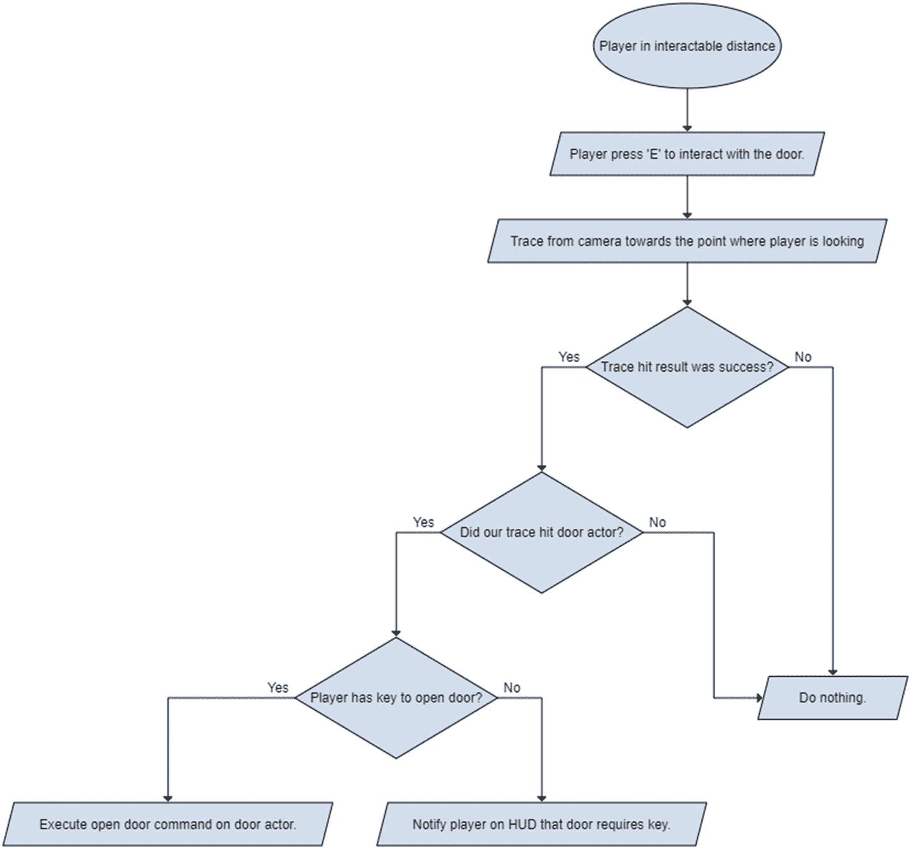
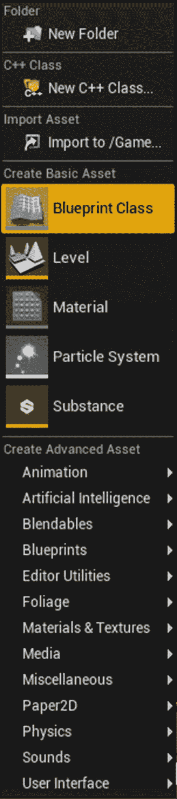
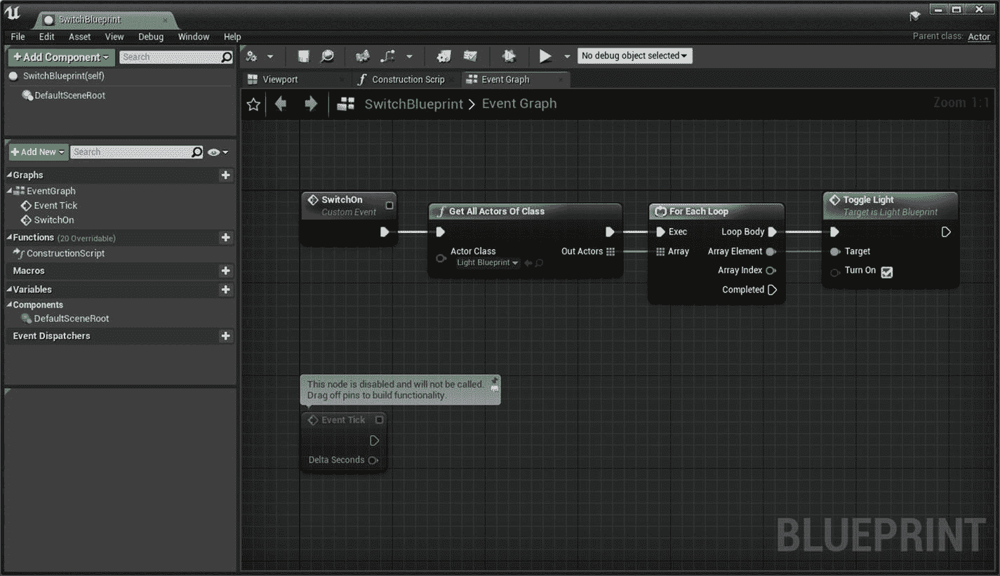
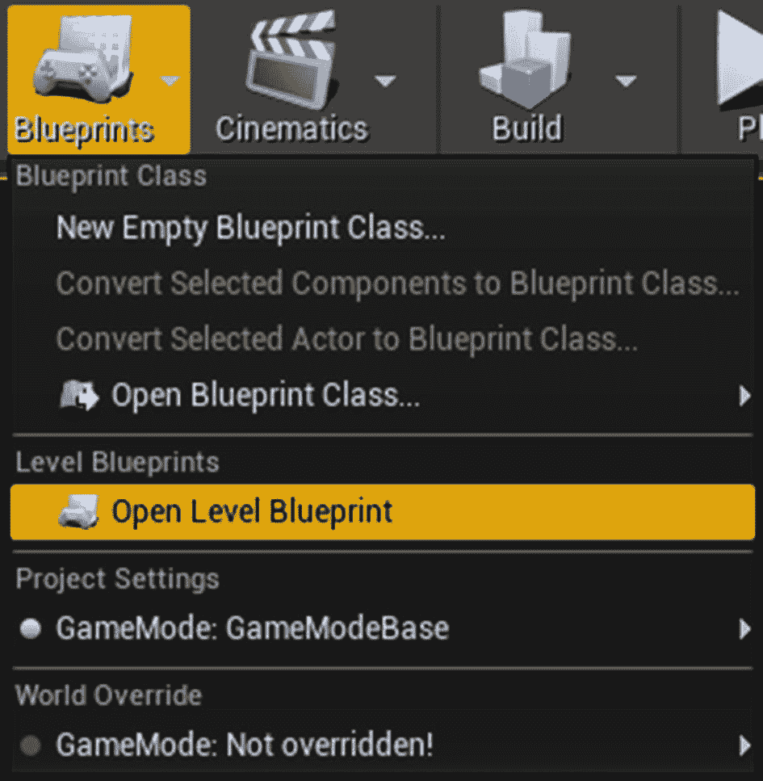
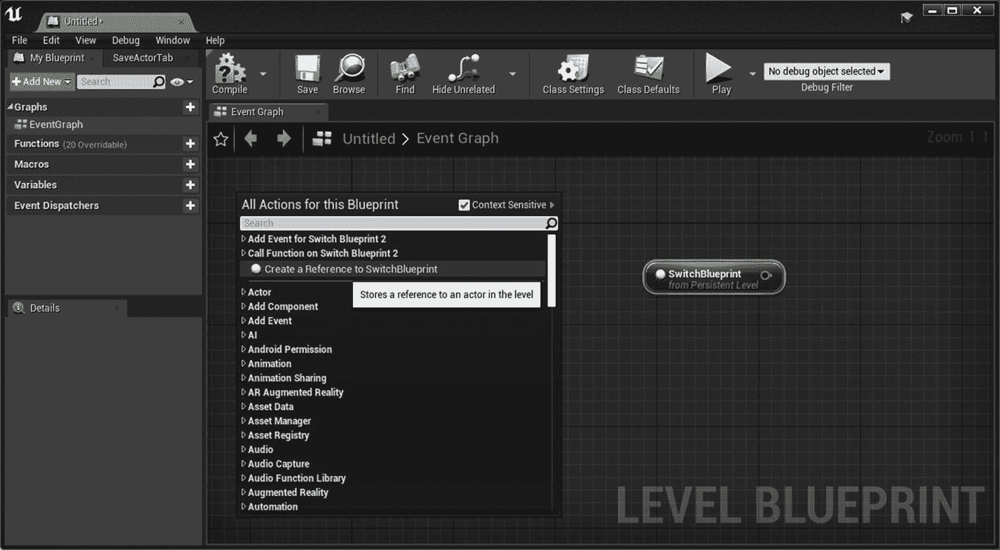
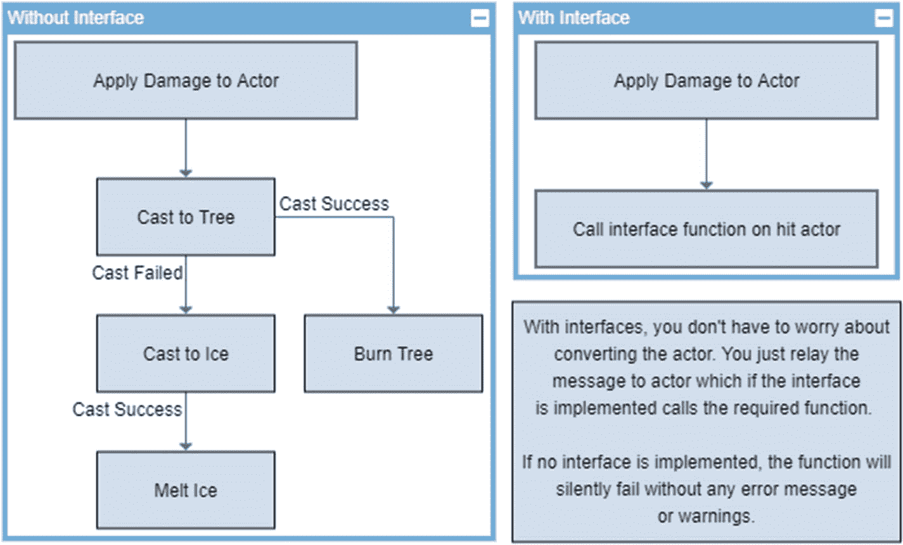
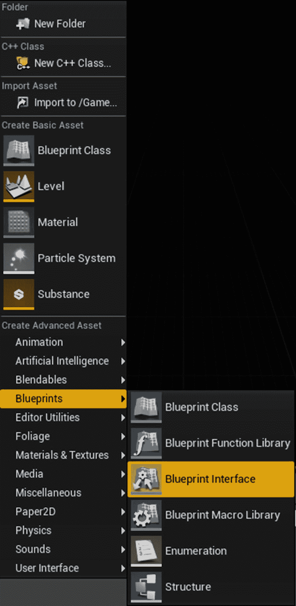
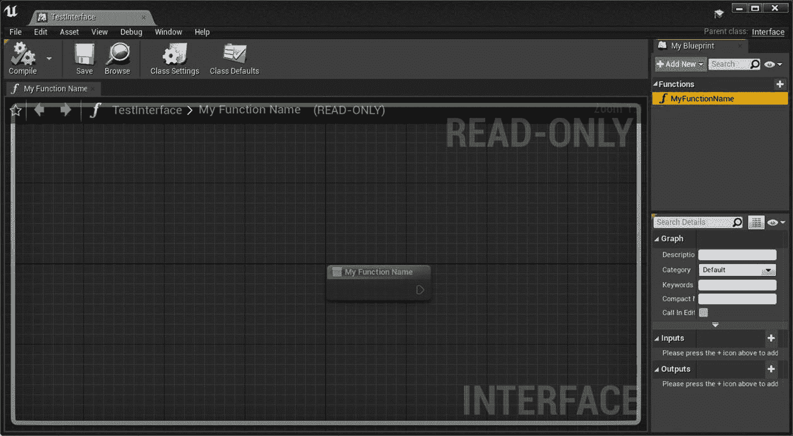
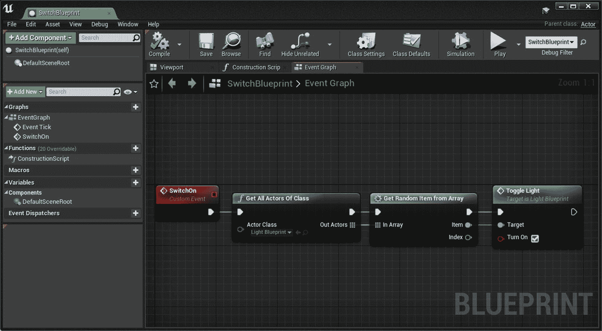
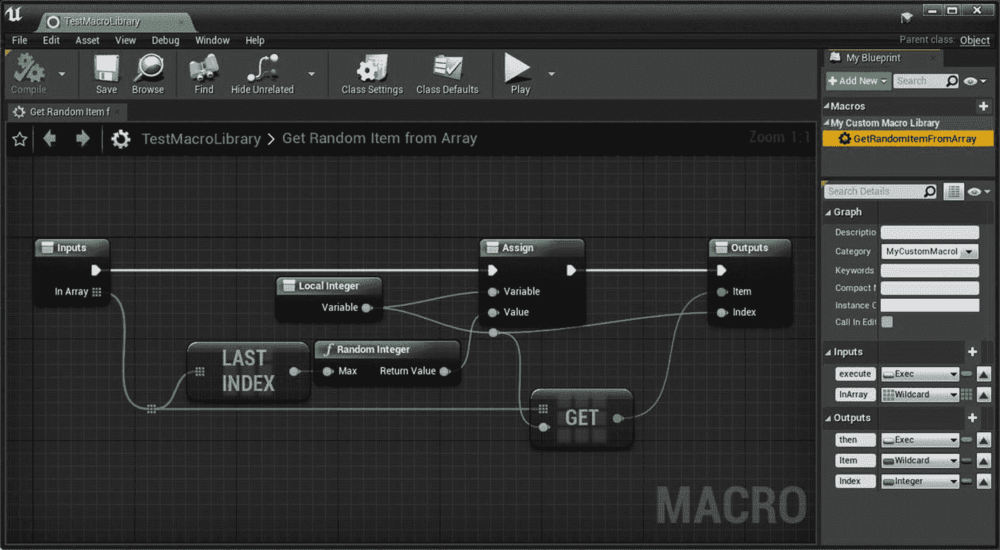

# 2.蓝图介绍

UE4 Blueprints 是一种基于节点图的可视化游戏脚本语言，在节点图中，从左到右连接节点。它可以创建成熟的游戏或简单/复杂的游戏机制，例如那些打开关卡范围谜题之门的游戏。蓝图的最大优势是你不需要程序员来创建逻辑。艺术家可以轻松地在蓝图中制作任何他们想要的东西，并与程序员分享。

这个系统非常强大，因为它为艺术家提供了通常只有程序员才能使用的全套工具。最重要的是，C++程序员可以创建基线系统，Blueprint 用户可以访问或修改这些系统。

## 节点

在 Blueprints(或任何其他可视化编程语言)中，节点是一个独立的功能，做一些独特的事情。在 Unreal Engine 中，蓝图节点可以是任何对象—事件、流控制操作、函数、变量等等。节点的源代码可大可小。在虚幻引擎 4 中，开发人员可以使用 C++制作一个蓝图节点，该节点可在图形编辑器面板中访问。

图 [2-1](#Fig1) 显示了在节点编辑器中打开需要钥匙的门的逻辑。

图 2-1

节点的一个例子

## 蓝图类型

蓝图有多种类型，您需要了解这些类型才能有效地使用它们。所有蓝图类型(级别除外)都是在内容浏览器中创建的。

### 蓝图类

Blueprint 类是游戏中最常用的类型，因为它自包含游戏机制，并且很容易在多个级别中重用。Blueprint 类继承自本机 C++类，可以拥有它们的功能。

您可以创建自己的 C++类并将它们标记为 *Blueprintable* 来创建蓝图类。他们可以彼此互动，创造有趣的游戏机制；例如，灯蓝图和开关蓝图进行通信以打开或关闭灯。您还可以让开关与多个灯相互作用，以随机或按顺序打开/关闭它们。

要创建蓝图类，右键单击内容浏览器，在“创建基本资产”下，选择蓝图类，如图 [2-2](#Fig2) 所示。

图 2-2

选择蓝图类

图 [2-3](#Fig3) 显示了一个带有事件的示例图，当该事件被触发时，会列出世界上存在的所有参与者(获取类节点的所有参与者)，逐个遍历每个参与者(For Each Loop 节点)，并为每个参与者调用切换灯光功能。

图 2-3

带有自定义事件的 Blueprint 类示例

### 水平蓝图

级别蓝图不能手动创建，但包含在级别本身中。该选项在载入标高时可用。你可以引用世界上的任何资产并与之交互。如果您在级别蓝图中引用一个蓝图类，您可以访问该类中的所有公共变量和函数。

Note

从类外部访问公共变量或函数。

使用关卡蓝图的好处是更容易访问关卡上的角色，因为你可以直接引用他们而不用强制转换。这在创建应该隔离到该级别的事件或函数时非常有用。一个例子是当满足特定条件时触发电影。

图 [2-4](#Fig4) 展示了如何打开关卡蓝图。

图 2-4

从编辑器工具栏访问级别蓝图

在关卡蓝图中，您可以通过选择并右键单击来引用任何资产(参见图 [2-5](#Fig5) )。

图 2-5

参考资产

### 蓝图界面

蓝图接口是一种特殊类型的蓝图，在其中您只能创建带有输入和输出参数和变量的函数。让我们快速检查一下这些术语。

*   **功能**是具有单个输入引脚和单个输出引脚的图形。在内部，您可以连接构成逻辑的任意数量的节点，以便在调用函数时，它从入口引脚开始，激活所有连接的节点，并通过输出引脚退出。接口不能包含任何函数实现，这意味着你只能创建一个没有任何逻辑的函数(图形是只读的)，不能创建变量。

*   **变量**是节点，保存一个值或对世界上一个对象或角色的引用。

接口可以被添加到多个其他蓝图中，并且它们保证包含在接口中创建的功能，然后这些功能可以被实现。这允许多个蓝图共享一个公共接口；例如，想象你有两个完全不同的蓝图，比如树和冰。你可以有一个包含伤害函数的接口，并在树和冰中实现这个接口。在树和冰蓝图里面，你可以实现伤害功能，让树燃烧，冰融化。如果没有接口，那么你必须把击中的演员转换成每种类型的演员，并调用破坏函数。

图 [2-6](#Fig6) 是一个示例图，显示了有接口和没有接口之间的区别。

图 2-6

接口与无接口的比较

要创建蓝图接口，右键单击内容浏览器，并在创建高级资产下，从蓝图子部分中选择蓝图接口(参见图 [2-7](#Fig7) )。

图 2-7

创建蓝图界面

图 [2-8](#Fig8) 显示了创建后的界面。

图 2-8

蓝图界面示例

### 蓝图宏库

蓝图宏库是一个蓝图容器，由作为节点放置在其他蓝图中的图形集合组成。您不能在宏库中编译图形，因为它是一个容器。只有当包含宏的蓝图被重新编译时，对宏图的任何更改才会被反映出来(见图 [2-9](#Fig9) 和 [2-10](#Fig10) )。

图 2-10

如何在蓝图中使用宏的示例

图 2-9

从数组中获取随机项的示例宏，数组是元素的列表或集合

第[章 3](3.html) 讲解如何结合 C++和 Blueprints。您可以创建自己的类和基于蓝图的类。此外，您可以在 C++中声明可以在 Blueprint 中访问的变量和函数。