# 五、同步：为什么以及如何避免同步

让我们先强调这一点:如果您不需要使用本章中描述的同步特性，那就更好了。在这里，我们讨论同步机制和实现互斥的替代方案。“同步”和“排除”对于关心性能的并行程序员来说，应该有相当负面的内涵。这些是我们想要避免的操作，因为它们耗费时间，并且在某些情况下，耗费处理器资源和能量。如果我们可以重新思考我们的数据结构和算法，使其既不需要同步也不需要互斥，这是非常好的！不幸的是，在许多情况下，避免同步操作是不可能的，如果这是你今天的情况，请继续阅读！我们从这一章中得到的另外一个信息是，仔细地重新思考我们的算法通常可以得到一个不滥用同步的更干净的实现。我们通过并行化一个简单的代码来说明这种重新思考算法的过程，首先采用一种天真的方法，即求助于互斥体，将其发展为利用原子操作，然后通过私有化和简化技术进一步减少线程之间的同步。在后者中，我们展示了如何利用线程本地存储(TLS)来避免高度竞争的互斥开销。在本章中，我们假设您在某种程度上熟悉“锁”、“共享可变状态”、“互斥”、“线程安全”、“数据竞争”以及其他与同步相关的问题。如果没有，在本书的序言中会有一个温和的介绍。

## 一个运行的例子:图像的直方图

让我们从一个简单的例子开始，这个例子可以用不同种类的互斥(mutex)对象、原子或者甚至通过完全避免大多数同步操作来实现。我们将描述所有这些可能的实现及其优缺点，并使用它们来说明互斥、锁、原子变量和线程本地存储的使用。

有不同种类的直方图，但图像直方图可能是使用最广泛的，尤其是在图像和视频设备以及图像处理工具中。例如，在几乎所有的照片编辑应用程序中，我们可以很容易地找到一个调色板来显示我们任何一张照片的直方图，如图 [5-1](#Fig1) 所示。

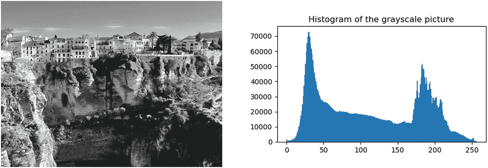

图 5-1。

灰度图片(Ronda，Málaga)及其相应的图像直方图

为了简单起见，我们将假设灰度图像。在这种情况下，直方图用每个可能的亮度值(x 轴)表示像素数(y 轴)。如果图像像素被表示为字节，那么只有 256 个色调或亮度值是可能的，0 是最暗的色调，255 是最亮的色调。在图 [5-1](#Fig1) 中，我们可以看到图片中最常见的色调是暗色调:在 5 兆像素中，超过 7 万个具有色调 30，正如我们在 x=30 附近的尖峰处看到的。摄影师和图像专业人员依靠直方图来帮助快速查看像素色调分布，并识别图像信息是否隐藏在图片的任何黑色或饱和区域。

在图 [5-2](#Fig2) 中，我们展示了 4×4 图像的直方图计算，其中像素只能有从 0 到 7 的八种不同色调。二维图像通常被表示为一维向量，其按照行主顺序存储 16 个像素。因为只有八个不同的音调，所以直方图只需要八个元素，索引从 0 到 7。直方图矢量的元素有时被称为“面元”,我们在其中“分类”,然后对每个色调的像素进行计数。图 [5-2](#Fig2) 显示了与特定图像相对应的直方图`hist`。我们看到存储在一号箱中的“4”是用色调 1 对图像中的四个像素进行计数的结果。因此，在遍历图像时更新面元值的基本操作是`hist[<tone>]++`。


图 5-2。

从具有 16 个像素的图像计算直方图 hist(图像的每个值对应于像素色调)

从算法的角度来看，直方图被表示为一个整数数组，其中有足够的元素来说明所有可能的色调级别。假设图像是字节数组，现在有 256 种可能的音调；因此，直方图需要 256 个元素或仓。图 [5-3](#Fig3) 显示了计算此类图像直方图的顺序代码。


图 5-3。

带有图像直方图计算的顺序实现的代码清单。相关陈述在方框中突出显示。

如果您已经理解了前面代码清单中的所有内容，那么您可能希望跳过本节的其余部分。这段代码首先声明大小为`n`的向量`image`(比如说一百万个百万像素的图像)，在初始化随机数生成器之后，它用类型为`uint8_t`的范围【0，255】内的随机数填充图像向量。为此，我们使用一个`Mersenne_twister_engine`、`mte`，它生成均匀分布在`[0, num_bins)`范围内的随机数，并将它们插入到`image`向量中。接下来，用`num_bins`位置构造`hist`向量(默认情况下初始化为零)。注意，我们声明了一个空向量`image`，我们后来为它保留了`n`整数，而不是构造`image(n)`。这样我们就避免了先遍历向量用零初始化，然后再插入随机数。

实际的直方图计算可以使用更传统的方法用 C 编写:

```cpp

for (int i = 0; i < N; ++i) hist[image[i]]++;

```

其在直方图矢量的每个仓中计数每个色调值的像素数量。然而，在图 [5-3](#Fig3) 的例子中，我们想向你展示一个 C++ 的替代方案，它使用 STL `for_each`算法，对 C++ 程序员来说可能更自然。使用`for_each` STL 方法，图像向量的每个实际元素(类型为`uint8_t`的色调)被传递给 lambda 表达式，该表达式增加与色调相关的 bin。为了方便起见，我们依靠`tbb::tick_count`类来计算直方图计算中所需的秒数。成员函数`now`和`seconds`是不言自明的，所以我们在这里不包括进一步的解释。

## 不安全的并行实现

第一次尝试将直方图计算并行化是使用图 [5-4](#Fig4) 所示的`tbb:` `:parallel_for`。


图 5-4。

代码清单用**并行实现图像直方图计算**

 **为了能够比较图 [5-3](#Fig3) 的顺序执行产生的直方图和并行执行的结果，我们声明一个新的直方图向量`hist_p`。接下来，这里疯狂的想法是并行遍历所有像素…为什么不呢？不是独立像素吗？为此，我们依靠第 [2](02.html#b978-1-4842-4398-5_2) 章中提到的`parallel_for`模板，让不同的线程遍历迭代空间的不同块，从而读取图像的不同块。然而，这是行不通的:图 [5-4](#Fig4) 最后的向量`hist`和`hist_p`(是的，`hist!=hist_p`在 C++ 中做对了)`,`的比较，揭示了这两个向量是不同的:

```cpp

   c++ -std=c++11 -O2 -o fig_5_4 fig_5_4.cpp -ltbb
   ./fig_5_4
   Serial: 0.606273, Parallel: 6.71982, Speed-up: 0.0902216
   Parallel computation failed!!

```

问题出现了，因为在并行实现中，不同的线程可能同时增加相同的共享 bin。换句话说，我们的代码不是线程安全的(或不安全的)。更正式的说法是，我们的并行不安全代码表现出“未定义的行为”，这也意味着我们的代码是不正确的。在图 [5-5](#Fig5) 中，我们假设有两个线程 A 和 B 在内核 0 和 1 上运行，每个线程处理一半的像素。由于分配给线程 A 的图像块中有一个亮度为 1 的像素，它将执行`hist_p[1]++`。线程 B 也读取一个亮度相同的像素，也会执行`hist_p[1]++`。如果两个增量在时间上一致，一个在内核 0 上执行，另一个在内核 1 上执行，那么我们很可能会错过一个增量。


图 5-5。

共享直方图向量的不安全并行更新

这是因为递增操作不是原子的(或不可分的)，相反，它通常由三个汇编级操作组成:将变量从内存加载到寄存器，递增寄存器，并将寄存器存储回内存。 <sup>[1](#Fn1)</sup> 用一个更正式的行话来说，这种操作被称为读-修改-写或 RMW 操作。对一个共享变量进行并发写入在形式上被称为共享可变状态。在图 [5-6](#Fig6) 中，我们展示了对应于 C++ 指令`hist_p[1]++`的一个可能的机器指令序列。

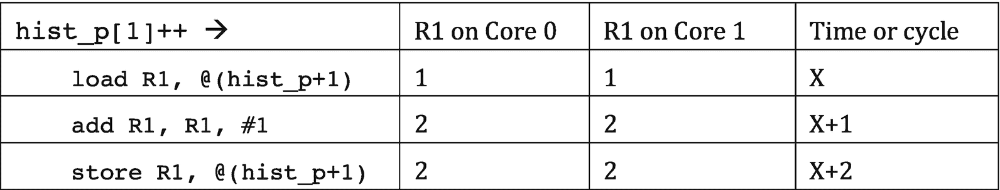

图 5-6。

共享变量或共享可变状态的不安全更新

如果在执行这两个增量时，我们已经发现一个具有亮度`1, hist_p[1]`的先前像素包含值 1。该值可以由两个线程读取并存储在私有寄存器中，这将最终在该 bin 中写入两个而不是三个，这是到目前为止已经遇到的亮度为 1 的像素的正确数量。这个例子在某种程度上过于简单，没有考虑缓存和缓存一致性，但是可以帮助我们说明数据竞争问题。前言中有一个更详细的例子(见图 P-15 和 P-16)。

我们可能会认为这一系列不幸的事件不太可能发生，或者即使发生了，在运行并行版本的算法时，略有不同的结果也是可以接受的。奖励不是更快的执行吗？不完全是这样:正如我们在上一页看到的，我们的不安全并行实现比顺序实现慢 10 倍左右(在四核处理器上运行四个线程，并且`n`等于 10 亿像素)。罪魁祸首是前言中介绍的缓存一致性协议(参见前言中的“缓存的局部性和报复”一节)。在串行执行中，直方图向量可能会完全缓存在运行代码的内核的 L1 缓存中。因为有一百万个像素，所以直方图向量中会有一百万个增量，其中大部分以缓存速度提供。

### 注意

在大多数英特尔处理器上，一条高速缓存线可以容纳 16 个整数(64 字节)。如果向量充分对齐，具有 256 个整数的直方图向量将只需要 16 个高速缓存行。因此，在 16 次缓存未命中之后(或者如果使用预取，则更少)，所有直方图仓都被缓存，并且每个仓都仅在大约三个周期内被访问(这是非常快的速度！)在串行实现中(假设有足够大的 L1 高速缓存，并且直方图高速缓存行从不被其他数据驱逐)。

另一方面，在并行实现中，所有线程将争用每个内核私有缓存中的缓存箱，但是当一个线程在一个内核的一个缓存箱中写入时，缓存一致性协议会使适合所有其他内核中相应缓存行的 16 个缓存箱无效。这种无效导致对无效的高速缓存行的后续访问花费比非常期望的 L1 访问时间多一个数量级的时间。这种乒乓相互无效的净效应是并行实现的线程最终增加未缓存的容器，而串行实现的单个线程几乎总是增加缓存的容器。再次记住，一百万像素的图像需要一百万个直方图矢量增量，所以我们希望创建一个尽可能快的增量实现。在直方图计算的这种并行实现中，我们发现了假共享(例如，当线程 A 递增`hist_p[0]`而线程 B 递增`hist_p[15]`时，因为两个库都在同一高速缓存行中)和真共享(当线程 A 和 B 都递增`hist_p[i])`)。我们将在随后的章节中讨论真假共享。

## 第一个安全的并行实现:粗粒度锁定

让我们首先解决并行访问共享数据结构的问题。我们需要一种机制，当一个不同的线程已经在写入同一个变量时，它可以防止其他线程读取和写入共享变量。用更通俗的话来说，我们想要一个单独的人可以进入的试衣间，看看衣服如何合身，然后离开试衣间，等待下一个排队的人。图 [5-7](#Fig7) 显示试衣间上的一扇关闭的门排斥其他人。在并行编程中，试衣间的门被称为互斥体，当一个人进入试衣间时，他通过关门和锁门来获取并持有互斥体的锁，当这个人离开时，他们通过让门打开和解锁来释放锁。用更正式的术语来说，互斥体是一个用于在受保护的代码区域的执行中提供互斥的对象。这个需要互斥保护的代码区域通常被称为“关键部分”试衣间的例子也说明了竞争的概念，一种资源(试衣间)同时被多人使用的状态，如图 [5-7(c)](#Fig7) 所示。由于试衣间一次只能由一个人使用，所以试衣间的使用是“连续的”类似地，受互斥保护的任何东西都会降低程序的性能，首先是因为管理互斥对象带来的额外开销，其次也是更重要的是因为它会引发争用和序列化。我们希望尽可能减少同步的一个关键原因是避免争用和串行化，这反过来限制了并行程序的可伸缩性。

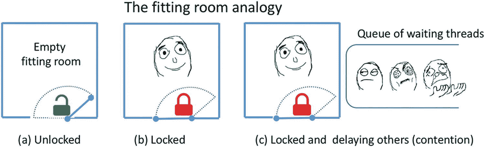

图 5-7。

关上试衣间的门会将其他人拒之门外

在这一节中，我们将重点介绍 TBB 互斥类和相关的同步机制。虽然 TBB 早于 C++11，但值得注意的是 C++11 确实标准化了对互斥类的支持，尽管它不像 TBB 库中的那些那样可定制。在 TBB，最简单的互斥体是在包含了`tbb/spin_mutex.h`或包罗万象的`tbb.h`头文件之后可以使用的`spin_mutex`。有了这个新工具，我们可以实现图像直方图计算的安全并行版本，如图 [5-8](#Fig8) 所示。

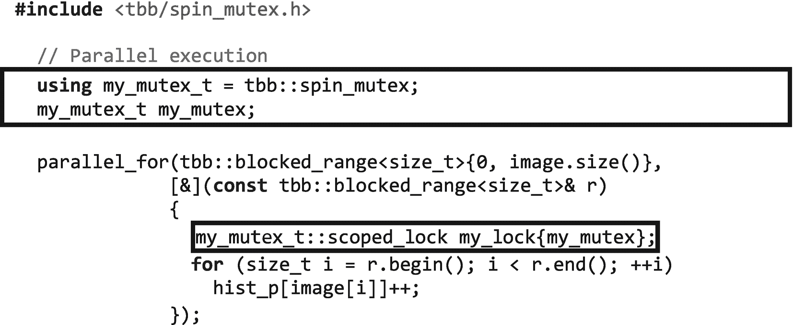

图 5-8。

使用粗粒度锁定的图像直方图计算的第一个安全并行实现的代码清单

在`my_mutex`上获得锁的对象`my_lock`，当它被创建时，自动解锁(或释放)对象析构函数中的锁，当离开对象范围时调用这个析构函数。因此，建议用额外的大括号`{}`将受保护的区域括起来，以保持锁的生存期尽可能短，以便其他等待的线程可以尽快轮到它们。

### 注意

如果在图 [5-8](#Fig8) 的代码中，我们忘记给锁对象命名，例如:

`// was my_lock{my_mutex} my_mutex_t::scoped_lock {my_mutex};`

代码编译时没有警告，但是`scoped_lock`的范围在分号处结束。没有对象的名字(`my_lock`)，我们正在构造一个`scoped_lock`类的匿名/未命名对象，它的生命周期在分号处结束，因为没有一个命名对象比定义更长。这是没有用的，临界区是*不是*互斥保护。

图 [5-9](#Fig9) 中给出了一个更明确但**不推荐**的替代方案，即编写图 [5-8](#Fig8) 的代码。


图 5-9

一种不鼓励的获取互斥锁的方法

C++ 专家们更喜欢图 [5-8](#Fig8) 中的另一种方案，即所谓的“资源获取即初始化”，RAII，因为它让我们不必记得释放锁。更重要的是，使用 RAII 版本，锁对象析构函数(锁在这里被释放)也会在出现异常的情况下被调用，这样我们就可以避免由于异常而获得锁。如果在图 [5-9](#Fig9) 的版本中，在调用`my_lock.release()`成员函数之前抛出了一个异常，那么无论如何锁也会被释放，因为析构函数被调用，在那里锁被释放。如果一个锁离开了它的作用域，但是之前已经用`release()`成员函数释放了，那么析构函数什么也不做。

回到我们的代码图 [5-8](#Fig8) ，你可能想知道，“但是等等，我们不是用粗粒度锁序列化了并行代码吗？”是的，你是对的！正如我们在图 [5-10](#Fig10) 中看到的，每个想要处理其图像块的线程首先试图获取互斥锁，但只有一个会成功，其余的会不耐烦地等待锁被释放。直到持有锁的线程释放它，不同的线程才能执行受保护的代码。因此，`parallel_for`最终被串行执行！好消息是，现在直方图柱没有并发增量，结果最终是正确的。耶！

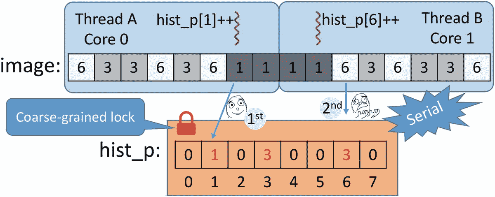

图 5-10

线程 A 持有粗粒度锁以增加库号 1，而线程 B 等待，因为整个直方图向量被锁定

实际上，如果我们编译并运行我们的新版本，我们得到的是比顺序执行稍微慢一点的并行执行:

```cpp

   c++ -std=c++11 -O2 -o fig_5_8 fig_5_8.cpp -ltbb
   ./fig_5_8
   Serial: 0.61068, Parallel: 0.611667, Speed-up: 0.99838

```

这种方法被称为粗粒度锁定，因为我们保护的是粗粒度数据结构(实际上是整个数据结构——在本例中是直方图向量)。我们可以将向量划分成几个部分，并用它自己的锁来保护每个部分。这样，我们将增加并发级别(访问不同部分的不同线程可以并行进行)，但是我们将增加代码的复杂性和每个互斥对象所需的内存。

有一句话要提醒你！图 [5-11](#Fig11) 展示了并行编程新手的一个常见错误。


图 5-11

并行编程新手常犯的错误

这段代码编译时既没有错误也没有警告，那么它有什么问题呢？回到试衣间的例子，我们的目的是避免几个人同时进入试衣间。前面的代码中，`my_mutex`被定义在并行段内部，每个任务会有一个互斥对象，每个都锁定自己的互斥体，并不妨碍对临界段的并发访问。正如我们在图 [5-12](#Fig12) 中看到的，新手代码本质上为每个人进入同一个试衣间提供了一个单独的门！这不是我们想要的！解决方案是声明`my_mutex`一次(就像我们在图 [5-8](#Fig8) 中所做的那样)，这样所有的通道都必须通过同一个门进入试衣间。


图 5-12

有不止一扇门的试衣间

在讨论细粒度锁定替代方案之前，让我们讨论两个值得评论的方面。首先，图 [5-8](#Fig8) 的“并行化然后串行化”代码的执行时间大于串行实现所需的时间。这是由于“先并行后序列化”的开销，也是由于缓存的利用率较低。当然，没有假共享也没有真共享，因为在我们的序列化实现中根本没有“共享”！还是有？在串行实现中，只有一个线程访问缓存的直方图向量。在粗粒度实现中，当一个线程处理其图像块时，它会将直方图缓存在线程运行的内核的缓存中。当队列中的下一个线程最终可以处理自己的块时，它可能需要在不同的缓存中缓存直方图(如果该线程运行在不同的内核上)。线程仍然共享直方图向量，与串行实现相比，使用建议的实现可能会出现更多的缓存未命中。

我们要提到的第二个方面是通过选择图 [5-13](#Fig13) 中显示的一种可能的互斥体类型来配置互斥体行为的可能性。因此，建议使用

```cpp

using my_mutex_t = <mutex_flavor>

```

或者等效的 C-ish 替代物

```cpp

typedef <mutex_flavor> my_mutex_t;

```

然后使用`my_mutex_t`前进。这样，我们可以很容易地在一个程序行中改变互斥体的风格，并通过实验很容易地评估哪种风格最适合我们。可能需要包含不同的头文件，如图 [5-13](#Fig13) 所示，或者使用全包`tbb.h` `.`


图 5-13

不同的互斥风格及其属性

### 互斥口味

为了理解互斥体的不同风格，我们必须首先描述我们用来对它们进行分类的属性:

*   **可扩展**互斥体在等待时不会消耗过多的内核周期和内存带宽。动机是等待线程应该避免消耗其他非等待线程可能需要的硬件资源。

*   公平的互斥体使用 FIFO 策略让线程轮流执行。

*   递归互斥锁允许已经持有一个互斥锁的线程可以获得同一个互斥锁的另一个锁。重新思考您的代码以避免互斥是很好的，这样做以避免递归互斥几乎是必须的！那么，TBB 为什么提供它们呢？在某些情况下，递归互斥是不可避免的。当我们不想被打扰或没有时间重新思考更有效的解决方案时，它们也可能会派上用场。

在图 [5-13](#Fig13) 的表格中，我们还包括了互斥对象的大小和线程的行为，如果它必须等待很长时间才能锁定互斥对象的话。关于最后一点，当一个线程正在等待轮到它的时候，它可以忙-等待、阻塞或放弃。阻塞的线程将被更改为阻塞状态，这样线程所需的唯一资源就是保持其睡眠状态的内存。当线程最终获得锁时，它会醒来并返回到就绪状态，此时所有就绪的线程都在等待下一轮。OS 调度程序将时间片分配给在就绪状态队列中等待的就绪线程。在等待轮到它持有锁时让步的线程被保持在就绪状态。当线程到达就绪状态队列的顶部时，它被分派运行，但是如果互斥体仍然被其他线程锁定，它再次释放它的时间片(它没有其他事情可做！)并返回就绪状态队列。

### 注意

请注意，在此过程中可能涉及两个队列:(I)由操作系统调度程序管理的就绪状态队列，其中就绪线程正在等待(不一定按 FIFO 顺序)被分派到空闲内核并成为运行线程，以及(ii)由操作系统或用户空间中的互斥体库管理的互斥体队列，其中线程等待轮到它们获取排队互斥体上的锁。

如果内核没有被超额订阅(在这个内核中只有一个线程在运行)，由于互斥体仍然被锁定而退出的线程将是就绪状态队列中唯一的线程，并被立即调度。在这种情况下，让步机制实际上相当于忙等待。

既然我们已经理解了可以表征互斥体实现的不同属性，让我们深入研究 TBB 提供的特定互斥体风格。

`mutex`和`recursive_mutex`是围绕操作系统提供的互斥机制的 TBB 包装器。我们不使用“本地”互斥体，而是使用 TBB 包装器，因为它们为其他 TBB 互斥体添加了异常安全和相同的接口。这些互斥锁会阻塞长时间等待，因此它们浪费的周期较少，但是当互斥锁可用时，它们会占用更多的空间，并且具有更长的响应时间。

`spin_mutex`相反，从不屏蔽。它在用户空间中旋转 busy-waiting，同时等待持有互斥锁。等待线程将在多次尝试获取循环后放弃，但如果内核没有超额预订，该线程将继续浪费内核的周期和功率。另一方面，一旦互斥体被释放，获取它的响应时间是最快的(不需要醒来并等待被调度运行)。这个互斥锁是不公平的，所以不管一个线程已经等待了多长时间，如果一个更快的线程第一个发现互斥锁被解锁，它就可以超过它并获得锁。在这种情况下，自由竞争占了上风，在极端情况下，弱线程可能会饿死，永远得不到锁。尽管如此，在轻度争用的情况下，这是推荐的互斥风格，因为它可能是最快的。

`queueing_mutex`是`spin_mutex`的可扩展和公平版本。它仍然在旋转，在用户空间中忙着等待，但是等待互斥体的线程将按照 FIFO 的顺序获得锁，所以饥饿是不可能的。

`speculative_spin_mutex`构建在某些处理器中可用的硬件事务内存(HTM)之上。HTM 的哲学是乐观！HTM 让所有线程同时进入临界区，希望不会有共享内存冲突！但是如果有呢？在这种情况下，硬件检测到冲突并回滚其中一个冲突线程的执行，该线程必须重试临界区的执行。在图 [5-8](#Fig8) 所示的粗粒度实现中，我们可以添加下面这行代码:

```cpp

using my_mutex_t = speculative_spin_mutex;

```

然后，穿过图像的`parallel_for`再次变得并行。现在，所有线程都被允许进入临界区(为图像的给定块更新直方图的仓)，但只有在更新其中一个仓时存在实际冲突的情况下，其中一个冲突线程才必须重试执行。为了有效地工作，受保护的临界区必须足够小，以使冲突和重试很少发生，这与图 [5-8](#Fig8) 中的代码不同。

`spin_rw_mutex` `,` `queueing_rw_mutex` `,`和`speculative_spin_rw_mutex`是前面提到的各种风味的读者-作者互斥对应。这些实现允许多个读取器同时读取一个共享变量。锁对象构造器有第二个参数，一个布尔值，如果我们只在临界区内读(不写),我们将它设置为 false:


如果出于某种原因，必须将一个读线程锁升级为写线程锁，TBB 提供了一个`upgrade_to_writer()`成员函数，可以按如下方式使用:


如果`my_lock`在没有释放锁的情况下成功升级为写线程锁，则返回 true，否则返回 false。

最后，我们有`null_mutex`和`null_rw_mutex`，它们只是不做任何事情的虚拟对象。那么，有什么意义呢？如果我们将一个互斥对象传递给一个可能需要也可能不需要真正互斥体的函数模板，我们会发现这些互斥体很有用。如果函数并不真的需要互斥体，只需传递伪类型即可。

## 第二个安全的并行实现:细粒度锁定

既然我们已经对不同种类的互斥体有了很多了解，让我们考虑一下图 [5-8](#Fig8) 中粗粒度锁的另一种实现。一种替代方法是为直方图的每个库声明一个互斥体，这样我们就不用用一个锁来锁定整个数据结构，而是只保护我们实际上正在增加的单个内存位置。为此，我们需要一个互斥体的载体`fine_m`，如图 [5-14](#Fig14) 所示。

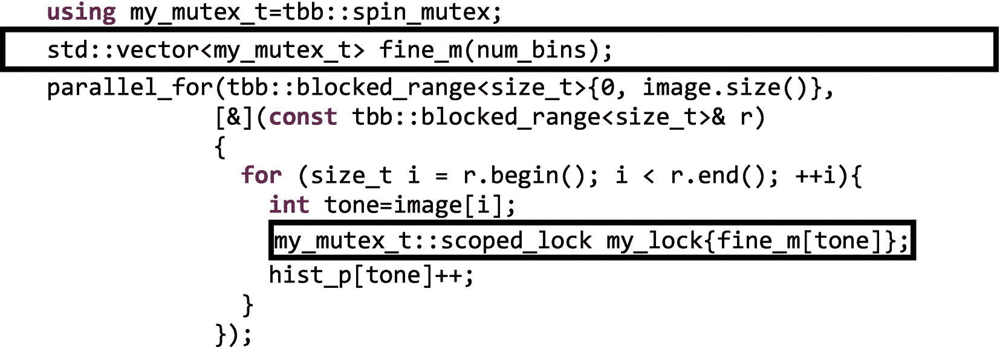

图 5-14

使用细粒度锁定的图像直方图计算的第二个安全并行实现的代码清单

正如我们在`parallel_for`中使用的 lambda 中看到的，当一个线程需要增加容器`hist_p[tone]`时，它将获得`fine_m[tone]`上的锁，防止其他线程接触同一个容器。基本上“你可以更新其他的媒体夹，但不能更新这个特定的媒体夹。”这如图 [5-15](#Fig15) 所示，其中线程 A 和线程 B 并行更新直方图向量的不同仓。

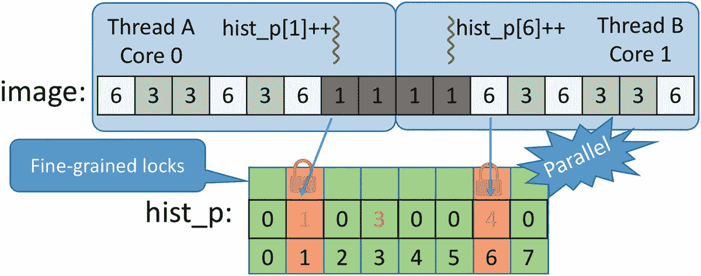

图 5-15

由于细粒度的锁定，我们可以利用更多的并行性

然而，从性能的角度来看，这种替代方案并不是真正的最佳方案(实际上，它是迄今为止最慢的替代方案):

```cpp

c++ -std=c++11 -O2 -o fig_5_14 fig_5_14.cpp -ltbb
./fig_5_14
Serial: 0.59297, Parallel: 26.9251, Speed-up: 0.0220229

```

现在我们不仅需要直方图数组，还需要相同长度的互斥对象数组。这意味着更大的内存需求，此外，更多的数据将被缓存，并将遭受假共享和真共享。倒霉！

除了锁固有的开销之外，锁还是另外两个问题的根源:护送和死锁。让我们先来看看“护送”这个名字来自于所有线程以第一个线程的较低速度一个接一个地护航的心理图像。我们需要一个例子来更好地说明这种情况，如图 [5-16](#Fig16) 所示。假设我们有线程 1、2、3 和 4 在同一个内核上执行相同的代码，其中有一个关键部分受到自旋互斥体 a 的保护，如果这些线程在不同的时间持有锁，它们会愉快地运行而不会发生争用(情况 1)。但是可能发生的情况是，线程 1 在释放锁之前用完了它的时间片，这将发送一个到就绪状态队列的末尾(情况 2)。


图 5-16

超额订阅情况下的护送(一个内核运行四个线程，所有线程都需要相同的互斥 A)

线程 2、3 和 4 现在将获得它们对应的时间片，但是它们不能获得锁，因为 1 仍然是所有者(情况 3)。这意味着 2，3，4 现在可以让行或旋转，但无论如何，他们都卡在一档大卡车后面。当再次调度 1 时，它将释放锁 A(情况 4)。现在 2 号、3 号和 4 号都准备好争夺锁了，只有一个成功了，其他的都在等待。这种情况经常发生，尤其是如果线程 2、3 和 4 需要更多的时间片来运行它们受保护的临界区。此外，线程 2、3 和 4 现在被不经意地协调了，它们都在代码的同一个区域运行，这导致了互斥体上更高的争用概率！请注意，当内核超额预订时(如本例所示，四个线程竞争运行在一个内核上)，护送尤为严重，这也强化了我们避免超额预订的建议。

锁带来的另一个众所周知的问题是“死锁”图 [5-17(a)](#Fig17) 显示了一个噩梦般的场景，在这个场景中，即使有可用的资源(没有车可以使用的空行)，也没有人能够取得进展。这是现实生活中的僵局，但是把这种形象从你的头脑中去掉(如果你可以的话！)并回到我们的并行编程虚拟世界。如果我们有一组 N 个线程，它们持有一个锁，并且还在等待获取该组中任何其他线程已经持有的锁，那么我们的 N 个线程就被死锁了。图 [5-17(b)](#Fig17) 给出了一个只有两个线程的例子:线程 1 持有互斥体 A 的锁，并等待获取互斥体 B 的锁，但是线程 2 已经持有互斥体 B 的锁，并等待获取互斥体 A 的锁。很明显，没有线程会继续前进，永远注定在一个致命的拥抱中！如果线程已经拥有一个互斥体，我们可以通过不要求获取不同的互斥体来避免这种不幸的情况。或者至少让所有线程总是以相同的顺序获取锁。

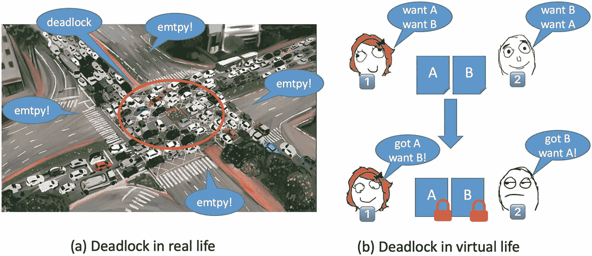

图 5-17

死锁情况

如果一个已经持有锁的线程调用了一个也获得了不同锁的函数，我们可能会无意中引发死锁。如果我们不知道函数做什么，建议避免在持有锁的情况下调用函数(通常建议不要在持有锁的情况下调用其他人的代码)。或者，我们应该仔细检查后续函数调用链不会导致死锁。啊！我们也可以尽可能避免锁！

虽然护送和死锁并没有真正影响我们的直方图实现，但它们应该有助于让我们相信锁带来的问题往往比它们解决的问题更多，并且它们不是获得高并行性能的最佳选择。只有当争用的可能性很低并且执行临界区的时间很短时，锁才是可以容忍的选择。在这些情况下，一个基本的`spin_lock`或`speculative_spin_lock`可以产生一些加速。但是在任何其他情况下，`lock based`算法的可伸缩性都会受到严重损害，最好的建议是跳出框框，设计一个完全不需要互斥的新实现。但是，我们能否在不依赖于几个互斥对象的情况下获得细粒度的同步，从而避免相应的开销和潜在问题呢？

## 第三种安全的并行实现:原子

幸运的是，在许多情况下，我们可以借助一种更便宜的机制来摆脱互斥锁和锁。我们可以使用原子变量来执行原子操作。如图 [5-6](#Fig6) 所示，递增操作不是原子操作，而是可以分成三个更小的操作(加载、递增和存储)。但是，如果我们声明一个原子变量并执行以下操作:


原子变量*的增量*是原子操作。这意味着任何其他访问 counter 值的线程都将“看到”该操作，就好像递增是在一个单独的步骤中完成的一样(不是三个较小的操作，而是一个单独的步骤)。也就是说，任何其他“眼尖”的线程要么观察到操作完成，要么观察不到，但它永远不会观察到增量完成一半。

原子操作不会遭受护送或死锁 <sup>[2](#Fn2)</sup> 并且比互斥选择更快。然而，并不是所有的操作都可以自动执行，那些可以自动执行的操作也不适用于所有的数据类型。更准确地说，当`T`是整数、枚举或指针数据类型时，`atomic<T>`支持原子操作。图 [5-18](#Fig18) 中列出了此类`atomic<T>`变量`x`支持的原子操作。

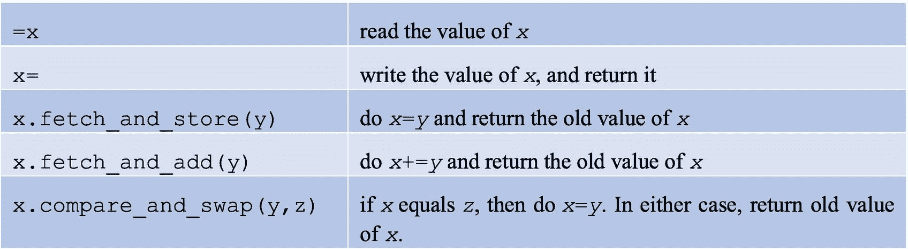

图 5-18

原子变量的基本运算

通过这五个操作，可以实现大量的派生操作。比如`x++`、`x--`、`x+=...`、`x-=...`都来源于`x.fetch_and_add()`。

### 注意

正如我们在前面的章节中已经提到的，从 C++11 开始，C++ 也包含了线程和同步特性。在这些特性被 C++ 标准接受之前，TBB 就包含了它们。尽管从 C++11 开始，`std::mutex`和`std::atomic`以及其他的都可用，TBB 仍然在它的`tbb::mutex`和`tbb::atomic classes`中提供了一些重叠的功能，主要是为了与以前开发的基于 TBB 的应用程序兼容。我们可以在同一个代码中毫无问题地使用这两种风格，并且由我们来决定在给定的情况下哪一种更好。关于`std::atomic`，一些额外的性能，w.r.t. `tbb::atomic`，如果用于在“弱有序”架构上开发无锁算法和数据结构(如 ARM 或 PowerPC 相比之下，英特尔 CPU 具有强有序内存模型)。在本章的最后一节“更多信息”中，我们推荐进一步阅读与内存一致性和 C++ 并发模型相关的内容，在这些内容中，这个主题得到了充分的阐述。对于我们这里的目的，可以说`fetch_and_store`、`fetch_and_add`和`compare_and_swap`默认遵循顺序一致性(C++ 术语中的`memory_order_seq_cst`)，这可以防止一些无序的执行，因此花费了少量的额外时间。考虑到这一点，TBB 还提供了释放和获取语义:在原子读取中默认获取(`...=x`)；并在原子写中默认释放(`x=...`)。所需的语义也可以使用模板参数来指定，例如，`x.fetch_and_add<release>`只强制执行释放内存顺序。在 C++11 中，还允许其他更宽松的内存顺序(memory_order_relaxed 和 memory_order_consume ),在特定的情况下和架构中，可以允许读写顺序有更大的自由度，并挤压少量的额外性能。如果我们想要更接近金属以获得最终的性能，即使知道额外的编码和调试负担，那么 C++11 较低级别的特性就在那里，然而我们可以将它们与 TBB 提供的较高级别的抽象相结合。

另一个基于原子的有用的习惯用法是已经在图 [2-23](02.html#Fig23) (第 [2 章](02.html#b978-1-4842-4398-5_2))给出的波前例子中使用的。将原子整数`refCount`初始化为“y ”,几个线程执行这段代码:


将导致只有第 y 个线程执行进入“body”的前一行。

在这五个基本操作中，`compare_and_swap` (CAS)可以被认为是所有原子读-修改-写，RMW 操作之母。这是因为所有原子 RMW 操作都可以在 CAS 操作之上实现。

### 注意

万一您需要保护一个小的临界区，并且您已经确信无论如何都要避开锁，那么让我们稍微研究一下 CAS 操作的细节。假设我们的代码需要将一个共享的整数变量`v`乘以 3(不要问我们为什么！我们有我们的理由！).我们的目标是一个无锁的解决方案，尽管我们知道乘法不包括在原子操作中。这就是 CAS 的用武之地。第一件事是将`v`声明为原子变量:

`tbb::atomic<uint_32_t> v;`

所以现在我们可以调用`v.compare_and_swap(new_v, old_v)`，而**在原子层面上调用**


这是，当且仅当`v`等于`old_v`时，我们可以用新值更新`v`。无论如何，我们返回`ov`(在“==”比较中使用的共享`v`)。现在，实现我们的“乘以 3”原子乘法的技巧是编写被称为 CAS 循环的代码:


我们的新`fetch_and_triple`是线程安全的(可以被几个线程同时安全地调用),即使它被调用时传递相同的共享原子变量。这个函数基本上是一个 do-while 循环，在这个循环中，我们首先拍摄共享变量的快照(如果其他线程已经设法修改了它，这是稍后进行比较的关键)。然后，原子地，**如果没有其他线程改变了** `v` `(v==old_v)`，我们就更新它`(v=old_v*3)`并返回`v`。因为在这种情况下`v == old_v`(同样:没有其他线程改变`v`)，我们离开 do-while 循环并从函数返回，共享的`v`成功更新。

不过拍快照之后，有可能**其他线程更新** `v`。在这种情况下，`v!=old_v`,这意味着(I)我们不更新`v`,以及(ii)我们停留在 do-while 循环中，希望幸运女神下次会对我们微笑(当在我们拍摄快照和我们成功更新`v`之间的过渡期间，没有其他贪婪的线程敢碰我们的`v`。图 [5-19](#Fig19) 说明了线程 1 或线程 2 如何更新 v。有可能其中一个线程不得不重试一次或多次(例如线程 2 在最初准备写 27 时却写了 81 ),但是在设计良好的场景中这应该没什么大不了。

这种策略的两个警告是(I)它的伸缩性很差，以及(ii)它可能遭受“ABA 问题”(在第 201 页的第 [6](06.html#b978-1-4842-4398-5_6) 章中有关于经典 ABA 问题的背景)。关于第一个，考虑竞争相同原子的 P 个线程，只有一个线程成功进行 P-1 次重试，然后另一个线程成功进行 P-2 次重试，然后 P-3 次重试，等等，导致二次工作。这个问题可以借助于“指数后退”策略来改善，该策略成倍地降低连续重试的速率以减少争用。另一方面，当在中间时间(在我们拍摄快照的时刻和我们成功更新`v)`的时刻之间),一个不同的线程将`v`从值`A`改变为值`B`并变回值`A`时，就会发生 ABA 问题。我们的 CAS 循环可以在没有注意到中间线程的情况下成功，这可能是有问题的。如果您在开发中需要求助于 CAS 循环，请仔细检查您是否理解这个问题及其后果。


图 5-19

两个线程同时调用我们在 CAS 循环上实现的`fetch_and_triple`原子函数

但是现在是时候回到我们运行的例子了。直方图计算的重新实现现在可以借助原子来表达，如图 [5-20](#Fig20) 所示。

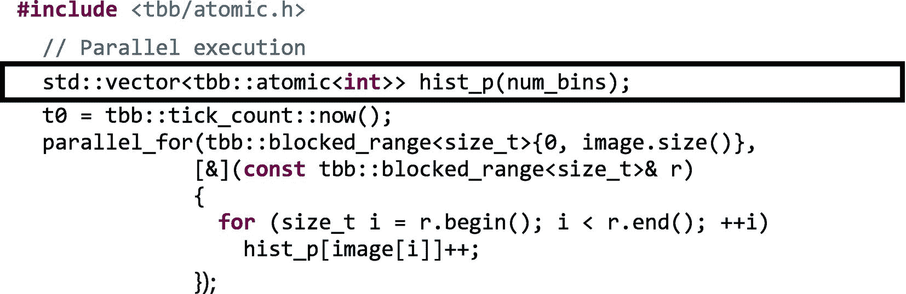

图 5-20

使用原子变量的图像直方图计算的第三种安全并行实现的代码清单

在这个实现中，我们去掉了互斥对象和锁，并声明了向量，使得每个 bin 都是一个`tbb::atomic<int>`(默认情况下初始化为`0`)。然后，在 lambda 中，并行增加容器是安全的。最终结果是，我们获得了直方图向量的并行增量，就像细粒度锁定策略一样，但是在互斥体管理和互斥体存储方面的成本更低。

然而，就性能而言，以前的实现仍然太慢:

```cpp

c++ -std=c++11 -O2 -o fig_5_20 fig_5_20.cpp -ltbb
./fig_5_20
Serial: 0.614786, Parallel: 7.90455, Speed-up: 0.0710006

```

除了原子增量开销之外，伪共享和真共享是我们还没有解决的问题。在第 [7](07.html#b978-1-4842-4398-5_7) 章中，通过利用对齐的分配器和填充技术来解决假共享问题。错误共享是妨碍并行性能的常见障碍，所以我们强烈建议您阅读第 [7](07.html#b978-1-4842-4398-5_7) 章中推荐的避免错误共享的技术。

太好了，假设我们已经修复了假分享的问题，那么真分享的呢？两个不同的线程最终将增加同一个容器，这将从一个高速缓存乒乓到另一个。我们需要一个更好的主意来解决这个问题！

## 更好的并行实施:私有化和削减

直方图缩减带来的真正问题是，只有一个共享向量来保存所有线程都渴望增加的 256 个容器。到目前为止，我们已经看到了几种功能相当的实现，比如粗粒度的、细粒度的和基于原子的实现，但是如果我们还考虑性能和能量等非功能性指标，这些实现都不完全令人满意。

避免共享的常见解决方案是将其私有化。并行编程在这方面没有什么不同。如果我们给每个线程一个直方图的私有副本，每个线程都会愉快地使用它的副本，将其缓存在线程正在运行的内核的私有缓存中，因此以缓存速度递增所有的容器(在理想情况下)。不再有假共享，也没有真共享，也没有什么，因为直方图矢量不再被共享。

好吧，但是…每个线程最终都会看到直方图的一部分，因为每个线程只访问了整个图像的一些像素。没问题，现在是这个实现的缩减部分发挥作用的时候了。计算直方图的私有部分版本后的最后一步是减少所有线程的所有贡献，以获得完整的直方图向量。这部分仍然有一些同步，因为一些线程必须等待其他尚未完成本地/私有计算的线程，但是在一般情况下，这种解决方案最终比前面描述的其他实现要便宜得多。图 [5-21](#Fig21) 展示了直方图示例的私有化和缩减技术。


图 5-21

每个线程计算其局部直方图`my_hist`，该直方图稍后在第二步中被减少。

TBB 提供了几个备选方案来完成私有化和归约操作，一些基于线程本地存储(TLS ),另一个基于归约模板，更加用户友好。让我们先来看看 TLS 版本的直方图计算。

### 线程本地存储

在这里，线程本地存储指的是每个线程都有一个私有的数据副本。使用 TLS，我们可以减少对线程间共享可变状态的访问，还可以利用局部性，因为每个私有副本可以(有时是部分地)存储在线程运行的内核的本地缓存中。当然，副本会占用空间，所以不能过度使用。

TBB 的一个重要方面是我们不知道在任何给定的时间有多少线程正在被使用。即使我们运行在 32 核系统上，并且我们使用`parallel_for`进行 32 次迭代，我们也不能假设会有 32 个线程处于活动状态。这是使我们的代码可组合的一个关键因素，这意味着即使它在一个并行程序中被调用，或者如果它调用一个并行运行的库，它也将工作(更多细节见第 [9](pt2.html#b978-1-4842-4398-5_9) 章)。因此，我们不知道需要多少数据的线程本地副本，即使在我们的 32 次迭代的`parallel_for`的例子中。TBB 线程本地存储的模板类在这里给出了一个抽象的方法，让 TBB 分配、操作和组合正确数量的副本，而不用我们担心有多少副本。这让我们能够创建可伸缩、可组合和可移植的应用程序。

TBB 为线程本地存储提供了两个模板类。两者都为每个线程提供对本地元素的访问，并按需创建元素(延迟)。它们的预期使用模式不同:

*   ETS 类提供了线程本地存储，就像一个 STL 容器，每个线程一个元素。容器允许使用通常的 STL 迭代习惯来迭代元素。任何线程都可以遍历所有本地副本，看到其他线程的本地数据。

*   类`combinable`提供线程本地存储，用于保存每个线程的子计算，这些子计算稍后将被简化为单个结果。每个线程只能看到它的本地数据，或者在调用 combine 后，只能看到合并后的数据。

### 可枚举线程特定

首先，让我们看看如何通过`enumerable_thread_specific`类实现我们的并行直方图计算。在图 [5-22](#Fig22) 中，我们看到并行处理输入图像的不同块并让每个线程写入直方图向量的私有副本所需的代码。


图 5-22

使用类`enumerable_thread_specific`对私有副本进行并行直方图计算

我们首先声明一个类型为`vector<int>.`的`enumerable_thread_specific`对象`priv_h`，构造器指出向量大小为`num_bins`整数。然后，在`parallel_for,`内部，不确定数量的线程将处理迭代空间的块，对于每个块，将执行`parallel_for`的主体(在我们的例子中是 lambda)。负责给定块的线程调用`my_hist = priv_h.local()`，其工作方式如下。如果这是这个线程第一次调用`local()`成员函数，就会为这个线程创建一个新的私有向量。如果相反，它不是第一次，向量已经被创建，我们只需要重用它。在这两种情况下，对私有向量的引用被返回并分配给`my_hist,`，它在`parallel_for`中被用来更新给定块的直方图计数。这样，处理不同块的线程将为第一个块创建私有直方图，并在后续块中重用它。很整洁，对吧？

在`parallel_for`结束时，我们以未确定数量的私有直方图结束，这些直方图需要被组合以计算最终直方图`hist_p`，累积所有的部分结果。但是，如果我们甚至不知道私有直方图的数量，我们如何进行这种简化呢？幸运的是，`enumerable_thread_specific`不仅为`T`类型的元素提供线程本地存储，还可以像 STL 容器一样从头到尾迭代。这在图 [5-22](#Fig22) 的末尾执行，其中变量`i`(类型`priv_h_t::const_iterator`)顺序遍历不同的私有直方图，嵌套循环`j`负责在`hist_p`上累积所有的箱计数。

如果我们更想炫耀我们出色的 C++ 编程技能，我们可以利用`priv_h`是另一个 STL 容器的事实，编写如图 [5-23](#Fig23) 所示的简化。


图 5-23

实现缩减的更时尚的方式

由于归约操作非常频繁，`enumerable_thread_specific`还提供了两个额外的成员函数来实现归约:图 [5-24](#Fig24) 中的`combine_each()`和`combine().`，我们在一个完全等同于图 [5-23](#Fig23) 的代码片段中演示了如何使用成员函数`combine_each`。

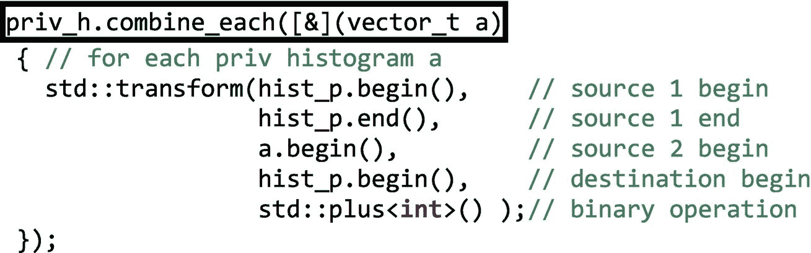

图 5-24

使用`combine_each()`实现还原

成员函数`combine_each()`有这样的原型:


正如我们在图 [5-24](#Fig24) 中看到的，`Func f`作为一个 lambda 提供，其中 STL `transform`算法负责将私有直方图累积到`hist_p`中。通常，成员函数`combine_each`为`enumerate_thread_specific`对象中的每个元素调用一元仿函数。这个带有签名`void(T)`或`void(const T&)`的组合函数通常将私有副本减少到一个全局变量中。

备选成员函数`combine()`确实返回类型为`T`的值，并且具有以下原型:


在图 [5-25](#Fig25) 中，二元函子`f`应该具有签名`T(T,T)`或`T(const T&,const T&).`，我们显示了使用`T(T,T)`签名的归约实现，对于每对私有向量，计算向量与向量`a`的加法，并将其返回以进行可能的进一步归约。`combine()`成员函数负责访问直方图的所有本地副本，以返回一个指向最终`hist_p.`的指针


图 5-25

使用`combine()`实现相同的缩减

而并行性能呢？

```cpp

   c++ -std=c++11 -O2 -o fig_5_22 fig_5_22.cpp -ltbb
   ./fig_5_22
   Serial: 0.668987, Parallel: 0.164948, Speed-up: 4.05574

```

现在我们正在谈话！请记住，我们在四核机器上运行这些实验，因此 4.05 的加速比实际上有点超线性(由于四核的 L1 缓存的聚合)。图 [5-23](#Fig23) 、 [5-24](#Fig24) 和 [5-25](#Fig25) 中所示的三个等效缩减是顺序执行的，因此如果要缩减的私有副本的数量很大(比如说 64 个线程正在计算直方图)或者缩减操作是计算密集型的(例如，私有直方图有 1024 个仓)，则仍有性能改进的空间。我们也将解决这个问题，但首先我们想讨论实现线程本地存储的第二种选择。

### 可组合的

一个`combinable<T>`对象为每个线程提供了自己的本地实例，类型为`T,`，用于在并行计算期间保存线程本地值。与之前描述的 ETS 类相反，一个可组合的对象不能像我们在图 [5-22](#Fig22) 和 [5-23](#Fig23) 中使用`priv_h`那样被迭代。然而，`combine_each()`和`combine()`成员函数是可用的，因为这个`combinable`类是在 TBB 提供的，其唯一目的是实现本地数据存储的减少。

在图 [5-26](#Fig26) 中，我们再次重新实现了并行直方图计算，现在依赖于可组合的类。

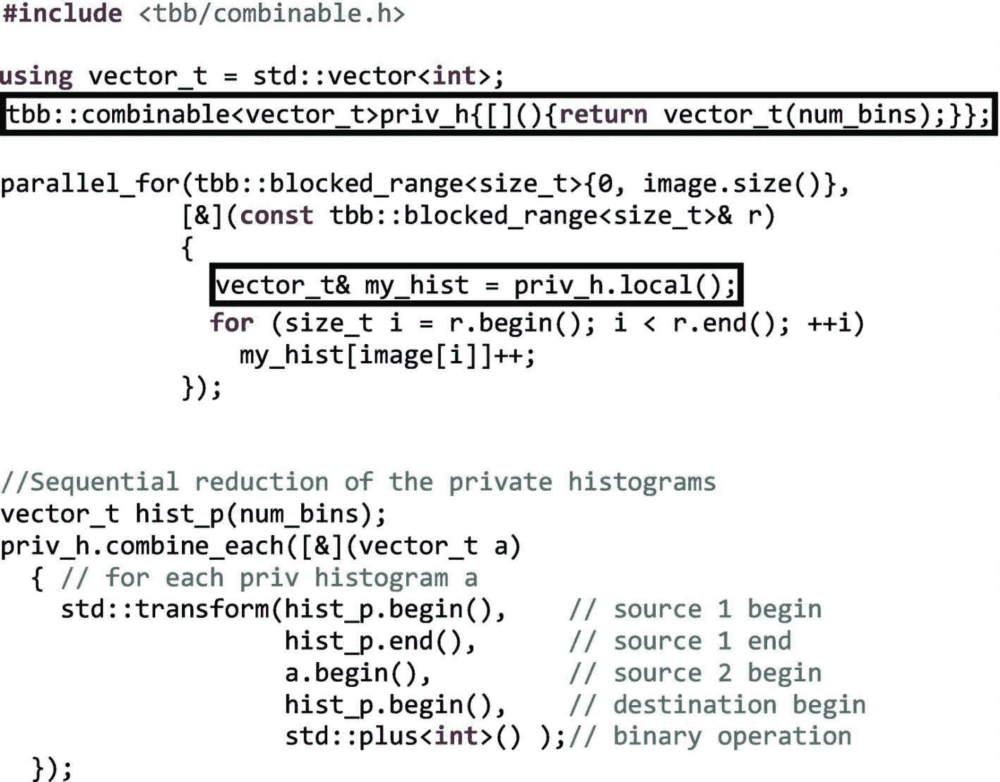

图 5-26

用`combinable`对象重新实现直方图计算

在这种情况下，`priv_h`是一个可组合的对象，其中构造器提供了一个 lambda，该函数将在每次调用`priv_h.local()`时被调用。在这种情况下，这个 lambda 只是创建了一个`num_bins`整数的空向量。更新每线程私有直方图的`parallel_for`与图 [5-22](#Fig22) 所示的 ETS 替代方案的实现非常相似，除了`my_hist`只是对整数向量的引用。正如我们所说，现在我们不能像在图 [5-22](#Fig22) 中那样手工迭代私有直方图，但是为了弥补这一点，成员函数`combine_each()`和`combine()`的工作方式与我们在图 [5-24](#Fig24) 和 [5-25](#Fig25) 中看到的 ETS 类的等价成员函数非常相似。请注意，这种缩减仍然是按顺序执行的，因此仅当要缩减的对象数量和/或缩减两个对象的时间很小时才适用。

ETS 和可组合类具有附加的成员函数和高级用途，详见附录 b。

## 最简单的并行实现:归约模板

正如我们在第二章[中提到的，TBB 已经有了一个高级并行算法来轻松实现一个`parallel_reduce`。那么，如果我们要实现私有直方图的并行归约，为什么不仅仅依靠这个`parallel_reduce`模板呢？在图](02.html#b978-1-4842-4398-5_2) [5-27](#Fig27) 中，我们看到了如何使用这个模板来编码一个高效的并行直方图计算。


图 5-27

使用私有化和简化的图像直方图计算的更好的并行实现的代码清单

`parallel_reduce`的第一个参数是迭代的范围，它将被自动划分成块并分配给线程。有些过分简化了实际发生的事情，线程将获得一个用归约操作的标识值初始化的私有直方图，在本例中是初始化为 0 的面元向量。第一个 lambda 负责局部直方图的私有和本地计算，该局部直方图是通过仅访问图像的一些块而产生的。最后，第二个 lambda 实现了归约操作，在这种情况下可以表示为

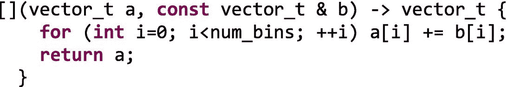

这正是`std:` `:transform` STL 算法正在做的事情。执行时间与使用 ETS 获得的时间相似，并且可以组合:

```cpp

   c++ -std=c++11 -O2 -o fig_5_27 fig_5_27.cpp -ltbb
   ./fig_5_27
   Serial: 0.594347, Parallel: 0.148108, Speed-up: 4.01293

```

为了更清楚地说明我们迄今为止讨论的直方图的不同实现的实际含义，我们在图 [5-28](#Fig28) 中收集了在我们的四核处理器上获得的所有加速。更准确地说，处理器是 2.6 GHz 的酷睿 i7-6700HQ (Skylake 架构，第六代)，6 MB 三级高速缓存和 16 GB RAM。


图 5-28

英特尔酷睿 i7-6700HQ (Skylake)上不同直方图实施的加速

我们清楚地识别出三种不同的行为。四核的不安全、细粒度锁定和原子解决方案比顺序解决方案慢得多(慢得多意味着慢了不止一个数量级！).正如我们所说的，由于锁和假共享/真共享而导致的频繁同步是一个真正的问题，直方图仓在一个缓存和另一个缓存之间来回移动会导致非常令人失望的加速。细粒度的解决方案是最差的，因为直方图向量和互斥向量都有假共享和真共享。作为同类解决方案中的一个代表，粗粒度解决方案只是比顺序解决方案稍差一些。请记住，这只是一个“并行化然后序列化”的版本，其中粗粒度锁迫使线程一个接一个地进入临界区。粗粒度版本的小性能下降实际上是测量并行化和互斥管理的开销，但是我们现在没有假共享或真共享。最后，私有化+减支解决方案(TLS 和`parallel_reduction`)领先群雄。它们的伸缩性很好，甚至比线性更好，因为`parallel_reduction`由于树状缩减而有点慢，在这个问题上没有回报。核的数量很少，减少所需的时间(增加到 256 个`int`向量)可以忽略不计。对于这个小问题，用 TLS 类实现的顺序缩减已经足够好了。

## 概述我们的选择

为了支持我们提出的所有不同的备选方案，实现一个简单的算法，如直方图计算算法，让我们回顾并详细说明每个备选方案的优缺点。图 [5-29](#Fig29) 展示了我们的一些选项，使用八个线程进行 800 个数字的简单矢量加法。相应的顺序代码将类似于

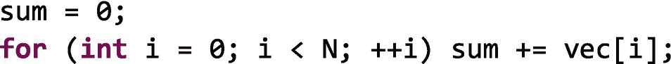

正如在《善、恶、丑》中一样，这一章的“角色”是“错误的、顽强的、桂冠的、核心的、本地的和明智的”:


图 5-29

用八个线程对 800 个数求和时避免争用:(A)原子的:用原子操作 s 保护全局和，(B)局部的:使用`enumerable_thread_specific`，(C)明智的:使用`parallel_reduce`。

*   错误的:我们可以让八个线程并行递增一个全局计数器`sum_g`，而无需任何进一步的考虑、思考或悔恨！最有可能的是，`sum_g`最终会不正确，缓存一致性协议也会破坏性能。你已经被警告了。

    

*   Hardy:如果我们使用粗粒度锁定，我们会得到正确的结果，但通常我们也会序列化代码，除非互斥体实现了 HTM(就像投机风格那样)。这是保护临界区最简单的方法，但不是最有效的方法。对于我们的 vector sum 示例，我们将通过保护每个 vector chunk 累积来说明粗粒度锁定，从而获得一个粗粒度临界区。

    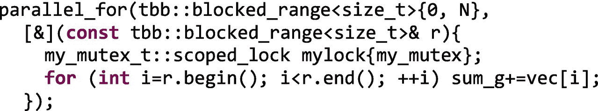

*   Laurel:细粒度锁实现起来更费力，通常需要更多内存来存储保护数据结构细粒度部分的不同互斥体。不过，令人欣慰的是线程间的并发性增加了。我们可能想要评估不同的互斥体风格，以便在产品代码中选择最好的一个。对于矢量和，我们没有一个可以分区的数据结构，这样每个部分都可以被独立保护。让我们考虑一个细粒度的实现，在下面的实现中，我们有一个较轻的临界区(在这种情况下，与粗粒度的实现一样串行，但是线程在更细粒度上竞争锁)。

    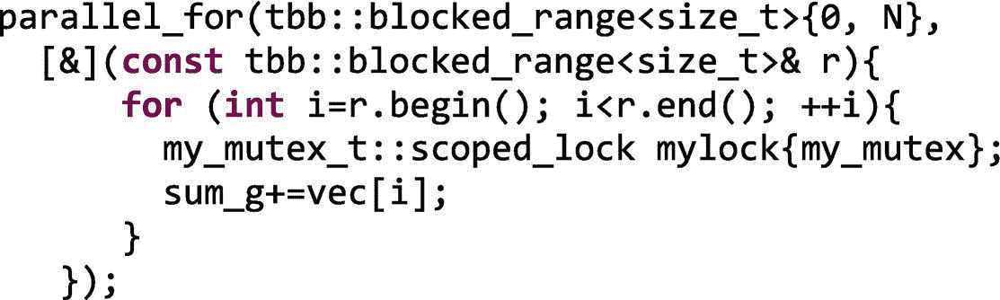

*   在某些情况下，原子变量可以帮助我们。例如，当共享的可变状态可以存储在整型中，并且所需的操作足够简单时。这比细粒度的锁定方法成本更低，并发级别也不相上下。向量和示例(见图 [5-29(A)](#Fig29) )如下，在这种情况下，与前两种方法一样连续，并且全局变量与细粒度情况下一样高度竞争。

    

*   本地:我们并不总是能够提出一个实现，将共享可变状态的本地副本私有化来扭转局面。但在这种情况下，线程本地存储 TLS 可以通过`enumerate_thread_specific`、ETS 或`combinable`类来实现。即使协作线程的数量未知，并且提供了方便的减少方法，它们也能工作。这些类提供了足够的灵活性，可以在不同的场景中使用，并且当单个迭代空间的缩减不够时，可以满足我们的需要。为了计算矢量和，我们在下面给出一个替代方案，其中私有部分和`priv_s`随后被顺序累加，如图 [5-29(B)](#Fig29) 所示。

    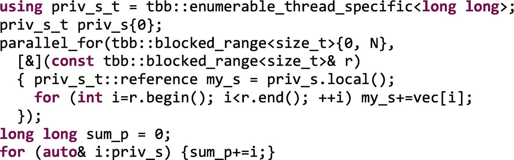

*   明智之举:当我们的计算符合归约模式时，强烈建议依赖`parallel_reduction`模板，而不是使用 TBB 线程本地存储特性手工编码私有化和归约。下面的代码可能看起来比前一个更复杂，但是聪明的软件架构师设计了巧妙的技巧来完全优化这个常见的归约操作。例如，在这种情况下，归约操作遵循一种类似树的方法，复杂性为`O(log n)`而不是`O(n)`，如图 [5-29(C)](#Fig29) 所示。利用图书馆放在你手中的东西，而不是重新发明轮子。这无疑是最适合大量内核和成本高昂的缩减操作的方法。

    

与直方图计算一样，我们还在我们的酷睿 i7 四核架构上评估了大小为 10 <sup>9</sup> 的矢量加法的不同实现的性能，如图 [5-30](#Fig30) 所示。现在计算更加精细了(只是增加了一个变量)，10 个 <sup>9 个</sup>锁定-解锁操作或原子增量的相对影响更大了，这可以从加速中看出(更确切地说是减速！)的原子(核)和细粒度(劳雷尔)实现。粗粒度(Hardy)实现现在比直方图情况下受到的冲击稍大。TLS(本地)方法仅比顺序代码快 1.86 倍。unsafe(missed)现在比 sequential 快 3.37 倍，现在的赢家是`parallel_reduction` (Wise)实现，它为四个内核提供了 3.53 倍的加速。


图 5-30

在英特尔酷睿 i7-6700HQ (Skylake)上，针对 N=10 <sup>9</sup> 的向量加法的不同实现的加速

你可能想知道为什么我们经历了所有这些不同的选择，最终推荐了最后一个。如果`parallel_reduce`解决方案是最佳方案，我们为什么不直接采用它呢？不幸的是，并行生活是艰难的，并不是所有的并行化问题都可以通过简单的简化来解决。在这一章中，我们将为您提供利用同步机制的设备，如果它们真的是必要的话，同时也展示了重新思考算法和数据结构的好处。

## 摘要

当我们需要安全地访问共享数据时，TBB 库提供了不同风格的互斥体和原子变量来帮助我们同步线程。该库还提供线程本地存储、TLS、类(如 ETS 和`combinable`)和算法(如`parallel_reduction`)，帮助我们避免同步的需要。在本章中，我们经历了并行图像直方图计算的史诗般的旅程。对于这个正在运行的示例，我们看到不同的并行实现从一个不正确的实现开始，然后遍历不同的同步备选方案，如粗粒度锁定、细粒度锁定和原子，最后得到一些根本不使用锁的备选实现。在途中，我们在一些值得注意的地方停了下来，介绍了允许我们描述互斥体的特性、TBB 库中可用的不同种类的互斥体，以及依赖互斥体实现我们的算法时通常会出现的常见问题。现在，在旅程的最后，这一章带给我们的启示是显而易见的:除非性能不是您的目标，否则不要使用锁！

## 更多信息

以下是我们推荐的一些与本章相关的额外阅读材料:

*   C++ 并发在行动，安东尼·威廉姆斯，曼宁出版社，第二版，2018 年。

*   《内存一致性和缓存一致性入门》, Daniel J. Sorin、Mark D. Hill 和 David A. Wood，Morgan & Claypool 出版社，2011 年。

马拉加朗达的照片，如图 [5-1](#Fig1) ，作者拉斐尔·阿森约拍摄，经许可使用。

第五章中显示的迷因数字是经 365psd.com 许可使用的“33 个矢量迷因面”

图 [5-17](#Fig17) 中的交通堵塞由 Denisa-Adreea Constantinescu 在马拉加大学攻读博士学位时绘制，经允许使用。

[](https://creativecommons.org/licenses/by-nc-nd/4.0) 

**开放存取**本章根据知识共享署名-非商业-非专用 4.0 国际许可协议(http://Creative Commons . org/licenses/by-NC-nd/4.0/)的条款进行许可，该协议允许以任何媒体或格式进行任何非商业使用、共享、分发和复制，只要您适当注明原作者和来源，提供知识共享许可协议的链接，并指出您是否修改了许可材料。根据本许可证，您无权共享从本章或其部分内容派生的改编材料。

本章中的图像或其他第三方材料包含在该章的知识共享许可中，除非该材料的信用额度中另有说明。如果材料未包含在本章的知识共享许可中，并且您的预期用途不被法定法规允许或超出了允许的用途，您将需要直接从版权所有者处获得许可。

<aside class="FootnoteSection">Footnotes [1](#Fn1_source)

由于 von Neumman 架构的本质，计算逻辑与数据存储是分离的，因此数据必须移动到可以计算的地方，然后再计算，最后再移回存储。

  [2](#Fn2_source)

原子操作不能嵌套，所以它们不会引起死锁。

 </aside>**