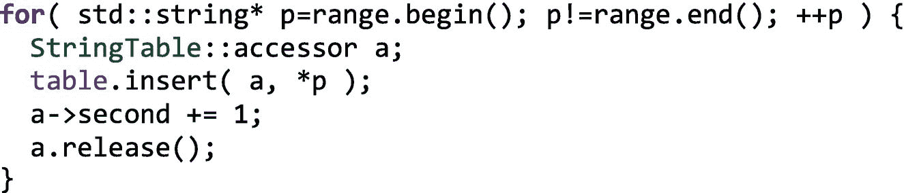
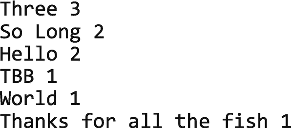
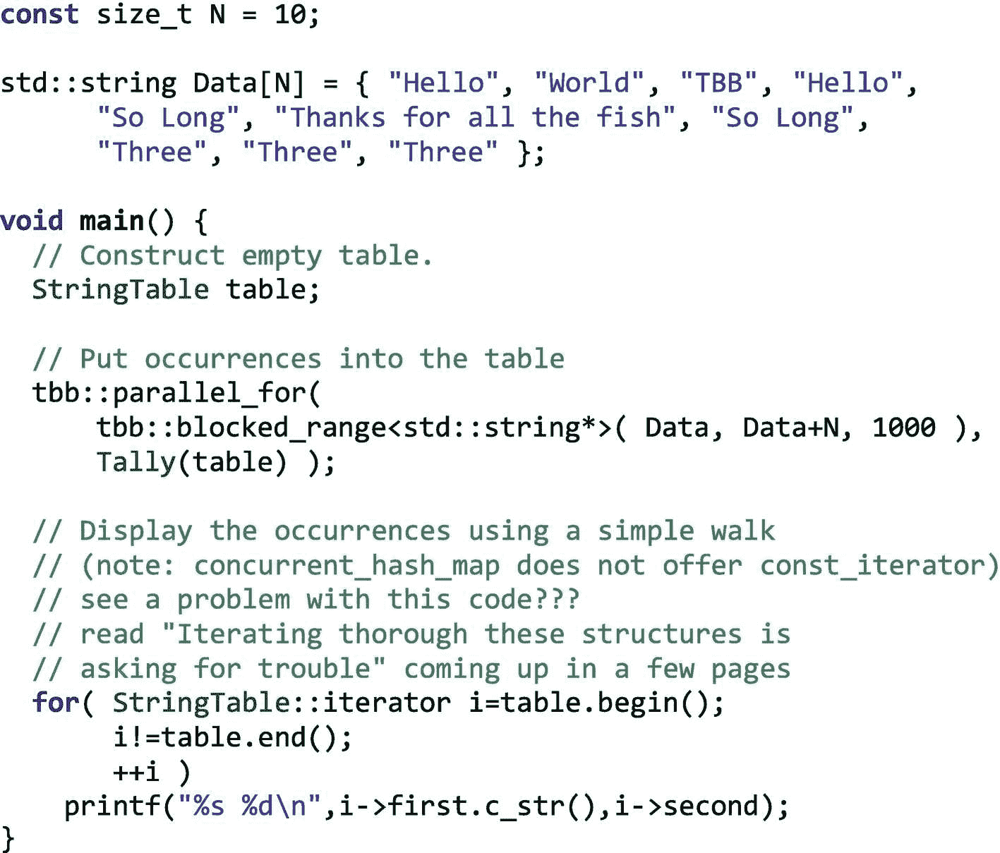
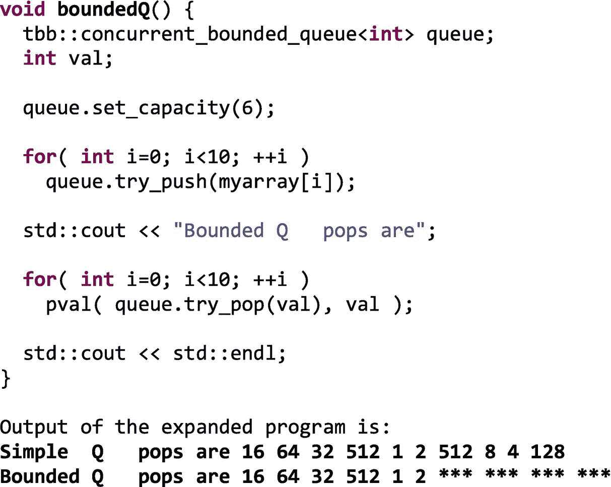
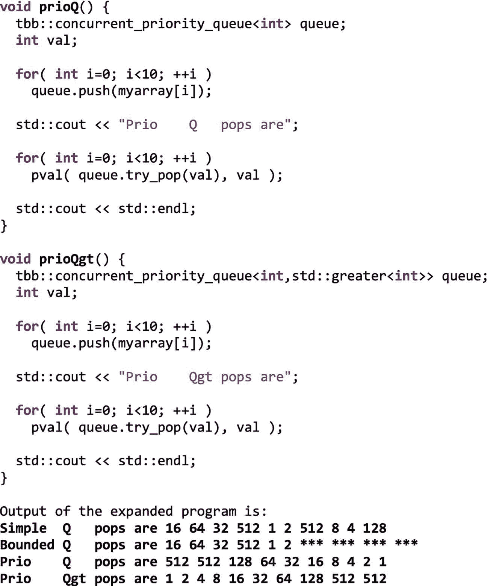
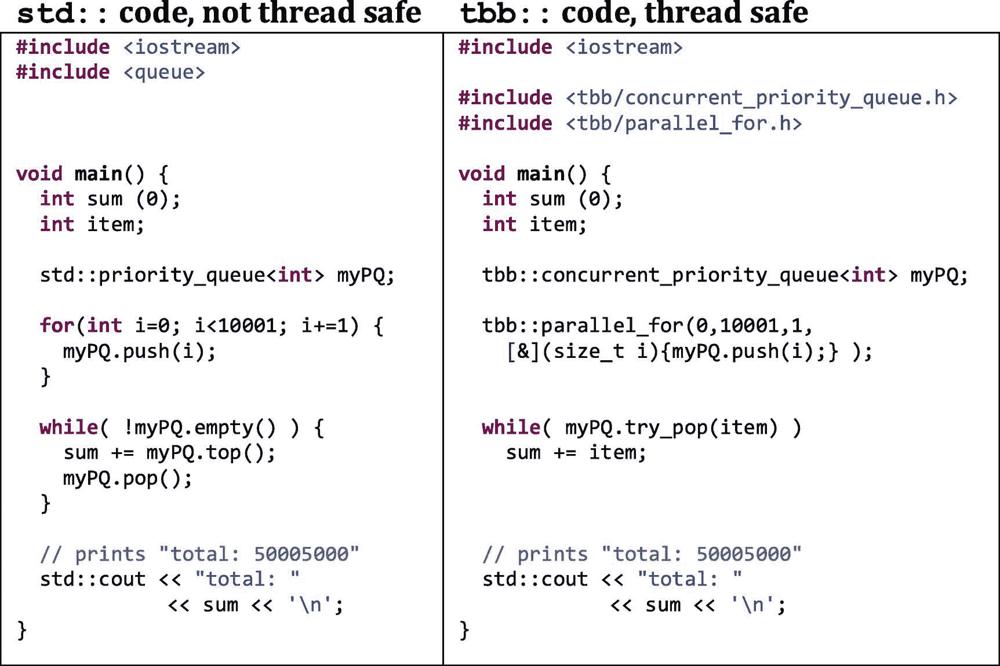
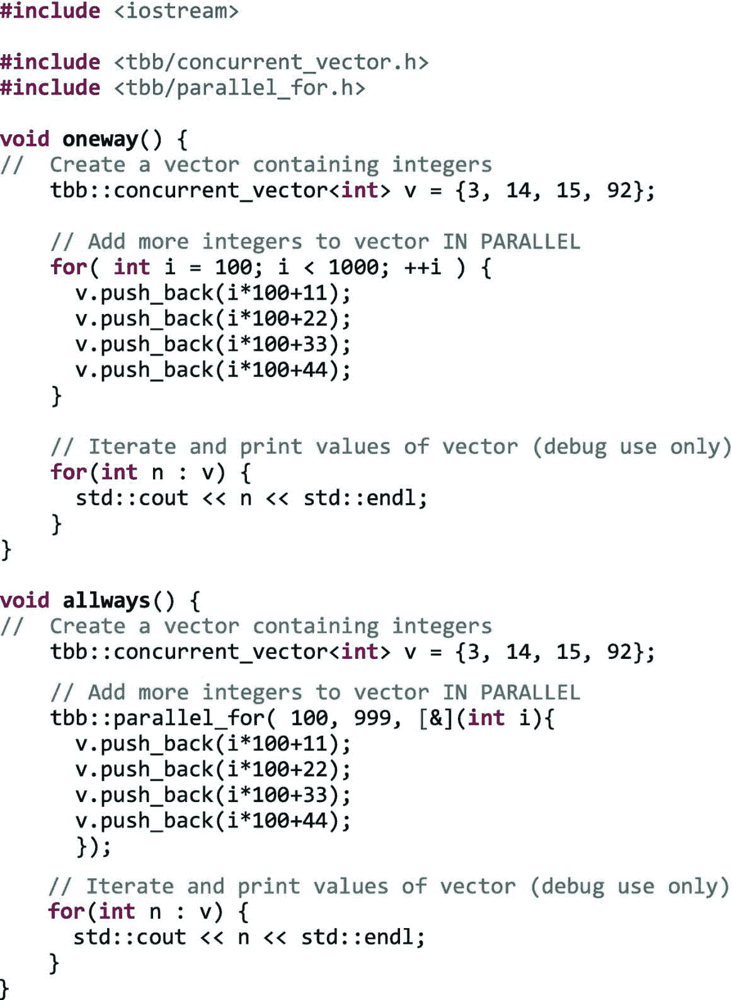
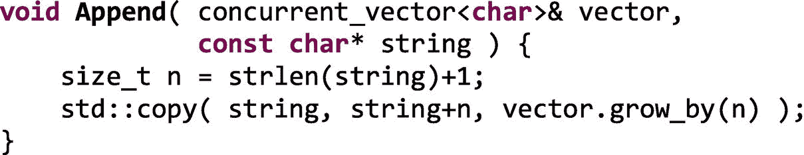

# 六、并发的数据结构

在前一章，我们分享了我们有多不喜欢锁。我们不喜欢它们，因为它们会限制规模，降低并行程序的效率。当然，当正确需要时，它们可以是“必要的邪恶”；然而，我们被很好地建议构造我们的算法以最小化对锁的需求。这一章给了我们一些有用的工具。第[章第 1 章](01.html#b978-1-4842-4398-5_1)–[第 4 章](04.html#b978-1-4842-4398-5_4)关注可扩展算法。一个共同的特征是它们避免或最小化了锁定。第 5 章[介绍了显式的同步方法，包括在我们需要的时候使用锁。在接下来的两章中，我们提供了通过依赖 TBB 的特性来避免使用显式同步的方法。在这一章中，我们将带着避免锁的愿望讨论数据结构。本章讨论了并发容器，以帮助解决并发性的关键数据结构问题。一个相关的主题，线程本地存储(TLS)的使用，已经在第](05.html#b978-1-4842-4398-5_5) [5](05.html#b978-1-4842-4398-5_5) 章中讨论过了。

本章和下一章将介绍 TBB 的关键部分，这些部分有助于线程间的数据协调，同时避免第 [5](05.html#b978-1-4842-4398-5_5) 章中的显式同步。我们这样做是为了以一种已经被证明能够扩展的方式推动我们自己编码。我们喜欢由 TBB 的开发人员精心制作实现的解决方案(为了帮助激发这对于正确性的重要性，我们讨论 A-B——一个从 200 页开始的问题)。我们应该注意算法的选择会对并行性能和实现的容易程度产生深远的影响。

### 明智地选择算法:并发容器不是万能的

当并行数据访问源于明确的并行策略时，它是最好的，其中一个关键部分是正确选择算法。受控访问(如并发容器所提供的)是有代价的:使容器“高度并发”不是免费的，甚至不总是可能的。当这种支持在实践中运行良好时，TBB 提供并发容器(队列、哈希表和向量)。TBB 并不试图支持“列表”和“树”等容器的并发性，在这些容器中，细粒度的共享将无法很好地扩展——并行性的更好机会在于修改算法和/或数据结构选择。

并发容器为容器提供了线程安全的版本，其中并发支持可以在并行程序中很好地工作。正如上一章所讨论的，它们提供了一个更高性能的选择，而不是使用一个周围有粗粒度锁的串行容器。TBB 容器通常提供细粒度的锁定或无锁实现，或者有时两者都提供。

## 关键数据结构基础

如果您熟悉散列表、无序映射、无序集合、队列和向量，那么您可能想跳过这一节，继续阅读“并发容器”。为了帮助回顾关键的基础知识，在开始讨论 TBB 如何支持并行编程之前，我们先简要介绍一下关键的数据结构。

### 无序关联容器

*无序关联容器* *，*用简单的英语来说，就叫做*集合*。我们也可以称之为“集合”然而，技术术语已经发展到使用 map、set 和 hash 表来表示各种类型的集合。

关联容器是数据结构，给定一个*键*，可以找到一个*值*，与那个*键*相关联。它们可以被认为是一个奇特的数组，我们称之为“关联数组”他们采用比简单的一系列数字更复杂的指数。除了`Cost[1]`、`Cost[2]`、`Cost[3]`，我们可以想到`Cost[Glass of Juice]`、`Cost[Loaf of Bread]`、`Cost[Puppy in the Window]`。

我们的关联容器可以通过两种方式特殊化:

1.  **地图 vs 布景:**有没有*值*？还是只是一个*键*？

2.  **多个值:**具有相同*键*的两个项目可以插入到同一个集合中吗？

### 地图与布景

我们所说的“地图”实际上只是一个附加了值的“集合”。想象一篮子水果(苹果、橘子、香蕉、梨、柠檬)。装有水果的*装置*可以告诉我们篮子里是否有特定类型的水果。一个简单的*是*或*否*我们可以在篮子里添加或移除一种水果。一个*映射*为此添加了一个值，通常是一个本身带有信息的数据结构。有了水果类型到集合(果篮)的*映射*，我们可以选择保存计数、价格和其他信息。除了简单的*是*或*否*之外，我们还可以询问`Cost[Apple]`或`Ripeness[Banana]`。如果值是具有多个字段的结构，那么我们可以查询多项内容，比如成本、成熟度和颜色。

### 多重值

在常规的“地图”或“集合”容器中，不允许使用与地图中已经存在的项目相同的*键*将项目插入到地图/集合中(确保唯一性)，但在“多地图”和“多集合”版本中是允许的。在“多个”版本中，重复是允许的，但是我们失去了查找类似`Cost[Apple] because the` `key` `Apple`在地图/集合中不再唯一的能力。

### 散列法

我们提到的一切(关联数组、映射/集合、单个/多个)通常都是使用*散列*函数实现的。要理解什么是*散列*函数，最好理解它的动机。考虑一个关联数组`LibraryCardNumber[Name of Patron]`。数组`LibraryCardNumber`返回给定姓名(指定为字符串)的顾客的图书卡号，该姓名作为索引提供。实现这种关联数组的一种方法是使用元素链表。不幸的是，查找一个元素需要在列表中逐个搜索匹配。这可能需要遍历整个列表，这在并行程序中是非常低效的，因为要争用对共享列表结构的访问。即使没有并行性，当插入一个条目时，验证没有其他条目具有相同的*键*需要搜索整个列表。如果列表有成千上万的顾客，这很容易需要大量的时间。更奇特的数据结构，比如树，可以改善一些但不是所有的问题。

相反，想象一个巨大的数组来存放数据。这个数组由传统的`array[integer]`方法访问。这非常快。我们所需要的，是一个神奇的*散列*函数，它获取关联数组的索引(*顾客的名字*)并将其转换成我们需要的`integer`。

### 无序的

我们确实以单词*无序*作为我们一直在讨论的*关联容器*类型的限定符。我们当然可以对键进行排序，并按照给定的顺序访问这些容器。没有什么能阻止这一点。例如，*键*可能是一个人的名字，我们想按字母顺序创建一个电话簿。

这里的单词 *unordered* 并不意味着我们在编程时不能考虑顺序。它确实意味着数据结构(容器)本身并没有为我们维护一个顺序。如果有一种“遍历”容器的方法(C++ 行话中的*迭代*，唯一的保证是我们将访问容器的每个成员一次，并且只访问一次，但是顺序是不确定的，并且可以随运行而变化，或者随机器而变化，等等。

## 并发容器

TBB 提供了高度并发的容器类，这些容器类对所有 C++ 线程化应用程序都很有用；TBB 并发容器类可以用于任何线程方法，当然也包括 TBB！

C++ 标准模板库最初设计时并没有考虑到并发性。通常，C++ STL 容器不支持并发更新，因此试图并发修改它们可能会导致容器损坏。当然，STL 容器可以包装在粗粒度的`mutex`中，通过一次只让一个线程在容器上操作，使它们对于并发访问是安全的。然而，这种方法消除了并发性，从而限制了在性能关键代码中的并行加速。第 [5 章](05.html#b978-1-4842-4398-5_5)中展示了使用互斥体进行保护的示例，以保护直方图中的元素增量。可以对非线程安全的 STL 例程进行类似的保护，以避免正确性问题。如果在性能关键部分没有这样做，那么性能影响可能很小。这是很重要的一点:集装箱到 TBB 并发集装箱的转换应该由需求驱动。并行使用的数据结构应该为并发性而设计，以便为我们的应用程序提供伸缩性。

TBB 中的并发容器提供了类似于标准模板库(STL)所提供的容器的功能，但是是以线程安全的方式提供的。例如，`tbb::concurrent_vector`类似于`std::vector`类，但是让我们安全地并行增长向量。如果只是并行读取，我们不需要并发容器；只有当我们有修改容器的并行代码时，我们才需要特殊的支持。

TBB 提供了几个容器类，旨在以兼容的方式替换相应的 STL 容器，允许多个线程同时调用同一个容器上的某些方法。这些 TBB 容器通过以下一种或两种方法提供了更高级别的并发性:

*   细粒度锁定:多线程通过只锁定那些真正需要锁定的部分来操作容器(如第 [5](05.html#b978-1-4842-4398-5_5) 章中的直方图示例所示)。只要不同的线程访问不同的部分，它们就可以并发进行。

*   无锁技术:不同的线程考虑并纠正其他干扰线程的影响。

值得注意的是，TBB 并发容器的成本很低。它们通常比普通的 STL 容器有更高的开销，因此对它们的操作可能比对 STL 容器的操作花费更长的时间。当存在并发访问的可能性时，应该使用并发容器。然而，如果并发访问是不可能的，建议使用 STL 容器。也就是说，当并发容器带来的额外并发性加速超过了它们较慢的顺序性能时，我们就使用并发容器。

容器的接口与 STL 中的保持一致，除了为了支持并发性而需要修改的地方。我们可能会向前跳一会儿，这是一个很好的时间来考虑为什么有些接口不是线程安全的经典例子—*,这是需要理解的重要一点！*典型的例子(见图 [6-9](#Fig9) )是需要一个新的*非空弹出*功能(称为`try_pop`)用于队列，而不是依赖一个使用 STL *空测试*的代码序列，如果测试返回非空则跟随一个*弹出*。这种 STL 代码中的危险是另一个线程可能正在运行，清空容器(在原始线程的测试之后，但在 pop 之前),因此创建一个竞争条件，其中 *pop* 实际上可能会阻塞。这意味着 STL 代码不是线程安全的。我们可以在整个序列周围设置一个锁，以防止在测试和弹出之间修改队列，但是众所周知，当在应用程序的并行部分使用这种锁时，会破坏性能。理解这个简单的例子(图 [6-9](#Fig9) )将有助于阐明支持并行性需要什么。

像 STL 一样，TBB 容器是根据分配器参数进行模板化的。每个容器都使用这个分配器为用户可见的项目分配内存。TBB 的默认分配器是 TBB 提供的可伸缩内存分配器(在第 [7](07.html#b978-1-4842-4398-5_7) 章中讨论)。不管指定了什么分配器，容器的实现也可以使用不同的分配器来实现严格的内部结构。

TBB 目前提供以下并发容器:

*   无序关联容器
    *   无序地图(包括无序多地图)

    *   无序集(包括无序多重集)

    *   散列表

*   队列(包括有界队列和优先级队列)

*   矢量

### 为什么 TBB 容器分配器参数默认为 TBB？

所有 TBB 容器都支持分配器参数，它们默认为 TBB 可伸缩内存分配器(参见第 [7](07.html#b978-1-4842-4398-5_7) 章)。

容器默认使用混合的`tbb::cache_aligned_allocator`和`tbb:tbb_allocator`。我们在本章中记录了缺省值，但是本书的附录 B 和 TBB 头文件是学习缺省值的资源。不需要链接 TBB 可伸缩分配器库(见第 7 章)，因为当库不存在时，TBB 容器将默认使用`malloc`。然而，我们应该链接 TBB 可伸缩分配器，因为仅仅链接性能可能会更好——如第 [7](07.html#b978-1-4842-4398-5_7) 章所述，将它用作代理库特别容易。

图 6-1

并发无序关联容器的比较

### 并发无序关联容器

无序关联容器是一组实现哈希表变量的类模板。图 [6-1](#Fig1) 列出了这些容器及其主要区别特征。并发无序关联容器可用于存储任意元素，如整数或自定义类，因为它们是模板。TBB 提供了无序关联容器的实现，可以并发执行。

哈希映射(通常也称为哈希表)是一种使用哈希函数将键映射到值的数据结构。散列函数根据关键字计算索引，并且索引用于访问存储与关键字相关联的值的“桶”。

选择一个好的哈希函数非常重要！一个完美的哈希函数会将每个键分配给一个唯一的桶，这样不同的键就不会有*冲突*。然而实际上，散列函数并不完美，偶尔会为多个键生成相同的索引。这些冲突需要哈希表实现的某种形式的适应，这将引入一些开销-哈希函数应该设计为通过将输入哈希化为跨存储桶的几乎均匀的分布来最小化冲突。

散列表的优势来自于在一般情况下为搜索、插入和键提供`O(1)`时间的能力。TBB 散列图的优点是支持并发使用，以提高正确性和性能。这假设使用了一个好的散列函数，一个不会对所使用的密钥造成很多冲突的函数。只要存在不完美的散列函数，或者如果散列表的维度不够好，理论上最差的情况`O(n)`仍然存在。

在实际使用中，哈希映射通常比包括搜索树在内的其他表查找数据结构更有效。这使得散列映射成为多种用途的数据结构选择，包括关联数组、数据库索引、缓存和集合。

#### 并发散列映射

TBB 提供了`concurrent_hash_map`，它以一种允许多线程通过`find`、`insert,`和`erase`方法并发访问值的方式将键映射到值。正如我们将在后面讨论的，`tbb:: concurrent_hash_map`是为并行设计的，因此它的接口是线程安全的，不像我们将在本章后面讨论的 STL `map/set`接口。

这些键是无序的。每个键在一个`concurrent_hash_map`中最多有一个元素。该键可能有其他元素在运行中，但不在映射中。类型`HashCompare`指定如何散列键*和*如何比较它们是否相等。正如通常对哈希表所期望的那样，如果两个键相等，那么它们必须哈希到相同的哈希代码。这就是为什么`HashCompare`将比较和散列的概念结合到一个单独的对象中，而不是分别对待它们。这样做的另一个后果是，当哈希表不为空时，我们不需要更改键的哈希代码。

一个`concurrent_hash_map`充当一个`std::pair<const Key,T>`类型元素的容器。通常，当访问容器元素时，我们感兴趣的不是更新它就是读取它。模板类`concurrent_hash_map`分别支持这两个目的，类`accessor`和`const_accessor`充当智能指针。访问者代表更新(写)访问。只要它指向一个元素，所有其他的尝试在表块中查找那个键，直到访问器完成。A `const_accessor`类似，除了它代表只读访问。多个访问器可以同时指向同一个元素。在频繁读取元素而很少更新元素的情况下，这个特性可以极大地提高并发性。

我们分享一个使用图 [6-2](#Fig2) 和 [6-3](#Fig3) 中的`concurrent_hash_map`容器的简单代码示例。我们可以通过减少元素访问的生存期来提高这个例子的性能。方法`find`和`insert`将一个`accessor`或`const_accessor`作为参数。选择告诉`concurrent_hash_map`我们是请求更新还是只读访问。一旦方法返回，访问将持续到`accessor`或`const_accessor`被销毁。因为访问一个元素会阻塞其他线程，所以尽量缩短`accessor`或`const_accessor`的生命周期。为此，请尽可能在最里面的块中声明它。要在块结束之前释放访问，使用方法`release`。图 [6-5](#Fig5) 显示了图 [6-2](#Fig2) 中循环体的返工，使用`release`代替依赖破坏来结束螺纹寿命。方法`remove(key)`也可以同时运行。它隐式请求写访问。因此，在移除密钥之前，它会等待对密钥的任何其他现存访问。

图 6-5

修改图 [6-2](#Fig2) 以减少存取器寿命，希望改善缩放

图 6-4

图 [6-2](#Fig2) 和 [6-3](#Fig3) 中示例程序的输出

图 6-3

散列表示例，第 2 部分，共 2 部分

图 6-2

散列表示例，第 1 部分，共 2 部分

### 哈希映射的性能提示

*   始终为哈希表指定初始大小。其中一个的缺省值将可怕地扩展！好的尺码肯定是从几百开始的。如果较小的大小似乎是正确的，那么由于缓存局部性，在小表上使用锁将在速度上具有优势。

*   检查你的散列函数——确保散列值的低位比特具有良好的伪随机性。特别是，您不应该使用指针作为键，因为由于对象对齐的原因，指针的低位通常会有一组 0 位。如果是这种情况，强烈建议将指针除以它所指向的类型的大小，从而移出始终为零的位，以支持变化的位。乘以一个质数，并移出一些低阶位，是一个可以考虑的策略。与任何形式的哈希表一样，相等的键必须具有相同的哈希代码，理想的哈希函数将键均匀地分布在哈希代码空间中。针对最佳散列函数的调优肯定是特定于应用程序的，但是使用 TBB 提供的缺省值往往会工作得很好。

*   如果可以避免，就不要使用访问器，并且在需要访问器时尽可能地限制它们的生存期(参见图 [6-5](#Fig5) 中的示例)。它们是有效的细粒度锁，在存在时会抑制其他线程，因此可能会限制伸缩。

*   使用 TBB 内存分配器(参见第 [7 章](07.html#b978-1-4842-4398-5_7))。如果您想强制容器的使用(不允许回退到 malloc)，就使用`scalable_allocator`作为容器的模板参数——至少在测试性能时，在开发过程中有一个很好的完整性检查。

#### 对`map` / `multimap`和`set` / `multiset`接口的并发支持

标准 C++ STL 定义了`unordered_set, unordered_map, unordered_multiset,`和`unordered_multimap`。这些容器的不同之处仅在于对其元素的约束。图 [6-1](#Fig1) 是比较我们对并发地图/集合支持的五种选择的便利参考，包括我们在代码示例中使用的`tbb::concurrent_hash_map`(图 [6-2](#Fig2) 到 [6-5](#Fig5) )。

STL 没有定义任何叫做“hash”的东西，因为 C++ 最初没有定义哈希表。对向 STL 添加哈希表支持的兴趣非常普遍，因此有广泛使用的 STL 版本，它们被扩展为包含哈希表支持，包括 SGI、gcc 和 Microsoft 的版本。没有标准，就能力和性能而言,“哈希表”或“哈希表”对 C++ 程序员来说意味着什么。从 C++11 开始，STL 中增加了一个散列表实现，并为该类选择了名称`unordered_map`,以防止与预标准实现混淆和冲突。可以说名称`unordered_map`更具描述性，因为它暗示了类的接口及其元素的无序本质。

最初的 TBB 哈希表支持早于 C++11，称为`tbb:` `:concurrent_hash_map`。这个散列函数仍然很有价值，不需要修改来符合标准。TBB 现在包括对`unordered_map`和`unordered_set`的支持，以反映 C++11 的增加，接口仅在需要支持并发访问时增加或调整。避免一些对并行不友好的接口是“推动我们”进行有效并行编程的一部分。附录 B 对细节进行了详尽的介绍，但为了实现更好的并行伸缩，有三个值得注意的调整，如下所示:

*   省略了需要 C++11 语言特性的方法(例如`rvalue`引用)。

*   C++ 标准函数的擦除方法以`unsafe_`为前缀，表示它们不是并发安全的(因为只有`concurrent_hash_map`支持并发擦除)。这不适用于`concurrent_hash_map`，因为*不支持*并发擦除。

*   bucket 方法(bucket 的计数、bucket 的最大计数、bucket 的大小以及对遍历 bucket 的支持)以`unsafe_`为前缀，提醒它们对于插入来说不是并发安全的。支持它们是为了与 STL 兼容，但如果可能的话，应该避免使用它们。如果使用的话，应该防止它们与插入同时使用。这些接口不适用于`concurrent_hash_map`，因为 TBB 的设计者避免了这样的功能。

#### 内置锁定与无可见锁定

容器`concurrent_hash_map`和`concurrent_unordered_*`在被访问元素的锁定方面有些不同。因此，在争用的情况下，它们可能会表现得非常不同。`concurrent_hash_map`的访问器本质上是锁:`accessor`是排他锁，`const_accessor`是共享锁。基于锁的同步内置于容器的使用模型中，不仅保护了容器的完整性，还在一定程度上保护了数据的完整性。图 [6-2](#Fig2) 中的代码在向表中执行插入操作时使用了一个`accessor`。

#### 遍历这些结构是自找麻烦

我们在图 [6-3](#Fig3) 的末尾偷偷加入了一些并发不安全的代码，当我们遍历哈希表来转储它的时候。如果在我们走桌子的时候插入或删除，这可能会有问题。在我们的辩护中，我们只会说“这是调试代码，我们不在乎！”但是，经验告诉我们，像这样的代码很容易进入非调试代码。当心！

TBB 的设计者为了调试的目的给`concurrent_hash_map`留下了迭代器，但是他们故意不让我们用迭代器作为其他成员的返回值。

不幸的是，STL 以我们应该学会抵制的方式诱惑着我们。`concurrent_unordered_*`容器不同于`concurrent_hash_map`——API 遵循关联容器的 C++ 标准(记住，最初的 TBB `concurrent_hash_map`早于 C++ 对并发容器的任何标准化)。添加或查找数据的操作返回一个迭代器，所以这诱使我们用它进行迭代。在一个并行程序中，我们冒着与地图/集合上的其他操作同时发生的风险。如果我们屈服于诱惑，保护数据完整性完全是我们程序员的事，容器的 API 没有帮助。有人可能会说 C++ 标准容器提供了额外的灵活性，但是缺乏`concurrent_hash_map`提供的内置保护。如果我们避免使用从添加或查找操作返回的迭代器，除了引用我们查找的项目，STL 接口很容易并发使用。如果我们屈服于诱惑(我们不应该！)，那么我们就有很多关于应用程序中并发更新的思考要做。当然，如果没有更新发生——只有查找——那么使用迭代器就没有并行编程问题。

### 并发队列:常规、有界和优先级

队列是一种有用的数据结构，可以通过 push(添加)和 pop(删除)操作在队列中添加或删除条目。无界队列接口提供了一个“try pop ”,它告诉我们队列是否为空，是否没有值从队列中弹出。这使我们不再编写自己的逻辑来通过测试空来避免阻塞弹出——这是一种不安全的线程操作(见图 [6-9](#Fig9) )。在多个线程之间共享一个队列可能是在线程之间传递工作项目的有效方法——保存“工作”的队列可以添加工作项目以请求将来的处理，并由想要进行处理的任务移除。

通常，队列以先进先出(FIFO)的方式运行。如果我从一个空队列开始，执行一个`push(10)`，然后执行一个`push(25),`，那么第一个弹出操作将返回`10`，第二个弹出操作将返回一个`25`。这与堆栈的行为有很大不同，堆栈通常是后进先出的。但是，我们不是在这里谈论堆栈！

我们在图 [6-6](#Fig6) 中展示了一个简单的例子，它清楚地显示了弹出操作返回值的顺序与推送操作将它们添加到队列中的顺序相同。

图 6-6

使用简单(FIFO)队列的示例

队列有两种变化:*限制*和*优先级*。绑定增加了限制队列大小的概念。这意味着如果队列已满，可能无法进行推送。为了处理这个问题，有界队列接口为我们提供了一些方法，让 push 等待，直到它可以添加到队列中，或者提供一个“尝试 push”操作，如果可以或者让我们知道队列已满，就进行 push。默认情况下，有界队列是无界的！如果我们想要一个有界队列，我们需要使用`concurrent_bounded_queue`和调用方法`set_capacity`来设置队列的大小。我们在图 [6-7](#Fig7) 中展示了有界队列的一个简单用法，其中只有前六个项目被推入队列。我们可以在`try_push`上增加一个测试，然后做点什么。在这种情况下，当弹出操作发现队列为空时，我们有程序 print `***`。

图 6-7

这个例程扩展了我们的程序，以显示有界队列的使用情况

优先级通过有效地对队列中的项目进行排序，增加了先进先出的灵活性。如果我们没有在代码中指定优先级，默认的优先级是`std::less<T>`。这意味着 pop 操作将返回队列中值最高的项。

图 [6-8](#Fig8) 显示了优先级使用的两个例子，一个默认为`std:: less<int` >，另一个明确指定`std::greater<int>`。

图 6-8

这些例程扩展了我们的程序，以显示优先级排队

正如前面三幅图中的例子所示，为了实现队列的这三种变化，TBB 提供了三个容器类:`concurrent_queue`、`concurrent_bounded_queue`和`concurrent_priority_queue`。所有并发队列都允许多个线程同时推送和弹出项目。这些接口与 STL `std::queue`或`std::priority_queue`类似，除了它们必须不同以使队列的并发修改安全。

队列中的基本方法是`push`和`try_pop`。`push`方法的工作原理和`std::queue`一样。需要注意的是不支持`front`或`back`方法，因为它们在并发环境中是不安全的，因为这些方法会返回对队列中某项的引用。在并行程序中，队列的前面或后面可能会被另一个并行线程改变，使得使用`front`或`back`变得毫无意义。

类似地，对于未绑定的队列，不支持 pop 和空测试——相反，方法`try_pop`被定义为如果项目可用，则 pop 一个项目，并返回一个`true`状态；否则，它不返回任何项目，并返回一个状态`false`。test-for-empty 和 pop 方法被组合成一个方法，以鼓励线程安全编码。对于有界队列，除了可能阻塞的`push`方法之外，还有一个非阻塞的`try_push`方法。这些帮助我们避免使用`size`方法来查询队列的大小。一般来说，应该避免使用`size`方法，尤其是当它们是顺序程序的延续时。因为在并行程序中，队列的大小可以同时改变，所以如果使用`size`方法，需要仔细考虑。首先，当队列为空并且有挂起的弹出方法时，TBB 可以为`size`方法返回一个负值。当`size`为零或更小时`empty`方法为真。

#### 边界尺寸

对于`concurrent_queue`和`concurrent_priority_queue`，容量是无限的，受到目标机器上的内存限制。`concurrent_bounded_queue`提供了对边界的控制——一个关键特性是`push`方法会一直阻塞，直到队列有空间为止。有界队列有助于减缓供应商的速度，使其与消耗速度相匹配，而不是让队列不受约束地增长。

`concurrent_bounded_queue`是唯一一个提供`pop`方法的`concurrent_queue_*`容器。`pop`方法将阻塞，直到一个项目变得可用。一个`push`方法只能被一个`concurrent_bounded_queue`阻塞，所以这个容器类型也提供了一个叫做`try_push.`的非阻塞方法

通过使用`limiter_node`，这种限制速率匹配的概念也存在于流程图(参见第 [3 章](03.html#b978-1-4842-4398-5_3))中，以避免内存溢出或内核过载。

#### 优先排序

优先级队列基于各个排队项目的优先级来维护队列中的排序。正如我们前面提到的，普通队列有先进先出策略，而优先级队列对其项目进行排序。我们可以提供自己的比较来改变默认的排序。例如，使用`std::greater<T>`会导致最小的元素成为下一个被`pop`方法检索的元素。我们在图 [6-8](#Fig8) 的示例代码中正是这样做的。

#### 保持线程安全:尽量忘记顶部、大小、空、前面、后面

需要注意的是没有`top`方法，我们可能应该避免使用`size`和`empty`方法。并发使用意味着所有三个线程的值都可能由于其他线程中的 push/pop 方法而改变。此外，虽然支持`clear`和`swap`方法，但它们不是线程安全的。当将一个`std::priority_queue`用法转换为`tbb::concurrent_priority_queue`时，TBB 强迫我们使用`top`重写代码，因为返回的元素可能会被并发的 pop 无效。因为返回值不会受到并发性的威胁，所以 TBB 支持`size`、`empty`和`swap`的`std::priority_queue`方法。但是，我们建议仔细检查在并发应用程序中使用这两个函数中的任何一个是否明智，因为依赖这两个函数中的任何一个都可能暗示需要为并发性重写代码。

图 6-9

STL 和 TBB 优先级队列代码的并排比较显示了使用`try_pop`而不是`top`和`pop`的动机。在这个没有并行的例子中，两者合计为 50005000，但是 TBB 是可伸缩的，并且是线程安全的。

#### 迭代程序

仅出于调试目的，所有三个并发队列都提供有限的迭代器支持(`iterator`和`const_iterator`类型)。这种支持仅仅是为了允许我们在调试过程中检查队列。`iterator`和`const_iterator`类型都遵循前向迭代器的 STL 惯例。迭代顺序是从最近推送的到最近推送的。修改队列会使引用它的所有迭代器失效。迭代器相对较慢。它们应该只用于调试。使用示例如图 [6-10](#Fig10) 所示。

图 6-10

遍历并发队列的示例调试代码——注意`begin`和`end`上的`unsafe_`前缀，以强调这些方法的仅调试非线程安全性质。

#### 为什么使用这个并发队列:A-B——一个问题

我们在本章开始时提到，拥有由并行专家编写的供我们“使用”的容器具有重要的价值我们都不想为每个应用程序重新发明好的可伸缩实现。作为动机，我们岔开话题，提到 A-B——一个问题——一个并行性出错的经典计算机科学例子！乍一看，并发队列似乎很容易编写自己的队列。不是的。使用 TBB 的`concurrent_queue`,或者任何其他研究充分、实现良好的并发队列，是一个好主意。尽管这种经历令人羞愧，但我们不会是第一个知道这并不像我们天真地认为的那么简单的人。如果`A-B-A`问题(见侧栏)阻碍了我们的意图，那么第 [5 章](05.html#b978-1-4842-4398-5_5)中的更新习语(`compare_and_swap`)是不合适的。当试图为链接数据结构(包括并发队列)设计非阻塞算法时，这是一个常见的问题。TBB 的设计者对 A-B 有一个解决方案——一个已经打包在并发队列解决方案中的问题。我们可以依赖它。当然，它是开源代码，所以如果你感到好奇，你可以在代码中寻找答案。如果你查看源代码，你会发现竞技场管理(第 [12](12.html#b978-1-4842-4398-5_12) 章的主题)也必须处理 ABA 问题。当然，你可以直接使用 TBB，而不需要了解这些。我们只是想强调，解决并发数据结构并不像看起来那么简单——因此我们喜欢使用 TBB 支持的并发数据结构。

### A-B-一个问题

理解 A-B 问题是训练我们在设计自己的算法时思考并发性含义的一个重要方法。虽然 TBB 在实现并发队列和其他 TBB 结构时避免了 A-B-A 问题，但它提醒我们需要“并行思考”

当一个线程检查一个位置以确保其值为`A`并且仅在该值为`A`时才继续更新时，就会出现`A-B-A`问题。问题是，如果其他任务以第一个任务没有检测到的方式改变相同的位置，这是否是一个问题:

1.  一个任务从`globalx`读取一个值`A`。

2.  其他任务将`globalx`从`A`变为`B`，然后回到`A`。

3.  步骤 1 中的任务执行其`compare_and_swap`，读取`A`，因此没有检测到`B`的中间变化。

如果该任务在假设自该任务第一次读取该位置以来该位置没有改变的情况下错误地继续进行，则该任务可能继续破坏该对象或者得到错误的结果。

考虑一个链表的例子。假设一个链表`W(1)` → `X(9)` → `Y(7)` → `Z(4)`，其中字母是节点位置，数字是节点中的值。假设某个任务遍历列表以找到要出列的节点`X`。该任务获取下一个指针`X.next`(即`Y`)，并将其放入`W.next`。但是，在交换完成之前，任务会暂停一段时间。

暂停期间，其他任务繁忙。它们使`X`出列，然后碰巧重用相同的内存，对节点`X`的新版本进行排队，以及在某个时间点使`Y`出列并添加`Q`。现在，名单是`W(1)` → `X(2)` → `Q(3)` → `Z(4)`。

一旦原任务最终醒来，发现`W.next`仍然指向`X`，于是换出`W.next`成为`Y`，从而把链表搞得一塌糊涂。

如果原子操作为我们的算法提供了足够的保护，那么它们就是我们要走的路。如果这个问题会毁了我们的一天，我们需要找到一个更复杂的解决方案。`tbb::concurrent_queue`具有必要的额外复杂性来实现这一点！

#### 何时不使用队列:想想算法！

队列在并行程序中被广泛用于缓冲消费者和生产者。在使用显式队列之前，我们需要考虑使用`parallel_do`或`pipeline`来代替(参见第 [2 章](02.html#b978-1-4842-4398-5_2))。这些选项通常比队列更有效，原因如下:

*   队列天生就是瓶颈，因为它们必须保持一个顺序。

*   如果队列为空，则弹出值的线程将停止，直到值被推入。

*   队列是一种被动的数据结构。如果一个线程推送一个值，它可能需要一段时间才能弹出该值，与此同时，该值(及其引用的任何内容)在缓存中变成 *cold* 。或者更糟的是，另一个线程弹出该值，并且该值(及其引用的任何内容)必须被移动到另一个处理器内核。

相比之下，`parallel_do`和`pipeline`避免了这些瓶颈。因为它们的线程是隐式的，所以它们优化了工作线程的使用，这样它们就可以做其他工作，直到一个值出现。他们还试图在缓存中保存热门项目*。例如，当另一个工作项目被添加到一个`parallel_do`中时，它被保存在添加它的线程的本地，除非在*热*线程处理它之前另一个空闲线程可以窃取它。这样，项目更经常地被热线程处理，从而减少了获取数据的延迟。*

 *### 并发向量

TBB 开设了一门叫做`concurrent_vector`的课程。一个`concurrent_vector<T>`是一个可动态增长的`T`数组。增长一个`concurrent_vector`是安全的，即使其他线程也在操作它的元素，甚至自己也在增长它。为了安全的并发增长，`concurrent_vector`有三种方法支持动态数组的常见用法:`push_back`、`grow_by`和`grow_to_at_least`。

图 [6-11](#Fig11) 显示了`concurrent_vector`的简单用法，图 [6-12](#Fig12) 显示了在向量内容的转储中，并行线程同时添加的效果。如果按数字顺序排序，同一程序的输出将被证明是相同的。

#### 什么时候用 tbb::concurrent_vector 代替 std::vector

`concurrent_vector<T>`的关键价值在于它能够同时增长一个向量，并且能够保证元素不会在内存中移动。

`concurrent_vector`确实比`std::vector.`有更多的开销，因此，当我们需要在其他访问正在进行(或可能正在进行)或要求某个元素永远不移动时动态调整其大小的能力时，我们应该使用`concurrent_vector`。

图 6-12

左侧是使用`for`(非并行)时生成的输出，右侧显示使用`parallel_for`(并发推入向量)时的输出。

图 6-11

并发向量小示例

#### 元素从不移动

在数组被清空之前，`concurrent_vector`永远不会移动元素，即使对于单线程代码来说，这也比 STL `std::vector`更有优势。与`std::vector`不同的是，`concurrent_vector`在成长时从不移动现有元素。容器分配一系列连续的数组。第一个保留、增长或分配操作决定了第一个数组的大小。使用少量元素作为初始大小会导致跨缓存行的碎片，这可能会增加元素访问时间。`shrink_to_fit()`将几个较小的数组合并成一个连续的数组，这样可以提高访问时间。

#### 并发向量的并发增长

虽然并发增长从根本上与理想的异常安全不兼容，但`concurrent_vector`确实提供了一个实用的异常安全级别。元素类型必须有一个从不抛出异常的析构函数，如果构造器可以抛出异常，那么析构函数必须是非虚拟的，并且可以在零填充内存上正确工作。

`push_back(x)`方法安全地将`x`附加到向量上。`grow_by(n)`方法安全地追加用`T().`初始化的`n`个连续元素。两种方法都返回指向第一个追加元素的迭代器。每个元素都被初始化`with T()`。以下例程将 C 字符串安全地附加到共享向量中:

`grow_to_at_least(n)`如果矢量较短，则将其增大到`n`的大小。对 growth 方法的并发调用不一定按照元素附加到 vector 的顺序返回。

`size()`返回 vector 中元素的数量，这可能包括仍在通过方法`push_back`、`grow_by`或`grow_to_at_least`进行并行构造的元素。前面的例子使用了`std::copy`和迭代器，而不是`strcpy`和指针，因为`concurrent_vector`中的元素可能不在连续的地址上。在`concurrent_vector`增长时使用迭代器是安全的，只要迭代器不会超过`end()`的当前值。然而，迭代器可能引用正在进行并发构造的元素。所以要求我们同步建设，同步接入。

对`concurrent_vector`的操作在增长方面是并发安全的，而不是为了清除或销毁向量。如果`concurrent_vector`号上有其他操作正在进行，千万不要调用`clear() i`。

## 摘要

在这一章中，我们讨论了 TBB 支持的三种关键数据结构(散列/映射/集合、队列和向量)。来自 TBB 的这种支持提供了线程安全(可以并发运行)以及可伸缩性良好的实现。我们提供了要避免的事情的建议，因为它们往往会在并行程序中引起麻烦——包括使用 map/set 返回的迭代器来处理除了被查找的项目之外的任何事情。我们回顾了 A-B——这个问题既是我们使用 TBB 而不是自己编写的动机，也是我们在并行程序共享数据时需要考虑的一个极好的例子。

与其他章节一样，完整的 API 在附录 B 中有详细说明，图中显示的代码都是可下载的。

尽管对容器的并行使用有很好的支持，但我们不能过分强调这样一个概念，即通过算法来最小化任何类型的同步对于高性能并行编程都是至关重要的。如果您可以通过使用`parallel_do`、`pipeline`、`parallel_reduce`等等来避免共享数据结构，正如我们在“何时不使用队列:考虑算法”一节中提到的–您可能会发现您的程序伸缩性更好。我们在本书中以多种方式提到这一点，因为思考这一点对于最有效的并行编程非常重要。

 

**开放存取**本章根据知识共享署名-非商业-非专用 4.0 国际许可协议(http://Creative Commons . org/licenses/by-NC-nd/4.0/)的条款进行许可，该协议允许以任何媒体或格式进行任何非商业使用、共享、分发和复制，只要您适当注明原作者和来源，提供知识共享许可协议的链接，并指出您是否修改了许可材料。根据本许可证，您无权共享从本章或其部分内容派生的改编材料。

本章中的图像或其他第三方材料包含在该章的知识共享许可中，除非该材料的信用额度中另有说明。如果材料未包含在本章的知识共享许可中，并且您的预期用途不被法定法规允许或超出了允许的用途，您将需要直接从版权所有者处获得许可。*