# 十五、取消和异常处理

或多或少，我们都会被运行时错误所困扰，无论是在顺序开发还是并行开发中。为了减轻痛苦，我们学会了使用错误代码或更高级的替代方法(如异常处理)来捕获它们。像大多数面向对象语言一样，C++ 支持异常处理，当方便地使用时，可以开发健壮的应用程序。现在，考虑到 TBB 在 C++ 的基础上增加了基于任务的并行性，开发人员期望异常处理得到很好的支持是完全可以理解的。正如我们将在本章中看到的，异常处理在 TBB 中确实得到了很好的自动支持。这意味着在出现错误的情况下，我们的代码可以求助于一个异常处理程序(如果有的话),否则就终止整个工作。考虑到这一点，在 TBB 实施支持当然不简单

1.  异常可以在由多个线程执行的任务中抛出。

2.  为了终止抛出异常的工作，必须实现任务的取消。

3.  必须保持 TBB 的可组合性。

4.  如果没有异常发生，异常管理不应该影响性能。

TBB 内部的异常实现满足所有这些要求，包括支持任务取消。正如我们所说的，任务取消支持是必要的，因为抛出异常会导致需要取消生成异常的并行算法的执行。例如，如果一个`parallel_for`算法引发越界或被零除异常，库可能需要取消整个`parallel_for`。这要求 TBB 取消所有涉及处理并行迭代空间块的任务，然后跳转到异常处理程序。TBB 的任务取消实现无缝地实现了对违反`parallel_for`的任务的必要取消，而不影响正在执行不相关的并行工作的任务。

任务取消不仅是异常处理的一个要求，它本身也有价值。因此，在本章中，我们首先展示如何利用抵消来加速一些并行算法。尽管 TBB 算法的取消只是开箱即用，高级 TBB 开发者可能想知道如何完全控制任务取消，以及它在 TBB 是如何实现的。我们在这一章也尽量满足高级开发者(记住这是本书的高级部分)。本章的第二部分继续讨论异常处理。同样，异常处理“工作正常”,没有任何额外的复杂性:依靠我们众所周知的 try-catch 构造(正如我们在顺序代码中所做的那样),我们只需要准备好捕获标准 C++ 预定义的异常以及一些额外的 TBB 异常。再说一次，在这方面我们也不会满足于基础。为了结束这一章，我们将描述如何构建我们自己的自定义 TBB 异常，并深入研究 TBB 异常处理和 TBB 取消是如何相互影响的。

即使您对异常处理持怀疑态度，因为您属于“错误代码”学派，请继续阅读并发现我们是否最终让您相信了 TBB 异常处理在开发可靠、容错的并行应用程序时的优势。

## 如何取消集体工作

有些情况下一项工作不得不被取消。例子从外部原因(用户通过按 GUI 按钮取消执行)到内部原因(已经找到一个项目，这减少了任何进一步搜索的需要)。我们在顺序代码中看到过这种情况，但在并行应用程序中也会出现。例如，一些昂贵的全局优化算法遵循分支定界并行模式，其中搜索空间被组织为树，并且如果解决方案可能在不同的分支中找到，我们可能希望取消遍历一些分支的任务。

让我们看看如何用一个有点做作的例子来实现取消:我们想找到整数向量`data`中的单个`-2`的位置。这个例子是人为设计的，因为我们设置了`data[500]=-2`，所以我们事先知道输出(即–2 存储在哪里)。这个实现使用了一个`parallel_for`算法，如图 [15-1](#Fig1) 所示。


图 15-1

查找存储–2 的索引

这个想法是当其中一个任务发现`data[500]==-2`时，取消所有其他在`parallel_for`中协作的并发任务。那么，`task::self().cancel_group_execution()`到底是什么？嗯，`task::self()`返回调用线程正在运行的最内层任务的引用。任务已经在几个章节中介绍过，但是细节在第[10](10.html#b978-1-4842-4398-5_10)–[14](14.html#b978-1-4842-4398-5_14)章中提供。在那些章节中，我们看到了任务类中包含的一些成员函数，`cancel_group_execution()`只是多了一个。顾名思义，这个成员函数不只是取消调用任务，而是**取消所有**属于同一组的任务。

在这个例子中，任务组由在`parallel_for`算法中协作的所有任务组成。通过取消这个组，我们停止了它的所有任务，实质上中断了并行搜索。想象一下任务发现`data[500]==-2`向其他兄弟任务大喊“嘿，伙计们，我想到了！不要再搜了！”。一般来说，每个 TBB 算法都创建自己的任务组，在这个 TBB 算法中协作的每个任务都属于这个组。这样，组/算法的任何任务都可以取消整个 TBB 算法。

对于一个大小为`n=1,000,000,000`的向量，这个循环消耗`0.01`秒，输出可以是这样的

```cpp

Index 500 found in 0.01368 seconds!

```

然而，如果`task::self().cancel_group_execution()`被注释掉，在我们写这些行的笔记本电脑上，执行时间会增加到`1.56`秒。

就是这样。我们都准备好了。这就是我们做(基本)TBB 算法抵消所需要知道的全部内容。但是，现在我们有了明确的取消任务的动机(上例中超过 100 倍加速！)，我们还可以(可选地)深入了解任务取消是如何工作的，以及完全控制哪些任务实际上被取消的一些考虑因素。

## 高级任务取消

在第 [14](14.html#b978-1-4842-4398-5_14) 章中，介绍了`task_group_context`的概念。每个任务都属于一个且只有一个`task_group_context`，为了简单起见，我们从现在开始称之为`TGC`。一个`TGC`代表一组可以取消或设置优先级的任务。在第 [14](14.html#b978-1-4842-4398-5_14) 章中，一些例子说明了如何改变`TGC`的优先级。我们还说过一个`TGC`对象可以选择性地传递给高级算法，比如`parallel_for`或者流图。例如，编写图 [15-1](#Fig1) 代码的另一种方法如图 [15-2](#Fig2) 所示。


图 15-2

图 [15-1](#Fig1) 中代码的替代实现

在这段代码中，我们看到一个`TGC`，`tg,`被创建并作为`parallel_for`的最后一个参数传递，还被用来调用`tg.cancel_group_execution()`(现在使用了`task_group_context class`的一个成员函数)。

注意图 [15-1](#Fig1) 和 [15-2](#Fig2) 的编码完全相同。可选的`TGC`参数`tg`，作为`parallel_for`的最后一个参数通过，只是为更详细的开发打开了大门。例如，假设我们也将同一个`TGC`变量`tg`传递给我们在并行线程中启动的`parallel_pipeline`。现在，在`parallel_for`或`parallel_pipeline`中协作的任何任务都可以调用`tg.cancel_group_execution()`来取消两个并行算法。

任务还可以通过调用返回指向`TGC`的指针的成员函数`group()`来查询它所属的`TGC`。这样，我们可以安全地将这条线添加到图 [15-2](#Fig2) : `assert(task::self().group()==&tg);`中`parallel_for`的λ内。这意味着以下三行在图 [15-2](#Fig2) 的代码中是完全等价的，可以互换:

```cpp

  tg.cancel_group_execution();
  tbb::task::self().group()->cancel_group_execution();
  tbb::task::self().cancel_group_execution();

```

当一个任务触发整个`TGC`的取消时，在队列中等待的衍生任务在没有运行的情况下被终结，但是已经运行的任务不会被 TBB 调度器取消，因为，正如您肯定记得的，调度器是不可抢占的。也就是说，在将控制传递给`task::execute()`函数之前，调度程序检查任务的`TGC`的取消标志，然后决定是应该执行该任务还是取消整个`TGC`。但是如果任务已经拥有了控制权，那么它就拥有了控制权，直到它屈尊将控制权归还给调度程序。但是，如果我们还想取消正在运行的任务，每个任务可以使用以下两种方法之一来共享取消状态:

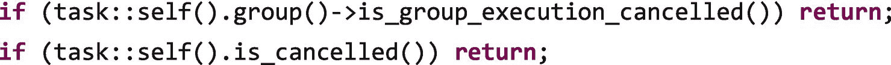

下一个问题:新任务分配给哪个`TGC`？当然，我们有设备来完全控制这种映射，但是也有一个默认的行为是值得了解的。首先，我们介绍如何手动将任务映射到一个`TGC`中。

### TGC 的明确分配

正如我们所见，我们可以创建`TGC`对象，并将它们传递给高级并行算法(`parallel_for,...`)和低级任务 API ( `allocate_root()`)。请记住，在第 [10](10.html#b978-1-4842-4398-5_10) 章中，我们还介绍了作为中级 API 的`task_group`类，用于轻松创建共享`TGC`的任务，这些任务可以通过单个动作同时取消或分配优先级。使用同一个`task_group::run()`成员函数发起的所有任务将属于同一个`TGC`，因此组中的一个任务可以取消整个帮派。

作为一个例子，考虑图 [15-3](#Fig3) 的代码，其中我们重写了一个`data`向量中“隐藏”的给定值的并行搜索，并得到它存储的索引。这一次，我们使用手动实现的分而治之的方法，该方法使用了`task_group`特性(`parallel_for`方法实际上正在做一些类似的事情，即使我们没有看到)。


图 15-3

使用`task_group`类手动实现并行搜索

为了方便起见，向量`data`、结果索引`myindex`和`task_group`、`g`都是全局变量。这段代码递归地将搜索空间一分为二，直到某个`grainsize`(我们在第 [10 章](10.html#b978-1-4842-4398-5_10)中看到的`cutoff`值)。函数`ParallelSearch(begin,end)`是用来完成这种并行划分的函数。当粒度变得足够小时(在我们的例子中是 100 次迭代)，调用`SequentialSearch(begin,end)`。如果我们寻找的值–2 在`SequentialSearch`内遍历的一个范围中找到，那么在我们的四核笔记本电脑中使用`g.cancel().`取消所有产生的任务，对于 N 等于 1000 万，这是我们算法的输出:

```cpp

  SerialSearch:   5000000 Time: 0.012667
  ParallelSearch: 5000000 Time: 0.000152 Speedup: 83.3355

```

`5000000`是我们已经找到的`-2`值的索引。看看加速，我们会被它比顺序代码快 83 倍的速度所迷惑。然而，这是我们见证并行实现比顺序实现需要做更少工作的情况之一:一旦任务找到了密钥，就不再需要遍历向量`Data`。在我们的运行中，键在向量的中间，`N/2`，顺序版本必须到达那个点，而并行版本在不同的位置开始并行搜索，例如，0，`N/4, N/2, N·3/4`，等等。

如果你对所实现的速度提升感到惊讶，那就等着瞧吧，因为我们可以做得更好。记住`cancel()`不能终止已经运行的任务。但是同样，我们可以从一个正在运行的任务中查询，以检查`TGC`中是否有不同的任务取消了执行。为了使用`task_group`类实现这一点，我们只需要插入:


在`ParallelSearch()`功能开始时。这个明显较小的 mod 导致这些执行时间:

```cpp

SerialSearch:   5000000 Time: 0.012634
ParallelSearch: 5000000 Time: 2e-06 Speedup: 6317

```

我们希望我们能在四核机器上一直获得这样的并行加速！！

### 注意

高级且很少需要:除了显式创建一个`task_group`，为 TBB 并行算法设置`TGC`，以及使用`allocate_root`为根任务设置 TCG，我们还可以使用其成员函数来更改任何任务的 TGC:

`void task::change_group(task_group_context& ctx);`

因为我们可以使用`task::group()`查询任何任务的`TGC`，所以我们可以完全控制将任何任务移动到任何其他任务的`TGC`。例如，如果两个任务可以访问一个`TGC_X`变量(假设您有一个全局`task_group_context ∗TGC_X`)，并且第一个任务已经执行了这个变量:

`TGC_X=task::self().group();`

然后第二个可以这样执行:

`task::self().change_group(∗TGC_X);`

### TGC 的默认分配

现在，如果我们不显式指定`TGC`，会发生什么？默认行为有一些规则:

*   创建`task_scheduler_init`(通过使用 TBB 算法显式或隐式创建)的线程创建自己的`TGC`，标记为“**隔离的**该线程执行的第一个任务属于那个`TGC`，后续子任务继承同一个父任务的`TGC`。

*   当这些任务中的一个调用并行算法而没有显式地传递一个`TGC`作为可选参数(例如，`parallel_for`、`parallel_reduce`、`parallel_do`、`pipeline`、流程图等)时。)，现在标记为“ **bound** ”的新`TGC,`被隐式地创建，用于将在该嵌套算法中协作的新任务。因此，这个`TGC`是一个绑定到独立父`TGC`的子*。*

*   如果并行算法的任务调用嵌套的并行算法，则为这个新算法创建新的绑定子代`TGC`，其中父代现在是调用任务的`TGC`。

图 [15-4](#Fig4) 中描述了一个由假想的 TBB 码自动构建的`TGC`树林的例子。

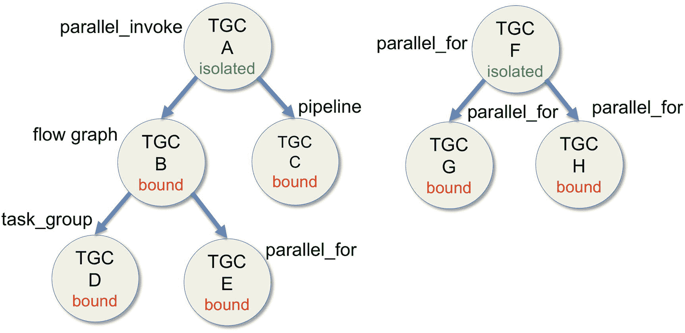

图 15-4

运行假想的 TBB 代码时自动创建的`TGC`树森林

在我们假设的 TBB 代码中，用户想要嵌套几个 TBB 算法，但是对`TGC` s 一无所知，所以他只是调用这些算法，而没有传递可选的显式的`TGC`对象。在一个主线程中，有一个对`parallel_invoke`的调用，它自动初始化调度程序，创建一个竞技场和第一个隔离的`TGC`、`A`。然后，在`parallel_invoke`中，创建了两个 TBB 算法，一个流图和一个`pipeline`。对于这些算法中的每一个，自动创建一个新的`TGC`、`B`和`C`，并绑定到`A`。在其中一个流程图节点中，创建了一个`task_group`，并且在不同的流程图节点中实例化了一个`parallel_for`。这导致两个新创建的`TGC`、`D`和`E`，它们被绑定到`B`。这就形成了我们的`TGC`森林的第一棵树，它有一个孤立的根，所有其他的`TGCs`都绑定在这里，也就是说，它们有一个父树。第二棵树构建在一个不同的主线程中，它创建了一个只有两个并行范围的`parallel_for`，并且为每个范围调用一个嵌套的`parallel_for`。还是那句话，树根是一个孤立的`TGC`、`F`，其他的`TGCs`、`G`和`H`，都是绑定的。请注意，用户只是编写了 TBB 代码，将一些 TBB 算法嵌套到其他 TBB 算法中。是 TBB 机器为我们创造了`TGC` s 的森林。不要忘记任务:有几个任务共享每个`TGC`。

现在，如果任务被取消会发生什么？别紧张。规则是包含这个任务的整个`TGC`被取消，但是取消也向下传播。例如，如果我们取消了流程图的一个任务(`TGC B`)，我们也会取消`task_group` ( `TGC D`)和`parallel_for` ( `TGC E`)，如图 [15-5](#Fig5) 所示。这是有意义的:我们正在取消流程图，以及从那里创建的一切。这个例子有些做作，因为可能很难找到这种算法嵌套的实际应用。然而，它说明了不同的`TGC`是如何自动链接在一起，以处理被大肆吹嘘的 TBB 的可组合性。

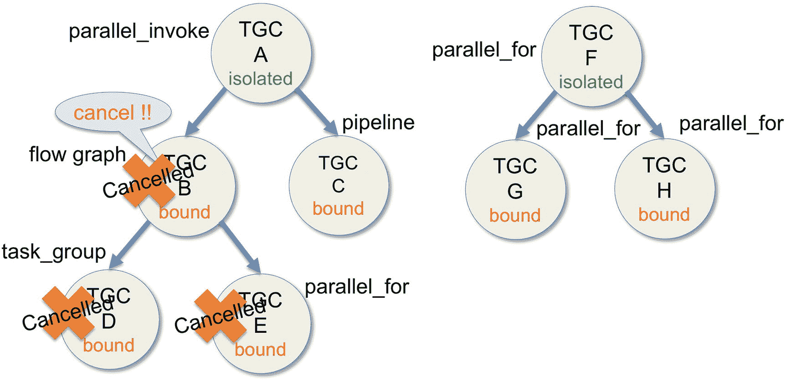

图 15-5

从属于`TGC B`的任务中调用取消

但是等等，我们可能想要取消流图和`task_group`，但是保持`parallel_for` ( `TGC E`)的活力。好吧，这也可以通过手动创建一个隔离的`TGC`对象并将其作为 parallel for 的最后一个参数来传递。为此，我们可以编写类似于图 [15-6](#Fig6) 的代码，其中流程图`g`的`function_node`利用了这种可能性。

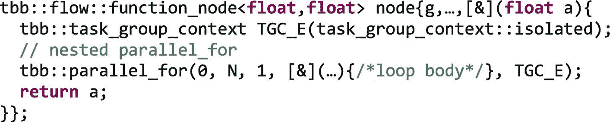

图 15-6

从`TGC`的树中分离嵌套算法的替代方法

隔离的`TGC`对象`TGC_E`在堆栈上创建，并作为最后一个参数传递给`parallel_for`。现在，如图 [15-7](#Fig7) 所示，即使流程图的一个任务取消了它的`TGC B`，取消向下传播到`TGC D`，但是不能到达`TGC E`，因为它已经从树中分离出来创建了。

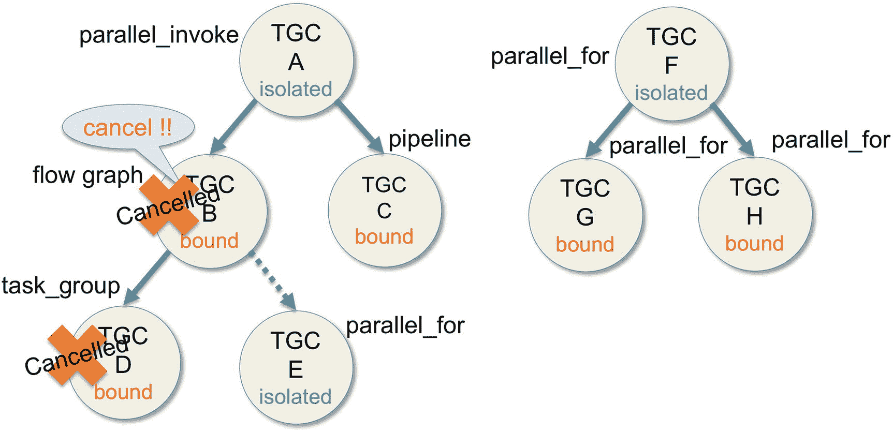

图 15-7

`TGC E`现在被隔离，不会被取消

更准确地说，孤立的`TGC E`现在可以是我们的`TGC` s 森林中另一棵树的根，因为它是一个孤立的`TGC`，并且它可以是为更深层次的嵌套算法创建的新`TGC`的父代。我们将在下一节看到一个这样的例子。

总的来说，如果我们嵌套 TBB 算法而没有显式地传递一个`TGC`对象给它们，那么默认的`TGC` s 的森林将会在取消的情况下产生预期的行为。然而，通过创建必要数量的`TGC`对象并将它们传递给期望的算法，这种行为可以由我们随意控制。例如，我们可以创建一个单独的`TGC`、`A`，并将其传递给我们假设的 TBB 示例的第一个线程中调用的所有并行算法。在这种情况下，所有算法中协作的所有任务都将属于那个`TGC A`，如图 [15-8](#Fig8) 所示。如果现在流程图的一个任务被取消，不仅嵌套的`task_group`和`parallel_for`算法也被取消，所有共享`TGC A`的算法也被取消。

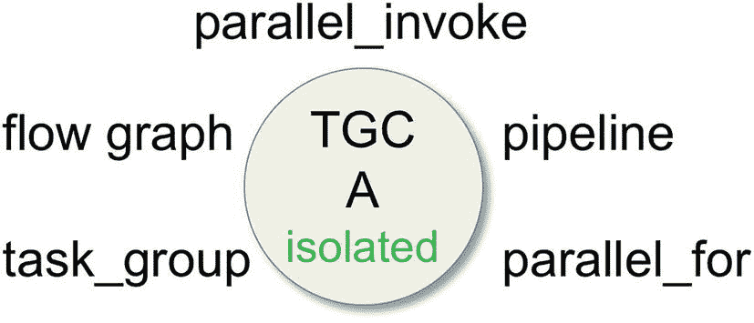

图 15-8

在修改了我们假设的 TBB 代码之后，我们将单个 TGC A 传递给所有的并行算法

关于取消的最后一点，我们想强调的是，有效地跟踪`TGC`的森林以及它们是如何被链接起来的，是一件非常具有挑战性的事情。感兴趣的读者可以看看 Andrey Marochko 和 Alexey Kukanov 的论文(参见“更多信息”部分),其中他们详细阐述了实现决策和内部细节。主要的收获是，如果不需要取消，要非常小心地确保`TGC`记账不会影响性能。

## TBB 的异常处理

### 注意

如果对 C++ 异常不太熟悉，这里有一个例子可以帮助说明基本原理:

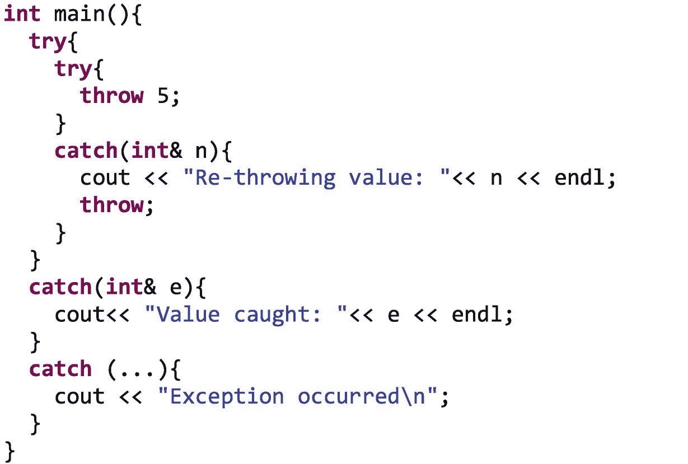

运行这段代码后的输出是

`Re-throwing value: 5Value caught: 5`

正如我们所看到的，第一个 try 块包含一个嵌套的 try catch。这个异常抛出一个值为 5 的整数。因为 catch 块匹配类型，所以这段代码成为异常处理程序。这里，我们只打印接收到的值，并向上重新抛出异常。在外层有两个 catch 块，但是第一个被执行，因为参数类型与抛出值的类型相匹配。外部级别中的第二个 catch 会收到一个省略号(…)，因此如果异常具有前面 catch 函数链中未考虑的类型，它将成为实际的处理程序。例如，如果我们抛出 5.0 而不是 5，输出消息将是“发生了异常”

既然我们已经了解了取消是支持 TBB 异常管理的关键机制，那么让我们来看看问题的实质。我们的目标是掌握执行异常的防弹代码的开发，如图 [15-9](#Fig9) 所示。

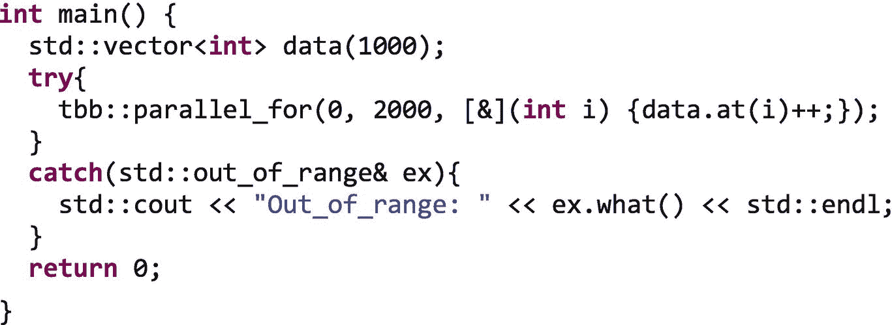

图 15-9

TBB 异常处理的基本示例

好吧，也许它还没有完全防弹，但作为第一个例子，它已经足够好了。事情是这样的，向量`data`只有 1000 个元素，但是`parallel_for`算法坚持走到位置 2000-1。雪上加霜的是，`data`不是用`data[i],`访问的，而是用`Data.at(i)`，与前者相反，它增加了边界检查，如果我们不遵守规则，就会抛出`std::out_of_range`对象。因此，当我们编译并运行图 [15-9](#Fig9) 的代码时，我们会得到

```cpp

Out_of_range: vector

```

正如我们所知，将产生几个任务来并行增加`data`元素。他们中的一些人会试图在超过 999 的位置增加。首先触及越界元素的任务，例如`data.at(1003)++`，显然必须取消。然后，`std::vector::at()`成员函数抛出`std::out_of_range`，而不是递增不存在的 1003 位置。因为异常对象没有被任务捕获，所以它被向上重新抛出，到达 TBB 调度程序。然后，调度器捕捉异常并继续取消相应`TGC`的所有并发任务(我们已经知道整个`TGC`是如何被取消的)。此外，异常对象的副本存储在`TGC`数据结构中。当所有的`TGC`任务被取消时，`TGC`被终结，这在开始执行`TGC`的线程中再次抛出异常。在我们的例子中，这是调用`parallel_for`的线程。但是`parallel_for`在一个`try`块中，该块带有一个接收`out_of_range`对象的`catch`函数。这意味着`catch`函数成为最终打印异常消息的异常处理程序。`ex.what()`成员函数负责返回一个字符串，其中包含一些关于异常的详细信息。

### 注意

实施细节。编译器不知道 TBB 并行算法的线程本质。这意味着将这样的算法包含在 try 块中只会导致调用线程(主线程)受到保护，但是工作线程将执行也会抛出异常的任务。为了解决这个问题，调度程序已经包含了 try-catch 块，这样每个工作线程都能够拦截从其任务中逸出的异常。

`catch()`函数的参数应该通过引用传递。这样，捕获基类的单个 catch 函数就能够捕获所有派生类型的对象。例如，在图 [15-9](#Fig9) 中，我们可以将`catch` `(std::exception& ex)`写成`catch` `(std::out_of_range& ex)`，因为`std::out_of_range`是从`std::logic_failure`派生而来，而`std::logic_failure`又是从基类`std::exception`派生而来，通过引用捕获可以捕获所有相关的类。

并非所有的 C++ 编译器都支持 C++11 的异常传播特性。更准确地说，如果编译器不支持`std::exception_ptr`(在 C++11 之前的编译器中会发生这种情况)，TBB 就不能重新抛出异常对象的精确副本。为了弥补这一点，在这种情况下，TBB 将异常信息汇总到一个`tbb::captured_exception`对象中，这个对象可以被重新抛出。还有一些关于如何总结不同种类的异常(`std::exception`、`tbb::tbb_exception`或其他)的附加细节。然而，由于现在很难找到一个不支持 C++11 的编译器，我们不会额外关注这个 TBB 向后兼容特性。

## 定制我们自己的 TBB 例外

TBB 库已经提供了一些预定义的异常类，它们在图 B-77 的表格中列出。

但是，在某些情况下，衍生出我们自己特定的 TBB 例外是一种很好的做法。为此，我们可以使用抽象类`tbb::tbb_exception`，如图 [15-10](#Fig10) 所示。这个抽象类实际上是一个接口，因为它声明了我们被迫在派生类中定义的五个纯虚函数。

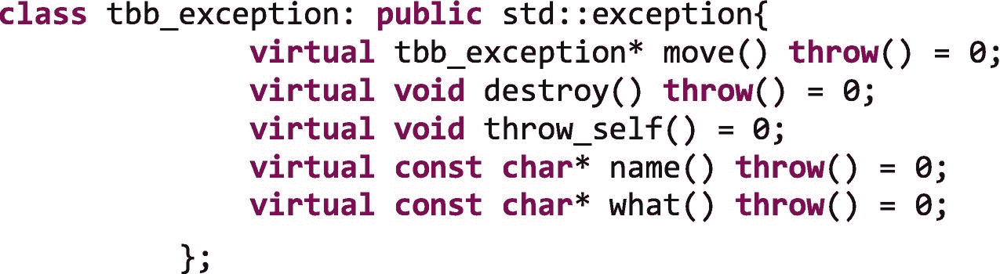

图 15-10

从`tbb::tbb_exception`派生出我们自己的异常类

`tbb_exception`界面的纯虚函数的细节如下

*   `move()`应该创建一个指向异常对象的副本的指针，该副本可以比原始对象存在的时间更长。移动原件的内容是明智的，尤其是如果它将被销毁。紧接在`move()`之后的`throw()`(以及`destroy()`、`what()`、`name()`中的函数说明)只是通知编译器这个函数不会抛出任何东西。

*   `destroy()`应该销毁由`move()`创建的副本。

*   `throw_self()`应投`∗this`。

*   `name()`通常返回最初拦截的异常的 RTTI(运行时类型信息)名称。它可以通过使用`typeid`操作符和`std::type_info`类来获得。例如，我们可以返回`typeid(∗this).name()`。

*   `what()`返回描述异常的空终止字符串。

然而，与其实现从`tbb_exception`派生所需的所有虚函数，还不如使用 TBB 类模板`tbb::movable_exception`来构建我们自己的异常，这样更容易，也更好。在内部，这个类模板为我们实现了所需的虚函数。之前描述的五个虚函数现在是常规的成员函数，我们可以选择是否覆盖它们。然而，正如我们在签名摘录中看到的，还有其他可用的功能:

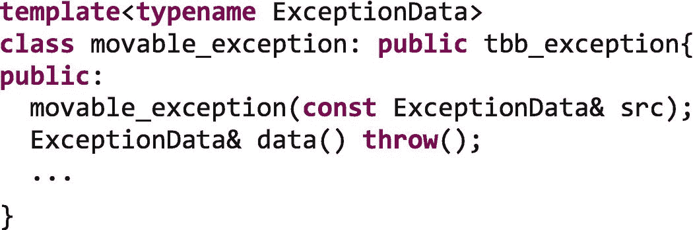

将举例说明`movable_exception`构造器和`data()`成员函数。假设除以 0 是一个我们想要明确捕捉的异常事件。在图 [15-11](#Fig11) 中，我们展示了如何在类模板`tbb::movable_exception`的帮助下创建自己的异常。


图 15-11

配置我们自己的可移动异常的方便选择

我们用我们希望与异常一起移动的数据创建我们的自定义类`div_ex`。在这种情况下，有效载荷是整数`it`，它将存储被 0 除的位置。现在我们能够创建一个对象，`movable_exception`类的`de`，用模板参数`div_ex`实例化，如我们在下面的代码行中所做的:

```cpp

tbb::movable_exception<div_ex> de{div_ex{i}};

```

我们可以看到，我们传递了一个构造器`div_ex`，`div_ex{i}`，作为参数给构造器`movable_exception<div_ex>.`

稍后，在 catch 块中，我们捕获异常对象为`ex`，并使用`ex.data()`成员函数获取对`div_ex`对象的引用。这样，我们就可以访问在`div_ex`中定义的成员变量和成员函数，如`name()`、`what()`和`it`。当输入参数`n=1000000`为

```cpp

Exception name: div_ex
Exception: Division by 0! at position: 500000

```

虽然我们添加了`what()`和`name()`作为自定义`div_ex`类的成员函数，但是现在它们是可选的，所以如果我们不需要它们，我们可以去掉它们。在这种情况下，我们可以按如下方式更改 catch 块:


因为这个异常处理程序只有在接收到`movable_exception<div_ex>`时才会被执行，而这只有在被`0`除的情况下才会发生。

## 放在一起:可组合性、取消和异常处理

为了结束这一章，让我们用最后一个例子回到 TBB 的可组合性方面。在图 [15-12](#Fig12) 中，我们有一个代码片段显示了一个`parallel_for`，它将遍历矩阵`Data`的行，如果不是因为它在第一次迭代中抛出了一个异常(实际上是字符串“oops”)。！对于每一行，嵌套的`parallel_for`也应该并行遍历`Data`的列。


图 15-12

嵌套在引发异常的外部`parallel_for`中的`parallel_for`

假设四个不同的任务正在运行外层循环的四个不同迭代`i`，并调用内层循环`parallel_for`。在那种情况下，我们可能会得到一个类似于图 [15-13](#Fig13) 的`TGC`树。

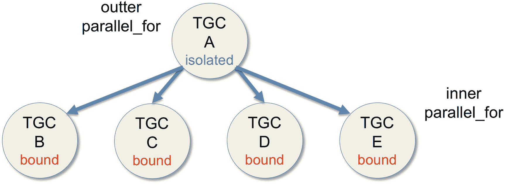

图 15-13

图 [15-12](#Fig12) 中代码的可能 TGCs 树

这意味着当我们在外部循环的第一次迭代中到达关键字`throw`时，有几个内部循环正在运行。然而，外层中的异常向下传播，也取消了内部并行循环，不管它们在做什么。这种全局取消的可见结果是，一些正在将值从 false 更改为 true 的行被中断，因此这些行将具有一些 true 值和一些 false 值。

但是看，每一行都有一个名为`root`的孤立的`task_group_context`，这要感谢这一行:

```cpp

tbb::task_group_context root(task_group_context::isolated);

```

现在，如果我们将这个`TGC`根作为内部`parallel_for`的最后一个参数传递，取消对该行的注释:


我们得到了`TGC`的不同配置，如图 [15-14](#Fig14) 所示。


图 15-14

TGC 的不同配置

在这种新的情况下，异常引发了抛出它的`TGC`、`TGC A`的取消，但是没有`TGC A`的子节点可以取消。现在，如果我们检查数组`data`的值，我们将看到行要么全部是真元素，要么全部是假元素，而不是像前一种情况那样是混合元素。这是因为一旦内部循环开始用真值设置一行，就不会中途取消。

在更一般的情况下，如果我们可以这样说图 [15-4](#Fig4) 中的 TGC 树的森林，如果一个嵌套算法抛出一个在任何级别都没有被捕获的异常，会发生什么呢？例如，让我们假设在图 [15-15](#Fig15) 的`TGC` s 的树中，在流图(`TGC B`)内部抛出了一个异常。


图 15-15

嵌套 TBB 算法中引发的异常的影响

当然，`TGC B`和后代`TGCs D`和`E`也被取消了。我们知道。但是异常向上传播，并且如果在那个级别它也没有被捕获，它也将引发`TGC A`中任务的取消，并且因为取消向下传播，`TGC C`也死亡。太好了。这是预期的行为:一个异常，不管它被抛出到什么级别，都可以优雅地抛弃整个并行算法(就像它抛弃串行算法一样)。我们可以通过在期望的级别捕获异常或者通过在隔离的`TGC`中配置所需的嵌套算法来防止取消链。是不是很整洁？

## 摘要

在本章中，我们看到取消 TBB 并行算法和使用异常处理来管理运行时错误是很简单的。如果我们采用默认行为，这两个特性都可以按预期的那样开箱即用。我们还讨论了 TBB 的一个重要特征，任务组上下文，`TGC`。这个元素是 TBB 中取消和异常处理实现的关键，可以手动利用它来更好地控制这两个特性。我们开始讲述取消操作，解释一个任务如何取消它所属的整个`TGC`。然后我们回顾了如何手动设置任务映射到的`TGC`，以及当开发人员没有指定映射时应用的规则。默认规则导致预期的行为:如果一个并行算法被取消，那么所有嵌套的并行算法也被取消。然后我们继续讨论异常处理。同样，TBB 异常的行为类似于顺序代码中的异常，尽管 TBB 的内部实现要复杂得多，因为由一个线程执行的一个任务中抛出的异常可能最终被另一个线程捕获。当编译器支持 C++11 特性时，可以在线程之间移动异常的精确副本，否则，在`tbb::captured_exception`中捕获异常的摘要，以便可以在并行上下文中重新抛出。我们还描述了如何使用类模板`tbb::movable_exception`配置我们自己的异常类。最后，我们通过阐述可组合性、取消和异常处理是如何相互作用的来结束这一章。

## 更多信息

以下是我们推荐的一些与本章相关的额外阅读材料:

*   A.Marochko 和 A. Kukanov,《英特尔线程构建模块任务调度器中的可组合并行基础》,《并行计算进展》,第 22 卷，2012 年。

*   Deb Haldar，15 大 C++ 异常处理错误以及如何避免它们。 [`www.acodersjourney.com/2016/08/top-15-c-exception-handling-mistakes-avoid/`](http://www.acodersjourney.com/2016/08/top-15-c-exception-handling-mistakes-avoid/) 。

[](https://creativecommons.org/licenses/by-nc-nd/4.0) 

**开放存取**本章根据知识共享署名-非商业-非专用 4.0 国际许可协议(http://Creative Commons . org/licenses/by-NC-nd/4.0/)的条款进行许可，该协议允许以任何媒体或格式进行任何非商业使用、共享、分发和复制，只要您适当注明原作者和来源，提供知识共享许可协议的链接，并指出您是否修改了许可材料。根据本许可证，您无权共享从本章或其部分内容派生的改编材料。

本章中的图像或其他第三方材料包含在该章的知识共享许可中，除非该材料的信用额度中另有说明。如果材料未包含在本章的知识共享许可中，并且您的预期用途不被法定法规允许或超出了允许的用途，您将需要直接从版权所有者处获得许可。