# 十九、Steroids 上的流程图：penCL 节点

`async_node`是否让你渴望更多？如果是这样，这就是你的篇章。在这里，我们将介绍一个高级流程图类`opencl_node`，它试图隐藏 OpenCL 设备的硬件细节和编程细节。为什么选择 OpenCL？原因有很多，仅举几个例子:OpenCL 是由一个大型联盟的成员贡献的开放标准，它被设计成一个独立于平台的 API，它的目标是灵活地发展以满足更新的需求。例如，OpenCL 一直是 C(不是 C++)的扩展，但是最新的 OpenCL 2.2 版本增加了对 C++14 子集的支持，包括类、lambda 表达式、模板等等。

这还不够吗？好吧，再来一个。对我们来说，所有原因中最突出的是可以使用 OpenCL 的平台的数量和种类。从笔记本电脑和台式机开始，这些系统中超过 95%的处理器都包含支持 OpenCL 的集成 GPU(通常来自英特尔或 AMD)。在移动领域，在大多数智能手机和平板电脑的核心，我们发现了一个片上系统，SoC，具有支持 OpenCL 的 GPU(是的，从 TBB 仓库我们也可以获得 Android 的 TBB 二进制文件)。这些例子看起来已经足够有说服力了，但还有更多！在嵌入式领域，多年来，我们已经能够购买和开发异构板，包括 OpenCL 可编程 FPGA(来自 Intel-Altera 和 Xilinx)。在服务器领域，在撰写这些文章时，英特尔的目标是采用 FPGA PCIe 卡和英特尔至强可扩展处理器 6138P 的数据中心，该处理器包括片上英特尔 Altera Arria 10 FPGA，当然，OpenCL 是受支持的编程模型之一。此外，OpenCL 代码还可以在许多 CPU 和其他类型的加速器上运行，如 Xeon Phi。

但是如果 OpenCL 不能满足您的需求，TBB 建筑师事务所也考虑了支持其他编程模型的可能性。他们将加速器编程模型的底层细节抽象成一个叫做*工厂*的模块。事实上，`opencl_node`是用特定工厂实例化一个名为`streaming_node`的通用类的结果。然后，工厂定义必要的方法来上传/下载数据到加速器和启动内核。也就是说，`opencl_node`是将`streaming_node`类与 OpenCL 工厂结合的结果。开发相应的工厂就可以支持更新的编程模型。

现在，这是一个相当长的章节，涵盖了几个概念(`opencl_node`、`opencl_program`、`,`、T3)、OpenCL 内核的参数和范围、子缓冲区等。)因此意味着陡峭的学习曲线。但是我们将从简单的开始，逐步提升到更复杂的类和例子(就像我们一直试图做的那样)。正如我们在图 [19-1](#Fig1) 中所描绘的，我们将从一个简单的`Hello World`——类似于使用`opencl_node`的例子开始，随后实现与前一章相同的三元矢量计算，但是现在使用我们新的高级玩具。如果你想把最后的攀登留到顶峰，你可以在那里停止阅读。另一方面，如果你是一个有经验的攀岩者，在本章的最后，我们会先睹为快更高级的特性，比如微调 OpenCL `NDRange`和内核规范。


图 19-1

描绘本章的学习曲线

## Hello OpenCL_Node 示例

这次让我们从结尾开始。这是我们第一个示例的输出:

```cpp

Hello OpenCL_Node
Bye! Received from: OPENCL_NODE

```

这两行是运行图 [19-2](#Fig2) 所示的流程图的结果，其中的气泡标识了由图中三个节点中的每一个打印的字符串。


图 19-2

流程图以“`Hello OpenCL_Node`”为例

中间的节点`gpu_node`，是一个`opencl_node`，打印出`OpenCL_Node\n`。为此，它将被配置为运行存储在`hello.cl`文件中的以下 OpenCL 内核:


`hello.cl`文件包括`cl_print()`内核的定义，该内核将由流程图的一个特殊节点，一个`opencl_node`执行。如果我们仔细看看内核函数，它实际上打印了作为输入参数出现的任何字符数组。此外，为了产生明显的影响，内核还通过只大写小写字母来改变字符串。参数的`char *str`声明之前的`global`关键字声明字符数组应该存储在 OpenCL 全局内存中。对于这里的问题(即过于简化)，这意味着字符串存储在内存的一个区域中，可以由 CPU 和 GPU“以某种方式”读取和写入。在集成 GPU 的常见情况下，全局内存只是位于主内存中。这意味着`opencl_node`应该接收一个字符数组作为参数。在我们的例子中，这个字符数组包含的字符是"`OpenCL_Node` \n "。正如您可能已经猜到的，这个消息来自第一个节点`in_node`。对，指向字符串的指针(图 [19-2](#Fig2) 中的`a`)从`in_node`飞到`gpu_node`，在没有用户干预的情况下，在 CPU 上初始化的字符串最终到达 GPU。什么消息到达`out_node`？同样，指针`a`离开`gpu_node`并以名称`m`进入`out_node`。最后，图中的最后一个节点打印出了“`Bye! Received from: OPENCL_NODE`”，我们注意到了字符串的变化，也注意到了在 GPU 上处理的字符串已经可以被 CPU 访问了。现在，我们都渴望实际实现的细节，所以它们在图 [19-3](#Fig3) 中。


图 19-3

构建“`Hello OpenCL_Node`”示例的流程图

就这样！注意，GPU 节点配置只需要三行 C++ 代码。是不是很整洁？

### 放弃

在写这一章的时候，TBB 的最新版本是 2019 年。在这个版本中，`opencl_node`仍然是一个预览功能，这实质上意味着

*   它可能会发生变化。如果您依赖代码中的预览功能，请在更新到较新的 TBB 版本时仔细检查它是否继续工作。在最坏的情况下，预览功能甚至会消失！

*   它可能没有什么文档和支持。事实上，`opencl_node`和`streaming_node`文档在网络上并不丰富。有一些博客条目 <sup>[1](#Fn1)</sup> 说明了这个特性，但是它们已经有 3 年的历史了，而且 API 的一部分也已经改变了。

*   必须明确启用它(即，默认情况下它是关闭的)。为了在我们的代码中使用`opencl_node`,我们必须添加这三行代码:

    

使用这个头文件的额外好处是你不需要手动包含`tbb/flow_graph.h`或者 OpenCL 头文件，因为它们已经包含在`flow_graph_opencl_node.h`中了。实际上，这个头文件和博客条目是目前我们关于这个特性提供的类和成员函数的最可靠的信息来源。这一章应该被认为是对包含在`opencl_node`头文件中的 1050 行代码的简单介绍。

好吧，我们一点一点来。如果你记得上一章的例子，第一个`in_node`看起来很熟悉。为了提醒我们，可以说:( 1)lambda`([&](buffer_t& a)`的输入参数实际上是对将被发送到任何连接节点的消息的引用；(2)只有一条消息离开`in_node`,因为在第一次调用后它返回 false 以及(3) `in_node.activate()`实际上唤醒节点并触发该单个消息。但是等等，在这个节点中有一些新的东西是我们必须注意的！离开`in_node`的消息必须在 GPU 可访问的内存区域结束，这就是为什么参数`a`不仅仅是一个字符数组，而是对一个`buffer_t`的引用。就在定义`in_node`之前，我们看到`buffer_t`是 OpenCL chars ( `cl_char`)的一个`opencl_buffer`:


`opencl_buffer`是我们将在本章中看到的第一个`opencl_node`助手类，但是还有更多。它是一个模板类，抽象了强类型线性数组，封装了主机和加速器之间的内存事务逻辑。我们使用类的构造器来分配一个`opencl_buffer<T>`，就像我们的例子中的行`a = buffer_t{sizeof(str)}`，或者通过用


在这两种情况下，我们最终都会分配一个`cl_char`的`opencl_buffer`。我们现在使用的 OpenCL 工厂版本基于 OpenCL 1.2，并利用了零拷贝缓冲区方法。这意味着，在内部，当调用`opencl_buffer`构造器时，OpenCL 函数`clCreateBuffer`被调用，它的一个参数是`CL_MEM_ALLOC_HOST_PTR`。正如我们在前一章简单解释的那样，缓冲区是在 GPU 空间上分配的，但是 CPU 可访问的指针(缓冲区的 CPU 视图)可以使用映射函数(`clEnqueueMapBuffer`)获得。为了将缓冲区的控制权交还给 GPU，OpenCL 提供了一个`unmap`函数(`clEnqueueUnmapMemObject`)。在集成 GPU 的现代芯片上，map 和`unmap`函数很便宜，因为不需要实际的数据副本。对于这些情况，`map`和`unmap`函数负责保持 CPU 和 GPU 缓存与存储在全局内存(主内存)中的副本一致，这可能意味着也可能不意味着 CPU/GPU 缓存刷新。好消息是，所有这些低级的杂务都不关我们的事了！可以开发具有更好特性或支持其他加速器的新工厂，我们可以通过简单地重新编译我们的源代码来使用它们。考虑一下，如果明天公开一个 OpenCL 2.0 工厂，并且我们的加速器实现了细粒度的缓冲 SVM。仅仅通过使用新的 OpenCL 2.0 工厂而不是 1.2 工厂，我们将免费获得性能提升(因为现在`map`和`unmap`操作是不必要的，CPU 和 GPU 之间的缓存一致性由硬件自动保持)。

哎呀，抱歉让我们的思绪飘了一会儿。让我们回到正题。我们在图 [19-3](#Fig3) 中解释了我们例子中的`source_node`(是的，几段之前)。这个`source_node`、`in_node`，只是用字符串`OpenCL_Node\n`初始化一个`chars`、`str`的数组，分配适当大小的`opencl_buffer`、`a`，并使用`std::copy_n` STL 算法将字符串复制到那个缓冲区。就这样。当这个`source_node`的 lambda 结束时，引用`opencl_buffer`的消息将从`in_node`飞到`gpu_node`。

现在，记住配置`gpu_node`所需的行:

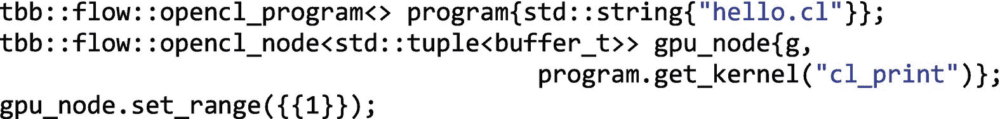

第一行使用了我们在本章中提到的第二个`opencl_node`助手类:`opencl_program`类。在这一行中，我们创建了`program`对象，并将文件名`hello.cl`传递给构造器，OpenCL 内核`cl_print`就存储在这里。如果我们想提供一个预编译的内核或者内核的 SPIR (OpenCL 中间表示)版本，还有其他的`opencl_program`构造器可用。为了不让人分心，并专注于我们的例子，我们将在后面讨论这些替代方法。

第二行创建了类型为`opencl_node<tuple<buffer_t>>`的`gpu_node`。这意味着`gpu_node`接收类型为`buffer_t`的消息，完成后，它发出类型为`buffer_t`的消息。对于单个参数/端口，我们真的需要一个元组吗？嗯，`opencl_node`被设计为从前面的节点接收几个消息，并向图中后面的节点发送几个消息，这些消息被打包到一个元组中。目前，接口中没有针对单个输入和输出的特殊情况，因此我们需要在这种情况下使用单个元素元组。关于`opencl_node`端口和内核参数之间的对应关系，默认情况下，`opencl_node`将第一个输入端口绑定到第一个内核参数，第二个输入端口绑定到第二个内核参数，依此类推。后面还会谈到其他的可能性。

我们真的需要为每个传入的消息发送一个传出的消息吗？嗯，`opencl_node`被设计成支持这种最大连接性(每个输入端口一个输出端口),如果输入少于输出，或者相反，我们总是可以保持相应的端口不连接。我们真的需要对输入和输出使用相同的数据类型吗？嗯，就目前的工厂来说，是的。如果输入端口 0 是类型`T`，输出端口 0 也是同样的`T`类型(指定参数类型的元组不区分输入和输出)。

### 注意

支持`opencl_node`实现决策的主要原因是每个`opencl_node`的端口都有可能被映射到每个 OpenCL 内核参数中。对于一个“输入-输出”参数，在输入和输出都有它当然是有意义的。对于一个“out”参数，我们仍然需要传入要写入的对象，因此需要一个输入来匹配输出——否则`opencl_node`将需要分配对象，但它没有。最后，对于一个“in”参数，让它在输出端可用可以让我们转发值，也就是说，不加修改地将它传递给下游节点。所以，最实际的事情就是把所有的论点都放进去。我们相信，如果我们将 OpenCL 节点的 tuple 视为一个参数列表，那么这是有意义的，我们可以将边连接到任何参数，以在执行之前/之后设置/获取值。对于“`in`”参数，相应的发出值不变。对于一个“`out`”参数，我们提供了要写入的内存，并在稍后获取值。对于“`in-out`”，我们发送值并接收修改后的值。

请记住，OpenCL 节点是一个预览功能。TBB 开发者渴望预览功能的输入——这就是为什么他们毕竟是预览功能。他们希望收集好的和坏的信息，这样他们就可以花时间完善图书馆中人们最关心的部分。这个 OpenCL 节点的预览版应该足够好，可以试用并提供反馈。如果我们对需要添加什么有强烈的意见，我们应该说出来！

现在，`opencl_node`的构造器包含流图对象`g`作为参数，以及应该包含在 OpenCL 程序文件中的内核函数的句柄。由于文件`hello.cl`包含内核函数`cl_print`，我们使用成员函数:`program.get_kernel("cl_print")`。

这意味着我们可以在同一个 OpenCL 源文件中有几个内核函数，并将每个函数分配给不同的`opencl_nodes`。我们真的必须用一个程序文件来解决吗？不完全是。如果我们将 OpenCL 内核分布在几个源文件中，我们可以实例化期望数量的`opencl_program`对象。

最后，配置`gpu_node`所需的第三行代码是`gpu_node.set_range({{1}})`。这个来自`opencl_node`的成员函数指定了 GPU 将要遍历的迭代空间。更正式地说，在 OpenCL 行话中，这个迭代空间被称为`NDRange`，但是我们现在不要详细讨论这些细节。现在，让我们大胆地相信,`set_range({{1}})`成员函数导致内核主体只被执行一次。

现在我们已经完成了`source_node`(`in_node`)`opencl_node`(`gpu_node`)，我们例子中的最后一个是一个名为`out_node`的常规`function_node`。对应的代码是


我们看到`out_node`收到了一条`buffer_t`类型的`m`消息。因为`buffer_t`实际上是一个`opencl_buffer<cl_char>`，所以调用`m.begin()`会产生一个 CPU 可见的指针，指向最初在`in_node`中设置的、后来被 GPU 内核修改的字符串。我们的最后一个节点只是打印这个字符串，然后死亡。

示例的其余部分是通常的流图粘合逻辑，它在节点之间形成边，唤醒源节点，并等待所有消息(在我们的示例中只有一条)通过节点。这里没什么新鲜的。

然而，在我们开始攀登我们的第一座山峰之前，我们将对我们刚刚解释的内容进行一次高级别的回顾，同时更深入地了解消息`a`发生了什么，该消息诞生在 CPU 上，发送到 GPU 并在那里进行修改，然后传递到最终节点，在那里我们可以看到 GPU 内核执行的效果。我们希望图 [19-4](#Fig4) 能在这方面很好地为我们服务。

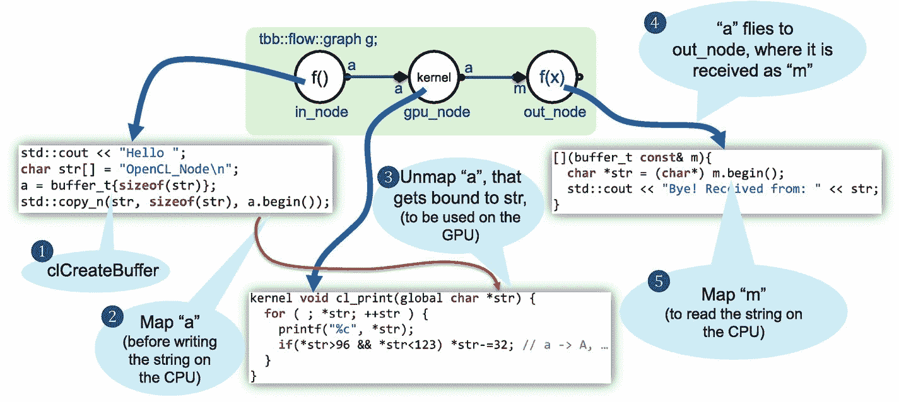

图 19-4

包含消息操作细节的示例概述

图片假设 OpenCL 工厂是基于这个标准的 1.2 版本。在这种情况下，消息`a`作为`opencl_buffer`被分配在 GPU 内存空间中，但是如果我们首先使用`a.begin()`获得 CPU 可访问的迭代器，它也可以被写到 CPU 上。对`a`的引用是离开`in_node`并进入`gpu_node`的端口 0 的消息(这将总是导致消息-对`a`的引用-通过出发端口 0 离开)。`gpu_node`的端口 0 被绑定到具有兼容类型的内核函数的第一个参数(`opencl_buffer<cl_char>`可以被强制转换为`char *`)。内核可以安全地访问字符串，而不会出现缓存一致性问题，因为在启动内核之前，OpenCL 工厂会负责解除缓冲区的映射。最后，对缓冲区的引用到达`out_node,`，在这里字符串再次被映射，以便在 CPU 上访问和打印。

在继续之前，我们想在这里强调我们应该感到多么幸运，因为我们不必手动处理所有的 OpenCL 样板代码(平台、设备、上下文、命令队列、内核读取和编译、内核参数设置和启动、OpenCL 资源解除分配等)。).多亏了 OpenCL 工厂，所有这些现在都隐藏在引擎盖下。此外，正如我们所说的，新工厂可以使我们的代码更快，或者能够与其他加速器一起工作，只需对源代码进行很小的更改或不做任何更改。

## 我们在哪里运行我们的内核？

到目前为止一切顺利，对吧？但是说到 OpenCL 样板代码，控制我们在哪个设备上运行我们的`opencl_nodes`的旋钮在哪里呢？在我们之前的例子中，我们说过`gpu_node`正在 GPU 上运行指定的内核。还有哪里，对吗？但是如果我们在撒谎呢？令人不安，是吧？好的，让我们先看看我们的机器上是否有更多支持 OpenCL 的设备。希望只有一个单一的设备，它是一个 GPU，但我不会赌我的手指！我们将不得不嗅出它，但是我们在情感上还没有准备好编写旧式的普通 OpenCL 代码，不是吗？幸运的是，TBB OpenCL 工厂给了我们两个额外的有价值的助手类(现在已经有四个了)。这些是`opencl_device`和`opencl_device_list`助手类。让我们首先在流程图上下文之外使用它们，如图 [19-5](#Fig5) 所示。


图 19-5

查询 OpenCL 平台和可用设备的简单代码

首先，通过调用函数`available_devices()` `.`初始化一个`opencl_device_list`对象`devices`，该函数返回一个可迭代容器，其中包含第一平台中所有可用的 OpenCL 使能设备。是的，仅在第一个可用的平台中。 <sup>[2](#Fn2)</sup> 然后，我们从列表中弹出第一个`opencl_device`、`d`，查询平台名称、概要文件、版本和厂商。平台中所有可用的设备将共享这些属性。

接下来，使用`for(opencl_device d:devices)`，我们遍历整个设备列表，获取并打印每个设备的名称、主版本和次版本以及设备类型。主版本和次版本信息已经由`d.platform_version()`提供，但是这个返回一个字符串，而`d.major_version()`和`d.minor_version()`都返回一个整数。在我们写这些代码的 MacBook 上运行这些代码的输出结果，以及我们运行之前例子的地方，可以在图 [19-6](#Fig6) 中看到。

### 注意

函数`available_devices()`实际上不是公共的，这就是我们必须使用这个错综复杂的名称空间链的原因:

`tbb::flow::interface10::opencl_info::available_devices()`

我们注意到，就在实现这个成员函数之前，在`flow_graph_opencl_node.h`内部有一个注释声明

`// TODO: consider opencl_info namespace as public API`

由于这是 TBB 的一个预览功能，界面还没有完全确定下来`.`考虑到这一点，以防这一考虑最终成为事实。


图 19-6

在 MacBook Pro 上运行图 [19-5](#Fig5) 的代码的结果

令人惊讶的是，一台笔记本电脑中可能有三个 OpenCL 设备！也就是说，一个英特尔 CPU 和两个 GPU，第一个集成在英特尔酷睿 i7 中，第二个是独立的 AMD GPU。请记住，OpenCL 是一种可移植的编程语言，也可以用来实现 CPU 代码。看，第一个支持 OpenCL 的设备不是 GPU，而是四核英特尔 CPU。现在，关于本章的第一个例子，内核在哪里运行？在第一点上，你是对的。默认情况下，OpenCL 工厂选择第一个可用的设备，不管它是 CPU 还是 GPU。所以…我们在撒谎！！！内核运行在伪装成 OpenCL 加速器的 CPU 上。如果我们在整本书里到处撒谎呢？想想看…那就更恐怖了(除非这是你正在读的第一章)。

好吧，我们来解决这个小麻烦。为了化险为夷，OpenCL 工厂提供了两个额外的特性:设备过滤器和设备选择器。设备过滤器用于用一组可用于内核执行的设备来初始化`opencl_factory`。所有过滤的设备必须属于同一个 OpenCL 平台。有一个默认的设备过滤器类`default_device_filter`，它自动从第一个 OpenCL 平台收集所有可用的设备，并返回一个包含这些设备的`opencl_device_list`。就其本身而言，设备选择器，顾名思义，选择那个`opencl_device_list`中的一个设备。不同的`opencl_node`实例可以使用不同的设备选择器。对于每个内核执行都要进行选择，所以对于不同的调用，在不同的设备上运行`opencl_node`也是可能的。默认选择器`default_device_selector`从设备过滤器构建的可用设备列表中选择并返回第一个设备。

让我们的`gpu_node`在真正的 GPU 上运行，而不是


我们应该使用


其中`gpu_selector`是我们自定义的对象`class gpu_device_selector:`

```cpp

gpu_device_selector gpu_selector;

```

而这个类呈现在图 [19-7](#Fig7) 中。

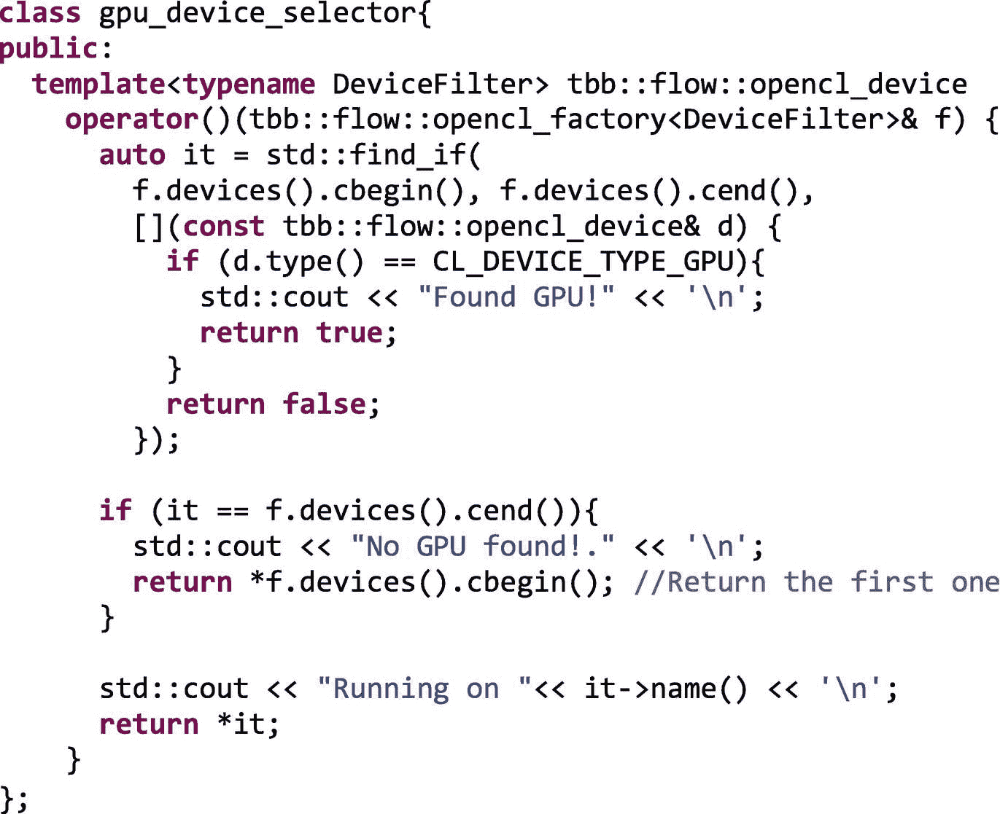

图 19-7

我们的首款定制器件选择器

协议(更正式的说法是“概念”)是，`opencl_node`的第三个参数是一个函子(带有`operator()`成员函数的类的对象)，它返回一个设备。这样，我们可以在它的位置嵌入一个 lambda 表达式，而不是传递函子。`operator()`接收一个`opencl_factory`、`f`，并返回一个`opencl_device`。使用`find_if` STL 算法，我们在满足`it->type()==CL_DEVICE_TYPE_GPU`的容器`devices()`中返回第一个迭代器`it`。为了方便起见，我们声明了`auto it`并委托给编译器去发现`it`的类型实际上是

```cpp

tbb::flow::opencl_device_list::const_iterator it = ...

```

考虑到找不到 GPU 设备的可能性，我们包括了一个返回第一个设备的回退(应该至少有一个！...没有任何设备的平台是没有意义的)。仿函数通过打印所选设备的名称并将其返回来结束。在我们的笔记本电脑中，输出将是:


注意，当该节点被激活时，新消息由`gpu_node`设备选择器仿函数打印出来。这是，首先`in_node`打印它的消息“Hello”并将消息传递给`gpu_node`，后者在启动内核之前选择设备(打印输出的粗体字)，然后运行内核。这是需要考虑的事情:流程图中的`opencl_node`通常会被激活几次，所以我们最好实现尽可能最轻的设备选择器。

比如`std::find_if`算法的 lambda 表达式不需要打印“找到 GPU！”消息，可以进一步简化:

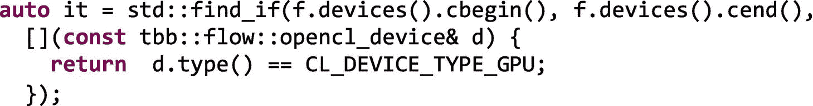

现在，如果我们不喜欢必须显式添加`gpu_device_selector`类的源代码的样子，我们可以用 lambda 表达式代替仿函数。这有点棘手，因为这个类的`operator()`是一个模板化的函数，还记得吗？：


(据我们所知)实现 lambda 最简单的方法是依赖从 C++14 开始就有的多态 lambda。不要忘记用选项`std=c++14`编译图 [19-8](#Fig8) 中的代码。

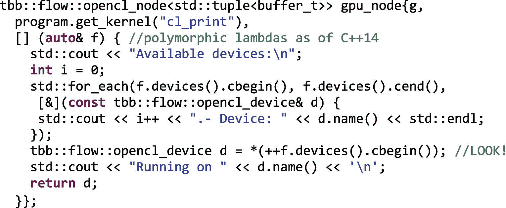

图 19-8

使用 lambda 表达式而不是仿函数进行设备选择

注意 lambda 的`(auto& f)`参数，而不是我们在基于函子的替代方案中使用的`(opencl_factory<DeviceFilter>& f)`。这段代码遍历`devices()`容器，然后返回列表中的第二个设备，结果类似于

```cpp

Available devices:
0.- Device: Intel(R) Core(TM) i7-6700HQ CPU @ 2.60GHz
1.- Device: Intel(R) HD Graphics 530
2.- Device: AMD Radeon Pro 450 Compute Engine
Running on Intel(R) HD Graphics 530

```

现在我们知道了我们的设备列表，并假设我们想要使用集成的 GPU，最好更改 lambda 以使其更快:

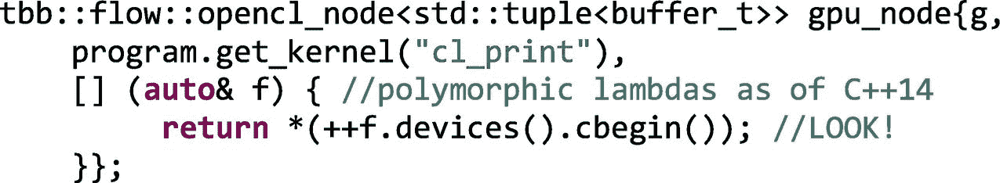

更快的替代方法是在我们第一次调用设备选择器时缓存`opencl_device`。例如，在图 [19-9](#Fig9) 中，我们绘制了图 [19-7](#Fig7) 中出现的`gpu_device_selector`类的修改草图。


图 19-9

第一次调用`opencl_device`时缓存它的设备选择器类

这个类现在有了一个`opencl_device`成员变量`device`。当第一次调用`operator()`时，遍历设备列表`f.devices()`，找到我们想要使用的设备(在本例中，是第二个可用的设备)。然后我们将它缓存到`device`变量中以备将来使用。请注意，如果可以从不同的线程同时调用该操作符，则需要进一步注意避免数据竞争。

我们希望你能保守我们对数字 [19-8](#Fig8) 和 [19-9](#Fig9) 的例子编码有多糟糕的秘密。在这些片段中，我们将设备硬编码为第二个设备，它可以在我们的测试机上工作，但在其他平台上可能会失败。实际上，如果有一个设备存储在`f.devices()`容器中，取消引用`*(++f.devices().cbegin())`将触发一个分段错误。这是便携性和性能之间权衡的又一个例子。如果我们不知道代码最终会在哪里运行，并且与 OpenCL 计算相比，设备选择时间可以忽略不计，那么我们最好使用图 [19-7](#Fig7) (注释掉打印语句)的版本。

## 第十八章[回到更现实的例子](18.html#b978-1-4842-4398-5_18)

你还记得我们在前一章介绍的三元组向量运算吗？这只是一个形式为`C = A +` α `*B`的基本数组操作，其中`A`、`B`和`C`是包含`vsize`浮点数的 1D 数组，α是一个标量，我们将其设置为 0.5(因为我们可以)。图 [19-10](#Fig10) 提醒我们三元组计算将根据变量`offload_ratio`在 GPU 和 CPU 之间分配的方式。


图 19-10

三元组计算的异构实现

重新实现这个例子的目的有两个。首先，通过重新访问我们的老熟人，但是现在从`opencl_node`的角度，我们将更好地欣赏 TBB 流图的这个更高层次特征的好处。其次，超越“`Hello OpenCL_Node`”将允许我们深入研究`opencl_node`类及其助手类的更高级的用法。在图 [19-11](#Fig11) 中，我们给出了我们将要实现的流程图的概述。


图 19-11

实现三元组的流程图，现在使用 OpenCL 节点

和我们前面的例子一样，`source_node` ( `in_node`)只是触发流程图的执行，在这个例子中，传递一条值为`offload_ratio`的消息。下游的下一个节点是`multifunction_node (dispatch_node).`,这种节点非常灵活，可以向图中的下一个节点发送消息。我们看到`dispatch_node`有五个输出端口，前四个针对`gpu_node`，最后一个连接到`cpu_node`。`gpu_node`是一个`opencl_node`，它将配置适当的三元组 GPU 内核，该内核期望数组`A`、`B`和`C`的“GPU 视图”作为输入参数(如前一章所述，它们被称为`Adevice`、`Bdevice,`和`Cdevice`)。然而，`gpu_node`有一个额外的端口来接收将要卸载的迭代次数，这取决于`offload_ratio`并且我们称之为`NDRange`来遵守 OpenCL 符号。`cpu_node`是一个常规的函数节点，它接收三个数组的“CPU 视图”以及`offload_ratio`,这样 CPU 就可以完成它的任务。`cpu_node`只有一个输入端口，所以`dispatch_node`必须将 CPU 所需的四个变量打包成一个元组。`gpu_node`和`cpu_node`都将它们自己的结果数组`C`的视图传递给`join_node`，后者又用两个视图构建一个元组，并将其转发给`out_node`。这个最终节点将验证计算是否正确，并打印出执行时间。事不宜迟，让我们从真正的实现开始，从图 [19-12](#Fig12) 中的数据类型定义和缓冲区分配开始。

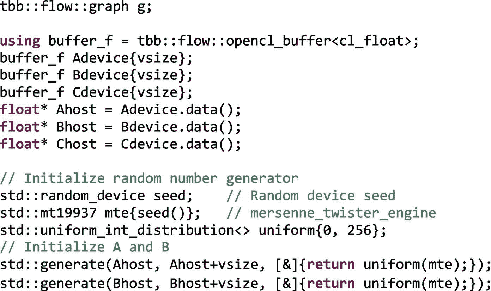

图 19-12

三元组示例中的数据类型定义和缓冲区分配

从现在开始，`buffer_f`是`cl_floats`的`opencl_buffer`(OpenCL 中常规浮点数据类型的对应类型)。这样，我们将`Adevice`、`Bdevice`和`Cdevice`分配为我们三个数组的“GPU 视图”。`opencl_buffer`类还公开了`data()`成员函数，这是我们在这里第一次看到。该函数返回一个指向 GPU 缓冲区的 CPU 可访问指针，并负责映射缓冲区，以便 CPU 可以访问它。这允许我们初始化指针`Ahost`、`Bhost`和`Chost`。使用 STL `generate`算法，我们用 0 到 255 之间的随机数初始化数组`A`和`B`，使用 Mersenne Twister 生成器(正如我们在第 [5](05.html#b978-1-4842-4398-5_5) 章中所做的)。

图的前两个节点`in_node`和`dispatch_node`在图 [19-13](#Fig13) 中定义。


图 19-13

三元组示例中的前两个节点`in_node`和`dispatch_node`

算法的这一部分非常简单。我们的老朋友`in_node`给`offload_ratio=0.5`发了一封短信给`dispatch_node`。`dispatch_node`属于以下类型:


这意味着它接收一个 float ( `offload_ratio`)并有五个输出端口发送对应于五个元组元素类型的消息。这个元组封装了这个多功能节点的五个输出端口的数据类型:三个数组的三个`buffer_f`(这里是`opencl_buffers`)、`NDRange`和一个为`cpu_node`打包所有信息的`tuple_cpu`。

定义`dispatch_node`主体的 lambda 表达式的两个输入参数是


在这里我们可以找到输入消息(`offload_ratio`)和一个句柄(`ports`)，它可以让我们访问五个输出端口中的每一个。现在，我们使用函数`get<port_number>(ports).try_put(message)`向相应的`port_number`发送消息。我们只需要对这个函数进行四次调用，就可以发送 GPU 正在等待的信息。请注意，这四个调用中的最后一个调用放置了一个只有一个元素等于`ceil(vsize*offload_ratio)`的 1D 数组，它对应于 GPU 上的迭代空间。使用`get<4>(ports).try_put(cpu_vectors).`，单个消息通过最后一个端口到达 CPU。之前，我们已经方便地将三个向量的 CPU 视图和向量分区信息(`ceil(vsize*offload_ratio)`)打包在`cpu_vectors`元组中。

有什么问题吗？确定吗？我们不想落下任何读者。那好吧。让我们继续看下两个节点的实现，这是问题的核心，真正的计算发生在这里，如图 [19-14](#Fig14) 所示。


图 19-14

在三元组示例中真正肩负重任的节点:`gpu_node`和`cpu_node`

虽然`cpu_node`是图 [19-14](#Fig14) 中的第二个，但我们将首先介绍它，因为它不太需要澄清。模板参数`<tuple_cpu, float*>`指出节点接收到一个`tuple_cpu`并发送一个指向`float`的指针。lambda 输入参数`cpu_vectors`在主体中用于将指针解包为三个向量和变量`start`(获得已经在`dispatch_node`上计算的值`ceil(vsize*offload_ratio)`)。利用该信息，a `parallel_for`在范围`blocked_range<size_t>(start, vsize)`中执行三元组计算，这对应于迭代空间的第二部分。

正如我们所说，GPU 负责这个迭代空间的第一部分，在这个上下文中称为`NDRange=[0, ceil(vsize*offload_ratio))`。GPU 内核的源代码与我们在上一章中介绍的相同，它只是接收三个数组，并对`NDRange`中的每个`i`进行三元运算:


这些内核行在`triad.cl`文件中，因此有这样一行:


图 [19-14](#Fig14) 开始。定制型`tuple_gpu`包三个`buffer_f`和`NDRange`。据此，我们将`gpu_node`声明为

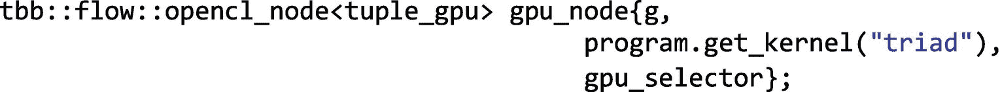

它选择程序文件的内核`triad`，并指定我们最喜欢的设备选择器`gpu_selector`。

现在出现了一个有趣的配置细节。四条消息到达`gpu_node`，我们之前提到过“`opencl_node`将第一个输入端口绑定到第一个内核参数，将第二个输入端口绑定到第二个内核参数，依此类推。”但是等等！内核只有三个参数！我们又说谎了！！？？好吧，这次不会。我们还说过这是默认行为，可以修改。以下是方法。

使用`gpu_node.set_args(port_ref<0,2>)`，我们声明到达端口 0、1 和 2 的消息应该绑定到内核的三个输入参数(`A`、`B`和`C`)。那`NDRange`呢？在图 [19-3](#Fig3) 中的第一个例子`Hello OpenCL_Node`中，我们只是使用`gpu_node.set_range({{1}})`来指定可能最小的`NDRange`常量值 1。但是在第二个更详细的例子中，`NDRange`是可变的，来自`dispatch_node`。我们可以绑定节点的第三个端口，它用`set_range()`函数接收`NDRange`，就像我们对行`gpu_node.set_range(port_ref<3>)`所做的那样。这意味着我们可以通过端口向`set_range()`传递一个常量或变量`NDRange`。成员函数`set_args()`应该支持同样的灵活性吧？我们知道如何将内核参数绑定到`opencl_node`端口，但是通常内核参数只需要设置一次，而不是每次调用都设置。

比方说，我们的内核接收α的值，它现在是一个用户定义的参数(不像以前那样硬连接到 0.5):

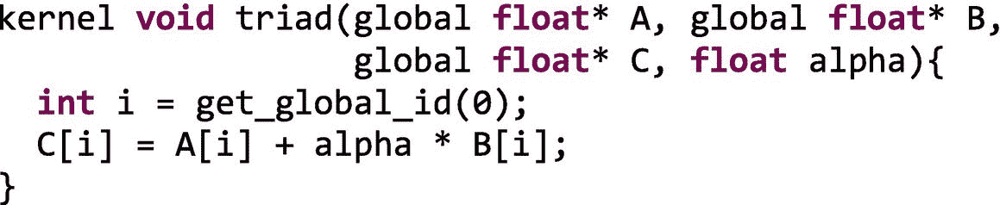

然后我们可以编写如下代码:`gpu_node.set_args(port_ref<0,2>, 0.5f)`，它将前三个内核参数绑定到到达端口 0、1 和 2 的数据，并将第四个参数绑定到… 0.5(哦不！又硬连线了！更严重的是，没有什么可以阻止我们传递一个变量`alpha`，这个变量之前被设置为...0.5).

现在，让我们来看看最后两个节点，`node_join`和`out_node`，它们在图 [19-15](#Fig15) 中有详细描述。


图 19-15

异源三元组向量运算的最后两个节点`node_join`和`out_node`

如粗体所示，`node_join`接收一个`buffer_f`(来自`gpu_node`)和一个指向`float`(来自`cpu_node`)的指针。创建这个节点只是为了将这两条消息连接成一个元组，该元组将被转发到下一个节点。说到这里，下一个节点是`out_node`，一个`function_node`，接收`join_t::output_type`类型的消息，不发送任何输出消息。注意`join_t`是`node_join`的类型，所以`join_t::output_type`是`tuple<buffer_f, float*>.`的别名实际上，lambda 的输入参数`m`就有这种类型。解包元组`m`的一种便捷方式是执行`std::tie(Cdevice, Chost) = m`，这完全等同于

```cpp

Cdevice = std::get<0>(m);
Chost = std::get<1>(m);

```

`out_node`正文的下几行检查异构计算是否正确，首先串行计算三元数组运算的黄金版本`CGold`，然后使用`std::equal`算法与`Chost`进行比较。由于`Chost` `, Cdevice.data()` `,`和`Cdevice.begin()`实际上都指向同一个缓冲区，所以这三个比较是等价的:

```cpp

std::equal (Chost, Chost+vsize, CGold.begin())
std::equal (Cdevice.begin(), Cdevice.end(), CGold.begin())
std::equal (Cdevice.data(), Cdevice.data()+vsize, CGold.begin())

```

是时候结束我们的代码了。在图 [19-16](#Fig16) 中，我们添加了`make_edge`调用并触发流程图的执行。


图 19-16

三元组主函数的最后一部分，在这里连接节点并调度图形

注意，虽然`gpu_node`的四个输入端口连接到前面的`dispatch_node`，但是只有`gpu_node`的 2 号端口连接到`node_join`。这个端口承载产生的`Cdevice`缓冲区，所以它是我们唯一关心的端口。其他三个被忽视的端口不会觉得被冒犯。

我们花了一段时间来解释整个例子，但我们仍然需要添加一个东西。它与我们在前一章介绍的`async_node`版本相比如何？我们的`async_node`版本包含了 OpenCL 样板文件，它隐藏在`OpenCL_Initialize()`函数中，但却是必需的，因为它让我们可以访问上下文、命令队列和内核处理程序。如果我们使用`cl.h` OpenCL 头文件，这个`async_node`版本有 287 行代码(不包括注释和空行),或者使用`cl.h`头文件的 cl.hpp C++ 包装器有 193 行代码。这个基于`opencl_node`特性的新版本进一步将源文件的大小减少到只有 144 行代码。

## 细节决定成败

我们这些以前开发过 OpenCL 代码的人知道，如果我们直接使用原始 OpenCL 库，我们可以“享受”相当大的自由度。乍看之下，这种灵活性并没有体现在`opencl_node`中。怎样才能定义一个多维的`NDRange`？除了`NDRange`的全局尺寸，我们如何指定局部尺寸？我们如何提供一个预编译的内核来代替 OpenCL 源代码呢？也许问题是我们还没有涵盖所有可用的配置旋钮。让我们开始回答这些问题。

启动内核所需的主要 OpenCL 函数是`clSetKernelArg`(如果我们使用 OpenCL 2.x 共享虚拟内存指针，则为`clSetKernelArgSVMPointer`)和`clEnqueueNDRangeKernel`。这些函数在 OpenCL 工厂中被内部调用，我们可以控制将哪些参数传递给它们。为了说明`opencl_node`成员函数和助手函数如何被转换成原始 OpenCL 调用，我们放大了图 [19-17](#Fig17) 中的`opencl_node`。

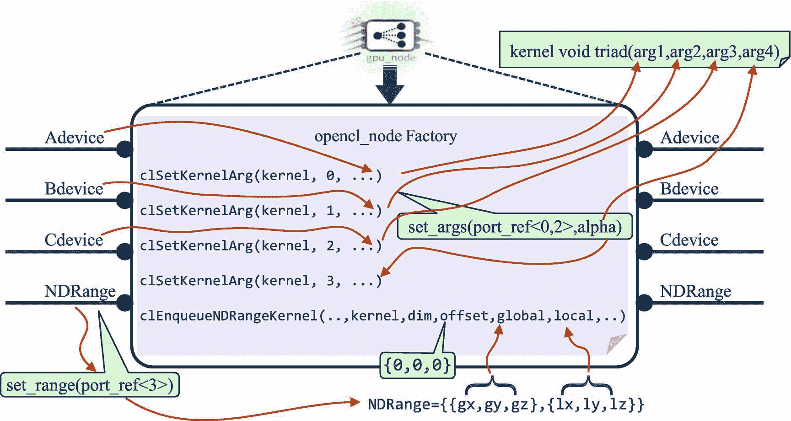

图 19-17

`opencl_node`函数和本地 OpenCL 调用之间的内部和对应关系

在这个图中，我们使用前面三元组示例中的`gpu_node`，其中我们配置了一个`opencl_node`来接收三个`opencl_buffers`和`NDRange`(总共四个进出节点的端口)。正如我们在几页前解释的那样，由于`gpu_node.set_args(port_ref<0,2>, alpha)`，我们清楚地说明了携带`A`、`B`和`C`向量的前三个输入端口(0、1 和 2)应该绑定到内核的前三个参数，内核的最后一个参数(乘法因子α)静态绑定到变量`alpha`，该变量不来自图的前面的节点。现在，我们已经获得了进行图 [19-17](#Fig17) 中所示的四个`clSetKernelArg()`调用所需的所有信息，这四个调用依次发挥它们的魔力，使这四个参数作为输入出现在`kernel void triad(...)` OpenCL 函数中。

现在，让我们看看如何适当地配置`clEnqueueNDRangeKernel`调用。这是最复杂的 OpenCL 调用之一；这需要我们在图 [19-18](#Fig18) 中列出的九个参数。然而，这不是一本 OpenCL 初级读本，对于本章来说，只讨论第二到第六个参数就足够了。用变量“`kernel`”标识的一个将在后面讨论，为了理解其他四个，我们必须更深入地研究 OpenCL 的基本概念之一:`NDRange`。

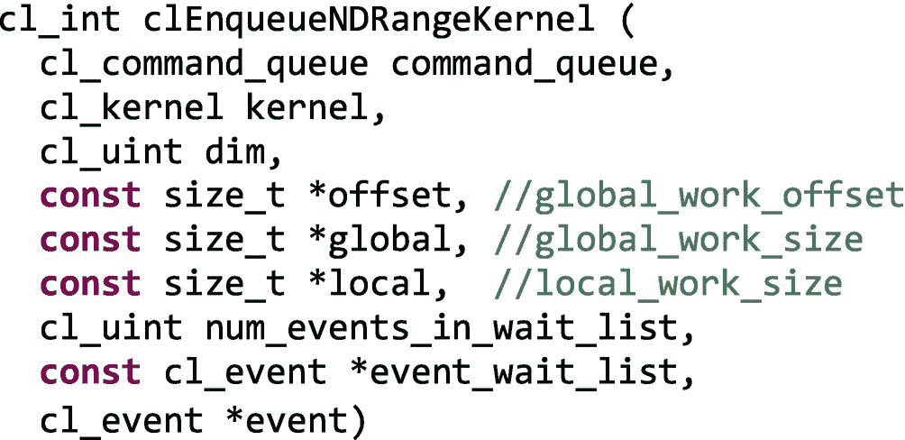

图 19-18

OpenCL `clEnqueueNDRangeKernel`调用的签名

### `NDRange`概念

一个`NDRange`定义了一个独立工作项的迭代空间。这个空间可能是三维的，但也可能是 2D 或 1D。在我们的三元组示例中,`NDRange`是 1D。图 [19-17](#Fig17) 和 [19-18](#Fig18) 中`clEnqueueNDrangeKernel`调用中的参数`dim`应相应地包含 1、2 或 3，并将由`gpu_node.set_range()`调用正确设置。在图 [19-17](#Fig17) 的例子中，这个`set_range()`调用指出`NDRange`信息从图的前一个节点到达`gpu_node`的端口 3。`NDRange`信息应该在一个或者可选的两个容器中，这两个容器提供了`begin()`和`end()`成员函数。许多标准 C++ 类型都提供了这些成员函数，例如`std::initializer_list`、`std::vector`、`std::array`和`std::list`。如果我们只指定一个容器，`opencl_node`只设置`clEnqueueNDRangeKernel()`函数的`global_work_size`参数(在图 [19-17](#Fig17) 和 [19-18](#Fig18) 中用变量`global`标识)。否则，我们也指定第二个容器，`opencl_node`也设置`local_work_size`参数(图 [19-17](#Fig17) 和 [19-18](#Fig18) 中的`local`)。

### 注意

正如我们所说的，`NDRange global_work_size`定义了将由加速器执行的并行迭代空间。使用 OpenCL 俚语，这个空间中的每个点都被称为一个工作项(如果您熟悉 CUDA，它相当于一个 CUDA 线程)。因此，工作项目可以在不同的加速器计算单元 CUs 上并行处理，相应的计算由内核代码定义，也就是说，如果我们的内核函数包括`C[i]=A[i]+B[i],`，这是将应用于该 1D 迭代空间的每个工作项目`i`的表达式。

现在，工作项被分组为所谓的工作组(或者使用 CUDA 符号的块)。由于架构实现的细节，属于同一个工作组的工作项之间的联系更加紧密。例如，在 GPU 上，可以保证在单个 GPU 计算单元上调度一个工作组。这意味着我们可以用 OpenCL barrier 同步单个工作组的工作项，这些工作项共享一个称为“本地内存”的每 CU 内存空间，它比全局内存快。

参数`local_work_size`指定了工作组的规模。如果没有提供，OpenCL 驱动程序可以自动计算推荐的`local_work_size`。然而，如果我们想要强制一个特定的工作组规模，我们必须设置`local_work_size`参数。

这里的一些例子将使它变得非常清楚。假设我们有维度为`h x w`的 2D 数组`A`、`B`和`C`，我们想计算矩阵运算 C=A+B。虽然矩阵是二维的，但在 OpenCL 中，它们是作为指向行为主的线性化 1D`cl_mem`缓冲区的指针传递给内核的。这并不妨碍我们从 2D 指数计算 1D 指数，所以内核看起来像这样


尽管表达相同内容的奇特方式使用了`int2`类型，读作

```cpp

  int2 gId = (int2)(get_global_id(0),   get_global_id(1));
  C[gId.y*w+gId.x] = A[gId.y*w+gId.x] + B[gId.y*w+gId.x];

```

为了获得内核执行期间每个工作项的更多信息，我们将打印出一些附加信息，如图 [19-19](#Fig19) 所示。


图 19-19

添加两个矩阵并打印出相关工作项信息的内核示例

前三个变量`gId`、`lId`和`grId`分别在维度`x`和`y`中存储每个工作项的全局 ID、本地 ID 和组 ID。接下来的三个变量`gSize`、`lSize`和`numGrp`被设置为全局大小、局部大小和工作组数量。第一个 if 条件仅由具有全局`ID (0,0).`的工作项满足，因此只有该工作项打印出不同大小和数量的组，这对于所有工作项都是相同的。第二个`printf`语句由每个工作项执行，并打印该工作项的全局、局部和组 id。当与`dim = 2`、`global = {4,4}`和`local = {2,2}.`一起排队时，这将产生如图 [19-20](#Fig20) 所示的输出


图 19-20

图 [19-19](#Fig19) 配置`dim=2`、`global={4,4}`、`local={2,2} --set_range({{4, 4}, {2, 2}})--`时的内核输出

在这个图中，我们用一个彩色的方框描述了每个工作项。有 16 个工作项排列在一个 4×4 的网格中，我们用四种不同的颜色来标识每个工作组。由于局部尺寸是`{2,2}`，每个工作组是一个 2×2 的子空间。难怪组的数量是 4，但是为了给这一章提供一些形式主义，我们在这里添加了一些我们可以很容易证明的不变量:

```cpp

numGrp.x = gSize.x/lSize.x
0 <= gId.x < gSize
0 <= lId.x < lSize
gId.x = grId * lSize.x + lId.x

```

同样，对于`.y`坐标(或者甚至是 3D 空间中的`.z`)

现在，我们如何指定一个`opencl_node`的全局和局部大小？到目前为止，我们只是在本章前面的例子中使用了`gpu_node.set_range()`。这将转化为`dim=1`、`global={<num>}`和`local=NULL`，这导致 1D `NDRange`的本地大小由 OpenCL 驱动程序决定。

在一般情况下，我们可能需要`global={gx, gy, gz}`和`local={lx, ly, lz}.`实现这一点最简单的方法是使用

```cpp

    gpu_node.set_range({{gx, gy, gz},{lx, ly, lz}});

```

然而，正如我们所说的，任何可以用`begin()`成员函数迭代的容器也将满足我们的需求。例如，一种更复杂的表达方式是


结果范围的维度与容器中的元素数量一样多，每个维度的大小都设置为相应的元素值。这里的警告是为全局和局部容器指定相同的维度。

为了让事情变得有趣，我们必须添加可以启动图 [19-19](#Fig19) 的内核的 TBB 驱动程序代码。我们所知道的最简洁的方法是建立一个只有一个`opencl_node`的图，如图 [19-21](#Fig21) 所示。


图 19-21

`opencl_node`孤立地练习

看到了吗？只需几行代码，我们就可以开始运行添加两个矩阵 A 和 b 的 OpenCL 代码。请注意，`opencl_node`、`gpu_node`只有一个端口`port<0>`，它绑定到内核的第三个参数 matrix `C`，它携带内核中执行的计算的结果。使用`set_args`成员函数直接传递输入矩阵`A`和`B`以及矩阵宽度`w`。还要注意的是，`opencl_node`必须至少有一个端口，并且只有当一个消息到达这个入口端口时，它才被激活。实施`gpu_node`的替代方案如下:

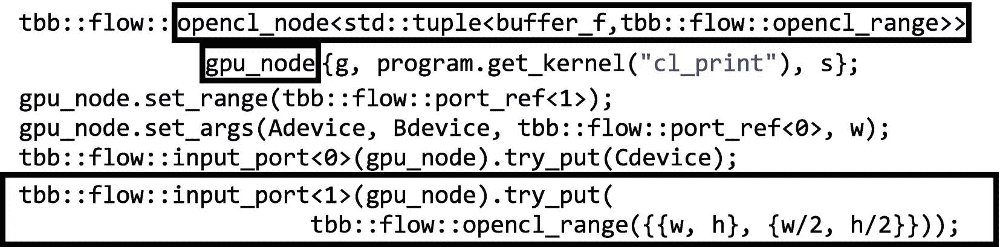

其中`gpu_node`在`port<0>,`上接收`Cdevice`，在`port<1>`上接收`NDRange`，其余的内核参数由`set_range()`成员函数指定。到达和离开`gpu_node`的`port<1>`的消息类型是`tbb::flow::opencl_range`(到目前为止是第无数个`opencl_node`助手类！)，我们依靠`try_put()`来传递一个用两个容器初始化的`opencl_range`对象。

### 玩弄偏移

我们留下了`clEnqueueNDRangeKernel`函数的另外两个参数(见图 [19-18](#Fig18) )。一个是 offset 参数，可以用来跳过迭代空间开始处的一些第一个工作项。在 OpenCL 工厂的当前实现中，这个偏移量是硬连线到`{0,0,0}.`的，没什么大不了的。有两种可能的解决方法来克服这个限制。

第一种方法是将偏移量传递给内核，并在索引数组之前将其添加到全局 ID 中。例如，对于一维的`C=A+B`操作，我们可以这样写

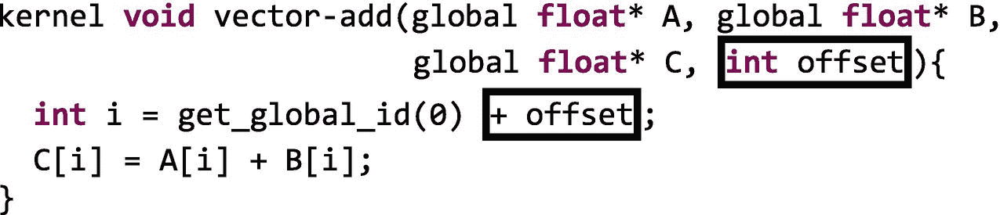

当然，我们可以修改`NDRange`来避免数组溢出。虽然实用，但不是一个超级优雅的解决方案。那么哪个是超级优雅的解决方案呢？嗯，我们可以使用`opencl_subbuffer`类来实现相同的结果。例如，如果我们只想添加向量`A`和`B`的一个子区域，我们可以保留一个简单版本的向量添加内核:

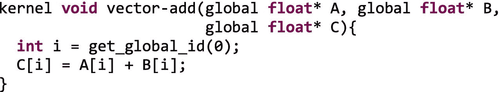

但是将以下参数传递给`set_args()`成员函数:

```cpp

  Adevice.subbuffer(offset, size)

```

同样，对于`Bdevice`和`Cdevice`。创建`Cdevice`子缓冲区的另一种方法是调用

```cpp

  tbb::flow::opencl_subbuffer<cl_float>(Cdevice, offset, size)

```

### 指定 OpenCL 内核

最后，我们必须花些时间来讨论`kernel`的论点(见图 [19-18](#Fig18) )。到目前为止，我们使用 OpenCL 源文件来提供我们的内核。在图 [19-21](#Fig21) 的最后一个例子中，我们再次使用了`opencl_program`类:


这相当于更显式的构造器:


这是提供内核函数的常用方法，一方面，它需要在运行时编译源代码，另一方面，它提供了可移植性，因为源代码将为所有可用的设备编译(在`opencl_program`构造时只编译一次)。在内部，OpenCL 工厂依赖于 OpenCL 函数`clCreateProgramWithSource`和`clBuildProgram`。

如果我们确信不需要将我们的代码移植到任何其他平台，和/或如果对于生产版本，我们需要最后一点性能，我们也可以预编译内核。例如，借助英特尔 OpenCL 工具链，我们可以运行

```cpp

ioc64 -cmd=build -input=my_kernel.cl -ir=my_kernel.clbin
      -bo="-cl-std=CL2.0" -device=gpu

```

它生成预编译文件`my_kernel.clbin`。现在，我们可以使用


当将这种类型的文件传递给`opencl_program`构造器时，工厂内部使用`clCreateProgramWithBinary`来代替。另一种可能性是使用`opencl_program_type::SPIR`提供内核的 SPIR 中间表示。要生成 SPIR 版本，我们可以使用

```cpp

ioc64 -cmd=build -input=my_kernel.cl -spir64=my_kernel.spir
      -bo="-cl-std=CL1.2"

```

在这两种情况下，`ioc64`编译器都会提供一些有用的信息。最后一次运行的输出如下所示

```cpp

Using build options: -cl-std=CL1.2
OpenCL Intel(R) Graphics device was found!
Device name: Intel(R) HD Graphics
Device version: OpenCL 2.0
Device vendor: Intel(R) Corporation
Device profile: FULL_PROFILE
fcl build 1 succeeded.
bcl build succeeded.
my_kernel info:
       Maximum work-group size: 256
       Compiler work-group size: (0, 0, 0)
       Local memory size: 0
       Preferred multiple of work-group size: 32
       Minimum amount of private memory: 0
Build succeeded!

```

这个输出告诉我们关于这个特定内核的最大工作组大小 256，以及工作组大小的首选倍数 32。

## 更多关于设备选择的信息

在上一节中，我们意识到我们用来进行实验的笔记本电脑包括两个 GPU。让我们看一个简单的例子，在这个例子中，我们在同一个流程图中使用了它们。在图 [19-22](#Fig22) 中，我们链接了两个`opencl_nodes`以便第一个计算`C=A+B`并将`C`发送给下一个执行`C = C – B`的。当两个节点都完成时，我们检查常规`function_node`中的`C == A`。数组尺寸为`rows` × `cols`。

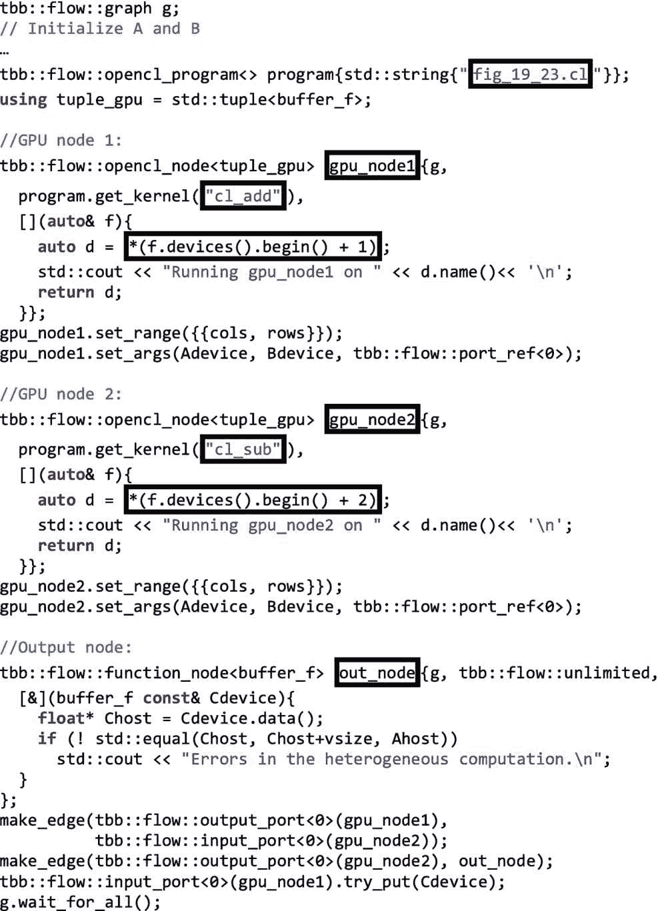

图 19-22

两个`opencl_node`的例子，每个配置使用不同的 GPU

在我们的笔记本电脑上，我们已经知道设备列表`f.devices()`包括三个设备，第二个和第三个是两个 GPU。这样，我们可以安全地使用`f.devices().begin() +1`和`+2`来获得指向每个 GPU 的迭代器，正如我们在图 [19-22](#Fig22) 的两个`opencl_node`定义的装箱语句中看到的。除了针对不同的 GPU，每个`opencl_node`都被配置为运行程序的两个不同内核`fig_19_23.cl: cl_add`和`cl_sub`。从`gpu_node1`流向`gpu_node2`的信息就是`opencl_buffer Cdevice`。在 OpenCL 工厂内部，数据移动被最小化，例如，如果一个`opencl_buffer`必须由映射到同一 GPU 的两个连续的`opencl_nodes`访问，则在图形的第一个 CPU 节点尝试访问相应的缓冲区(通过使用`opencl_buffer.begin()`或`opencl_buffer.data()`成员函数)之前，分配在 GPU 上的数据不会被移动到 CPU。

在图 [19-23](#Fig23) 中，我们展示了程序`fig_19_23.cl`，包括前面代码中引用的两个内核。注意，我们没有将行宽作为第四个参数传递，而是使用包含相同值的`gSz.x`。


图 19-23

`fig_19_23.cl`的内容，我们看到两个内核，每个内核都是从不同的`opencl_node`调用的

在我们的笔记本电脑上运行图 [19-22](#Fig22) 的代码产生的输出如下:

```cpp

Running gpu_node1 on Intel(R) HD Graphics 530
Running gpu_node2 on AMD Radeon Pro 450 Compute Engine
gSz.x=4, gSz.y=4
gSz.x=4, gSz.y=4

```

也可以用一个`opencl_node`来改变 OpenCL 设备，每次调用节点时工作都被卸载到这个设备上。图 [19-24](#Fig24) 的例子显示了一个被调用三次的`opencl_node`，对于每一次调用，不同的设备被用于运行一个简单的内核。

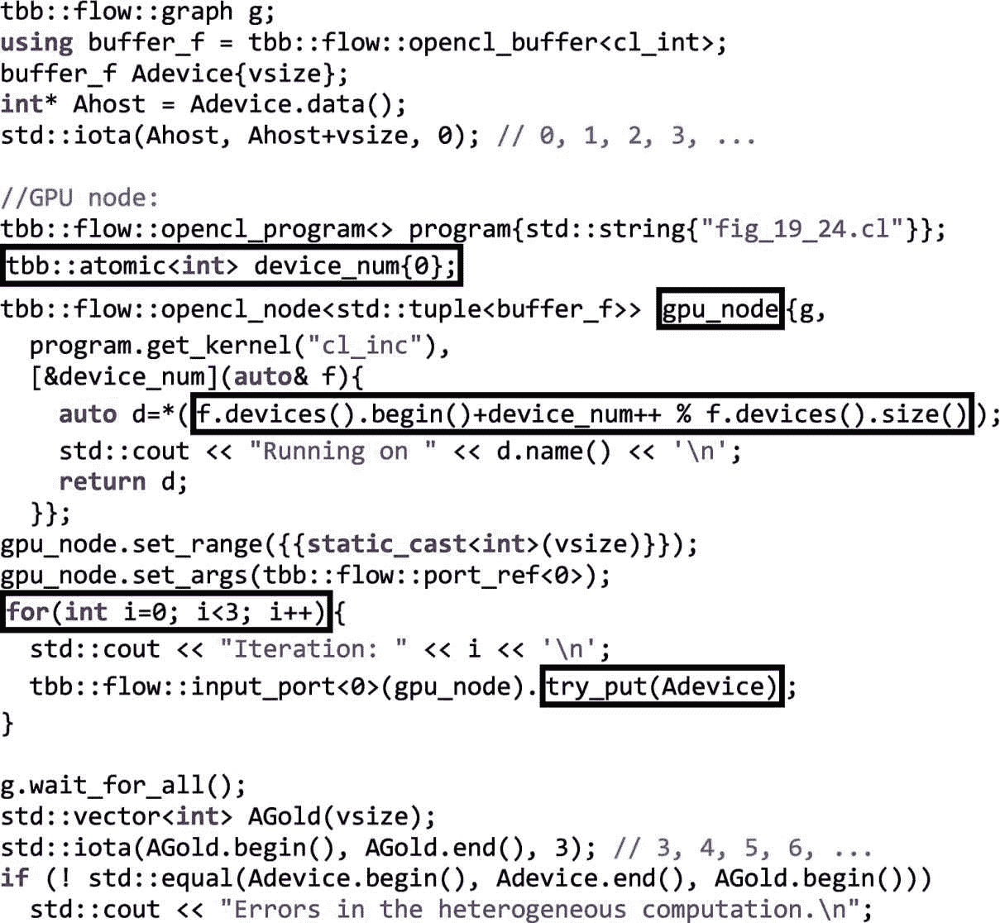

图 19-24

一个`opencl_node`就可以改变每次调用的目标加速器

代码使用初始化为`0`的原子变量`device_num`。对`gpu_node`的每次调用返回不同的设备，循环遍历所有设备(在我们的平台中有三个)。以及以下内核:

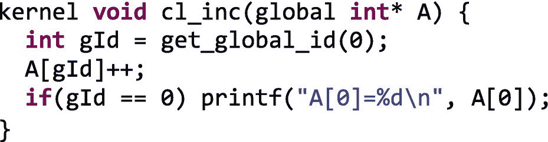

产生的输出是

```cpp

Iteration: 0
Iteration: 1
Iteration: 2
Running on Intel(R) Core(TM) i7-6700HQ CPU @ 2.60GHz
Running on Intel(R) HD Graphics 530
Running on AMD Radeon Pro 450 Compute Engine
A[0]=1
A[0]=2
A[0]=3

```

其中我们可以证实数组`Adevice`的元素在`gpu_node`的三次连续调用中已经增加了三次，并且相应的内核已经在三个不同的 OpenCL 设备上执行。

## 关于订单的警告是适当的！

我们应该注意的最后一个警告是，当从几个节点提供服务时，消息到达一个`opencl_node`的顺序。例如，在图 [19-25](#Fig25) 中，我们展示了一个流程图`g`，它包括一个由两个功能节点`filler0`和`filler1`提供的`gpu_node`。每个“填充器”发送 1000 个缓冲区，`b`，每个缓冲区有 10 个整数，形式为`{i,i,i,…,i},`，范围从 1 到 1000。接收方`gpu_node`接收两个消息作为`b1`和`b2`，并调用一个 OpenCL 内核，就像这样简单:


正如我们看到的，它基本上是乘以`b1[i]=b1[i]*b2[i]`。如果`b1`和`b2`相等(等于`{1,1,1,…}`，或者`{2,2,2,…}`，等等。)，我们应该在输出端得到 1000 个平方输出的缓冲器(`{1,1,1,…}`，然后是`{4,4,4,…}`，等等)。正确确定吗？我们不想说谎，所以为了以防万一，让我们在图的最后一个节点`checker`中仔细检查一下，它验证了我们的假设。

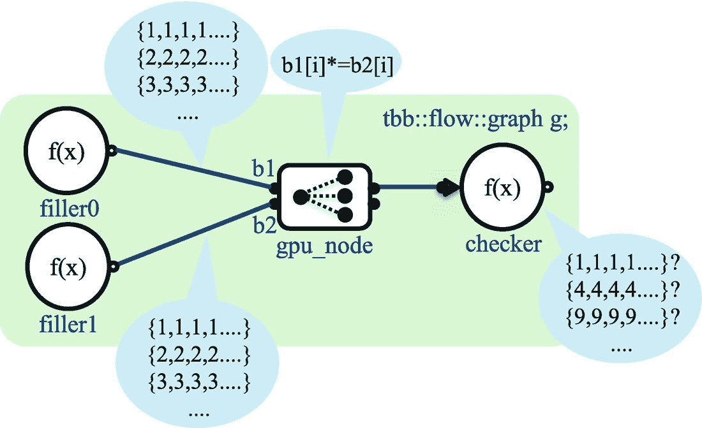

图 19-25

两个功能节点向`opencl_node`提供缓冲区，这些缓冲区将在 GPU 上相乘

图 [19-26](#Fig26) 中列出了实现上图的代码。我们同意乔治·萧伯纳的观点:“说谎者的惩罚丝毫不在于他不被人相信，而在于他不能相信任何人。”作为骗子鉴赏家，我们在代码中使用了一个专门用来捕捉骗子的 try-catch 结构。


图 19-26

与图 [19-25](#Fig25) 中描绘的图形相对应的源代码

我们首先将`buffer_i`定义为整数的`opencl_buffer`。两个“填充器”接收一个整数`i`，并用 10 个`i`填充一个`buffer_i`，然后发送到`gpu_node`。用于配置`opencl_node`的三行代码对我们来说太基础了，不需要进一步阐述。最后一个节点是检查器，如果在 GPU 上处理的缓冲区中接收的任何值不是平方整数，它将抛出异常。在制作边缘之后，1000 次迭代循环使两个填充器工作。现在，关键时刻到了，结果是

```cpp

Liar!!: 42 is not a square of any integer number

```

好吧，我们被抓了！显然，`6*7`是在 GPU 上计算的，而不是在`6*6`或`7*7`上。为什么呢？答案是我们没有采取足够的措施来确保到达`gpu_node`的消息被正确配对。记住“填充符”的主体是由任务执行的，我们不能假定任务执行的任何特定顺序。

幸运的是，`opencl_node`带有一个方便的特定类型的键匹配特性，这将扭转局面。我们在图 [19-27](#Fig27) 中使用了这个特性。

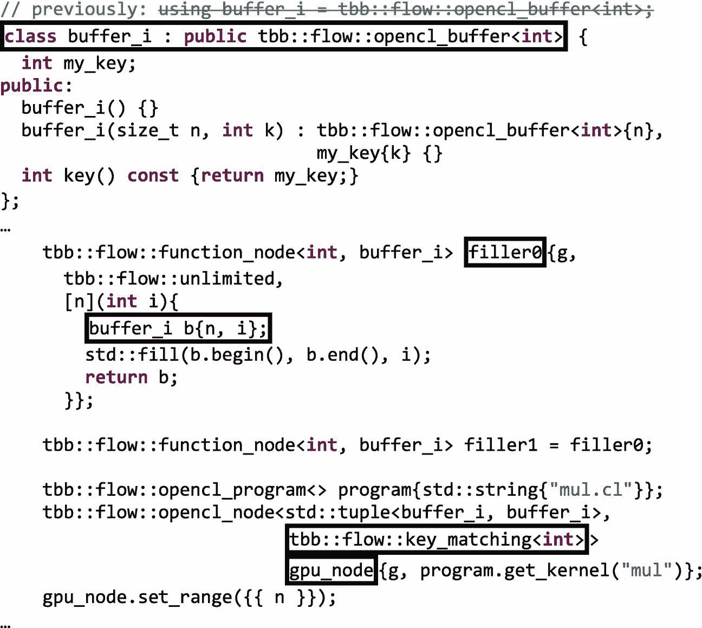

图 19-27

修正图 [19-26](#Fig26) 的代码

基本上，现在的`buffer_i`是一个继承自`opencl_buffer<cl_int>`的新类，增加了一个`int my_key`成员变量和一个返回该键的`key()`成员函数。现在填充器必须使用不同的构造器(`buffer_i b{N,i}`)，但更重要的是，`opencl_node`接收第二个模板参数(`key_matching<int>`)。这将自动指示`opencl_node`调用`key()`函数，并等待具有相同键值的消息被传递到所有输入端口。搞定了。如果我们用这些小的修改来运行我们的代码，我们将会看到现在我们已经被宣判伪证罪不成立了！

## 摘要

在这一章中，我们介绍了 TBB 流图的`opencl_node`特征。我们从一个简单的`Hello OpenCL_Node`例子开始，它代表了对`opencl_node`的初步了解，涵盖了这个类的基础知识。然后我们开始深入研究一些助手类，比如`opencl_device`对象的容器`opencl_device_list`，以及设备过滤器和设备选择器实体。为了说明其他助手类并给出一个更复杂的例子，我们还使用一个`opencl_node`实现了三元向量运算，以处理部分计算，而其余部分在 CPU 内核上同时处理。在那里，我们更好地介绍了`opencl_buffer`助手类和`opencl_node`类的`set_range`和`set_args`成员函数。`NDRange`概念以及如何设置全局和局部 OpenCL 大小几乎需要一个章节，在这里我们还解释了如何使用`opencl_subbuffer`类和其他变体来提供内核程序(预编译或 SPIR 中间表示)。接下来，我们介绍了两个例子，说明了如何将流程图的不同`opencl_node`映射到不同的设备上，或者甚至如何在每次调用时更改`opencl_node`卸载计算的设备。最后，我们描述了当一个`opencl_node`来自不同的节点时如何避免排序问题。

最后一个免责声明。也许最后我们真的在撒谎。在写这一章的时候，`opencl_node`仍然是一个预览功能，所以它可能会被修改。经过 3 年的发展，我们不期望有大的变化，但我们不能承诺这一点。如果这样的变化在未来的版本中结束，我们保证会写这一章的更新版本！你相信我们吗？

## 更多信息

以下是我们推荐的一些与本章相关的额外阅读材料:

*   Alexei Katranov，Opencl_node 概述。英特尔开发人员专区博客中的系列文章: [`https://software.intel.com/en-us/blogs/2015/12/09/opencl-node-overview`](https://software.intel.com/en-us/blogs/2015/12/09/opencl-node-overview) 。

*   大卫凯利，佩哈德米斯特里，达纳沙，张东平。使用 OpenCL 2.0 进行异构计算。摩根·考夫曼 2015。

图中的徒步图标 [19-1](#Fig1) 由来自 [`www.flaticon.com`](https://www.flaticon.com) 的 Scott de Jonge 制作。

[](https://creativecommons.org/licenses/by-nc-nd/4.0) 

**开放存取**本章根据知识共享署名-非商业-非专用 4.0 国际许可协议(http://Creative Commons . org/licenses/by-NC-nd/4.0/)的条款进行许可，该协议允许以任何媒体或格式进行任何非商业使用、共享、分发和复制，只要您适当注明原作者和来源，提供知识共享许可协议的链接，并指出您是否修改了许可材料。根据本许可证，您无权共享从本章或其部分内容派生的改编材料。

本章中的图像或其他第三方材料包含在本章的知识共享许可中，除非在材料的信用额度中另有说明。如果材料不包括在本章的知识共享许可中，并且您的预期使用不被法律法规允许或超出了允许的使用范围，您将需要直接从版权所有者处获得许可。

<aside class="FootnoteSection">Footnotes [1](#Fn1_source)

[`https://software.intel.com/en-us/blogs/2015/12/09/opencl-node-overview`](https://software.intel.com/en-us/blogs/2015/12/09/opencl-node-overview) 。

  [2](#Fn2_source)

请再次记住，这是一个预览功能。如果您在这方面需要更多的灵活性，我们将非常感谢您提出请求，让英特尔知道您认为 OpenCL 节点很有用，但仍有一些限制需要解决。

 </aside>