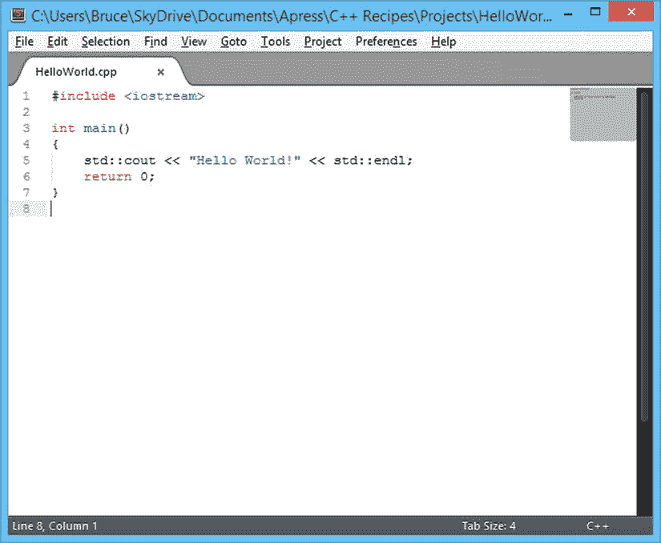
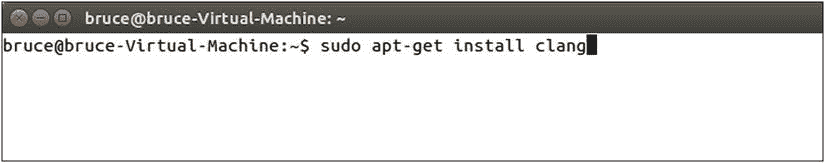
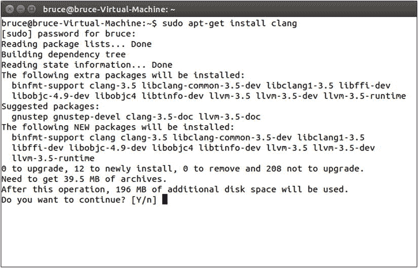
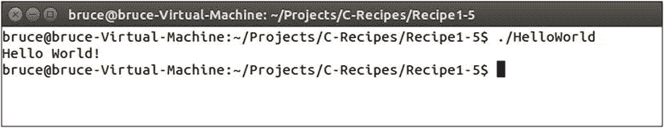

# 一、开始 C++

C++ 编程语言是一种强大的低级语言，它允许你编写编译成机器指令的程序，以便在计算机的处理器上执行。这使得 C++ 不同于 C# 和 Java 等较新的语言。这些语言是解释型语言。这意味着它们不是直接在处理器上执行，而是被发送到另一个负责操作计算机的程序。Java 程序是使用 Java 虚拟机(JVM)执行的，C# 程序是由公共语言运行时(CLR)执行的。

由于 C++ 是一种提前编译的语言，它仍然在绝对性能至关重要的领域得到广泛应用。C++ 仍然是最主要使用的编程语言的最明显的领域是视频游戏行业。C++ 允许程序员编写充分利用底层系统架构的应用程序。在从事 C++ 程序员的职业生涯中，您可能会熟悉诸如*缓存一致性*这样的短语。没有多少其他语言可以让你优化你的应用程序，以适应你的程序运行的处理器。这本书向您介绍了一些在不同时期会影响应用程序性能的陷阱，并向您展示了一些解决这些问题的技术。

现代 C++ 正处于一个语言功能不断更新的时期。情况并非总是如此。尽管从 20 世纪 80 年代早期就出现了，C++ 编程语言直到 1998 年才被标准化。2003 年发布了该标准的一个小的更新和澄清，称为 C++03。2003 年的更新并没有给这种语言增加任何新的特性，但是它澄清了一些已经被忽略的现有特性。其中之一是对 STL vector 模板标准的更新，指定 vector 的成员应该连续存储在内存中。C++11 标准于 2011 年发布，对 C++ 编程语言进行了大规模更新。C++ 获得了模板、lambda 和闭包支持之外的通用类型演绎系统的特性，一个内置的并发库和更多的特性。C++14 对该语言进行了较小的更新，通常建立在 C++14 已经提供的特性之上。诸如从函数中自动返回类型推导这样的特性已经被清理，lambdas 已经更新了新的特性，并且有一些新的方法来定义正确类型的文字值。

本书致力于编写可移植的、符合标准的 C++14 代码。在写作的时候，只要你使用一个提供所有语言特性的编译器，在 Windows、Linux 和 OS X 机器上写 C++14 代码是可能的。为此，本书将在 Windows 和 Ubuntu 上使用 Clang 作为编译器，并将在 OS X 上使用 Xcode。本章的其余部分将重点介绍用 C++ 编写程序所需的软件，然后向您展示如何获得一些可用于 Windows、OS X 和 Linux 操作系统的更常见的选项。

配方 1-1。查找文本编辑器

问题

C++ 程序由许多不同的源文件构成，这些文件必须由一个或多个程序员创建和编辑。源文件是简单的文本文件，通常有两种不同的类型:头文件和源文件。头文件用于在不同文件之间共享有关类型和类的信息，源文件通常用于包含方法和组成程序的实际可执行代码。

解决办法

文本编辑器成为你开始写 C++ 程序所需要的第一个主要软件。在不同的平台上有许多优秀的文本编辑器可供选择。目前我最好的两个选择是免费的 Windows 版 Notepad++ 和 Sublime Text 2，尽管它们不是免费的，但可以在所有主要的操作系统上使用。[图 1-1](#Fig1) 显示了来自崇高文本 2 的截图。Vim 和 gvim 也是非常好的选项，适用于所有三种操作系统。这些编辑器提供了许多强大的功能，对于愿意学习的人来说是极好的选择。



[图 1-1](#_Fig1) 。来自崇高文本 2 编辑器的截图

 **注意**不要觉得有直接抓取文本编辑器的冲动。本章后面的一些方法涵盖了集成开发环境(ide ),集成开发环境包含了编写、构建和调试 C++ 应用程序所需的所有软件。

图 1-1 显示了一个好的文本编辑器最重要的特征之一:它应该能够在你的源代码中突出不同类型的关键字。你可以在图 1-1 的简单 Hello World 程序中看到，Sublime Text 2 能够突出显示 C++ 关键字`include`、`int`和`return`。它还为主功能`name`和琴弦`<iostream>`和`"Hello World!"`添加了不同颜色的高光。一旦你有了用你选择的文本编辑器编写代码的经验，你将会熟练地扫描你的源文件来聚焦你感兴趣的代码区域，并且语法高亮将会是这个过程中的一个主要因素。

配方 1-2。在 Ubuntu 上安装 Clang

问题

您希望在运行 Ubuntu 的计算机系统上构建支持最新 C++14 语言特性的 C++ 程序。

解决办法

Clang 编译器支持所有最新的 C++14 语言特性，libstdc++ 库支持所有 C++14 STL 特性。

它是如何工作的

Ubuntu 操作系统 配置了软件包库，让你安装 Clang 没有太大困难。您可以在终端窗口中使用`apt-get`命令来实现这一点。[图 1-2](#Fig2) 显示了安装 Clang 应该输入的命令。



[图 1-2](#_Fig2) 。Ubuntu 终端窗口显示安装 Clang 所需的命令

要安装 Clang，你可以在命令行输入下面的命令`sudo apt-get install clang`。运行这个命令将导致 Ubuntu 查询它的存储库，并找出安装 Clang 所需的所有依赖项。这个过程完成后，系统会提示您确认是否要安装 Clang 及其依赖项。在[图 1-3](#Fig3) 中可以看到这个提示。



[图 1-3](#_Fig3) 。apt-get 依赖关系确认提示

此时，您可以按 enter 键继续，因为默认选项是 yes。然后 Ubuntu 会下载并安装你在电脑上安装 Clang 所需的所有软件。您可以通过运行`clang`命令来确认这已经成功。[图 1-4](#Fig4) 显示了如果一切顺利的话应该是什么样子。


[图 1-4](#_Fig4) 。Ubuntu 中一次成功的 Clang 安装

配方 1-3。在窗户上安装金属撞击声

问题

您希望在 Windows 操作系统 上构建基于 C++14 的程序。

解决办法

可以使用 Cygwin for Windows 安装 Clang，构建应用程序。

它是如何工作的

Cygwin 为 Windows 计算机提供了一个类似 Unix 的命令行环境。这非常适合使用 Clang 构建程序，因为安装的 Cygwin 预配置了包存储库，其中包含了在 Windows 计算机上安装和使用 Clang 所需的一切。

您可以从 Cygwin 网站的`http://www.cygwin.com`获得 Cygwin 安装程序可执行文件。请务必下载 32 位版本的 Cygwin 安装程序，因为 Cygwin 提供的默认软件包目前仅适用于 32 位环境。

一旦你下载了安装程序，你应该运行它并点击直到你看到要安装的软件包列表。此时，您需要选择 Clang、make 和 libstdc++ 包。[图 1-5](#Fig5) 显示了选中 Clang 包的 Cygwin 安装程序。


[图 1-5](#_Fig5) 。在 Cygwin 安装程序中过滤 Clang 包

通过单击软件包所在行的跳过区域，可以在安装程序中将软件包标记为要安装。单击一次“跳过”会将包版本移动到最新版本。你应该为 Clang，make 和 libstdc++ 选择最新的包。一旦您选择了所有 3 个包，您可以单击 Next 进入一个窗口，要求您确认这三个包所需的依赖项的安装。

一旦您成功下载并安装了运行 Clang 所需的所有包，您可以通过打开 Cygwin 终端并键入`clang`命令来检查它是否成功。你可以在图 1-6 中看到这个输出的结果。


[图 1-6](#_Fig6) 。在 Windows 的 Cywgin 环境下成功运行 Clang

配方 1-4。在 OS X 上安装金属撞击声

问题

您希望在运行 OS X 的计算机上构建基于 C++14 的程序

解决办法

苹果的 Xcode IDE 自带 Clang 作为默认编译器。从 OS X 应用商店安装 Xcode 也会安装 Clang。

它是如何工作的

从 OS X 电脑上的 App Store 安装最新版本的 Xcode。一旦你安装了 Xcode，你可以使用 Spotlight 打开一个终端窗口，然后输入 clang 来查看编译器是否已经安装。图 1-7 显示了这应该是什么样子。


[图 1-7](#_Fig7) 。安装 Xcode 后在 OS X 上运行 Clang

配方 1-5。构建您的第一个 C++ 程序

问题

您希望使用您的计算机从您编写的 C++ 源代码中生成可执行的应用程序。

解决办法

从 C++ 源文件生成可执行文件包括两个步骤:编译和链接。根据您的操作系统，配方 1-2、配方 1-3 或配方 1-4 中的步骤将使您拥有从 C++14 源文件构建应用程序所需的所有软件。您现在已经准备好构建您的第一个 C++14 程序了。创建一个包含您的项目的文件夹，并添加一个名为 HelloWorld.cpp 的文本文件。将清单 1-1 中的代码输入到文件中并保存。

[***清单 1-1***](#_list1) 。你的第一个 C++14 程序

```cpp
#include <iostream>

#include <string>

int main(void)
{
    using namespace std::string_literals;

    auto output = "Hello World!"s;
    std::cout << output << std::endl;

    return 0;
}
```

[清单 1-1](#list1) 中的代码是一个 C++ 程序，只有在使用 C++14 兼容编译器时才能编译。本章的方法 2-4 包含了如何获得一个编译器的说明，该编译器可用于编译 Windows、Ubuntu 和 OS X 的 C++14 代码。一旦你创建了一个文件夹和包含[清单 1-1](#list1) 中代码的源文件，你就可以构建一个工作应用程序。您可以使用 makefile 来实现这一点。在 HelloWorld.cpp 文件旁边的文件夹中创建一个名为 makefile 的文件。makefile 不应该有文件扩展名，这对于习惯于 Windows 操作系统的开发人员来说可能有点奇怪，但是对于基于 Unix 的操作系统，例如 Linux 和 OS X，这是完全正常的。将[清单 1-2](#list2) 中的代码输入到 makefile 中。

[***清单 1-2***](#_list2) 。构建清单 1-1 中的代码所需的 makefile 文件

```cpp
HelloWorld: HelloWorld.cpp
        clang++ -g -std=c++1y HelloWorld.cpp -o HelloWorld
```

 **注意**[清单 1-2](#list2) 中`clang++`命令前的空格是一个制表符。您不能用空格替换制表符，因为`make`将无法构建。确保 makefile 中的配方总是以制表符开始。

清单 1-2 中的文本由从 HelloWorld.cpp 源文件构建应用程序所需的指令组成。第一行的第一个单词是 makefile 目标的名称。这是构建过程完成后应用程序可执行文件的名称。在这种情况下，我们将构建一个名为 HelloWorld 的可执行文件。接下来是构建程序所需的先决条件。这里您将 HelloWorld.cpp 列为唯一的先决条件，因为它是用于构建可执行文件的唯一源文件。

然后，目标和先决条件后面是为了构建您的应用程序而执行的一系列方法。在这个小示例中，有一行代码调用 clang++ 编译器从 HelloWorld.cpp 文件生成可执行代码。使用`–std=c++1y`传递给`clang++`的参数要求 Clang 使用 C++14 语言标准进行编译，而`–o`开关指定编译过程生成的对象输出文件的名称。

使用命令 shell(例如 Windows 上的 cmd 或 Linux 或 OS X 上的 Terminal)浏览到您创建的用于存储源文件和 makefile 的文件夹，然后键入 make。这将调用 GNU make 程序，并自动读取和执行 makefile。这将把一个可执行文件输出到您可以从命令行运行的同一文件夹中。您现在应该能够做到这一点，并看到在命令行上输出了文本 Hello World。图 1-8 显示了它在 Ubuntu 终端窗口中的样子。



[图 1-8](#_Fig8) 。Ubuntu 终端中 Runnung HelloWorld 生成的输出

配方 1-6。在 Cygwin 或 Linux 中使用 GDB 调试 C++ 程序

问题

您正在编写一个 C++14 程序，并且希望能够从命令行调试应用程序。

解决办法

Cygwin for Windows 和基于 Linux 的操作系统(如 Ubuntu)都可以安装和使用 C++ 应用程序的 GDB 命令行调试器。

它是如何工作的

您可以使用 Cygwin Windows 安装程序或随您喜欢的 Linux 发行版一起安装的软件包管理器来安装 GDB 调试器。这将为您提供一个命令行 C++ 调试器，可用于检查 C++ 程序的功能。您可以使用作为配方 1-5 的一部分生成的源代码、makefile 和应用程序来练习。要为你的程序生成调试信息，你应该更新 makefile 来包含清单 1-3 的内容，并运行 make 来生成一个可调试的可执行文件。

[***清单 1-3***](#_list3) 。生成可调试程序的 makefile

```cpp
HelloWorld: HelloWorld.cpp
        clang++ -g -std=c++1y HelloWorld.cpp -o HelloWorld
```

一旦你遵循了配方 1-5，更新了 makefile 以包含清单 1-5 中[的内容，并生成了一个可执行文件，你就可以在你的应用程序上运行 GDB 了，方法是在你的命令行上浏览文件夹并键入`gdb HelloWorld`。在来自](#list5)[清单 1-3](#list3) 的 makefile 中，传递给 Clang 的新的`–g`开关要求编译器在应用程序中生成附加信息，以帮助调试器在程序在调试器中执行时为您提供关于程序的准确信息。

注意你可能会看到一个通知，告诉你如果你以前编译过，你的程序已经是最新的了。如果发生这种情况，只需删除现有的可执行文件。

在 HelloWorld 中运行 GDB 应该会导致您的命令行运行 GDB 并提供如图[图 1-9](#Fig9) 所示的输出。


[图 1-9](#_Fig9) 。GDB 的一个实例

现在您有了一个正在运行的调试器，可以用来在程序执行时检查它。当 GDB 第一次启动时，程序还没有开始，这允许你在开始之前配置一些断点。要设置断点，您可以使用`break`命令或同一命令的简写`b`。在 GDB 命令提示符下输入`break main`，然后回车。这应该会导致 GDB 将命令以及设置断点的程序的地址和它为所提供的函数检测到的文件名和行号回显给您。现在，您可以在窗口中键入 run 来执行程序，并让 GDB 在断点处停止。输出应类似于[图 1-10](#Fig10) 所示。


[图 1-10](#_Fig10) 。GDB 在`main`中设置的断点处停止时的输出

此时，您有几个选项可以让您继续执行程序。您可以在下面看到最常用命令的列表。

*   `step`

    `step`命令用于单步执行将在当前行调用的函数。

*   `next`

    `next`命令用于跳过当前行，并在同一功能的下一行停止。

*   `finish`

    `finish`命令用于执行当前函数中剩余的所有代码，并在调用当前函数的函数的下一行停止。

*   `print <name>`

    后跟变量名的`print`命令可用于打印程序中变量的值。

*   `break`

    `break`命令可与行号、函数名或源文件和行号一起使用，在程序源代码中设置断点。

*   `continue`

    `continue`命令用于在断点处暂停后恢复代码执行。

*   `until`

    `until`命令可以从循环中继续执行，并在循环执行完成后立即停止在第一行。

*   `info`

    `info`命令可以与`locals`命令或`stack`命令一起使用，以显示关于程序中当前局部变量或堆栈状态的信息。

*   `help`

    你可以键入`help` 后接任何命令，让 GDB 告诉你一个给定命令的所有不同用法。

GDB 调试器也可以用命令`–tui`运行。这将使您在窗口顶部看到当前正在调试的源文件。你可以在图 1-11 中看到它的样子。


[图 1-11](#_Fig11) 。带有源窗口的 GDB

配方 1-7。在 OS X 上调试你的 C++ 程序

问题

OS X 操作系统没有提供任何安装和使用 GDB 的简单方法。

解决办法

Xcode 附带了 LLDB 调试器，可以代替 GDB 在命令行上使用。

它是如何工作的

LLDB 调试器本质上非常类似于配方 1-6 中使用的 GDB 调试器。在 GDB 和 LLDB 之间转换只是学习如何通过使用各自提供的命令来执行相同的任务。

通过在终端中浏览到包含 HelloWorld 的目录并键入`lldb HelloWorld`，可以在 HelloWorld 可执行文件上执行 LLDB。这将给你类似于图 1-12 的输出。


[图 1-12](#_Fig12) 。运行在 OS X 终端上的 LLDB 调试器

 **注意**你需要使用`–g`开关来编译你的程序。如果你不确定的话，看一下[清单 1-3](#list3) 来看看这是怎么回事。

一旦 LLDB 如清单 1-12 所示运行，就可以在 main 的第一行设置一个断点，只需键入`breakpoint set –f HelloWorld.cpp –l 8`或`b main`即可。您可以使用`run`命令开始执行，并让它在您刚刚设置的断点处暂停。当程序停止时，您可以使用`next`命令跳过当前行并停在下一行。您可以使用`step`命令单步执行当前行的函数，并在函数的第一行停止。`finish`命令将退出当前功能。

您可以通过键入`q`并按 enter 键来退出 LLDB。重启 LLDB 并键入`breakpoint set –f HelloWorld.cpp –l 9`。在此之后使用`run`命令，LLDB 应该在应用程序停止的那一行打印源代码。现在可以输入`print output`来查看输出变量存储的值。你也可以使用`frame variable`命令来查看当前堆栈帧中的所有局部变量。

这些简单的命令将允许您在使用随本书提供的示例时充分使用 LLDB 调试器。使用 LLDB 时，下面的列表可以作为一个方便的备忘单。

*   `step`

    `step`命令用于进入当前行要调用的函数。

*   `next`

    `next`命令用于跳过当前行，并停在同一功能的下一行。

*   `finish`

    `finish`命令用于执行当前函数中剩余的所有代码，并在调用当前函数的函数的下一行停止。

*   `print <name>`

    后跟变量名的`print`命令可用于打印程序中变量的值。

*   `breakpoint set –-name <name>`
*   `breakpoint set –file <name> --line <number>`

    `breakpoint`命令可以与行号、函数名或源文件和行号一起使用，在程序源代码中设置断点。

*   `help`

    你可以键入`help`后接任何命令，让 GDB 告诉你一个给定命令的所有不同用法。

配方 1-8。切换 C++ 编译模式

问题

在编译程序之前，您希望能够在不同的 C++ 标准之间切换。

解决方案

Clang 提供了`std`开关，以便您可以指定编译时要使用的 C++ 标准。

它是如何工作的

Clang 默认使用 C++98 标准构建。您可以在 Clang++ 中使用 std 参数来告诉编译器使用非默认标准。[清单 1-4](#list4) 显示了一个 makefile，它被配置成使用 C++14 标准构建一个程序。

[***清单 1-4***](#_list4) 。用 C++14 构建

```cpp
HelloWorld: HelloWorld.cpp
        clang++ -std=c++1y HelloWorld.cpp -o HelloWorld
```

清单 1-4 中的 makefile 展示了如何指定 Clang 应该使用 C++14 构建你的源文件。这个例子是用 Clang 3.5 编写的，它使用`c++1y`命令来表示 C++14。

清单 1-5 展示了如何使用 C++11 来构建一个程序。

[***清单 1-5***](#_list5) 。用 C++11 构建

```cpp
HelloWorld: HelloWorld.cpp
        clang++ -std=c++11 HelloWorld.cpp -o HelloWorld
```

在[清单 1-5](#list5) 中，你想使用带有`std`开关的`c++11`选项来构建 C++11。最后，[清单 1-6](#list6) 展示了如何配置 Clang 来用 C++98 显式构建。

[***清单 1-6***](#_list6) 。用 C++98 构建

```cpp
HelloWorld: HelloWorld.cpp
        clang++ -std=c++98 HelloWorld.cpp -o HelloWorld
```

清单 1-6 中的 makefile 可以用来用 C++98 显式构建。您可以通过完全省略`std`命令来获得相同的结果，Clang 将默认使用 C++98 构建。

 **注意**不能保证每个编译器默认使用 C++98。如果不确定哪个标准是默认标准，请查阅编译器文档。您还可以尝试使用 Clang，并使用`c++1z`选项启用其实验性的 C++17 支持！

配方 1-9。使用 Boost 库构建

问题

你想用 Boost 库写一个程序。

解决办法

Boost 作为源代码提供，可以包含在应用程序中并编译到应用程序中。

它是如何工作的

Boost 是一个大型 C++ 库，包含了各种强大的功能。涵盖整个库超出了本书的范围；但是，将使用字符串格式库。您可以在`http://www.boost.org/`从 Boost 网站获取 Boost 库。

您可以从 Boost 网站获得包含最新版本的 Boost 库的压缩文件夹。您绝对需要能够包含基本 boost 功能的唯一文件夹是 boost 文件夹本身。我已经下载了 Boost 1.55，因此我在我的项目文件夹中创建了一个名为`boost_1_55_0`的文件夹，并将 Boost 文件夹从下载的版本复制到这个位置。

一旦用 Boost 的下载副本建立了项目文件夹，就可以将 Boost 头文件包含到源代码中。[清单 1-7](#list7) 显示了一个使用`boost::format`函数 的程序。

[***清单 1-7***](#_list7) 。使用`boost::format`

```cpp
#include <iostream>
#include "boost/format.hpp"

using namespace std;

int main()
{
    std::cout << "Enter your first name: " << std::endl;
    std::string firstName;
    std::cin >> firstName;

    std::cout << "Enter your surname: " << std::endl;
    std::string surname;
    std::cin >> surname;

    auto formattedName = str( boost::format("%1% %2%"s) % firstName % surname );
    std::cout << "You said your name is: " << formattedName << std::endl;

    return 0;
}
```

清单 1-7 中的代码展示了如何在源文件中包含一个 Boost 头文件，以及如何在你的程序中使用该文件的函数。

 **注意**不要担心`format`函数如何工作，如果还不清楚的话，会在[第 3 章](03.html)中介绍。

您还必须告诉编译器在 makefile 中何处查找 Boost 头文件，否则您的程序将无法编译。清单 1-8 显示了可以用来构建这个程序的 makefile 文件的内容。

[***清单 1-8***](#_list8) 。用 Boost 构建的 makefile

```cpp
main: main.cpp
        clang++ -g -std=c++1y -Iboost_1_55_0 main.cpp -o main
```

清单 1-8 中的 makefile 将`–I`选项传递给 Clang++。该选项用于告诉 Clang，当使用`#include`指令包含文件时，您希望在搜索路径中包含给定的文件夹。正如你所看到的，我已经通过了我在项目文件夹中创建的`boost_1_55_0`文件夹。该文件夹包含 boost 文件夹，您可以看到在[清单 1-7](#list7) 中包含一个 Boost 头时使用的文件夹。

 **注意**如果您在运行这个示例时遇到问题，并且不确定应该将 Boost 头文件放在哪里，您可以从`www.apress.com/9781484201589`下载本书附带的示例。