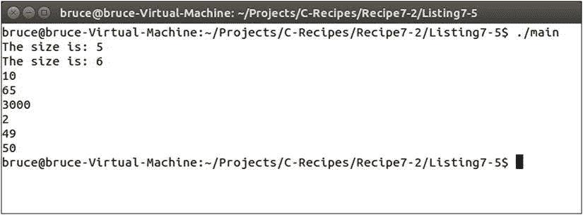
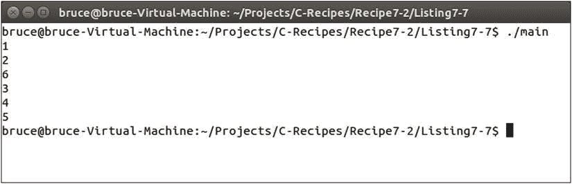
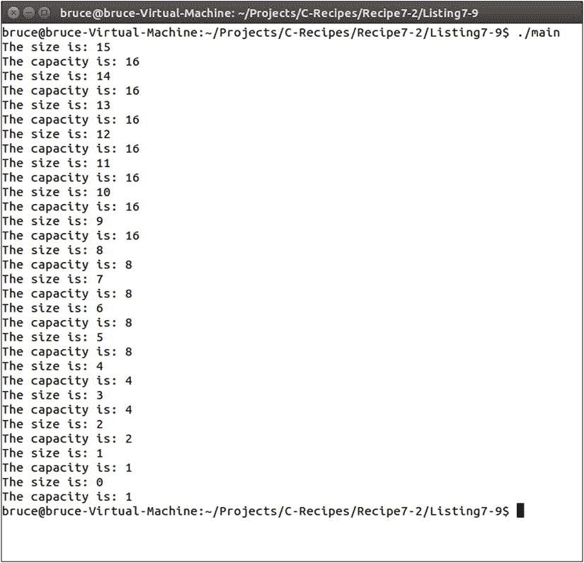
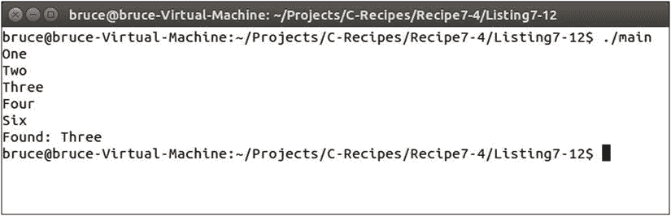
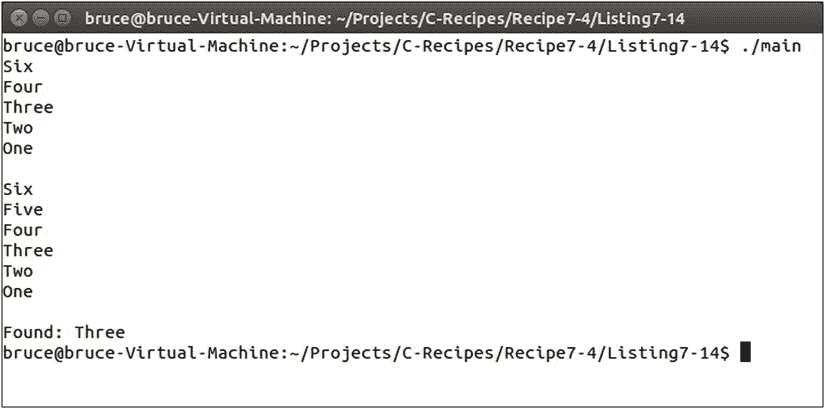

# 七、STL 容器

标准模板库(STL) 由一组要求实现者支持的标准功能组成。创建标准可以确保代码可以在不同的平台和操作系统上互换使用，只要所提供的实现符合该标准。该标准的很大一部分定义了一组可用于存储数据结构的容器。本章着眼于不同的场景，每个 STL 容器都被证明是有用的。

 **注**第三章的[中提到了字符串容器。](03.html)

配方 7-1。存储固定数量的对象

问题

您需要在程序中存储固定数量的对象。

解决办法

C++ 提供了可用于此目的的内置数组，然而 STL 数组提供了比其他 STL 容器更灵活的接口。

它是如何工作的

C++ 支持自语言形成以来就存在的内置数组。如果你以前用过 C 或 C++ 编程，这些对你来说会很熟悉。清单 7-1 显示了一个标准的 C 风格数组。

[***清单 7-1***](#_list1) 。一个 C 风格的数组

```cpp
#include <cinttypes>
#include <iostream>

using namespace std;

int main(int argc, char* argv[])
{
    const uint32_t numberOfElements{ 5 };
    int32_t normalArray[numberOfElements]{ 10, 65, 3000, 2, 49 };

    for (uint32_t i{ 0 }; i < numberOfElements; ++i)
    {
        cout << normalArray[i] << endl;
    }

    return 0;
}
```

这段代码展示了 C++ 中 C 风格数组的用法。数组包含 5 个整数，`main`函数有一个`for`循环，用于迭代数组并打印出每个位置的值。也可以使用基于范围的`for`循环来迭代 C 风格的数组。[清单 7-2](#list2) 展示了这是如何做到的。

[***清单 7-2***](#_list2) 。对 C 样式数组使用基于范围的 for 循环

```cpp
#include <cinttypes>
#include <iostream>

using namespace std;

int main(int argc, char* argv[])
{
    const uint32_t numberOfElements{ 5 };
    int32_t normalArray[numberOfElements]{ 10, 65, 3000, 2, 49 };

    for (auto&& number : normalArray)
    {
        cout << number << endl;
    }

    return 0;
}
```

清单 7-2 中的[函数利用基于范围的 for 循环来迭代数组。当您不需要数组的索引值时，这是一个有用的构造。](#list2)

 **注意**清单 7-2 中[循环的基于范围使用了看起来像右值引用的语法。事实并非如此。如果你不确定这段代码是如何工作的，或者不知道左值和右值之间的区别，请阅读第 2 章。](#list2)

C 风格的数组在很多情况下都很有用，但是现代 C++ 也提供了另一种版本的数组，可以用于 STL 迭代器和算法。[清单 7-3](#list3) 展示了如何定义 STL `array`。

[***清单 7-3***](#_list3) 。使用 STL `array`

```cpp
#include <array>
#include <cinttypes>
#include <iostream>

int main(int argc, char* argv[])
{
    const uint32_t numberOfElements{ 5 };
    std::array<int32_t, numberOfElements> stlArray{ 10, 65, 3000, 2, 49 };

    for (uint32_t i = 0; i < numberOfElements; ++i)
    {
        std::cout << stlArray[i] << std::endl;
    }

    for (auto&& number : stlArray)
    {
        std::cout << number << std::endl;
    }

    return 0;
}
```

[清单 7-3](#list3) 显示了 STL `array`是通过将存储在`array`中的类型和它包含的元素数量传递到类型模板中来定义的。一旦定义了`array`,它就可以和普通的 C 风格数组互换使用。这是因为基于范围的 for 循环可以迭代两种类型的数组，并且 STL 数组定义了一个数组操作符重载，允许使用`[]`访问元素。

 **注意**与 C 风格的数组相比，使用 STL 数组容器的主要优点是它允许访问 STL 迭代器和算法，这两者都在[第 8 章](08.html)中有所涉及。

数组将它们的对象存储在连续的内存块中。这意味着每个数组元素的地址在内存中是相邻的。这使得它们在现代处理器上的迭代非常有效。阵列通常会带来出色的高速缓存一致性，因此当处理器从 RAM 读取数据到本地高速缓存时，会导致较少的暂停。对于性能至关重要并且需要固定数量的对象的算法来说，数组是最佳选择。

配方 7-2。存储越来越多的对象

问题

有时候你在编译时不知道需要在数组中存储多少对象。

解决办法

STL 提供了允许动态增长数组的向量模板。

它是如何工作的

`vector`的工作方式与`array`非常相似。[清单 7-4](#list4) 显示了一个`vector`的定义和两种类型的`for`循环。

[***清单 7-4***](#_list4) 。使用 STL `vector`

```cpp
#include <cinttypes>
#include <iostream>
#include <vector>

using namespace std;

int main(int argc, char* argv[])
{
    vector<int32_t> stlVector{ 10, 65, 3000, 2, 49 };

    for (uint32_t i = 0; i < stlVector.size(); ++i)
    {
        std::cout << stlVector[i] << std::endl;
    }

    for (auto&& number : stlVector)
    {
        std::cout << number << endl;
    }

    return 0;
}
```

`vector`和`array`的定义之间的主要区别是缺少尺寸。由于`vector`是可调整大小的，因此限制它可以包含的元素数量没有什么意义。这在`main`函数中的传统 for 循环中得到了体现。您可以看到，循环结束条件通过比较索引和从`size`方法返回的值来检查完成情况。在这种情况下，`size`将返回 5，因为`vector`包含 5 个元素。

[清单 7-5](#list5) 让您看到`vector`可以在运行时调整大小，不像`array`。

[***清单 7-5***](#_list5) 。调整矢量的大小

```cpp
#include <cinttypes>
#include <iostream>
#include <vector>

using namespace std;

int main(int argc, char* argv[])
{
    vector<int32_t> stlVector{ 10, 65, 3000, 2, 49 };

    cout << "The size is: " << stlVector.size() << endl;

    stlVector.emplace_back( 50 );

    cout << "The size is: " << stlVector.size() << endl;

    for (auto&& number : stlVector)
    {
        std::cout << number << endl;
    }

    return 0;
}
```

清单 7-5 的[结果输出如图](#list5)[图 7-1](#Fig1) 所示。



[图 7-1](#_Fig1) 。清单 7-5 中的[生成的输出](#list5)显示了一个不断增长的`vector`

[图 7-1](#Fig1) 显示在调用`emplace_back`后`vector`从 5 号增长到 6 号。基于循环的范围打印出存储在`vector`中的所有值。你可以看到`emplace_back`已经把值加到了`vector`的末尾。

一个`vector`调整大小的方式是实现定义的，这意味着它取决于创建你所使用的库的供应商。所有的实现都使用相似的方法。它们通常倾向于在内部为新的`array`分配内存，包括`vector`的当前大小以及新值的可变数量的空槽。[清单 7-6](#list6) 包含了使用`capacity`方法来决定`vector`在调整大小之前能够存储多少元素的代码。

[***清单 7-6***](#_list6) 。调整大小`vector`

```cpp
#include <cinttypes>
#include <iostream>
#include <vector>

using namespace std;

int main(int argc, char* argv[])
{
    vector<int32_t> stlVector
    {
        1,
        2,
        3,
        4,
        5,
        6,
        7,
        8,
        9,
        10,
        11,
        12,
        13,
        14,
        15,
        16
    };

    cout << "The size is: " << stlVector.size() << endl;
    cout << "The capacity is: " << stlVector.capacity() << endl;

    stlVector.emplace_back(17);

    cout << "The size is: " << stlVector.size() << endl;
    cout << "The capacity is: " << stlVector.capacity() << endl;

    for (auto&& number : stlVector)
    {
        std::cout << number << std::endl;
    }

    return 0;
}
```

清单 7-6 中的代码创建了一个包含 16 个元素的向量。[图 7-2](#Fig2) 显示了添加新元素对`vector`容量的影响。


[图 7-2](#_Fig2) 。显示使用 Microsoft Visual Studio 2013 STL 时增加的容量的输出

[图 7-2](#Fig2) 显示给一个`vector`增加一个值并不会导致一个元素大小的增加。微软已经决定，他们的 STL 实现将把`vector`的容量增加 50%。向大小为 16 的`vector`添加新元素会在添加单个新元素时增加 8 个新元素的容量。

也可以在`vector`中除了结尾以外的地方添加元素。[清单 7-7](#list7) 展示了如何将`emplace`方法用于此目的。

[***清单 7-7***](#_list7) 。向 a `vector`中的任意点添加元素

```cpp
#include <cinttypes>
#include <iostream>
#include <vector>

using namespace std;

int main(int argc, char* argv[])
{
    vector<int32_t> stlVector
    {
        1,
        2,
        3,
        4,
        5
    };

    auto iterator = stlVector.begin() + 2;
    stlVector.emplace(iterator, 6);

    for (auto&& number : stlVector)
    {
        std::cout << number << std::endl;
    }

    return 0;
}
```

清单 7-7 使用迭代器将值 6 放入向量的第 3 <sup>rd</sup> 位置。如有必要，此操作将增加 vector 的容量，并将该位置之后的所有元素向右移动一位。[图 7-3](#Fig3) 显示了该操作的输出。



[图 7-3](#_Fig3) 。清单 7-7 中[的输出显示了插入到`vector`中第 3 个 <sup>rd</sup> 位置的元素](#list7)

也可以从向量中移除元素。[清单 7-8](#list8) 显示了使用迭代器删除`vector`的每个元素到最后一个元素的代码。

[***清单 7-8***](#_list8) 。从向量中移除元素

```cpp
#include <cinttypes>
#include <iostream>
#include <vector>

using namespace std;

int main(int argc, char* argv[])
{
    vector<int32_t> stlVector
    {
        1,
        2,
        3,
        4,
        5,
        6,
        7,
        8,
        9,
        10,
        11,
        12,
        13,
        14,
        15,
        16
    };

    cout << "The size is: " << stlVector.size() << endl;
    cout << "The capacity is: " << stlVector.capacity() << endl << endl;

    for (auto&& number : stlVector)
    {
        std::cout << number << ", ";
    }

    while (stlVector.size() > 0)
    {
        auto iterator = stlVector.end() - 1;
        stlVector.erase(iterator);
    }

    cout << endl << endl << "The size is: " << stlVector.size() << endl;
    cout << "The capacity is: " << stlVector.capacity() << endl << endl;

    for (auto&& number : stlVector)
    {
        std::cout << number << ", ";
    }

    std::cout << std::endl;

    return 0;
}
```

清单 7-8 中[的`main`函数中的 while 循环逐个擦除`vector`中的每个元素。这将改变矢量的大小，但不会改变容量](#list8)。[清单 7-9](#list9) 增加了代码来减少`vector`的容量。

[***清单 7-9***](#_list9) 。减少一个`vector`的容量

```cpp
#include <cinttypes>
#include <iostream>
#include <vector>

using namespace std;

int main(int argc, char* argv[])
{
    vector<int32_t> stlVector
    {
        1,
        2,
        3,
        4,
        5,
        6,
        7,
        8,
        9,
        10,
        11,
        12,
        13,
        14,
        15,
        16
    };

    while (stlVector.size() > 0)
    {
        auto iterator = stlVector.end() - 1;
        stlVector.erase(iterator);

        if ((stlVector.size() * 2) == stlVector.capacity())
        {
            stlVector.shrink_to_fit();
        }

        cout << "The size is: " << stlVector.size() << endl;
        cout << "The capacity is: " << stlVector.capacity() << endl << endl;
    }

    return 0;
}
```

当`while`循环删除元素时，它也会检查`vector`的大小何时达到容量的一半。当这个条件满足时，调用`shrink_to_fit`方法。[图 7-4](#Fig4) 显示了`shrink_to_fit`对`vector`容量的影响。



[图 7-4](#_Fig4) 。`shrink_to_fit` 对`vector's`容量的影响

调整`vector`的大小，无论是向上还是向下，都要付出性能代价。必须分配新的内存，并且必须将内部数组中的元素从一个转移到另一个。在这种情况下，建议做两件事:

*   计算出运行时可以添加到`vector`中的元素的最大数量，并使用`reserve`方法分配一次所需的必要内存量。
*   确定是否可以完全避免使用`vector`而使用`array`来创建对象池。这可以通过使用诸如最近最少使用算法之类的方案重用数组中的元素来实现。

配方 7-3。存储一组不断变化的元素

问题

您有一组数据，您将不断地从任意位置输入和移除元素。

解决办法

STL 提供了两个容器，它们提供了从容器中间进行有效插入和删除的功能。这些是`list`和`forward_list`容器。

它是如何工作的

`array`和`vector`容器在连续内存中存储元素。这提供了对集合的快速迭代，因为它们发挥了现代 CPU 架构的优势。在运行时，数组容器不能被添加或删除，元素只能被改变。`vector`容器可以添加和删除元素，但这需要一个新的内存分配，并将所有元素从旧内存块转移到新内存块。

另一方面，`list`容器不在连续的内存块中存储元素。相反，列表中的每个元素都存储在一个独立的节点中，该节点包含一个指向列表中下一个和最后一个元素的指针。这允许在`list`容器中双向遍历。一个`forward_list`只存储指向下一个元素的指针，而不是最后一个，因此只能从前到后遍历。在更新引用列表结构中下一个和最后一个节点的指针时，在列表中添加和删除元素变成了一项琐碎的工作。

这种不连续的存储导致遍历列表时性能下降。CPU 缓存不能总是预加载列表中的下一个元素，因此对于定期遍历的数据集，应该避免使用这些结构。它们的优势来自于节点的快速插入和删除。清单 7-10 显示了一个正在使用的`list`容器。

[***清单 7-10***](#_list10) 。使用`list`

```cpp
#include <cinttypes>
#include <iostream>
#include <list>

using namespace std;

int main(int argv, char* argc[])
{
    list<int32_t> myList{ 1, 2, 3, 4, 5 };

    myList.emplace_front(6);
    myList.emplace_back(7);

    auto forwardIter = myList.begin();
    ++forwardIter;
    ++forwardIter;
    myList.emplace(forwardIter, 9);

    auto reverseIter = myList.end();
    --reverseIter;
    --reverseIter;
    --reverseIter;
    myList.emplace(reverseIter, 8);

    for (auto&& number : myList)
    {
        cout << number << endl;
    }

    return 0;
}
```

清单 7-10 的 main 函数中使用的列表容器允许从 begin 或 end 返回的迭代器向前和向后遍历。[图 7-5](#Fig5) 包含了遍历`list`生成的输出，在这里你可以看到添加元素的任意顺序。


[图 7-5](#_Fig5) 。遍历清单 7-10 中[容器时的输出](#list10)

[清单 7-11](#list11) 显示了与`forward_` `list` 类似的代码

[***清单 7-11***](#_list11) 。使用`forward_list`

```cpp
#include <cinttypes>
#include <forward_list>
#include <iostream>

using namespace std;

int main(int argv, char* argc[])
{
    forward_list<int32_t> myList{ 1, 2, 3, 4, 5 };

    myList.emplace_front(6);

    auto forwardIter = myList.begin();
    ++forwardIter;
    ++forwardIter;
    myList.emplace_after(forwardIter, 9);

    for (auto&& number : myList)
    {
        cout << number << endl;
    }

    return 0;
}
```

与清单 7-10 中的[相比，清单 7-11 中的](#list10)[有一些不同。一个`forward_list`不包含方法`emplace`或者`emplace_back`。它确实包含了`emplace_front`和`emplace_after`，允许你在`forward_list`的开头或`forward_list`的特定位置之后添加元素。](#list11)

配方 7-4。将排序后的对象存储在支持快速查找的容器中

问题

您有一个很大的对象集合，您希望对其进行排序，并且经常需要查找特定的信息。

解决办法

STL 提供了`set`和`map`容器，它们可以自动对它们的对象进行排序，并提供非常快速的搜索特性。

它是如何工作的

`set`和`map`容器是关联容器。这意味着它们将其数据元素与一个键相关联。在`set`的情况下，键是对象或值本身，而对于`map`来说，键是与对象或值一起提供的值。

这些容器是使用二分搜索法树实现的，这也是它们提供自动排序和快速搜索特性的原因。二分搜索法树通过比较对象的键来运行。如果一个对象的键小于当前节点的键，那么它被添加到左边，如果它大于当前节点的键，那么它被添加到右边，反之亦然。

 **注意**事实上你可以为两个容器提供一个函数，允许你为自己指定排序顺序。

[清单 7-12](#list12) 展示了一个`set`的创建，它将元素从最小到最大排序。

[***清单 7-12***](#_list12) 。使用`set`

```cpp
#include <cinttypes>
#include <iostream>
#include <set>
#include <string>

using namespace std;

class SetObject
{
private:
    string m_Name;
    int32_t m_Key{};

public:
    SetObject(int32_t key, const string& name)
        : m_Name{ name }
        , m_Key{ key }
    {

    }

    SetObject(int32_t key)
        : SetObject(key, "")
    {

    }

    const string& GetName() const
    {
        return m_Name;
    }

    int32_t GetKey() const
    {
        return m_Key;
    }

    bool operator<(const SetObject& other) const
    {
        return m_Key < other.m_Key;
    }

    bool operator>(const SetObject& other) const
    {
        return m_Key > other.m_Key;
    }
};

int main(int argv, char* argc[])
{
    set<SetObject> mySet
    {
        { 6, "Six" },
        { 3, "Three" },
        { 4, "Four" },
        { 1, "One" },
        { 2, "Two" }
    };

    for (auto&& number : mySet)
    {
        cout << number.GetName() << endl;
    }

    auto iter = mySet.find(3);
    if (iter != mySet.end())
    {
        cout << "Found: " << iter->GetName() << endl;
    }

    return 0;
}
```

清单 7-12 的`main`函数中定义的`set`用五个`SetObject`实例初始化。每个实例都存储一个整数键和该键的一个`string`表示。默认情况下，一个`set`被初始化为从低到高排列它包含的元素。你可以在图 7-6 中看到这一点。



[图 7-6](#_Fig6) 。由[清单 7-12](#list12) 中的代码生成的输出

类对象的排序是使用运算符重载实现的。`SetObject`类重载了`<`和`>`操作符，这使得该类可以和这些操作符一起使用。当添加一个新元素时，`set`将调用一个比较函数来决定元素在`set`中出现的顺序。`default case`要求在元素上使用`<`操作符。正如你所看到的，SetObject 类比较了操作符中的`m_Key`变量来决定它们应该被存储的顺序。

清单 7-13 展示了如何改变默认的`set`来从最高到最低排列元素。

[***清单 7-13***](#_list13) 。从最高到最低对 a `set`中的元素进行排序

```cpp
#include <cinttypes>
#include <functional>
#include <iostream>
#include <set>
#include <string>

using namespace std;

class SetObject
{
private:
    string m_Name;
    int32_t m_Key{};

public:
    SetObject(int32_t key, const string& name)
        : m_Name{ name }
        , m_Key{ key }
    {

    }

    SetObject(int32_t key)
        : SetObject(key, "")
    {

    }

    const string& GetName() const
    {
        return m_Name;
    }

    int32_t GetKey() const
    {
        return m_Key;
    }

    bool operator<(const SetObject& other) const
    {
        return m_Key < other.m_Key;
    }

    bool operator>(const SetObject& other) const
    {
        return m_Key > other.m_Key;
    }
};

using namespace std;

int main(int argv, char* argc[])
{
    set<SetObject, greater<SetObject>> mySet
    {
        { 6, "Six" },
        { 3, "Three" },
        { 4, "Four" },
        { 1, "One" },
        { 2, "Two" }
    };

    for (auto&& number : mySet)
    {
        cout << number.GetName() << endl;
    }

    auto iter = mySet.find(3);
    if (iter != mySet.end())
    {
        cout << "Found: " << iter->GetName() << endl;
    }

    return 0;
}
```

清单 7-12 中的[和清单 7-13](#list12) 中的[的唯一区别是在`set`中增加了第二个模板参数。](#list13)[清单 7-13](#list13) 从*功能*标题提供`greater`模板。该模板将从一个函数中创建一个方法，该函数可以在两个`SetObject`实例上调用>操作符。您可以想象默认的`set`有一个隐含的`less`参数:

```cpp
set<SetObject, less<SetObject>>
```

[图 7-7](#Fig7) 显示了一个`set`的结果输出，元素从最高到最低排序。


[图 7-7](#_Fig7) 。使用`greater`将`set`从最高到最低排序

清单 7-14 展示了如何在初始化后给一个`set`添加元素。

[***清单 7-14***](#_list14) 。向`set`添加元素

```cpp
#include <cinttypes>
#include <functional>
#include <iostream>
#include <set>
#include <string>

using namespace std;

class SetObject
{
private:
    string m_Name;
    int32_t m_Key{};

public:
    SetObject(int32_t key, const string& name)
        : m_Name{ name }
        , m_Key{ key }
    {

    }

    SetObject(int32_t key)
        : SetObject(key, "")
    {

    }

    const string& GetName() const
    {
        return m_Name;
    }

    int32_t GetKey() const
    {
        return m_Key;
    }

    bool operator<(const SetObject& other) const
    {
        return m_Key < other.m_Key;
    }

    bool operator>(const SetObject& other) const
    {
        return m_Key > other.m_Key;
    }
};

int main(int argv, char* argc[])
{
    set<SetObject, greater<SetObject>> mySet
    {
        { 6, "Six" },
        { 3, "Three" },
        { 4, "Four" },
        { 1, "One" },
        { 2, "Two" }
    };

    for (auto&& number : mySet)
    {
        cout << number.GetName() << endl;
    }

    cout << endl;

    mySet.emplace(SetObject( 5, "Five" ));

    for (auto&& number : mySet)
    {
        cout << number.GetName() << endl;
    }

    cout << endl;

    auto iter = mySet.find(3);
    if (iter != mySet.end())
    {
        cout << "Found: " << iter->GetName() << endl;
    }

    return 0;
}
```

`emplace`方法可以用来给`set`添加新元素，如[清单 7-14](#list14) 所示。[图 7-8](#Fig8) 显示新元素被插入`set`中给定`greater`顺序的正确位置。



[图 7-8](#_Fig8) 。显示一个新元素已经被添加到`set`的正确位置

除了键的存储独立于对象值之外，`map`容器与`set`容器非常相似。[清单 7-15](#list15) 显示了创建一个`map`容器的代码。

[***清单 7-15***](#_list15) 。创建一个`map`

```cpp
#include <cinttypes>
#include <functional>
#include <iostream>
#include <map>
#include <string>

using namespace std;

class MapObject
{
private:
    string m_Name;

public:
    MapObject(const string& name)
        : m_Name{ name }
    {

    }

    const string& GetName() const
    {
        return m_Name;
    }
};

int main(int argv, char* argc[])
{
    map<int32_t, MapObject, greater<int32_t>> myMap
    {
        pair<int32_t, MapObject>(6, MapObject("Six")),
        pair<int32_t, MapObject>(3, MapObject("Three")),
        pair<int32_t, MapObject>(4, MapObject("Four")),
        pair<int32_t, MapObject>(1, MapObject("One")),
        pair<int32_t, MapObject>(2, MapObject("Two"))
    };

    for (auto&& number : myMap)
    {
        cout << number.second.GetName() << endl;
    }

    cout << endl;

    myMap.emplace(pair<int32_t, MapObject>(5, MapObject("Five")));

    for (auto&& number : myMap)
    {
        cout << number.second.GetName() << endl;
    }

    cout << endl;

    auto iter = myMap.find(3);
    if (iter != myMap.end())
    {
        cout << "Found: " << iter->second.GetName() << endl;
    }

    return 0;
}
```

[清单 7-15](#list15) 使用`map`代替`set`获得了与[清单 7-14](#list14) 中的代码完全相同的结果。`MapObject`类不包含键，也不包含任何重载操作符来比较使用该类实例化的对象。这是因为`map`的键是独立于数据存储的。使用`pair`模板将元素添加到`map`中，每个`pair`将一个键值关联到一个对象。

一个`map`的代码比一个`set`的代码更冗长，但是包含的对象可以不那么复杂。当键与类中的其他数据不相关时，`map`比`set`更适合。具有自然顺序并且已经具有可比性的对象是存储在`set`中的良好候选对象。

一个`map`的迭代器也是一个`pair`。它包含的`MapObject`可以使用`iterator`上的`second`字段检索，同时首先存储键值。在`map`或`set`上迭代是一个缓慢的操作，因为元素不包含在连续的存储器中。关联容器的好处主要是它们的快速查找，而排序是次要的好处，出于性能原因应该尽量少用。

配方 7-5。将未排序的元素存储在容器中，以便快速查找

问题

您有一组不需要排序但将用于频繁查找和数据检索的数据。

解决办法

STL 为此提供了`unordered_set`和`unordered_map`容器。

它是如何工作的

`unordered_set`和`unordered_map`容器被实现为哈希映射。哈希映射提供了对象的固定时间插入、移除和搜索。恒定时间意味着无论容器中有多少元素，操作都将花费相同的时间。

由于`unordered_set`和`unordered_map`容器是散列映射，它们依赖于提供的散列函数，该函数可以将数据转换成数值。[清单 7-16](#list16) 展示了如何创建一个集合来存储可以被散列和比较的用户定义的类。

[***清单 7-16***](#_list16) 。使用`unordered_` `set`

```cpp
#include <cinttypes>
#include <functional>
#include <iostream>
#include <string>
#include <unordered_set>

using namespace std;

class SetObject;

namespace std
{
    template <>
    class hash<SetObject>
    {
    public:
        template <typename... Args>
        size_t operator()(Args&&... setObject) const
        {
            return hash<string>()((forward<Args...>(setObject...)).GetName());
        }
    };
}

class SetObject
{
private:
    string m_Name;
    size_t m_Hash{};

public:
    SetObject(const string& name)
        : m_Name{ name }
        , m_Hash{ hash<SetObject>()(*this) }
    {

    }

    const string& GetName() const
    {
        return m_Name;
    }

    const size_t& GetHash() const
    {
        return m_Hash;
    }

    bool operator==(const SetObject& other) const
    {
        return m_Hash == other.m_Hash;
    }
};

int main(int argv, char* argc[])
{
    unordered_set<SetObject> mySet;
    mySet.emplace("Five");
    mySet.emplace("Three");
    mySet.emplace("Four");
    mySet.emplace("One");
    mySet.emplace("Two");

    cout << showbase << hex;

    for (auto&& number : mySet)
    {
        cout << number.GetName() << " - " << number.GetHash() << endl;
    }

    auto iter = mySet.find({ "Three" });
    if (iter != mySet.end())
    {
        cout << "Found: " << iter->GetName() << " with hash: " << iter->GetHash() << endl;
    }

    return 0;
}
```

使用一个`unordered_set`来存储类对象需要一些难以理解的代码。首先，我们对`hash`模板进行了部分专门化。这允许我们创建一个能够为`SetObject`类创建哈希值的函数。这是通过传递一个`SetObject`实例并为`string`调用 STL `hash`函数来实现的。使用*通用引用*和转发功能将`SetObject`实例传递给`()`操作符，以实现*完美转发*。

 **注意**模板包含在第 9 章的[中，通用引用与左值、右值和完全转发包含在第 2 章](09.html)的[中。](02.html)

`SetObject`类需要重载的`==`操作符才能在`unordered_set`中正常运行。如果缺少这一项，代码将无法编译。成员变量`m_Hash`是不需要的，我只是把它包含进来，向您展示`hash`创建的值，以及您如何为自己调用散列函数。如果`m_Hash`变量不存在，您可以比较`m_Name`字符串是否相等。[图 7-9](#Fig9) 显示了该代码生成的结果输出。


[图 7-9](#_Fig9) 。[清单 7-16 生成的输出](#list16)

只要你使用 STL 已经可以散列的键的类型，创建你自己的散列函数并不困难。[清单 7-17](#list17) 显示了一个使用整数作为键的`unordered_map`。

[***清单 7-17***](#_list17) 。使用`unordered_map`

```cpp
#include <cinttypes>
#include <iostream>
#include <string>
#include <unordered_map>

using namespace std;

class MapObject
{
private:
    string m_Name;

public:
    MapObject(const string& name)
        : m_Name{ name }
    {

    }

    const string& GetName() const
    {
        return m_Name;
    }
};

int main(int argv, char* argc[])
{
    unordered_map<int32_t, MapObject> myMap;
    myMap.emplace(pair<int32_t, MapObject>(5, MapObject("Five")));
    myMap.emplace(pair<int32_t, MapObject>(3, MapObject("Three")));
    myMap.emplace(pair<int32_t, MapObject>(4, MapObject("Four")));
    myMap.emplace(pair<int32_t, MapObject>(1, MapObject("One")));
    myMap.emplace(pair<int32_t, MapObject>(2, MapObject("Two")));

    cout << showbase << hex;

    for (auto&& number : myMap)
    {
        cout << number.second.GetName() << endl;
    }

    auto iter = myMap.find(3);
    if (iter != myMap.end())
    {
        cout << "Found: " << iter->second.GetName() << endl;
    }

    return 0;
}
```

[清单 7-17](#list17) 显示了`unordered_map`容器存储键值对作为它的元素。`pair`的第一个字段存储键，而`pair`的第二个字段存储值，在本例中是`MapObject`的一个实例。