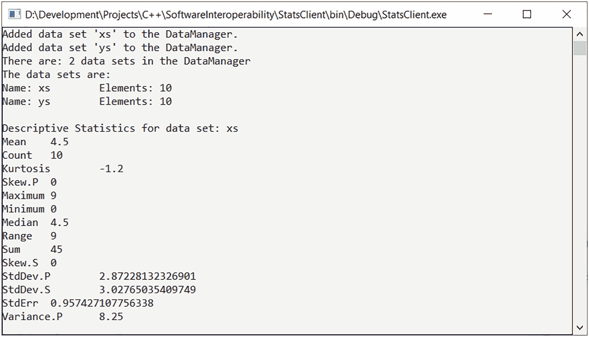
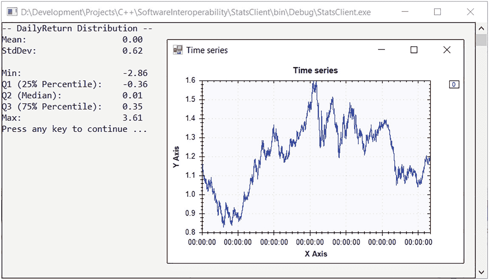
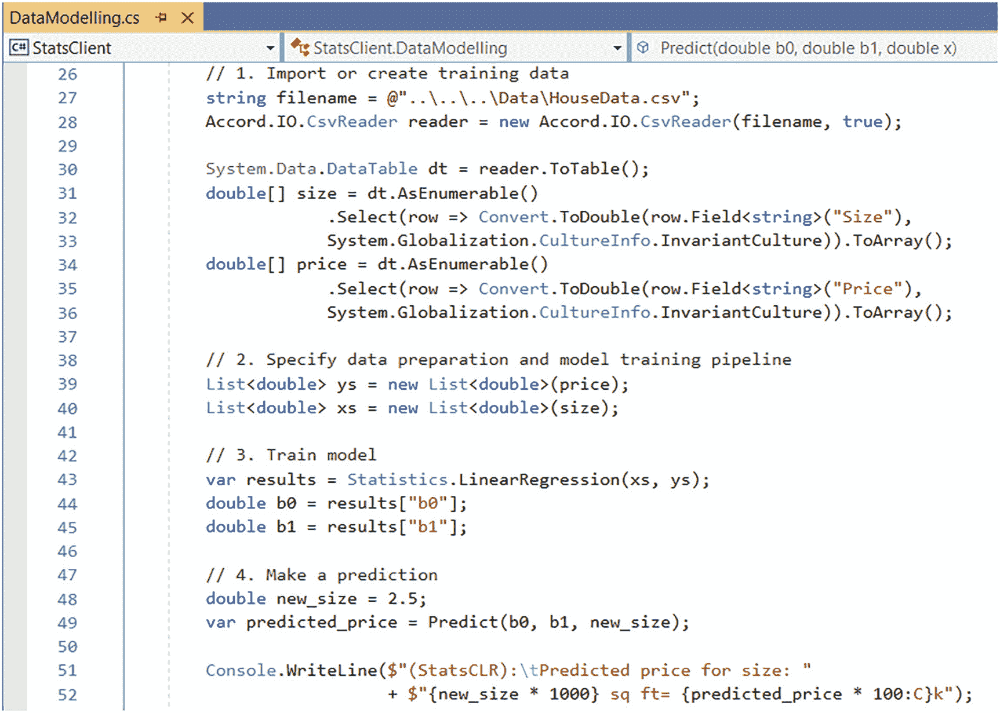
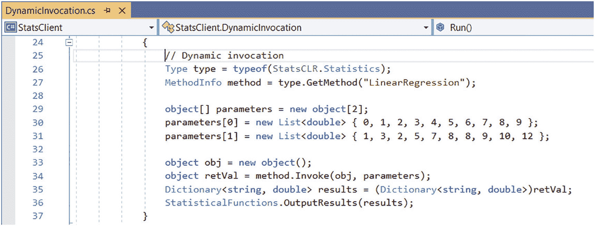
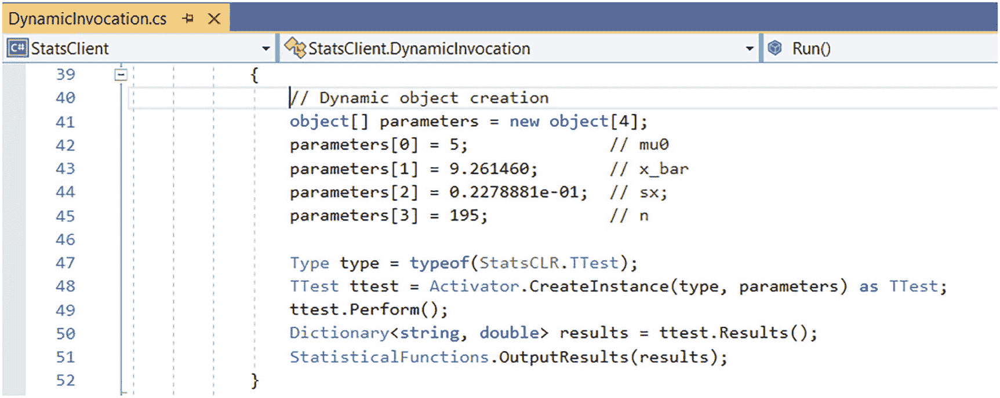
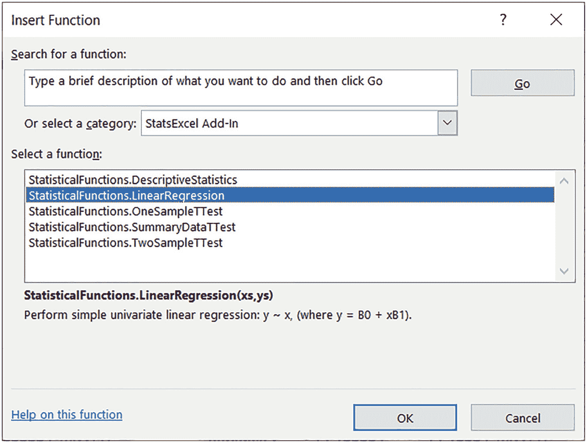
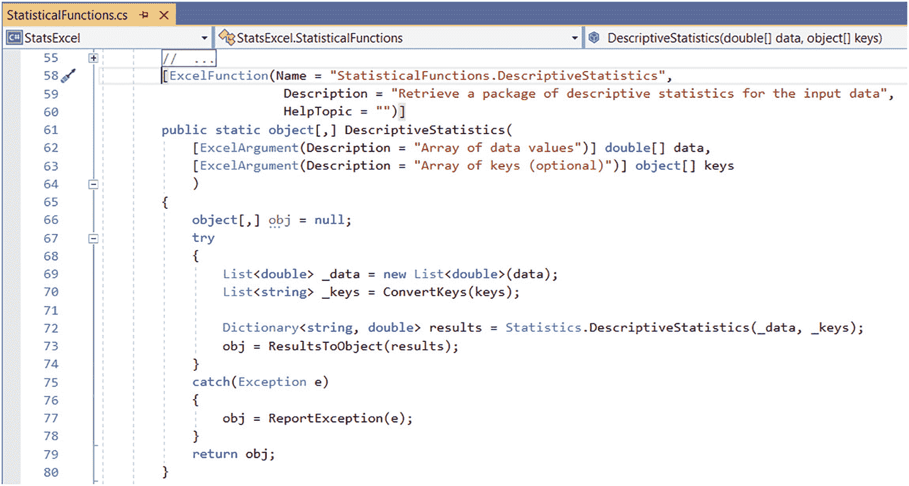
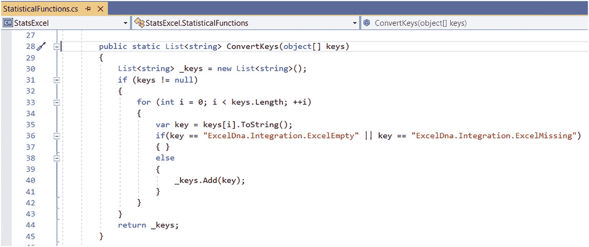
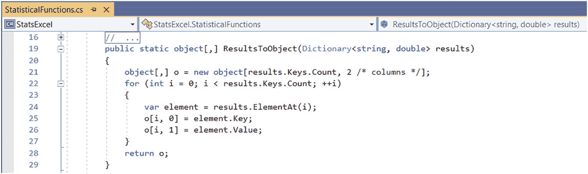
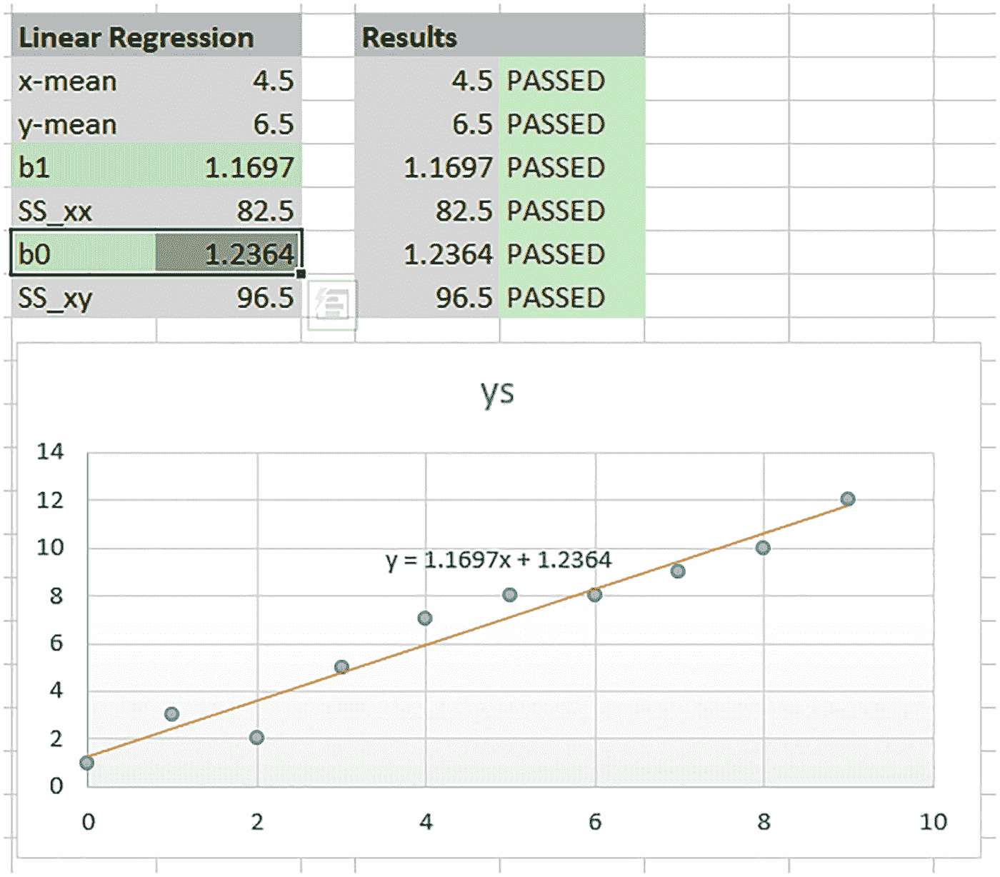

# 四、C# 客户端：使用托管包装

## 介绍

在本章中，我们来看看如何使用 StatsCLR，这是我们在前一章中构建的 C++/CLI 组件。在某种程度上，我们已经通过 StatsCLR 做到了这一点。单元测试测试模块。然而，在这一章中，我们将更广泛地研究在各种不同的环境中使用组件。

我们的第一个应用程序是一个普通的 C# 控制台应用程序。当考虑如何使用包装组件时，我们有三个主要目标。首先，我们希望检查组件是否正常工作，以及我们是否可以调用函数并获得预期的结果。因此，最初，我们只是在一个简单的环境中测试一些我们已经公开的功能。其次，我们想知道我们是否可以将该组件与其他组件一起使用。开发组件的一个主要原因是利用其他。净成分。为此，我们使用 Accord.NET 来研究统计函数如何适合简单的机器学习(ML)流水线。最后，我们希望检查组件是否实现了作为. NET 组件的可用功能。为此，我们看反射。

我们的第二个应用程序更侧重于现实世界。我们将组件连接到 Excel，并使用 StatsLib 中的基本统计功能。

## 统计客户

### 项目设置

StatsClient 是作为 C# 控制台应用程序构建的。唯一感兴趣的设置是平台目标。在用于构建的项目属性下，我们将平台目标设置为“x64”。这与底层 StatsLib C++ 库和 StatsCLR C++/CLI 组件是一致的。如果我们不这样做，我们将得到一个关于处理器架构和项目不匹配的编译器警告，更重要的是，当我们运行可执行文件时，程序集将无法加载，并出现一个模糊的错误消息。我们还在项目引用节点下添加了对 StatsCLR 项目的引用。

### 安装 Accord.NET

Accord.NET([`http://accord-framework.net/`](http://accord-framework.net/))是一个. NET ML 框架。它有各种各样的模块，但我们仅限于使用核心 ML 模块、控制模块和 IO 模块。我们已经使用包管理器将它们安装到 StatsClient 中。依赖项列在文件 *packages.config* 中。您可以在工具➤ NuGet 包管理器➤管理 NuGet 包下查看解决方案...如果软件包需要安装或更新。

### 代码组织

StatsClient 项目中的代码被组织到六个文件和主`Program`类中。下面列出了这些问题，并对每个问题进行了简要描述:

*   *StatisticalFunctions.cs* 使用`DataManager`包装器执行描述性统计和线性回归函数。

*   *DataAnalysis.cs* 对一些时序金融数据进行简单的分析。

*   *data modeling . cs*根据一个单一的特征——房子大小——为房价创建一个简单的线性数据模型。

*   *HypothesisTest.cs* 执行双样本学生 t 检验，并报告备选假设。

*   演示了从程序集中提取模块信息。

*   演示了程序集的动态加载和函数的动态调用。

*   *Program.cs* 包含调用示例代码的主例程。

#### 统计功能

*StatisticalFunctions.cs* 中的代码运行一个典型的会话。我们首先创建数据管理器的一个实例，然后向其中添加两个数据集，分别命名为“xs”和“ys”。之后，我们检索“xs”数据集的描述性统计信息，并将结果输出到控制台。如图 [4-1](#Fig1) 所示。



图 4-1

测试`DescriptiveStatistics`功能

接下来，我们使用最初加载的相同数据集执行线性回归，并输出结果。会话的最后一部分包括创建 t-test 类的实例。我们传入对应于汇总数据 t-test 的构造函数参数，然后调用`Perform`并检索结果，将它们显示在控制台上。

#### 数据分析

*DataAnalysis.cs* 模块将`DescriptiveStatistics`函数与 Accord.NET 的其他统计分析函数结合使用。该例程的目的是分析从 1999 年 1 月 1 日到 2017 年 12 月 29 日欧元/美元汇率的收益分布。代码首先读入每日欧元/美元汇率的数据。读取数据后，我们显示时间序列。使用我们的`DescriptiveStatistics`函数，我们请求一些汇总度量(*最大值*，*表示*，*中值*，*最小值*， *StdDev)。美国，Q1* ， *Q3* )描述退货如下:

```cpp
List<double> _returns = new List<double>(returns);
List<string> stats = new List<string>() { "Maximum", "Mean", "Median", "Minimum", "StdDev.S", "Q1", "Q3" };
var results = Statistics.DescriptiveStatistics(_returns, stats);

```

接下来，我们计算分位数并输出每日回报的分布。我们可以很容易地进一步执行一些功能工程和建模。输出示例如图 [4-2](#Fig2) 所示。



图 4-2

分析欧元/美元的回报分布

#### 数据建模

在模块*data modeling . cs*中，我们使用 StatsCLR 组件作为 ML 管道的一部分。代码如清单 [4-1](#PC2) 所示。

```cpp
-

Listing 4-1Modelling house prices

```



前两个阶段包括导入训练数据和准备输入到模型中。数据集是一个小的房价数据集，由两列组成:大小和价格。为了这个模型的目的，我们简单地假设房价是由一个单一的特征决定的:大小(确切地说是以平方英尺为单位的建筑面积)。更复杂的模型会使用更多的功能，并试图确定哪些功能对价格影响最大。然后，我们使用我们的`LinearRegression`函数来拟合模型。最后，我们提取系数，以便基于新的输入大小来预测价格。一个更广泛的例子是将数据集分成训练部分和测试部分，并使用测试部分来确定模型拟合的好坏。在这个简单的演示中，我们忽略了这些问题。我们还将该模型与使用 Accord.NET 生成的`OrdinaryLeastSquares`回归模型进行了比较。结果和预期的一样。

#### 假设检验

在模块 *HypothesisTest.cs* 中，我们对美国和日本的汽油消耗数据( *us_mpg.csv* ， *jp_mpg.csv* )进行双样本 t 检验(假设方差相等)。在读取数据并将其转换成我们可以使用的格式后，我们执行 t-test 并报告结果。如图 [4-3](#Fig3) 所示。样本 1 对应于美国汽油消耗数据，样本 2 对应于日本汽油消耗数据。


图 4-3

美国与日本 mpg 双样本 t 检验的假设检验报告

从图 [4-3](#Fig3) 可以看出，结果表明样本均值在统计上有显著差异。也就是说，来自美国和日本的汽车通常不会消耗相同的汽油。事实上，测试表明美国的汽车耗油量更高。这种差异是由于偶然因素造成的可能性极小。因此，我们不能拒绝替代假说。

除了我们可以轻松地将 StatsCLR 组件添加到我们的应用程序中并调用底层 C++ 函数之外，这里没有什么令人惊讶的。然而，如果我们后退一步，考虑在这个相同的应用程序中，我们已经放弃了其他。净成分。这使我们能够利用大量现有的功能。另一方面，我们同样可以在不同的项目类型中添加对 StatsCLR 的引用:可能是一个 WPF 应用程序，或者是一个用 ASP.NET 编写的 web 应用程序。

### 使用反射

*StatsCLR.dll*是一个. NET 组件，更确切地说，是一个程序集。在高层次上，程序集是任意的。NET 软件组件。程序集可以放在一个 *dll* 、 *lib、*或 *exe* 中。有两种主要类型的程序集:私有和共享。共享程序集要求在全局程序集缓存(GAC)中注册。这个主题在生产系统中很重要，但超出了本书的范围。在本章中，我们只处理一个单独的私有程序集。就分发而言，关于私有程序集的重要一点是，它必须位于使用它的可执行文件所在的同一目录(或子目录)中。 <sup>[1](#Fn1)</sup>

程序集与传统的 *dll* 共享许多功能，但是有一些重要的不同，特别是在注册和版本控制方面。从我们的角度来看，最重要的区别是程序集包含描述它所包含的类型和函数的元数据，并且这是容易获得的。可以使用工具(例如，中间语言反汇编工具【ildasm.exe】T2)或编程来探索汇编。

正如我们所说的，程序集包含元数据、编译代码和资源。我们可以使用反射来检查这些元数据。那个。NET framework 提供了一个 API，允许我们枚举程序集中的模块和模块中的类型。我们还可以枚举给定类型的方法、字段、属性、事件和构造函数，以及方法的参数。此外，我们可以动态地加载一个程序集，创建一个对象，并在运行时调用一个方法。在本节中，我们将演示这两种工具。

#### 模块信息

*ModuleInfo.cs* 中的代码演示了从一个程序集获取类型信息。这可能是当前程序集，也可能是我们显式加载的程序集。类`ModuleInfo`有一个函数`Enumerate,`，它向控制台输出主可执行文件或命名程序集的详细信息。如清单 [4-2](#PC3) 所示。

```cpp
-

Listing 4-2Exploring type information in an assembly

```


一旦我们有了对程序集的引用，我们就可以获得模块列表。然后，对于每个模块，我们列出了它支持的类型和方法。前面的代码构建了一个包含函数名和每个方法的参数的`functionString`。调试时快速浏览一下“监视”窗口，可以看到对该模块有丰富的描述。如图 [4-4](#Fig4) 所示。


图 4-4

“监视”窗口中的导出类型

在这种情况下，我们可以看到我们在这个项目中声明的类。我们可以更进一步，扩展导出的类型来发现方法和它们的参数。

#### 动态调用

接下来，*dynamic initial . cs*中的代码，列出了 [4-3](#PC4) ，展示了动态对象调用和动态对象创建。

```cpp
-

Listing 4-3Invoking the LinearRegression function dynamically

```



代码的第一部分(未显示)加载 StatsCLR 程序集。从上一节我们知道，我们可以通过组装模块获得类型。在这种情况下，除了我们在 StatsCLR 中声明的类型之外，还有大量的类型。这是因为这些类型包括 C++/CLI 代码中使用的 STL 类型。一个有用的方法是使用对象浏览器。正如我们在上一节中看到的，我们可以检查方法、参数和字段。但是，在这种情况下，我们只想调用`LinearRegression`函数。为此，我们首先获得代表`Statistics`类的`Type`。由此，我们获得了一个表示`LinearRegression`方法的方法对象。我们用数据列表构造了一个`parameters`对象数组。最后，我们调用`method.Invoke`。像往常一样，我们检索结果并显示它们。

我们的最后一个例子是动态对象创建。清单 [4-4](#PC5) 显示了代码。

```cpp
-

Listing 4-4Creating an object dynamically

```



我们开始设置对应于汇总数据 t-test 的输入参数数组。然后我们从 StatsCLR 程序集获得对应于`TTest`类的类型。有了这些信息，我们可以创建一个`TTest`类的实例。为此，我们使用了`Activator.CreateInstance`函数。这将动态创建一个`TTest`类的实例。参数确定调用哪个基础构造函数。在执行 t-test 之后，我们检索结果并显示它们。

#### 管理员

如果这一切看起来有点做作，我们可以使用 PowerShell 来演示一个更真实的例子。清单 [4-5](#PC6) 显示了一个简单的 PowerShell 脚本，它执行 StatsCLR 中的一些功能，以便分析系统性能计数器。

```cpp
-

Listing 4-5Using StatsCLR to analyse performance counters

```


最初，该脚本加载 StatsCLR 程序集(就像我们之前所做的一样)。我们显示了可供参考的类型。接下来，我们声明一个`double`的数组(使用 C# `Collections.Generic.List`类型)。它保存了调用名为*“使用中的内存提交字节百分比”*的性能计数器的结果。我们使用名为`Get-Counter`的 *CmdLet* 来检索关于指定计数器的数据。对于这个计数器，我们只要求 10 个样本，观察间隔为 1 秒。然后我们为我们想要的统计数据设置键(*表示*， *StdDev)。S* 、*最小值*和*最大值*，并调用`DescriptiveStatistics`。输出可以以多种方式格式化，也可以通过管道传输到其他*cmdlet*。在这种情况下，我们选择将表格显示输出到控制台，并将表格输出到默认的网格视图。如图 [4-5](#Fig5) 所示。


图 4-5

性能计数器数据的 PowerShell 显示

在这一节中，我们仅仅触及了反射所能实现的表面:如果我们能够动态地加载程序集，那么我们就可以在执行时决定使用哪个版本的程序集。或者，例如，我们可以将不同的程序集与接口的实现相关联，从而按需加载不同的实现。更一般地，就软件设计而言，这些设施(动态加载和动态方法调用)使得能够开发松散耦合、可重用的软件组件系统，这有助于软件的互操作性。

## StatsExcel

我们的第二个 C# 客户机稍微复杂一些，当然也比上一节中的例子更实际。我们的目标是能够在 Excel 中使用 StatsLib 提供的功能。更具体地说，我们希望能够像这样调用 Excel 工作表中的函数:`=StatisticalFunctions.LinearRegression(xs, ys)`。

让 Excel 使用 C/C++ 组件已经存在很长时间了。在这一时期，有许多略有不同的方法来实现这一点。一种典型的方法是手工制作一个 *xll* 。一个 *xll* 是一个 C/C++ *dll* 外壳，带有一些 Excel API 定义的附加导出函数。特别是，当 XLL 被添加到 Excel 中时，Excel 将调用函数`xlAutoOpen`。然后`xlAutoOpen`例程将每个函数注册到 Excel 中。一旦注册，这些函数就会出现在 Excel 的函数列表中。编写一个 *xll* 的替代方法是使用一个 COM 加载项(这可以是一个非常灵活的 Office 扩展加载项，也可以是一个 VSTO(Visual Studio Tools for Office)加载项，这在某种程度上更受限制)。无论是哪种情况，都有一定的准备工作要做。也许基于 COM 的方法的最大问题是需要注册组件。

我们为这个组件采用的方法稍微容易一些。我们使用的是第三方库，Excel-DNA ( [`https://excel-dna.net/`](https://excel-dna.net/) )，可以让我们轻松连接 Excel。Excel-DNA 框架利用元数据和反射来动态创建一个 *xll* 。

### 安装 Excel-DNA

我们已经使用包管理器将 Excel-DNA 安装到 StatsExcel 项目中。您可以在工具➤ NuGet 包管理器➤管理 NuGet 包下查看解决方案...如果软件包需要安装或更新。Excel-DNA NuGet 包安装所需的文件并配置项目以构建 Excel-DNA 插件。

### 项目设置

StatsExcel 组件是作为 C# 类库构建的。在项目属性中，检查外部程序是否正确引用了 Excel。“启动外部程序”的设置要设置成指向 Excel，例如*C:\ Program Files \ Microsoft Office \ root \ Office 16 \ Excel。EXE* 。此外，您可以检查命令行参数是否引用了我们想要构建的 x64 目标:*" stat excel-addin 64 . xll "*。

### 向 Excel 公开函数

为了使 StatsCLR 组件中的函数可用，我们需要编写额外的包装函数，并将它们声明为`public static`函数。组件构建完成后，这些函数被导出到 Excel 中，并出现在可用函数列表中，如图 [4-6](#Fig6) 所示。



图 4-6

通过 Excel-DNA 从 StatsCLR 公开的统计函数

从图 [4-6](#Fig6) 中，我们可以看到列出的`DescriptiveStatistics`、`LinearRegression,`和统计测试函数。我们还可以看到描述所选功能的*帮助字符串*。在文件 *StatisticalFunctions.cs 中，*我们声明了一个类，它包装了我们想要使用的函数。我们包装了`DescriptiveStatistics`、`LinearRegression`和`TTest`类，只是为了让事情易于管理。清单 [4-6](#PC7) 显示了`DescriptiveStatistics`功能。

```cpp
-

Listing 4-6The DescriptiveStatistics function

```



从清单 [4-6](#PC7) 中，我们可以看到函数是由`ExcelFunction[]`属性描述的。我们可以提供一个`Name`、一个`Description,`和一个`HelpTopic`参考。从 Excel 的角度来看，函数是由`Name`属性中的值调用的。所以这里叫`"StatisticalFunctions.DescriptiveStatistics"`。我们试图保持名称空间和函数名称的唯一性，因为我们希望与 Excel 中的其他函数共存。除了名称之外，还有许多属性可以用来描述我们的函数。具体来说，我们使用`ExcelArgument[]`属性来描述参数。在这种情况下，函数接受一个 doubles 数组(`double[] data`)和一个 string keys 数组，我们将它们作为对象传递(`object[] keys`)。该函数返回一个数组(`object[,]`)。

### 类型变换

一般来说，我们需要将 Excel 类型转换成包装函数能够理解的类型。因为我们决定用`List<double>`作为数据，所以我们利用了。NET framework 允许我们直接从一个`array`构造`List`，因此在转换代码中要做的工作更少。对于键，我们被传递一个对象数组，它可以包含字符串和其他数据。因此，我们需要正确地转换按键。清单 [4-7](#PC8) 展示了我们如何做到这一点。

```cpp
-

Listing 4-7Converting an object array of keys to a list of strings

```



该函数首先构造一个空的`List<string>`。然后我们检查输入键数组是否有效。如果是这样，我们迭代输入键，将它们转换成字符串。如果转换失败，将引发异常。我们在下面处理异常。如果键不为空，我们将它添加到列表中，并在完成时将其返回给调用者。

对于来自`DescriptiveStatistics`的返回值，我们需要将结果`Dictionary<string, double>`转换成一个两列的对象数组(`object[,]`)。在我们的例子中，它将在第一列包含`string` s，在第二列包含`double` s。清单 [4-8](#PC9) 显示了转换函数。

```cpp
-

Listing 4-8Converting the package of results into a two-column array

```



第一行使用结果参数的`keys`集合的维度创建一个对象数组。然后我们遍历结果项，提取每个键值对，并将它们分配给对象数组。然后将它返回给调用者。

### 构建并运行

项目应该在没有警告或错误的情况下生成。如果您将 StatsExcel 项目设置为启动项目，那么您将能够立即运行代码。Excel 将启动，我们生成的 *xll* 将被加载。如果要在 Visual Studio 解决方案之外运行外接程序，请双击位于*\ stat excel \ bin \ Debug*或*\ stat excel \ bin \ Release*目录中的文件*。注意，因为 StatsExcel 项目引用 StatsCLR 项目，所以*StatsCLR.dll*被复制到这个目录中。第一次运行该外接程序时，Excel 将提示您确认是否要为此会话启用该外接程序。如果希望在以后的运行中避免出现此提示，可以使用“选项”菜单中的 Excel 信任中心，将外接程序的路径设置为受信任的位置。*

Excel 启动后，打开文件*..\Data\StatsCLRTest.xlsx* 。这个文件包含两个工作表:“基本功能”测试了`DescriptiveStatistics`和`LinearRegression`功能。对于`DescriptiveStatistics`，我们定义了两个范围‘xs’和‘ys’，并使用它们来计算描述性统计数据。将结果与硬编码值进行比较。如果您更改其中一个输入值，您应该会观察到一些测试失败。我们还通过传入单个标签并将结果与等效的 Excel 函数进行比较来测试`DescriptiveStatistics`函数。最后，我们测试了`LinearRegression`函数。如图 [4-7](#Fig7) 所示。



图 4-7

Excel 中的`LinearRegression`函数

在结果下面，我们绘制了数据并添加了趋势线。我们可以看到，图表上显示的回归方程与我们获得的截距(`b0`)和斜率(`b1`)系数相同。

“统计测试”工作表练习了`TTest`功能。我们检查汇总数据的 t 检验，以及单样本和双样本 t 检验。在后两种情况下，我们显示箱线图来表示各个数据集均值的差异。在这两种情况下，很明显，各自的均值明显不同，这一点通过 t 检验的`pval`得到了证实(这种差异可能是偶然观察到的)。

### 异常处理

我们应该小心确保异常不会从我们的代码传播到 Excel 中，因为这可能会导致 Excel“崩溃”，这是非常不希望的。我们知道 C++ 层在某些情况下会抛出异常，特别是在数据不存在或者没有足够的数据来执行操作的情况下抛出`std::invalid_argument`。我们还知道，在 StatsCLR 层，这些已经被转换为`System::InvalidOperationException`，并将被重新抛出。因此，在 StatsExcel 层，我们应该处理这些异常。

实际上，Excel-DNA 在以通用方式处理异常方面做得很好——它在单元格中显示一个`#VALUE`。在我们的例子中，我们希望显示字符串信息。在正常情况下，我们将函数调用的结果返回到一个`object`数组中。我们利用了 Excel 可以处理返回的`object`数组中的字符串和数字数据这一事实。当抛出异常时，我们将异常的结果赋给`object`数组。为此，我们使用函数`ReportException`，如清单 [4-9](#PC10) 所示。

```cpp
-

Listing 4-9Reporting an exception

```


当抛出一个异常时，我们创建一个 1x2 数组并用异常信息填充第二列。如果我们尝试不带参数调用`StatisticalTests.TTest`函数，我们会看到以下输出:

`"Error in function boost::math::students_t_distribution<double>::students_t_distribution: Degrees of freedom argument is -1, but must be > 0 !"`

结果并不漂亮，但它是有益的。值得注意的是，如果您调用带有空参数的函数，您将返回`#VALUE!` s。如果您调用带有空数组(没有数据的单元格)的函数，这将作为初始化为 0 的`double` s 的数组传递，这在某些函数的情况下是可以接受的。例如，如果传递给底层 C++ 函数`GetDescriptiveStatistics`的数据点太少(计算峰度至少需要四个数据点，计算偏斜至少需要三个数据点)，就会得到一条关于“数据不足以执行操作”的消息，这是 C++ 层抛出的正确异常。

### 排除故障

最后，简单说说调试。从 Visual Studio 内部调试并不比在我们想要调试的行上设置断点更困难。这允许我们查看传递到函数中的参数，并检查参数的类型和维度是否与函数签名相对应。这里的不匹配是运行时错误的常见来源。此外，我们可以在“项目设置”“➤调试”下设置“启用本机代码调试”标志，以允许我们调试到本机 C++ 层(从 Excel)。这样，我们可以检查我们返回到 Excel 的值是否对应于函数签名中声明的返回类型。任何问题都可以迅速得到调查和解决。

## 摘要

在这一章中，我们展示了一些涉及 StatsCLR 组件的用例。我们首先看了一个基本的 C# 控制台应用程序。除了简单地测试统计函数和类，我们还引入了 Accord.NET 的功能。这些例子可能显得虚假和简单。然而，重要的一点是，我们能够利用不同的功能。除了我们的以外。我们还看到了如何使用反射来动态检查程序集的内容。这也证明了 StatsCLR 组件是“合适的”。NET 程序集。这意味着我们可以完全参与。NET 类型系统。这反过来也方便了其他客户使用我们的库。最后，我们使用 Excel-DNA 将 StatsCLR 包装器连接到 Excel。除了允许我们利用 Excel 作为宿主环境之外，我们组件还可以无缝地与其他组件进行互操作。净成分。

### 额外资源

以下链接提供了本章的一些附加背景信息:

*   中有关程序集的更详细的讨论。NET，推荐以下文章: [`https://docs.microsoft.com/en-us/dotnet/standard/assembly/`](https://docs.microsoft.com/en-us/dotnet/standard/assembly/) 。

*   下面的文档详细描述了。NET 运行时定位程序集: [`https://docs.microsoft.com/en-us/dotnet/framework/configure-apps/specify-assembly-location`](https://docs.microsoft.com/en-us/dotnet/framework/configure-apps/specify-assembly-location) 。

*   有许多方法可以让 Excel 与 C++ 通信。开发 Excel XLLs 大概是最基础的，这里详细介绍: [`https://docs.microsoft.com/en-us/office/client-developer/excel/developing-excel-xlls`](https://docs.microsoft.com/en-us/office/client-developer/excel/developing-excel-xlls) 。其他方法包括 VSTO ( [`https://docs.microsoft.com/en-us/visualstudio/vsto/getting-started-programming-vsto-add-ins?view=vs-2019`](https://docs.microsoft.com/en-us/visualstudio/vsto/getting-started-programming-vsto-add-ins%253Fview%253Dvs-2019) )和 Office 插件。

*   Excel-DNA 文档可以在这里找到: [`https://docs.excel-dna.net/`](https://docs.excel-dna.net/) 。推荐“入门”文档( [`https://docs.excel-dna.net/getting-started/`](https://docs.excel-dna.net/getting-started/) )。

## 练习

下面的练习涉及 StatsExcel 客户端，以及它如何使用我们通过 StatsCLR 组件公开的新功能，以及我们在本机 C++ 代码中透明提供的功能。

1)更新 *StatsCLRTest.xlsx* 表，显示并检查`LinearRegression`系数的新值。

*   将`SS_yy`、`r`和`r2`添加到输出中(根据需要调整数组大小)。

*   更新测试结果，使其全部通过。

2)在 StatsExcel 项目中，添加函数来执行 z 测试。我们以 t-test 函数为例，最终得到三个新函数:`StatisticalFunctions.SummaryDataZTest`、`StatisticalFunctions.OneSampleZTest`和`StatisticalFunctions.TwoSampleZtest`。

所需的步骤如下:

*   克隆现有的功能并对其进行调整。

*   向 *StatsCLRTest.xlsx* 添加新工作表(或复制现有的统计测试工作表)。使用具有预期值的数据集测试函数。

3)给 *StatisticalFunctions.cs* 添加一个名为`StatisticalFunctions.MovingAverage`的函数。这需要三个参数:一个日期数组、一个观察值数组和一个窗口大小参数。如前所述，这个函数有点复杂，因为我们需要处理从`double` s(由 Excel 提供)到我们的函数所期望的`DateTime`对象列表的转换。我们还需要将得到的移动平均序列作为一个单列的`double`数组返回。

在添加`MovingAverage`功能之前，添加转换代码。第一个函数将数组`double`(代表日期)转换成一个`List<DateTime>`。这可以通过以下方式实现:

```cpp
public static List<DateTime> ToDateTime(double[] dates)
{
        List<DateTime> output = new List<DateTime>();
        for (int i = 0; i < dates.Length; ++i)
        {
                output.Add(DateTime.FromOADate(dates[i]));
        }
        return output;
}

```

第二个函数将`List<double>`结果包转换成一列`object`数组。这可以通过以下方式实现:

```cpp
public static object[,] ResultsToObject(List<double> results)
{
        object[,] o = new object[results.Count, 1 /* column */];
        for (int i = 0; i < results.Count; ++i)
        {
                var val = results.ElementAt(i);
                if (Double.IsNaN(val))
                        o[i, 0] = ExcelDna.Integration.ExcelError.ExcelErrorNA;
                else
                        o[i, 0] = val;
        }
        return o;
}

```

准备好之后，添加`MovingAverage`函数。原型如下:

```cpp
[ExcelFunction(Name = "StatisticalFunctions.MovingAverage",
Description = "Compute a moving average from a set of data.",
HelpTopic = "")]
public static object[,] MovingAverage(
[ExcelArgument(Description = "Array of dates")] double[] dates,
[ExcelArgument(Description = "Array of observations")] double[] observations,
[ExcelArgument(Description = "Window")] int window
)
{
        // ...
}

```

*   将输入参数转换成`TimeSeries`类能够理解的类型。创建一个 C++/CLI `TimeSeries`类的实例，并向其传递参数。请求一个`MovingAverage`，并将结果返回到对象数组中。记得处理异常。

*   重新构建 StatsExcel 项目并测试新的`MovingAverage`函数。添加名为“时间序列”的新工作表。使用我们在单元测试中使用的相同数据。在 Excel 中测试函数。Excel 有自己的移动平均计算(在数据分析下)。 <sup>[2](#Fn2)</sup> 将 Excel 生成的值与此实现进行比较。它们应该是相同的。

<aside aria-label="Footnotes" class="FootnoteSection" epub:type="footnotes">Footnotes [1](#Fn1_source)

现实一如既往地更加复杂。有关如何使用？NET 运行库定位程序集。

  [2](#Fn2_source)

这需要安装分析工具库。

 </aside>