# 一、入门指南

本书前半部分的大多数程序使用了 SDL 和 SSDL 的图形和游戏库， <sup>[1](#Fn1)</sup> 理论上，观看彩色图形在屏幕上移动并互相射击比打印文本更有趣。别担心。当你完成后，你将能够用这个库或不用这个库来编写程序——如果我对此有什么要说的，你会从中得到乐趣。

如果你已经选择了你的平台，很好。如果没有，我的建议是:

*   如果你只是想在一个简单易管理的平台上学习 C++，微软 Visual Studio 很棒。

*   如果您是一名 Unix 系统管理员，或者有很好的访问权限，并且希望使用这个流行且功能强大的平台，那么就去使用它吧。

*   要学习 g++ 并在 Windows 中用相对简单的设置制作来自 Unix 世界的强大工具，请使用 MinGW。

不同平台之间的编程不会有太大差异。但是系统设置可能是一个问题。

## 初始设置

首先，你需要教材的源代码。您可以通过位于 [`www.apress.com/9781484263051`](http://www.apress.com/9781484263051) 的下载源代码按钮访问代码。

然后拉开拉链。在 Unix 中，`unzip`命令应该可以工作；在 Windows 中，您通常可以双击它或右键单击并选择“提取”或“全部提取”。

### …在 Unix 中

在 Unix 中漫游不在本书的讨论范围之内，但是不用担心。复制文件、移动文件等基础知识很容易掌握。 <sup>[2](#Fn2)</sup>

Unix 系统管理的*方式*超出了本书的范围。 <sup>[3](#Fn3)</sup> 但是安装 SSDL 很容易。在你刚刚解压的文件夹里

*   进入`external/SSDL/unix`，输入`make`。这将 SSDL 构建在一个源代码中的程序知道在哪里可以找到它的地方。

*   进入`ch1/test-setup`。

*   `cp Makefile.unix Makefile`

*   `make`

*   `./runx`

你应该看到(听到)图 [1-1](#Fig1) 中所示的程序。(如果没有，一定是遗漏了什么——请参见附录 a。)您可能需要一点时间来尝试来自`ch1`的另一个程序，比如`1-hello`。像你在`test-setup`一样经营它。

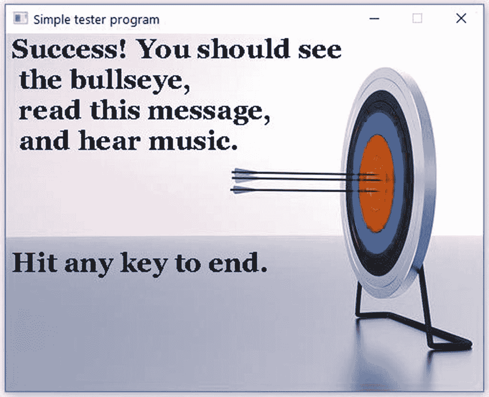

图 1-1

`test-`的输出`setup`

### …在 MinGW 中

你可以在 sourceforge.net 和其他地方找到 MinGW。试试在网上搜索“MinGW 下载”

一旦安装完成，让它添加 C++ 的基础知识；启动 MinGW 安装管理器(`mingw-get.exe`)，至少安装`mingw32-gcc-g++-bin`、`mingw32-gdb-bin`和`msys-make-bin`。

你*不会*需要安装 SDL 或者 SSDL；它们在你解压的源代码里。

所以让我们试试吧。打开 Windows 命令提示符(单击开始菜单并键入`cmd`)并转到源代码的`ch1/test-setup`文件夹。这里有一个简单的方法:在该文件夹的窗口中，单击地址栏左边的文件夹图标，该部分显示类似于`... > ch1 > test-setup`的内容。它将被一个高亮显示的路径代替，如图 [1-2](#Fig2) 所示。按 Ctrl-C 复制它。

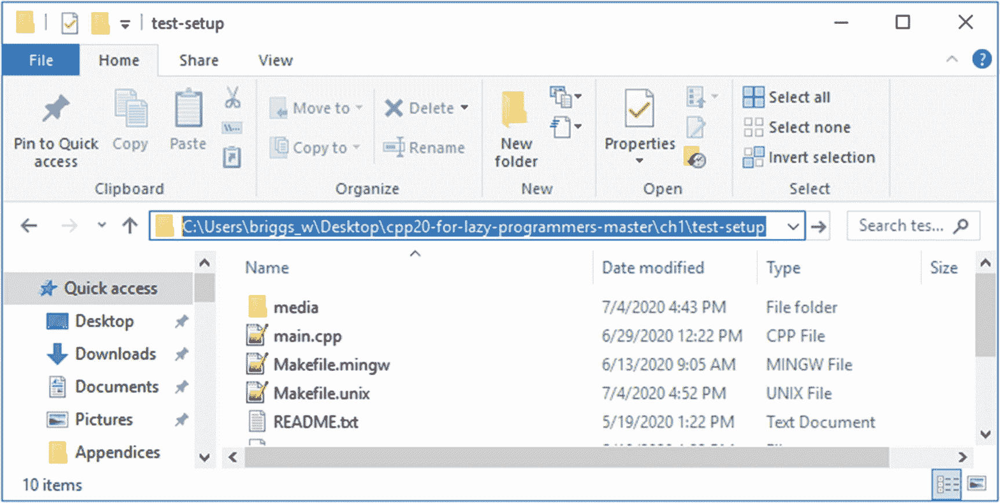

图 1-2

在 Windows 中获取用于命令提示符的路径

在命令窗口中，输入您复制的路径的前两个字符(在我的例子中是`C:`)；然后输入`cd`，粘贴路径(Ctrl-V)，再按回车键(见图 [1-3](#Fig3) )。

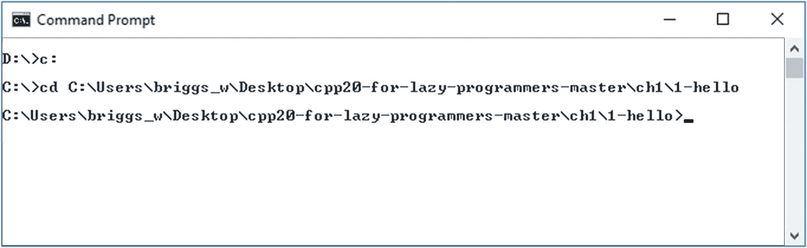

图 1-3

在命令提示符下找到正确的文件夹

然后

```cpp
copy Makefile.mingW Makefile
make
bash runw

```

你应该看到(听到)图 [1-1](#Fig1) 中所示的程序。(如果没有，请参见附录 a。)您可能需要一点时间来尝试来自`ch1`的另一个程序，比如`1-hello`。像你在`test-setup`一样经营它。

### …在 Microsoft Visual Studio 中

目前，Visual Studio 完全免费。进入微软的下载页面(目前是[visual studio . Microsoft . com/downloads/](https://visualstudio.microsoft.com/downloads/))下载社区版。

安装要花很长时间。确保用 C++ 进行桌面开发(图 [1-4](#Fig4) ，右上角)——否则，你会有 Visual Studio，没错，但它不知道 C++。

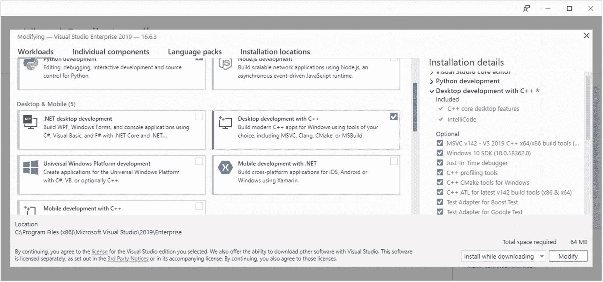

图 1-4

安装 Visual Studio 的 C++ 部分

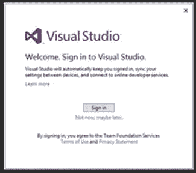安装完成后，进入该书的源代码文件夹，进入`ch1`子文件夹；双击解决方案文件，`ch1.sln`或`ch1`。(如果它要求您登录，而您现在还没有准备好，请注意“现在不行，以后再说”这一行。)

现在，在解决方案浏览器窗口中(见图 [1-5](#Fig5) ，你应该在底部看到一个名为**测试设置**的项目。右键单击它，并选择调试➤启动新实例。

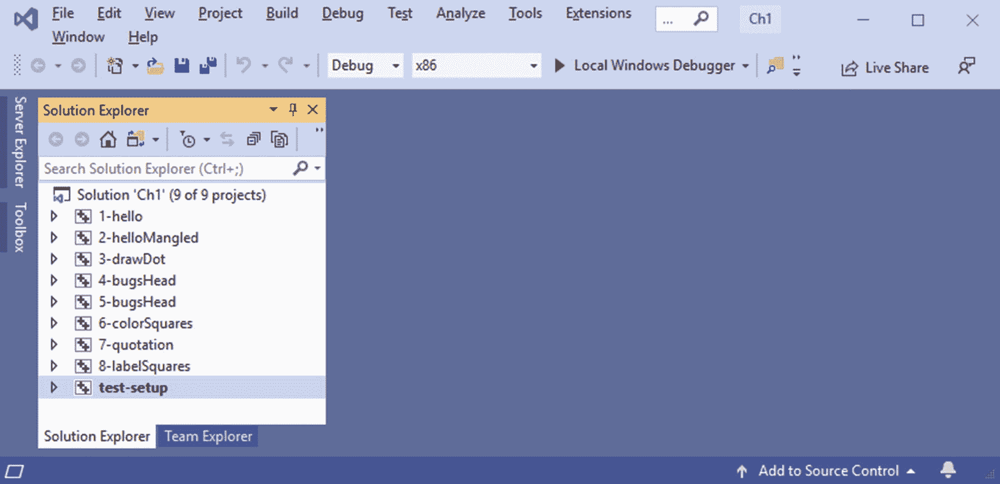

图 1-5

Visual Studio 中的`ch1`解决方案，突出显示了`test-setup`项目

你应该看到和听到图 [1-1](#Fig1) 中的节目。(如果没有，请参见附录 a。)您可能需要一点时间来尝试来自`ch1`的另一个程序，比如`1-hello`。像你在`test-setup`一样经营它。

## 简单的程序

从小处着手是明智的。更少的事情会出错。

所以我们将从一个简单的程序开始，它写着“你好，世界！”在屏幕上。我们会一行一行的看里面有什么。(在下一节中，我们将编译并运行它。现在，坐着别动。)

```cpp
// Hello, world! program, for _C++ for Lazy Programmers_
//   Your name goes here
//   Then the date4

//    It prints "Hello, world!" on the screen.
//    Quite an accomplishment, huh?

#include "SSDL.h"

int main (int argc, char** argv)
{
     sout << "Hello, world!  (Press any key to quit.)\n";

     SSDL_WaitKey ();        // Wait for user to hit any key

     return 0;
}

Example 1-1“Hello, world!” is a classic program to start a new language with. (I think it’s a law somewhere.) This program is in source code, in the ch1 folder, as 1-hello

```

第一组行是注释。**评论**看起来是这样的——`//Something on a line after two slashes`——它们仅仅是为你或者是为后来试图理解你的程序的人准备的。最好善待你自己和你的维护者——帮助他们容易地知道程序在做什么，而不必去搜索和弄清楚。

接下来，我们有一个`include`文件。一些语言特性内置于 C++ 编译器本身，比如注释标记`//`和`#include`。其他仅在需要时加载。在这种情况下，我们需要知道如何使用 SSDL 库在屏幕上打印东西，所以我们包含了文件`SSDL.h`。

接下来，我们有了`main`函数。`main ()`特殊；它告诉编译器，“这就是我们在程序中要做的；从这里开始。”现在我将推迟解释这个奇怪的顶行——我们将在第 25 章的“命令行参数”一节中讨论它——只是说，现在，我们总是用同样的方式写它。否则，C++ 之神会用无法理解的错误消息来惩罚我们。

在这种情况下，`main ()`只做两件事:

首先，它使用`sout`对象打印`"Hello, world!"`消息，读作“S-out”`\` `n`的意思是“继续下一行”

第二，它调用`SSDL_WaitKey ()`，在它结束程序之前等待你按一个键。否则，程序会在您有机会看到它的消息之前关闭。

我们`return 0`是因为`main ()`必须`return`一些东西，很大程度上是因为历史原因。实际上，我们几乎从不关心`main`返回什么。

花括号`{}`告诉`main ()`从哪里开始采取行动，在哪里结束；无论你想让程序做什么，都在花括号之间。

编译器对你输入的东西非常挑剔。去掉一个`;`，程序就不会编译。改变某些东西的大小写，C++ 不会识别它。

如果你想知道没有 SSDL 这样一个简单的程序会是什么样子，请看第 29 章。它不适合初学者，但以后应该会有意义。

Extra

“你好，世界！”通常是初学者用新语言编写的第一个程序。虽然它最初是 C 语言中的一个简单例子——c++ 是这种语言的起源——但是将它作为第一个程序来编写的做法已经传播开来。这里是“你好，世界！”在 BASIC 中:

`10 PRINT "Hello, world!"`

不错吧。

这是它在 APL 中的样子。APL ( *A P* 编程 *L* 语言)被描述为“只写”语言，因为据说你不能阅读自己写的程序。APL 需要符号，如`□`、∇和ρ:

□t0□

尽管这些看起来比 C++ 的版本简单，但 C++ 的版本既不是最长的也不是最难的。为了节约资源，我就不赘述了(一个例子是 Redcode 语言有 158 行，这可能是你从未听说过 Redcode 的原因)，但这里有一个很难的例子，来自一种有时被称为 BF 的故意困难的语言:

`++++++++++++++++[>++++>++++++>+++++++>+++>++<<<<<-]>++++++++.>+++++.+++++++..+++.>>----.>.<<+++++++.<.>-----.<---.--------.>>>+.`

更多“你好，世界！”在撰写本文时，可在[http://hello world collection . de/](http://helloworldcollection.de/)找到相关示例。

### 间隔

编译器*不关心间距。只要你不在单词里面放空格，你可以把它放在你喜欢的任何地方。你可以选择换行或者不换行；它不会在意，只要你不弄坏一个`//comment`或者一个`"quotation"`。*

```cpp
// Hello, world! program, for _C++ for Lazy Programmers_
//    It prints "Hello, world!" on the screen.
//    Quite an accomplishment, huh?

      #include "SSDL.h"

            int main (int argc, char** argv) {
      sout <<
"Hello, world!  (Press any key to quit.)\n";

            SSDL_WaitKey ();    // Wait for user to hit any key

return 0;
      }

Example 1-2A blatant instance of evil and rude5 in programming

```

编译器不会在意间距——但是必须理解你的 500 页程序的可怜灵魂会在意！示例 [1-2](#PC3) 的间距对于后来维护你的代码的人来说是一件残酷的事情。

可读性是一件好事。努力理解你的意思的程序员很可能就是写完它几天后的你。软件开发的大部分费用是程序员的时间；你不会想浪费你的时间去破译你自己的代码。*说清楚。*

Tip

在你写代码的时候，而不是之后*，让你的代码变得清晰。可读代码有助于开发，而不仅仅是未来的维护。*

为了更加清晰，我在示例 [1-1](#PC2) 中使用了一些东西，比如初始注释、`#include`和`main ()`，用**空行**隔开。这有点像在英语论文中写段落；每一节都是它自己的“段落”空行增加可读性。

我也以一种使程序易于阅读的方式缩进。默认的**缩进**是左边距。但是如果一个东西包含在另一个东西中——就像主函数中包含的`sout`语句——它会缩进几个空格。

这类似于论文的大纲格式或目录的布局(图 [1-6](#Fig6) )。包含在其他内容中的内容会稍微缩进。

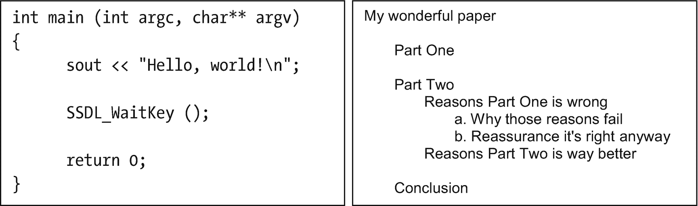

图 1-6

就像英文论文大纲一样，C++ 程序是缩进的，子部分相对于它们所属的部分缩进

继续读下去，你会看到很多清晰缩进的例子。

Golden Rule of Indenting

当某个东西是之前的一部分时，它应该缩进(像这样)。

当它独立时，它保持相同的缩进级别。

## 创建 SSDL 项目

### …使用 g++ (Unix 或 MinGW)

要创建自己的项目，进入`newWork`目录，将`basicSSDLProject`复制到一个有适当名称的新目录中——类似于`cp -R basicSSDLProject myNewProject`。

然后将`Makefile.unix`复制到`Makefile`(如果你用的是 Unix)或者将`Makefile.mingw`复制到`Makefile`(如果你用的是 MinGW)。`Makefile`告诉系统如何编译，在哪里找到库，诸如此类的事情。

你还需要打开你的文本编辑器。在 Unix 上，你可能会使用 vi/vim(我觉得这很难，但也许你不会)、emacs、 <sup>[7](#Fn7)</sup> 或者其他一些编辑器。在 Windows 上，Notepad++ 是一个不错的选择。根据需要熟悉一下，打开`main.cpp`进行编辑。

这个程序是有效的，但是它没有做任何有趣的事情，所以你需要给它一些内容。现在，你可以输入 Hello，world！来自示例 [1-1](#PC2) 的程序。要进行编译，请在命令提示符下键入`make`。

也许你会犯一些错别字。如果是这样，`make`会给你一个错误信息列表。有时信息的意思很清楚，有时又不清楚。这里有一个典型的:我忘了一个`;`。

```cpp
main.cpp:11:53: error: expected ';' before 'SSDL_WaitKey'

```

随着时间的推移，您会更加理解模糊错误消息的含义。现在，将您键入的程序与示例 [1-1](#PC2) 进行比较，并解决任何差异，直到您获得图 [1-7](#Fig7) 中的成功结果。(该程序实际上是在黑色上打印白色，不像显示的那样。书，大块的黑色墨水，不是一个好的组合。)

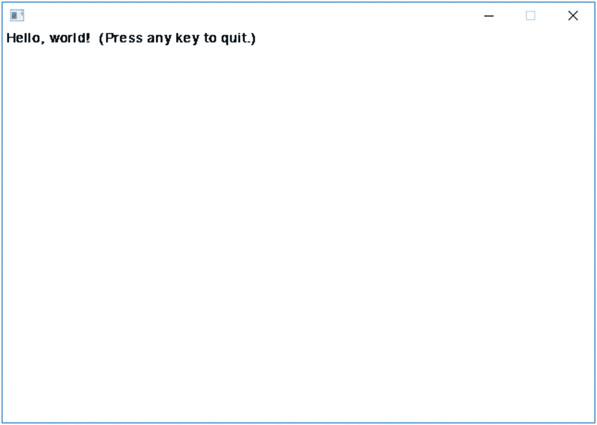

图 1-7

你好，世界！运转

#### 你创建的文件

在新文件夹中，根据提示键入`ls`或`dir`。您可能会看到一些文件:

`a.out main.cpp main.cpp~ main.o #and a bunch of other stuff.`

`a.out`是可执行程序。`main.cpp`是你写的让它产生的代码。`main.cpp` `~`是你的编辑可能对你的`.cpp`文件做的备份文件。`main.o`是一个“对象”文件，g++ 可以在创建程序的过程中构建它。如果你看到它，你可能看不到，删除它是绝对安全的:

`rm` `main.o`

要删除此处列出的您不需要的东西，请键入`make clean`。

#### 很酷的命令行技巧

*   **重复一个命令** **:** 经常在命令提示符下，你可以按向上箭头重复上一个命令，或者多次重复一个更早的命令。如果这样不起作用，`!`后面跟着命令的前几个字母可能会重复它的最后一个实例。

*   **在目录名中使用通配符:** `cd partialname*`通常可以节省时间。`cd partialname`后面跟着 Tab 键也可能起作用。

Extra:

`tar` **Files for Unix (MinGW 用户，参见下面的“Extra:**`zip`**Files”)**

想要将该目录放入一个文件中进行邮寄或存储吗？在删除任何你不想要的大文件之后(`make clean`)，进入一个目录(`cd ..`)并`tar`它:

`tar -czvf project1.tar.gz project1`

`#for a directory named project1`

您现在应该有一个文件`project1.tar.gz`，适合作为您最喜欢的邮件程序的附件发送。

要解包，把它放在你想放的地方(确保那里还没有一个`project1`目录，以防止覆盖),然后说

`tar -xzvf project1.tar.gz`

Unix 安装各不相同；您可能需要稍微修改命令——但是这在许多机器上都是可行的。

#### 防错法

在“反欺诈”部分，我们考虑可能出错的事情以及如何修复或防止它们。例如:

*   你运行程序，它永远不会停止。它可能在等待一些输入(比如按下一个键继续)，或者它可能已经永远进入啦啦啦状态。可以用 Ctrl-C 杀死它(按住 Ctrl，按 C)。

*   **它以信息** `Segmentation fault` `: core dumped`停止。这或多或少意味着，“发生了不好的事情。”现在，只需删除核心文件(`rm core`)并在程序中查找问题。

你可能想现在跳到“如何不痛苦(无论你的平台是什么)”这一小节

### …在 Microsoft Visual Studio 中

最简单的开始方式如下:

1.  在源代码的`newWork`文件夹中，复制`basicSSDLProject`子文件夹，将你的副本保存在相同的位置，这样它就可以找到 SDL 和 SSDL。

2.  适当改名(`hello`，也许？).

3.  打开它的解决方案文件`SSDL_Project.sln`。您应该会看到类似图 [1-8](#Fig8) 的内容。 <sup>[8](#Fn8)</sup>

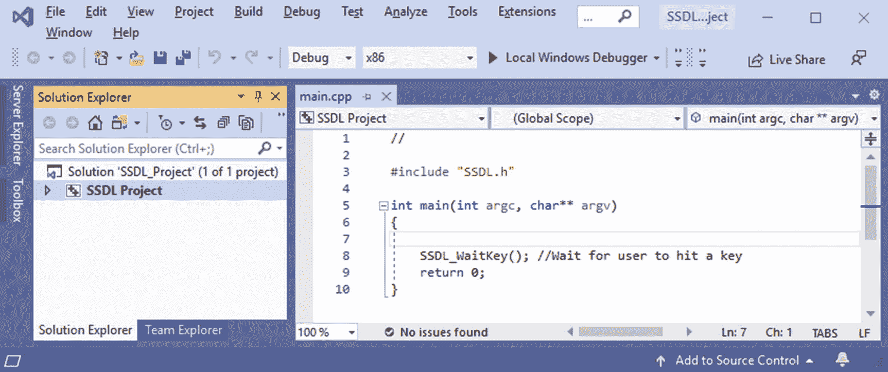

图 1-8

一个 SSDL 项目。在解决方案资源管理器窗口中(我的在左边；你的可能在别处)，点击 SSDL 项目旁边的三角箭头，然后源文件；然后双击`main.cpp`查看主程序的(不完整)内容

如果你想从头开始，请参阅附录 a 中的说明。

#### 编译你的程序

你的程序还没有做任何事情，所以你要给它一些内容。现在，你可以输入 Hello，world！来自示例 [1-1](#PC2) 的程序。

也许你会犯一些错别字。

如果是这样的话，编辑器可能会在它反对的内容下面划一条弯弯曲曲的红线来警告你(图 [1-9](#Fig9) )。将鼠标指针放在有问题的部分，它会给出一个提示，告诉你哪里出错了(尽管这个提示可能并不总是很清楚)。

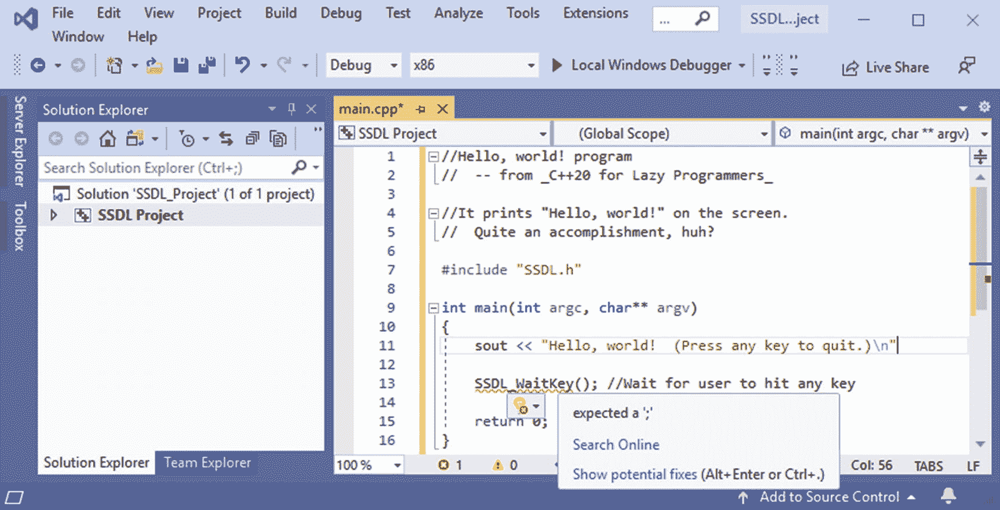

图 1-9

Visual Studio 突出显示并正确识别错误

尽管这很有帮助，但你不能确定编辑是正确的。直到你试着编译并运行时，你才能确定。

要编译您的程序，请转到构建➤构建解决方案。要运行它，请转到调试➤不调试启动。或者，单击标签为“本地 Windows 调试器”的窗口顶部附近的绿色箭头或三角形

如果你的程序不能编译，它会给出一个错误列表。有时信息的意思很清楚，有时又不清楚。这里有一个典型的，用“…”来使它更简短:我忘了一个`;`。

```cpp
c:\...\main.cpp(13): error C2146: syntax error: missing ';' before identifier 'SSDL_WaitKey'

```

随着时间的推移，您会更加理解模糊错误信息的含义。现在，将您键入的程序与示例 [1-1](#PC2) 进行比较，并解决任何差异，直到您获得这个成功的结果:一个显示消息`Hello, world! (press any key to quit)`的窗口。当它运行时，按任意键结束它。

Extra

在 Visual Studio 中，如果您试图运行一个未编译的程序，您可能会看到图 [1-10](#Fig10) 中的对话框。

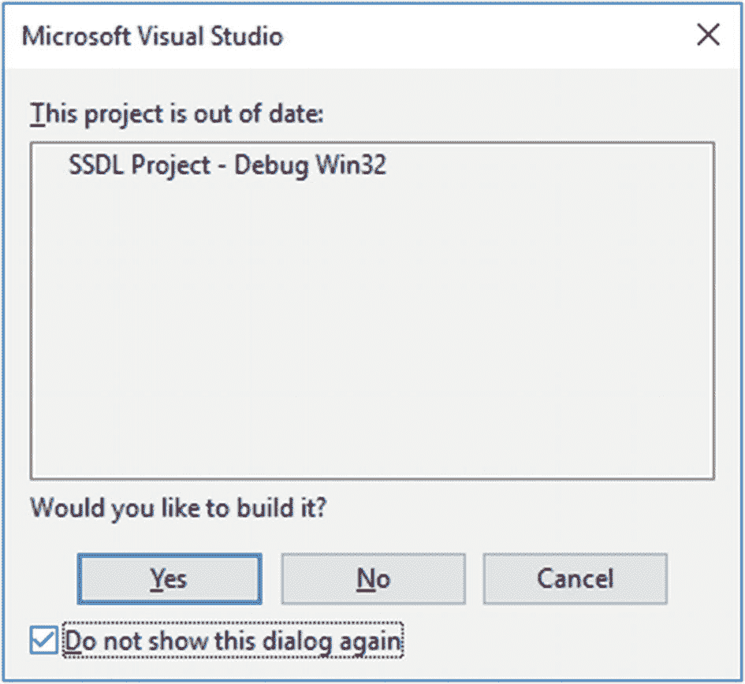

图 1-10

“你愿意建造它吗？”窗户。每次回答都是一种痛苦

如果是这样，点击“不再显示此对话框”，然后点击“是”这意味着如果需要的话，它会在运行前尝试重新编译。

如果有错误，您可能会看到图 [1-11](#Fig11) 中的方框。

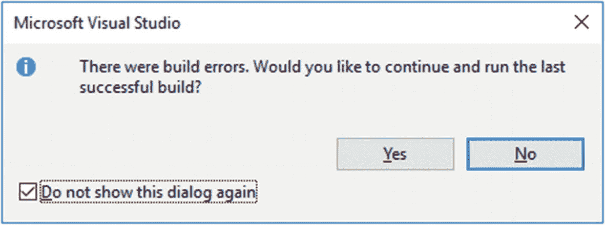

图 1-11

运行上一次成功的构建？从不

单击“不再显示此对话框”并单击“否”(否则，当您进行更改时，它将返回到以前的版本以找到一个可用的版本，而不是您的最新版本。扑朔迷离！)

如果您想再次看到这些对话框，比如说，如果您在想说“否”时单击了“是”，您可以通过菜单来修复它:工具➤选项➤项目和解决方案➤构建和运行。将“运行中…”空白重置为您想要的值(图 [1-12](#Fig12) )。

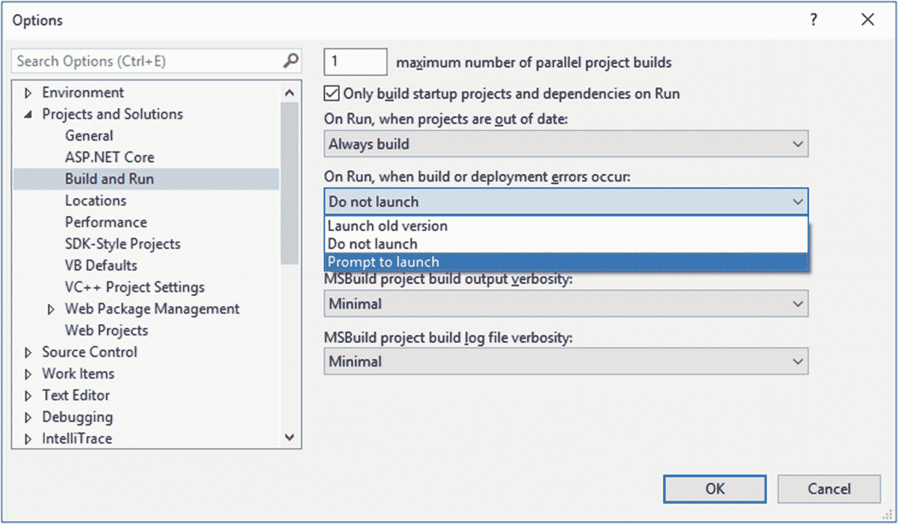

图 1-12

如何重置图 [1-10](#Fig10) 和 [1-11](#Fig11) 中设置的偏好

#### 你创建的文件

现在翻翻你的文件夹。(通过 Windows 资源管理器或在 Windows 中打开其文件夹来访问它，随您喜欢。)你应该会看到类似图 [1-13](#Fig13) 的东西。(布局可能会有所不同，为了简单起见，这里没有显示一些文件。)

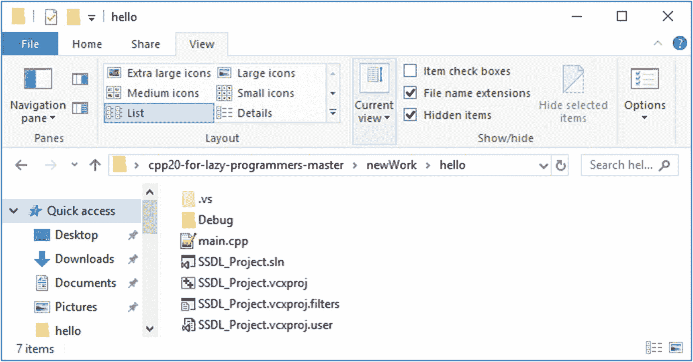

图 1-13

项目文件夹中的文件

Extra: File Extensions

如果你看到的一些文件被命名为(比方说)`main`而不是`main`-点什么的，我 ***非常强烈地推荐*** 你改变这个，这样你就可以看到点后面的“文件扩展名”。这有助于了解您正在处理什么类型的文件！

为此，在 Windows 10 中，在文件夹的视图选项卡(图 [1-14](#Fig14) )中，单击文件扩展名和隐藏项目的框。你完蛋了。

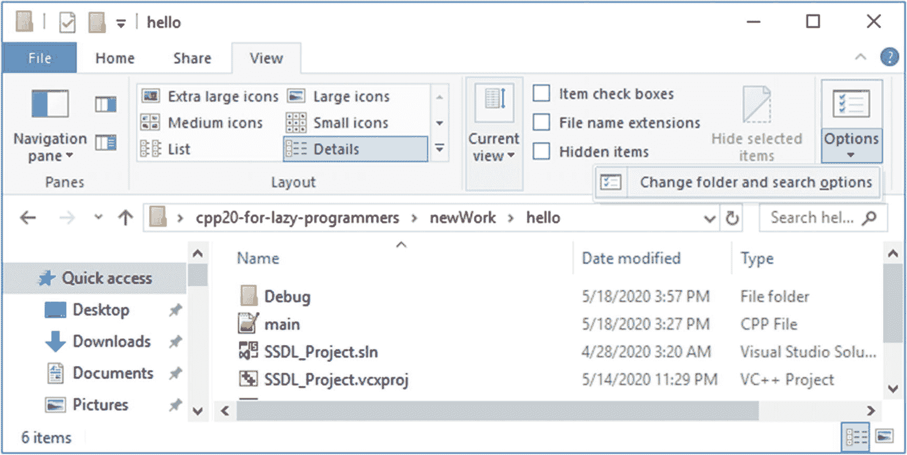

图 1-14

更改文件夹和搜索选项以显示文件扩展名

这里有另一种方式，将在早期的 Windows 版本也工作:选项➤改变文件夹和搜索选项，或组织菜单➤文件夹和搜索选项。你应该看到一个写着文件夹选项的框。选择文件夹选项框的视图选项卡(图 [1-15](#Fig15) )。一旦有，取消选中隐藏已知文件类型的扩展名；并选择显示隐藏的文件、文件夹或驱动器。

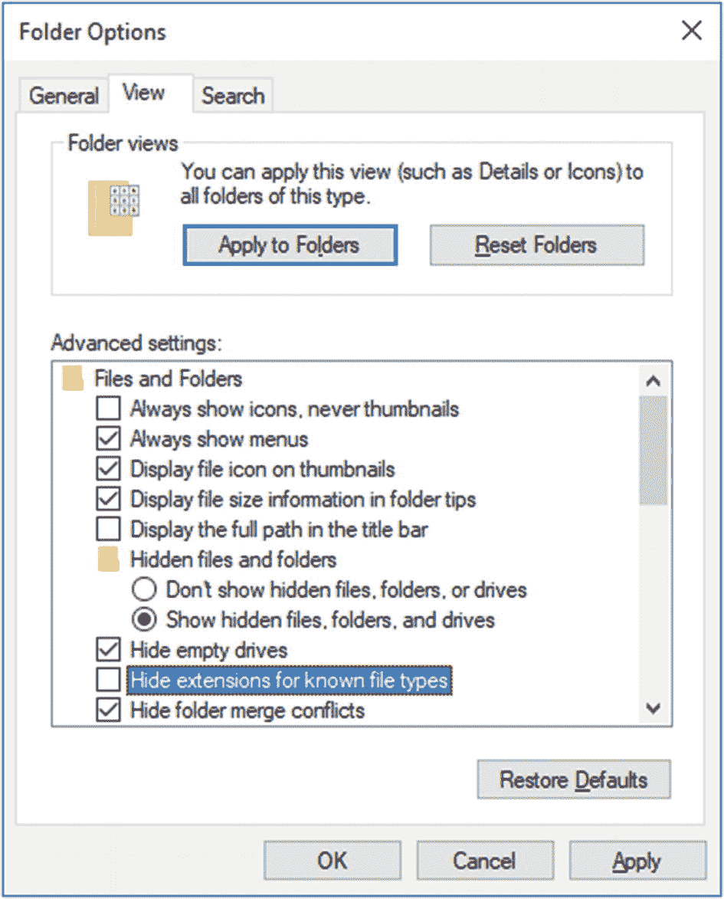

图 1-15

Microsoft Windows 中的文件夹选项窗口

文件夹中的重要文件包括

*   `SSDL_Project.sln`“解决方案”文件:知道其他文件在哪里的主文件。

*   `SSDL_Project.vcxproj`,“项目”文件:它知道程序存储在`main.cpp`和其他几个东西里。没有它就无法编译。

*   你的程序。

*   `Debug`(或者，有时，`Release`或`x64`)文件夹:它包含你的可执行文件。

Tip

您可以删除任何`Debug`、`Release`、`.vs`和`x64`文件夹。Visual Studio 将根据需要重新创建它们。如果空间很重要，这一点很重要——比如说，如果你计划通过电子邮件发送文件夹。

如果您看不到`.vs`文件夹，请参阅前面的“附加:文件扩展名”

#### 重新打开您的项目

如果您的计算机设置正确，您可以双击`hello.sln`启动 Visual Studio 并重新打开您正在处理的内容。(双击其他内容可能无法打开您需要的所有文件。)

Tip

重新打开`.sln`文件，而不是`.vcxproj`或`.cpp`文件。

#### 防错法

在“反欺诈”部分，我们将考虑可能出错的事情以及如何修复或防止它们。

以下是您在使用 Microsoft Visual Studio 时会发现的一些常见问题:

*   **你打开一个溶液(。sln)文件，但是它说没有一个项目会加载**。也许你移动了源代码文件夹中的东西；他们必须呆在原地。

也可能你根本不在文件夹里，而是在 zip 文件里！zip 文件的列表*看起来*像一个文件夹，但它不是。请确保您解压缩源代码(参见本章开头的“初始设置”)，并使用新文件夹，而不是 zip 文件。

*   **无法打开包含文件或. lib 文件**T3】。错误消息可能会说类似`fatal error C1083: Cannot open include file: 'SSDL.h': No such file or directory`

或者

`1>LINK : fatal error LNK1104: cannot open file 'sdl2_ttf.lib'`。

此时最有可能的解释是您的项目文件夹不在源代码存储库中的正确位置。确保它与`basicSSDLProject`文件夹在同一个位置。

*   **它乐于接受编辑，但不提供编译选项；或者如果有，编辑没有效果。**很可能你没有打开`.sln`文件，而是打开了`main.cpp`或其他文件。关闭您正在处理的文件(保存到某个地方，以便您可以使用这些编辑！)并通过双击`.sln`文件重新打开。

*   **你输入了一些它应该能识别的东西，但是编辑器没有按照你预期的方式给它上色，或者在它下面画了一条弯弯曲曲的红线。**通常它会识别`return`和`void`并给它们上色，以表明它知道它们是关键词。你可能打错了。或者编辑可能会感到困惑。重新编译以确保正确。

*   它说。无法打开 exe 文件进行写入。你可能还在运行这个程序；它不能覆盖程序，因为它正在使用中。终止程序并重试。

*   它给出了一些其他的错误信息，并且不会完成构建。通常，再试一次就足以让它成功。

*   运行完程序需要很长时间。你可以耐心等待，也可以通过 Windows 任务管理器将其杀死。如果这种情况持续发生，很可能是你的程序有问题。(还是在等你打东西？)

*   **它抱怨 Windows SDK** **:**

    `C:\...\Microsoft.Cpp.WindowsSDK.targets(46,5): error MSB8036: The Windows SDK version <some number or other> was not found. <More details.>`

    或者在试图编译之前就失败了。

    解决方案:右键单击项目(不是解决方案或`main.cpp`)，选择重定目标项目，并同意它所说的内容。

*   你试图打开一个源代码解决方案，它警告你“你应该只打开来自可靠来源的项目”好消息是:我值得信任，所以你可以点击确定。取消勾选“为该解决方案中的每个项目询问我”的复选框，这样你就不会那么烦恼了。

Extra:

`zip` **文件**

您可能想通过电子邮件将您的项目发送给某人；或者您可能希望将其紧凑地存放起来。

通常的方法是右击文件夹，选择添加到 Zip(或添加到`<folder name>.zip`)或发送到… ➤压缩文件夹。然后你可以把它附在电子邮件里，如果这是你的计划的话。

不管你怎么做，确保你首先删除了所有的`Debug`、`Release`或`.vs`文件夹。它节省空间，如果你不这样做，一些邮件程序不会发送附件。

### 如何不痛苦(无论你的平台是什么)

无论您使用什么编译器，都可能会遇到这些问题:

*   你会得到无数的错误。这并不意味着你做了无数的错事。有时一个错误会让编译器非常困惑，它会认为后面出现的都是错的。为此，**先修正第一个错误。**它可能会消除上百条后续错误信息。

*   **出错的那一行看起来没问题。**也许问题出在前面的线路上。编译器直到下一行才能判断出错误，所以它报告错误的时间比您预期的要晚。丢失`;`的情况经常发生。

*   你得到警告 **，但是程序仍然准备运行。你应该吗？**有错误，有警告**。**如果只是给出警告，编译器仍然可以生成程序，但是错误会阻止编译。您可以忽略警告，但它们通常是一些确实需要修复的问题的很好的提示。

*   你写的每一个程序！似乎一开始就充满了错误。你怀疑自己是不是傻。如果是这样，那么我们其他人也是。我也许能得到一个你好，世界！程序第一次工作。再久一点，就算了。

这里有一个大问题:

*   你犯了一个错误，这个一直运行良好的程序现在根本无法运行了。每当你做出重大改变时(重大意味着“你害怕自己可能无法撤销”)…
    *   Windows:复制包含您的项目的文件夹`(.sln`文件、`.vcxproj`。`cpp`，全部)，然后粘贴它(跳过任何它不让你复制的文件——反正会是你不在乎的东西)，这样就创建了一个备份。

    *   Unix:复制您的`.cpp`文件，比如说`cp main.cpp main.cpp.copy1`。你也可以用`cp -R`复制整个目录。

对于大型项目来说，一系列备份副本是绝对必要的。我敦促你现在就养成习惯*。如果不是…你已经在你的项目上工作了 6 个月。你做了一些使它崩溃或拒绝编译或给出错误输出的事情；更糟糕的是，你昨天就做了，而且从那以后你已经做了几次更新。回到昨天的代码并获得几乎可以工作的版本，而不是重新创建 6 个月的工作，这不是很好吗？备份副本是每个程序员，不管懒不懒，都需要的。*

*Golden Rule of Not Pulling Your Hair Out

编辑程序时制作备份-----------------------------。

Unix 和 Windows 在如何结束一行上意见不一。将一个文件从一个系统移到另一个系统并阅读，你可能会看到所有的东西都明显地挤在一行上，或者在每一行的末尾显示一个`^M`。

如果它是一个 Unix 文件，而你在 Windows 系统中，试试 Notepad++ 或微软的写字板。如果是在 Unix 中显示的 Windows 文件，您可以忽略有趣的符号，或者(如果已安装)使用以下命令:

`dos2unix < windowsfile.txt > unixfile`

另一方面，使用`unix2dos`。

Exercises

1.  使用你的编译器，输入 Hello，world！程序，并让它工作。

2.  再写一个程序把一首歌的歌词打印在屏幕上。

3.  拿着你好，世界！编程并故意引入错误:去掉分号或花括号；在中间打断一句引语；尝试几种不同的东西。你会得到什么样的错误信息？

4.  清理你的文件夹(即删除那些多余的大文件)并压缩它。

## 形状和绘制它们的函数

当然，我们想做的不仅仅是向世界问好。为了开始学习图形，让我们再看一下运行 SSDL 程序时创建的空白窗口(图 [1-16](#Fig16) )。

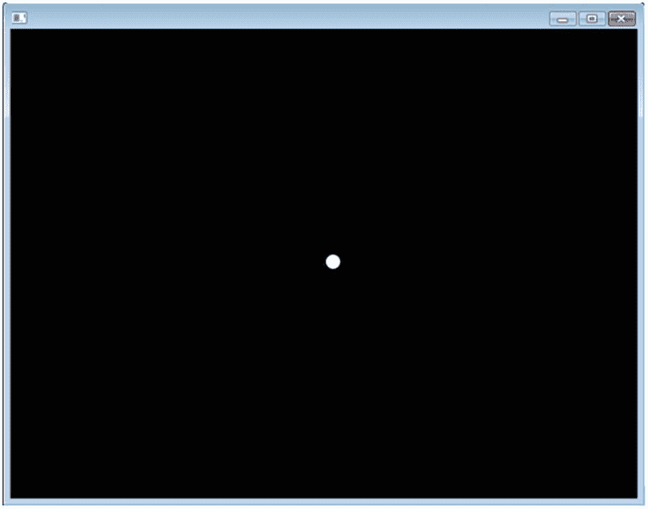

图 1-17

在屏幕中央画一个点

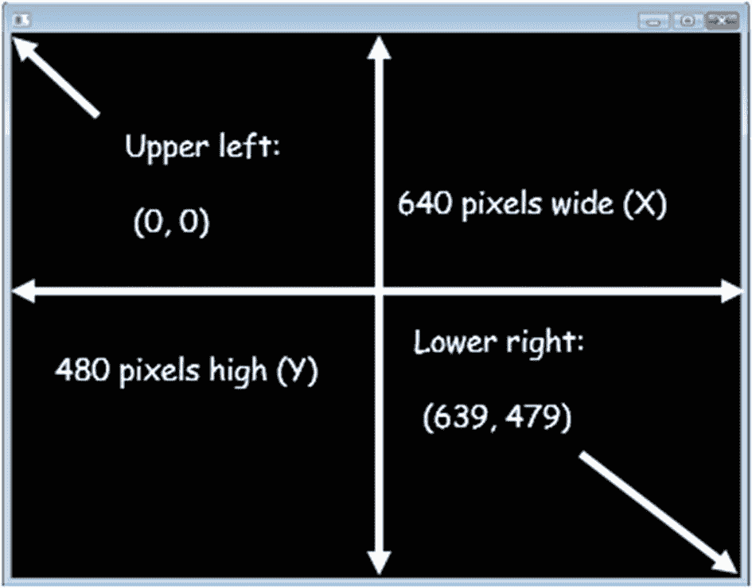

图 1-16

基本 SSDL 窗的尺寸

我们放入该窗口的形状的位置在(x，y)坐标中。左上角是(0，0)，右下角是(639，479)——所以 y 坐标在页面上向下*而不是向上*。横跨 640 个位置(0–639 包括在内), 480 个位置向下。每个(x，y)位置称为一个“像素”(图片元素)。

这一部分展示了我们可以做的一些事情。第一个例子 [1-3](#PC6) ，在位置(320，240)画一个点。(它不会像图 [1-17](#Fig17) 那么大，但是我想让它显现出来，所以我增强了它。)

Finding and Compiling Source Code

所有编号的示例都可以在本书的源代码中找到，在示例章节的文件夹中(在本例中为`ch1`)，带有一些以示例编号开头的描述性名称。例子 [1-3](#PC6) 的名字，没有想象力的叫`3-drawDot`。

用你在本章第一节所做的`test-setup`一样的方式编译它。在源代码库的`ch1`文件夹中

在 Unix 中，进入示例的目录(`3-drawDot`)并输入`cp Makefile.unix Makefile`和`make`。

对于 MinGW，进入示例的目录(`3-drawDot`)并输入`copy Makefile.mingw Makefile`和`make`。

对于 Visual Studio，进入`ch1`文件夹，打开`ch1`解决方案；右键单击`3-drawDot`并选择调试➤启动新实例。

```cpp
// Draw a dot at the center of the screen
//        -- from _C++ for Lazy Programmers_

#include "SSDL.h"

int main (int argc, char** argv)
{
     // draws a dot at the center position (320, 240)
     SSDL_RenderDrawPoint (320, 240);

     SSDL_WaitKey ();

     return 0;
}

Example 1-3Program to draw a dot at the center of the screen. It’s in source code under ch1, as 3-drawDot

. Output is in Figure 1-17

```

绘制基本形状的功能列于表 [1-1](#Tab1) 中。`int`表示整数，即整数。形式为`void <function-name> (<bunch of stuff>);`的函数声明是对如何调用函数的精确描述——它们的名字以及它们在`()'` s. `SSDL_RenderDrawPoint`之间期望什么样的值，它的两个参数`x`和`y`采用两个整数。`SSDL_RenderDrawLine`取四:`x1`、`y1`、`x2`、`y2`。等等。

表 1-1

常见的 SSDL 绘图功能。有关更多 SSDL 函数，请参见附录 H

<colgroup><col class="tcol1 align-left"> <col class="tcol2 align-left"></colgroup> 
| `void``SSDL_RenderDrawPoint`T2】 | 在(`x`，`y`)处画一个点。 |
| `void``SSDL_RenderDrawLine`T2】`int x2, int y2);` | 从(`x1`、`y1`)到(`x2`、`y2`)画一条线。 |
| `void``SSDL_RenderDrawCircle`T2】`int radius) ;` | 以此半径画一个圆，圆心在(`x`，`y`)。 |
| `void``SSDL_RenderFillCircle`T2】`int radius) ;` | 以此半径画一个实心圆，圆心在(`x`，`y`)。 |
| `void``SSDL_RenderDrawRect`T2】`int w, int h);` | 画一个以(`x1`，`y1`)为左上角，宽度`w`，高度`h`的方框。 |
| `void``SSDL_RenderFillRect`T2】`int w, int h);` | 画一个以(`x1`，`y1`)为左上角的填充框，宽度`w`，高度`h`。 |

作为他们使用的一个例子，这行代码在左上角附近画了一个圆(见图 [1-18](#Fig18) ，左):`SSDL_RenderDrawCircle` `(100, 100, 100);`。

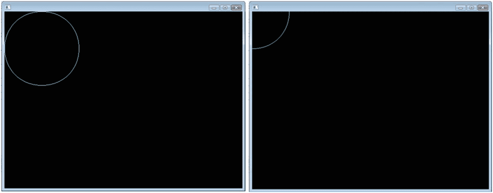

图 1-18

左边是一个带`SSDL_RenderDrawCircle (100, 100, 100);`的程序。右边，一个带有`SSDL_RenderDrawCircle (0, 0, 100)`的程序`;`

而这个给你一个*居中*在左上角，所以你只能看到它的四分之一(图 [1-18](#Fig18) ，右):`SSDL_RenderDrawCircle (0, 0, 100);`。不显示可视区域之外的内容称为“剪辑”

现在让我们用这些函数来做一个有趣的设计。我们需要提前计划。很快会有一个关于提前计划的部分，但是现在，你可以像电影制作人或漫画制作人一样，为你想做的任何设计制作一个故事板。

我们可能需要绘图纸(图 [1-19](#Fig19) ，源代码文件夹中有可打印的页面)。

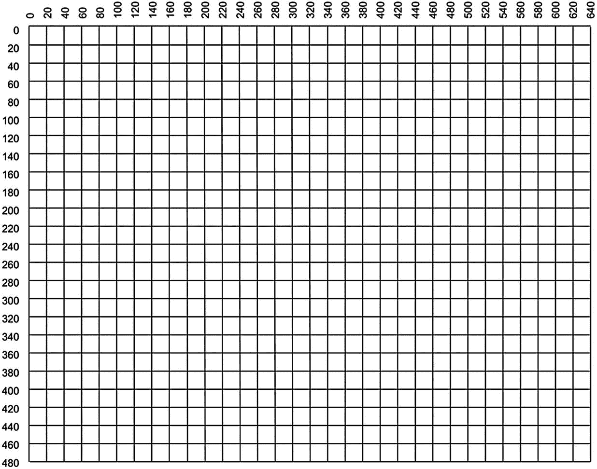

图 1-19

查看区域的图形，用于设计您想要显示的内容

我决定做一个虫子脸:大眼睛，大脑袋，触角。于是我就画了我想要的(图 [1-20](#Fig20) )。

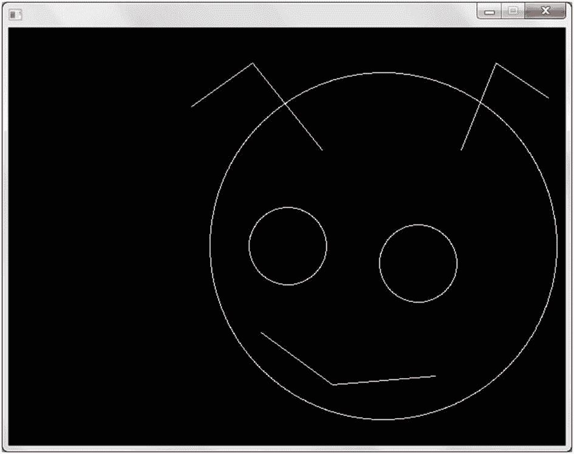

图 1-21

一只虫子的头

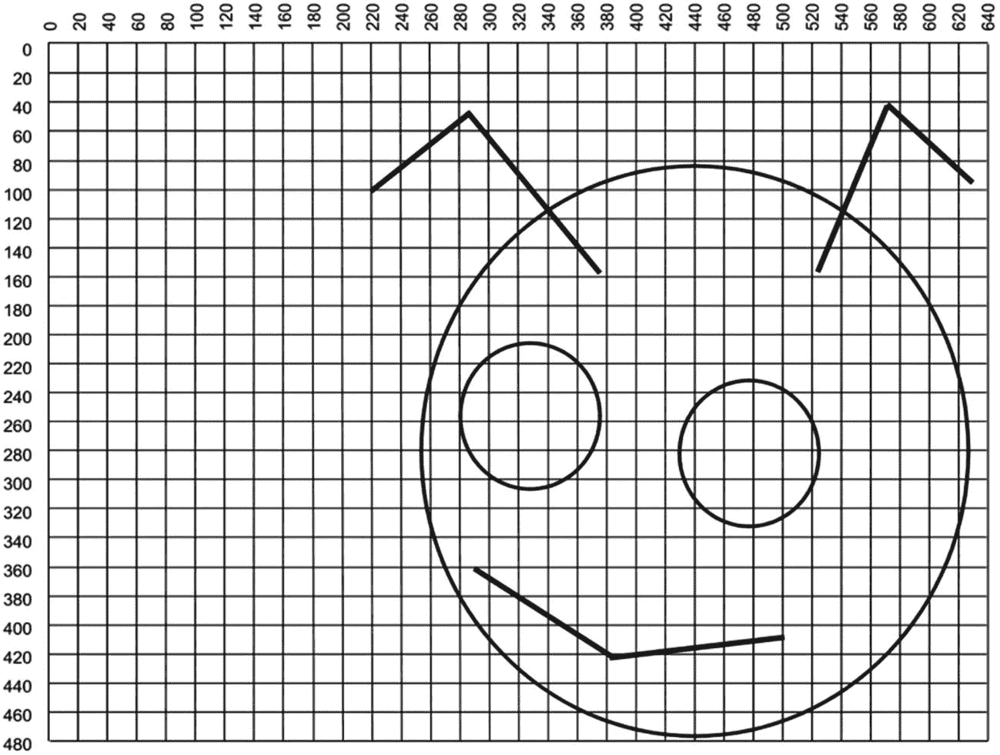

图 1-20

bug 头程序的绘制

我现在可以看到位置了。左眼的中心在(320，250)左右，其半径大致为 45。大圆的圆心在(430，250)附近，半径约为 150。等等。

下面是我的程序(例 [1-4](#PC7) )。我最初写的时候犯了几个错误——把直径和半径搞混了，把图形线读错了。你也会的。如果没有，好吧，这是真正的简历素材。

```cpp
// Program to draw a cartoonish bug's head on the screen
//      -- from _C++ for Lazy Programmers_

#include "SSDL.h"

int main (int argc, char** argv)
{
    SSDL_RenderDrawCircle (430, 250, 200);     // draw the bug's head

    SSDL_RenderDrawCircle (320, 250,  45);     // the left eye
    SSDL_RenderDrawCircle (470, 270,  45);     // the right eye

    SSDL_RenderDrawLine   (360, 140, 280,  40);// left antenna
    SSDL_RenderDrawLine   (280,  40, 210,  90);

    SSDL_RenderDrawLine   (520, 140, 560,  40);// right antenna
    SSDL_RenderDrawLine   (560,  40, 620,  80);

    SSDL_RenderDrawLine   (290, 350, 372, 410);// the smile
    SSDL_RenderDrawLine   (372, 410, 490, 400);

    SSDL_WaitKey ();                           // Wait for user to hit a key

    return 0;
}

Example 1-4A bug’s head. Found in source code’s ch1 folder as 4-bugsHead. The resulting output is shown in Figure 1-21

```

请注意，我是如何在注释中严格记录我所做的一切的目的的。假设我没有把那些评论放进去:

```cpp
// Program to draw a cartoonish bug's head on the screen
//        -- from _C++ for Lazy Programmers_

#include "SSDL.h"

int main (int argc, char** argv)
{
    SSDL_RenderDrawCircle (430, 250, 200);

    SSDL_RenderDrawCircle (320, 250,  45);
    SSDL_RenderDrawCircle (470, 270,  45);

    SSDL_RenderDrawLine   (360, 140, 280,  40);
    SSDL_RenderDrawLine   (280,  40, 210,  90);

    SSDL_RenderDrawLine   (520, 140, 560,  40);
    SSDL_RenderDrawLine   (560,  40, 620,  80);

    SSDL_RenderDrawLine   (290, 350, 372, 410);
    SSDL_RenderDrawLine   (372, 410, 490, 400);

    SSDL_WaitKey ();

    return 0;
}

```

真是一场噩梦！你几个月后回来重用或升级这个程序，看到代码，然后想，*我到底在做什么？哪条线做什么？*

然后你试着运行它，然后……你的系统管理员升级了编译器或者库，程序不再工作了。(软件腐烂；至少，*有些东西*会让你的程序随着时间的推移停止工作。)你有一个不工作的程序，即使要确定这些部分是用来做什么的，也需要进行侦查工作。

最好加上注释，这样你就可以理解、维护并根据需要更新你的程序。这里(例 [1-5](#PC9) )我决定给眼睛加瞳孔。根据评论，很容易判断他们去了哪里。

```cpp
// Program to draw a cartoonish bug's head on the screen
//       -- from _C++20 for Lazy Programmers_

#include "SSDL.h"

int main (int argc, char** argv)
{
     SSDL_RenderDrawCircle (430, 250, 200);       // draw the bug's head

     SSDL_RenderDrawCircle (320, 250,  45);       // the left eye
     SSDL_RenderFillCircle (300, 250,   5);       // ... and its pupil
     SSDL_RenderDrawCircle (470, 270,  45);       // the right eye
     SSDL_RenderFillCircle (450, 270,   5);       // ... and its pupil
     ...
}

Example 1-5A bug’s head, with pupils in the eyes. Found in source code’s ch1 folder as 5-bugsHead

. Output is in Figure 1-22

```

### 防错法

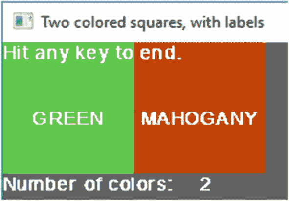

图 1-27

示例 [1-8](#PC21) 的输出

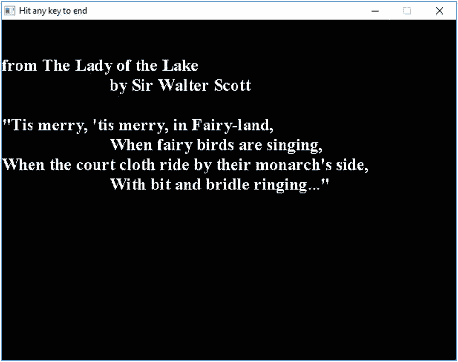

图 1-26

示例 [1-7](#PC19) 的输出

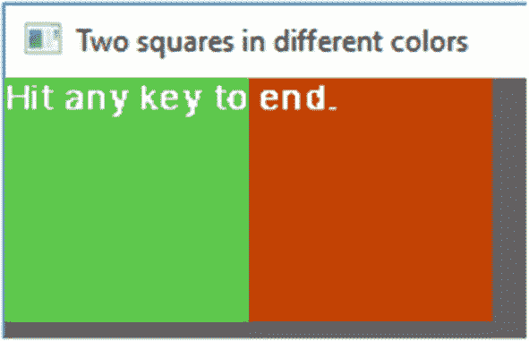

图 1-25

示例 [1-6](#PC13) 的输出

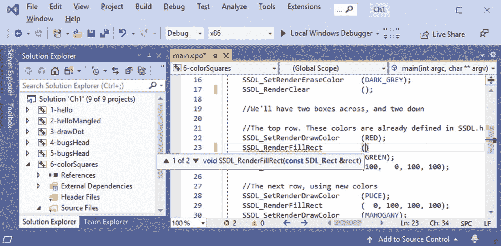

图 1-24

Visual Studio 提示输入函数参数的类型

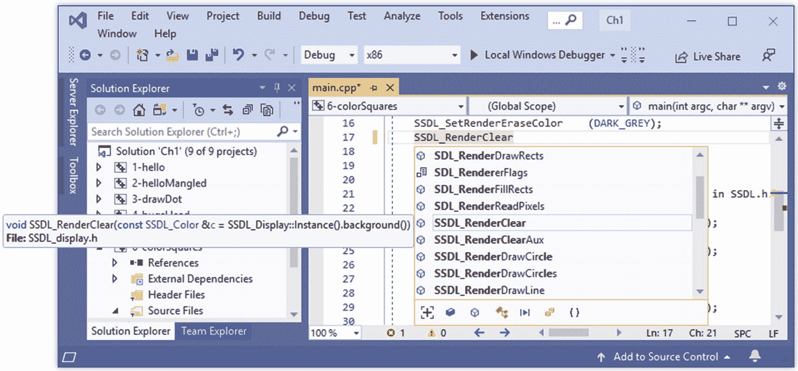

图 1-23

Microsoft Visual Studio“智能感知”自动完成函数名

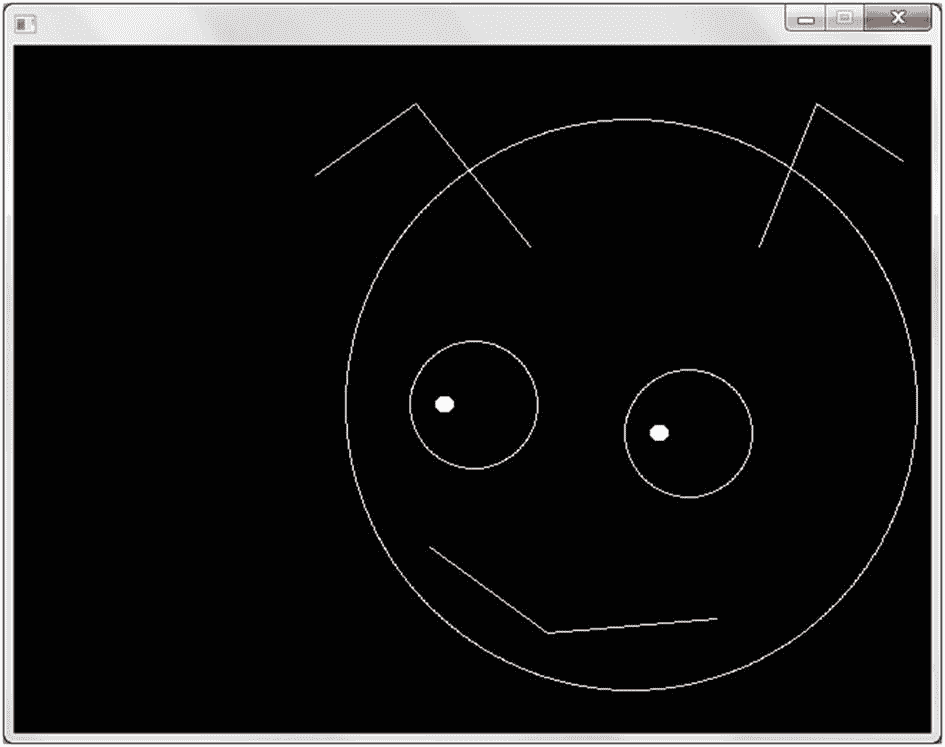

图 1-22

一只虫子的头，加上了瞳孔

*   你调用了一个 SSDL 函数，但它不起作用。此时，最有可能的猜测是它在可视区域外画东西，所以你看不到。确定问题所在的最好方法是检查你给出的论点，确保它们是合理的。

*   **(针对 Visual Studio)你记不清具体怎么调用一个函数，也不想查。**那不是 bug，但却是现实，而且表现出了令人钦佩的懒惰，那就顺其自然吧。你有时可以在打字时得到提示(图 [1-23](#Fig23) )。当你打开括号时，它可能会给你一个函数的描述或者它所期望的(图[1-24](#Fig24))；如果您在描述上看到一个箭头或三角形，请单击它以查看多个选项。

…有时什么也没发生。或者它在完全正常的事情上画红色的曲线。尝试重新键入代码行或编译代码——其中一种方法通常可以做到这一点。

Exercises

1.  设计一些你自己的东西，并写一个程序在屏幕上显示出来。

2.  画一个立方体，看起来不太直，就像这里显示的。

## `const` s 和颜色

自然，我们也想给我们的形状涂上颜色。

电脑上的颜色分为三部分:红色、绿色和蓝色。在我们的库中，它们的范围从 0(最低)到 255(最高)。黑色是 0，0，0；白色是 255，255，255；红色是 255，0，0(红色最大，其他为零)。其他组合出其他颜色。你可以使用像 [`www.colorpicker.com`](http://www.colorpicker.com) 这样的网站来找到你想要的颜色的红色、绿色和蓝色成分。

您可以使用 SSDL 内置的几种颜色(`BLACK, WHITE, RED, GREEN,`或`BLUE`)或创建自己的颜色，如下所示:

```cpp
const SSDL_Color

MAHOGANY = SSDL_CreateColor  (192,  64,   0);

```

这里，`SSDL_Color MAHOGANY`说我们正在创建一种颜色，并将其命名为`MAHOGANY`。`SSDL_CreateColor` `(192, 64, 0)`给了它我们想要的数字。

颜色不会改变，所以我们将使用 C++ 的`const`关键字来强调这一点，并让编译器防止它们被错误地改变。常量全部用大写字母书写，以使程序的读者清楚它们不会改变。(你习惯了，就明白无误了。)

要开始使用颜色，请执行以下操作:

```cpp
SSDL_SetRenderDrawColor (RED);    // draw things in RED, from now
                                  // till the next call to this function

```

要清除屏幕，请执行以下操作:

```cpp
SSDL_RenderClear (BLACK);        // erase the screen and make it BLACK

```

这是一个程序，它使用内置的和新的颜色在屏幕上绘制方框。输出如图 [1-25](#Fig25) 所示。

```cpp
// Displays boxes of colors
//      -- from _C++ for Lazy Programmers_

#include "SSDL.h"

int main (int argc, char** argv)
{
    SSDL_SetWindowTitle ("Four squares in different colors");

    // We'll use 2 new colors, plus GREEN and WHITE...
    const SSDL_Color MAHOGANY   = SSDL_CreateColor (192,  64,   0);
    const SSDL_Color DARK_GREY  = SSDL_CreateColor (100, 100, 100);

    // Make a dark grey background
    SSDL_RenderClear            (DARK_GREY);

    // We'll have two squares across
    SSDL_SetRenderDrawColor     (GREEN);    // First square
    SSDL_RenderFillRect         (  0,   0, 100, 100);
    SSDL_SetRenderDrawColor     (MAHOGANY); // Second
    SSDL_RenderFillRect         (100,   0, 100, 100);

    // Program's end.
    // Must restore color to white, or we'll get mahogany text!
    SSDL_SetRenderDrawColor (WHITE);
    sout << "Hit any key to end.\n";

    SSDL_WaitKey();

    return 0;
}

Example 1-6Use of colors to paint some rectangles. Found in source code’s ch1 folder as 6-colorSquares

```

表 [1-2](#Tab2) 包含与颜色和清除屏幕相关的功能。这里的一些声明与附录中的不完全匹配:它们被简化了，但是足够接近了。

表 1-2

与颜色相关的 SSDL 函数

<colgroup><col class="tcol1 align-left"> <col class="tcol2 align-left"></colgroup> 
| `SSDL_Color SSDL_CreateColor``(int r, int g, int b);` <sup>[9](#Fn9)</sup> | 创建并返回一种颜色。(`r` )ed、(`g` )reen、(`b` )lue 的最大值为 255。 |
| `void` `SSDL_SetRenderDrawColor``(SSDL_Color c);` | 设置后续绘图，包括文本，使用颜色`c`。 |
| `void` `SSDL_SetRenderEraseColor``(SSDL_Color c);` | 设置擦除，包括清除屏幕，以使用颜色`c`。 |
| `SSDL_Color``SSDL_GetRenderDrawColor`T2】 | 获取当前绘图颜色。例如，`const SSDL_Color FOREGROUND =``SSDL_GetRenderDrawColor();` |
| `SSDL_Color` `SSDL_GetRenderEraseColor ();` | 获取当前擦除颜色。 |
| `void``SSDL_RenderClear`T2】 | 将屏幕清除为当前擦除颜色。 |
| `void` `SSDL_RenderClear (SSDL_Color c);` | 清除屏幕颜色`c`。 |

有些函数(以`void`开头的那些)不会为你计算一个值；它们只是做一些事情(比如画一个形状，清空屏幕，或者设置一种颜色)。其他人，像`SSDL_CreateColor`，有计算答案的工作。这个创建了一个颜色，所以它的“返回类型”不是`void`，而是`SSDL_Color`。

我们将在第 7 章进一步讨论函数和返回类型。

Exercises

1.  将颜色添加到您编写的在屏幕上绘制图形的程序或本书源代码中的另一个程序中。

2.  为你最喜欢的节日制造一个场景:万圣节的橙色恐怖脸或者绿色圣诞树。或者在色彩节胡里节尽情狂欢。

3.  通过交替调用`SSDL_RenderClear`和`SSDL_WaitKey`使屏幕闪烁各种颜色。

4.  写出几种颜色的名称，每种都用那种颜色写(“红”用红色写，等等。).

## 文本

### `sout`、转义序列和字体

你可以用 SSDL 图书馆的`sout`打印多种东西——不仅仅是文本，还有数字:

```cpp
sout << "The number pi is " << 3.14159 << ".\n";
sout << "...and the number e is "
     << 2.71828
     << ".\n";

```

你在程序中如何设置行间距不会改变打印的内容；当到达`\` `n`字符，即“行尾”字符时，该行结束。用一种方式而不是另一种方式来分隔代码行的唯一原因是为了清晰。(对我来说，前面的版本看起来不错。)

但是引号*内的间距*很重要。注意我在“是”字后面加的空格；如果不放置它，您的第一行输出将如下所示:

```cpp
The number pi is3.14159.

```

还有其他的**转义序列**，又名“转义码”——以`\`开头的特殊字符:

*   `\t`，制表符，带你到下一个制表位。制表位排列在 0、8 个空格、16 个空格等位置。(由于我们大部分字体都是变宽的，所以不能指望八个 Is 或者八个 Ms 和八个空格一样宽；它将是近似值。)

*   `\` `"`，《人物》。如果我们只是把`"`放在文本中，就像`"Quoth the raven, "Nevermore""`，C++ 会被多余的`"`弄糊涂。所以我们这样写:

    `"Quoth the raven, \"Nevermore.\""`

*   `\\`，\字符(因为单个\字符会让 C++ 试图找出您要开始的转义序列)。

有关所有可用的转义序列，请参见附录 e。

你也可以决定文本出现在屏幕上的什么位置。下面是如何**将** **光标**设置到 x 位置 100，y 位置 50:

```cpp
SSDL_SetCursor (100, 50);

```

并且可以更改**字体** **和字体大小**。字体文件必须是 TTF (TrueType 字体)格式；C++ 希望它们与您的项目在同一个文件夹中:

```cpp
const SSDL_Font FONT = SSDL_OpenFont       ("myFont.ttf", 18);
                                                  // my font; 18 point
SSDL_SetFont (FONT);

```

如果您想要一个系统自带的字体，在标准字体文件夹中，您可以使用这个调用:

```cpp
const SSDL_Font FONT = SSDL_OpenSystemFont ("verdana.ttf", 18);
                                                  // Verdana font; 18 point

SSDL_SetFont (FONT);

```

你可以在微软 Word 中或者(在撰写本文时)在 [https:// en 上查看微软视窗/微软核心网页字体中的可用字体。维基百科。org/wiki/Core _ fonts _ for _ the _ Web](https://en.wikipedia.org/wiki/Core_fonts_for_the_Web)。文件名不总是显而易见的；例如，在 Microsoft Word 中显示为“Bookman Old Style”的实际上是四个文件—`bookos.ttf`、`bookosb.ttf`、`bookosbi.ttf`和`bookosi.ttf`，分别对应普通、粗体、粗斜体和斜体。

在 Unix 中，您可以使用这个命令获得已安装字体的列表:`fc-list`。它们可能在`/usr/share/fonts`或其子文件夹中。

SDL2_ttf 库很乐意把你给它的字体做成斜体，粗体，或者其他什么，但是它无法和人类艺术家竞争。在可能的情况下，使用字体中的增强版本，比如用`Times_New_Roman_Bold.ttf`或`timesbd.ttf`表示 Times New Roman Bold。 <sup>[10](#Fn10)</sup>

即使没有粗体或斜体，SDL 有时也很难让字体看起来流畅。如果你的字体看起来太不均匀，尝试另一种字体或更大的尺寸。

示例 [1-7](#PC19) 展示了这些新功能。

```cpp
// Prints an excerpt from Sir Walter Scott's _The Lady of the Lake_
//         -- from _C++ for Lazy Programmers_

#include "SSDL.h"

int main (int argc, char** argv)
{
    // Window setup
    SSDL_SetWindowTitle ("Hit any key to end");
    // Always tell user what's expected...

    // We'll be using Times New Roman font, bold...
    //    so load it, and tell SSDL to use it
    const SSDL_Font FONT = SSDL_OpenSystemFont ("timesbd", 24);
    SSDL_SetFont (FONT);

    SSDL_SetCursor (0, 50);   // Start 50 pixels down

    // And now, the poem (or part of it)
    sout << "from The Lady of the Lake\n";
    sout << "\tby Sir Walter Scott\n\n";
    // Tab over for author's name, then
    //    double space at the end of the line

    sout << "\"Tis merry, 'tis merry, in Fairy-land,\n";
    sout << "\tWhen fairy birds are singing,\n";
    sout << "When the court cloth ride by their monarch's side,\n";
    sout << "\tWith bit and bridle ringing...\"\n";

    // End when user hits a key
    SSDL_WaitKey ();

    return 0;
}

Example 1-7Using escape sequences, cursor, and fonts to print a poem. Found in source code’s ch1 folder as 7-quotation. Output is in Figure 1-26

```

表 1-3

字体和文本位置的 SSDL 函数

<colgroup><col class="tcol1 align-left"> <col class="tcol2 align-left"></colgroup> 
| `void``SSDL_SetCursor`T2】 | 将光标定位在`x`、`y`处，以便下次使用`sout`或`ssin`(稍后描述)。 |
| `SSDL_Font` `SSDL_OpenFont``(const char* filename, int point);` <sup>[11](#Fn11)</sup> | 从`filename`为 TrueType 字体和`point`创建字体。 |
| `SSDL_Font` `SSDL_OpenSystemFont``(const char* filename, int point);` | 相同，但从系统字体文件夹加载。 |
| `void``SSDL_SetFont`T2】 | 使用`f`作为文本字体。 |

### ssdl _ rendertext、ssdl _ rendertext 中心

我们可以通过以下两个函数调用将光标和字体的设置以及打印合并到一个语句中(以及居中文本)，详见表 [1-4](#Tab4) 。如果您不指定字体，它将使用您已经在使用的任何字体:

```cpp
const SSDL_Font FONT_FOR_YEAR = SSDL_OpenSystemFont ("verdana.ttf", 14);
SSDL_RenderText ("When did King Sejong publish the Korean alphabet?", 0, 0);
       // didn't specify font; use whatever we were using before...

SSDL_RenderText (1446, 500, 0, FONT_FOR_YEAR); //...use new font here
       // Year was 1446\. Print at location 500, 0.

```

如果你说`SSDL_RenderTextCentered`，你给出的位置将是文本的中心，而不是它的左侧。

表 [1-4](#Tab4) 总结了这两种功能。

如果行尾字符在您正在打印的文本中，它会将您带到下一行——如果是`SSDL_RenderTextCentered`则仍然居中，如果不是，则仍然缩进到您指定的位置——但是不支持制表符。

为了说明这一点，示例 [1-8](#PC21) 采用了先前的示例 [1-6](#PC13) 来使用这些新函数显示一些标签。

表 1-4

一些用于打印的 SSDL 函数

<colgroup><col class="tcol1 align-left"> <col class="tcol2 align-left"></colgroup> 
| `void` `SSDL_RenderText``(T thing, int x, int y,``SSDL_Font font = currentFont);` | 在`x`、`y`位置打印`thing`(可以是任何可打印类型)，如果指定使用`font`，否则使用当前字体。 |
| `void` `SSDL_RenderTextCentered``(T thing, int x, int y,``SSDL_Font font = currentFont);` | 打印`thing`，如上，以`x`、`y`为中心。 |

```cpp
// Displays boxes of colors, labeled
//       -- from _C++ for Lazy Programmers_

#include "SSDL.h"

int main(int argc, char** argv)
{
    SSDL_SetWindowTitle("Two colored squares, with labels");

    // New colors
    const SSDL_Color MAHOGANY  = SSDL_CreateColor(192,  64,   0);
    const SSDL_Color DARK_GREY = SSDL_CreateColor(100, 100, 100);

    // Make a dark grey background
    SSDL_RenderClear(DARK_GREY);

    // First square:
    SSDL_SetRenderDrawColor(GREEN);
    SSDL_RenderFillRect    (0, 0, 100, 100);
    SSDL_SetRenderDrawColor(WHITE);
    SSDL_RenderTextCentered("GREEN", 50, 50);     // dead center of
                                                  // green square

    // Second square:
    SSDL_SetRenderDrawColor(MAHOGANY);
    SSDL_RenderFillRect    (100, 0, 100, 100);
    SSDL_SetRenderDrawColor(WHITE);
    SSDL_RenderTextCentered("MAHOGANY", 150, 50); // dead center of
                                                  // mahogany square

    // Report number of colors, thus demonstrating non-centered text
    SSDL_RenderText         ("Number of colors:  ", 0, 100);
    SSDL_RenderText         (2, 150, 100);        // two colors

    sout << "Hit any key to end.\n";

    SSDL_WaitKey();

    return 0;
}

Example 1-8An adaptation of Example 1-6 to include labels. Found in source code’s ch1 folder as 8-labelSquares

```

图 [1-27](#Fig27) 显示了输出。清注意

*   `SSDL_RenderText`和`SSDL_RenderTextCentered`不影响`sout`的光标。所以`sout`还是从页面顶部开始。

*   `SSDL_RenderTextCentered`只能从左到右居中；它不关注 y 值。要使标签真正在盒子中居中，我们必须计算 Y 位置或者只是猜测。SSDL 的默认字体是 Arial 14 磅；14 的一半是 7，所以我们可以从 Y 方向的盒子的真实中心减去它，50，并把 50–7 传递给`y`参数到`SSDL_RenderTextCentered`，如果我们关心的话。

Exercises

1.  将一些适当的文本放入您之前编写的或在源代码中找到的程序中。例如，你可以让虫子的头说点什么。

2.  使用`SSDL_WaitKey`和`SSDL_RenderClear`逐页打印一首长诗或一段文字。使用合适的字体和大小。

3.  编造一些统计数据——通常不都是这么做的吗？–并使用`\t`字符来排列一个表格，就像这样:

    ```cpp
    Character                   Coolness
    =========               ===============
    Greta Garbo                  83%
    Humphrey Bogart              87%
    Marilyn Monroe               98%
    me, if I were                99%
         in the movies

    ```

4.  画一个停止标志:一个中间写着 stop 的八角形。

5.  画一个屈服标志:中间是屈服的倒三角形。

<aside aria-label="Footnotes" class="FootnoteSection" epub:type="footnotes">Footnotes [1](#Fn1_source)

SDL 提供图形、声音和友好的交互，包括鼠标输入。SSDL，代表简单的 SDL，是一个“包装器”库，将 SDL 的功能包装成更易于使用的版本。这两个库在简介中有更详细的描述。

  [2](#Fn2_source)

我推荐 UNIX 初学者教程，在[www . ee . surrey . AC . uk/Teaching/UNIX/](http://www.ee.surrey.ac.uk/Teaching/Unix/)。到教程 4，现在应该没问题了。或者搜索自己的。

  [3](#Fn3_source)

好吧，我不能就这么算了。附录 A 给出了如何安装你需要的其他工具(g++，SDL 等)的建议。).但是 Unix 的发行版各不相同，所以知道自己在做什么会有所帮助。

  [4](#Fn4_source)

从现在开始，我将放入文本的标题，而不是名称和日期，因为这对教科书的例子更有用。一般来说，程序员的名字和日期更有助于记录做了什么，以及如果不成功该找谁。

  [5](#Fn5_source)

“邪恶和粗鲁”是一个技术术语，意思是“恶意的可怕。”关于程序员俚语中的其他术语，请参见新版黑客词典，目前在线网址为 www . catb . org/congonal。

  [6](#Fn6_source)

好事:黑客俚语，指的是所有人都知道(或者应该知道)的非常棒的事情。

  [7](#Fn7_source)

对于 emacs 的快速入门，您可以尝试在 www . GNU . org/software/Emacs/Tour/上浏览 Emacs。为了更快地开始，请转到“基本编辑命令”并跳过第一个表格。

  [8](#Fn8_source)

如果出现一个对话框，询问您是否要“重定项目目标”，请接受默认设置，然后单击“确定”。如果你的机器和我的机器的 Windows 库版本稍有不同，就会发生这种情况。

  [9](#Fn9_source)

您可以给出可选的第四个参数“alpha”，它可以使颜色透明:

`SSDL_Color SSDL_CreateColor (int r, int g, int b, int alpha);`

Alpha 的范围从 0(完全透明)到 255(完全不透明)。例如，

`const SSDL_Color GHOSTLY_GREY =`

`SSDL_CreateColor (100, 100, 100, 128);`

给我们一种半透明的颜色。

我们不会使用这个，因为我们很少想要透明的几何形状，我们将用于图像的 PNG 格式允许没有任何特殊处理的透明度。但如果你想尝试，它就在那里。

  [10](#Fn10_source)

如果不能，有一个函数`TTF_SetFontStyle`，它可以生成新的样式(尽管它看起来有点粗糙),它的名字是

`TTF_SetFontStyle` `(myFont, TTF_STYLE_BOLD); //bold`

或者

`TTF_SetFontStyle (myFont, TTF_STYLE_BOLD | TTF_STYLE_ITALIC); //bold italic`

可用的样式有`TTF_STYLE_BOLD`、`TTF_STYLE_ITALIC`、`TTF_STYLE_UNDERLINE`、`TTF_STYLE_STRIKETHROUGH`，默认为`TTF_STYLE_NORMAL`。

  [11](#Fn11_source)

我们稍后会谈到`const char*`。现在，将其解释为文本，如`”verdana.ttf”`。

 </aside>*