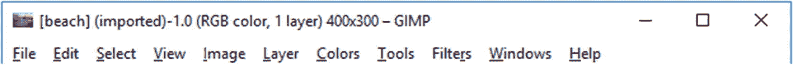
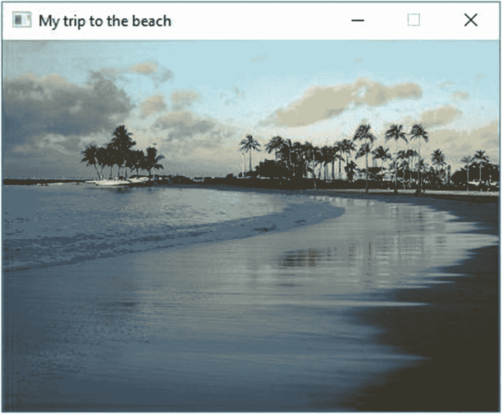
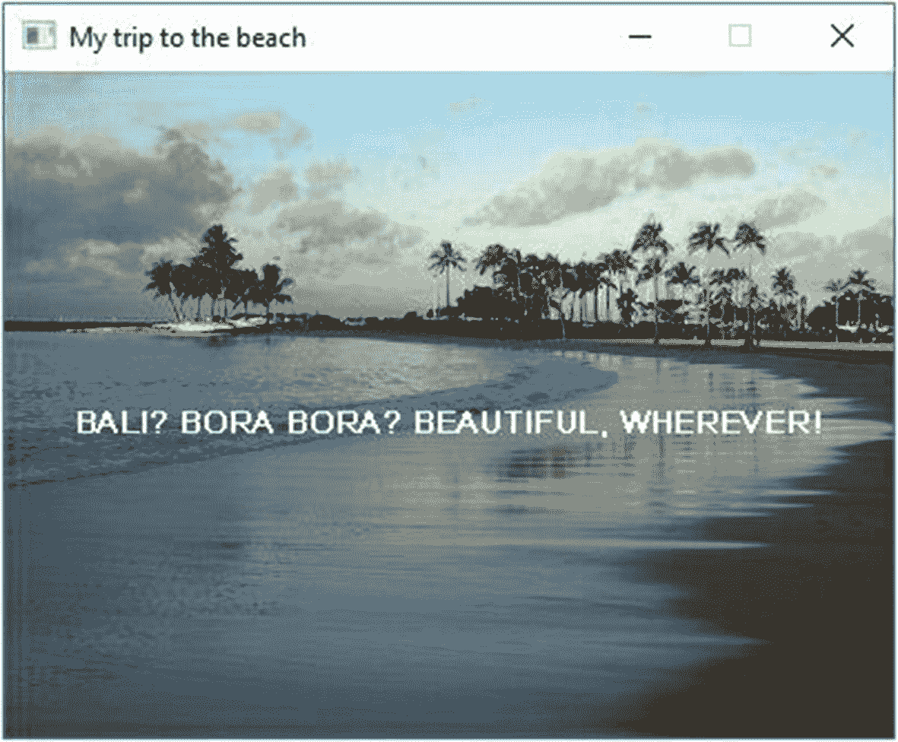
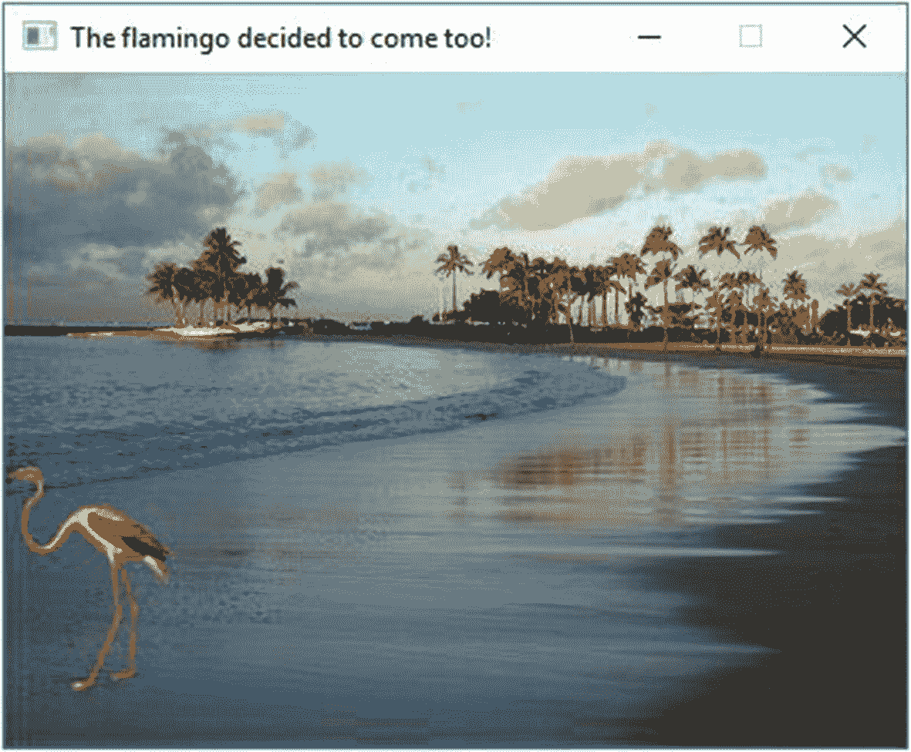
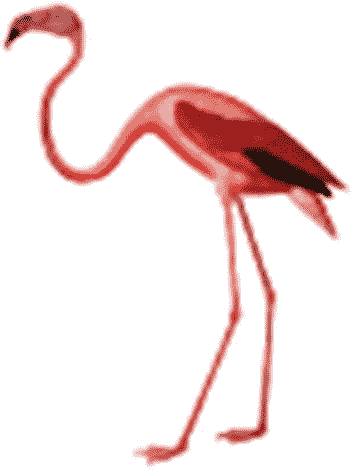
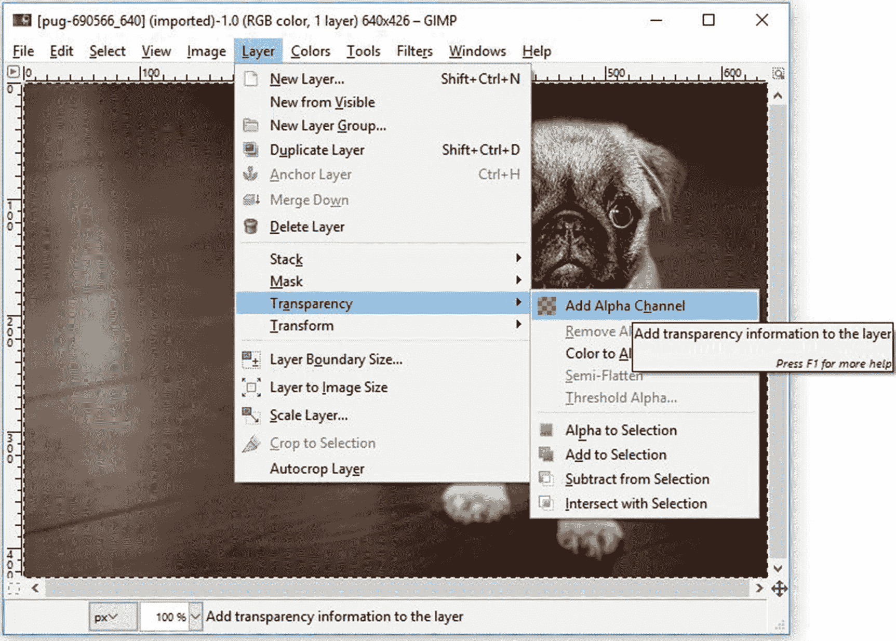
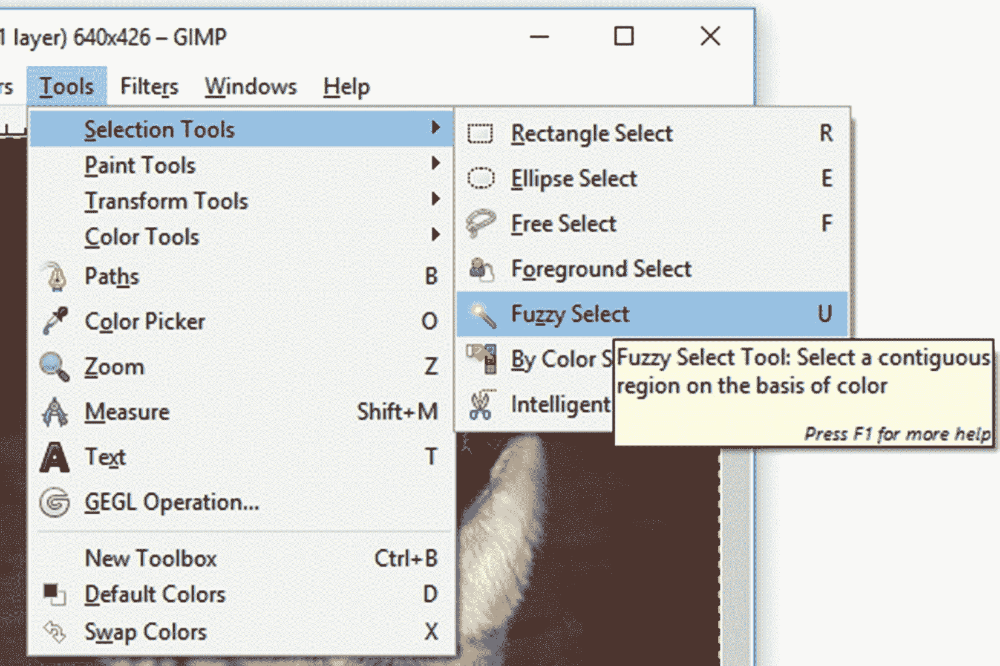
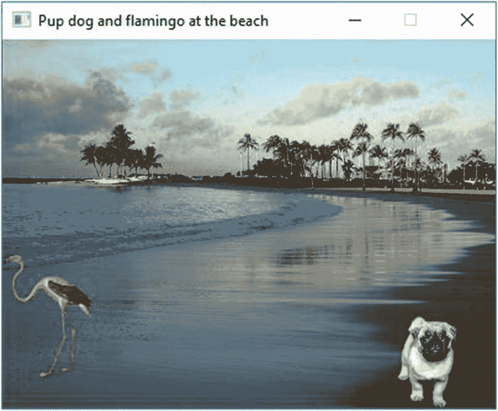
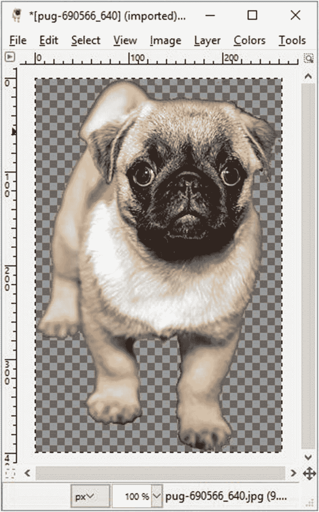

# 2.图像和声音

这些线条画够多了。让我们来点漂亮的。

我们将会玩一个豪华的图形编辑包；我喜欢瘸子。参见附录 A (Unix)或 [`www.gimp.org`](http://www.gimp.org) (Windows)进行安装。

## 图像和窗口特征

让我们从使用示例 [2-1](#PC1) 中的代码显示图像开始。以与上一章相同的方式运行这个示例和后续示例:转到源代码，然后转到相关的子文件夹(在本例中是`ch2`)。对于 g++，进入例子的文件夹，把`Makefile.unix`或者`Makefile.MinGW`复制到`Makefile`，还有`make`。对于 Visual Studio，打开`ch2.sln`，右键单击适当的项目，选择调试➤启动新实例。

```cpp
// Program to show an image on the screen
//       -- from _C++20 for Lazy Programmers_

#include "SSDL.h"

int main (int argc, char **argv)
{
    // Show image
    const SSDL_Image BEACH = SSDL_LoadImage ("beach.jpg");
    SSDL_RenderImage 

(BEACH, 0, 0);

    SSDL_WaitKey();

    return 0;
}

Example 2-1Displaying an image. Found in source code’s ch2 folder as 1-beach. Other numbered examples are found similarly by chapter and example number

```

这个程序加载一个名为`beach.jpg`的图像，并在屏幕上的位置 0，0 显示它。

就这样。

C++ 将在与`a.out` (g++)或`.vcxproj`文件(Visual Studio)相同的文件夹中查找图片。如果我们有一个以上的图像，文件夹可能会变得凌乱。让我们把这些图像放在一个名为`media`的子文件夹中，然后这样加载一个图像:`const SSDL_Image BEACH = SSDL_LoadImage ("media/beach.jpg");`…其中`media/`的意思是“在名为`media`的文件夹中” <sup>[1](#Fn1)</sup>

您目前可以加载 GIF(“jiff”)、JPG(“J-peg”)、BMP(“bitmap”)或 PNG(“ping”)格式或 LBM、PCX、PNM、SVG、TGA(“Targa”)、TIFF、WEBP、XCF、XPM 或 XV 格式的图像。

如果你有另一种格式，尝试在 GIMP 或其他图形编辑器中加载它，并保存/导出为 JPG 或 PNG。我推荐 PNG，因为它支持透明。

当你看到图 [2-1](#Fig1) 、*中的结果时，你可能想知道我们能缩放图像吗？*是的，`SSDL_RenderImage(BEACH, 0, 0, 640, 480);`会把它做成 640 × 480 的图像。但是拉伸它可能会使图像模糊，所以让我们调整窗口大小以适应图像。


图 2-1

显示图像

首先，我们会发现它有多大。如果在 GIMP 中加载，顶栏会告诉你:



Unix 用户也可以说`exiv2 beach.jpg`。如果没有安装`exiv2`,和你的系统管理员好好谈谈。

Windows 用户可以右键单击文件夹中的文件(在`ch2/beach/media`中)并选择属性，然后选择细节选项卡。你会看到如图 [2-2](#Fig2) 所示的宽度和高度。


图 2-2

Microsoft Windows 中图像的属性

然而，我们得到的信息，我们会告诉程序，使窗口的大小相同，给它的宽度和高度参数的顺序:

```cpp
SSDL_SetWindowSize (400, 300); // make a 400x300 window

```

因为我们想让事情变得更酷，所以我们也给窗口本身添加一个标签:

```cpp
SSDL_SetWindowTitle ("My trip to the beach ");

```

这将`My trip to the beach`放在显示窗口的顶栏上。例 [2-2](#PC4) 在一个完整的程序中这样做；结果如图 [2-3](#Fig3) 所示。



图 2-3

调整了标题窗口的大小，以显示没有多余空间的图像

```cpp
// Program to show an image on the screen
//       -- from _C++20 for Lazy Programmers_

#include "SSDL.h"

int main(int argc, char **argv)
{
    // Set window parameters
    SSDL_SetWindowSize  (400, 300);              // make a 400x300 window
    SSDL_SetWindowTitle ("My trip to the beach");

    // Show image
    const SSDL_Image BEACH = SSDL_LoadImage ("media/beach.jpg");
    SSDL_RenderImage (BEACH, 0, 0);

    SSDL_WaitKey();

    return 0;
}

Example 2-2Displaying an image, resized and titled

```

在表 [2-1](#Tab1) 中是我们与图像和窗口属性相关的新函数的声明。

表 2-1

一些 SSDL 图像和窗口功能

<colgroup><col class="tcol1 align-left"> <col class="tcol2 align-left"></colgroup> 
| `SSDL_Image` `SSDL_LoadImage``(const char* filename);` | 加载名为`filename`的图像并提供一个`SSDL_Image`。 |
| `void SSDL_RenderImage``(SSDL_Image img, int x, int y);` | 在位置`x, y`显示图像`img`，使用`img`的宽度和高度。 |
| `void SSDL_RenderImage``(SSDL_Image img, int x, int y,``int width, int height);` | 在位置`x, y`显示图像`img`，指定宽度和高度。 |
| `void` `SSDL_SetWindowSize``(int width, int height);` | 调整窗口大小。(这在一些平台上抹去了标题；先调整大小。) |
| `void` `SSDL_SetWindowTitle``(const char* title);` | 给窗户一个`title.` |
| `int``SSDL_GetWindowHeight`T2】 | 返回窗口高度。 |
| `int``SSDL_GetWindowWidth`T2】 | 返回窗口宽度。 |

最后两个函数返回整数，就像`SSDL_CreateColor`返回一个`SSDL_Color`一样，所以我们可以在任何有意义的地方使用它们。将示例 [2-3](#PC5) 中高亮显示的行添加到我们的程序中，我们会得到图 [2-4](#Fig4) 中的结果。



图 2-4

使用`SSDL_GetWindowWidth`、`SSDL_GetWindowHeight`居中文本

```cpp
int main(int argc, char **argv)
{
    // Set window parameters
    SSDL_SetWindowSize  (400, 300);    // make a 400x300 window
    SSDL_SetWindowTitle ("My trip to the beach");

    // Show image
    const SSDL_Image BEACH = SSDL_LoadImage("media/beach.jpg");
    SSDL_RenderImage(BEACH, 0, 0);

    // Make a label in the middle, centered
    SSDL_RenderTextCentered("BALI? BORA BORA? BEAUTIFUL, WHEREVER!",
                            SSDL_GetWindowWidth () / 2,
                            SSDL_GetWindowHeight() / 2);

    SSDL_WaitKey();

    return 0;
}

Example 2-3Using SSDL_GetWindowWidth () and SSDL_GetWindowHeight () to center a message on the screen

```

### 防错法

本章中的常见问题，无论是崩溃还是不可见的东西，都是以下两种情况之一:

*   图像未加载。

*   一种字体未加载。

以下是可能的元凶:


图 2-5

Microsoft Windows 中一种无法识别的文件类型

*   文件夹位置:文件应该和你的`a.out`或者`.vcxproj`文件在同一个文件夹中，或者在指定的子文件夹中，比如`media/`。

*   拼写错误:如果你像我一样，你*会*把名字拼错。调试前面的程序时，我把`beach.jpg`拼错成了`myImage.jpg`。去想想。

*   **(微软 Windows)你分不清是什么样的文件**。看不到文件扩展名，所以看不出是不是。jpg，。png，或者 SDL 不能使用的非常不同的东西(见图 [2-5](#Fig5) )。

解决方案:不隐藏已知文件类型的扩展名(参见第 1 章“创建你自己的项目”下的附加文件扩展名)...在微软视窗系统中”。

*   文件已损坏或具有您的图像加载器无法处理的功能。一个技巧是在图形编辑器中加载文件。如果加载了该文件，请将其导出为不同的格式或不同的导出选项，然后尝试新文件。

*   它正在加载，但正被粘贴到屏幕之外。试着把它放在位置 0，0，看看它是否变得可见。

*   不是这样的。你能做什么？
    *   如果一个新的特性(比如说，图像)有问题，我可以做一个程序，或者从源代码复制一个程序，只做一个特性，并确保它能正常工作。

        当它出现时，我会添加一些东西，使它更像我想要的最终版本。一旦成功了，我就添加一个又一个的修改，每次都备份上一个工作的程序，所以如果我把新版本搞砸了，我可以回到我刚才的版本。 <sup>[2](#Fn2)</sup>

对我来说，这种备份方式对于新功能的运行至关重要。

*   即使在您信任的示例程序中，您正在努力解决的那个特性也不起作用。你有合适的项目文件或 Makefile 吗？你是否从你的源文件中复制了这个文件夹，没有改变或者重新排列，并且全部复制正确吗？

    这不太可能，但是编译器和库错误*会*发生。比如在调用`SSDL_SetWindowSize`之后，在 Unix 的一些发行版中，`SDL_GetWindowSize`(需要`SSDL_GetWindowWidth`和`SSDL_GetWindowHeight`)可能会返回*旧的*窗口尺寸。这个问题很容易绕过:自己跟踪维度。我总是能够解决编译器或库的问题，即使我后来没有发现这一直是我的错误。

## 多个图像在一起

用 SDL 图书馆粘贴多个图像很容易——你只需把它们从后到前按顺序放在屏幕上，就可以了。如果它们是部分透明的，那就更好了。

你可以通过互联网图片搜索找到类似图 [2-6](#Fig6) 中的透明图片，要求文件类型为 PNG。将示例 [2-4](#PC6) 中的新代码粘贴到`BEACH`背景之后，火烈鸟应该会出现，背景通过透明部分显示出来。结果如图 [2-7](#Fig7) 所示。



图 2-7

粘贴到背景上的部分透明的图像



图 2-6

透明的巴布亚新几内亚

```cpp
// Load images
const SSDL_Image BEACH      = SSDL_LoadImage("media/beach.jpg");
const SSDL_Image FLAMINGO   = SSDL_LoadImage("media/flamingo.png");

// Paste in the background image, and the flamingo
constexpr int    FLAMINGO_X = 0, FLAMINGO_Y = 175;
                 // Flamingo's on left, down screen

SSDL_RenderImage(BEACH,    0,                   0);
SSDL_RenderImage(FLAMINGO, FLAMINGO_X, FLAMINGO_Y);

Example 2-4Adding code to display a PNG image

```

## 用 GIMP 增加透明度

我的火烈鸟图片没有背景。你可能一心想要照片中的某样东西，比如图 [2-8](#Fig8) 中可爱的小狗——但你只是想要小狗，而不是背景。这是我知道的最简单的方法，使背景透明，并保留小狗。(我建议你使用自己选择的图片。Pixabay.com 是一个很好的来源。)


图 2-8

一幅 JPG 的图像，见于`ch2/5-pupdog/media`

警告:除非你是一个真正的艺术家，否则最终的图像可能看起来边缘参差不齐。

加载您的图像在一个豪华的图形编辑器。我将在我的例子中假设 GIMP。

接下来，告诉 GIMP 您希望允许透明。在图层菜单下，选择透明度➤添加阿尔法通道。什么是阿尔法通道？Alpha 是像素的透明度。增加频道意味着透明是可能的。图 [2-9](#Fig9) 显示了这可能是什么样子。



图 2-9

在 GIMP 中增加透明度

现在我们将删除背景，留下一个透明的区域。你将需要 GIMP 所谓的“模糊选择工具”(见图 [2-10](#Fig10) )，它选择相似颜色的区域(在这种情况下，是地板上的颜色)。这个工具看起来像仙女教母的魔杖。别问我是怎么知道的。



图 2-10

模糊选择工具

在部分背景上单击魔杖，然后单击删除。(如果你搞砸了，用 Ctrl-Z–按住 Control，按 Z–撤销。)你应该会看到一个棋盘图案，这意味着你看到的是*到*后面的图像。您也可以使用矩形选择、其他选择或橡皮擦进行清理，如果您愿意，还可以使用裁剪选择、缩放图像或其他方法。图 [2-11](#Fig11) 显示了它可能的样子。



图 2-12

粘贴到背景上的两个透明图像



图 2-11

背景透明的图像。我还剪了它

当你欣赏完自己的作品后，保存——不，*导出*<sup>[3](#Fn3)</sup>——成 PNG 格式，并在你的程序中使用结果，就像我在示例 [2-5](#PC7) 中做的那样。

```cpp
// Program that pastes two images onto a background
//      -- from _C++20 for Lazy Programmers_

#include "SSDL.h"

int main(int argc, char **argv)
{
    // Set window parameters
    SSDL_SetWindowSize(400, 300);       // make a 400x300 window
    SSDL_SetWindowTitle("Pup dog and flamingo at the beach");

    // Load images
    const SSDL_Image BEACH     = SSDL_LoadImage("media/beach.jpg");
    const SSDL_Image FLAMINGO  = SSDL_LoadImage("media/flamingo.png");
    const SSDL_Image PUPDOG    = SSDL_LoadImage("media/pupdog.png");

    // Locations and dimensions for .png images
    constexpr int FLAMINGO_X   =   0, FLAMINGO_Y    = 175;
                                    // Flamingo's on left, down screen
    constexpr int PUPDOG_X     = 320, PUPDOG_Y      = 225;
                                    // Pupdog's on right down screen
    constexpr int PUPDOG_WIDTH =  50, PUPDOG_HEIGHT =  75;
                                    // Pup dog is bigger than I want, so I
                                    //  make her 50x75\. It's better to
                                    //  resize when making the image, but
                                    //  this works too

    // Paste in the background image, plus flamingo and pupdog
    SSDL_RenderImage (BEACH,    0,          0);
    SSDL_RenderImage (FLAMINGO, FLAMINGO_X, FLAMINGO_Y);
    SSDL_RenderImage (PUPDOG,   PUPDOG_X,   PUPDOG_Y,
                      PUPDOG_WIDTH, PUPDOG_HEIGHT);
    SSDL_WaitKey();

    return 0;
}

Example 2-5Multiple images, with transparency. Output is in Figure 2-12

```

Exercises

1.  制作一个幻灯片，展示小狗和火烈鸟(或你自己的狗或庭院侏儒)去过的所有精彩地点。如果你想让幻灯片自动播放，而不是等待用户按键，你可以使用`SSDL_Delay`。当程序点击`SSDL_Delay`时，它会停止给定的时间，然后继续:

    ssdl〔t0〕

## 声音

声音在 SSDL 也很容易。我知道你在想什么:*我会判断那个*。但是你会同意的——除非你的声音决定不加载，程序崩溃。

有两种声音:一种是在背景中持续播放，让用户烦得要死的声音，称为“音乐”，另一种是随着特定事件(如碰撞)发生的声音，称为“声音”一句话:背景音是音乐；音效就是声音。

我们一次只能播放一首音乐，但是多种声音都可以。对这两种类型你能做的主要事情是加载它，播放它，暂停或恢复它，以及暂停它。我们通常使用的格式是 WAV，但是音乐也可以是 MP3 格式。(如果你有另一种格式的声音文件，而 SSDL 无法处理，那就找一个在线转换器。)

最常见的功能在表 [2-2](#Tab2) 中；更完整的列表在附录 h 中。当您看到给定了默认值的参数时，如`SSDL_PlaySound` `(SSDL_Sound` `s, int repeats=0)`中的`repeats`，这意味着如果您省略该参数，它将使用默认值:

表 2-2

常见的 SSDL 声音和音乐功能

<colgroup><col class="tcol1 align-left"> <col class="tcol2 align-left"></colgroup> 
| `SSDL_Music` `SSDL_LoadMUS``(const char* filename);` | 从`filename`载入音乐。 |
| `void` `SSDL_PlayMusic``(SSDL_Music m,``int numTimesToPlay=-1);` | 播放指定次数的音乐；–1 表示永远重复。 |
| `void``SSDL_PauseMusic`T2】 | 暂停音乐。 |
| `void SSDL_ResumeMusic` `();` | 恢复音乐。 |
| `int``SSDL_VolumeMusic`T2】 | 设置音量，应该是从 0 到`MIX_MAX_VOLUME`(128)，返回新的音量。如果 volume 为–1，则仅返回卷。 |
| `void``SSDL_HaltMusic`T2】 | 停止音乐。 |
| `SSDL_Sound``SSDL_LoadWAV`T2】 | 从文件中加载声音。不管名字如何，它可以是`WAV`格式或其他支持的格式。有关详细信息，请参见 SDL2_mixer 的在线文档。 |
| `void` `SSDL_PlaySound``(SSDL_Sound sound,``int repeats=0);` | 播放此声音，并重复指定的次数。如果 repeat 为–1，则永远重复。 |
| `void``SSDL_PauseSound`T2】 | 暂停声音。 |
| `void``SSDL_ResumeSound`T2】 | 恢复声音。 |
| `int` `SSDL_VolumeSound``(SSDL_Sound snd,``int volume=MIX_MAX_VOLUME);` | 设置音量，从 0 到`MIX_MAX_VOLUME`，128；还卷。如果 volume 参数为–1，则仅返回体积。 |
| `void``SSDL_HaltSound`T2】 | 停止声音。 |

```cpp
SSDL_PlaySound (mySound, 2);  // repeat sound twice after you play it
SSDL_PlaySound (mySound);     // repeat sound 0 times after playing it --
                              // that's the default

```

经常可以在网上找到声音；在网上搜索“免费 WAV”或诸如此类的东西。将您需要的内容复制到您的`media`文件夹中。

示例 [2-6](#PC9) 显示了一个简单的程序，当你按下一个键时，它会播放音乐并敲锣。

```cpp
// Program to play sounds
//       -- from _C++20 for Lazy Programmers_

#include "SSDL.h"

int main(int argc, char** argv)
{
    // Initial window setup
    SSDL_SetWindowTitle("Simple sound example");

    // Load our media
    SSDL_Music

music = SSDL_LoadMUS ("Media/457729__razor5__boss-battle-2-0.wav");
    SSDL_Sound bell = SSDL_LoadWAV ("Media/321530__robbo799__church-bell.wav");

    SSDL_VolumeMusic (MIX_MAX_VOLUME/2);  // play music at half volume,
                                          //   because...that was LOUD.
    SSDL_PlayMusic (music, SSDL_FOREVER); // ...looping continuously
                                          // SSDL_FOREVER means -1
    sout << "Hit a key to hear the bell.\n";
    SSDL_WaitKey();
    SSDL_PlaySound(bell);

    sout << "Hit another key to end.\n";
    SSDL_WaitKey();

    return 0;
}

Example 2-6A simple music and sound program

```

### 防错法

几乎任何一个声音出错都会让程序崩溃。主要怀疑是文件名错误或在错误的文件夹中，或使用不支持的文件类型。

如果音质有问题，请参见附录 a。

Exercises

1.  制作您自己的音乐视频，包括歌词、图像和声音，并播放它。您需要记录幻灯片之间的延迟时间；参见上一节中的练习 1。

2.  播放一首歌曲，在每四拍中加入锣声或其他恼人的声音。

<aside aria-label="Footnotes" class="FootnoteSection" epub:type="footnotes">Footnotes [1](#Fn1_source)

是的，有经验的 Windows 用户，那真的是`/`不是`\`。这将在 Windows 和 Unix 中工作，并且操作系统之间的可移植性是一件好事。为了简洁明了，我将在随后的文本中使用`/`作为分隔符，因为我是为两个平台编写的。MinGW 用户，记得在`cmd`窗口中使用`\`。

  [2](#Fn2_source)

记住第一章中不要拔头发的黄金法则:在你做改变的时候，保留大量的备份。

  [3](#Fn3_source)

图形编辑器不让你用有用的格式保存；保存是为了自己的格式。你得用*出口*来代替。

 </aside>