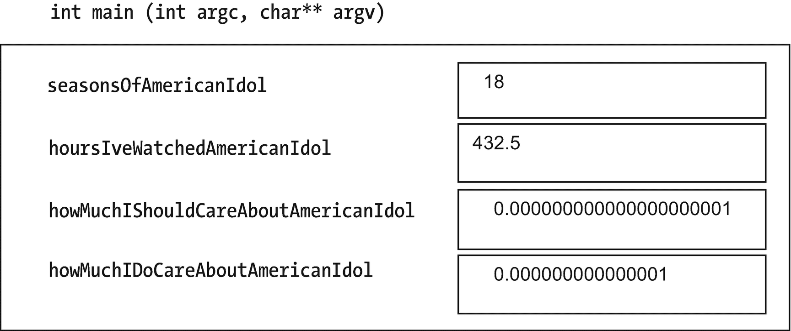
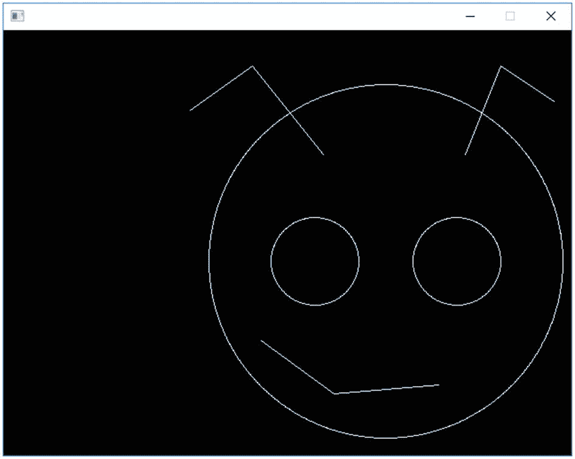
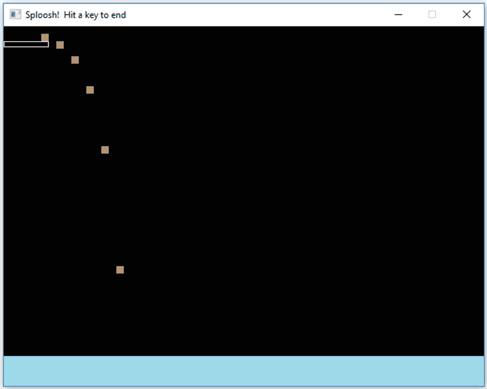
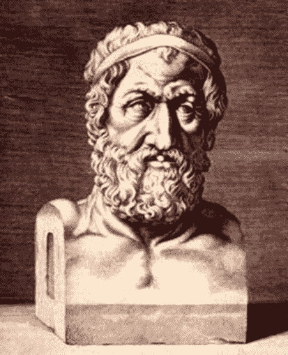
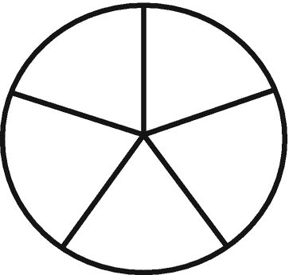
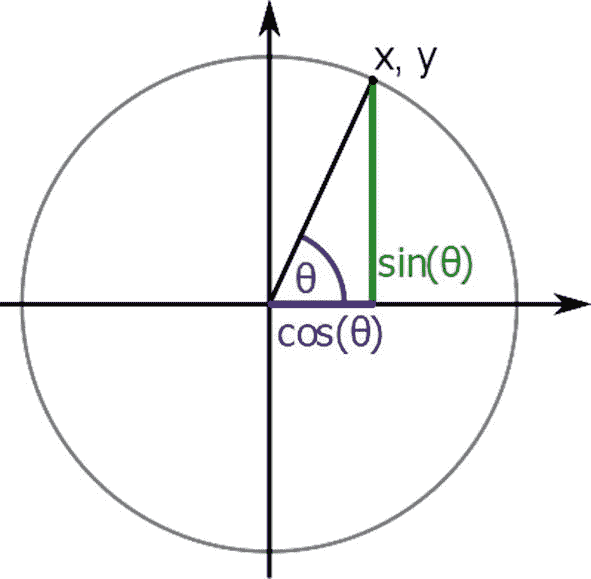
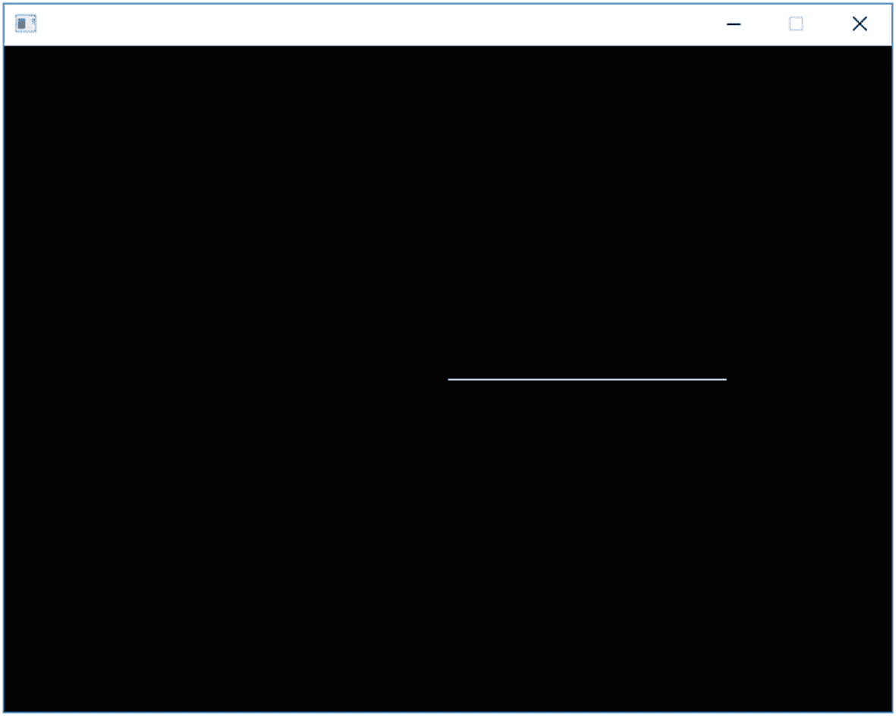
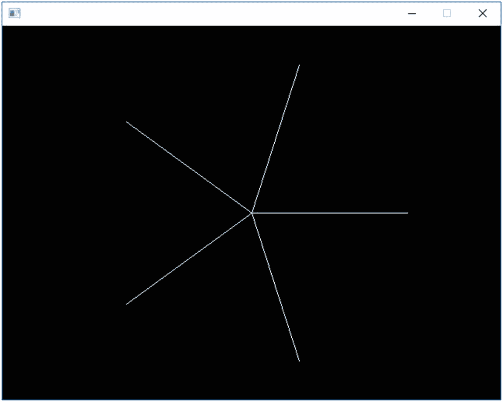

# 3.民数记

数字是计算机世界运转的动力，所以让我们来看看如何让计算机为我们处理这些数字。

## 变量

变量可能看起来像我们在代数中使用的字母——y = MX+b，诸如此类——但在 C++中，它们只是存储值的地方。示例 [3-1](#PC1) 展示了我们创建变量时的样子。

(最后提醒:与所有编号的示例一样，您可以在源代码的相应章节中找到示例[3-1](#PC1)——参见第 1 章的“形状和绘制它们的函数”一节，了解如何找到并运行它。)

```cpp
int main (int argc, char** argv)
{
    int seasonsOfAmericanIdol                   = 18;
                                     // after a while you lose track
    float hoursIveWatchedAmericanIdol           = 432.5F;
                                     // missed half an episode, dang it
    double howMuchIShouldCareAboutAmericanIdol  = 1.0E-21;
                                     // 1x10 to the -21 power
    double howMuchIDoCareAboutAmericanIdol      = 0.000000000000001;
                                     // So why'd I watch it if I don't care

    sout << "Through " << seasonsOfAmericanIdol << " seasons of American Idol...";

    // ...and some more output...

    // end program
    SSDL_WaitKey();
    return 0;
}

Example 3-1Variable declarations for my American Idol obsession

```

这给了我们一个整数变量；一个浮点变量，可以取小数位；和两个 double 变量，可以取更多的小数位。(还有多少取决于你用的机器。)

`432.5F`上的尾随`F`意味着它是一个`float`，而不是一个`double`值。(如果不指明，那就是一个`double`。)如果你搞混了这些，可能会得到编译器的警告。为了避免警告，我使用了`double`，忘记了`F`。

`1.0E-21`就是 C++怎么写 1.0 × 10 <sup>21</sup> 。

你可以把 main 函数想象成包含这些名称的位置，每个位置可以存储一个适当类型的值(见图 [3-1](#Fig1) )。



图 3-1

在`main`中存储数值的变量

我们一做好变量就给它们赋值，在同一行上。我们没必要，但这是很好的练习。当你发现你的银行账户中的美元数是–6800 万时，这是令人失望的，因为你没有告诉计算机用什么值来初始化它，它只是碰巧以一个非常不合适的数字开始。

Golden Rule of Variables

初始化它们。

**也可以像前面那样做描述性的名字。**搜索代码试图找出`"z"`或`"x"`的意思是令人沮丧的。但是你很清楚`seasonsOfAmericanIdol`是什么意思。

变量名以字母开头(可能以`_`开头)，但之后可以有数字。大写事项:`temp`和`Temp`是不同的变量。

Extra

变量名和常量名*应该*是描述性的*不应该*与 C++中的任何内置关键字相同(`const`、`int`、`void`等)。).

按照惯例，C++常量全部用大写字母书写，是为了向程序员表明这是一个常量，而不是变量值。例如，使用 _: `MAX_LENGTH`来分隔挤在一起的单词。

变量名的约定很灵活。我使用“camel case”变量:你将单词组合在一起构成一个变量，将单词的所有首字母大写，除了第一个——`firstEntry`、`minXValue`。我为像`SSDL_Image`这样的创造类型保留初始资本。首字母“_”代表编译器自己的标识符。还有其他公约；无论你使用什么约定，最好是尽可能清楚。


你认为它的名字是怎么来的？

## 常数

我们已经设定了一些常数:

```cpp
const SSDL_Color MAHOGANY   = SSDL_CreateColor    (192,  64,   0);
const SSDL_Font  FONT       = SSDL_OpenSystemFont ("timesbd", 24);

```

现在请考虑这两个更简单的常量声明:

```cpp
constexpr double PI               = 3.14159265359;
constexpr int    DAYS_PER_FORTNIGHT = 7+7;  // A fortnight is two weeks, so...

```

有什么区别？`const`简单地说就是“不变”`constexpr`表示“不改变*并且*在编译时被设置”后者让程序快一点。我们不会注意到前面的声明，但是随着程序变得更大更复杂，它可能会更重要。(我不能用`SSDL_CreateColor`或`SSDL_OpenSystemFont`来做这件事，因为只有在运行时启动 SDL，它们才能工作。)

当初始值只是数字的时候我用`constexpr`(比如`3.14159265359`或者`7+7`)，当是函数调用的时候我用`const`(比如`SSDL_OpenSystemFont ("times", 18)`)。最终我们会完善这一点(见第 26 章)，但目前来说还是不错的。

### 何时使用常量，而不是文字值

什么时候应该使用文字值，比如`100`，什么时候应该使用常量符号，比如`CENTURY`？答案几乎总是:使用常量而不是简单的文字值。原因有二:

一个是**要明确的是**，如前所示。你正在回顾一个程序，你看到一个对`7`的引用。七什么？一周中的几天？《死罪》的数量？你写第一个程序的时候是多少岁？你必须做一些调查工作来找出它，尤其是如果你的程序中有不止一个`7`。侦探工作不适合懒人。最好用一个清晰的名字记录下来。

另一个原因是**容易改变值**。例如，按照惯例有七宗罪，但是用程序员的术语来说，使用像`7`这样简单的数字文字是一个非常致命的错误。所以也许那个`constexpr int NUMBER_OF_DEADLY_SINS = 7;`需要更新为`8`。如果你用了这个常数，你有一行需要修改。如果你让`7`贯穿你的程序，你将不得不考虑哪些`7`需要改变，哪些不需要改动。又是侦探工作。

底线是清晰。我们不会回到第一章的 bug face 程序，用`constexpr`代替所有的数字，因为这会让程序*更难*理解；每个值都是唯一的，给它命名并不能让它更清晰。(反正我们有评论说明什么意思。)但虫脸程序是个例外。通常，值应该被命名。

Golden Rule of Constants

任何时候，如果数字文字值的用途不明显，就将其定义为常量符号，全部大写，并在引用它时使用该名称。

Extra: Adding

`constexpr` **向 Bug-Head 程序**

是的，我勉强承认，出于前面给出的原因，第一章的 bug-head 程序中的简单数字可以保留。但是如果我们不止一次引用值呢？用它们来计算脸部的位置？在这种情况下，我们需要常数。因此

```cpp
// draw the bug's head
SSDL_RenderDrawCircle (430, 260, 200);

// left eye, and right
SSDL_RenderDrawCircle (430-80, 260, 50);
SSDL_RenderDrawCircle (430+80, 260, 50);

```

会变成

```cpp
constexpr int HEAD_X     = 430, HEAD_Y   = 260, HEAD_RADIUS = 200;
constexpr int EYE_RADIUS =  50;
constexpr int EYE_OFFSET =  80; // How far lt/rt an eye is from center

// draw the bug's head
SSDL_RenderDrawCircle (HEAD_X,            HEAD_Y, HEAD_RADIUS);

// left eye, and right

SSDL_RenderDrawCircle (HEAD_X-EYE_OFFSET, HEAD_Y, EYE_RADIUS);
SSDL_RenderDrawCircle (HEAD_X+EYE_OFFSET, HEAD_Y, EYE_RADIUS);

```

当然，现在它更长了——但是它已经从“这些数字是如何相互关联的？为什么 430 和 260 一直出现？”一个内在的解释。不错。(完整的程序在源代码中的`ch3`为`bugsHead-with-constexpr`；照常用`make`运行(g++)或者通过 ch3.sln (Visual Studio)。输出如图 [3-2](#Fig2) 所示。)



图 3-2

一个虫子的头，用常数和计算画出来的

## 数学运算符

表 [3-1](#Tab1) 包含了你可以在 C++中使用的算术运算符。你可能会想到它们的用法:`2.6+0.4`或`alpha/beta`或`-2*(5+3)`。

表 3-1

算术运算符

<colgroup><col class="tcol1 align-left"> <col class="tcol2 align-left"></colgroup> 
| 

操作员

 | 

意义

 |
| --- | --- |
| `+` | 添加 |
| `-` | 减法，否定 |
| `*` | 增加 |
| `/` | 分开 |
| `%` | 系数 |

### 整数除法

在你学习分数之前，当你只用整数时，结果总是一个整数:5 除以 2 等于 2，余数是 1。C++的整数除法也是一样:`5/2`给你另一个整数，`2,`不是`2.5`——那是浮点值。

这可能会令人困惑。`1/2`看起来确实应该是`0.5`，但是由于`1`和`2`是整数，`1/2`也必须是整数:`0`。

为了与我们划分整数的方式保持一致，C++还提供了`%`，即模数运算符，意思是“除取余数”。`5%2`给出了`1`，5 除以 2 后的余数。我们将在第 8 章“随机数”一节中看到更多的`%`

### 赋值(=)运算符

我们已经在使用=了:

```cpp
const SSDL_Color MAHOGANY   = SSDL_CreateColor  (192,  64,   0);
int   seasonsOfAmericanIdol = 18;

```

常量不能超过第一行，否则它们就不是常量，但是变量可以随时变化:

```cpp
x = 5; y = 10;
x = 10;             // I changed my mind: put a 10 in X, replacing the 5

seasonsOfAmericanIdol = seasonsOfAmericanIdol + 1; // Another year! Yay!

```

后者意味着取那个`seasonsOfAmericanIdol`存储单元中的任何数字，加 1，然后把结果值放回那个相同的位置。

也可以这么写:`seasonsOfAmericanIdol +` `= 1;`。

它们的意思是一样的:在`seasonsOfAmericanIdol`上加 1。<sup>[1](#Fn1)T4】</sup>

它适用于其他算术运算符`: -=`、`*=`、`/=`和`%=`都以相同的方式定义。

### 跳水板的例子

现在，让我们用一个将数学用于体育的程序来实践这一点。有人要离开跳水板了。我们将一秒一秒地拍摄角色跳入水中的图像(例如 [3-2](#PC8) )。

```cpp
// Program to draw the path of a diver
//              -- from _C++20 for Lazy Programmers_

#include "SSDL.h"

int main(int argc, char** argv)
{
    SSDL_SetWindowTitle("Sploosh!  Hit a key to end");

    // Stuff about the board
    constexpr int BOARD_WIDTH        = 60,2
                  BOARD_THICKNESS    =  8,
                  BOARD_INIT_Y       = 20;

    SSDL_RenderDrawRect(0, BOARD_INIT_Y,
                        BOARD_WIDTH, BOARD_THICKNESS);

    // ...the water

    constexpr int SKY_HEIGHT         = 440;
    SSDL_SetRenderDrawColor(BLUE);
    SSDL_RenderFillRect(0, SKY_HEIGHT,
                        SSDL_GetWindowWidth(),
                        SSDL_GetWindowHeight() - SKY_HEIGHT);
                                  // height is window height - sky height

    // ...the diver
    constexpr int
        WIDTH              = 10, // Dimensions of "diver"
        HEIGHT             = 20,
        DISTANCE_TO_TRAVEL = 20, // How far to go right each time
        FACTOR_TO_INCREASE =  2; // Increase Y this much each time

    constexpr int INIT_X   = 50,
                  INIT_Y   = 10;
    int                x   = INIT_X; // Move diver to end of board
    int                y   = INIT_Y; // and just on top of it

    const SSDL_Color DIVER_COLOR = SSDL_CreateColor(200, 150, 90);
    SSDL_SetRenderDrawColor(DIVER_COLOR);

    // Now draw several images, going down as if falling, and right
    // Remember x+=DISTANCE_TO_TRAVEL means x=x+DISTANCE_TO_TRAVEL
    //   ...and so on

    SSDL_RenderFillRect(x, y, WIDTH, HEIGHT);
    x += DISTANCE_TO_TRAVEL;  // go right the same amount each time,
    y *= FACTOR_TO_INCREASE;  //  down by an ever-increasing amount
    SSDL_Delay(100);          // 100 ms -- 0.1 seconds

    // Same thing repeated several times

    SSDL_RenderFillRect(x, y, WIDTH, HEIGHT);
    x += DISTANCE_TO_TRAVEL; y *= FACTOR_TO_INCREASE;
    SSDL_Delay(100);          // 100 ms -- 0.1 seconds

    SSDL_RenderFillRect(x, y, WIDTH, HEIGHT);
    x += DISTANCE_TO_TRAVEL; y *= FACTOR_TO_INCREASE;
    SSDL_Delay(100);          // 100 ms -- 0.1 seconds

    SSDL_RenderFillRect(x, y, WIDTH, HEIGHT);
    x += DISTANCE_TO_TRAVEL; y *= FACTOR_TO_INCREASE;
    SSDL_Delay(100);          // 100 ms -- 0.1 seconds

    SSDL_RenderFillRect(x, y, WIDTH, HEIGHT);
    x += DISTANCE_TO_TRAVEL; y *= FACTOR_TO_INCREASE;
    SSDL_Delay(100);          // 100 ms -- 0.1 seconds

    SSDL_RenderFillRect(x, y, WIDTH, HEIGHT);
    x += DISTANCE_TO_TRAVEL; y *= FACTOR_TO_INCREASE;
    SSDL_Delay(100);          // 100 ms -- 0.1 seconds

    // end program
    SSDL_WaitKey();
    return 0;
}

Example 3-2A program to show a diver’s path, using constexprs and math operators

```

注意事项:

*   我一如既往地初始化所有变量。

*   在任何计算或变量初始化中没有空的数字文本；一路都是定值。

*   我重复同样的一对线六次。真的吗？那是懒吗？我们在第五章会有更好的方法。

图 [3-3](#Fig3) 就是结果。



图 3-3

显示潜水员入水路径的程序

这很有效，并且在某种程度上唤起了我从高台跳水时的恐惧。

### 数学运算符的无忧列表

这里有一些 C++会很自然地处理的事情，你不需要为它们记住任何东西:

*   **优先级** **:** 考虑一个数学表达式，`2*5+3`。在 C++中，就像在代数课上一样，我们在加法之前先做乘法；这是指`(2*5)+3` = `13`，而不是`2*(5+3)` = `16`。同样的，在`8/2-1`中，我们先除后减。总的来说，用对你有意义的方式去做，它就会是正确的。如果不是，用括号强制它按照你的方式进行:`8/(2-1)`。

*   **关联性:**在`27/3/3`中，哪个除法先出现？是像`27/(3/3)`，还是像`(27/3)/3`那样做？算术运算从左到右执行。赋值是从右到左进行的:`x=5+2`要求你在对`x`做任何事情之前先评估`5+2`。

优先级和结合性的精确细节在附录 b 中。

*   **强制** **:** 如果你想把一种类型的变量塞进另一种类型，C++会做到:

`double Nothing = 0;  // Nothing becomes 0.0, not 0`

`int Something = 2.7; // ints can't have``decimal places`T2】

`// C++ throws away the .7;`

`// Something becomes 2\. No rounding, alas`

如果在计算中混合整数和浮点数，结果将是信息最多的版本，即浮点。比如`10/2.0`，给你`5.0`。

Exercises

1.  使用厘米每英寸(2.54)和英寸每英尺(12)的常数，将某人的身高从英尺和英寸转换为厘米，并报告结果。

2.  现在反过来做:厘米到英尺和英寸。

3.  Accumulate this sum for as far as you’re willing to take it, 1/2 + 1/4 + 1/8 + 1/16 +…, using +=. Do you think if you did it forever you would reach a particular number? Or would it just keep getting bigger? The ancient philosopher Zeno of Elea would have an opinion on that ([`https://en.wikipedia.org/wiki/Zeno%27s_paradoxes`](https://en.wikipedia.org/wiki/Zeno%2527s_paradoxes), at time of writing). But he’d be wrong.

    

    你不能从这里到达那里。—芝诺。算是吧。

4.  编写一个程序，让一个盒子以 0.1 秒的跳跃在屏幕上移动——就像潜水员移动一样，但每次跳跃都要清空屏幕，这样它看起来就像真的在移动。也许可以缩短延迟时间，以获得更好的运动错觉。

## 内置函数和转换

现在我想做一个几何图形，五角星。但是忘了第一章的图表吧。我想让电脑帮我算出来。让它自己做(虚拟的)绘图纸。

如果我把星星想象成一个圆，我可能知道圆心，所以我需要计算的是边缘的点。每个点都比前一个点绕圆远五分之一，所以如果一个圆是 360 度，它们之间的角度是 360/5 度。如果你用弧度而不是角度，比如 C++，那就是两点之间的 2π/5 弧度。



SDL 使用 x，y 坐标，所以我们需要一种方法从这个角度得到它。我们可以使用图 [3-4](#Fig4) 中的图片来完成。由于角度θ的正弦是 y 距离除以半径(如果数学不是你的菜，相信我)，y 距离就是半径* sin (θ)。同样，x 距离是半径* cos (θ)。



图 3-4

与 x 和 y 相关的正弦和余弦

像大多数 C++数学函数一样，`sin`和`cos`函数在一个名为`cmath`、<sup>、 [3](#Fn3) 、</sup>的包含文件中进行声明。因此

```cpp
#include <cmath>  // System include files (those that come with the compiler)
                 // have <>'s not ""'s.
#include "SSDL.h"

```

这个程序的意思是从中心到边缘画一条线，绕圆转五分之一圈，再做一遍，一直走，总共五行。

```cpp
// Program to make a 5-point star in center of screen
//              -- from _C++20 for Lazy Programmers_

#include <cmath>
#include "SSDL.h"

int main(int argc, char** argv)
{
    constexpr double PI = 3.14159;

    // Starting out with some generally useful numbers...

    // center of screen

    const     int CENTER_X           = SSDL_GetWindowWidth () / 2,
                  CENTER_Y           = SSDL_GetWindowHeight() / 2;
    constexpr int RADIUS             = 200,
                  NUMBER_OF_POINTS   =   5;

    // angle information...
    double    angle                  = 0;     // angle starts at 0
    constexpr double ANGLE_INCREMENT = (2 / NUMBER_OF_POINTS) * PI;
                            // increases by whole circle/5 each time

    // ...now we make the successive lines
    int x, y;               // endpt of line (other endpt is center)

    x = CENTER_X + int(RADIUS * cos(angle));       // calc endpoint
    y = CENTER_Y + int(RADIUS * sin(angle));
    SSDL_RenderDrawLine(CENTER_X, CENTER_Y, x, y); // draw line
    angle += ANGLE_INCREMENT;                      // go on to next

    x = CENTER_X + int(RADIUS * cos(angle));       // calc endpoint
    y = CENTER_Y + int(RADIUS * sin(angle));
    SSDL_RenderDrawLine(CENTER_X, CENTER_Y, x, y); // draw line
    angle += ANGLE_INCREMENT;                      // go on to next

    x = CENTER_X + int(RADIUS * cos(angle));       // calc endpoint
    y = CENTER_Y + int(RADIUS * sin(angle));
    SSDL_RenderDrawLine(CENTER_X, CENTER_Y, x, y); // draw line
    angle += ANGLE_INCREMENT;                      // go on to next

    x = CENTER_X + int(RADIUS * cos(angle));       // calc endpoint
    y = CENTER_Y + int(RADIUS * sin(angle));
    SSDL_RenderDrawLine(CENTER_X, CENTER_Y, x, y); // draw line
    angle += ANGLE_INCREMENT;                      // go on to next

    x = CENTER_X + int(RADIUS * cos(angle));       // calc endpoint
    y = CENTER_Y + int(RADIUS * sin(angle));
    SSDL_RenderDrawLine(CENTER_X, CENTER_Y, x, y); // draw line
    angle += ANGLE_INCREMENT;                      // go on to next

    // end program

    SSDL_WaitKey();
    return 0;
}

Example 3-3A star using sin and cos functions

```

图 [3-5](#Fig5) 显示了结果。什么事？



图 3-5

一颗五角星——至少，它应该是

一旦我们在第 9 章中讨论了调试器，这将是一件轻而易举的事情，但是现在，我们只需要打开夏洛克·福尔摩斯的频道。那条线不变，说明`angle`不变，说明`ANGLE_INCREMENT`一定是 0。为什么会是 0？

看那个计算:`ANGLE_INCREMENT = (2/NUMBER_OF_POINTS)*PI`。首先要做的是用 2 除以`NUMBER_OF_POINTS`，即 5。因为两者都是整数，我们做整数除法:5 除以 2(余数是 2，不管值不值得)，所以`2/5`给我们零。零点乘以`PI`为零。所以`ANGLE_INCREMENT`是零。

我们需要浮点除法。

一种方法是强制 2 和 5 为`float`或`double`。你可以这样说。

`double (whatEverYouWantToBeDouble)`。

这叫**铸造**。

`double (2/NUMBER_OF_POINTS)`不起作用，因为它将 2 除以 5，得到 0，然后将 0 转换为 0.0。它还在做整数除法。

以下任何一种都可以。只要`/`的参数之一是`double`或`float`，就会得到一个带小数位的结果:

```cpp
double (2)/NUMBER_OF_POINTS
2/double (NUMBER_OF_POINTS)
2.0 / NUMBER_OF_POINTS

```

因此，将`main`的开头改为你在示例 [3-4](#PC12) 中看到的形式可以修复这个问题。

```cpp
int main(int argc, char** argv)
{
...

    // angle information...
    double        angle = 0;  // angle starts at 0
    constexpr double ANGLE_INCREMENT
               = (2 / double (NUMBER_OF_POINTS)) * PI;
                              // increases by whole circle/5 each time
    ...

Example 3-4A new beginning to main, to make Example 3-3 work

```

图 [3-6](#Fig6) 显示了结果。



图 3-6

五角星

好像不是垂直的。练习 1 是关于把它转直。

其他常用的数学函数包括`asin`和`acos`(反正弦和反余弦)、`pow`(将一个数提升到幂)、`abs`(绝对值)和`sqrt`(平方根)。更多信息见附录 F。

### 防错法

*   你调用了一个返回值的函数，但是没有效果。下面是我们之前看到的一个函数示例:

    `// Center "Blastoff!" on the screen`

    `SSDL_GetScreenWidth();`

    `SSDL_RenderTextCentered (320, 240, "Blastoff!");`

    当然，你叫了`SSDL_GetWindowWidth()`…但是你从来没有对结果做任何事情！C++很乐意让你浪费时间去调用函数，不去用它们给你的东西。(这是一种“让程序员搬起石头砸自己的脚，然后大笑”的语言。)如果要使用该值，请在需要该值的任何地方引用它:

    `SSDL_RenderTextCentered(SSDL_GetScreenWidth ()/2,`

    `SSDL_GetScreenHeight()/2,`

    `"Blastoff!");`

    或者将其放入变量或常量中以备后用:

    `const int SCREEN_WIDTH  = SSDL_GetScreenWidth ();`

    `const int SCREEN_HEIGHT = SSDL_GetScreenHeight();`

    `SSDL_RenderTextCentered (SCREEN_WIDTH/2, SCREEN_HEIGHT/2, "Blastoff!");`

*   **你将两个整数相除，得到一个介于 0 和 1 之间的浮点数，得到的却是 0。**见本节示例 [3-3](#PC10) 。`/`符号的其中一个操作数应该被强制转换为`float`或`double`。

*   你会得到一个关于类型之间转换的警告。你可以忽略它，但是要让它消失，把讨厌的东西丢到你想要的地方。那么编译器就会知道这是故意的。

Exercises

1.  调整示例 [3-4](#PC12) 中的星形，使星形的顶点垂直向上。

2.  制作一个钟面:一个在适当位置标有数字 1-12 的圆圈。

3.  (用力)下面是如何以秒为单位获得系统时间:

    `#include <``ctime`T2】

    `...`

    `int timeInSeconds = int` <sup>[4](#Fn4)</sup> `(time` `(nullptr));`

    使用`%`和`/`运算符以小时、分钟和秒为单位查找当前时间。由于您所在的时区，时间可能会有所不同；可以适当调整。

4.  完成 2 和 3 后，制作一个显示当前时间的钟面。

<aside aria-label="Footnotes" class="FootnoteSection" epub:type="footnotes">Footnotes [1](#Fn1_source)

如果你想加 1，而不是其他数字，有一个特殊的“增量”操作符:

`++seasonsOfAmericanIdol;`

我们将在第 5 章中再次看到这一点，以及“减量”(`--`)。

  [2](#Fn2_source)

所有这些都排列得如此精确。这是不是矫枉过正？看看找到我所有的变量和它们的值有多容易！另一个需要养成的好习惯。

  [3](#Fn3_source)

包括从 C++祖先 C 继承的文件，以“C”开始:例如`cmath`和`cstdlib`。

  [4](#Fn4_source)

我们使用`int`来避免“反欺诈”中提到的转换警告`time`函数返回一个`time_t`(不管是什么)；我们会强制它成为一个`int`。

 </aside>