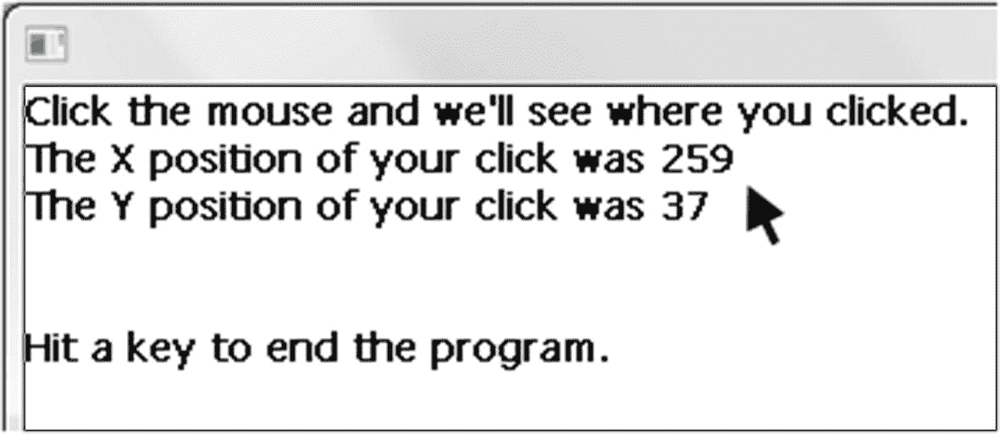
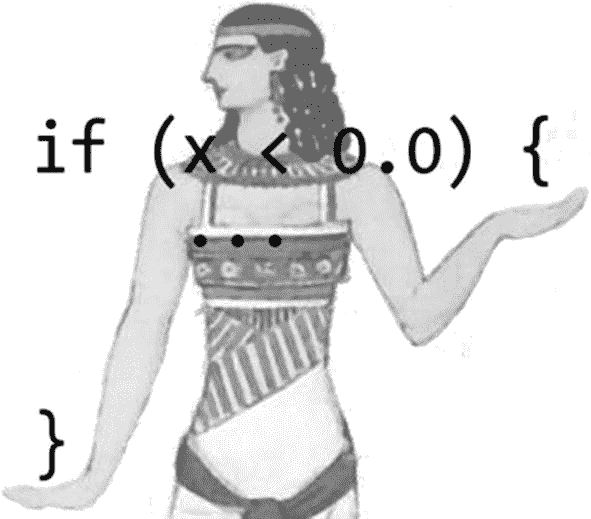
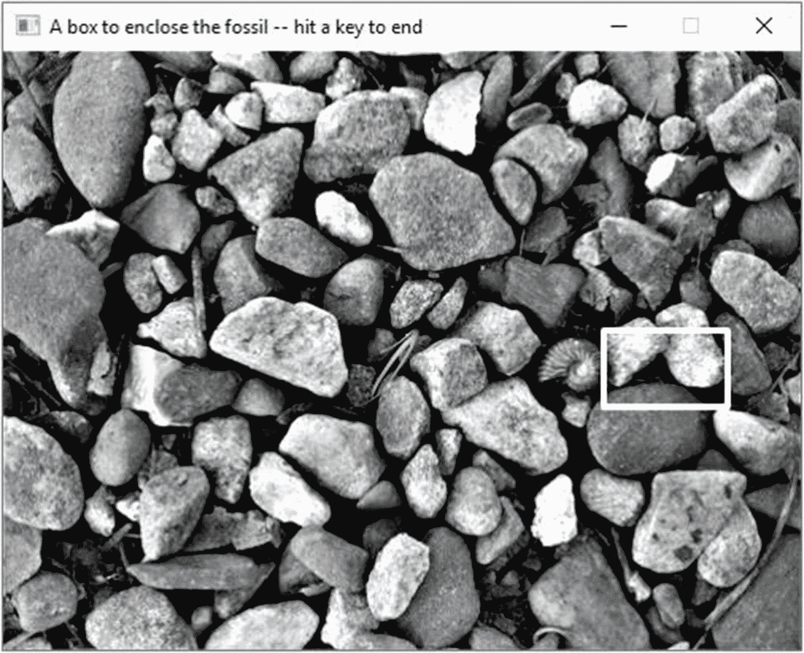
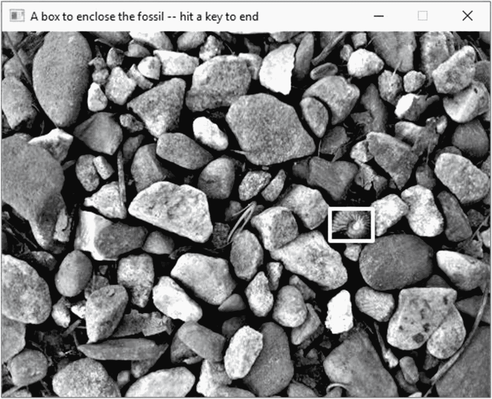
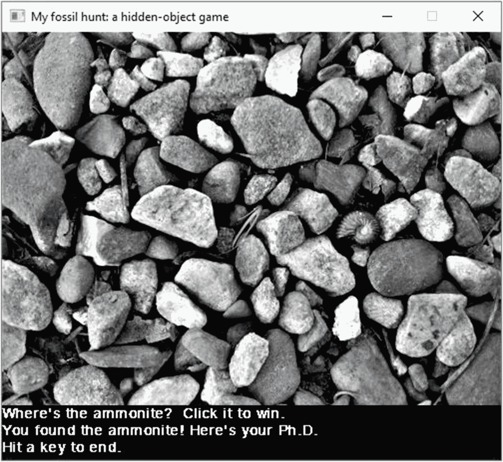

# 4.鼠标，和`if`

在这一章中，我们将学习鼠标输入，以及计算机风格的决策艺术。

## 鼠标功能

示例 [4-1](#PC1) 显示了一个程序来检测你点击鼠标的位置并报告结果。很神奇吧。因此，我们介绍三种鼠标功能:`SSDL_GetMouseX`、`SSDL_GetMouseY`和`SSDL_WaitMouse`。

```cpp
// Program to get a mouse click, and report its location
//              -- from _C++20 for Lazy Programmers_

#include "SSDL.h"

int main(int argc, char** argv)
{
    sout << "Click the mouse and we'll see where you clicked.\n";

    // Get the mouse click
    SSDL_WaitMouse();                   // wait for click...
    int xLocation = SSDL_GetMouseX();   // and get its X, Y location
    int yLocation = SSDL_GetMouseY();

    // Print the mouse click
    sout << "The X position of your click was " << xLocation << "\n";
    sout << "The Y position of your click was " << yLocation << "\n";

    // End the program
    sout << "\n\nHit a key to end the program.\n";

    SSDL_WaitKey();

    return 0;
}

Example 4-1A program to capture and show a mouse click. Excitement!

```

此时此刻

```cpp
int xLocation = SSDL_GetMouseX();   // and get its X, Y location
int yLocation = SSDL_GetMouseY();

```

您的程序分配空间来存储两个整数，`xLocation`和`yLocation`，并在每个整数中放置一个值。

此时，程序打印它们(图 [4-1](#Fig1) ):



图 4-1

报告鼠标点击。您的点击可能会有所不同

```cpp
// Print the mouse click
sout << "The X position of your click was " << xLocation << "\n";
sout << "The Y position of your click was " << yLocation << "\n";

```

在表[中，4-1](#Tab1) 是新鼠标功能的声明。

表 4-1

SSDL 的基本鼠标功能

<colgroup><col class="tcol1 align-left"> <col class="tcol2 align-left"></colgroup> 
| `int``SSDL_GetMouseX`T2】 | 返回鼠标指针的 X 位置。 |
| `int``SSDL_GetMouseY`T2】 | 返回鼠标指针的 Y 位置。 |
| `void``SSDL_WaitMouse`T2】 | 等待任何鼠标按钮被点击。 |

Extra: Where Should You Declare Variables

把它们放在这里

```cpp
int main (int argc, char** argv)
{
    int xLocation;           // X and Y location
    int yLocation;           //   of mouse

    sout << "Click the mouse and we'll see where you clicked.\n";

    // Get the mouse click
    SSDL_WaitMouse ();              // wait for it...
    xLocation = SSDL_GetMouseX ();  //   and get its X and Y
    yLocation = SSDL_GetMouseY ();  //   location
    ...

```

而不是这里

```cpp
int main (int argc, char** argv)
{
    sout << "Click the mouse and we'll see where you clicked.\n";

    // Get the mouse click
    SSDL_WaitMouse ();        // wait for it...
    int xLocation = SSDL_GetMouseX (); // and get its X and Y
    int yLocation = SSDL_GetMouseY (); // location
    ...

```

是一种老式的做事方法，从 C++ 还是普通 C 的时候就开始了。有些人更喜欢它，因为变量总是很容易找到；他们在顶部！我不知道，因为

*   我开始在设置或使用它们的地方寻找它们，而不是在顶部。

*   我更喜欢尽可能将它们初始化为有用的值(在这种情况下，直到调用`SSDL_WaitMouse`之后才会发生)。

*   正如这个例子所显示的，这导致了对更多注释的需求。

老方法没有错，但是“尽可能晚地声明”似乎更懒惰。

### 防错法

*   **The numbers reported for the mouse click don’t have anything to do with where you actually clicked.** And your code looks like this:

    ```cpp
    int  xLocation = SSDL_GetMouseX (),
         yLocation = SSDL_GetMouseY (); // Get the X, Y location
    SSDL_WaitMouse ();                  // wait for click...

    ```

    Thing is, `SSDL_GetMouseX/SSDL_GetMouseY` don’t get a mouse *click* location; they just get a location. So here’s what happens:
    1.  程序获得鼠标的 x，y 位置。

    2.  当程序等待时，你移动鼠标到你想要的地方。

    3.  你点击。

         It gets the location *before* you move the mouse where it should go. No wonder it’s wrong! Rearrange it thus:
    1.  当程序等待时，你移动鼠标到你想要的地方。

    2.  你点击。

    3.  程序获得鼠标的 x，y 位置。

    …如例 [4-1](#PC1) 所示。

Exercises

1.  写一个程序，让你点击两次，在两次鼠标点击之间画一条线。

2.  编写一个程序，让你点击一次来设置一个圆的中心，然后再点击一次来设置这个圆的边缘上的一个点；然后它画圆。

## `if`

那么我如何确定鼠标是否在屏幕的特定区域呢？

```cpp
constexpr int HALF_SCREEN_WIDTH = 320;

if (xLocation < HALF_SCREEN_WIDTH)
     sout << It's on the left side of the screen.\n";
else
     sout << "It's on the right side of the screen.\n";

```

如果`xLocation`小于`HALF_SCREEN_WIDTH`，程序会告诉我们它在左边；其他在右边。

`else`部分是可选的。如果`xLocation`在左边，您可以进行程序报告，如果在右边，您可以什么都不说:

```cpp
if (xLocation < HALF_SCREEN_WIDTH)
    sout << "It's on the left side of the screen.\n";

```

Note

`if`语句的一般形式是

`if (` *<条件>* *)* *<动作 1>**其他* *<动作 2>*

其中 *<尖括号>* 中的东西是你可以用其他东西填充的空白，*【方括号】*中的任何东西都可以省略。这被称为“巴克斯-诺尔形式”(BNF)，这是描述编程语言结构的传统方式。

`if`语句确实像它看起来的那样:如果*条件*为真，它执行*动作 1*；否则，执行*动作 2* 。

自然地，`if`语句的条件必须是真或假。这通常是表 [4-2](#Tab2) 中的判断题之一。

表 4-2

在 C++ 中使用比较运算符

<colgroup><col class="tcol1 align-left"> <col class="tcol2 align-left"></colgroup> 
| 

情况

 | 

意义

 |
| --- | --- |
| `X < Y` | x 小于 y。 |
| `X <= Y` | x 小于或等于 y。 |
| `X > Y` | x 大于 y。 |
| `X >= Y` | x 大于或等于 y。 |
| `X == Y` | x 等于 Y。(`X=Y`，使用单个`=`，表示“将 Y 的值存储在 x 中”。) |
| `X != Y` | x 不等于 y。 |

您还可以让`if`部分或`else`部分包含多个动作:

```cpp
if (xLocation < HALF_SCREEN_WIDTH)
{
     int howFarLeft = HALF_SCREEN_WIDTH - xLocation;
     sout << "It's this far left of the middle of the screen: "
          << howFarLeft << "\n.";
}
else
{
     int howFarRight = xLocation - HALF_SCREEN_WIDTH;
     sout << "It's this far right of the middle of the screen: "
          << howFarRight << "\n.";
}

```

花括号(`{}`)使得编译器将其中的动作捆绑在一起，并将它们视为一件事(`if`动作或`else`动作)。如果你在`{}`中声明一个变量，为什么不呢？–变量只在那些`{}`中有定义；如果你在它们之外引用它，编译器会告诉你它从未听说过它——“没有在这个作用域中声明`howFarLeft`”或诸如此类的话。

注意缩进。包含在`if`中的东西，无论是否在`{}`中，都是`if`语句的一部分，因此相对于它缩进——就像包含在`main`的`{}`中的东西相对于它缩进一样。不缩进会让其他程序员发疯:

```cpp
if (xLocation < HALF_SCREEN_WIDTH)
{
int howFarLeft = HALF_SCREEN_WIDTH - xLocation;
sout << "It's this far left of the middle of the screen:";
sout << howFarLeft << ".\n";
}

```

幸运的是，你的程序员友好的编辑器会为你缩进代码；在行尾按 Enter 键，它会带你到下一行应该开始的地方，除非(比如)你忘了分号，弄混了。

Extra

`if`有不同风格的布局。这里有一个将`if`语句串在一起处理排他选项的好方法:

```cpp
if      (x < 0) sign = -1; // it's positive
else if (x > 0) sign = +1; // it's negative
else            sign = 0;  // it's 0

```

下面是使用`{}`的`if`语句的常见变体:



“埃及括号”得名于何处

```cpp
if (xLocation < HALF_SCREEN_WIDTH) {
      // "Egyptian" brackets, so called
      //  because they look like where
      //  the Egyptian's hands are in
      //  Figure 4-2

      // I'd guess the Bangles' song
      //  "Walk Like an Egyptian" gave
      //  us this bit of silliness,
      //  but who knows
   int howFarLeft = HALF_SCREEN_WIDTH - xLocation;
   sout << "It's this far left of the middle "
        << "of the screen: ";
   sout << howFarLeft << ".\n";
}

```

作者通过将第一个`{`放在有条件的行上来保存一行。但是现在更难扫描左边距并确保所有的`{}`都匹配。我不会说这是错误的，但我认为如果你把每个`{`和`}`单独放在一行，你会犯更少的错误。

### 胁迫和`if`条件(`if`的肮脏小秘密)

你可能不希望*让*在`if`语句的`()`中使用非真或假条件……但是如果你这样做了呢？

```cpp
int x;
...
if (x) ...;

```

碰巧的是，C++ 认为 0 表示假，所有其他整数表示真。所以如果`x`为 0，`if`语句失败；否则，它会执行。

如果你真的想这么做，很明显，好吧。但有时它会悄悄靠近我们，就像我们在下面的反欺诈部分看到的那样。

### 用&&、||、and 组合条件！

我们还可以对条件做些别的事情:组合它们。考虑这些表达式:

*   `X>0 && X<10`。`"&&"`读作“与”这意味着`X`比`0`多*比*少`10`。

*   `X<=0 || X>=10`。`||`读作“或”这意味着`X`要么是`0`或更少，要么是`10`或更多。

*   `! (X<0)`。`!`读作“不是”这意味着`X`小于`0`不是真的。(你需要`()`，如果你输入`! X < 0`，C++ 的优先规则会将其解释为`(! X) < 0`。去想想。)

这些运算符奇怪的外观(为什么是“`&&`”而不是“`&`”或“and”)？)是历史文物。你会习惯的。 <sup>[1](#Fn1)</sup>

因此，为了适应前面的例子，这里有一种方法来查看存储在`xLocation`和`yLocation`中的鼠标点击是否在屏幕的左上角:

```cpp
if ((xLocation < HALF_SCREEN_WIDTH) && (yLocation < HALF_SCREEN_HEIGHT))
      sout << "That's in the upper left quadrant.";

```

### 防错法

*   **条件总是失败或者总是成功，尽管你确定它不应该**，像这样:

    ```cpp
    // Cinderella must leave the dance at midnight.
    // Does she have time?
    int minutesLeftTillMidnight = 32400; // 3 p.m. -- plenty of time!

    if (minutesLeftTillMidnight = 0)     // Warn her if time's up
        sout << "It's midnight! Cinderella, get home now!\n";

                                         // Print time left
    sout << "You have " << minutesLeftTillMidnight
         << " minutes left.\n";

    ```

该报告称她还剩 0 分钟，这是错误的！如果她知道，难道不应该警告她回家吗？

问题是条件。`minutesLeftTillMidnight = 0`我们知道，在`minutesLeftTillMidnight`中表示存储 0。所以我们改变了不该改变的变量。

但是我们还没完呢！现在`if`语句必须决定条件是否为真。没问题。`0`是假的，我们只是在括号之间得到了一个零值，所以`if`没有启动，灰姑娘尽管失去了所有的时间，也没有得到她的警告。

我们指的是`minutesLeftTillMidnight == 0`。这就是臭名昭著的`double-equals error`。它有自己的名字，因为每个人都这样做。

解决办法:尽量不要，做的时候也不要打自己。编译器可能会警告你。注意到编译器警告是一件好事。

*   **它执行** `if` **中的动作，即使条件为假。**问题可能是你在条件:

    ```cpp
    if (2+2==5);
        sout << "Orwell was right: the Party even controls math!\n";

    ```

    后面加了一个`;`

表示你正在做的陈述已经结束。C++ 将前面的代码解释为:如果`2+2==5`，什么都不做(因为在`;`之前，什么都不会发生)。在那之后，发表说奥威尔是对的。

解决方法:去掉第一个`;`。

*   **它做了** `if` **中后来的动作，即使条件是假的。**

    ```cpp
    if (2+2==5)
        sout << "Orwell was right: the Party even controls math!\n";
        sout << "2+2==5 if I say it does!\n";

    ```

该代码将打印出来

```cpp
2+2==5 if I say it does!

```

由于没有`{}`，C++ 不会将这两个`sout`语句捆绑在一起，作为条件成功时要做的事情。它将语句解释为:如果条件成功，打印出奥威尔是对的。然后，不管发生什么，打印`2+2==5`。解决方案:

```cpp
if (2+2==5)
{
    sout << "Orwell was right: the Party even controls math!\n";
    sout << "2+2==5 if I say it does!\n";
}

```

后两个问题由于*正确的*缩进而加剧，这使得看起来一切正常。编辑器可以帮助防止这种情况。

Tip

当使用一个程序员友好的编辑器时，如果你发现自己在纠正编辑器的缩进，它可能发现了一个标点符号错误。你可以追溯这个奇怪的缩进问题。

*   **你搞不清哪个** `if` **一个** `else` **跟**搭配。

    ```cpp
    if (TodayIsSaturday)
        if (IAmAtWork)
           sout << "I need a life.\n";
        else
           sout << "Life is good.\n";

    ```

如果今天不是星期六，我们该怎么办？打印“生活是美好的。”？`else`和哪个`if`搭配？缩进对编译器来说无关紧要。编译器需要一个明确的规则，这里就是:*`else`*总是和最近的* `if`在一起。在这种情况下，“生活是美好的。”如果`TodayIsSaturday`为`true`但`IAmAtWork`为假，则打印。如果今天不是星期六，代码什么也不打印。*

 *这种歧义被称为**悬空 else 问题**，大多数语言都像 C++ 一样解决这个问题。

*   **它仍然给出不正确的结果，看起来像这样**:

```cpp
if (x > y && z)      // If x is bigger than both y and z...

```

这种推理在人类语言中是可行的，但是 C++ 需要`&&`两边的内容成为你想要评估的真或假条件。C++ 会将该语句理解为“如果`x > y`为真，`z`也为真，也就是说，如果`z`为非零”，这不是我的意思。

这解决了问题:

```cpp
if (x > y && x > z) // If x is bigger than y
                    //   AND x is bigger than z

```

Exercises

1.  写代码报告某 X 的平方根是否大于 1。

2.  给定两个整数，报告它们的顺序(正确顺序、相反顺序或相等)。

3.  给定一个分数，0-100，打印它是 A，B，C，D 还是 f。

4.  编写一个 if 语句，打印鼠标点击是在屏幕的左上角、右上角、左下角还是右下角。

5.  编写代码，打印“超出范围！”如果 X 小于 0 或大于 8，将强制其在范围内(如果 X 太小，则将其更改为 0；如果 X 太大，则将其更改为 8)。

## 布尔值和变量

如果我们可以在我们的`if`语句中使用 true 或 false 值，我们是否也可以将它们存储在一个变量中以备后用？当然可以。这里有一个:

```cpp
bool isRaining = true; // bool means "It's got to be true or false;
                       // nothing else allowed"

```

你可以这样使用它:

`if (isRaining) sout << "I need an umbrella.\n";`。

Tip

我通常以`is`开始`bool`变量名，所以很明显值应该是真或假。

布尔变量的可能值是–等待它-`true`和`false`。

您也可以在表达式中计算这些值，就像您可以使用`int`或`double`或`float`变量一样:

```cpp
bool isTooHotForGolf = (temperature > 85);

```

但是，如果您更喜欢使用`if`，这也是可行的:

```cpp
bool isTooHotForGolf;
if (temperature > 85) isTooHotForGolf = true;
else                  isTooHotForGolf = false;

```

你为什么想要布尔变量？为了方便和清楚起见。假设你想知道这是不是打高尔夫球的好日子，但你真的很挑剔。你可以说

```cpp
if (windSpeed < 10 &&
    (cloudCover > 50 && (temperature > 75 && temperature < 85) ||
    (cloudCover < 50 && (temperature > 60 && temperature < 75)))
         // Aaaigh!  What does this mean?

```

或者你可以初始化一些`bool`变量，然后说

```cpp
if (isCalm && ((isCloudy && isWarm) || (isSunny && isCool)))
         // Cloudy & warm or sunny & cool -- as long as it's calm

```

我想我已经证明了我的观点。

Extra

乔治·布尔(1815-1864)是现代符号逻辑的创始人:即使用符号作为变量，这些变量可以是真的或假的。

在布尔之前，当然有对逻辑的理解，但人们不确定你是否能在不参考意义的情况下表达逻辑表达式，并且不冒出错的风险。(有些人可能很难相信这一点，比如说，“p 和 q 意味着 p”，但对“如果下雨又冷，那就是下雨了”没有问题。)甚至布尔也很谨慎。在他的书*《逻辑的数学分析》*的序言中，他预料到有人会说他正在做的事情是一个非常糟糕的想法，但他暗示这可能并非完全无用。他是对的；这是一个巨大的成功，你面前的计算机就是它的证明。

Exercises

1.  等待鼠标点击，如果 X 大于 y，将一个布尔变量设置为 true。通过在屏幕上打印一条消息来报告是否如此。

2.  单击两次鼠标，并设置布尔变量，以确定第二个是否在第一个的右边，以及是否在第一个的下面。然后报告第二个与第一个的关系，如北、东北、东、东南或任何正确的方向。

## 隐藏物体游戏

在一片岩石中的某处有一块菊石化石(图 [4-2](#Fig3) )。我们将制作一个游戏来训练崭露头角的古生物学家:点击屏幕，如果你得到了化石，你就赢了。


图 4-2

要搜索的图像。化石就在那里的某个地方…

我们需要的是一种围绕它的假想的“边界”框。如果我点击盒子，我就赢了；在其他地方，我输了。盒子的坐标太难猜了。也许我可以像示例 [4-2](#PC28) 那样在图像上画一个方框，如果看起来不对，就调整一下。我的错误猜测是在图 [4-3](#Fig4) 中。



图 4-3

看起来菊石的边框需要一些改变。(我调整了线条的粗细，以便更容易看到。)

```cpp
// Program to draw a box around a fossil, to find its coordinates
//       -- from _C++20 for Lazy Programmers_

#include "SSDL.h"

int main (int argc, char** argv)
{
  // Resize window to fit the background image
  SSDL_SetWindowSize (500, 375);              // image is 500x375
  SSDL_SetWindowTitle("A box to enclose the fossil -- hit a key to end");

  // Load up the world to find fossil in
  const SSDL_Image BACKGROUND = SSDL_LoadImage("media/ammonitePuzzle.jpg");
  SSDL_RenderImage (BACKGROUND, 0, 0);

  // Draw a box where we think he is. Is it right?
  SSDL_SetRenderDrawColor (WHITE);          // a white box, for visibility
  // arguments below mean: left x, top y, width, height
  SSDL_RenderDrawRect (375, 175, 80, 50);   // my guess

  // End program
  SSDL_WaitKey ();

  return 0;
}

Example 4-2Drawing a box on the screen, to find the bounding box we want for part of the image

```

玩了一会儿之后，我得到了一个新的边界框，就是图 [4-4](#Fig5) 中的那个:



图 4-4

边界框是正确的

```cpp
  SSDL_RenderDrawRect (335, 180, 45, 35); // corrected numbers

```

所以现在我们将有一个程序(示例 [4-3](#PC30) )来检测鼠标点击是否在那个框内。它使用了几个布尔变量，如果你赢了，它会用红色和白色闪烁边界框。



图 4-5

完整的化石搜寻游戏

```cpp
// Program to find a fossil in a field of stones
//              -- from _C++20 for Lazy Programmers_

#include "SSDL.h"

int main (int argc, char** argv)
{
    // Set up window
    constexpr int PICTURE_WIDTH=500, PICTURE_HEIGHT=375;
                                          // size of the picture
    constexpr int WINDOW_WIDTH =500, WINDOW_HEIGHT =430;
                                          // size of entire window
                                          // (has extra room for messages)
    SSDL_SetWindowTitle ("My fossil hunt: a hidden-object game");
    SSDL_SetWindowSize  (WINDOW_WIDTH, WINDOW_HEIGHT);

    // Load up the world to find the fossil in
    const SSDL_Image BACKGROUND
                       = SSDL_LoadImage ("media/ammonitePuzzle.jpg");
    SSDL_RenderImage (BACKGROUND, 0, 0);

    // Print instructions to the user
    SSDL_SetCursor (0, PICTURE_HEIGHT);
    sout << "Where's the ammonite?  Click it to win.\n";

    // Get that mouse click

    SSDL_WaitMouse ();

    // See where we clicked, and report if the fossil was found
    // I got these numbers by running the 2-searchBox program
    constexpr int BOX_LEFT = 335, BOX_TOP   = 180;
    constexpr int BOX_WIDTH=  45, BOX_HEIGHT=  35;
    int x= SSDL_GetMouseX(), y = SSDL_GetMouseY();

    // Is X between left side of box and right? Is Y also within bounds?
    bool isXInRange = (BOX_LEFT < x && x < BOX_LEFT+BOX_WIDTH );
    bool isYInRange = (BOX_TOP  < y && y < BOX_TOP +BOX_HEIGHT);

    if (isXInRange && isYInRange)
    {
        sout << "You found the ammonite! Here's your Ph.D.\n";

        // Now we'll flash where the fossil was
        SSDL_SetRenderDrawColor (RED);
        SSDL_RenderDrawRect (BOX_LEFT, BOX_TOP, BOX_WIDTH, BOX_HEIGHT);
        SSDL_Delay (250); // 250 msec, or 1/4 sec

        SSDL_SetRenderDrawColor (WHITE);
        SSDL_RenderDrawRect (BOX_LEFT, BOX_TOP, BOX_WIDTH, BOX_HEIGHT);
        SSDL_Delay (250); // 250 msec, or 1/4 sec

        SSDL_SetRenderDrawColor (RED);
        SSDL_RenderDrawRect (BOX_LEFT, BOX_TOP, BOX_WIDTH, BOX_HEIGHT);
        SSDL_Delay (250); // 250 msec, or 1/4 sec

        SSDL_SetRenderDrawColor (WHITE);
        SSDL_RenderDrawRect (BOX_LEFT, BOX_TOP, BOX_WIDTH, BOX_HEIGHT);
        SSDL_Delay (250); // 250 msec, or 1/4 sec
    }
    else
        sout << "You lose.\n";

    // End program
    sout << "Hit a key to end.";

    SSDL_WaitKey ();

    return 0;
}

Example 4-3My fossil hunt game: trying to find an object with a mouse. Figure 4-5 shows possible output

```

Exercises

1.  写一个程序，显示一个框，等待鼠标点击，并告诉你是否在框内点击。

    为了让它更有趣，贴一个有趣的东西的大致正方形的图像。我喜欢垃圾邮件。特别感谢为这款超现实游戏制作《寻找垃圾邮件》( [`www.smalltime.com/findthespam/`](http://www.smalltime.com/findthespam/) )的创意人员。

2.  制作一个隐藏物体游戏:用户必须点击你提供的物体(有两个或更多)才能获胜。您可以要求用户按顺序执行。点击*不是*的某个物体，或者按顺序正确的物体，以失败结束游戏。

    你可以把每个物体看作屏幕上的一个正方形区域。

3.  写一个程序，在你点击的地方画一个泡泡，总是同样大小的泡泡…但是它不会让你在屏幕上放一个*部分*。如果您单击的位置太靠近边缘，它会将气泡从边缘移开，使其不会越过边缘。创建气泡时，您还可以添加声音效果。

<aside aria-label="Footnotes" class="FootnoteSection" epub:type="footnotes">Footnotes [1](#Fn1_source)

我们也有 single &和 single |作为操作符(见第 25 章)——但那是另一回事。

 </aside>*