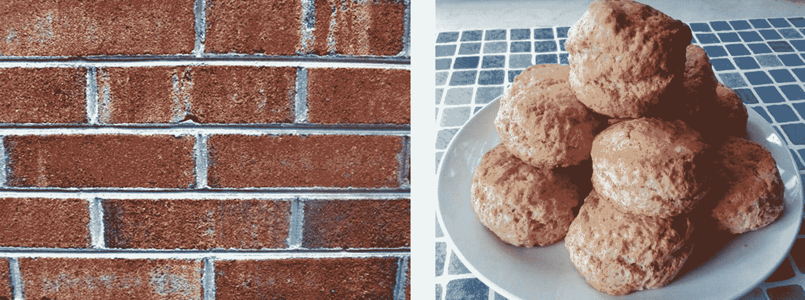
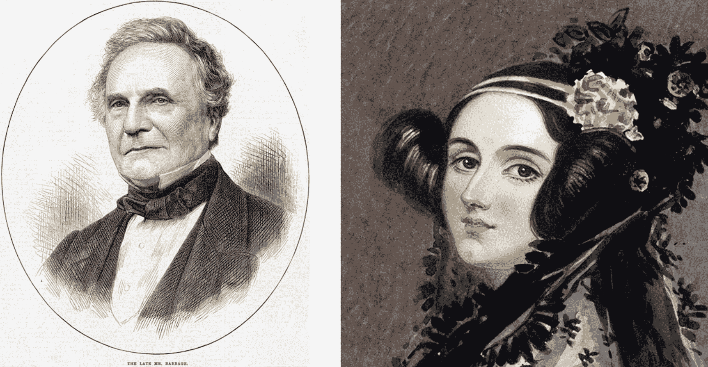
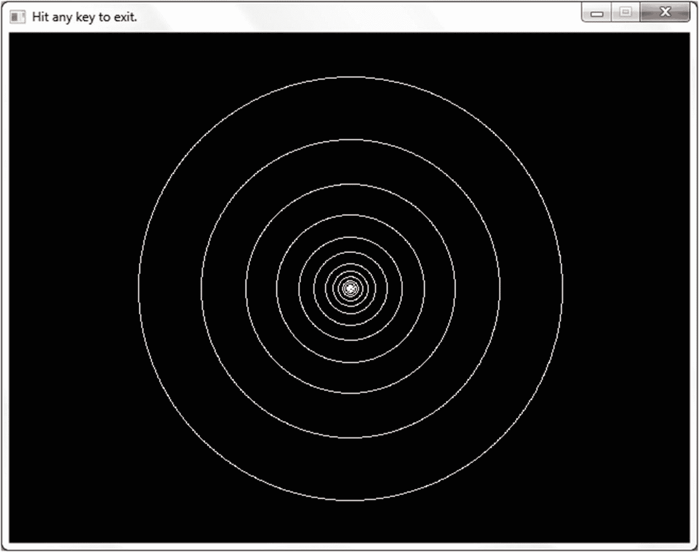
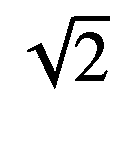
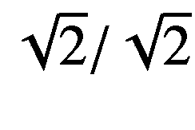
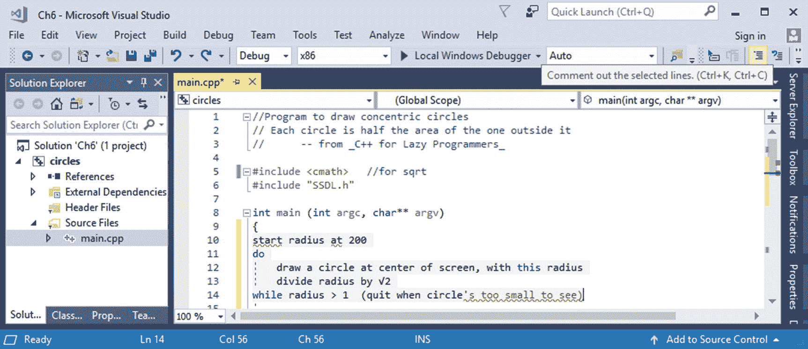
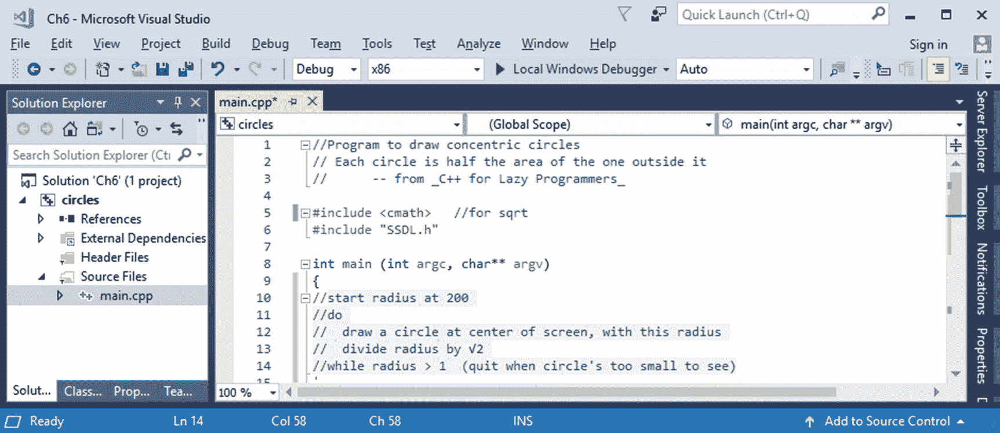

# 6.算法和开发过程

让我们从 C++的细节上退一步，从大的方面考虑一些事情:特别是，考虑大的方面的需要。在以后的生活中，规划没有帮助吗？没有计划，你不会盖房子，也不会做饭。(微波炉加热汤不算。)

在编程中，这个计划被称为*算法*:一系列步骤，按顺序执行，最终达到一个目标。

## 机器人烹饪历险记

想象一下，如果我们能让电脑制作饼干(蓬松的那种——像烤饼，但不甜)。计算机可以遵循指令，但指令必须清晰。

我拿出一个碗，然后…饼干里放了什么？你抓到我了。面粉应该会有帮助。他们不把鸡蛋放在饼干里吗？牛奶呢？告诉机器人把一些面粉倒在碗里，放入几个鸡蛋和一大杯牛奶，尽可能地搅拌，滚动，然后放进烤箱。

当然，他们会硬得像砖头一样。我们的机器人厨师把鸡蛋放了进去——我祖母会笑的——而且搅拌得太多了。我应该先制定一个可靠的计划。



(左)制作不当的饼干通常对建筑业有用。至少当你试着吃它们的时候你会这么认为。(对)我希望做的是

Tip

把算法写在程序之前，哪怕是简单的任务。

我到底应该告诉它做什么？这里有一个选择:

```cpp
1 cup/250 mL all-purpose flour

1/2 tsp/3 mL salt
1/8 cup/30 mL cold shortening
1/3 cup/80 mL milk

Heat oven to 450° F/ 230° C
Mix dry ingredients
Mix in shortening just till it's distributed
Mix in milk
Form into balls
Bake in the oven

```

烤箱加热？检查一下。机器人可以混合干配料。让它取一杯面粉，拌入盐和小苏打。当机器人搅拌它们时，杯子会溢出来。它为什么不把面粉放进碗里？我没有告诉它。

接下来，它会加入起酥油，然后加入牛奶。当然，我们会弄得一团糟。然后它会把这些乱七八糟的东西变成球。多少？我没说。两个可以吗？然后它把渗出的食物放进烤箱，这时食物会从架子上掉到底部……我也没告诉它要用托盘。我也没让它把饼干拿出来！手边有灭火器吗？

步骤不够具体。例如，我告诉它混合，但没有告诉它其中的一个步骤是将东西放入碗中。我们需要更多细节。逐步细化是如何解决这个问题的:写下需要做的事情，然后把这个步骤分解成子步骤，然后把 T2 的那些步骤分解成子步骤，直到这些步骤简单到连计算机都能处理。

Tip

改进你的算法，直到每一行如何转换成 C++变得显而易见。

让我们再试一次:

```cpp
1 cup/250 mL all-purpose flour
1/2 tsp/3 mL salt
1/8 cup/30 mL cold shortening

1/3 cup/80 mL milk

Heat oven to 450° F/ 230° C
Mix dry ingredients:
     Put dry ingredients into a large bowl
     Mix them
Mix in shortening just till it's distributed:
     Cut shortening into small bits (half-centimeter sized)
     Put shortening into the large bowl
     Mix just till it's distributed
Mix in milk:
     Put milk into the large bowl
     Mix till it's distributed
Form into balls:
     Get a cookie sheet
     While there is dough left
         Put flour on your hands so the dough won't stick
         Take out dough the size of a baby's fist
         Put it on the cookie sheet, not touching any others
Bake in the oven:
     Put the cookie sheet in the oven
     Wait till the biscuits are golden brown on top
     Take the cookie sheet and biscuits out

```

很好。现在我们结束了。这是一个冗长的详细算法，但如果我们要让计算机理解，我们必须把它分解，直到它变得显而易见——对计算机来说！–这些步骤意味着什么。

写所有细节很费时间吗？不像在编写代码、出错、调试和一次又一次地重新开始的时候去琢磨同样的细节那么耗时。专家一致认为，花时间提前计划*减少了总体花费的*编程时间。出于这个原因，懒惰的程序员使用以下规则:

Golden Rule of Algorithms

总是写它们。

Extra

阿达·洛芙莱斯女士(1815-1852)和查尔斯·巴贝奇(1791-1871)被认为是世界上第一批计算机科学家。可惜电脑还没有发明出来。



Charles babb age ada lovelace 女士

巴贝奇当然尽力了。他让英国政府资助他的差分机，这本来是一个机械计算器，然后他的分析机，设计成一个机械计算机。(那时候，政府资助研究几乎是闻所未闻的。也许这就是为什么它被称为“发明时代”)当时机器零件不够精细，项目失败了。

洛夫莱斯是诗人拜伦的女儿，她对巴贝奇的机器感兴趣，了解它运行的程序的性质，或者说，如果它存在的话，它会运行的程序的性质。她说:“分析引擎并不自命能创造任何东西。”"它可以做我们知道如何命令它执行的任何事情."这有时被用来反对人工智能的概念。

## 编写程序，从开始到结束

让我们将这种提前计划的事情应用到一个真实的、虽然很小的编程任务中。

以下是我们为某个目标创建程序可能要经历的步骤:

*   确定需求，也就是对目标进行精确的陈述。

*   写算法。

*   手动追踪算法。

*   将算法转换成有效的 C++代码。

*   编译。

*   测试。

如果在此过程中出现错误，我们可以返回到前面的步骤。

### 需求:我们想做什么？

我想做一系列同心圆，使每个圆的面积是它外面那个圆的一半(图 [6-1](#Fig3) )。我们将继续下去，直到他们开始模糊(也许当半径约为 1 个像素)。外圆的半径是，哦，200。



图 6-1

一个制作同心圆的程序，每个圆的面积是下一个更大的圆的一半

准备好开始编码了吗？还没有。首先，我们将制定一个计划，正如上一节所讨论的。

### 算法:我们怎么做？

那么运行时应该发生什么呢？

```cpp
draw the first circle
draw the second
keep going until the circle's too small to see -- radius 1, I'd suppose

```

太明显了？我发现，当我陈述显而易见的事情，把它写下来，并试图提炼它时，编程会变得容易得多。

Tip

陈述显而易见的事情，尤其是在刚开始的时候。

还不够具体。我们不知道如何画圆，因为我们不知道半径。

最外圈的是 200。下一个，如前所述，我希望面积是第一个的一半。记住圆的面积公式:π半径 <sup>2</sup> 。为了得到减半的面积，我们需要下一个圆的面积=第一个圆的面积/2。这就得出下一个半径是第一个半径/ 。

这是修正后的算法:

```cpp
draw the first circle, with radius 200...

```

不，我没说在哪！再试一次:

`draw the first circle at center of screen, with radius 200`

`draw the second circle at center of screen, with radius 200 / √2`

`draw the third circle at center of screen, with radius 200 / √2 / √2...`

太复杂了。

我们*可以*使用变量。我们将半径的值设为 200，并每次都进行更改:

`start radius at 200`

`draw a circle at center of screen, with this radius`

`to get a circle with half the area as before`【T2】`to get a circle with half the area as before`

`keep going until the circle's too small to see -- radius 1, I'd suppose`

“继续”听起来像是我们需要一个循环。我们不知道我们会做多少次，但至少有一次，所以根据循环的黄金法则，这是一次尝试:

```cpp
start radius at 200
do
    draw a circle at center of screen, with this radius

```

`divide radius by` √2

```cpp
while radius > 1  (quit when circle's too small to see)

```

这已经足够具体了。每次写程序都需要这么麻烦吗？差不多吧。随着时间的推移，你的技能提高，你可以指定更少的细节。但是专家仍然为他们不确定的事情写出步骤。

### 追踪算法:行得通吗？

我做的另一件事是手动跟踪算法，看看它做了什么，并确认它做了我想要的。

首先，半径设置为 200。面积为π 200 <sup>2</sup> 。我们用这个半径画一个圆。

接下来，半径被设置为除以的值。面积为π(200/)<sup>2</sup>=π200<sup>2</sup>/2，是第一个面积的一半；这就是我想要的。我们画出新的圆圈。

接下来，半径被设置为除以后的值。面积为π(200/)<sup>2</sup>=π200<sup>2</sup>/4，是第一个面积的四分之一。很好。我们画出新的圆圈。

好像还行。

随着程序变得越来越复杂，检查你的算法将会更加有用。如果一个程序不能完成我们想要的，为什么还要花时间去编译它呢？我懒得做那件事。

### 编码:把它全部放进 C++(加上:评论懒惰的方式)

为了创建程序，我以通常的方式开始:我在文件的顶部告诉读者我正在做什么。然后我把算法放在`main`中，作为注释，这样我就可以把它改进成一个工作程序。

在代码被写成代码之前，编译是没有意义的。因此，我将在接下来的几页中完善它，直到我得到看起来可以工作的东西:

```cpp
// Program to draw 5 concentric circles
//    Each circle is twice the area of the one inside it
//        -- from _C++20 for Lazy Programmers_

#include "SSDL.h"

int main (int argc, char** argv)
{
    // start radius at 200
    // do
    //    draw a circle at center of screen, with this radius
    //    divide radius by sqrt (2)
    // while radius > 1 (quit when circle's too small to see)

    return 0;
}

```

警察没有因为我把算法放进编辑器而逮捕我，所以我想我会继续下去。

Tip

包括程序中的算法，在`//`之后，你已经写了大部分的注释。

编辑可以快速地将文本转换成注释。(这对于使有问题的代码停止生成错误也很有用；把它们放在注释里——“把它们注释掉”——直到你准备好处理它们。)

emacs

:突出显示该区域，选择 C++ ➤注释掉区域对其进行注释；如果需要，按 Tab 键缩进。如果您在 emacs 的非图形版本中，通过在区域的一端按 Ctrl-Space，然后将光标移动到另一端来突出显示该区域。Ctrl-C 会把它变成注释，Tab 会缩进。

(还要注意最后一个很酷 emacs 技巧:突出显示一个区域并按 Tab 键，emacs 立刻缩进该区域。)

Visual Studio

:单击注释掉按钮会将突出显示的代码转换为注释。(它看起来像平行的水平线，并在图 [6-2](#Fig4) 的右上方突出显示。)



图 6-2

“注释掉”按钮突出显示的 Visual Studio 窗口(右上角)

图 [6-3](#Fig5) 显示了注释。



图 6-3

该算法在注释中

现在，您可以按 Tab 键来缩进该区域。

有时，如果一个编辑器为你做了评论，它将使用我们还没有介绍过的评论风格:将评论放在`/*`和`*/`中。那也行得通。

不妨先编写简单的部分:`radius`的声明和循环；

```cpp
int main (int argc, char** argv)
{
    double radius = 200.0;      // start radius at 200

    do
    {
        // draw a circle at center of screen, with this radius
        // divide radius by √2
    }
    while (radius > 1.0);     // quit when circle's too small to see

    return 0;
}

```

现在将中间步骤放入代码中，将算法保留为注释:

```cpp
int main (int argc, char** argv)
{
    double radius = 200.0;    // start radius at 200
    do
    {
        // draw a circle at center of screen, with this radius
        SSDL_RenderDrawCircle (CENTER_X, CENTER_Y, int (radius));

        radius /= sqrt (2);    // divide radius by √2
    }
    while (radius > 1.0);     // quit when circle's too small to see

    return 0;
}

```

看起来我们需要中心点:

```cpp
int main (int argc, char** argv)
{
    const int CENTER_X = SSDL_GetWindowWidth ()/2;
    const int CENTER_Y = SSDL_GetWindowHeight()/2;

    double radius = 200.0;    // start radius at 200
    do
    {
        // draw a circle at center of screen, with this radius
        SSDL_RenderDrawCircle (CENTER_X, CENTER_Y, int (radius));

        radius /= sqrt (2);    // divide radius by √2
    }
    while (radius > 1.0);     // quit when circle's too small to see

    return 0;
}

```

在程序的开始和我们通常的总结中加入一些友好的元素，我们的程序就完成了，并且已经被评论了(例如 [6-1](#PC11) )。

```cpp
// Program to draw concentric circles
//     Each circle is half the area of the one outside it
//     -- from _C++20 for Lazy Programmers_

#include <cmath>   // for sqrt
#include "SSDL.h"

int main (int argc, char** argv)
{
    SSDL_SetWindowTitle ("Hit any key to exit.");

    const int CENTER_X = SSDL_GetWindowWidth ();
    const int CENTER_Y = SSDL_GetWindowHeight();

    double radius = 200.0;   // start radius at 200
    do
    {
        // draw a circle at center of screen, with this radius
        SSDL_RenderDrawCircle (CENTER_X/2, CENTER_Y/2, int (radius));

        radius /= sqrt (2);  // divide radius by √2
    }
    while (radius > 1.0);    // quit when circle's too small to see

    SSDL_WaitKey();

    return 0;
}

Example 6-1A program to draw concentric circles, each half the area of the one outside it. Output is in Figure 6-3

```

注意程序是如何被空行分成算法的主要步骤的。这不是一个要求，但也不是一个坏主意。

Online Extra

“当你找不到开始的方法时”:在 YouTube 频道“以懒惰的方式编程”，或者在 [`www.youtube.com/watch?v=UJK4a623D20`](http://www.youtube.com/watch%253Fv%253DUJK4a623D20) 找到它。

Exercises

1.  写一个算法，求三个数的平均值。

2.  为练习 1 编写相应的程序。

3.  写一个算法，然后写一个程序，通过画很多半径从 0 到某个半径 r 的圆，画一个*填充的*圆，不一定要看起来完全填充。

4.  为一个程序写一个算法，用你可以用 SSDL 画的形状来画澳大利亚国旗、新西兰国旗、埃塞俄比亚国旗、斯堪的纳维亚半岛国旗或其他一些国旗。专注于一个连贯的子任务或重复的子任务。我们将在后续章节中看到更多的标志问题。