# 八、函数·续

关于函数的更多信息:随机数函数、布尔函数、变化的参数和“作用域”——也就是说，变量在哪里可以被看到和使用取决于它在哪里被声明。

## 随机数

> 当然，任何考虑用算术方法产生随机数的人都是有罪的。
> 
> FORTRAN 语言的发明者约翰·冯·诺依曼(Goldstine，1972 年)

随机数不只是对游戏有用。它们对模拟很有用——预测一些系统的平均行为——对科学计算也很有用。你可以告诉人们这就是你研究他们的原因。它不是用来玩的。诚实。

但是计算机是有序的机器。正如冯·诺依曼所知，他们不能真的制造随机数。我想你可以像扔硬币一样扔一个，看看它是怎么落地的，但是你怎么在它上面玩纸牌呢？

### 制作随机数生成器

所以我们要做的是制造一个数字序列，在人类观察者看来*看起来*是随机的——但是如果你知道计算机是如何做到的，它们实际上是完全可以预测的。

回想一下第 3 章中的`%`操作符，叫做“模数”，意思是“除取余数”例如，`36%10`给我们 6，因为如果你把 36 除以 10，余数是 6。

还要记住`A += B`的意思是`A = A+B`；`*=`和`%=`的定义相似:

```cpp
int rand ()      // Return a pseudo-random integer
{
    static unsigned int seed                =    76;
    static constexpr unsigned int INCREMENT = 51138;
    static constexpr unsigned int MULTIPLIER= 21503;
    static constexpr unsigned int MODULUS   = 32767;

    seed += INCREMENT;
    seed *= MULTIPLIER;
    seed %= MODULUS;

    return seed;
}

```

这里的`static`关键字意味着这些变量将被创建一次，即第一次调用函数时，并且只要程序在运行，这些变量将一直存在。通常，每次调用函数时，都会重新创建函数中的变量。但是我们希望`seed`不时被记住，这样我们就可以根据之前发生的事情，为每个呼叫得到不同的答案。我们还将使`constexpr` s `static`不需要在每次调用函数时重新初始化。

假设 seed 从，哦，76 开始。加上那个`INCREMENT`；乘以`MULTIPLIER`；然后除以`MODULUS`，取余数。新的价值是什么？你不能在脑子里这么做吗？

其他人也不能。如果你一次又一次地调用这个函数，你会得到一个不经过计算就无法预测的大数序列。看起来是随机的；不是:21306 20152 10309 31100…

通常我们不想要这么大的数字。没问题。我们可以很容易地将它们降低到一个可管理的范围，就像这样:

```cpp
int numberLessThanTen = rand()% 10;

```

这给了我们一个 0-9 之间的数，因为除以 10 后的最大余数是 9。

```cpp
int oneThroughTen = rand()%10 + 1;

```

现在我们有 1–10:7 3 10 1 6…

就是这么做的。

我们还需要一样东西。我们总是想从同一个数字 76 开始吗？如果我们这样做，我们将得到一个明显随机的数字序列…但它将永远是相同的序列！如果我们在做一个纸牌游戏，我们选择的那些牌将总是相同的，顺序相同的。

你可能见过*向*要种子的游戏。如果其中一个选项是“选择游戏”，你给它一个数字，你所做的就是初始化随机数生成器的种子。示例 [8-1](#PC4) 修改了代码以支持这一点。

```cpp
unsigned long int seed;          // Current random number seed

void srand (unsigned int what)   // Start the random number generator
{
    seed = what;
}

int rand ()                      // Return a pseudo-random integer
{
    static constexpr unsigned int INCREMENT = 51138;
    static constexpr unsigned int MULTIPLIER= 21503;
    static constexpr unsigned int MODULUS   = 32767;

    seed += INCREMENT;
    seed *= MULTIPLIER;
    seed %= MODULUS;

    return seed;
}

Example 8-1A complete random number generator

```

你叫`srand`(“s”代表“种子”？为了“开始”？任一个为我工作)开始你的序列。对`rand`的后续调用获得序列中的下一个数字，然后是下一个，依此类推。

现在，这有一个严重的缺点:变量`seed`被声明在任何函数之外。这意味着整个程序中的任何函数都可能把它弄糟。我们尽可能避免使用全局变量——但是在这种不寻常的情况下，没有其他好的方法。`srand`和`rand`都需要访问。

我现在肯定在淘气名单上了。抱歉，圣诞老人。

### 使用内置的随机数生成器

好消息:除了我们，其他程序员都想要伪随机数！所以示例 [8-1](#PC4) 中显示的函数是你的编译器自带的。以下是如何使用它们:

```cpp
#include <cstdlib>    // for srand, rand

int main (int argc, char** argv)
{
    srand (someNumber);      // start random number generator
    int num = rand()%10 + 1; // pick a random # 1..10
    ...

```

`cstdlib`代表“C 标准库”`cstdlib`赋予我们`rand`、`srand`等函数。

我对那件事不太满意。它是从哪里来的？我们总是可以让用户通过输入种子来选择游戏，但是这需要用户做更多的工作。

更好:从电脑上获取号码。但是我们怎么能确定它每次都给我们不同的答案呢？

咨询时钟。

每次重启程序，时间都不一样。如果我们能给`srand`一个基于时间的数字，我们每次都会得到不同的序列。

以下是如何:

```cpp
#include <cstdlib> // for srand, rand
#include <ctime>   // for time

int main (int argc, char** argv)
{
    srand 

((unsigned int) (time (nullptr)));
   ...

```

`ctime`包含一个函数`time`，该函数返回自格林威治标准时间 1970 年 1 月 1 日午夜以来的秒数。我们不在乎起点，但我们在乎答案每一秒都不一样——所以我们会得到不同的游戏。

它以一个`time_t`的形式返回时间，这是某种类型的`int`。`srand`要`unsigned int`；我们转换它，这样编译器就不会给我们一个警告。

不用担心`nullptr`是什么意思；我们稍后会谈到这一点。

**的黄金法则`srand`**

 **称之为*一次*，从而`srand (time (nullptr));`。

如果你多次调用它，你将多次重置“随机”数字序列——你得到的前几个“随机”数字(直到第二个改变)将是相同的。我试过这个(见例 [8-2](#PC8) )得到这个结果:

```cpp
for (int i = 0; i < 100; ++i)               // Print a bunch of random #'s
{
    srand ((unsigned int) (time(nullptr))); // WRONG!
    sout << rand() % 10 << ' ';
}

Example 8-2Repeating srand and what it gets you

```

```cpp
8 8 8 8 8 8 8 8 8 8 8 8 8 8 8 8 8 8 8 8 8 8 8 8 8...

```

调用`srand`一次；这就是你所需要的。

作为正确做事的一个例子，让我们尝试一个程序，它像在双骰子游戏中一样掷出几个骰子，并告诉你怎么做。在第一次尝试中，如果你得到 2、3 或 12，你就输了。7 或 11 胜。任何其他数字都是您进行更多下注的“点数”。

算法:

```cpp
main:
    start things up with srand
    roll 2 dice
    print what you rolled
    print what happens to your bet
    wait for user to hit a key

```

我们如何掷骰子？一个合理的问题。

```cpp
roll die:
    pick a random number 1 to 6.

```

我该怎么做？如前所述，除以范围，取余数，然后加上 1:

```cpp
roll die:
    return rand () % 6 + 1

```

程序在示例 [8-3](#PC12) 中，输出在图 [8-1](#Fig1) 中。

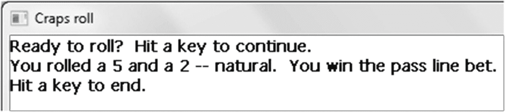

图 8-1

骰子程序的可能输出，示例 [8-3](#PC12)

```cpp
// One step in a game of craps
//       -- from _C++20 for Lazy Programmers_

#include <ctime>    // for time function
#include <cstdlib>  // for srand, rand
#include "SSDL.h"

constexpr int SIDES_PER_DIE = 6;1

int rollDie ();              // roll a 6-sided die

int main (int argc, char** argv)
{
    srand ((unsigned int) (time (nullptr)));
                                // This starts the random # generator
                                // It gets called once per program

    SSDL_SetWindowTitle ("Craps roll");

    sout << "Ready to roll?  Hit a key to continue.\n";
    SSDL_WaitKey ();

    int roll1 = rollDie (), roll2 = rollDie ();
    sout << "You rolled a " << roll1 << " and a " << roll2;

    switch (roll1 + roll2)
    {
    case  2:
    case  3:
    case 12: sout << " -- craps. You lose the pass line bet.\n";
             break;
    case  7:
    case 11: sout << " -- natural. You win the pass line bet.\n";
             break;
    default: sout <<", so " << roll1 + roll2 << " is your point.\n";
    }

    sout << "Hit a key to end.\n";
    SSDL_WaitKey();

    return 0;
}

int rollDie ()
{
    int result = rand() % SIDES_PER_DIE + 1;

    return result;
}

Example 8-3A program to do a craps roll, illustrating srand and rand

```

### 防错法

调试时，**你可能每次都要相同序列的伪随机数**；如果事情出错了，你希望每次都以同样的方式出错，这样你就可以解决它。为了实现这一点，用`srand (someInteger)`替换`srand (time (nullptr))`，直到它被调试完毕。

现在，有些事情可能会出错:

*   你一遍又一遍地得到同一个随机数。见`srand`的黄金法则。

    Exercises For these exercises, please use the “How to write a function” steps from Chapter 7\.

    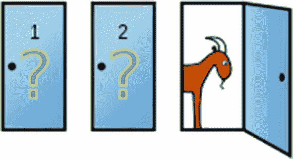

    1.  On paper, write what you think a sequence of 20 coin flips might be. Then write a program that flips coins and tells the user what the results are. Output might look like this:

        ```cpp
        How many coins do you want to flip? 20
        Here are the results: HTTHTHHHTTHHTTTTTHHT
        That's 9 heads and 11 tails.

        ```

        序列看起来像你期望的那样吗？

    2.  掷出 6 之前，你需要掷出多少次六面骰子？编写一个算法，然后编写并测试一个程序，直到它滚动并报告它需要的次数。

        现在做一千次，报告平均值。

    3.  用一个骰子与电脑或另一个玩家对弈，直到有人出局。你可以在维基百科或其他地方找到这些规则。

    4.  欢迎来到*价格合适*，快下来吧！我们这次的任务是找到经典的“蒙蒂霍尔”问题的正确答案。

    你可以在 1 号门、2 号门和 3 号门之间进行选择。一辆后面是保时捷和一个南太平洋岛屿的清晰所有权；在另外两个后面是一周前的比萨饼、一只山羊和盒装通心粉和奶酪。虽然拒绝芝士通心粉很难，但你的心已经放在了保时捷和小岛上。

    你选一扇门。然后主人打开另一扇门，一扇后面没有奖品的门。(如果你选错了，他会打开另一扇没有奖品的门。如果你选对了，他会随机选择一扇没有奖品的门。)他给你提供了一个交换的机会。

    你应该吗？

    写一个程序来模拟整个过程，并做很多次。(什么是合理的大数？你决定。)确保做好每一部分，一直到识别玩家切换到的门，并将其与后面有奖品的门进行比较。(简化问题可能是正确的，但简化可能会让你犯错。此外，找到一种识别被切换到的门的方法也很有趣。)

    如果你换了，你赢的几率是多少？如果是 50%或者接近 50%，那一定没关系。

    这重要吗？

    Extra

    蒙蒂霍尔问题是一个经典的概率问题，曾因《游行》杂志“问玛丽莲”专栏的高智商作者玛丽莲·沃斯·莎凡特而流行开来。她给出了正确的答案…然后随着人们不断地写进来，写了更多的专栏。为了找到答案，一个小学班级尝试运行这个场景几次(大概是在没有电脑的情况下)。几个数学教授，给出了他们的名字和所属单位，写信要求她放弃，并评论道“你搞砸了！”和“你是山羊！”多尴尬啊——对他们来说。

## 布尔函数

我们以前有函数返回 true 或 false 值:`isupper`，例如，在第 5 章。示例 [8-4](#PC14) 展示了我会如何写它。

```cpp
bool isupper (char ch) // returns whether ch is an upper-case letter
{
    bool result;

    if (ch >= 'A' && ch <= 'Z')
        result = true;
    else
        result = false;

    return result;
}

Example 8-4My own isupper, a Boolean function

```

所以如果`ch`在大写范围内，它返回`true;`否则返回`false`。另一方面，在下一个版本中…如果`ch`在大写范围内，则返回`true`；否则`false`。他们做着完全相同的事情:

```cpp
bool isupper (char ch) // returns whether ch is an upper-case letter
{
    return ch >= 'A' && ch <= 'Z';
}

```

我喜欢短的那个。挑一个你觉得更清晰的。

Exercises

1.  写一个函数`inRange`,给定一个数字和一个上下界，告诉我们这个数字是否在上下界之间。通常情况下，它不会打印任何内容，但会返回答案。`main`可以做打印。

2.  写一个算法，然后写一个函数，这个函数在屏幕上显示“是”和“否”的方框；另一个等待鼠标单击，如果单击了“是”框，则返回 true，如果没有单击，则返回 false，如果单击在两个框之外，则继续等待。然后编写一个程序演示这些函数的用法。

3.  将前面练习中的函数添加到第 5 章“`char` s 和`cctype`”部分练习 1 中的魔法生物分类器程序中，这样用户可以点击而不是键入他/她的回答。

## `&`参数

如果您希望函数提供多个值，该怎么办？改变一个变量。一个函数只能返回一个东西。 <sup>[2](#Fn2)</sup>

打个糖果制造机的比方，你只能吐出一种产品。我们需要一种不同的机器:一种能接收一种或多种糖果并对其进行改变(烘烤、冷冻等等)的机器。

我想要的函数是一个可以交换值的函数:`swap (x, y)`应该使`x`成为`y`的样子，`y`成为`x`的样子。这是我的第一次尝试:

```cpp
void swap (int arg1, int arg2)
{
    arg1 = arg2; arg2 = arg1;
}

```

追踪这个。图 [8-2](#Fig2) 显示了我们在这个过程中这些变量的状态。假设这些值最初是 5 和 10。

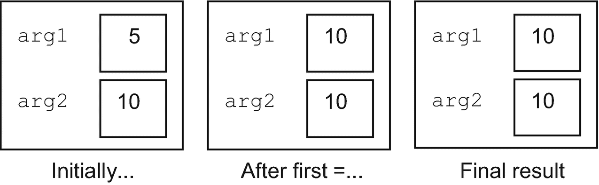

图 8-2

`swap`发生了什么:第一次尝试

变量就像一个盒子，里面有一个值，但只有一个值。如果你想交换你手中的东西，你会怎么做？你会找到一个地方来放置其中一个物体——一个临时存放区。如果计算机要交换，它也需要第三个位置:一个临时变量。这应该可行(参见图 [8-3](#Fig3) ):

```cpp
void swap (int arg1, int arg2)
{
    int temp = arg1; arg1 = arg2; arg2 = temp;
}

```

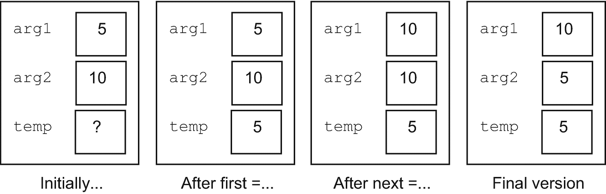

图 8-3

第二次尝试

现在让我们看看当我们调用它时会发生什么:

```cpp
int main (int argc, char** argv)
{
    int x=5, y=10;

    swap (x, y);

    ...
}

```

我们从`main`(图 [8-4](#Fig4) )开始。

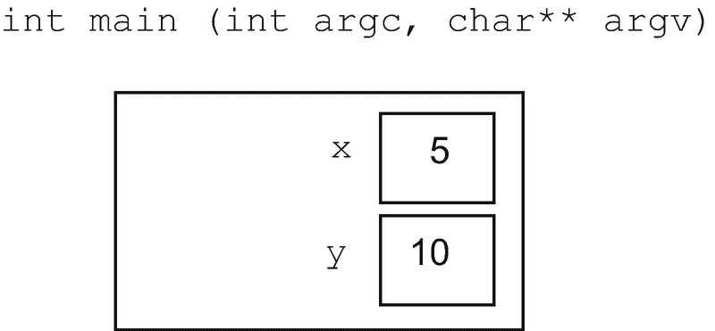

图 8-4

`main`在调用`swap`之前

然后我们叫`swap`。编译器创建了一个`swap`函数的实例——它包含的变量和它需要知道的任何其他东西，将来自`main`的变量复制到参数中(图 [8-5](#Fig5) )。

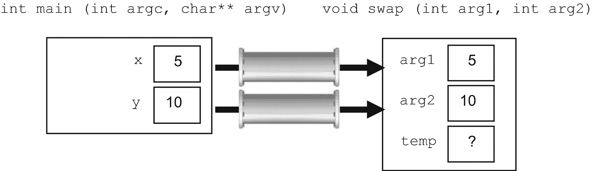

图 8-5

`swap`开始

我们经历与之前相同的过程，成功地交换了`arg1`和`arg2`(图 [8-6](#Fig6) )。

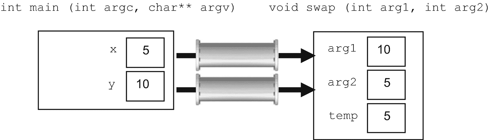

图 8-6

`swap`完成

现在我们已经完成了`swap`，所以它可以消失了(图 [8-7](#Fig7) )。

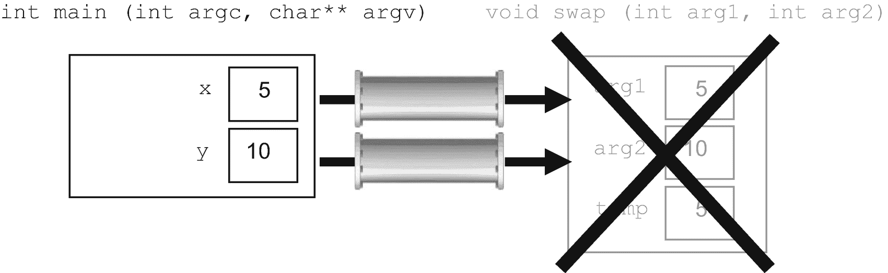

图 8-7

`swap`消失了

我想那很有趣，但是……我们不是应该在`main`中改变`x`和`y`吗？

相反，我们改变了`swap`的局部变量`arg1`和`arg2`。当 swap 离开时，他们也离开了。

解决的办法是**把** `&` **放在参数**中的类型后面。这使得`arg1`和`arg2`不是传递进来的副本，而是临时别名:`arg1` *就是* `x`，只要我们在调用`swap`。一个表示与号，一个表示别名。

```cpp
void swap (int& arg1, int& arg2)
{
    int temp = arg1; arg1 = arg2; arg2 = temp;
}

```

这里是另一个演练，从图 [8-8](#Fig8) 开始。

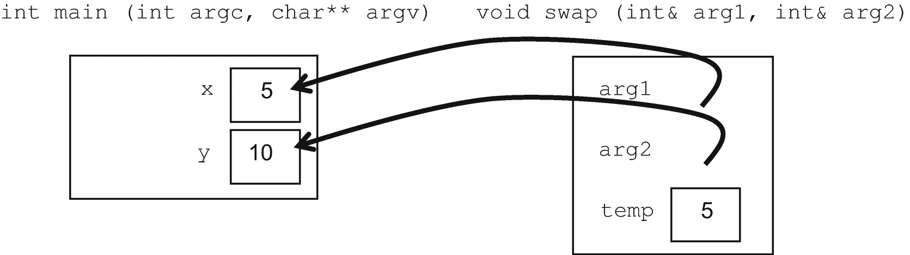

图 8-8

使用`&`参数调用`swap`

既然`arg1` *是*`x``arg2`*是* `y`，那么我们对`arg1`和`arg2`所做的，就是真正对`x`和`y`所做的。所以`x`和`y`真的变了(图 [8-9](#Fig9) )。

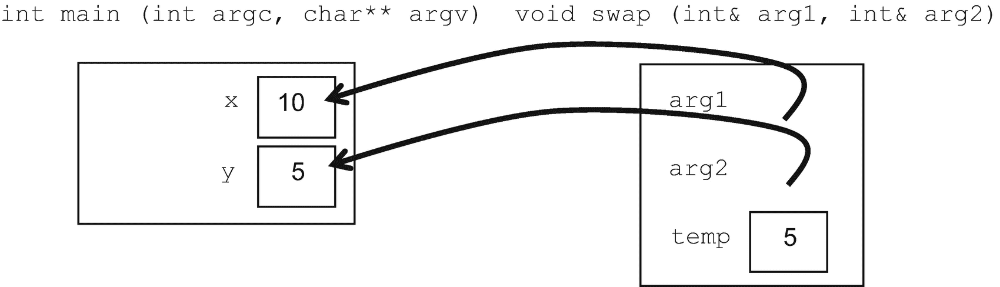

图 8-9

`swap`现在居然互换了！

函数完成并消失(图 [8-10](#Fig10) )，交换`x`和`y`。

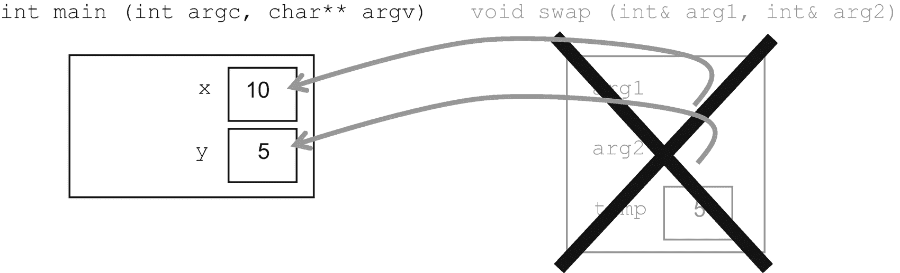

图 8-10

`swap`完整(且正确)

一般来说，什么时候应该用`&`从函数中获取一个值，什么时候使用`return`语句？现在，如果你正好有一个值要返回，使用`return`。如果你有多个值，你需要一个带`&`的参数表。

Golden Rule of Function Parameters and

`return` **(第一版)**

如果函数没有向调用函数提供任何信息，那么它的返回类型是`void`。

如果它提供了一条信息，那么它的返回类型就是这条信息的类型。

如果它提供了多个片段，那么它的返回类型是`void`，这些片段是通过使用`&`的参数列表提供的。

### 防错法

*   **该函数似乎改变了它的参数；但是当你离开这个函数时，它们是不变的。**这是因为忘记了`&`——一个常见且令人抓狂的错误。

Exercises

1.  编写算法，编写一个函数，在屏幕上生成一个随机位置，并提供给调用它的函数。然后用它在随机位置用星星(点)填充窗口。运行几次，以确保您不会总是得到相同的模式。

2.  写一个函数使颜色变深。方法如下:将红色、绿色和蓝色各切一半。这意味着你必须对红色、绿色和蓝色的`int`值进行处理，而不是对`SSDL_CreateColor`提供的`SSDL_Color`进行处理。然后使用此函数制作一系列逐渐变暗的点。询问用户初始值。

3.  写一个函数解二次公式。解决方案是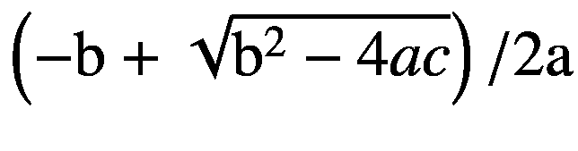和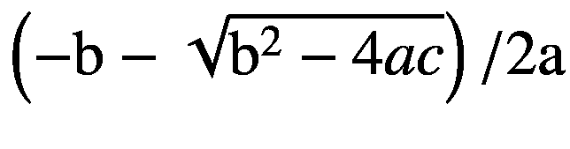(平方根前的符号是差)。这相当于两个解，或者一个解(如果两个解相同)，或者零个解(如果我们取 b<sup>2</sup>4ac 的平方根的东西是负的)。所以给主程序提供解*和*一个参数，表示有多少个解。(如果有 0，则解决方案的内容无关紧要。)

## 标识符范围

标识符的**范围**(变量名、函数名或一些其他定义的名称)是它有意义的区域。

考虑一下`swap`的例子。在图中，我们看到`x`和`y`在`main`里面(因为它们是)；我们看到`arg1`、`arg2`和`temp`在`swap`里面(因为他们是)。函数内部的变量不能被其他函数看到或干扰。这意味着外部代码*不能*搞乱它们。这就是模块化:将不同的东西分开，主要是为了安全。

为了进一步了解作用域，再次考虑例子 [8-3](#PC12) :一个掷骰子的程序。它有两个函数，`main`和`rollDie`。这里是一个回顾:

```cpp
// One step in a game of craps

//      -- from _C++20 for Lazy Programmers_

...

constexpr int SIDES_PER_DIE = 6;

int rollDie ();             // roll a 6-sided die

int main (int argc, char** argv)
{
    ...
    int roll1 = rollDie (), roll2 = rollDie ();
    sout << "You rolled a " << roll1 << " and a " << roll2;

    ...

    return 0;
}

int rollDie ()
{
    int result = rand() % SIDES_PER_DIE + 1;

    return result;
}

```

定义可以进成对的花括号，但是不能出来(见图 [8-11](#Fig11) )。这就像一个鸭百叶窗:如果你在百叶窗里，你可以看到外面的东西，但他们看不到你。每个人都可以看到`SIDES_PER_DIE`，因为它在一切之外，定义总是可以进去；`rollDie`可以用，`main`也可以。除了它的主人`rollDie`，没有人能看到`result`，因为它不能离开声明它的`{}`。同样，除了`main`外，没有人能看到`roll1`和`roll2`。

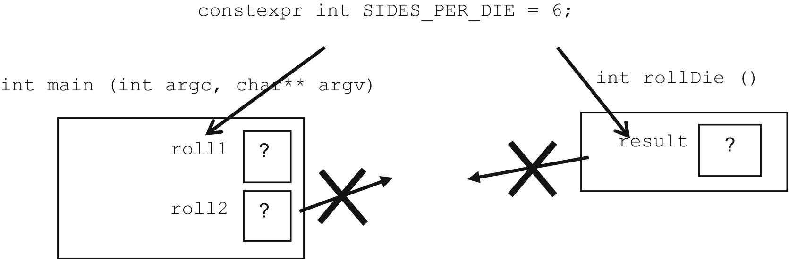

图 8-11

标识符范围。在`{}`之外的定义可以在它们内部看到；里面的定义外面看不到。试图引用它们会得到类似“未找到标识符”或“未声明”的结果

这是有道理的。`SIDES_PER_DIE`是每个人的事。`roll1`和`roll2`是`main`的事，不关别人的事。`result`在`rollDie`建设期间，是`rollDie`的事(虽然结束后会向`main`汇报)。

那么函数是如何共享信息的呢？通过参数表和`return`语句。

Golden Rule of Identifier Scope

在声明标识符的`{}`之外看不到标识符。

## 关于算法的最后一点说明

通过我们的练习，我们继续为我们在第六章中建议的任何事情编写算法。我不会一直把提醒放进去，但我现在会做一个总括声明:最好养成习惯。跳过这一步感觉很懒，但总体来说工作量更大，所以懒的地方在于:解决算法编写这一步怎么做的问题。那么编码就可以相对容易。

<aside aria-label="Footnotes" class="FootnoteSection" epub:type="footnotes">Footnotes [1](#Fn1_source)

全局变量，没有；全局*常量*，是的，因为没有什么可以把它们弄乱。我们通常把它们放在靠近顶部容易找到的地方。

  [2](#Fn2_source)

直到第 20 章。

 </aside>**