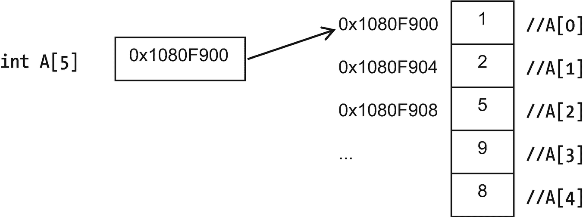
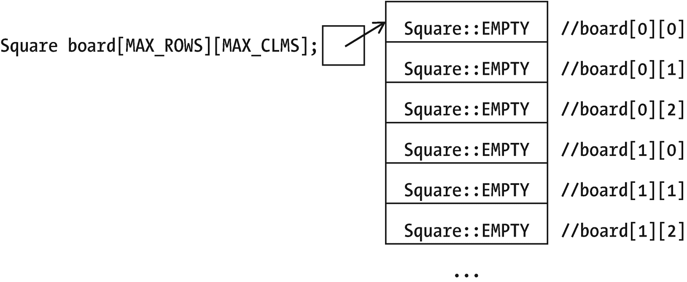
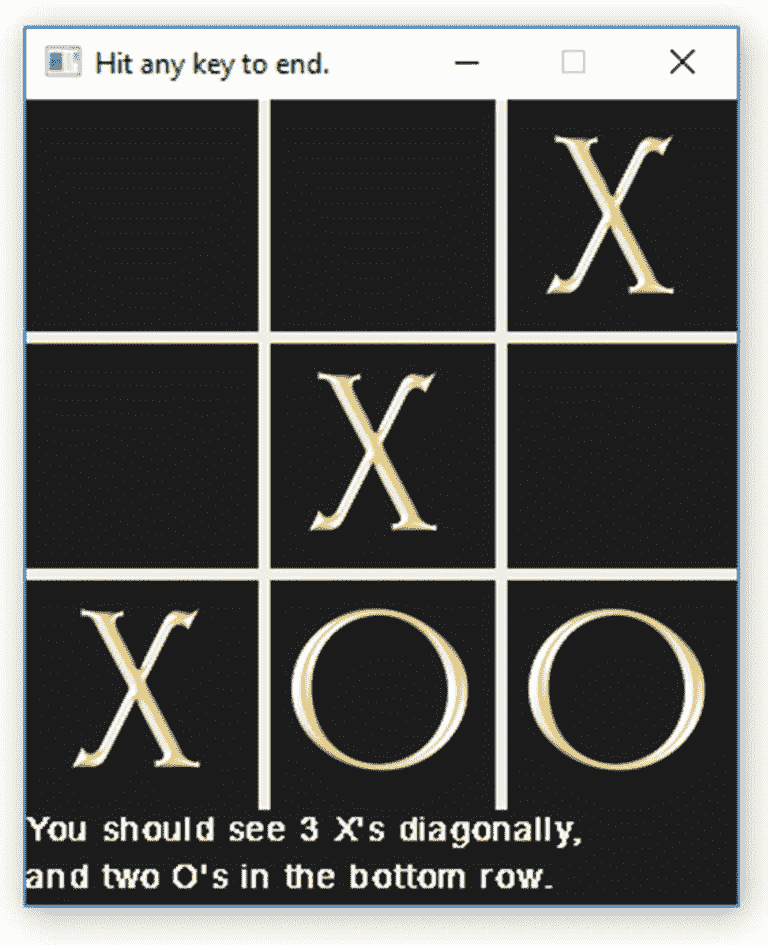
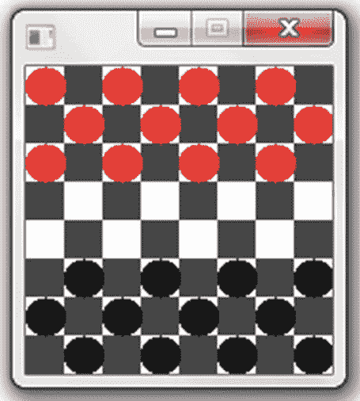
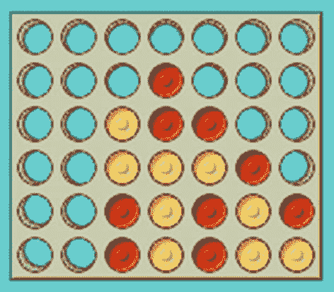

# 10.数组和`enum`

本章包括:数值序列(数组)、枚举类型、天气数据和棋盘游戏。

## 数组

“如果你不喜欢这些地方的天气，”老前辈眼睛一闪，说道，“等几分钟。”

让我们看看他是不是对的。我们将以一分钟为间隔测量十次温度，并观察其变化。我会这样开始:

```cpp
double temp1; sout << "Enter a temperature: "; sin >> temp1;
double temp2; sout << "Enter a temperature: "; sin >> temp2;
double temp3; sout << "Enter a temperature: "; sin >> temp3;

```

那很快就过时了。也许有更好的方法来存储十个数字。这是:

```cpp
constexpr int MAX_NUMBERS = 10;

double temperatures[MAX_NUMBERS]; // an array of 10 doubles

```

数组的 BNF 语法是 *<基类型> <数组名称>* `[` *<数组大小>*`]`；其中 *<基类型>* 是你想要的数组， *<数组大小>* 是你想要的数量。数组大小应该是一个常量整数。

现在我们有一个`temperatures`数组，从第 0 个<sup>的</sup>开始，到第 9 个<sup>的</sup>结束。(C++ 从 0 开始计数。)

要使用数组的一个元素，只需说出:

```cpp
temperatures[3] = 33.6;
sout << temperatures[3];

```

`temperatures`是一个由`double`组成的数组，所以你可以在任何可以使用`double`的地方使用`temperatures[3]`——因为这就是它。

注意这里，`[]`中的数字不是数组的大小——那只是在声明中！而是你想要哪种元素。这个“index”应该是类似于`int`的某种可数类型，我们通常用`int` s:

```cpp
// Get the numbers
for (int i = 0; i < MAX_NUMBERS; ++i)
{
    sout << "Enter a temperature: ");
    ssin >> temperatures[i];
}

```

For 循环是处理数组的一种自然方式，因为它们可以很容易地遍历每个元素。这个循环从 0 开始，只要`i`小于 10 ( `MAX_NUMBERS`，就一直循环下去，所以我们会看到`temperatures[0]`、`temperatures[1]`等等，一直到`temperatures[9]`——都是 10。

你习惯了这样计数:一个 N 元素的数组从第 0 个<sup>开始，到第 N-1 个<sup>结束。也许你很快就会从 0 开始你的待办事项列表。</sup></sup>

示例 [10-1](#PC5) 是一个用于读入和传回温度的完整程序。

```cpp
// Program to read in and print back out numbers
//              -- from _C++20 for Lazy Programmers_

#include "SSDL.h"

int main (int argc, char** argv)
{
    constexpr int MAX_NUMBERS = 10;

    sout << "Enter " << MAX_NUMBERS
         << " temperatures to make your report.\n\n";

    double temperatures [MAX_NUMBERS];

    // Get the numbers
    for (int i = 0; i < MAX_NUMBERS; ++i)
    {
        sout << "Enter the next temperature: ";
        ssin >> temperatures[i];
    }

    // Print the numbers
    sout << "You entered ";
    for (int i = 0; i < MAX_NUMBERS; ++i)
        sout << temperatures[i] << ' ';

    sout << "\nHit any key to end.\n";

    SSDL_WaitKey ();

    return 0;
}

Example 10-1Reading/writing a list of numbers using an array

```

我们通常初始化变量。下面是如何使用数组实现这一点:

```cpp
// where MAX_NUMS = 4...
double Numbers[MAX_NUMS] = {0.1, 2.2, 0.5, 0.75};1

```

不幸的是，括号中的列表只在初始化时有效。我们以后不能将`Numbers`设置为一组括号中的值。我们必须一次处理一个元素，可能会使用 for 循环，就像示例 [10-1](#PC5) 中那样。

我不需要将`MAX_NUMS`放在`[]`中，因为 C++ 可以计算值并推断大小:

```cpp
double temperatures[] = {32.6, 32.6, 32.7, 32.7, 32.7,
                         32.7, 32.7, 32.7, 32.7, 32.7};
    // I think the old guy was messing with us

```

如果给的值太少，它会用 0 填充其余的值: <sup>[2](#Fn2)</sup>

```cpp
double temperatures[MAX_NUMS] = {};// If it's really 0's,
                                   //   I hope we're using Fahrenheit

```

### 数组的肮脏小秘密:使用内存地址

数组不像其他变量那样存储在内存中。

数组变量实际上是一个地址:包含元素的内存块的地址。当你声明一个数组时，这使得计算机做这些事情:分配数组变量(图 [10-1](#Fig1) 左图)；分配一块内存来存储元素(右图[10-1](#Fig1))；并将第 0 个元素的地址，即该块的开始地址，放入新的数组变量中。 <sup>[3](#Fn3)</sup>



图 10-1

数组在内存中的存储方式

这就是 C++ 从数组索引 0 开始的原因。为了计算第`i` <sup>个</sup>元素的地址，它将`i*` `sizeof` `(int)`，即`i`乘以一个`int`的大小，添加到数组的位置。如果你从 1 开始，那就得加上(`i-1)*sizeof(int)`)。C++，尤其是它的祖先 C，喜欢尽可能高效地做事，即使在过程中牺牲了一些清晰性。

那么在图 [10-1](#Fig1) 中，数组大小存储在哪里呢？如何查询以后是否需要？

我不能。C++ 在分配内存时使用数组大小，但是之后，如果你想要那个数字——比方说，为了确保你不会在数组中走得太远——你必须自己跟踪它(目前)。如果您声明了一个包含五个元素的数组，并试图访问第五个元素(因为 C++ 使用基于 0 的计数，所以第五个元素不存在)，*它会让您*。这意味着你正在读取一大块内存，而这些内存是用来做其他事情的。

如果像在`A[5] = 0`中那样写入那块内存，情况会更糟。如果这样做，可能会覆盖构成其他变量的数据。

### 防错法

*   你的循环在数组中超出了一个元素。我敢打赌，比较运算符是罪魁祸首——通常都是这样！变化

    `for (int i = 0; i` **< =** `N; ++i)`

    到

    `for (int i = 0; i` **<**

*   变量的值改变了，但你没有告诉它。你可能对一个数组使用了太大的索引，从而覆盖了一个*不同的*变量。

*   **你的程序崩溃(停止运行)。**在 Unix 中，你得到`Segmentation fault: core dumped`。在其他地方，您可能会看到一个窗口，显示“<您的程序>已经停止工作”或者(在 Visual Studio 中)“抛出异常”

    此时一个可能的原因是…使用了一个对数组来说太大的索引。

Exercises

在下文中，如果出现问题，一定要使用调试器。

1.  编写一个程序，从用户那里获得一周的所有七个每日高温和每日低温，并告诉用户哪一天有最低低温和最高高温。

2.  做同样的程序，但不要问用户；使用`{}`初始化数组。

3.  给定一个`char`的数组(使用`{}`初始化)，报告字符是否按字母顺序排列。

4.  读入一个整数列表，并反向打印出来。

## 作为函数参数的数组

当我想把一个变量传递给一个函数时，我所做的就是复制声明(没有分号)并用它来定义参数。也就是说，为了声明`x`，我会写`int x;`，所以如果我想把`x`发送到函数`f`，我会写`void f (int x);`。

数组也是如此:

```cpp
void f (int myArray[ARRAY_SIZE]);

```

示例 [10-2](#PC10) 显示了在数组中查找最小温度的函数。

```cpp
double lowestTemp(double temperatures[MAX_NUMBERS])
// returns lowest entry in temperatures
{
    double result = temperatures[0];

    for (int i = 0; i < MAX_NUMBERS; ++i)
        if (temperatures[i] < result)
            result = temperatures[i];

    return result;
}

Example 10-2lowestTemp, taking an array and returning its smallest element

```

这就是所谓的

`sout << "The lowest temp was " << lowestTemp (temperatures);`

根据我们目前所知，让一个函数返回一个数组是不可能的。现在我们只是把它们作为参数传入。

### 改变或不改变的数组参数

我不必对数组使用`&`，即使我想改变数组的内容。原因如下。

记住一个数组变量并不是所有不同的元素；是 0 号的地址(见图 [10-1](#Fig1) )。如果你不使用`&`，你不能改变它——这没问题。我们不想改变*地址*；我们只想改变*的内容*——它们不是传入的东西！随心所欲地修改它们——当函数返回时，你的修改就会出现。

你可能会说，“这难道不违反安全吗？如果被调用的函数改变了它们，而它们本不应该被改变，那该怎么办？”说得好。解决方法如下:

```cpp
double lowestTemp (const double temperatures[ARRAY_SIZE])
// returns lowest entry in temperatures
{
   ...

```

将数组声明为`const`可以确保`lowestTemp`不能改变它的元素——这是一个需要养成的好习惯。

### 数组参数和可重用性

因为 C++ 不关心你的数组有多大，当你把它传递给一个函数时，它完全忽略了在`[]`之间给定的大小。C++ 不在乎。*这意味着相同的函数可以用于相同基类型的任何数组，而不管大小如何。*

这里有一个版本的`lowestTemp`,它不会把你限制在某个特定的尺寸:

```cpp
double lowestTemp (const double temperatures[], int arraySize)
// returns lowest entry in temperatures

{
   bool result = temperatures[0];

   for (int i = 0; i < arraySize; ++i)
       ...
}

```

现在让我们更加灵活。正如第七章所建议的，让你的函数通用化、通用化，从而可重用是很好的。我们称之为`lowestTemp`的函数没有理由只对温度起作用。更一般地编写它，如示例 [10-3](#PC13) ，你可以在另一个程序中使用它。代码重用，耶。

```cpp
double minimum(const double elements[], int arraySize)
// returns lowest entry in elements
{
    double result = elements[0];

    for (int i = 0; i < arraySize; ++i)
        if (elements[i] < result)
            result = elements[i];

    return result;
}

Example 10-3minimum, a function that can be used for any double array, any size

```

### 防错法

*   函数调用时，编译器报错“从 int 到 int*的无效转换”或“int 到 int[]”。它需要一个数组，但只得到一个值。我们不是给了它一个数组吗？在这个例子中

    `minimum (temperatures[NUMTEMPS], NUMTEMPS);`

    …我没有。我给了它`NUMTEMPS` <sup>th</sup> 温度，不管那是什么。

    这个问题是混淆了`[]`的两种用法。当声明时，在`[]`之间的是数组大小。在其他时候，它是我们想要访问的元素。

    由于数组的名称是`temperatures`，而不是`temperatures[NUMTEMPS]`，我将把它传入:

    `minimum (temperatures, NUMTEMPS);`

Golden Rule of [ ] for Arrays

在数组引用中的`[]`之间是你想要的元素(除了在声明的时候——然后是数组的大小)。

Exercises

在这些练习中，如果出现问题，记得使用您最喜欢的调试器。

1.  编写一个`maximum`函数来对应示例 [10-3](#PC13) 中的`minimum`，并使用它们来查找给定温度数组中的范围，从而回答本章开始时提出的问题:天气变化有多快。如果范围超过半度，打印“你是对的；这里的天气变化真快！”

2.  对于一个月的温度，报告最高的最高，最低的最低，和最大差距的一天。

3.  (更难)写一个程序，将一个给定的月份的最高和最低温度绘制成图形(你会想用{}的初始化数组；每次输入数值会很麻烦)，显示 X 轴和 Y 轴上的日期和温度，并用点来标记数据点。你肯定想先写算法。

## 枚举类型

为了准备在棋盘游戏或一年中的几个月使用扑克牌或彩色棋子，我们来看看快速制作几个常数符号的方法:`enum`。

```cpp
enum class Suit {CLUBS, DIAMONDS, HEARTS, SPADES}; // Playing card

```

相当于

```cpp
constexpr int CLUBS    = 0, //  we start at 0
              DIAMONDS = 1, //  and go up by one for each new symbol
              HEARTS   = 2,
              SPADES   = 3;

```

但是编写起来更快，并且还创建了一个新的类型`Suit`,因此您可以声明该类型的变量:

```cpp
Suit firstCardSuit = Suit::HEARTS, secondCardSuit = Suit::SPADES;
               // Yes, we have to put Suit:: first,
               //    but we'll fix that in a few pages

```

`firstCardSuit`是什么*，真的吗？真的是`Suit`！但是，是的，它非常像一个`int`。为什么不干脆做成`int`？澄清:当你宣布一个`int`时，不清楚你是否真的想把它当成一套牌。如果你把它声明为`Suit`，那就很明显了。*

在 BNF 中，`enum`声明是`enum class`*<typename>*`{`*<值列表>* `};`。

根据本书中使用的命名约定，我们创建的新类型是大写的(像`Suit`，但不像`int`；标准中内置的类型是小写的)。

我们还可以指定符号对应的整数:

```cpp
enum class Rank {ACE=1, JACK=11, QUEEN, KING}; // Playing card rank

```

我们没有为`QUEEN`指定一个值，所以它一直从`JACK`开始计数:`QUEEN`是 12；`KING`是 13。

`enum`值意味着标签而不是数字，所以尽管你可以分配给`enum`变量(`=`)并比较它们(`==`、`<`、`<=`等)。)，你不能轻易和他们做数学；不能用`++`、`--`、`+`、`-`、`*`、`/`或`%`。不能用`sout`打印，也不能用`ssin`阅读。你不能给它们赋值`int`(`myRank = 8`不会编译)。那么它们有什么好处呢？

有时候你不需要做那些事情。

如果你一定要做数学，有一个变通办法，但不好玩。(我们会在第 19 章找到更好的方法。)需要给`myRank`一个值 8？使用铸件:

```cpp
myRank = Rank (8);

```

需要继续下一个吗？再次铸造:

```cpp
myRank = Rank (int(myRank)+1); // ack, that's a lot of casting!

```

想打印一个`enum`怎么办？编译器不可能知道我们想要如何打印一个`Suit`,所以我们会告诉它:

```cpp
void print (Suit suit) // prints a Suit

{
    switch (suit)
    {
    case Suit::CLUBS   : sout << 'C';   break;
    case Suit::DIAMONDS: sout << 'D';   break;
    case Suit::HEARTS  : sout << 'H';   break;
    case Suit::SPADES  : sout << 'S';   break;
    default            : sout << '?';   break;
    }
}

```

好了，就这样。我已经受够了老是打字。我会告诉 C++ 在`Suit`中查找这个符号，而不用我指定(例如 [10-4](#PC20) )。

```cpp
void print (Suit suit) // prints a Suit
{
    using enum

Suit;

    switch (suit)
    {
    case CLUBS   : sout << 'C';   break;
    case DIAMONDS: sout << 'D';   break;
    case HEARTS  : sout << 'H';   break;
    case SPADES  : sout << 'S';   break;
    default      : sout << '?';   break;
    }
}

Example 10-4A function for printing playing card suit

```

`using enum`是漂亮的出血边缘。 <sup>[4](#Fn4)</sup> 如果你的编译器不支持它，只需省去单词`class`，稍后它会让你省去`Suit::`:

```cpp
enum Suit {CLUBS, DIAMONDS, HEARTS, SPADES}; // Playing card suit
...
switch (suit)
{
case CLUBS: ...;                             //No need for "Suit::"

```

比旧版本更安全，但两者都有效。

Extra

如果您的编译器还不支持`using enum`，源代码会在编译可能导致问题的代码行之前测试是否支持:

```cpp
// Suit and Rank enumeration types
#ifdef __cpp_using_enum
                 // if __cpp_using_enum is defined, that is,
                 // if the compiler supports "using enum

,"
                 //    then use enum class
enum class Suit { CLUBS, DIAMONDS, HEARTS, SPADES };
enum class Rank { ACE = 1, JACK = 11, QUEEN, KING };
#else            // otherwise use plain enum
enum       Suit { CLUBS, DIAMONDS, HEARTS, SPADES };
enum       Rank { ACE = 1, JACK = 11, QUEEN, KING };
#endif
...
#ifdef __cpp_using_enum //do the "using enum," if supported
    using enum Suit;
#endif

```

这让我们可以使用可用的新特性，如果不可用，我们可以找到其他方法来编写代码。其他最近添加的功能也有类似的“宏名”，比如(比如)`__cpp_concepts`。在写作的时候，你可以在 [`https://en.cppreference.com/w/cpp/feature_test`](https://en.cppreference.com/w/cpp/feature_test) 找到一个完整的列表。

但是在编写你自己的程序时，你可以忽略这一点，使用你的编译器已经准备好的`enum`版本。

### 防错法

C++ 一点也不在乎你的某个`enum`类型的变量是否超出了你列出的值:

```cpp
r = Rank (-5000);

```

解决办法是，嗯，不要那样做。

Exercises

1.  声明棋子的枚举类型:国王、王后、主教、骑士、车和卒。

2.  为太阳系中的行星声明一个枚举类型。地球是第三颗行星，所以调整你的编号，使`EARTH`是 3，所有其他行星也正确编号。

3.  写一个函数`printRank`，给定一个`Rank`，适当地打印它——作为`A, 2, 3, 4, 5, 6, 7 8, 9, 10, J, Q, or K`。这个练习和下一个练习在第 19 章的纸牌游戏例子中会很有用。

4.  编写一个函数`readRank`，它使用与练习 3 中相同的格式返回它读入的`Rank`。是的，这是一个问题，有些输入是数字，有些是字母——那么你需要什么类型的变量来处理这两者呢？

5.  写一个函数来播放这些风格的音乐:幽灵、狂欢节、外星人或者任何你喜欢的风格(关于音乐的复习见第二章)。传入一个`enum`参数来告诉它是哪种样式。

    编写另一个程序，根据用户点击的框选择使用哪种样式……另一个程序绘制框供用户点击。

    把它们放在一起就成了音乐播放器。

## 多维数组

不是所有的数组都是简单的列表。您可以拥有二维或多维数组。

这是一个井字游戏棋盘的数组:一个 3 × 3 的网格。每个正方形可以包含一个 X、一个 O 或什么都不包含:

```cpp
constexpr int MAX_COLS = 3, MAX_ROWS = 3;
enum class Square { EMPTY, X, O };
Square board[MAX_ROWS][MAX_COLS];

```

要将第 1 行第 2 列中的方块设置为`X`，我们说`board[1][2] = Square::X;`并检查第`row` <sup>个</sup>、`col` <sup>个</sup>个方块，我们说

```cpp
if (board[row][col] == Square::X) ...

```

图 [10-2](#Fig2) 展示了 C++ 如何在内存中排列数组。首先，我们有第 0 <sup>行</sup>，从 0 到最后一列。然后是第 1 排<sup>第 1 排</sup>，然后是第 2 排<sup>第 2 排</sup>。



图 10-2

二维数组在内存中的排列方式。(这次我省略了实际地址，以强调我们不必知道它们)

每一行都有`MAX_COLS`个方块，所以为了得到`board[1][2]`，C++ 计算出它是 1 * `MAX_COLS` + 2 =向下 5 个方块。从图 [10-2](#Fig2) 中的初始元素开始向下数五，我们就到了`board[1][2]`，这就是我们想要的。

### 展示公告板

画板的两个基本步骤是什么？

```cpp
draw the board itself (the grid)
draw the X's and O's on the board

```

画网格只是做一些线，这里就不花时间了。我们可以像往常一样，一点一点地分解绘制 x 和 Os:

```cpp
for every row
    draw the row

```

我们如何画这条线？让我们提炼一下:

```cpp
for every row
    for every column
        draw the square

```

我们怎么画正方形呢？上次优化:

```cpp
for every row
    for every column
        if board[row][column] contains X draw an X
        else if it has an O draw an O

```

示例 [10-5](#PC30) 是结果程序。输出如图 [10-3](#Fig3) 所示。

```cpp
// Program to do a few things with a Tic-Tac-Toe board
//              -- from _C++20 for Lazy Programmers_

#include "SSDL.h"

// Dimensions of board and text notes
constexpr int MAX_ROWS     =   3, MAX_COLS    =   3,
              ROW_WIDTH    = 100, COL_WIDTH   = 100,
              BOARD_HEIGHT = 300, BOARD_WIDTH = 300;
                 // enough room for 3x3 grid, given these widths

constexpr int TEXT_LINE_HEIGHT = 20;

// A Square is a place in the TicTacToe board
enum class Square { EMPTY, X, O };

// Displaying the board
void display (const Square board[MAX_ROWS][MAX_COLS]);

int main(int argc, char** argv)
{
    using enum Square;

    // Shrink the display to fit our board
    //  allowing room for 2 lines of text at the bottom;
    //  set title
    SSDL_SetWindowSize     (BOARD_WIDTH,
                            BOARD_HEIGHT + TEXT_LINE_HEIGHT * 2);
    SSDL_SetWindowTitle    ("Hit any key to end.");

    // Colors
    SSDL_RenderClear       (SSDL_CreateColor(30, 30, 30)); //charcoal
    SSDL_SetRenderDrawColor(SSDL_CreateColor(245, 245, 220)); //beige

    // The board, initialized to give X 3 in a row

    Square board[MAX_ROWS][MAX_COLS] =
            { {EMPTY,5 

EMPTY,    X},
              {EMPTY,     X, EMPTY},
              {    X,     O,     O} };

    display (board);           // display it

    // Be sure the user knows what he's seeing is the right result
    SSDL_RenderText("You should see 3 X's diagonally, ",
                    0, MAX_ROWS * ROW_WIDTH);
    SSDL_RenderText("and two O's in the bottom row.",
                    0, MAX_ROWS * ROW_WIDTH + TEXT_LINE_HEIGHT);

    SSDL_WaitKey();

    return 0;
}

void display (const Square board[MAX_ROWS][MAX_COLS])
{
    // Make 'em static: loaded once, and local to the only function
    //   that needs 'em. What's not to like?
    static const SSDL_Image X_IMAGE = SSDL_LoadImage("media/X.png");
    static const SSDL_Image O_IMAGE = SSDL_LoadImage("media/O.png");

    // draw the X's and O's
    for (int row = 0; row < MAX_ROWS; ++row)
        for (int col = 0; col < MAX_COLS; ++col)
            switch (board[row][col])
            {

            case Square::X: SSDL_RenderImage(X_IMAGE,
                                     col*COL_WIDTH, row*ROW_WIDTH);
                            break;
            case Square::O: SSDL_RenderImage(O_IMAGE,
                                     col*COL_WIDTH, row*ROW_WIDTH);
            }

    // draw the lines for the board: first vertical, then horizontal
    // doing this last stops X and O bitmaps from covering the lines
    constexpr int LINE_THICKNESS = 5;

    SSDL_RenderFillRect(COL_WIDTH     - LINE_THICKNESS / 2, 0,
                        LINE_THICKNESS, BOARD_HEIGHT);
    SSDL_RenderFillRect(COL_WIDTH * 2 - LINE_THICKNESS / 2, 0,
                        LINE_THICKNESS, BOARD_HEIGHT);
    SSDL_RenderFillRect(0, ROW_WIDTH  - LINE_THICKNESS / 2,
                        BOARD_WIDTH, LINE_THICKNESS);
    SSDL_RenderFillRect(0, ROW_WIDTH*2- LINE_THICKNESS / 2,
                        BOARD_WIDTH, LINE_THICKNESS);
}

Example 10-5Initializing and displaying a Tic-Tac-Toe (noughts and crosses) board

```

为了编写`display`的参数列表，我们在`()`之间复制`ticTacToeBoard`的定义

但是与一维数组不同的是，你不能随意省略`[]`之间的数字。正如我们在图 [10-2](#Fig2) 中看到的，C++ 使用`MAX_COLS`来确定元素的内存位置。你可以省略掉第一个*维度，但这并不能让它变得更清楚，所以我没有。*



图 10-3

井字游戏棋盘

Tip

示例 [10-5](#PC30) 不仅仅显示适当的输出；它打印出输出应该是什么。这是不是矫枉过正？

我不这么认为。在屏幕上看到结果要比搜索代码容易得多。稍后我们会看到更懒惰的测试方法。

### 二维以上的数组

在前面的例子中，我们的数组是二维的。我们能有三维数组吗？4-D？你可能想要多少维度就有多少维度。

若要初始化三维数组，请使用另一组嵌套的`{}`。

但我发现的三维阵列的唯一用途是 1971 年基于文本的*星际迷航*游戏(在“象限”之间与克林贡船只战斗)和三维井字游戏。我从来没有发现四维数组的用处。如果你找到了，别告诉我。有些事情我不想知道。

### 防错法

*   **你的二维数组中的东西进入了错误的位置。当你指的是`col`时使用`row`或者当你指的是`row`时使用`col`可能会导致这种情况。**

    最好的预防是在你所谓的行和列中保持一致:不要有时用`row`、`col`、有时用`x`、`y`，有时用`i`、`j`。永远用`row`、`col`。也可以用`row1`、`col1`或`rowStart`、`colStart`，但总是名称中带`row`或`col`的东西。

Exercises

在这些练习和后续练习中，如果出现问题，请记住使用调试器。



1.  做一个棋盘:八行八列，明暗相间的方格。

2.  将棋子放在棋盘上，进行初始游戏配置:如图所示，交替放置方块。



1.  对于棋盘，创建一个函数，对给定颜色的棋盘进行计数并返回计数。

2.  …现在是一个决定哪一面有更多棋子的函数。如果两者都没有更多，它可以返回`EMPTY`。

3.  编写一个函数，该函数采用一个棋盘、一个棋子的位置和一个方向`LEFT`或`RIGHT`(使用`enum`)，并返回该棋子是否可以在该方向上移动。一个棋子可以对角向前移动一格到一个空的方格，或者对角向前移动两格，跳过对手的棋子到一个空的方格。

4.  (更难)在游戏内存中，你有(比如说)八副牌，每副牌显示一个相同的图像。他们面朝下在一个 4 `×` 4 的格子里发牌；玩家选两张，把它们翻过来，如果它们是一样的，那两张卡就被拿走。在相对较少的回合中找到所有匹配的对子，你就赢了。

    制作一个程序来玩这个游戏。(肯定先写算法。)让用户点击一副牌；通过用“卡片正面”图像替换“卡片背面”图像来显示卡片；等待用户看到卡片正面(使用`SSDL_Delay`)；然后，如果有一个匹配，不替换图像，增加玩家的分数，否则用“卡片背面”图像再次替换它们。根据是否匹配播放不同的声音。重复，直到所有的卡都匹配或玩家已经超过了一些最大的回合数。

    您将需要代码来识别鼠标在一个框区的点击。

5.  (用力)写一个完整的井字游戏。对于计算机移动，你可以选择一个随机的位置进行下一次移动。或者你可以做一些更难的事情，让计算机计算出什么是好的一步。

6.  (硬)玩连四。在这个游戏中，你有一个最初的空格子，玩家轮流将代币放入顶行。代币会自动尽可能远地下落:它不能越过最下面一行，也不能进入被占领的方块。赢家是在任何方向连续得到四个的人。

<aside aria-label="Footnotes" class="FootnoteSection" epub:type="footnotes">Footnotes [1](#Fn1_source)

如果你愿意，可以省略`=`:`double Numbers[] {0.1, 2.2, 0.5, 0.75};`。

  [2](#Fn2_source)

“零初始化。”如果数组成员的类型为 0(或 0.0)，它们将被设置为 0。

  [3](#Fn3_source)

在这个例子中，我用十六进制的(基数 16)写地址，这是惯例。每行增加 4 的原因是我假设`int`占用了 4 个内存位置，也就是 4 **字节**。这些在这里都不重要，但是我不想让 C++ 之神嘲笑我的图。

  [4](#Fn4_source)

出血边缘:如此新，它可能不可靠或可靠的支持。

  [5](#Fn5_source)

记住，如果你的编译器不兼容 C++20，你需要把`Square::<Emphasis FontCategory="NonProportional"> here (or skip the word <Emphasis FontCategory="NonProportional">class`放在`enum`类型声明中。

 </aside>