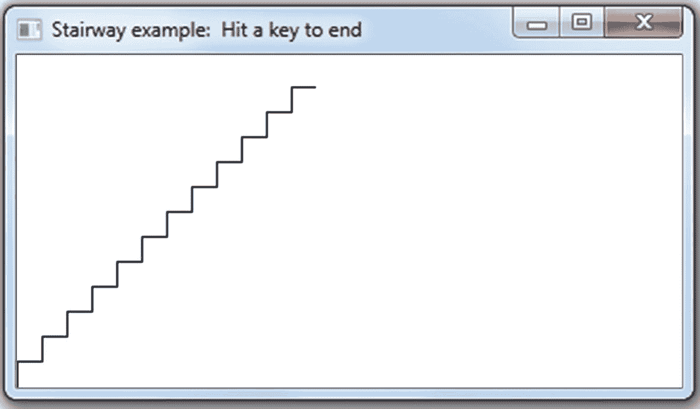
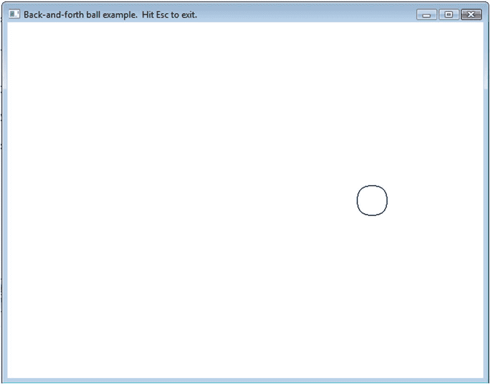
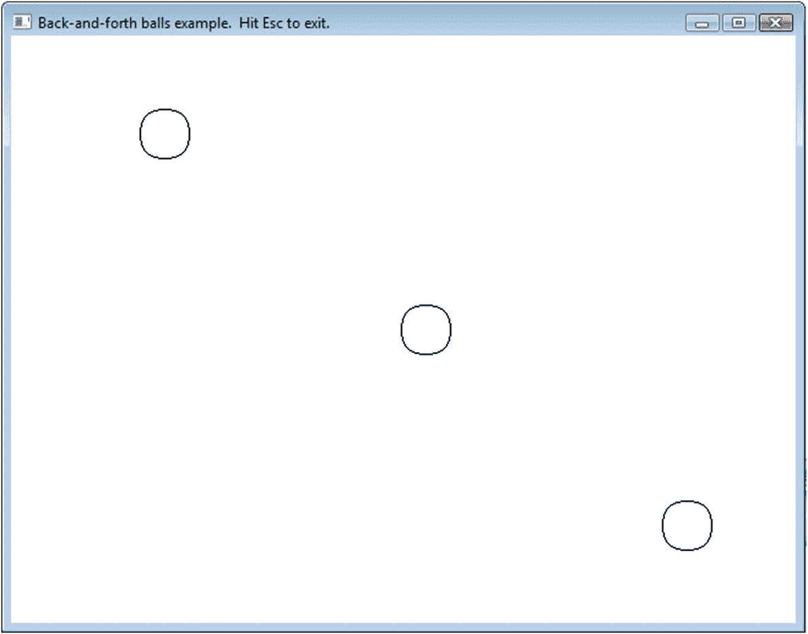
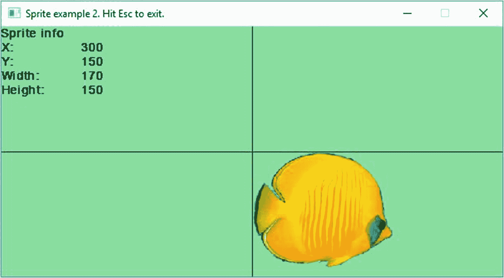
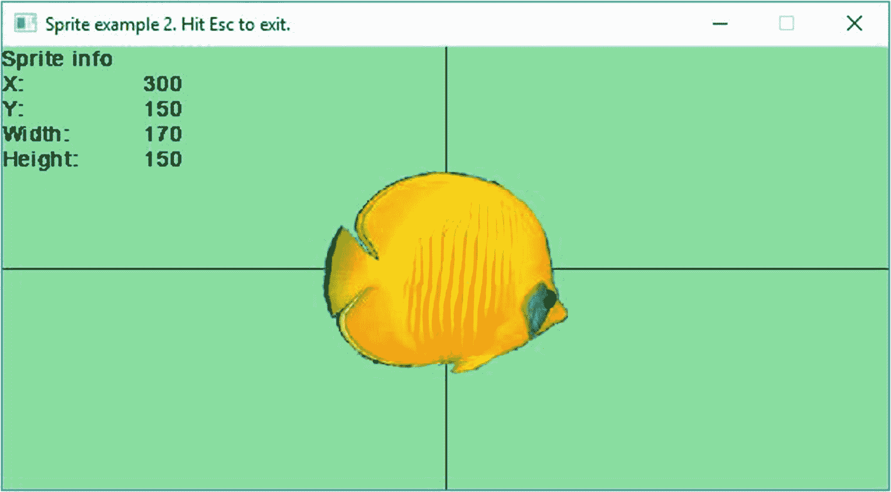

# 十一、使用结构和精灵的动画

是时候拍些电影了(不久之后，还有街机游戏)。我们需要更多的功能。

## `struct`年代

`struct`是一种捆绑信息的方式:

```cpp
struct <name>
{
    <variable declaration>*
};

```

例如，这里有一种我们已经需要了一段时间的类型:几何点。它有两部分，x 和 y:

```cpp
struct Point2D
{
   int x_, y_;
};

```

(后面的`_`是一个约定，意思是“其他事物的成员”我们将在第 16 章中看到为什么这是值得考虑的。)

这个版本更好。我们将在`struct`中构建默认值。0 是一个很好的默认值:

```cpp
struct Point2D
{
   int x_= 0, y_= 0;
};

```

现在我们可以使用新的类型来声明点:

```cpp
Point2D p0; // The x_and y_ members are both 0
            // since we made that the default

```

你可以像初始化数组一样初始化一个`struct`——用一个有支撑的列表: <sup>[1](#Fn1)</sup>

```cpp
Point2D p1 = {0, 5};               // x is 0, y is 5

```

…但与数组不同的是，您可以在初始化后使用`{}`创建一个新值:

```cpp
p1         = {1, 5};               // now x is 1
functionThatExpectsAPoint ({2,6}); // make a Point2D on the fly

```

要获取`Point2D`的各个部分，请使用。：

```cpp
p1.x_ += AMOUNT_TO_MOVE_X;
p1.y_ += AMOUNT_TO_MOVE_Y;
SSDL_RenderDrawCircle (p1.x_, p1.y_, RADIUS);

```

应该可以了。

为什么有`struct` s？

*   清晰:把一个点想成一个点，比想成一个 x 和一个 y 更容易。

*   更短的参数列表:检测鼠标点击是否在框内的函数不再需要像

    ```cpp
    bool containsClick (int x, int y,
                        int xLeft, int xRight,
                        int yTop,  int yBottom);

    ```

    中那样有六个参数

而是三个，就像

*   数组:假设你希望你的宇宙中有多个对象(看起来很有可能！).每个都有一个 x，y 坐标。你怎么能把这些排列起来呢？将 x 和 y 捆绑成一个`Point2D`，并有一个这样的数组:

```cpp
bool containsClick (Point2D p,
                    Point2D upperLeft, Point2D lowerRight);

```

`Point2D myObjects[MAX_OBJECTS];`

要初始化它们，您可以使用{}初始化列表:

`Point2D myObjects[MAX_OBJECTS] = {{1, 5}, {2, 3}};`

示例 [11-1](#PC10) 显示了这种新型的用途。输出如图 [11-1](#Fig1) 所示。



图 11-1

阶梯计划

```cpp
//  Program to draw a staircase
//              -- from _C++20 for Lazy Programmers_

#include "SSDL.h"

struct Point2D  // A struct to hold a 2-D point
{
    int x_, y_;
};

int main (int argc, char** argv)
{
    SSDL_SetWindowSize  (400, 200);
    SSDL_SetWindowTitle ("Stairway example:  Hit a key to end");

    constexpr int MAX_POINTS        = 25;
    constexpr int STAIR_STEP_LENGTH = 15;

    Point2D myPoints [MAX_POINTS];

    int x = 0;                          // Start at lower left corner
    int y = SSDL_GetWindowHeight()-1;   //  of screen

    for (int i = 0; i < MAX_POINTS; ++i) // Fill an array with points
    {
        myPoints[i] = { x, y };

        // On iteration 0, go up (change Y)
        // On iteration 1, go right
        // then up, then right, then up...

        if (i%2 == 0)                    // If i is even...
            y -= STAIR_STEP_LENGTH;
        else
            x += STAIR_STEP_LENGTH;
    }

    for (int i = 0; i < MAX_POINTS-1; ++i) // Display the staircase
        // The last iteration draws a line from point
        //   i to point i+1... which is why we stop a
        //   little short.  We don't want to refer to
        //   the (nonexistent) point # MAX_POINTS.
        SSDL_RenderDrawLine (   myPoints[i  ].x_, myPoints[i  ].y_,
                                myPoints[i+1].x_, myPoints[i+1].y_);

    SSDL_WaitKey();

    return 0;
}

Example 11-1Staircase program, illustrating struct Point2D

```

Exercises

1.  编写并测试前面给出的`containsClick`函数(点击并输入信息的函数)。

2.  Make an array of `Point2D`s, and set the value of each with this function:

    ```cpp
    Point2D pickRandomPoint (int range)
    {
       Point2D where;

       where.x_ =
         rand()%range + rand()%range + rand()%range;
       where.y_ =
         rand()%range + rand()%range + rand()%range;

       return where;
    }

    ```

    展示它们，注意:它们是均匀分布的吗？这显示了当你对随机数求和时会发生什么。

## 用`struct`和`while`拍电影

想想电影是怎么拍出来的。你看到一个接一个的静止画面，但是它们来得如此之快，看起来就像一个连续的运动图像。

我们会做同样的事情。一部真正的电影有特定的速度——每秒帧数——所以运动的速率总是相同的。我们将告诉 C++ 也保持一个恒定的帧速率。

这里有一个粗略的版本:

```cpp
SSDL_SetFramesPerSecond (70); // Can change this,
                              //  or leave at the default of 60

while (SSDL_IsNextFrame ())
{
    SSDL_DefaultEventHandler ();

    SSDL_RenderClear ();    // erase previous frame

    // display things (draw shapes and images, print text, etc.)

    // update variables if needed

    // get input, if relevant...
}

```

等待足够的时间，以进入电影的下一帧。它还会刷新屏幕。它将每秒 60 帧，除非我们用`SSDL_SetFramesPerSecond`改变它。如果用户试图通过关闭窗口或按下退出键来退出，则`SSDL_IsNextFrame`返回`false,`，循环结束。

但是必须要检查那些退出消息。之前我们用的是`SSDL_WaitKey`、`SSDL_WaitMouse`、`SSDL_Delay`。因为我们现在没有使用它们，所以必须用其他东西来检查退出消息。

这个东西就是`SSDL_DefaultEventHandler`，它处理**事件**——来自操作系统的消息告诉程序，“发生了一些你可能关心的事情”，比如退出请求:

```cpp
void SSDL_DefaultEventHandler ()
{
    SDL_Event event;

    while (SSDL_PollEvent (event))
        switch (event.type)
     {
     case SDL_QUIT:    // clicked the X on the window? Let's quit
            SSDL_DeclareQuit(); break;
     case SDL_KEYDOWN: // User hit Escape? Let's quit
            if (SSDL_IsKeyPressed (SDLK_ESCAPE)) SSDL_DeclareQuit();
     }
}

```

`SDL_Event`是一个`struct`，它存储 SDL 识别的任何类型事件的信息。`SSDL_PollEvent`获取下一个可用的事件，如果有的话，如果没有则失败；但是如果找到一个，它会将信息存储在`event`中，然后由`switch`语句决定如何处理它。

让我们在程序中使用它来让一个球在屏幕上来回移动。呜-呼！输出如图 [11-2](#Fig2) 所示。



图 11-2

在屏幕上来回移动的球

```cpp
// Program to make a circle move back and forth across the screen
//          -- from _C++20 for Lazy Programmers_

#include "SSDL.h"

constexpr int RADIUS = 20;     // Ball radius & speed
constexpr int SPEED  =  5;     //  ...move 5 pixels for every frame

enum class Direction { LEFT=-1, RIGHT=1 };
// Why -1 for left?  Because left means going in the minus direction.
// See where we update the x_ in the main loop for how this can work

struct Point2D
{
    int x_=0, y_=0;
};

struct Ball             // A ball is an X, Y location,
{                       // and a direction, left or right
    Point2D   location_;
    Direction direction_;
};

int main (int argc, char** argv)
{
    SSDL_SetWindowTitle ("Back-and-forth ball example.  "
                         "Hit Esc to exit.");

    // initialize ball position; size; rate and direction of movement
    Ball ball;
    ball.location_  = { SSDL_GetWindowWidth () / 2,
                        SSDL_GetWindowHeight() / 2 };
    ball.direction_ = Direction::RIGHT;

    constexpr int FRAMES_PER_SECOND = 70;
    SSDL_SetFramesPerSecond (FRAMES_PER_SECOND);

    while (SSDL_IsNextFrame ())
    {
        SSDL_DefaultEventHandler ();

        // *** DISPLAY THINGS ***
        SSDL_RenderClear ();    // first, erase previous frame

        // then draw the ball

        SSDL_RenderDrawCircle (ball.location_.x_, ball.location_.y_, RADIUS);

        // *** UPDATE THINGS ***
        // update ball's x position based on speed
        //   and current direction
        ball.location_.x_ += int(ball.direction_)*SPEED;

        // if ball moves off screen, reverse its direction
        if      (ball.location_.x_ >= SSDL_GetWindowWidth())
            ball.direction_ = Direction::LEFT;
        else if (ball.location_.x_ < 0)
            ball.direction_ = Direction::RIGHT;
    }

    return 0;
}

Example 11-2A ball moving back and forth across the screen

```

如果我们希望不止一个物体运动呢？我们可以有一个数组`Ball`并使用 for 循环来初始化它们，显示它们，等等。

越来越长，越来越不清楚，所以我将把几个任务放在它们各自的功能中。示例 [11-3](#PC15) 的输出如图 [11-3](#Fig3) 所示。



图 11-3

多个移动球的示例

```cpp
// Program to make circles move back and forth across the screen
//          -- from _C++20 for Lazy Programmers_

#include "SSDL.h"

constexpr int RADIUS = 20;     // Ball radius & speed
constexpr int SPEED  =  5;     //  ...move 5 pixels for every frame

enum class Direction { LEFT=-1, RIGHT=1 };

struct Point2D
{
    int x_=0, y_=0;
};

struct Ball             // A ball is an X, Y location,
{                       // and a direction, left or right
    Point2D   location_;
    Direction direction_;
};

// Ball functions

void initializeBalls (      Ball balls[], int howMany);
void drawBalls       (const Ball balls[], int howMany);
void moveBalls       (      Ball balls[], int howMany);
void bounceBalls     (      Ball balls[], int howMany);

int main (int argc, char** argv)
{
    SSDL_SetWindowTitle ("Back-and-forth balls example.  "
                         "Hit Esc to exit.");

    // initialize balls' position, size, and rate and direction
    constexpr int MAX_BALLS = 3;
    Ball balls [MAX_BALLS];
    initializeBalls (balls, MAX_BALLS);

    constexpr int FRAMES_PER_SECOND = 70;
    SSDL_SetFramesPerSecond(FRAMES_PER_SECOND);

    while (SSDL_IsNextFrame ())
    {
        SSDL_DefaultEventHandler ();

        // *** DISPLAY THINGS ***
        SSDL_RenderClear ();           // first, erase previous frame
        drawBalls  (balls, MAX_BALLS);

        // *** UPDATE  THINGS ***
        moveBalls  (balls, MAX_BALLS);
        bounceBalls(balls, MAX_BALLS); // if ball moves offscreen,
                                       //  reverse its direction
    }

    return 0;
}

// Ball functions

void initializeBalls (Ball balls[], int howMany)
{
    for (int i = 0; i < howMany; ++i)
    {
        balls[i].location_ = { i * SSDL_GetWindowWidth () / 3,
                               i * SSDL_GetWindowHeight() / 3
                                 + SSDL_GetWindowHeight() / 6 };
        balls[i].direction_   = Direction::RIGHT;
    }
}

void drawBalls  (const Ball balls[], int howMany)
{
    for (int i = 0; i < howMany; ++i)
        SSDL_RenderDrawCircle (balls[i].location_.x_,
                               balls[i].location_.y_, RADIUS);
}

// update balls' x position based on speed and current direction
void moveBalls  (Ball balls[], int howMany)
{
    for (int i = 0; i < howMany; ++i)
        balls[i].location_.x_ += int (balls[i].direction_)*SPEED;
}

void bounceBalls(Ball balls[], int howMany)
{
    // if any ball moves off screen, reverse its direction
    for (int i = 0; i < howMany; ++i)
        if      (balls[i].location_.x_ >= SSDL_GetWindowWidth())
            balls[i].direction_ = Direction::LEFT;
        else if (balls[i].location_.x_ <  0)
            balls[i].direction_ = Direction::RIGHT;
}

Example 11-3An example with multiple moving balls

```

Exercises

1.  Make the balls capable of moving in other directions. A ball is no longer just an x, y location and a direction; it’s an x, y location and an x, y velocity. Each time you go through the main loop, you’ll update the location based on the velocity:

    ```cpp
    for (int i = 0; i < MAX_BALLS; ++i)
    {
       balls[i].location_.x_ +=
                    balls[i].velocity_.x_;
       balls[i].location_.y_ +=
                    balls[i].velocity_.y_;
    }

    ```

    当速度碰到左墙或右墙时，速度的 x 分量总是反向的——如果速度碰到地板或天花板，速度的 y 分量也是如此。用`Point2D`代替`velocity_`也可以，或者你可以为它创建一个新的`struct`。

    每当球击中墙壁时添加音效。

2.  Now let’s add gravity. Velocity doesn’t just change each time you hit a wall; it changes in each iteration of the loop, like so:

    ```cpp
    for (int i = 0; i < MAX_BALLS; ++i)
         balls[i].velocity_.y_+= GRAVITY;
                     // adjust velocity for gravity

    ```

    现在球应该更真实地移动。

3.  现在加上摩擦力。每当球碰到墙时，它的速度并不完全相反；而是反过来，只是比原来小了一点。这将使球在每次碰撞后变慢。

## 鬼怪；雪碧

圈子够多了。让我们移动图像。

我们已经有了图像，但它们只是放在那里。精灵是移动的图像:它们可以移动、旋转、翻转和做其他事情。以下是基本情况。

创建精灵就像创建图像一样:

```cpp
SSDL_Sprite mySprite = SSDL_LoadImage ("filename.png");

```

你现在可以用`SSDL_SetSpriteLocation`设置它的位置，用`SSDL_SetSpriteSize`设置它的大小。

在示例 [11-4](#PC19) 中，我使用 sprite 将一条鱼放在屏幕中间——也许我要制作一个视频水族馆——并使用其他 sprite 函数打印一些关于它的信息。与 sprite 相关的代码会突出显示。输出如图 [11-4](#Fig4) 所示。

```cpp
// Program to place a fish sprite on the screen
//              -- from _C++20 for Lazy Programmers_

#include "SSDL.h"

using namespace std;

int main (int argc, char** argv)
{
    // Set up window characteristics
    constexpr int WINDOW_WIDTH = 600, WINDOW_HEIGHT = 300;
    SSDL_SetWindowSize  (WINDOW_WIDTH, WINDOW_HEIGHT);
    SSDL_SetWindowTitle ("Sprite example 1\.  Hit Esc to exit.");

    // initialize colors
    const SSDL_Color AQUAMARINE(100, 255, 150); // the water

    // initialize the sprite's image and location

    SSDL_Sprite fishSprite = SSDL_LoadImage("media/discus-fish.png");
    SSDL_SetSpriteLocation (fishSprite,
                            SSDL_GetWindowWidth ()/2,
                            SSDL_GetWindowHeight()/2);

    // *** Main loop ***
    while (SSDL_IsNextFrame ())
    {
        // Look for quit messages
        SSDL_DefaultEventHandler ();

        // Clear the screen for a new frame in our "movie"
        SSDL_RenderClear (AQUAMARINE);

        // Draw crosshairs in the center
        SSDL_SetRenderDrawColor (BLACK);
        SSDL_RenderDrawLine (0, SSDL_GetWindowHeight()/2,
                             SSDL_GetWindowWidth (),
                             SSDL_GetWindowHeight()/2);
        SSDL_RenderDrawLine (SSDL_GetWindowWidth ()/2,  0,
                             SSDL_GetWindowWidth ()/2,
                             SSDL_GetWindowHeight());

        // and print the statistics on the fish
        SSDL_SetCursor (0, 0);  // reset cursor each time or
                                //   the messages will run off
                                //   the screen!
        sout << "Sprite info\n";
        sout << "X:\t"
             << SSDL_GetSpriteX
     (fishSprite) << endl;
        sout << "Y:\t"
             << SSDL_GetSpriteY
     (fishSprite) << endl;
        sout << "Width:\t"
             << SSDL_GetSpriteWidth
(fishSprite) << endl;
        sout << "Height:\t"
             << SSDL_GetSpriteHeight
(fishSprite) << endl;

        // Show that fish
        SSDL_RenderSprite
(fishSprite);
    }

    return 0;
}

Example 11-4Program to draw a fish, using a sprite

```


图 11-4

一个精灵和它目前的一些规格

我认为这条鱼太大了。根据程序，它的宽度是 225，高度是 197。我们可以把`SSDL_SetSpriteSize`放在主循环之前，来调整它的大小: <sup>[2](#Fn2)</sup>

```cpp
constexpr int FISH_WIDTH = 170, FISH_HEIGHT = 150;
SSDL_SetSpriteSize (fishSprite, FISH_WIDTH, FISH_HEIGHT);

```



图 11-5

一个精灵，调整大小

如图 [11-5](#Fig5) 所示:现在我要它居中。我给它的 x，y 位置*是中心的*…但那是图像的左上角。

下面是偏移精灵的调用，因此它以我们给定的点为中心作为它的位置:

```cpp
SSDL_SetSpriteOffset (fishSprite, FISH_WIDTH/2, FISH_HEIGHT/2);

```

如果它看起来仍然偏离中心，我可以用数字来得到不同的偏移量。

我不会重复整个程序，但示例 [11-5](#PC22) 显示了改变精灵大小和居中的代码行。结果如图 [11-6](#Fig6) 所示。



图 11-6

一个精灵，调整大小并居中

```cpp
int main (int argc, char** argv)
{
    ...

    // Init size and offset. Image is offset so fish looks centered.
    constexpr int FISH_WIDTH = 170, FISH_HEIGHT = 150;
    SSDL_SetSpriteSize   (fishSprite, FISH_WIDTH, FISH_HEIGHT);

    // This offset looks right on the screen, so I'll use it:
    SSDL_SetSpriteOffset (fishSprite,
                          FISH_WIDTH/2, int(FISH_HEIGHT*0.55));
    ...

    return 0;
}

Example 11-5Code to resize and center a sprite

```

你可以用精灵做其他事情:旋转，水平或垂直翻转，或者只使用原始图像的一部分。您还可以对它们做任何您可以对图像做的事情——例如，`SSDL_RenderImage (mySprite)`。这将忽略精灵的其他特征(位置，大小等)。)并且只使用图像方面。

现在你有了这个，你就可以(几乎)制作自己的街机游戏了。

### 防错法

*   雪碧没有出现。以下是可能的原因:
    *   图像未加载。你在错误的文件夹中寻找，在文件名中打了一个错别字，或者正在使用一个坏的或不兼容的图像。

    *   它出现了，但不在屏幕上。从`SSDL_GetSpriteX`和`SSDL_GetSpriteY`得到什么数字？确保他们在射程内。

Exercises

表 11-1

常见的 sprite 命令。完整列表见附录 h。

<colgroup><col class="tcol1 align-left"> <col class="tcol2 align-left"></colgroup> 
| `SSDL_Sprite` `mySprite = SSDL_LoadImage ("image.png");` | 这就是如何创建一个。 |
| `void``SSDL_SetSpriteLocation`T2】 | 设置精灵在屏幕上的位置。 |
| `void``SSDL_SetSpriteSize`T2】 | …以及它的大小。 |
| `void``SSDL_SetSpriteOffset`T2】 | …它的偏移量。 |
| `void``SSDL_SetSpriteRotation`T2】 | …它的旋转角度。 |
| `void``SSDL_RenderSprite`T2】 | 在当前位置绘制精灵。 |
| `int``SSDL_GetSpriteX`T2】 | 返回精灵在屏幕上的`x`位置。 |
| `int``SSDL_GetSpriteY`T2】 | …和它的`y`。 |

1.  制作一个视频水族馆:一个背景和来回移动的鱼(面向它们去的任何方向，所以你需要`SSDL_SpriteFlipHorizontal`)。

2.  做上一节的练习 2 或 3(弹跳球)，但是不要画圆圈，而是用一个篮球的图像。让篮球旋转(见表 [11-1](#Tab1) 了解你需要的功能)。

<aside aria-label="Footnotes" class="FootnoteSection" epub:type="footnotes">Footnotes [1](#Fn1_source)

的初始值设定项太灵活了。您可以省略=:

`Point2D p1 {0, 5};`

你可以省略一些初始化器，它将使用你的默认值(或者 0，如果你没有做任何的话):

`Point2D p2 {3}; //x_ becomes 3, y_ stays at 0`

如果你的编译器是 C++20 兼容的，你可以放入成员标签:

`Point2D p3 = { .x_= 0, .y_=5 };`

`Point2D p4 = { .y_ = 5 }; //leave x_ to its default`

我通常选择简单的版本。

  [2](#Fn2_source)

在你的图形编辑器中设置更有效，但是如果需要的话，我想展示如何在 SSDL 中调整大小。

 </aside>