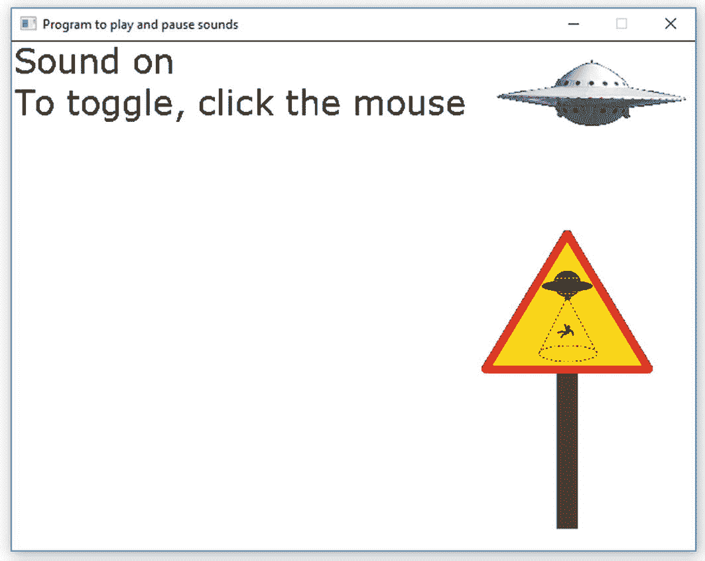
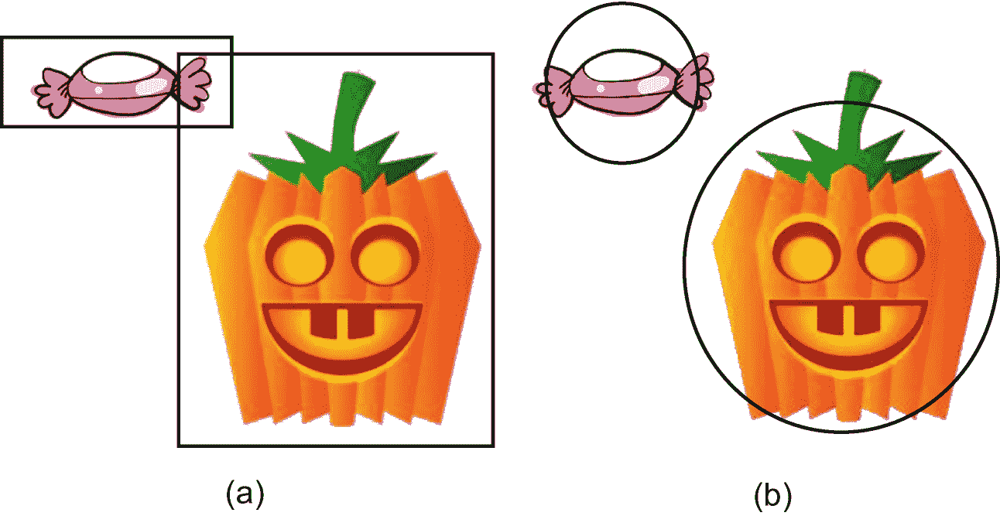
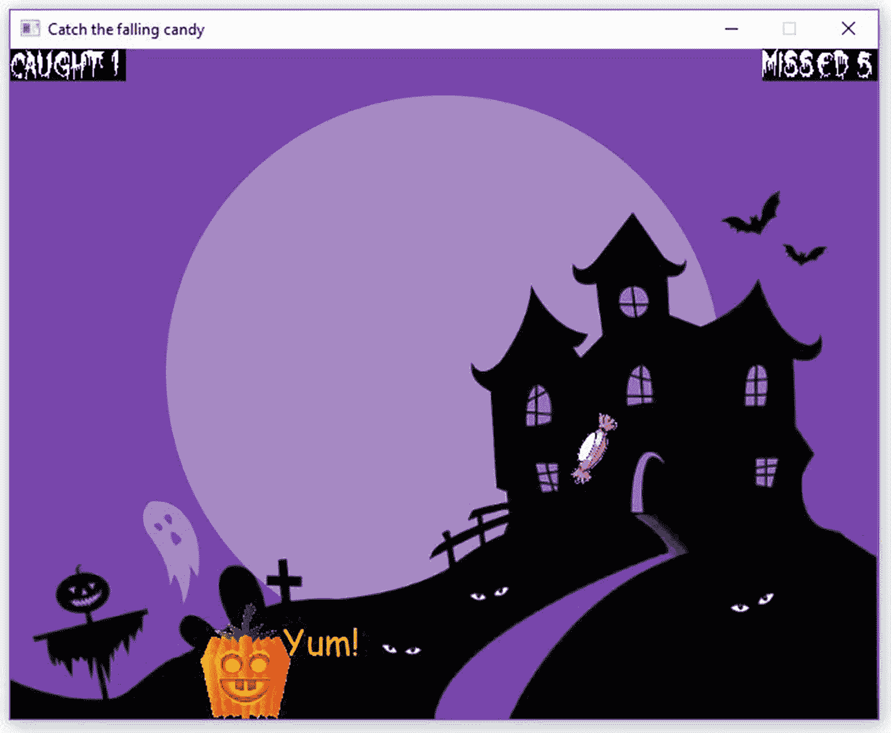

# 十二、制作一个街机游戏：输入，碰撞，并把它们放在一起

在这一章中，我们将制作我们自己的 2-D 街机游戏，把我们到目前为止所获得的浪费时间的体验放在一起，让其他人偷懒，这样我们就可以发光——或者类似的事情。我们需要的新事物是更好的鼠标和键盘交互以及对象的碰撞。

## 确定输入状态

### 老鼠

我们已经可以等待鼠标点击，并获得其坐标…但街机游戏不等人。

假设我们想让我们的武器在鼠标按键按下时持续开火。我们需要一种方法来检测按钮被按下，而不需要停下来等待。这就行了。

<colgroup><col class="tcol1 align-left"> <col class="tcol2 align-left"></colgroup> 
| `int SSDL_GetMouseClick ();` | 如果没有按钮被按下，返回 0；`SDL_BUTTON_LMASK`(左键被按下)、`SDL_BUTTON_MMASK`(中间)或`SDL_BUTTON_RMASK`(右边)。 |

...如在

```cpp
if (SSDL_GetMouseClick () != 0) // mouse button is down
{
    x = SSDL_GetMouseX(); y = SSDL_GetMouseY();

    // do whatever you wanted to do if mouse button is down
}

```

在给出一个例子之前，让我们看看如何检查键盘的状态。

### 键盘

`ssin`等待你按回车键。这对于街机游戏来说是行不通的；我们想知道一个键是否一被按下就被按下。函数`SSDL_IsKeyPressed`告知给定的键是否被按下——任何键，包括与字母无关的键，如 Shift 和 Ctrl:

<colgroup><col class="tcol1 align-left"> <col class="tcol2 align-left"></colgroup> 
| `bool SSDL_IsKeyPressed (``SDL_Keycode`T2】 | 返回`key`当前是否被按下。 |

尽管这个函数接受的许多键值都与您预期的相符(0 键用`'0'`，A 键用`'a'`——但 A 键用`'A'`！)，并不总是很明显，所以最好用他们的正式名字。在撰写本文时，完整的列表在`wiki.libsdl.org/SDL_Keycode`；一些列在表 [12-1](#Tab1) 中。示例 [12-1](#PC2) 展示了如何使用它们。

表 12-1

SDL 的选定键码

<colgroup><col class="tcol1 align-left"> <col class="tcol2 align-left"> <col class="tcol3 align-left"> <col class="tcol4 align-left"> <col class="tcol5 align-left"></colgroup> 
| `SDLK_1``SDLK_2``...``SDLK_a``SDLK_b``...` | `SDLK_F1``SDLK_F2``...` | `SDLK_ESCAPE``SDLK_BACKSPACE``SDLK_RETURN``SDLK_SPACE` | `SDLK_LEFT``SDLK_RIGHT``SDLK_UP``SDLK_DOWN` | `SDLK_LSHIFT``SDLK_RSHIFT``SDLK_LCTRL``SDLK_RCTRL` |

```cpp
// Program to identify some keys, and mouse buttons, being pressed
//       -- from _C++20 for Lazy Programmers_

#include "SSDL.h"

int main (int argc, char** argv)
{
    while (SSDL_IsNextFrame ())
    {
        SSDL_DefaultEventHandler ();

        SSDL_RenderClear ();    // Clear the screen

        SSDL_SetCursor (0, 0);  // And start printing at the top

        sout << "What key are you pressing? ";
        sout << "Control, Shift, Caps lock, space, F1?\n";

        if (SSDL_IsKeyPressed (SDLK_LCTRL))   sout << "Left ctrl ";
        if (SSDL_IsKeyPressed (SDLK_RCTRL))   sout << "Right ctrl ";
        if (SSDL_IsKeyPressed (SDLK_LSHIFT))  sout << "Left shift ";
        if (SSDL_IsKeyPressed (SDLK_RSHIFT))  sout << "Right shift ";
        if (SSDL_IsKeyPressed (SDLK_CAPSLOCK))sout << "Caps lock ";
        if (SSDL_IsKeyPressed (SDLK_SPACE))   sout << "Space bar ";
        if (SSDL_IsKeyPressed (SDLK_F1))      sout << "F1 ";
        if (SSDL_IsKeyPressed (SDLK_ESCAPE))  break;
        sout << "\n";

        if (SSDL_GetMouseClick () == SDL_BUTTON_LMASK)
            sout << "Left mouse button down\n";
        if (SSDL_GetMouseClick () == SDL_BUTTON_RMASK)
            sout << "Right mouse button down\n";

        sout << "(Hit Esc to exit.)";
    }

    return 0;
}

Example 12-1A program to detect control keys, Shift, Caps Lock, space bar, and F1

```

### 防错法

*   你按下了一个功能键，但没有任何反应。在某些键盘上，你还必须按住 Fn 键。

*   **您同时按下多个键，但只有一些键会显示出来；**或**你按下一个键，它不会注册鼠标按钮。**键盘“重影”正在丢失按键，因为键盘一次只能处理这么多。它也可能会失去鼠标点击。在写的时候，如果你在意，可以在 [`https://keyboardtester.co/`](https://keyboardtester.co/) 测试你的键盘鼠标。

将 Ctrl、Shift 和 Alt 与其他键一起使用可能是安全的——这是意料之中的。

## 事件

有时我们并不关心鼠标按钮当前是向上还是向下，只关心它是否被点击过。也许你每次点击都能从你的 BFG 中得到一个镜头。或者您的程序使用鼠标来打开或关闭声音，如下面的代码所做的那样(或者至少尝试这样做):

```cpp
while (SSDL_IsNextFrame ())
{
    SSDL_DefaultEventHandler ();

    if (SSDL_GetMouseClick ()) toggleSound (); // not gonna work

    ...
}

```

问题是，电脑很快。假设你的鼠标点击需要十分之一秒。以每秒 60 帧的速度，在你松开按钮之前，声音会打开和关闭*六次*，如果它以你想要的方式结束，那才是好运。

我们需要的是将点击本身检测为鼠标点击*事件*，就像第 11 章中处理的退出事件。我们将有一个替代者`SSDL_DefaultEventHandler`来检测该事件并将其报告给`main`，这样`main`就可以切换音乐(例如[12-2](#PC4)；截图如图 [12-1](#Fig1) 。

```cpp
void myEventHandler (bool& mouseClicked) // replaces SSDL_DefaultEventHandler
{
    SDL_Event event;
    mouseClicked = false;   // We'll soon know if mouse was clicked

    while (SSDL_PollEvent (event))
        switch (event.type)
        {
        case SDL_QUIT:            SSDL_DeclareQuit();
            break;
        case SDL_KEYDOWN:         if (SSDL_IsKeyPressed (SDLK_ESCAPE))
                                      SSDL_DeclareQuit();
            break;
        case SDL_MOUSEBUTTONDOWN: mouseClicked = true; // It was!
            break;
        }
}

// and the following in main:

    while (SSDL_IsNextFrame ())
    {
        bool mouseWasClicked;
        myEventHandler (mouseWasClicked);

        if (mouseWasClicked) toggleSound ();

        ....
    }

Example 12-2Making your own event handler. For the complete program, see source code, ch12 folder; the project is 2-aliensBuzzOurWorld

```



图 12-1

一个用鼠标点击来切换声音的程序

这种思维方式——**事件驱动**——是 Windows、iOS 和 Android 等重要操作系统编程的核心。

## 冷却时间和寿命

假设我们想要一个效果在某件事情发生后持续一会儿。也许有一种视觉效果在鼠标点击创造出来后只存在一秒钟(它的“寿命”)。或者你的 BFG 需要等待一段时间才能再次开火，无论你点击得多疯狂——这是一个“冷却”期。

我们将有一个整数`framesLeftTillItsOver`，当鼠标被点击时，它将被设置为你想要延迟的帧数。

这个推理不行:

```cpp
framesLeftTillItsOver = 0      //effect is currently inactive
while SSDL_IsNextFrame ()
    handle events

    SSDL_RenderClear ()
    draw things

    if framesLeftTillItsOver == 0 && mouseWasClicked
        framesLeftTillItsOver = HOWEVER MANY FRAMES WE WANT IT TO LAST
        draw the visual effect

    --framesLeftTillItsOver // 1 frame closer to disappearance

```

倒计时是可以的，但是当你绘制效果时，`SSDL_RenderClear`会在下一次迭代中删除它！

我们必须将改变视觉效果的状态(从关到开)的*与绘制它的*的*区分开来；它们是独立的行动。这将起作用:*

```cpp
framesLeftTillItsOver = 0      //effect is currently inactive
while SSDL_IsNextFrame ()
    handle events

    SSDL_RenderClear ()
    draw things including, if it's on, the visual effect
      (consider it to be on if framesLeftTillItsOver > 0)

    if effect is on (that is, framesLeftTillItsOver > 0)
        -- framesLeftTillItsOver; // 1 frame closer to disappearance
    else if mouseWasClicked
        framesLeftTillItsOver = HOWEVER MANY FRAMES WE WANT IT TO LAST

```

Tip

根据经验，在主动画循环中，有三个独立的部分:处理事件、绘图和更新变量。顺序并不重要，因为它们最终都会完成；重要的是，不要在更新部分绘制，不要在绘制部分检查事件，等等。

在示例 [12-3](#PC7) 中，当你点击鼠标时，程序会在你点击的任何地方放置一个飞溅的图像。一秒钟后，它会删除图像，让您再次点击。

```cpp
// Program that makes a splat wherever you click

//      -- from _C++20 for Lazy Programmers_

#include "SSDL.h"

void myEventHandler (bool& mouseClicked);

int main (int argc, char** argv)
{
    SSDL_SetWindowTitle ("Click the mouse to see and hear a splat; "
                         "hit Esc to end.");

    const SSDL_Sound SPLAT_SOUND =
        SSDL_LoadWAV ("media/445117__breviceps__cartoon-splat.wav");

    // Set up sprite with image and a size, and offset its reference
    //  point so it'll be centered on our mouse clicks
    SSDL_Sprite splatSprite = SSDL_LoadImage ("media/splat.png");

    constexpr int SPLAT_WIDTH=50, SPLAT_HEIGHT=50;
    SSDL_SetSpriteSize  (splatSprite, SPLAT_WIDTH,   SPLAT_HEIGHT);
    SSDL_SetSpriteOffset(splatSprite, SPLAT_WIDTH/2, SPLAT_HEIGHT/2);

    while (SSDL_IsNextFrame ())
    {
        static int framesLeftTillSplatDisappears =  0;
        static constexpr int SPLAT_LIFETIME      = 60;  // It lasts one //    second

        // Handle events
        bool isMouseClick;
        myEventHandler (isMouseClick);

        // Display things
        SSDL_RenderClear();
        if (framesLeftTillSplatDisappears > 0)
            SSDL_RenderSprite(splatSprite);

        // Update things: process clicks and framesLeft
        if (framesLeftTillSplatDisappears > 0) // if splat is active
            --framesLeftTillSplatDisappears;   //  keep counting down

        else if (isMouseClick)      // if not, and we have a click...
        {
                                    // Reset that waiting time
            framesLeftTillSplatDisappears = SPLAT_LIFETIME;

                                    // Play splat sound
            SSDL_PlaySound (SPLAT_SOUND);

            SSDL_SetSpriteLocation  // move splat sprite to
                (splatSprite,       //  location of mouse click

                 SSDL_GetMouseX(),
                 SSDL_GetMouseY());
        }
    }

    return 0;
}

void myEventHandler (bool& mouseClicked)
{
   // exactly the same as in Example 12-2
}

Example 12-3Using a visual effect with specified duration: splatter on the screen

```

Exercises

1.  修改示例 [12-3](#PC7) 中的程序，以允许多个飞溅同时存在；你可以每秒发射一次，但每次飞溅持续 5 秒。

2.  一个*粒子喷泉*是一组不断产生的粒子，向各个方向运动。这就是电脑游戏和暴雨中火焰产生的原因。你也可以做一个泡泡喷泉或烟火。

    让每个粒子从相同的位置开始，有一个初始随机速度。随着主循环的每次迭代，用`SSDL_RenderDrawPoint`绘制粒子。同样更新它的位置，如果你想让它看起来更像火焰，使用重力，但是方向相反；火焰粒子倾向于向上飞而不是向下飞。最后，当一个粒子已经存在了一定数量的帧，重置它到它的起点，让它再次去。

## 碰撞

在制作我们自己的游戏之前，我们还需要一样东西:碰撞。

用 SSDL 精灵检测碰撞很容易:

<colgroup><col class="tcol1 align-left"> <col class="tcol2 align-left"></colgroup> 
| `int` `SSDL_SpriteHasIntersection``(const SSDL_Sprite& a, const SSDL_Sprite& b);` | 返回子画面`a`和`b`是否重叠。 |

就像:

```cpp
if (SSDL_SpriteHasIntersection (robotSprite, playerSprite))
    playerDead = true;

```

精灵的碰撞*很容易，但并不总是准确的。因为你的精灵可能有很大一部分是透明的，你可能会发现 SDL 认为两个精灵在碰撞，即使可见的部分没有接触。没有一个理智的人会认为图 [12-2](#Fig2) (a)中的糖果和万圣节篮子是冲突的——但 SSDL 会。*



图 12-2

精灵之间的碰撞，由`SSDL_SpriteHasIntersection` (a)和函数`inCollision` (b)的基于圆的方法评估

这里有一个简单的解决方法:找出两点(可能是精灵的中心)之间的距离，如果该距离小于我们给物体的半径之和`aSize`和`bSize`——也就是说，如果边界圆相交(图 [12-2](#Fig2) (b))，就认为发生了碰撞:

```cpp
bool inCollision (Point2D A, Point2D B, int aSize, int bSize)
{
    float aToBDistance = distance (A.x_, A.y_, B.x_, B.y_);
                             // see Chapter 7's first set of exercises --
                             //    or Example 12-7 below --
                             //    for the distance function
    return (aToBDistance < aSize + bSize);
}

```

使用最适合你的精灵的方法。

## 大游戏

本章的其余部分是关于创建街机游戏:首先是我的，然后是你的。

我这里有一个在篮子里抓万圣节糖果的游戏(例子 [12-4](#PC10) 到 [12-8](#PC14) )。如果你抓到足够多，你就赢了；错过太多，你就会死。它有声音、背景、愚蠢的图形和键盘交互(使用箭头键)，为了显示鼠标的使用，我允许用户切换平视显示器(HUD ),显示失误和失误的统计数据。为了说明如何指定效果的生存期，一个浮动的“Yum！”当你抓到糖果时，信息会出现一会儿。输出如图 [12-3](#Fig3) 所示。

```cpp
// Program to catch falling Hallowe'en candy

//       -- from _C++20 for Lazy Programmers_

#include <cmath> // for sqrt
#include "SSDL.h"

// dimensions of screen and screen locations
constexpr int SCREEN_WIDTH=675, SCREEN_HEIGHT=522; // dimensions of bkgd

constexpr int CANDY_START_HEIGHT =  15;  // where candy falls from

constexpr int MARGIN             =  25;  // As close to the left/right 
                                         //  edges of the screen as moving //  objects are allowed to get

constexpr int BOTTOM_LINE        = 480; // Where last line of text is printed
                                        //  on instruction & splash screens

// dimensions of important objects
constexpr int CANDY_WIDTH  = 60, CANDY_HEIGHT  = 20;
constexpr int BASKET_WIDTH = 70, BASKET_HEIGHT = 90;

// how many candies you can catch or miss before winning/losing
constexpr int MAX_CAUGHT   = 10, MAX_MISSED    = 10;
                                 // If you change this, change
                                 //  printInstructions too
                                 //  because it specifies this

// fonts for splash screens and catch/miss statistics
constexpr int SMALL_FONT_SIZE  = 12,
              MEDIUM_FONT_SIZE = 24,
              LARGE_FONT_SIZE  = 36;

const SSDL_Font SMALL_FONT
    = SSDL_OpenFont ("media/Sinister-Fonts_Werewolf-Moon/Werewolf Moon.ttf",
                     SMALL_FONT_SIZE);
const SSDL_Font MEDIUM_FONT

    = SSDL_OpenFont ("media/Sinister-Fonts_Werewolf-Moon/Werewolf Moon.ttf",
                     MEDIUM_FONT_SIZE);
const SSDL_Font LARGE_FONT
    = SSDL_OpenFont ("media/Sinister-Fonts_Werewolf-Moon/Werewolf Moon.ttf",
                     LARGE_FONT_SIZE);

// how far our victory/defeat messages are from left side of screen
constexpr int FINAL_SCREEN_MESSAGE_OFFSET_X = 40;

// background
const SSDL_Image BKGD_IMAGE
    = SSDL_LoadImage("media/haunted-house.jpg");

// sounds and music
const SSDL_Music BKGD_MUSIC
    = SSDL_LoadMUS("media/159509__mistersherlock__halloween-graveyd-short.mp3");
const SSDL_Sound THUNK_SOUND
    = SSDL_LoadWAV("media/457741__osiruswaltz__wall-bump-1.wav");
const SSDL_Sound DROP_SOUND
    = SSDL_LoadWAV("media/388284__matypresidente__water-drop-short.wav");

// structs
struct Point2D { int x_ = 0, y_ = 0; };

using Vector2D = Point2D;1

struct Object
{
    Point2D     loc_;
    int         rotation_      = 0;

    Vector2D    velocity_;
    int         rotationSpeed_ = 0;

    SSDL_Sprite sprite_;
};

// major functions called by the main program

bool playGame            ();

// startup/ending screens to communicate with user
void printInstructions   ();
void displayVictoryScreen();
void displayDefeatScreen ();

int main (int argc, char** argv)
{
    // set up window and font
    SSDL_SetWindowTitle ("Catch the falling candy");
    SSDL_SetWindowSize  (SCREEN_WIDTH, SCREEN_HEIGHT);

    // prepare music
    SSDL_VolumeMusic (int (MIX_MAX_VOLUME * 0.1));
    SSDL_PlayMusic   (BKGD_MUSIC);

    // initial splash screen
    printInstructions ();

    // The game itself
    bool isVictory = playGame ();

    // final screen:  victory or defeat

    SSDL_RenderClear (BLACK);
    SSDL_HaltMusic   ();

    if (isVictory) displayVictoryScreen ();
    else           displayDefeatScreen  ();

    SSDL_RenderTextCentered("Click mouse to end",
                            SCREEN_WIDTH/2, BOTTOM_LINE, SMALL_FONT);
    SSDL_WaitMouse();  // because if we wait for a key, we're likely
                       //  to have left or right arrow depressed
                       //  when we reach this line... and we'll never
                       //  get to read the final message

    return 0;
}

//// Startup/ending screens to communicate with user ////

void printInstructions ()
{
    constexpr int LINE_HEIGHT = 40;

    SSDL_SetRenderDrawColor (WHITE);
    SSDL_RenderTextCentered ("Catch 10 treats in ",
              SCREEN_WIDTH/2,              0, MEDIUM_FONT);
    SSDL_RenderTextCentered ("your basket to win",
              SCREEN_WIDTH/2, LINE_HEIGHT   , MEDIUM_FONT);
    SSDL_RenderTextCentered ("Miss 10 treats and",
              SCREEN_WIDTH/2, LINE_HEIGHT*3 , MEDIUM_FONT);
    SSDL_RenderTextCentered ("the next treat is YOU",
              SCREEN_WIDTH/2, LINE_HEIGHT*4 , MEDIUM_FONT);

    SSDL_RenderTextCentered ("Use arrow keys to move",
              SCREEN_WIDTH/2, LINE_HEIGHT*6 , MEDIUM_FONT);
    SSDL_RenderTextCentered ("left and right",
              SCREEN_WIDTH/2, LINE_HEIGHT*7 , MEDIUM_FONT);

    SSDL_RenderTextCentered ("Click mouse to",
              SCREEN_WIDTH/2, LINE_HEIGHT*9 , MEDIUM_FONT);
    SSDL_RenderTextCentered ("toggle stats display",
              SCREEN_WIDTH/2, LINE_HEIGHT*10, MEDIUM_FONT);

    SSDL_RenderTextCentered ("Hit any key to continue",
              SCREEN_WIDTH/2, BOTTOM_LINE,    SMALL_FONT);

    SSDL_WaitKey      ();
}

void displayVictoryScreen ()
{
    // sound and picture
    static const SSDL_Sound VICTORY_SOUND
        = SSDL_LoadWAV ("media/342153__robcro6010__circus-theme-short.wav");
    SSDL_PlaySound (VICTORY_SOUND);

    static const SSDL_Image GOOD_PUMPKIN
        = SSDL_LoadImage ("media/goodPumpkin.png");
    SSDL_RenderImage(GOOD_PUMPKIN, SCREEN_WIDTH / 4, 0);

    // victory message

    SSDL_SetRenderDrawColor (WHITE);
    SSDL_RenderText ("Hooah!",
                     FINAL_SCREEN_MESSAGE_OFFSET_X, SCREEN_HEIGHT/4,
                     LARGE_FONT);
    constexpr int LINE_DISTANCE_Y = 96; // an arbitrarily chosen number...
    SSDL_RenderText ("You won!",
                     FINAL_SCREEN_MESSAGE_OFFSET_X,
                     SCREEN_HEIGHT/4+LINE_DISTANCE_Y,
                     LARGE_FONT);
}

void displayDefeatScreen ()
{
    // sound and picture
    static const SSDL_Sound DEFEAT_SOUND
        = SSDL_LoadWAV ("media/326813__mrose6__echoed-screams-short.wav");
    SSDL_PlaySound (DEFEAT_SOUND);

    static const SSDL_Image SAD_PUMPKIN
        = SSDL_LoadImage ("media/sadPumpkin.png");
    SSDL_RenderImage (SAD_PUMPKIN, SCREEN_WIDTH / 4, 0);

    // defeat message
    SSDL_SetRenderDrawColor (WHITE);
    SSDL_RenderText ("Oh, no!", FINAL_SCREEN_MESSAGE_OFFSET_X,
                     SCREEN_HEIGHT/4, LARGE_FONT);
}

Example 12-4Falling candy program, part one of five. The complete program in source code’s ch12 folder is 4-thru-8-bigGame

```

到目前为止，我们已经有了这个项目的大致轮廓。我在`Object struct`中放了很多信息:位置、速度、精灵信息和旋转。有些并不总是需要的——例如，只有糖果会旋转——但是只有一种类型的`Object`会让事情变得更简单。

```cpp
///////////////////// Initializing /////////////////////////

void resetCandyPosition(Object& candy);

void initializeObjects (Object& basket, Object& candy, Object& yumMessage)
{
    // load those images
    SSDL_SetSpriteImage (candy.sprite_,
                        SSDL_LoadImage ("media/candy.png"));
    SSDL_SetSpriteImage (basket.sprite_,
                        SSDL_LoadImage ("media/jack-o-lantern.png"));
    SSDL_SetSpriteImage (yumMessage.sprite_,
                        SSDL_LoadImage ("media/yum.png"));

    // two images are the wrong size; we resize them.
    SSDL_SetSpriteSize (candy.sprite_,   CANDY_WIDTH,  CANDY_HEIGHT);
    SSDL_SetSpriteSize (basket.sprite_, BASKET_WIDTH, BASKET_HEIGHT);

    // move 'em so they're centered on the coords we set for them
    SSDL_SetSpriteOffset (candy.sprite_,
                          CANDY_WIDTH/2,  CANDY_HEIGHT/2);
    SSDL_SetSpriteOffset (basket.sprite_,
                          BASKET_WIDTH/2, BASKET_HEIGHT/2);

    // put the objects in their starting positions
    basket.loc_.x_ = SCREEN_WIDTH / 2;
    basket.loc_.y_ = SCREEN_HEIGHT - BASKET_HEIGHT/2;
    SSDL_SetSpriteLocation (basket.sprite_,
                            basket.loc_.x_, basket.loc_.y_);
    resetCandyPosition (candy);

    // (We don't care about yumMessage position till we make one)

    // And set velocities
    // basket's can't be specified till we check inputs
    constexpr int CANDY_SPEED = 11;      //11 pixels per frame, straight down
    candy.velocity_.y_ = CANDY_SPEED;    //11 per frame straight down
                                         //Increase speeds for faster game
    yumMessage.velocity_ = { 1, -1 };    //Up and to the right

    // And rotational speeds
    candy.rotationSpeed_ = 1;            //Candy spins slightly
}

/////////////////////////// Drawing /////////////////////////////

//Display all 3 objects (2 if yumMessage is currently not visible)
void renderObjects (Object basket, Object candy, Object yumMessage,
                    bool showYumMessage)
{
    SSDL_RenderSprite (basket.sprite_);
    SSDL_RenderSprite ( candy.sprite_);
    if (showYumMessage) SSDL_RenderSprite (yumMessage.sprite_);
}

void renderStats(int Caught, int Missed)
{
    // Stats boxes, for reporting how many candies caught and missed
    SSDL_SetRenderDrawColor(BLACK);
    constexpr int BOX_WIDTH = 90, BOX_HEIGHT = 25;
    SSDL_RenderFillRect(0, 0,                        // Left box
        BOX_WIDTH, BOX_HEIGHT);
    SSDL_RenderFillRect(SCREEN_WIDTH - BOX_WIDTH, 0, // Right box
        SCREEN_WIDTH - 1, BOX_HEIGHT);

    // Statistics themselves
    SSDL_SetRenderDrawColor(WHITE);
    SSDL_SetFont           (SMALL_FONT);

    SSDL_SetCursor(0, 0);                            // Left box
    sout << "Caught: " << Caught;

    SSDL_SetCursor(SCREEN_WIDTH - BOX_WIDTH, 0);     // Right box
    sout << "Missed: " << Missed;
}

Example 12-5Falling candy program, part two of five

```

先前在示例 [12-5](#PC11) 中声明并在示例 [12-6](#PC12) 中定义的`resetCandyPosition`，以随机的 X 位置开始屏幕顶部的糖果。它在`initializeObjects`中被调用，在`handleCatchingCandy`和`handleMissingCandy`中再次被调用。

在两个黑盒上打印你抓到或错过的棋子数量，以便于阅读。

```cpp
//////////////// Moving objects in the world ///////////////////

void resetCandyPosition (Object& candy)    // When it's time to drop
                                           //  another candy...
{
                                           // Put it at a random X location
    candy.loc_.x_ = MARGIN + rand() % (SCREEN_WIDTH - MARGIN);
    candy.loc_.y_ = CANDY_START_HEIGHT;    // at the top of the screen

    SSDL_SetSpriteLocation (candy.sprite_, candy.loc_.x_, candy.loc_.y_);
}

void moveObject (Object& object)
{
    object.loc_.x_ += object.velocity_.x_; // Every frame, move object
    object.loc_.y_ += object.velocity_.y_; //   as specified
    SSDL_SetSpriteLocation (object.sprite_, object.loc_.x_, object.loc_.y_);

                                           // ...and spin as specified
    object.rotation_ += object.rotationSpeed_;
    object.rotation_ %= 360;           // angle shouldn't go over 360
                                       // (unlike sin and cos, SDL/SSDL
                                       // functions use angles in degrees)

    SSDL_SetSpriteRotation (object.sprite_, object.rotation_);
}

void moveBasket (Object& basket, int basketSpeed)
{
    // Let user move basket with left and right arrows
    if (SSDL_IsKeyPressed (SDLK_LEFT )) basket.loc_.x_ -= basketSpeed;
    if (SSDL_IsKeyPressed (SDLK_RIGHT)) basket.loc_.x_ += basketSpeed;

    // ...but don't let the basket touch the sides of the screen
    if (basket.loc_.x_ < MARGIN)
        basket.loc_.x_ = MARGIN;
    if (basket.loc_.x_ > SCREEN_WIDTH - MARGIN)
        basket.loc_.x_ = SCREEN_WIDTH - MARGIN;

    // Tell the sprite about our changes on X
    SSDL_SetSpriteLocation (basket.sprite_,
                            basket.loc_.x_, basket.loc_.y_);
}

Example 12-6Falling candy program, part three of five

```

`moveObject`叫上了糖果和百胜！消息。球员控制篮筐，所以需要它自己的`moveBasket`功能。`moveBasket`用`SSDL_IsKeyPressed`检查左右箭头的状态，并相应地移动篮子，用`MARGIN`确保篮子不会离开屏幕。

```cpp
////////What happens when a candy is caught or missed ////////

// Some math functions we need a lot...
int sqr (int num) { return num * num; }

double distance (Point2D a, Point2D b)
{
    return sqrt(sqr(b.x_ - a.x_) + sqr(b.y_ - a.y_));
}

// Circular collision detection, better for round-ish objects
bool inCollision (Point2D a, Point2D b, int aSize, int bSize)
{
    return (distance(a, b) < aSize/2 + bSize/2);
}

// Detect and handle collisions between basket and candy,
//  and update numberCaught

bool handleCatchingCandy (Object basket, Object& candy, Object& yumMessage,
                          int& numberCaught)
{
    if (inCollision (basket.loc_, candy.loc_, CANDY_WIDTH, BASKET_WIDTH))
    {
        SSDL_PlaySound (THUNK_SOUND);

        ++numberCaught;

        resetCandyPosition (candy);

        yumMessage.loc_.x_    = basket.loc_.x_;
        yumMessage.loc_.y_    = basket.loc_.y_;

        return true;
    }
    else return false;
}

// Detect and handle when candy goes off bottom of screen,
//  and update numberMissed
void handleMissingCandy (Object& candy, int& numberMissed)
{
                                 // you missed it: it went off screen
    if (candy.loc_.y_ >= SCREEN_HEIGHT)
    {
        SSDL_PlaySound (DROP_SOUND);

        ++numberMissed;

        resetCandyPosition (candy);
    }
}

Example 12-7Falling candy program, part four of five

```

如果篮子和糖果发生碰撞，`handleCatchingCandy`会将糖果重置到屏幕的顶部，定位好吃的！消息，并返回 true，这样`main`将知道开始倒计时`framesLeftTillYumDisappears`，保持 Yum！看得见一秒钟。

如果糖果落在屏幕底部——如果错过了—`handleMissingCandy`也会将糖果重置到屏幕顶部。

无论哪种方式，统计数据都会得到适当的更新。

```cpp
///////////////////// Events /////////////////////

void myEventHandler(bool& mouseClicked)
{
    SSDL_Event event;

    while (SSDL_PollEvent(event))
        switch (event.type)
        {
        case SDL_QUIT:            SSDL_DeclareQuit(); break;
        case SDL_KEYDOWN:         if (SSDL_IsKeyPressed(SDLK_ESCAPE))
                                      SSDL_DeclareQuit();
                                  break;
        case SDL_MOUSEBUTTONDOWN: mouseClicked = true;
        }
}

///// ** The game itself ** ////

bool playGame ()
{
    bool isVictory          = false;      // Did we win?  Not yet
    bool isDefeat           = false;      // Did we lose? Not yet
    bool letsDisplayStats   = true;       // Do we show stats on screen?
                                          //   Yes, for now

    int numberCaught = 0,                 // So far no candies
        numberMissed = 0;                 //   caught or missed

     // Initialize sprites
    Object basket, candy, yumMessage;
    initializeObjects (basket, candy, yumMessage);

    // Main game loop
    while (SSDL_IsNextFrame () && ! isVictory && ! isDefeat)
    {
        constexpr int FRAMES_FOR_YUM_MESSAGE = 60;
        static int framesLeftTillYumDisappears = 0;

        // Handle input events
        bool mouseClick = false; myEventHandler (mouseClick);
        if (mouseClick) letsDisplayStats = ! letsDisplayStats;

        // Display the scene

        SSDL_RenderImage(BKGD_IMAGE, 0, 0);
        renderObjects   (basket, candy, yumMessage,
                         framesLeftTillYumDisappears>0);
        if (letsDisplayStats) renderStats (numberCaught, numberMissed);

        // Updates:

        // Move objects in the scene
        constexpr int BASKET_SPEED = 7;    //7 pixels per frame, left or right
        moveBasket(basket, BASKET_SPEED);
        moveObject(candy); moveObject(yumMessage);

                                           // Did you catch a candy?
        if (handleCatchingCandy(basket, candy, yumMessage, numberCaught))
            framesLeftTillYumDisappears = FRAMES_FOR_YUM_MESSAGE;

        if (numberCaught >= MAX_CAUGHT)
            isVictory = true;
        else                               //   ...or did it go off screen?
        {
            handleMissingCandy (candy, numberMissed);
            if (numberMissed >= MAX_MISSED)
                isDefeat = true;           // You just lost!
        }

        // Update yum message
        if (framesLeftTillYumDisappears > 0)  // if yumMessage is active
            --framesLeftTillYumDisappears;    //   keep counting down
    }

    return isVictory;
}

Example 12-8Falling candy program, part five of five

```

当我们获得胜利或失败时，主循环停止。它分为活动部分、显示部分和更新部分。在事件部分，该语句

```cpp
if (mouseClick) letsDisplayStats = ! letsDisplayStats;

```

切换是否显示统计信息。

处理好吃的！消息被适当地分发:它就像其他对象一样显示，但是它的生命周期在 update 部分持续递减。



图 12-3

万圣节糖果游戏

对于更容易或更难的游戏，在主游戏循环之前调用`SSDL_SetFramesPerSecond`，或者调整`BASKET_SPEED`或`CANDY_SPEED`。

### 防错法

*   **You’ve got a feature that’s supposed to display for a while but never shows up, something like the splat from earlier in this chapter. Maybe your code looks like this:**

    ```cpp
    while (SSDL_IsNextFrame ())
    {
       ...
       if (mouseClick)
       {
           framesLeftTillSplatDisappears = SPLAT_LIFETIME;
           while (framesLeftTillSplatDisappears > 0)
           {

              // display the splat
              --framesLeftTillSplatDisappears;
           }
        }
        ...
    }

    ```

    它显示，好的——一次又一次，直到`framesLeftTillSplatDisappears`达到 0——这一切都发生在六十分之一秒内！它显示得太快了，你根本没机会看到它。

    问题是适应这种新的事件驱动的思维方式。我们不希望程序完成所有的 splat 显示，然后继续下一个六十分之一秒；我们希望它设置显示，并在其他事情发生时让帧通过(包括用户看到 splat)。

    一个好的经验法则是**避免在主动画循环**中循环一个应该花费时间的动作。只需设置它，并让主循环用连续的帧更新它。

    另一个好的规则是来自设计 splat 程序部分的提示；保持主循环的各个部分独立:处理事件，然后显示，然后更新。

    So a way to fix this program is

    ```cpp
    while (SSDL_IsNextFrame ())
    {
       // Events section
       ...
       if (mouseClick)
           framesLeftTillSplatDisappears = SPLAT_LIFETIME;
       ...

       // Display section
       //   display the splat
       ...

        // Update section
        if (framesLeftTillSplatDisappears > 0)
            --framesLeftTillSplatDisappears;
        ...
    }

    ```

*   **你不能让一个新功能工作。**尝试一个*能做*的程序(一个来自文本或互联网或你之前做的东西的样本程序，甚至是一个带有空`main`的程序)，然后逐渐改变，直到它成为新程序。

*   您刚刚添加了一个新功能，但现在什么都没用了。以下是一些建议:
    *   如第一章所述，**保留一份备份记录**，当你修改时，你整个文件夹的副本，这样如果出错了，你可以回到以前的版本。比拔头发好玩多了。

    *   从一个行为不端的函数中删除所有代码。然后放一半回去。如果不好的行为又回来了，只放四分之一回去；如果没有，请重新添加更多代码。继续下去，直到你找到问题所在。

    *   **试验毁灭。**如果我完全想不出哪里出了问题，我会复制一个文件夹(可能命名为“`ttd`”)，做一个备份，然后删除代码，尤其是我认为与错误无关的代码。错误还在吗？如果没有，我已经找到了问题所在！但如果是这样，重复，仍然备份，直到程序如此之短，除了错误什么都没有了。不管怎样，我都在追踪引起麻烦的代码。

        有时我会找到两到三行代码，然后确定问题出在编译器上。它发生了。(那我换个方式写程序。)如果结果是一些愚蠢的事情，我很高兴完成了，而不是恨我自己犯了一个愚蠢的错误。

    *   **识别版本之间的差异**。也许其中一个有你想要的特性，但有你不想要的缺陷。一份精确的差异报告可以帮助你缩小你感兴趣的范围。在 Unix 中，`diff` `file1 file2`列出了不同的行。在 Windows 系统中， **WinDiff** 是微软的一个很棒的程序(你可能已经有了)，它也能做到这一点。两者都适用于单个文件或整个文件夹。

    *   **把问题讲给一个真正能听的人:一只鸭子。**也许如果你向专家解释你的问题，它会变得清晰。当然，但是如果身边没有专家呢？认真地和一只橡皮鸭交谈。详细说明问题。当你这样做时，你可能会找到你的解决办法。**橡皮鸭调试**是个东西，目前甚至有自己的网站( [`rubberduckdebugging.com`](https://rubberduckdebugging.com) )。

如需更多提示，请查阅第 9 章末尾的反欺诈部分。

Exercises

在这些练习和后续练习中，请提前计划，并在出现问题时使用调试器。

1.  让这些球弹跳起来，就像第 11 章一样…让你的鼠标控制屏幕上的一个小玩家。避开弹跳球。

2.  制作一个太空游戏:一个不明飞行物从头顶飞过，在你还击的同时投下导弹。你需要一排导弹。

3.  制作一个游乐场鸭子射击游戏的版本。为了让它更有趣，你可以用慢速导弹(从你的准星直接射向鸭子，但是要花一秒钟到达那里)。

4.  做一把可以旋转的枪，放在屏幕中间，射杀从随机方向过来的坏人。

5.  制作自己的游戏，可以是现有街机游戏的副本，也可以是自己的创意。

<aside aria-label="Footnotes" class="FootnoteSection" epub:type="footnotes">Footnotes [1](#Fn1_source)

使用 newTypeName = existingType 使 newTypeName 成为 existingType 的别名。根据需要使用以保持清晰。

你可能还会看到这样的旧样式:typedef existing type new typename；。

 </aside>