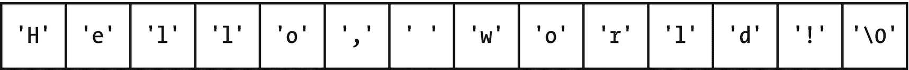
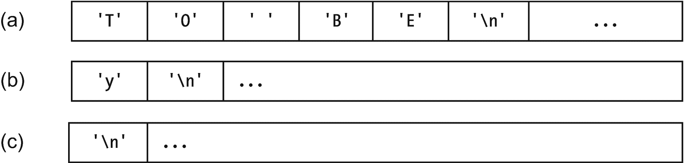

# 十四、字符数组和动态内存

字符数组——也称为“字符串”或文本——对许多任务都很重要。本章展示了如何处理它们，以及如何在事先不知道大小的情况下创建这些或其他数组。在这个过程中，我们将尽可能以最有效的方式学习标准库的字符数组函数:通过构建它们。

## 字符数组

我们从一开始就使用了`char`数组。我们从第 1 章和第 13 章引用的`"Hello, world!"`是一个字符数组，内容如图 [14-1](#Fig1) 所示。



图 14-1

“你好，世界！”字符数组文字

“空字符”是一个标记，告诉 C++ 这是我们的字符串结束的地方。`cout`不是在到达分配空间的末端时停止打印——它不知道也不关心分配了多少空间——而是在到达`'\0'`时停止打印。

让我们看看除了打印之外，我们还能用`char`数组做什么。

这里有两种方法来初始化一个字符数组:

```cpp
char A[] = {'d','o','g','\0'}; // they both

mean the same thing
char A[] = "dog";              // but this one's easier to read,
                               //   don't you think?

```

你也可以从`cin`或输入文件中把一个单词读入字符数组。我们需要确保我们声明的数组有足够的空间容纳输入的内容。我们通过分配比我们可能需要的更多的字符来做到这一点:

```cpp
constexpr int MAX_STRING_SIZE = 250;
char      name[MAX_STRING_SIZE];
cout << "What's your name? "; cin >> name;

```

那段代码读起来一个字。如果你想让**读取整行**(也许你想让用户输入名字和姓氏)，你需要`cin.` `getline` `(name, MAX_STRING_SIZE);`。

我们可以**将数组传递给函数**。在示例 [14-1](#PC3) 中，我们有一个函数打印一个问题并得到一个有效的是或否的答案。我们不打算改变数组，所以我们把它作为`const`传递。

```cpp
bool getYorNAnswer (const char question[])
{
   char answer;

   do
   {
        cout << question;          // print a question
        cin  >> answer;            //   ...and get an answer
        answer = toupper (answer); //   capitalized, so we can compare to Y, N
    }
    while (answer != 'Y' && answer != 'N');
                                   // keep asking till we get Y or N
    return answer == 'Y';          // "true" means "user said Y"
}

Example 14-1A function that takes a char array as a parameter. Since it’s short, it and Example 14-2 are together in source code folder ch14, in project/folder 1-and-2-charArrays

```

如果我们这样称呼`getYorNAnswer`

```cpp
getYorNAnswer ("Ready to rumble (Y/N)? ")   // same question, and reasoning,
                                            // as in Chapter 5's
                                            // section on while and do-while

```

我们的交互可能看起来像这样

```cpp
Ready to rumble (Y/N)? x
Ready to rumble (Y/N)? 7
Ready to rumble (Y/N)? y

```

…此时`getYorNAnswer`将返回`true`。

现在让我们看看一个字符串有多长——不是分配的内存，而是正在使用的部分，直到空字符:

```cpp
where = 0
while the whereth char isn't the null character (not at end of string)
  add 1 to where

```

例 [14-2](#PC7) 是完整版。

```cpp
unsigned int myStrlen (const char str[]) // "strlen" is the conventional
                                         //    name for this function
{
    int where = 0;

    while (str[where] != '\0')   // count the chars
        ++where;

    return where;                // length is final "where"
}

Example 14-2The myStrlen function

. Find it and Example 14-2 in source code folder ch14, in project/folder 1-and-2-charArrays

```

该功能和其他功能已经在包含文件`cstring`中提供。表 [14-1](#Tab1) 列出了最常用的。

表 14-1

一些`cstring`功能，为清晰起见进行了简化

<colgroup><col class="tcol1 align-left"> <col class="tcol2 align-left"></colgroup> 
| `unsigned int`<sup>[1](#Fn1)T4】</sup>`strlen (const char myArray[]);` | 返回`myArray`中字符串的长度(到空字符为止有多少个字符)。 |
| `void strcpy (char destination[],``const char source[]);` | 将`source`的内容复制到`destination`中。 |
| `void strcat (char destination[],``const char source[]);` | 将`source`的内容复制到`destination`的末尾。如果您在包含`"Mr."`和`"Goodbar"`的参数上调用`strcat`，那么得到的目的地将是`"Mr.Goodbar"`。 |
| `int strcmp (const char a[],``const char b[]);` | return-1 如果按字母顺序`a`在`b`之前，如`strcmp ("alpha", "beta")`；如果相同，则为 0；如果`a`在`b,`之后，如`strcmp ("beta", "alpha")`所示，则为 1。 |

Note

如果 Microsoft Visual Studio 看到`strcpy`、`strcat`等等，它可能会给出警告:

`warning C4996: 'strcpy'`:此函数或变量可能不安全。考虑改用`strcpy_s`。`use _CRT_SECURE_NO_WARNINGS`禁用折旧。有关详细信息，请参见联机帮助。

`strcpy_s`和`strcat_s`是`strcpy`和`strcat`的版本，它们试图阻止你写超出数组的界限。听起来很明智，但这通常不会流行起来。我不使用它们，因为我希望代码可以在编译器之间移植。或者我只是喜欢生活在边缘。<sup>2[2](#Fn2)T7】</sup>

要取消警告，请将这一行放在引用`strcpy`的任何文件的顶部，依此类推:

`#pragma warning (disable:4996) // disable warning about // strcpy, etc.`

### 防错法

*   **在调试器** **中，你看到你的** `char` **数组看似合理，但到了最后却充满了随机字符。**没事；无论如何都不会打印或使用超过`'\0'`的内容。可以忽略。

*   **你看到你的** `char` **数组中合理的字符被打印出来，然后后面跟着多余的垃圾**。字符串缺少最后一个`'\0'`。解决方案:在末尾插入`'\0'`。

*   **It acts like it’s gotten some of your input before you had a chance to type it.** (If using file I/O, it skips part of the file.) Here’s an example:

    ```cpp
    do
    {
        cout << "Enter a line and I'll tell you how long it is.\n";
        cout << "Enter: "; cin.getline (line, MAX_LINE_LENGTH);

        cout << "That's " << strlen (line) << " characters.\n";

        letsRepeat = getYOrNAnswer ("Continue (Y/N)? ");
    }
    while (letsRepeat);

    ```

    第一次，你很棒。之后每次你说要再来一次，它就说你的线长是 0，问你要不要继续。

    想象一下`cin`提供了一个从键盘发送到程序的字符序列，如图 [14-2](#Fig2) 。



图 14-2

`cin`缓冲区 <sup>[3](#Fn3)</sup> ，以用户键入的任何内容作为其内容

在(a)中，你已经输入了你的第一行，`TO BE`。`cin.getline`通过`'\n'`获得所有这些。

在(b)中，您已经输入了对`"Continue (Y/N)?"`问题的回答。

(c)中，`getYOrNAnswer`做了*其* `input: cin>>answer. answer`变成了“`y`”，`getYOrNAnswer`做了。

我们准备再次开始循环并获得更多的输入……但是看看在`cin`缓冲区中留下了什么:一个供`cin.getline`读取的字符串。这是一个空字符串，就像你什么也没输入就按了 Enter 键，但它仍然是一个字符串。所以`cin.getline`不会等你打字；它继续读取那个空字符串…然后我们回到`getYOrNAnswer`被询问是否要继续。

我们需要在`cin.getline`被愚弄之前甩掉剩下的`'\n'` `getYOrNAnswer`。这里有两种方法:

*   `cin.getline`再来，就是为了摆脱`'\n'`。

*   `cin.ignore (MAX_LINE_LENGTH, '\n');`。这忽略了从`MAX_LINE_LENGTH`到第一个`\n`的所有`char`，以先出现的为准。

我觉得还是放在`getYOrNAnswer`里吧；是提出问题的函数给我们带来了麻烦，所以它应该自己清理:

*   `cin >>` **读入一个** `char` **数组，但是走得太远，覆盖了其他变量。让你的`char`数组变大，希望没人输入超长的东西。C++20 通过只接受最大可用大小来防止这个问题，但是你的编译器可能还不支持这个特性。**

*   `cin` **不会读入作为参数传入的数组。**见下一节最后一个反欺诈条目。

```cpp
bool getYOrNAnswer (const char question[])
{
    ...

    cin.ignore (MAX_LINE_LENGTH, '\n'); // dump rest of this line

    return answer == 'Y';
}

```

Online Extra

“当你在字符串末尾发现垃圾的那一刻”:在 YouTube 频道“以懒惰的方式编程”，或者在 [`www.youtube.com/watch?v=57jkYKwN9hg`](http://www.youtube.com/watch%253Fv%253D57jkYKwN9hg) 。

Exercises

1.  编写并测试`myStrcpy`，你自己版本的`strcpy`函数，如表 [14-1](#Tab1) 所述。(本章后面有答案。)为了测试它是否真的把`'\0'`放在了末尾，在复制之前用 x 填充目标数组(比如说)。

2.  编写并测试你的`strcat`版本。

3.  …和`strcmp`。

4.  询问用户的姓名，并重复一遍。如果第一个字母是小写的，那就大写。

5.  (使用文件 I/O)确定给定文件中的行数。

6.  (使用文件 I/O)…以及它们的平均长度。

7.  (使用文件 I/O)编写一个程序，找出并打印两个给定文件之间的共同点。假设每个单词在一个文件中最多出现一次。

## 数组的动态分配

有时直到程序运行时你才知道数组应该有多大。但这是行不通的:

```cpp
int size;
// calculate size somehow
int A[size];// compiler should complain: size must be a constant value

```

以下是应该做的事情。

首先，声明数组，但不为其元素分配内存:

```cpp
int* A;

```

`A`不是一组`int`的集合，而是一些`int`的“指针”的地址。这就像我们用`[]`声明它时一样，但是还没有为那些`int`存储。

接下来，给它需要的内存:

```cpp

A = new int [size];

```

这就要求 C++ 的一部分,“堆管理器”给我们这么多的`int`中的一部分。有一整堆的内存可用于此，堆管理器可以在你需要的任何时候给你其中的一部分。这被称为“动态分配”，因为它是在程序运行时发生的。到目前为止，我们在编译时进行分配的方式是“静态分配”(以这些方式分配的内存称为“动态”或“静态”)

我们像以前一样使用数组。完成后，我们告诉堆管理器它可以取回它，因此:

```cpp

delete [] myArray;

```

对堆管理器来说，这是一个提醒，你所返回的是一个数组。如果你忘记了`[]`，唉，编译器不会告诉你——你得记住你自己。

总之，要“动态分配”任何`<type>`的数组:

1.  `<type>* myArray = new <type> [size];`。

2.  像平常一样使用数组。

3.  当你完成后。

很容易忘记`delete []`。有关系吗？当然可以。如果你一直分配内存并且从来不归还——如果你一直做****【内存泄漏】**——内存最终耗尽，程序崩溃。以后我们会有一种方法让删除变得更容易记忆。**

 **示例 [14-3](#PC14) 展示了如何使用动态分配。

```cpp
// Program to generate a random passcode of digits

//       -- from _C++20 for Lazy Programmers_

#include <iostream>
#include <cstdlib> // for srand, rand
#include <ctime>   // for time

using namespace std;

int main ()
{
    srand ((unsigned int) time(nullptr));//  start random # generator

    int codeLength;                      //  get code length
    cout<< "I'll make your secret passcode. How long should it be? ";
    cin >> codeLength;

    int* passcode = new int[codeLength]; //  allocate array

    for (int i = 0; i <codeLength; ++i)  //  generate passcode
        passcode[i] = rand () % 10;      //  each entry is a digit

    cout << "Here it is:\n";             //  print passcode
    for (int i = 0; i < codeLength; ++i)
        cout << passcode[i];
    cout << '\n';
    cout << "But I guess it's not secret any more!\n";

    delete [] passcode;                  //  deallocate array

    return 0;
}

Example 14-3A program that dynamically allocates, uses, and deletes an array of ints

```

以下是一个会话示例:

```cpp
I'll make your secret passcode. How long should it be? 5
Here it is:
14524
But I guess it's not secret any more!

```

Extra

1992 年，人工智能研究员 Edmund Durfee 在全国人工智能会议(AAAI-92)上做了一次受邀演讲，“你的计算机需要知道的，你在幼儿园就学会了”——引用了罗伯特·富尔亨的畅销书*我真正需要知道的一切我在幼儿园就学会了*。以下是 Durfee 所说的你的电脑从你的早期儿童教育中需要的:

*   分享一切。

*   公平竞争。

*   不要打人。

*   把东西放回原处。

*   收拾你自己的烂摊子。

*   不要拿不属于你的东西。

*   当你伤害别人时，说对不起。

*   同花。

*   当你走向世界时，注意交通，手拉手，团结在一起。

*   最终，一切都会消亡。

    其中许多在操作系统中是有用的。也许你有一个占用内存和 CPU 时间的程序，所以如果你想和一个不同的程序交互，你不能。(分享一切。)也可能只有占满整个屏幕才能运行。(公平竞争。)

    就记忆而言，我们需要“把东西放回你发现它们的地方。”就像蜡笔和玩具一样，如果我们总是把它们放回去，就更容易找到我们需要的东西。

### 防错法

动态内存最常见的问题是程序崩溃。可能是什么原因造成的？

*   **忘记初始化:**如果你还没有初始化`myArray`，它的地址指向某个随机的位置。它几乎肯定会崩溃。这比得到错误的输出却不知道要好。

防止这种情况的两种方法如下:

`int* A = new myArray[size]; // initialize as soon as you // declare`

或者

`int* A = nullptr; // we'll initialize to something // sensible later`

按照惯例，`nullptr`的意思是“不指向任何地方，所以不要考虑查看任何元素。”在老的程序中，不是`nullptr`而是`NULL`。

*   **忘记** **删除** **:** 长时间这样做，程序会耗尽内存并崩溃。

*   **忘记使用** `delete []`中的 `[]` **:这会导致“未定义的行为”，这意味着它可能会崩溃，表现完美，或者引发第三次世界大战。我不会冒这个险。**

其他问题包括:

*   **错误声明** **一行多指针**:很奇怪，但是

    `int* myArray1, myArray2;`

    *没有*创建两个指针。它创建了一个`int`指针`myArray1`和另一个(单个)`int myArray2`。为什么这么困惑？这是 C 标准遗留下来的东西。解决方案:

    `int* myArray1;`

    `int* myArray2;`

*   **在不必要的时候使用动态内存**:这不是错误，但会导致错误。动态记忆有更多可能出错的地方；你必须记住用`new`分配，用`delete`解除分配。如果你没有任何收获(比方说，如果你在编译时知道你的数组有多大)，给自己省点事；按老办法分配。

*   **cin 不会读入你动态分配的数组或者你的数组作为函数参数传入:**

```cpp
void read (char str [])
{
    cin >> str;                                   // compile-time //   error
}

int main ()
{
    char  s1 [FIXED_SIZE];             cin >> s1; // No problem
    char* s2 = new char[someSize];     cin >> s2; // compile-time //   error
...
}

```

正如前面的反阻塞部分所提到的:当`cin`知道它要读入的数组的大小时，就像它对`s1`所做的那样，它只读入它有空间的数组。 <sup>[4](#Fn4)</sup> 但是如果给它一个动态数组什么的传入作为参数，它不知道；它*可能*读入太多，并超过数组界限。C++20 标准通过说“不，你不能这样做”来解决这个问题，因此导致了一个新的问题:编译时错误。

公平地说，这是一个巨大的安全漏洞。

我的解决方法是总是读入一个本地声明的固定大小的数组，并从该数组复制到动态数组或传入的数组中:

```cpp
static char buffer [REALLY_BIG_NUMBER];
if there is room in str to store what we get, then
    strcpy (str, buffer);
else
    complain

```

Exercises

1.  询问用户的姓名。您需要一个足够长的缓冲区来存储任何合理的名称。然后把它存储在一个足够长的数组里。

2.  (使用 SSDL)询问用户要画多少颗星星；生成随机星阵列；画出来。根据需要使用函数。

3.  (使用文件 I/O)编写一个程序，计算文件中的行数(参见上一节中的练习 5)，动态分配一个数组来存储这些行，并将它们全部读入。提示:您可以打开文件，计算行数，关闭它，然后再打开它。

4.  (更难)动态分配一个游戏板，像棋盘但大小可变。我不能只分配一个二维数组，所以我们只能用一维数组来凑合。决定它的大小以及如何访问第<sup>行</sup>，第<sup>列</sup>的位置。

5.  (使用 SSDL；硬)自己写位图:动态分配的数组，每个数组包含图像中一个像素的颜色。和前面的练习一样，我们需要使用一个一维数组。

    提供渲染功能；给定位图、屏幕上的起始位置以及位图的宽度和高度，在该位置显示位图。要绘制像素，请使用`SSDL_SetRenderDrawColor`和`SSDL_RenderDrawPoint`。

    位图作为一个`struct`，包含数组加上宽度和高度，这是一个好主意吗？

## 使用*符号

我们已经使用了`*`来声明动态分配的数组:

```cpp
double* myArray = new double[sizeOfArray];

```

我们也可以用它来指代单个元素。`*A`的意思是`A[0]`，因为`*A`的意思是“什么`A`指向什么”，而`A`指向第 0 个元素。

`*(A+1)`的意思是`A[1]`。编译器足够聪明，知道`A+1`意味着下一个元素的地址。(像这样给指针加上一些东西叫做“指针算术”。)

`A[1]`比`*(A+1)`更容易阅读——那么为什么要用这种新的符号呢？一个原因是让你为我们稍后将和`*`一起做的事情做好准备。

另一个是这个有趣的遍历数组的新方法。考虑本章“字符数组”一节的练习 1 中的`myStrcpy`函数。下面的代码片段是在`ch14/strcpyVersions`中收集和编译的。

```cpp
void myStrcpy (char destination [], const char source[])
{
    int i = 0;

    while (source[i] != '\0')
    {
        destination[i] = source[i];
        ++i;
    }

    destination[i] = '\0'; // put that null character at the end
}

```

这里有一个不使用`[]`的版本:

```cpp
void myStrcpy (char* destination, const char* source)
{
    int i = 0;

    while (*(source + i) != '\0')
    {
        *(destination + i) = *(source+i);
        ++i;
    }

    *(destination + i) = '\0'; //  put null character at the end
}

```

没有明显的改善，但它会起作用。接下来，我们取消使用`i`，直接更新`source`和`destination`:

```cpp
void myStrcpy (char* destination, const char* source)
{
    while (*source != '\0')
    {
        *destination = *source;
        ++source; ++destination;
    }

    *destination = '\0'; //  put null character at the end
}

```

有用吗？是的。现在我们每次遍历循环时都要给`source`加 1——所以每次，它都指向它的下一个元素(对于`destination`也是如此)。当`source`到达空字符时，循环停止。

记住测试条件时，0 表示`false`，其他都表示`true`(第 4 章)。所以`while (*source != '\0')`可以写成

```cpp
while (*source) // if *source is nonzero -- "true" -- we continue

```

因此，我们可以将函数写成

```cpp
void myStrcpy (char* destination, const char* source)
{
    while (*source)
    {
        *destination = *source;
        ++source; ++destination;
    }

    *destination = '\0'; // put null character at the end
}

```

这是我真正应该停止的地方。习惯了就可读了；它很短，给了我们用*符号的练习，我们会在第 20 章及以后经常用到。但是现在退出太有趣了。

回忆第 5 章中的后增量运算符(如`X++`)。`Y=X++;`真正的意思是`Y=X; X=X+1;`。获取值，然后递增。

在这里，我们可以将它用于目的地和源——因为我们使用它们的值进行赋值，然后递增。

```cpp
void myStrcpy (char* destination, const char* source)
{
    while (*source)
        *destination++ = *source++;

    *destination = '\0'; // put null character at the end
}

```

还记得,`X=Y`的值是分配的值——在`*destination++ = *source++`的情况下就是简单的`*source`。只要这个非零，我们就想继续下去:

```cpp
void myStrcpy (char* destination, const char* source)
{
    while (*destination++ = *source++); *destination = '\0';
}

```

这近乎邪恶和粗鲁。我不想这样写我的代码，但是它*的确*展示了我们通过使用`*`获得的灵活性。

Note

被称为“解引用”操作符——因为它接受一个对象的引用(地址)并给出对象本身。

`&`是它的反义词:“reference”运算符。它接受一个对象并给你地址:

```cpp
int x;
int* addressOfX = &x;

```

我在 C++ 里不经常用；它在 C 中更有用，C 中缺少我们的引用参数，引用参数也使用符号`&`。这让生活更加混乱。啊，好吧。如果`*`可以表示取整`(*addressOfX` ) *和*相乘(`x*y`，我想`&`也可以表示不止一个意思。

### 防错法

*   **编译器抱怨你正在用一个字符串常量**初始化一个 **char*** **，就像在`char* str = "some string";`中一样。**

    改为说`char str[] = "some string";`。

Exercises

在所有这些练习中，使用`*`符号，而不是`[]`符号。

1.  写`strcmp`。

2.  …对我们的其他基本字符数组函数做同样的事情。

3.  (Harder) Write and test a function `contains` which tells if one character string contains another. For example,

    ```cpp
    contains ("'Twas brilling, and the slithy toves"
              " did gyre and gimble in the wabe",
              "slithy")

    ```

    会返回 true。

4.  (Harder) Write a function `myStrtok` which, like the `strtok` in `cstring`, gets the next word (“token”) in a character array. It might be called thus:

    ```cpp
    char myString[] = "Mary Mary\nQuite contrary";
    const char* nextWord = myStrtok (myString, " \t\n\r");
                          // I use space, tab, return, and
                          // the less-used carriage return \r
                          // as "delimiters": separators
                          // between words
    while (nextWord)
    {
        cout << "Token:\t" << nextWord << '\n';
        nextWord = myStrtok (nullptr, " \t\n\r");
    }

    ```

    预期产出:

    `Token: Mary`

    `Token: Mary`

    `Token: Quite`

    `Token: contrary`

    当你第一次为一个给定的字符串调用它时，它应该返回一个指向第一个单词的指针。(如果没有，则返回`nullptr`。)然后，每次你传入`nullptr`，它会给出你之前使用的字符串中的下一个单词——用完时返回`nullptr`。

    您将需要上一个练习中的`contains`函数。您还需要一个`static`局部变量。

    就像编译器的`strtok`一样，您可以随心所欲地修改输入字符串。通常的方法是将`'\0'`放在您希望当前返回的令牌结束的地方，覆盖一个空白字符。

<aside aria-label="Footnotes" class="FootnoteSection" epub:type="footnotes">Footnotes [1](#Fn1_source)

这实际上是`size_t`:源自`unsigned int`的一种类型，用于变量的大小，尤其是数组。它不是内置的，但是包含在各种头文件中——包括`cstring`——我们在这里不使用，所以我现在忽略它。

  [2](#Fn2_source)

还有另一组*函数——这是标准的一部分——试图阻止你在字符数组中走得太远:*

`char* strncpy (char *destination, const char *source, size_t n);`

`char* strncat (char *destination, const char* source, size_t n);`

`...`

当您复制`n`字符时，这些功能会退出。我很愿意使用它们，但是它们也可能会出错:如果`source`太长，它会在`destination`的末尾加上 no `’\0’`，打印它会得到一些奇怪的结果。

在第 17 章，我们将得到一个更好、更安全的处理字符串的方法。

  [3](#Fn3_source)

缓冲区:临时存储器，尤其是用于 I/O。

  [4](#Fn4_source)

但是数组不会记录它们的大小，不管它们是如何被分配的，这是真的吗？没错，但是在编译时，编译器知道并且能够设置好，所以`cin >>`使用了正确的界限——这是一个高级的话题。

 </aside>**