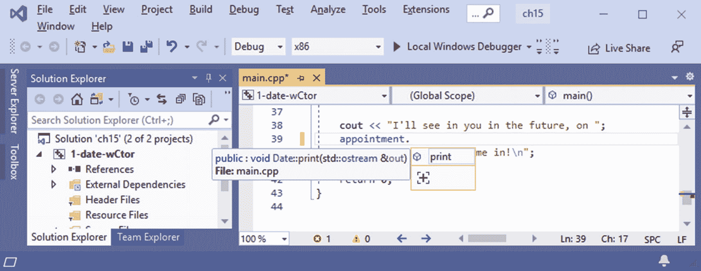
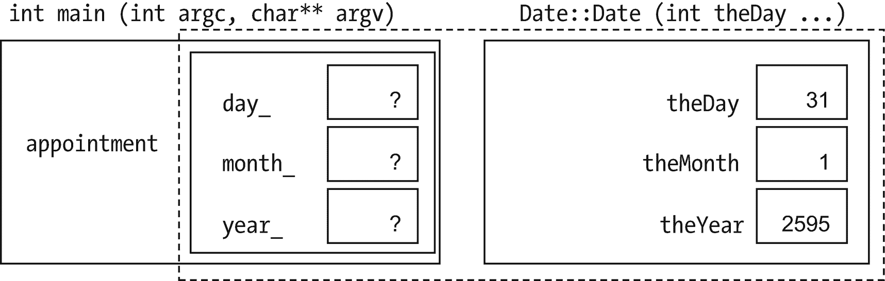
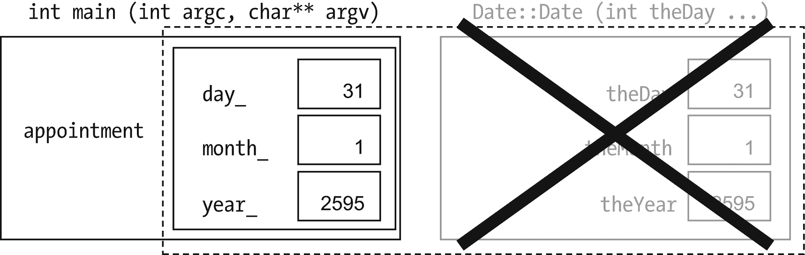
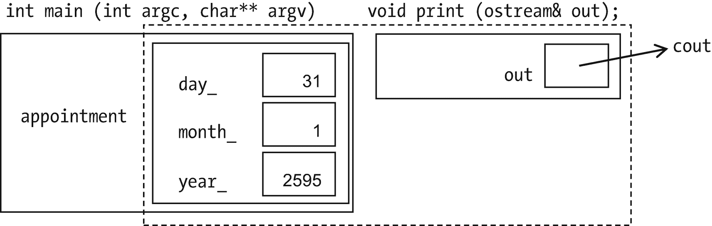
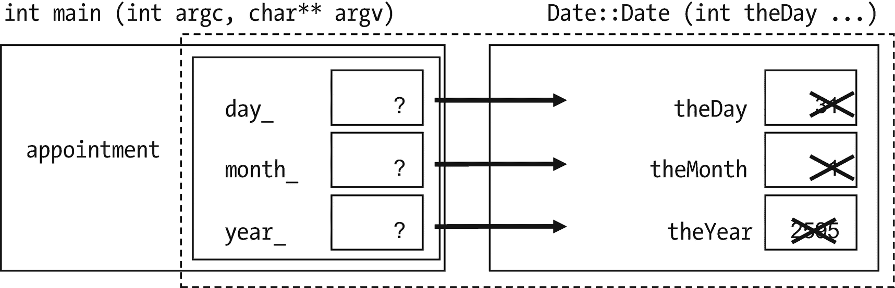

# 十五、类

到目前为止，我们所介绍的基本上都是 C 语言，只是做了一些调整，特别是`cin`和`cout`。现在是时候添加在 C++ 中放置+的东西了:类。他们不会给我们新的能力，比如`cin` / `cout`、SSDL 函数，或者像循环这样的控制结构。他们*将*做的是帮助我们保持事情有条理，这样我们就不会混淆；尽量减少错误；让表达事情变得更简单——这样我们就可以信任我们写的代码，并将其用于更大更好的项目。

例如，这里有一个存储日历日期的类类型:

```cpp
class Date
{
    int day_;
    int month_;
    int year_;
};
...
Date appointment; // Variables of a class type are called "objects"
                  // Using the term makes you sound smart at job interviews

```

我们可以用一个`struct`来完成。就像使用`struct` s 一样，我们可以声明这种类型的变量，将它们作为参数传递，使用`.`(点号)来获取部分，等等——看起来非常相似。但是我们即将找到重用代码和避免错误的新方法。

第一种方式:我不想让`day_`、`month_`和`year_`在程序的任何部分都可用；他们可能会搞砸。我将允许某些函数访问它们，称为**成员函数**。

这个安全措施来自一个可能更容易记住的隐喻。考虑物理世界中的物体。一个物体——比如说，一个橡胶球——有一些特征:也许它是红色的，有弹性，有一定的质量和成分。你不能只是在你想要的时候把那些特征设置成你想要的。可以把真球上的色域设置成蓝色吗？叫它轻如鸿毛？相反，对象本身提供了与它交互的方式。不能设置色域，但是可以上色。你不能直接改变它的质量，但是你可以做一些事情来改变它的质量，比如切掉它或者烧掉它。你不能把它的位置设置成 90 公里直上，但你可以扔出去，看它能飞多远。

我们将以同样的方式创建我们的类:用特征(成员变量)和方法(成员函数)与这些特征进行交互。

那么，如何处理`Date`才是合适的呢？首先，您可以打印它:

```cpp
class Date

{
public:
    void print (ostream&);1

private:
    int day_;
    int month_;
    int year_;
};

...

Date appointment;

...

appointment.print (cout); // or we could pass in a file variable -- see //   Chapter 13

```

public 部分是为外界(比如`main`)可以访问的东西准备的:也就是说，`main`可以告诉一个`Date`打印自己。私有部分是只有`Date`可以直接访问的部分。(如不注明，均为私人。) <sup>[2](#Fn2)</sup>

一个类的 BNF 大致是

```cpp
class <name>
{
public:
  <function declarations, variables, and types;
  usually declarations, almost never variables>
private:
  <function declarations, variables, types; usually variables>
};

```

看前面的`print`调用。为什么我们不告诉`appointment`日、月和年？它已经知道-它包含了它们！它不知道我们是想打印到`cout`还是一个文件，所以我们必须告诉它。

我还没说*怎么*打印呢。以下是如何:

```cpp
void Date::print (std::ostream& out)
{
    out << day_ << '-' << month_ << '-' << year_;
}

```

“`Date` `::`”告诉编译器，“这不仅仅是一个名为`print`的函数——它是属于`Date`的函数。”

当你调用它的时候——`appointment.print (cout);`——它会打印谁的`day_`？`appointment`夏侯惇

如果你正在使用一个友好的编辑器，比如微软的 Visual Studio，当你输入`appointment`和一个句号(见图 [15-1](#Fig1) ，编辑器会列出可用的成员函数——到目前为止，只有`print`，但是我们很快会有更多的。你可以点击一个，它会为你粘贴。加上开头部分，它会提醒你它期望什么样的论点。



图 15-1

Microsoft Visual Studio 提示函数声明信息

`Date::`也一样。它会列出可用的成员。

如果没有，不用担心；有时编辑会感到困惑。

## 构造器

我们已经知道初始化变量是明智的。在类中，我们有一个特殊类型的函数叫做**构造器**(常见的缩写是“ctor”)来做这件事(见例子 [15-1](#PC5) 中突出显示的部分)。

```cpp
// A program to print an appointment time, and demo the Date class
//   ...doesn't do that much (yet)
//       -- from _C++20 for Lazy Programmers_

#include <iostream>

using namespace std;

class Date
{
public:
    Date (int theDay, int theMonth, int theYear); // constructor declaration

    void print (std::ostream& out);

private:
    int day_;
    int month_;
    int year_;
};

Date::Date (int theDay, int theMonth, int theYear) :     // ...constructor //   body
    day_ (theDay), month_ (theMonth), year_ (theYear)
    // theDay is the parameter passed into the Date constructor
    //   function.  day_ is the member that it will initialize.
{
}

void Date::print (std::ostream& out)
{
    out << day_ << '-' << month_ << '-' << year_;
}

int main ()
{
    Date appointment (31, 1, 2595);3

    cout << "I'll see in you in the future, on ";
    appointment.print (cout);
    cout << " . . . pencil me in!\n";

    return 0;
}

Example 15-1The Date class, with a constructor, and a program to use it

```

构造器的名字总是和它的类一样。当你声明一个类`Date`的变量时，它调用这个函数来初始化成员变量。(没有返回类型；本质上，构造器“返回”对象本身。)

函数定义的第二行

```cpp
day_ (theDay), month_ (theMonth), year_ (theYear)

```

告诉它将`day_`初始化为等于`theDay`等等。当我们到达`{}`的时候，已经没什么可做的了，所以这次`{}`是空的。

相反，您可以在函数体中初始化，使用`=`:

```cpp
Date::Date (int theDay, int theMonth, int theYear)
{
    day_ = theDay; month_ = theMonth; year_ = theYear;
}

```

然而，带有`()`的成员初始化语法更常见，更不容易出错(参见反调试部分)，并且在某些情况下是必要的，所以现在养成这种习惯是比较懒惰的。

为了形象化成员函数如何与数据成员交互，考虑示例 [15-1](#PC5) 中发生的情况。`main`的第一个动作是为`appointment`分配空间，调用其构造器(图 [15-2](#Fig2) )，传入参数。我把构造器画在了`main`之外，因为它*是*一个单独的函数……但它是`appointment`的一部分，所以我用虚线把它和数据成员统一起来。



图 15-2

调用`Date`构造器

构造器将`theDay`复制成`day_`、`theMonth`复制成`month_`、`theYear`复制成`year_`(图 [15-3](#Fig3) )。


图 15-3

`Date`构造器初始化`appointment`的数据成员

完成后，构造器离开(图 [15-4](#Fig4) )。



图 15-4

`Date`构造器完成

这显示了(例如)成员`day_`和构造器参数`theDay`的不同角色:`day_`是持久的并且记住你的约会的日期部分；`theDay`是`Date::Date`用来将信息从`main`传递到`day_`的参数，当构造器`Date::Date`完成时，该参数消失。

此后，`main`继续，打印`"I'll be getting up at "`，然后进入`appointment`的`print`功能，该功能了解`day_`、`month_`、`year_`(图 [15-5](#Fig5) )。



图 15-5

调用`appointment`的`print`函数

Golden Rule of Member Function Parameters

不要传入对象的数据成员。该函数已经知道它们。

### 防错法

*   **构造器被调用，但数据成员从未被初始化。**如果我们使用这个构造器

    ```cpp
    Date::Date (int theDay, int theMonth, int theYear)
    {
         theDay   = day_;
         theMonth    = month_;
         theYear   = year_;
    }

    ```

也许我们会得到奇怪的输出

`I'll see in you in the future, on -858993460--858993460--858993460...pencil me in!`

我已经将`day_`和`theDay`交换了位置，所以我正在从复制*我想要初始化的数据成员(显然其中有-858993460——有未初始化的变量，你永远不知道)*到*有我想要的值的参数(图 [15-6](#Fig6) )。*



图 15-6

一个完全颠倒的构造器

如果你在`{`前使用`()`的初始化方法，就不会发生这种情况，例如 [15-1](#PC5) 。如果你试图初始化错误的东西，它会报告一个错误。

Exercises

1.  写一个`Time`类，用于记住早上什么时候起床，什么时候午睡等等。包括相关的数据成员、打印函数以及适当的构造器。

2.  编写并测试一个函数`Time currentTime()`。它会调用`time`(就像我们初始化随机数生成器一样)，获取 1970 年 1 月 1 日以来的秒数。我们只关心从午夜开始的秒数。将其转换为秒、分和小时，并返回当前的`Time`。*当前*是*不是*的成员`Time`。

3.  像前一个问题一样，用调用`time`的函数`Date currentDate ()`来扩充`Date`程序，并获得当前的`Date`。该功能是*而不是*的`Date`成员。我之前假设时间从 1970 年 1 月 1 日开始，在你的机器上正确吗？

4.  (更难)添加一个函数`Date::totalDays ()`，该函数返回自公元前 1 年 12 月 31 日以来的天数。你需要处理闰年。项目`2-date-bestSoFar`中的示例代码中有一个解决方案。

5.  (更难)添加一个函数`Date::normalize ()`，如果`Date`有一个或多个字段超出范围，该函数将进行修正:例如，`Date tooFar (32, 12, 1999);`将使`tooFar`成为日期 1-1-2000。它应该由构造器调用。一个解决方案就在本书的样本代码项目`2-date-bestSoFar`中。

有没有更简单的方法写`normalize`和`totalDays`？

## `const`对象，`const`成员函数…

考虑以下代码:

```cpp
const Date PEARL_HARBOR_DAY (7, 12, 1941);

cout << "A date which will shall live in infamy is ";
PEARL_HARBOR_DAY.print (cout);
cout << ".\n";

```

认为`PEARL_HARBOR_DAY`是一个常量是合理的，因为它永远不会改变(除非你有一台工作的时间机器)。然而，如果我们把它设为`const`，代码将不再编译。为什么不呢？

C++ 区分了能改变对象的成员函数和不能改变对象的成员函数。这是防止错误的一种方法。如果`print`是那种可以改变`Date`的东西，我们就不应该允许它在常量`Date`上被调用。

由于`print` *对于`const`对象来说是*安全的，我们将这样告诉 C++:

```cpp
class Date
{
   ...

   void print (std::ostream&) const;

   ...
};

void Date::print (std::ostream& out) const
{
   out << day_ << '-' << month_ << '-' << year_;
}

```

在`()`后面的单词`const`告诉编译器这个函数可以用于常量对象。它还告诉编译器，在编译`print`时，如果对数据成员做了任何更改，就会产生一个错误。

如果你遇到很多错误，有时很容易将单词`const`从你的程序中完全删除。抵制这种诱惑。这个特性确实可以保护我们免受真正的错误。

### 防错法

*   **你会得到关于从**转换到`const`的错误。这通常意味着您忘记了成员函数声明末尾的`const`(以及其函数体的第一行)。

*   它说你的成员函数体和声明不匹配，但是它们看起来确实一样。检查他们都是或者都不是。

## …和`const`参数

假设我们想将一个`Date`传递给一个函数`fancyDisplay`，它以一种可爱的方式打印时间:

```cpp
void fancyDisplay (Date myDate, ostream& out)
{
   cout << "*************\n";
   cout << "* "; myDate.print (out); cout << " *\n";
   cout << "*************\n";
}

```

我没有用`&`来表示`myDate`，所以`myDate`本身不是传入的，而是一个副本。

在某种程度上，这很好，因为我们不想改变`myDate`。但是复制的成本比仅仅`int`要高——三倍多，因为它有三个`int`。当我们创建更大的类时，我们可能会发现它会减慢我们的程序。

以下是部分解决方案:

```cpp
void fancyDisplay (Date& myDate, ostream& out);

```

这并不完美，因为现在我们允许`fancyDisplay`改变`myDate`！这更好:

```cpp
void fancyDisplay

(const Date& myDate, ostream& out);

```

现在`fancyDisplay`不会花时间去复制`myDate`*也改不了。*

*Golden Rule of Objects as Function Parameters

如果你想改变一个作为参数传入的对象，把它作为`TheClass& object`传递。

如果没有，作为`const TheClass& object`传递。

## 多个构造器

没有必要将我们自己局限于一个构造器。我们可能想用其他方式来创造`Date` s:

```cpp
Date d (21, 12, 2000);         // using our old constructor...
Date e (d);                    // e is now exactly the same as d
Date f;                        // now one with no arguments
Date dateArray [MAX_DATES];    // still no arguments
Date g (22000);                // 22,000 days -- nearly a lifetime

```

让我们一个一个来看。

### 复制构造器

`Date`的复制构造器将另一个`Date`作为唯一参数。我们称之为这个是因为它复制了(咄):

```cpp
Date::Date (const Date& other) :     // "copy" constructor
    day_(other.day_), month_(other.month_), year_(other.year_)
{
}

```

这份宣言使用了它

```cpp
Date e (d);

```

这个也是

```cpp
Date e {d};

```

还有这个:

```cpp
Date e = d; // Looks like =, but it's really calling the copy ctor

```

这种形式被称为“语法糖”:让代码更具可读性的不必要的东西。

复制构造器还有一些特殊之处。如果 C++ 需要复制一个`Date`，它会隐式地调用**，也就是说，不用你告诉它。这里有两个例子:**

```cpp
void doSomethingWithDate (Date willBeCopied);
                           // I'd rarely do this, but if I did...
Date currentDate ();       // No &, so it returns a copy

```

不写复制构造器怎么办？C++ 会对如何复制做出最好的猜测，而这种猜测有时是危险的错误。一个好的规则:*总是指定复制构造器*。

### 默认构造器

```cpp
Date::Date () :     // "default" ctor

    day_ (1), month_ (1), year_ (1)    // default is Jan 1, 1 AD
{
}

...

Date f; // or: Date f {};
Date dateArray[MAX_DATES];

```

如果你不知道如何初始化你的`Date`，你什么也不告诉它，它使用它的**默认构造器**:不带参数的那个。它还需要这个来初始化日期数组的元素。 <sup>[4](#Fn4)</sup> 所以我们总是写默认的构造器。

### 转换构造器

此构造器调用

```cpp
Date g (22000); // or Date g {22000}; -- or Date g = 22000;

```

需要将这些太多的日子转换成更传统的日、月、年安排。我将使用前面练习 5 中的函数`normalize`;如果我们给它 22，000 天，它会将其转换为 26 天、3 个月和 61 年:

```cpp
Date::Date (int totalDays) :    // conversion ctor from int
    day_ (totalDays), month_ (1), year_ (1)
{
    normalize ();
}

```

由这个函数和任何需要它的构造器调用的`normalize`函数应该放在私有部分。函数会在需要的时候调用它，所以其他人不需要。 <sup>[5](#Fn5)</sup>

一个只有一个参数的构造器(不是一个`Date)`)被称为**转换构造器**，因为它从其他类型(比如`int`)转换成我们正在编写的类。

就像复制构造器一样，如果 C++ 需要一个`Date`，但是你给了它一个`int`，它会隐式地调用它。假设你调用了`void fancyDisplay (const Date& myDate, ostream& out);`，但是传入了一个`int` : `fancyDisplay (22000, cout);`。C++ 会把 22000 转换成一个`Date`，把`fancyDisplay`转换成那个`Date`。很好！

### 摘要

每个构造器都有责任确保数据成员处于某种可接受的状态。不幸的是，C++ 的基本类型让你不用初始化就可以声明*它们*。但是我们可以构造我们的类，这样 C++ 可以初始化所有的数据成员。

由于前面提到的问题，我推荐以下准则:

Golden Rule of Constructors

总是指定**默认**和**复制**构造器。

Extra

使用`{}`来初始化变量和老式的`()`的 and =:

`Date g (22000.5);   // No problem: casts from int to double`

`Date g {22000.5};   // WRONG: "narrowing" conversion loses data                    //   -- compile-time error`

这可能会防止我们无意中做一些愚蠢的事情。

此外，如果你不使用`()`的，你不能混淆使用`()`的调用构造器(如在`Date d (21, 12, 2000);`中)和使用`()`的函数声明——参见下面的反调试部分。

让事情变得更复杂的是，还有`initializer_list` s，它支持将`{}`用于另一种类型的构造器(见第 23 章)。

我倾向于像我们已经做的那样使用`{}`——对于`struct`和数组初始化——部分是为了清晰。但是其他人，包括 C++ 创始人比雅尼·斯特劳斯特鲁普本人，建议所有初始化都使用`{}`，原因如下。

### 防错法

*   **You declared an object, using the default constructor, but the compiler doesn’t recognize it** **:**

    ```cpp
    Date z  ();
    z.print (); // Error message says z is a Date() (?)
                // or at least isn't of a class type

    ```

    使用`()`会让编译器认为你在为返回`Date`的函数`z`写声明。我是说，它怎么能说不是这个意思呢？

    The solution is to ditch the parens or replace them with `{}'`s:

    ```cpp
    Date z1;
    Date z2 {};

    ```

*   **“非法复制构造器”或“无效构造器”**带此复制构造器声明:`Date (Date other);`。

    假设编译器让你调用这个函数。因为没有`&`，它要做的第一件事就是复制`other`。怎么做？通过调用复制构造器，这意味着它必须复制一个`other, w`，这意味着它调用复制构造器，等等，直到你用完内存。

这就是**偶然**T3】递归，也就是一个函数在你不希望的时候调用自己。还好编译器(Visual Studio 或 g++)捕捉到了这个问题。解决方法:`const &`。

## 代码重用的默认参数

我们可以通过告诉 C++ 来节省更多的工作，如果我们不给我们的一些函数参数，它应该适当地填充它们。

比如我已经厌倦了在`myDate.print (cout);`中指定`cout`。一般不都是`cout`吗？但是我不想将`cout`硬编码到函数中，因为我以后可能想要打印到一个文件中。

所以我改声明:`void print (ostream& out = cout) const;`。

现在我可以只说`myDate.print();`，编译器会想，*他没说，所以他一定要* `cout`。

我有一个带三个`int`的构造器，一个带一个，一个不带任何东西。如果我使用默认值，我可以将它们合并成一个函数:

```cpp
class Date
{
public:
    Date (int theDay=1, int theMonth=1, int theYear=1);
        // Defaults go in the declaration
   ...
};

...

Date::Date (int theDay, int theMonth, int theYear) :
   day_ (theDay), month_ (theMonth), year_ (theYear)
{
   normalize ();
}

```

现在我可以用 0 到 3 个参数来调用它:

```cpp
Date Jan1_1AD;
Date convertedFromDays   (22000);
const Date CINCO_DE_MAYO (5, 5);         // Got a new one free that takes //   day & month
Date doomsday            (21, 12, 2012); // Doomsday? Well, that didn't //   happen

```

默认参数也适用于非成员函数:

```cpp
void fancyDisplay (const Date& myDate, ostream& out = cout);
                   //if not specified, print with cout

```

如果有些参数有默认值，而有些没有，那么那些有默认值的参数会放在最后。编译器不想混淆你打算省略哪些参数。

## `Date`程序(目前为止)

这里是我们所拥有的(例子 [15-2](#PC27) )。

我添加了一个枚举类型`Month`和对`isLeapYear`以及另外两个函数的声明。他们与日期有关，但他们不是`Date`的成员。

我可以让`Month`成为会员。但是为了引用(比如说)`JUNE`，我不得不写`Date::Month::JUNE`……那已经长得离谱了。

`isLeapYear`成为`Date`的成员没有意义:不是你对一个`Date`做的事，而是你对一年`int`做的事。它不需要访问`Date`的数据成员`day_`、`month_`和`year_`。它属于*与* `Date`，但我不会让它成为成员。

Tip

如果一个函数不能被合理地认为是对一个对象做了一些事情(包括“暴露它的秘密”，像一个访问函数)，它可能就不应该是一个成员。

`main`的目的是测试类和相关的函数。当设计一个新的类时，这是一个基本的实践(在第 17 章和第 19 章中再次展示，在这两章中，我们在使用新的类来创造一些有趣的东西之前测试它们)。

```cpp
// A program to test the Date class
//         -- from _C++20 for Lazy Programmers_

#include <iostream>

using namespace std;

enum class Month {JANUARY=1, FEBRUARY, MARCH, APRIL, MAY, JUNE,
                  JULY, AUGUST, SEPTEMBER, OCTOBER, DECEMBER};

bool isLeapYear   (int year);
int  daysPerYear  (int year);
int  daysPerMonth (int month, int year);
                              // We have to specify year in case month
                              //   is FEBRUARY and it's a leap year
class Date
{

public:
    Date (int theDay=1, int theMonth=1, int theYear=1);
                              // Because of default parameters,
                              //   this serves as a ctor taking 3 ints;
                              //   a new one taking days and months;
                              //   the conversion from int constructor;
                              //   and the default constructor

    Date (const Date&);       // copy constructor

    void print (std::ostream& out = std::cout) const;

    int totalDays   () const; // total days since Dec 31, 1 B.C.
private:
    int day_;
    int month_;
    int year_;

    void normalize  ();
};

Date::Date (int theDay, int theMonth, int theYear) :
    day_ (theDay), month_ (theMonth), year_ (theYear)
{
    normalize ();
}

Date::Date (const Date& other) :
     day_ (other.day_), month_ (other.month_), year_ (other.year_)
{
}

void Date::print (std::ostream& out) const
{
    out << day_ << '-' << month_ << '-' << year_;
}

// Date::totalDays and Date::normalize from earlier exercises
//   as well as isLeapYear, daysPerYear, and daysPerMonth
//   are omitted here, but they're in the book's sample code

void fancyDisplay (const Date& myDate, ostream& out = std::cout)
{

    cout << "*************\n";
    cout << "* "; myDate.print (); cout << " *\n";
    cout << "*************\n";
}

int main ()
{
    constexpr int MAX_DATES = 10;

    Date d (21, 12, 2000);          // using our old constructor...
    Date e = d;                     // e is now exactly the same as d
    Date f;                         // now one with no arguments
    Date dateArray [MAX_DATES];     // still no arguments
    Date g (22000);                 // 22,000 days, nearly a lifetime

    cout << "This should print 26-3-61 with lots of *'s:\n";
    fancyDisplay (22000);           // tests conversion-from-int constructor

    return 0;
}

Example 15-2A program using the Date class

```

Exercises

1.  更新`Time`类以使用你在本章剩余部分学到的知识。

<aside aria-label="Footnotes" class="FootnoteSection" epub:type="footnotes">Footnotes [1](#Fn1_source)

是`ostream&`，不是`ostream`，因为`iostream`的设计者禁用了`ostreams`的复制，大概理由是没有意义。如果你忘记了，编译器会提醒你。

  [2](#Fn2_source)

这是`struct`和`class`的唯一区别:如果你不指定(我们总是这样做，对于类)，`class`成员是私有的，`struct`成员是公共的。我们通常将`struct`用于小型、简单的分组，没有成员函数，一切都是公共的。那是因为`struct` s 在类被发明之前就已经存在于 C 中了，C 就是这样使用它们的。

  [3](#Fn3_source)

也可以用`{}`表示法:`Date appointment {2595, 1, 31};`。它调用同一个构造器。

  [4](#Fn4_source)

除非你用{}的，比如在`Date myDates[] = {{31,1,2595},{1,2,2595}};`里。

  [5](#Fn5_source)

私有部分中的函数被称为“实用”函数，因为它们执行对其他公共函数有用的任务。我们并不真的需要这个术语，但使用它让我听起来很聪明，所以我当然会使用它。

 </aside>***