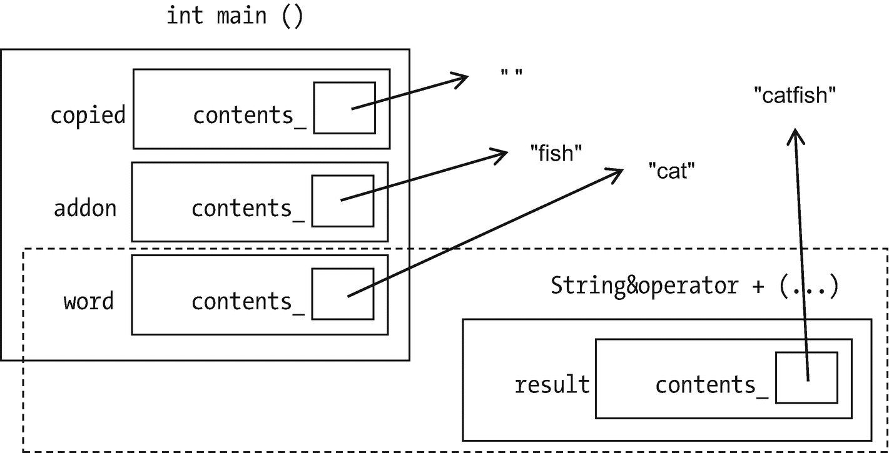
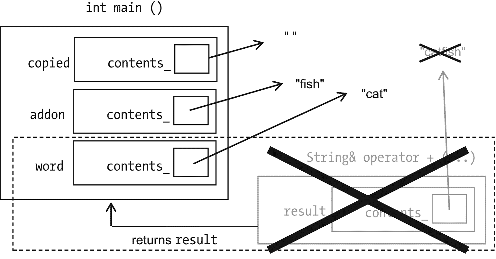

# 17.经营者

您可能看到过以下错误:

```cpp
char string1[] = "Hello", string2[] = "Hello";
if (string1 == string2) ...

```

这个条件不成立，因为数组的`==`比较的是内存地址而不是内容，并且地址不同。

这也导致了一些问题:

```cpp
string2 = string1;

```

它复制的不是`string2`的内容，而是它的地址到`string1`。`string1`的内容丢失。这既浪费又容易出错:

```cpp
string2[1] = 'a';    // string1 becomes "Hallo", though it
                     // wasn't even mentioned here!

```

因此，让我们创建自己的字符串类，迫使操作符做我们想做的事情，再也不用担心这个问题。

附录 B 列出了 C++让我们重载的运算符。简而言之:几乎任何，但你不能自己编。

## 基本字符串类

```cpp
class String

{
public:
    String (const char* other=""); // conversion from char* constructor;
                                   // default constructor
    String (const String &other);

private:
    char* contents_;
};

```

我想让我的`String`类处理任意长度的字符串，所以我将使用动态内存，就像在第 14 章一样。

以下是设置默认值的两种方法:

*   因为`nullptr` : `nullptr`按照惯例什么都不是，所以这是有意义的。但是如果我这样做，我将需要每个函数在访问`contents_`之前检查`nullptr`。工作太多。

*   作为长度为 1 只包含`'\0'`的字符数组，即作为`""`(空字符串)。我会用这个。

我现在写构造函数: <sup>[1](#Fn1)</sup>

```cpp
String::String2 (const char* other = "")// conversion from char* constructor;
                                        // default constructor
{
    contents_ = new char[strlen(other) + 1];
           // The +1 is room for final '\0'
    strcpy(contents_, other);
}

String::String (const String &other)
{
    contents_ = new char[strlen(other.contents_) + 1];
    strcpy(contents_, other.contents_);
}

```

冗余代码太多了。也许我可以让一个建筑商把工作分包给另一个？当然可以。这个“委托构造函数”让其他人做所有的工作。代码重用，更少的输入，耶:

```cpp
String (const String &other) : String (other.c_str())     {}

```

现在我将创建一些新的函数。这些放在类定义中:

```cpp
const char* c_str() const { return contents_;              }
int         size () const { return (int) strlen (c_str()); }
                      // Inefficient! Is there a better way?

```

## 析构函数

当使用动态分配的数组时，我们需要`delete []`在完成后抛出内存。但是`contents_`是`String`的私有成员，所以`main`做不到。也不应该；这是`String`的工作。我们需要一个函数在完成`String`后被调用。

输入析构函数(或常见的缩写“dtor”):

```cpp
String::~String () { if (contents_) delete [] contents_; }
    //Why "if (contents_)?" Paranoia. Deleting nullptr gives a crash.

```

这个名为`~`加上类名的函数，每当`String`消失时(例如，当`String`在函数内部声明并且函数结束时)，就会被自动调用。

与我们在第 14 章中所做的相比，这是

*   工作少:写一次就完事了。

*   自动的，所以你不会忘记。

只要您记住黄金法则，内存管理就变得简单多了:

Golden Rule of Destructors

如果你在一个类中使用动态内存，总是写析构函数。

我再补充一条黄金法则。你可以违反它，但是它*确实*减少了错误。

Golden Rule of Dynamic Memory

如果你不用它也能得到你想要的，那就不要用它。如果必须的话，试着将它隐藏在一个类中，并用析构函数来清理。

析构函数可以在一个变量的生命周期结束时用于其他事情…但是我从来没有这样做过。

## 二元和一元运算符:==，！=，和！

这是我们的第一个操作员:

```cpp
bool String::operator== (const String& other) const
{
    return strcmp

(c_str(), other.c_str()) == 0;
}

```

使用`==`操作符如下所示:

```cpp
if (stringA == stringB)...

```

当计算机到达`stringA == stringB`时，它进入功能`String::operator==`。 <sup>[3](#Fn3)</sup> 有两个`String`用了。左边的那个`stringA`，是“这个”的:拥有这个`operator==`功能的那个。右边的那个`stringB`，是“另一个”的，作为参数传入的那个。

当在一个成员函数中，你引用一个指定所有者的成员，如在`other.c_str()`中，那是属于`other`的`c_str()`。如果你不说它属于谁，它属于“这”一个——左边的那个。

这里有个好听的:`!=`是`==`的反义词吧？所以不用两个都写:写`==`c++会隐式写`!=`作为它的否定。 <sup>[4](#Fn4)</sup>

这些运算符是**二元**；每个都需要两个`String`，一个**一元**运算符只有一个参数，比如(`-myInt)+2`中的-(“一元减号”)或者`if (! isReady)`中的`!`。举个例子，我来写！对于`String`类。`! myString`将意味着`myString`为空:

```cpp
bool String::operator! () const { return ! size(); }

```

Golden Rule of Operators

如果一个操作符有一个参数，那么“this”对象——我们可以引用它的成员而不指定它们是谁的——是操作符调用中提到的唯一对象。

如果一个操作符有两个参数，“this”对象是调用中操作符左边的那个。作为参数传递的是右边的那个。

运算符没有三个参数。 <sup>[5](#Fn5)</sup>

## 所有其他比较运算符

还有其他比较`String` s 的方法:`<`(意为“按字母顺序排在前面”)、`<=`、`>`、`>`、T5。为了避免让使用我们的类的程序员猜测哪些是我们写的，让我们把它们都提供出来。

但是如果我懒得写全部四个，我就只写一个操作符，让 C++20 完成其余的。<sup>T5】6T7】我要写的是一个特殊的操作符`<=>`(称为“宇宙飞船”操作符，因为如果你仔细看，它看起来像一个 UFO)。它被定义为如果`String1 < String2`，那么`String1 <=> String2`应该返回一个负数；如果`String1 > String2`，那么应该返回一个正数；如果它们相等，那么应该返回 0。</sup>

…就像`strcmp`一样，一个`<cstring>`函数，给定两个字符数组，返回确切的值。这是我们的三向比较(“飞船”)运算符:

```cpp
int String::operator<=> (const String& other) const
                                // automagically generates <, <=, >, and >=
{
    return strcmp (c_str(), other.c_str());
}

```

Exercises

1.  制作一个`Fraction`类。您应该能够创建分数(指定分子和分母或默认为 0/1)，打印它们，并使用所有可用的比较运算符进行比较。

2.  制作一个`Point2D`类。您应该能够创建点(指定坐标或默认为(0，0))，打印它们，并比较它们。如果两个`Point2D`的 Xs 和 Ys 相同，则它们相等，但是如果它们的大小(与(0，0)的距离)大于另一个，则其中一个大于另一个。

## 赋值运算符和`*this`

我们如何将一个`String`分配给另一个？

```cpp
operator= (other)
    delete the old memory
    allocate the new memory, enough to hold other's contents
    copy the contents over

```

还有一件事=总是做:它返回一些东西。我们通常称之为`A=B;`，但这也是合法的:

```cpp
A=B=C;

```

由于=是从右向左处理的，这就意味着`A=(B=C);`真正的意思是:在做`B=C`的时候，把`C`的值赋给`B`；返回您获得的值；并通过`=`发送到`A`。因此`B=C`必须返回`B`变成的值:

```cpp
operator= (other)
    delete the old memory
    allocate the new memory, enough to hold other's contents
    copy the contents over
    return "this"

```

或者

```cpp
String& String::operator=  (const String& other)7
{
    if (contents_) delete[] contents_;               // delete old memory
    contents_ = new char[strlen(other.c_str()) + 1]; // get new memory
            //The +1 is room for final '\0'
    strcpy(contents_, other.c_str());                // copy contents over
    return *this
;
}

```

`this`被定义为“this”对象的内存地址。既然`this`是指向对象的指针，`*this`就是对象本身。(我们很少在没有`*`的情况下使用`this`，尽管我们可以。)我们希望`=`返回“这个”对象已经变成的样子；现在有了。

`*this`是不是*永远是*从`=`返回的东西。因为`+=`、`-=`等的操作符也返回新修改的对象，所以它们也返回`*this`。

我想我会重写转换构造函数和 operator=来提取它们共有的代码，并把它放在一个新函数`copy`中。代码重用:

```cpp
String::String (const char* other="") { copy(other); }

String& String::operator= (const String& other)
{
    if (contents_) delete[] contents_; copy (other.c_str());
    return *this;
}

void String::copy(const char* str)
{
    contents_ = new char[strlen(str) + 1]; // get new memory
                                           // The +1 is room for final '\0'
    strcpy(contents_, str);                // copy contents over
}

```

另一个最需要解释的是`=`的返回类型。

假设是这样写的

```cpp
String String::operator= (const String& other);

```

由于没有`&`，它将调用复制构造函数来复制它返回的内容。这需要时间，因为它必须一个字符一个字符地复制数组。如果我们返回的不是副本而是事物本身(`*this`)，我们可以节省时间:

```cpp
String& String::operator= (const String& other);8

```

Golden Rule of Assignment Operators

每个赋值运算符(`=`、`+=`等)。)应该返回`*this`。

…通过引用(如`String&`)。

这是另一条规则。

Golden Rule of =

始终指定=。

原因和复制构造函数一样:*如果你不这么做，编译器会帮你做*，而且可能会用很笨的方法来做。对于`String`，会定义它复制内存地址。我们试图让*远离*。

### 防错法

一个常见的错误是把`TheClassName::`放在错误的东西前面:

```cpp
String::const char* c_str() const; //const is a member of String?!

```

根据编译器的不同，错误消息可能会令人困惑或一清二楚。无论哪种方法，解决方案都是将`TheClassName::`放在函数名的左端。`const char*`是返回类型；`String::c_str`是函数名。

Exercises

1.  将前面练习中的`=`添加到`Fraction`类中。

2.  将前面练习中的`=`添加到`Point2D`类中。

3.  如果你这么说:`myStr = myStr;`在`String::operator=`会发生什么？修复`=`以避免问题。我的答案在例 [17-2](#PC48) 中。

## 算术运算符

现在我们将做一个“算术”操作符:`+`。我觉得把`+`定义为串联的意思是合理的。如果`word`是`"cat"`，`addon`是`"fish"`，那么`word+addon`应该是`"catfish"`。

我们会写`+=`和`+`。使用`String`的程序员可能想要其中任何一个，如果他们不得不猜测我们提供了哪个，他们有理由感到恼火。

```cpp
operator+= (other String)
   remember the old contents
   allocate new contents, big enough that we can add other.contents
   copy the old contents into the new
   append other contents
   delete the old contents
   return *this

```

秩序很重要。如果我们在使用之前删除旧内容，我们将会丢失其中的内容。

下面是有效的 C++代码:

```cpp
String& String::operator+= (const String& other)
{
    char* oldContents = contents_;

    contents_ = new char [size() + other.size() + 1];
                                      // 1 extra space at the end for the //   null char

    strcpy (contents_, oldContents);  // copy old into new
    strcat (contents_, other.c_str());// append other contents

    delete [] oldContents;

    return *this;
}

```

很好。现在我可以在类定义中内联`operator+`。它也应该返回`String&`吗？

```cpp
String& operator+ (const String& other) const
                                   // There's something wrong here...
{
    String result = *this; result += other; return result;
}

```

让我们追踪调用它时会发生什么。

假设，在`main`中，我们说`copied = word+addon`。首先，我们称之为`operator+`。使其`result`(图 [17-1](#Fig1) )。



图 17-1

操作员+(有缺陷的版本)在工作

然后它返回它的`result`并离开(图 [17-2](#Fig2) )。但是`result`，作为`+`的局部变量，在`+`完成时被析构，所以`main`得到的在它得到它的时候已经不存在了。使用它将是一个坏主意。



图 17-2

运算符+(有缺陷的版本)返回其值

解决办法就是还一份。它会一直持续到不再需要为止: <sup>[9](#Fn9)</sup>

```cpp
String String::operator+ (const String& other) const //That's better
{
    String result = *this; result += other; return result;
}

```

Golden Rule of Returning

`const &`

局部变量不应该用`&`返回。

函数返回后会持久的东西，包括`*this`和数据成员，可能是。如果它们是类类型的，就应该是。

为什么 make + call +=，而不是反过来？+制作了两个副本:局部变量`result`和我们返回时制作的副本。+=没有局部变量，返回`String&`，所以效率相当高。如果我们让它调用+，它将不得不做额外的复制。

`+`应该总是像这里写的那样，不管我们是添加`String` s，数字，还是长鼻怪(不管它们是什么)——只要把`String`改成你想要的任何新类型。

Exercises

1.  增加`+`、`-`、`*`、`/`、`+=`、`-=`、`*=`、`/=`至`Fraction`。

2.  在`Point2D`中增加`+`、`+=`、`-`、`-=`。还要加上`*`、`*=`、`/`、`/=`。引用`point1/point2`可能没有意义，但是*引用`point1/2`会有意义——你可以将两个坐标除以 2 得到一个新的`Point2D`。因此，`*`、`*=`、`/`和`/=`的“其他”参数将是一个数字。*

## `[]`和`()`

现在我们将支持使用`[]`来访问单个字符。

```cpp
char  String::operator[] (int index) const { return contents_[i]; }

```

我们只完成了一半，因为虽然我们可以说`char ch = myString[0];`，但是如果我们说`myString[0] = 'a';`，编译器会抱怨“需要 L 值”

这意味着(*非常*粗略地——我保持简单)在`=` (L 代表左)左边的东西不是那种*可以在`=`左边的东西；它是不可修改的。如果你想改变`myString`，你不需要元素的*副本*，而是元素本身:*

```cpp
char& String::operator[] (int index)       { return contents_[i]; }

```

如果两个函数除了返回类型之外完全相同，编译器不会感到困惑吗？但是它们和 T4 的不一样；一个是`const`。所以 C++会将`const`应用于不能改变的事物，将非`const`应用于可以改变的事物:

```cpp
const String S ("Hello");
cout << S[0] << '\n';   //OK; uses the const version of []

String T ("Goodbye");
T[0] = 'Z';             //Also OK; uses the non-const version, which
                        //  returns something that can be changed

```

Golden Rule of [ ] Operators

如果定义`[]`，需要两个版本:

```cpp
<type>  operator[] (int index) const { ... }
<type>& operator[] (int index)       { ... }

```

`{}`之间的代码几乎肯定是相同的。

还可以添加`()`运算符。我们可能想说`mystring (2, 5)`来获得包含字符 2–5 的子串。这是它的宣言；实施例见 [17-2](#PC48) :

```cpp
String String::operator () (int start, int finish) const;

```

您可以让`()`操作符具有不同数量的参数。

我不用`()`是因为对我来说像`mystring (2, 5)`这样的东西并不清楚，但是如果你想要它，它就在那里。

Exercises

1.  在`Fraction`中增加`[]` ( `const`和非`const`版本)。`myFraction[0`是分子，`myFraction[1]`是分母。

2.  …或者到`Point2D`。`point1[0]`是 x 坐标，`point1[1]`是 y 坐标。

## ++和-

说`myString++`没有多大意义，所以我将从练习转移到`Fraction`的例子。

`myFraction++`应该在`myFraction`上加 1。回想一下`++`有两个版本:`++myFraction`，意思是加 1，返回你得到的东西，`myFraction++`，意思是加 1，返回你加之前拥有的东西。

这是预增量版本:

```cpp
Fraction& Fraction::operator++ ()  // used for ++myFraction
{
   *this += 1;                     // add 1 to this Fraction
                                   // (Surely Fraction can convert from int?)
   return *this;
}

```

怎样才能区分后增量版本？不是通过参数的名称或数量…所以 C++有一个 hack <sup>[10](#Fn10)</sup> 就是为了这个:

```cpp
Fraction Fraction::operator++ (int junk) //used for myFraction++
{
   Fraction result = *this;
   ++(*this);                   //code reuse again
   return result;
}

```

这里的`int`论证真的*是*垃圾；这只是一个占位符，用来区分这个`++`操作符和其他操作符。

Exercises

1.  将++和-两个版本都添加到`Fraction`，并测试。

2.  将`++`和`--`两个版本添加到`Point2D`中，并进行测试。`myPoint++`会给`x_`分量加 1。

## 不是类成员的`>>`和`<<:`运算符

我还想用`>>`和`<<`打印`String` s，用`cin`和`cout`或其他文件。

我们不能把这些操作符写成成员:操作符左边的东西永远是“这个”对象。但是在`cout << myString`中，左操作数是`cout`。如果我们把`operator<<`写成`String`的一员，`cout`就得是`String`了。

解决方法是让操作员成为非成员:

```cpp
                            // this goes OUTSIDE the class definition
ostream& operator<< (ostream& out, const String& foo)11
{
   ...
   return out;
}

```

我让它返回`ostream&`，因为当我把`<<`链接在一起的时候(比如在`cout << X << Y`)。操作顺序为`(cout << X) << Y`；也就是说，`cout << X`做了它的工作，然后返回它的`cout`的“值”，所以下一个`<<`有`cout`作为它的左操作数，可以用来打印。

这是我的第一次尝试:

```cpp
inline                                               // in string.h
std::ostream& operator<< (std::ostream& out, const String& foo)
{
    out << foo.contents_; return out;
}

```

这不会编译。`foo.contents_`是私人的。

我们可以通过访问函数返回`contents_`，但这是一个更通用的解决方案:

```cpp
class String
{
public:
   ...
   void print (std::ostream& out) const { out << c_str(); }
   ...
};

inline
std::ostream& operator<< (std::ostream& out, const String& foo)
{
    foo.print(out); return out;
}

```

我们只是以一种适用于我们编写的任何类的方式修复了隐私侵犯——这是一件好事。让我们以类似的方式处理`cin >>`:

```cpp
void String::read (std::istream& in);

inline
std::istream& operator>> (std::istream& in, String& foo)
                                                       // foo is not const!
{
    foo.read (in); return in;
}

```

`String::read`比`String::print`更棘手。这是我的第一次尝试。

```cpp
void String::read (istream& in)   { in >> contents_; }

```

问题是我们不知道`contents_`是否有足够的空间来存储输入的内容。

解决方案:

```cpp
class String
{
public:
    static constexpr int BIGGEST_READABLE_STRING_PLUS_ONE   = 257;
         // biggest string we can read, incl '\0'
         // What's this "static" thing? We'll get to that in the next section
    ...
};

void String::read  (std::istream& in)
{
    static char buffer [BIGGEST_READABLE_STRING_PLUS_ONE];
    in >> buffer;
    *this = buffer;
}

```

如果你是 C++20 兼容的，`in >>`会在溢出`buffer`之前停止。如果没有…最好确保`buffer`足够大。

你*可以*写其他操作函数作为非成员——传入我们调用的对象`*this`作为第一个参数:

```cpp
const String& operator=  ( String& left, const String& right);
bool operator==          (const String& left, const String& right);

```

我们通常不会，因为这些函数明显属于`String`，需要访问私有数据成员。

Exercises

1.  为`Fraction`类添加`ostream <<`和`istream >>`运算符。

2.  …还有`Point2D`类。

## `static`成员

C++爱重用——过度使用——关键字，所以`static`有三个意思。

一个你知道的是**一个局部** **变量，当函数关闭**时它不会消失，而是保留到下一次调用。这种情况我们已经见过很多次了，最近一次是在这里:

```cpp
void String::read  (std::istream& in)
{
    static char buffer [BIGGEST_READABLE_STRING_PLUS_ONE];
    in >> buffer;
    *this = buffer;
}

```

另一个我们不会想太多的是**一个全局** **常量、变量或函数，我们只希望在** `.cpp` **文件中可见，它是写在**中的。

最后一个是**应用于整个类的类成员，而不是它的一个特定实例:**

```cpp
class String
{
public:
    static constexpr int BIGGEST_READABLE_STRING_PLUS_ONE   = 257;
                      //biggest string we can read, incl '\0'
    ...
};

```

这不是某个*`String`的特征，而是所有*`String`都有的特征**

 **你也可以有一个`static`成员函数，来报告对所有`String`都成立的事情:

```cpp
class String

{
public:
    ...
    static12 int biggestReadableString ()
    {
        return BIGGEST_READABLE_STRING_PLUS_ONE - 1;
    }
    ...
};

```

## 对构造函数的显式调用

这很好:

```cpp
String A;
A =  "moo";   // conversion constructor creates a
              // String containing "moo", passes to =
A += "moo";   // conversion constructor creates another, passes to +=
              // now A == "moomoo"

```

这里有一些事情*不会*工作:

```cpp
A = "moo" + "moo";

```

当 C++处理`+`时，它不知道你想要属于`String`的`+`，因为两个操作数都不是`String`！所以它会尝试使用字符数组的`+`。那不会有好结果。

这是可行的:

```cpp
A = String("moo") + "moo";

```

对`String`的调用是“对构造函数的显式调用”它创建了一个临时的`String`变量，从未命名，然后 C++将`operator+`应用于它。当它完成将结果复制到`A,`时，它删除它。 <sup>[13](#Fn13)</sup>

我发现它对`Point2D`特别有用:

```cpp
myPoints[0] = Point2D (2, 5);
myPoints[1] = Point2D (3, 7);
...

```

Exercises

1.  编写一个程序，声明五个`Fraction`并将它们相乘，不将它们命名为变量，通过使用对构造函数的显式调用。

2.  编写一个程序，声明五个`Point2D`并打印它们，不将它们命名为变量，通过使用对构造函数的显式调用。

## 最终字符串程序

...如示例 [17-1](#PC47) 至 [17-3](#PC49) 所示。

```cpp
// class String, for char arrays
//      -- from _C++20 for Lazy Programmers_

#include <cstring>

#include "string.h"

using namespace std;

String& String::operator=  (const String& other)
{
    if (this == &other) return *this; // never assign *this to itself
    if (contents_) delete[] contents_; copy(other.c_str());
    return *this;
}

void String::copy (const char* str)
{
    contents_ = new char[strlen(str) + 1];
            // The +1 is room for final '\0'
    strcpy(contents_, str);
}

String& String::operator+= (const String& other)
{
    char* temp = contents_;

    contents_ = new char [size() + other.size() + 1];
            // 1 extra space at the end for the null char

    strcpy (contents_, temp);
    strcat (contents_, other.c_str());

    delete [] temp;

    return *this;
}

String String::operator () (int start, int finish) const
{
    // This constructs the substring
    String result = *this;
    strcpy (result.contents_, contents_+start);
                // contents_+start is the char array that is
                // "start" characters after contents_ begins
    result.contents_[finish-start+1] = '\0';
                // the number of chars in this sequence
                // is the difference plus 1

    return result;
}

void String::read  (std::istream& in)
{
    static char buffer [BIGGEST_READABLE_STRING_PLUS_ONE];
    in >> buffer;
    *this = buffer;
}

Example 17-2string.cpp

```

```cpp
// String class

//      -- from _C++20 for Lazy Programmers_

#ifndef STRING_H
#define STRING_H

#include <cstring> // uses cstring functions all over
#include <iostream>

class String
{
public:
    static constexpr int BIGGEST_READABLE_STRING_PLUS_ONE   = 257;
                      // biggest string we can read, incl '\0'
    static int biggestReadableString()
    {
        return BIGGEST_READABLE_STRING_PLUS_ONE - 1;
    }

    String (const char* other="") { copy(other);             }
    String (const String &other) : String (other.c_str())   {}
                      // a "delegated" constructor
    ~String()         { if (contents_) delete [] contents_;  }

    // access function

    const char* c_str() const    { return contents_;         }

    // functions related to size

    int       size () const { return (int) strlen (c_str()); }
                      //Inefficient! Is there a better way?
    bool operator! () const { return ! size();               }

    // comparisons

    bool operator== (const String& other) const
    {
        return strcmp (c_str(), other.c_str()) == 0;
    }
    int operator<=> (const String& other) const
    {
        return strcmp (c_str(), other.c_str());
    }

    // assignment and concatenation

    String& operator=  (const String& other);
    String& operator+= (const String& other);
    String  operator+  (const String& other) const
    {
        String result = *this; result += other; return result;
    }

    // [] and substring

    char  operator[] (int index) const { return contents_[index]; }
    char& operator[] (int index)       { return contents_[index]; }

    String operator () (int start, int finish) const;

    // I/O functions

    void  read  (std::istream& in );
    void  print (std::ostream& out) const { out << c_str();       }
private:
    char* contents_;
    void  copy(const char* str);
};

inline
std::istream& operator>> (std::istream& in, String& foo)
{
    foo.read (in); return in;
}

inline
std::ostream& operator<< (std::ostream& out, const String& foo)
{
    foo.print(out); return out;
}
#endif //STRING_H

Example 17-1string.h. The source code project containing this and Examples 17-2 and 17-3 is 1-2-3-string

```

驱动程序(例如 [17-3](#PC49) )使用函数`void` `assert` `(bool condition)`，该函数验证`condition`为真，如果不为真，则使程序崩溃。很好。如果有什么不对劲，我们会知道的。

```cpp
// Driver program to test the String class
//      -- from _C++20 for Lazy Programmers_

#include <iostream>
#include <cassert
>  // for assert, a function which crashes
                    //   if the condition you give is false
                    // used for debugging
#include "string.h"

using namespace std;

int main ()
{
                    // using consts to ensure const functions are right
    const String EMPTY;
    const String ABC ("abc");

    // Testing default ctor, conversion ctor from char*, ==, !=, !
    assert (EMPTY == ""); assert (! EMPTY); assert (! (EMPTY != ""));
    assert (ABC != "");                     assert (! (ABC == ""));

    // Testing c_str, size ...
    assert (strcmp (ABC.c_str(), "abc") == 0);
    assert (ABC.size() == 3);

    // Test >, >=, <, <=, !=,
    // We're doing lots of implicit calls to conversion ctor
    //   from const char*, so that's tested too
    assert (ABC <  "abd");  assert (! (ABC >= "abd"));
    assert (ABC <= "abd");  assert (! (ABC >  "abd"));
    assert (ABC >  "abb");  assert (! (ABC <= "abb"));
    assert (ABC >= "abb");  assert (! (ABC <  "abb"));
    assert (ABC <= ABC);    assert (ABC >= ABC);

    // Test []

    String xyz = "xyz";
    assert (xyz[1] == 'y'); xyz[1] = 'Y';
    assert (xyz[1] == 'Y'); xyz[1] = 'y';
    assert (ABC[1] == 'b'); //const version

    // Test =, ()
    xyz = "xyz and more";
    assert(xyz(4, 6) == "and");

    // Test copy ctor
    assert (ABC == String(ABC));

    // Test + (and thereby +=)
    String ABCDEF = ABC+"def";
    assert (ABCDEF == "abcdef");

    // Testing << and >>
    String input;
    cout << "Enter a string:\t"; cin >> input;
    cout << "You entered:\t" << input << '\n';

    cout << "If no errors were reported, "
         << "class String seems to be working!\n";

    return 0;
}

Example 17-3A driver for String

```

Exercises

1.  使用`assert`和对构造函数的显式调用，测试你的`Fraction`类。

2.  …或者你的`Point2D`课。

3.  C++的内置库使用从`unsigned int`派生的一种类型`size_t`作为数组大小。更新`String`类，包括它的测试器，将`size_t`用于`howMany_`和其他合适的东西。

## `#include <string>`

下面是我一直隐藏的:C++已经有了一个 string 类，你现在知道如何使用它了。你需要`#include <string>`。型号是`string`，不是`String`。如果编译器完全兼容 C++20，您可以声明`constexpr string` s。

<aside aria-label="Footnotes" class="FootnoteSection" epub:type="footnotes">Footnotes [1](#Fn1_source)

如果我不这样做，C++就会这样:

`String::String () { contents_ = nullptr; };`

`String::String (const String& other) { contents_ = other.contents_; }`

所以我们将最终使用`nullptr`，这是我决定反对的，我们将在`String`之间共享内存，因此改变一个会改变另一个。避免这些**隐式**构造函数是对构造函数黄金法则的完美辩护。

  [2](#Fn2_source)

当讨论一个成员函数时，我通常会以`String::`开头，以澄清它是一个成员。在类定义中，我们省略了`String::`。

  [3](#Fn3_source)

这整个运营商业务是语法糖。你*可能*叫`==`这种难听的方式:

if (stringA.operator== (stringB))...

  [4](#Fn4_source)

如果你的编译器是 C++20 兼容的。如果没有，你就要写:

`bool String::operator!= (const String& other) const { return !(*this == other); }`

  [5](#Fn5_source)

有一个例外:`?:`操作符。下面是它的用法示例:

cout << (x> =0？“正”:“负”)；

这意味着`if (x>=0) cout << “positive”; else cout << “negative”;`

我不怎么用它。反正 C++是不会让你过载的。

  [6](#Fn6_source)

同样，如果你的编译器不兼容 C++20，你必须自己编写它们。

  [7](#Fn7_source)

关于这个算法的一个有趣的调整，请参见练习 3。

  [8](#Fn8_source)

**const** `String&`可以防止类似`(A=(B=C)=D)=E`的怪异语句。(那个*到底是做什么的*？)但是为了兼容尚未涉及的特性，我选择了社区约定:`String&`，没有`const`。

  [9](#Fn9_source)

低效？像往常一样，C++强迫性地追求效率，但有一个解决办法(见第 18 章)。

  [10](#Fn10_source)

不恰当的解决方法。

  [11](#Fn11_source)

在编程语言 LISP 和其他地方，当`foo`是什么很明显的时候，`foo`被用来命名一个变量。如果需要两个这样的“占位符”，通常是`foo`和`bar`。很有可能这是来自军事缩写“FUBAR”，意思大概是“搞砸得面目全非”

一些程序员认为`foo`和`bar`是邪恶的，因为它们没有描述性，但是我想我更愿意读《T2》而不是《T3》或《T4》。

  [12](#Fn12_source)

`static`函数不能是`const`。不用担心；编译器会提醒你。

  [13](#Fn13_source)

另一个临时拷贝使编译器做更多的工作…第 18 章有一个修正。

 </aside>***