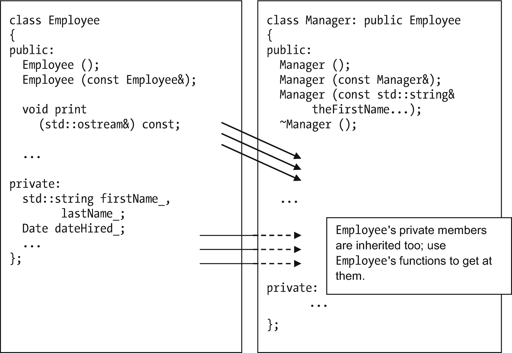
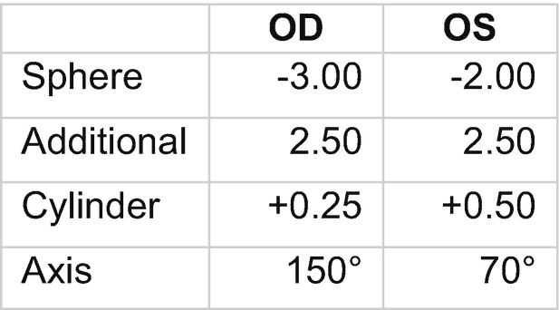
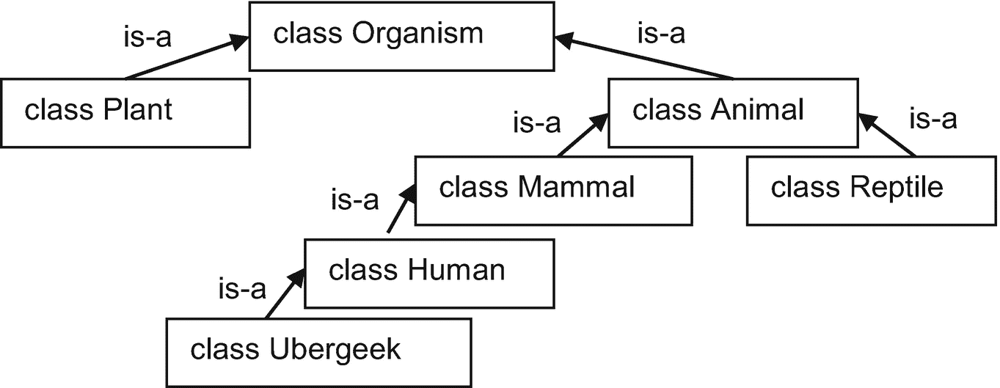
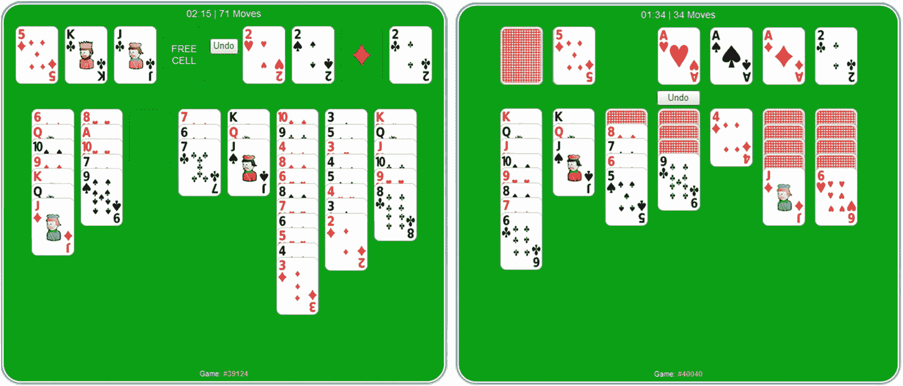
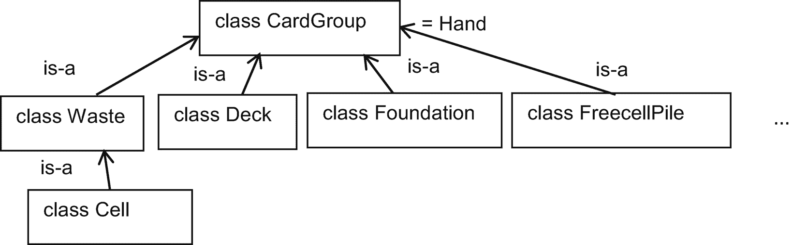
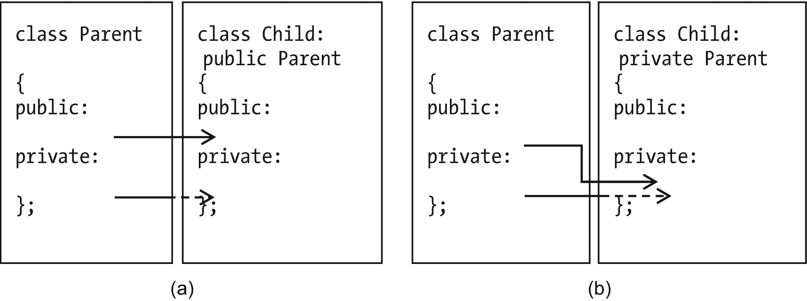
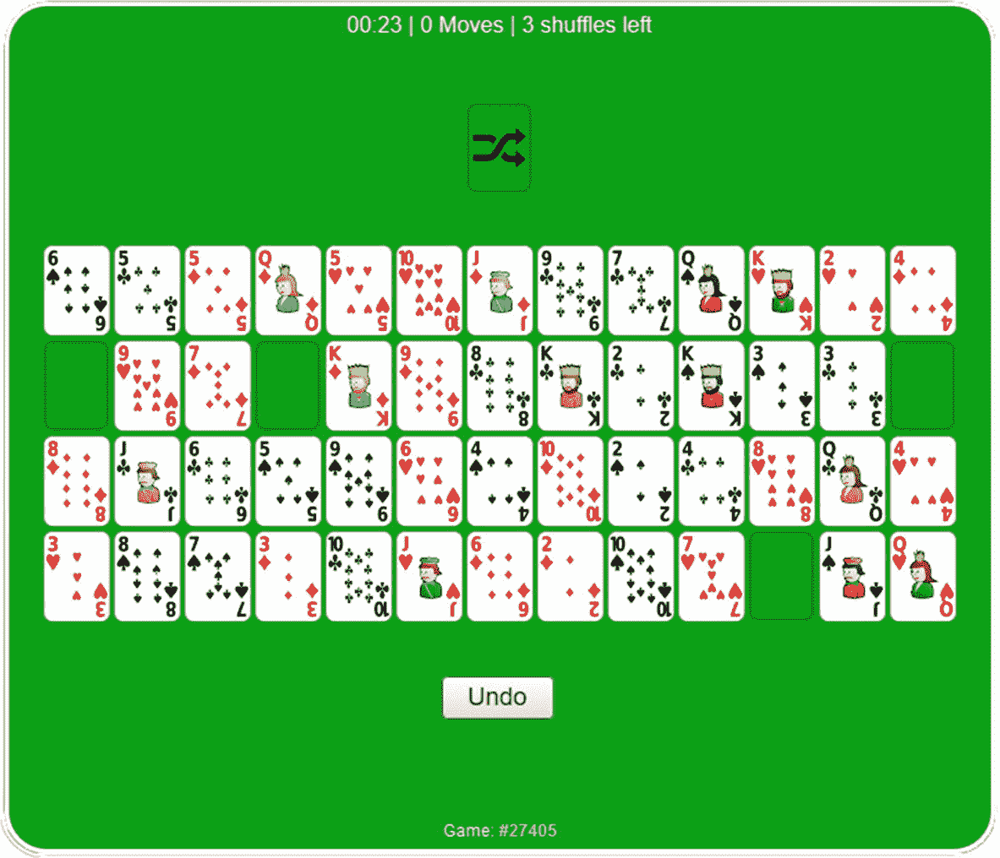

# 19.遗产

本章的目的是让我们能够在相似的类之间重用代码。

## 继承的基础

有一个不成文的规则，在 C++介绍文本中，你必须有一个使用雇员记录的例子，比如 Example [19-1](#PC1) 。有道理。我个人想不出比员工记录更令人兴奋的事了。

```cpp
// Class Employee
//      -- from _C++20 for Lazy Programmers_

#ifndef EMPLOYEE_H
#define EMPLOYEE_H

#include <iostream>
#include <string>
#include "date.h"

class Employee
{
public:
    Employee ();
    Employee (const Employee&) = delete;
    Employee (const std::string& theFirstName,
              const std::string& theLastName,
              const Date& theDateHired, int theSalary);

    Employee& operator= (const Employee&) = delete;

    void print(std::ostream&) const;

    // access functions
    const std::string& firstName () const { return firstName_;   }
    const std::string& lastName  () const { return lastName_;    }
    const Date&        dateHired () const { return dateHired_;   }
    int   salary                 () const { return salary_;      }
    bool  isOnPayroll            () const { return isOnPayroll_; }
    int   badPerformanceReviews  () const
    {
        return badPerformanceReviews_;
    }

    void  quit                   ()       { isOnPayroll_ = false;}
    void  start                  ()       { isOnPayroll_ = true; }
    void  meetWithBoss           () { ++badPerformanceReviews_;  }

private:
    std::string firstName_, lastName_;
    Date dateHired_;
    int  salary_;
    bool isOnPayroll_;
    int  badPerformanceReviews_;
};

inline
std::ostream& operator<< (std::ostream& out, const Employee& foo)
{
    foo.print (out); return out;
}
#endif //EMPLOYEE_H

Example 19-1Class Employee. To find this or any subsequent numbered example in source code, go to the appropriate chapter and find the project/folder with the example number near the start – in this case, 1-2-employees

```

由于我正在使用`Date`类，我需要将前一章中的`date.h`和`date.cpp`复制到我的新项目的文件夹中。用 g++我就做到了这一点；在 Visual Studio 中，我右键单击该项目，说添加➤现有项，并添加两者。

下面是一个`Employee`的示例声明。它显式调用了`Date`的构造函数，以节省我们的一些输入:

```cpp
Employee george ("George P.", "Burdell", Date (10, 3,1885), A_MERE_PITTANCE);

```

但不是所有的员工都一样。如果我在斯科特·亚当斯的*呆伯特*中读到的是准确的，经理就像任何其他员工一样，有名字和薪水，但有额外的特征:雇佣和解雇的权力，低智商，以及对折磨员工的痴迷。

为`Manager`写一个全新的类是多余的，重复`Employee`中的那些部分，比如`firstName`、`lastName`和`salary`。因此，我们将使`Manager`成为`Employee`的子类(或派生类，或子类)，如示例 [19-2](#PC3) 所示。这就是**传承**。

```cpp
// Class Manager
//      -- from _C++20 for Lazy Programmers_

#ifndef MANAGER_H
#define MANAGER_H

#include "employee.h"

using Meeting = std::string;

class Manager: public Employee
{
public:
    Manager ();
    Manager (const Manager&) = delete;
    Manager (const std::string& theFirstName,
             const std::string& theLastName,
             const Date&   theDateHired,
             int           theSalary);
    ~Manager () { if (schedule_) delete [] schedule_; }

    Manager& operator= (const Manager&) = delete;

    void hire (Employee& foo) const { foo.start (); }
    void fire (Employee& foo) const { foo.quit  (); }
    void laugh()              const
    {
        std::cout << firstName() << " says: hee-hee!\n";
    }

    void torment (Employee&) const;

private:
    Meeting*    schedule_;
    int         howManyMeetingsOnSchedule_;
    void        copy (const Manager& other);
};

#endif //MANAGER_H

Example 19-2Class Manager

```

`class Manager: public Employee`表示`Manager`是`Employee`的子类，一个`Employee`有一个`Manager`也有(图 [19-1](#Fig1) )。(暂时不用担心`public`这个词。)



图 19-1

继承是如何工作的。`Employee`中的所有东西也在`Manager`中——但如果是`private`，就看不到了

所以这段代码是合法的:

```cpp
Manager  alfred ("Alfred E.", "Neumann", Date (10, 1,1952), OBSCENELY_LARGE_SALARY);

// firstName, salary are inherited from Employee
cout << alfred.firstName() << " makes " << alfred.salary ()<< " per month!\n";

```

没有重写这些函数，只是使用它们。你可以用一个`Employee`做什么，你也可以用一个`Manager`做什么——因为一个`Manager` *就是一个*`Employee`。

## 继承和成员变量的构造函数和析构函数

当我们写`Manager`的时候，我们肯定想要调用`Employee`的构造函数。没问题。我们将使用与初始化数据成员相同的语法:

```cpp
Manager::Manager (const string& theFirstName,
                  const string& theLastName,
                  const Date& theDateHired,
                  int theSalary) :
    Employee (theFirstName, theLastName, theDateHired, theSalary),
    schedule_ (nullptr), howManyMeetingsOnSchedule_ (0)
{
}

```

构造函数按以下顺序工作:

*   “:”后面的构造函数被调用，先调用父类构造函数(即使你把它放在后面)。

*   在`{}`之间的任何事情都会被完成(在这种情况下，什么都不做)。

你不说调用什么父构造函数，它就调用默认的。

当一个`Manager`超出范围时，它的析构函数首先被调用，然后是它的父类(然后是它的祖父类，依此类推)。你不需要考虑这个，这是自动的。

如果你不写析构函数，你会得到默认的析构函数，它告诉所有有自己析构函数的成员——比如`Employee`的`firstName_`和 l`astName_`——清理它们的内存。同样，这是自动的——你不需要记住。

Exercises

对于这些练习，请确保

1.  An eyeglasses prescription lists: **sphere** or power, **additional** correction for bifocals, and stuff for astigmatism (**cylinder**, **axis**) – see Figure [19-2](#Fig2). The two eyes are called “OD” and “OS,” not “left” and “right,” because what’s cooler than calling your eyeballs weird Latin abbreviations?

    

    图 19-2

    眼镜处方

    编写并测试一个类来包含并整齐地打印这些信息。

    为隐形眼镜编写并测试一个子类，以包含并打印更多的内容:**背部曲率**和**直径**，这些数字确保镜片舒适地适合眼球。

2.  接受特殊教育的孩子可能会有一个“IEP”，一个个人教育计划，以阐明存在哪些特殊需求以及学校将如何解决这些需求。编写并测试一个学生记录的类(名字，其他相关的东西)和一个有 IEP 的学生记录的子类。你可以让 IEP 是一个单独的字符串。

*   **数据成员是私有的**(当然)。

*   目前，**没有访问功能**。这是为了确保子类只访问自己的数据，而不是父类的数据。例如，要打印，子类应该调用其父类的打印函数，然后打印自己的数据成员。

## 作为一个概念的继承

子类 ss 也是我们在计算机之外思考的一部分。生物学中，*动物*是*生物*的一个子类；*哺乳动物*是*动物*的一个子类；*人类*是*哺乳动物*的一个子类；而 *ubergeek* 是*人类*的子类(图 [19-3](#Fig3) )。在每种情况下，子类都具有超类(或父类或基类)的所有特征，外加额外的特征。动物是可以移动的有机体；超级极客是一个编程非常好的人，连上帝都为之折服。


柏拉图和亚里士多德，两个最早争论面向对象编程的人。有几分地

你不是人类的*子类*，因为你不是一个类。你是人类的*实例*。(向我的外星读者道歉。)

这是提及面向对象思维中常用的区别的最佳点，在*是-a* 和*有-a* 之间。

超级极客是人类(以及哺乳动物和其他东西)。一个超级极客*有一台*电脑。所以当上帝创造超级极客时，他的代码一定是这样的:

```cpp
class Ubergeek: public Human // an Ubergeek is-a human
{
    ...
private:
    Computer myComputer_;  // an Ubergeek has-a computer
};

```

事情一`Ubergeek` *已经*走在了私人路段。什么是`Ubergeek`*在第一行。*

*Extra

你当地的哲学教授可能会因为我这么说而枪毙我，但是面向对象编程实在是太…柏拉图式了。

柏拉图认为阶级(“理想”)是最终真实的，而特定的例子——我们词汇中的物体或变量——是最终现实的不完美的例子。所以`Human`是真实的东西；你和我只是例子。

在激进的唯物主义中——离柏拉图越远越好——阶级是不真实的；只有实物才是。当然，由于激进的唯物主义不是一个物质对象，这可能是一个问题，但是懒惰的哲学，不像懒惰的编程，超出了本书的范围。

亚里士多德认为事物本身是真实的，类是它们固有的性质。你是真实的，人类才是真实的你。他分摊差额。

然而在现实中，C++是柏拉图式的:类是第一位的。(在创建该类型的变量之前，必须有类定义。)

## 纸牌游戏的课程

人们喜欢在电脑上玩纸牌，所以让我们制作课程来帮助我们建立各种各样的纸牌游戏。代码重用。

我将提供类`Card`(例子 [19-3](#PC7) )并赋予它任何类都应该有的东西:默认和复制构造函数、`operator=`、访问函数和 I/O。我还将第 10 章的`Rank`和`Suit enum`拼凑起来。

```cpp
// Card class
//        -- from _C++20 for Lazy Programmers_

#ifndef CARD_H
#define CARD_H

#include <iostream>

// Rank and Suit:  integral parts of Card

// I make these global so that I don't have to forget
//  "Card::" over and over when I use them.

enum class Rank  { ACE=1,  JACK=11, QUEEN, KING    }; // Card rank
enum class Suit  { HEARTS, DIAMONDS, CLUBS, SPADES }; // Card suit
enum class Color { BLACK,  RED                     }; // Card color

inline
Color toColor(Suit s)
{
    using enum Suit;
    using enum Color;

    if (s == HEARTS || s == DIAMONDS) return RED; else return BLACK;
}

// I/O on Rank and Suit
std::ostream& operator<< (std::ostream& out, Rank r);
std::ostream& operator<< (std::ostream& out, Suit s);
std::istream& operator>> (std::istream& in, Rank& r);
std::istream& operator>> (std::istream& in, Suit& s);

// Told you we'd find a way to do arithmetic with enums

...
inline Rank operator+  (Rank  r, int t) { return Rank(int(r) + t); }
inline Rank operator+= (Rank& r, int t) { return r = r + t;        }
inline Rank operator++ (Rank& r) { r = Rank(int(r) + 1); return r; }
inline Rank operator++ (Rank& r, int junk)
{
Rank result = r; ++r; return result;
}

inline Suit operator++ (Suit& s) { s = Suit(int(s) + 1); return s; }
inline Suit operator++ (Suit& s, int junk)
{
Suit result = s; ++s; return result;
}

class BadRankException {};  // used if a Rank is out of range
class BadSuitException {};  // used if a Suit is out of range

// ...and class Card.

class Card
{
public:
    Card (Rank r = Rank(0), Suit s = Suit(0)) : rank_ (r), suit_ (s)
    {
    }
    Card (const Card& other) : Card(other.rank_, other.suit_){}

    Card& operator= (const Card& other)
    {
         rank_ = other.rank(); suit_ = other.suit (); return *this;
    }

    bool operator== (const Card& other) const
    {
        return rank() == other.rank () && suit() == other.suit();
    }

    Suit  suit () const { return suit_;            }
    Rank  rank () const { return rank_;            }
    Color color() const { return toColor (suit()); }

    void print (std::ostream &out) const { out << rank() << suit(); }
    void read  (std::istream &in );
private:
    Suit suit_;
    Rank rank_;
};

inline std::ostream& operator<< (std::ostream& out, const Card& foo)
{
    foo.print (out); return out;
}

inline std::istream& operator>> (std::istream& in,        Card& foo)
{
    foo.read  (in);  return in;
}
#endif //CARD_H

Example 19-3The Card class (card.h). card.cpp is in the book’s source code

```



图 19-3

阶级等级制度。超级极客是人类，是哺乳动物，等等

### 继承层次结构

我们可能会创造一些游戏:

自由电池(图 [19-4](#Fig5) ，左侧)。左上角是单元格，每个单元格可以存储一张卡；右上方是基础，各取 a，再取 2，以此类推，同花色；底部是一堆，随机分配。你可以从一堆牌中取出一张牌，或者如果牌是交替颜色的，你可以将一张牌添加到一堆牌中。例如，如果你有一张黑方 10，你可以把它移到方块 j 上。



图 19-4

两个流行的纸牌游戏:空当接龙(左)和克朗代克(右)

克朗代克(图 [19-4](#Fig5) ，右)。和 Freecell 一样，它有基础(右上)；它也有一个甲板，一个废物堆，在底部有自己类型的堆。

红心、黑桃和其他有一副牌和手牌的多人游戏。

常见的卡分组包括

*   甲板:你可以洗牌，并处理顶部。

*   废物(弃牌堆):你可以放一张牌在上面或者拿走一张。

*   单元格:像废物一样，你可以添加到单元格中或从顶部取走-但只能有一张卡片。

*   基础:清一色，从 ace 开始往上。

*   手:你可以添加它，并拿出任何你想要的卡。

*   自由电池堆:加一张牌，颜色交替向下；取下一张卡片。

*   克朗代克堆:更复杂，作为练习留下。

这些都有两个共同点:内容和大小。有更多的共同点吗？

我会说一个单元格*是一个*废物堆，因为你与它互动的方式是一样的:添加一张卡片，然后从顶部拿走一张。它只是在尺寸上有限制。

除此之外，我会说没有。你不能说基础是甲板的特殊情况，或者克朗代克桩是废物堆的特殊情况。(有些可能是见仁见智。)但它们都有一个共同点:都是一组组的牌。所以我们可以有一个`CardGroup`类，并从它继承。(A `Hand`是没有添加任何东西的`CardGroup`，所以我们将`Hand`作为`CardGroup` : `using Hand = CardGroup;`的别名)。

我基于`CardGroup`提出了图 [19-5](#Fig6) 中的继承层次。`CardGroup`如示例 [19-4](#Fig5) 所示。



图 19-5

卡片组的类别层次结构

```cpp
// CardGroup class (for playing cards)
//        -- from _C++20 for Lazy Programmers_

#ifndef CARDGROUP_H
#define CARDGROUP_H

#include "card.h"

class OutOfRange  {};         // Exception classes
class IllegalMove {};

class CardGroup
{
public:
    static constexpr int MAX_SIZE = 208;    // if anybody wants a game
                                            //   w/ more than 4 decks,
                                            //   change this.

    CardGroup ()                      { howMany_ = 0;              }
    CardGroup (const CardGroup& other){ copy(other);               }
    CardGroup (const Card& other)
    {
        howMany_ = 0; addCard (other);
    }

    CardGroup& operator= (const CardGroup& other)
    {
        copy(other); return *this;
    }
    bool operator== (const CardGroup& other) const;

    Card& operator[] (unsigned int index);
    Card  operator[] (unsigned int index) const;

    Card remove         (unsigned int index);
    Card top            () const { return (*this)[size()-1];  }
    Card removeTop      ()       { return remove (size()-1);  }

    unsigned int size   () const { return howMany_;           }
    bool         isEmpty() const { return size() == 0;        }
    bool         isFull () const { return size() >= MAX_SIZE; }

    // addCard does NOT check that it's legal to add a card.
    // We need this for creating CardGroups during the deal.
    void addCard (const Card&);

    // makes sure the addition of the card is legal, then adds it
    void addCardLegally (const Card& other);

    void print (std::ostream&) const;

private:
    unsigned int howMany_;
    Card contents_ [MAX_SIZE];
    void copy (const CardGroup&); // copy cards over; used by =, copy ctor
};

inline
std::ostream& operator<< (std::ostream& out, const CardGroup& foo)
{
    foo.print(out); return out;
}

using Hand = CardGroup;
#endif //CARDGROUP_H

Example 19-4cardgroup.h

```

### `private`继承

考虑一下`Waste`类。我们不应该允许通过`[]`操作符随机访问`Waste`；你只能看一堆`Waste`的*顶*牌。

为了限制访问，我们更改了继承的类型:

```cpp
class Waste: private CardGroup

{
...

```

这使得`CardGroup`的公共成员进入`Waste`的私有部分(图 [19-6](#Fig7) )。



图 19-6

公共(a)和私有(b)继承。如果有任何继承的公共成员必须在子类中保持私有，则使用私有

`operator[]`现在是私有的——很好——但是有一些`CardGroup`的公共成员我们*希望* `Waste`对外开放:例如`isEmpty`和`print`。因为它们是私有的，我们用相同的名字创建新的公共函数，简单地调用父函数，如例 [19-5](#PC10) 所示。

```cpp
// Waste class
//      -- from _C++20 for Lazy Programmers_

#ifndef WASTE_H
#define WASTE_H

#include "cardgroup.h"

class Waste: private CardGroup
{
public:
    Waste () {}
    Waste (const Waste&     other) : CardGroup (other) {}
    Waste (const CardGroup& other) : CardGroup (other) {}

    Waste& operator=    (const Waste& other) = delete;

    bool operator==     (const Waste& other) const
    {
        return CardGroup::operator== (other);
    }
    bool isEmpty        () const { return CardGroup::isEmpty ();  }
    bool isFull         () const { return CardGroup::isFull  ();  }
    unsigned int size   () const { return CardGroup::size ();     }
    Card top            () const { return CardGroup::top();       }
    Card removeTop      ()       { return CardGroup::removeTop(); }
    void addCardLegally (const Card& foo)
    {
        CardGroup::addCardLegally (foo);
    }
    void print (std::ostream& out) const{ CardGroup::print (out); }
};

inline
std::ostream& operator<< (std::ostream& out, const Waste& foo)
{
    foo.print (out); return out;
}
#endif //WASTE_H

Example 19-5Class Waste, in waste.h, using private inheritance

```

### 隐藏继承的成员函数

`Waste`有来自`CardGroup`的成员函数`isFull`，如果`Waste`有`MAX_SIZE`卡则为真。它的子类`Cell`有不同的版本。如果你在一个`Cell`上调用`isFull`，它会用哪个？子版本“隐藏”了继承的版本；如果你在一个`Cell`上调用`isFull`，你会得到`Cell`的版本。

但是如果有时候我们仍然需要继承的版本呢？在 [19-6](#PC11) 的例子中，`Cell`的版本`addCardLegally`调用`Waste`的版本，通过在调用前加上`Waste::`来指定。

```cpp
// Cell class
//    -- from _C++20 for Lazy Programmers_

#ifndef CELL_H
#define CELL_H

#include "waste.h"

class Cell: public Waste
{
public:
    Cell ()                                      {}
    Cell(const Cell& other) : Waste (other)      {}
    Cell& operator= (const Cell& other) = delete;

    // public inheritance, so all public members of Waste are here...

    bool isFull    () const {return ! isEmpty (); }

    void addCardLegally (const Card& card)
    {
        if (isFull ()) throw IllegalMove (); // Cell must be empty
        else Waste::addCardLegally (card);
    }
};
#endif //CELL_H

Example 19-6cell.h

```

### 蒙大拿州的一场比赛

蒙大拿纸牌游戏使用`Cell`和`Deck`，所以它应该是对我们等级制度的一个很好的测试。

规则是:在一个 4 × 13 的格子中分发所有的牌，去掉 a，得到一个如图 [19-7](#Fig8) 所示的混乱局面。



图 19-7

蒙大拿州的一场比赛

您的目标是从 2 到 king 排成四排，每排一套。

唯一有效的方法是把一张牌放进一个空的格子里。你放的牌必须跟在它左边的牌后面，在同一套牌里；比如，你只能跟随 2♥和 3♥.如果它在最左边的一列，你就要放一个 2。国王后面的空格不可用。

当你陷入困境时，从左边的 2 开始，按花色递增，重发所有不在序列中的牌。你有四笔交易。

示例 [19-7](#PC12) 至 [19-9](#PC14) 显示了程序，为简洁起见省略了一些内容；本书的示例代码包含一个完整的版本。

```cpp
// class Montana, for a game of Montana solitaire
//    -- from _C++20 for Lazy Programmers_

#include "gridLoc.h"
#include "cell.h"
#include "deck.h"

#ifndef MONTANA_H
#define MONTANA_H

class Montana
{
public:
    static constexpr int ROWS = 4, COLS  = 13;
    static constexpr int NUM_EMPTY_CELLS =  4;// 4 empty cells in grid
    static constexpr int MAX_TURNS       =  4;// 4 turns allowed

    class OutOfRange {};          // Exception class for card locations

    Montana                  ()               {};
    Montana                  (const Montana&) = delete;
    Montana& operator=       (const Montana&) = delete;

    void play ();

private:
        // displaying
    void display            () const;

        // dealing and redealing
    void deal               (Deck& deck, Waste& waste);
    void cleanup            (Deck& deck, Waste& waste); // collect cards //   for redeal
    void resetGrid          ();                         // make it empty

        // playing a turn
    void makeLegalMove      (bool& letsQuitOrEndTurn);
    void makeMove           (const GridLoc& oldLoc,
                             const GridLoc& newLoc);
    bool detectVictory      () const;
    void congratulationsOrCondolences(bool isVictory) const;

        // working with empty cells

    // store in emptyCells_ the location of each empty cell
    void identifyEmptyCells ();

    // which of the empty cells has this row and col? A B C or D?
    char whichEmptyCell     (int row, int col) const;

    // Is this a valid cell index? It must be 0-3.
    bool inRange (unsigned int emptyCellIndex) const
    {
        return (emptyCellIndex < NUM_EMPTY_CELLS);
    }

        // placing cards

    Cell&        cellAt (const GridLoc& loc)
    {
        if (inRange (loc)) return grid_[loc.row_][loc.col_];
        else throw OutOfRange();
    }

    const Cell& cellAt (const GridLoc& loc) const
    {
        if (inRange (loc)) return grid_[loc.row_][loc.col_];
        else throw OutOfRange();
    }

    // Is this location within the grid?
    bool inRange (const GridLoc& loc) const
    {
        return (0 <= loc.row_ && loc.row_< ROWS && 0 <= loc.col_ && loc.col_< COLS);
    }

    // Can Card c follow other card?
    bool canFollow (const Card& c, const Card& other) const
    {
        return c.suit() == other.suit() && c.rank() == other.rank() + 1;
    }

    // Can card c go at this location?
    bool canGoHere (const Card& c, const GridLoc& loc) const;

    // Is the cell at row, col ordered at its location? That is,
    //     could we put it here if it weren't already?
    bool cellIsCorrect (int row, int col) const
    {
        return ! grid_[row][col].isEmpty () &&
               canGoHere (grid_[row][col].top(), GridLoc (row, col));
    }

    // data members
    Cell    grid_       [ROWS][COLS];     // where the cards are
    GridLoc emptyCells_ [NUM_EMPTY_CELLS];// where the empty cells are
};
#endif //MONTANA_H

Example 19-8montana.h

```

```cpp
// A game of Montana solitaire
//    -- from _C++20 for Lazy Programmers_

#include <cstdio>       // for srand, rand
#include <ctime>        // for time
#include "io.h"         // for bool getAnswerYorN (const char[]);
#include "montana.h"

int main ()
{
    srand ((unsigned int) time (nullptr)); // start rand# generator

    Montana montanaGame;

    do
        montanaGame.play ();
    while (getYorNAnswer ("Play again (Y/N)? "));

    return 0;
}

Example 19-7montana_main.cpp: a game of Montana

```

每次被调用时,`Montana::play`创建一个新的`Deck`和`Waste`。你可以从中看出它们是如何被使用的。`Montana::makeMove`显示了如何使用`Cell`(`cellAt`返回给定位置的`Cell`)。

`Montana::makeLegalMove`使用 try-catch 块以防输入出错。

```cpp
// class Montana, for a game of Montana solitaire
//    -- from _C++20 for Lazy Programmers_

#include <iostream>
#include "deck.h"
#include "io.h"       // for bool getAnswerYorN (const char[]);
#include "montana.h"

using namespace std;

    // Playing the game

...

void Montana::play ()
{
    Deck  deck;
    Waste waste;
    bool  isVictory = false;

    resetGrid (); // prepare for deal by ensuring grid is empty

    for (int turn = 1; turn <= MAX_TURNS && ! isVictory; ++turn)
    {
        cout << "********************* New turn! "
                "**********************\n";

        // To easily test the detectVictory func: uncomment //   setupForVictory,
        // comment out deal, and see if isVictory becomes true
        // setupForVictory(grid_, deck, waste);

        deck.shuffle ();             // Shuffle deck
        deal (deck, waste);          // fill grid with cards
                                     //   and remove aces
        identifyEmptyCells ();       // remember where the aces were
                                     //   in a list of 4 emptyCells_

        bool letsQuitOrEndTurn = false;
        isVictory = detectVictory(); // already won? Unlikely, but...

        while (! isVictory && ! letsQuitOrEndTurn)
        {
            display();
            makeLegalMove (letsQuitOrEndTurn); // play a turn
            isVictory=detectVictory();         // did we win?
        }

        cleanup (deck, waste);        // collect cards for redeal

        // If user won, we go on and leave loop
        // If we're out of turns, we go on and leave loop
        // Otherwise give user a chance to quit
        if (!isVictory && turn < MAX_TURNS)
            if (getYorNAnswer("Quit game (Y/N)?"))
                break;
    }

    congratulationsOrCondolences (isVictory);
}

void Montana::makeMove  (const GridLoc& oldLoc,
                         const GridLoc& newLoc)
{
    cellAt(newLoc).addCardLegally (cellAt(oldLoc).removeTop ());
}

void Montana::makeLegalMove (bool& letsQuitOrEndTurn)
{
    bool isValidMove = false;

    do
    {
        cout << "Move (e.g. A 1 5 to fill cell A with "
             << "the card at row 1, col 5; q to quit/end turn)? ";

        // Which empty space will we fill -- or are we quitting?
        char letter; cin >> letter;
        if (toupper(letter) == 'Q') letsQuitOrEndTurn = true;
        else
        {
            int emptyCellIndex = toupper(letter) - 'A';

            try
            {
                // Which cell are we moving from?
                GridLoc from;  cin >> from;
                // Which cell are we moving to?
                GridLoc to = emptyCells_[emptyCellIndex];

                // If the empty cell exists, and is really empty...
                if (inRange (emptyCellIndex) && cellAt(to).isEmpty())
                    // if card to move exists, and move is legal...
                    if (!cellAt(from).isEmpty() &&
                        canGoHere (cellAt(from).top(), to))
                    {
                        isValidMove = true;
                        makeMove(from, to);
                        emptyCells_[emptyCellIndex] = from;
                    }
            }
            catch (const BadInput&)   {}
            catch (const OutOfRange&) {}
                              // reading GridLoc went bad -- just try again
        }
    } while (! isValidMove && ! letsQuitOrEndTurn);
}

Example 19-9Part of montana.cpp (the rest is in the book’s source code)

```

下面是一个示例游戏的一部分，玩家将黑桃 2 和 3 移到最下面一行，并在顶部为更多的低牌腾出空间。看起来玩家可能会赢:

```cpp
********************* New turn! **********************
     0    1    2    3    4    5    6    7    8    9    10   11   12
0:   JC   2H  >A<   7C  10S   5C   QS   KC   5S   KH   8D   7D   4D
1:  >B<   6C   JS   8C   8H  >C<   6H   KS   9C   JH   QD   2D   4C
2:   9S   6S   5H   KD   2S   3C   JD   6D  10C   3S   7S  10D   5D
3:  >D<   3H   8S   QH   3D   7H   4H   4S   2C   9H   9D  10H   QC
Move (e.g. A 1 5 to fill cell A with card at row 1, col 5; q to quit/end turn)? a 3 1
     0    1    2    3    4    5    6    7    8    9    10   11   12
0:   JC   2H   3H   7C  10S   5C   QS   KC   5S   KH   8D   7D   4D
1:  >B<   6C   JS   8C   8H  >C<   6H   KS   9C   JH   QD   2D   4C
2:   9S   6S   5H   KD   2S   3C   JD   6D  10C   3S   7S  10D   5D
3:  >D<  >A<   8S   QH   3D   7H   4H   4S   2C   9H   9D  10H   QC
Move (e.g. A 1 5 to fill cell A with card at row 1, col 5; q to quit/end turn)? d 2 4
     0    1    2    3    4    5    6    7    8    9    10   11   12
0:   JC   2H   3H   7C  10S   5C   QS   KC   5S   KH   8D   7D   4D
1:  >B<   6C   JS   8C   8H  >C<   6H   KS   9C   JH   QD   2D   4C
2:   9S   6S   5H   KD  >D<   3C   JD   6D  10C   3S   7S  10D   5D
3:   2S  >A<   8S   QH   3D   7H   4H   4S   2C   9H   9D  10H   QC
Move (e.g. A 1 5 to fill cell A with card at row 1, col 5; q to quit/end turn)? a 2 9
     0    1    2    3    4    5    6    7    8    9    10   11   12
0:   JC   2H   3H   7C  10S   5C   QS   KC   5S   KH   8D   7D   4D
1:  >B<   6C   JS   8C   8H  >C<   6H   KS   9C   JH   QD   2D   4C
2:   9S   6S   5H   KD  >D<   3C   JD   6D  10C  >A<   7S  10D   5D
3:   2S   3S   8S   QH   3D   7H   4H   4S   2C   9H   9D  10H   QC
Move (e.g. A 1 5 to fill cell A with card at row 1, col 5; q to quit/end turn)? a 0 0
     0    1    2    3    4    5    6    7    8    9    10   11   12
0:  >A<   2H   3H   7C  10S   5C   QS   KC   5S   KH   8D   7D   4D
1:  >B<   6C   JS   8C   8H  >C<   6H   KS   9C   JH   QD   2D   4C
2:   9S   6S   5H   KD  >D<   3C   JD   6D  10C   JC   7S  10D   5D
3:   2S   3S   8S   QH   3D   7H   4H   4S   2C   9H   9D  10H   QC
Move (e.g. A 1 5 to fill cell A with card at row 1, col 5; q to quit/end turn)?

```

Exercises

1.  编写前面的类`Date`的子类，添加一个函数`printInText`。它不会以数字格式(例如 12/12/2012)打印`Date`，而是以您喜欢的使用 ASCII 的语言:`12 de diciembre de 2012`(西班牙语)、`December 12, 2012`(英语)，或者您喜欢的任何语言。你会用什么样的传承？

2.  Write a subclass of `string` called `UnixFilename` that doesn’t allow spaces – it immediately replaces them with `_`’s. And it won’t let you interfere by changing the string’s individual letters:

    ```cpp
    UnixFilename myFileName ("my file name");
                             // becomes "my.file.name"
    myFileName[2] = ' ';    // forbidden

    ```

    你会用什么样的传承？

3.  写一个`Reserve`类。这是一组卡片。唯一合法的举动是从顶部拿走一张牌。它应该继承什么？

    接下来的四个练习对第 21 章的 Freecell 游戏练习特别有用:

4.  为`Deck`写洗牌算法，比源码里的快。

5.  (需要 O 符号)…你的洗牌在 O 符号中的时间要求是多少？你能把它降低到 O(N)吗？

6.  写一个`Foundation`类。一个`Foundation`，记住，以`ACE`开头，穿西装上去，也可能是空的。如果调用方试图添加不合适的卡，则引发异常。

7.  写`FreecellPile`类。适当时抛出异常。

8.  写`KlondikePile`类。克朗代克牌堆类似于自由细胞牌堆，因为你只能通过交替颜色来添加一些东西，但它不同于其他牌堆，因为你可以添加这样的牌的*序列*，只要牌堆的顶部牌符合该标准。例如，如果克朗代克牌堆的顶部是一张黑王，你可以在上面放一个以红皇后开始的序列。您也可以从克朗代克牌堆中移除一系列牌，只要它是交替颜色的。

    所以显然你需要添加和删除序列。什么类是序列？你的 add-sequence 和 remove-sequence 函数应该属于哪个类？

    此外，克朗代克堆底部有 0 张或更多面朝下的牌。您不能移动任何序列，包括面朝下的牌。如果您移除所有面朝上的牌，则可以露出(面朝下的)顶牌。

    适当时抛出异常。

    确保你理解规则的最好方法是玩游戏，但我绝不会鼓励任何人去寻找另一种在工作中浪费时间的方式。

9.  (涉及，但不难)写一个围棋鱼的游戏(网上找规则)。

10.  设计一个简单的计算器类，它可以有两个数字，并且可以完成四个基本函数+、-、*和/。

    现在编写一个工程师计算器类，它完成所有这些工作，但也做一些其他有趣的事情(比如说，平方根和取幂)。你会用什么样的传承？*