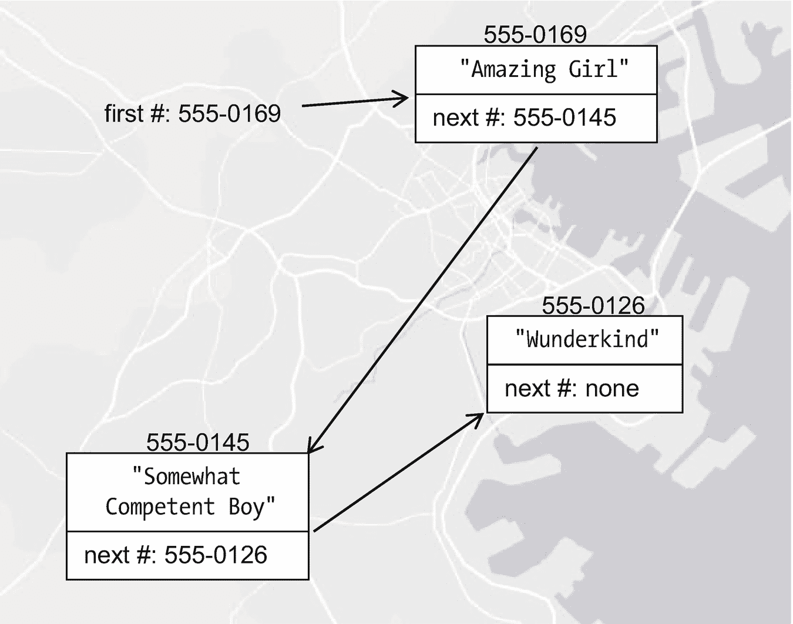
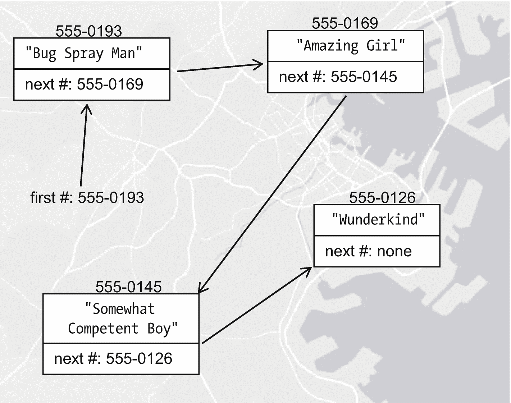
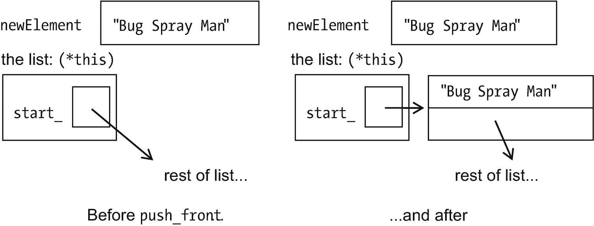
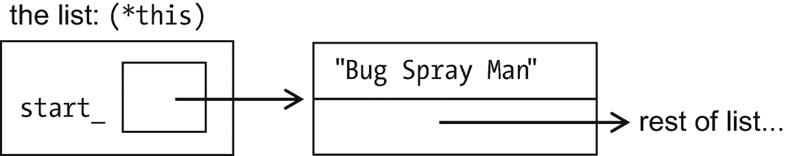
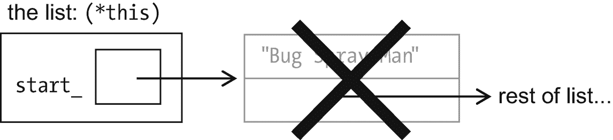
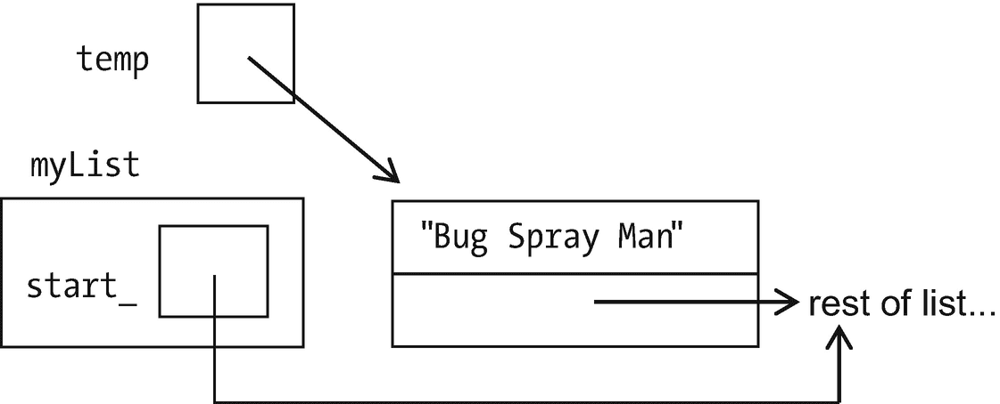
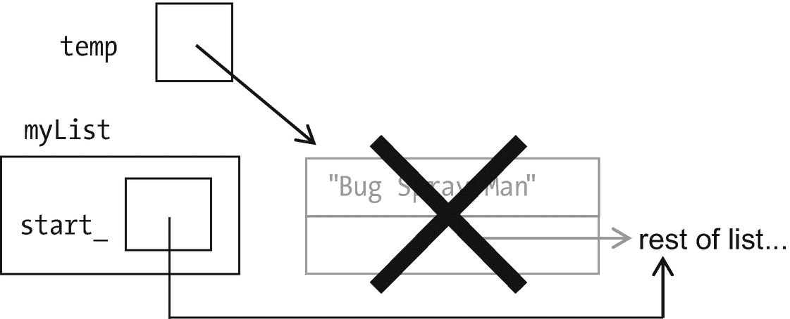

# 22.链接列表

要向`Vector`添加一个元素，我们必须分配新的内存并复制现有的元素。那还不够快！这里有一个更新更快的存储方案。

## 什么是列表，为什么有列表

整个城市，一群超级英雄在等待。如果需要他们的权力，他们有一个通知对方的计划:每个人都有另一个人的电话号码，谁有另一个人的电话号码，直到名单上的最后一个人没有电话号码(见图 [22-1](#Fig1) )。



图 22-1

我们的城市，三个超级英雄在一个链表中。百变少女第一，在 555-0169；有点能力的男生在 555-0145；神童在 555-0126

在计算机中，我们不用电话号码，而是用内存地址。这个数据结构包含每个人拥有的信息:

```cpp
struct Superhero
{
   std::string name_;   // The Superhero's name
   Superhero*  next_;   // The address of the next Superhero
};

```

记住`Superhero*`的意思是指向`Superhero`的指针——在计算机的内存中去哪里找一个`Superhero`，就像在第 21 章中`Shape*`的意思是去哪里找一个`Shape`。神童排在最后，她的下一个电话号码是“无”，所以我们将她的`next_`字段设置为`nullptr`。

假设我们想在列表中添加另一个英雄。简单快捷:给他列表中当前第一个的号码。他会把它放进他的领域。然后记住*他的*联系方式作为新的第一个号码(见图 [22-2](#Fig2) )。



图 22-2

同样的列表在我们添加了喷虫人之后

更正式地说，算法是

```cpp
create a new Superhero struct
put the name of the new person into the Superhero
put the pointer to the start of the list into the new Superhero, as "next"
set the start of the list to the address of the new Superhero

```

这里没有循环，所以比`Vector::push_back`快多了。

## 效率和 O 符号(可选)

在 O(1)处，`List`添加元素的方式比`Vector`的 O(N)有了很大的进步！

但是假设我们想要查看 indexth 元素(无论是什么索引)——也就是说，使用`operator[]`。我们如何做到这一点？对于`Vector`，它只是`contents_[index]`——没有循环，没有重复，因此是 O(1)。在这里，我们必须按顺序进行:

```cpp
current position = start;

for j = 0; j < index; ++j
    current position = the address of the next Superhero
    if we go off the end of the list, throw an exception

return the name in the current position

```

这个*是否有循环——它的时间要求是 O( `index`)。平均来说，这将是 O(N/2)，或 O(N)。*

 *表 [22-1](#Tab1) 显示了你如何知道对于一个给定的任务，`Vector`和`List`哪个更好。如果你做了大量的查找(`operator[]`)，那么`Vector`会更快。如果你添加了很多元素，`List`会更快。

表 22-1

一些`Vector`和`List`功能所需的时间

<colgroup><col class="tcol1 align-left"> <col class="tcol2 align-left"> <col class="tcol3 align-left"></colgroup> 
| 

功能

 | 

效率(向量)

 | 

效率(列表)

 |
| --- | --- | --- |
| `operator[]` | O(1) | O(N) |
| `operator=` | O(N) | O(N) |
| 复制构造函数 | O(N) | O(N) |
| `push_back` | O(N) | 未写 |
| `push_front` | 未写 | O(1) |

我经常使用`Vector`，因为我发现我查看序列的次数比构建序列的次数多。如果序列很小，也没多大关系。如果它很大，我会更注意选择最快的。

## 启动链接列表模板

现在让我们开始写`List`。我们将放弃超级英雄的类比，将`List`作为模板(例如 [22-1](#PC4) )。

```cpp
// class List:  a linked list class
//        from _C++20 for Lazy Programmers_

#ifndef LIST_H
#define LIST_H

#include <iostream>

template <typename T>
class List
{
 public:
    class Underflow  {};                    // Exception

    List ();
    List (const List <T>& other);
    ~List();

    List& operator= (const List <T>& other);

    bool operator== (const List <T>& other) const;

    int  size       () const;
    bool empty      () const { return size() == 0; }

    void push_front (const T& newElement);   // add newElement at front
    void pop_front  ();                      // take one off the front
    const T& front  () const;
private:
    struct Entry1
    {
            T      data_;
            Entry* next_;
    };

    Entry* start_;                          // Points to first element
};
#endif //LIST_H

Example 22-1The List class, first version

```

就像`Vector`，除了

*   我们用`push_front`而不是`push_back`。

*   数据成员是不同的。

*   我漏掉了`operator[]`。它的效率如此之低，以至于在抱怨了几年之后，我不在乎它是否效率低下；就让我用吧！我已经向社区低头，不再理会它。无论如何，我们将在下一章中找到更合适的方法来访问元素。

现在让我们从默认的构造函数开始写一些函数。

## `List<T>::List ()`

让默认值`List`为空是有意义的。我们如何指定一个列表是空的？按照惯例，当指针`start_`为`nullptr`时，这是正确的。你可以说它什么也没有指向——因为列表中什么也没有:

```cpp
template <typename T>
class List
{
public:
    List () { start_ = nullptr; }
     ...
};

```

## `void List<T>::push_front (const T& newElement);`

当我们开始`push_front`的时候，我们有了原来的`List`，包含了`start_`和一个`newElement`。我们需要在前面添加`newElement`，如图 [22-3](#Fig3) 所示。



图 22-3

在添加新元素到`List`之前和之后

以下是实现这一点的方法:

```cpp
create an Entry
put the newElement into its data field
put the old version of start into its next field
put the address of the new Entry into start

```

似乎很简单。这是代码:

```cpp
template <typename T>
void List<T>::push_front (const T& newElement)
{
    Entry* newEntry   = new Entry; // create an Entry
    (*newEntry).data_ = newElement;// put newElement in its data_ field
    (*newEntry).next_ = start_;    // put old version of start_
                                   //   in its next_ field

    start_            = newEntry;  // put address of new Entry
                                   //   into start_
}

```

让我们一行一行地追踪。

第一行`Entry* newEntry = new Entry;`，使用动态内存创建新的`Entry`。就像第 21 章中的新`Shape`一样，我们一次只分配一个`Entry`，而不是一个数组，所以我们不需要`[]`

在第二行，`newEntry`是新`Entry`的地址，所以`*newEntry`就是那个`Entry`本身。`(*newEntry).name_`故为其`name_`场。第三行类似。

第四行将`newEntry`的地址存储在`List`的`start_`字段中，这样我们就可以记住在哪里找到它。我们的新`Entry`现在指引我们去`List`的其他地方。如果`List`有元素，好；我们会见到他们的。如果`List`为空，那么指向列表其余部分的指针就是`nullptr`。也不错。我们会知道这就是结局。

## `void List<T>::pop_front ()`

…去掉第一个元素的函数。这是我的第一次尝试。(为了简洁，我只展示了代码，但是当然我会先写算法。)

```cpp
template <typename T>
void List<T>::pop_front ()
{
    if (empty()) throw Underflow();

    delete start_;              // delete the item
    start_ = (*start_).next_;   // let start_ go on to the next
}

```

(和第 21 章一样，我们使用`delete`而不是`delete []`——因为我们使用了没有`[]`的`new`，分配的不是一个数组而是一个`Entry`。)

假设我们把杀虫剂从名单上去掉了。图 [22-4](#Fig4) 显示了我们从什么开始。



图 22-4

准备好`pop_front`

我会追踪这些步骤。是空的吗？没问题。现在我们删除`start_`所指向的，得到图 [22-5](#Fig5) 。



图 22-5

我们删除了`pop_front`中的元素。不，这是不对的…

然后我们访问`(*start_).next_`。但是`start_`所指向的已经被删除，不复存在。名单上其他人的地址都没了。撞车了。

也许我们可以用不同的顺序来做这件事——只有在我们*确定*已经完成之后才删除它们:

```cpp
template <typename T>
void List<T>::pop_front ()
{
    if (empty ()) throw Underflow ();

    Entry* temp = start_;      // store location of thing to delete
    start_ = (*start_).next_;  // let start_ = next thing after start_

    delete temp;               // delete the item
}

```

现在让我们看看情况如何。

我们检查空的情况。没问题。

我们设定`temp`等于`start_`(图 [22-6](#Fig6) )…


图 22-6

开始`pop_front`(再次)

我们移动`start_`指向列表的其余部分(图 [22-7](#Fig7) )…



图 22-7

将`start_`设置到它应该去的地方…

…我们删除不再需要的`Entry`(图 [22-8](#Fig8) )。



图 22-8

现在可以正常工作了

列清单时，我总是画这些方框和箭头；没有它们，我必然会失去指针，跟随不好的指针，等等。所以我得到了以下黄金法则:

Golden Rule of Pointers

当改变或删除指针时，画出你正在做的事情的图表。

## `List<T>::~List ()`

最终，我们不得不把所有这些都扔回去。

我可以写一个 while 循环来删除它们，制作一个图表来确保我不会丢失任何指针，但是我是一个懒惰的程序员。我已经有东西可以安全地扔回去了吗？确定，`pop_front`:

```cpp
template <typename T>
List<T>::~List () { while (!empty()) pop_front(); }

```

完成了。

## 一点语法上的好处

因为使用 Shift 键，我的小指都快磨破了。幸运的是，C++ 提供了另一种写完全相同的东西的方法，更容易输入，也更容易阅读:

```cpp
newEntry->next_; // means (*newEntry).next_;

```

这是我们新版本的`push_front`:

```cpp
template <typename T>
void List<T>::push_front (const T& newElement)
{
    Entry* newEntry = new Entry; // create an Entry
    newEntry->data_ = newElement;// put newElement in its data_ field
    newEntry->next_ = start_;    // put old version of start_ in
                                 //  its next_ field

    start_          = newEntry;  // put address of new Entry
                                 //   into start_
}

```

## 更友好的语法:指针作为条件

我们经常需要这样的代码:`if (next_ != nullptr)...`或者`while (next_ != nullptr) ...`。

考虑 if 语句(以及 while 循环和 do-while)的条件是如何工作的。评估`()`之间的表达式。如果它的值为 0，那就意味着假；其他都是真的。

嗯，`nullptr`*有点像*0——至少，它的意思是“没有”什么都没有，假的，0，随便。所以你可以把`if (next_ != nullptr)...`写成

```cpp
if (next_)...

```

“如果`next_`不是空的，如果有下一件事……”是这个条件在说什么。你觉得方便就用吧。

## 链接列表模板

示例 [22-2](#PC14) 包含前面函数的完整版本，以及一些其他的。有的留着当练习。

还有一件事值得注意。考虑一下`operator=`。在复制另一个列表之前，我们必须用`delete`扔掉旧的内存。我们不是已经在析构函数里这么做了吗？是的，所以我们做了一个函数`eraseAllElements`，可以被`operator=` *和*析构函数调用，供代码重用。

`createEmptyList`是代码重用的另一个实用函数。

```cpp
// class List:  a linked list class
//      from _C++20 for Lazy Programmers_

#ifndef LIST_H
#define LIST_H

#include <iostream>

template <typename T>
class List
{
 public:
    class Underflow  {};                    // exception

    List ()                                 { createEmptyList();  }
    List (const List <T>& other) : List ()  { copy(other);        }
    ~List()                                 { eraseAllElements(); }

   List& operator= (const List <T>& other)
    {
        eraseAllElements (); createEmptyList(); copy(other);
        return *this;
    }

    bool operator== (const List <T>& other) const; // left as exercise

    int  size       () const;                // left as exercise
    bool empty      () const { return size() == 0; }

    void push_front (const T& newElement);   // add newElement at front
    void pop_front  ();                      // take one off the front
    const T& front  () const;                // left as exercise

    void print      (std::ostream&) const;   // left as exercise
 private:
    struct Entry
    {
            T      data_;
            Entry* next_;
    };

    Entry* start_;                          // points to first element

    void copy(const List <T>& other);       // copies other's entries
                                            //   into this List

    void eraseAllElements ();               // empties the list
    void createEmptyList  ()
    {
        start_ = nullptr;                   // the list is...nothing
    }
};

template <typename T>
inline
std::ostream& operator<< (std::ostream& out, const List <T>& foo)
{
    foo.print(out); return out;
}

template <typename T>
void List<T>::eraseAllElements () {     while (!empty()) pop_front();   }

template <typename T>
void List<T>::push_front (const T& newElement)
{
    Entry* newEntry = new Entry; // create an entry
    newEntry->data_ = newElement;// set its data_ field to newElement
    newEntry->next_ = start_;    // set its next_ field to start_

    start_          = newEntry;  // make start_ point to new entry
}

template <typename T>
void List<T>::pop_front ()
{
    if (empty ()) throw Underflow ();

    Entry* temp = start_;   // store location of thing to delete
    start_ = start_->next_; // let start_ = next thing after start_

    delete temp;            // delete the item
}

template <typename T>
void List<T>::copy (const List <T>& other)
{
    Entry* lastEntry = nullptr;   // last thing we added to this list,
                                  //   as we go thru other list
    Entry* otherP = other.start_; // where are we in the other list?

    // while not done with other list...
    //    copy its next item into this list
    while (otherP)
    {
        // make a new entry with current element from other;
        //   put it at end of our list (so far)
        Entry* newEntry = new Entry;
        newEntry->data_ = otherP->data_;
        newEntry->next_ = nullptr;

        // if list is empty, make it start_ with this new entry
        // if not, make its previous Entry recognize new entry
        //   as what comes next
        if (empty ()) start_           = newEntry;
        else          lastEntry->next_ = newEntry;

        lastEntry = newEntry;  // keep pointer for lastEntry updated
        otherP = otherP->next_;// go on to next item in other list
    }
}

...

#endif //LIST_H

Example 22-2list.h, containing the List class, some functions omitted. I invite the reader to do the exercises that follow before examining the completed solution in ch23’s project 1-2-lists

```

### 防错法

当指针出错时，它们真的会出错。你可能会遇到程序崩溃。

以下是最糟糕和最常见的指针相关错误:

*   崩溃，来自跟一个`nullptr`:比如说`myPointer`是`nullptr`的时候说`*myPointer`。最好的预防措施:在你指向指针指向的地方之前(把`*`放在前面或者`->`放在后面)，一定要检查

`if (myPointer !=``nullptr`T2】

当涉及指针时，偏执是一件好事。

*   崩溃，因为使用了尚未初始化的指针。我的解决方案是**总是初始化每个指针**。如果不知道初始化成什么，就用`nullptr`。然后`if (myPointer != nullptr) ...`(见上一段)将防止错误。

*   崩溃，来自于跟随一个指向已经被删除的东西的指针:正如我在前面的章节中所做的，跟踪代码对图做了什么是我所知道的最好的预防措施。一旦你有了几个你信任的函数，你就可以偷懒了，就像我对`eraseAllEntries`一样；让像`pop_front`这样可信的函数来做可怕的工作。

*   程序陷入循环:

    ```cpp
    Entry* p = start_;
    while (p)
    {
       ...
    }

    ```

**这里的问题是我忘记让** `while` **循环继续到下一个条目:**

```cpp
p = p->next_;

```

如果我把它写成 for 循环的形式，我就不太可能忘记:

```cpp
for (Entry* p = start_; p != nullptr; p = p->next)...

```

Exercises

对于这些练习，从`ch22/listExercisesCode`中的项目开始。练习[1–6](01.html#PC6)在章节源代码(`ch22/1-2-lists`)中有答案。

自始至终，你都可以使用操作符`->`来保存你的手指输入。

1.  写`List`的成员函数`front ()`。

2.  …和`size ()`。你能让它在没有循环的情况下工作吗？

3.  …和`operator==`。

4.  …和`print`。

5.  通过给`Entry`一个将`next_`字段设置为`nullptr`的构造函数来稍微清理一下代码。这应该有助于防止忘记初始化的错误。

6.  (需要移动构造函数，移动`=`)给`List`一个移动构造函数，移动`=`。

7.  (需要概念)用你的`List`使用概念。确保你放在`List`里的任何东西都是可打印的，为了`print`。

8.  (更难)添加一个数据成员`Entry::prev_`，这样就可以向后遍历列表，添加`List::rStart_`，这样就知道从哪里开始了。还增加了`List`成员功能`push_back`、`pop_back`和`back`。

9.  (更难)重写蒙大拿，增加一个新选项:撤销。为了支持它，你需要保存一个`List`的移动，这样你就可以撤销你的上一个移动，上一个移动，等等，直到没有移动可以撤销。一招包含哪些信息？当新回合开始时，可以清空`List`。(为什么我们不用`Vector`？)

## `#include <list>`

是的，链表类也是内置的。它比我的好:它有`push_back`、`pop_back`(见练习 8)，还有很多其他你可以自己查找的函数。

所以这里有一个问题:如果你不能使用`[]`，你如何用*和*来获取列表的元素呢？如果你不能，那就没用了！有一种方法:它被称为“迭代器”，将在下一章中介绍。

<aside aria-label="Footnotes" class="FootnoteSection" epub:type="footnotes">Footnotes [1](#Fn1_source)

一个结构/类在另一个里面？没问题。但是该结构的数据成员是公共的(默认情况下)。这是安全风险吗？一点也不。都在 List 的私人部分。

 </aside>*