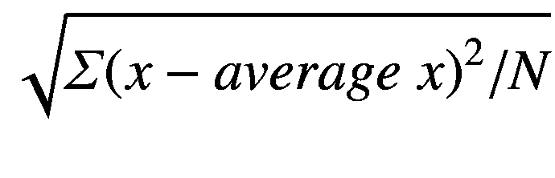

# 二十六、秘籍（推荐）·续

更多的附加功能使你的程序更安全、更快捷、更容易编写。

## 默认的构造器和`=`

早先我避免使用构造器和 operator=的默认值，因为有时 C++ 的猜测是非常错误的；具体来说，它复制数组地址，而不是数组内容。

但有时候完全正确。默认值可以节省我们写第 19 章的`Card`类的时间(见例子 [26-1](#PC1) )。

```cpp
class Card
{
public:
    Card () : rank_(Rank(0)), suit_(Suit(0)) {}
    Card            (const Card& other) = default;
    Card& operator= (const Card& other) = default;
    ...
private:
    Rank rank_; Suit suit_;
};

Example 26-1Class Card, its constructors slightly altered from Chapter 19 for simplicity, and with defaulted constructor and = added

```

如果我们要使用 C++ 的默认值，我们最好知道它们是做什么的！是这样的:

*   在默认(无参数)构造器中，调用所有父类和所有部件的默认构造器。但是`Suit`和`Rank`没有默认的构造器，所以默认的`Card ()`不会做任何事情来初始化部件。我将让第一个构造器保持原样。

*   在复制构造器中，复制父类和成员(对于类，复制构造器，对于基本类型，`=`)。

*   In =，对父类和所有部分调用=。

`=`的使用解释了为什么这不适用于数组，但对于许多其他事情却很好。

除了前面讨论的成员函数，您还可以默认或删除、移动操作符和析构函数。

## `constexpr`和`static_assert`:将工作移至编译时间

C++ 大师们现在建议你尽可能多地使用`constexpr`:这在运行时会更快(当然)；占用内存少；它还防止了“未定义的行为”(不可预测的结果)，因为带有未定义行为的东西不应该被编译。(如果这行得通，我们能对语言的其他部分也这样做吗？求你了。)

尽管名字如此，`constexpr`实际上意味着“在编译时这样做”，尽管它也使事情保持不变。

我们也可以使用`constexpr` *函数*，并在编译时使用它们来生成值，前提是这些函数的输入在编译时是已知的。

假设我们正在销售一种油漆，我们想要大量的颜色。每种颜色都有自己的 RGB 值以及可以通过这些值计算出来的东西，比如亮度(我将亮度定义为 R、G 和 B 的平均值)和补色(色轮上相反的颜色)。在编译时这样做可以加快运行时间，特别是如果我们有许多这样的函数和许多颜色。示例 [26-2](#PC2) 显示了一个`struct`及其相关的函数和变量。

```cpp
// A struct Color and associated constants and functions
//       -- from _C++20 for Lazy Programmers_

#ifndef COLOR_H
#define COLOR_H

#include "SSDL.h"

namespace Palette
{
    struct Color
    {
        constexpr Color (double r = 0, double g = 0, double b = 0)
            : red_(r), green_(g), blue_(b), brightness_((r+g+b)/3)
        {
        }
        constexpr Color (const Color&)              = default;
        constexpr Color& operator= (const Color& c) = default;

        constexpr Color complement() const
        {
            return Color (1.0 - red_, 1.0 - green_, 1.0 - blue_);
        }

        double red_, green_, blue_; // Each ranges 0.0-1.0\. More fine //   shades than
                                    //   if we used ints 0-255
        double brightness_;
    };

    // Function to convert a Color to an SSDL_Color
    constexpr SSDL_Color color2SSDL_Color (const Color& c)
    {
        return SSDL_Color (int (c.red_   * 255),
                           int (c.green_ * 255),
                           int (c.blue_  * 255));
    }

    inline constexpr Color BLACK (0.0,0.0,0.0), RED (1.0,0.0,0.0),
                           GREEN (0.0,1.0,0.0), BLUE(0.0, 0.0, 1.0),
                           FUSCHIA (1.0,0.0,1.0);

    inline constexpr
        Color COLORS[] = {Color (0.80,0.53,0.60), // puce
                          Color (1.00,0.99,0.82), // cream
                          Color (0.94,0.92,0.84)};// eggshell
}
#endif //COLOR_H

Example 26-2struct Color, using defaulted ctors and constexpr out the wazoo

```

由于`Color`的构造器是`constexpr`，我可以把`constexpr Color` s 做成类似`BLACK`、`RED`等等，或者把它们做成类似`COLORS`的`constexpr`数组。函数可以是构造器、其他成员、虚函数、非成员等等，只要这些函数在编译时足够简单。计算是可以的，文字值和其他`constexpr`，但没有什么是直到运行时才知道的，也没有对函数的调用，无论是否内置，它们本身都不是`constexpr`。所以在他们修好之前，没有`sin`、`sqrt`或`strcpy`。 <sup>[1](#Fn1)</sup>

例 [26-2](#PC2) 也有`constexpr`功能`color2SSDL_Color`。它调用`SSDL_Color`的构造器。那能行吗？是的，因为`SSDL_Color`的构造者也是`constexpr`。

因为一个`constexpr`函数必须能够在编译时完成它的工作，编译器必须知道，一旦它找到对它的调用，它是如何做的——就像内联函数一样。它需要放在`.h`文件中，并且是隐式的`inline`。

它*是否真的*在编译时工作取决于它必须处理什么。如果我们给它`constexpr` s 和/或文字，它可以返回一个`constexpr`值:

```cpp
constexpr Color CREAM = COLORS[1];
constexpr
SSDL_Color SSDL_CREAM = color2SSDL_Color(CREAM);    // done at compile time

```

但是如果我们给它一些运行时才存在的东西，比如这里的`PUCE`，它就不能:

```cpp
const Color PUCE      = COLORS[0];
SSDL_Color  SSDL_PUCE = color2SSDL_Color(PUCE);
      // color2SSDL_Color is called at runtime because PUCE isn't constexpr

```

我们也有一个编译期版本的`assert`用于`constexpr` s。不像`assert`，它不需要任何包含文件。

```cpp
constexpr Color ONYX  = CREAM.complement();  // CREAM's opposite

static_assert (ONYX. brightness_ < 0.10);    // onyx isn't bright
static_assert (CREAM.brightness_ > 0.90,     // but cream is
               "Isn't cream supposed to be bright?");

```

在编译时完成它的工作。如果你愿意，你可以给它一些东西打印，如果它失败了，如图所示。有了 Visual Studio，你甚至不需要编译——在`static_assert`上挥动你的鼠标指针，它会告诉你是否有问题。很好！

Extra

从我在网上看到的情况来看，有计划要在未来的标准中大大扩展编译时可以做的事情。这里有两个进一步推进编译时间的特性 edge，所以你的编译器可能还不喜欢它们。

`constinit` `Color favoriteColor = RED;`

这不是一个常量，而是在编译时由某个常量初始化的。

为什么要这样做？假设在不同的`.cpp`文件中有两个全局对象，其中一个依赖于另一个的初始值。如果它们以正确的顺序被初始化，那绝对是好运气，因为 C++ 没有指定哪个`.cpp`文件的“静态”变量(全局变量和其他一些变量，包括`static`类成员)首先被初始化。`constinit`通过拒绝编译时未知的`=`的任何权利来避免这种“静态初始化顺序的惨败”。

如果你想在一个函数中声明一个`constinit`，在前面加上`static`关键字。

还有“即时功能”:

`consteval` `int someFunction (...args...) {...}`

这就像一个`constexpr`函数，除了它不灵活:它*必须*在编译时执行。

Exercises

1.  `constexpr`能在`Fraction`的都在，再算一些`Fraction`(用`+`、`*`什么的)，全部`constexpr`。尽可能使用`static_assert`来验证您的功能。

2.  `constexpr`你能在`Point2D`中的一切，并声明一些`constexpr Point2D`在`constexpr`表达式中使用。尽可能使用`static_assert`来验证你的功能。

## 结构化绑定和`tuple` s:一次返回多个值

在第 7 章，我可能给人的印象是一个函数只能返回一个东西。如果是的话…我撒谎了。

我们已经可以返回一个`vector`或`list`…但是这里有一种方法可以返回多个东西，而不会产生额外的开销。示例 [26-3](#PC6) 展示了它的样子。

1.  **#包含<元组>** **。**元组是值的序列，可能是不同的类型；这是我们要回报的。

2.  **让功能返回** **自动**。它实际上是返回`std::tuple` `<firstType,secondType,...>`，但是为什么不让编译器来计算呢？

3.  **用 Return STD::****make _ tuple****(value 1，value2，...);**T6。

4.  **将返回值存储在“结构化绑定”中:**

`auto` `[variable1, variable2, ...] = functionCall (...);`

这将声明`variable1`、`variable2`等等，并从函数返回的内容中初始化它们。

```cpp
// Program to calculate the quadratic formula
//   using structured bindings and tuples
//       -- from _C++20 for Lazy Programmers_

#include <iostream>
#include <cmath>    // for sqrt
#include <tuple>    // for tuple stuff    // Step #1: #include <tuple>
#include <cassert>

using namespace std;

// If auto's going to work in main, we need the
//  function body *above* main. Else there's no way main
//  can know what type is to be returned

                                          // #2: return auto
auto quadraticFormula (double a, double b, double c)
{
    int numroots = 0;
    double root1 = 0.0;
    double root2 = 0.0;

    double underTheRadical = b * b - 4 * a*c;
    if (underTheRadical >= 0) // If we have to sqrt a neg #,
                              //  no solution. Otherwise...
    {
        root1 = (-b + sqrt (underTheRadical)) / (2 * a);
        root2 = (-b - sqrt (underTheRadical)) / (2 * a);

        if (root1 == root2) numroots = 1; else numroots = 2;
    }
                                   // #3: return a tuple
    return std::make_tuple (numroots, root1, root2);
}

int main ()
{
    // Get user input
    cout << "Enter the a, b, c from ax^2+bx+c = 0: ";
    double a, b, c;  cin >> a >> b >> c;

    // Get the results
                                   // #4: store result in auto[...]
    auto[howMany, r1, r2] = quadraticFormula (a, b, c);

    // Print the results
    switch (howMany)
    {
    case 0: cout << "No solution.\n";                     break;
    case 1: cout << "Solution is "   <<r1<<endl;          break;
    case 2: cout << "Solutions are " <<r1<<' '<<r2<<endl; break;
    default:cout << "Can't have "    <<howMany<<" solutions!\n";
    }

    return 0;
}

Example 26-3Using structured bindings to get multiple values through a return statement

```

这种新的能力，加上我们之前所知道的，导致了第八章中关于这个主题的黄金法则的更新版本。

Golden Rule of Function Parameters and

`return` **(新版)**

*   如果函数提供了一个值...
    *   如果很小，就退掉。对于倍数，返回一个元组。

    *   如果没有，就路过`&`。

*   如果它接受一个变量并改变它，则通过`&`。

*   如果它接受它而不改变它，
    *   如果是一个对象，作为`const TheClass&`对象传递。

    *   否则按值传递(否`&`)。

*   如果是移动`=`，则经过`&&`。

    …除了数组作为参数传入之外，根据内容是否改变，有或没有`const`。

你也可以在其他地方使用元组，有点像`pair`，只是元素数量不同。为了得到零件，无论是改变它们还是使用它们，你可以使用`std::get` `<>()`。将您想要的元素放在`<>`和`()`之间的元组之间:

```cpp
std::tuple<int, double, double> myTuple = std::make_tuple (0, 2.0, 3.0);
assert(std::get<0> (myTuple) == 0);      // check the 0th value
std::get<0> (myTuple) = 1;               // set   the 0th value

```

如果能节省你的时间就好。但是它甚至没有那个有`auto [...]`的东西一半酷。

Exercises

在每个练习中，让`main`使用`auto [...]`来存储返回值:

1.  编写一个函数`sortedTriple`,它接受一个由三个元素组成的元组，将它们按顺序排列，然后返回新的版本。

2.  从第 18 章写一个版本的`factorial`，不仅返回`n!`，还返回`n`。

3.  (更难)写一个函数，给定一个`vector`，返回最大值、最小值、平均值和标准差，所有这些都在一个元组中。标准差有时定义为。

    现在为一个`list`写一个做同样事情的。泛型编程，是的。

## 智能指针

C++ 最近更新背后的一个动机是防止指针错误破坏我们的代码。祝你好运！但是还是有进步的。

### `unique_ptr`

主要的主力是`std::unique_ptr`。它维护一个指针，让您使用它，并在它超出范围时自动删除它。是的，你*可以*打破它，但是你必须试一试。它通常用`make_unique`初始化，它带参数来初始化你所指向的任何东西:

```cpp
#include <memory

>
...
std::unique_ptr<int >    p1 = std::make_unique<int>(27);
        // new int ptr, value 27
std::unique_ptr<Date> pDate = std::make_unique<Date>(1, 1, 2000);
        // Put the arguments for Date's constructor in
        //    and make_unique will take care of it

```

或者它取你想要创建的数组的大小:

```cpp
std::unique_ptr<char[]> myChars = std::make_unique<char[]>(100);

```

之后，像平常使用指针一样使用它:

```cpp
*p1 = 2; cout << *p1;
pDate->print(cout);
myChars[5] = 'A';

```

你可以用`get()`拿到里面的指针。当传递给一个函数:`strcpy (myChars.get(), "totally unique");`时，您可能需要它。

不需要记得清理；它会自动删除。而且对于谁做`delete`也没有混淆，因为`unique_ptr`不共享内存(因此有了单词“unique”)。

你*能不能*告诉它马上删除:

```cpp
myChars.reset();                 // the memory is deleted --
                                 //   myChars now thinks it's nullptr

```

或许可以重置成你想要的其他东西:

```cpp
myChars.reset (new char [100]);2 // takes ownership of the new memory –-
                                //   is responsible for deleting later

```

为什么要这么做？

*   错误预防:这样你就不会忘记初始化或删除，也不会忘记使用已经被删除的指针——它会自动设置为`nullptr`，所以你不能这样做。

*   异常安全:当你离开一个函数时，它调用所有局部变量的析构函数。原始指针——我们一直在使用的那种——没有析构函数，所以它们的内存不会被抛出，但是`unique_ptr` s 会把它们的内存放回它们的析构函数中。因此，如果抛出异常，使用`unique_ptr`可以防止内存泄漏。

我代码中的大多数指针都在类的私有部分，清理由析构函数处理，所以我认为它们是相当安全的。但是让我们看看`unique_ptr`是否能为我们省去麻烦。

我将从示例 [21-6](21.html#PC8) 的奥林匹克标志程序开始(此处更新为示例 [26-4](#PC13) )。

```cpp
// Program to show, and move, the Olympic symbol
//   It uses Circle, and a subclass of Shape called Text
//   Adapted to use unique_ptr
//       -- from _C++20 for Lazy Programmers_

#include <vector>
#include <memory> // for unique_ptr
#include "circle.h"
#include "text.h"

int main (int argc, char** argv)
{
    SSDL_SetWindowSize (500, 300); // make smaller window

    // Create Olympic symbol
    std::vector<std::unique_ptr<Shape>> olympicSymbol;

    //  with Circles
    constexpr int RADIUS = 50;
    olympicSymbol.push_back
        (std::make_unique<Circle> ( 50,  50, RADIUS));
    olympicSymbol.push_back
        (std::make_unique<Circle> (150,  50, RADIUS));
    olympicSymbol.push_back
        (std::make_unique<Circle> (250,  50, RADIUS));
    olympicSymbol.push_back
        (std::make_unique<Circle> (100, 100, RADIUS));
    olympicSymbol.push_back
        (std::make_unique<Circle> (200, 100, RADIUS));

    //  plus a label
    olympicSymbol.push_back
        (std::make_unique<Text> (150,150,"Games of the Olympiad"));

    // color those circles (and the label)
    SSDL_Color olympicColors[] = { BLUE,
                   SSDL_CreateColor (0, 255, 255), //  yellow
                   BLACK, GREEN, RED, BLACK };
    for (unsigned int i = 0; i < olympicSymbol.size(); ++i)
        olympicSymbol[i]->setColor (olympicColors [i]);

    // do a game loop
    while (SSDL_IsNextFrame ())
    {
        SSDL_DefaultEventHandler ();

        SSDL_RenderClear (WHITE);   // clear the screen

        // draw all those shapes
        for (const auto& i : olympicSymbol) i->draw ();
                                   // ranged-based for-loops ftw!
        // move all those shapes
        for (const auto& i : olympicSymbol) i->moveBy (1, 1);
    }

    // No longer needed:
    // for (auto i : olympicSymbol) delete i;

    return 0;
}

Example 26-4The Olympic symbol program from Example 21-6, now using unique_ptr

```

我对我挽救的工作并不兴奋。让我们看看它在类`Shape`中会做什么。

`Shape`有一个`char`指针`description_`。在现实生活中，我只是使用了一个`string`，但是这将帮助我们看到当一个类必须有一个指针时`unique_ptr`为我们做了什么(例子 [26-5](#PC14) 和 [26-6](#PC15) )。

```cpp
// Shape class, for use with the SSDL library
//   -- from _C++20 for Lazy Programmers_

#include "shape.h"

// ctors
Shape::Shape(int x, int y, const char* text)
    : description_(copy(text))
{
    location_.x_ = x; location_.y_ = y;
}

Shape::Shape (const Shape& s) :
    location_   (s.location()),
    color_      (s.color   ()),
    description_(copy (s.description_.get()))
{
}

// I no longer have to write the move ctor

//  ...or the move = operator

// operator=
Shape& Shape::operator= (const Shape& s)
{
    location_ = s.location();
    color_    = s.color   ();
    description_.reset (copy (s.description_.get()));
    return *this;
}

// copy, used by = and copy ctor
char* Shape::copy (const char* text)
{
    char* result = new char [strlen (text) + 1];
    strcpy (result, text);
    return result;
}

Example 26-6The Shape class from Example 21-1, now using unique_ptr

```

```cpp
// Shape class, for use with the SSDL library
//       -- from _C++20 for Lazy Programmers_

#ifndef SHAPE_H
#define SHAPE_H

#include <memory> // for unique_ptr
#include "SSDL.h"

struct Point2D  // Life would be easier if this were a full-fledged class
{               //   with operators +, =, etc. . . . but that
    int x_, y_; //   was left as an exercise.
};

class Shape
{
 public:
    Shape (int x = 0, int y = 0, const char* text = "");
    Shape (const Shape& other);
    Shape (Shape&&) = default;
    virtual ~Shape() {} // No need to delete contents_ -- handled!

    Shape& operator= (const Shape& s);
    Shape& operator= (Shape&&) = default;

    //...

    const char* description() const { return description.get(); }

    //...

 private:
    Point2D    location_;
    SSDL_Color color_;
    std::unique_ptr<char> description_;
    char* copy(const char*); // used for copying descriptions
                             // altered from original for clearer use
                             //  with the new description_, but
                             //  it's not really new stuff
};

#endif //SHAPE_H

Example 26-5The Shape class from Example 21-1, now using unique_ptr

```

我发现的主要优势是

*   无需在析构函数中编写任何代码；知道如何删除自己。我也不必在`operator=`或复制构造器中删除内存——这是一个容易出错的活动。

*   我现在可以使用默认的移动功能。`location_`和`color_`使用它们的复制扇区；`description_`知道如何用它的 move 构造器复制自己。不编写 move 构造器和 move `=`为我节省了大约八行代码。

### `shared_ptr`

一个`unique_ptr`拥有它的内存，其他任何人都不应该改变或释放它。

一个`shared_ptr`让其他`shared_ptr`拥有相同的内存。它记录了有多少个`shared_ptr`正在使用它(这就是“引用计数”)，只有当这个数字降到 0 时，内存才会被删除。

这里有一个可能的用途:我有一个可以从文件中加载的 3d 模型。这些东西往往很大。如果我有 20 个相同类型的怪物，我不想要所有图形数据的 20 个副本！

所以我将图形数据放在一个类型为`GraphicsData`的对象中，并为怪物的每个实例创建一个`Monster`对象。让`Monster` s 分享他们的`GraphicsData`。

```cpp
class GraphicsData
{
    ...

private:

    ... lots of graphics info...
};

class Monster
{
    ...

    Point3D location_;
    shared_ptr<GraphicsData> _modelInfo;
};

```

如果`GraphicsData`包含一个指向`Monster`的指针，那么`shared_ptr`的引用计数可能会遇到一个问题，因此引用的数量不会降到零，也不会删除任何东西。`weak_ptr`，这里没有涉及，是处理那个问题的一种方式。

### 防错法

我发现智能指针的主要问题是忘记`get()`:

`strcpy (myChars, "totally unique"); // should be myChars.get()`。

Exercises

1.  重写`String`类(使用第 18 章，这样它会有移动复制和移动`=`)来使用`unique_ptr`。

## `static_cast`等。

哪里曾经说过`newtype (value)`，哪里就可以说`static_cast` `<newtype> (value)`:

```cpp
double dbl = double (intVal);

```

成为

```cpp
double dbl = static_cast<double> (intVal);

```

和

```cpp
((ChildClass*) (parentClassPtr))->childClassFunction ();

```

成为

```cpp
(static_cast<ChildClass*> (parentClassPtr))->childClassFunction ();

```

为什么呢？所以当你想说

```cpp
int* intArray = static_cast<int*> (myFloatArray); // huh?!

```

编译器不会让你这么做。指针安全。

Extra

我不推荐 C++ 提供的其他**选角** **运算符**，如果你继续下一部分，我也不会责怪你。

还在吗？好的。以下是其他类型:

*   `const_cast` `<type>`:增加或减少`const` ness:

`((const_cast<const MyClass*> (someVar ))->print (cout);`

`// adds constness`

`((const_cast< MyClass*> (someConst))->alterMeInSomeWay();`

`// takes it away`

…但是你不能安全地把它应用到最初声明的东西上`const`。你*可以*将它应用于作为`const`参数传入的东西。

我避免这样。如果是非`const`，我能用`const`做什么非`const`做不了的事？不多。如果是`const`，我真的不应该破坏那个安全。

*   `dynamic_cast` `<type>`:如果涉及到虚拟的话，这可以让你在继承层次中进行转换。我从来没用过。

*   `reinterpret_cast` `<type>`:这个不太“什么都行”——不影响`const` ness，也不能施放自己想不通的东西，但是可以做类似前文施放`myFloatArray`到`int*`的诡异事情。我也没用过。

    但是也许我*在不知道的情况下*用了最后一个，那时候我们只有更老更简单的演员阵容`<type>()`。当您这样做时，C++ 会按顺序尝试这些类型的转换:

*   `const_cast`

*   `static_cast`

*   `static_cast`然后`const_cast`

*   `reinterpret_cast`

*   `reinterpret_cast`然后`const_cast`

    找一个能用的。如果失败了，你就不能做演员了。

    在我看来，我们使用的是`static_cast`，而不是老式的造型，主要是为了不让我们不知道它已经到达了`reinterpret_cast`。

## 用户定义的文字:测量系统之间的自动转换

1999 年 9 月 23 日，美国太空探测器火星气候轨道器在火星附近失踪。该计划中有关进入轨道的部分有一些英制计算和一些公制计算。该计划失败了，美国国家航空航天局从未从其价值 3 . 27 亿美元的宇宙飞船中得到任何东西。哎呀。

我完全理解。每次用 trig 函数写程序，我都用度数，C++ 用弧度。

当 NASA 编写这个软件时，现代 C++ 还不存在，但是如果有，他们可以让计算机在系统之间自动转换。以下是如何:

1.  Write an operator to convert from your unit to some unit you want the calculations done in. I’ll convert miles to meters:

    ```cpp
    long double operator"" _mi  (long double mi)
    {
        return mi * 1609.344; // 1 mi = 1609.344 meters
    }

    ```

    你*需要主角`_`。*

**   这样称呼它: **10_mi** 。C++ 将此视为将 10 传递给`"" _mi`操作符。

     *

 *在 BNF 中，操作符看起来是这样的(尽管您可以像`constexpr`一样给它添加限定符):

```cpp
<return-type> operator "" _<operator name> (<parameter list>)
{
     <body>
}

```

这样用: *<值>* `_` *<运算符名称>* ，无空格*。它只适用于文字——你不能用它来转换变量。*

示例 [26-7](#PC24) 将此与`constexpr`一起使用–为什么不呢？–进行一些简单的计算。

```cpp
// Program to use user-defined literals
//       -- from _C++20 for Lazy Programmers_

#include <iostream>
#include <cmath>

using namespace std;

constexpr double PI = 3.14159;3

// "Literal" operators

constexpr long double operator"" _deg (long double degrees) // version for   //   double values
{
    return degrees * PI/180;
}

constexpr long double operator"" _deg (unsigned long long degrees) // ...for int
{
    return degrees * PI/180;
}

constexpr long double operator"" _m   (long double  m) { return m;            }
                                                 // 1 m = 1 m (duh)
constexpr long double operator"" _mi  (long double mi) { return mi * 1609.344;}
                                                 // 1 mi = 1609.344 m
int main ()
{
    cout << "The speed of light is 186,000 miles per second.\n";
    cout << "In metric, that's ";
    cout <<     186'000.0_mi4

   << " meters per second --\n"
         << "   should be about " << 300'000'000.0_m  << ".\n";

    cout << "Oh, and sin (30 deg) is about 0.5

: " << sin (30_deg) << endl;

    return 0;
}

Example 26-7A program using user-defined literals

```

输出:

```cpp
The speed of light is 186,000 miles per second.
In metric, that's 2.99338e+008 meters per second --
   should be about 3e+008.
Oh, and sin (30 deg) is about 0.5: 0.5

```

以下是关于参数的两个特性:

*   它不会在类型之间进行隐式转换(尽管它对像`unsigned`或`long`这样的修饰符很灵活)。如果你给它`186'000_mi`，它就会失败，因为它期待的是`double`而不是`int`。要么添加`.0`，要么编写一个期望整数类型的运算符。

*   参数表必须是表 [26-1](#Tab1) 中的一组。我大多用`long double`。

表 26-1

用户定义的文字运算符的可能参数列表

<colgroup><col class="tcol1 align-left"> <col class="tcol2 align-left"></colgroup> 
| `unsigned long long` | `long double` |
| `char` | `const char*` |
|   | `const char*,     std::size_t`<sup>[5](#Fn5)T4】</sup> |
| `wchar_t` | `const wchar_t*,  std::size_t` |
| `char16_t` | `const char16_t*, std::size_t` |
| `char32_t` | `const char32_t*, std::size_t` |

Exercises

使用用户定义的文字，如果可能的话用`constexpr`...

1.  火星的气压约为 6.1 毫巴，地球的气压约为每平方英寸 14.7 磅。金星的大概是 9.3 MPa。在网上查找这些单位进行转换，计算金星的压力比地球大多少倍，地球比火星大多少倍。

2.  使用砝码，用户提供三个物体，分别是磅、千克和石头，哪一个最重。

## 一次性使用的 Lambda 函数

STL 的函数`sort`可以接受第三个参数，这是一个比较函数，如果认为第一个参数小于第二个参数，则返回`true`。假设我们想按名字*或*按人口对城市进行排序:

```cpp
bool lessThanByName (const City& a, const City& b)
{
    return a.name()       < b.name();
}

bool lessThanByPop     (const City& a, const City& b)
{
    return a.population() < b.population();
}

...

ranges::sort (cities, lessThanByName);6
ranges::sort (cities, lessThanByPop);

```

如果一个比较函数只使用一次，也许我懒得为它创建一个完整的函数。我可以这样做:

```cpp
ranges::sort (cities, [](const City& a, const City& b)
                        {
                            return a.name() < b.name();
                        });

```

这被称为“lambda”函数，这个术语是通过 LISP 编程语言从数学中借用的。BNF 就像一个函数，除了返回类型和函数名被替换为`[]`:

```cpp
[] (<parameters, separated by commas>)
{
    <thing to do -- variable declaration, action, whatever>*
}

```

`[]`是一种表示“函数名放在这里，只是这次我没有考虑名字。”

### λ捕获

越来越奇怪了。假设我想根据我的`City`离某个特定地点的距离来排序。我不能把那个位置作为第三个参数传入-`sort`需要一个两个参数的比较函数！但是我可以告诉 lambda，“把这个变量从外面带进来”:

```cpp
const City LA ("Los Angeles", 3'900'000, { 34_deg, -118_deg }); // name, pop, location

ranges::sort (cities, [&LA](const City& a, const City& b)
                      {
                          return distance (LA, a) < distance (LA, b);
                      });

```

我在上面加了一个`&`来说明，“提交一份参考资料，不要复制。”你不能说`const &`，但既然`LA`是`const`，就不会改变它。

如果 lambda 不改变值并且复制成本不高，我可以省略`&`:

```cpp
// Find out if some bad letter is in my city's name
auto findBadLetter =
    find_if (name, [badLetter](char ch) { return ch == badLetter; });

```

表 [26-2](#Tab2) 显示了我们可以放在`[]`之间的东西。通常我们不需要任何东西。但是我们可以列出具体的变量，有或者没有`&`。

表 26-2

λ捕捉。这些位于 lambda 函数的`[]`之间，允许访问不是 lambda 函数参数的非静态局部变量。它们可以组合:【`arg1, &arg2,` `this` `]`

<colgroup><col class="tcol1 align-left"> <col class="tcol2 align-left"></colgroup> 
| `arg1  [,  arg2...]` | 在 lambda 函数中按值使用参数。 |
| `&arg1 [, &arg2...]` | 通过引用使用参数(在 lambda 函数中改变它也会在外部改变它)。 |
| `=` | 通过值使用所有可用的变量。 |
| `&` | 通过引用使用所有可用的变量。 |
| `this` | 使用当前对象的成员。如果在非常数函数中，它们可以被修改 |

我们也可以用`=`或`&`来说，“让一切都进来。”这里的“一切”是指非全局变量(ack！)并且不是静态的。 <sup>[7](#Fn7)</sup> 全局变量和静态局部变量无论如何都可以被引用，而不需要在`[]`中列出

我避免裸露的`&`和`=`——确切地指定什么可以进入函数更安全。

### lambda 函数的示例

示例 [26-8](#PC31) 展示了 lambda 函数和捕获，在程序中以各种方式对城市进行排序。

```cpp
// Program that uses lambda functions to order cities by different criteria
//       -- from _C++20 for Lazy Programmers_

#include <iostream>
#include <vector>
#include <cassert>
#include <algorithm>
#include "globalLoc.h" // provides user-defined literal operators _deg and _mi,
                       //   struct GlobalLoc, latitude, longitude, and
                       //   a distance function that works on a globe

using namespace std;

class City
{
public:
    City (const std::string& n, int pop, const GlobalLoc& loc) :
        name_ (n), population_ (pop), location_ (loc)
    {
    }
    City            (const City&) = default;
    City& operator= (const City&) = default;
    const std::string& name    () const { return name_;       }
    int   population           () const { return population_; }
    const GlobalLoc&   location() const { return location_;   }
private:
    std::string  name_;
    int          population_;
    GlobalLoc    location_;
};

inline
double distance (const City& xCity, const City& yCity)
{
    return distance (xCity.location(), yCity.location());
}

int main()
{
    // Some prominent party spots
    vector<City> cities =
    {
        {"London",         10'313'000, { 51_deg,  -5_deg}},
        {"Hamburg",         1'739'000, { 53_deg,  10_deg}},
        {"Paris",          10'843'000, { 49_deg,   2_deg}},
        {"Rome",            3'718'000, { 42_deg,  12_deg}},
        {"Rio de Janiero", 12'902'000, {-22_deg, -43_deg}},
        {"Hong Kong",       7'314'000, { 20_deg, 114_deg}},
        {"Tokyo",          38'001'000, { 36_deg, 140_deg}}
    };

    // Print those cities in different orderings:

    cout << "Some major cities, in alpha order :      ";
    ranges::sort (cities, [](const City& a, const City& b)
                          {
                              return a.name() < b.name();
                          });
    for (const auto& i : cities) cout << i.name() << " / ";
    cout << endl;

    cout << "Ordered by population:                   ";
    ranges::sort (cities, [](const City& a, const City& b)
                          {
                              return a.population() < b.population();
                          });
    for (const auto& i : cities) cout << i.name() << " / ";
    cout << endl;

    cout << "Ordered by how far they are from LA:     ";
    const City LA ("Los Angeles", 3'900'000, { 34_deg, -118_deg });

    // & would work here too -- but &LA is a little more secure
    ranges::sort (cities, [&LA](const City& a, const City& b)
                          {
                               return distance (LA, a) < distance (LA, b);
                         });
    for (const auto& i : cities) cout << i.name() << " / ";
    cout << endl;

    return 0;
}

Example 26-8A program to sort cities, using lambdas. Parts are omitted for brevity

```

Exercises

当然，在所有这些情况下，都要使用 lambda 函数。我引用了我在文中没有描述过的函数；需要的话在网上查查。

1.  按纬度对前面示例中的`City`进行排序。

2.  使用`for_each`函数打印一个容器的每个元素，由`/`分隔。也许你会用它来代替示例 [26-8](#PC31) 中打印的`for`。

3.  使用`for_each`将一个容器中的每一个柠檬大写。

4.  使用`count_if`函数查看容器中有多少整数是整数的平方。

5.  使用`all_of`来验证容器中的每个字符串都包含一些子字符串，由用户给出。

<aside aria-label="Footnotes" class="FootnoteSection" epub:type="footnotes">Footnotes [1](#Fn1_source)

与本章的其他部分一样，还有更多需要了解的内容——但这将是你的开始。

  [2](#Fn2_source)

但不是 myChars.reset("完全唯一")；。它只能获取它可以拥有和删除的动态内存，而不是静态内存。

  [3](#Fn3_source)

C++20 会让我们#include <numbers>并使用 std::numbers::pi，而不是声明我们自己的。在撰写本文时，支持是不稳定的。</numbers>

  [4](#Fn4_source)

您可以使用这些“数字分隔符”来使数字更容易阅读。我承认撇号在这里看起来很奇怪，但逗号正忙于其他事情。

  [5](#Fn5_source)

这张看起来很奇怪，我来解释一下。您应该像这样编写函数头

`string operator”” _fancify (const char* str, size_t n)`

`// make a char* into a fancy string, whatever that is`

并这样称呼它:

`string fancy = “string to be made fancy”_fancify;`

它自动从字符数组中获取大小。

  [6](#Fn6_source)

回想一下第 23 章:如果你的编译器还不支持 ranges，那就传入相关的 begin()和 end()，而不是容器:sort (cities.begin()、cities.end()、lesssthanbyname)；。

  [7](#Fn7_source)

正确的说法是“自动变量”

 </aside>*