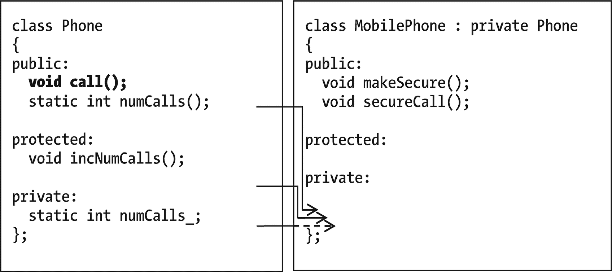
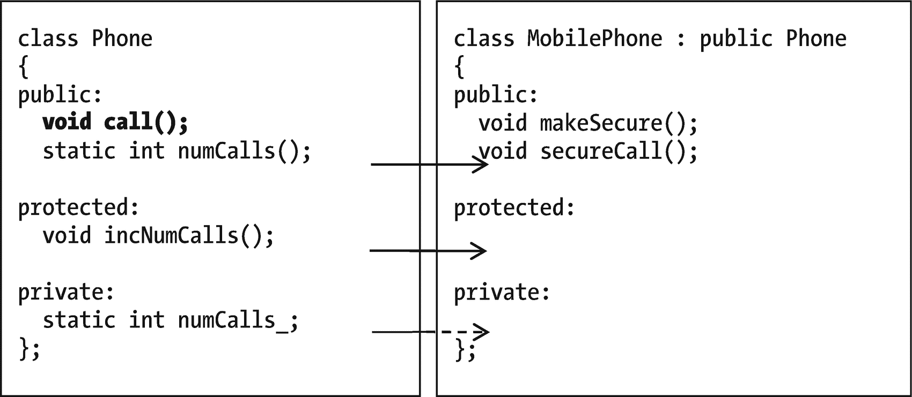
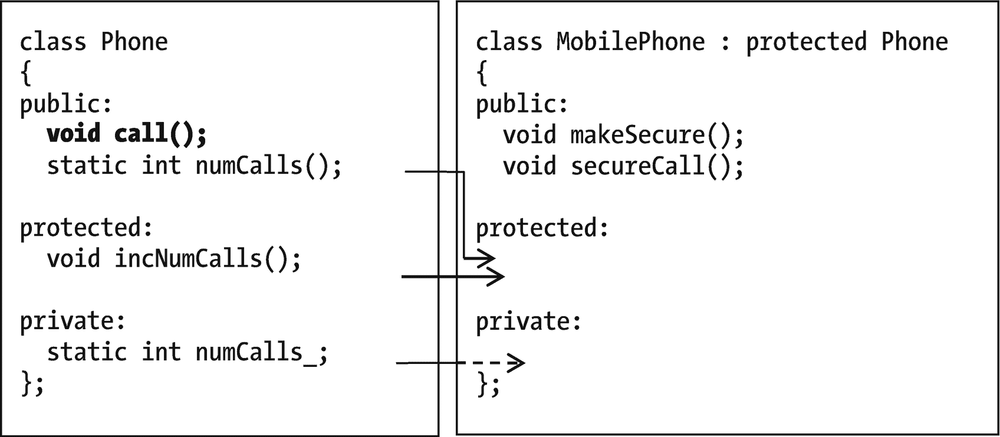
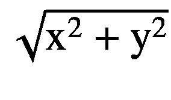

# 二十七、秘籍（不推荐）

我很少使用这些功能。这一章的部分原因是在那些罕见的情况下，它们*是*有用的。另一个是理解为什么他们不那么受欢迎。因为向前看很有趣，所以有两个 C++20 特性的预览，它们还不是很有用，但是应该在 C++23 中:模块和协程。

## `protected`章节，`protected`传承

考虑类`Phone`。`Phone`有一个成员`numCalls_`，它记录任何一个`Phone`打过的所有电话。有一个函数可以改变它，但它是私有的，因为我们真的应该只在制作`call ()`时更新`numCalls_`。

```cpp
class Phone
{
public:
    void call() { /*do some stuff, and then */ incNumCalls(); }
    static int numCalls() { return numCalls_; }

private:
    void incNumCalls   () { ++numCalls_;      }

    inline static int numCalls_ = 0;
};

```

但是现在我们已经到达了人类文明的黎明，出现了`MobilePhone` s。他们用不同的方式打电话，使用信号塔，但是他们也需要增加那个数字。他们无法访问`Phone::incNumCalls()`；这是隐私。我们有充分的理由决定不公开。我们还能做什么？

C++ 提供了另一个部分:**受保护的**(参见示例 [27-1](#PC2) )。外界看不到(像 private)，但是子类看得见。

```cpp
class Phone
{
public:
    void call() { /*do some stuff, and then */ incNumCalls(); }
    static int numCalls() { return numCalls_; }

protected:
    void incNumCalls   () { ++numCalls_;      }

private:
    inline static int numCalls_ = 0;
};

Example 27-1The Phone class, ready to share a family secret with its child classes

```

现在`MobilePhone`将能够访问`incNumCalls()`:

```cpp
class MobilePhone : public Phone
{
public:
    void call() { /* do stuff w cell towers, and */ incNumCalls(); }
};

```

应该用`public`还是`private`继承？比方说，当你打手机时，你需要一些额外的安全措施。所以在`MobilePhone`中，我将抛弃旧的`call`，增加一个新的功能`secureCall`:

```cpp
class MobilePhone : public /*?*/ Phone
{
public:
    void secureCall()
    {
        makeSecure ();
        /* do cell tower stuff */
        incNumCalls();
    }

    void makeSecure (); // however that's done
};

```

有了公共继承(图 [27-1](#Fig1) ，继承的成员在子类中就像在父类中一样是公共的。这对`MobilePhone`不利:它让外界使用不安全的、继承的`call`函数。也许私人继承，如图 [27-2](#Fig2) ，会更好？看起来是这样。



图 27-2

带有受保护节的私有继承



图 27-1

带有受保护节的公共继承

现在我将添加一个`MobilePhone`的子类:一个`SatellitePhone`。它的叫声不同:

```cpp
class SatellitePhone : public MobilePhone
{
public:
    void secureCall()
    {
        makeSecure ();
        /* do satellite stuff */
        incNumCalls();
    }

    //  makeSecure is inherited from MobilePhone
};

```

问题:`SatellitePhone`不能用`incNumCalls`。私人继承把它放在`MobilePhone`的私人部分。

我们可以用**保护** **继承**，如图 [27-3](#Fig3) 。这就像公共继承，除了继承的公共成员受到保护。



图 27-3

继承:一个解决问题的方法

现在，正如示例 [27-2](#PC6) 中的程序可以验证的那样，子类是安全的，不会被旧的`call`函数、*和*使用，所有的类都根据需要访问`incNumCalls()`。

```cpp
int main ()
{
    Phone P;            P.call();
    MobilePhone MP;    MP.secureCall();
    SatellitePhone SP; SP.secureCall();

    assert (Phone::numCalls() == 3); // If this assertion succeeds,
                                     //    incNumCalls got called //     3 times -- good!

    return 0;
}

Example 27-2Verifying that no matter what kind of call we made, Phone::numCalls_ got updated

```

在拥有孙类之前，使用私有继承还是受保护继承根本无关紧要。即便如此，这可能也无关紧要。我几乎从不需要受保护的部分或受保护的继承。

## 为什么你不应该有

考虑一个使用地图的程序。它读入几个`Area`秒，如图 [27-4](#Fig4) 所示。每个`Area`都有一个名称和边界框(T2 向北、向南、向西和向东延伸多远)。然后它报告哪个`Area`在最北边。示例 [27-3](#PC7) 和 [27-4](#PC8) 显示源代码，为简洁起见省略了一些代码。


图 27-4

四个`Area`的地图，其中一个`Area`上显示一个边界框

```cpp
// Program to read in regions from a file, and tell which
//   is furthest north.
//       -- from _C++20 for Lazy Programmers_

#include <iostream>
#include <fstream>
#include <vector>
#include "area.h"

using namespace std;

int main ()
{
    vector<Area> myAreas;

    ifstream infile("regions.txt");
    if (!infile)
    {
        cerr << "Can't open file regions.txt.\n"; return 1;
    }

    while (infile)                // read in Areas
    {
        Area area; infile >> area;
        if (infile) myAreas.push_back (area);
    }

    // find the northernmost Area
    int northernmostIndex = 0;
    for (unsigned int i = 1; i < myAreas.size(); ++i)
        if (furtherNorthThan (myAreas[i],myAreas[northernmostIndex]))
            northernmostIndex = i;

    // print it
    cout << "The northernmost area is "
         << myAreas [northernmostIndex]
         << endl;

    return 0;
}

Example 27-4The map program, which identifies the  Area  furthest north

```

```cpp
// Class Area
// Each Area is read in as
//   <north bound> <south bound> <west bound> <east bound> <name>
//   as in
//   8 2 1 4 Blovinia
// ...and that's what an Area contains

//       -- from _C++20 for Lazy Programmers_

#ifndef AREA_H
#define AREA_H

#include <string>
#include <iostream>

class Area
{
public:
    static constexpr int NORTH = 0,
                         SOUTH = 1,
                         EAST  = 2,
                         WEST  = 3;
    static constexpr int DIRECTIONS = 4 ; // there are 4 directions

    Area () {}
    Area (const Area& other);

    Area& operator= (const Area& other);

    void read  (std::istream& in );
    void print (std::ostream& out) const { out << name_; }

private:
    double boundingBox_[DIRECTIONS];
        // the northernmost, southernmost, etc., extent of our Area
        // bigger numbers are further north
        // bigger numbers are further east
    std::string name_;
};

inline
bool furtherNorthThan (const Area& a, const Area& b)
{
    return a.boundingBox_[Area::NORTH] > b.boundingBox_[Area::NORTH];
}
#endif //AREA_H

Example 27-3area.h

```

我知道我已经在这里写了清晰的、注释良好的代码(我也很谦虚)，所以我不会进一步解释。但是当`furtherNorthThan`试图访问`boundingBox_`时，编译器抱怨侵犯了隐私。没错:`boundingBox_`T3 是的私有。

C++ **的朋友**可以解决这个问题。如果一个函数与一个类联系如此紧密，以至于它也可能是一个成员——但是不方便使它成为一个成员——你可以让它访问所有成员，包括私有成员，就像它是成员一样。下面是方法:在类`Area`的某个地方(我把它放在顶部，所以它总是在同一个地方)，放一个函数的`friend`声明(例子 [27-5](#PC9) )。

```cpp
class Area
{
    // "friend" keyword plus prototype of the trusted function
    friend bool furtherNorthThan (const Area& a, const Area& b);
    ...

Example 27-5A friend for Area

```

现在程序应该编译好了，并报告 Morgravia 在最北边。

也可以做一个 a 类`friend`:

```cpp
class Area
{
    friend class OtherClassITrust;1
    ...

```

或者让其他类的成员函数成为朋友:

```cpp
class Area
{
    friend void OtherClassIPartlyTrust::functionIFullyTrust();
    ...

```

这是个好主意吗？

根据马歇尔·克莱恩和《C++ 超级常见问题解答》， <sup>[2](#Fn2)</sup> 是的。他认为`friend`函数是公共接口的一部分，就像公共成员函数一样。它不违反安全性，但只是安全性的另一部分。

我明白他的意思，但我想不出一个不能用另一种方法来做的例子。在这个例子中，我们可以用`bool Area::furtherNorthThan (const Area& b) const;`代替`bool furtherNorthThan (const Area& a, const Area& b);`。这就是我们对像`<`这样的运营商所做的。为什么不也这样呢？

我曾经让流 I/O 操作符`>>`和`<<`成为他们打印/读取的类的朋友；现在我让它们调用成员函数`print`和`read`。使用`friend`可能会更容易，但不会更容易。

如果你想要它，就像专家建议的那样使用它:用于与所讨论的类紧密相关的事物，因此它们可以被认为是类与世界的接口的一部分。我打赌不会经常发生。

## 用户定义的转换(转换运算符)

我们是否应该根据需要添加一种从`String`隐式强制转换到`const char*`的方法？有道理。许多内置函数都希望有一个`char*`，你可能更喜欢`myInFile.open (filename);`而不是`myInFile.open (filename.c_str())`，尤其是在你输入第 100 次的时候。所以我们将这个运算符添加到`String:` `operator const char* () const { return c_str (); } // called implicitly as needed`。

对于对`myInFile.open`的调用很有效。然后我们尝试一个简单的字符串比较:

```cpp
if (str1 == "END")
    cout << "Looks like we've reached the END.\n";

```

它不再编译——抱怨含糊不清或过多重载。

没错。现在*有两种*方法来匹配运算符`==`的参数:隐式地将`"END"`转换为另一个`String`，并与`String`的`==`进行比较；用 cast 操作符将`str1`隐式转换为`char*`，并使用`char*`的`==`。

解决方法是在函数前面加上`explicit`这个词(例如 [26-7](#PC14) )。 <sup>[3](#Fn3)</sup>

```cpp
class String
{
public:
    ...

    explicit operator const char* () const { return c_str(); }
        // will cast from String to const char* if explicitly called
    ...
};

Example 27-6Giving String a user-defined cast operator

```

现在我们可以选角了，但是我们必须*说*我们想要选角:

```cpp
myInputFile.open ((const char*) (filename));           //old-style explicit //   cast -- OK

```

或者

```cpp
myInputFile.open (static_cast<const char*>(filename)); //modern explicit //   cast -- OK

```

它起作用了，但是我们从说`filename.c_str()`中得到什么了吗？

我似乎从来没有找到一种既安全又省时的方法来使用这个功能。也许你会。

Exercises

在每个练习中，使用`explicit`来避免歧义。

1.  向`Fraction`类添加一个 cast-to-double 运算符。比如 1/2 的`double`版本是 0.5(当然)。

2.  将 cast-to-double 运算符添加到前面练习中的`Point2D`类中。一个`Point2D`的`double`版本就是星等:。

## 模块

我以外的程序员开始担心加载那些越来越长的`.h`文件所花费的时间。我们也回避了一些问题:你在一个`.h`文件中包含的一个`#define`可能会干扰另一个文件。我们试图通过命名这些定义的惯例来避免这种情况；我们可能会失败并得到可怕的错误信息。

模块是一个补丁。一个模块可以编译一次，而不是为每个使用它的`.cpp`文件重新编译，不像一个`.h`文件； <sup>[4](#Fn4)</sup> 这样应该可以缩短编译时间。它还可以指定其作者希望与世界共享的内容，从而防止一些名称冲突。(一个`.h`文件让所有东西对它的 includer 可见，一个`.cpp`文件什么也不显示，但是一个模块可以选择。)和一个模块都可以在一个文件中——你不必在`.cpp`和`.h`文件中分开。

我相信会按计划进行的。但是标准本身并不完整:即将到来的 C++23 标准的“首要任务”之一是将标准库放在模块中，这意味着他们还没有这样做。 <sup>[5](#Fn5)</sup> 我会等，我也推荐你这么做。

但是我当然不能就此罢休——所以这里有一个在线的补充。

Online Extra: Using Modules Right Now

请参阅 github.com/Apress/cpp20-for-lazy-programmers，了解如何使用模块的最新演练，因为现在最好的编译器支持它们。

## 协同程序

一般来说，如果你第二次调用一个函数，它会从头开始。协程程序可以从中断的地方重新开始。

示例 [27-6](#PC13) 使用协程来计算下一个阶乘。(关于阶乘的复习，参见第 18 章的递归部分)是`co_yield`让 C++ 将它识别为协程。<sup>[6](#Fn6)</sup>`std::experimental::``generator``<int>`返回类型的意思是“设置这个，以便`factorial`可以生成`int` s。”

```cpp
// Program to print several factorials using a coroutine
//      -- from _C++ for Lazy Programmers_

#include <iostream>
#include <experimental/generator>

std::experimental::generator<int> factorial()
{
    int whichOne = 0;                 // start with 0!
    int result = 1;                   // 0! is 1

    while (true)
    {
        co_yield result;
        ++whichOne;                   // go on to next one
        result *= whichOne;           // and calculate next result
    }
}

int main ()
{
    std::cout << "The first 8 factorials:    \n";
    for (int i : factorial())
    {
        static int whichOne = 0;

        std::cout << whichOne << ": " << i << '\n';

        ++whichOne;                  // go on to next
        if (whichOne > 8) break;     // stop at 8
    }

    std::cout << std::endl;

    return 0;
}

Example 27-7A program using a coroutine in Microsoft Visual Studio. g++ and the C++20 standard aren’t equipped for this yet

```

追踪它的动作:第一次调用它时，它将`whichOne`——我们要返回的阶乘——设置为 0。0 的`result`为 1。(您可以将源代码示例加载到`ch26`文件夹中，并在调试器中跟踪它。我就是这么做的。)

它进入循环。它要做的第一件事是给调用者`main`提供那个`result`，和`co_yield`，意思是“把`result`给调用者，当再次被调用时，在这里继续执行。”因此控制返回到`main`，它打印那个`result`。

当`main`再次调用它时，它从它停止的地方继续:在`co_yield`处。它继续将`whichOne`加 1(将`whichOne`改为 1)，将`result`乘以`whichOne`(再次得到 1)，进入循环的下一次迭代，然后`co_yield`就是`result`。

当再次被调用时，它将再次增加`whichOne`(得到 2)，将`result`乘以`whichOne`(得到 2)，然后`co_yield`得到结果。

下一次，`whichOne`会变成 3，`result`会变成 6。等等。

`main`被设置为在一个基于范围的 for 循环中一次又一次地调用这个函数，在 8 处中断(必须在某处停止)。

协程的一个优点是效率。每次我们调用`factorial`，它所做的只是一个增量、一个乘法和一个返回。是 O(1)！第 18 章的版本是 O(N)。程序员还报告说，对于一些问题，协程更直观，也更容易编写。

目前最大的劣势是支持。如你所见，Visual Studio 认为它的`generator`模板是实验性的，而 g++ 根本没有。两个*都支持*协程——都有`co_await`、`co_result`和`co_yield`——但是`generator`不是标准的，我认为最好编写能在任何机器上工作的代码。在 g++ 中，你必须自己写，这并不容易。对于你可能想做的其他事情也是一样。我的希望是 C++23 能够解决这个问题，社区中也有关于这个 <sup>[7](#Fn7)</sup> 的讨论。

Exercises

1.  改编示例 [27-7](#PC16) ，以便`factorial`不仅返回`result`，还返回结构化绑定中带有`whichOne`的`result`—`main`不必独立跟踪自己的`whichOne`。这实际上不是用协程而是用结构化绑定来实现的，但我认为仍然值得一做。

2.  编写另一个返回下一个质数的`generator`函数，从 2 开始，和一个打印前 100 个质数的`main`版本。

<aside aria-label="Footnotes" class="FootnoteSection" epub:type="footnotes">Footnotes [1](#Fn1_source)

如果已经声明了另一个类，那么可以在这里省略 class 这个词。

  [2](#Fn2_source)

在写的时候， [`isocpp.org/wiki/faq/`](https://isocpp.org/wiki/faq/) 。

  [3](#Fn3_source)

你也可以把`explicit`放在其他有时被隐式调用的函数前面，比如复制和转换构造器，来禁用隐式调用——但是我从来不这样做。

  [4](#Fn4_source)

当然，预编译头也不需要重新编译。但是模块还有预编译头文件没有的其他好特性。

  [5](#Fn5_source)

[`www.open-std.org/jtc1/sc22/wg21/docs/papers/2020/p2145r0.html`](http://www.open-std.org/jtc1/sc22/wg21/docs/papers/2020/p2145r0.html) 总结了其中的一些计划。

  [6](#Fn6_source)

这里没有提到的另外两个关键字`co_await`和`co_return`的存在也使一个函数成为一个协程。

  [7](#Fn7_source)

[`www.open-std.org/jtc1/sc22/wg21/docs/papers/2020/p2145r0.html`](http://www.open-std.org/jtc1/sc22/wg21/docs/papers/2020/p2145r0.html) 又来了。

 </aside>