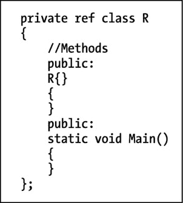

# 八、多态和保护

我们遇到了敌人，他就是我们。—沃尔特·凯利

C# 和 C++ 都是面向对象的语言，这意味着这两种语言都支持创建对象，这些对象不仅封装数据，还封装数据上的相关方法或操作。这两种语言还提供了将不同对象相互关联的机制，范围从运算符重载到继承、接口和参数多态。这两种语言都提供了限制和控制数据访问的机制，从限制可访问性和可见性到使用属性扫描和过滤数据。

在这一章中，我们将讨论其中的一些机制，因为它们与 C# 的机制不同。

## 多态

多态，来自希腊语 poly morphos，意思是“许多形状”，是许多科学领域的常用术语，并正在迅速进入日常用语。在面向对象的编程中，多态指的是对象可以被分组和分类的方式，因此一个对象可以被视为不同的对象、一组对象的成员，或者根据定义的特征被访问。下面的列表强调了多态中的一些重要概念:

*   继承:“继承”是指把对象当作不同的对象。这是通过允许一个对象或一般意义上的类从其他类(称为基类)中提取数据和特征来实现的。例如，`GoldenRetriever`对象可能有一个基类`Dog`。在这种情况下，`GoldenRetriever`对象可以被视为`Dog`对象，因为它们是。
*   接口:“接口”是指根据对象的特性来考虑对象；接口允许你根据对象能做什么而不是它们是什么来组织对象。比如`Car`和`Dog`物体都可以发出噪音。表示这两个对象都支持`MakeNoise`接口通常要简单得多，而不是让它们都从一个公共的`NoiseMaker`基类继承。从`NoiseMaker`类继承会有问题，因为不是所有的动物都会说话，但很多动物会。比如长颈鹿没有声带，兔子会吱吱叫，咆哮；法律规定汽车要有喇叭，但喇叭可能会断。
*   泛型:将对象视为对象组(在 CLI 中)是通过参数多态或泛型实现的。在这种情况下，`Kennel<Animal>`可以表示一个`Kennel`中的一个`Animal`。在`Kennel`中个体`Animals`行为的专门化可以使用约束来完成。泛型最适用于对泛型类不透明的类型和实现泛型类支持的多个接口的类型。
*   模板:“模板”是指将对象视为对象组(仅在 C++ 中)。模板类似于泛型，因为它们允许为一组对象编写代码，但它们也允许特定于对象的代码或专门化(全部或部分)来处理对象之间的差异。模板通常比泛型更强大，也更复杂。

### 继承

继承是初级 C# 书籍中的常见主题。与本文的目标相一致，在这一节中，我试图将重点放在 C# 中的继承和 C++ 中的继承之间的区别上。

通常，C# 实现 CLI 继承模型。C++ 也实现了这个模型，但是它在几个方面建立并扩展了它。其中一些扩展在 CLI 上受支持，并在安全或纯模式下编译。其他的则超出了 CLI 的范围，必须使用本机 C++ 来实现。

#### 多重和虚拟继承

在 C# 中，每个类只能从一个基类继承。C++ 支持多重继承，这意味着一个类可以有多个基类。多重继承无疑增加了复杂性，而这正是 CLI 所避免的。让我们考虑一个简短的例子。

假设你有一个`Mule`对象。嗯，一个`Mule`物体可以被认为是一个`Horse`和一个`Donkey`，对吗？毕竟，`Mule`是一个雄性`Donkey`和一个雌性`Horse`的产物，因此您可能拥有以下有效的本地 C++:

`class Horse {};`

`class Donkey {};`

`class Mule : Horse, Donkey {};`

为了编译它，让我们使用`/c`选项来表示我们只想编译，而不是创建一个可执行文件；这样我们就跳过了链接的开销，我们并不关心链接是为了观察编译，并且避免了链接器错误，这表明我们还没有定义全局函数`main()`:

`cl /c /clr:pure /nologo test.cpp`

现在我们知道我们可以创建一个`Mule`对象，并将其视为`Horse`或`Donkey`的实例。这就是事情开始变得棘手的地方。

马和驴不都是动物吗？让我们将它添加到代码中:

`class Animal {};`

`class Horse : Animal {};`

`class Donkey : Animal {};`

`class Mule : Horse, Donkey {};`

在这种情况下，对于给定的`Mule`，创建了多少个`Animal`的实例？应该创造多少？也许对于某些对象范例，您希望有两个公共基类。在这种情况下，实际上只有一个`Animal`，即`Mule`，我们希望在代码中表示它。C++ 允许你使用这两种范例来定义你的类层次结构。如果我们只想要一个`Animal`，就像我们在这个例子中所做的，我们可以使用`virtual`关键字进行虚拟继承。否则，我们就让它保持原样。虚拟继承告诉编译器在类层次结构中每种类型只包含一个子对象。假设我们要给骡子喂午餐，而`Lunch`由一个`Apple`对象和一个`Carrot`对象组成。在这种情况下，`Lunch`和`Apple`之间的关系不是`is`关系；更确切的说`Lunch`包含`Apple`和`Carrot`，它们是`Food`的两块。在这种情况下，我们不想使用虚拟继承。让我们看看完整的 C++ 程序:

`using namespace System;`

`class Animal`

`{`

`public:`

`Animal()`

`{`

`Console::WriteLine("Animal");`

`}`

`};`

`class Horse : virtual Animal {};`

`class Donkey : virtual Animal {};`

`class Mule : Horse, Donkey {};`

`class Food`

`{`

`public:`

`Food()`

`{`

`Console::WriteLine("Food");`

`}`

`};`

`class Apple : Food {};`

`class Carrot : Food {};`

`class Lunch : Apple, Carrot {};`

`void main()`

`{`

`Mule m;`

`Lunch l;`

`}`

如你所见，`Horse`和`Donkey`实际上都是从`Animal`继承的。让我们试一试:

`C:\>cl /nologo /clr:pure test.cpp`

`test.cpp`

`C:\>test`

`Animal`

`Food`

`Food`

我们完成了创建一只动物并为它提供两份食物的目标。

#### 私有和受保护的继承

与 C# 不同，对基类的访问可以通过私有或受保护的继承来限制。这些将在“保护机制”一节中讨论

#### CLI 和多重继承

CLI 允许使用接口的多重继承类型。假设我们试图为我们的`Food`类层次结构使用引用类型而不是本机类型:

`ref class Food {};`

`ref class Apple : Food {};`

`ref class Carrot : Food {};`

`ref class Lunch : Apple, Carrot {};`

让我们编译这段代码:

`C:\>cl /c /nologo /clr:pure test.cpp`

`test.cpp`

`test.cpp(4) : error C2890: 'Lunch' : a ref class can only have one non-interface`

`base class`

`the ref class 'Apple' is a base class of 'Lunch'`

`the ref class 'Carrot' is a base class of 'Lunch'`

错误 2890 表明我们不能这样做，在某种程度上，这是一种祝福。让你的对象从多个对象继承会使你的代码难以理解，而接口允许你做许多相同的事情而不会混淆。

### 接口

接口定义了一个对象能够做什么，而不是根据它是什么来处理一个对象并暗示它在此基础上做什么。

#### 接口是规范

接口包含了类必须实现什么来支持接口的规范；如果你愿意，就把它当作一份合同。接口只允许实现静态方法。接口类似于抽象类，这将在本章后面描述和区分。

#### 一个类可以从多个接口继承

不仅接口可以被继承，单个类除了从单个基类继承之外，还可以从多个接口继承。这允许您创建一个对象，该对象具有几个定义明确的方法或接口，您可以在这些方法或接口中使用它，但在类层次结构中仍然是有序的，因为它有一个唯一的基类。这种范式适用于绝大多数面向对象的应用程序。

#### 接口可以从其他接口继承

因为接口可以从其他接口继承，所以对象可以定义与对象通信的基本协定。如果对象支持契约的更高级版本，这也允许更精细层次的通信的可能性。

#### 值类型可以从接口继承

CLI 不允许值类型从其他类继承，但允许值类型继承接口。默认情况下，值类型是密封类，这意味着它们不能被继承，因此也不能被扩展。我们将在本章后面重新讨论密封类。

#### 一个简单的例子

让我们回到动物农场，看看我们能用接口做些什么。假设我们想要创建类型为`Dog`和`Cat`的对象，并说它们可以做像吃饭和睡觉这样的事情。让`Eat`和`Sleep`接口似乎是合理的。然后我们可以使用`Eat`和`Sleep`作为`Dog`和`Cat`的基类，如下所示:

`using namespace System` `;`

`interface class Sleeps`

`{`

`void GoToSleep();`

`};`

`interface class Eats`

`{`

`void Feed();`

`};`

`ref struct Cat : Eats, Sleeps`

`{`

`virtual void GoToSleep()`

`{`

`Console::WriteLine("Cat is Catnapping");`

`}`

`virtual void Feed()`

`{`

`Console::WriteLine("Cat is Eating");`

`}`

`};`

`ref struct Dog : Eats, Sleeps`

`{`

`virtual void GoToSleep()`

`{`

`Console::WriteLine("Dog is Sleeping");`

`}`

`virtual void Feed()`

`{`

`Console::WriteLine("Dog is Eating");`

`}`

`};`

`void main()`

`{`

`Cat ^c = gcnew Cat();`

`Dog ^d = gcnew Dog();`

`c->Feed();`

`c->GoToSleep();`

`d->Feed();`

`d->GoToSleep();`

`}`

Note

在 C++ 中，类型可以继承和限制对基类成员的访问，这设置了它们的默认可访问性。这种继承可以是公共的、私有的或受保护的。默认情况下，任何 C++ `struct`、接口或 CLI 类型都会继承`public`。使用`struct`确保我们不会遇到任何保护问题。我们将在本章的后面重新讨论继承。

关于这个例子，有一些重要的事情需要注意:

*   C++/CLI 使用`interface class`而不仅仅是`interface`来声明一个接口，类似于它使用`enum class`而不是`enum`。
*   关键字`virtual`的使用与 C# 中相同，它允许派生类实现或重写方法。在多态术语中，最顶层(基)方法是实现，派生方法是重写。

这是一个非常基本的例子，但并不像我们希望的那样简单。由于`Cat`和`Dog`各自支持`Eats`和`Sleeps`接口，它们各自被强制实现`GoToSleep()`和`Feed()`功能。另一个低效之处是对于这两种动物来说,`Feed()`的实现实际上是相同的。

一个合理的解决方案是创建一个`Animal`类，它可以包含这些接口的默认行为。`Dog`和`Cat`可以继承`Animal`。但是怎样才能阻止某人实例化一个`Animal`？我们绝不希望这种情况发生；我们只想能够实例化`Dog`和`Cat`。下一节关于抽象类的内容会有所帮助。

### 抽象类

抽象类是不能实例化的类。接口回答这个问题，“这个类做这个吗？”抽象类回答了这样一个问题，“这个类是那个类的一种吗？”抽象类经常被使用；以下是一些例子:

*   当创建一个类时，使用抽象类，该类具有接口的默认行为，但不应被实例化。我们的例子就属于这一类。
*   当创建本质上从不实例化的类时，使用抽象类，因为它是由静态方法的集合组成的。`System::Console`是这种类型的类，包含静态方法，如`Write()`和`WriteLine()`。甚至不要尝试实例化一个类型为`Console`的对象——你将无法做到。

让我们将`Animal`做成一个抽象类，并为它配备接口的默认方法。我们还可以应用一个小技巧。让我们用`ToString()`来获取动物的名字，这样就不用硬编码到例程中了。下面是新代码:

`using namespace System;`

`interface class Sleeps`

`{`

`void GoToSleep();`

`};`

`interface class Eats`

`{`

`void Feed();`

`};`

`ref struct Animal abstract: Eats, Sleeps`

`{`

`virtual void GoToSleep()`

`{`

`Console::WriteLine("{0} is Sleeping", ToString());`

`}`

`virtual void Feed()`

`{`

`Console::WriteLine("{0} is Eating", ToString());`

`}`

`};`

`ref struct Cat : Animal`

`{`

`virtual void GoToSleep() override`

`{`

`Console::WriteLine("{0} is Catnapping", ToString());`

`}`

`};`

`ref struct Dog : Animal`

`{`

`};`

`void main()`

`{`

`Cat ^c = gcnew Cat();`

`Dog ^d = gcnew Dog();`

`c->Feed();`

`c->GoToSleep();`

`d->Feed();`

`d->GoToSleep();`

`}`

这段代码得到了极大的改进，并且更易于维护。类名`Animal`后面的`abstract`关键字表示`Animal`是一个抽象类。`Dog`不包含任何方法，对所有接口使用默认的`Animal`行为。`Cat`只包含需要改变的方法，并使用`Eats::Feed()`的默认行为。由于`GoToSleep()`函数已经存在于`Animal`中，我们被迫添加关键字`override`来表明我们想要如何替换这个方法。关键词`new`也是一种可能；我们将在本章后面讨论这一点。

关于这个例子，只有一点令人不安，因为它与我们之前对`System::Console`的讨论有关。在这个例子中，我们不能实例化一个类型为`Animal`的对象，但是我们能够从`Animal`中派生出一个类`Dog`并实例化它，并且`Dog`使用了`Animal`的所有方法。在某种程度上，`Dog`是不抽象的`Animal`的克隆。这看起来像是实例化一个`System::Console`的后门方法，我们不希望允许这样——如果有一种方法可以表明一个类不能作为任何其他类的基类。你的愿望就是我的命令。

### 密封类

回想一下，密封类是不能通过继承来扩展的类。例如，让我们看看当您有一个名为`Base`的密封类，并试图从中派生时会发生什么:

`class Base sealed {};`

`class Derived : Base {};`

现在让我们编译它:

`C:\>cl /clr:pure /nologo test.cpp`

`test.cpp`

`test.cpp(2) : error C3246: 'Derived' : cannot inherit from 'Base' as it has been`

`declared as 'sealed'`

`test.cpp(1) : see declaration of 'Base'`

正如我们所料；它不能被扩展，因为它是一个密封类。现在让我们看看当你同时声明一个类为`abstract`和`sealed`时会发生什么。

### 静态类

让我们使用。在`mscorlib.dll`中查看净反射器，并查看`System::Console`的声明:

`public ref class Console abstract sealed`

`{`

`};`

将一个类同时声明为`abstract`和`sealed`会进一步限制该类。它只允许有静态成员、嵌套类型、文本字段和`typedef`。C # 中与`abstract sealed`类等价的是定义一个`static`类。如果你将视图切换到。NET Reflector 转换为 C#，您会看到以下内容:

`public static class Console`

将`Console`同时声明为`abstract`和`sealed`，或者在 C# 中声明为`static`，这允许它成为静态方法的容器，并且它既不能被实例化也不能从其派生。有趣的是，在 C++ 中，这可以通过使用命名空间来限定和包含一组全局函数来实现。当然，你可能会想，“但是全局函数可以导出到程序集之外吗？”你有理由怀疑；答案是他们不能。当在一个类中使用时，C# 语言中的关键字`static`只是一种语法糖。如果你看看 CIL。NET Reflector，您会在元数据中看到`abstract`和`sealed`描述符。这些类似于 C++ 语言的上下文相关的关键字，所以如果你计划从 C++ 程序集中导出你包含的函数组，不要使用名称空间；只需要使用一个抽象的密封类。C++ 是一种灵活的语言，根据您的需求，您可以自由地以不同的方式实现您的目标，在这种情况下，这就是函数组的封装级别。

## 方法

基类和派生类中的方法通常具有相同的名称并执行相同的功能。在前面的例子中，我们有一个方法`GoToSleep()`，它在基类中实现，在派生类中重新实现。如果你创建了一个派生类的实例，并把它当作一个派生类来对待，不用说你会更喜欢使用这个方法的派生版本。但是，当您将派生类视为基类的实例时，会发生什么呢？这在面向对象编程中相当常见；例如，您可能想从一个`Animal`集合中创建一个`Menagerie`。如何告诉编译器使用公共方法的哪个实现？

### 虚拟方法

简而言之，虚方法是一个基类方法，可以通过派生类的实现来更改。如果一个方法没有被标记为`virtual`，那么将派生类作为基类的一个实例将会恢复基类的实现。

使用虚方法使您能够选择派生类中的方法实现是否替换基类中的实现。在 C# 和 C++ 中，都可以创建虚方法。除了语法之外，C# 和 C++ 中的虚方法之间没有什么区别，但是我想在这里回顾一下这个主题，因为它似乎在许多文本中被掩盖了或者解释得不够充分。

让我们考虑一个有点做作的例子，只是为了娱乐。

#### 虚拟和非虚拟方法的例子

`Animal`是基类，`John`是派生类。`John`是一个普通人，当你让他问好时，他会说:“你好。”另一方面，如果你像对待`Animal`一样对待`John`，他就被降低到了动物的水平，只能咕哝着“唉”不管你怎么对待他，他还是`John`，他的名字也不会变:

`using namespace System;`

`ref struct Animal`

`{`

`virtual String ^ Name()`

`{`

`return "Animal";`

`}`

`String ^Hello()`

`{`

`return "ugh";`

`}`

`};`

`ref struct John : Animal`

`{`

`virtual String ^ Name() override`

`{`

`return "John";`

`}`

`String ^Hello()`

`{`

`return "Hello";`

`}`

`};`

`void main()`

`{`

`John ^j = gcnew John();`

`Console::WriteLine("{0} says {1}", j->Name(), j->Hello());`

`Console::WriteLine("Oh no! He's an Animal! ");`

`Animal ^a = j;`

`Console::WriteLine("{0} says {1}", a->Name(), a->Hello());`

`}`

在这个例子中，我们在每个基类和派生类中都有两个方法:`Name()`和`Hello()`。方法`Name()`是虚拟的。它在两个类中都用关键字`virtual`声明，关键字`override`也在派生类中使用(稍后将详细介绍)。因为是虚拟的，`John`对`Name()`的实现替换了`Animal`对`John`所有实例的实现。

另一方面，`Hello()`没有标记`virtual`，所以当我们把`John`的实例当作`John`时，我们看到的是`John`对`Hello()`的实现，当我们把`John`的实例当作`Animal`时，我们看到的是`Animal`对`Hello()`的实现。这给了我们想要的结果:

`C:\>cl /clr:pure /nologo test.cpp`

`C:\>test`

`John says Hello`

`Oh no! He's an Animal!`

`John says ugh`

通过这种方式，我们能够挑选出基类中的哪些方法被派生类中的方法的实现所替换。

### 使用方法

C++/CLI 有几种重写虚方法的方式。每一个都是按照特定的模式创建的。我想回顾一些范例，并在适当的时候揭示动机。这让我们可以看到实现如何影响所需的语法，以及编译器如何帮助我们做正确的事情，并在潜在的危险情况发生时发出诊断。

#### 基类和派生类中的非虚拟方法

在这种情况下，我们在基类和派生类中都有一个普通的方法。我们之前在`John`和`Animal`中都使用了`Hello()`方法。这里要注意的关键是，尽管在使用派生类的实例时，派生实现隐藏了基实现，但是当相同的实例被强制转换为基类时，基实现会恢复。此外，使用`Base::`限定前缀仍然可以从派生类中访问基方法，类似于我们在名称空间中指定和访问定义的方式:

`using namespace System;`

`ref struct Base`

`{`

`void Method()`

`{`

`Console::WriteLine("Base::Method");`

`}`

`};`

`ref struct Derived : Base`

`{`

`void Method()`

`{`

`Console::WriteLine("Derived::Method");`

`}`

`void MethodBase()`

`{`

`Base::Method();`

`}`

`};`

`void main()`

`{`

`Derived ^d = gcnew Derived();`

`Console::Write("from the Derived class: ");`

`d->Method();`

`Console::Write("from the Derived class: ");`

`d->MethodBase();`

`Base ^b = d;`

`Console::Write("from the Base class: ");`

`b->Method();`

`Console::Write("from the Base class: ");`

`d->Base::Method();`

`}`

让我们编译一下，试一试:

`C:\>cl /clr:pure /nologo test.cpp`

`C:\>test`

`from the Derived class: Derived::Method`

`from the Derived class: Base::Method`

`from the Base class: Base::Method`

`from the Base class: Base::Method`

输出清楚地表明，我们能够从派生类中访问派生类和基类方法，并从基类中访问基类方法。可以从基类中访问派生的方法吗？

#### 基类和派生类中的虚方法

让我们从一个类似的代码示例开始这个副标题:

`using namespace System;`

`ref struct Base`

`{`

`virtual void Method()`

`{`

`Console::WriteLine("Base::Method");`

`}`

`};`

`ref struct Derived : Base`

`{`

`virtual void Method() override`

`{`

`Console::WriteLine("Derived::Method");`

`}`

`void MethodBase()`

`{`

`Base::Method();`

`}`

`};`

`void main()`

`{`

`Derived ^d = gcnew Derived();`

`Console::Write("from the Derived class: ");`

`d->Method();`

`Console::Write("from the Derived class: ");`

`d->MethodBase();`

`Base ^b = d;`

`Console::Write("from the Base class: ");`

`b->Method();`

`}`

此代码生成以下输出:

`C:\>cl /clr:pure /nologo test.cpp`

`C:\>test`

`from the Derived class: Derived::Method`

`from the Derived class: Base::Method`

`from the Base class: Derived::Method`

现在这个产量是非凡的。将方法更改为`virtual`仅更改了第三个输出行；在`Base`中，`Method()`已经被替换为`Derived::Method()`用于隐式调用。显式调用原来的`Base::Method()`仍然是可能的，如第二行所示。事实上，以下代码的第一行总是调用原始的`Base::Method()`，不管它是在基类中还是在派生类中，因为它完全限定了名称:

`void Test()`

`{`

`Base::Method();`

`Method();`

`}`

第一个调用`Base::Method()`，调用基类实现。第二个调用`Method()`，调用`Derived::Method()`或`Base::Method()`，这取决于这个方法在哪里实现以及我们是否使用了虚函数。

请注意，`override`关键字被添加到派生类中`Method()`的声明中。

如果您没有在此处包含关键字，您将看到以下诊断信息:

`C:\>cl /clr:pure /nologo test.cpp`

`test.cpp`

`test.cpp(15) : error C4485: 'Derived::Method' : matches base ref class`

`method 'Base::Method', but is not marked 'new' or`

`'override'; 'new' (and 'virtual') is assumed`

`test.cpp(4) : see declaration of 'Base::Method'`

`Specify 'override' (and 'virtual') to override the ref class virtual method`

`Specify 'new' (and 'virtual') to hide the ref class virtual method with a`

`new virtual method`

`Position for 'new' and 'override' keywords is after method parameter list`

这个诊断相当复杂，但它基本上归结为这样一个事实，即在这个上下文中要么需要关键字`override`要么需要关键字`new`。

#### 关键字 new 和 override

当派生类隐藏基类的虚方法时，为了防止意外的结果，编译器需要一个显式的关键字，`new`或`override`，以指示您希望该方法如何隐藏基类方法。

关键字`override`的基本原理相当简单，在本章中我们已经多次看到了它的用法。当您希望基类的实现被派生类的实现覆盖时，可以使用`override`关键字。

另一方面，关键字`new`则完全不同。该关键字用于说明您正在指定该方法作为该类的虚方法，作为另一个类的基类。它有效地开始新的虚拟链并丢弃旧的虚拟链。

下面是一个例子:

`using namespace System;`

`ref struct Base`

`{`

`virtual void Method()`

`{`

`Console::WriteLine("Base::Method");`

`}`

`};`

`ref struct Derived : Base`

`{`

`virtual void Method() new`

`{`

`Console::WriteLine("Derived::Method");`

`}`

`};`

`ref struct Derived2 : Derived`

`{`

`virtual void Method() override`

`{`

`Console::WriteLine("Derived2::Method");`

`}`

`};`

`void main()`

`{`

`Derived2 ^d2 = gcnew Derived2();`

`d2->Method();`

`Derived ^d = d2;`

`d->Method();`

`Base ^b = d;`

`b->Method();`

`}`

让我们看看这个代码示例。它有三个类，`Base`、`Derived`、`Derived2.`、`Derived`也是`Derived2`类的基类。当您使用`Derived2`的一个实例并调用`Method()`时，您会得到`Derived2`的实现。当您将这个实例强制转换为`Derived`时，您也获得了`Derived2`的实现，因为`override`关键字在`Derived2`上被用来覆盖`Derived`的`Method()`版本。然而，当你进一步转换到`Base`时，你就超越了`Derived::Method()`虚拟链，因为`new`关键字被用在`Derived`上来说明`Method()`相对于`Base`应该如何被处理。结果是使用了`Base::Method()`的调用，因为`Derived2::Method`没有覆盖`Base::Method`。

以下是反映这一点的输出:

`C:\>cl /clr:pure /nologo test.cpp`

`C:\>test`

`Derived2::Method`

`Derived2::Method`

`Base::Method`

您可能会问，“什么可能的范例会要求您使用这样的构造？”如果不对每个方法的声明进行彻底的检查，这似乎是困难和不可预测的。事实证明，你不用费多大力气就能找到这种结构的合理需求。

假设您正在编写使用第三方基本类库的代码。假设您正在创建从一个名为`Component`的第三方对象派生的对象。

据你所知，`Component`看起来像下面这样:

`ref struct Component`

`{`

`};`

您创建了自己的更复杂的组件，因此您可以从中派生出其他子类。您向它添加了一个方法，名为`Act()`，它在基类库中还不存在。您可以向高级组件添加一个更高级的版本来覆盖基本版本。您最终会得到如下结果:

`ref struct MyBasicComponent : Component`

`{`

`virtual void Act() {}`

`};`

`ref struct MyAdvancedComponent : MyBasicComponent`

`{`

`virtual void Act() override {}`

`};`

假设这在几代代码中都能很好地工作。你已经发布了你的接口，其他人正在依赖你的名为`Act()`的例程。然后，您的第三方宣布它已经升级了它的基本类库并修复了几个令人烦恼的问题。您购买了它并试图重新编译，您发现已经为基本组件发布了一个版本的`Act()`。

您现在有以下选择:

*   重命名代码中的每一个`Act()`实例，这样它就不会冲突，从而混淆您的客户并破坏他们对您的接口的实现。
*   覆盖第三方版本的`Act()`，使其内部例程调用您的版本`Act()`。这是使用`override`关键字完成的。
*   忽略第三方版本的`Act()`，因为它要么不做同样的事情，要么用你的第三方版本替换它是不合适的。和平共处是可能的，你可以使用`Component::Act()`或者通过将你的对象转换为`Component`来调用另一个版本的`Act()`。这是使用`new`关键字完成的。

第一个选项通常是不合理的，但是另外两个独立地证明了它们各自的关键字的必要性。

#### 用不同的方法名重写

如果第三方基类库出来了一个你想重写的新方法，但是你已经在代码里给了一个不同的名字怎么办？

您可以添加代码来链接到第三方方法，或者您可以使用命名重写语法。命名重写语法将关键字`override`替换为您正在替换的方法的限定名，并允许您重写基类的实现，即使它的名称不同。下面是它的使用方法:

`using namespace System;`

`ref struct Component`

`{`

`virtual void ActOut()`

`{`

`Console::WriteLine("Component::ActOut");`

`}`

`};`

`ref struct MyBasicComponent : Component`

`{`

`virtual void Act() = Component::ActOut`

`{`

`Console::WriteLine("MyBasicComponent::Act");`

`}`

`};`

`ref struct MyAdvancedComponent : MyBasicComponent`

`{`

`virtual void Act() override`

`{`

`Console::WriteLine("MyAdvancedComponent::Act");`

`}`

`};`

`void main()`

`{`

`MyAdvancedComponent ^ac = gcnew MyAdvancedComponent();`

`ac->Act();`

`MyBasicComponent ^bc = ac;`

`bc->Act();`

`Component ^c = bc;`

`c->ActOut();`

`}`

如你所见，`MyBasicComponent::Act()`声明中的`ActOut()`被替换为`Act()`。

让我们看看当我们尝试执行这个命令时会发生什么:

`C:\>cl /clr:pure /nologo test.cpp`

`C:\>test`

`MyAdvancedComponent::Act`

`MyAdvancedComponent::Act`

`MyAdvancedComponent::Act`

如你所见，`Act()`和`ActOut()`的所有版本都被替换为最先进的组件的`Act()`方法，在`MyAdvancedComponent`中声明。

### 虚拟方法摘要

您现在应该对虚方法中固有的可能性有了很好的了解。使用`new`和`override`关键字，不仅可以创建方法的虚拟链，而且可以链接虚拟链本身，即使方法的名称不同。

### 访问基类字段和方法

在 C# 中，当你想访问基类方法和字段时，你使用`base`关键字。因为 C++ 中的本地类支持多重继承，所以对于 C++/CLI 来说，这样的语法要么是不明确的，要么是不一致的。C++/CLI 采用 C++ 语法，并要求您使用完全限定语法指定基类的名称。我们在前面的例子中做了一点；让我们在这里更详细地回顾一下。

考虑下面的 C# 示例:

`using System;`

`class Base`

`{`

`public int i;`

`}`

`class Derived : Base`

`{`

`public new int i;`

`public void Access()`

`{`

`base.i = 3;`

`i=4;`

`Console.WriteLine("Base i = {0}, Derived i = {1}",base.i, i);`

`}`

`public static void Main()`

`{`

`Derived d = new Derived();`

`d.Access();`

`}`

`}`

请注意以下要点:

*   使用派生类`Derived`中的关键字`new`声明变量`i`，以表明它隐藏了基类`Base`中的变量`i`。在这个上下文中没有使用`override`关键字。
*   使用表达式`base.i`从方法`Access()`中访问基类中的变量`i`。

让我们比较和对比以下 C++/CLI 版本:

`using namespace System;`

`ref struct Base`

`{`

`int i;`

`};`

`ref struct Derived : Base`

`{`

`int i;`

`void Access()`

`{`

`Base::i = 3;`

`i=4;`

`Console::WriteLine("Base i = {0}, Derived i = {1}",Base::i, i);`

`}`

`static void Main()`

`{`

`Derived ^d = gcnew Derived();`

`d->Access();`

`}`

`};`

`void main() {Derived::Main();}`

关于此代码，需要注意以下几点:

*   `Derived`中的变量`i`不需要关键字`new`。它隐式隐藏基类版本。
*   使用语法`Base::i`从方法`Access()`中访问基类中的变量`i`。因此，基类的名称是显式命名的。这对于本机类有几个好处，因为它不仅允许您在各种基类之间进行选择，还允许您轻松地访问祖父类。

## 保护机制

像 C# 一样，C++ 有几种保护机制来管理数据访问:

*   可见性:这种机制影响外部程序集是否可以使用程序集中的顶级类型。
*   可访问性:可访问性影响构造是否可以访问给定类型中的方法和字段。
*   受限继承:这项功能在 C# 或 CLI 对象模型中不存在，它允许您重写本机 C++ 派生类型的可访问性。

### 能见度

一个非嵌套的`class`、`struct`、`interface`、`delegate`或`enum`的可见性决定了它是否能在其父组件之外被看到。类的可见性是通过在类定义前添加 visibility 关键字来设置的。非嵌套类型的默认可见性是`private`，例如:

`public ref class R {};      //visible outside the assembly`

`private ref class S {};     //visible only within the assembly`

`ref class T {};             //defaults to private visibility`

表 [8-1](#Tab1) 将 C# 可见性关键字映射到顶级类型的 C++/CLI 可见性关键字；包含了来自`System::Reflection::TypeAttributes`名称空间的名称。

表 8-1。

Visibility Keywords in C# and C++/CLI for Top-Level Types

<colgroup><col> <col> <col> <col></colgroup> 
| 顶级类型 | 类型属性 | C# | C++/CLI |
| --- | --- | --- | --- |
| 可见性仅限于当前装配 | 不公开 | `internal` | `private` |
| 对外部组件和当前组件可见 | 公众 | `public` | `public` |

表 [8-2](#Tab2) 将 C# 可见性关键字映射到嵌套类型的 C++/CLI 可见性关键字。

表 8-2。

Visibility Keywords in C# and C++/CLI for Nested Types

<colgroup><col> <col> <col> <col></colgroup> 
| 嵌套类型 | 类型属性 | C# | C++/CLI |
| --- | --- | --- | --- |
| 公众可见度 | NestedPublic | `public` | `public:` |
| 私人可见性 | NestedNotPublic | `private` | `private:` |
| 仅对其程序集中类型的方法可见 | 嵌套装配 | `internal` | `internal:` |
| 对其自身类型和子类型中的方法可见 | 成套类 | `protected` | `protected:` |
| 对其自身程序集或自身类型或子类型中的方法可见 | nestedfamilyorasassembly | `internal protected` `protected internal` | `public protected:` |
| 对它自己的程序集中和它自己的类型或子类型中的方法可见 | NestedFamilyAndAssembly | 不适用的 | `private protected:` |

嵌套类型的 C++/CLI 代码示例如下:

`public ref class publicClass`

`{`

`public:`

`ref class NestedPublic`

`{`

`};`

`private:`

`ref class NestedPrivate`

`{`

`};`

`internal:`

`ref class NestedAssembly`

`{`

`};`

`protected:`

`ref class NestedFamily`

`{`

`};`

`private protected:`

`ref class NestedFamilyAndAssembly`

`{`

`};`

`public protected:`

`ref class NestedFamilyOrAssembly`

`{`

`};`

`};`

### 易接近

可访问性经常与可见性混淆。可见性决定了哪些类型是可见的；可访问性决定了在可见类型中可以访问哪些字段和方法。

有几种不同的可访问性指标；它们由一个后跟冒号的关键字构成。

在 C# 中，为每个成员声明可访问性。如果在 C# 中没有声明成员的可访问性，默认情况下可访问性变成`private`。

在 C++ 中，可访问性是模态的，可访问性的设置独立于任何成员。所有后续成员都被赋予前面的可访问性声明的可访问性。如果在 C++ 中没有在一个类型中声明可访问性，那么对于`struct`默认为`public`，对于`class`默认为`private`。

总之，C# 可访问性是为每一项设置的，C++ 可访问性是由影响所有其他成员的可访问性声明设置的。C++/CLI 可访问性的定义就像嵌套类型一样(参见表 [8-2](#Tab2) )。

Note

`class`默认具有`private`的可访问性；`struct`默认有`public`可达性。

### 继承

在 C++ 中，你也可以通过继承来影响基类成员的可访问性。基类的公共和受保护成员可以像是派生类的成员一样被访问。无论派生类如何继承，派生类都无法访问基类的私有成员。

Note

CLI 类型，包括引用和值类型，总是继承`public`。

通过在基类的名称前指定下列关键字之一，可以声明派生类应该如何继承:

*   `public`:基类的成员`public`或`protected`被分别视为派生类的`public`或`protected`成员。基类的每个成员都保留其在派生类中的可访问性。
*   `private`:基类的成员`public`或`protected`被视为派生类的成员`private`。基类的每个成员都成为派生类中的`private`。
*   `protected`:基类的成员`public`或`protected`被视为派生类的成员`protected`。

如您所见，继承只能降低成员的可访问性，而不能增加。在派生类中允许比基类中更大的可访问性会违背保护和类封装的目的。

一个派生的`class`默认继承`private`，一个派生的`struct`默认继承`public`，有以下主要的警告:默认情况下 CLI 类型总是继承`public`。

例如，考虑以下情况:

`ref struct Base`

`{`

`int var;`

`};`

`ref class Derived : Base`

`{`

`public:`

`void Test()`

`{`

`var = 3;`

`}`

`};`

`void main()`

`{`

`Derived d;`

`d.var = 3;`

`}`

在这个例子中，`Derived`从`Base`公开继承，因为它们都是引用类型，并且引用类型总是公开继承。成员`var`在基类中是公共的，所以无论派生类如何继承，它在派生类中都是可访问的。唯一的问题是它是否可以通过函数`main()`中的实例变量`d`访问。

让我们试一试:

`C:\>cl /c /clr:pure /nologo test.cpp`

`C:\>`

没有诊断出现，所以我们是成功的。现在让我们尝试用这些引用类型进行私有继承。更改以下行:

`ref class Derived : Base`

到

`ref class Derived : private Base`

现在让我们再试一次:

`C:\>cl /c /clr:pure /nologo test.cpp`

`test.cpp(6) : error C3628: 'Derived': managed classes only support public`

`inheritance`

`test.cpp(17) : error C2247: 'Base::var' not accessible because 'Derived' uses`

`'private' to inherit from 'Base'`

`test.cpp(3) : see declaration of 'Base::var'`

`test.cpp(5) : see declaration of 'Derived'`

`test.cpp(2) : see declaration of 'Base'`

如您所见，托管(CLI)类型总是公开继承。

现在更改以下代码:

`ref struct Base`

`ref class Derived : private Base`

要使这些类型成为本机类型并删除`private`关键字:

`struct Base`

`class Derived : Base`

让我们再试一次:

`C:\>cl /c /clr:pure /nologo test.cpp`

`test.cpp`

`test.cpp(17) : error C2247: 'Base::var' not accessible because 'Derived' uses`

`'private' to inherit from 'Base'`

`test.cpp(3) : see declaration of 'Base::var'`

`test.cpp(5) : see declaration of 'Derived'`

`test.cpp(2) : see declaration of 'Base'`

在这种情况下，`Derived`是一个类，一个 C++ `class`默认私有继承。

有几种方法可以解决这个问题。我们可以将`Derived`从`class`改为`struct`，或者在基类名称前添加`public`关键字。或者，我们可以将`d`转换为`Base`的一个实例，并以这种方式访问变量。

这里有一个改进的例子:

`struct Base`

`{`

`int var;`

`};`

`struct Derived : Base`

`{`

`public:`

`void Test()`

`{`

`var = 3;`

`}`

`};`

`int main()`

`{`

`Derived d;`

`static_cast<Base&>(d).var = 4;`

`System::Console::WriteLine("{0}", d.var);`

`}`

让我们运行它:

`C:\>cl /clr:pure /nologo test.cpp`

`C:\>test`

`4`

在这个例子中，我们从`Base`中公开继承，因为我们把`Derived`改成了`struct`。此外，我们还可以使用强制转换来访问基类变量，如函数`main()`所示。我们将在[第 16 章](16.html)中重温案例操作符。

### 声明 ref 结构和 ref 类

如您所见，使用`struct`关键字而不是`class`关键字声明引用类型或值类型会影响类型的默认可访问性。它不影响继承，因为在 CLI 对象模型中，所有继承都是公共的。它也不影响类型的可见性。

例如，考虑下面的简短代码示例:

`ref class` `R`

`{`

`static void Main() {}`

`};`

`void main()`

`{`

`R::Main();`

`}`

如果您尝试编译它，您会得到以下结果:

`C:\>cl /clr:pure /nologo test.cpp`

`test.cpp(7) : error C3767: 'R::Main': candidate function(s) not accessible`

现在将`R`改为`ref struct`而不是`ref class`，如下所示:

`ref class R`

`{`

`static void Main() {}`

`};`

该程序现在编译良好。我们可以使用检查生成的元数据和 CIL。网状反射器(见图 [8-1](#Fig1) )。

图 8-1。

ref struct R under .NET Reflector

正如你所看到的。NET 反射器，类型`R`仍然有私有可见性(`private ref class R`)，但是默认的可访问性是公共的(参见`//Methods`中的第一个`public:`)。因此，更改为`ref struct`会影响可访问性，但不会影响可见性。

出于可访问性和可见性的目的，以下代码:

`ref struct` `R`

`{`

`};`

相当于这样:

`private ref class R`

`{`

`public:`

`};`

### 霸王决议

可见性和可访问性之间的一个重要区别是，如果一个方法是可见的，即使它是不可访问的，它也会被考虑用于重载解析。这样做可能会隐藏另一个可行的重载。例如，考虑下面的例子:

`class Base`

`{`

`public:`

`int f(int i)`

`{`

`return i;`

`}`

`};`

`class Derived : public Base`

`{`

`};`

`class Hello : Derived`

`{`

`void test()`

`{`

`f(3);`

`}`

`};`

在本例中，`f(3)`解析为`Base::f(int i)`。另一方面，看看当我们修改`Derived`来添加一个不可访问的函数时会发生什么:

`class Derived : public Base`

`{`

`private:`

`int f(int i)`

`{`

`return i;`

`}`

`};`

现在我们试着编译它:

`C:\>cl /clr:pure /nologo test.cpp`

`test.cpp`

`test.cpp(21) : error C2248: 'Derived::f' : cannot access private member declared in`

`class 'Derived'`

`test.cpp(12) : see declaration of 'Derived::f'`

`test.cpp(9) : see declaration of 'Derived'`

`Base`中潜在可访问的方法被`Derived`中不可访问的方法完全隐藏。解决办法是通过完全限定其名称— `Base::f(3)`来访问`Base`的方法。

### 按姓名隐藏和按签名隐藏

C# 和 C++ 中方法可访问性的一个关键区别是 C# 通过签名隐藏，而 C++ 通过名称隐藏。区别如下:如果派生类中的方法与基类中的方法同名，则基类方法是隐藏的，因为 C++ 实现了“按名称隐藏”在 C# 中，如果基类方法具有不同的签名，即它采用不同的函数参数集，则基类方法是可见的。

#### 通过签名隐藏

考虑下面的 C# 示例:

`using System;`

`class Base`

`{`

`public void f(int i)`

`{`

`Console.WriteLine("Base.f()");`

`}`

`}`

`class Derived : Base`

`{`

`public void f(char c)`

`{`

`Console.WriteLine("Derived.f()");`

`}`

`static void Main()`

`{`

`Derived d = new Derived();`

`d.f(3);`

`}`

`}`

当我们编译并执行它时，我们得到如下结果:

`C:\>csc /nologo test.cs`

`C:\>test`

`Base.f()`

编译器首先收集可行的候选列表，然后根据传递的函数参数选择最佳匹配。在这个例子中，这个可行的候选列表包括了`f()`的两个版本，因为它们具有不同的签名；`f(int)`是最佳搭配。这个例子显示 C# 是“通过签名隐藏”，因为`Base.f`和`Derived.f`有不同的签名。

#### 按名字隐藏

让我们看一个使用 C++/CLI 的类似示例:

`using namespace System;`

`ref struct Base`

`{`

`public:`

`void f(int i)`

`{`

`Console::WriteLine("Base.f()");`

`}`

`};`

`ref struct Derived : Base`

`{`

`void f(wchar_t c)`

`{`

`Console::WriteLine("Derived.f()");`

`}`

`static void Main()`

`{`

`Derived ^d = gcnew Derived();`

`d->f(3);`

`}`

`};`

`void main() { Derived::Main(); }`

请注意，这段代码或多或少是相同的，我们可以期待看到类似的结果:

`C:\>cl /clr:pure /nologo test.cpp`

`C:\>test`

`Derived.f()`

同样，编译器首先收集可行的候选列表，然后根据传递的函数参数选择最佳匹配。在这个例子中，可行的候选列表只包括`f()`的派生版本，因为`f()`的基本版本和派生版本具有相同的名称。然后选择剩下的唯一候选，完成从`int`到`wchar_t`的隐式转换(`wchar_t`是 C++/CLI 对`System::Char`的别名，在 C# 中是`char`)。是唯一的，也是最好的可用匹配。

至于哪种设计更好，人们可以从两方面进行讨论。将代码从 C# 转换为 C++ 的关键是要注意这种差异。从 C# 到 C++ 的自动翻译器(反之亦然)无法轻松处理这种差异，即使最终的程序可能产生不同的结果，翻译后的代码也可能编译无误。

## 摘要

在这一章中，我们讨论了多态和保护，以学习如何编写干净的面向对象的代码。现在，您应该对 C# 和 C++ 之间的主要类型差异有了很好的了解。建议你用。上的网状反射器。NET BCLs 进行一些探索，看看各种常见的方法是如何实现的。

在下一章中，我们将通过观察指针和不安全代码，从相反的角度来看 C++ 中的编码。