# 二、代码执行的地方


并行编程并不是真的在快车道上行驶。这实际上是在 T2 所有的车道上开快车。这一章是关于让我们能够把我们的代码放在我们能放的任何地方。只要有意义，我们就会选择启用异构系统中的所有计算资源。因此，我们需要知道这些计算资源藏在哪里(找到它们)，并让它们发挥作用(在其上执行我们的代码)。

我们可以控制代码在哪里执行——换句话说，我们可以控制哪些设备用于哪些内核。SYCL 为异构编程提供了一个框架，其中代码可以在主机 CPU 和设备上混合执行。决定代码在哪里执行的机制对于我们理解和使用非常重要。

本章描述了代码可以在哪里执行，何时执行，以及用于控制执行位置的机制。第 [3](03.html#b978-1-4842-5574-2_3) 章将描述如何管理数据，以便它到达我们执行代码的地方，然后第 [4](04.html#b978-1-4842-5574-2_4) 章回到代码本身，讨论内核的编写。

## 单源

SYCL 程序可以是单源的，这意味着同一个翻译单元(通常是一个源文件及其头文件)既包含定义要在 SYCL 设备上执行的计算内核的代码，也包含协调这些内核执行的主机代码。图 [2-1](#Fig1) 以图形方式显示了这两条代码路径，图 [2-2](#Fig2) 提供了一个标记了主机和设备代码区域的示例应用。

将设备和宿主代码组合到一个源文件(或翻译单元)中，可以使理解和维护异构应用程序变得更加容易。这种组合还提供了改进的语言类型安全性，并能使我们的代码得到更多的编译器优化。

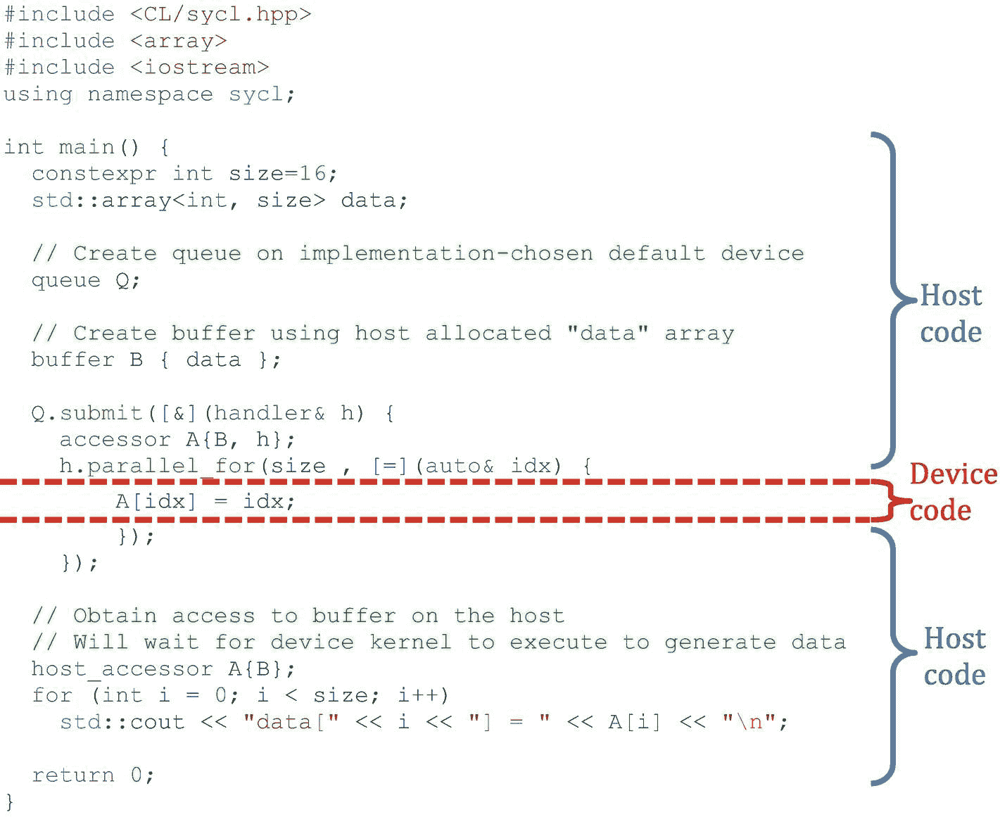

图 2-2

简单 SYCL 程序

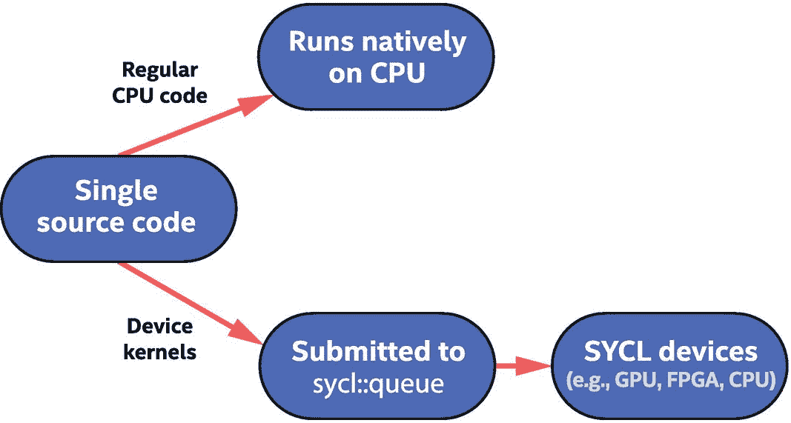

图 2-1

单源代码包含主机代码(运行在 CPU 上)和设备代码(运行在 SYCL 设备上)

### 主机代码

应用程序包含 C++ 宿主代码，由操作系统启动应用程序的 CPU 执行。宿主代码是应用程序的主干，它定义和控制向可用设备分配工作。它也是一个接口，通过它我们可以定义应该由运行时管理的数据和依赖关系。

宿主代码是标准的 C++，增加了特定于 SYCL 的构造和类，这些构造和类被设计成可作为 C++ 库来实现。这使得推断宿主代码中允许的内容(C++ 中允许的任何内容)变得更加容易，并且可以简化与构建系统的集成。

SYCL 应用程序是标准的 C++，增加了可以作为 C++ 库实现的结构。

SYCL 编译器可以通过“理解”这些结构为程序提供更高的性能。

应用程序中的主机代码协调数据移动和设备的计算卸载，但也可以自己执行计算密集型工作，并可以像任何 C++ 应用程序一样使用库。

### 设备码

设备对应于加速器或处理器，它们在概念上独立于执行主机代码的 CPU。如本章后面所述，实现必须将主机处理器也作为设备公开，但是主机处理器和设备应该被认为是逻辑上相互独立的。主机处理器运行本机 C++ 代码，而设备运行设备代码。

队列是一种机制，通过它可以将工作提交给设备以供将来执行。需要理解设备代码的三个重要属性:

1.  它与主机代码异步执行。主机程序将设备代码提交给设备，只有当所有的执行依赖关系都满足时，运行时才会跟踪并启动该工作(更多信息请参见第 [3 章](03.html#b978-1-4842-5574-2_3))。主机程序执行在提交的工作在设备上开始之前进行，提供了设备上的执行与主机程序执行异步的属性，除非我们明确地将二者联系在一起。

2.  为了能够在加速器设备上编译和实现性能，对设备代码有一些限制。例如，设备代码中不支持动态内存分配和运行时类型信息(RTTI ),因为它们会导致许多加速器的性能下降。第 [10](10.html#b978-1-4842-5574-2_10) 章详细介绍了设备代码限制。

3.  由 SYCL 定义的一些函数和查询只在设备代码中可用，因为它们只在那里有意义，例如，允许设备代码的执行实例在更大的数据并行范围内查询其位置的工作项标识符查询(在第 [4 章](04.html#b978-1-4842-5574-2_4)中描述)。

一般来说，我们将包括提交到队列的设备代码的工作称为*动作*。在第 3 章[中，我们将了解到动作不仅仅包括要执行的设备代码；动作还包括内存移动命令。在这一章中，由于我们关心的是动作的设备代码方面，我们将在大部分时间里特别提到设备代码。](03.html#b978-1-4842-5574-2_3)

## 选择设备

为了探索让我们控制设备代码将在何处执行的机制，我们将查看五个用例:

*   方法#1:在某个地方运行设备代码*，而我们并不关心使用的是哪个设备。这通常是开发的第一步，因为这是最简单的。*

**   方法#2:在主机设备上显式运行设备代码，这通常用于调试。保证主机设备在任何系统上都始终可用。

    *   方法#3:将设备代码分派给 GPU 或另一个加速器。

    *   方法#4:将设备代码分派给一组不同的设备，比如 GPU 和 FPGA。

    *   方法#5:从更一般的器件类别中选择特定的器件，例如从一组可用的 FPGA 类型中选择特定类型的 FPGA。* 

 *开发人员通常会尽可能多地使用方法 2 来调试他们的代码，并且只有当代码已经用方法 2 尽可能多地进行了测试时，才转移到方法 3 到 5。

## 方法 1:在任何类型的设备上运行

当我们不关心我们的设备代码将在哪里运行时，很容易让运行时为我们选择。这种自动选择是为了在我们还不关心选择什么设备时，使开始编写和运行代码变得容易。这个设备选择*没有*考虑要运行的代码，所以应该被认为是一个任意的选择，可能不是最佳的。

在讨论设备的选择之前，即使是实现为我们选择的设备，我们也应该首先了解程序与设备交互的机制:队列。

### 行列

一个`queue`是一个抽象，动作被提交给它以便在单个设备上执行。图 [2-3](#Fig3) 和 [2-4](#Fig4) 中给出了`queue`等级的简化定义。动作通常是数据并行计算的启动，尽管其他命令也是可用的，例如当我们需要比运行时提供的自动移动更多的控制时，可以手动控制数据移动。提交给`queue`的工作可以在运行时跟踪的先决条件满足后执行，比如输入数据的可用性。这些先决条件包含在第 [3](03.html#b978-1-4842-5574-2_3) 和 [8](08.html#b978-1-4842-5574-2_8) 章中。

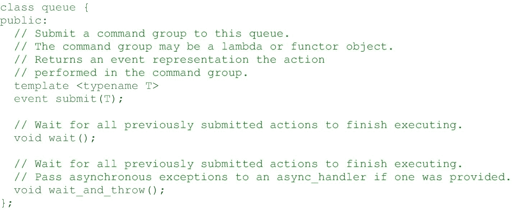

图 2-4

`queue`类中关键成员函数的简化定义

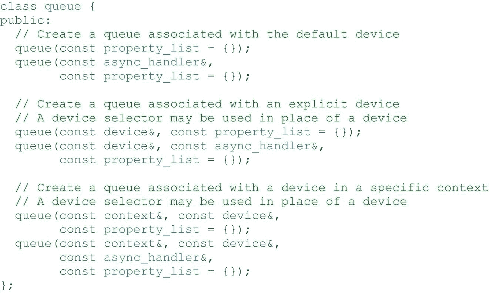

图 2-3

`queue`类的构造器的简化定义

一个`queue`被绑定到一个单独的`device`，这个绑定发生在队列的构造上。理解提交给队列的工作是在该队列所绑定的单个设备上执行的是很重要的。不能将队列映射到设备集合，因为这将导致哪个设备应该执行工作不明确。类似地，队列不能将提交给它的工作分散到多个设备上。相反，在一个队列和提交给该队列的工作将在其上执行的设备之间有一个明确的映射，如图 [2-5](#Fig5) 所示。

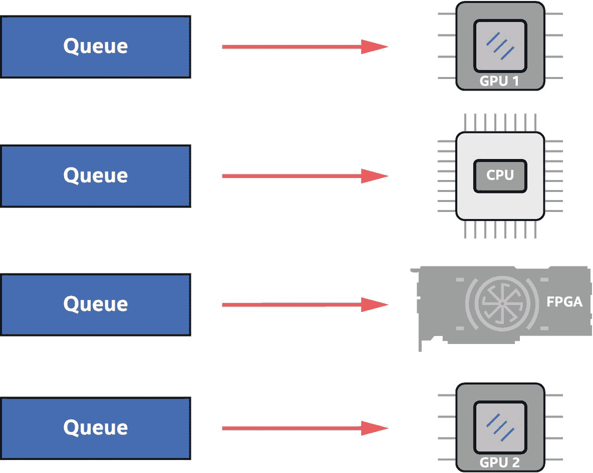

图 2-5

一个队列绑定到一个设备。提交到队列的工作在该设备上执行

一个程序中可以创建多个队列，按照我们对应用程序架构或编程风格所期望的任何方式。例如，可以创建多个队列，每个队列与不同的设备绑定，或者由主机程序中的不同线程使用。多个不同的队列可以绑定到单个设备，如 GPU，提交到这些不同的队列将导致在设备上执行组合工作。这方面的一个例子如图 [2-6](#Fig6) 所示。相反，正如我们前面提到的，一个队列不能绑定到多个设备，因为在请求执行动作的位置上不能有任何模糊性。例如，如果我们想要一个跨多个设备负载平衡的队列，那么我们可以在代码中创建这个抽象。

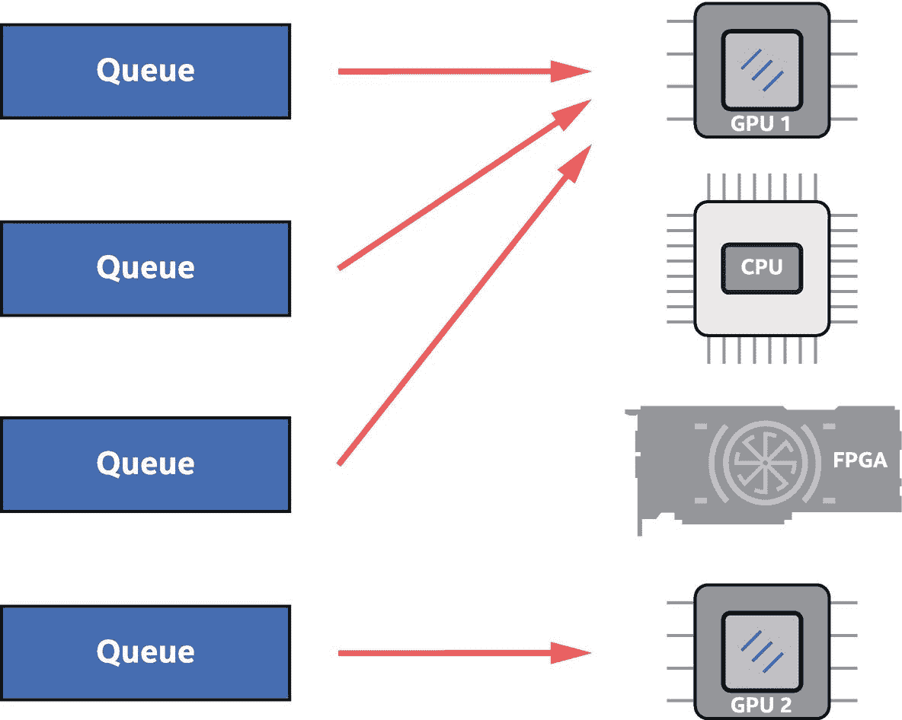

图 2-6

多个队列可以绑定到一个设备

因为队列被绑定到一个特定的设备，所以队列构造是代码中最常见的选择设备的方式，提交到队列的操作将在该设备上执行。构建队列时设备的选择是通过设备选择器抽象和相关的`device_selector`类实现的。

### 将队列绑定到设备，任何设备都可以

图 [2-7](#Fig7) 是一个没有指定队列应该绑定的设备的例子。不带任何参数的普通队列构造器(如图 [2-7](#Fig7) 所示)只是在幕后选择一些可用的设备。SYCL 保证至少有一个设备始终可用，即主机设备。主机设备可以运行内核代码，并且是主机程序在其上执行的处理器的抽象，因此总是存在。

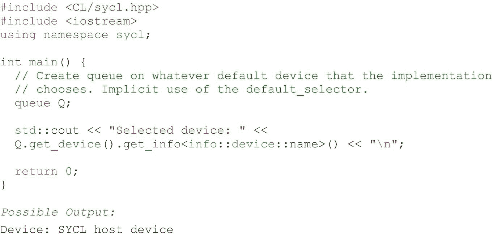

图 2-7

通过简单的队列构造实现隐式默认设备选择器

使用简单的队列构造器是开始应用程序开发和启动并运行设备代码的简单方法。当它变得与我们的应用程序相关时，可以添加对绑定到队列的设备的选择的更多控制。

## 方法#2:使用主机设备进行开发和调试

主机设备可以被认为是使主机 CPU 能够像一个独立的设备一样工作，允许我们的设备代码执行，而不管系统中可用的加速器。我们总是有一些处理器运行主机程序，因此主机设备对我们的应用程序总是可用的。主机设备保证设备代码可以一直运行(不依赖于加速器硬件),并且有几个主要用途:

1.  **在没有任何加速器的低性能系统上开发设备代码**:一个常见的用途是在本地系统上开发和测试设备代码，然后部署到 HPC 集群进行性能测试和优化。

2.  **使用非加速器工具调试设备代码**:加速器通常通过较低级别的 API 公开，这些 API 可能没有主机 CPU 可用的高级调试工具。考虑到这一点，主机设备应该支持使用 CPU 开发人员熟悉的标准工具进行调试。

3.  **备份**如果没有其他设备可用，保证设备代码可以功能性地执行:主机设备实现可能不会将性能作为主要目标，因此应被视为功能性备份，以确保设备代码可以始终在任何应用中执行，但不一定是性能的途径。

主机设备在功能上类似于硬件加速器设备，因为队列可以绑定到它，并且它可以执行设备代码。图 [2-8](#Fig8) 显示了主机设备如何成为系统中其他可用加速器的对等设备。它可以执行设备代码，就像 CPU、GPU 或 FPGA 一样，并且可以构建一个或多个绑定到它的队列。

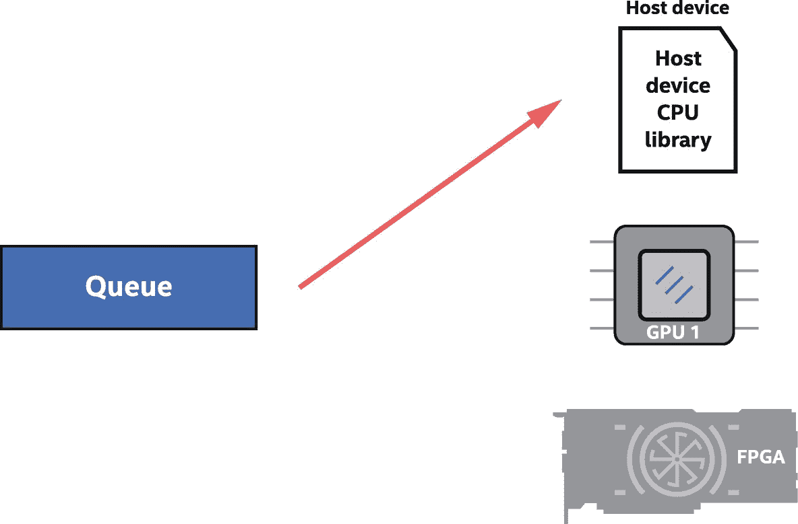

图 2-8

始终可用的主机设备可以像任何加速器一样执行设备代码

应用程序可以选择创建一个绑定到主机设备的队列，方法是将`host_selector`显式传递给队列构造器，如图 [2-9](#Fig9) 所示。

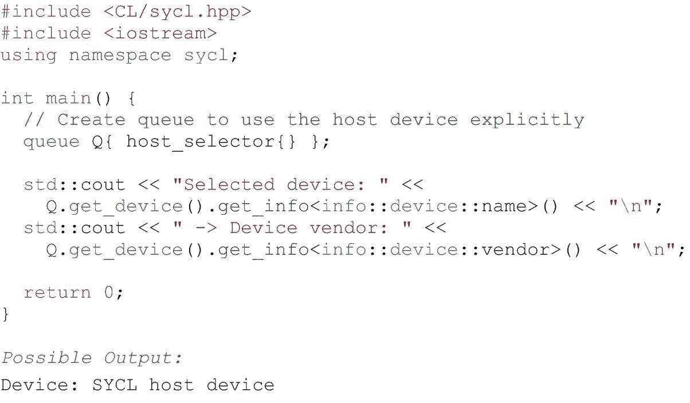

图 2-9

使用`host_selector`类选择主机设备

即使没有特别请求(例如使用`host_selector`)，默认选择器也可能会选择主机设备，如图 [2-7](#Fig7) 中的输出所示。

定义了设备选择器类的几个变体，以便于我们定位设备类型。`host_selector`是这些选择器类的一个例子，我们将在接下来的章节中讨论其他的。

## 方法 3:使用 GPU(或其他加速器)

下一个例子展示了 GPU，但是任何类型的加速器都同样适用。为了更容易找到常见的加速器类别，设备被分成几大类，SYCL 为它们提供了内置的选择器类别。要从广泛的设备类型类别中进行选择，如“系统中可用的任何 GPU”，相应的代码非常简短，如本节所述。

### 设备类型

队列可以绑定到两大类设备:

1.  已经描述过的主机设备。

2.  加速器设备，如 GPU、FPGA 或 CPU 设备，用于加速我们应用程序中的工作负载。

#### 加速器设备

有几大类促进剂类型:

1.  CPU 设备

2.  GPU 设备

3.  加速器，它捕获既不是 CPU 设备也不是 GPU 设备的设备。这包括 FPGA 和 DSP 器件。

这些类别中的任何一个设备都可以很容易地使用内置的选择器类绑定到队列，这些选择器类可以传递给队列(和其他一些类)构造器。

### 设备选择器

必须绑定到特定设备的类，比如`queue`类，有可以接受从`device_selector`派生的类的构造器。例如，队列构造器是

```cpp

queue( const device_selector &deviceSelector,
  const property_list &propList = {});

```

有五个内置的选择器用于各种常见设备:

<colgroup><col class="tcol1 align-left"> <col class="tcol2 align-left"></colgroup> 
| `default_selector` | 实现选择的任何设备。 |
| `host_selector` | 选择主机设备(始终可用)。 |
| `cpu_selector` | 选择在设备查询中将自己标识为 CPU 的设备。 |
| `gpu_selector` | 选择在设备查询中将自己标识为 GPU 的设备。 |
| `accelerator_selector` | 选择一个将自己标识为“加速器”的设备，包括 FPGAs。 |

DPC++ 中包含的一个附加选择器(SYCL 中没有)可以通过包含头`"CL/sycl/intel/fpga_extensions.hpp":`来获得

<colgroup><col class="tcol1 align-left"> <col class="tcol2 align-left"></colgroup> 
| `INTEL::fpga_selector` | 选择将自身标识为 FPGA 的设备。 |

可以使用内置选择器之一来构造队列，例如


图 [2-10](#Fig10) 显示了使用`cpu_selector`的完整示例，图 [2-11](#Fig11) 显示了队列与可用 CPU 设备的对应绑定。

图 [2-12](#Fig12) 显示了一个使用各种内置选择器类的例子，也展示了设备选择器与另一个接受构造上的`device_selector`的类(`device`)的使用。


图 2-12

来自各种设备选择器类的示例设备标识输出，以及设备选择器不仅可用于构建队列(在这种情况下，构建设备类实例)的演示

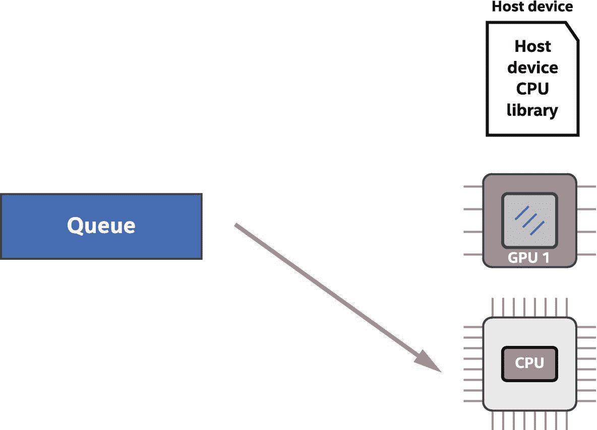

图 2-11

绑定到应用程序可用的 CPU 设备的队列

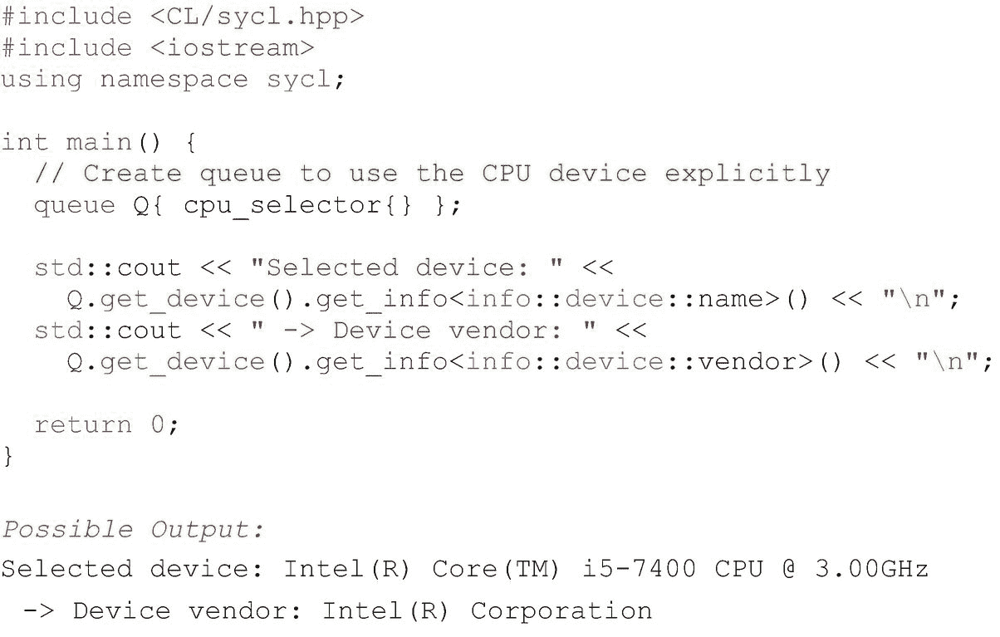

图 2-10

CPU 设备选择器示例

#### 当设备选择失败时

如果在创建一个对象(比如队列)时使用了一个`gpu_selector`，并且没有可供运行时使用的 GPU 设备，那么选择器就会抛出一个`runtime_error`异常。对于所有的设备选择器类都是如此，因为如果没有所需类的设备可用，那么就会抛出一个`runtime_error`异常。对于复杂的应用程序来说，捕捉该错误并获取不太理想的(对于应用程序/算法)设备类作为替代是合理的。异常和错误处理将在第 [5 章](05.html#b978-1-4842-5574-2_5)中详细讨论。

## 方法 4:使用多种设备

如图 [2-5](#Fig5) 和 [2-6](#Fig6) 所示，我们可以在一个应用中构建多个队列。我们可以将这些队列绑定到单个设备(队列的总工作量集中到单个设备中)、多个设备，或者这些设备的某种组合。图 [2-13](#Fig13) 提供了一个创建一个绑定到 GPU 的队列和另一个绑定到 FPGA 的队列的例子。相应的映射如图 [2-14](#Fig14) 所示。

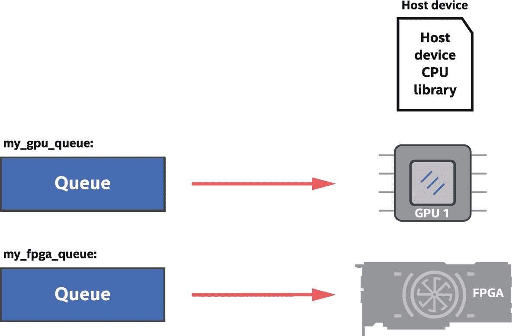

图 2-14

GPU + FPGA 设备选择器示例:一个队列绑定到 GPU，另一个绑定到 FPGA

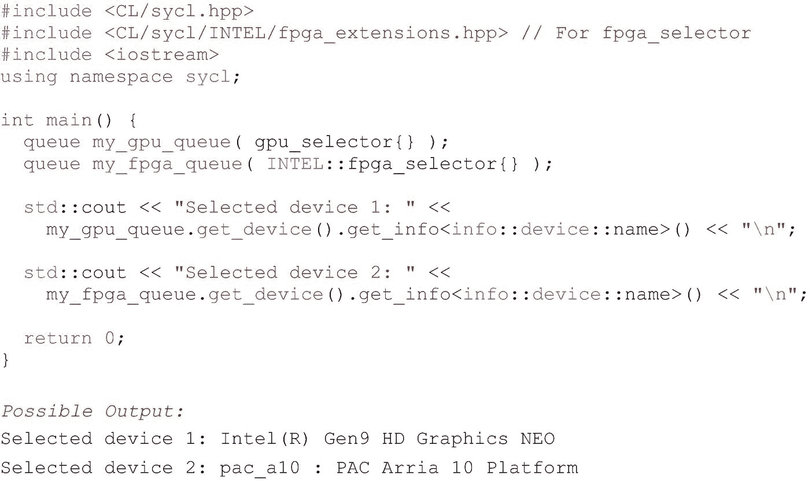

图 2-13

为 GPU 和 FPGA 设备创建队列

## 方法 5:定制(非常具体的)设备选择

我们现在来看看如何编写一个自定义选择器。除了本章中的示例，第 [12](12.html#b978-1-4842-5574-2_12) 章中还显示了一些示例。内置的设备选择器旨在让我们快速启动并运行代码。实际应用通常需要专门选择设备，例如从系统中可用的一组 GPU 类型中选择所需的 GPU。设备选择机制很容易扩展到任意复杂的逻辑，因此我们可以编写任何需要的代码来选择我们喜欢的设备。

### `device_selector`基础类

所有的设备选择器都从抽象的`device_selector`基类派生，并在派生类中定义函数调用操作符:

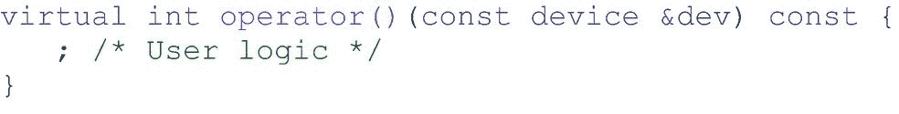

在从`device_selector`派生的类中定义这个操作符是定义任何复杂的选择逻辑所需要的，一旦我们知道了三件事:

1.  对于运行时发现应用程序可以访问的每个设备，包括主机设备，都会自动调用一次函数调用运算符。

2.  该运算符每次被调用时都返回一个整数。所有可用设备中得分最高的是选择器选择的设备。

3.  函数调用操作符返回的负整数意味着不能选择所考虑的设备。

### 对设备进行评分的机制

我们有许多选项来创建对应于特定设备的整数分数，例如:

1.  为特定设备类别返回正值。

2.  设备名称和/或设备供应商字符串匹配。

3.  基于设备或平台查询，我们在代码中可以想象的任何导致整数值的东西。

例如，选择英特尔 Arria 系列 FPGA 器件的一种可能方法如图 [2-15](#Fig15) 所示。


图 2-15

面向英特尔 Arria FPGA 设备的定制选择器

第 [12](12.html#b978-1-4842-5574-2_12) 章有更多关于器件选择的讨论和示例(图 [12-2](12.html#Fig2) 和 [12-3](12.html#Fig3) )并更深入地讨论`get_info`方法。

## 在 CPU 上执行设备代码的三种途径

一个潜在的混淆来源是多种机制，通过这些机制，CPU 可以执行代码，如图 [2-16](#Fig16) 所示。

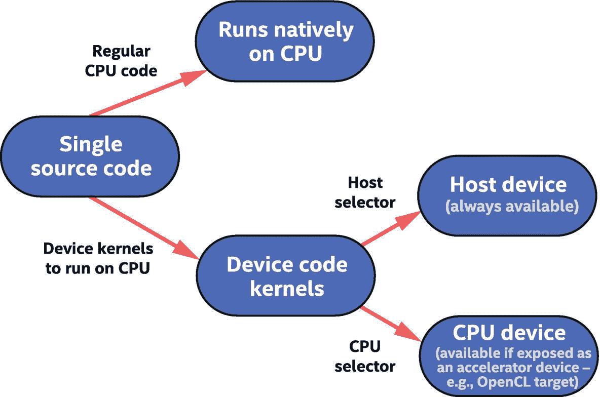

图 2-16

在 CPU 上执行的 SYCL 机制

CPU 执行的第一个也是最明显的路径是宿主代码，它或者是单源应用程序(宿主代码区域)的一部分，或者是链接到宿主代码并从宿主代码中调用，如库函数。

另外两条可用路径执行设备代码。设备代码的第一个 CPU 路径是通过主机设备，这在本章前面已经描述过了。它总是可用的，并被期望在执行主机代码的同一 CPU 上执行设备代码。

在 SYCL 中，在 CPU 上执行设备代码的第二条路径是可选的，它是一个针对性能进行了优化的 CPU 加速器设备。该设备通常由 OpenCL 等较低级别的运行时实现，因此其可用性可能取决于系统上安装的驱动程序和其他运行时。SYCL 描述了这一原理，其中主机设备旨在可使用本机 CPU 工具进行调试，而 CPU 设备可以构建在针对性能优化的实现上，而本机 CPU 调试器不可用。

虽然我们在本书中没有涉及到，但是当任务图中的先决条件得到满足时，有一种机制可以将常规 CPU 代码排队(图 [2-16](#Fig16) 的顶部)。这项高级功能可用于在任务图中执行常规 CPU 代码和设备代码，称为主机任务。

## 在设备上创建作品

应用程序通常包含主机代码和设备代码的组合。有几个类成员允许我们提交设备代码以供执行，因为这些工作分派构造是提交设备代码的唯一方式，它们允许我们容易地将设备代码与主机代码区分开。

本章的剩余部分介绍了一些工作分派结构，目的是帮助我们理解和识别设备代码和在主机处理器上本地执行的主机代码之间的区别。

### 任务图简介

SYCL 执行模型中的一个基本概念是节点图。该图中的每个节点(工作单元)都包含一个要在设备上执行的操作，最常见的操作是数据并行设备内核调用。图 [2-17](#Fig17) 显示了一个有四个节点的示例图，其中每个节点都可以被认为是一个设备内核调用。

图 [2-17](#Fig17) 中的节点具有依赖边，定义了何时开始执行节点的工作是合法的。依赖边通常是从数据依赖关系自动生成的，尽管我们可以在需要时手动添加额外的自定义依赖关系。例如，图中的节点 B 具有与节点 A 的依赖边。该边意味着在节点 B 的动作开始之前，节点 A 必须完成执行，并且最有可能(取决于依赖关系的细节)使生成的数据在节点 B 将执行的设备上可用。运行时完全与宿主程序的执行异步地控制依赖关系的解析和节点执行的触发。定义应用程序的节点图在本书中将被称为任务图，在第 [3](03.html#b978-1-4842-5574-2_3) 章中会有更详细的介绍。

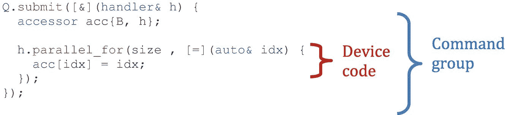

图 2-18

提交设备代码


图 2-17

任务图定义了要在一个或多个设备上执行的动作(与主机程序异步),还定义了确定何时执行动作是安全的依赖关系

### 设备代码在哪里？

有多种机制可用于定义将在设备上执行的代码，但一个简单的示例显示了如何识别此类代码。即使示例中的模式初看起来很复杂，但该模式在所有设备代码定义中保持不变，很快就成为第二天性。

作为最后一个参数传递给`parallel_for`的代码，在图 [2-18](#Fig18) 中定义为λ，是要在设备上执行的设备代码。本例中的`parallel_for`是让我们区分设备代码和主机代码的结构。`parallel_for`是一小组设备调度机制中的一个，所有成员都是`handler`类的成员，它们定义了要在设备上执行的代码。图 [2-19](#Fig19) 给出了`handler`等级的简化定义。

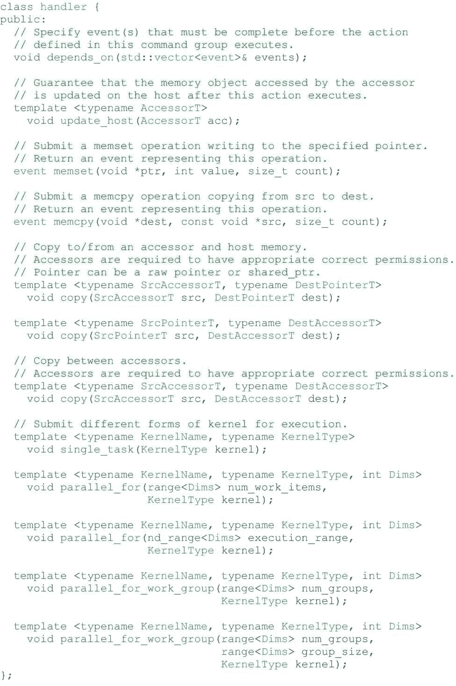

图 2-19

`handler`类中成员函数的简化定义

除了调用`handler`类的成员提交设备代码，还有`queue`类的成员允许提交工作。图 [2-20](#Fig20) 中显示的`queue`类成员是简化某些模式的快捷方式，我们将在以后的章节中看到这些快捷方式的使用。

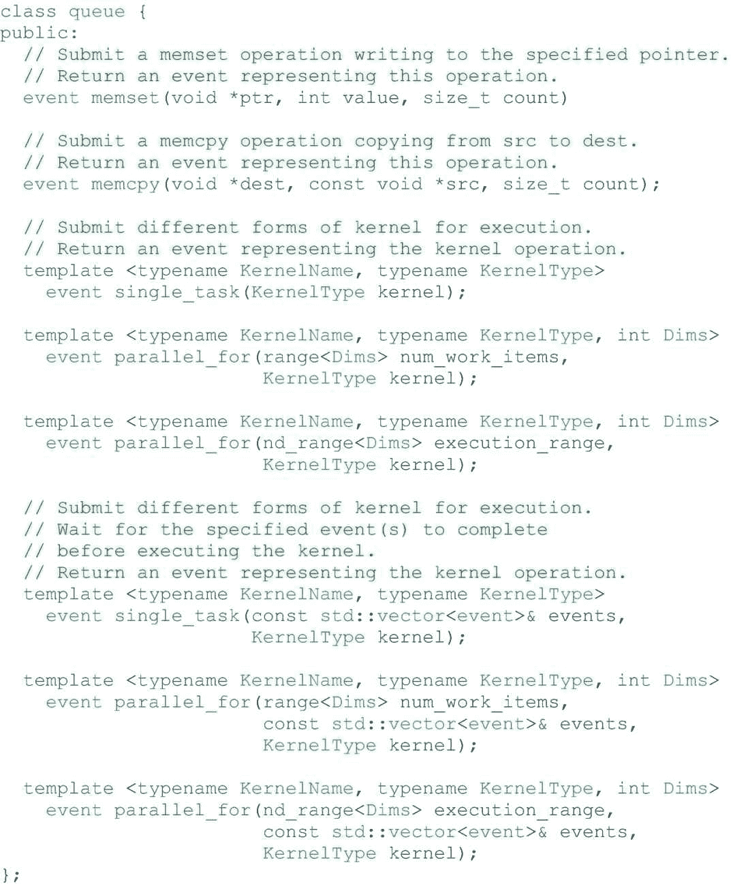

图 2-20

`queue`类中成员函数的简化定义，作为`handler`类中等价函数的简写符号

### 行动

图 [2-18](#Fig18) 中的代码包含一个`parallel_for`，它定义了要在设备上执行的工作。`parallel_for`位于提交给`queue`的命令组(CG)内，`queue`定义了将要执行工作的设备。在命令组中，有两类代码:

1.  **恰好一个对动作**的调用，该动作或者将设备代码排队等待执行，或者执行手动内存操作，例如`copy`。

2.  建立依赖关系的宿主代码，定义运行时何时开始执行(1)中定义的工作是安全的，例如创建缓冲区的访问器(在第 [3 章](03.html#b978-1-4842-5574-2_3)中描述)。

handler 类包含一小组成员函数，这些函数定义了执行任务图节点时要执行的操作。图 [2-21](#Fig21) 总结了这些动作。

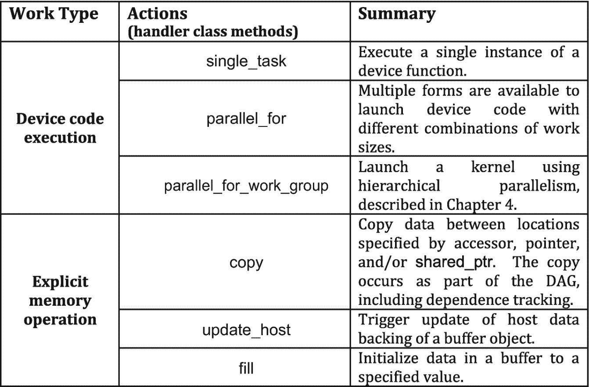

图 2-21

调用设备代码或执行显式内存操作的操作

在一个命令组中只能调用图 [2-21](#Fig21) 中的一个动作(调用多个是错误的)，并且每个`submit`调用只能提交一个命令组到一个队列中。这样做的结果是，图 [2-21](#Fig21) 中的单个操作存在于每个任务图节点中，当满足节点依赖性并且运行时确定可以安全执行时，该操作将被执行。

一个命令组中必须有一个动作，例如内核启动或显式内存操作。

将来异步执行代码的想法是作为主机程序的一部分在 CPU 上运行的代码和将来在满足依赖性时运行的设备代码之间的关键区别。命令组通常包含每个类别的代码，定义依赖关系的代码作为宿主程序的一部分运行(以便运行时知道依赖关系是什么),设备代码在依赖关系得到满足后运行。

图 [2-22](#Fig22) 中有三类代码:

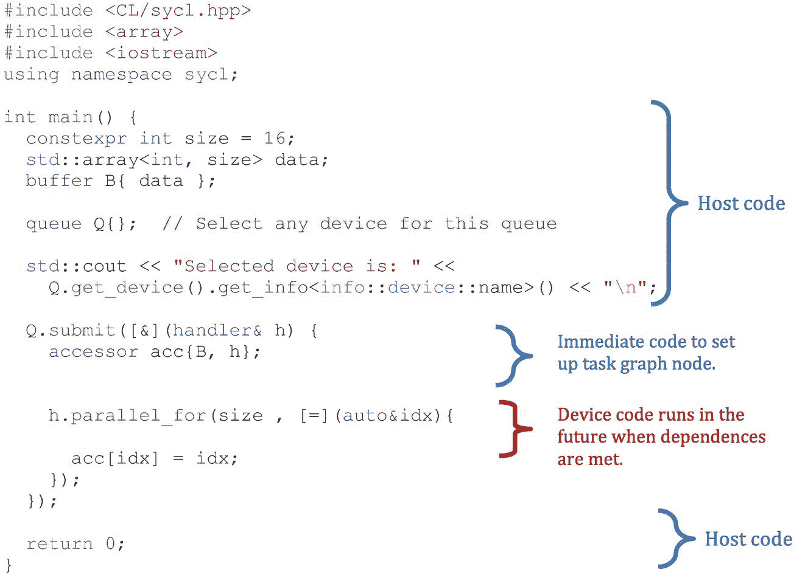

图 2-22

提交设备代码

1.  宿主代码:驱动应用程序，包括创建和管理数据缓冲区，以及将工作提交到队列中，以在任务图中形成新的节点来进行异步执行。

2.  命令组中的主机代码:该代码运行在主机代码正在执行的处理器上，并在`submit`调用返回之前立即执行。例如，这段代码通过创建访问器来设置节点依赖关系。任何任意的 CPU 代码都可以在这里执行，但是最佳实践是将其限制为配置节点依赖关系的代码。

3.  一个动作:图 [2-21](#Fig21) 中列出的任何动作都可以包含在一个命令组中，它定义了未来满足节点需求时异步执行的工作(由(2)设置)。

要了解应用程序中的代码何时运行，请注意传递给图 [2-21](#Fig21) 中列出的启动设备代码执行的动作的*任何东西*，或者图 [2-21](#Fig21) 中列出的显式内存操作，将在满足 DAG 节点依赖关系后异步执行*。所有其他代码作为宿主程序*的一部分立即*运行，正如典型的 C++ 代码所预期的那样。*

### 撤退

通常一个命令组是在我们提交给它的命令队列中执行的。然而，可能存在命令组未能提交到队列的情况(例如，当所请求的工作大小对于设备的限制来说太大时)，或者当成功提交的操作不能开始执行时(例如，当硬件设备发生故障时)。为了处理这种情况，可以为要执行的命令组指定一个后备队列。作者不推荐这种错误管理技术，因为它提供的控制很少，相反，我们建议捕捉和管理初始错误，如第 [5](05.html#b978-1-4842-5574-2_5) 章所述。我们在这里简单介绍一下回退队列，因为有些人更喜欢这种风格，它是 SYCL 中众所周知的一部分。

这种回退方式适用于机器上存在的设备的失败队列提交。这不是解决加速器不存在问题的后备机制。在没有 GPU 设备的系统上，图 [2-23](#Fig23) 中的程序会在`Q`声明(试图构造)中抛出一个错误，表明“没有请求类型的设备可用”

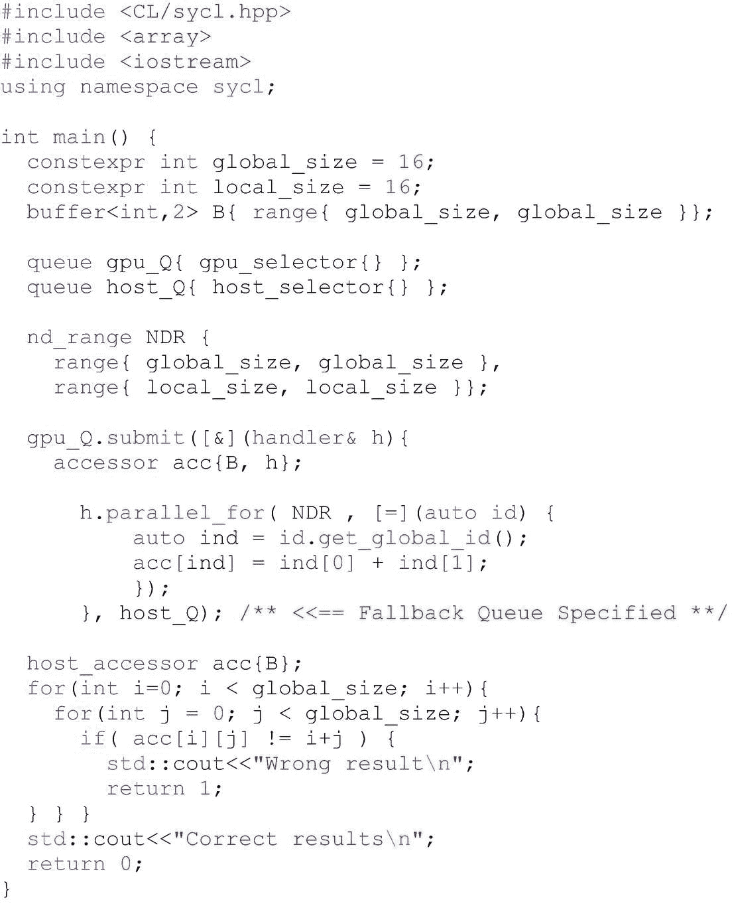

图 2-23

回退队列示例

基于现有设备的回退主题将在第 [12](12.html#b978-1-4842-5574-2_12) 章中讨论。

图 [2-23](#Fig23) 显示了由于所要求的工作组规模，将无法在某些 GPU 上开始执行的代码。我们可以指定一个辅助队列作为 submit 函数的参数，如果命令组无法加入主队列，就使用这个辅助队列(在本例中是主机设备)。

通过将辅助队列传递给`submit`调用来启用回退队列。作者建议捕捉初始错误并处理它，如第 [5](05.html#b978-1-4842-5574-2_5) 章所述，而不是使用提供较少控制的回退队列机制。

## 摘要

在本章中，我们提供了队列的概述，选择与队列相关的设备，以及如何创建自定义设备选择器。我们还概述了当满足依赖性时在设备上异步执行的代码和作为 C++ 应用程序宿主代码的一部分执行的代码。第 [3](03.html#b978-1-4842-5574-2_3) 章描述了如何控制数据移动。

[](https://creativecommons.org/licenses/by/4.0) 

**开放存取**本章根据知识共享署名 4.0 国际许可证(http://Creative Commons . org/licenses/by/4.0/)的条款获得许可，该许可证允许以任何媒体或格式使用、共享、改编、分发和复制，只要您适当注明原作者和来源，提供知识共享许可证的链接并指明是否进行了更改。

本章中的图像或其他第三方材料包含在本章的知识共享许可中，除非在材料的信用额度中另有说明。如果材料不包括在本章的知识共享许可中，并且您的预期使用不被法律法规允许或超出了允许的使用范围，您将需要直接从版权所有者处获得许可。*