# 3.数据管理

超级计算机架构师经常感叹我们需要“喂野兽”。短语“喂养野兽”指的是当我们使用大量并行时，我们创建的计算机的“野兽”,向它提供数据成为需要解决的关键挑战。

在异构机器上输入数据并行 C++ 程序需要注意确保数据在需要的时候出现在需要的地方。在大型程序中，这可能需要大量的工作。在一个预先存在的 C++ 程序中，仅仅是整理如何管理所有需要的数据移动就可能是一场噩梦。

我们将仔细解释管理数据的两种方法:统一共享内存(USM)和缓冲区。USM 是基于指针的，这是 C++ 程序员所熟悉的。缓冲区提供了更高层次的抽象。选择是好事。

我们需要控制数据的移动，这一章涵盖了实现这一点的选项。

在第 2 章中，我们学习了如何控制代码在哪里执行。我们的代码需要数据作为输入，并产生数据作为输出。因为我们的代码可能在多个设备上运行，而这些设备不一定共享内存，所以我们需要管理数据移动。即使数据是共享的，例如 USM，同步和一致性也是我们需要理解和管理的概念。

一个合乎逻辑的问题可能是“为什么编译器不自动为我们做所有的事情？”虽然我们可以自动处理很多事情，但是如果我们不坚持自己的程序员身份，性能通常是次优的。实际上，为了获得最佳性能，在编写异构程序时，我们需要关注代码放置(第 [2](02.html#b978-1-4842-5574-2_2) 章)和数据移动(本章)。

本章概述了数据管理，包括控制数据使用的顺序。它是对前一章的补充，前一章向我们展示了如何控制代码在哪里运行。本章帮助我们有效地使数据出现在我们要求代码运行的地方，这不仅对于正确执行我们的应用程序很重要，而且对于最小化执行时间和功耗也很重要。

## 介绍

没有数据，计算什么都不是。加速计算的目的是为了更快地得出答案。这意味着数据并行计算最重要的方面之一是它们如何访问数据，在机器中引入加速器设备会使情况进一步复杂化。在传统的基于单插槽 CPU 的系统中，我们只有一个内存。加速器设备通常有自己的附加存储器，不能从主机直接访问。因此，支持分立设备的并行编程模型必须提供管理这些多个存储器并在它们之间移动数据的机制。

在这一章中，我们将概述各种数据管理机制。我们介绍了用于数据管理的统一共享内存和缓冲区抽象，并描述了内核执行和数据移动之间的关系。

## 数据管理问题

从历史上看，并行编程的共享内存模型的优势之一是它们提供了一个单一的共享内存视图。拥有这种单一的内存视图简化了生活。我们不需要做任何特殊的事情来从并行任务中访问内存(除了正确的同步以避免数据竞争)。虽然某些类型的加速器设备(如集成 GPU)与主机 CPU 共享内存，但许多分立加速器拥有自己的独立于 CPU 的本地内存，如图 [3-1](#Fig1) 所示。

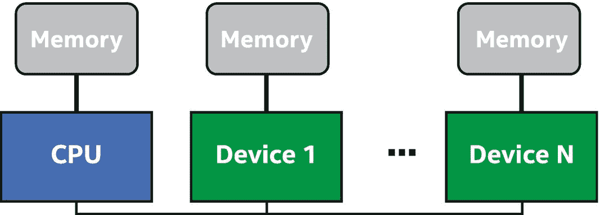

图 3-1

多个离散存储器

## 设备本地与设备远程

当使用直接连接到设备的内存而不是远程内存来读写数据时，设备上运行的程序性能会更好。我们将对直接连接的存储器的访问称为*本地*访问。对另一个设备内存的访问是*远程*访问。远程访问往往比本地访问慢，因为它们必须通过带宽较低和/或延迟较高的数据链路传输。这意味着将计算和它将使用的数据放在一起通常是有利的。为了做到这一点，我们必须设法确保数据在不同的内存之间复制或迁移，以便将数据移动到离计算发生地更近的地方。

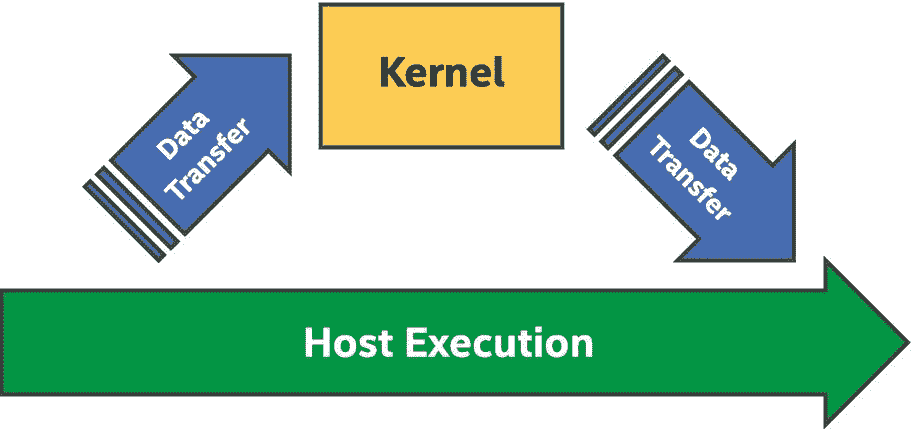

图 3-2

数据移动和内核执行

## 管理多个存储器

大体上说，管理多个内存可以通过两种方式来完成:通过我们的程序显式地管理内存，或者由运行时隐式地管理内存。每种方法都有其优点和缺点，我们可以根据情况或个人喜好选择其中之一。

### 显式数据移动

管理多个存储器的一种选择是在不同的存储器之间显式地复制数据。图 [3-2](#Fig2) 显示了一个带有独立加速器的系统，我们必须首先将内核需要的任何数据从主机内存复制到 GPU 内存。在内核计算结果之后，我们必须将这些结果复制回 CPU，然后主机程序才能使用这些数据。

显式数据移动的主要优势在于，我们可以完全控制数据在不同内存之间传输的时间。这一点很重要，因为在某些硬件上，重叠计算和数据传输对于获得最佳性能至关重要。

显式数据移动的缺点是，指定所有数据移动可能会很繁琐且容易出错。传输不正确的数据量，或者在内核开始计算之前不确保所有数据都已传输，都可能导致不正确的结果。从一开始就让所有数据正确移动可能是一项非常耗时的任务。

### 隐式数据移动

程序控制的显式数据移动的替代方法是由并行运行时或驱动程序控制的隐式数据移动。在这种情况下，并行运行时不需要在不同的内存之间进行显式复制，而是负责确保数据在使用之前被传输到适当的内存。

隐式数据移动的优势在于，让应用程序利用直接连接到设备的更快的内存需要更少的努力。所有繁重的工作都由运行时自动完成。这也减少了将错误引入程序的机会，因为运行时将自动识别何时必须执行数据传输以及必须传输多少数据。

隐式数据移动的缺点是我们对运行时隐式机制的行为控制很少或没有控制。运行时将提供功能正确性，但可能不会以确保计算与数据传输最大重叠的最佳方式移动数据，这可能会对程序性能产生负面影响。

### 选择正确的策略

为一个项目选择最佳策略取决于许多不同的因素。不同的策略可能适用于程序开发的不同阶段。我们甚至可以决定最好的解决方案是混合和匹配程序不同部分的显式和隐式方法。我们可能会选择开始使用隐式数据移动来简化将应用程序移植到新设备的过程。当我们开始调整应用程序的性能时，我们可能会在代码的性能关键部分用显式数据移动来代替隐式数据移动。未来的章节将会介绍数据传输如何与计算重叠以优化性能。

## USM、缓冲区和图像

管理内存有三个抽象概念:统一共享内存(USM)、缓冲区和映像。USM 是一种基于指针的方法，应该为 C/C++ 程序员所熟悉。USM 的一个优势是更容易与现有的操作指针的 C++ 代码集成。由`buffer`模板类表示的缓冲区描述了一维、二维或三维数组。它们提供了可以在主机或设备上访问的内存的抽象视图。程序不直接访问缓冲区，而是通过`accessor`对象来使用。图像充当一种特殊类型的缓冲区，提供特定于图像处理的额外功能。这个功能包括支持特殊的图像格式，使用 sampler 对象读取图像，等等。缓冲区和映像是解决许多问题的强大抽象，但是重写现有代码中的所有接口以接受缓冲区或访问器可能非常耗时。由于缓冲区和图像的接口基本相同，本章的其余部分将只关注 USM 和缓冲区。

## 统一共享内存

USM 是我们可以使用的一种数据管理工具。USM 是一种基于指针的方法，使用`malloc`或`new`分配数据的 C 和 C++ 程序员应该很熟悉。当移植大量使用指针的现有 C/C++ 代码时，USM 简化了工作。支持 USM 的设备支持统一的虚拟地址空间。拥有统一的虚拟地址空间意味着主机上的 USM 分配例程返回的任何指针值都将是设备上的有效指针值。我们不必手动转换主机指针来获得“设备版本”，我们在主机和设备上都看到相同的指针值。

USM 的更详细描述可在第 [6](06.html#b978-1-4842-5574-2_6) 章中找到。

### 通过指针访问内存

由于当系统包含主机内存和一定数量的设备连接本地内存时，并非所有内存都是相同的，USM 定义了三种不同类型的分配:`device`、`host`和`shared`。所有类型的分配都在主机上执行。图 [3-3](#Fig3) 总结了每种分配类型的特点。

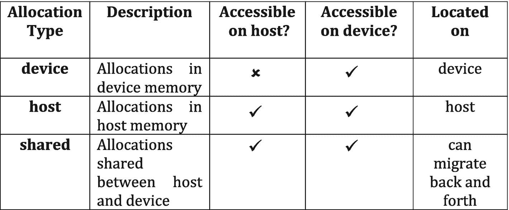

图 3-3

USM 分配类型

在设备连接内存中进行`device`分配。这种分配可以在设备上读取和写入，但不能从主机直接访问。我们必须使用显式复制操作在主机内存的常规分配和`device`分配之间移动数据。

`host`分配发生在可在主机和设备上访问的主机内存中。这意味着相同的指针值在主机代码和设备内核中都有效。然而，当访问这样的指针时，数据总是来自主机内存。如果在设备上访问，数据不会从主机迁移到设备本地内存。相反，数据通常通过将设备连接到主机的总线(例如 PCI-Express (PCI-E ))发送。

在主机和设备上都可以访问`shared`分配。在这方面，它与主机分配非常相似，但不同之处在于数据现在可以在主机内存和设备本地内存之间迁移。这意味着在迁移发生后，对设备的访问是从速度更快的设备本地内存进行的，而不是通过更高延迟的连接远程访问主机内存。通常，这是通过运行时内部的机制和对我们隐藏的低级驱动程序来实现的。

### USM 和数据移动

USM 支持显式和隐式数据移动策略，不同的分配类型映射到不同的策略。设备分配要求我们在主机和设备之间显式移动数据，而主机和共享分配提供隐式数据移动。

#### USM 中的显式数据移动

使用 USM 的显式数据移动是通过`device`分配以及队列和处理程序类中的特殊`memcpy()`来完成的。我们对`memcpy()`操作(动作)进行排队，以便将数据从主机传输到设备，或者从设备传输到主机。

图 [3-4](#Fig4) 包含一个操作设备分配的内核。在内核执行之前和之后，使用`memcpy()`操作在`hostArray`和`deviceArray`之间复制数据。对队列上的`wait()`的调用确保在内核执行之前对设备的复制已经完成，并且确保在数据复制回主机之前内核已经完成。我们将在本章的后面学习如何消除这些调用。

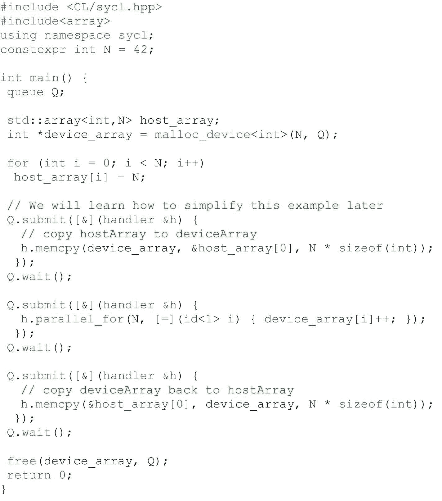

图 3-4

USM 显式数据移动

#### USM 中的隐式数据移动

使用 USM 的隐式数据移动是通过`host`和`shared`分配完成的。使用这些类型的分配，我们不需要显式插入拷贝操作来在主机和设备之间移动数据。相反，我们只需访问内核中的指针，任何所需的数据移动都会自动执行，无需程序员干预(只要您的设备支持这些分配)。这极大地简化了现有代码的移植:只需用适当的 USM 分配函数替换任何 malloc 或 new(以及对`free`释放内存的调用)，一切都将正常工作。

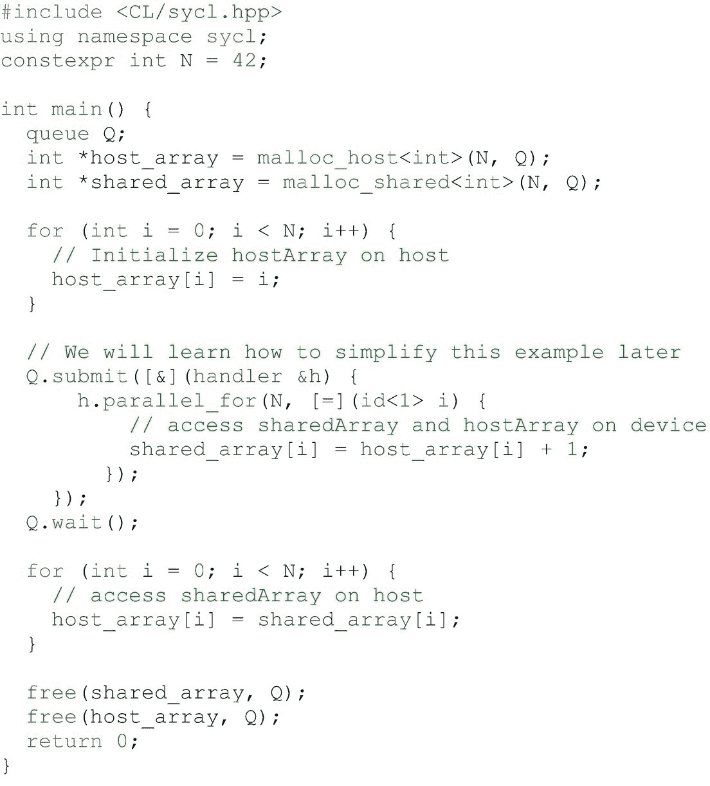

图 3-5

USM 隐式数据移动

在图 [3-5](#Fig5) 中，我们创建了两个数组`hostArray`和`sharedArray`，它们分别是主机和共享分配。虽然主机和共享分配都可以在主机代码中直接访问，但是我们在这里只初始化`hostArray`。类似地，可以在内核内部直接访问它，执行数据的远程读取。运行时确保`sharedArray`在内核访问它之前在设备上可用，并且当它稍后被主机代码读取时被移回，所有这些都不需要程序员的干预。

## 缓冲

为数据管理提供的另一个抽象是缓冲区对象。缓冲区是一种数据抽象，表示一个或多个给定 C++ 类型的对象。缓冲区对象的元素可以是标量数据类型(如`int`、`float`或`double`)、矢量数据类型(第 [11 章](11.html#b978-1-4842-5574-2_11))或用户定义的类或结构。缓冲区中的数据结构必须是 C++ *普通可复制的*，这意味着一个对象可以被安全地逐字节复制，而不需要调用复制构造器。

虽然缓冲区本身是单个对象，但缓冲区封装的 C++ 类型可以是包含多个对象的数组。缓冲区代表的是数据对象而不是具体的内存地址，所以不能像普通的 C++ 数组一样直接访问。实际上，出于性能原因，缓冲区对象可能会映射到几个不同设备上的多个不同内存位置，甚至是同一设备上的多个不同内存位置。相反，我们使用*访问器*对象来读写缓冲区。

第 [7](07.html#b978-1-4842-5574-2_7) 章对缓冲器进行了更详细的描述。

### 创建缓冲区

可以通过多种方式创建缓冲区。最简单的方法是简单地用指定缓冲区大小的范围构造一个新的缓冲区。然而，以这种方式创建缓冲区并不初始化其数据，这意味着我们必须先通过其他方式初始化缓冲区，然后再尝试从中读取有用的数据。

也可以从主机上的现有数据创建缓冲区。这是通过调用几个构造器中的一个来完成的，这些构造器要么接受一个指向现有主机分配的指针，一组`InputIterators`，要么接受一个具有特定属性的容器。在缓冲区构造期间，数据从现有的主机分配中复制到缓冲区对象的主机内存中。如果我们使用 OpenCL 的 SYCL 互操作性特性，也可以从现有的`cl_mem`对象创建一个缓冲区。

### 访问缓冲区

主机和设备可能无法直接访问缓冲区(除非通过此处未描述的高级且不常用的机制)。相反，我们必须创建访问器来读写缓冲区。访问器为运行时提供关于我们计划如何使用缓冲区中的数据的信息，允许它正确地调度数据移动。七

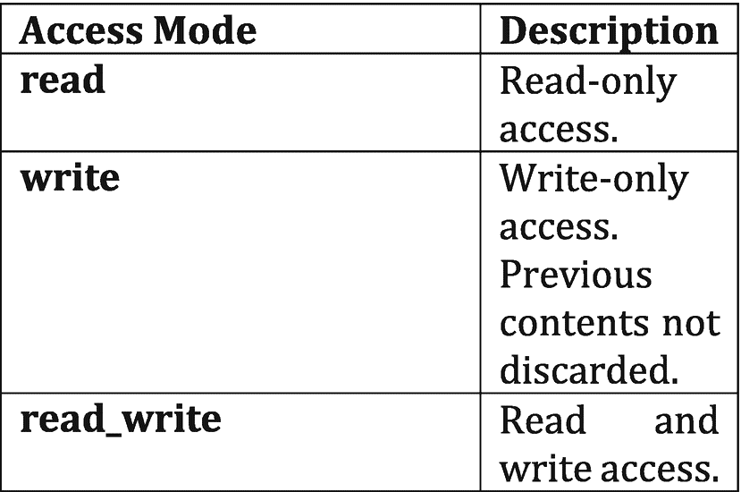

图 3-7

缓冲区访问模式

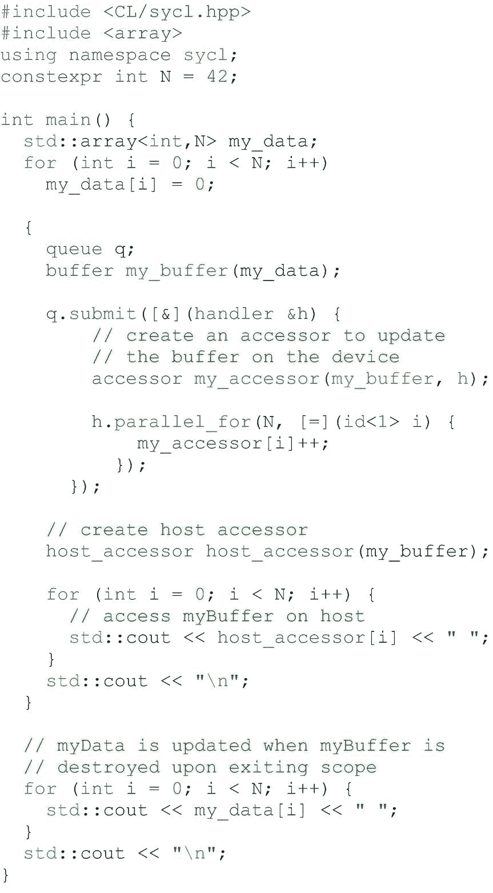

图 3-6

缓冲区和存取器

7

### 访问模式

当创建访问器时，我们可以通知运行时我们将如何使用它来提供更多的优化信息。我们通过指定一个*访问模式*来做到这一点。访问模式在图 [3-7](#Fig7) 中描述的`access::mode enum`中定义。在图 [3-6](#Fig6) 所示的代码示例中，访问器`myAccessor`是用默认的访问模式`access::mode::read_write`创建的。这让运行时知道我们打算通过`myAccessor`读写缓冲区。访问模式是运行库优化隐式数据移动的方式。例如，`access::mode::read`告诉运行时，在内核开始执行之前，数据需要在设备上可用。如果内核只通过一个访问器读取数据，那么在内核完成后就没有必要将数据复制回主机，因为我们没有修改它。同样，`access::mode::write`让运行时知道我们将修改缓冲区的内容，并且可能需要在计算结束后将结果复制回来。

用适当的模式创建访问器给了运行时更多关于我们如何在程序中使用数据的信息。运行时使用访问器对数据的使用进行排序，但它也可以使用这些数据来优化内核和数据移动的调度。访问模式和优化标签在第 [7](07.html#b978-1-4842-5574-2_7) 章中有更详细的描述。

## 数据使用的排序

内核可以被看作是提交执行的异步任务。这些任务必须提交到一个队列中，在那里它们被安排在一个设备上执行。在许多情况下，内核必须按照特定的顺序执行，这样才能计算出正确的结果。如果获得正确的结果需要任务`A`在任务`B`之前执行，我们说任务`A`和`B`之间存在*依赖* [1](#Fn1) 。

然而，内核并不是必须被调度的任务的唯一形式。在内核开始执行之前，内核访问的任何数据都需要在设备上可用。这些数据依赖性会以从一个设备到另一个设备的数据传输的形式产生额外的任务。数据传输任务可以是显式编码的复制操作，也可以是运行时执行的更常见的隐式数据移动。

如果我们把一个程序中的所有任务以及它们之间存在的依赖关系都拿出来，我们就可以用这个来把信息可视化为一个图形。该任务图具体是有向无环图(DAG ),其中节点是任务，边是依赖关系。该图是*定向的*，因为依赖关系是单向的:任务`A`必须发生在任务`B`之前。这个图是*非循环的*，因为它不包含任何从一个节点回到自身的循环或路径。

在图 [3-8](#Fig8) 中，任务`A`必须在任务`B`和`C`之前执行。同样，`B`和`C`必须在任务`D`之前执行。由于`B`和`C`彼此之间没有依赖关系，只要任务`A`已经执行，运行时就可以自由地以任何顺序(甚至并行)执行它们。因此，该图可能的法律顺序是`A``B``C``D``A``C``B``D`，如果`B`和`C`可以并发执行，甚至是`A``{B,C}``D`。

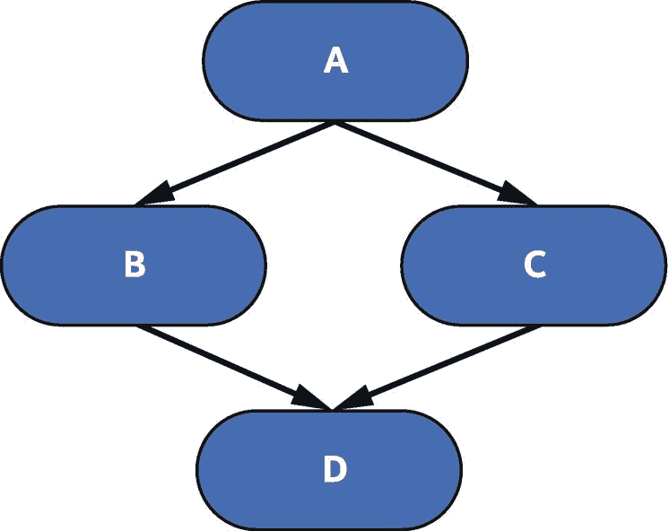

图 3-8

简单任务图

任务可能依赖于所有任务的子集。在这些情况下，我们只想指定关系到正确性的依赖关系。这种灵活性为运行时优化任务图的执行顺序提供了空间。在图 [3-9](#Fig9) 中，我们从图 [3-8](#Fig8) 扩展了之前的任务图，增加了任务`E`和`F`，其中`E`必须在`F`之前执行。然而，任务`E`和`F`与节点`A`、`B`、`C`和`D`没有依赖关系。这允许运行时从许多可能的合法顺序中选择来执行所有任务。

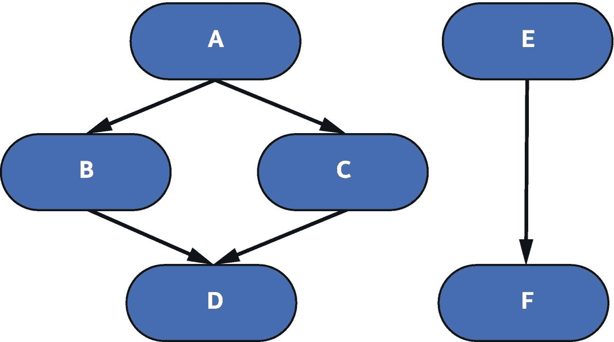

图 3-9

具有不相交依赖关系的任务图

有两种不同的方法来模拟任务在队列中的执行，比如内核的启动:队列可以按照提交的顺序执行任务，也可以按照我们定义的任何依赖关系按照任何顺序执行任务。我们有几种机制来定义正确排序所需的依赖关系。

### 有序队列

对任务进行排序的最简单的选择是将它们提交给有序的`queue`对象。有序队列按照任务提交的顺序执行任务，如图 [3-10](#Fig10) 所示。尽管有序队列的直观任务排序在简单性方面提供了优势，但它也提供了一个缺点，即即使独立任务之间不存在依赖性，任务的执行也会串行化。有序队列在启动应用程序时非常有用，因为它们简单、直观、确定执行顺序，并且适用于许多代码。

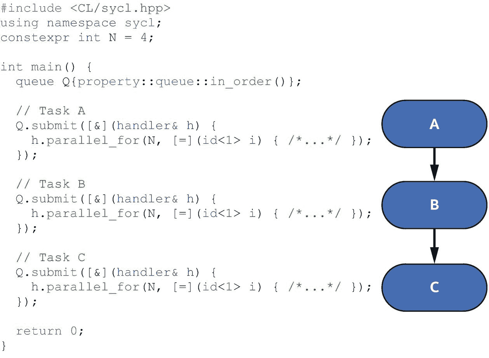

图 3-10

有序队列使用

### 无序(OoO)队列

由于`queue`对象是无序队列(除非用`in-order` queue 属性创建)，它们必须提供对提交给它们的任务进行排序的方法。队列通过让我们通知运行时它们之间的依赖关系来排序任务。这些依赖性可以使用*命令组*明确或隐含地指定。

命令组是指定任务及其依赖性的对象。命令组通常被写成 C++ lambdas，作为参数传递给队列对象的`submit()`方法。这个 lambda 唯一的参数是对一个`handler`对象的引用。handler 对象在命令组中用于指定操作、创建访问器和指定依赖关系。

### 事件的显式依赖性

任务之间的显式依赖看起来就像我们已经看到的例子(图 [3-8](#Fig8) )，其中任务 A 必须在任务 b 之前执行。以这种方式表达依赖侧重于基于发生的计算的显式排序，而不是基于计算访问的数据。请注意，表达计算之间的依赖性主要与使用 USM 的代码相关，因为使用缓冲区的代码通过访问器表达大多数依赖性。在图 [3-4](#Fig4) 和 [3-5](#Fig5) 中，我们只是告诉队列等待所有之前提交的任务完成，然后再继续。相反，我们可以通过*事件*对象来表达任务依赖性。向队列提交命令组时，`submit()`方法返回一个事件对象。然后，这些事件可以以两种方式使用。

首先，我们可以通过在事件上显式调用`wait()`方法来通过主机进行同步。这将强制运行时等待生成事件的任务完成执行，然后宿主程序才能继续执行。显式等待事件对于调试应用程序非常有用，但是`wait()`会过度限制任务的异步执行，因为它会停止主机线程上的所有执行。类似地，也可以在队列对象上调用`wait()`，这将阻塞主机上的执行，直到所有排队的任务完成。如果我们不想跟踪排队任务返回的所有事件，这可能是一个有用的工具。

这就把我们带到了使用事件的第二种方式。handler 类包含一个名为`depends_on()`的方法。此方法接受单个事件或事件向量，并通知运行时正在提交的命令组要求在命令组中的操作可以执行之前完成指定的事件。图 [3-11](#Fig11) 显示了如何使用`depends_on()`来订购任务的示例。

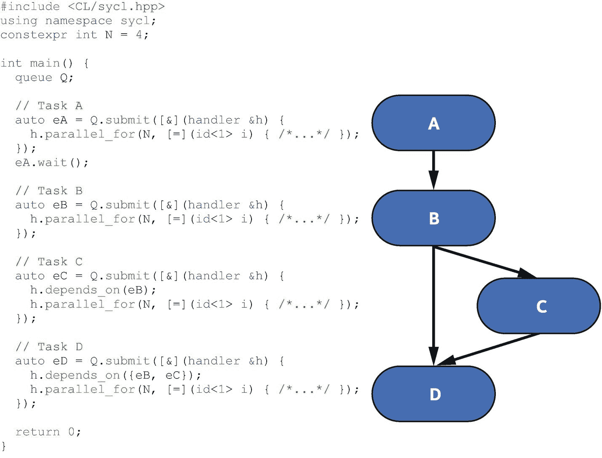

图 3-11

使用事件和`depends_on`

### 访问器的隐式依赖

任务之间的隐式依赖关系是从数据依赖关系创建的。任务之间的数据依赖有三种形式，如图 [3-12](#Fig12) 所示。

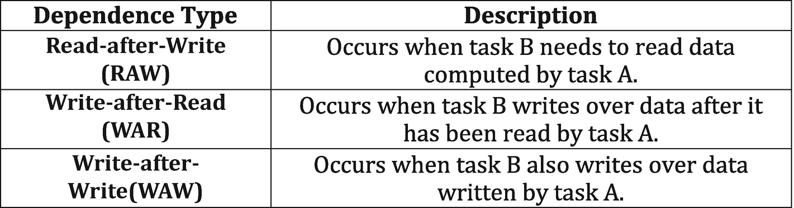

图 3-12

三种形式的数据相关性

数据依赖以两种方式向运行时表达:访问器和程序顺序。运行时必须使用这两者来正确计算数据依赖关系。如图 [3-13](#Fig13) 和 [3-14](#Fig14) 所示。

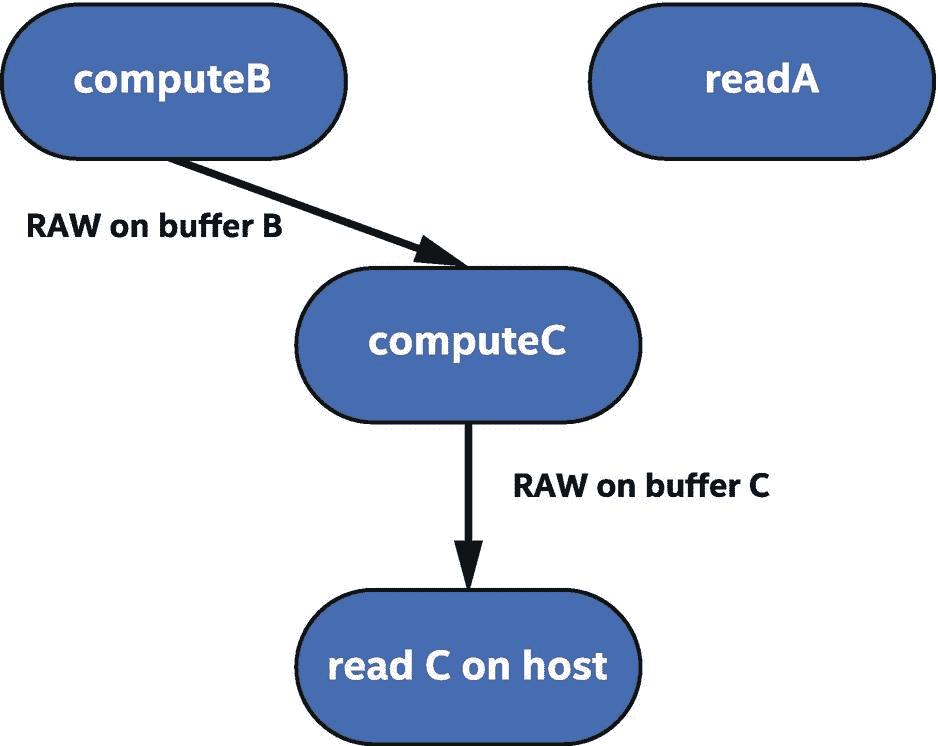

图 3-14

原始任务图

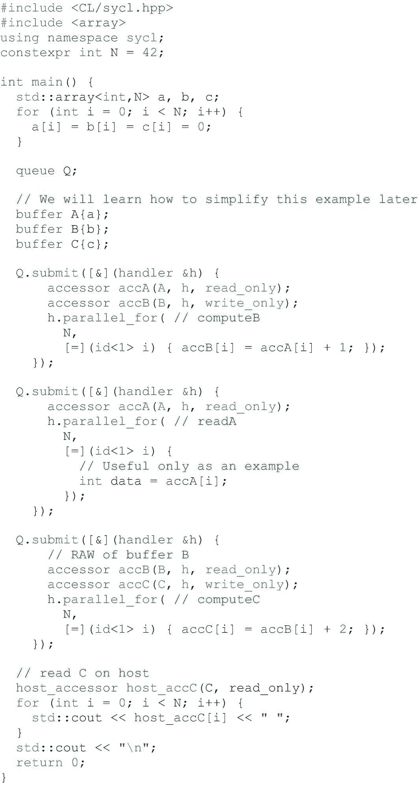

图 3-13

写后读

在图 [3-13](#Fig13) 和 [3-14](#Fig14) 中，我们执行三个内核— `computeB`、`readA`和`computeC—and`，然后在主机上读回最终结果。内核`computeB`的命令组创建了两个访问器，`accA`和`accB`。这些访问器使用访问标签`read_only`和`write_only`进行优化，指定我们不使用默认的访问模式`access::mode::read_write`。我们将在第 [7](07.html#b978-1-4842-5574-2_7) 章中了解更多关于访问标签的内容。内核`computeB`读取缓冲区`A`并写入缓冲区`B`。内核开始执行之前，必须将缓冲区`A`从主机复制到设备。

内核`readA`也为缓冲区`A`创建一个只读访问器。由于内核`readA`是在内核`computeB`之后提交的，这就产生了一个读后读(RAR)的场景。然而，rar 对运行时没有额外的限制，内核可以以任何顺序自由执行。事实上，运行时可能更喜欢在内核`computeB`之前执行内核`readA`，或者甚至同时执行两者。两者都要求缓冲区`A`被复制到设备，但是内核`computeB`也要求缓冲区`B`被复制，以防任何现有的值没有被`computeB`覆盖并且可能被后来的内核使用。这意味着当缓冲区`B`的数据传输发生时，运行时可以执行内核`readA`,这也表明即使内核只写入缓冲区，缓冲区的原始内容仍可能被移动到设备，因为不能保证缓冲区中的所有值都会被内核写入(参见第 [7](07.html#b978-1-4842-5574-2_7) 章，了解在这些情况下让我们进行优化的标签)。

内核`computeC`读取缓冲区`B`，这是我们在内核`computeB`中计算的。因为我们在提交内核`computeB`之后提交了内核`computeC`，这意味着内核`computeC`对缓冲区`B`有原始数据依赖。原始相关性也被称为真实相关性或流相关性，因为数据需要从一个计算流到另一个计算，以便计算正确的结果。最后，我们还在内核`computeC`和主机之间创建了一个对缓冲区`C`的原始依赖，因为主机希望在内核完成后再调用`read C`。这迫使运行时将缓冲区`C`复制回主机。由于没有写入设备上的缓冲区`A`，运行时不需要将该缓冲区复制回主机，因为主机已经有了最新的副本。

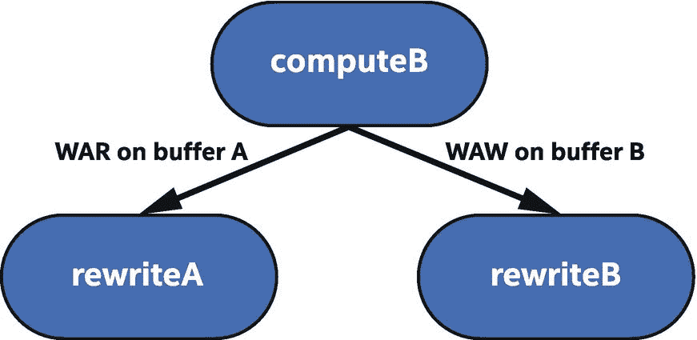

图 3-16

战争和战时任务图

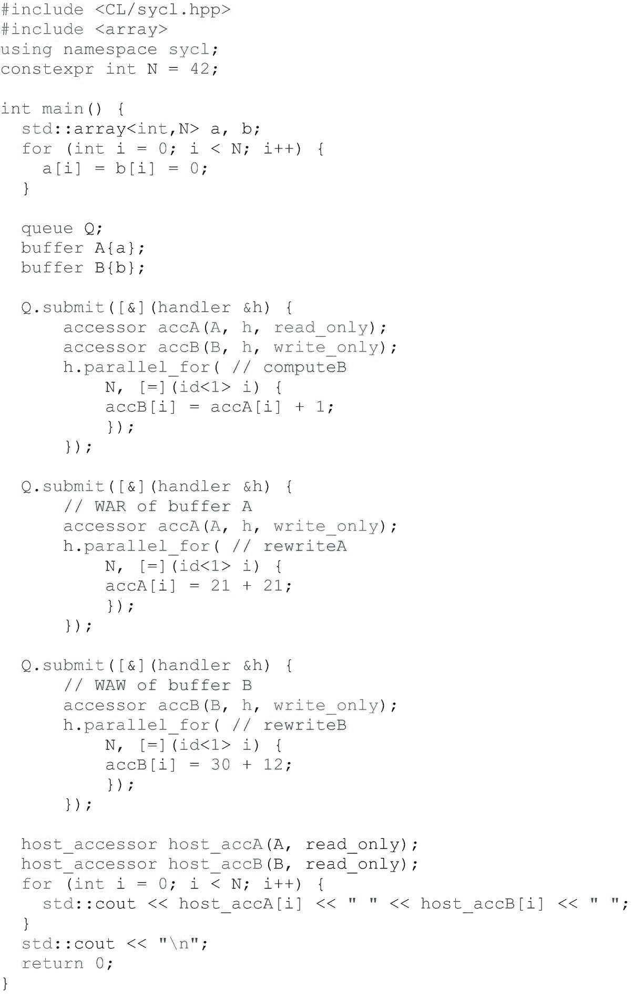

图 3-15

读后写和写后写

在图 [3-15](#Fig15) 和 [3-16](#Fig16) 中，我们再次执行三个内核:`computeB`、`rewriteA`和`rewriteB`。内核`computeB`再次读取缓冲区`A`并写入缓冲区`B`，内核`rewriteA`写入缓冲区`A`，内核`rewriteB`写入缓冲区`B`。内核`rewriteA`理论上可以早于内核`computeB`执行，因为在内核准备好之前需要传输的数据较少，但是它必须等到内核`computeB`完成之后，因为存在对缓冲区`A`的 WAR 依赖。

在这个例子中，内核`computeB`需要来自主机的 A 的原始值，如果内核`rewriteA`在内核`computeB`之前执行，它将读取错误的值。战争依赖也被称为反依赖。原始依赖关系确保数据以正确的方向正确流动，而 WAR 依赖关系确保现有值在被读取之前不会被覆盖。内核重写中发现的 WAW 对缓冲区`B`的依赖类似地起作用。如果在内核`computeB`和`rewriteB`之间提交了对缓冲区`B`的任何读取，它们将导致原始和 WAR 依赖，这将正确排序任务。然而，在这个例子中，内核`rewriteB`和主机之间有一个隐含的依赖关系，因为最终的数据必须写回主机。我们将在第 [7](07.html#b978-1-4842-5574-2_7) 章中了解导致这种写回的更多原因。WAW 依赖性，也称为输出依赖性，确保最终输出在主机上是正确的。

## 选择数据管理策略

为我们的应用程序选择正确的数据管理策略在很大程度上取决于个人偏好。事实上，我们可能从一种策略开始，随着程序的成熟，我们会切换到另一种策略。然而，有一些有用的指导方针可以帮助我们选择满足我们需求的策略。

要做的第一个决定是我们想要使用显式还是隐式数据移动，因为这极大地影响了我们需要对程序做什么。隐式数据移动通常是一个更容易开始的地方，因为所有的数据移动都是为我们处理的，让我们专注于计算的表达式。

如果我们决定从一开始就完全控制所有数据移动，那么使用 USM 设备分配的显式数据移动就是我们想要开始的地方。我们只需要确保在主机和设备之间添加所有必要的副本！

在选择隐式数据移动策略时，我们仍然可以选择是使用缓冲区还是 USM 主机或共享指针。同样，这个选择是个人偏好的问题，但是有几个问题可以帮助我们选择其中一个。如果我们正在移植一个使用指针的现有 C/C++ 程序，USM 可能是一个更容易的途径，因为大多数代码不需要改变。如果数据表示没有引导我们选择，我们可以问的另一个问题是我们希望如何表达内核之间的依赖关系。如果我们更喜欢考虑内核之间的数据依赖，选择缓冲区。如果我们更愿意将依赖关系理解为在执行一个计算之前执行另一个计算，并希望使用有序队列、显式事件或内核间等待来表达，请选择 USM。

当使用 USM 指针时(通过显式或隐式数据移动)，我们可以选择使用哪种类型的队列。有序队列简单而直观，但是它们约束了运行时间，并且可能会限制性能。无序队列更复杂，但是它们给了运行时更多的重新排序和重叠执行的自由。如果我们的程序在内核之间有复杂的依赖关系，无序队列类是正确的选择。如果我们的程序只是一个接一个地运行许多内核，那么有序队列将是我们更好的选择。

## 处理程序类:关键成员

我们已经展示了许多使用`handler`类的方法。图 [3-17](#Fig17) 和 [3-18](#Fig18) 提供了这个非常重要的类别的关键成员的更详细的解释。我们还没有使用所有这些成员，但是在本书的后面会用到它们。这是摆放它们的最佳地点。

一个密切相关的类，即`queue`类，在第 [2 章](02.html#b978-1-4842-5574-2_2)的结尾有类似的解释。在线 oneAPI DPC++ 语言参考对这两个类提供了更详细的解释。

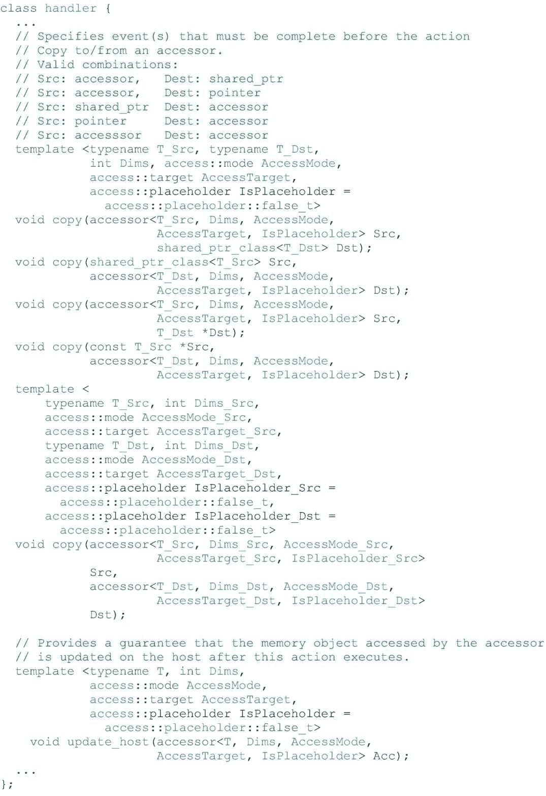

图 3-18

处理程序类的访问器成员的简化定义

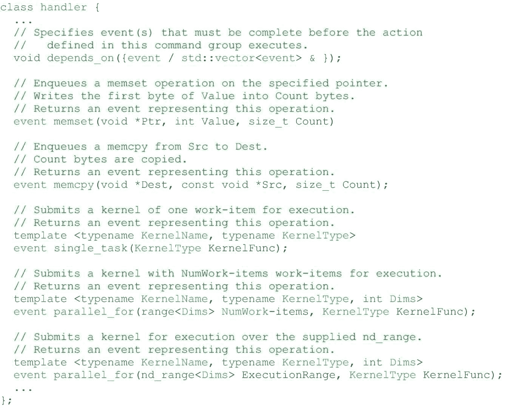

图 3-17

处理程序类的非访问器成员的简化定义

## 摘要

在这一章中，我们介绍了解决数据管理问题的机制以及如何安排数据的使用。使用加速器设备时，管理对不同内存的访问是一个关键挑战，我们有不同的选项来满足我们的需求。

我们概述了数据使用之间可能存在的不同类型的依赖关系，并描述了如何向队列提供关于这些依赖关系的信息，以便它们正确地对任务进行排序。

本章概述了统一共享内存和缓冲区。我们将在第 [6](06.html#b978-1-4842-5574-2_6) 章中更详细地探讨 USM 的所有模式和行为。第 [7](07.html#b978-1-4842-5574-2_7) 章将更深入地探索缓冲区，包括创建缓冲区和控制其行为的所有不同方法。第 8 章[将再次讨论控制内核执行和数据移动顺序的队列调度机制。](08.html#b978-1-4842-5574-2_8)

 

**开放存取**本章根据知识共享署名 4.0 国际许可证(http://Creative Commons . org/licenses/by/4.0/)的条款获得许可，该许可证允许以任何媒体或格式使用、共享、改编、分发和复制，只要您适当注明原作者和来源，提供知识共享许可证的链接并指明是否进行了更改。

本章中的图像或其他第三方材料包含在本章的知识共享许可中，除非在材料的信用额度中另有说明。如果材料不包括在本章的知识共享许可中，并且您的预期使用不被法律法规允许或超出了允许的使用范围，您将需要直接从版权所有者处获得许可。

<aside aria-label="Footnotes" class="FootnoteSection">Footnotes [1](#Fn1_source)

请注意，你可能会在其他文本中看到“dependency”和“dependencies”有时拼写为“dependency”和“dependencies”。它们的意思是一样的，但是我们倾向于在几篇关于数据流分析的重要论文中使用的拼写。

参见[https://dl . ACM . org/doi/pdf/10 . 1145/75277 . 75280](https://dl.acm.org/doi/pdf/10.1145/75277.75280)和[https://dl . ACM . org/doi/pdf/10 . 1145/113446 . 113449](https://dl.acm.org/doi/pdf/10.1145/113446.113449)。

 </aside>