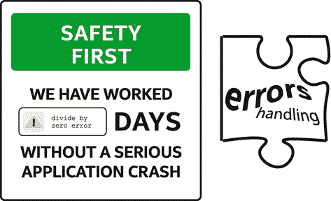
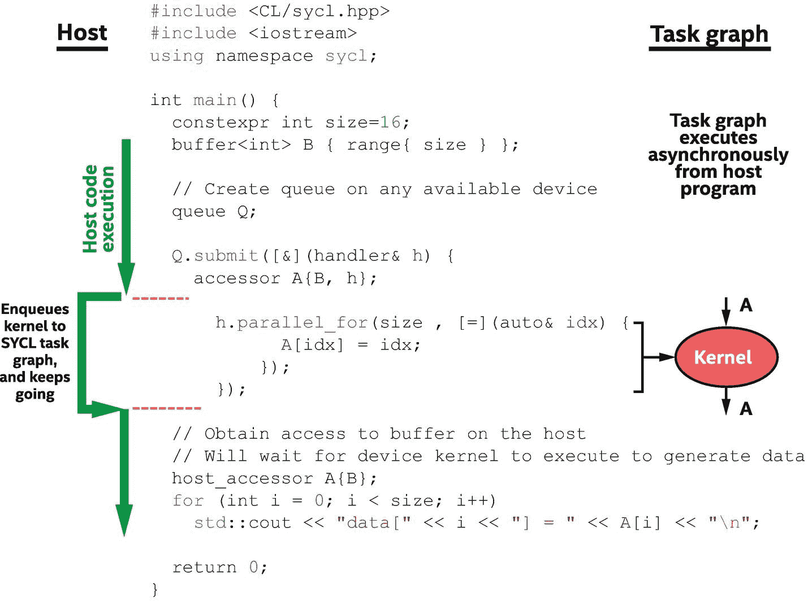
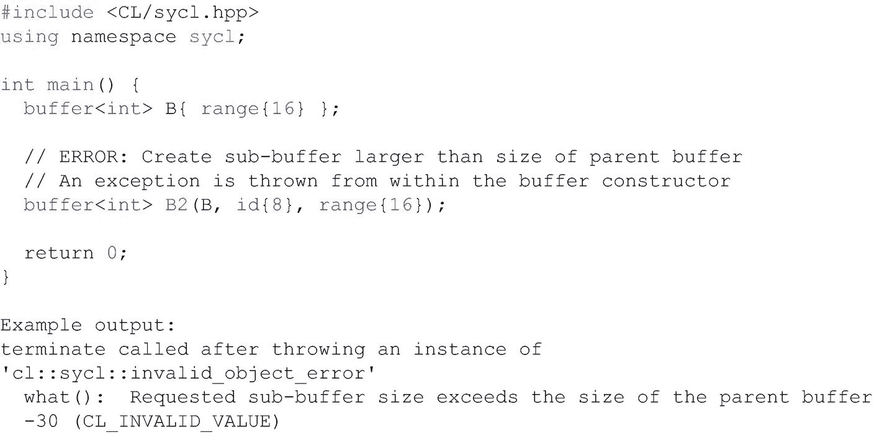
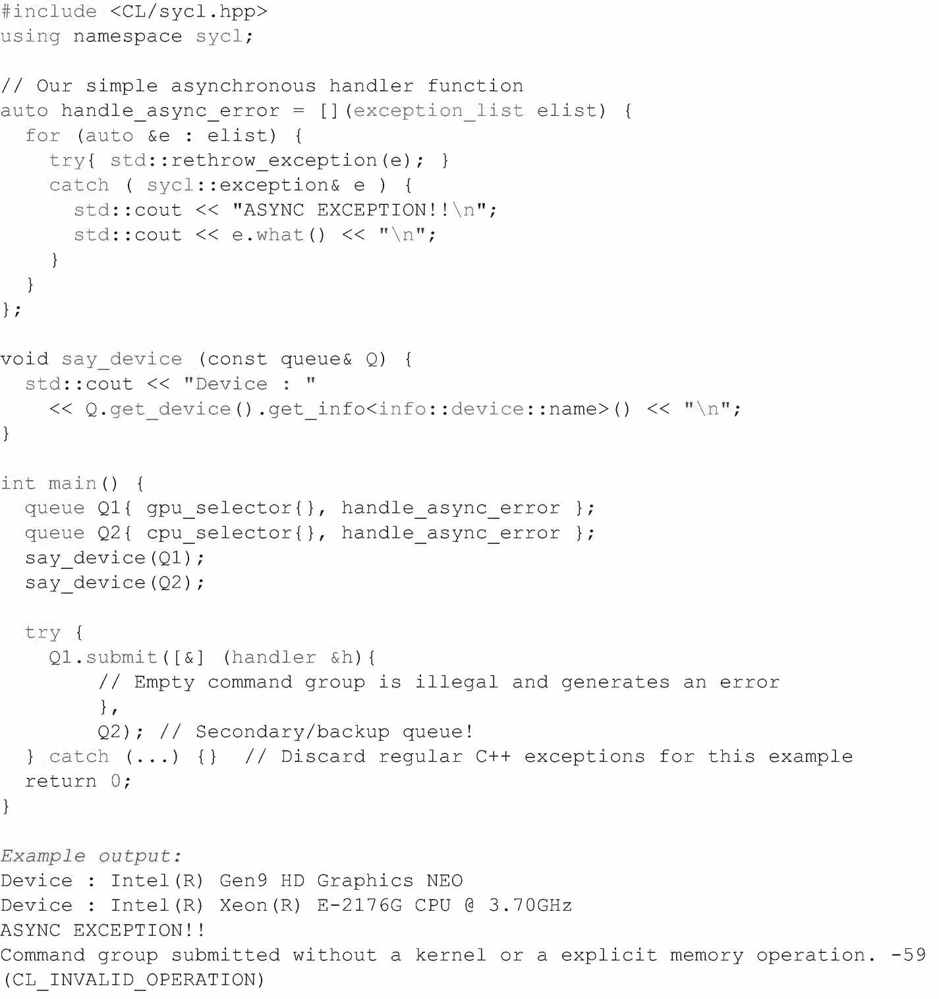
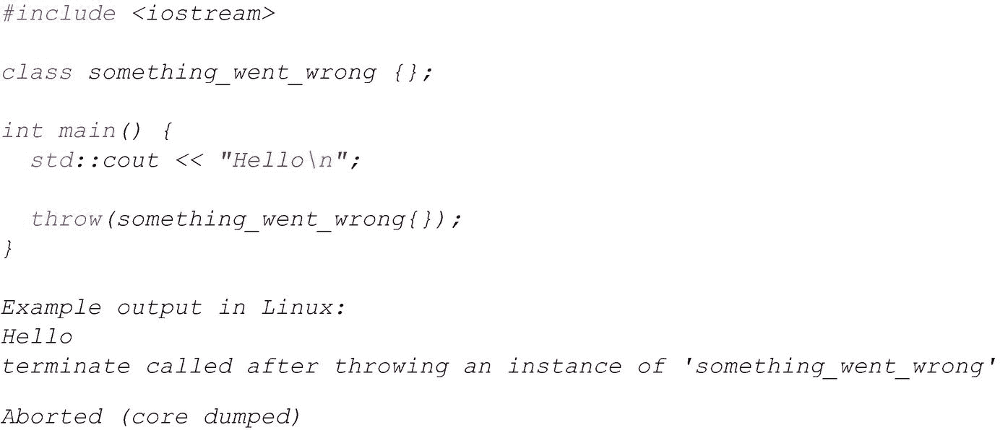
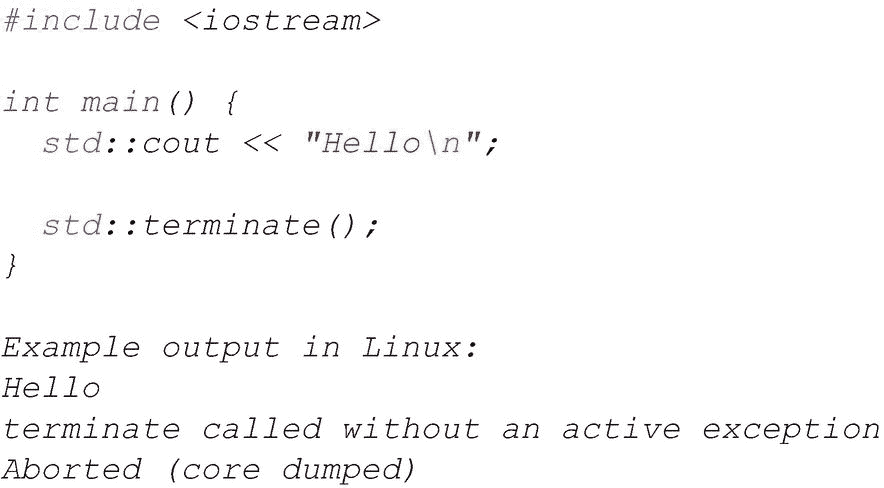
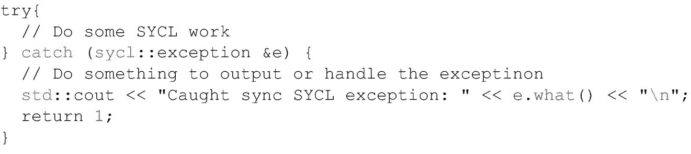
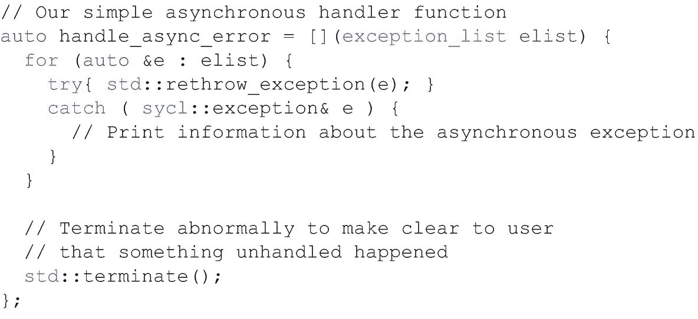

# 五、错误处理



阿加莎·克里斯蒂在 1969 年写道:“只要计算机努力，人为错误就不算什么。”作为程序员，我们要收拾残局，这并不奇怪。错误处理机制可以捕捉其他人可能犯的程序员错误。由于我们不打算自己犯错，我们可以专注于使用错误处理来处理现实世界中由于*和其他*原因而可能发生的情况。

检测和处理意外情况和错误在应用程序开发过程中可能是有帮助的(想想:在项目中工作的*另一个*程序员*确实*犯了错误)，但更重要的是在稳定和安全的生产应用程序和库方面起着关键作用。我们用这一章来描述 SYCL 中可用的错误处理机制，这样我们就可以了解我们的选择，以及如果我们关心错误的检测和管理，如何构建应用程序。

本章概述了 SYCL 中的同步和异步错误，描述了如果我们在代码中不做任何事情来处理错误时应用程序的行为，并深入探讨了 SYCL 特有的允许我们处理异步错误的机制。

## 安全第一

C++ 错误处理的一个核心方面是，如果我们对已经检测到(抛出)的错误不做任何处理，那么应用程序将会终止并指示出错。这种行为允许我们在编写应用程序时不必关注错误管理，并且仍然相信错误会以某种方式通知开发人员或用户。当然，我们并不是建议我们应该忽略错误处理！生产应用程序应该将错误管理作为架构的核心部分来编写，但是应用程序通常在开始开发时没有这样的关注点。C++ 的目标是让不处理错误的代码仍然能够观察到错误，即使它们没有被显式处理。

由于 SYCL 是数据并行 C++，同样的原理也成立:如果我们在代码中不做任何事情来管理错误，并且检测到错误，程序将发生异常终止，让我们知道发生了不好的事情。生产应用程序当然应该将错误管理视为软件架构的核心部分，不仅仅是报告错误，还经常从错误状态中恢复。

如果我们不添加任何错误管理代码，当错误发生时，我们仍然会看到一个异常的程序终止，这是一个深入挖掘的指示。

## 错误类型

C++ 通过其异常机制提供了一个通知和处理错误的框架。除此之外，异构编程还需要额外级别的错误管理，因为有些错误发生在设备上，或者在尝试在设备上启动工作时。这些错误通常在时间上与宿主程序的执行分离，因此它们不能与经典的 C++ 异常处理机制完全集成。为了解决这个问题，有额外的机制使异步错误像常规 C++ 异常一样易于管理和控制。

图 [5-1](#Fig1) 显示了一个典型应用的两个组成部分:(1)顺序运行的主机代码，并将工作提交给任务图以备将来执行;( 2)任务图，它与主机程序异步运行，并在必要的依赖关系满足时在设备上执行内核或其他动作。该示例显示了作为任务图的一部分异步执行的操作`parallel_for`，但是其他操作也是可能的，如第 [3](03.html#b978-1-4842-5574-2_3) 、 [4](04.html#b978-1-4842-5574-2_4) 和 [8](08.html#b978-1-4842-5574-2_8) 章中所讨论的。



图 5-1

主机程序和任务图执行的分离

图 [5-1](#Fig1) 的左侧和右侧(主机和任务图)的区别是理解*同步*和*异步*错误之间差异的关键。

*同步*当主机程序执行某项操作(如 API 调用或对象构造器)时检测到错误条件时，就会发生错误。它们可以在图左侧的指令完成之前被检测到，并且错误可以由导致错误的操作立即抛出。我们可以在图的左侧用一个`try-catch`结构包装特定的指令，期望在 try 块结束之前检测到由于`try`内的操作而产生的错误(并因此被捕获)。C++ 异常机制就是为处理这些类型的错误而设计的。

或者，*异步*错误出现在图 [5-1](#Fig1) 右侧的部分，只有当执行任务图中的操作时才会检测到错误。当异步错误作为任务图执行的一部分被检测到时，主机程序通常已经继续执行了，所以没有代码可以用`try-catch`构造来捕获这些错误。取而代之的是一个异步异常处理框架来处理这些相对于主机程序执行看似随机发生的错误。

## 让我们制造一些错误！

作为本章剩余部分的例子，并允许我们进行实验，我们将在下面的部分创建同步和异步错误。



图 5-2

创建同步错误

### 同步误差

在图 [5-2](#Fig2) 中，从一个缓冲区创建了一个子缓冲区，但其大小非法(大于原始缓冲区)。子缓冲区的构造器检测到这个错误，并在构造器执行完成之前抛出异常。这是一个同步错误，因为它作为宿主程序执行的一部分(与之同步)发生。在构造器返回之前，错误是可以检测到的*，因此可以在宿主程序中的错误起源点或检测点立即处理错误。*

我们的代码示例不做任何事情来捕获和处理 C++ 异常，所以默认的 C++ 未捕获异常处理程序为我们调用`std::terminate`，发出出错的信号。

### 异步误差

生成异步错误有点棘手，因为实现会尽可能同步地检测和报告错误。同步错误更容易调试，因为它们发生在宿主程序中特定的起始点，所以只要有可能就应该优先考虑。不过，出于演示目的，生成异步错误的一种方法是在命令组提交中添加一个后备/辅助队列，并丢弃碰巧抛出的同步异常。图 [5-3](#Fig3) 显示了这样的代码，它调用我们的`handle_async_error`函数来允许我们进行实验。没有辅助/后备队列也可能发生和报告异步错误，因此请注意，辅助队列只是示例的一部分，绝不是异步错误的必要条件。



图 5-3

创建异步错误

## 应用程序错误处理策略

C++ *异常*特性被设计成将程序中检测到错误的地方和可能处理错误的地方完全分开，这个概念非常适合 SYCL 中的同步和异步错误。通过`throw`和`catch`机制，可以定义处理程序的层次结构，这在生产应用程序中很重要。

构建一个能够以一致和可靠的方式处理错误的应用程序需要预先制定一个策略，并为错误管理构建一个软件架构。C++ 提供了灵活的工具来实现许多可供选择的策略，但是这种架构超出了本章的范围。有许多书籍和其他参考资料专门讨论这个主题，所以我们鼓励大家去查阅它们，以全面了解 C++ 错误管理策略。

也就是说，错误检测和报告并不总是需要生产规模的。如果目标只是在执行过程中检测错误并报告错误(但不一定是从错误中恢复)，那么可以通过最少的代码可靠地检测和报告程序中的错误。接下来的部分首先介绍了如果我们忽略错误处理并且什么都不做会发生什么(默认行为并没有那么糟糕！)，后面是推荐的错误报告，它在基本应用程序中很容易实现。

### 忽略错误处理

C++ 和 SYCL 旨在告诉我们，即使我们没有显式地处理错误，也会出现问题。未处理的同步或异步错误的默认结果是程序异常终止，操作系统应该告诉我们这一点。下面的两个例子分别模拟了如果我们不处理同步和异步错误时将会发生的行为。

图 [5-4](#Fig4) 显示了一个未处理的 C++ 异常的结果，例如，这可能是一个未处理的 SYCL 同步错误。我们可以使用这段代码来测试在这种情况下特定的操作系统会报告什么。



图 5-4

C++ 中未处理的异常

图 [5-5](#Fig5) 显示了被调用的`std:` `:terminate`的示例输出，这将是我们的应用程序中未处理的 SYCL 异步错误的结果。我们可以使用这段代码来测试在这种情况下特定的操作系统会报告什么。



图 5-5

`std:` `:terminate`在 SYCL 异步异常未处理时调用

虽然我们可能应该处理程序中的错误，但是由于未被捕获的错误将被捕获，程序将被终止，所以我们不需要担心程序会无声无息地失败！

### 同步错误处理

我们保持这一节非常短，因为 SYCL 同步错误只是 C++ 异常。SYCL 中添加的大多数额外错误机制都与异步错误有关，我们将在下一节中讨论，但是同步错误很重要，因为实现会尝试同步检测和报告尽可能多的错误，因为它们更容易推理和处理。

SYCL 定义的同步错误是从`sycl::exception`类型的`std::exception`衍生而来的一个类，它允许我们通过一个`try-catch`结构来捕捉 SYCL 错误，如图 [5-6](#Fig6) 所示。



图 5-6

具体要抓的模式`sycl::exception`

在 C++ 错误处理机制之上，SYCL 为运行时抛出的异常添加了一个`sycl::exception`类型。其他的都是标准的 C++ 异常处理，所以大多数开发人员都很熟悉。

图 [5-7](#Fig7) 提供了一个稍微完整的例子，其中处理了额外的异常类，以及通过从`main()`返回而结束的程序。


图 5-7

从代码块中捕捉异常的模式

### 异步错误处理

异步错误由 SYCL 运行时(或底层后端)检测，错误的发生与宿主程序中命令的执行无关。这些错误存储在 SYCL 运行时内部的列表中，只在程序员可以控制的特定点上进行处理。为了涵盖异步错误的处理，我们需要讨论两个主题:

1.  **当有未完成的异步错误要处理时调用的异步处理程序**

2.  **当**调用异步处理程序时

#### 异步处理程序

异步处理程序是应用程序定义的函数，它向 SYCL 上下文和/或队列注册。在下一节定义的时间，如果有任何未处理的异步异常可供处理，那么 SYCL 运行时将调用异步处理程序，并向其传递这些异常的列表。

异步处理程序作为一个`std::function`传递给一个上下文或队列构造器，并且可以根据我们的偏好以常规函数、lambda 或仿函数等方式定义。处理程序必须接受一个`sycl::exception_list`参数，例如图 [5-8](#Fig8) 中所示的示例处理程序。


图 5-8

定义为 lambda 的异步处理程序实现示例

在图 [5-8](#Fig8) 中，`std::rethrow_exception`后接特定异常类型的 catch 提供了异常类型的过滤，在这种情况下只过滤到`sycl::exception`。我们还可以在 C++ 中使用其他过滤方法，或者选择处理所有异常，而不管其类型。

该处理程序在构建时与一个队列或上下文相关联(在第 [6](06.html#b978-1-4842-5574-2_6) 章中详细介绍了底层细节)。例如，要用我们正在创建的队列注册图 [5-8](#Fig8) 中定义的处理程序，我们可以写

```cpp

queue my_queue{ gpu_selector{}, handle_async_error };

```

同样，要用我们正在创建的上下文注册图 [5-8](#Fig8) 中定义的处理程序，我们可以写

```cpp

context my_context{ handle_async_error };

```

大多数应用程序不需要显式创建或管理上下文(它们是在后台自动为我们创建的)，因此如果要使用异步处理程序，大多数开发人员应该将这种处理程序与为特定设备(而不是显式上下文)构建的队列相关联。

在定义异步处理程序时，大多数开发人员应该在队列中定义它们，除非出于其他原因已经显式地管理了上下文。

如果没有为队列或队列的父上下文定义异步处理程序，并且在该队列上(或上下文中)发生了必须处理的异步错误，则调用默认的异步处理程序。默认处理程序的运行方式如同图 [5-9](#Fig9) 所示的编码。



图 5-9

默认异步处理程序的行为示例

默认处理程序应该向用户显示一些异常列表中的错误信息，然后异常终止应用程序，这也会导致操作系统报告终止异常。

我们在异步处理程序中放什么由我们自己决定。它的范围可以从记录错误到应用程序终止，再到恢复错误条件，以便应用程序可以继续正常执行。常见的情况是通过调用`sycl::exception::what()`来报告错误的任何细节，然后终止应用程序。

尽管由我们来决定异步处理程序在内部做什么，但一个常见的错误是打印一条错误消息(在程序的其他消息中可能会被忽略)，然后完成处理程序函数。除非我们有适当的错误管理原则，允许我们恢复已知的程序状态，并确信继续执行是安全的，否则我们应该考虑在异步处理函数中终止应用程序。这减少了错误结果出现在程序中的机会，在该程序中检测到错误，但是应用程序被无意中允许继续执行。在许多程序中，一旦我们遇到异步异常，异常终止是首选结果。

如果没有全面的错误恢复和管理机制，在输出有关错误的信息后，考虑在异步处理程序中终止应用程序。

#### 处理程序的调用

运行时在特定的时间调用异步处理程序。错误发生时不会立即报告，因为如果出现这种情况，错误管理和安全应用程序编程(尤其是多线程)将变得更加困难和昂贵。相反，异步处理程序在以下特定时间被调用:

1.  当宿主程序调用特定队列上的`queue::throw_asynchronous()`时

2.  当宿主程序调用特定队列上的`queue::wait_and_throw()`时

3.  当宿主程序在特定事件上调用`event::wait_and_throw()`时

4.  当一个`queue`被破坏时

5.  当一个`context`被破坏时

方法 1–3 为宿主程序提供了一种机制来控制何时处理异步异常，以便可以管理特定于应用程序的线程安全和其他细节。它们有效地提供了异步异常进入宿主程序控制流的受控点，并且可以像处理同步错误一样进行处理。

如果用户没有显式调用方法 1-3 中的一个，那么当队列和上下文被销毁时，在程序拆卸期间通常会报告异步错误。这通常足以向用户发出信号，表明出了问题，程序结果不应该被信任。

然而，在程序拆卸期间依靠错误检测并不是在所有情况下都有效。例如，如果程序将仅在达到某些算法收敛标准时终止，并且如果这些标准仅可通过成功执行设备内核来实现，则异步异常可能发信号通知该算法将永远不会收敛并开始拆卸(将会注意到该错误)。在这些情况下，以及在有更完整的错误处理策略的生产应用中，在程序中的常规和受控点调用`throw_asynchronous()`或`wait_and_throw()`是有意义的(例如，在检查算法收敛是否发生之前)。

## 设备上的错误

本章中讨论的错误检测和处理机制是基于主机的。它们是一些机制，通过这些机制，主机程序可以检测和处理在主机程序中或者在设备上执行内核期间可能出现的错误。我们还没有介绍的是，如何从我们编写的设备代码中发出信号，表明有什么地方出错了。这种遗漏不是错误，而是相当故意的。

SYCL 明确禁止在设备代码中使用 C++ 异常处理机制(比如`throw`)，因为对于某些类型的设备来说，这是我们通常不想付出的性能代价。如果我们检测到设备代码中出现了错误，我们应该使用现有的非基于异常的技术发出错误信号。例如，我们可以写入一个记录错误的缓冲区，或者从我们定义的表示发生了错误的数值计算中返回一些无效的结果。在这些情况下，正确的策略是非常具体的应用。

## 摘要

在这一章中，我们介绍了同步和异步错误，讨论了如果我们对可能发生的错误无所作为时的默认行为，并讨论了在应用程序的受控点处理异步错误的机制。错误管理策略是软件工程中的一个主要话题，也是许多应用程序中编写的代码的重要组成部分。SYCL 集成了我们在错误处理方面已经掌握的 C++ 知识，并提供了灵活的机制来集成我们首选的错误管理策略。

[](https://creativecommons.org/licenses/by/4.0) 

**开放存取**本章根据知识共享署名 4.0 国际许可证(http://Creative Commons . org/licenses/by/4.0/)的条款获得许可，该许可证允许以任何媒体或格式使用、共享、改编、分发和复制，只要您适当注明原作者和来源，提供知识共享许可证的链接并指明是否进行了更改。

本章中的图像或其他第三方材料包含在本章的知识共享许可中，除非在材料的信用额度中另有说明。如果材料不包括在本章的知识共享许可中，并且您的预期使用不被法律法规允许或超出了允许的使用范围，您将需要直接从版权所有者处获得许可。