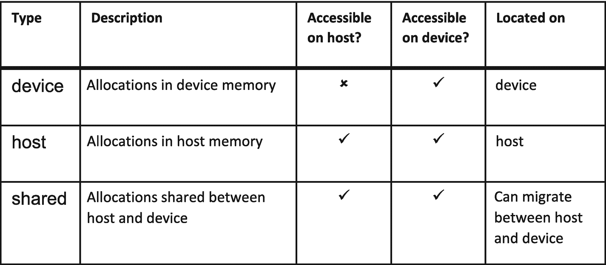
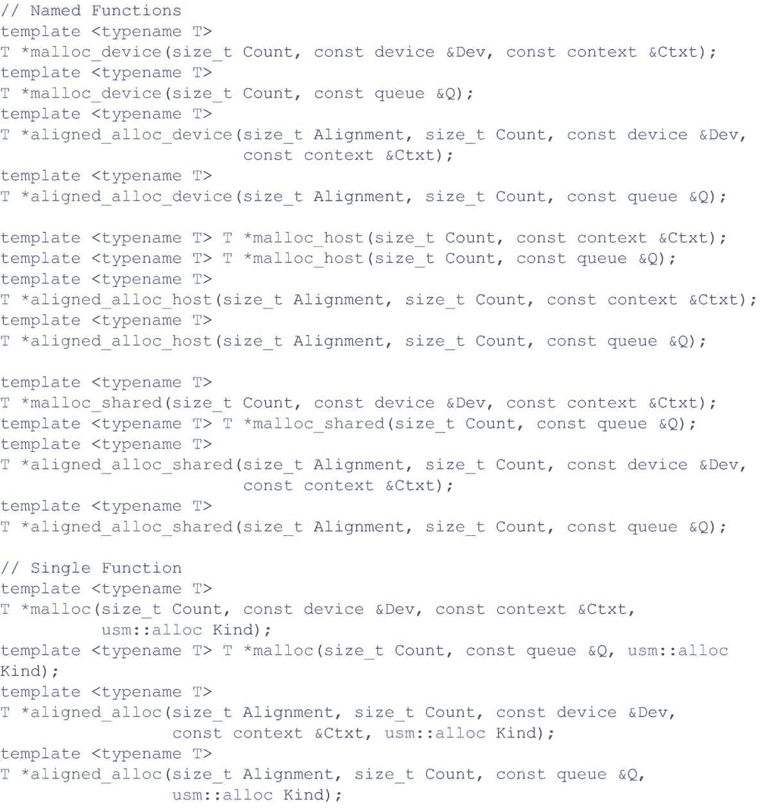
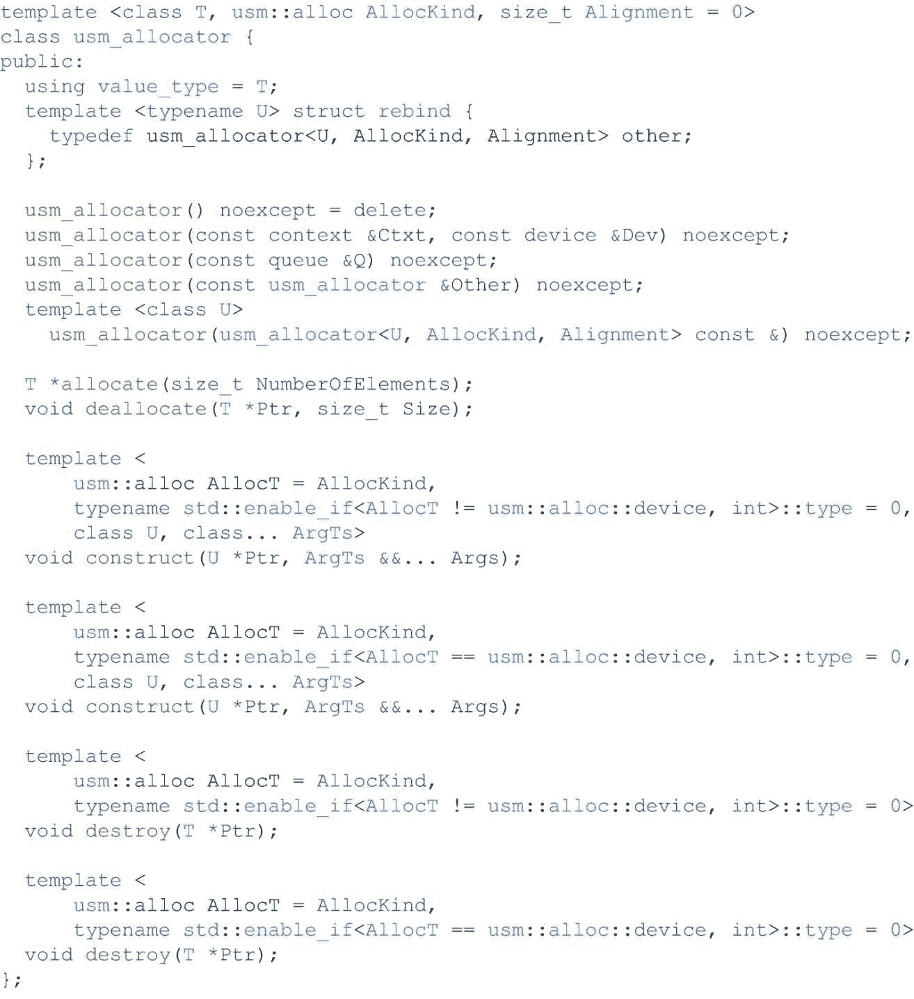
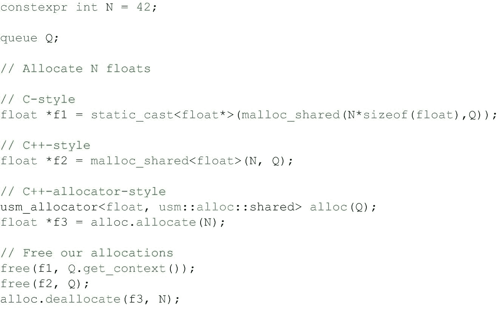
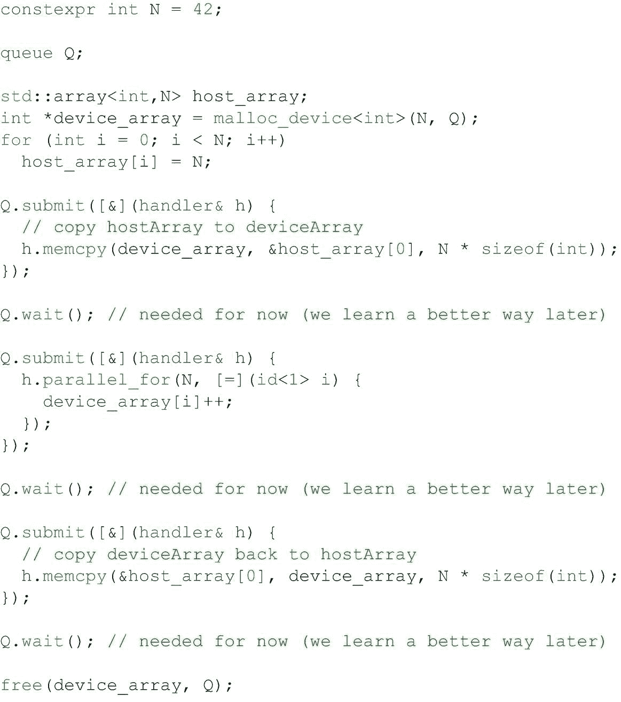
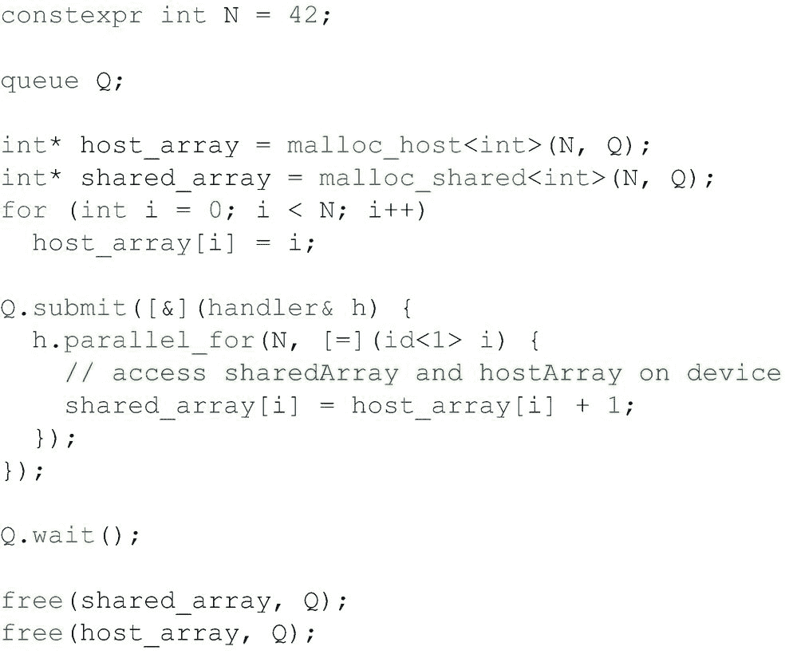
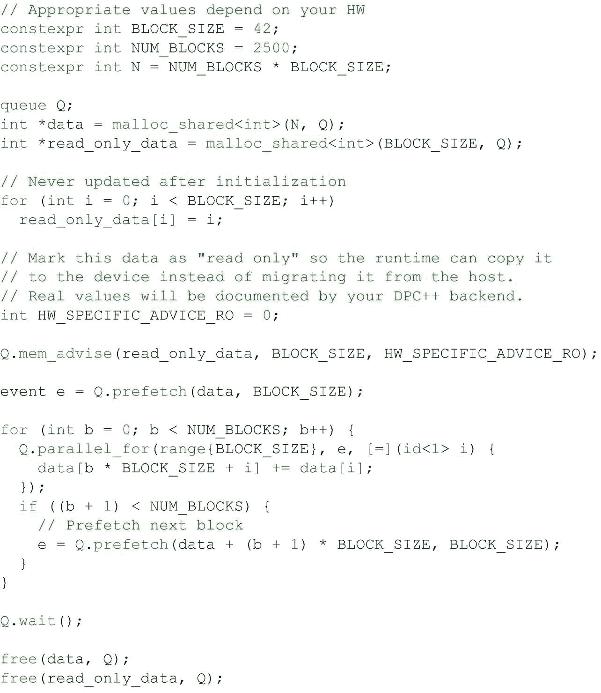
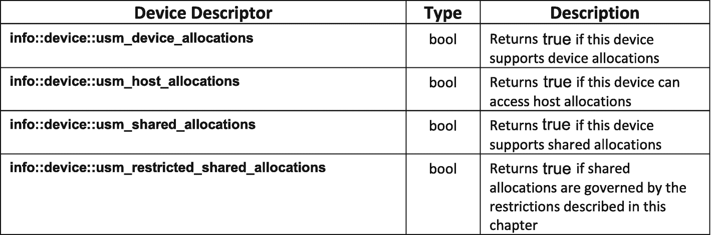
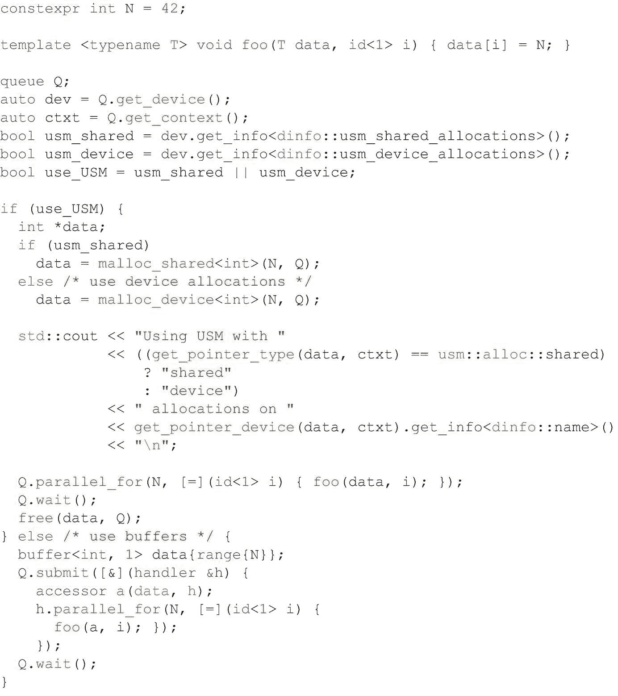

# 6.统一共享内存

接下来的两章深入探讨了如何管理数据。有两种互为补充的不同方法:统一共享内存(USM)和缓冲区。USM 公开了与缓冲区不同的内存抽象级别—USM 有指针，而缓冲区是更高级别的接口。本章重点介绍 USM。下一章将集中讨论缓冲区。

除非我们明确知道要使用缓冲区，否则 USM 是一个很好的起点。USM 是一个基于指针的模型，允许通过常规 C++指针读写内存。

## 我们为什么要使用 USM？

因为 USM 是基于 C++指针的，所以对于现有的基于指针的 C++代码来说，它是一个自然的起点。将指针作为参数的现有函数无需修改即可继续工作。在大多数情况下，唯一需要的改变是用特定于 USM 的分配例程替换现有的对`malloc`或`new`的调用，我们将在本章后面讨论这些例程。

## 分配类型

虽然 USM 基于 C++指针，但并非所有指针都是平等的。USM 定义了三种不同类型的分配，每种类型都有独特的语义。设备可能不支持所有类型(甚至任何类型)的 USM 分配。稍后我们将学习如何查询设备支持什么。图 [6-1](#Fig1) 总结了三种分配类型及其特点。

图 6-1

USM 分配类型

### 设备分配

这第一种类型的分配是我们需要的，以便有一个指向设备的附加存储器的指针，例如(G)DDR 或 HBM。设备分配可以由运行在设备上的内核读取或写入，但不能从主机上执行的代码直接访问。试图访问主机上的设备分配可能会导致数据不正确或程序因错误而崩溃。我们必须使用显式 USM `memcpy`机制在主机和设备之间复制数据，该机制指定了在两个位置之间必须复制多少数据，这将在本章的后面部分介绍。

### 主机分配

第二种类型的分配比设备分配更容易使用，因为我们不必在主机和设备之间手动拷贝数据。主机分配是主机内存中的分配，可在主机和设备上访问。这些分配虽然可以在设备上访问，但不能迁移到设备的附加内存。取而代之的是，读写这个内存的内核是远程完成的*，通常是通过较慢的总线，比如 PCI-Express。便利性和性能之间的权衡是我们必须考虑的。尽管主机分配会导致更高的访问成本，但仍然有充分的理由使用它们。示例包括很少访问的数据或无法容纳在设备附加内存中的大型数据集。*

 *### 共享分配

最后一种分配结合了设备和主机分配的属性，将主机分配的程序员便利性与设备分配提供的更高性能结合在一起。与主机分配一样，共享分配在主机和设备上都是可访问的。它们之间的区别在于，共享分配可以在主机内存和设备连接内存之间自由迁移，自动进行，无需我们的干预。如果某个分配已经迁移到该设备，则在该设备上执行的任何内核访问该分配的性能都将优于从主机远程访问该分配。然而，共享分配并不能给我们所有的好处而没有任何缺点。

自动迁移可以通过多种方式实现。无论运行时选择哪种方式来实现共享分配，它们通常都要付出延迟增加的代价。通过设备分配，我们可以准确地知道需要复制多少内存，并可以安排尽快开始复制。自动迁移机制看不到未来，在某些情况下，直到内核试图访问数据时才开始移动数据。然后，内核必须等待或阻塞，直到数据移动完成，然后才能继续执行。在其他情况下，运行时可能不知道内核将访问多少数据，并且可能保守地移动比所需数量更多的数据，这也增加了内核的延迟。

我们还应该注意，虽然共享分配*可以*迁移，但这并不一定意味着 DPC++ *的所有实现都将*迁移它们。我们预计大多数实现都将共享分配与迁移一起实现，但是一些设备可能更喜欢将它们实现为与主机分配相同。在这样的实现中，分配在主机和设备上仍然可见，但是我们可能看不到迁移实现可以提供的性能提升。

## 分配内存

USM 允许我们以各种不同的方式分配内存，以满足不同的需求和偏好。然而，在我们更详细地讨论所有方法之前，我们应该讨论 USM 分配与常规 C++分配有何不同。

### 我们需要知道什么？

常规的 C++程序可以通过多种方式分配内存:`new`、`malloc`或分配器。无论我们喜欢哪种语法，内存分配最终都是由主机操作系统中的系统分配器来执行的。当我们在 C++中分配内存时，唯一关心的是“我们需要多少内存？”以及“有多少内存可供分配？”但是，USM 需要额外的信息才能执行分配。

首先，USM 分配需要指定所需的分配类型:设备、主机或共享。请求正确的分配类型是很重要的，以便获得该分配所需的行为。接下来，每个 USM 分配必须指定一个`context`对象，分配将针对该对象进行。`context`对象还没有太多的讨论，所以这里值得说一点。上下文代表我们可以在其上执行内核的一个或一组设备。我们可以把上下文看作是一个方便的地方，让运行时保存一些关于它正在做什么的状态。在大多数 DPC++程序中，除了传递上下文之外，程序员不太可能直接与上下文交互。

USM 分配不能保证在不同的上下文中可用——所有 USM 分配、队列和内核共享同一个`context`对象是很重要的。通常，我们可以从用于向设备提交工作的队列中获得这个上下文。最后，`device`分配还要求我们指定哪个设备将为分配提供内存。这一点很重要，因为我们不想超额预订设备的内存(除非设备能够支持这一点，我们将在本章稍后讨论数据迁移时对此进行详细说明)。通过添加这些额外的参数，可以将 USM 分配例程与它们的 C++类似物区分开来。

### 多种风格

有时候，试图用一个单一的选项来取悦每个人被证明是一个不可能的任务，就像有些人喜欢咖啡胜过茶，或者喜欢`emacs`胜过`vi.`如果我们问程序员分配接口应该是什么样子，我们会得到几个不同的答案。USM 支持这种多样性的选择，并提供了几种不同风格的分配界面。这些不同的风格是 C 风格、C++风格和 C++分配器风格。我们现在将讨论每一个并指出它们的相似之处和不同之处。

#### c 级津贴

第一种类型的分配函数(在图 [6-2](#Fig2) 中列出，稍后在图 [6-6](#Fig6) 和 [6-7](#Fig7) 中显示的示例中使用)是在 C: `malloc`函数中的内存分配之后建模的，这些函数采用多个字节进行分配并返回一个`void *`指针。这种类型的函数是类型不可知的。我们必须指定要分配的总字节数，这意味着如果我们想要分配类型为`X`的`N`对象，我们必须请求`N * sizeof(X)`总字节数。返回的指针属于类型`void *`，这意味着我们必须将它转换为类型`X`的适当指针。这种样式非常简单，但是由于需要进行大小计算和类型转换，可能会很冗长。

我们可以进一步将这种分配方式分为两类:命名函数和单一函数。这两种风格的区别在于我们如何指定所需的 USM 分配类型。对于命名函数(`malloc_device`、`malloc_host`和`malloc_shared`)，USM 分配的类型编码在函数名中。单一功能`malloc`要求将 USM 分配类型指定为附加参数。没有一种味道比另一种更好，选择使用哪一种取决于我们的偏好。

我们不能在不简要提及对齐的情况下继续讨论。每个版本的`malloc`也有一个对应的`aligned_alloc`。`malloc`函数返回与设备默认行为一致的内存。它将返回一个具有有效对齐方式的合法指针，但是在某些情况下，我们可能更愿意手动指定对齐方式。在这些情况下，我们应该使用`aligned_alloc`变量中的一个，它也要求我们为分配指定期望的对齐。如果我们指定了一个非法的对齐，就不要指望程序能正常工作！合法对齐是 2 的幂。值得注意的是，在许多设备上，分配是最大限度地对齐的，以对应于硬件的功能，因此尽管我们可能要求分配是 4、8、16 或 32 字节对齐的，但实际上我们可能会看到更大的对齐，这给了我们所要求的，甚至更多。

图 6-2

c 风格的 USM 分配功能

#### C++分配

USM 分配函数的下一种风格(在图 [6-3](#Fig3) 中列出)与第一种非常相似，但更多的是 C++的外观和感觉。我们再次拥有了分配例程的命名和单个函数版本，以及我们的默认和用户指定的对齐版本。不同之处在于，现在我们的函数是 C++模板化的函数，它分配类型为`T`的`Count`对象，并返回类型为`T *`的指针。利用现代 C++简化了事情，因为我们不再需要以字节为单位手动计算分配的总大小，或者将返回的指针转换为适当的类型。这也有助于在代码中生成更紧凑、更不易出错的表达式。然而，我们应该注意到，与 C++中的“new”不同，malloc 风格的接口不为被分配的对象调用构造函数——我们只是分配足够的字节来适应该类型。

这种类型的分配是用 USM 编写新代码的良好开端。对于已经大量使用 C 或 C++ `malloc`的现有 C++代码来说，前面的 C 风格是一个很好的起点，我们将在其中添加 USM 的使用。

图 6-3

C++风格的 USM 分配函数

#### C++分配器

USM 分配的最终版本(图 [6-4](#Fig4) )比之前的版本更加拥抱现代 C++。这种风格基于 C++分配器接口，该接口定义了用于在容器(如`std::vector`)中直接或间接执行内存分配的对象。如果我们的代码大量使用可以对用户隐藏内存分配和释放细节的容器对象，这种分配器风格是最有用的，简化了代码并减少了出错的机会。

图 6-4

C++分配器风格的 USM 分配函数

### 释放内存

程序分配的任何东西最终都必须被释放。USM 定义了一个`free`方法来释放由`malloc`或`aligned_malloc`函数分配的内存。这个`free`方法还将分配内存的上下文作为一个额外的参数。队列也可以代替上下文。如果内存是用 C++分配器对象分配的，那么也应该使用该对象来释放内存。

图 6-5

三种分配方式

### 分配示例

在图 [6-5](#Fig5) 中，我们展示了如何使用刚刚描述的三种风格来执行相同的分配。在这个例子中，我们将`N`单精度浮点数分配为共享分配。第一次分配`f1`使用 C 风格的`void *`返回 malloc 例程。对于这种分配，我们显式地传递从队列中获得的设备和上下文。我们还必须将结果强制转换回一个`float *`。第二个分配`f2`做了同样的事情，但是使用了 C++风格的模板 malloc。因为我们将元素的类型`float`传递给分配例程，所以我们只需要指定我们想要分配多少个浮点数，而不需要对结果进行强制转换。我们还使用接受队列而不是设备和上下文的形式，产生了一个非常简单和紧凑的语句。第三个分配`f3`使用 USM C++分配器类。我们实例化适当类型的分配器对象，然后使用该对象执行分配。最后，我们展示如何正确地释放每个分配。

## 数据管理

现在我们已经了解了如何使用 USM 分配内存，我们将讨论如何管理数据。我们可以从两个方面来看这个问题:数据初始化和数据移动。

### 初始化

数据初始化涉及到在我们执行计算之前用值填充我们的内存。常见初始化模式的一个例子是在使用分配之前用零填充分配。如果我们要使用 USM 分配来做到这一点，我们可以通过多种方式来实现。首先，我们可以编写一个内核来做这件事。如果我们的数据集特别大，或者初始化需要复杂的计算，这是一种合理的方法，因为初始化可以并行执行(并且它使初始化的数据准备就绪，可以在设备上运行)。第二，我们可以在分配的所有元素上实现一个循环，将每个元素设置为零。然而，这种方法有一个潜在的问题。对于主机分配和共享分配，循环可以很好地工作，因为它们在主机上是可访问的。然而，因为设备分配在主机上是*不*可访问的，所以主机代码中的循环将不能写入它们。这让我们想到了第三个选择。

`memset`函数旨在有效地实现这种初始化模式。USM 提供了一个版本的`memset`，它是`handler`和`queue`类的成员函数。它有三个参数:表示我们要设置的内存基址的指针，表示要设置的字节模式的字节值，以及要设置为该模式的字节数。与主机上的循环不同，`memset`并行发生，也与`device`分配一起工作。

虽然`memset`是一个有用的操作，但它只允许我们指定一个字节模式来填充分配，这是相当有限的。USM 还提供了一个`fill`方法(作为`handler`和`queue`类的成员),让我们用任意模式填充内存。fill 方法是一个函数，它以我们想要写入分配的模式类型为模板。用一个`int`模板化它，我们可以用数字“`42`”填充一个分配。类似于`memset` , `fill`有三个参数:指向要填充的分配基址的指针、要填充的值以及我们希望将该值写入分配的次数。

### 数据传送

数据移动可能是 USM 需要理解的最重要的方面。如果正确的数据没有在正确的时间出现在正确的位置，我们的程序就会产生错误的结果。USM 定义了我们可以用来管理数据的两种策略:显式和隐式。选择我们想要使用的策略与我们的硬件支持的 USM 分配类型或我们想要使用的类型有关。

#### 明确的

USM 提供的第一个策略是显式数据移动(图 [6-6](#Fig6) )。这里，我们必须在主机和设备之间显式复制数据。我们可以通过调用`handler`和`queue`类中的`memcpy`方法来实现。`memcpy`方法有三个参数:一个指向目标内存的指针，一个指向源内存的指针，以及要在主机和设备之间复制的字节数。我们不需要指定复制应该在哪个方向发生—这在源和目标指针中是隐含的。

显式数据移动的最常见用法是在 USM 中向/从`device`分配拷贝数据，因为它们在主机上不可访问。必须插入数据的显式拷贝确实需要我们付出努力。此外，它也可能是错误的来源:副本可能被意外忽略，可能复制了不正确的数据量，或者源或目标指针可能不正确。

然而，显式数据移动不仅有缺点。这给了我们很大的优势:对数据移动的完全控制。在某些应用程序中，控制复制多少数据以及何时复制数据对于实现最佳性能非常重要。理想情况下，我们可以尽可能将计算与数据移动重叠，确保硬件以高利用率运行。

其他类型的 USM 分配`host`和`shared`都可以在主机和设备上访问，不需要显式复制到设备。这让我们想到了 USM 中的另一种数据移动策略。

图 6-6

USM 显式数据移动示例

#### 隐形的

USM 提供的第二种策略是隐式数据移动(示例用法如图 [6-7](#Fig7) 所示)。在这种策略中，数据移动以*隐含的方式*发生，也就是说，不需要我们的输入。使用隐式数据移动，我们不需要插入对`memcpy`的调用，因为我们可以通过 USM 指针直接访问数据，无论我们想在哪里使用它。相反，确保数据在被使用时在正确的位置可用成为系统的工作。

对于主机分配，人们可能会争论它们是否真的会导致数据移动。根据定义，它们始终是指向主机内存的指针，因此由给定主机指针表示的内存不能存储在设备上。但是，在设备上访问主机分配时，确实会发生数据移动。我们读取或写入的值通过适当的接口传入或传出内核，而不是将内存迁移到设备。这对于数据不需要驻留在设备上的流式内核非常有用。

隐式数据移动主要涉及 USM 共享分配。这种类型的分配在主机和设备上都可以访问，更重要的是，可以在主机和设备之间迁移。关键在于，这种迁移是自动发生的，或者说是隐式发生的，只需访问不同位置的数据即可。接下来，我们将讨论在为共享分配进行数据迁移时需要考虑的几个问题。

图 6-7

USM 隐式数据移动示例

##### 移动

通过显式数据移动，我们可以控制发生多少数据移动。使用隐式数据移动，系统会为我们处理这一点，但它可能不会这样高效。DPC++运行时不是一个 Oracle——它不能在应用程序访问数据之前预测应用程序将访问哪些数据。此外，指针分析对于编译器来说仍然是一个非常困难的问题，编译器可能无法准确地分析和识别内核中可能使用的每个分配。因此，隐式数据移动机制的实现可能会根据支持 USM 的设备的功能做出不同的决定，这既会影响共享分配的使用方式，也会影响其执行方式。

如果一个设备非常强大，它可能能够按需迁移内存。在这种情况下，在主机或设备尝试访问当前不在所需位置的分配后，会发生数据移动。按需数据极大地简化了编程，因为它提供了所需的语义，即 USM 共享指针可以在任何地方访问并正常工作。如果一个设备不支持按需迁移(第 [12 章](12.html#b978-1-4842-5574-2_12)解释了如何查询一个设备的能力)，它可能仍然能够保证相同的语义，但对如何使用共享指针有额外的*限制*。

USM 共享分配的受限形式决定了何时何地可以访问共享指针，以及共享分配可以有多大。如果设备不能按需迁移内存，这意味着运行时必须保守，并假设内核可以访问其设备附加内存中的任何分配。这带来了几个后果。

首先，这意味着主机和设备不应试图同时访问共享分配。应用程序应该分阶段交替访问。主机可以访问分配，然后内核可以使用该数据进行计算，最后主机可以读取结果。如果没有这种限制，主机可以自由地访问内核当前接触的分配的不同部分。这种并发访问通常发生在设备存储器页面的粒度上。主机可以访问一个页面，而设备可以访问另一个页面。原子地访问同一块数据将在第 [19](19.html#b978-1-4842-5574-2_19) 章中介绍。

这种受限形式的共享分配的下一个后果是，分配受到连接到设备的内存总量的限制。如果设备不能按需迁移内存，它就不能将数据迁移到主机来腾出空间引入不同的数据。如果设备支持按需迁移，则有可能*超额订阅*其连接的内存，允许内核计算超过设备内存正常容量的数据，尽管这种灵活性可能会因额外的数据移动而带来性能损失。

##### 细粒度控制

当设备支持共享分配的按需迁移时，在当前不驻留内存的位置访问内存后，会发生数据移动。但是，在等待数据移动完成时，内核可能会停止。它执行的下一条语句甚至可能导致更多的数据移动，并给内核执行带来额外的延迟。

DPC++为我们提供了一种修改自动迁移机制性能的方法。它通过定义两个函数来做到这一点:`prefetch`和`mem_advise`。图 [6-8](#Fig8) 显示了每种方法的简单应用。这些函数让我们向运行时提示内核将如何访问数据，这样运行时就可以选择在内核试图访问数据之前开始移动数据。注意，这个例子使用了队列快捷方式方法，这些方法直接调用`queue`对象上的`parallel_for`，而不是在传递给`submit`方法(一个命令组)的 lambda 内部调用。

图 6-8

通过`prefetch`和`mem_advise`进行精细控制

对我们来说，最简单的方法就是调用`prefetch`。这个函数作为`handler`或`queue`类的成员函数被调用，并接受一个基指针和字节数。这让我们可以通知运行时，某个设备上将要使用某些数据，以便它可以急切地开始迁移这些数据。理想情况下，我们应该足够早地发出这些预取提示，以便在内核接触数据时，它已经驻留在设备上，从而消除我们之前描述的延迟。

DPC++提供的另一个函数是`mem_advise`。这个函数允许我们提供特定于设备的关于内核如何使用内存的提示。我们可以指定的这种可能的*建议*的一个例子是，数据将只在内核中读取，而不是写入。在这种情况下，系统可以意识到它可以复制设备上的数据，这样在内核完成后就不需要更新主机的版本。然而，传递给`mem_advise`的*建议*是特定于特定设备的，因此在使用该功能之前，请务必查看硬件文档。

## 问题

最后，并非所有设备都支持 USM 的所有功能。如果我们希望我们的程序可以在不同的设备上移植，我们不应该假设所有的 USM 特性都是可用的。USM 定义了我们可以查询的几项内容。这些查询可以分为两类:指针查询和设备能力查询。图 [6-9](#Fig9) 显示了每种方法的简单应用。

USM 中的指针查询回答了两个问题。第一个问题是“这个指针指向什么类型的 USM 分配？”`get_pointer_type`函数接受一个指针和 DPC++上下文并返回一个类型为`usm::alloc`的结果，它可以有四个可能的值:*主机*、*设备*、*共享*或*未知*。第二个问题是“这个 USM 指针是针对哪个设备分配的？”我们可以向函数`get_pointer_device`传递一个指针和一个上下文，并获取一个设备对象。这主要用于设备或共享 USM 分配，因为它对主机分配没有多大意义。

USM 提供的第二种类型的查询涉及设备的功能。USM 通过在设备对象上调用`get_info`来扩展可以查询的设备信息描述符列表。这些查询可用于测试设备支持哪些类型的 USM 分配。此外，我们可以通过本章前面介绍的方式查询设备上的共享分配是否受到限制。完整的查询列表如图 [6-10](#Fig10) 所示。在第 12 章中，我们将更详细地了解查询机制。

图 6-10

USM 设备信息描述符

图 6-9

对 USM 指针和设备的查询

## 摘要

在这一章中，我们描述了统一共享内存，一种基于指针的数据管理策略。我们讨论了 USM 定义的三种分配类型。我们讨论了使用 USM 分配和取消分配内存的所有不同方式，以及如何由我们(程序员)对设备分配进行显式控制，或者由系统对共享分配进行隐式控制。最后，我们讨论了如何查询设备支持的不同 USM 功能，以及如何查询程序中关于 USM 指针的信息。

因为我们还没有在本书中详细讨论同步，所以在后面的章节中，当我们讨论调度、通信和同步时，会有更多关于 USM 的内容。具体来说，我们在第 [8](08.html#b978-1-4842-5574-2_8) 、 [9](09.html#b978-1-4842-5574-2_9) 和 [19](19.html#b978-1-4842-5574-2_19) 章中涵盖了 USM 的这些额外考虑。

在下一章，我们将讨论数据管理的第二个策略:缓冲区。

 

**开放存取**本章根据知识共享署名 4.0 国际许可证(http://Creative Commons . org/licenses/by/4.0/)的条款获得许可，该许可证允许以任何媒体或格式使用、共享、改编、分发和复制，只要您适当注明原作者和来源，提供知识共享许可证的链接并指明是否进行了更改。

本章中的图像或其他第三方材料包含在本章的知识共享许可中，除非在材料的信用额度中另有说明。如果材料不包括在本章的知识共享许可中，并且您的预期使用不被法律法规允许或超出了允许的使用范围，您将需要直接从版权所有者处获得许可。*