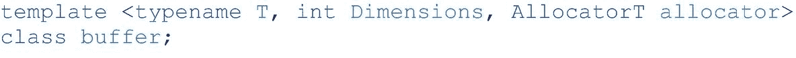
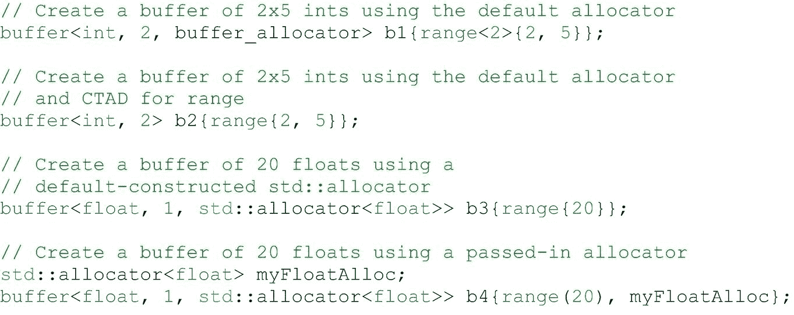
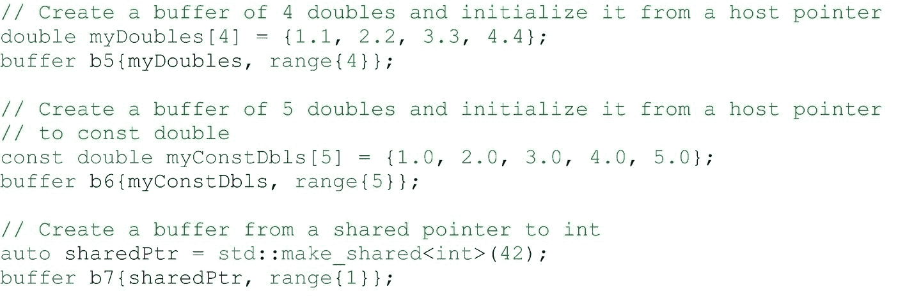
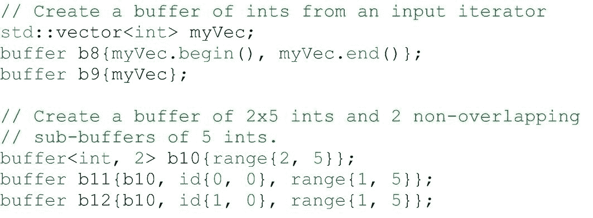
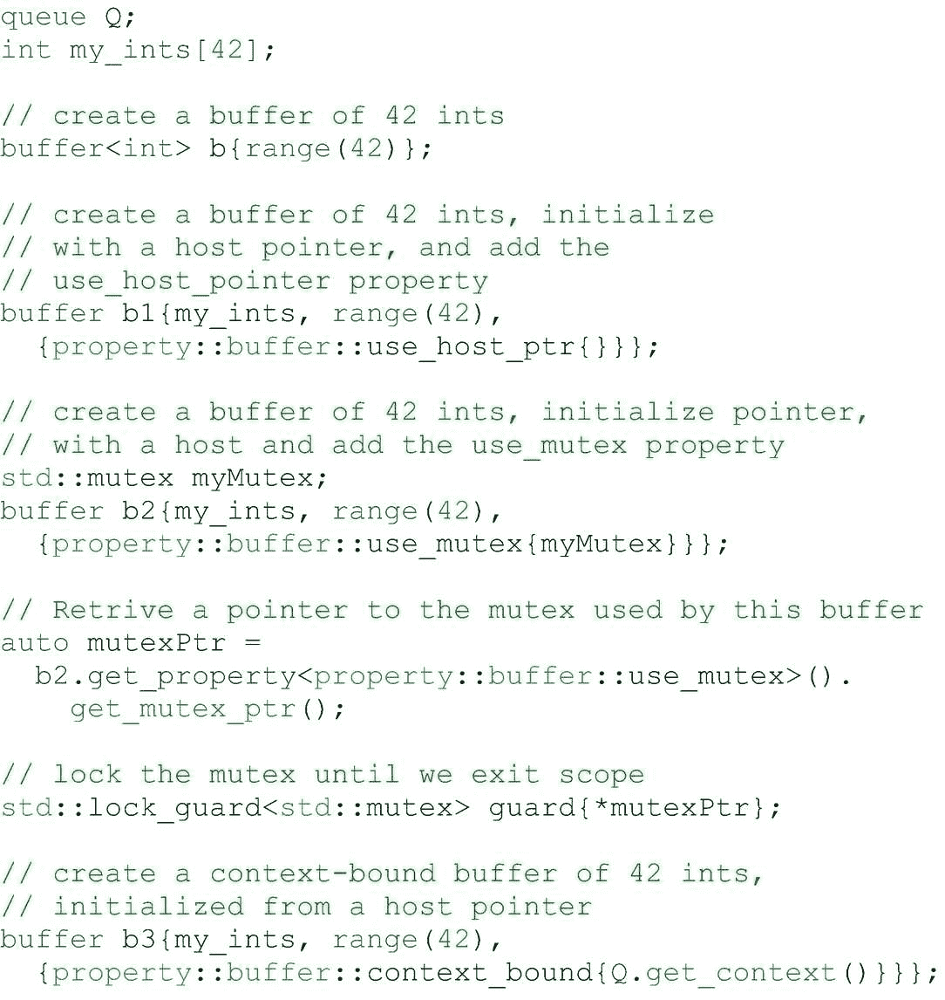
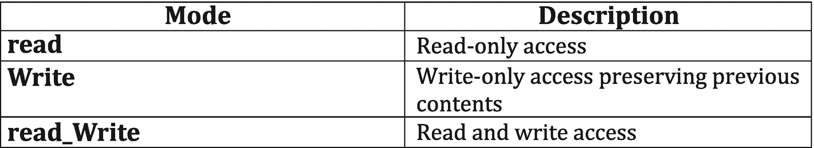
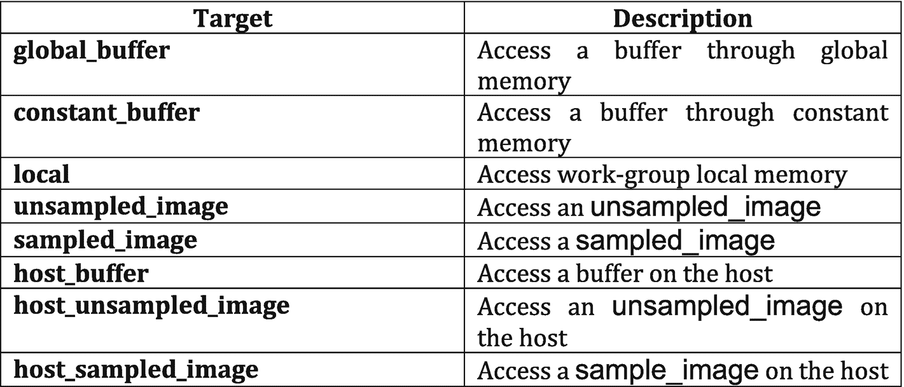
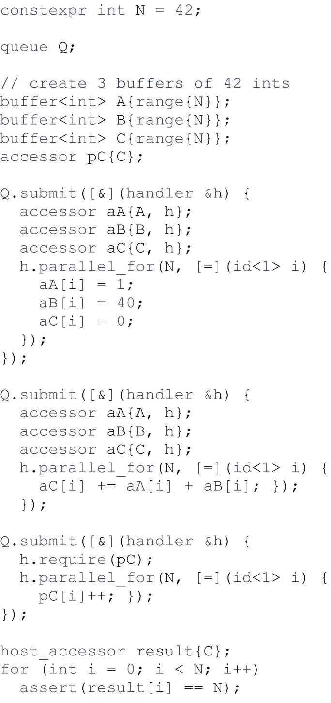
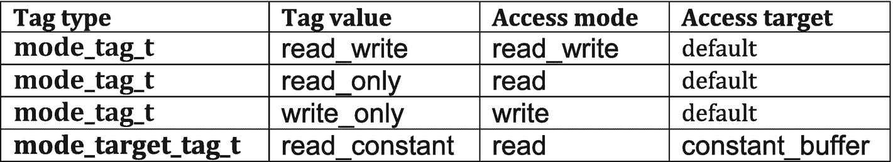
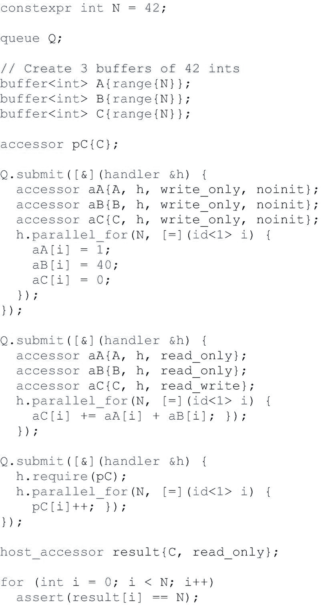

# 7.缓冲

在这一章中，我们将学习缓冲抽象。在前一章中，我们学习了统一共享内存(USM)，这是一种基于指针的数据管理策略。USM 迫使我们思考内存在哪里，什么应该在哪里可以访问。缓冲区抽象是一个更高级的模型，它对程序员隐藏了这一点。缓冲区只是表示数据，管理数据在内存中的存储和移动就成了运行时的工作。

本章介绍了管理数据的另一种方法。缓冲区和 USM 之间的选择通常取决于个人偏好和现有代码的风格，应用程序可以自由混合和匹配这两种风格来表示应用程序中的不同数据。

USM 只是公开了不同的内存抽象。USM 有指针，缓冲区是更高层次的抽象。缓冲区的抽象级别允许在应用程序中的任何设备上使用其中包含的数据，其中运行时管理使数据可用所需的任何内容。选择是好的，所以让我们进入缓冲区。

我们将更仔细地研究如何创建和使用缓冲区。如果不讨论*存取器*，对*缓冲区*的讨论将是不完整的。虽然缓冲区抽象了我们如何在程序中表示和存储数据，但我们并不使用缓冲区直接访问数据。相反，我们使用访问器对象来通知运行时我们打算如何使用我们正在访问的数据，并且访问器与任务图中强大的数据依赖机制紧密耦合。在我们讲述了我们可以用缓冲区做的所有事情之后，我们还将探索如何在我们的程序中创建和使用访问器。

## 缓冲

缓冲区是数据的高级抽象。缓冲区不一定局限于单个位置或虚拟内存地址。实际上，运行时可以自由地使用内存中许多不同的位置(甚至跨不同的设备)来表示一个缓冲区，但是运行时必须确保总是给我们一个一致的数据视图。可以在主机和任何设备上访问缓冲区。

图 7-1

缓冲类定义

`buffer`类是一个模板类，有三个模板参数，如图 [7-1](#Fig1) 所示。第一个模板参数是缓冲区将包含的对象的类型。按照 C++的定义，这个类型必须是可简单复制的，这基本上意味着不使用任何特殊的复制或移动构造函数就可以安全地逐字节复制这个对象。下一个模板参数是一个描述缓冲区维数的整数。最后一个模板参数是可选的，默认值通常是所使用的值。该参数指定了一个 C++风格的分配器类，用于在主机上执行缓冲区所需的任何内存分配。首先，我们将研究创建缓冲区对象的许多方法。

### 创造

在下图中，我们展示了创建缓冲区对象的几种方法。如何在应用程序代码中创建缓冲区的选择是需要如何使用缓冲区和个人编码偏好的组合。让我们浏览一下这个例子，看看每个实例。

图 7-2

创建缓冲区，第 1 部分

我们在图 [7-2](#Fig2) ，`b1`中创建的第一个缓冲区是一个包含十个整数的二维缓冲区。我们显式传递所有模板参数，甚至显式传递默认值`buffer_allocator`作为分配器类型。然而，使用现代 C++，我们可以更简洁地表达这一点。缓冲区`b2`也是一个使用默认分配器的十个整数的二维缓冲区。这里我们利用 C++17 的类模板参数演绎(CTAD)来自动推断我们必须表达的模板参数。CTAD 是一个要么全有要么全无的工具——它要么推断一个类的每个模板参数，要么一个都不推断。在这种情况下，我们使用一个带两个参数的范围来初始化`b2`来推断它是一个二维范围。分配器模板参数有一个默认值，所以我们在创建缓冲区时不需要显式地列出它。

通过 buffer `b3`，我们创建了一个 20 浮点的缓冲区，并使用默认构造的`std:` `:allocator<float>`来分配主机上任何必要的内存。当使用带有缓冲区的自定义分配器类型时，我们通常希望将实际的分配器对象传递给缓冲区来使用，而不是默认构造的分配器对象。Buffer `b4`展示了如何做到这一点，在对其构造函数的调用中，在范围之后获取分配器对象。

对于我们示例中的前四个缓冲区，我们让缓冲区分配它需要的任何内存，并且不在创建它们时用任何值初始化数据。使用缓冲区有效地包装现有的 C++分配是一种常见的模式，这些分配可能已经用数据进行了初始化。我们可以通过将初始值的源传递给缓冲区构造函数来实现这一点。这样做允许我们做几件事，我们将在下一个例子中看到。

图 7-3

创建缓冲区，第 2 部分

在图 [7-3](#Fig3) 中，buffer `b5`创建了一个四个双精度的一维缓冲区。除了指定缓冲区大小的范围之外，我们还将指向 C 数组`myDoubles`的主机指针传递给缓冲区构造函数。这里我们可以充分利用 CTAD 来推断我们缓冲区的所有模板参数。我们传递的主机指针指向 doubles，这给了我们缓冲区的数据类型。维数是从一维范围自动推断出来的，一维范围本身是推断出来的，因为它是用一个数创建的。最后，使用默认的分配器，所以我们不必指定它。

传递一个主机指针有一些我们应该知道的分支。通过传递一个指向主机内存的指针，我们向运行时承诺，在缓冲区的生存期内，我们不会尝试访问主机内存。SYCL 实施不会(也不能)强制执行这一点——我们有责任确保不违反此合同。我们不应该在缓冲区活动时尝试访问该内存的一个原因是，缓冲区可能会选择使用主机上的不同内存来表示缓冲区内容，这通常是出于优化的原因。如果是这样，这些值将从主机指针复制到这个新的内存中。如果后续内核修改了缓冲区，则原始主机指针将不会反映更新后的值，直到某些指定的同步点。在这一章的后面，我们将更多地讨论数据何时被写回主机指针。

缓冲器`b6`与缓冲器`b5`非常相似，但有一个主要区别。这一次，我们用一个指向`const double`的指针初始化缓冲区。这意味着我们只能通过主机指针读取值，而不能写入值。然而，本例中我们的缓冲区类型仍然是`double`，而不是`const double`，因为扣除指南没有考虑`const-` ness。这意味着缓冲区可以被内核写入，但是在缓冲区过期后，我们必须使用不同的机制来更新主机(这将在本章后面讨论)。

也可以使用 C++共享指针对象初始化缓冲区。如果我们的应用程序已经使用了共享指针，这是很有用的，因为这种初始化方法将正确地计算引用，并确保内存不会被释放。Buffer `b7`从单个整数初始化一个缓冲区，并使用共享指针初始化。

图 7-4

创建缓冲区，第 3 部分

容器是现代 C++应用程序中常用的，例子包括`std::array`、`std::vector`、`std::list`或`std::map`。我们可以用两种不同的方式使用容器初始化一维缓冲区。第一种方式，如图 [7-4](#Fig4) 缓冲区`b8`所示，使用输入迭代器。我们将两个迭代器而不是主机指针传递给缓冲区构造函数，一个表示数据的开始，另一个表示结束。缓冲区的大小是通过递增起始迭代器直到它等于结束迭代器返回的元素数来计算的。这对于任何实现 C++ `InputIterator`接口的数据类型都很有用。如果为缓冲区提供初始值的容器对象也是连续的，那么我们可以使用更简单的形式来创建缓冲区。Buffer `b9`通过简单地将向量传递给构造函数来创建一个缓冲区。缓冲区的大小由用来初始化它的容器的大小决定，缓冲区数据的类型来自容器数据的类型。使用这种方法创建缓冲区是常见的，并推荐使用容器，如`std::vector`和`std:` `:array`。

缓冲区创建的最后一个例子说明了 buffer 类的另一个特性。可以从另一个缓冲区或子缓冲区创建一个缓冲区的视图。子缓冲区需要三样东西:对父缓冲区的引用、基索引和子缓冲区的范围。不能从子缓冲区创建子缓冲区。可以从同一个缓冲区创建多个子缓冲区，并且它们可以自由重叠。Buffer `b10`的创建与 buffer `b2`完全一样，是一个二维整数缓冲区，每行有五个整数。接下来，我们从缓冲区`b10`创建两个子缓冲区，子缓冲区`b11`和`b12`。子缓冲器`b11`从索引`(0,0)`开始，包含第一行中的每个元素。类似地，子缓冲区`b12`从索引`(1,0)`开始，包含第二行中的每个元素。这产生了两个不相交的子缓冲器。由于子缓冲区不重叠，不同的内核可以同时在不同的子缓冲区上运行，但是我们将在下一章更多地讨论调度执行图和依赖关系。

图 7-5

缓冲区属性

#### 缓冲区属性

缓冲区也可以用改变其行为的特殊属性来创建。在图 [7-5](#Fig5) 中，我们将浏览三个不同可选缓冲属性的示例，并讨论如何使用它们。请注意，这些属性在大多数代码中相对不常见。

##### 使用主机指针

在缓冲区创建期间，可以选择指定的第一个属性是`use_host_ptr`。当存在时，该属性要求缓冲区不在主机上分配任何内存，并且在缓冲区构造上传递或指定的任何分配器实际上都被忽略。相反，缓冲区必须使用传递给构造函数的主机指针所指向的内存。请注意，这并不要求设备使用相同的内存来保存缓冲区的数据。设备可以自由地将缓冲区的内容缓存到它所连接的内存中。另请注意，该属性只能在将主机指针传递给构造函数时使用。当程序希望完全控制所有主机内存分配时，此选项会很有用。

在图 [7-5](#Fig5) 的例子中，我们创建了一个缓冲区`b`，就像我们在前面的例子中看到的那样。接下来我们创建缓冲区`b1`，并用一个指向`myInts`的指针初始化它。我们还传递属性`use_host_ptr`，这意味着缓冲区`b1`将只使用`myInts`指向的内存，而不会分配任何额外的临时存储。

##### 使用互斥锁

下一个属性`use_mutex`，涉及缓冲区和主机代码之间的细粒度内存共享。缓冲区`b2`是使用这个属性创建的。该属性引用了一个 mutex 对象，稍后可以从缓冲区中查询该对象，如我们在示例中所见。此属性还要求将一个主机指针传递给构造函数，它让运行库确定何时通过提供的主机指针访问主机代码中的更新值是安全的。在运行时保证主机指针看到缓冲区的最新值之前，我们不能锁定互斥体。虽然这可以与`use_host_ptr`属性合并，但这不是必需的。`use_mutex`是一种机制，允许主机代码在缓冲区仍然存在时访问缓冲区内的数据，而不使用主机访问器机制(稍后描述)。一般来说，除非我们有特定的理由使用互斥体，否则应该首选主机访问器机制，特别是因为无法保证在成功锁定互斥体和数据准备好供主机代码使用之前需要多长时间。

##### 上下文绑定

在我们的示例中，最后一个属性显示在缓冲区`b3`的创建中。这里，我们的 42 个整数的缓冲区是用`context_bound`属性创建的。属性采用对上下文对象的引用。通常，缓冲区可以在任何设备或上下文中自由使用。但是，如果使用此属性，它会将缓冲区锁定到指定的上下文。试图在另一个上下文中使用缓冲区将导致运行时错误。例如，通过识别内核可能被提交到错误队列的情况，这对于调试程序可能是有用的。实际上，我们并不期望在许多程序中使用这个属性，缓冲区在任何上下文中的任何设备上被访问的能力是缓冲区抽象的最强大的属性之一(这个属性撤销了这个属性)。

### 我们能用缓冲器做什么？

使用缓冲区对象可以做很多事情。我们可以查询缓冲区的特征，确定在缓冲区被破坏后是否有任何数据被写回主机内存以及在哪里，或者将缓冲区重新解释为具有不同特征的缓冲区。然而，有一件事是不能做的，那就是直接访问缓冲区所代表的数据。相反，我们必须创建访问器对象来访问数据，我们将在本章的后面了解这一点。

可以对缓冲区进行查询的示例包括它的范围、它所代表的数据元素的总数以及存储其元素所需的字节数。我们还可以查询缓冲区正在使用哪个分配器对象，以及该缓冲区是否是子缓冲区。

当缓冲区被破坏时更新主机内存是使用缓冲区时要考虑的一个重要方面。根据缓冲区的创建方式，在缓冲区销毁后，主机内存可能会更新，也可能不会更新计算结果。如果从指向非`const`数据的主机指针创建并初始化缓冲区，则当缓冲区被销毁时，用更新的数据更新该指针。然而，还有一种方法可以更新主机内存，而不管缓冲区是如何创建的。`set_final_data`方法是`buffer`的模板方法，可以接受原始指针、C++ `OutputIterator`或`std::weak_ptr`。当缓冲区被销毁时，缓冲区包含的数据将使用提供的位置写入主机。注意，如果缓冲区是从指向非`const`数据的主机指针创建和初始化的，就好像用那个指针调用了`set_final_data`。从技术上讲，原始指针是`OutputIterator`的特例。如果传递给`set_final_data`的参数是一个`std::weak_ptr`，如果指针已经过期或已经被删除，数据不会被写入主机。是否发生写回也可以由`set_write_back`方法控制。

## 附件

由缓冲区表示的数据不能通过缓冲区对象直接访问。相反，我们必须创建允许我们安全访问缓冲区数据的访问器对象。访问器通知运行时我们希望在哪里以及如何访问数据，允许运行时确保正确的数据在正确的时间位于正确的位置。这是一个非常强大的概念，尤其是当与部分基于数据依赖性来调度内核执行的任务图结合使用时。

访问器对象是从模板化的`accessor`类实例化的。这个类有五个模板参数。第一个参数是被访问数据的类型。这应该与相应缓冲区存储的数据类型相同。类似地，第二个参数描述了数据和缓冲区的维度，默认值为 1。

图 7-6

访问模式

接下来的三个模板参数是访问者独有的。第一个是*访问模式*。访问模式描述了我们打算如何在程序中使用访问器。图 [7-6](#Fig6) 中列出了可能的模式。我们将在第 [8](08.html#b978-1-4842-5574-2_8) 章中学习如何使用这些模式来命令内核的执行和执行数据移动。如果没有指定或自动推断，则访问模式参数有默认值。如果我们没有另外指定，对于非`const`数据类型，访问器将默认为`read_write`访问模式，对于`const`数据类型，访问器将默认为`read`。这些默认值总是正确的，但是提供更准确的信息可能会提高运行时执行优化的能力。在开始应用程序开发时，简单地不指定访问模式是安全和简洁的，然后我们可以基于对应用程序的性能关键区域的分析来细化访问模式。

图 7-7

访问目标

下一个模板参数是*访问目标*。缓冲区是数据的抽象，并不描述数据存储在哪里以及如何存储。访问目标描述了我们正在访问什么类型的数据，以及哪个内存将包含这些数据。图 [7-7](#Fig7) 中列出了可能的访问目标。数据类型是两种类型之一:缓冲区或图像。本书中讨论了图像，但我们可以将它们视为专用缓冲区，为图像处理提供特定于域的操作。

访问目标的另一个方面是我们应该关注的。设备可能有不同类型的可用存储器。这些存储器由不同的地址空间表示。最常用的内存类型是设备的全局内存。内核中的大多数访问器将使用这个目标，所以 global 是默认目标(如果我们没有指定)。常量和本地缓冲区使用专用内存。顾名思义，常量内存用于存储在内核调用期间保持不变的值。本地内存是一个工作组可用的特殊内存，其他工作组无法访问。我们将在第 9 章中学习如何使用本地内存。另一个值得注意的目标是主机缓冲区，这是访问主机上的缓冲区时使用的目标。这个模板参数的默认值是`global_buffer`，所以在大多数情况下，我们不需要在代码中指定目标。

最后一个模板参数决定了一个访问器是否是一个*占位符*访问器。这不是一个程序员可能会直接设置的参数。占位符访问器是在命令组之外声明的，但是用于访问内核内部设备上的数据。一旦我们看了访问器创建的例子，我们将看到占位符访问器和非占位符访问器的区别。

虽然可以使用缓冲区对象的`get_access`方法从缓冲区对象中提取访问器，但是直接创建(构造)它们更简单。这是我们将在接下来的例子中使用的风格，因为它很容易理解，也很简洁。

### 访问者创建

图 [7-8](#Fig8) 显示了一个示例程序，其中包含了我们开始使用访问器所需的一切。在这个例子中，我们有三个缓冲器，`A`、`B`和`C`。我们提交给队列的第一个任务是为每个缓冲区创建访问器，并定义一个内核，使用这些访问器用一些值初始化缓冲区。每个访问器都是用它将访问的缓冲区的引用以及由我们提交给队列的命令组定义的处理程序对象来构造的。这有效地将访问器绑定到我们作为命令组的一部分提交的内核。常规访问器是设备访问器，因为默认情况下，它们的目标是存储在设备内存中的全局缓冲区。这是最常见的用例。

图 7-8

简单的访问器创建

我们提交的第二个任务也定义了三个缓冲区的访问器。然后我们在第二个内核中使用这些访问器将缓冲区`A`和`B`的元素添加到缓冲区`C`中。由于第二个任务与第一个任务操作相同的数据，运行时将在第一个任务完成后执行该任务。我们将在下一章详细了解这一点。

第三个任务展示了如何使用占位符访问器。在我们创建了缓冲区之后，访问器`pC`在图 [7-8](#Fig8) 中的例子的开头被声明。请注意，没有向构造函数传递 handler 对象，因为我们没有要传递的对象。这让我们可以提前创建一个可重用的访问器对象。然而，为了在内核中使用这个访问器，我们需要在提交期间将它绑定到一个命令组。我们使用处理程序对象的`require`方法来完成这项工作。一旦我们将占位符访问器绑定到命令组，我们就可以像使用其他访问器一样在内核中使用它。

最后，我们创建一个`host_accessor`对象，以便在主机上读取我们的计算结果。请注意，这与我们在内核中使用的类型不同。主机访问器使用一个单独的`host_accessor`类来允许正确推断模板参数，提供一个简单的接口。请注意，本例中的主机访问器`result`也没有处理程序对象，因为我们也没有传递对象。主机访问器的特殊类型也让我们能够将它们与占位符区分开来。主机访问器的一个重要方面是，构造函数仅在数据可供主机使用时才完成，这意味着主机访问器的构造可能需要很长时间。构造函数必须等待任何产生要复制的数据的内核完成执行，以及等待复制本身完成。一旦主机访问器构造完成，就可以安全地在主机上直接使用它所访问的数据，并且我们可以保证在主机上获得最新版本的数据。

虽然这个例子是完全正确的，但是我们并没有说我们在创建访问器时打算如何使用它们。相反，我们对缓冲区中的非`const int`数据使用默认访问模式`read-write`。这可能会过度保守，并且可能会在操作之间创建不必要的依赖关系或多余的数据移动。如果一个运行时有更多关于我们计划如何使用我们创建的访问器的信息，它可能会做得更好。然而，在我们看一个这样做的例子之前，我们应该首先介绍另一个工具——访问标记。

访问标记是表达访问者所需的访问模式和目标组合的一种简洁方式。使用时，访问标记作为参数传递给访问器的构造函数。可能的标签如图 [7-9](#Fig9) 所示。当用标记参数构造访问器时，C++ CTAD 可以正确地推导出所需的访问模式和目标，提供了一种简单的方法来覆盖那些模板参数的默认值。我们也可以手动指定所需的模板参数，但是标记提供了一种更简单、更紧凑的方式来获得相同的结果，而无需拼写出完全模板化的访问器。

图 7-9

访问标签

让我们以前面的例子为例，重写它以添加访问标记。这个新的改进示例如图 [7-10](#Fig10) 所示。

图 7-10

使用指定的用法创建访问者

我们首先声明我们的缓冲区，如图 [7-8](#Fig8) 所示。我们还创建了占位符访问器，我们将在后面使用。现在让我们看看提交给队列的第一个任务。以前，我们通过传递对命令组的缓冲区和处理程序对象的引用来创建我们的访问器。现在，我们向构造函数调用添加两个额外的参数。第一个新参数是访问标记。因为这个内核正在为我们的缓冲区写初始值，所以我们使用了`write_only`访问标记。这让运行时知道这个内核正在产生新的数据，并且不会从缓冲区中读取。

第二个新参数是一个可选的访问器属性，类似于我们在本章前面看到的缓冲区的可选属性。我们传递的属性`noinit`让运行时知道缓冲区中以前的内容可以被丢弃。这很有用，因为它可以让运行时消除不必要的数据移动。在这个例子中，因为第一个任务是为我们的缓冲区写初始值，所以运行时没有必要在内核执行之前将未初始化的主机内存复制到设备上。`noinit`属性在这个例子中很有用，但是它不应该用于读-修改-写的情况，也不应该用于只能更新缓冲区中某些值的内核。

我们提交给队列的第二个任务与之前相同，但是现在我们向我们的访问器添加了访问标记。这里，我们给访问器`aA`和`aB`添加标签`read_only`，让运行时知道我们将只通过这些访问器读取缓冲区`A`和`B`的值。第三个访问器`aC`获得`read_write`访问标记，因为我们将`A`和`B`的元素之和累加到`C`中。我们在示例中显式地使用标签来保持一致，但是这是不必要的，因为默认的访问模式是`read_write`。

默认用法保留在第三个任务中，在这里我们使用占位符访问器。这与我们在图 [7-8](#Fig8) 中看到的简化示例保持不变。我们的最后一个访问器，主机访问器`result`，现在在我们创建它时会收到一个访问标记。因为我们只读取主机上的最终值，所以我们将`read_only`标记传递给构造函数。如果我们以破坏主机访问器的方式重写程序，启动另一个在缓冲区`C`上运行的内核不需要将它写回设备，因为`read_only`标签让运行时知道它不会被主机修改。

### 我们可以用访问器做什么？

使用访问器对象可以完成许多事情。然而，我们能做的最重要的事情是在访问器的名字中拼写出来——访问数据。这通常是通过访问器的`[]`操作符来完成的。我们在图 [7-8](#Fig8) 和 [7-10](#Fig10) 的示例中使用了`[]`操作符。这个操作符要么接受一个可以正确索引多维数据的`id`对象，要么接受一个`size_t`。当访问者有多个维度时，使用第二种情况。它返回一个对象，然后用`[]`再次索引该对象，直到我们得到一个标量值，这在二维情况下将是`a[i][j]`的形式。请记住，访问器维度的排序遵循 C++的约定，其中最右边的维度是单位步长维度(迭代“最快”)。

访问器还可以返回指向基础数据的指针。这个指针可以按照正常的 C++规则直接访问。注意，关于这个指针的地址空间，可能涉及额外的复杂性。地址空间和它们的怪癖将在后面的章节中讨论。

许多东西也可以从访问器对象中查询。示例包括通过访问器可访问的元素数量、它所覆盖的缓冲区区域的字节大小或可访问的数据范围。

访问器为 C++容器提供了一个类似的接口，可以在许多容器被传递的情况下使用。访问器支持的容器接口包括`data`方法，相当于`get_pointer`，以及几种向前和向后迭代器。

## 摘要

在本章中，我们已经学习了缓冲区和存取器。缓冲区是对数据的抽象，它对程序员隐藏了内存管理的底层细节。他们这样做是为了提供一个更简单、更高层次的抽象。我们通过几个例子向我们展示了构造缓冲区的不同方法，以及可以被指定来改变它们的行为的不同可选属性。我们学习了如何用来自主机内存的数据初始化缓冲区，以及如何在使用完缓冲区时将数据写回主机内存。

因为我们不应该直接访问缓冲区，所以我们学习了如何使用访问器对象来访问缓冲区中的数据。我们了解了设备访问器和主机访问器之间的区别。我们讨论了不同的访问模式和目标，以及它们如何通知运行时程序将如何以及在哪里使用访问器。我们展示了使用默认访问模式和目标来使用访问器的最简单方法，并且我们学习了如何区分占位符访问器和非占位符访问器。然后，我们看到了如何通过向我们的访问器声明添加访问标记，为运行时提供更多关于我们的访问器用法的信息，从而进一步优化示例程序。最后，我们讨论了在程序中使用访问器的许多不同方式。

在下一章，我们将更详细地了解运行时如何使用我们通过访问器给它的信息来调度不同内核的执行。我们还将了解这些信息如何通知运行时缓冲区中的数据何时以及如何需要在主机和设备之间复制。我们将了解如何显式控制涉及缓冲区的数据移动——以及 USM 分配。

 

**开放存取**本章根据知识共享署名 4.0 国际许可证(http://Creative Commons . org/licenses/by/4.0/)的条款获得许可，该许可证允许以任何媒体或格式使用、共享、改编、分发和复制，只要您适当注明原作者和来源，提供知识共享许可证的链接并指明是否进行了更改。

本章中的图像或其他第三方材料包含在本章的知识共享许可中，除非在材料的信用额度中另有说明。如果材料不包括在本章的知识共享许可中，并且您的预期使用不被法律法规允许或超出了允许的使用范围，您将需要直接从版权所有者处获得许可。