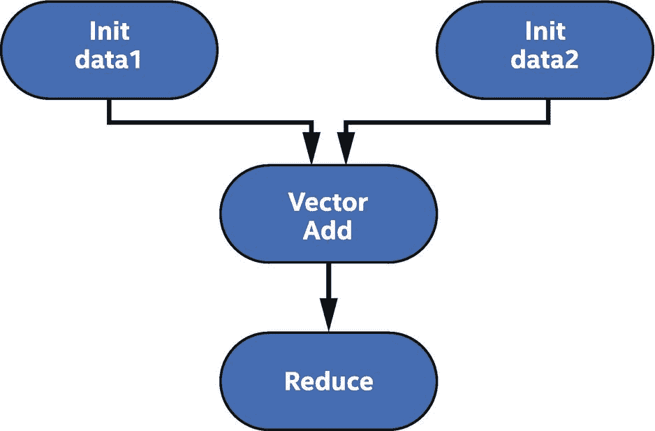
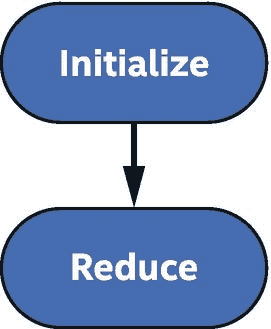
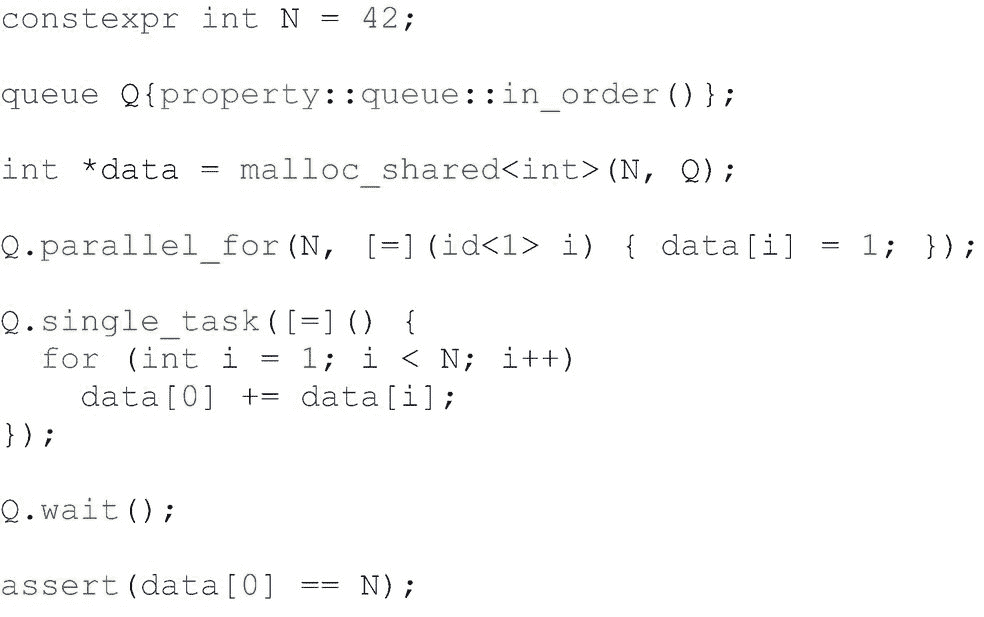
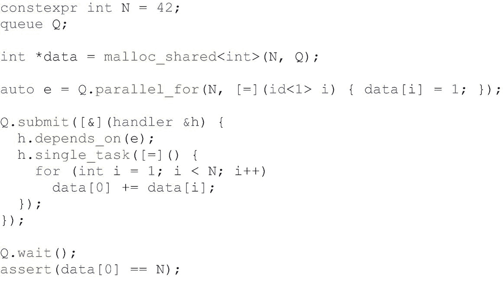
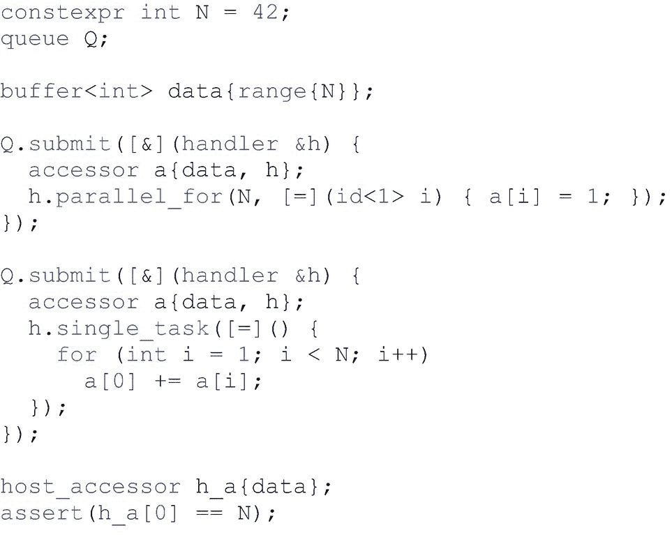
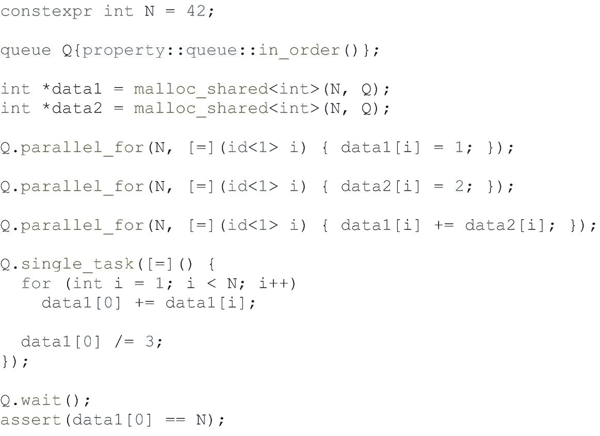
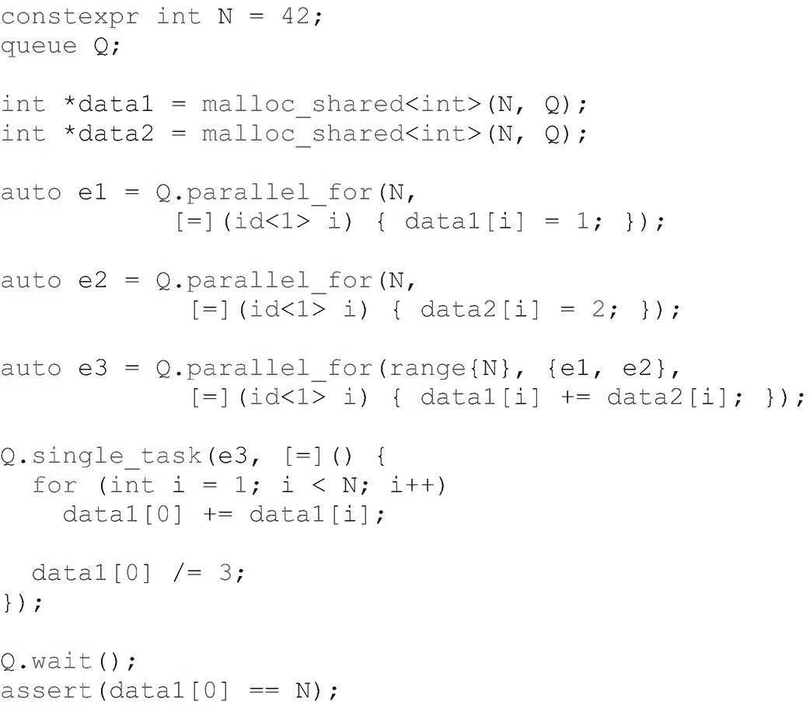

# 8.调度内核和数据移动

我们需要讨论一下我们作为平行项目的音乐会指挥的角色。并行程序的适当编排是一件美妙的事情——代码全速运行而不等待数据，因为我们已经安排所有数据在适当的时间到达和离开。代码分解良好，以保持硬件最大限度地忙碌。这是构成梦想的东西！

快车道上的生活——不仅仅是一条车道！—要求我们认真对待指挥工作。为了做到这一点，我们可以根据任务图来考虑我们的工作。

因此，在这一章中，我们将讨论任务图，这种机制用于正确有效地运行复杂的内核序列。在应用程序中有两件事情需要排序:内核和数据移动。任务图是我们用来实现正确排序的机制。

首先，我们将快速回顾如何使用依赖关系来排序第 [3](03.html#b978-1-4842-5574-2_3) 章中的任务。接下来，我们将介绍 DPC++ 运行时如何构建图形。我们将讨论 DPC++ 图形的基本构件，命令组。然后，我们将举例说明构建常见模式图的不同方法。我们还将讨论数据移动，无论是显式的还是隐式的，是如何在图中表示的。最后，我们将讨论使我们的图表与主机同步的各种方法。

## 什么是图表调度？

在第 3 章中，我们讨论了数据管理和数据使用的排序。那一章描述了 DPC++ 中图形背后的关键抽象:依赖性。内核之间的依赖关系基本上是基于内核访问的数据。内核在计算输出之前需要确定它读取了正确的数据。

我们描述了对确保正确执行很重要的三种类型的数据依赖。第一种是写后读(RAW ),发生在一个任务需要读取另一个任务产生的数据时。这种类型的依赖描述了两个内核之间的数据流。第二种依赖发生在一个任务需要在另一个任务读取数据后更新数据的时候。我们称这种类型的依赖为读后写(WAR)依赖。最后一种类型的数据依赖发生在两个任务试图写入相同的数据时。这就是所谓的写后写(WAW)依赖性。

数据相关性是我们用来构建图表的基础。这组依赖关系是我们表达简单的线性核链和具有数百个具有复杂依赖关系的核的大型复杂图所需要的全部。无论计算需要哪种类型的图，DPC++ 图都可以确保程序根据所表达的依赖关系正确执行。然而，确保一个图正确地表达程序中的所有依赖关系是程序员的责任。

## 图形如何在 DPC++ 中工作

一个命令组可以包含三种不同的东西:一个动作、它的依赖项和各种各样的主机代码。在这三件事情中，最需要的是行动，因为没有它，指挥组真的什么也做不了。大多数命令组也会表达依赖性，但也有不表达的情况。一个这样的例子是在程序中提交的第一个动作。它不依赖于任何东西来开始执行；因此，我们不会指定任何依赖关系。命令组中可能出现的另一个东西是在主机上执行的任意 C++ 代码。这是完全合法的，并且有助于指定动作或其依赖项，并且在创建命令组时执行该代码(而不是在基于已满足的依赖项执行动作时)。

命令组通常表示为传递给 submit 方法的 C++ lambda 表达式。命令组也可以通过队列对象上的快捷方式来表达，队列对象采用一个内核和一组基于事件的依赖关系。

### 命令组操作

命令组可以执行两种类型的操作:内核和显式内存操作。一个命令组只能执行一个动作。正如我们在前面章节中看到的，内核是通过调用`parallel_for`或`single_task`方法来定义的，并表达我们想要在设备上执行的计算。显式数据移动操作是第二种类型的操作。USM 的例子包括`memcpy`、`memset`和`fill`操作。缓冲器的例子包括`copy`、`fill`和`update_host`。

### 命令组如何声明依赖关系

命令组的另一个主要组成部分是在组定义的动作可以执行之前必须满足的依赖集。DPC++ 允许以多种方式指定这些依赖关系。

如果程序使用有序 DPC++ 队列，队列的有序语义指定连续排队的命令组之间的隐式依赖关系。在之前提交的任务完成之前，一个任务无法执行。

基于事件的依赖性是指定在命令组可以执行之前必须完成什么的另一种方式。这些基于事件的依赖性可以用两种方式来指定。当命令组被指定为传递给队列的`submit`方法的 lambda 时，使用第一种方法。在这种情况下，程序员调用命令组处理程序对象的`depends_on`方法，将事件或事件向量作为参数传递。当从队列对象上定义的快捷方法创建命令组时，使用另一种方法。当程序员直接调用队列上的`parallel_for`或`single_task`时，事件或事件向量可能会作为额外的参数传递。

指定依赖关系的最后一种方法是通过创建访问器对象。访问器指定如何使用它们在缓冲区对象中读取或写入数据，让运行时使用这些信息来确定不同内核之间存在的数据依赖关系。正如我们在本章开始时所回顾的，数据依赖的例子包括一个内核读取另一个内核产生的数据，两个内核写入相同的数据，或者一个内核在另一个内核读取数据后修改数据。

### 例子

现在，我们将用几个例子来说明我们刚刚学到的一切。我们将展示如何用几种方式表达两种不同的依赖模式。我们将说明的两种模式是线性依赖链，其中一个任务在另一个任务之后执行，以及“Y”模式，其中两个独立的任务必须在连续的任务之前执行。

这些依赖模式的图表可以在图 [8-1](#Fig1) 和 [8-2](#Fig2) 中看到。图 [8-1](#Fig1) 描绘了一个线性依赖链。第一个节点表示数据的初始化，而第二个节点表示将数据累积到单个结果中的归约操作。图 [8-2](#Fig2) 描绘了一个“Y”模式，我们独立地初始化两个不同的数据。数据初始化后，加法核将把两个向量加在一起。最后，图中的最后一个节点将结果累积成一个值。

图 8-2

“Y”型依赖图

图 8-1

线性相关链图

对于每种模式，我们将展示三种不同的实现。第一个实现将使用有序队列。第二种将使用基于事件的依赖关系。最后一个实现将使用缓冲区和存取器来表达命令组之间的数据依赖性。

图 [8-3](#Fig3) 显示了如何使用有序队列表达线性依赖链。这个例子非常简单，因为有序队列的语义已经保证了命令组之间的执行顺序。我们提交的第一个内核将数组的元素初始化为 1。然后，下一个内核获取这些元素，并将它们汇总到第一个元素中。因为我们的队列是有序的，所以我们不需要做任何其他事情来表示第二个内核应该在第一个内核完成之前不执行。最后，我们等待队列执行完所有任务，并检查我们是否获得了预期的结果。

图 8-3

具有有序队列的线性相关链

图 [8-4](#Fig4) 显示了使用无序队列和基于事件的依赖关系的相同例子。这里，我们捕获第一次调用`parallel_for`返回的事件。然后，第二个内核能够通过将它作为参数传递给`depends_on`来指定对该事件及其所代表的内核执行的依赖。我们将在图 [8-6](#Fig6) 中看到如何使用定义内核的快捷方法之一来缩短第二个内核的表达式。

图 8-4

事件线性相关链

图 [8-5](#Fig5) 使用缓冲区和存取器代替 USM 指针重写了我们的线性依赖链示例。这里我们再次使用无序队列，但是使用通过访问器指定的数据依赖关系，而不是基于事件的依赖关系来排序命令组的执行。第二个内核读取第一个内核产生的数据，运行时可以看到这一点，因为我们基于相同的底层缓冲区对象声明了访问器。与前面的例子不同，我们不等待队列执行完所有任务。相反，我们声明一个主机访问器，它定义了第二个内核的输出和我们的断言(我们在主机上计算了正确的答案)之间的数据依赖关系。请注意，虽然主机访问器为我们提供了主机上数据的最新视图，但它并不保证原始主机内存已经更新(如果在创建缓冲区时指定了任何内存)。我们不能安全地访问原始主机内存，除非缓冲区首先被破坏，或者除非我们使用更高级的机制，如第 [7](07.html#b978-1-4842-5574-2_7) 章中描述的互斥机制。

图 8-5

具有缓冲器和附件的线性相关链

图 [8-6](#Fig6) 显示了如何使用有序队列表达一个“Y”模式。在这个例子中，我们声明了两个数组，`data1`和`data2`。然后我们定义两个内核，每个内核初始化一个数组。这些内核并不相互依赖，但是因为队列是有序的，所以内核必须一个接一个地执行。注意，在这个例子中交换这两个内核的顺序是完全合法的。在第二个内核执行之后，第三个内核将第二个数组的元素添加到第一个数组的元素中。最终的内核将第一个数组的元素相加，计算出与我们在线性依赖链的例子中相同的结果。这个求和核依赖于前面的核，但是这个线性链也被有序队列捕获。最后，我们等待所有内核完成，并验证我们成功地计算了我们的幻数。

图 8-6

具有有序队列的“Y”型模式

图 [8-7](#Fig7) 显示了我们的“Y”模式示例，使用无序队列代替有序队列。由于队列的顺序，依赖性不再是隐式的，我们必须使用事件显式地指定命令组之间的依赖性。如图 [8-6](#Fig6) 所示，我们从定义两个没有初始依赖关系的独立内核开始。我们用两个事件来表示这些内核，`e1`和`e2`。当我们定义第三个内核时，我们必须指定它依赖于前两个内核。我们这样做是因为它依赖于事件`e1`和`e2`在执行之前完成。然而，在这个例子中，我们使用一种快捷方式来指定这些依赖关系，而不是处理程序的`depends_on`方法。这里，我们将事件作为额外参数传递给`parallel_for`。因为我们想一次传递多个事件，所以我们使用接受一个`std::vector`事件的表单，但是幸运的是，现代 C++ 通过自动将表达式`{e1, e2}`转换成适当的向量，为我们简化了这个过程。

图 8-7

事件的“Y”型模式

在我们最后的例子中，如图 [8-8](#Fig8) 所示，我们再次用缓冲区和访问器替换 USM 指针和事件。这个例子将两个数组`data1`和`data2`表示为缓冲对象。我们的内核不再使用快捷方式来定义内核，因为我们必须将访问器与命令组处理程序相关联。同样，第三个内核必须捕获对前两个内核的依赖。在这里，这是通过为我们的缓冲区声明访问器来实现的。因为我们之前已经为这些缓冲区声明了访问器，所以运行时能够正确地排序这些内核的执行。此外，当我们声明访问器`b`时，我们还在这里向运行时提供额外的信息。我们添加了访问标签`read_only`来让运行时知道我们只是要读取这些数据，而不是产生新的值。正如我们在线性依赖链的缓冲区和存取器示例中看到的，我们的最终内核通过更新第三个内核中产生的值来进行自我排序。我们通过声明一个主机访问器来检索我们计算的最终值，该主机访问器将等待最终内核完成执行，然后将数据移回主机，在那里我们可以读取数据并断言我们计算了正确的结果。

图 8-8

带存取器的“Y”型模式

### CG 的各个部分是什么时候执行的？

因为任务图是异步的，所以想知道命令组何时被执行是有意义的。到目前为止，应该很清楚，一旦满足了内核的依赖性，就可以执行内核，但是命令组的主机部分会发生什么情况呢？

当一个命令组被提交到一个队列时，它会立即在主机上执行(在`submit`调用返回之前)。命令组的主机部分只执行一次。命令组中定义的任何内核或显式数据操作都将在设备上排队等待执行。

## 数据传送

数据移动是 DPC++ 中图形的另一个非常重要的方面，对于理解应用程序性能至关重要。但是，如果数据移动是在程序中隐式发生的，无论是使用缓冲区和访问器还是使用 USM 共享分配，这一点经常会被意外忽略。接下来，我们将研究在 DPC++ 中数据移动影响图形执行的不同方式。

### 明确的

显式数据移动的优点是它在图中显式地出现，让程序员清楚地看到图的执行过程。我们将把显式数据操作分为 USM 操作和缓冲区操作。

正如我们在第 [6 章](06.html#b978-1-4842-5574-2_6)中了解到的，当我们需要在设备分配和主机之间拷贝数据时，USM 中会发生显式数据移动。这是通过在队列和处理程序类中都可以找到的`memcpy`方法来完成的。提交操作或命令组会返回一个事件，该事件可用于与其他命令组一起订购副本。

通过调用命令组处理程序对象的`copy`或`update_host`方法，使用缓冲区进行显式数据移动。`copy`方法可用于在主机内存和设备上的访问器对象之间手动交换数据。这样做有多种原因。一个简单的例子是对长时间运行的计算序列进行检查点操作。使用拷贝方法，数据可以以单向方式从设备写入任意主机内存。如果这是使用缓冲区完成的，大多数情况下(即缓冲区不是用`use_host_ptr`创建的)需要先将数据复制到主机，然后从缓冲区的存储器复制到所需的主机存储器。

`update_host`方法是`copy`的一种非常特殊的形式。如果在主机指针周围创建了缓冲区，此方法会将访问器表示的数据复制回原始主机内存。如果一个程序用一个用特殊的`use_mutex`属性创建的缓冲区手动同步主机数据，这可能是有用的。然而，这种用例不太可能在大多数程序中出现。

### 隐形的

隐式数据移动可能会对 DPC++ 中的命令组和任务图产生隐藏的后果。通过隐式数据移动，数据通过 DPC++ 运行时或硬件和软件的某种组合在主机和设备之间复制。在任一情况下，复制都是在没有用户明确输入的情况下进行的。让我们再次分别看一下 USM 和 buffer 案例。

使用 USM，隐式数据移动随着`host`和`shared`分配而发生。正如我们在第 [6](06.html#b978-1-4842-5574-2_6) 章中了解到的，`host`分配并不真正移动数据，而是远程访问数据，`shared`分配可能会在主机和设备之间迁移。因为这种迁移是自动发生的，所以 USM 隐式数据移动和命令组真的没有什么可考虑的。然而，关于`shared`的分配有一些细微差别值得记住。

`prefetch`操作的工作方式与`memcpy`相似，目的是让运行时在内核尝试使用共享分配之前开始迁移它们。然而，与为了确保正确结果而必须复制数据的`memcpy`不同，预取通常被视为对运行时的*提示*以提高性能，并且预取不会使内存中的指针值无效(就像复制到新的地址范围时的复制一样)。如果在内核开始执行之前预取没有完成，程序仍将正确执行，并且许多代码可能选择使图形中的命令组不依赖于预取操作，因为它们不是功能需求。

缓冲区也有一些细微差别。使用缓冲区时，命令组必须为缓冲区构造指定如何使用数据的访问器。这些数据依赖关系表达了不同命令组之间的顺序，并允许我们构建任务图。然而，带有缓冲区的命令组有时还有另一个用途:它们指定数据移动的要求。

访问器指定内核将读取或写入缓冲区。由此得出的推论是，数据也必须在设备上可用，如果不可用，运行时必须在内核开始执行之前将数据转移到设备上。因此，DPC++ 运行时必须跟踪缓冲区的当前版本，以便可以调度数据移动操作。访问器创建有效地在图中创建了一个额外的隐藏节点。如果数据移动是必要的，运行时必须首先执行它。只有这样，提交的内核才能执行。

让我们再看看图 [8-8](#Fig8) 。在这个例子中，我们的前两个内核需要将缓冲区`data1`和`data2`复制到设备中；运行时隐式创建额外的图形节点来执行数据移动。当提交第三个内核的命令组时，这些缓冲区很可能仍然在设备上，因此运行时不需要执行任何额外的数据移动。第四个内核的数据也可能不需要任何额外的数据移动，但是主机访问器的创建需要运行时在访问器可用之前安排将缓冲区`data1`移回主机。

## 与主机同步

我们将讨论的最后一个主题是如何与主机同步图形执行。我们已经在这一章中谈到了这一点，但是我们现在将检查一个程序可以做到这一点的所有不同方式。

主机同步的第一种方法是我们在前面的许多例子中使用过的:等待一个队列。队列对象有两个方法，`wait`和`wait_and_throw`，它们阻塞执行，直到提交给队列的每个命令组都完成为止。这是一个非常简单的方法，可以处理许多常见的情况。但是，值得指出的是，这种方法是非常粗粒度的。如果需要更细粒度的同步，我们将讨论的另一种方法可能更适合应用程序的需求。

主机同步的下一种方法是对事件进行同步。这比同步队列更加灵活，因为它允许应用程序只同步特定的操作或命令组。这是通过调用事件上的`wait`方法或者调用事件类上的静态方法`wait`来完成的，后者可以接受事件的向量。

我们已经看到了图 [8-5](#Fig5) 和 [8-8](#Fig8) 中使用的下一个方法:主机访问器。主机访问者执行两个功能。首先，顾名思义，它们使主机上的数据可供访问。第二，它们通过在当前访问的图和主机之间定义新的依赖关系来与主机同步。这确保了复制回主机的数据是图形正在执行的计算的正确值。但是，我们再次注意到，如果缓冲区是从现有的主机内存中构造的，则不能保证这个原始内存包含更新后的值。

请注意，主机访问者正在阻塞。在数据可用之前，主机上的执行可能不会超过主机访问器的创建。同样，当主机访问器存在并保持其数据可用时，不能在设备上使用缓冲区。一种常见的模式是在附加的 C++ 范围内创建主机访问器，以便在不再需要主机访问器时释放数据。这是下一种主机同步方法的示例。

DPC++ 中的某些对象在被销毁时有特殊的行为，它们的析构函数被调用。我们刚刚了解了主机访问者如何使数据保留在主机上，直到它们被销毁。缓冲区和图像在被销毁或离开作用域时也有特殊的行为。当一个缓冲区被销毁时，它会等待所有使用该缓冲区的命令组完成执行。一旦缓冲区不再被任何内核或内存操作使用，运行时可能必须将数据复制回主机。如果缓冲区是用主机指针初始化的，或者如果主机指针被传递给方法`set_final_data`，就会发生这种复制。然后，运行库将复制回该缓冲区的数据，并在对象被销毁之前更新主机指针。

与主机同步的最后一个选项涉及一个在第 [7](07.html#b978-1-4842-5574-2_7) 章中首次描述的不常见功能。回想一下，缓冲区对象的构造器可以选择接受一个属性列表。创建缓冲区时可以传递的有效属性之一是`use_mutex`。当以这种方式创建缓冲区时，它增加了缓冲区所拥有的内存可以与宿主应用程序共享的要求。对这个内存的访问是由用来初始化缓冲区的互斥体控制的。当访问与缓冲区共享的内存是安全的时，主机能够获得互斥锁。如果无法获得锁，用户可能需要将内存移动操作排入队列，以便与主机同步数据。这种用法非常特殊，不太可能在大多数 DPC++ 应用程序中找到。

## 摘要

在这一章中，我们已经学习了图形以及在 DPC++ 中如何构建、调度和执行图形。我们详细介绍了什么是命令组以及它们的功能。我们讨论了命令组中可能包含的三样东西:依赖性、动作和各种主机代码。我们回顾了如何使用事件以及通过访问器描述的数据依赖性来指定任务之间的依赖性。我们了解到命令组中的单个操作可以是内核操作，也可以是显式内存操作，然后我们看了几个例子，这些例子展示了我们可以构建通用执行图模式的不同方式。接下来，我们回顾了数据移动是 DPC++ 图形的一个重要部分，并且我们了解了它是如何在图形中显式或隐式出现的。最后，我们研究了所有将图形的执行与主机同步的方法。

理解程序流可以使我们理解如果我们有运行时故障要调试时可以打印的那种调试信息。第 [13](13.html#b978-1-4842-5574-2_13) 章在“调试运行时故障”一节中有一个表格，考虑到我们在书中学到的知识，这个表格会更有意义一些。然而，本书并不试图详细讨论这些高级编译器转储。

希望这让您感觉自己像一个图形专家，能够构建复杂的图形，从线性链到具有数百个节点和复杂数据和任务依赖关系的巨大图形！在下一章中，我们将开始深入到对提高特定设备上的应用程序的性能有用的底层细节。

 

**开放存取**本章根据知识共享署名 4.0 国际许可证(http://Creative Commons . org/licenses/by/4.0/)的条款获得许可，该许可证允许以任何媒体或格式使用、共享、改编、分发和复制，只要您适当注明原作者和来源，提供知识共享许可证的链接并指明是否进行了更改。

本章中的图像或其他第三方材料包含在本章的知识共享许可中，除非在材料的信用额度中另有说明。如果材料不包括在本章的知识共享许可中，并且您的预期使用不被法律法规允许或超出了允许的使用范围，您将需要直接从版权所有者处获得许可。