# 九、通信和同步

在第 [4](04.html#b978-1-4842-5574-2_4) 章中，我们讨论了表达并行性的方法，要么使用基本的数据并行内核，显式 ND-range 内核，要么使用分层并行内核。我们讨论了基本的数据并行内核如何独立地对每一块数据应用相同的操作。我们还讨论了显式 ND-range 内核和分层并行内核如何将执行范围划分为工作项目的工作组。

在这一章中，我们将在继续寻求*平行思考*的过程中，重新审视如何将问题分解成小块的问题。本章提供了关于显式 ND-range 内核和分层并行内核的更多细节，并描述了如何使用工作项分组来提高某些类型算法的性能。我们将描述工作项组如何为并行工作的执行提供额外的保证，并且我们将介绍支持工作项组的语言特性。在第 [15](15.html#b978-1-4842-5574-2_15) 、 [16](16.html#b978-1-4842-5574-2_16) 和 [17](17.html#b978-1-4842-5574-2_17) 章中优化特定设备的程序时，以及在第 [14](14.html#b978-1-4842-5574-2_14) 章中描述常见的并行模式时，这些想法和概念中的许多都很重要。

## 工作组和工作项

回想一下第 4 章中的内容，显式 ND-range 和分层并行内核将工作项组织成工作组，并且工作组中的工作项保证同时执行。这个属性很重要，因为当工作项被保证并发执行时，一个工作组中的工作项可以合作解决一个问题。

图 [9-1](#Fig1) 显示了一个分为多个工作组的 ND 范围，每个工作组用不同的颜色表示。每个工作组中的工作项保证并发执行，因此一个工作项可以与共享相同颜色的其他工作项进行通信。

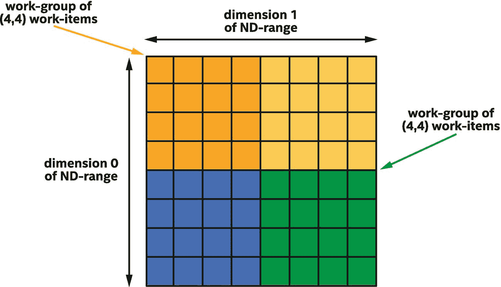

图 9-1

二维 ND-大小范围(8，8)分为四个大小工作组(4，4)

因为不同工作组中的工作项目不能保证同时执行，所以具有一种颜色的工作项目不能与具有不同颜色的工作项目可靠地通信，并且如果一个工作项目试图与当前没有执行的另一个工作项目通信，则内核可能会死锁。因为我们希望我们的内核完成执行，我们必须确保当一个工作项目与另一个工作项目通信时，它们在同一个工作组中。

## 高效沟通的构建模块

本节描述支持组中工作项之间高效通信的构建块。一些是基本的构建模块，支持定制算法的构建，而另一些是更高级的，描述许多内核使用的通用操作。

### 通过屏障实现同步

沟通最基本的构件是*屏障*功能。屏障功能有两个主要目的:

首先，barrier 函数同步组中工作项的执行。通过同步执行，一个工作项可以确保另一个工作项在使用该操作的结果之前已经完成了该操作。或者，在另一个工作项使用操作结果之前，给一个工作项时间来完成其操作。

第二，barrier 函数同步每个工作项如何看待内存的状态。这种类型的同步操作被称为强制*内存一致性*或*防护*内存(更多细节在第 [19 章](19.html#b978-1-4842-5574-2_19))。存储器一致性至少与同步执行一样重要，因为它确保了在屏障之前执行的存储器操作的结果对于屏障之后的其他工作项目是可见的。没有内存一致性，一个工作项中的操作就像森林中倒下的一棵树，声音可能被其他工作项听到，也可能听不到！

图 [9-2](#Fig2) 显示了一个组中的四个工作项，它们在一个障碍函数中同步。尽管每个工作项的执行时间可能不同，但是直到所有工作项都执行了屏障，才可以执行越过屏障的工作项。在执行屏障函数之后，所有的工作项都有一个一致的内存视图。

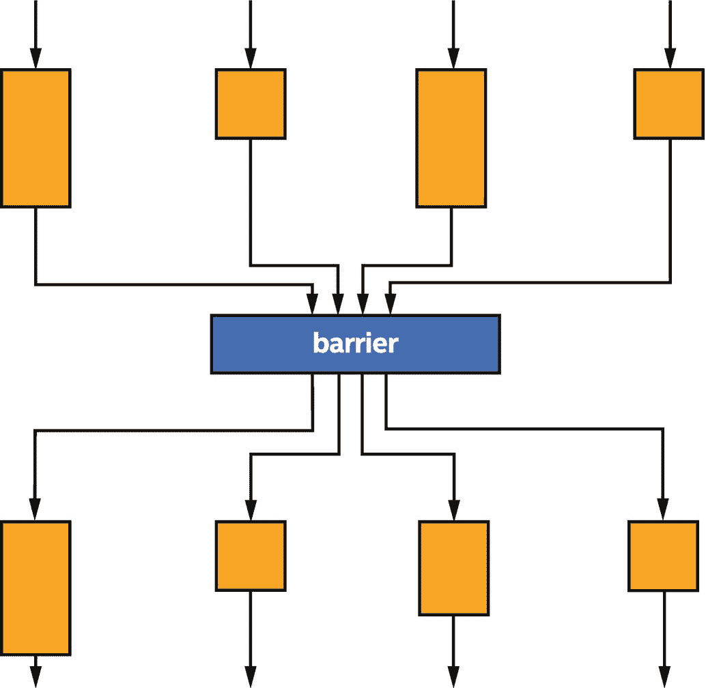

图 9-2

一个组中的四个工作项在屏障函数处同步

WHY ISN’T MEMORY CONSISTENT BY DEFAULT?

对于许多程序员来说，内存一致性的想法——以及不同的工作项可以有不同的内存视图——可能感觉非常奇怪。如果默认情况下所有工作项的内存都是一致的，不是更容易吗？简而言之，答案是肯定的，但实施起来也会非常昂贵。通过允许工作项目具有不一致的存储器视图，并且在程序执行期间仅要求在定义的点处的存储器一致性，加速器硬件可能更便宜，可能执行得更好，或者两者兼而有之。

因为屏障函数同步执行，所以要么组中的所有工作项目都执行屏障，要么组中没有工作项目执行屏障，这一点至关重要。如果组中的一些工作项绕过任何障碍函数，组中的其他工作项可能会永远等待障碍——或者至少直到用户放弃并终止程序！

COLLECTIVE FUNCTIONS

当一个功能需要由一个组中的所有工作项目执行时，它可以被称为一个*集合功能*，因为该操作是由该组执行的，而不是由该组中的单个工作项目执行的。屏障函数不是 SYCL 中唯一可用的集合函数。其他集合函数将在本章后面介绍。

### 工作组本地存储器

工作组屏障功能足以协调工作组中工作项目之间的通信，但是通信本身必须通过记忆发生。通信可以通过 USM 或缓冲区进行，但这可能不方便且效率低下:它需要专用于通信的分配，并且需要在工作组之间划分分配。

为了简化内核开发并加速工作组中工作项之间的通信，SYCL 定义了一个特殊的*本地内存*空间，专门用于工作组中工作项之间的通信。

在图 [9-3](#Fig3) 中，显示了两个工作组。两个工作组都可以访问*全局内存*空间中的 USM 和缓冲区。每个工作组可以访问自己的*本地内存*空间中的变量，但不能访问另一个工作组的本地内存中的变量。

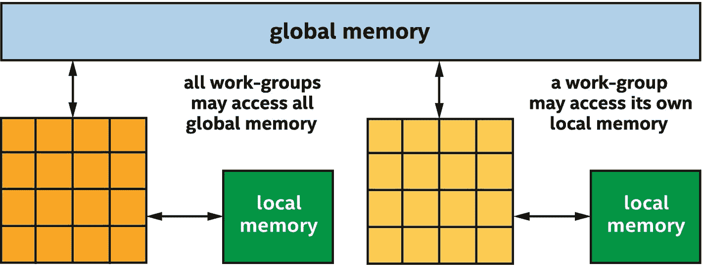

图 9-3

每个工作组可以访问所有全局内存，但只能访问自己的本地内存

当一个工作组开始时，它的本地内存的内容是未初始化的，并且在一个工作组完成执行后，本地内存不再存在。由于这些特性，当一个工作组正在执行时，本地存储器只能用于临时存储。

对于一些设备，例如对于许多 CPU 设备，本地存储器是软件抽象，并且使用与全局存储器相同的存储器子系统来实现。在这些设备上，使用本地内存主要是一种方便的通信机制。一些编译器可以使用内存空间信息进行编译器优化，但是在其他方面，使用本地内存进行通信并不会比通过这些设备上的全局内存进行通信的性能更好。

但是对于其他设备，如许多 GPU 设备，本地内存有专用资源，在这些设备上，通过本地内存进行通信将比通过全局内存进行通信性能更好。

当使用本地内存时，一个工作组中的工作项之间的通信会更加方便和快捷！

我们可以使用设备查询`info::device:` `:local_mem_type`来确定加速器是否有专用于本地存储器的资源，或者本地存储器是否被实现为全局存储器的软件抽象。有关查询设备属性的更多信息，请参考第 [12](12.html#b978-1-4842-5574-2_12) 章；有关如何为 CPU、GPU 和 FPGAs 实现本地存储器的更多信息，请参考第 [15](15.html#b978-1-4842-5574-2_15) 、 [16](16.html#b978-1-4842-5574-2_16) 和 [17](17.html#b978-1-4842-5574-2_17) 章。

## 使用工作组障碍和本地记忆

既然我们已经确定了工作项之间有效通信的基本构件，我们可以描述如何在内核中表达工作组障碍和本地内存。请记住，工作项之间的通信需要工作项分组的概念，因此这些概念只能针对 ND 范围内核和分层内核来表达，而不包括在基本数据并行内核的执行模型中。

本章将在第 [4](04.html#b978-1-4842-5574-2_4) 章介绍的简单矩阵乘法核心示例的基础上，介绍执行矩阵乘法的工作组中工作项目之间的通信。在许多设备上——但不一定是全部！—通过本地内存进行通信将提高矩阵乘法内核的性能。

A NOTE ABOUT MATRIX MULTIPLICATION

在本书中，矩阵乘法内核用于演示内核的变化如何影响性能。虽然使用本章介绍的技术可以提高某些设备的矩阵乘法性能，但矩阵乘法是一种非常重要和常见的运算，许多供应商已经实现了高度优化的矩阵乘法版本。厂商投入大量的时间和精力来实现和验证特定设备的功能，并且在某些情况下可能使用在标准并行内核中难以或不可能使用的功能或技术。

USE VENDOR-PROVIDED LIBRARIES!

当供应商提供一个函数的库实现时，使用它比将函数重新实现为并行内核更有益！对于矩阵乘法，人们可以将 oneMKL 作为英特尔 oneAPI 工具包的一部分，来寻找适合 DPC++ 程序员的解决方案。

图 [9-4](#Fig4) 显示了我们将要开始的朴素的矩阵乘法内核，摘自第 [4 章](04.html#b978-1-4842-5574-2_4)。

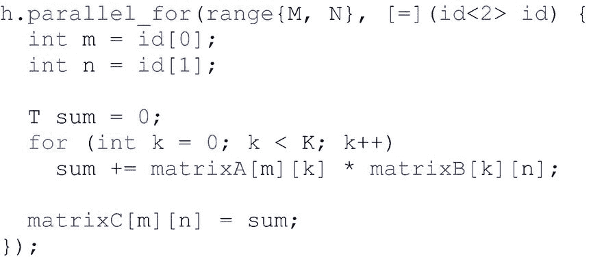

图 9-4

第 4 章中的简单矩阵乘法内核

在第 [4](04.html#b978-1-4842-5574-2_4) 章中，我们观察到矩阵乘法算法具有高度的重用性，并且对工作项进行分组可以提高访问的局部性，从而提高缓存命中率。在这一章中，我们没有依靠*隐式*缓存行为来提高性能，而是使用本地内存作为*显式缓存*，以保证访问的局部性。

对于许多算法来说，将本地内存视为显式缓存是有帮助的。

图 [9-5](#Fig5) 是第 [4](04.html#b978-1-4842-5574-2_4) 章的修改图，显示了一个由单行组成的工作组，这使得使用本地存储器的算法更容易理解。注意，对于结果矩阵的一行中的元素，每个结果元素都是使用来自输入矩阵之一的唯一数据列计算的，以蓝色和橙色显示。因为这个输入矩阵没有数据共享，所以它不是本地内存的理想选择。但是，请注意，该行中的每个结果元素都访问另一个输入矩阵中完全相同的数据，以绿色显示。因为这些数据是重用的，所以它是受益于工作组本地内存的绝佳候选对象。

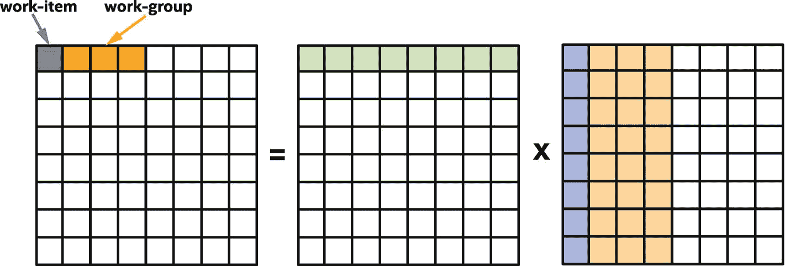

图 9-5

矩阵乘法到工作组和工作项的映射

因为我们想要乘可能非常大的矩阵，并且因为工作组本地存储器可能是有限的资源，所以我们修改的内核将处理每个矩阵的子部分，我们将这些子部分称为矩阵*块*。对于每个图块，我们修改后的内核会将图块的数据加载到本地内存中，同步组中的工作项，然后从本地内存而不是全局内存中加载数据。第一个图块的访问数据如图 [9-6](#Fig6) 所示。

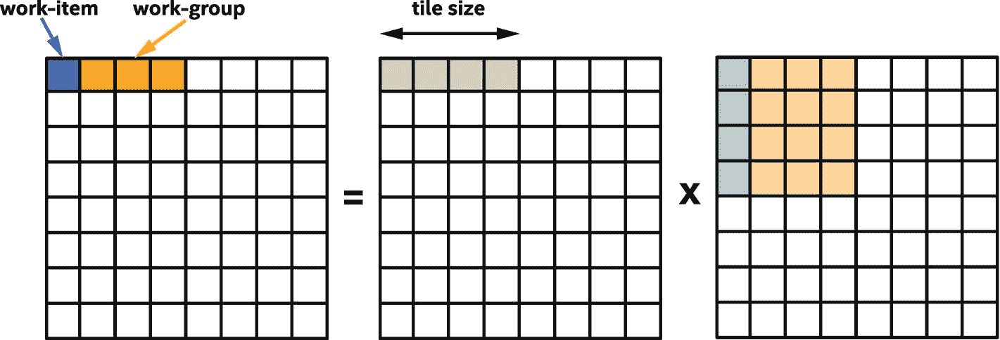

图 9-6

处理第一个图块:绿色输入数据(X 的左侧)被重用并从本地内存中读取，蓝色和橙色输入数据(X 的右侧)从全局内存中读取

在我们的内核中，我们选择了与工作组大小相等的瓦片大小。这不是必需的，但是因为它简化了进出本地存储器的传输，所以选择工作组大小的倍数的切片大小是常见且方便的。

### ND-Range 核中的工作组障碍和局部记忆

本节描述了工作组障碍和局部记忆是如何在 ND-range 核中表示的。对于 ND-range 内核，表示是显式的:内核声明并操作表示本地地址空间中的分配的本地存取器，并调用屏障函数来同步工作组中的工作项目。

#### 本地访问者

要声明在 ND-range 内核中使用的本地内存，使用一个*本地访问器*。像其他访问器对象一样，本地访问器是在命令组处理程序中构造的，但是与第 [3](03.html#b978-1-4842-5574-2_3) 和 [7](07.html#b978-1-4842-5574-2_7) 章中讨论的访问器对象不同，本地访问器不是从缓冲区对象创建的。相反，通过指定类型和描述该类型元素数量的范围来创建局部访问器。像其他访问器一样，局部访问器可以是一维、二维或三维的。图 [9-7](#Fig7) 展示了如何声明本地访问器并在内核中使用它们。

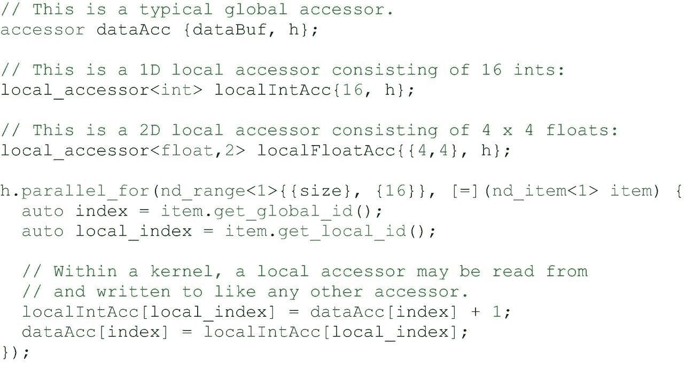

图 9-7

声明和使用本地访问器

请记住，当每个工作组开始时，本地内存是未初始化的，并且在每个工作组完成后不会持续存在。这意味着本地访问器必须总是`read_write`，因为否则内核将无法分配本地内存的内容或查看分配的结果。但是，本地访问器也可以是原子的，在这种情况下，通过访问器对本地存储器的访问是原子地执行的。原子访问将在第 [19 章](19.html#b978-1-4842-5574-2_19)中详细讨论。

#### 同步功能

为了同步 ND-range 内核工作组中的工作项，调用`nd_item`类中的`barrier`函数。因为屏障函数是`nd_item`类的成员，所以它只对 ND-range 内核可用，对基本数据并行内核或分层内核不可用。

barrier 函数目前接受一个参数来描述要同步的内存空间或 *fence* ，但是随着内存模型在 SYCL 和 DPC++ 中的发展，barrier 函数的参数将来可能会改变。然而，在所有情况下，屏障函数的参数提供了关于同步的内存空间或内存同步的*范围*的额外控制。

当没有参数传递给屏障函数时，屏障函数将使用功能正确且保守的默认值。本章中的代码示例使用这种语法以获得最大的可移植性和可读性。对于高度优化的内核，建议精确描述哪些内存空间或哪些工作项必须同步，这样可以提高性能。

#### 一个完整的 ND 范围内核示例

现在我们知道了如何声明一个本地内存访问器，并使用屏障函数同步对它的访问，我们可以实现一个 ND-range 内核版本的矩阵乘法，它协调工作组中工作项之间的通信，以减少全局内存的流量。完整的示例如图 [9-8](#Fig8) 所示。

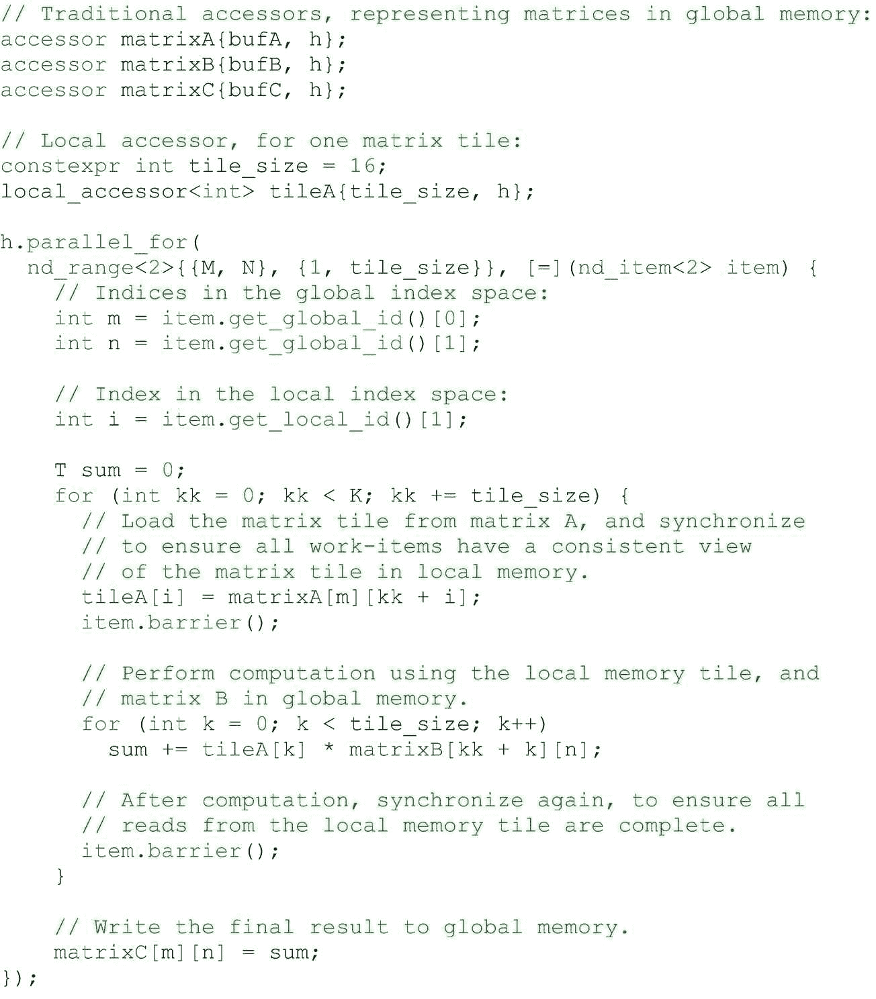

图 9-8

用 ND-range `parallel_for`和工作组本地存储器表示平铺矩阵乘法内核

这个内核中的主循环可以被认为是两个不同的阶段:在第一阶段，工作组中的工作项协作将共享数据从 A 矩阵加载到工作组本地内存中；在第二种情况下，工作项使用共享数据执行自己的计算。为了确保所有的工作项在进入第二阶段之前已经完成了第一阶段，这两个阶段通过调用`barrier`来同步所有的工作项并提供一个内存栅栏来分开。这种模式很常见，在内核中使用工作组本地内存几乎总是需要使用工作组屏障。

注意，还必须调用`barrier`来同步当前图块的计算阶段和下一个矩阵图块的加载阶段之间的执行。如果没有这种同步操作，当前矩阵片的一部分可能会在另一个工作项完成计算之前被工作组中的一个工作项覆盖。一般来说，每当一个工作项在本地内存中读取或写入由另一个工作项读取或写入的数据时，就需要同步。在图 [9-8](#Fig8) 中，同步是在循环结束时进行的，但是在每次循环迭代开始时进行同步也同样正确。

### 等级核中的工作组障碍和局部记忆

本节描述了如何在分层内核中表达工作组障碍和本地记忆。与 ND-range 内核不同，分层内核中的本地内存和屏障是隐式的，不需要特殊的语法或函数调用。一些程序员会发现分层内核表示更加直观和易于使用，而其他程序员会喜欢 ND-range 内核提供的直接控制。在大多数情况下，可以使用两种表示来描述相同的算法，因此我们可以选择我们认为最容易开发和维护的表示。

#### 本地内存和屏障的范围

回想一下第 4 章[中的](04.html#b978-1-4842-5574-2_4)，分层内核通过使用`parallel_for_work_group`和`parallel_for_work_item`函数表达了两个级别的并行执行。并行执行的这两个级别或范围用于表示变量是否在工作组本地存储器中并且在工作组中的所有工作项之间共享，或者变量是否在每个工作项的私有存储器中，该私有存储器不在工作项之间共享。这两个作用域还用于同步一个工作组中的工作项，并加强内存一致性。

图 [9-9](#Fig9) 显示了一个示例层次内核，它在本地内存的工作组范围内声明一个变量，加载到其中，然后在工作项范围内使用该变量。在工作组范围内写入本地内存和在工作项范围内从本地内存读取之间存在一个隐含的障碍。

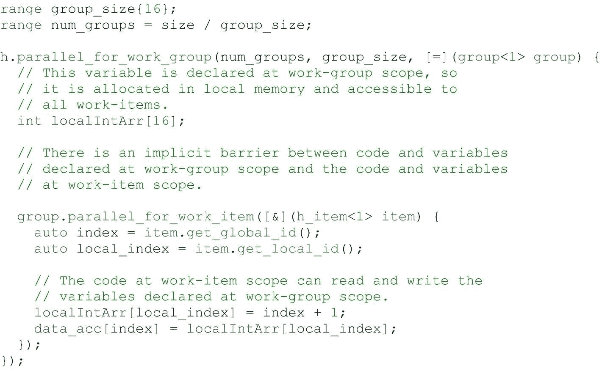

图 9-9

具有本地存储器变量的分层内核

分层内核表示的主要优点是它看起来非常类似于标准的 C++ 代码，其中一些变量可能在一个作用域中赋值，而在一个嵌套的作用域中使用。当然，这也可能被认为是一个缺点，因为它并不直接清楚哪些变量在本地存储器中，以及何时必须由分层内核编译器插入屏障。对于屏障昂贵的设备来说尤其如此！

#### 一个完整的分层内核示例

现在我们知道了如何在分层内核中表达本地内存和屏障，我们可以编写一个分层内核，实现与图 [9-7](#Fig7) 中 ND-range 内核相同的算法。该内核如图 [9-10](#Fig10) 所示。

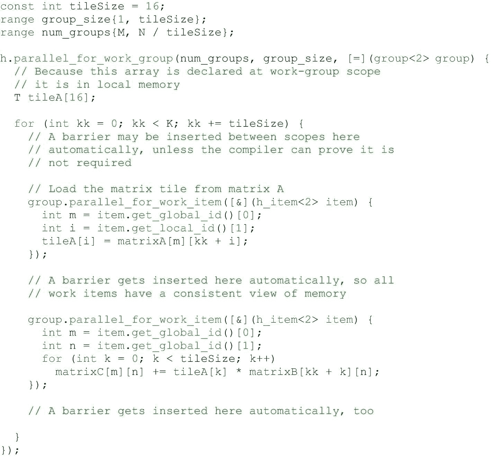

图 9-10

作为分层内核实现的平铺矩阵乘法内核

虽然分层内核与 ND-range 内核非常相似，但有一个关键的区别:在 ND-range 内核中，矩阵乘法的结果在写入内存中的输出矩阵之前被累积到每个工作项变量`sum`中，而分层内核则累积到内存中。我们也可以在分层内核中累加到每个工作项的变量中，但是这需要一个特殊的`private_memory`语法来在工作组范围内声明每个工作项的数据，我们选择使用分层内核语法的原因之一是为了避免特殊语法！

分层内核不需要特殊的语法来声明工作组本地内存中的变量，但是它们需要特殊的语法来声明工作项私有内存中的一些变量！

为了避免特殊的每工作项数据语法，分层内核中工作项循环的常见模式是将中间结果写入工作组本地内存或全局内存。

图 [9-10](#Fig10) 中内核最后一个有趣的属性与循环迭代变量`kk`有关:由于循环是在工作组范围内，循环迭代变量`kk`可以在工作组本地内存之外分配，就像`tileA`数组一样。不过在这种情况下，由于`kk`的值对于工作组中的所有工作项都是相同的，所以智能编译器可能会选择从每个工作项的内存中分配`kk`,特别是对于工作组本地内存是稀缺资源的设备。

## 子群体

到目前为止，根据内核的编写方式，通过工作组本地内存交换数据，以及通过隐式或显式屏障函数进行同步，工作项已经与工作组中的其他工作项进行了通信。

在第 4 章中，我们讨论了另一组工作项目。子组是工作组中工作项目的实现定义的子集，它们在相同的硬件资源上一起执行或者具有额外的调度保证。因为实现决定了如何将工作项分组为子组，所以子组中的工作项可能能够比任意工作组中的工作项更有效地进行通信或同步。

本节描述了子组中工作项之间通信的构建块。注意，子组目前仅针对 ND-range 内核实现，并且子组不能通过分层内核来表达。

### 通过子群障碍的同步

就像 ND-range 内核中的工作组中的工作项目可以如何使用工作组屏障函数来同步一样，子组中的工作项目可以使用子组屏障函数来同步。工作组中的工作项通过调用`nd_item`类中的`group_barrier`函数或`barrier`函数进行同步，子组中的工作项通过调用特殊`sub_group`类中的`group_barrier`函数或`barrier`函数进行同步，该类可从`nd_item`类中查询，如图 [9-11](#Fig11) 所示。

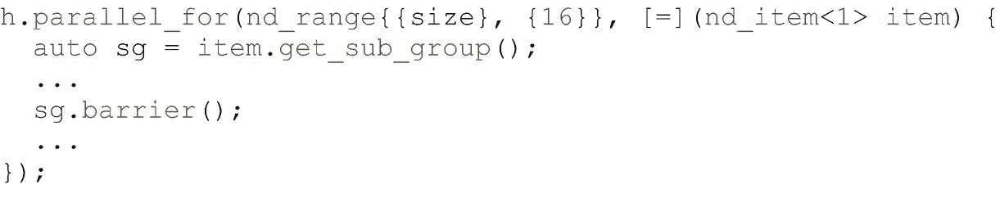

图 9-11

查询和使用`sub_group`类

与工作组屏障一样，子组屏障可以接受可选参数，以更精确地控制屏障操作。不管子组屏障功能是同步全局存储器还是本地存储器，仅同步子组中的工作项可能比同步工作组中的所有工作项更便宜。

### 在子组内交换数据

与工作组不同，子组没有用于交换数据的专用内存空间。相反，子组中的工作项可以通过工作组本地内存、全局内存或者更常见的通过使用子组*集合函数*来交换数据。

如前所述，*集合函数*是描述由一组工作项目而不是单个工作项目执行的操作的函数，并且因为屏障同步函数是由一组工作项目执行的操作，所以它是集合函数的一个例子。

其他集合函数表示常见的通信模式。我们将在本章后面详细描述许多集合函数的语义，但是现在，我们将简要描述我们将使用子组实现矩阵乘法的`broadcast`集合函数。

`broadcast`集合函数从组中的一个工作项中获取一个值，并将其传递给组中的所有其他工作项。示例如图 [9-12](#Fig12) 所示。注意，broadcast 函数的语义要求标识组中哪个值要通信的`local_id`对于组中的所有工作项必须是相同的，确保 broadcast 函数的结果对于组中的所有工作项也是相同的。

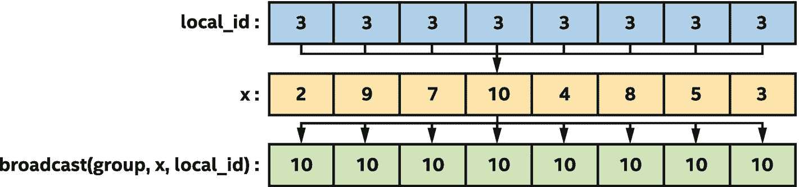

图 9-12

由`broadcast`功能处理

如果我们查看本地内存矩阵乘法内核的最内层循环，如图 [9-13](#Fig13) 所示，我们可以看到对矩阵块的访问是一种广播，因为组中的每个工作项从矩阵块中读取相同的值。

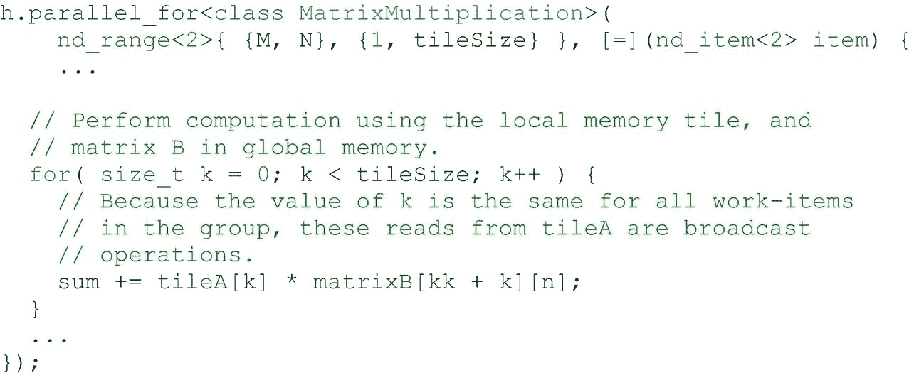

图 9-13

矩阵乘法内核包括一个广播操作

我们将使用子组广播函数来实现一个矩阵乘法内核，它不需要工作组本地内存或屏障。在许多设备上，子组广播比带有工作组本地内存和障碍的广播更快。

### 一个完整的子群 ND-Range 核示例

图 [9-14](#Fig14) 是一个使用子群实现矩阵乘法的完整例子。请注意，这个内核不需要工作组本地内存或显式同步，而是使用子组广播集合函数在工作项之间传递矩阵平铺的内容。

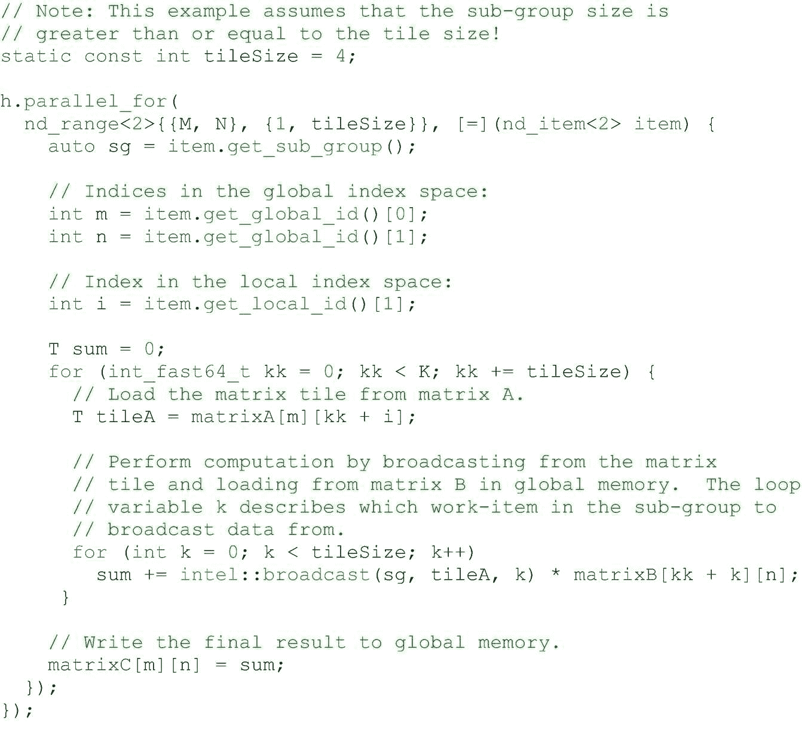

图 9-14

用 ND-range `parallel_for`和子群集合函数表示的平铺矩阵乘法核

## 集体职能

在本章的“子组”一节中，我们描述了集体函数以及集体函数如何表达常见的通信模式。我们特别讨论了 broadcast collective 函数，它用于将一个组中的一个工作项的值传递给组中的其他工作项。本节描述附加的集合函数。

虽然本节中描述的集合功能可以使用诸如原子、工作组本地存储器和屏障之类的特性直接在我们的程序中实现，但是许多设备都包括专用硬件来加速集合功能。即使设备不包含专用硬件，供应商提供的集合函数的实现也可能针对运行它们的设备进行了调整，因此调用内置的集合函数通常会比我们编写的通用实现执行得更好。

使用通用通信模式的集合函数来简化代码和提高性能！

工作组和子组都支持许多集合功能。其他集合功能仅支持子组。

### 广播

`broadcast`函数允许一个组中的一个工作项与该组中的所有其他工作项共享一个变量的值。图 [9-12](#Fig12) 中显示了广播功能的工作原理。工作组和子组都支持`broadcast`功能。

### 投票

`any_of`和`all_of`函数(以下统称为“投票”函数)使工作项能够比较其组中布尔条件的结果:`any_of`如果组中至少一个工作项的条件为真，则返回真，只有当组中所有工作项的条件为真时，`all_of`才返回真。图 [9-15](#Fig15) 显示了这两个功能的比较。

图 9-15

`any_of`和`all_of`功能的比较

工作组和子组都支持`any_of`和`all_of`投票功能。

### 洗牌

子组最有用的特性之一是能够在单个工作项之间直接通信，而不需要显式的内存操作。在许多情况下，例如子组矩阵乘法内核，这些*混洗*操作使我们能够从内核中移除工作组本地内存使用和/或避免对全局内存的不必要的重复访问。有几种风格的随机播放功能可用。

最通用的混洗功能称为`shuffle`，如图 [9-16](#Fig16) 所示，它允许子组中任何一对工作项之间的任意通信。然而，这种通用性可能是以性能为代价的，我们强烈鼓励尽可能使用更专业的随机播放函数。

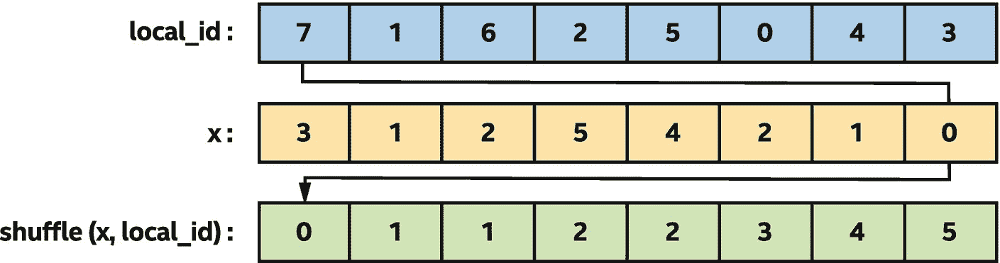

图 9-16

基于预先计算的置换索引，使用通用的`shuffle`对`x`值进行排序

在图 [9-16](#Fig16) 中，使用预先计算的排列索引，使用通用混洗来对子组的`x`值进行排序。对于子组中的一个工作项目显示了箭头，其中混洗的结果是工作项目的 x 值，其中`local_id`等于 7。

注意，子组`broadcast`函数可以被认为是通用`shuffle`函数的特殊版本，其中混洗索引对于子组中的所有工作项都是相同的。当混洗索引对于子组中的所有工作项都是相同的时，使用`broadcast`而不是`shuffle`为编译器提供了额外的信息，并且可以提高某些实现的性能。

`shuffle_up`和`shuffle_down`功能有效*将子组的内容向给定方向移动*固定数量的元素，如图 [9-17](#Fig17) 所示。注意，返回到子组中最后五个工作项的值是未定义的，在图 [9-17](#Fig17) 中显示为空白。移位对于并行化具有循环相关性的循环或实现通用算法(如互斥或包含扫描)非常有用。

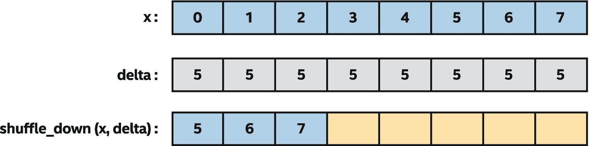

图 9-17

使用`shuffle_down`将子组的`x`值移动五项

`shuffle_xor`函数交换两个工作项的值，这由应用于工作项的子组本地 id 和固定常数的 XOR 运算的结果指定。如图 [9-18](#Fig18) 和 [9-19](#Fig19) 所示，几种常见的通信模式可以用异或来表示:例如，交换相邻值对

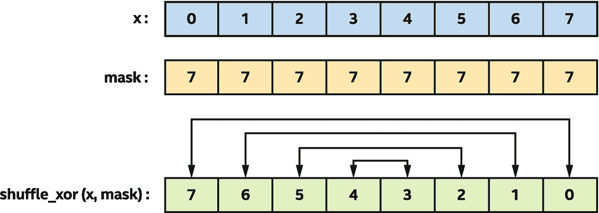

图 9-19

使用`shuffle_xor`反转`x`的值

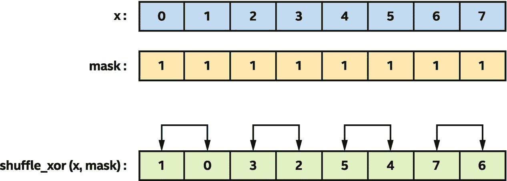

图 9-18

使用`shuffle_xor`交换相邻的`x`对

或者反转子组值。

SUB-GROUP OPTIMIZATIONS USING BROADCAST, VOTE, AND COLLECTIVES

应用于子组的 broadcast、vote 和其他集合函数的行为与应用于工作组时是相同的，但它们值得额外关注，因为它们可能会在某些编译器中实现激进的优化。例如，编译器可能能够减少向子组中的所有工作项广播的变量的寄存器使用，或者可能能够基于`any_of`和`all_of`函数的使用来推断控制流分歧。

### 装载和存储

子组加载和存储功能有两个目的:第一，通知编译器子组中的所有工作项正在加载从内存中相同(统一)位置开始的连续数据，第二，使我们能够请求大量连续数据的优化加载/存储。

对于 ND-range `parallel_for`，编译器可能不清楚不同工作项计算的地址如何相互关联。例如，如图 [9-20](#Fig20) 所示，从索引[0，32]访问一个连续的内存块，从每个工作项的角度来看，似乎有一个跨步的访问模式。

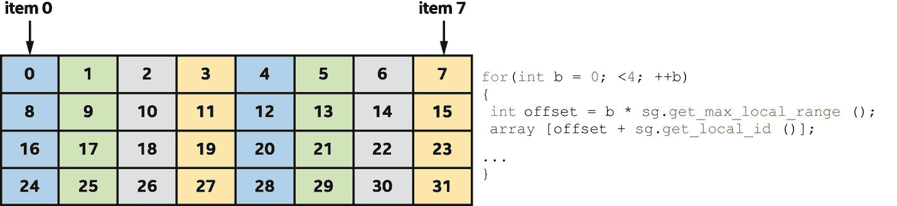

图 9-20

访问四个连续块的子组的存储器访问模式

一些体系结构包括专用硬件来检测子组中的工作项目何时访问连续数据并组合它们的存储器请求，而其他体系结构要求提前知道这一点并将其编码在加载/存储指令中。子组加载和存储在任何平台上都不是正确性所必需的，但在某些平台上可能会提高性能，因此应被视为一种优化提示。

## 摘要

本章讨论了一个组中的工作项如何通信和协作来提高某些类型内核的性能。

我们首先讨论了 ND-range 内核和分层内核是如何支持将工作项分组到工作组中的。我们讨论了将工作项分组到工作组中是如何改变并行执行模型的，从而保证工作组中的工作项并发执行，并支持通信和同步。

接下来，我们讨论了一个工作组中的工作项如何使用屏障进行同步，以及屏障如何针对 ND-range 内核进行显式表达，或者针对分层内核在工作组和工作项范围之间进行隐式表达。我们还讨论了如何通过工作组本地内存执行工作组中工作项之间的通信，以简化内核并提高性能，我们还讨论了如何使用 ND-range 内核的本地访问器或分层内核的工作组范围内的分配来表示工作组本地内存。

我们讨论了 ND-range 内核中的工作组如何进一步划分为工作项目的子组，其中工作项目的子组可以支持额外的通信模式或调度保证。

对于工作组和子组，我们讨论了如何通过使用集体功能来表达和加速常见的交流模式。

本章中的概念是理解第 [14](14.html#b978-1-4842-5574-2_14) 章中描述的常见并行模式以及理解如何针对第 [15](15.html#b978-1-4842-5574-2_15) 、 [16](16.html#b978-1-4842-5574-2_16) 和 [17](17.html#b978-1-4842-5574-2_17) 章中的特定器件进行优化的重要基础。

 

**开放存取**本章根据知识共享署名 4.0 国际许可证(http://Creative Commons . org/licenses/by/4.0/)的条款获得许可，该许可证允许以任何媒体或格式使用、共享、改编、分发和复制，只要您适当注明原作者和来源，提供知识共享许可证的链接并指明是否进行了更改。

本章中的图像或其他第三方材料包含在本章的知识共享许可中，除非在材料的信用额度中另有说明。如果材料不包括在本章的知识共享许可中，并且您的预期使用不被法律法规允许或超出了允许的使用范围，您将需要直接从版权所有者处获得许可。