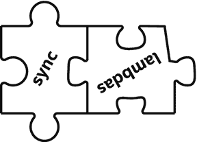
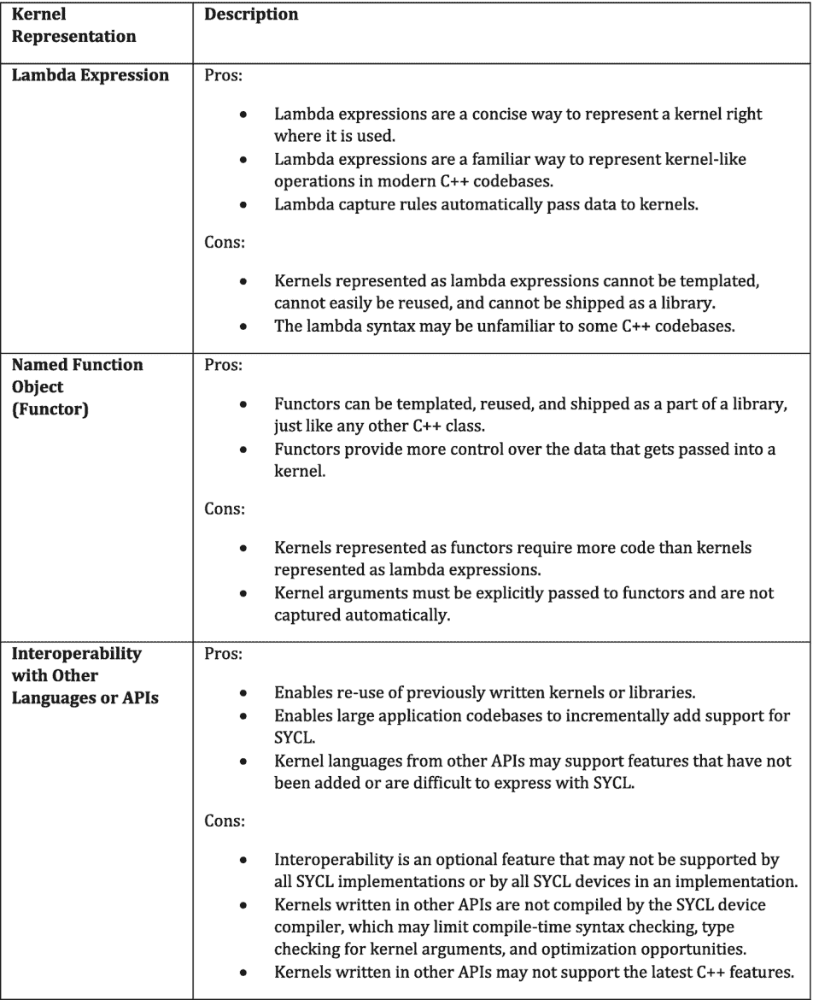
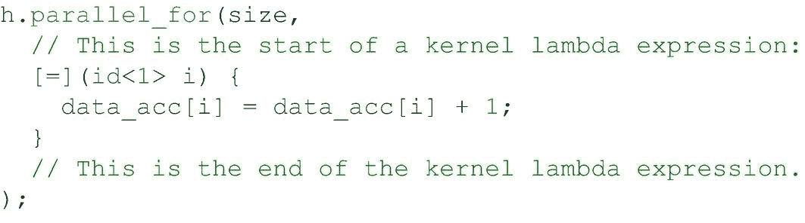
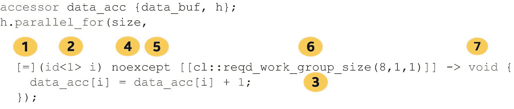
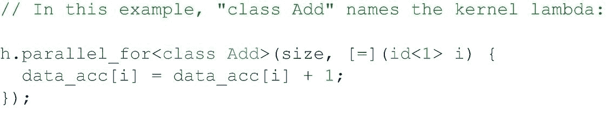
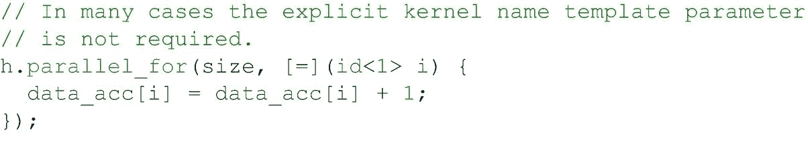
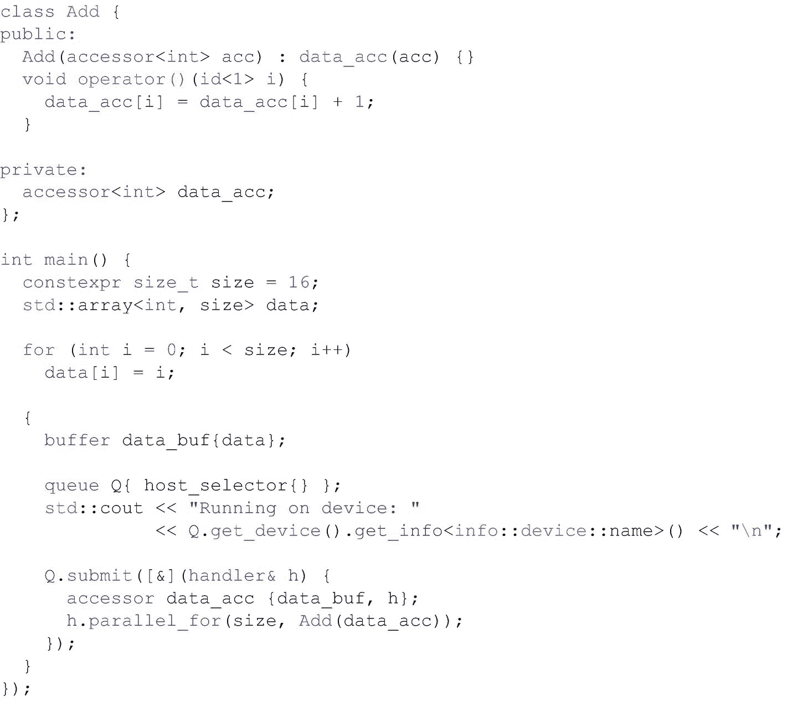
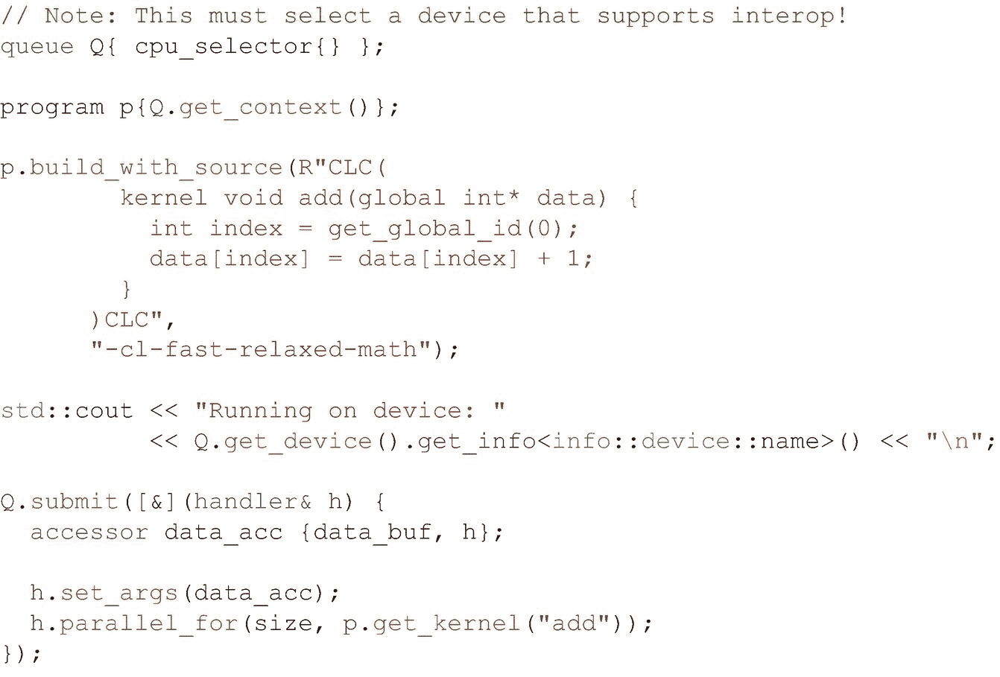
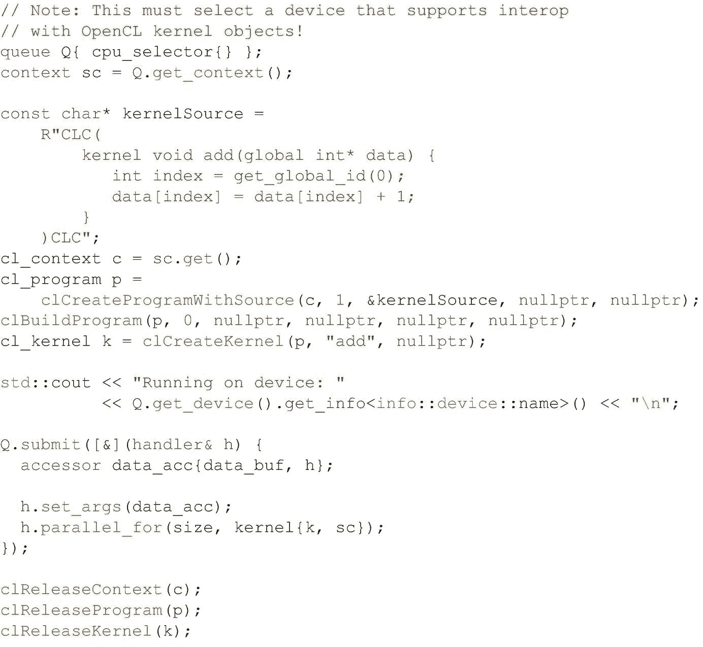
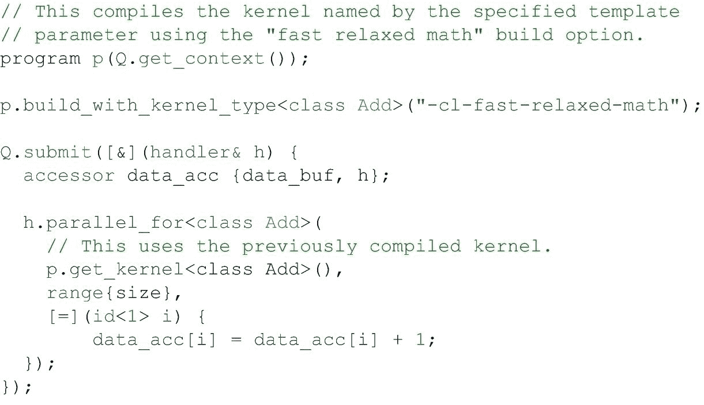

# 10.定义内核

到目前为止，在本书中，我们的代码示例已经使用 C++ lambda 表达式表示了内核。Lambda 表达式是一种简洁而方便的方法，可以在使用它的地方表示内核，但它不是 SYCL 中表示内核的唯一方法。在这一章中，我们将详细探索定义内核的各种方法，帮助我们选择最适合我们 C++ 编码需求的内核形式。

本章解释并比较了表示内核的三种方式:

*   λ表达式

*   命名函数对象(仿函数)

*   与通过其他语言或 API 创建的内核的互操作性

本章最后讨论了如何在一个程序对象中显式地操作内核来控制内核何时以及如何被编译。

## 为什么用三种方式来表示一个内核？

在深入细节之前，让我们先总结一下为什么有三种定义内核的方法，以及每种方法的优缺点。图 [10-1](#Fig1) 给出了一个有用的总结。

请记住，内核是用来表示一个计算单元的，许多内核实例通常会在一个加速器上并行执行。SYCL 支持多种方式来表达内核，以自然、无缝地集成到各种代码库中，同时在各种加速器类型上高效执行。

图 10-1

表示内核的三种方式

## 作为 Lambda 表达式的内核

C++ lambda 表达式，也称为*匿名函数对象*、*未命名函数对象*、*闭包*，或者简称为 *lambdas* ，是一种在使用内核时表达内核权利的便捷方式。本节描述如何将内核表示为 C++ lambda 表达式。这扩展了第 [1](01.html#b978-1-4842-5574-2_1) 章中关于 C++ lambda 函数的介绍性复习，其中包括一些带有输出的编码示例。

C++ lambda 表达式非常强大，并且具有表达性语法，但是在表达内核时，只需要(并且支持)完整 C++ lambda 表达式语法的特定子集。

图 10-2

使用 lambda 表达式定义的内核

### 内核 Lambda 表达式的元素

图 [10-2](#Fig2) 显示了一个以典型的 lambda 表达式编写的内核——本书中的代码示例已经使用了这种语法。

图 [10-3](#Fig3) 中的插图显示了更多可用于内核的 lambda 表达式的元素，但这些元素中有许多并不典型。在大多数情况下，lambda 缺省值就足够了，所以一个典型的内核 lambda 表达式看起来更像图 [10-2](#Fig2) 中的 lambda 表达式，而不是图 [10-3](#Fig3) 中更复杂的 lambda 表达式。

图 10-3

内核 lambda 表达式的更多元素，包括可选元素

1.  lambda 表达式的第一部分描述 lambda *捕获*。*从周围的作用域中捕获*一个变量使它能够在 lambda 表达式中使用，而不需要显式地将它作为参数传递给 lambda 表达式。

    C++ lambda 表达式支持通过复制变量或创建对变量的引用来捕获变量，但对于内核 lambda 表达式，变量只能通过复制来捕获。一般的做法是简单地使用默认的捕获模式`[=]`，它通过值隐式地捕获所有变量，尽管也可以显式地命名每个捕获的变量。内核中使用的任何变量如果没有被值捕获，都会导致编译时错误。

2.  lambda 表达式的第二部分描述传递给 lambda 表达式的参数，就像传递给命名函数的参数一样。

    对于内核 lambda 表达式，参数取决于内核是如何被调用的，并且通常标识并行执行空间中工作项的索引。有关各种并行执行空间以及如何标识每个执行空间中工作项的索引的更多详细信息，请参考第 [4](04.html#b978-1-4842-5574-2_4) 章。

3.  lambda 表达式的最后一部分定义了 lambda 函数体。对于内核 lambda 表达式，函数体描述了应该在并行执行空间中的每个索引处执行的操作。

    内核支持 lambda 表达式的其他部分，但这些部分要么是可选的，要么很少使用:

4.  一些*说明符*(如`mutable`)可能会受到支持，但不建议使用它们，并且在 SYCL(在临时 SYCL 2020 或 DPC++ 的未来版本中可能会删除支持。示例代码中没有显示任何内容。

5.  支持*异常规范*，但是如果提供的话必须是`noexcept`，因为内核不支持异常。

6.  λ*属性*被支持，并且可以用来控制内核如何被编译。例如，`reqd_work_group_size`属性可用于要求内核的特定工作组大小。

7.  可以指定*返回类型*，但是如果提供的话必须是`void`，因为内核不支持非`void`返回类型。

LAMBDA CAPTURES: IMPLICIT OR EXPLICIT?

一些 C++ 风格指南建议不要对 lambda 表达式进行隐式(或默认)捕获，因为可能会出现悬空指针问题，尤其是当 lambda 表达式跨越范围边界时。当使用 lambda 表示内核时，可能会出现相同的问题，因为内核 lambda 在设备上异步执行，与主机代码分离。

因为隐式捕获有用且简洁，所以它是 SYCL 内核的常见实践，也是我们在本书中使用的约定，但最终是我们决定是喜欢隐式捕获的简洁还是显式捕获的清晰。

### 命名内核 Lambda 表达式

当内核被写成 lambda 表达式时，在某些情况下还必须提供一个元素:因为 lambda 表达式是匿名的，有时 SYCL 需要一个显式的内核名称模板参数来唯一地标识被写成 lambda 表达式的内核。

图 10-4

命名内核 lambda 表达式

当内核由单独的设备代码编译器编译时，命名内核 lambda 表达式是主机代码编译器识别调用哪个内核的一种方式。命名一个内核 lambda 还支持编译后内核的运行时自省，或者通过名字构建一个内核，如图 [10-9](#Fig9) 所示。

为了在不需要内核名称模板参数时支持更简洁的代码，DPC++ 编译器支持通过`-fsycl-unnamed-lambda`编译器选项省略内核 lambda 的内核名称模板参数。使用该选项时，不需要显式的内核名称模板参数，如图 [10-5](#Fig5) 所示。

图 10-5

使用未命名的内核 lambda 表达式

因为 lambda 表达式的内核名称模板参数在大多数情况下是不需要的，所以我们通常可以从一个未命名的 lambda 开始，只有在需要内核名称模板参数的特定情况下才添加内核名称。

当不需要内核名称模板参数时，最好使用未命名的内核 lambdas 来减少冗余。

## 作为命名函数对象的内核

命名函数对象，也称为*函子*，是 C++ 中的一种既定模式，它允许对任意数据集合进行操作，同时保持定义良好的接口。当用于表示内核时，命名函数对象的成员变量定义内核可以操作的状态，并且为并行执行空间中的每个工作项目调用重载函数调用`operator()`。

命名函数对象需要比 lambda 表达式更多的代码来表达内核，但是额外的冗长提供了更多的控制和额外的能力。例如，分析和优化表示为命名函数对象的内核可能更容易，因为内核使用的任何缓冲区和数据值都必须显式传递给内核，而不是自动捕获。

最后，因为命名函数对象就像任何其他 C++ 类一样，表达为命名函数对象的内核可以是模板化的，这与表达为 lambda 表达式的内核不同。表示为命名函数对象的内核也更容易重用，并且可以作为单独头文件或库的一部分提供。

### 内核命名函数对象的元素

图 [10-6](#Fig6) 中的代码描述了一个被命名为函数对象的内核元素。

图 10-6

作为命名函数对象的内核

当一个内核被表示为一个命名的函数对象时，命名的函数对象类型必须遵循 C++11 规则，以便能够简单地复制。非正式地，这意味着命名的函数对象可以被安全地逐字节复制，使得命名的函数对象的成员变量能够被传递给在设备上执行的内核代码并由其访问。

重载函数调用`operator()`的参数取决于内核如何启动，就像用 lambda 表达式表示的内核一样。

因为函数对象是命名的，所以宿主代码编译器可以使用函数对象类型与设备代码编译器生成的内核代码关联，即使函数对象是模板化的。因此，不需要额外的内核名称模板参数来命名内核函数对象。

## 与其他 API 的互操作性

当 SYCL 实现建立在另一个 API 之上时，该实现可能能够与使用底层 API 机制定义的内核进行互操作。这使得应用程序可以轻松地、渐进地将 SYCL 集成到现有的代码库中。

因为 SYCL 实现可能位于许多其他 API 之上，所以本节描述的功能是可选的，并且可能不是所有实现都支持。根据具体的设备类型或设备供应商，底层 API 甚至可能有所不同！

概括地说，一个实现可能支持两种互操作性机制:来自 API 定义的源或中间表示(IR)或来自 API 特定的句柄。在这两种机制中，从 API 定义的源或中间表示创建内核的能力更容易移植，因为一些源或 IR 格式受多个 API 支持。例如，OpenCL C 内核可以被许多 API 直接使用，或者可以被编译成 API 可以理解的某种形式，但是来自一个 API 的特定于 API 的内核句柄不太可能被不同的 API 理解。

请记住，所有形式的互操作性都是可选的！

不同的 SYCL 实现可能支持从不同的 API 特定句柄创建内核——或者根本不支持。

请务必查看文档以了解详细信息！

### 与 API 定义的源语言的互操作性

通过这种形式的互操作性，内核的内容被描述为源代码，或者使用 SYCL 没有定义的中间表示，但是内核对象仍然是使用 SYCL API 调用创建的。这种形式的互操作性允许重用用其他源语言编写的内核库，或者使用特定领域语言(DSL)以中间表示形式生成代码。

实现必须理解内核源代码或中间表示，才能利用这种形式的互操作性。例如，如果内核是使用 OpenCL C 以源代码形式编写的，那么实现必须支持从 OpenCL C 内核源代码构建 SYCL 程序。

图 [10-7](#Fig7) 显示了如何将 SYCL 内核写成 OpenCL C 内核源代码。

图 10-7

从 OpenCL C 内核源代码创建的内核

在这个例子中，内核源字符串在 SYCL 主机 API 调用的同一个文件中被表示为 C++ 原始字符串文字，但并不要求必须如此，一些应用程序可能会从文件中读取内核源字符串，甚至实时生成它。

因为 SYCL 编译器无法看到用 API 定义的源语言编写的 SYCL 内核，所以任何内核参数都必须使用`set_arg()`或`set_args()`接口显式传递。SYCL 运行时和 API 定义的源语言必须就将对象作为内核参数传递的约定达成一致。在这个例子中，访问器`dataAcc`作为全局指针内核参数`data`被传递。

`build_with_source()`接口支持传递可选的 API 定义的构建选项，以精确控制内核的编译方式。在本例中，程序构建选项`-cl-fast-relaxed-math`用于指示内核编译器可以使用精度宽松的更快的数学库。程序构建选项是可选的，如果不需要构建选项，可以省略。

### 与 API 定义的内核对象的互操作性

有了这种形式的互操作性，内核对象本身在另一个 API 中创建，然后导入 SYCL。这种形式的互操作性使应用程序的一部分能够使用底层 API 直接创建和使用内核对象，而应用程序的另一部分能够使用 SYCL APIs 重用相同的内核。图 [10-8](#Fig8) 中的代码显示了如何从 OpenCL 内核对象创建 SYCL 内核。

图 10-8

从 OpenCL 内核对象创建的内核

与其他形式的互操作性一样，SYCL 编译器无法看到 API 定义的内核对象。因此，必须使用`set_arg()`或`set_args()`接口显式传递内核参数，并且 SYCL 运行时和底层 API 必须就传递内核参数的约定达成一致。

## 程序对象中的内核

在前面的章节中，当内核从 API 定义的表示或者从 API 特定的句柄创建时，内核分两步创建:首先通过创建一个*程序对象*，然后通过从程序对象创建内核。程序对象是作为一个单元编译的内核和它们调用的函数的集合。

对于表示为 lambda 表达式或命名函数对象的内核，包含内核的程序对象通常是隐式的，对应用程序不可见。对于需要更多控制的应用程序，应用程序可以显式地管理内核和封装它们的程序对象。为了描述为什么这可能是有益的，简单看一下有多少 SYCL 实现管理实时(JIT)内核编译是有帮助的。

虽然规范没有要求，但许多实现都“懒惰地”编译内核这通常是一个好策略，因为它确保了应用程序的快速启动，并且不会不必要地编译从不执行的内核。这种策略的缺点是内核的第一次使用通常比随后的使用需要更长的时间，因为它包括编译内核所需的时间，加上提交和执行内核所需的时间。对于一些复杂的内核，编译内核所需的时间可能会很长，因此需要在应用程序执行期间将编译转移到不同的点，例如当应用程序正在加载时，或者在单独的后台线程中。

一些内核也可能受益于实现定义的“构建选项”,以精确控制内核的编译方式。例如，对于某些实现，可以指示内核编译器使用精度更低、性能更好的数学库。

为了更好地控制内核编译的时间和方式，应用程序可以使用特定的编译选项，明确请求在使用内核之前编译内核。然后，像往常一样，可以将预编译的内核提交到队列中执行。图 [10-9](#Fig9) 显示了这是如何工作的。

图 10-9

使用构建选项编译内核 lambdas

在这个例子中，一个程序对象是从 SYCL 上下文中创建的，由指定的模板参数定义的内核是使用`build_with_kernel_type`函数构建的。对于这个例子，程序构建选项`-cl-fast-relaxed-math`表明内核编译器可以使用具有宽松精度的更快的数学库，但是程序构建选项是可选的，如果不需要特殊的程序构建选项，可以省略。在这种情况下，命名内核 lambda 的模板参数是必需的，以标识要编译的内核。

程序对象也可以从上下文和设备的特定列表中创建，而不是从上下文中的所有设备中创建，从而允许一组设备的程序对象用与另一组设备的另一程序对象不同的构建选项来编译。

除了通常的内核 lambda 表达式之外，还使用`get_kernel`函数将之前编译的内核传递给`parallel_for`。这确保了使用宽松数学库构建的先前编译的内核得到使用。如果先前编译的内核没有被传递给`parallel_for`，那么内核将被再次编译，没有任何特殊的编译选项。这可能在功能上是正确的，但肯定不是预期的行为！

在许多情况下，例如在前面显示的简单示例中，这些额外的步骤不太可能对应用程序的行为产生明显的改变，为了清楚起见，可以省略这些步骤，但是在针对性能调整应用程序时，应该考虑这些步骤。

IMPROVING INTEROPERABILITY AND PROGRAM OBJECT MANAGEMENT

尽管本章中描述的 SYCL 互操作性和程序对象管理接口非常有用，但它们可能会在 SYCL 和 DPC++ 的未来版本中得到改进和增强。请参考最新的 SYCL 和 DPC++ 文档，查找本书中没有提供或不够稳定的更新！

## 摘要

在这一章中，我们探索了定义内核的不同方法。我们描述了如何通过将内核表示为 C++ lambda 表达式或命名函数对象来无缝集成到现有的 C++ 代码库中。对于新的代码库，我们还讨论了不同内核表示的优缺点，以帮助根据应用程序或库的需求选择定义内核的最佳方式。

我们还描述了如何与其他 API 进行互操作，或者通过从 API 定义的源语言或中间表示创建内核，或者通过从内核的 API 表示的句柄创建内核对象。互操作性使应用程序能够随着时间的推移从较低级别的 API 迁移到 SYCL，或者与为其他 API 编写的库接口。

最后，我们描述了如何在 SYCL 应用程序中编译内核，以及如何直接操作程序对象中的内核来控制编译过程。尽管大多数应用程序不需要这种级别的控制，但在调优应用程序时，这是一项需要注意的有用技术。

 

**开放存取**本章根据知识共享署名 4.0 国际许可证(http://Creative Commons . org/licenses/by/4.0/)的条款获得许可，该许可证允许以任何媒体或格式使用、共享、改编、分发和复制，只要您适当注明原作者和来源，提供知识共享许可证的链接并指明是否进行了更改。

本章中的图像或其他第三方材料包含在该章的知识共享许可中，除非该材料的信用额度中另有说明。如果材料未包含在本章的知识共享许可中，并且您的预期用途不被法定法规允许或超出了允许的用途，您将需要直接从版权所有者处获得许可。