# 13.实用技巧

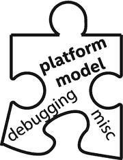

这一章包含了许多有用的信息、实用的技巧、建议和技术，它们在编程 SYCL 和使用 DPC++ 时被证明是有用的。这些主题没有一个是详尽的，所以目的是提高认识和鼓励更多的学习。

## 获取 DPC++ 编译器和代码示例

第 [1](01.html#b978-1-4842-5574-2_1) 章讲述了如何获得 DPC++ 编译器([oneapi . com/implementations](http://www.oneapi.com/implementations)或 [github. com/ intel/ llvm](http://www.github.com/intel/llvm) )以及从哪里获得代码示例([www . a press . com/9781484255735](https://www.apress.com/9781484255735)—寻找本书的服务:源代码)。再次提到这一点是为了强调尝试这些示例是多么有用(包括进行修改！)来获得实践经验。加入那些知道图 1-1 中的代码实际打印出什么的人的俱乐部吧！

## 在线论坛和文档

英特尔开发人员专区举办了一个论坛，用于讨论 DPC++ 编译器、DPC++ 库(第[章第 18 节](18.html#b978-1-4842-5574-2_18))、DPC++ 兼容性工具(用于 CUDA 迁移——将在本章稍后讨论)以及 oneAPI 工具包中包含的 gdb(本章也涉及调试)。这是一个张贴关于编写代码的问题(包括可疑的编译器错误)的绝佳位置。你会在这个论坛上找到一些作者的帖子，尤其是在写这本书的时候。论坛可在线访问 [`https://software.intel.com/en-us/forums/oneapi-data-parallel-c-compiler`](https://software.intel.com/en-us/forums/oneapi-data-parallel-c-compiler) 。

在线 [oneAPI DPC++ 语言参考](https://jamesreinders.com/dpcppref)是一个很好的资源，可以找到类和成员定义的完整列表、编译器选项的详细信息等等。

## 平台模型

SYCL 或 DPC++ 编译器被设计成和我们曾经使用过的任何其他 C++ 编译器一样的行为和感觉。一个显著的区别是，常规 C++ 编译器只为 CPU 生成代码。在高层次上理解内部工作是值得的，它使编译器能够为主机 CPU *和*设备产生代码。

SYCL 和 DPC++ 使用的平台模型(图 [13-1](#Fig1) )指定了一个主机来协调和控制在设备上执行的计算工作。第 [2](02.html#b978-1-4842-5574-2_2) 章描述了如何给设备分配工作，第 [4](04.html#b978-1-4842-5574-2_4) 章深入探讨了如何给设备编程。第 [12](12.html#b978-1-4842-5574-2_12) 章描述了在不同的特性级别使用平台模型。

正如我们在第 [2](02.html#b978-1-4842-5574-2_2) 章中讨论的，总有一个设备对应着主机，称为*主机设备*。为设备代码提供这个保证可用的目标，允许在假设至少有一个设备可用的情况下编写设备代码，即使它是主机本身！选择在哪些设备上运行设备代码是在程序控制之下的——作为程序员，如果我们想在特定的设备上执行代码，以及如何执行代码，这完全是我们的选择。

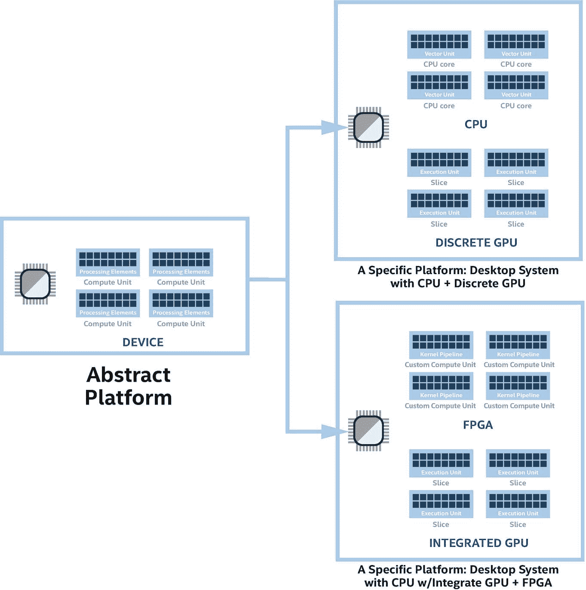

图 13-1

平台模型:可以抽象使用，也可以具体使用

### 多架构二进制文件

因为我们的目标是用一个单一的源代码来支持一个异构的机器，所以自然希望得到一个单一的可执行文件。

多架构二进制文件(又名*胖二进制文件*)是一个单一的二进制文件，它已经被扩展为包含我们的异构机器所需的所有编译和中间代码。多架构二进制文件的概念并不新鲜。例如，一些操作系统支持多架构 32 位和 64 位库和可执行文件。多架构二进制代码的行为就像我们习惯的任何其他`a.out`或`A.exe`一样——但是它包含了异构机器所需的一切。这有助于为特定设备选择正确的运行代码。正如我们接下来讨论的，fat 二进制中设备代码的一种可能形式是一种中间格式，它将设备指令的最终创建推迟到运行时。

### 编译模型

SYCL 和 DPC++ 的单源特性允许编译的行为和感觉像普通的 C++ 编译。我们不需要为设备调用额外的通道或者处理绑定设备和主机代码。这些都是由编译器自动为我们处理的。当然，理解正在发生的事情的细节是很重要的，原因有几个。如果我们想要更有效地针对特定的架构，这是很有用的知识，并且了解我们是否需要调试编译过程中发生的故障也很重要。

我们将回顾编译模型，以便我们在需要这些知识的时候得到教育。由于编译模型支持同时在一个主机和潜在的几个设备上执行的代码，编译器、链接器和其他支持工具发出的命令比我们习惯的 C++ 编译更复杂(只针对一种架构)。欢迎来到异类世界！

DPC++ 编译器故意对我们隐藏了这种异构的复杂性，并且“正好可以工作”

DPC++ 编译器可以生成类似于传统 C++ 编译器的特定于目标的可执行代码(*提前* (AOT)编译，有时也称为离线内核编译)，或者它可以生成一个中间表示，可以在运行时*即时* (JIT)编译到特定的目标。

如果设备目标提前已知(在我们编译程序的时候)，编译器只能提前编译。推迟即时编译提供了更多的灵活性，但是需要编译器和运行时在我们的应用程序运行时执行额外的工作。

DPC++ 编译可以是“提前”的，也可以是“及时”的。

默认情况下，当我们为大多数设备编译代码时，设备代码的输出以中间形式存储。在运行时，系统上的设备处理程序将*即时*将中间形式编译成在设备上运行的代码，以匹配系统上可用的内容。

我们可以要求编译器提前为特定的设备或设备类别进行编译。这有节省运行时间的优点，但是也有增加编译时间和二进制文件的缺点！提前编译的代码不如实时编译的代码可移植，因为它不能在运行时进行调整。我们可以将两者都包含在我们的二进制文件中，以获得两者的好处。

提前针对特定设备进行编译还有助于我们在构建时检查我们的程序是否应该在该设备上运行。使用即时编译，程序可能会在运行时编译失败(使用第 [5](05.html#b978-1-4842-5574-2_5) 章中的机制可以发现这一点)。在本章接下来的“调试”部分有一些调试技巧，第 [5](05.html#b978-1-4842-5574-2_5) 章详细介绍了如何在运行时捕捉这些错误，以避免要求我们的应用程序中止。

图 [13-2](#Fig2) 说明了从源代码到 fat 二进制(可执行)的 DPC++ 编译过程。我们选择的任何组合都组合成一个胖二进制。当应用程序执行时，运行时使用 fat 二进制文件(这是我们在主机上执行的二进制文件！).有时，我们可能希望在单独的编译中为特定设备编译设备代码。我们希望这样一个单独编译的结果最终被合并到我们的胖二进制文件中。当完全编译(进行完全综合布局布线)时间可能非常长时，这对于 FPGA 开发可能非常有用，并且事实上这是 FPGA 开发的要求，以避免要求在运行时系统上安装综合工具。图 [13-3](#Fig3) 显示了支持此类需求的捆绑/拆分活动的流程。我们总是可以选择一次编译所有内容，但是在开发过程中，选择分解编译会非常有用。

每个 SYCL 和 DPC++ 编译器都有一个目标相同的编译模型，但是具体的实现细节会有所不同。这里显示的图表是针对 DPC++ 编译器工具链的。

一个特定于 DPC++ 的组件如图 [13-2](#Fig2) 所示，作为本书中不再提及的*集成头生成器*。我们甚至不需要知道它是什么或做什么就可以编程。然而，为了满足好奇心，这里有一些信息:集成头文件生成器生成一个头文件，提供关于翻译单元中 SYCL 内核的信息。这包括 SYCL 内核类型的名称如何映射到符号名称，以及关于内核参数及其在相应的 lambda 或 functor 对象中的位置的信息，这些对象是由编译器创建来捕获它们的。integration header 是一种机制，用于通过 C++ lambda/functor 对象实现从主机代码调用内核的便捷方式，这将我们从设置单个参数、按名称解析内核等耗时的任务中解放出来。

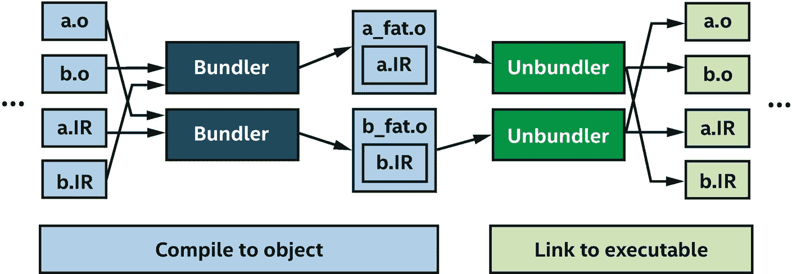

图 13-3

编译过程:卸载捆绑器/解捆绑器

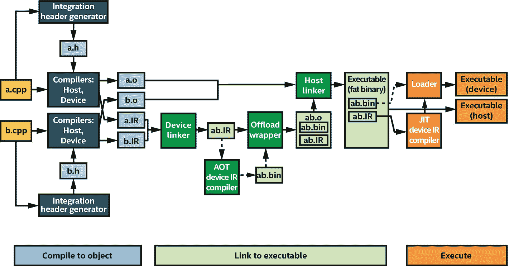

图 13-2

编译过程:提前和及时选项

## 向现有 C++ 程序添加 SYCL

向现有的 C++ 程序添加适当的并行性是使用 SYCL 的第一步。如果一个 C++ 应用程序已经在利用并行执行，这可能是一个意外收获，也可能是一个令人头疼的问题。这是因为我们将应用程序的工作划分为并行执行的方式极大地影响了我们可以用它做什么。当程序员谈论*重构*一个程序时，他们指的是重新安排程序内的执行和数据流，以使其准备好利用并行性。这是一个复杂的话题，我们只简单地谈一下。关于如何为并行化准备应用，没有一个*通用的*答案，但是有一些提示值得注意。

当向 C++ 应用程序添加并行性时，一个简单的方法是在程序中找到一个孤立点，在那里并行性的机会最大。我们可以从这里开始修改，然后根据需要继续在其他领域添加并行性。一个复杂的因素是重构(例如，重新安排程序流和重新设计数据结构)可以提高并行性的机会。

一旦我们在程序中找到一个最有可能实现并行的孤立点，我们就需要考虑如何在程序中的这个点上使用 SYCL。这就是本书其余部分所教导的。

概括地说，引入并行性的关键步骤包括

1.  并发安全(在传统 CPU 编程中通常称为*线程安全*):调整所有共享的可变数据(可以改变并被并发共享的数据)以便并发使用

2.  引入并发性和/或并行性

3.  针对并行性进行调整(最佳扩展，针对吞吐量或延迟进行优化)

首先考虑步骤 1 是很重要的。许多应用程序已经针对并发性进行了重构，但许多还没有。由于 SYCL 是并行性的唯一来源，我们重点关注内核中使用的数据以及可能与主机共享的数据的安全性。如果我们的程序中有其他技术(OpenMP、MPI、TBB 等)。)引入了并行性，这是我们 SYCL 编程的另一个关注点。需要注意的是，在一个程序中使用多种技术是可以的——SYCL 不需要成为一个程序中唯一的并行来源。这本书没有涵盖与其他并行技术混合的高级主题。

## 排除故障

本节给出了一些适度的调试建议，以缓解调试并行程序所特有的挑战，尤其是针对异构机器的调试。

我们永远不要忘记，当我们的应用程序在主机设备上运行时，我们可以选择调试它们。该调试提示在第 [2](02.html#b978-1-4842-5574-2_2) 章中被描述为方法#2。因为设备的架构通常包含较少的调试挂钩，所以工具通常可以更精确地探测主机上的代码。在主机上运行 *everything* 的另一个好处是，许多与同步相关的错误将会消失，包括在主机和设备之间来回移动内存。虽然我们最终需要调试所有这样的错误，但这允许增量调试，因此我们可以在其他错误之前解决一些错误。

运行在主机设备上的调试提示是一个强大的调试工具。

当在主机上运行所有代码时，并行编程错误，特别是数据竞争和死锁，通常更容易被工具检测和消除。令我们懊恼的是，当在主机和设备的组合上运行时，我们将最经常地看到由于这种并行编程错误而导致的程序失败。当这样的问题出现时，记住回退到 host-only 是一个强大的调试工具是非常有用的。幸运的是，SYCL 和 DPC++ 经过精心设计，让我们可以使用这个选项，并且易于访问。

调试提示如果一个程序死锁，检查主机访问器是否被正确销毁。

当我们开始调试时，下面的 DPC++ 编译器选项是一个好主意:

*   `-g`:输出调试信息。

*   `-ferror-limit=1`:将 C++ 与 SYCL/DPC++ 等模板库一起使用时保持理智。

*   让编译器强制执行良好的编码，以帮助避免在运行时产生错误的代码来调试。

我们真的不需要为了使用 DPC++ 而陷入修复迂腐警告的困境，所以选择不使用`-Wpedantic`是可以理解的。

当我们让代码在运行时被及时编译时，我们就可以检查代码了。这*高度依赖于*我们的编译器所使用的层，因此查看编译器文档以获得建议是一个好主意。

### 调试内核代码

调试内核代码时，首先在主机设备上运行(如第 [2](02.html#b978-1-4842-5574-2_2) 章所述)。第 [2](02.html#b978-1-4842-5574-2_2) 章中设备选择器的代码可以很容易地修改，以接受运行时选项，或编译时选项，在我们调试时将工作重定向到主机设备。

在调试内核代码时，SYCL 定义了一个可以在内核内部使用的 C++ 风格的`stream`(图 [13-4](#Fig4) )。DPC++ 还提供了一个 C 风格`printf`的实验性实现，它有一些有用的功能，但有一些限制。更多详情请见在线 [oneAPI DPC++ 语言参考](https://jamesreinders.com/dpcppref)。

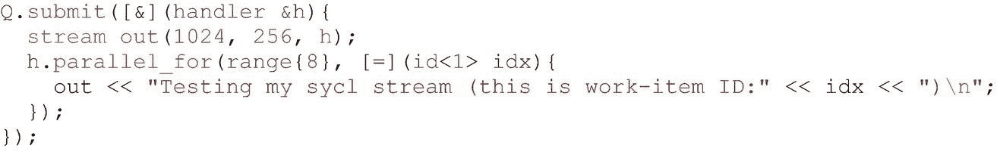

图 13-4

`sycl::stream`

调试内核代码时，经验鼓励我们将断点放在`parallel_for`之前或`parallel_for,`内部，但实际上不要放在`parallel_for`上。放置在`parallel_for`上的断点可以多次触发断点，即使在执行下一个操作之后。这个 C++ 调试建议适用于许多模板扩展，如 SYCL 中的模板扩展，其中模板调用上的断点在被编译器扩展时会转化为一组复杂的断点。可能有一些实现可以缓解这种情况，但这里的关键点是，我们可以通过不在`parallel_for`本身上精确设置断点来避免所有实现上的一些混淆。

### 调试运行时故障

当在编译时发生运行时错误时，我们要么是在处理编译器/运行时错误，要么是我们意外地编写了无意义的程序，直到它在运行时出错并产生难以理解的运行时错误消息时才被发现。深入这些 bug 可能有点吓人，但即使粗略地看一下，也可能让我们更好地了解导致特定问题的原因。它可能会产生一些额外的知识来指导我们避免这个问题，或者它可能只是帮助我们向编译器团队提交一个简短的错误报告。无论哪种方式，知道一些工具的存在是很重要的。

表明运行时失败的程序输出可能如下所示:

```cpp

origin>: error: Invalid record (Producer: 'LLVM9.0.0' Reader: 'LLVM 9.0.0')
terminate called after throwing an instance of 'cl::sycl::compile_program_error'

```

看到这里提到的这个抛出让我们知道我们的宿主程序可以被构造来捕捉这个错误。虽然这可能不能解决我们的问题，但它确实意味着运行时编译器故障不需要中止我们的应用程序。第 5 章深入探讨这个话题。

当我们看到一个运行时故障并且很难快速调试它时，简单地尝试使用提前编译进行重建是值得的。如果我们的目标设备有提前编译选项，这可能是一件容易尝试的事情，可能会产生更容易理解的诊断。如果我们的错误可以在编译时而不是在 JIT 或运行时被看到，通常会在来自编译器的错误消息中发现更多有用的信息，而不是我们通常在 JIT 或运行时看到的少量错误信息。具体选项，查看在线 [oneAPI DPC++ 文档](https://jamesreinders.com/dpcppref)进行*提前编译*。

当我们的 SYCL 程序运行在 OpenCL 运行时之上并使用 OpenCL 后端时，我们可以使用 OpenCL 拦截层运行我们的程序:[github . com/Intel/OpenCL-Intercept-Layer](https://github.com/intel/opencl-intercept-layer)。这是一个可以检查、记录和修改应用程序(或高级运行时)生成的 OpenCL 命令的工具。它支持很多控件，但是最初设置的好控件是`ErrorLogging`、`BuildLogging`，可能还有`CallLogging`(尽管它会生成很多输出)。使用`DumpProgramSPIRV`可以进行有用的转储。OpenCL Intercept 层是一个独立的实用程序，不属于任何特定的 OpenCL 实现，因此它可以与许多 SYCL 编译器一起工作。

对于采用英特尔 GPU 的 Linux 系统上的可疑编译器问题，我们可以转储英特尔图形编译器的中间编译器输出。我们通过将环境变量`IGC_ShaderDumpEnable`设置为 1(对于某些输出)或者将环境变量`IGC_ShaderDumpEnableAll`设置为 1(对于大量输出)来实现这一点。倾销的产品进入`/tmp/IntelIGC`。这种技术可能不适用于所有的图形驱动程序，但值得一试，看看它是否适用于我们的系统。

图 [13-5](#Fig5) 列出了编译器或运行时支持的这些和一些额外的环境变量(在 Windows 和 Linux 上支持),以帮助高级调试。这些是依赖于 DPC++ 实现的高级调试选项，用于检查和控制编译模型。本书没有讨论或利用它们。[在线 oneAPI DPC++ 语言参考](https://jamesreinders.com/dpcppref)是了解更多信息的好地方。

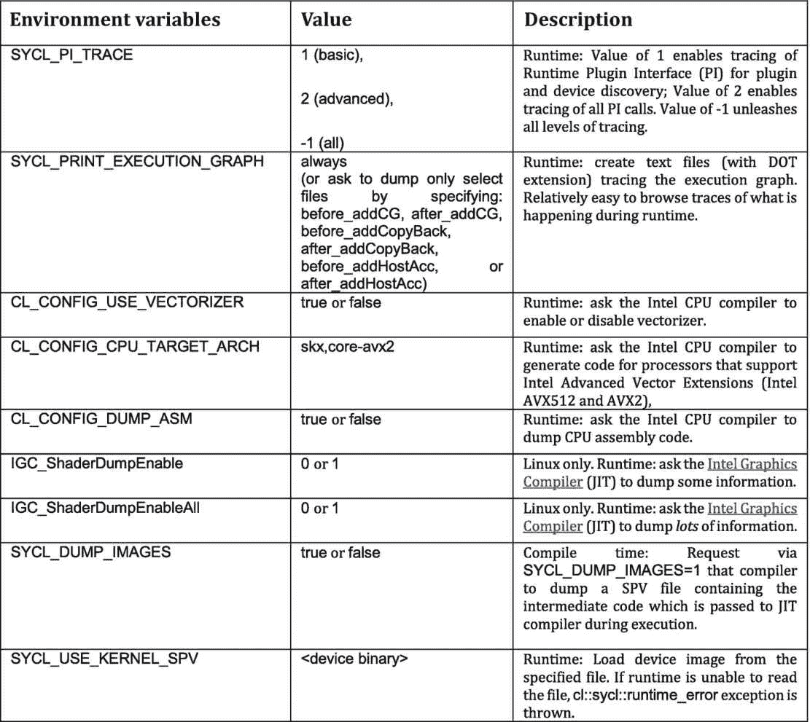

图 13-5

DPC++ 高级调试选项

这些选项在本书中没有详细描述，但是在这里提到它们是为了根据需要打开高级调试的通道。这些选项*可能*让我们深入了解如何解决问题或错误。有可能我们的源代码无意中触发了一个问题，这个问题可以通过更正源代码来解决。否则，使用这些选项是为了对编译器本身进行非常高级的调试。因此，他们更多地与编译器开发人员联系在一起，而不是编译器的用户。一些高级用户发现这些选项很有用；因此，它们在这里被提及，在本书中不再提及。为了更深入地挖掘，GitHub for DPC++ 在[llvm/sycl/doc/environment variables 下有一个针对所有环境变量的文档。md](https://github.com/intel/llvm/blob/sycl/sycl/doc/EnvironmentVariables.md) 。

调试技巧当其他选项用尽，我们需要调试一个运行时问题时，我们会寻找一些转储工具，这些工具可能会给我们一些提示。

## 初始化数据和访问内核输出

在这一节中，我们将深入探讨一个让 SYCL 新用户感到困惑的话题，这也是我们作为 SYCL 开发新手遇到的最常见的错误。

简而言之，当我们从主机内存分配(例如，数组或向量)创建缓冲区时，我们不能直接访问主机分配，直到缓冲区被销毁。在缓冲区的整个生命周期内，缓冲区拥有在构造时传递给它的任何主机分配。很少使用*做*的机制让我们在缓冲区仍然存在时访问主机分配(例如，缓冲区互斥)，但这些高级功能对这里描述的早期错误没有帮助。

如果我们从一个主机内存分配中构造一个缓冲区，在缓冲区被销毁之前，我们不能直接访问主机内存分配！当缓冲区处于活动状态时，它拥有分配。

当缓冲区仍然拥有主机分配时，主机程序访问该分配时会出现一个常见的错误。一旦发生这种情况，一切都完了，因为我们不知道缓冲区使用分配的目的是什么。如果数据不正确，不要感到惊讶——我们试图从中读取输出的内核可能还没有开始运行！如第 [3](03.html#b978-1-4842-5574-2_3) 和 [8](08.html#b978-1-4842-5574-2_8) 章所述，SYCL 是围绕异步任务图机制构建的。在我们尝试使用来自任务图操作的输出数据之前，我们需要确保我们已经到达了代码中的同步点，在那里图形已经执行并使数据对主机可用。缓冲区销毁和主机访问器的创建都是导致这种同步的操作。

图 [13-6](#Fig6) 显示了我们经常编写的一种常见代码模式，其中我们通过关闭定义缓冲区的块范围来销毁缓冲区。通过使缓冲区超出范围并被销毁，我们可以通过传递给缓冲区构造函数的原始主机分配安全地读取内核结果。

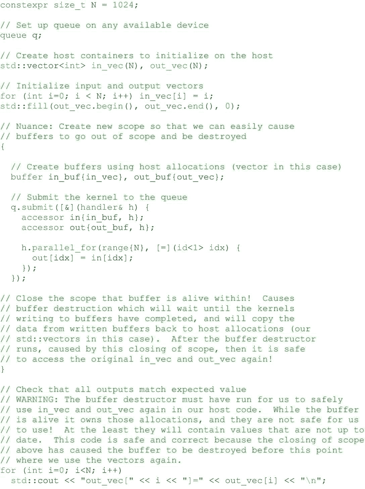

图 13-6

通用模式—从主机分配创建缓冲区

如图 [13-6](#Fig6) 所示，将缓冲区与现有主机内存关联有两个常见原因:

1.  简化缓冲区中数据的初始化。我们可以从我们(或应用程序的另一部分)已经初始化的主机内存中构造缓冲区。

2.  减少键入的字符，因为用'`}`'结束作用域比创建缓冲区的`host_accessor`更简洁(尽管更容易出错)。

如果我们使用主机分配来转储或验证内核的输出值，我们需要将缓冲区分配放入块范围(或其他范围)，以便我们可以控制它何时被销毁。然后，在我们访问主机分配以获得内核输出之前，我们必须确保缓冲区被销毁。图 [13-6](#Fig6) 显示这是正确完成的，而图 [13-7](#Fig7) 显示了一个常见的错误，即当缓冲区仍然存在时，输出被访问。

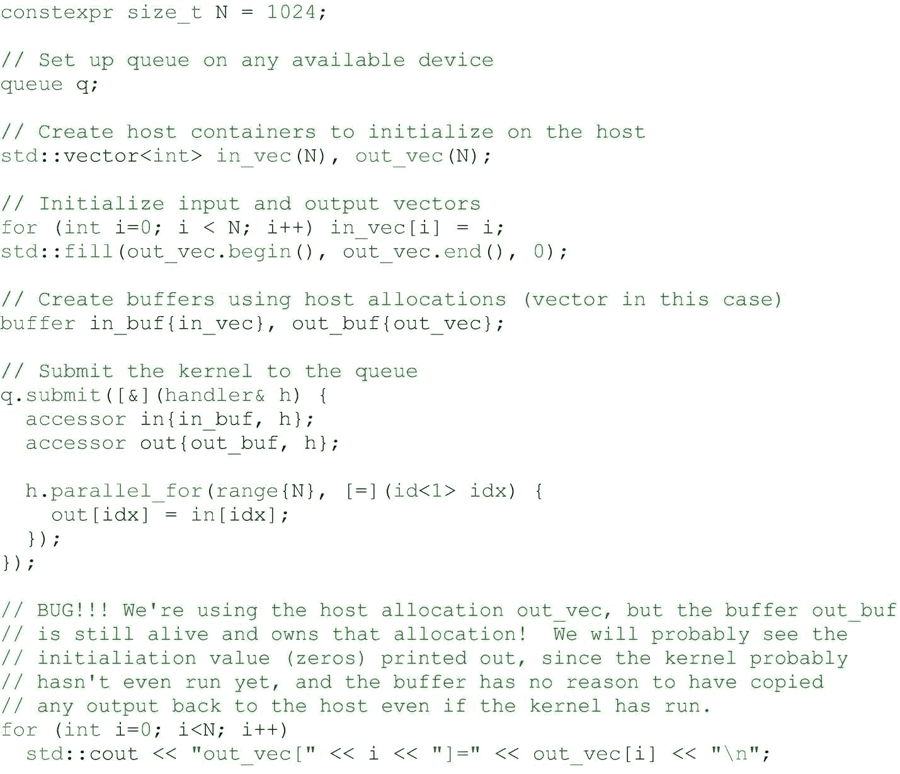

图 13-7

常见错误:在缓冲区生存期内直接从主机分配中读取数据

高级用户可能更喜欢使用缓冲区销毁将结果数据从内核返回到主机内存分配中。但是对于大多数用户，尤其是新开发人员，建议使用限定了作用域的主机访问器。

更喜欢使用主机访问器而不是缓冲区的作用域，尤其是在入门时。

为了避免这些错误，我们建议在开始使用 SYCL 和 DPC++ 时使用主机访问器而不是缓冲区范围。主机访问器提供从主机到缓冲区的访问，一旦它们的构造器已经完成运行，我们保证任何先前对缓冲区的写入(例如，来自在`host_accessor`被创建之前提交的内核)已经执行并且是可见的。本书混合使用了这两种风格(即，主机访问器和传递给缓冲区构造函数的主机分配),以使读者熟悉这两种风格。在开始使用时，使用主机访问器往往不容易出错。图 [13-8](#Fig8) 展示了如何使用主机访问器从内核中读取输出，而不需要首先破坏缓冲区。

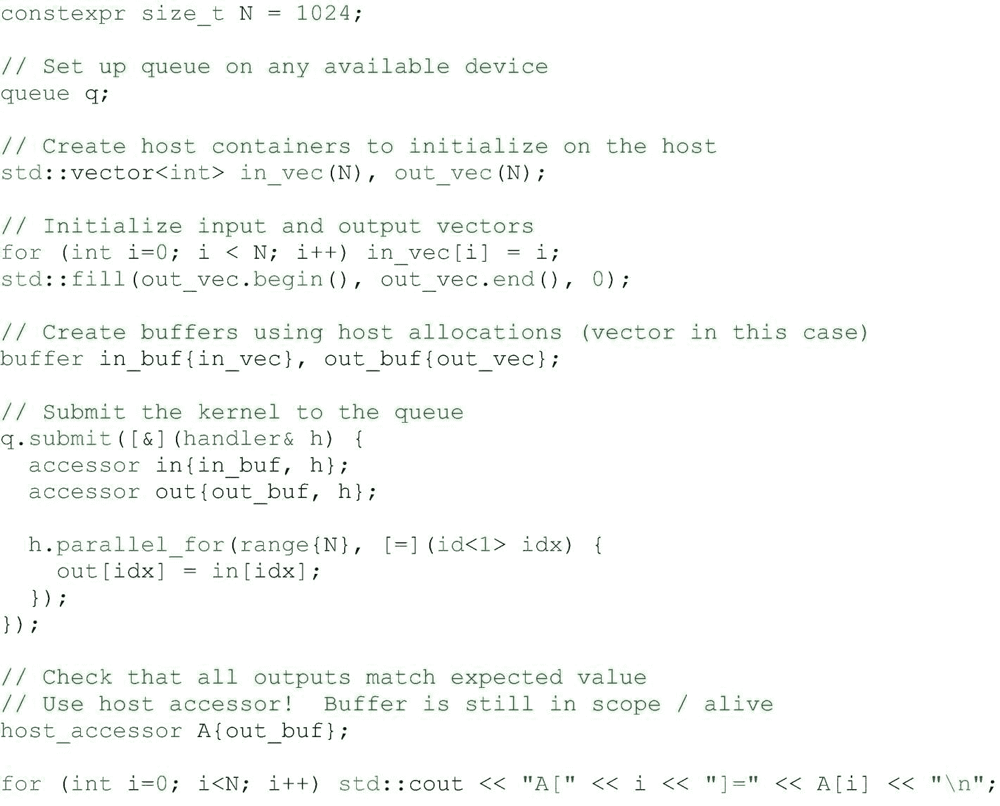

图 13-8

建议:使用主机访问器读取内核结果

只要缓冲区是活动的，就可以使用主机访问器，比如在典型缓冲区生命周期的两端——用于缓冲区内容的初始化和从内核读取结果。图 [13-9](#Fig9) 显示了这种模式的一个例子。

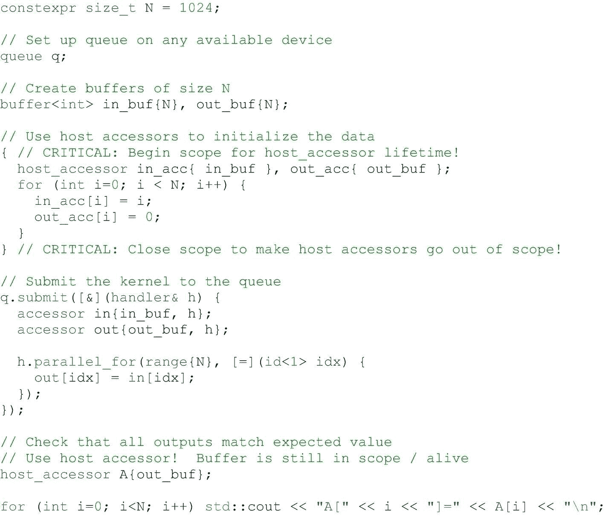

图 13-9

建议:使用主机访问器进行缓冲区初始化和结果读取

要提到最后一个细节是，主机访问器有时会在应用程序中引起相反的错误，因为它们也有生存期。当一个缓冲区的`host_accessor`处于活动状态时，运行时将不允许任何设备使用该缓冲区！运行时不分析我们的宿主程序来确定它们何时*可能*访问宿主访问器，所以它知道宿主程序已经完成访问缓冲区的唯一方法是运行`host_accessor`析构函数。如图 [13-10](#Fig10) 所示，如果我们的主机程序正在等待一些内核运行(例如`queue::wait()`或获取另一个主机访问器),并且如果 DPC++ 运行时正在等待我们的早期主机访问器被销毁，然后才能运行使用缓冲区的内核，这可能会导致应用程序看起来挂起。

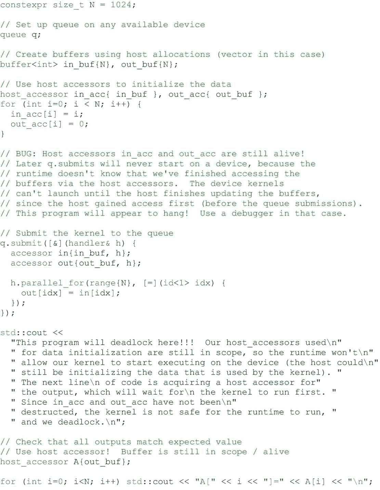

图 13-10

Bug(挂！)来自`host_accessors`的不当使用

使用主机访问器时，请确保在内核或其他主机访问器不再需要解锁缓冲区时销毁它们。

## 多个翻译单元

当我们想要调用内核中定义在不同翻译单元中的函数时，这些函数需要用`SYCL_EXTERNAL`标记。如果没有这个属性，编译器将只编译一个在设备代码之外使用的函数(从设备代码内部调用这个外部函数是非法的)。

如果我们在同一个翻译单元中定义函数，那么对于`SYCL_EXTERNAL`函数有一些限制是不适用的:

*   `SYCL_EXTERNAL`只能用于函数。

*   `SYCL_EXTERNAL`函数不能使用原始指针作为参数或返回类型。必须改用显式指针类。

*   `SYCL_EXTERNAL`函数不能调用`parallel_for_work_item`方法。

*   `SYCL_EXTERNAL`不能从`parallel_for_work_group`范围内调用函数。

如果我们试图编译一个内核，它调用的函数不在同一个翻译单元内，也没有用`SYCL_EXTERNAL`声明，那么我们可能会遇到类似如下的编译错误

```cpp
error: SYCL kernel cannot call an undefined function without SYCL_EXTERNAL attribute

```

如果函数本身在没有`SYCL_EXTERNAL`属性的情况下被编译，我们可能会看到链接或运行时失败，比如

```cpp

terminate called after throwing an instance of 'cl::sycl::compile_program_error'
...error: undefined reference to ...

```

DPC++ 支持`SYCL_EXTERNAL.` SYCL 不要求编译器支持`SYCL_EXTERNAL`；一般来说，这是一个*可选的*功能。

### 多个翻译单元对性能的影响

编译模型的一个含义(见本章前面)是，如果我们将设备代码分散到多个翻译单元中，这可能会比我们的设备代码位于同一位置时触发更多的即时编译调用。这高度依赖于实现，并且随着实现的成熟会随着时间的推移而变化。

这种对性能的影响很小，在我们的大多数开发工作中可以忽略，但是当我们进行微调以最大限度地提高代码性能时，我们可以考虑两件事情来减轻这些影响:(1)将设备代码组合在同一个翻译单元中，以及(2)使用提前编译来完全避免即时编译的影响。由于这两者都需要我们付出一些努力，所以我们只有在完成开发并试图充分利用应用程序的性能时才会这样做。当我们求助于这种详细的调优时，有必要测试这些变化，以观察它们对我们正在使用的 SYCL 实现的影响。

## 当匿名的兰姆达需要名字的时候

SYCL 提供了指定定义为 lambdas 的名称，以备工具需要和用于调试目的(例如，根据用户定义的名称启用显示)。在本书的大部分内容中，匿名 lambda 被用于内核，因为使用 DPC++ 时不需要名字(除了编译选项的传递，如第 [10](10.html#b978-1-4842-5574-2_10) 章中关于 lambda 命名的讨论所述)。从 SYCL 2020 暂定开始，它们也是可选的。

当我们有在一个代码库上混合来自多个供应商的 SYCL 工具的高级需求时，工具可能要求我们命名为 lambdas。这是通过在使用 lambda 的 SYCL 动作构造中添加一个`<class uniquename>`(例如`parallel_for`)来实现的。这种命名允许来自多个厂商的工具在一次编译中以一种定义的方式进行交互，并且还可以通过显示我们在调试工具和层中定义的内核名称来提供帮助。

## 从 CUDA 迁移到 SYCL

将 CUDA 代码迁移到 SYCL 或 DPC++ 在本书中没有详细介绍。有一些工具和资源可以探索如何做到这一点。移植 CUDA 代码相对简单，因为它是一种基于内核的并行方法。一旦用 SYCL 或 DPC++ 编写，这个新程序就能针对比 CUDA 单独支持的更多的设备。新增强的程序仍然可以针对 NVIDIA GPU，使用支持 NVIDIA GPU 的 SYCL 编译器。

迁移到 SYCL 打开了 SYCL 支持的设备多样性的大门，这远远超出了 GPU。

当使用 DPC++ 兼容性工具时，`--report-type=` `value`选项提供了关于移植代码的非常有用的统计信息。这本书的一位评论家称之为“英特尔`dpct`提供的一面美丽的旗帜。”根据项目的源代码组织，在移植 CUDA 代码时,`--in-root`选项可以证明非常有用。

要了解关于 CUDA 迁移的更多信息，有两个资源是很好的起点:

*   英特尔的 DPC++ 兼容工具将 CUDA 应用转化为 DPC++ 代码([tinyurl . com/cudatodcppp](http://tinyurl.com/CUDAtoDPCpp))。

*   Codeplay 教程“从 CUDA 迁移到 SYCL”([tinyurl . com/codeplayCUDAtoSY CL](http://tinyurl.com/codeplayCUDAtoSYCL))。

## 摘要

今天的流行文化经常把小费称为生活窍门。不幸的是，编程文化经常赋予*黑客*一个负面的含义，所以作者避免将这一章命名为“SYCL 黑客”毫无疑问，本章只是触及了使用 SYCL 和 DPC++ 的一些实用技巧。更多的技巧可以在[在线论坛](https://software.intel.com/forums/)上分享，我们一起学习如何用 DPC++ 充分利用 SYCL。

[](https://creativecommons.org/licenses/by/4.0) 

**开放存取**本章根据知识共享署名 4.0 国际许可证(http://Creative Commons . org/licenses/by/4.0/)的条款获得许可，该许可证允许以任何媒体或格式使用、共享、改编、分发和复制，只要您适当注明原作者和来源，提供知识共享许可证的链接并指明是否进行了更改。

本章中的图像或其他第三方材料包含在本章的知识共享许可中，除非在材料的信用额度中另有说明。如果材料不包括在本章的知识共享许可中，并且您的预期使用不被法律法规允许或超出了允许的使用范围，您将需要直接从版权所有者处获得许可。