# 14.常见的并行模式

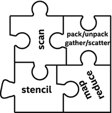

当我们处于程序员的最佳状态时，我们识别工作中的模式，并应用被时间证明是最佳解决方案的技术。并行编程也不例外，如果不研究在这个领域中已经被证明有用的模式，那将是一个严重的错误。考虑大数据应用采用的 MapReduce 框架；他们的成功很大程度上源于基于两个简单而有效的并行模式——*map*和 *reduce* 。

并行编程中有许多常见的模式，它们一次又一次地出现，与我们使用的编程语言无关。这些模式是通用的，可以在任何并行级别(例如子组、工作组、完整设备)和任何设备(例如 CPU、GPU、FPGAs)上使用。然而，模式的某些属性(比如它们的可伸缩性)可能会影响它们对不同设备的适用性。在某些情况下，使应用程序适应新设备可能只需要选择适当的参数或微调模式的实现；在其他情况下，我们可以通过选择完全不同的模式来提高性能。

理解如何、何时以及在哪里使用这些常见的并行模式是提高我们对 DPC++(以及一般的并行编程)的熟练程度的关键部分。对于那些已经有并行编程经验的人来说，了解这些模式在 DPC++ 中是如何表达的，是一种快速提高和熟悉该语言功能的方法。

本章旨在回答以下问题:

*   理解哪些模式是最重要的？

*   这些模式与不同设备的功能有什么关系？

*   哪些模式已经作为 DPC++ 函数和库提供了？

*   如何使用直接编程来实现这些模式？

## 理解模式

这里讨论的模式是麦克库尔等人在《结构化并行编程》一书中描述的并行模式的一个子集。我们不讨论与并行的*类型*相关的模式(例如，fork-join，branch-and-bound ),而是集中讨论对编写数据并行内核最有用的算法模式。

我们完全相信，理解并行模式的子集对于成为一名有效的 DPC++ 程序员至关重要。图 [14-1](#Fig1) 中的表格提供了不同模式的高级概述，包括它们的主要用例、关键属性以及它们的属性如何影响它们与不同硬件设备的关联性。

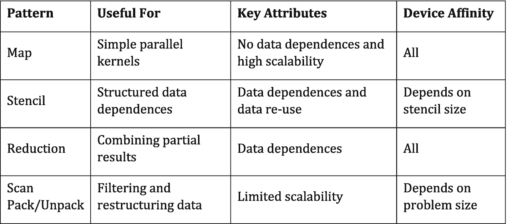

图 14-1

并行模式及其对不同设备类型的相似性

### 地图

map 模式是所有模式中最简单的并行模式，具有函数式编程语言经验的读者会很快熟悉它。如图 [14-2](#Fig2) 所示，通过应用一些函数，一个范围的每个输入元素被独立地*映射*到一个输出。许多数据并行操作可以表示为映射模式的实例(例如，向量加法)。

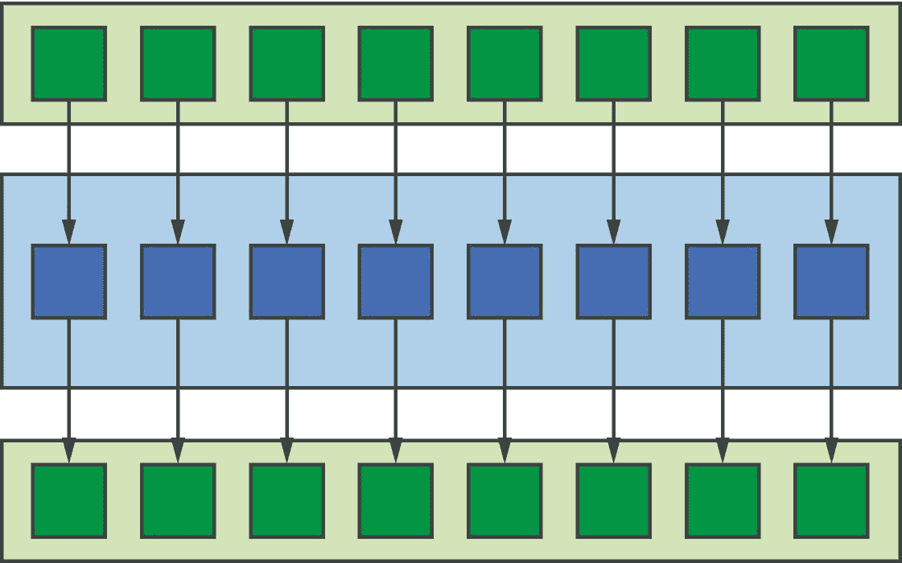

图 14-2

地图图案

由于函数的每个应用程序都是完全独立的，map 的表达式通常非常简单，依靠编译器和/或运行时来完成大部分困难的工作。我们应该期望写入 map 模式的内核适用于任何设备，并且这些内核的性能能够很好地与可用的硬件并行性相适应。

然而，在决定将整个应用程序重写为一系列地图内核之前，我们应该仔细考虑！这种开发方法效率很高，并保证应用程序可以移植到各种各样的设备类型，但鼓励我们忽略可能显著提高性能的优化(例如，提高数据重用、融合内核)。

### 蜡纸

模板图案与贴图图案密切相关。如图 [14-3](#Fig3) 所示，一个函数应用于一个输入和一组由*模板*描述的相邻输入，以产生一个输出。模板图案经常出现在许多领域，包括科学/工程应用(例如有限差分代码)和计算机视觉/机器学习应用(例如图像卷积)。

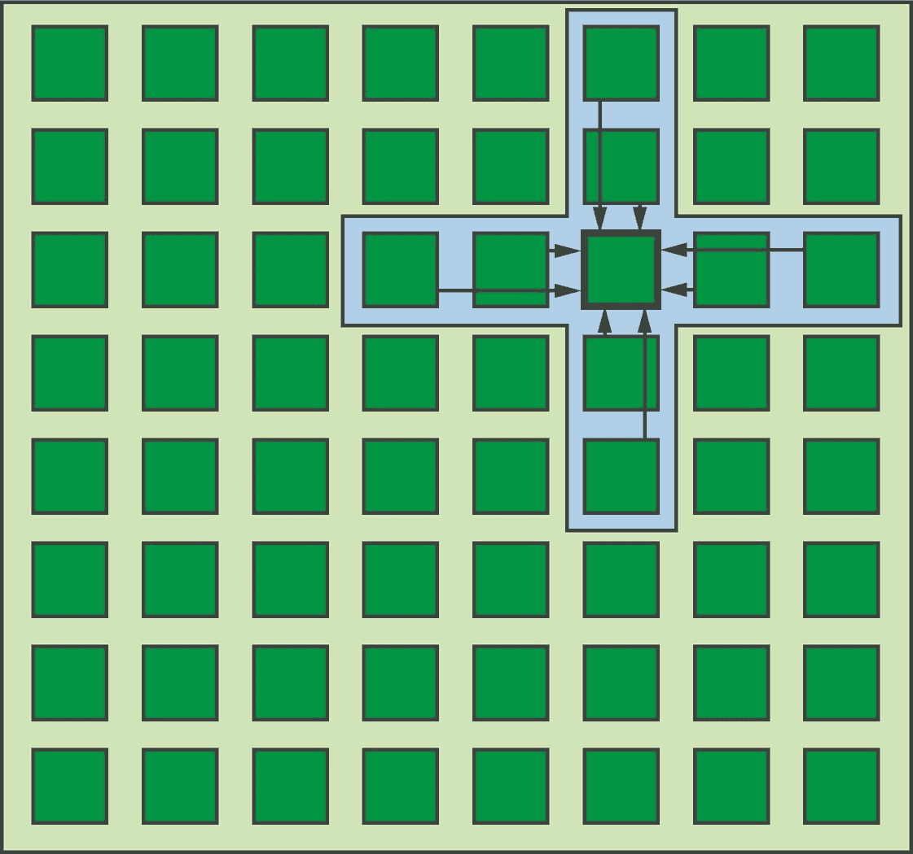

图 14-3

模板图案

当模板模式不在适当位置执行时(即，将输出写入单独的存储位置)，该功能可以独立地应用于每个输入。现实世界中调度模板通常比这更复杂:计算相邻的输出需要相同的数据，多次从内存中加载该数据会降低性能；我们可能希望就地应用模板(即，覆盖原始输入值)以减少应用程序的内存占用。

因此，模板内核对不同设备的适用性高度依赖于模板的属性和输入问题。根据经验法则:

*   小模板可以从 GPU 的暂存存储中受益。

*   大型模板可以受益于(相对)较大的 CPU 缓存。

*   通过在 FPGAs 上实现脉动阵列，对小输入进行操作的小模板可以实现显著的性能增益。

由于模板很容易描述，但实现起来很复杂，因此模板是领域特定语言(DSL)开发中最活跃的领域之一。已经有几个嵌入式 DSL 利用 C++ 的模板元编程功能在编译时生成高性能的模板内核，我们希望这些框架移植到 DPC++ 只是时间问题。

### 减少

归约是一种常见的并行模式，*使用通常为*关联*和*交换*的操作符(例如，加法)组合来自内核调用的每个实例的*部分结果。缩减的最普遍的例子是计算总和(例如，当计算点积时)或计算最小/最大值(例如，使用最大速度来设置时间步长)。

图 [14-4](#Fig4) 显示了通过树归约实现的归约模式，这是一种流行的实现方式，需要对一系列 *N* 输入元素进行 log 2 ( *N* )组合运算。虽然树归约很常见，但其他实现也是可能的——一般来说，我们不应该假设归约以特定的顺序组合值。

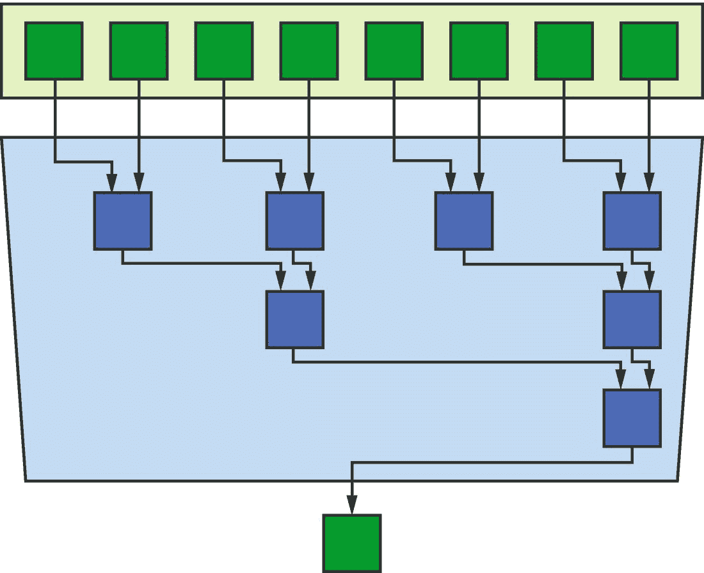

图 14-4

还原模式

在现实生活中，内核很少是令人尴尬的并行，即使它们是并行的，它们也经常与 Reduce 成对出现(如在 MapReduce 框架中)来总结它们的结果。这使得 reductions 成为需要理解的最重要的并行模式之一，也是我们*必须*能够在任何设备上高效执行的模式。

针对不同设备调整缩减是计算部分结果所花费的时间和组合它们所花费的时间之间的微妙平衡；使用太少的并行会增加计算时间，而使用太多的并行会增加组合时间。

通过使用不同的设备执行计算和组合步骤来提高整体系统利用率可能很有吸引力，但是这种调整工作必须仔细考虑在设备之间移动数据的成本。在实践中，我们发现在数据产生时直接在同一设备上执行缩减通常是最佳方法。因此，使用多个设备来提高归约模式的性能不依赖于任务并行性，而是依赖于另一个级别的数据并行性(即，每个设备对部分输入数据执行归约)。

### 扫描

扫描模式使用二元关联运算符计算广义前缀和，输出的每个元素代表一个部分结果。如果元素 *i* 的部分和是范围【0， *i* 中所有元素的和(即包括 i 的和*),则称一次扫描为*包含*。如果元素 *i* 的部分和是范围[0， *i* ]中所有元素的和(即不包括 i* 的和*，则称扫描为*互斥*。*

乍一看，扫描似乎是一个固有的串行操作，因为每个输出的值取决于前一个输出的值！虽然 scan 确实比其他模式具有更少的并行机会(因此可扩展性可能更差)，但图 [14-5](#Fig5) 显示了在相同数据上使用多次扫描来实现并行扫描是可能的。

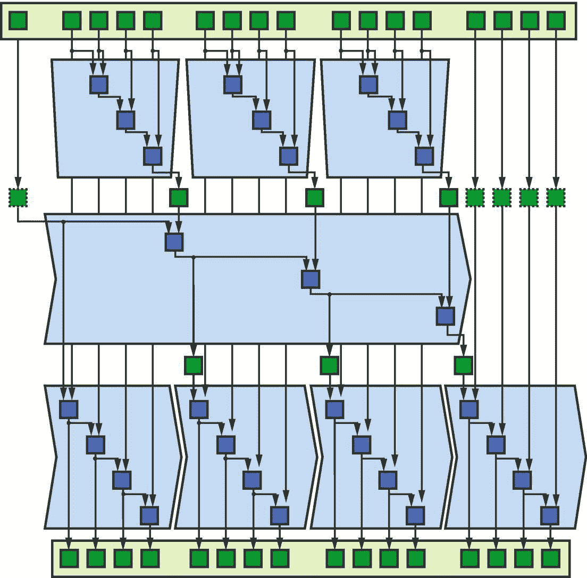

图 14-5

扫描模式

因为扫描操作中的并行机会有限，所以执行扫描的最佳设备在很大程度上取决于问题大小:较小的问题更适合 CPU，因为只有较大的问题才会包含足以使 GPU 饱和的数据并行度。对于 FPGAs 和其他空间架构来说，问题的大小并不重要，因为扫描自然有助于流水线并行。与缩减的情况一样，一个很好的经验法则是在生成数据的同一设备上执行扫描操作，在优化期间考虑扫描操作适合应用程序的位置和方式通常会比单独优化扫描操作产生更好的结果。

### 打包和拆包

打包和解包模式与扫描密切相关，通常在扫描功能的基础上实现。我们在这里将它们分开讨论，因为它们实现了可能与前缀和没有明显联系的常见操作的高性能实现(例如，添加到列表中)。

#### 包装

如图 [14-6](#Fig6) 所示，填充模式基于布尔条件丢弃输入范围的元素，*将未被丢弃的元素*填充到输出范围的连续位置。该布尔条件可以是预先计算的掩码，或者可以通过对每个输入元素应用某个函数来在线计算。

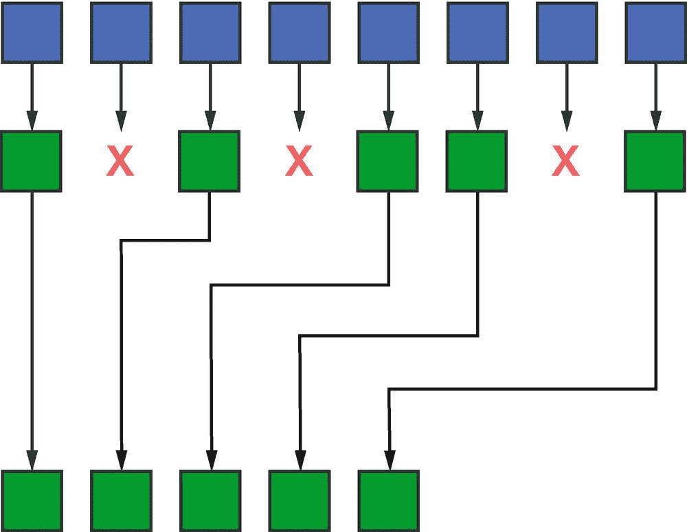

图 14-6

包装模式

与扫描一样，打包操作具有内在的串行性质。给定要打包/复制的输入元素，计算其在输出范围中的位置需要关于有多少先前元素也被打包/复制到输出中的信息。该信息相当于对驱动包的布尔条件的排他扫描。

#### 解除…的负担

如图 [14-7](#Fig7) 所示(顾名思义)，解包模式与打包模式相反。输入范围的连续元素被*解包*到输出范围的非连续元素中，其他元素保持不变。这种模式最明显的用例是解包先前打包的数据，但是它也可以用来填充先前计算产生的数据中的“空隙”。

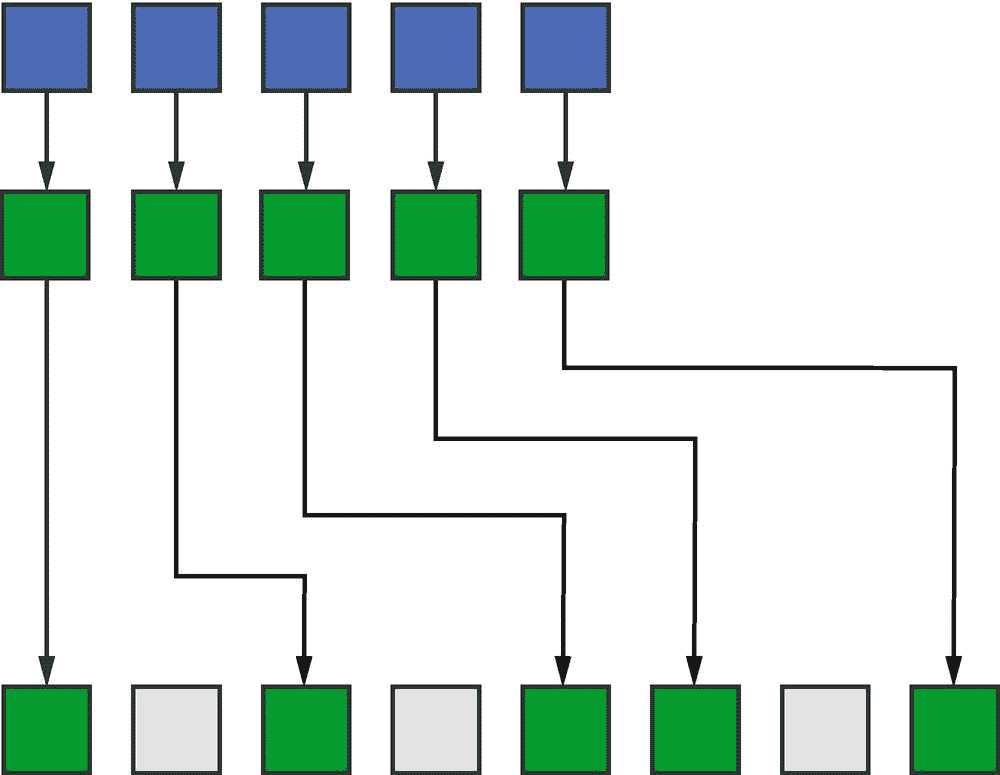

图 14-7

解包模式

## 使用内置函数和库

这些模式中有许多可以直接使用 DPC++ 的内置功能或供应商提供的用 DPC++ 编写的库来表达。在真正的大型软件工程项目中，利用这些函数和库是平衡性能、可移植性和生产率的最佳方式。

### DPC++ 简化库

DPC++ 提供了一种方便的抽象来描述具有归约语义的变量，而不是要求我们每个人都维护自己的可移植的高性能归约内核库。这种抽象简化了归约核的表达式，并使归约被执行的事实显式化，从而允许实现为设备、数据类型和归约操作的不同组合在不同的归约算法之间进行选择。

图 [14-8](#Fig8) 中的内核展示了一个使用归约库的例子。注意，内核体不包含任何对归约的引用——我们必须指定的是，内核包含一个归约，它使用`plus`仿函数组合了`sum`变量的实例。这为自动生成优化的缩减序列的实现提供了足够的信息。

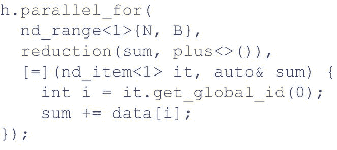

图 14-8

使用归约库表示为 ND 范围数据并行核的归约

在撰写本文时，归约库只支持具有单个归约变量的内核。DPC++ 的未来版本有望支持同时执行多个归约的内核，方法是在传递给`parallel_for`的`nd_range`和仿函数参数之间指定多个归约，并将多个归约器作为内核仿函数的参数。

在内核完成之前，不保证归约的结果会被写回原始变量。除了这个限制之外，访问归约结果的行为与访问 SYCL 中的任何其他变量的行为相同:访问存储在缓冲区中的归约结果需要创建适当的设备或主机访问器，而访问存储在 USM 分配中的归约结果可能需要显式同步和/或内存移动。

DPC++ 归约库不同于其他语言中的归约抽象的一个重要方面是，它限制了我们在内核执行期间对归约变量的访问——我们不能检查归约变量的中间值，并且我们被禁止使用除指定组合函数之外的任何东西来更新归约变量。这些限制防止我们犯难以调试的错误(例如，在试图计算最大值时添加缩减变量)，并确保缩减可以在各种不同的设备上有效地实现。

#### `reduction`类

`reduction`类是我们用来描述内核中的缩减的接口。构造归约对象的唯一方法是使用图 [14-9](#Fig9) 所示的函数之一。

图 14-9

`reduction`函数的函数原型

该函数的第一个版本允许我们指定归约变量和用于合并每个工作项贡献的操作符。第二个版本允许我们提供一个与归约操作符相关联的可选标识值——这是对用户定义的归约的一个优化，我们稍后将再次讨论。

注意，`reduction`函数的返回类型是未指定的，而`reduction`类本身完全是实现定义的。尽管这对于 C++ 类来说可能有点不寻常，但它允许一个实现使用不同的类(或者一个具有任意数量模板参数的类)来表示不同的归约算法。DPC++ 的未来版本可能会决定重新考虑这种设计，以便使我们能够在特定的执行上下文中显式地请求特定的归约算法。

#### `reducer`类

`reducer`类的一个实例封装了一个归约变量，公开了一个有限的接口，确保我们不能以任何实现认为不安全的方式更新归约变量。图 [14-10](#Fig10) 中显示了`reducer`等级的简化定义。像`reduction`类一样，`reducer`类的精确定义是实现定义的——缩减器的类型将取决于缩减是如何执行的，为了最大化性能，在编译时知道这一点很重要。然而，允许我们更新归约变量的函数和操作符是定义良好的，并且保证受任何 DPC++ 实现的支持。

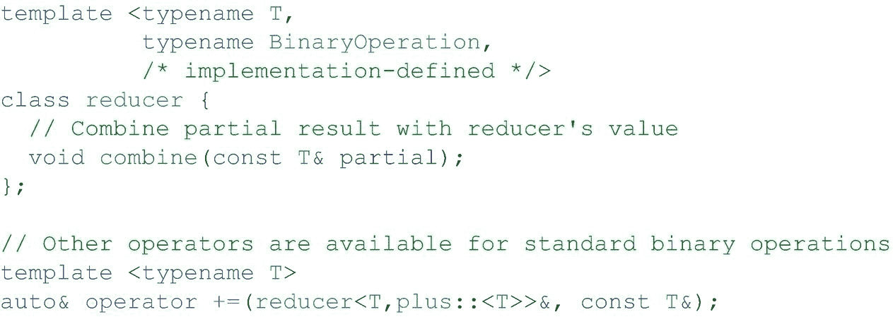

图 14-10

`reducer`类的简化定义

具体来说，每个 reducer 都提供了一个`combine()`函数，它将部分结果(来自单个工作项)与 reduction 变量的值结合起来。这个组合函数的行为是由实现定义的，但这不是我们在编写内核时需要担心的。根据归约运算符，还需要一个归约运算符来使其他运算符可用；例如，`+=`运算符是为`plus`归约而定义的。提供这些额外的运算符只是为了方便程序员并提高可读性；在它们可用的地方，这些操作符具有与直接调用`combine()`相同的行为。

#### 用户定义的缩减

几个常见的归约算法(例如，树归约)并不看到每个工作项直接更新单个共享变量，而是在私有变量中累积一些部分结果，这些部分结果将在将来的某个时刻被组合。这样的私有变量引入了一个问题:实现应该如何初始化它们？将变量初始化为每个工作项的第一个贡献具有潜在的性能影响，因为需要额外的逻辑来检测和处理未初始化的变量。相反，将变量初始化为归约运算符的标识可以避免性能损失，但只有在标识已知的情况下才有可能。

当归约操作在简单算术类型上并且归约运算符是标准函子(例如，`plus`)时，DPC++ 实现只能自动确定要使用的正确标识值。对于用户定义的约简(即那些对用户定义的类型进行操作和/或使用用户定义的函子的约简)，我们可以通过直接指定标识值来提高性能。

对用户定义的归约的支持仅限于普通的可复制类型和没有副作用的组合函数，但这足以支持许多现实生活中的用例。例如，图 [14-11](#Fig11) 中的代码演示了使用用户定义的归约来计算向量中的最小元素及其位置。

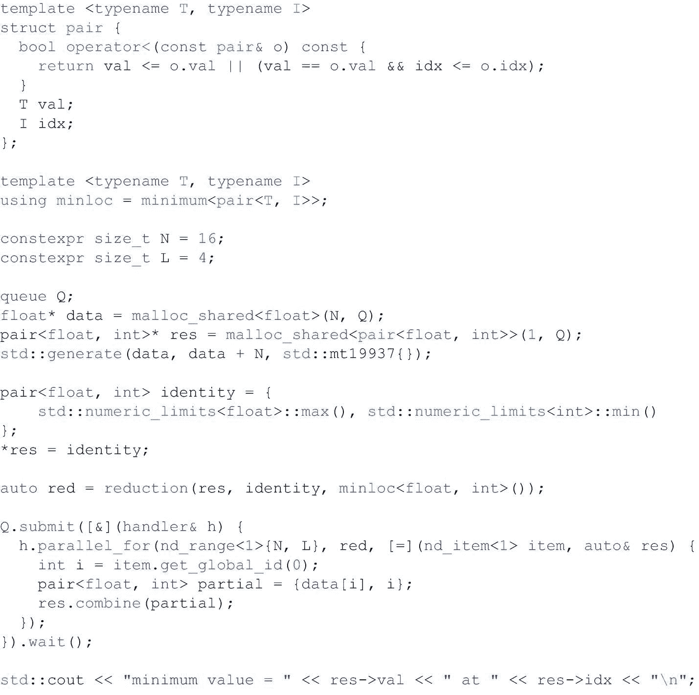

图 14-11

使用用户定义的约简，通过 ND-range 核找到最小值的位置

### oneAPI DPC++ 库

C++ 标准模板库(STL)包含了几个与本章讨论的并行模式相对应的算法。STL 中的算法通常适用于由成对迭代器指定的序列，并且从 C++17 开始，支持一个*执行策略*参数，表示它们应该顺序执行还是并行执行。

oneAPI DPC++ 库(oneDPL)利用这一执行策略参数来提供一种高效的并行编程方法，这种方法利用了在幕后用 DPC++ 编写的内核。如果一个应用程序可以单独使用 STL 算法的功能来表达，那么 oneDPL 就可以在不编写任何 DPC++ 内核代码的情况下利用我们系统中的加速器！

图 [14-12](#Fig12) 中的表格显示了 STL 中可用的算法如何与本章中描述的并行模式相关联，以及如何与传统串行算法(在 C++17 之前可用)相关联。关于如何在 DPC++ 应用中使用这些算法的更详细的解释可以在第 [18](18.html#b978-1-4842-5574-2_18) 章中找到。

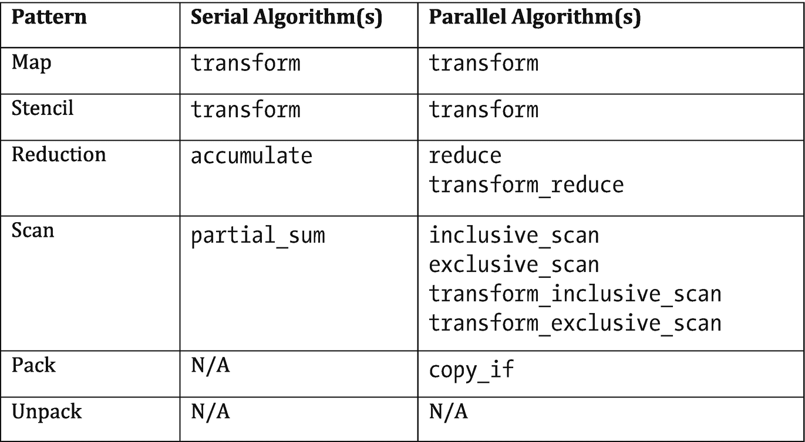

图 14-12

将并行模式与 C++17 算法库相关联

### 群组功能

DPC++ 设备代码中对并行模式的支持由单独的*组函数*库提供。这些组函数利用特定工作项目组(即工作组或子组)的并行性来在有限的范围内实现通用并行算法，并且可以用作构建块来构造其他更复杂的算法。

与 oneDPL 一样，DPC++ 中组函数的语法基于 C++ 中算法库的语法。每个函数的第一个参数接受一个`group`或`sub_group`对象来代替执行策略，C++ 算法的任何限制都适用。组功能由指定组中的所有工作项目协作执行，因此必须类似于组屏障来处理——组中的所有工作项目必须在聚合控制流中遇到相同的算法(即，组中的所有工作项目必须类似地遇到或不遇到算法调用)，并且所有工作项目必须提供相同的功能参数，以便确保它们在正在执行的操作上达成一致。

在撰写本文时，`reduce`、`exclusive_scan`和`inclusive_scan`函数仅限于支持原始数据类型和最常见的归约运算符(例如，`plus`、`minimum`和`maximum`)。这对于许多用例来说已经足够了，但是 DPC++ 的未来版本有望将集体支持扩展到用户定义的类型和操作符。

## 直接编程

尽管我们建议尽可能地利用库，但是我们可以通过查看如何使用“本地”DPC++ 内核实现每个模式*来学习很多东西。*

本章剩余部分中的内核不应期望达到与高度调优的库相同的性能水平，但有助于更好地理解 DPC++ 的功能，甚至可以作为构建新库功能原型的起点。

USE VENDOR-PROVIDED LIBRARIES!

当供应商提供一个函数的库实现时，使用它比将函数重新实现为内核几乎总是有益的！

### 地图

由于其简单性，map 模式可以直接实现为一个基本的并行内核。图 [14-13](#Fig13) 所示的代码显示了这样一个实现，使用 map 模式计算一个范围内每个输入元素的平方根。

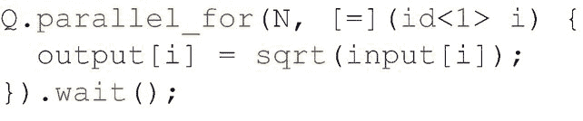

图 14-13

在数据并行内核中实现 map 模式

### 蜡纸

如图 [14-14](#Fig14) 所示，将模板直接实现为具有多维缓冲区的多维基本数据并行内核，简单易懂。

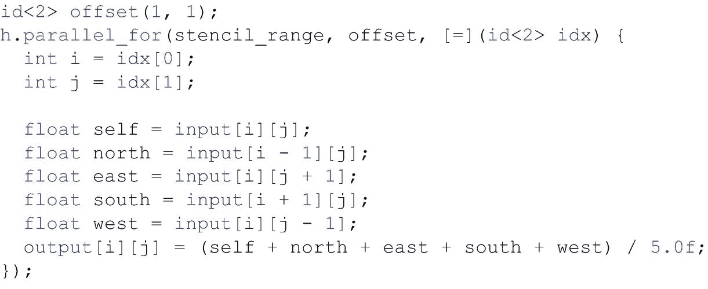

图 14-14

在数据并行内核中实现模板模式

然而，模板模式的这种表达非常幼稚，不应该期望表现得很好。正如本章前面提到的，众所周知，需要利用局部性(通过空间或时间分块)来避免从内存中重复读取相同的数据。图 [14-15](#Fig15) 显示了一个使用工作组本地内存的简单空间分块示例。

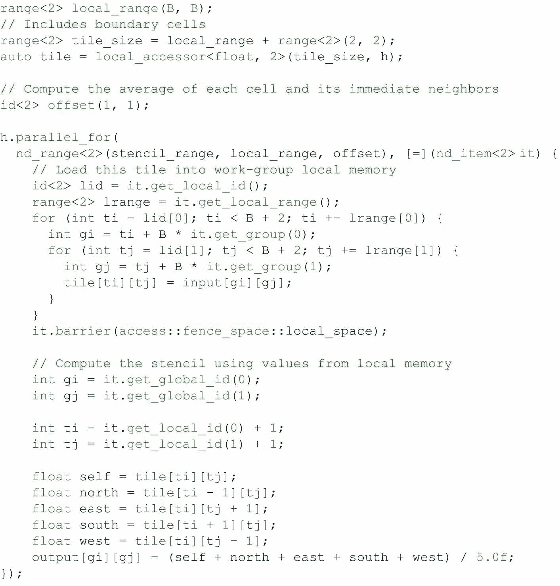

图 14-15

使用工作组本地内存在 ND-range 内核中实现模板模式

为给定模板选择最佳优化需要编译时对块大小、邻域和模板函数本身进行自省，这需要比这里讨论的更复杂的方法。

### 减少

通过利用在工作项之间提供同步和通信能力的语言特性(例如，原子操作、工作组和子组功能、子组洗牌)，可以在 DPC++ 中实现归约内核。图 [14-16](#Fig16) 和 [14-17](#Fig17) 中的内核显示了两种可能的归约实现:使用基本`parallel_for`的简单归约和每个工作项的原子操作；还有一个稍微聪明一点的缩减，分别使用 ND-range `parallel_for`和 work-group `reduce`函数来利用局部性。我们将在第 [19](19.html#b978-1-4842-5574-2_19) 章更详细地回顾这些原子操作。

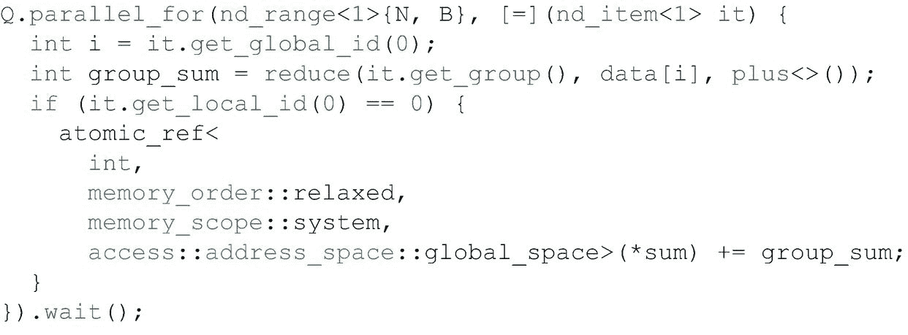

图 14-17

实现一个表示为 ND-range 核的简单约简

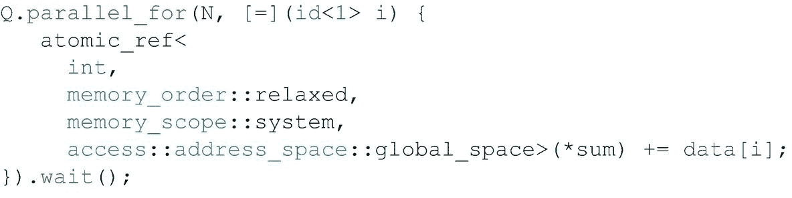

图 14-16

实现表示为数据并行内核的简单约简

有许多其他方式来编写归约内核，并且不同的设备可能会偏好不同的实现，这是由于对原子操作的硬件支持、工作组本地存储器大小、全局存储器大小、快速设备范围屏障的可用性，或者甚至专用归约指令的可用性的差异。在某些架构上，它甚至可能更快(或者是必要的！)使用 log 2 ( *N* )个单独的内核调用来执行树缩减。

我们强烈建议，只有在 DPC++ reduction 库不支持的情况下，或者当针对特定设备的功能对内核进行微调时，才考虑手动实现 reduction——即使这样，也只有在 100%确定 reduction 库性能不佳之后！

### 扫描

正如我们在本章前面所看到的，实现并行扫描需要对数据进行多次扫描，并且在每次扫描之间进行同步。由于 DPC++ 不提供同步 ND 范围内所有工作项的机制，因此必须使用多个内核来直接实现设备范围的扫描，这些内核通过全局内存来传递部分结果。

如图 [14-18](#Fig18) 、 [14-19](#Fig19) 和 [14-20](#Fig20) 所示的代码展示了使用几个内核实现的包容性扫描。第一个内核跨工作组分发输入值，在工作组本地内存中计算工作组本地扫描(注意，我们可以使用工作组`inclusive_scan`函数代替)。第二个内核使用单个工作组计算局部扫描，这次是基于每个块的最终值。第三个内核组合这些中间结果来最终确定前缀和。这三个内核对应着图 [14-5](#Fig5) 中图的三层。

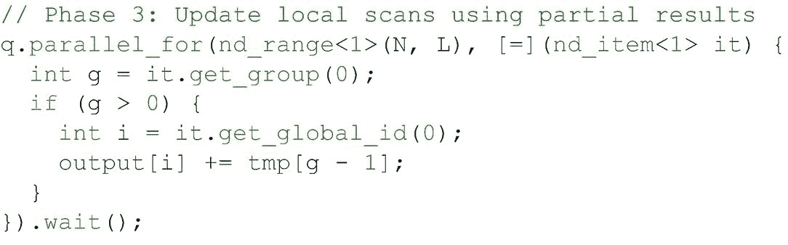

图 14-20

在 ND 范围内核中实现全局包含扫描的第 3 阶段(最终阶段)

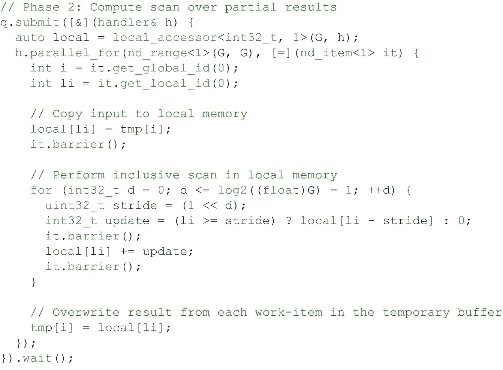

图 14-19

在 ND-range 内核中实现全局包含扫描的第 2 阶段:扫描每个工作组的结果

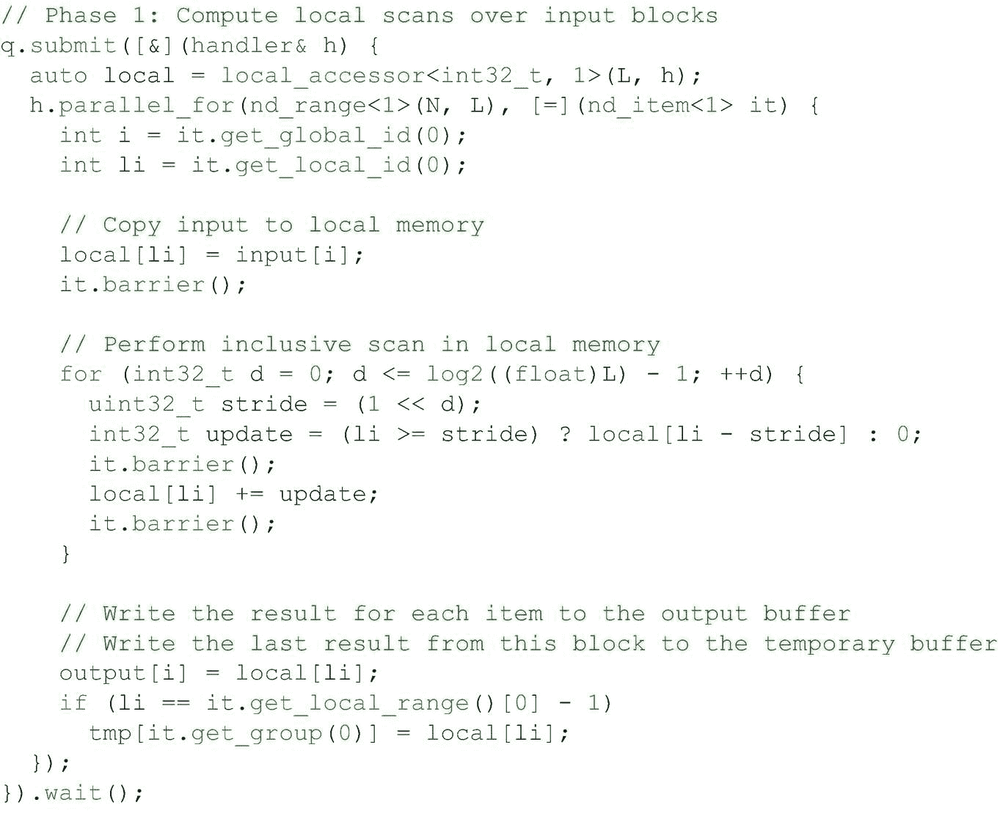

图 14-18

在 ND-range 内核中实现全局包含扫描的第 1 阶段:跨每个工作组进行计算

图 [14-18](#Fig18) 和 [14-19](#Fig19) 非常相似；唯一的区别是范围的大小以及输入和输出值的处理方式。这种模式的实际实现可以使用一个带有不同参数的函数来实现这两个阶段，出于教学原因，这里只将它们作为不同的代码。

### 打包和拆包

打包和解包也称为收集和分散操作。这些操作处理数据在内存中的排列方式以及我们希望将其呈现给计算资源的方式之间的差异。

#### 包装

由于 pack 依赖于独占扫描，所以实现适用于 ND-range 的所有元素的 pack 也必须通过全局内存并在几个内核入队的过程中进行。但是，有一种常见的包装用例，它不要求将操作应用于 ND 范围的所有元素，即只在特定工作组或子组中的项目上应用包装。

图 [14-21](#Fig21) 中的片段显示了如何在独占扫描的基础上实现组包操作。

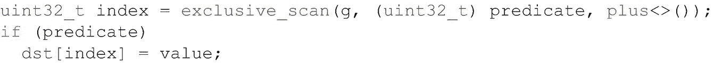

图 14-21

在独占扫描的基础上实现组打包操作

图 [14-22](#Fig22) 中的代码演示了如何在内核中使用这种打包操作来构建需要一些额外后处理的元素列表(在未来的内核中)。所示的例子基于来自分子动力学模拟的真实内核:分配给粒子 *i* 的子组中的工作项合作识别在 *i* 的固定距离内的所有其他粒子，并且只有该“邻居列表”中的粒子将用于计算作用在每个粒子上的力。

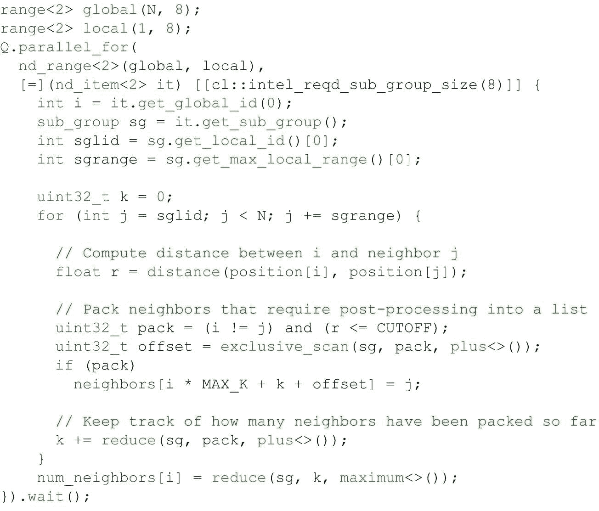

图 14-22

使用子组打包操作来构建需要附加后处理的元素列表

请注意，pack 模式不会对元素进行重新排序——打包到输出数组中的元素会按照它们在输入中的顺序出现。pack 的这个属性很重要，它使我们能够使用 pack 功能来实现其他更抽象的并行算法(比如`std::copy_if`和`std::stable_partition`)。然而，有其他的并行算法可以在不需要维护顺序的包功能之上实现(例如`std::partition`)。

#### 解除…的负担

与 pack 一样，我们可以使用 scan 实现 unpack。图 [14-23](#Fig23) 显示了如何在独占扫描之上实现子组解包操作。

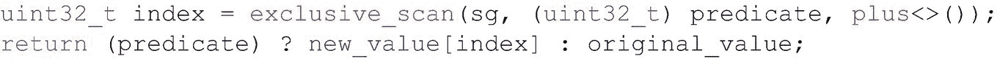

图 14-23

在独占扫描之上实现子组解包操作

图 [14-24](#Fig24) 中的代码演示了如何使用这样的子组解包操作来改善具有分散控制流的内核中的负载平衡(在这种情况下，计算 Mandelbrot 集)。每个工作项被分配一个单独的像素进行计算，并进行迭代，直到达到收敛或最大迭代次数。然后使用解包操作用新像素替换完成的像素。

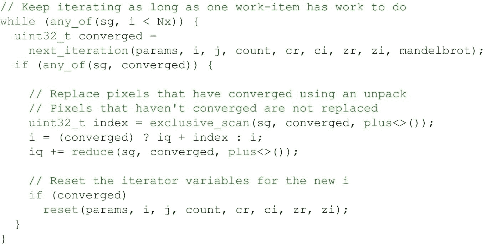

图 14-24

使用子组解包操作来改善具有不同控制流的内核的负载平衡

这种方法提高效率(和减少执行时间)的程度高度依赖于应用程序和输入，因为检查完成和执行解包操作都会引入一些开销！因此，在实际的应用程序中成功地使用这种模式将需要基于存在的差异量和正在执行的计算进行一些微调(例如，只有当活动工作项目的数量低于某个阈值时，才引入启发式方法来执行解包操作)。

## 摘要

本章展示了如何使用 DPC++ 和 SYCL 特性实现一些最常见的并行模式，包括内置函数和库。

SYCL 和 DPC++ 生态系统仍在开发中，随着开发人员从生产级应用程序和库的开发中获得更多的语言经验，我们期望发现这些模式的新的最佳实践。

### 更多信息

*   《结构化并行编程:高效计算的模式》,作者:迈克尔·麦克库尔、阿奇·罗宾逊和詹姆斯·赖因德斯，2012 年，由摩根·考夫曼出版，ISBN 978-0-124-15993-8

*   英特尔 oneAPI DPC++ 库指南， [`https://software.intel.com/en-us/oneapi-dpcpp-library-guide`](https://software.intel.com/en-us/oneapi-dpcpp-library-guide)

*   算法库，C++ 参考， [`https://en.cppreference.com/w/cpp/algorithm`](https://en.cppreference.com/w/cpp/algorithm)

 

**开放存取**本章根据知识共享署名 4.0 国际许可证(http://Creative Commons . org/licenses/by/4.0/)的条款获得许可，该许可证允许以任何媒体或格式使用、共享、改编、分发和复制，只要您适当注明原作者和来源，提供知识共享许可证的链接并指明是否进行了更改。

本章中的图像或其他第三方材料包含在本章的知识共享许可中，除非在材料的信用额度中另有说明。如果材料不包括在本章的知识共享许可中，并且您的预期使用不被法律法规允许或超出了允许的使用范围，您将需要直接从版权所有者处获得许可。