# 15.GPU 编程

在过去的几十年里，图形处理单元(GPU)已经从能够在屏幕上绘制图像的专用硬件设备发展成为能够执行复杂并行内核的通用设备。如今，几乎每台计算机都在传统 CPU 旁边包含一个 GPU，许多程序可以通过将并行算法的一部分从 CPU 卸载到 GPU 来加速。

在本章中，我们将描述典型的 GPU 如何工作，GPU 软件和硬件如何执行 SYCL 应用程序，以及在为 GPU 编写和优化并行内核时需要记住的技巧和技术。

## 性能警告

与任何处理器类型一样，GPU 因供应商而异，甚至因产品而异；因此，一种设备的最佳实践可能不是另一种设备的最佳实践。本章中的建议可能会让许多 GPU 受益，无论是现在还是将来，但是…

为了实现特定 GPU 的最佳性能，请始终查阅 GPU 供应商的文档！

本章末尾提供了许多 GPU 供应商的文档链接。

## GPU 如何工作

本节描述典型的 GPU 如何工作，以及 GPU 与其他类型的加速器有何不同。

### GPU 构建模块

图 [15-1](#Fig1) 显示了一个非常简化的 GPU，由三个高级构建模块组成:

1.  执行资源:GPU 的执行资源是执行计算工作的处理器。不同的 GPU 供应商对其执行资源使用不同的名称，但所有现代 GPU 都由多个可编程处理器组成。处理器可能是*异构的*并专门用于特定的任务，或者它们可能是*同构的*并可互换。大多数现代 GPU 的处理器都是*同类*且可互换的。

2.  固定功能:GPU 固定功能是比执行资源更不可编程的硬件单元，专门用于单一任务。当 GPU 用于图形时，图形管道的许多部分(如光栅化或光线跟踪)都是使用固定功能来执行的，以提高能效和性能。当 GPU 用于数据并行计算时，固定函数可以用于诸如工作负荷调度、纹理采样和依赖性跟踪之类的任务。

3.  Caches and memory: Like other processor types , GPUs frequently have caches to store data accessed by the execution resources. GPU caches may be *implicit* , in which case they require no action from the programmer, or may be *explicit* scratchpad memories, in which case a programmer must purposefully move data into a cache before using it. Many GPUs also have a large pool of memory to provide fast access to data used by the execution resources.

    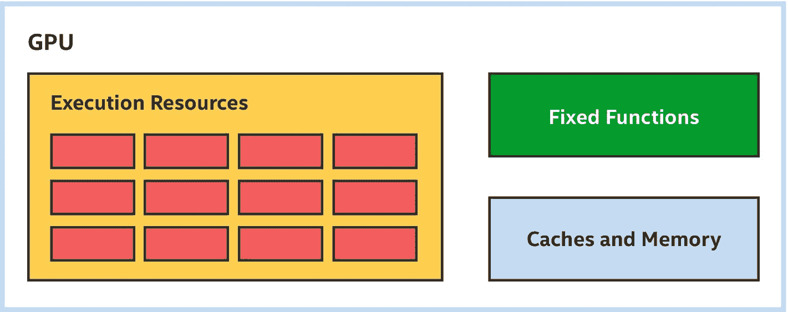

    图 15-1

    典型的 GPU 构建模块—不符合比例！

### 更简单的处理器(但更多)

传统上，在执行图形操作时，GPU 会处理大量数据。例如，典型的游戏帧或渲染工作负载涉及数千个顶点，每帧产生数百万个像素。为了保持交互式帧速率，必须尽可能快地处理这些大批量数据。

一个典型的 GPU 设计权衡是从构成执行资源的处理器中删除一些功能，以加速单线程性能，并使用这些节省来构建更多的处理器，如图 [15-2](#Fig2) 所示。例如，GPU 处理器可能不包括由其他类型的处理器使用的复杂无序执行能力或分支预测逻辑。由于这些权衡，单个数据元素在 GPU 上的处理速度可能比在另一个处理器上慢，但更多的处理器使 GPU 能够快速高效地处理许多数据元素。

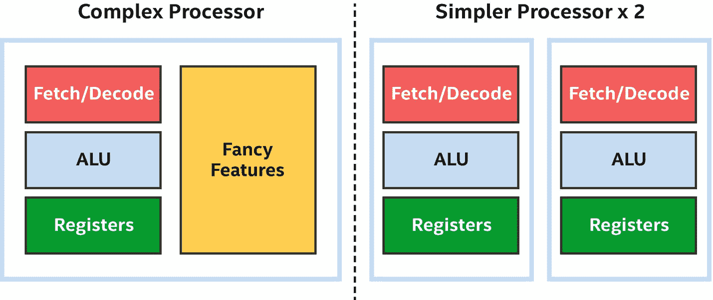

图 15-2

GPU 处理器更简单，但数量更多

为了在执行内核时利用这种权衡，给 GPU 足够大的数据元素处理范围是很重要的。为了证明卸载大量数据的重要性，考虑一下我们在本书中一直在开发和修改的矩阵乘法内核。

A REMINDER ABOUT MATRIX MULTIPLICATION

在本书中，矩阵乘法内核用于演示内核的变化或其调度方式如何影响性能。尽管使用本章中描述的技术可以显著提高矩阵乘法的性能，但矩阵乘法是一种非常重要和常见的运算，许多硬件(GPU、CPU、FPGA、DSP 等)都无法使用它。)供应商已经实现了包括矩阵乘法在内的许多例程的高度优化版本。这些厂商投入了大量的时间和精力来实现和验证特定设备的功能，并且在某些情况下可能使用在标准内核中难以或不可能使用的功能或技术。

USE VENDOR-PROVIDED LIBRARIES!

当供应商提供一个函数的库实现时，使用它比将函数重新实现为内核几乎总是有益的！对于矩阵乘法，人们可以将 oneMKL 作为英特尔 oneAPI 工具包的一部分，来寻找适合 DPC++ 程序员的解决方案。

通过将矩阵乘法内核作为单个任务提交到队列中，可以在 GPU 上轻松执行矩阵乘法内核。这个矩阵乘法内核的主体看起来就像一个在主机 CPU 上执行的函数，如图 [15-3](#Fig3) 所示。

图 15-3

单任务矩阵乘法看起来很像 CPU 主机代码

如果我们尝试在 CPU 上执行这个内核，它可能会执行得很好——不是很好，因为它不会利用 CPU 的任何并行能力，但对于小矩阵大小来说可能足够好了。如图 [15-4](#Fig4) 所示，如果我们试图在一个 GPU 上执行这个内核，它的性能可能会非常差，因为单个任务将只使用一个 GPU 处理器。

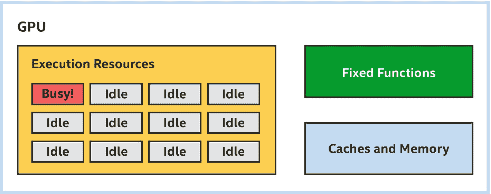

图 15-4

GPU 上的单个任务内核会导致许多执行资源闲置

#### 表达平行

为了提高这个内核对于 CPU 和 GPU 的性能，我们可以通过将一个循环转换为一个`parallel_for`来提交一系列数据元素进行并行处理。对于矩阵乘法内核，我们可以选择提交代表两个最外层循环之一的数据元素范围。在图 [15-5](#Fig5) 中，我们选择并行处理结果矩阵的行。

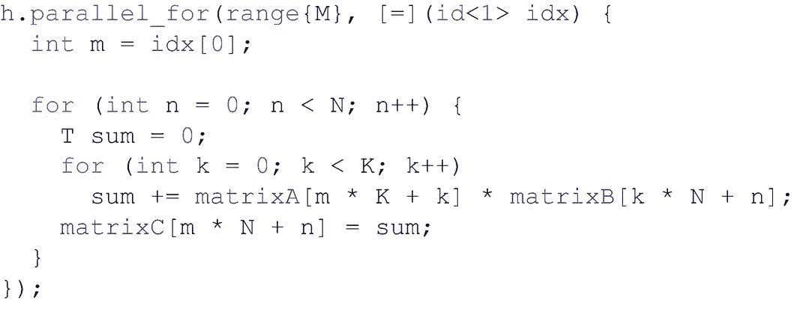

图 15-5

有点并行的矩阵乘法

CHOOSING HOW TO PARALLELIZE

选择哪个维度进行并行化是针对 GPU 和其他设备类型调整应用的一种非常重要的方式。本章的后续部分将描述为什么在一个维度上进行并行化可能比在不同维度上进行并行化性能更好的一些原因。

尽管有些并行的内核与单任务内核非常相似，但它应该在 CPU 上运行得更好，在 GPU 上运行得更好。如图 [15-6](#Fig6) 所示，`parallel_for`使代表结果矩阵行的工作项能够在多个处理器资源上并行处理，因此所有执行资源都保持忙碌。

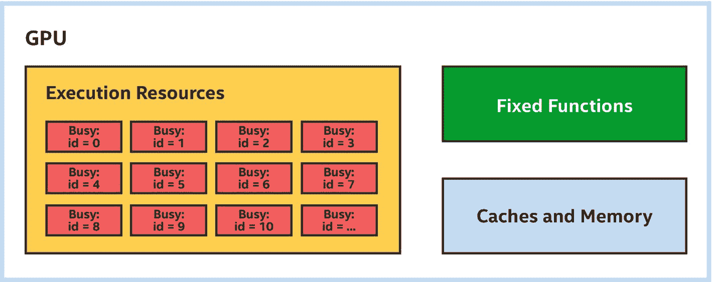

图 15-6

有些并行的内核会占用更多的处理器资源

请注意，没有指定行被分区和分配到不同处理器资源的确切方式，这为实现提供了选择如何在设备上最好地执行内核的灵活性。例如，实现可以选择在同一处理器上执行连续的行，而不是在一个处理器上执行单独的行，以获得局部性好处。

#### 表达更多并行性

通过选择并行处理两个外部循环，我们可以进一步并行化矩阵乘法内核。因为`parallel_for`可以表达多达三维的平行循环，这是简单明了的，如图 [15-7](#Fig7) 所示。在图 [15-7](#Fig7) 中，注意传递给`parallel_for`的范围和表示并行执行空间中索引的项目现在都是二维的。

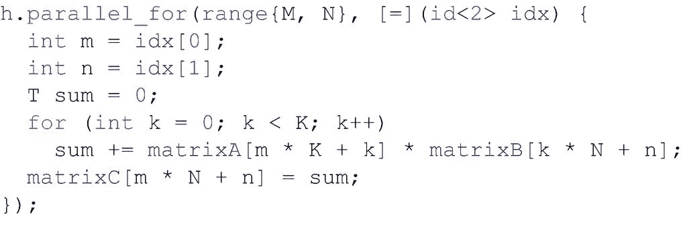

图 15-7

甚至更多的并行矩阵乘法

当在 GPU 上运行时，展示额外的并行性可能会提高矩阵乘法内核的性能。即使当矩阵行数超过 GPU 处理器数时，这种情况也可能发生。接下来的几节描述了出现这种情况的可能原因。

### 简化的控制逻辑(SIMD 指令)

许多 GPU 处理器通过利用大多数数据元素倾向于采用相同的控制流路径通过内核来优化控制逻辑。例如，在矩阵乘法内核中，由于循环边界不变，每个数据元素执行最内层循环的次数相同。

当数据元素采用相同的控制流路径通过内核时，处理器可以通过在多个数据元素之间共享控制逻辑并将它们作为一组来执行来降低管理指令流的成本。做到这一点的一种方法是实现一个*单指令、多数据*或 *SIMD* 指令集，其中多个数据元素由一个单指令同时处理。

THREADS VS. INSTRUCTION STREAMS

在许多并行编程环境和 GPU 文献中，术语“线程”用来表示“指令流”在这些环境中,“线程”不同于传统的操作系统线程，并且通常更加轻量级。然而，情况并不总是这样，在某些情况下,“线程”被用来描述完全不同的东西。

由于术语“线程”被过度使用并且容易被误解，本章使用术语“指令流”来代替。

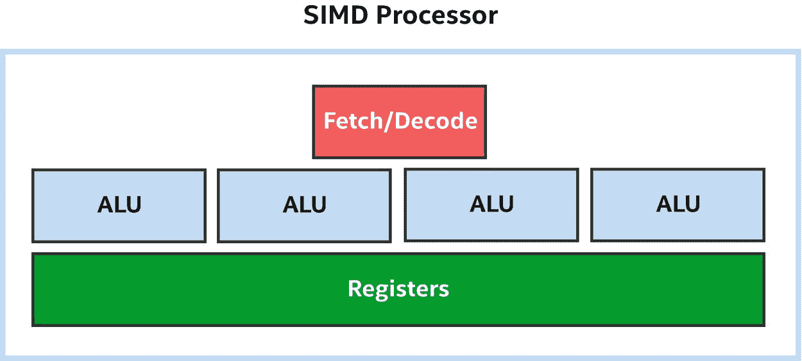

图 15-8

四宽 SIMD 处理器:四个 alu 共享提取/解码逻辑

一条指令同时处理的数据元素的数量有时被称为该指令或执行该指令的处理器的 *SIMD 宽度*。在图 [15-8](#Fig8) 中，四个 alu 共享相同的控制逻辑，因此这可以被描述为一个四宽 SIMD 处理器。

GPU 处理器并不是唯一实现 SIMD 指令集的处理器。其他处理器类型也实现 SIMD 指令集，以提高处理大型数据集时的效率。GPU 处理器与其他处理器类型的主要区别在于，GPU 处理器依靠并行执行多个数据元素来实现良好的性能，并且 GPU 处理器可能比其他处理器类型支持更宽的 SIMD 宽度。例如，GPU 处理器支持 16、32 或更多数据元素的 SIMD 宽度并不少见。

PROGRAMMING MODELS: SPMD AND SIMD

虽然 GPU 处理器实现了不同宽度的 SIMD 指令集，但这通常是一个实现细节，对于在 GPU 处理器上执行数据并行内核的应用程序是透明的。这是因为许多 GPU 编译器和运行时 API 实现了*单程序、多数据*或 *SPMD* 编程模型，其中 GPU 编译器和运行时 API 确定最有效的一组数据元素，以便用 SIMD 指令流进行处理，而不是显式表达 SIMD 指令。第 9 章[的“子组”部分探讨了数据元素分组对应用程序可见的情况。](09.html#b978-1-4842-5574-2_9)

在图 [15-9](#Fig9) 中，我们扩大了每个执行资源以支持四宽 SIMD，允许我们并行处理四倍多的矩阵行。

图 15-9

在 SIMD 处理器上执行某种程度上并行的内核

使用并行处理多个数据元素的 SIMD 指令是图 [15-5](#Fig5) 和 [15-7](#Fig7) 中的并行矩阵乘法内核的性能能够超越处理器数量的方式之一。通过在同一处理器上执行连续的数据元素，SIMD 指令的使用在许多情况下还提供了自然的局部性优势，包括矩阵乘法。

内核受益于处理器间的并行和处理器内的并行！

#### 预测和掩蔽

只要所有数据元素通过内核中的条件代码采用相同的路径，在多个数据元素之间共享指令流就能很好地工作。当数据元素通过条件代码采取不同的路径时，控制流被称为*分叉*。当控制流在 SIMD 指令流中分叉时，通常两条控制流路径都被执行，一些通道被屏蔽或者*被断言*。这确保了正确的行为，但是正确性是以性能为代价的，因为被屏蔽的通道不执行有用的工作。

为了展示预测和屏蔽是如何工作的，考虑图 [15-10](#Fig10) 中的内核，它将每个具有“奇数”索引的数据元素乘以 2，并将每个具有“偶数”索引的数据元素递增 1。

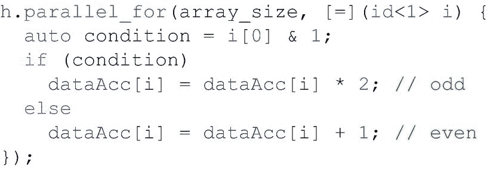

图 15-10

具有发散控制流的内核

假设我们在图 [15-8](#Fig8) 所示的四宽 SIMD 处理器上执行这个内核，我们在一个 SIMD 指令流中执行前四个数据元素，在另一个 SIMD 指令流中执行接下来的四个数据元素，依此类推。图 [15-11](#Fig11) 显示了通道可能被屏蔽和执行可能被预测的方法之一，以正确执行这个具有不同控制流的内核。

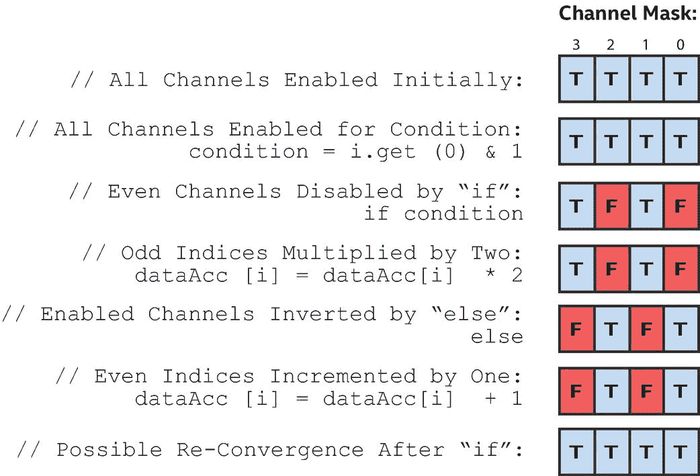

图 15-11

发散核的可能通道掩码

#### SIMD 效率

*SIMD* *效率*衡量 SIMD 指令流与同等标量指令流相比表现如何。在图 [15-11](#Fig11) 中，由于控制流将通道划分为两个相等的组，因此在分叉控制流中的每个指令都以一半的效率执行。在最坏的情况下，对于高度分散的内核，效率可能会因处理器的 SIMD 宽度而降低。

实现 SIMD 指令集的所有处理器都将遭受影响 SIMD 效率的发散惩罚，但是因为 GPU 处理器通常比其他处理器类型支持更宽的 SIMD 宽度，所以当优化 GPU 的内核时，重构算法以最小化发散控制流并最大化收敛执行可能特别有益。这并不总是可能的，但是作为一个例子，选择沿着一个执行更集中的维度进行并行化可能比沿着一个执行高度分散的不同维度进行并行化性能更好。

#### SIMD 效率和项目组

到目前为止，本章中的所有内核都是基本的数据并行内核，没有指定执行范围内的任何项目分组，这为设备选择最佳分组提供了实现自由。例如，具有较宽 SIMD 宽度的设备可能偏好较大的分组，但是具有较窄 SIMD 宽度的设备可能适合较小的分组。

当一个内核是具有显式工作项分组的 ND 范围内核时，应该注意选择最大化 SIMD 效率的 ND 范围工作组大小。当一个工作组的大小不能被处理器的 SIMD 宽度整除时，工作组的一部分可能会在整个内核运行期间禁用通道。内核`preferred_work_group_size_multiple`查询可以用来选择有效的工作组规模。有关如何查询设备属性的更多信息，请参阅第 [12 章](12.html#b978-1-4842-5574-2_12)。

选择由单个工作项组成的工作组规模可能会执行得很差，因为许多 GPU 会通过屏蔽除一个通道之外的所有 SIMD 通道来实现单个工作项工作组。例如，图 [15-12](#Fig12) 中的内核可能会比图 [15-5](#Fig5) 中非常相似的内核性能差得多，尽管两者之间唯一显著的区别是从基本的数据并行内核转变为低效的单工作项 ND-range 内核(`nd_range<1>{M, 1}`)。

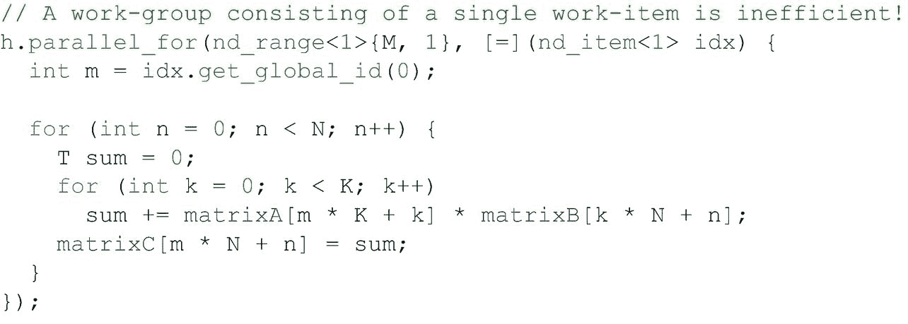

图 15-12

低效的单项、有点并行的矩阵乘法

### 切换工作以隐藏延迟

许多 GPU 实现了另一种技术来简化控制逻辑，最大化执行资源，并提高性能:许多 GPU 允许多个指令流同时驻留在处理器上，而不是在处理器上执行单个指令流。

让多个指令流驻留在一个处理器上是有益的，因为它给每个处理器一个执行工作的选择。如果一个指令流正在执行长等待时间的操作，例如从内存中读取，处理器可以切换到另一个准备运行的指令流，而不是等待操作完成。有了足够的指令流，到处理器切换回原始指令流时，长等待时间操作可能已经完成，而根本不需要处理器等待。

图 [15-13](#Fig13) 显示了处理器如何使用多个同步指令流来隐藏延迟并提高性能。尽管第一个指令流与多个指令流一起执行的时间稍长，但通过切换到其他指令流，处理器能够找到准备好执行的工作，并且永远不需要空闲地等待长时间的操作完成。

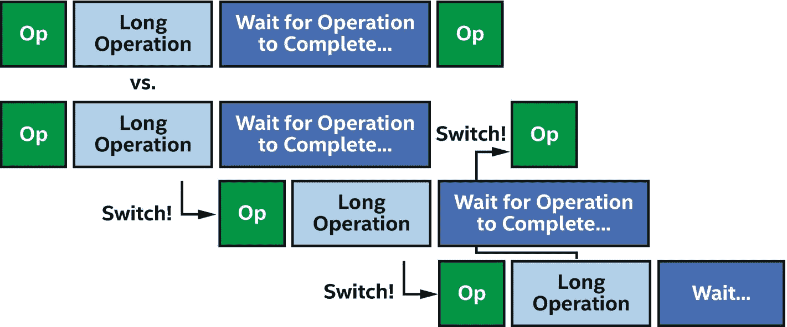

图 15-13

切换指令流以隐藏延迟

GPU 剖析工具可以使用诸如*占用率*之类的术语来描述 GPU 处理器当前正在执行的指令流的数量与指令流的理论总数。

低占用率并不一定意味着低性能，因为少量的指令流可能会使处理器忙碌。同样，高占用率并不一定意味着高性能，因为如果所有指令流都执行低效、长等待时间的操作，GPU 处理器可能仍然需要等待。在其他条件相同的情况下，增加占用率可以最大限度地提高 GPU 处理器隐藏延迟的能力，通常会提高性能。增加占用率是图 [15-7](#Fig7) 中使用更多并行内核可以提高性能的另一个原因。

这种在多个指令流之间切换以隐藏延迟的技术特别适合 GPU 和数据并行处理。回想一下图 [15-2](#Fig2) 中，GPU 处理器通常比其他类型的处理器简单，因此缺乏复杂的延迟隐藏特性。这使得 GPU 处理器更容易受到延迟问题的影响，但由于数据并行编程涉及处理大量数据，GPU 处理器通常有大量的指令流要执行！

## 将内核卸载到 GPU

本节描述应用程序、SYCL 运行时库和 GPU 软件驱动程序如何协同工作，在 GPU 硬件上卸载内核。图 [15-14](#Fig14) 中的图表显示了具有这些抽象层的典型软件堆栈。在许多情况下，这些层的存在对应用程序是透明的，但在调试或分析我们的应用程序时，理解并考虑它们是很重要的。

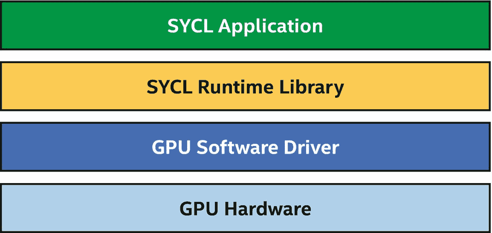

图 15-14

将并行内核卸载到 GPU(简化)

### SYCL 运行时库

SYCL 运行时库是 SYCL 应用程序与之交互的主要软件库。运行时库负责实现`queues`、`buffers`、`accessors`等类以及这些类的成员函数。运行时库的一部分可能在头文件中，因此直接编译成应用程序可执行文件。运行时库的其他部分是作为库函数实现的，它们作为应用程序构建过程的一部分与应用程序可执行文件相链接。运行时库通常不是特定于设备的，同一个运行时库可以协调卸载到 CPU、GPU、FPGAs 或其他设备。

### GPU 软件驱动程序

虽然从理论上讲，SYCL 运行时库可以直接卸载到 GPU，但实际上，大多数 SYCL 运行时库都与 GPU 软件驱动程序接口，以向 GPU 提交工作。

GPU 软件驱动程序通常是 API 的实现，如 OpenCL、Level Zero 或 CUDA。大多数 GPU 软件驱动程序都是在 SYCL 运行时调用的用户模式驱动程序库中实现的，用户模式驱动程序可能会调用操作系统或内核模式驱动程序来执行系统级任务，如分配内存或向设备提交工作。用户模式驱动程序也可以调用其他用户模式库；例如，GPU 驱动程序可以调用 GPU 编译器将内核从中间表示即时编译成 GPU ISA(指令集架构)。这些软件模块以及它们之间的交互如图 [15-15](#Fig15) 所示。

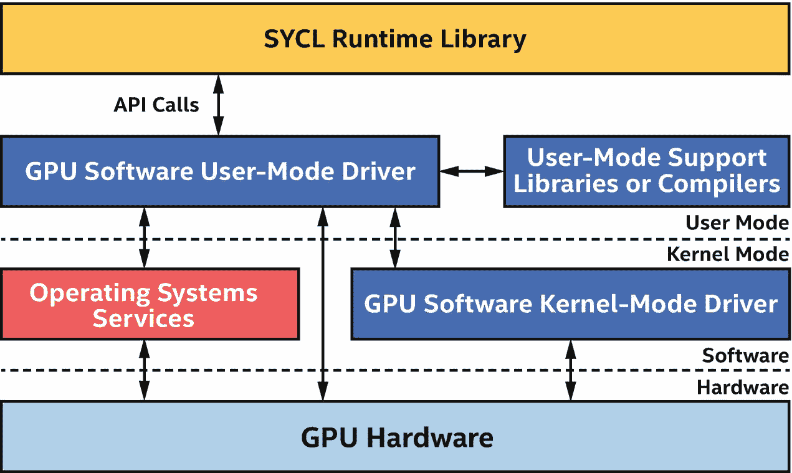

图 15-15

典型的 GPU 软件驱动模块

### GPU 硬件

当运行时库或 GPU 软件用户模式驱动程序被明确请求提交工作时，或者当 GPU 软件试探性地确定应该开始工作时，它通常会通过操作系统或内核模式驱动程序调用，以开始在 GPU 上执行工作。在某些情况下，GPU 软件用户模式驱动程序可能会直接向 GPU 提交工作，但这种情况不太常见，可能不是所有设备或操作系统都支持。

当在 GPU 上执行的工作的结果被主机处理器或另一个加速器消耗时，GPU 必须发出信号来指示工作完成。工作完成中涉及的步骤与工作提交的步骤非常相似，只是执行顺序相反:GPU 可能会向操作系统或内核模式驱动程序发出信号，表明它已完成执行，然后用户模式驱动程序将得到通知，最后运行时库将通过 GPU 软件 API 调用观察到工作已完成。

这些步骤中的每一步都会引入延迟，在许多情况下，运行时库和 GPU 软件会在更低的延迟和更高的吞吐量之间进行权衡。例如，更频繁地向 GPU 提交工作可以减少延迟，但是频繁地提交也会由于每次提交的开销而减少吞吐量。收集大量工作会增加延迟，但会将提交开销分摊到更多工作上，并为并行执行带来更多机会。运行时和驱动程序被调整以做出正确的权衡，并且通常做得很好，但是如果我们怀疑驱动程序试探法低效地提交工作，我们应该查阅文档，看看是否有方法使用特定于 API 甚至特定于实现的机制来覆盖默认的驱动程序行为。

### 当心卸货的成本！

尽管 SYCL 实现和 GPU 供应商在不断创新和优化，以降低将工作卸载到 GPU 的成本，但在 GPU 上开始工作和在主机或其他设备上观察结果时，总会涉及开销。当选择在何处执行算法时，既要考虑在设备上执行算法的好处，也要考虑将算法及其所需的任何数据移动到设备的成本。在某些情况下，使用主机处理器执行并行操作可能是最有效的，或者在 GPU 上低效地执行算法的串行部分，以避免将算法从一个处理器移动到另一个处理器的开销。

从整体上考虑我们算法的性能——在一个设备上低效地执行算法的一部分可能比将执行转移到另一个设备上更有效！

#### 与设备内存之间的传输

在具有专用内存的 GPU 上，要特别注意专用 GPU 内存和主机或其他设备上的内存之间的传输成本。图 [15-16](#Fig16) 显示了系统中不同内存类型之间的典型内存带宽差异。

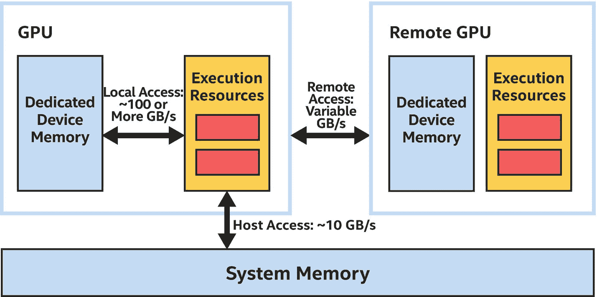

图 15-16

设备内存、远程内存和主机内存之间的典型差异

回想一下第 [3](03.html#b978-1-4842-5574-2_3) 章，GPU 更喜欢在专用设备内存上运行，这可以快一个数量级或更多，而不是在主机内存或另一个设备的内存上运行。尽管访问专用设备内存比访问远程内存或系统内存快得多，但如果数据不在专用设备内存中，则必须对其进行复制或迁移。

只要数据将被频繁访问，将它移动到专用设备内存是有益的，特别是当 GPU 执行资源忙于处理另一个任务时，传输可以异步执行。当数据很少或不可预测地被访问时，即使每次访问的成本更高，也可以节省传输成本并远程或在系统内存中操作数据。第 [6](06.html#b978-1-4842-5574-2_6) 章描述了控制内存分配的方法，以及将数据复制和预取到专用设备内存的不同技术。这些技术在为 GPU 优化程序执行时非常重要。

## GPU 内核最佳实践

前面几节描述了传递给`parallel_for`的分派参数如何影响内核如何分配给 GPU 处理器资源，以及在 GPU 上执行内核所涉及的软件层和开销。本节描述了内核在 GPU 上执行时的最佳实践。

从广义上讲，内核要么是受*内存限制的*，这意味着它们的性能受到进出 GPU 上执行资源的数据读写操作的限制，要么是受*计算限制的*，这意味着它们的性能受到 GPU 上执行资源的限制。为 GPU 和许多其他处理器优化内核的良好开端！—确定我们的内核是内存受限还是计算受限，因为改善内存受限内核的技术通常不会使计算受限内核受益，反之亦然。GPU 供应商通常提供分析工具来帮助做出这一决定。

根据我们的内核是内存受限还是计算受限，需要不同的优化技术！

因为 GPU 倾向于拥有许多处理器和较宽的 SIMD 宽度，内核倾向于更多地受到内存的限制，而不是计算的限制。如果我们不确定从哪里开始，检查我们的内核如何访问内存是一个很好的第一步。

### 访问全局内存

高效地访问全局内存对于优化应用程序性能至关重要，因为工作项或工作组操作的几乎所有数据都源自全局内存。如果内核对全局内存的操作效率很低，那么它的性能几乎总是很差。尽管 GPU 通常包括专用硬件*收集*和*分散*单元，用于读取和写入内存中的任意位置，但对全局内存的访问性能通常由数据访问的*位置*决定。如果工作组中的一个工作项目正在访问存储器中的一个元素，该元素与工作组中的另一个工作项目所访问的元素相邻，则全局存储器访问性能可能是好的。如果一个工作组中的工作项改为访问步进或随机的内存，则全局内存访问性能可能会更差。一些 GPU 文档将对邻近内存访问的操作描述为*合并*内存访问。

回想一下，对于我们在图 [15-15](#Fig15) `,`中有些并行的矩阵乘法内核，我们可以选择是并行处理结果矩阵的一行还是一列，我们选择并行处理结果矩阵的行。这被证明是一个糟糕的选择:如果一个`id`等于`m`的工作项与一个 id 等于`m-1`或`m+1`的相邻工作项被分组，那么用于访问`matrixB`的索引对于每个工作项都是相同的，但是用于访问`matrixA`的索引相差`K`，这意味着访问是高度跨越的。`matrixA`的访问模式如图 [15-17](#Fig17) 所示。

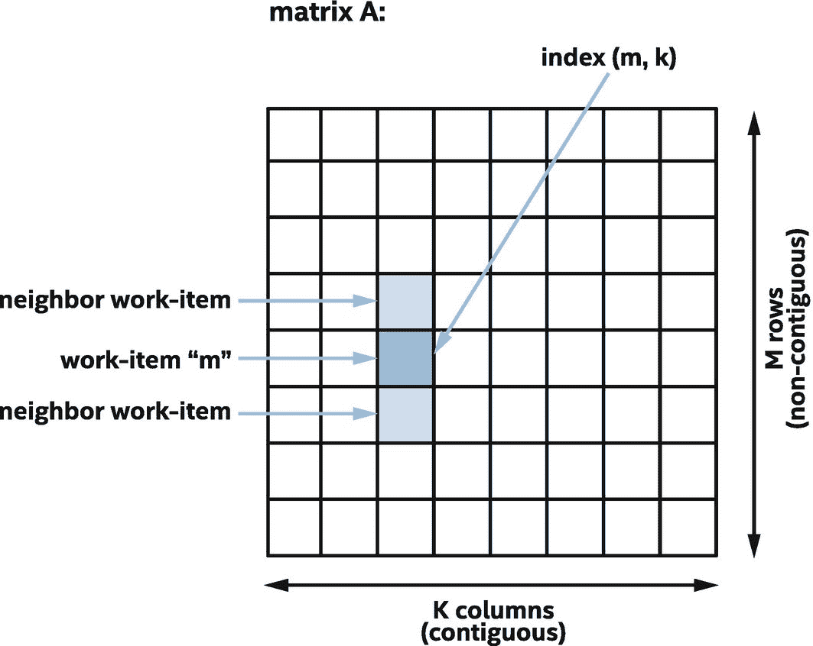

图 15-17

对`matrixA`的访问速度很快，效率很低

相反，如果我们选择并行处理结果矩阵的列，则访问模式具有更好的局部性。图 [15-18](#Fig18) 中的内核在结构上与图 [15-5](#Fig5) 中的内核非常相似，唯一的区别是图 [15-18](#Fig18) 中的每个工作项操作结果矩阵的一列，而不是结果矩阵的一行。

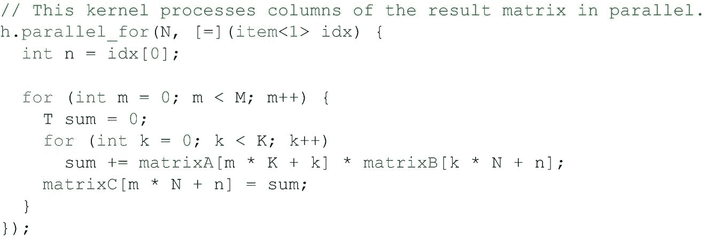

图 15-18

并行计算结果矩阵的列，而不是行

尽管这两个内核在结构上非常相似，但在许多 GPU 上操作数据列的内核将明显优于操作数据行的内核，这纯粹是因为更高效的内存访问:如果一个 id 等于`n`的工作项与一个 id 等于`n-1`或`n+1`的相邻工作项分组，则每个工作项用于访问`matrixA`的索引现在是相同的，并且用于访问`matrixB`的索引是连续的。`matrixB`的访问模式如图 [15-19](#Fig19) 所示。

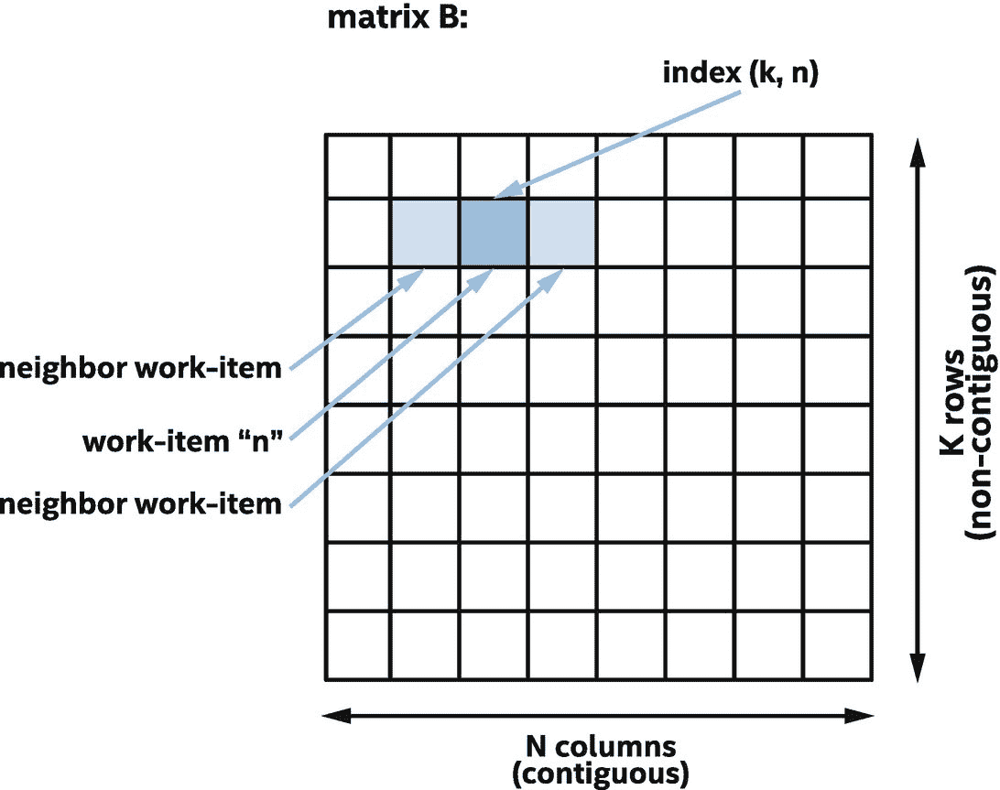

图 15-19

对`matrixB`的访问是连续且高效的

对连续数据的访问通常非常高效。一个很好的经验法则是，一组工作项对全局内存的访问性能是被访问的 GPU 缓存线数量的函数。如果所有访问都在单个高速缓存行内，则访问将以最高性能执行。如果访问需要两个高速缓存行，比如说通过访问每隔一个元素或者从高速缓存未对齐的地址开始，则访问可能以一半的性能运行。当组中的每个工作项目访问一个唯一的高速缓存行时，比方说对于非常快速或随机的访问，该访问可能以最低的性能运行。

PROFILING KERNEL VARIANTS

对于矩阵乘法，选择沿一维并行显然会导致更高效的内存访问，但对于其他内核，选择可能不那么明显。对于实现最佳性能至关重要的内核，如果不清楚要并行化哪个维度，有时有必要开发和分析沿每个维度并行化的不同内核变体，以了解哪种内核更适合设备和数据集。

### 访问工作组本地内存

在上一节中，我们描述了对全局内存的访问如何受益于*位置*，从而最大化缓存性能。正如我们所看到的，在某些情况下，我们可以设计我们的算法来有效地访问内存，例如通过选择在一个维度而不是另一个维度进行并行化。然而，这种技术并不是在所有情况下都可行。本节描述了我们如何使用工作组本地内存来有效地支持更多的内存访问模式。

回想一下第 [9](09.html#b978-1-4842-5574-2_9) 章，工作组中的工作项可以通过工作组本地内存通信和使用工作组屏障同步来合作解决问题。这种技术对 GPU 尤其有益，因为典型的 GPU 都有专门的硬件来实现屏障和工作组本地内存。不同的 GPU 供应商和不同的产品可能会以不同的方式实现工作组本地内存，但与全局内存相比，工作组本地内存通常有两个好处:本地内存可能支持比访问全局内存更高的带宽和更低的延迟，即使当全局内存访问命中缓存时也是如此，并且本地内存通常被分成不同的内存区域，称为*库*。只要一个组中的每个工作项目访问不同的存储体，本地存储器访问就以全性能执行。分库访问允许本地内存支持比全局内存多得多的具有最高性能的访问模式。

许多 GPU 厂商会将连续的本地内存地址分配给不同的存储体。这确保了连续的存储器访问总是以全性能运行，而不管起始地址如何。然而，当存储器访问被跨越时，一个组中的一些工作项目可能访问分配给同一存储体的存储器地址。当这种情况发生时，它被认为是一个*存储体冲突*，并导致串行访问和较低的性能。

为了获得最高的全局内存性能，请尽量减少访问的缓存线数量。

为了获得最大的本地内存性能，请尽量减少存储体冲突的数量！

图 [15-20](#Fig20) 总结了全局存储器和本地存储器的访问模式和预期性能。假设当`ptr`指向全局内存时，指针与 GPU 缓存行的大小对齐。从缓存对齐的地址开始连续访问内存，可以获得访问全局内存的最佳性能。访问未对齐的地址可能会降低全局内存性能，因为访问可能需要访问额外的高速缓存行。因为访问未对齐的本地地址不会导致额外的存储体冲突，所以本地存储器性能不会改变。

跨越的情况值得更详细地描述。访问全局内存中的所有其他元素需要访问更多的缓存行，这可能会降低性能。访问本地内存中的所有其他元素可能会导致内存块冲突和性能下降，但前提是内存块的数量能被 2 整除。如果银行的数量是奇数，这种情况下也将满负荷运行。

当访问之间的跨度很大时，每个工作项访问一个唯一的缓存行，从而导致最差的性能。然而对于本地存储器，性能取决于步幅和存储体的数量。当跨距`N`等于存储体数量时，每次访问都会导致存储体冲突，所有访问都是串行的，导致性能最差。然而，如果步幅`M`和存储体的数量没有共同因素，则访问将以全性能运行。出于这个原因，许多优化的 GPU 内核将在本地内存中填充数据结构，以选择减少或消除存储体冲突的步长。

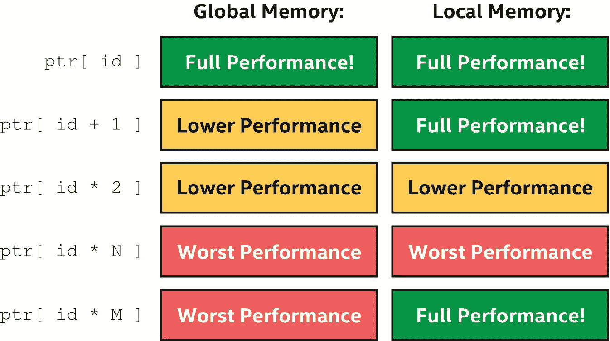

图 15-20

不同访问模式、全局和本地内存的可能性能

### 用子组完全避免本地存储

正如在第 [9](09.html#b978-1-4842-5574-2_9) 章中所讨论的，子组集合函数是一种在组中的工作项之间交换数据的替代方法。对于许多 GPU 来说，子组代表由单个指令流处理的工作项的集合。在这些情况下，子组中的工作项可以在不使用工作组本地内存的情况下廉价地交换数据和同步。许多性能最好的 GPU 内核使用子组，因此对于昂贵的内核，我们的算法是否可以重新制定以使用子组集合函数是非常值得研究的。

### 使用小数据类型优化计算

本节描述了在消除或减少内存访问瓶颈后优化内核的技术。要记住的一个非常重要的观点是，GPU 传统上被设计为在屏幕上绘制图片。尽管随着时间的推移，GPU 的纯计算能力已经得到了发展和提高，但在某些领域，它们的图形遗产仍然显而易见。

例如，考虑对内核数据类型的支持。许多 GPU 针对 32 位浮点运算进行了高度优化，因为这些运算在图形和游戏中很常见。对于可以处理较低精度的算法，许多 GPU 也支持较低精度的 16 位浮点类型，以精度换取更快的处理速度。相反，尽管许多 GPU 支持 64 位双精度浮点运算，但额外的精度是有代价的，32 位运算的性能通常比 64 位运算好得多。

整数数据类型也是如此，32 位整数数据类型的性能通常比 64 位整数数据类型好，16 位整数的性能甚至可能更好。如果我们可以使用更小的整数来构建我们的计算，我们的内核可能会执行得更快。需要特别注意的一个方面是寻址操作，它通常对 64 位`size_t`数据类型进行操作，但有时可以重新安排使用 32 位数据类型来执行大多数计算。在某些本地内存情况下，16 位索引就足够了，因为大多数本地内存分配都很小。

### 优化数学函数

另一个内核可能为了性能而牺牲准确性的领域涉及 SYCL 内置函数。SYCL 包括一组丰富的数学函数，在一系列输入中具有明确的精度。大多数 GPU 本身不支持这些功能，而是使用一长串其他指令来实现它们。虽然数学函数的实现通常针对 GPU 进行了很好的优化，但是如果我们的应用程序可以容忍较低的精度，我们应该考虑一种精度较低、性能较高的不同实现。有关 SYCL 内置函数的更多信息，请参见第 [18](18.html#b978-1-4842-5574-2_18) 章。

对于常用的数学函数，SYCL 库包括`fast`或`native`函数变量，具有降低的或实现定义的精度要求。对于一些 GPU 来说，这些函数可以比它们精确的对等函数快一个数量级，所以如果它们对算法来说有足够的精度，那么它们是非常值得考虑的。例如，许多图像后处理算法具有定义明确的输入，可以容忍较低的精度，因此非常适合使用`fast`或`native`数学函数。

如果一个算法可以容忍较低的精度，我们可以使用较小的数据类型或较低精度的数学函数来提高性能！

### 专用功能和扩展

为 GPU 优化内核的最后一个考虑是许多 GPU 中常见的专用指令。举个例子，几乎所有的 GPU 都支持在单个时钟内执行两个操作的`mad`或`fma`乘加指令。GPU 编译器通常非常擅长识别和优化单个乘法和加法，以使用单个指令来代替，但 SYCL 也包括可以显式调用的`mad`和`fma`函数。当然，如果我们希望我们的 GPU 编译器为我们优化乘法和加法，我们应该确保我们不会通过禁用浮点收缩来阻止优化！

其他专用 GPU 指令可能只能通过编译器优化或 SYCL 语言扩展来获得。例如，一些 GPU 支持专门的点积累加指令，编译器会尝试识别并优化这些指令，或者直接调用这些指令。有关如何查询 GPU 实现所支持的扩展的更多信息，请参考第 [12](12.html#b978-1-4842-5574-2_12) 章。

## 摘要

在这一章中，我们首先描述了典型的 GPU 是如何工作的，以及 GPU 与传统 CPU 有何不同。我们描述了 GPU 如何针对大量数据进行优化，方法是用处理器特性来加速额外处理器的单个指令流。

我们描述了 GPU 如何使用宽 SIMD 指令并行处理多个数据元素，以及 GPU 如何使用 SIMD 指令使用预测和屏蔽来执行具有复杂流控制的内核。我们讨论了预测和屏蔽如何降低高度发散的内核的 SIMD 效率和性能，以及如何选择沿一个维度与另一个维度并行化可以减少 SIMD 发散。

由于 GPU 有如此多的处理资源，我们讨论了给予 GPU 足够的工作以保持高占用率是多么重要。我们还描述了 GPU 如何使用指令流来隐藏延迟，这使得让 GPU 执行大量工作变得更加重要。

接下来，我们讨论了将内核卸载到 GPU 所涉及的软件和硬件层，以及卸载的成本。我们讨论了在单个设备上执行算法如何比将执行从一个设备转移到另一个设备更有效。

最后，我们描述了内核在 GPU 上执行时的最佳实践。我们描述了有多少内核从内存限制开始，以及如何有效地访问全局内存和本地内存，或者如何通过使用子组操作来完全避免本地内存。相反，当内核受计算限制时，我们描述了如何通过用较低的精度换取较高的性能或使用定制的 GPU 扩展来访问专门的指令来优化计算。

### 更多信息

关于 GPU 编程还有很多要学的，这一章只是触及了皮毛！

GPU 规格和白皮书是了解特定 GPU 和 GPU 架构更多信息的绝佳途径。许多 GPU 供应商提供了关于他们的 GPU 以及如何编程的非常详细的信息。

在撰写本文时，可以在[软件上找到关于主要 GPU 的相关阅读资料。英特尔。com](https://software.intel.com) ， [devblogs。英伟达。com](https://devblogs.nvidia.com) ，以及 [amd。com](https://amd.com) 。

有些 GPU 厂商有开源驱动或驱动组件。如果可能的话，检查或单步执行驱动程序代码可能会有所帮助，从而了解应用程序中哪些操作是昂贵的，或者哪里可能存在开销。

本章完全专注于通过缓冲存取器或统一共享内存对全局内存的传统访问，但大多数 GPU 也包括一个固定功能的纹理采样器，可以加速图像操作。有关图像和采样器的更多信息，请参考 SYCL 规范。

 

**开放存取**本章根据知识共享署名 4.0 国际许可证(http://Creative Commons . org/licenses/by/4.0/)的条款获得许可，该许可证允许以任何媒体或格式使用、共享、改编、分发和复制，只要您适当注明原作者和来源，提供知识共享许可证的链接并指明是否进行了更改。

本章中的图像或其他第三方材料包含在本章的知识共享许可中，除非在材料的信用额度中另有说明。如果材料不包括在本章的知识共享许可中，并且您的预期使用不被法律法规允许或超出了允许的使用范围，您将需要直接从版权所有者处获得许可。