# 16.CPU 编程


内核编程最初流行是作为一种对 GPU 编程的方式。随着内核编程的推广，理解我们的编程风格如何影响代码到 CPU 的映射是很重要的。

CPU 已经发展了很多年。一个主要的转变发生在 2005 年左右，当时提高时钟速度带来的性能收益减少了。并行性成为最受欢迎的解决方案——CPU 生产商没有提高时钟速度，而是引入了多核芯片。计算机在同时执行多项任务时变得更加有效！

虽然多核成为提高硬件性能的主流途径，但在软件中释放这种优势需要付出巨大的努力。多核处理器要求开发人员提出不同的算法，这样硬件的改进才能引人注目，而这并不总是容易的。我们拥有的内核越多，就越难让它们高效地工作。DPC++是解决这些挑战的编程语言之一，它具有许多有助于利用 CPU(和其他架构)上各种形式的并行性的构造。

本章讨论了 CPU 架构的一些细节，CPU 硬件如何执行 DPC++应用程序，并提供了为 CPU 平台编写 DPC++代码的最佳实践。

## 性能警告

DPC++为并行化我们的应用程序或从头开始开发并行应用程序铺平了道路。当在 CPU 上运行时，程序的应用程序性能在很大程度上取决于以下因素:

*   内核代码的单次调用和执行的底层性能

*   在并行内核中运行的程序的百分比及其可伸缩性

*   CPU 利用率、有效的数据共享、数据局部性和负载平衡

*   工作项之间的同步和通信量

*   创建、恢复、管理、挂起、销毁和同步执行工作项的线程所带来的开销，串行到并行或并行到串行转换的数量会使这种开销变得更大

*   共享内存或错误共享内存导致的内存冲突

*   共享资源(如内存、写组合缓冲区和内存带宽)的性能限制

此外，与任何处理器类型一样，CPU 可能因供应商而异，甚至因产品的不同而不同。一个 CPU 的最佳实践可能不是另一个 CPU 和配置的最佳实践。

要在 CPU 上实现最佳性能，请尽可能多地了解 CPU 架构的特征！

## 通用 CPU 的基础知识

多核 CPU 的出现和快速发展推动了共享内存并行计算平台的广泛接受。CPU 提供了笔记本电脑、台式机和服务器级别的并行计算平台，使它们无处不在，并在几乎任何地方展示性能。最常见的 CPU 架构形式是缓存一致的非一致内存访问(cc-NUMA)，其特点是访问时间不完全一致。甚至很多小型双插槽通用 CPU 系统都有这种内存系统。这种架构已经成为主流，因为处理器中内核的数量以及插槽的数量都在不断增加。

在 cc-NUMA CPU 系统中，每个插槽都连接到系统中总内存的一个子集。缓存一致的互连将所有的套接字粘合在一起，并为程序员提供单一的系统视图。这种存储器系统是可扩展的，因为总的存储器带宽随着系统中插座的数量而扩展。互连的好处是应用程序可以透明地访问系统中的所有内存，而不管数据驻留在哪里。然而，这是有代价的:从存储器访问数据和指令的等待时间不再一致(例如，固定的访问等待时间)。相反，延迟取决于数据在系统中的存储位置。在一个好的例子中，数据来自直接连接到代码运行的套接字的内存。在糟糕的情况下，数据必须来自连接到系统中远处插槽的内存，并且由于 cc-NUMA CPU 系统上插槽之间互连的跳数，内存访问的成本可能会增加。

在图 [16-1](#Fig1) 中，显示了带有 cc-NUMA 存储器的通用 CPU 架构。这是一个简化的系统架构，包含当今通用多插槽系统中的内核和存储器组件。在本章的其余部分，该图将用于说明相应代码示例的映射。

为了实现最佳性能，我们需要确保理解特定系统的 cc-NUMA 配置的特征。例如，英特尔最近推出的服务器就采用了网状互连架构。在这种配置中，内核、高速缓存和内存控制器被组织成行和列。在努力实现系统的最高性能时，了解处理器与内存的连接是至关重要的。

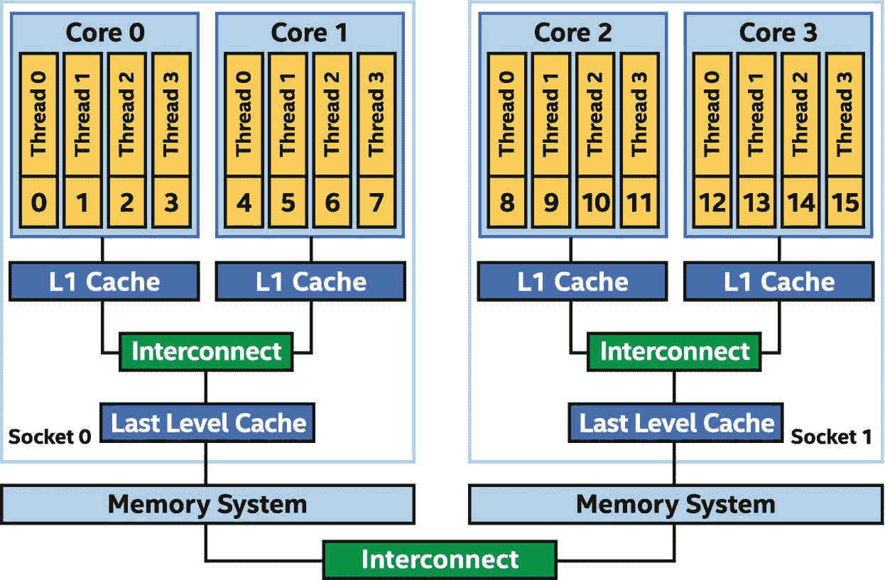

图 16-1

通用多核 CPU 系统

图 [16-1](#Fig1) 中的系统有两个插槽，每个插槽有两个内核，每个内核有四个硬件线程。每个内核都有自己的一级(l 1)高速缓存。L1 缓存连接到共享的末级缓存，末级缓存连接到套接字上的内存系统。套接字内的内存访问延迟是一致的，这意味着它是一致的，并且可以准确预测。

这两个套接字通过缓存一致的互连进行连接。内存分布在整个系统中，但是可以从系统中的任何地方透明地访问所有内存。当访问不在进行访问的代码正在运行的套接字中的内存时，内存读写延迟是不一致的，这意味着当从远程套接字访问数据时，它可能会施加更长且不一致的延迟。然而，互连的一个关键方面是一致性。我们不需要担心数据在整个内存系统中变得不一致(这将是一个功能问题)，相反，我们只需要担心我们如何访问分布式内存系统对性能的影响。

CPU 中的硬件线程是执行工具。这些是执行指令流(CPU 术语中的线程)的单元。图 [16-1](#Fig1) 中的硬件线程从 0 到 15 连续编号，这是用于简化本章示例讨论的符号。除非另有说明，本章中所有提及的 CPU 系统都是指图 [16-1](#Fig1) 中所示的 cc-NUMA 系统。

## SIMD 硬件基础

1996 年，第一个广泛部署的 SIMD(根据 Flynn 的分类，单指令，多数据)指令集是 x86 架构上的 MMX 扩展。此后，许多 SIMD 指令集扩展在英特尔架构和更广泛的行业中得到应用。CPU 核心通过执行指令来执行其工作，并且核心知道如何执行的特定指令由其实现的指令集(例如，x86、x86_64、AltiVec、NEON)和指令集扩展(例如，SSE、AVX、AVX-512)来定义。指令集扩展增加的许多操作都集中在 SIMD 指令上。

SIMD 指令通过使用比正在处理的基本数据单元更大的寄存器和硬件，允许在单个内核上同时执行多个计算。使用 512 位寄存器，我们可以用一条机器指令执行八次 64 位计算。

图 [16-2](#Fig2) 中所示的例子可以给我们带来八倍的速度提升。实际上，它可能会有所缩减，因为八倍加速的一部分用于消除一个瓶颈并暴露下一个瓶颈，如内存吞吐量。一般来说，使用 SIMD 的性能优势因具体场景而异，在少数情况下，它的性能甚至比更简单的非 SIMD 等效代码还要差。也就是说，当我们知道何时以及如何应用(或者让编译器应用)SIMD 时，在今天的处理器上可以获得相当大的收益。与所有性能优化一样，程序员应该在将一台典型的目标机器投入生产之前测量它的增益。在本章的以下部分中有关于预期性能增益的更多细节。

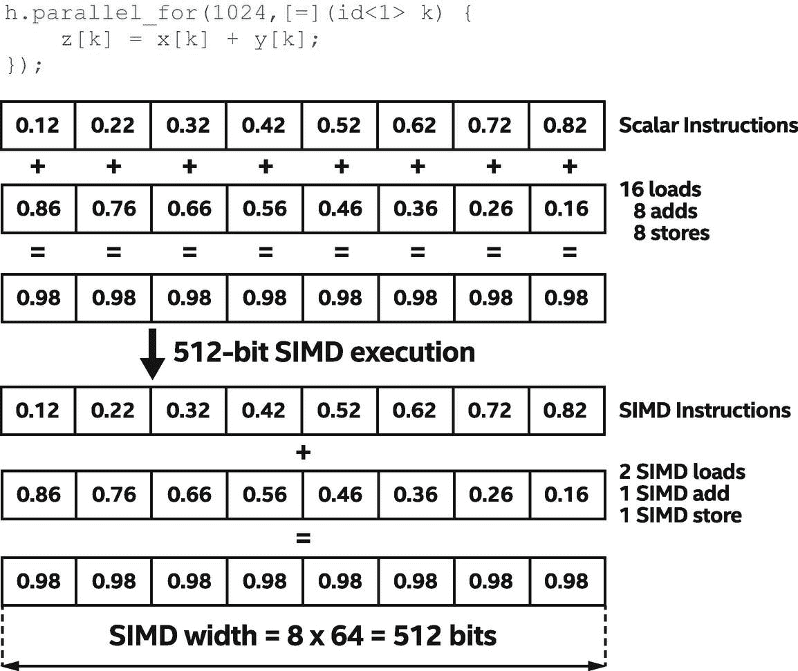

图 16-2

CPU 硬件线程中的 SIMD 执行

带有 SIMD 单元的 cc-NUMA CPU 架构构成了多核处理器的基础，该处理器可以从指令级并行开始，以五种不同的方式利用广泛的并行，如图 [16-3](#Fig3) 所示。

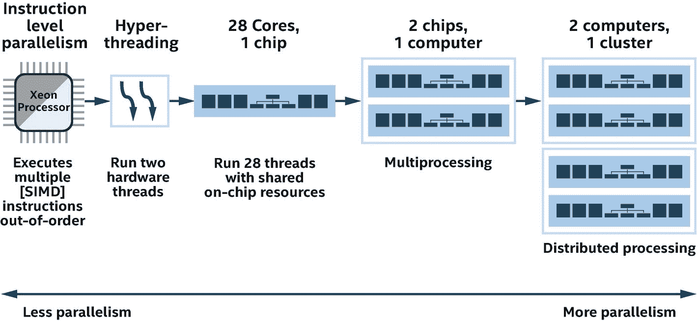

图 16-3

并行执行指令的五种方式

在图 [16-3](#Fig3) 中，指令级并行可以通过单个线程内标量指令的无序执行和 SIMD(单指令，多数据)数据并行来实现。线程级并行可以通过在同一内核或不同规模的多个内核上执行多个线程来实现。更具体地说，线程级并行性可以从以下方面得到体现:

*   现代 CPU 架构允许一个内核同时执行两个或多个线程的指令。

*   在每个处理器中包含两个或更多*大脑*的多核架构。操作系统将其每个执行核心视为一个独立的处理器，拥有所有相关的执行资源。

*   处理器(芯片)级的多重处理，可以通过执行完全独立的代码线程来实现。因此，处理器可以让一个线程从一个应用程序运行，另一个线程从一个操作系统运行，也可以让多个并行线程从一个应用程序中运行。

*   分布式处理，可以通过在计算机集群上执行由多个线程组成的进程来实现，这些进程通常通过消息传递框架进行通信。

为了充分利用多核处理器资源，编写软件时必须将其工作负载分散到多个内核中。这种方法被称为*利用线程级并行*或简单的*线程*。

随着多处理器计算机以及采用超线程(HT)技术和多核技术的处理器变得越来越普遍，将并行处理技术作为提高性能的标准实践变得非常重要。本章的后面几节将介绍 DPC++中的编码方法和性能调整技术，它们使我们能够在多核 CPU 上实现最高性能。

像其他并行处理硬件(例如，GPU)一样，为 CPU 提供足够大的数据元素集进行处理非常重要。为了展示利用多级并行处理处理大量数据的重要性，考虑一个简单的 C++流三元组程序，如图 [16-4](#Fig4) 所示。

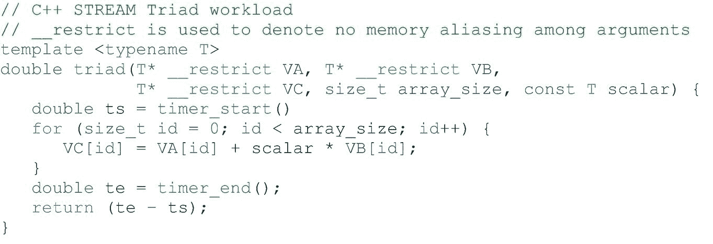

图 16-4

流三元组 C++循环

A NOTE ABOUT STREAM TRIAD WORKLOAD

流三元组工作负载( [`www.cs.virginia.edu/stream`](http://www.cs.virginia.edu/stream) )是一种重要且流行的基准测试工作负载，CPU 供应商使用它来展示高度调优的性能。我们使用 STREAM Triad 内核来演示并行内核的代码生成，以及通过本章描述的技术来显著提高性能的方法。STREAM Triad 是一个相对简单的工作负载，但足以以一种可理解的方式展示许多优化。

USE VENDOR-PROVIDED LIBRARIES!

当供应商提供一个函数的库实现时，使用它比将函数重新实现为并行内核更有益！

流三元组循环可以在使用单个 CPU 核心进行串行执行的 CPU 上被平凡地执行。一个好的 C++编译器会执行循环矢量化，为具有 SIMD 硬件的 CPU 生成 SIMD 代码，以利用指令级 SIMD 并行性。例如，对于支持 AVX-512 的英特尔至强处理器，英特尔 C++编译器生成如图 [16-5](#Fig5) 所示的 SIMD 代码。重要的是，编译器对代码的转换通过在运行时对每个循环迭代做更多的工作(SIMD 宽度和展开迭代),减少了执行时的循环迭代次数！

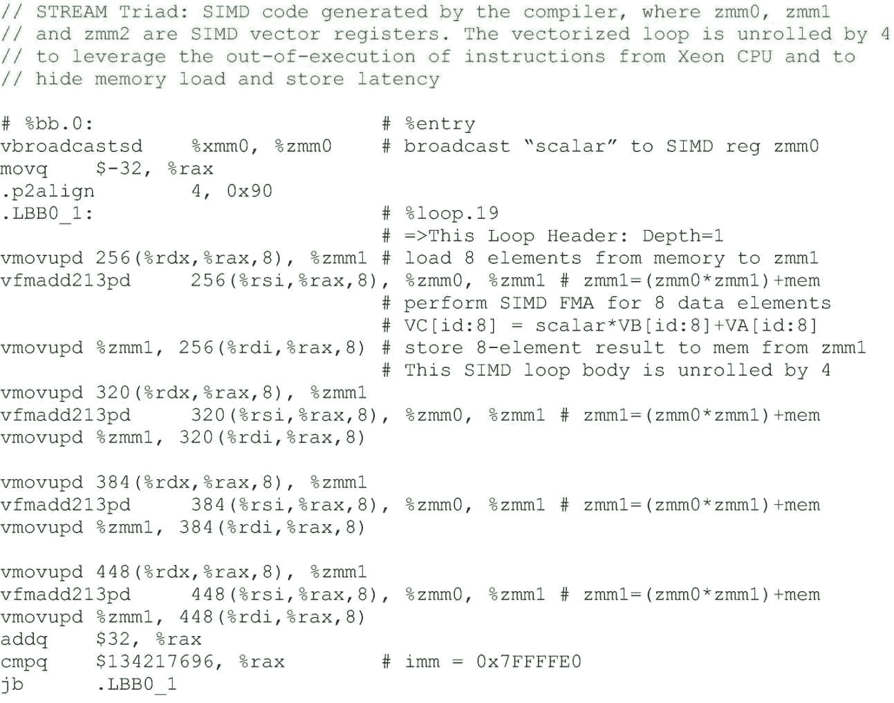

图 16-5

流三元组 C++循环的 AVX-512 代码

如图 [16-5](#Fig5) 所示，编译器能够以两种方式利用指令级并行性。首先是通过使用 SIMD 指令，利用指令级数据并行性，其中一条指令可以同时并行处理八个双精度数据元素(每条指令)。第二，基于硬件多路指令调度，编译器应用循环展开来获得这些指令之间没有依赖关系的乱序执行效果。

如果我们尝试在 CPU 上执行这个函数，它可能会运行得很好——虽然不是很好，因为它没有利用 CPU 的任何多核或线程功能，但对于小型阵列来说已经足够好了。但是，如果我们试图在一个 CPU 上用一个大的数组来执行这个函数，它的性能可能会很差，因为单线程将只利用一个 CPU 内核，当它达到该内核的内存带宽饱和时就会出现瓶颈。

## 利用线程级并行

为了提高 CPU 和 GPU 的 STREAM Triad 内核的性能，我们可以通过将循环转换为`parallel_for`内核来计算一系列可以并行处理的数据元素。

通过将流三元组内核提交到队列中进行并行执行，可以在 CPU 上轻松地执行流三元组内核。这个 STREAM Triad DPC++并行内核的主体看起来与在 CPU 上以串行 C++执行的 STREAM Triad 循环的主体完全一样，如图 [16-6](#Fig6) 所示。

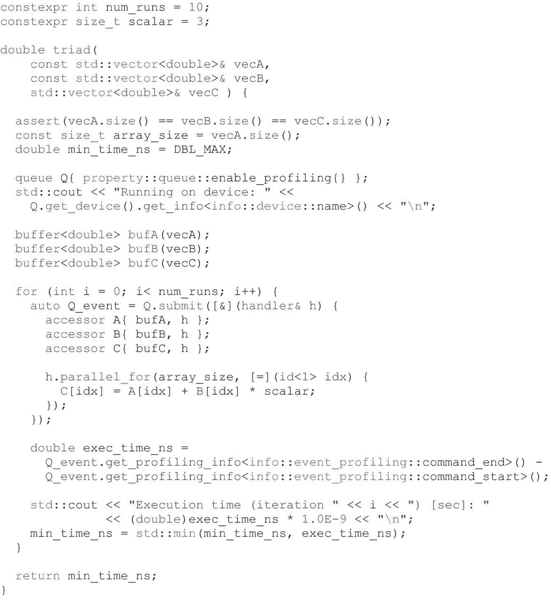

图 16-6

DPC++流三元组`parallel_for`内核代码

尽管并行内核非常类似于编写为带循环的串行 C++的 STREAM Triad 函数，但它在 CPU 上运行得更快，因为`parallel_for`使阵列的不同*元素*能够在多个内核上并行处理。如图 [16-7](#Fig7) 所示，假设我们有一个系统，有一个插槽，四个内核，每个内核有两个超线程；有 1024 个双精度数据元素需要处理；并且在实现中，在每个包含 32 个数据元素的工作组中处理数据。这意味着我们有 8 个线程和 32 个工作组。工作组调度可以按循环顺序进行，即*线程 id* = *工作组 id* mod 8。本质上，每个线程将执行四个工作组。每轮可以并行执行八个工作组。注意，在这种情况下，工作组是由 DPC++编译器和运行时隐式形成的一组工作项。

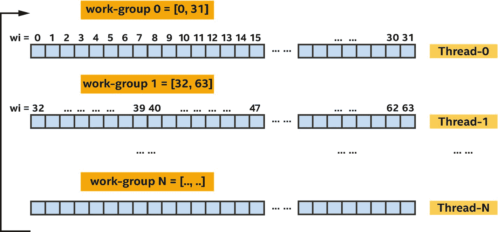

图 16-7

流三元组并行核的映射

请注意，在 DPC++程序中，不需要指定将数据元素分区并分配给不同处理器内核(或超线程)的确切方式。这为 DPC++实现提供了选择如何在特定 CPU 上最好地执行并行内核的灵活性。也就是说，一个实现可以为程序员提供某种程度的控制来实现性能调优。

虽然 CPU 可能会强加相对较高的线程上下文切换和同步开销，但是在处理器内核上驻留更多的软件线程是有益的，因为这为每个处理器内核提供了执行工作的选择。如果一个软件线程正在等待另一个线程产生数据，则处理器内核可以切换到准备运行的不同软件线程，而不会使处理器内核空闲。

CHOOSING HOW TO BIND AND SCHEDULE THREADS

选择一个有效的方案来在线程之间划分和调度工作，对于在 CPU 和其他设备类型上调优应用程序非常重要。后续部分将描述一些技术。

### 线程相似性洞察

线程关联性指定特定线程在其上执行的 CPU 核心。如果线程在内核之间移动，性能会受到影响，例如，如果线程不在同一个内核上执行，如果数据在不同内核之间来回切换，缓存局部性会变得低效。

DPC++运行时库支持通过环境变量 DPCPP_CPU_CU_AFFINITY、DPCPP_CPU_PLACES、DPCPP_CPU_NUM_CUS 和 DPCPP_CPU_SCHEDULE 将线程绑定到核心的几种方案，这些变量不是由 SYCL 定义的。

第一个是环境变量`DPCPP_CPU_CU_AFFINITY`。使用这些环境变量控件进行调优既简单又成本低廉，并且可以对许多应用程序产生巨大影响。该环境变量的描述如图 [16-8](#Fig8) 所示。

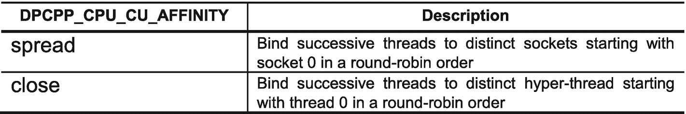

图 16-8

`DPCPP_CPU_CU_AFFINITY`环境变量

当环境变量`DPCPP_CPU_CU_AFFINITY`被指定时，软件线程通过以下公式绑定到超线程:


在哪里

*   `tid`表示软件线程标识符。

*   `boundHT`表示线程`tid`绑定到的超级线程(逻辑核心)。

*   `numHT`表示每个套接字的超线程数量。

*   `numSocket`表示系统中插座的数量。

假设我们在双核双插槽超线程系统上运行一个具有八个线程的程序，换句话说，我们有四个内核，总共有八个超线程可供编程。图 [16-9](#Fig9) 显示了线程如何映射到不同`DPCPP_CPU_CU_AFFINITY`设置的超线程和内核的示例。


图 16-9

使用超线程将线程映射到内核

与环境变量`DPCPP_CPU_CU_AFFINITY`一起，还有其他支持 CPU 性能调整的环境变量:

*   **DPC PP _ CPU _ NUM _ CUS**=[`n`]，设置内核执行使用的线程数量。它的默认值是系统中硬件线程的数量。

*   **DPC PP _ CPU _ PLACES**=[`sockets`|`numa_domains`|`cores`|`threads`]，类似于 OpenMP 5.1 中的`OMP_PLACES`指定了将要设置亲缘关系的位置。默认设置为`cores`。

*   **DPC PP _ CPU _ SCHEDULE**=[`dynamic`|`affinity`|`static`]，指定了调度工作组的算法。其默认设置为`dynamic`。
    *   动态:启用 TBB `auto_partitioner`，它通常执行足够的拆分来平衡工作线程之间的负载。

    *   关联:启用 TBB `affinity_partitioner`，这提高了缓存关联，并在将子范围映射到工作线程时使用比例分割。

    *   静态:启用 TBB `static_partitioner`，它尽可能均匀地在工作线程之间分配迭代。

TBB 划分器使用粒度来控制工作划分，默认粒度为 1，表示所有的工作组都可以独立执行。更多信息可在[规格中找到。oneapi。com/versions/latest/elements/one TBB/source/algorithms。html #分区器](https://spec.oneapi.com/versions/latest/elements/oneTBB/source/algorithms.html%2523partitioners)。

缺少线程关联性调优并不一定意味着性能降低。性能通常更多地取决于并行执行的线程总数，而不是线程和数据的关联和绑定程度。使用基准测试应用程序是确定线程关联性是否会影响性能的一种方式。如图 [16-1](#Fig1) 所示的 DPC++ STREAM Triad 代码，在没有线程关联设置的情况下，开始时性能较低。通过控制亲缘性设置和使用通过环境变量的软件线程的静态调度(对于 Linux 在下面显示了导出)，性能得到了提高:

```cpp

export DPCPP_CPU_PLACES=numa_domains
export DPCPP_CPU_CU_AFFINITY=close

```

通过使用`numa_domains`作为亲缘关系的位置设置，TBB 任务竞技场被绑定到 NUMA 节点或套接字，并且工作被均匀地分布在任务竞技场上。一般情况下，环境变量`DPCPP_CPU_PLACES`推荐与`DPCPP_CPU_CU_AFFINITY`一起使用。这些环境变量设置帮助我们在 Skylake 服务器系统上实现了约 30%的性能提升，该系统具有 2 个插槽，每个插槽有 28 个双向超线程内核，运行频率为 2.5 GHz。但是，我们仍然可以做得更好，以进一步提高这台 CPU 的性能。

### 注意记忆的第一次接触

内存存储在第一次接触(使用)的地方。由于我们示例中的初始化循环没有并行化，它由主机线程串行执行，导致所有内存都与主机线程运行所在的套接字相关联。其他套接字的后续访问将从附加到初始套接字(用于初始化)的内存中访问数据，这显然对性能不利。我们可以通过并行化初始化循环来控制套接字之间的首次接触效应，从而在 STREAM Triad 内核上实现更高的性能，如图 [16-10](#Fig10) 所示。

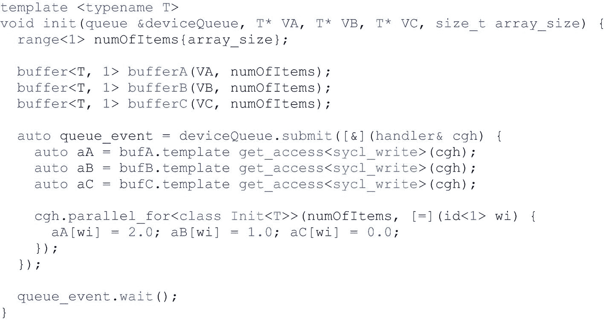

图 16-10

控制首次触摸效果的流三元组并行初始化内核

利用初始化代码中的并行性可以提高内核在 CPU 上运行时的性能。在这种情况下，我们在英特尔至强处理器系统上实现了大约 2 倍的性能提升。

本章最近的章节已经表明，通过开发线程级并行，我们可以有效地利用 CPU 内核和超线程。然而，我们还需要在 CPU 核心硬件中利用 SIMD 矢量级并行，以实现最高性能。

DPC++并行内核受益于内核和超线程的线程级并行性！

## CPU 上的 SIMD 向量化

虽然一个没有交叉工作项依赖的编写良好的 DPC++内核可以在 CPU 上有效地并行运行，但我们也可以将矢量化应用到 DPC++内核，以利用 SIMD 硬件，类似于第 [15 章](15.html#b978-1-4842-5574-2_15)中描述的 GPU 支持。本质上，CPU 处理器可以通过利用大多数数据元素通常在连续的存储器中并且通过数据并行内核采取相同的控制流路径的事实，使用 SIMD 指令来优化存储器加载、存储和操作。例如，在具有语句`a[i] = a[i] + b[i]`的内核中，通过在多个数据元素之间共享硬件逻辑并将它们作为一组来执行，每个数据元素以相同的指令流*加载*、*加载*、*添加*和*存储*来执行，这可以自然地映射到硬件的 SIMD 指令集。具体来说，一条指令可以同时处理多个数据元素。

由一条指令同时处理的数据元素的数量有时被称为指令或执行它的处理器的向量长度(或 SIMD 宽度)。在图 [16-11](#Fig11) 中，我们的指令流以四路 SIMD 执行方式运行。

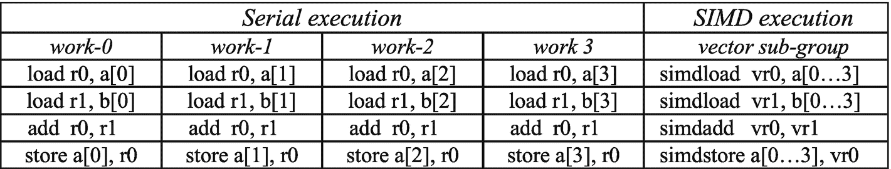

图 16-11

SIMD 执行的指令流

CPU 处理器不是唯一实现 SIMD 指令集的处理器。GPU 等其他处理器在处理大型数据集时会执行 SIMD 指令来提高效率。与其他类型的处理器相比，英特尔至强 CPU 处理器的一个关键区别在于它拥有三个固定大小的 SIMD 寄存器宽度 128 位 XMM、256 位 YMM 和 512 位 ZMM，而不是可变长度的 SIMD 宽度。当我们使用子组或向量类型编写具有 SIMD 并行的 DPC++代码时，我们需要注意硬件中的 SIMD 宽度和 SIMD 向量寄存器的数量。

### 确保 SIMD 执行的合法性

语义上，DPC++执行模型确保 SIMD 执行可以应用于任何内核，并且每个工作组(即子组)中的一组工作项目可以使用 SIMD 指令并发执行。一些实现可能改为选择使用 SIMD 指令在内核中执行循环，但是当且仅当所有原始数据依赖性被保留，或者数据依赖性被编译器基于私有化和归约语义解决时，这才是可能的。

使用工作组内的 SIMD 指令，单个 DPC++内核执行可以从单个工作项的处理转换为一组工作项。在 ND-range 模型下，增长最快的(单位步长)维由编译器矢量器选择，在其上生成 SIMD 代码。本质上，要在给定 ND-range 的情况下启用矢量化，同一子组中的任何两个工作项之间都不应该有跨工作项依赖，或者编译器需要保留同一子组中的跨工作项向前依赖。

当工作项的内核执行被映射到 CPU 上的线程时，细粒度的同步代价很高，线程上下文切换开销也很高。因此，在为 CPU 编写 DPC++内核时，消除工作组内工作项之间的依赖性是一项重要的性能优化。另一个有效的方法是将这种依赖性限制在一个子组中的工作项上，如图 16-12 中的写前读依赖性所示。如果在 SIMD 执行模型下执行子组，则编译器可以将内核中的子组屏障视为空操作，并且在运行时不会产生真正的同步成本。

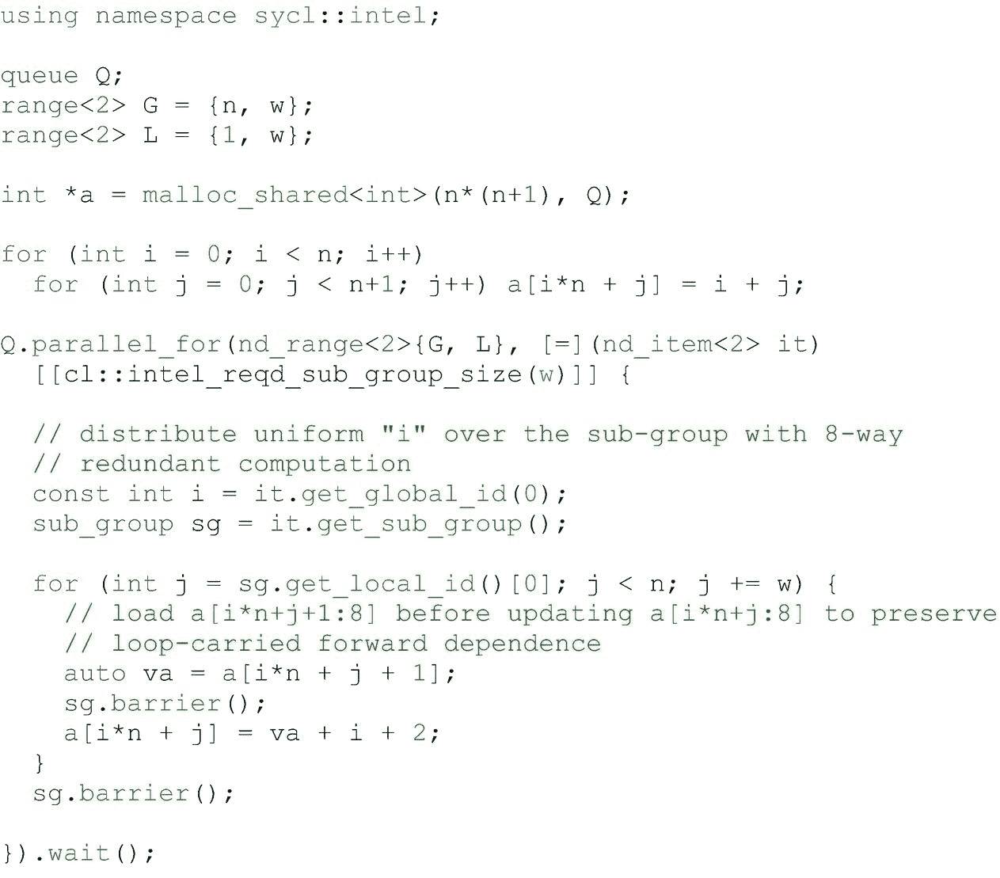

图 16-12

使用子群向量化具有前向相关性的循环

内核被矢量化(矢量长度为 *8* ，其 SIMD 执行如图 [16-13](#Fig13) 所示。以组大小(1，8)形成一个工作组，内核内部的循环迭代分布在这些子组工作项上，并以八向 SIMD 并行方式执行。


图 16-13

具有前向相关性的循环的 SIMD 向量化

在本例中，如果内核中的循环控制了性能，那么允许子组中的 SIMD 向量化将会显著提高性能。

使用并行处理数据元素的 SIMD 指令是让内核性能超越 CPU 内核和超线程数量的一种方式。

### SIMD 掩蔽和成本

在实际应用中，我们可能会遇到像`if`语句这样的条件语句，像`a = b > a? a: b`这样的条件表达式，迭代次数可变的循环，`switch`语句，等等。任何有条件的都可能导致标量控制流不执行相同的代码路径，就像在 GPU 上一样(第 [15](15.html#b978-1-4842-5574-2_15) 章)，可能导致性能下降。SIMD 掩码是一组值为`1`或`0`的位，由内核中的条件语句生成。考虑具有`A={1, 2, 3, 4}, B={3, 7, 8, 1}`和比较表达式`a < b.`的示例，比较返回具有四个值`{1, 1, 1, 0}`的掩码，其可以存储在硬件掩码寄存器中，以指示后面的 SIMD 指令的哪些通道应该执行由比较保护(启用)的代码。

如果内核包含条件代码，它将通过基于与每个数据元素相关联的屏蔽位(SIMD 指令中的 lane)执行的屏蔽指令进行矢量化。每个数据元素的屏蔽位是屏蔽寄存器中的相应位。

使用掩码可能会导致比相应的非掩码代码更低的性能。这可能是由以下原因造成的

*   每次加载时的额外遮罩混合操作

*   对目的地的依赖

屏蔽是有代价的，所以只在必要的时候使用它。当内核是 ND 范围内核，并且在执行范围内具有工作项目的显式分组时，在选择 ND 范围工作组大小时应该小心，以便通过最小化屏蔽成本来最大化 SIMD 效率。当一个工作组的大小不能被处理器的 SIMD 宽度整除时，工作组的一部分可以在内核屏蔽的情况下执行。

图 [16-14](#Fig14) 显示了使用合并屏蔽如何产生对目标寄存器的依赖:

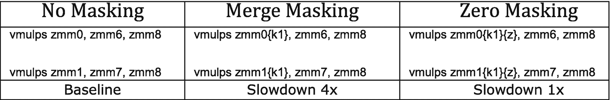

图 16-14

内核屏蔽的三代屏蔽代码

*   在没有屏蔽的情况下，处理器每个周期执行两次乘法(`vmulps`)。

*   使用合并屏蔽，处理器每四个周期执行两次乘法，因为乘法指令(`vmulps`)将结果保存在目的寄存器中，如图 [16-17](#Fig17) 所示。

*   零屏蔽不依赖于目标寄存器，因此每个周期可以执行两次乘法(`vmulps`)。

访问缓存对齐的数据比访问非对齐的数据提供更好的性能。在许多情况下，地址在编译时是未知的，或者是已知的但没有对齐。在这些情况下，可以实现对存储器访问的剥离，以通过并行内核中的多版本化技术，使用屏蔽的访问来处理最初的几个元素，直到第一个对齐的地址，然后处理未屏蔽的访问，随后是屏蔽的剩余部分。这种方法增加了代码量，但总体上改善了数据处理。

### 避免结构数组以提高 SIMD 效率

AOS(结构阵列)结构导致聚集和分散，这既会影响 SIMD 效率，又会为内存访问带来额外的带宽和延迟。硬件聚集-分散机制的存在并没有消除这种转换的需要——聚集-分散访问通常需要比连续加载高得多的带宽和延迟。给定一个`struct {float x; float y; float z; float w;} a[4],`的 AOS 数据布局，考虑一个在其上运行的内核，如图 [16-15](#Fig15) 所示。

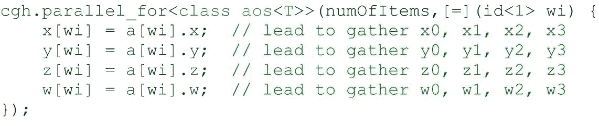

图 16-15

SIMD 聚在一个内核里

当编译器沿着一组工作项目*、*对内核进行矢量化处理时，由于需要非单位步长的内存访问，它会导致 SIMD 收集指令的生成。例如，`a[0].x`、`a[1].x`、`a[2].x`和`a[3].x`的步距是 4，而不是更有效的单位步距 1。

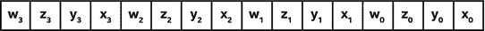

在内核中，我们通常可以通过消除内存聚集-分散操作来实现更高的 SIMD 效率。一些代码受益于数据布局的变化，这种变化将以结构数组(AOS)表示形式编写的数据结构转换为数组结构(SOA)表示形式，也就是说，每个结构字段都有单独的数组，以在执行 SIMD 矢量化时保持内存访问的连续性。例如，考虑如下所示的`struct {float x[4]; float y[4]; float z[4]; float w[4];} a;`的 SOA 数据布局:

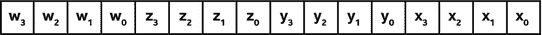

如图 [16-16](#Fig16) 所示，内核可以使用单位步长(连续)向量加载和存储对数据进行操作，即使是在矢量化的情况下！

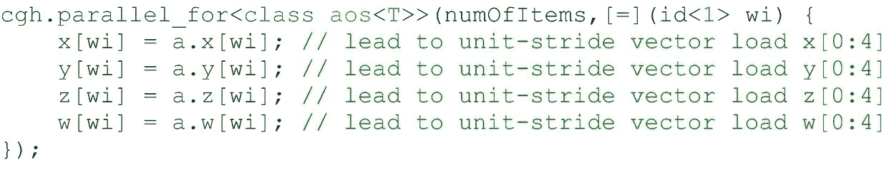

图 16-16

内核中 SIMD 单位步幅向量加载

SOA 数据布局有助于在访问跨数组元素的结构的一个字段时防止聚集，并有助于编译器对与工作项相关联的连续数组元素上的内核进行矢量化。请注意，考虑到使用这些数据结构的所有地方，这种 AOS 到 SOA 或 AOSOA 的数据布局转换预计将在程序级别(由我们)完成。仅仅在循环层次上这样做将会涉及到循环前后格式之间代价高昂的转换。然而，我们也可以依靠编译器来执行向量加载和洗牌优化 AOS 数据布局，这需要一些成本。当 SOA(或 AOS)数据布局的成员具有向量类型时，编译器矢量化将根据底层硬件执行水平扩展或垂直扩展，如第 [11](11.html#b978-1-4842-5574-2_11) 章所述，以生成最佳代码。

### 数据类型对 SIMD 效率的影响

每当 C++程序员知道数据适合 32 位有符号类型时，他们通常使用整数数据类型，这通常会产生如下代码

```cpp

int id = get_global_id(0); a[id] = b[id] + c[id];

```

然而，鉴于`get_global_id(0)`的返回类型是`size_t` *(无符号整数，通常是 64 位)*，在某些情况下，转换会减少编译器可以合法执行的优化。例如，当编译器在内核中对代码进行矢量化处理时，这可能会导致 SIMD 收集/分散指令

*   读取`a[get_global_id(0)]`导致 SIMD 单位步幅向量加载。

*   对`a[(int)get_global_id(0)]`的读取导致非单位步幅采集指令。

这种微妙的情况是由从`size_t`到`int`(或`uint`)的数据类型转换的绕回行为(C++标准中未指定的行为和/或定义良好的绕回行为)引入的，这主要是基于 C 语言发展的历史产物。具体来说，跨某些转换的溢出是未定义的行为，这实际上允许编译器假设这种情况永远不会发生，并进行更积极的优化。图 [16-17](#Fig17) 为那些想了解细节的人展示了一些例子。

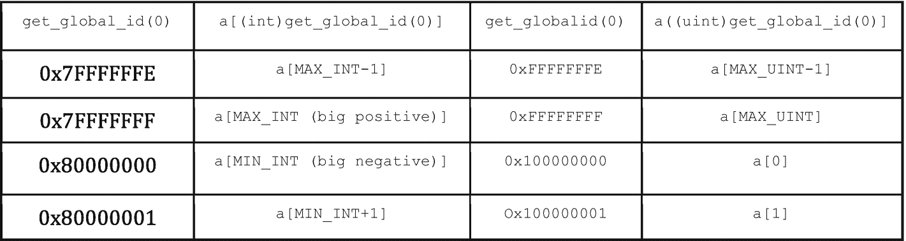

图 16-17

整数`type value`回绕的例子

SIMD 收集/分散指令比 SIMD 单位步长向量加载/存储操作慢。为了实现最佳的 SIMD 效率，无论使用哪种编程语言，避免聚集/分散对于应用来说都是至关重要的。

大多数 SYCL `get_*_id()`系列函数都有相同的细节，尽管许多情况都符合`MAX_INT`的范围，因为可能的返回值是有限的(例如，一个工作组内的最大 id)。因此，只要合法，DPC++编译器将假设相邻工作项块上的单位步长内存地址，以避免聚集/分散。如果由于全局 id 的值和/或全局 id 的导数值可能溢出，编译器不能安全地生成线性单位步长向量内存加载/存储，编译器将生成聚集/分散。

在为用户提供最佳性能的理念下，DPC++编译器假定没有溢出，并且在实践中几乎总是捕捉真实情况，因此编译器可以生成最佳 SIMD 代码以实现良好的性能。但是，DPC++编译器提供了一个覆盖编译器宏—D _ _ SYCL _ DISABLE _ ID _ TO _ INT _ conv _ _—来告诉编译器将会有溢出，并且从 ID 查询中导出的矢量化访问可能不安全。这可能会对性能产生很大影响，只要不安全，就应该使用这种方法来假设没有溢出。

### SIMD 执行使用`single_task`

在单任务执行模型下，与向量类型和函数相关的优化取决于编译器。编译器和运行时可以自由地在`single_task`内核中启用显式 SIMD 执行或选择标量执行，结果将取决于编译器的实现。例如，DPC++ CPU 编译器支持向量类型，并为 CPU SIMD 执行生成 SIMD 指令。`vec` load、store 和 swizzle 函数将直接对向量变量执行操作，通知编译器数据元素正在访问从内存中相同(统一)位置开始的连续数据，并使我们能够请求连续数据的优化加载/存储。

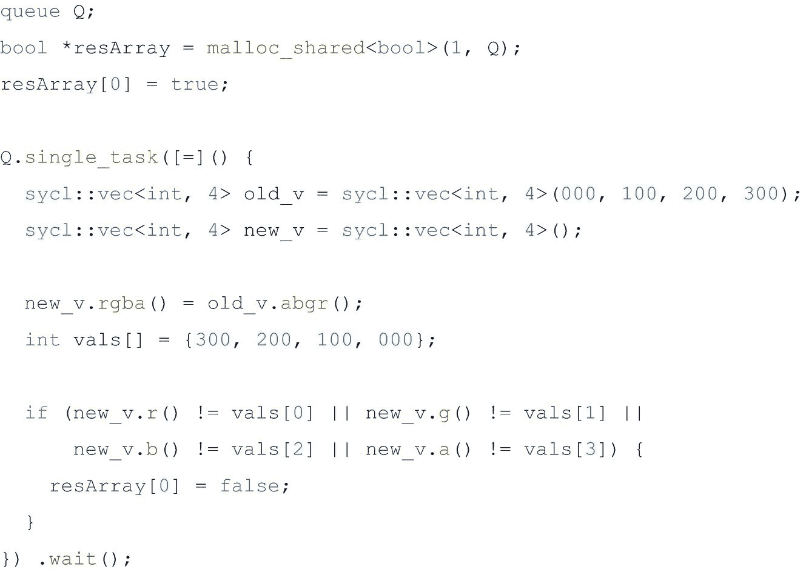

图 16-18

在`single_task`内核中使用矢量类型和 swizzle 操作

在图 [16-18](#Fig18) 所示的例子中，在单任务执行下，声明了一个带有三个数据元素的向量。使用`old_v.abgr().`执行 swizzle 操作如果 CPU 为一些 swizzle 操作提供 SIMD 硬件指令，我们可以在应用程序中使用 swizzle 操作来获得一些性能优势。

SIMD VECTORIZATION GUIDELINES

CPU 处理器实现具有不同 SIMD 宽度的 SIMD 指令集。在许多情况下，这是一个实现细节，对于在 CPU 上执行内核的应用程序是透明的，因为编译器可以确定一组有效的数据元素，以特定的 SIMD 大小进行处理，而不是要求我们显式地使用 SIMD 指令。子组可以用于更直接地表达数据元素的分组应该在内核中经受 SIMD 执行的情况。

考虑到计算的复杂性，选择最适合矢量化的代码和数据布局可能最终会带来更高的性能。选择数据结构时，请尝试选择数据布局、对齐方式和数据宽度，以便最频繁执行的计算能够以 SIMD 友好的方式以最大的并行度访问内存，如本章所述。

## 摘要

为了充分利用 CPU 上的线程级并行和 SIMD 矢量级并行，我们需要牢记以下目标:

*   熟悉所有类型的 DPC++并行性和我们希望瞄准的底层 CPU 架构。

*   在与硬件资源最匹配的线程级别上，利用适量的并行性，不多也不少。使用供应商工具，如分析器和剖析器，来帮助指导我们的调优工作，以实现这一目标。

*   请注意线程关联和内存首次接触对程序性能的影响。

*   设计具有数据布局、对齐方式和数据宽度的数据结构，以便最频繁执行的计算能够以 SIMD 友好的方式访问内存，并具有最大的 SIMD 并行性。

*   注意平衡屏蔽和代码分支的成本。

*   使用清晰的编程风格，最大限度地减少潜在的内存混淆和副作用。

*   请注意使用 vector 类型和接口的可伸缩性限制。如果编译器实现将它们映射到硬件 SIMD 指令，固定的向量大小可能无法在多代 CPU 和来自不同供应商的 CPU 之间很好地匹配 SIMD 寄存器的 SIMD 宽度。

[](https://creativecommons.org/licenses/by/4.0) 

**开放存取**本章根据知识共享署名 4.0 国际许可证(http://Creative Commons . org/licenses/by/4.0/)的条款获得许可，该许可证允许以任何媒体或格式使用、共享、改编、分发和复制，只要您适当注明原作者和来源，提供知识共享许可证的链接并指明是否进行了更改。

本章中的图像或其他第三方材料包含在本章的知识共享许可中，除非在材料的信用额度中另有说明。如果材料不包括在本章的知识共享许可中，并且您的预期使用不被法律法规允许或超出了允许的使用范围，您将需要直接从版权所有者处获得许可。