# 十八、库

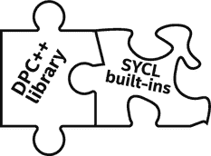

我们花了整本书来宣传*编写我们自己的代码*的艺术。现在我们终于承认，一些伟大的程序员已经写出了我们可以直接使用的代码。库是我们完成工作的最好方式。这不是懒惰的问题，而是有比重新发明他人的工作更好的事情要做的问题。这是一块值得拥有的拼图。

开源的 DPC++ 项目包括一些库。这些库可以帮助我们继续使用 libstdc++、libc++ 和 MSVC 库函数，甚至是在我们的内核代码中。这些库包含在英特尔的 DPC++ 和 oneAPI 产品中。这些库不依赖于 DPC++ 编译器，因此它们可以与任何 SYCL 编译器一起使用。

DPC++ 库为创建异构应用程序和解决方案的程序员提供了另一种选择。它的 API 基于熟悉的标准——c++ STL、并行 STL (PSTL)和 SYCL——为程序员提供高生产率的 API。这可以最大限度地减少 CPU、GPU 和 FPGAs 之间的编程工作量，同时实现可移植的高性能并行应用。

SYCL 标准定义了一组丰富的内置函数，为主机和设备代码提供功能，也值得考虑。DPC++ 和许多 SYCL 实现用数学库实现了关键的数学内置。

本章讨论的库和内置是编译器不可知的。换句话说，它们同样适用于 DPC++ 编译器或 SYCL 编译器。`fpga_device_policy`类是用于 FPGA 支持的 DPC++ 特性。

由于在命名和功能上有重叠，本章将从 SYCL 内置函数的简单介绍开始。

## 内置函数

DPC++ 针对各种数据类型提供了一组丰富的 SYCL 内置函数。这些内置函数在主机和设备上的`sycl`命名空间中可用，根据编译器选项对目标设备提供低、中、高精度支持，例如 DPC++ 编译器提供的`-mfma`、`-ffast-math`和`-ffp-contract=fast`。主机和设备上的这些内置功能可分为以下几类:

*   浮点数学函数:asin、`acos`、`log, sqrt`、`floor`等。在图 [18-2](#Fig2) 中列出。

*   整数函数:`abs`、`max, min`等。如图 [18-3](#Fig3) 所示。

*   常用功能:`clamp`、`smoothstep`等。如图 [18-4](#Fig4) 所示。

*   几何函数:`cross`、`dot`、`distance`等。在图 [18-5](#Fig5) 中列出。

*   关系函数:`isequal`、`isless`、`isfinite`等。在图 [18-6](#Fig6) 中列出。

如果 C++ std 库提供了一个函数，如图 [18-8](#Fig8) 所列，以及一个 SYCL 内置函数，那么 DPC++ 程序员可以使用其中任何一个。图 [18-1](#Fig1) 展示了主机和设备的 C++ `std::log`函数和 SYCL 内置`sycl::log`函数，两个函数产生相同的数值结果。在示例中，内置的关系函数`sycl::isequal`用于比较`std:log`和`sycl:`T5 的结果。

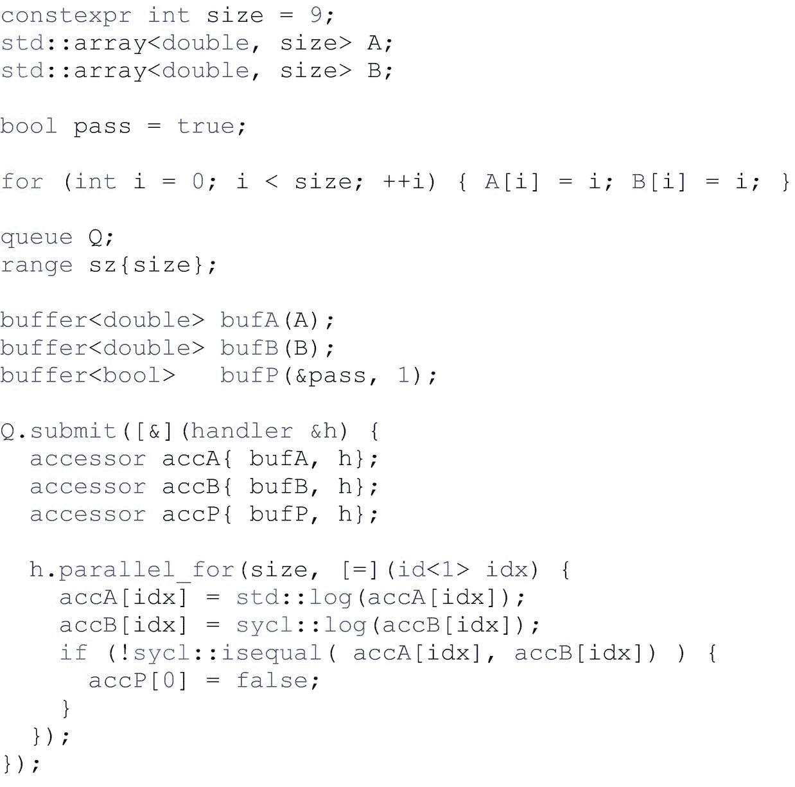

图 18-1

使用`std::log`和`sycl::` `log`

除了 SYCL 中支持的数据类型，DPC++ 设备库还支持将`std:complex`作为一种数据类型，以及 C++ std 库中定义的相应数学函数。

### 对内置函数使用前缀`sycl::`

调用 SYCL 内置函数时，应该在名字前添加一个明确的`sycl::`。根据当前的 SYCL 规范，即使使用了“`using namespace sycl;`”，也不能保证只调用`sqrt()`就能调用所有实现中内置的 SYCL。

调用 SYCL 内置函数时，应该在内置名称前加上一个明确的`sycl::`。不遵循这个建议可能会导致奇怪和不可移植的结果。

如果内置函数名与我们应用程序中的非模板化函数冲突，在许多实现中(包括 DPC++ ),我们的函数将优先，这要归功于 C++ 重载决策规则，它更喜欢非模板化函数而不是模板化函数。然而，如果我们的代码有一个与内置名相同的函数名，最方便的做法是避免`using namespace sycl;`或者确保没有实际冲突发生。否则，一些 SYCL 编译器会因为实现中无法解决的冲突而拒绝编译代码。这样的冲突不会沉寂。因此，如果我们的代码今天编译，我们可以安全地忽略未来问题的可能性。

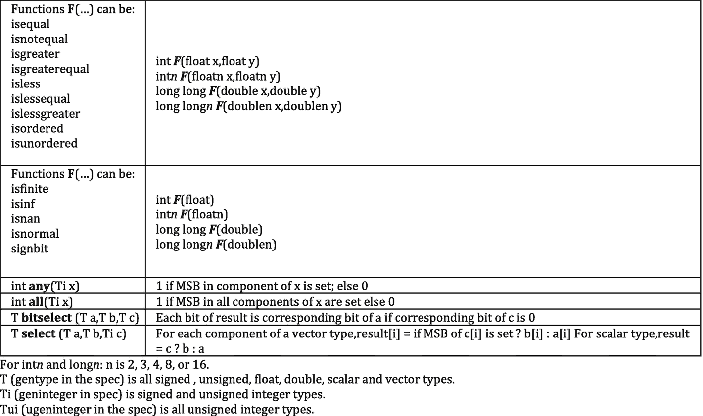

图 18-6

内置关系函数

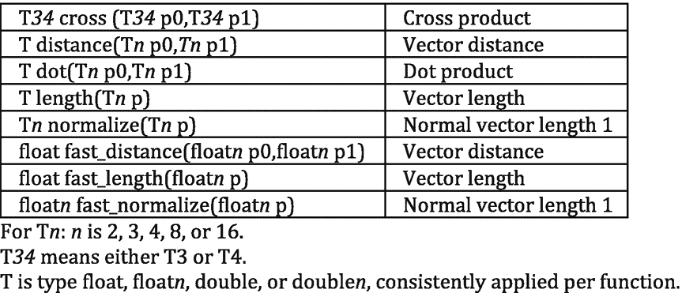

图 18-5

内置几何函数

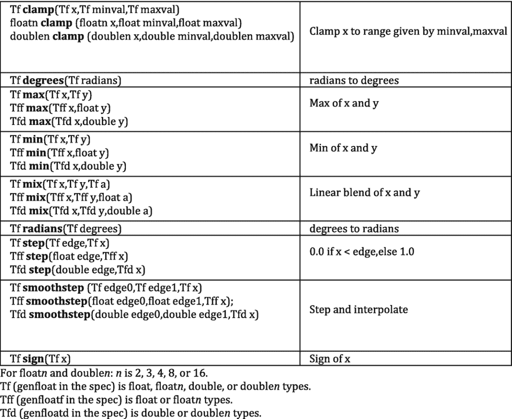

图 18-4

内置常用功能

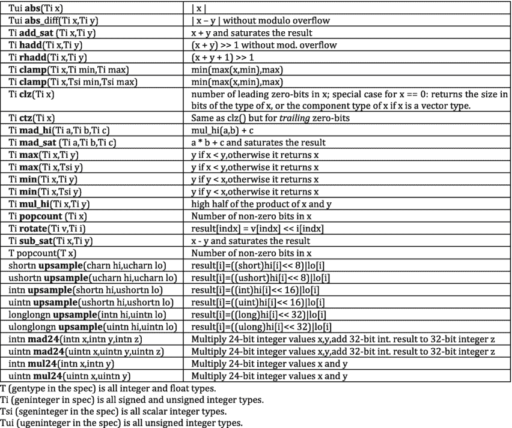

图 18-3

内置整数函数


图 18-2

内置数学函数

## DPC++ 库

DPC++ 库由以下组件组成:

*   一组经过测试的 C++ 标准 API——我们只需要包含相应的 C++ 标准头文件，并使用`std`名称空间。

*   包含相应头文件的并行 STL。我们简单地使用`#include <dpstd/...>`来包含它们。DPC++ 库将名称空间`dpstd`用于扩展的 API 类和函数。

### DPC++ 中的标准 c++ API

DPC++ 库包含一组经过测试的标准 c++ API。已经开发了许多 C++ 标准 API 的基本功能，使得这些 API 可以在设备内核中使用，类似于它们在典型 C++ 主机应用程序的代码中的使用方式。图 [18-7](#Fig7) 显示了如何在设备代码中使用`std::swap`的例子。

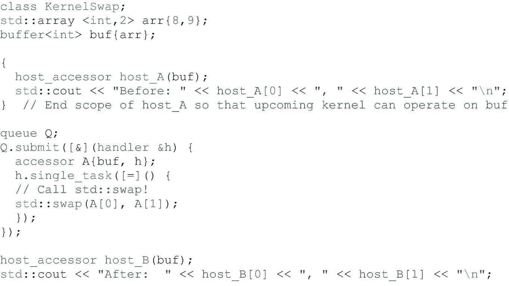

图 18-7

在设备代码中使用`std::swap`

我们可以使用下面的命令来构建和运行程序(假设它驻留在`stdswap.cpp`文件中):

```cpp

dpcpp –std=c++17 stdswap.cpp –o stdswap.exe
./stdswap.exe

```

打印结果是:

```cpp

8, 9
9, 8

```

图 [18-8](#Fig8) 列出了带有“ *Y* 的 C++ 标准 API，以表明在撰写本文时，这些 API 已经过测试，可用于 CPU、*和* FPGA 设备的 DPC++ 内核。空白表示本书出版时覆盖范围不完整(并非所有三种设备类型)。作为在线 DPC++ 语言参考指南的一部分，还包括一个表，该表将随着时间的推移而更新——dpc++ 中的库支持将继续扩展其支持。

在 DPC++ 库中，一些 C++ `std`函数是基于它们在设备上对应的内置函数实现的，以达到与这些函数的 SYCL 版本相同的性能水平。

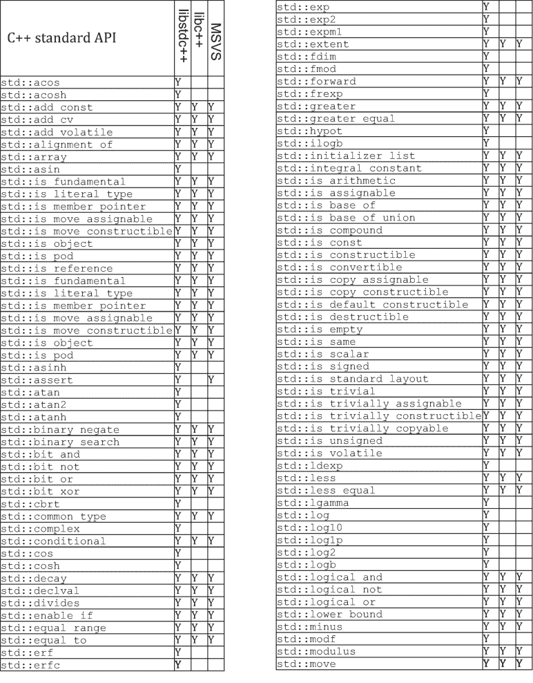 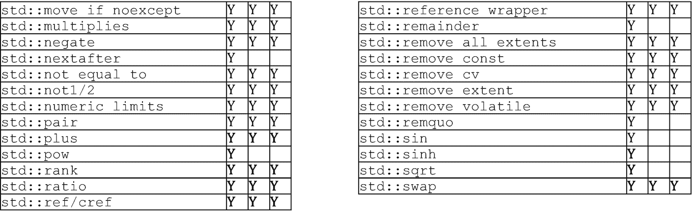

图 18-8

包含 CPU/GPU/FPGA 的库支持(在图书出版时)

测试的标准 C++ API 在`libstdc++` (GNU)的`gcc` 7.4.0 和`libc++` (LLVM)的`clang` 10.0 中得到支持，MSVC 标准 c++ 库的 Microsoft Visual Studio 2017 也支持主机 CPU。

在 Linux 上，GNU `libstdc++`是 DPC++ 编译器的默认 C++ 标准库，因此不需要编译或链接选项。如果我们想使用`libc++`，使用编译选项`-stdlib=libc++ -nostdinc++`来利用`libc++`，并且不包括系统中的 C++ std 头文件。已经在 Linux 上的 DPC++ 内核中使用`libc++`验证了 DPC++ 编译器，但是需要使用`libc++`而不是`libstdc++`来重建 DPC++ 运行时。详情在 [`https://intel.github.io/llvm-docs/GetStartedGuide.html#build-dpc-toolchain-with-libc-library`](https://intel.github.io/llvm-docs/GetStartedGuide.html%2523build-dpc-toolchain-with-libc-library) 。由于这些额外的步骤，`libc++`不是我们通常使用的推荐的 C++ 标准库。

在 FreeBSD 上，`libc++`是默认的标准库，不需要`-stdlib=libc++`选项。更多详情请见 [`https://libcxx.llvm.org/docs/UsingLibcxx.html`](https://libcxx.llvm.org/docs/UsingLibcxx.html) 。在 Windows 上，只能使用 MSVC C++ 库。

为了实现跨架构的可移植性，如果一个 std 函数在图 [18-8](#Fig8) 中没有标注“Y”，我们在编写设备函数的时候就需要牢记可移植性！

### DPC++ 并行 STL

并行 STL 是支持执行策略的 C++ 标准库算法的实现，如 ISO/IEC 14882:2017 标准(通常称为 C++17)中所规定的。现有实现还支持在并行 ts 版本 2 中指定的未排序执行策略，并在 C++ 工作组论文 P1001R1 中为下一版本的 C++ 标准提出了该策略。

当使用算法和执行策略时，如果没有 C++17 标准库的特定于供应商的实现，则指定名称空间`std::execution`，否则指定`pstl::execution`。

对于任何已实现的算法，我们可以传递值`seq`、`unseq`、`par`或`par_unseq`中的一个作为算法调用的第一个参数，以指定所需的执行策略。这些策略具有以下含义:

<colgroup><col class="tcol1 align-left"> <col class="tcol2 align-left"></colgroup> 
| 

**执行策略**

 | 

**意为**

 |
| --- | --- |
| `seq` | 顺序执行。 |
| `unseq` | 未排序的 SIMD 处决。该政策要求所提供的所有功能在 SIMD 均可安全执行。 |
| `par` | 多线程并行执行。 |
| `par_unseq` | `unseq`和`par.`的综合效果 |

DPC++ 的并行 STL 通过使用特殊的执行策略扩展了对 DPC++ 设备的支持。DPC++ 执行策略指定了并行 STL 算法在哪里以及如何运行。它继承了标准的 C++ 执行策略，封装了 SYCL 设备或队列，并允许我们设置可选的内核名称。DPC++ 执行策略可以与所有支持符合 C++17 标准的执行策略的标准 C++ 算法一起使用。

#### DPC++ 执行策略

目前，DPC++ 库只支持并行未排序策略(`par_unseq`)。为了使用 DPC++ 执行策略，有三个步骤:

1.  将`#include <dpstd/execution>`添加到我们的代码中。

2.  通过提供标准策略类型、作为模板参数的唯一内核名称的类类型(可选)以及下列构造器参数之一来创建策略对象:
    *   赛 CL 队列

    *   SYCL 设备

    *   SYCL 设备选择器

    *   具有不同内核名称的现有策略对象

3.  将创建的策略对象传递给并行 STL 算法。

一个`dpstd::execution::default_policy`对象是一个预定义的`device_policy`,使用默认内核名和默认队列创建。这可用于创建自定义策略对象，或者在调用算法时直接传递(如果默认选项足够的话)。

图 [18-9](#Fig9) 显示了引用`policy`类和函数时假设使用`using namespace dpstd::execution;`指令的例子。

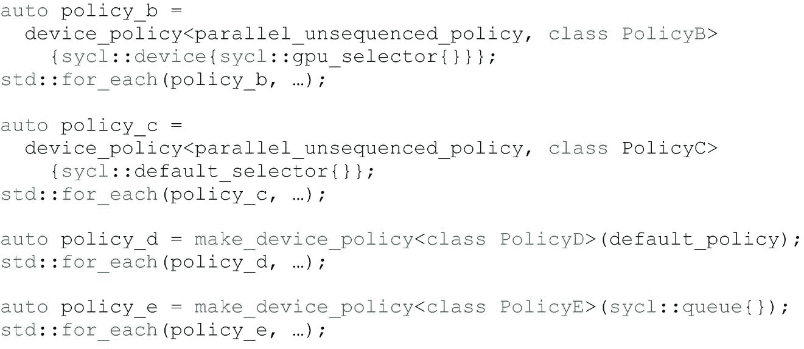

图 18-9

创建执行策略

#### FPGA 执行策略

`fpga_device_policy`类是一种 DPC++ 策略，旨在 FPGA 硬件设备上实现更好的并行算法性能。在 FPGA 硬件或 FPGA 仿真设备上运行应用程序时使用策略:

1.  定义在 FPGA 设备上运行的`_PSTL_FPGA_DEVICE`宏，以及在 FPGA 仿真设备上运行的`_PSTL_FPGA_EMU`。

2.  将#include <dpstd>添加到我们的代码中。</dpstd>

3.  通过提供唯一内核名称的类类型和展开因子(见第 [17](17.html#b978-1-4842-5574-2_17) 章)作为模板参数(两者都是可选的)和下列构造器参数之一，创建一个策略对象:
    *   为 FPGA 选择器的[构建的 SYCL 队列(该行为在任何其他设备类型中都没有定义)](https://github.com/intel/llvm/blob/sycl/sycl/doc/extensions/IntelFPGA/FPGASelector.md)

    *   具有不同内核名称和/或展开因子的现有 FPGA 策略对象

4.  将创建的策略对象传递给并行 STL 算法。

`fpga_device_policy`的默认构造器创建一个对象，该对象带有为`fpga_selector`构造的 SYCL 队列，或者如果定义了`_PSTL_FPGA_EMU`的话，为`fpga_emulator_selector`构造的 SYCL 队列。

`dpstd::execution::fpga_policy`是用默认内核名和默认展开因子创建的`fpga_device_policy`类的预定义对象。使用它来创建定制的策略对象，或者在调用算法时直接传递它。

图 [18-10](#Fig10) 中的代码假设`using namespace dpstd::execution;`用于策略，而`using namespace sycl;`用于队列和设备选择器。

为策略指定展开因子可以在算法实现中实现循环展开。默认值为 1。要了解如何选择更好的值，请参见第 [17](17.html#b978-1-4842-5574-2_17) 章。

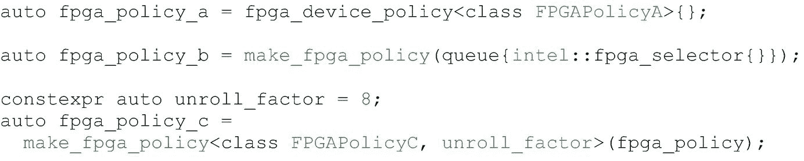

图 18-10

使用 FPGA 策略

#### 使用 DPC++ 并行 STL

为了使用 DPC++ 并行 STL，我们需要通过添加以下行的子集来包含并行 STL 头文件。这些行取决于我们打算使用的算法:

*   `#include <dpstd/algorithm>`

*   `#include <dpstd/numeric>`

*   `#include <dpstd/memory>`

`dpstd::begin`和`dpstd::end`是特殊的帮助函数，允许我们将 SYCL 缓冲区传递给并行 STL 算法。这些函数接受 SYCL 缓冲区，并返回满足以下要求的未指定类型的对象:

*   是`CopyConstructible`、`CopyAssignable`，与操作者`==`、`!=`可比。

*   以下表达式有效:`a + n`、`a – n`和`a – b`，其中`a`和`b`是类型的对象，`n`是整数值。

*   有一个没有参数的`get_buffer`方法。该方法返回传递给`dpstd::begin`和`dpstd::end`函数的 SYCL 缓冲区。

要使用这些助手函数，请将`#include <dpstd/iterators>`添加到我们的代码中。参见图 [18-11](#Fig11) 和 [18-12](#Fig12) 中使用`std::fill`函数的代码，作为使用开始/结束帮助器的示例。

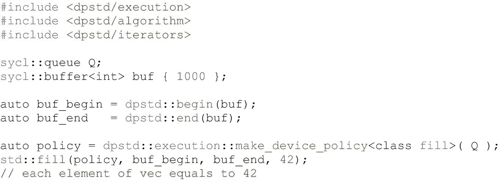

图 18-11

使用`std::fill`

REDUCE DATA COPYING BETWEEN THE HOST AND DEVICE

并行 STL 算法可以用普通(主机端)迭代器调用，如图 [18-11](#Fig11) 中的代码示例所示。

在这种情况下，会创建一个临时 SYCL 缓冲区，并将数据复制到该缓冲区。在对设备上的临时缓冲区的处理完成之后，数据被复制回主机。建议尽可能直接使用现有的 SYCL 缓冲区，以减少主机和设备之间的数据移动，以及任何不必要的缓冲区创建和销毁开销。

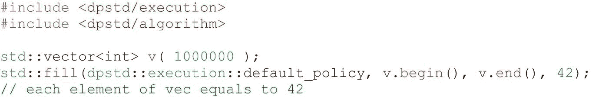

图 18-12

使用默认策略的`std::fill`

图 [18-13](#Fig13) 显示了一个为所提供的搜索序列中的每个值执行输入序列二分搜索法的例子。作为对搜索序列的第`i` <sup>*个*</sup> 元素的搜索结果，指示在输入序列中是否找到搜索值的布尔值被分配给结果序列的第`i` <sup>*个*</sup> 个元素。该算法返回一个迭代器，该迭代器指向分配了结果的结果序列的最后一个元素之后的元素。该算法假设输入序列已经由所提供的比较器排序。如果没有提供比较器，那么将使用一个使用`operator<`来比较元素的函数对象。

前面描述的复杂性强调了我们应该尽可能地利用库函数，而不是编写我们自己的类似算法的实现，这可能需要大量的调试和调优时间。我们可以利用的库的作者通常是他们正在编码的设备架构内部的专家，并且可能访问我们不知道的信息，所以当优化的库可用时，我们应该总是利用它们。

图 [18-13](#Fig13) 所示的代码示例展示了使用 DPC++ 并行 STL 算法的三个典型步骤:

*   创建 DPC++ 迭代器。

*   从现有策略创建命名策略。

*   调用并行算法。

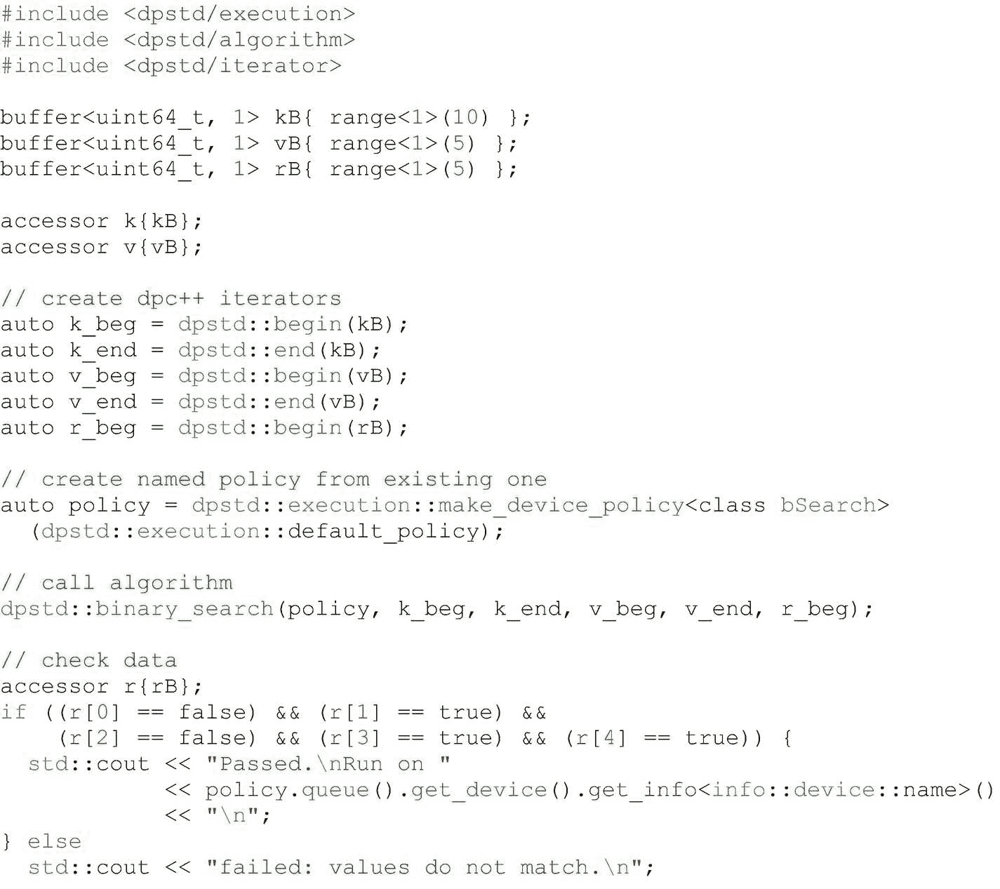

图 18-13

使用`binary_search`

图 [18-13](#Fig13) 中的示例使用`dpstd::binary_search`算法根据我们的器件选择在 CPU、GPU 或 FPGA 上执行二分搜索法。

#### 使用 USM 并行 STL

以下示例描述了将并行 STL 算法与 USM 结合使用的两种方式:

*   通过 USM 指针

*   通过 USM 分配器

如果我们有一个 USM 分配，我们可以将指向分配起点和终点的指针传递给一个并行算法。务必确保执行策略和分配本身是为同一队列或上下文创建的，以避免运行时出现未定义的行为。

如果相同的分配要由几个算法处理，要么使用有序队列，要么在下一个算法中使用相同的分配之前明确等待每个算法完成(这是使用 USM 时的典型操作排序)。同样等待完成后再访问主机上的数据，如图 [18-14](#Fig14) 所示。

或者，我们可以使用带有 USM 分配器的`std::vector`，如图 [18-15](#Fig15) 所示。

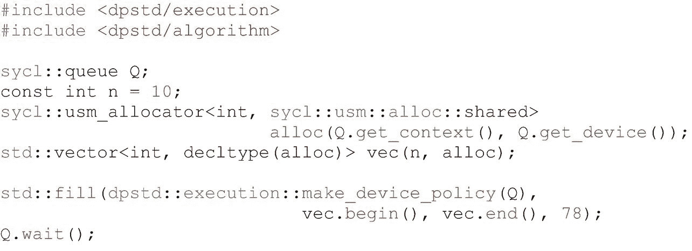

图 18-15

通过 USM 分配器使用并行 STL

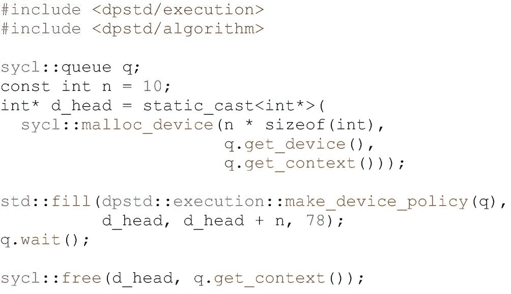

图 18-14

使用带有 USM 指针的并行 STL

### DPC++ 执行策略的错误处理

如第 [5](05.html#b978-1-4842-5574-2_5) 章所述，DPC++ 错误处理模型支持两种类型的错误。对于*同步*错误，运行时抛出异常，而*异步*错误只在程序执行期间的指定时间在用户提供的错误处理程序中处理。

对于用 DPC++ 策略执行的并行 STL 算法，处理所有的错误，不管是同步的还是异步的，都是调用者的责任。明确地

*   算法不会显式抛出异常。

*   由运行时在主机 CPU 上引发的异常(包括 DPC++ 同步异常)被传递给调用方。

*   并行 STL 不处理 DPC++ 异步错误，所以必须由调用应用程序处理(如果需要处理的话)。

若要处理 DPC++ 异步错误，必须使用错误处理程序对象创建与 DPC++ 策略关联的队列。预定义的策略对象(`default_policy`和其他)没有错误处理程序，所以如果我们需要处理异步错误，我们应该创建自己的策略。

## 摘要

DPC++ 库是 DPC++ 编译器的配套产品。它使用预构建和调优的通用函数和并行模式库，帮助我们解决部分异构应用程序的问题。DPC++ 库允许在内核中显式使用 C++ STL API，它通过并行 STL 算法扩展简化了跨架构编程，并通过自定义迭代器增加了并行算法的成功应用。除了支持熟悉的库(libstdc++、libc++、MSVS)，DPC++ 还提供了对 SYCL 内置函数的全面支持。本章概述了利用他人成果而不是自己编写所有内容的方法，我们应该尽可能使用这种方法来简化应用程序开发，并经常实现卓越的性能。

[](https://creativecommons.org/licenses/by/4.0) 

**开放存取**本章根据知识共享署名 4.0 国际许可证(http://Creative Commons . org/licenses/by/4.0/)的条款获得许可，该许可证允许以任何媒体或格式使用、共享、改编、分发和复制，只要您适当注明原作者和来源，提供知识共享许可证的链接并指明是否进行了更改。

本章中的图像或其他第三方材料包含在本章的知识共享许可中，除非在材料的信用额度中另有说明。如果材料不包括在本章的知识共享许可中，并且您的预期使用不被法律法规允许或超出了允许的使用范围，您将需要直接从版权所有者处获得许可。