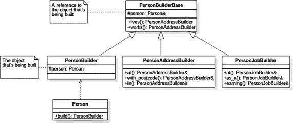

# 2.建设者

构建器模式与复杂对象的创建有关，也就是说，不能在一行构造器调用中构建的对象。这些类型的对象本身可能由其他对象组成，并且可能包含不太明显的逻辑，因此需要一个专门用于对象构造的单独组件。

我想值得预先注意的是，虽然我说过构建器关注复杂的对象，但我们将看一个相当小的例子。这样做纯粹是为了优化空间，因此领域逻辑的复杂性不会影响读者理解模式的实际实现。

## 方案

假设我们正在构建一个呈现网页的组件。首先，我们将输出一个简单的无序列表，其中有两项包含单词 hello 和 world。一个非常简单的实现可能如下所示:

```cpp
1   string words[] = { "hello", "world" };
2   ostringstream oss;
3   oss << "<ul>";
4   for (auto w : words)
5     oss << "  <li>" << w << "</li>";
6   oss << "</ul>";
7   printf(oss.str().c_str());

```

这实际上给了我们想要的东西，但是这种方法不太灵活。我们如何将这个列表从项目符号列表变成编号列表呢？列表创建后，我们如何添加另一个项目？显然，在我们这个僵化的计划中，这是不可能的。

因此，我们可以走 OOP 路线，定义一个`HtmlElement`类来存储关于每个标签的信息:

```cpp
 1   struct HtmlElement
 2   {
 3     string name;
 4     string text;
 5     vector<HtmlElement> elements;
 6
 7     HtmlElement() {}
 8     HtmlElement(const string& name, const string& text)
 9       : name(name), text(text) { }
10
11     string str(int indent = 0) const

12     {
13       // pretty-print the contents
14     }
15   }

```

有了这种方法，我们现在可以以更明智的方式创建我们的列表:

```cpp
1   string words[] = { "hello", "world" };
2   HtmlElement list{"ul", ""};
3   for (auto w : words)
4     list.elements.emplace_back{HtmlElement{"li", w}};
5   printf(list.str().c_str());

```

这工作得很好，给了我们一个更可控的、OOP 驱动的项目列表的表示。但是构建每个`HtmlElement`的过程不是很方便，我们可以通过实现构建器模式来改进它。

## 简单生成器

Builder 模式只是试图将对象的分段构造外包给一个单独的类。我们的第一次尝试可能会产生这样的结果:

```cpp
 1   struct HtmlBuilder
 2   {
 3     HtmlElement root;
 4
 5     HtmlBuilder(string root_name) { root.name = root_name; }
 6
 7     void add_child(string child_name, string child_text)
 8     {
 9       HtmlElement e{ child_name, child_text };
10       root.elements.emplace_back(e);
11     }
12
13     string str() { return root.str(); }
14   };

```

这是一个构建 HTML 元素的专用组件。`add_child()`方法是用于向当前元素添加更多子元素的方法，每个子元素是一个名称-文本对。它可以按如下方式使用:

```cpp
1   HtmlBuilder builder{ "ul" };
2   builder.add_child("li", "hello");
3   builder.add_child("li", "world");
4   cout << builder.str() << endl;

```

你会注意到，此时，`add_child()`函数正在返回`void`。我们可以使用返回值做很多事情，但返回值最常见的用途之一是帮助我们构建一个流畅的界面。

## 流畅的建设者

让我们将`add_child()`的定义更改如下:

```cpp
1   HtmlBuilder& add_child(string child_name, string child_text)
2   {
3     HtmlElement e{ child_name, child_text };
4     root.elements.emplace_back(e);
5     return *this;
6   }

```

通过返回对构建器本身的引用，现在可以链接构建器调用。这就是所谓的流畅界面:

```cpp
1   HtmlBuilder builder{ "ul" };
2   builder.add_child("li", "hello").add_child("li", "world");
3   cout << builder.str() << endl;

```

引用或指针的选择完全取决于您。如果您想用`->`操作符来链接调用，您可以这样定义`add_child()`:

```cpp
1   HtmlBuilder* add_child(string child_name, string child_text)
2   {
3     HtmlElement e{ child_name, child_text };
4     root.elements.emplace_back(e);
5     return this;
6   }

```

然后像这样使用它:

```cpp
1   HtmlBuilder builder{"ul"};
2   builder->add_child("li", "hello")->add_child("li", "world");
3   cout << builder << endl;

```

## 传达意图

我们为 HTML 元素实现了一个专用的构建器，但是我们类的用户如何知道如何使用它呢？一个想法是，只要他们构造一个对象，就简单地强迫他们使用生成器。你需要做的是:

```cpp
 1   struct HtmlElement
 2   {
 3     string name;
 4     string text;
 5     vector<HtmlElement> elements;
 6     const size_t indent_size = 2;
 7
 8     static unique_ptr<HtmlBuilder> build(const string& root_name)
 9     {
10       return make_unique<HtmlBuilder>(root_name);
11     }
12
13   protected: // hide all constructors
14     HtmlElement() {}
15     HtmlElement(const string& name, const string& text)
16       : name{name}, text{text}
17     {
18     }
19   };

```

我们的方法是双管齐下的。首先，我们隐藏了所有的构造函数，所以它们不再可用。然而，我们已经创建了一个工厂方法(这是我们将在后面讨论的设计模式),用于从`HtmlElement`中创建一个构建器。这也是一个静态方法。下面是如何使用它的方法:

```cpp
1   auto builder = HtmlElement::build("ul");
2   builder.add_child("li", "hello").add_child("li", "world");
3   cout << builder.str() << endl;

```

但是我们不要忘记，我们的最终目标是建造一个`HtmlElement`，而不仅仅是它的建造者！因此，锦上添花可以是构建器上的`operator HtmlElement`的实现，以产生最终值:

```cpp
1   struct HtmlBuilder
2   {
3     operator HtmlElement() const { return root; }
4     HtmlElement root;
5     // other operations omitted
6   };

```

前面的一个变化是返回`std::move(root)`，但是你是否想这样做完全取决于你自己。

无论如何，操作符的添加允许我们编写以下内容:

```cpp
1   HtmlElement e = HtmlElement::build("ul")
2     .add_child("li", "hello")
3     .add_child("li", "world");
4   cout << e.str() << endl;

```

遗憾的是，没有办法明确地告诉其他用户以这种方式使用 API。希望对构造函数的限制和静态`build()`函数的存在能让用户使用构造函数，但是，除了操作符之外，给`HtmlBuilder`本身添加一个相应的`build()`函数也是有意义的:

```cpp
1   HtmlElement HtmlBuilder::build() const

2   {
3     return root; // again, std::move possible here
4   }

```

## Groovy 风格的生成器

这个例子稍微偏离了专门的构建器，因为确实看不到构建器。它只是对象构造的一种替代手段。

Groovy、Kotlin 等编程语言都试图通过支持使过程更好的语法结构来展示他们在构建 DSL 方面有多棒。但是 C++有什么不同呢？感谢初始化列表，我们可以使用普通的类有效地构建一个 HTML 兼容的 DSL。

首先，我们将定义一个 HTML 标签:

```cpp
 1   struct Tag
 2   {
 3     std::string name;
 4     std::string text;
 5     std::vector<Tag> children;
 6     std::vector<std::pair<std::string, std::string>> attributes;
 7
 8     friend std::ostream& operator<<(std::ostream& os, const Tag& tag)
 9     {
10       // implementation omitted
11     }
12   };

```

到目前为止，我们有一个`Tag`可以存储它的名称、文本、子元素(内部标签)，甚至 HTML 属性。我们也有一些漂亮的打印代码，但太无聊了，不能在这里展示。

现在我们可以给它几个`protected`构造函数(因为我们不希望任何人直接实例化它)。我们以前的实验告诉我们，我们至少有两种情况:

*   由名称和文本初始化的标签(例如，列表项)
*   由名称和子元素集合初始化的标记

第二种情况更有趣。我们将使用类型为`std::vector`的参数:

```cpp
 1   struct Tag
 2   {
 3     ...
 4     protected:
 5       Tag(const std::string& name, const std::string& text)
 6         : name{name}, text{text} {}
 7
 8
 9       Tag(const std::string& name, const std::vector<Tag>& children)
10         : name{name}, children{children} {}
11     };

```

现在我们可以从这个`Tag`类继承，但是只针对有效的 HTML 标签(从而约束了我们的 DSL)。让我们定义两个标签:一个用于段落，另一个用于图像:

```cpp
 1   struct P : Tag
 2   {
 3     explicit P(const std::string& text)
 4       : Tag{"p", text} {}
 5
 6     P(std::initializer_list<Tag> children)
 7       : Tag("p", children) {}
 8
 9   };
10
11   struct IMG : Tag
12   {
13     explicit IMG(const std::string& url)
14       : Tag{"img", ""}
15     {
16       attributes.emplace_back({"src", url});
17     }
18   };

```

前面的构造函数进一步约束了我们的 API。根据前面的构造函数，一个段落只能包含文本或一组子元素。另一方面，图像可以不包含其他标签，但是必须有一个名为`img`的属性，并提供地址。

现在，这个魔术的声望…由于统一初始化和我们产生的所有构造函数，我们可以编写以下代码:

```cpp
1   std::cout <<
2
3     P {
4       IMG { "http://pokemon.com/pikachu.png" }
5     }
6
7     << std::endl;

```

这不是很棒吗？我们已经为段落和图像构建了一个迷你 DSL，这个模型可以很容易地扩展到支持其他标签。而且看不到任何电话！

## 复合助洗剂

我们将用一个例子来结束对构建器的讨论，在这个例子中，多个构建器被用来构建一个单独的对象。假设我们决定记录一个人的一些信息:

```cpp
 1   class Person

 2   {
 3     // address
 4     std::string street_address, post_code, city;
 5
 6     // employment
 7     std::string company_name, position;
 8     int annual_income = 0;
 9
10     Person() {}
11   };

```

`Person`有两个方面:他们的地址和就业信息。如果我们想为每一个都有单独的构建器，那该怎么办呢——我们怎样才能提供最方便的 API 呢？为此，我们将构建一个复合构建器。这种构造并不简单，所以要注意——尽管我们希望工作和地址信息有不同的构造器，但我们将产生不少于四个不同的类。

我选择在本书中完全避免 UML，但是这是类图有意义的一种情况，所以下面是我们实际要构建的:



我们称第一节课为`PersonBuilderBase`:

```cpp
 1   class PersonBuilderBase

 2   {
 3   protected:
 4     Person& person;
 5     explicit PersonBuilderBase(Person& person)
 6       : person{ person }
 7     {
 8     }
 9   public:
10     operator Person()
11     {
12       return std::move(person);
13     }
14
15     // builder facets
16
17     PersonAddressBuilder lives() const;
18     PersonJobBuilder works() const;
19   };

```

这比我们前面简单的构建器要复杂得多，所以让我们依次讨论每个成员:

*   引用`person`是对正在构建的对象的引用。这可能看起来非常奇怪，但这是为子构建者特意做的。注意，`Person`的物理存储在这个类中不存在。这很关键！根类只保存引用，不保存构造的对象。
*   分配引用的构造函数是`protected`，因此只有继承者(`PersonAddressBuilder`和`PersonJobBuilder`)可以使用它。
*   是我们以前用过的一个把戏。我假设`Person`有一个正确定义的 move 构造函数——ReSharper 可以轻松地生成一个。
*   `lives()`和`works()`是返回构建器方面的函数:分别初始化地址和雇佣信息的子构建器。

现在，前面的基类中唯一缺少的是正在构造的实际对象。它在哪里？嗯，它实际上存储在一个我们称之为，咳咳，`PersonBuilder`的继承者中。这是我们希望人们实际使用的类:

```cpp
1   class PersonBuilder : public PersonBuilderBase
2   {
3     Person p; // object being built
4   public:
5     PersonBuilder() : PersonBuilderBase{p} {}
6   };

```

所以这是建造物体的地方。这个类并不意味着被继承:它只是一个实用工具，让我们启动建立一个构建器的过程。 [<sup>1</sup>](#Fn1)

为了找出我们最终得到不同的公共和受保护构造函数的确切原因，让我们看一下其中一个子构建器的实现:

```cpp
 1   class PersonAddressBuilder : public PersonBuilderBase
 2   {
 3     typedef PersonAddressBuilder self;
 4   public:
 5     explicit PersonAddressBuilder(Person& person)
 6       : PersonBuilderBase{ person } {}
 7
 8     self& at(std::string street_address)
 9     {
10       person.street_address = street_address;
11       return *this;
12     }
13
14     self& with_postcode(std::string post_code) { ... }
15
16     self& in(std::string city) { ... }
17   };

```

如你所见，`PersonAddressBuilder`为建立一个人的地址提供了一个流畅的界面。注意，它实际上继承自`PersonBuilderBase`(意味着它已经获得了`lives()`和`works()`成员函数)并调用基本构造函数，传递一个引用。尽管它没有从`PersonBuilder`继承——如果继承了，我们会创建太多的`Person`实例，说实话，我们只需要一个。

正如您所猜测的，`PersonJobBuilder`是以相同的方式实现的。这两个类以及`PersonBuilder`都被声明为`Person`中的`friend`类，以便能够访问它的私有成员。

现在，你期待已久的时刻到了:这些建筑商的一个实例:

```cpp
1   Person p = Person::create()
2     .lives().at("123 London Road")
3             .with_postcode("SW1 1GB")
4             .in("London")
5     .works().at("PragmaSoft")
6             .as_a("Consultant")
7             .earning(10e6);

```

你能看到这里发生了什么吗？我们使用`create()`函数得到一个构建器，使用`lives()`函数得到一个`PersonAddressBuilder`，但是一旦我们完成了地址信息的初始化，我们只需调用`works()`并切换到使用一个`PersonJobBuilder`来代替。

当我们完成构建过程时，我们使用与之前相同的技巧将正在构建的对象作为`Person`。注意，一旦这样做了，构建器就不可用了，因为我们用`std::move()`移动了`Person`。

## 摘要

构建器模式的目标是定义一个完全致力于复杂对象或对象集的分段构建的组件。我们已经观察到建造者的以下关键特征:

*   构建者可以拥有一个流畅的接口，该接口可用于使用单个调用链的复杂构建。为了支持这一点，构建器函数应该返回`this`或`*this`。
*   为了强制 API 的用户使用构建器，我们可以使目标对象的构造器不可访问，然后定义一个返回构建器的静态函数`create()`。
*   通过定义适当的运算符，可以将生成器强制转换为对象本身。
*   由于统一的初始化器语法，Groovy 风格的构建器在 C++中是可能的。这种方法非常通用，允许创建不同的 DSL。
*   单个构建器接口可以公开多个子构建器。通过巧妙地使用继承和流畅的接口，人们可以轻松地从一个构建器跳到另一个构建器。

只是为了重申我已经提到的一些东西，当对象的构造是一个重要的过程时，使用 Builder 模式是有意义的。由有限数量的合理命名的构造函数参数明确构造的简单对象可能应该使用构造函数(或依赖注入),而不需要这样的构造函数。

Footnotes [1](#Fn1_source)

GitHub 上的@CodedByATool 建议将层次结构分成两个独立的基类，以避免重复的`Person`实例——感谢这个想法！