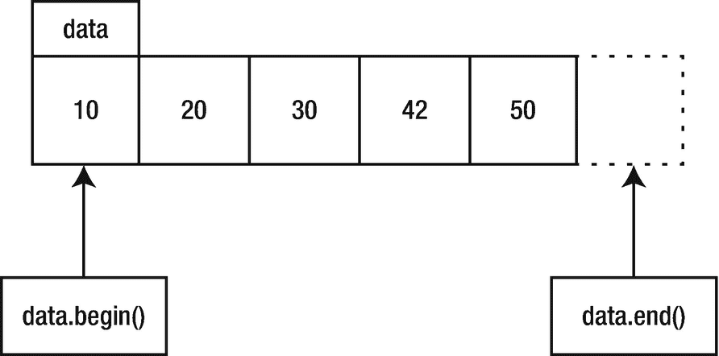

# 9.数组和向量

既然你已经了解了基础知识，是时候开始迎接更激动人心的挑战了。让我们写一个真正的程序，一些不平凡的，但仍然足够简单，以掌握这本书的早期。您的工作是编写一个程序，从标准输入中读取整数，将它们按升序排序，然后打印排序后的数字，每行一个。

在这一点上，这本书还没有涵盖足够的材料来帮助你解决这个问题，但是思考这个问题和解决它可能需要的工具是有启发性的。在这个探索中，你的第一个任务是**为程序**编写伪代码。尽可能地编写 C++代码，并编写解决问题所需的任何东西。

*   ___________________________________________________

*   ___________________________________________________

*   ___________________________________________________

*   ___________________________________________________

*   ___________________________________________________

*   ___________________________________________________

*   ___________________________________________________

*   ___________________________________________________

*   ___________________________________________________

*   ___________________________________________________

*   ___________________________________________________

*   ___________________________________________________

*   ___________________________________________________

*   ___________________________________________________

*   ___________________________________________________

*   ___________________________________________________

*   ___________________________________________________

*   ___________________________________________________

*   ___________________________________________________

## 数组的向量

你需要一个数组来存储这些数字。只给定这么多新信息，您可以编写一个程序来读取、排序和打印数字，但只能通过手工编写排序代码来实现。那些上过大学算法课程的人可能还记得如何写冒泡排序或快速排序，但是为什么你需要去弄这么低级的代码呢？你肯定会说，有更好的办法。有:C++标准库有一个快速排序函数，可以对任何东西进行排序。直接跳到清单 [9-1](#PC1) 中的解决方案。

```cpp
 1 import <algorithm>;
 2 import <iostream>;
 3 import <vector>;
 4
 5 int main()
 6 {
 7   std::vector<int> data{};     // initialized to be empty
 8   int x{};
 9
10   // Read integers one at a time.
11   while (std::cin >> x)
12     // Store each integer in the vector.
13     data.emplace_back(x);
14
15   // Sort the vector.
16   std::ranges::sort(data);
17
18   // Print the vector, one number per line.
19   for (int element : data)
20     std::cout << element << '\n';
21 }

Listing 9-1.Sorting Integers

```

该程序引入了几个新功能。让我们从第 7 行和名为`vector`的类型开始，它是一个可调整大小的数组类型。下一节将向您解释。

## 向量

第 7 行定义了类型为`std::vector<int>`的变量`data`。C++有几种容器类型，即可以包含一堆对象的数据结构。其中一个容器是`vector`，它是一个可以改变大小的数组。所有的 C++容器都需要一个元素类型，也就是你打算存储在容器中的对象的类型。在这种情况下，元素类型是`int`。在尖括号中指定元素类型:`<int>`。这告诉编译器你希望数据是一个`vector`并且`vector`将存储整数。

定义中缺少了什么？

*   _____________________________________________________________

向量没有大小。相反，向量可以在程序运行时增长或收缩。(如果你知道你需要一个特定的、固定大小的数组，你可以使用类型`array`。在大多数程序中，你会比 T2 更频繁地使用 T1。)由此，`data`初空。和`std::string`一样，`vector`是一个库类型，它有一个明确定义的初始值，即空，所以如果你愿意，可以省略`{}`初始化器。

您可以在向量中的任何位置插入和抹掉项目，尽管仅在末尾添加项目或仅从末尾抹掉项目时性能最佳。这就是程序在`data`中存储值的方式:通过调用`emplace_back`，这将一个元素添加到一个`vector`的末尾(第 13 行)。向量的“后面”是末端，索引最高。“前面”是开始，所以`back()`返回向量的最后一个元素，`front()`返回第一个元素。如果`vector`为空，不要调用这些函数；这会产生不确定的行为。您可能会发现自己经常调用的一个成员函数是`size()`，它返回向量中元素的数量。

从`std::`前缀可以看出，`vector`类型是标准库的一部分，并没有内置到编译器中。因此，您需要`import <vector>`，如第 3 行所示。没什么好惊讶的。

到目前为止提到的所有函数都是成员函数；也就是说，您必须在点运算符(`.`)的左侧提供一个`vector`对象，在右侧提供函数调用。另一种函数不使用点运算符，不受任何特定对象的限制。在大多数语言中，这是典型的函数，但有时 C++程序员称它们为*自由*函数，以区别于成员函数。第 16 行显示了一个自由函数的例子，`std::ranges::sort`。

你如何定义一个字符串向量？

*   _____________________________________________________________

用`std::string`代替`int`得到`std::vector<std::string>`。也可以定义一个`vector` s 的`vector`，是一种二维数组:`std::vector<std::vector<int>>`。

## 范围和算法

从名字可以看出，`std::ranges::sort`函数对数据进行排序。在其他一些面向对象的语言中，你可能期望`vector`有一个`sort()`成员函数。或者，标准库可以有一个`sort`函数，该函数可以对库可以扔给它的任何东西进行排序。C++库属于后一类。

`sort()`函数几乎可以对任何有`begin()`和`end()`的东西进行排序。另一个要求是能够访问数据的特定元素。要获得第三个元素，使用`data.at(2)`，因为索引是从零开始的。也就是说，`data.front()`类似于`data.at(0)`，`data.back()`类似于`data.at(data.size() - 1)`。

STAY SAFE

当你阅读 C++程序时，你很可能会看到方括号(`data[n]`)用于访问向量的元素。方括号和`at`成员函数的区别在于`at`函数提供了额外的安全级别。如果索引超出界限，程序将彻底终止。另一方面，对无效索引使用方括号将导致未定义的行为:您不知道会发生什么。最危险的是你的程序不会终止，而是会带着坏数据继续运行。这也是我推荐使用`at`的原因。

`sort()`函数可以对任意范围的数据进行排序，只要两个元素可以进行比较和排序。它有许多其他兄弟函数来对数据执行各种各样的操作，从`binary_search()`可以快速找到排序向量中的值，或者`shuffle()`可以将向量随机排序。

sort、binary_search 和 shuffle 函数在 C++标准库中被称为*算法*。C++算法可以对向量、其他容器和许多其他类型进行操作。一种算法在一个*范围*的数据上执行一些操作。该范围可以是一个向量，也可以只是向量的一部分。它可能根本不会存储在容器中。对范围的唯一要求是有一个开始，一个结束，以及从开始到结束的方法。

对于 vector 和其他容器，`begin()`成员函数返回范围的开始，`end()`成员函数返回范围的结束。`begin()`返回的值被称为*迭代器*，因为你用它来迭代范围内的值。迭代器提供了一种间接的方法来访问范围内的值。给定一个名为`iterator`的迭代器，你可以使用`*iterator`来获得`iterator`指向的值。++操作符推进了一个迭代器，因此它指向范围中的下一个值，如`++iterator`所示。为了判断迭代器何时到达范围的末尾，它使用一个特殊的标记来表示范围的末尾。此标记不表示范围中的任何特定值，因此它可以标记空范围的结束。对这个标记你唯一能做的就是把它和迭代器进行比较，以确定迭代器是否到达了范围的末尾。很自然地，`data.end()`返回这个特殊的结束标记，称为*标记*。组装这些片段会产生下面的`for`循环来迭代数据元素:

```cpp
for (std::vector<int>::iterator iter{data.begin()}; iter != data.end(); ++iter)
{ int element = *iter; std::cout << element << '\n'; }

```

这是相当多的一口。不要担心这没有任何意义，因为有一个更简单的方法。清单 [9-1](#PC1) 第 17 行的`for`循环做同样的事情，简单得多。它遍历`data`的元素，并将每个后续元素赋给变量`element`。因为这种类型的`for`循环在一个范围内迭代，所以它通常被称为循环的*范围。图 [9-1](#Fig1) 展示了`data`向量的 begin 迭代器和 end sentinel 的本质。*



图 9-1。

指向向量中位置的迭代器

**如果 data.size()为零，data.begin()的值是多少？**

*   _____________________________________________________________

没错。如果 vector 为空，`data.begin()`将返回与`data.end()`相同的值，该值是一个特殊的 sentinel 值，不允许取消引用。换句话说，`*data.end()`导致未定义的行为。因为您可以比较两个迭代器或一个带有标记的迭代器，所以确定 vector 是否为空的一种方法是测试，如下面的代码所示:

```cpp
data.begin() == data.end()

```

然而，更好的方法是调用`data.empty()`，如果向量为空，则返回`true`，如果向量至少包含一个元素，则返回`false`。

除了访问向量的元素，范围和迭代器还有很多用途，从下一篇文章开始，你会在本书中经常看到它们被用于输入、输出等等。