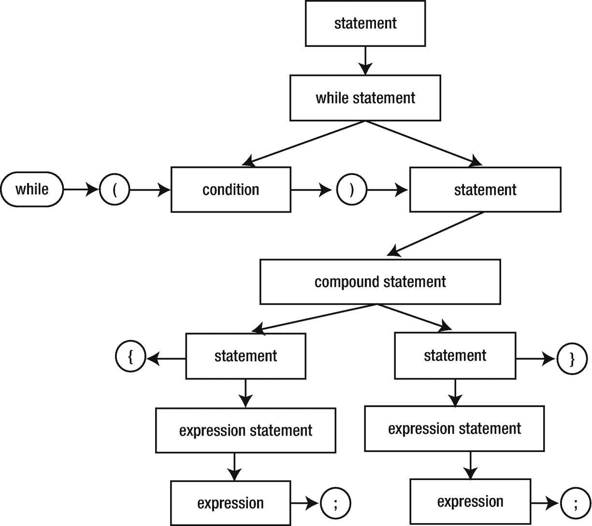

# 13.复合语句

您已经在许多程序中使用了复合语句(即，用花括号括起来的语句列表)。现在是时候学习复合语句的一些特殊规则和用法了，复合语句也被称为*块*。

## 声明

C++ 有一些可怕的语法规则。相比之下，语句的语法非常简单。C++ 语法根据其他语句定义了大多数语句。例如，`while`语句的规则是

```cpp
while ( condition ) statement

```

在这个例子中，粗体元素是必需的，比如关键字`while`。*斜体*元素代表其他语法规则。从例子中可以推断出，`while`语句可以将任何语句作为循环体，包括另一个`while`语句。

大多数语句似乎以分号结尾的原因是，C++ 中最基本的语句只是一个后跟分号的表达式。

```cpp
expression ;

```

这种语句叫做*表达式语句*。

我还没有讨论表达式的精确规则，但是它们的工作方式和大多数其他语言一样，只是有一些不同。最重要的是，赋值是 C++ 中的一个表达式(就像在 C、Java、C#等语言中一样)。，但在 Pascal、Basic、Fortran 等语言中没有。).请考虑以下几点:

```cpp
while (std::cin >> x)
  sum = sum + x;

```

这个例子演示了一个单独的`while`语句。`while`语句的一部分是另一个语句:在本例中，是一个表达式语句。表情语句中的表情是`sum = sum + x`。表达式语句中的表达式通常是赋值或函数调用，但是语言允许任何表达式。因此，下面是一个有效的陈述:

```cpp
42;

```

如果你在程序中使用这个语句，你认为会发生什么？

*   _____________________________________________________________

试试看。实际发生了什么？

*   _____________________________________________________________

现代编译器通常能够检测出无用的语句，并将它们从程序中删除。通常，编译器会告诉你它在做什么，但是你可能需要提供一个额外的选项来告诉编译器要特别挑剔。例如，尝试使用 g++ 的`-Wall`选项或 Microsoft Visual C++ 的`/Wall`选项。(在所有警告中，那是墙，不是支撑你屋顶的东西。)

复合语句的语法规则是

```cpp
{ statement* }

```

其中`*`表示前面的规则(*语句*)出现了零次或多次。注意，右花括号后面没有分号。

**c++ 如何解析以下内容？**

*   _____________________________________________________________

*   _____________________________________________________________

*   _____________________________________________________________

```cpp
while (std::cin >> x)
{
    sum = sum + x;
    ++count;
}

```

同样，您有一个`while`语句，因此循环体必须是一个单独的语句。在本例中，循环体是一个复合语句。复合语句是由两个表达式语句组成的语句。图 [13-1](#Fig1) 显示了相同信息的树形视图。



图 13-1。

C++ 语句的简化解析树

考虑`main()`的主体，例如清单 [13-1](#PC7) 中的主体。你看到了什么？没错，是复合语句。这是一个普通的积木，它和其他积木遵循同样的规则。如果您想知道，`main()`的主体必须是一个复合语句。这是少数几种 C++ 需要特定类型的语句，而不允许任何语句的情况之一。

**查找并修复清单** [**13-1**](#PC7) 中的错误。通过阅读代码，直观地找到尽可能多的错误。当你认为你已经找到并解决了所有问题时，试着编译并运行这个程序。

```cpp
 1 import <iostream>;
 2 import <vector>;
 3 // find errors in this program
 4 int main()
 5 {
 6   std::vector<int> positive_data{}, negative_data{};
 7
 8   for (int x{0}; std::cin >> x ;) {
 9     if (x < 0);
10     {
11       negative_data.push_back(x)
12     };
13     else
14     {
15       positive_data.push_back(x)
16     }
17   };
18 }

Listing 13-1.Finding Statement Errors

```

记录清单 [13-1](#PC7) 中的所有错误。

*   _____________________________________________________________

*   _____________________________________________________________

*   _____________________________________________________________

没有编译器的帮助，你都找到了吗？_ _ _ _ _ _ _ _ _ _ _ _ _ _ _ _ _ _ _

这些错误是

*   第 9 行多了一个分号

*   第 12 行多了一个分号

*   第 11 行和第 15 行末尾缺少分号

*   第 17 行多了一个分号

额外加分的是，**哪些错误不是语法违规(编译器不会提醒你)并且不影响程序的行为？**

*   _____________________________________________________________

*   _____________________________________________________________

如果你回答了“第 17 行额外的分号”，给自己一颗星。严格地说，多余的分号代表一个空的、无所事事的语句，称为*空语句*。这种语句有时在循环中会用到，尤其是在循环头中完成所有工作的`for`循环，没有留给循环体任何事情去做。(参见清单 [12-4](12.html#PC6) 中的示例。)

因此，编译器解释第 9 行的方式是分号是`if`语句的语句体。下一个语句是一个复合语句，后面跟一个`else`，没有对应的`if`，因此出现错误。每个`else`必须是同一语句中前面的`if`的对应。换句话说，每个`if`条件后面必须紧跟一条语句，然后是可选的`else`关键字和另一条语句。您不能以任何其他方式使用`else`。

如前所述，第 9 行的`if`语句后面是三个语句:一个空语句、一个复合语句和另一个空语句。解决方案是通过删除第 9 行和第 12 行的分号来删除 null 语句。

组成复合语句的语句可以是任何语句，包括其他复合语句。下一节将解释为什么要将一个复合语句嵌套在另一个复合语句中。

第 6 行显示您可以使用逗号分隔符一次声明多个变量。我更喜欢一次定义一个变量，但也想向您展示这种风格。每个变量都有自己的初始化器。

## 本地定义和范围

复合语句不仅仅是将多个语句组合成一个语句。还可以在块内对定义进行分组。您在块中定义的任何变量只在块的范围内可见。可以使用变量的区域称为变量的*范围*。一个好的编程实践是将范围限制在尽可能小的区域。限制变量的范围有几个目的:

*   *防止错误*:你不能意外地在变量名的作用域之外使用它。

*   *交流意图*:任何阅读你的代码的人都能知道一个变量是如何被使用的。如果在尽可能广泛的范围内定义变量，那么阅读您的代码的人必须花费更多的时间和精力来确定在哪里使用不同的变量。

*   *重用名字*:你能使用多少次变量`i`作为循环控制变量？只要每次将变量的作用域限制在循环中，就可以随时使用和重用它。

*   *重用内存*:当执行到达一个块的末尾时，该块中定义的所有变量都被销毁，内存可供再次使用。因此，如果您的代码创建了许多大型对象，但一次只需要一个，您可以在每个变量自己的范围内定义每个变量，这样一次只存在一个大型对象。

清单 [13-2](#PC8) 展示了一些局部定义的例子。粗体突出显示的行表示本地定义。

```cpp
#include <cassert>
import <algorithm>;
import <iostream>;
import <iterator>;
import <string>;
import <vector>;

int main()
{
  std::vector<int> data{};
  data.insert(data.begin(), std::istream_iterator<int>(std::cin),
                            std::istream_iterator<int>());

  // Silly way to sort a vector. Assume that the initial portion
  // of the vector has already been sorted, up to the iterator iter.
  // Find where *iter belongs in the already sorted portion of the vector.
  // Erase *iter from the vector and re-insert it at its sorted position.
  // Use binary search to speed up the search for the proper position.
  // Invariant: elements in range [begin(), iter are already sorted.
  for (auto iter{data.begin()}, end{data.end()}; iter != end; )
  {
    // Find where *iter belongs by calling the standard algorithm
    // lower_bound, which performs a binary search and returns an iterator
    // that points into data at a position where the value should be inserted.
    int value{*iter};
    auto here{std::lower_bound(data.begin(), iter, value)};
    if (iter == here)
      ++iter; // already in sorted position
    else
    {
      iter = data.erase(iter);
      // re-insert the value at the correct position.
      data.insert(here, value);
    }
  }

  // Debugging code: check that the vector is actually sorted. Do this by comparing
  // each element with the preceding element in the vector.
  for (auto iter{data.begin()}, prev{data.end()}, end{data.end()};
       iter != end;
      ++iter)
  {
    if (prev != data.end())
      assert(not (*iter < *prev));
     prev = iter;
  }

  // Print the sorted vector all on one line. Start the line with "{" and
  // end it with "}". Separate elements with commas.
  // An empty vector prints as "{ }".
  std::cout << '{';
  std::string separator{" "};
  for (int element : data)
  {
    std::cout << separator << element;
    separator = ", ";
  }
  std::cout << " }\n";
}

Listing 13-2.Local Variable Definitions

```

清单 [13-2](#PC8) 有很多新的功能和特性，所以让我们一次看一部分代码。

`data`的定义是一个块中的局部定义。没错，你几乎所有的定义都在这个最外层，但是复合语句就是复合语句，复合语句中的任何定义都是局部定义。这就引出了一个问题:你是否可以在所有块之外定义一个变量。答案是肯定的，但是你很少愿意。C++ 允许全局变量，但是本书中没有一个程序需要定义全局变量。当时机成熟时，我会讨论全局变量(这将是探索 [52](52.html) )。

一个`for`循环有自己特殊的作用域规则。正如你在《探索 [7](07.html) 中所学的，一个`for`循环的初始化部分可以，并且经常定义一个循环控制变量。该变量的范围被限制在`for`循环中，就好像`for`语句被包含在一组额外的花括号中。

`value`变量也是`for`循环体的局部变量。如果试图在循环之外使用该变量，编译器会发出一条错误消息。在这种情况下，你没有理由在循环外使用这个变量，所以在循环内定义这个变量。

`lower_bound`算法执行二分搜索法，试图在一系列排序值中找到一个值。它返回一个迭代器，该迭代器指向该值在范围中的第一个匹配项，或者如果没有找到该值，则指向可以插入该值并保持范围有序的位置。这正是这个程序排序`data`向量所需要的。

成员函数从向量中删除一个元素，将向量的大小减少一。向`erase`传递一个迭代器来指定要删除哪个元素，并保存返回值，这个迭代器引用向量中该位置的新值。`insert`函数在迭代器指定的位置(第一个参数)之前插入一个值(第二个参数)。

注意如何使用和重用名称`iter`。每个循环都有自己独特的名为`iter`的变量。每一个`iter`对于它的循环都是局部的。如果你写了草率的代码并且没有初始化`iter`，变量的初始值将会是垃圾。它与程序中前面定义的变量不是同一个变量，所以它的值与旧变量的旧值不同。

`separator`变量保存一个分隔符字符串，在打印矢量时在元素之间打印。它也是一个局部变量，但是对于`main`程序的块来说是局部的。然而，通过在使用它之前定义它，您传达了这样一个信息，即在`main`中不需要这个变量。它有助于防止在另一个部分重用`main`的一个部分的变量时可能出现的错误。

另一种帮助限制变量范围的方法是在块内的块中定义变量，如清单 [13-3](#PC9) 所示。(这个版本的程序用对标准算法的调用代替了循环，这是当你不想表达观点时编写 C++ 程序的一个更好的方法。)

```cpp
import <algorithm>;
import <iostream>;
import <iterator>;
import <string>;
import <vector>;

int main()
{
  std::vector<int> data{};
  data.insert(data.begin(), std::istream_iterator<int>(std::cin),
                            std::istream_iterator<int>());

  std::ranges::sort(data);

  {
    // Print the sorted vector all on one line. Start the line with "{" and
    // end it with "}". Separate elements with commas. An empty vector prints
    // as "{ }".
    std::cout << '{';
    std::string separator{" "};
    for (int element : data)
    {
      std::cout << separator << element;
      separator = ", ";
    }
    std::cout << " }\n";
  }
  // Cannot use separator out here.
}

Listing 13-3.Local Variable Definitions in a Nested Block

```

大多数 C++ 程序员很少嵌套块。随着你对 C++ 了解的越来越多，你会发现各种改进嵌套块的技术，让你的`main`程序看起来不那么混乱。

## for 循环头中的定义

如果您没有在`for`循环头中定义循环控制变量，而是在循环外定义它们，会怎么样？试试看。

**重写清单** [**13-2**](#PC8) **，所以不要在** `for` **循环头中定义任何变量。**

你怎么想呢?新代码看起来比原来的更好还是更差？_ _ _ _ _ _ _ _ _ _ _ _**为什么？**

*   _____________________________________________________________

*   _____________________________________________________________

*   _____________________________________________________________

就个人而言，我发现`for`循环很容易变得混乱。尽管如此，将循环控制变量保持在循环的局部对于清晰性和代码理解是至关重要的。当面对一个大型的、未知的程序时，你在理解这个程序时面临的困难之一是知道变量何时以及如何呈现新的值。如果一个变量是循环的局部变量，你知道这个变量不能在循环之外被修改。那是有价值的信息。如果你仍然需要说服，试着阅读和理解清单 [13-4](#PC10) 。

```cpp
#include <cassert>
import <algorithm>;
import <iostream>;
import <iterator>;
import <ranges>;
import <string>;
import <vector>;

int main()
{
  int v{};
  std::vector<int> data{};
  std::vector<int>::iterator i{}, p{};
  std::string s{};

  std::ranges::copy(std::ranges::istream_view<int>(std::cin),
            std::back_inserter(data));
  i = data.begin();

  while (i != data.end())
  {
    v = *i;
    p = std::lower_bound(data.begin(), i, v);
    if (i == p)
      ++i;
    else
    {
      i = data.erase(i);
      data.insert(p, v);
    }
  }

  s = " ";
  for (p = i, i = data.begin(); i != data.end(); p = i, ++i)
  {
    if (p != data.end())
      assert(not (*i < *p));
  }

  std::cout << '{';
  for (i = data.begin(); i != data.end(); ++i)
  {
    v = *p;
    std::cout << s << v;
    s = ", ";
  }
  std::cout << " }\n";
}

Listing 13-4.Mystery Function

```

嗯，这并不太难，是吧？毕竟，您最近刚刚读完清单 [13-2](#PC8) ，因此您可以看到清单 [13-4](#PC10) 也打算做同样的事情，但是稍微进行了重组。困难在于跟踪`p`和`i`的值，并确保它们在程序的每一步都有正确的值。尝试编译并运行该程序。记录你的观察结果。

*   _____________________________________________________________

*   _____________________________________________________________

*   _____________________________________________________________

哪里出了问题？

*   _____________________________________________________________

*   _____________________________________________________________

*   _____________________________________________________________

我写错了，把`v = *i`写成了`v = *p`。如果您在运行程序之前发现了这个错误，那么恭喜您。如果变量被正确地定义在各自的局部范围内，这个错误就不会发生。

接下来的探索引入了文件 I/O，所以你的练习可以读写文件，而不是使用控制台 I/O，我相信你的手指会很感激。