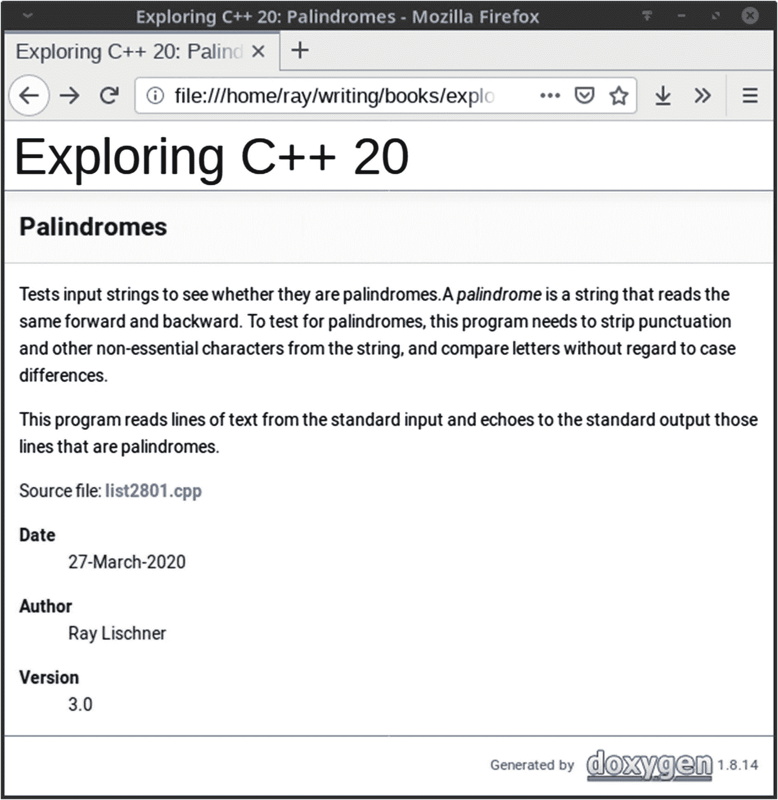

# 28.文件

这次探险和其他的有点不同。它没有涵盖 C++标准的一部分，而是研究了一个名为 Doxygen 的第三方工具。请随意跳过这一探索，但要明白这是我解释您有时在代码清单中看到的奇怪注释的地方。

## 注释

Doxygen 是一个免费的(有费用和许可)工具，它可以读取您的源代码，寻找遵循特定结构的注释，并从注释和代码中提取信息以生成文档。它产生多种格式的输出:HTML、RTF(富文本格式)、LaTeX、UNIX 手册页和 XML。

Java 程序员可能熟悉一种叫做 javadoc 的类似工具。javadoc 工具是 Java 软件开发工具包中的标准，而 Doxygen 与 C++标准或任何 C++供应商都没有关系。C++缺乏结构化文档的标准，所以你可以随心所欲。例如，微软为注释中的 XML 标记定义了自己的约定，如果您打算完全在微软内部工作，这很好。NET 环境。对于其他程序员，我建议使用具有更广泛和可移植用途的工具。最流行的解决方案是 Doxygen，我认为每个 C++程序员都应该了解它，即使您决定不使用它。这就是为什么我在书中包括了这个探索。

## 结构化注释

Doxygen 注意遵循特定格式的注释:

*   单行注释以额外的斜线或感叹号开始:`///`或`//!`

*   多行注释以一个额外的星号或感叹号开始:`/**`或`/*!`

此外，Doxygen 认识到一些普遍的注释惯例和修饰。例如，它忽略一行斜线。

```cpp
//////////////////////////////////////////////////////////////////////////////

```

多行注释可以以一行星号开始。

```cpp
/*****************************************************************************
like this
*****************************************************************************/

```

多行注释中的一行可以以星号开始。

```cpp
/****************************************************************************
 * This is a structured comment for Doxygen.                                *
 ****************************************************************************/

```

在结构化注释中，您可以记录程序中的各种实体:函数、类型、变量等等。

惯例是紧接在声明或定义之前的注释适用于被声明或定义的实体。有时，您希望将注释放在声明之后，例如对变量的单行描述。为此，在注释的开头使用“小于”(`<`)符号。

```cpp
double const c = 299792458.0;            ///< speed of light in m/sec

```

## 文档标签和降价

Doxygen 有自己的标记语言，利用了*标签*。标签可以以反斜杠字符(`\return`)或“at 符号”(`@return`)开始。有些标签有参数，有些没有。除了它自己的标签之外，你还可以使用 HTML 或 Markdown(一种易于读写的类似 wiki 的语法)的子集。最有用的标签、标记和降价如下:

### **@b** 字

将*一词*标为黑体。您还可以使用 HTML 标记、`<b>` *短语* `</b>`，这在*短语*包含空格时很有用，或者使用 Markdown，将文本括在星号:* *短语* *中。

### **@brief** 一句话描述

简要描述一个实体。实体有简短而详细的文件。根据您如何配置 Doxygen，简要文档可以是实体完整文档的第一句话，或者您可以要求一个显式的`@brief`标记。无论哪种情况，注释的其余部分都是实体的详细文档。

### **@c** 字

将*单词*视为代码片段，并将其设置为固定间距字体。您也可以使用 HTML 标记、`<tt>` *短语* `</tt>`，或者使用反斜线进行 Markdown、`*短语*`。

### 字

用斜体强调*一词*。也可以使用 HTML 标签、`<em>` *短语* `</em>`，或者下划线进行 Markdown: `_` *短语* `_`。

### **@file** 文件名

呈现源文件的概述。详细描述可以描述文件的用途、修订历史和其他全局文档。*文件名*是可选的；没有它，Doxygen 使用文件的真实名称。

### **@link** 实体文本 **@endlink**

创建一个到命名的*实体*的超链接，比如一个文件。我在我的`@mainpage`上使用`@link`来为项目中最重要的文件或唯一的文件创建一个目录。Markdown 提供了多种创建链接的方式，比如[ *文本* ]( *实体*)。

### **@mainpage** 标题

为索引或封面开始整个项目的概述。你可以把`@mainpage`放在任何源文件中，或者甚至为注释留出一个单独的文件。在小项目中，我将`@mainpage`放在与`main`函数相同的源文件中，但是在大项目中，我使用一个单独的文件，比如 *main.dox* 。

### **@p** 姓名

将*名称*设置为固定间距字体，以区别于函数参数。

### **@par** 标题

开始一个新段落。如果你提供一行标题，它将成为段落标题。空行也可以分隔段落。

### **@param** 名称说明

记录一个名为*名为*的函数参数。如果您想在函数文档的其他地方引用该参数，请使用`@p` *名称*。

### **@post** 后置条件

记录函数的后置条件。后置条件是一个布尔表达式，当函数返回时，您可以假设它为真(假设所有前提条件都为真)。C++缺乏任何强制后置条件的正式机制(除了`assert`)，所以记录后置条件是至关重要的，尤其是对库作者来说。

### **@pre** 前置条件

记录函数的前提条件。前提条件是一个布尔表达式，在函数被调用之前必须为真，否则不能保证函数正常工作。C++缺乏任何强制实施前提条件的正式机制(除了`assert`)，所以记录前提条件是至关重要的，尤其是对库作者来说。

### **@return** 描述

记录函数返回的内容。

### **见**外部参照

插入对名为 *xref* 的实体的交叉引用。Doxygen 在结构化注释中查找对其他文档实体的引用。当它找到一个时，它插入一个超链接(或文本交叉引用，取决于输出格式)。然而，有时您必须插入对文档中没有命名的实体的显式引用，因此您可以使用`@see`。

您可以通过在名称前加上`%`来禁止自动创建超链接。

### @&, @@, @\, @%, @<

对文字字符(`&`、`@`、`\`、`%`或`<`)进行转义，以防止被 Doxygen 或 HTML 解释。

Doxygen 非常灵活，您有很多方法使用原生 Doxygen 标签、HTML 或 Markdown 来格式化您的注释。这本书的网站有到 Doxygen 主页的链接，在那里你可以找到更多关于该工具的信息并下载该软件。大多数 Linux 用户已经有了 Doxygen 其他用户可以为他们喜欢的平台下载 Doxygen。

清单 [28-1](#PC5) 展示了使用 Doxygen 的许多方法中的一些。

```cpp
/** @file
 * @brief Tests strings to see whether they are palindromes.
 *
 * Reads lines from the input, strip non-letters, and checks whether
 * the result is a palindrome. Ignores case differences when checking.
 * Echoes palindromes to the standard output.
 */

/** @mainpage Palindromes
 * Tests input strings to see whether they are palindromes.
 *
 * A _palindrome_ is a string that reads the same forward and backward.
 * To test for palindromes, this program needs to strip punctuation and
 * other non-essential characters from the string, and compare letters without
 * regard to case differences.
 *
 * This program reads lines of text from the standard input and echoes
 * to the standard output those lines that are palindromes.
 *
 * Source file: list2801.cpp
 *
 * @date 27-March-2020
 * @author Ray Lischner
 * @version 3.0
 */
import <algorithm>;
import <iostream>;
import <ranges>;
import <locale>;
import <ranges>;
import <string>;
import <string_view>;

/** @brief Tests for non-letter.
 *
 * Tests the character @p ch in the global locale.
 * @param ch the character to test
 * @return true if @p ch is not a letter
 */
bool non_letter(char ch)

{
  return not std::isalnum(ch, std::locale{});
}

/** @brief Converts to lowercase.
 *
 * All conversions use the global locale.
 *
 * @param ch the character to test
 * @return the character converted to lowercase
 */
char lowercase(char ch)

{
  return std::tolower(ch, std::locale{});
}

/** @brief Compares two characters without regard to case.
 *
 * @param a one character to compare
 * @param b the other character to compare
 * @return `true` if the characters are the same in lowercase,
 *         `false` if they are different.
 */
bool is_same_char(char a, char b)
{
  return lowercase(a) == lowercase(b);
}

/** @brief Determines whether @p str is a palindrome.
 *
 * Only letter characters are tested. Spaces and punctuation don't count.
 * Empty strings are not palindromes because that's just too easy.
 * @param str the string to test
 * @return `true` if @p str is the same forward and backward and
 *     `not str.empty()`
 */
bool is_palindrome(std::string_view str)
{
  auto filtered_str{ str | std::views::filter(lowercase) };
  return std::ranges::equal(filtered_str, filtered_str|std::views::reverse,
      is_same_char);
}

/** @brief Main program.
 * Sets the global locale to the user's native locale.
 * Then imbues the I/O streams with the native locale.
 */
int main()

{
  std::locale::global(std::locale{""});
  std::cin.imbue(std::locale{});
  std::cout.imbue(std::locale{});

  for (std::string line{}; std::getline(std::cin, line); /*empty*/)
    if (is_palindrome(line))
      std::cout << line << '\n';
}

Listing 28-1.Documenting Your Code with Doxygen

```

图 [28-1](#Fig1) 显示了网页浏览器中的主页。



图 28-1。

回文文档的主页

## 使用 Doxygen

Doxygen 没有采用大量的命令行参数，而是使用一个配置文件，通常命名为`Doxyfile`，您可以将所有有趣的信息放入其中。配置文件中的信息包括项目的名称、要检查注释的文件、要生成的输出格式以及可以用来调整输出的各种选项。

由于选项太多，Doxygen 附带了一个向导`doxywizard`，来帮助生成一个合适的配置文件，或者您可以使用`-g`开关运行命令行`doxygen`实用程序，来生成一个默认的配置文件，其中有很多注释来帮助您理解如何定制它。

一旦配置了 Doxygen，运行程序就变得简单了。简单地运行`doxygen`，它就走了。Doxygen 在解析 C++方面做得很好，c++是一种复杂且难以解析的语言，但它有时会混淆。注意错误消息，看看源文件是否有问题。

配置文件规定了输出的位置。通常，每种输出格式都位于自己的子目录中。例如，默认配置文件将 HTML 输出存储在`html`目录中。在您喜欢的浏览器中打开`html/index.html`文件，查看结果。

**在您的系统上下载并安装 Doxygen。**

将 Doxygen 注释添加到您的程序中。配置并运行 Doxygen。

未来的程序将继续零星地使用 Doxygen 注释，当我认为这些注释有助于你理解程序是做什么的时候。不过，总的来说，我尽量避免在书中提到它们，因为文本通常会足够好地解释事情，我不想浪费任何空间。然而，本书附带的程序有更完整的 Doxygen 注释。