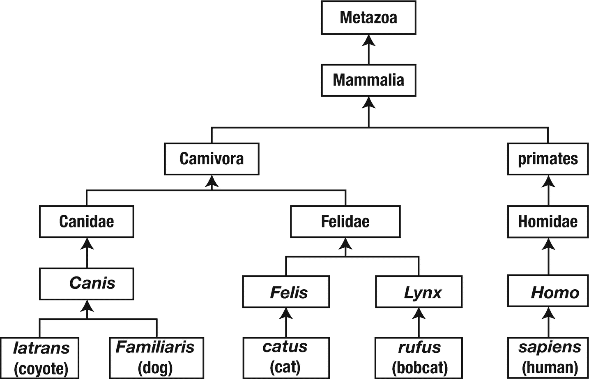
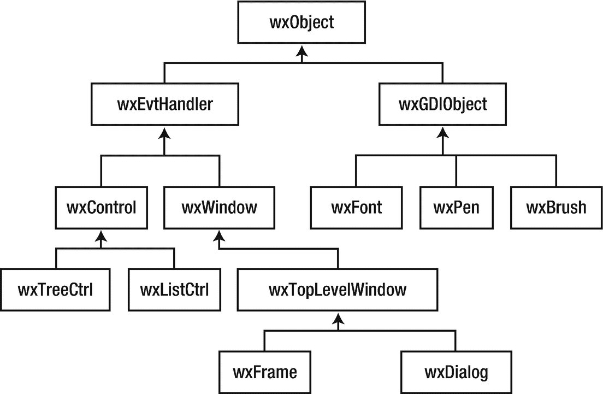

# 三十七、理解面向对象编程

这个探索从 C++ 编程中脱离出来，转向面向对象编程(OOP)的主题。你可能已经对这个话题很熟悉了，但是我劝你继续读下去。你可能会学到一些新东西。对于其他人来说，这个探索概括地介绍了 OOP 的一些基础。后面的探索将展示 C++ 如何实现 OOP 原则。

## 书籍和杂志

书和杂志的区别是什么？是的，我很想让你写下你的答案。尽可能多地写下你能想到的不同之处。

*   _____________________________________________________________

*   _____________________________________________________________

*   _____________________________________________________________

书籍和杂志有哪些相似之处？尽可能多地写下你能想到的相似之处。

*   _____________________________________________________________

*   _____________________________________________________________

*   _____________________________________________________________

如果可以的话，把你的清单和其他人写的清单进行比较。他们不一定是程序员；大家都知道什么是书和杂志。问问你的朋友和邻居；在公交车站拦住陌生人，问他们。试着找出一组核心的共性和差异。

清单上的许多项目将是合格的。例如，“大多数书至少有一个作者”，“许多杂志每月出版”，等等。没关系。在解决现实问题时，我们常常根据手头问题的具体需求，将“也许”和“有时”映射为“从不”或“总是”。请记住，这是一个 OOP 练习，而不是书店或库练习。

现在对共同点和不同点进行分类。我不是告诉你如何分类。试着找出一小组涵盖你清单上不同项目的类别。一些不太有用的分类是按字数分组，按最后一个字母分组。试着找到有用的类别。写下来。

*   _____________________________________________________________

*   _____________________________________________________________

*   _____________________________________________________________

*   _____________________________________________________________

我提出了两大类:属性和动作。*属性*描述书籍和杂志的物理特征:

*   书籍和杂志有大小(页数)和成本。

*   大多数书都有 ISBN(国际标准书号)。

*   大多数杂志都有 ISSN(国际标准序列号)。

*   杂志有卷号和期号。

书籍和杂志都有标题和出版商。书有作者。杂志通常不会。(杂志文章都有作者，但一本杂志整体很少列出一个作者。)

*行动*描述一本书或一本杂志如何行动，或者你如何与他们互动:

*   你可以看一本书或杂志。一本书或杂志可以打开或合上。

*   你可以购买一本书或杂志。

*   你可以订阅杂志。

属性和动作之间的主要区别在于属性特定于单个对象。动作由一个公共类的所有对象共享。有时，动作被称为*行为*。所有的狗都表现出气喘吁吁的行为；他们都以几乎相同的方式和相同的原因喘气。所有的狗都有颜色属性，但是一只狗是金色的，另一只狗是黑色的，在树旁边的那只狗是白色带黑色斑点的。

在编程术语中，*类*描述了该类所有对象的行为或动作以及属性类型。每个*对象*对于该类枚举的属性都有自己的值。用 C++ 的术语来说，成员函数实现动作并提供对属性的访问，数据成员存储属性。

## 分类

书和杂志本身没什么作用。相反，他们的“行动”取决于我们如何与他们互动。书店通过销售、储存和广告来与书籍和杂志互动。库的行为包括借出和接受归还。其他种类的对象有自己启动的动作。例如，**狗有哪些行为？**

*   _____________________________________________________________

*   _____________________________________________________________

*   _____________________________________________________________

*   _____________________________________________________________

*   _____________________________________________________________

**狗有哪些属性？**

*   _____________________________________________________________

*   _____________________________________________________________

*   _____________________________________________________________

*   _____________________________________________________________

*   _____________________________________________________________

一只猫怎么样？**猫和狗有明显不同的行为吗？** ____________ **属性？**_ _ _ _ _ _ _ _ _ _ _ _ _ _ _ _ _ _ _**总结不同之处。**

*   _____________________________________________________________

*   _____________________________________________________________

我不养狗或猫，所以我的观察很有限。从我坐的地方来看，狗和猫有很多相似的属性和行为。我希望许多读者比我更敏锐，能够列举出这两种动物之间的许多不同之处。

尽管如此，我坚持认为，一旦你仔细考虑这些差异，你会发现它们中的许多并不是某一种动物所特有的属性或行为，而仅仅是某一属性的不同价值或某一行为的不同细节。猫可能更挑剔，但狗和猫都表现出梳理行为。狗和猫有不同的颜色，但它们都有彩色的皮毛(很少有例外)。

换句话说，当试图枚举各种对象的属性和行为时，通过将相似的对象分类在一起，您的工作可以变得更简单。对于生物来说，生物学家已经为我们做了艰苦的工作，他们设计了丰富而详细的动物分类学。因此，一个物种(*猫*或*家猫*)属于一个属(*猫*或*犬*)，是一个科(猫科或犬科)的一部分。这些又进一步分为一个目(食肉目)，一个纲(哺乳动物)，等等，直到动物界(后生动物)。(分类学家们，请原谅我的过于简单化。)

那么，当你沿着分类树向上爬时，属性和行为会发生什么变化呢？所有哺乳动物的哪些属性和行为是相同的？

*   _____________________________________________________________

*   _____________________________________________________________

*   _____________________________________________________________

*   _____________________________________________________________

**所有动物？**

*   _____________________________________________________________

*   _____________________________________________________________

*   _____________________________________________________________

*   _____________________________________________________________

随着分类变得更广泛，属性和行为也变得更普遍。狗和猫的属性包括皮毛的颜色、尾巴的长度、体重等等。不是所有的哺乳动物都有皮毛或尾巴，所以你需要整个类有更广泛的属性。重量仍然有效，但是你可能想用尺寸来代替总长度。除了毛发的颜色，你只需要普通的颜色。对所有动物来说，属性都很宽泛:大小、重量、单细胞还是多细胞，等等。

行为都差不多。你可以列举出猫会咕噜叫，狗会喘气，这两种动物都会走和跑，等等。所有的哺乳动物都吃和喝。雌性哺乳动物哺育幼仔。对所有动物来说，你只剩下一个简短的清单:进食和繁殖。当你试图列出从变形虫到斑马的所有动物的共同行为时，很难比这更具体了。

分类树有助于生物学家了解自然界。类树(通常被称为*类层次*，因为大词让我们觉得自己很重要)帮助程序员在软件中模拟自然世界(或者模拟非自然世界，这在我们的许多项目中经常发生)。程序员更喜欢任何类层次的局部递归视图，而不是试图命名树的每一层。沿着树向上，每个类都有一个*基*类，也称为超类或父类。因此，*动物*是*哺乳动物*的基类，哺乳动物是*狗*的基类。向下是*派生的*类，也称为子类或子类。*狗*是*哺乳动物*的派生类。图 [37-1](#Fig1) 展示了一个类层次结构。箭头从派生类指向基类。

图 37-1。

类图

一个*直接*基类是没有中间基类的基类。例如， *catus* 的直接基类是 *Felis* ，它有一个 Felidae 的直接基类，后者有一个食肉动物的直接基类。后生动物、哺乳动物、食肉动物、猫科动物和*猫科动物*都是*猫科动物*的基类，但只有*猫科动物*是它的直接基类。

## 继承

正如哺乳动物具有动物的所有属性和行为，狗具有所有哺乳动物的属性和行为一样，在 OOP 语言中，派生类具有其所有基类的所有行为和属性。最常用的术语是*继承*:派生类*继承*其基类的行为和属性。这个术语有些不幸，因为 OOP 继承与真实世界的继承完全不同。当派生类继承行为时，基类保留其行为。在现实世界中，类不继承任何东西；物体会。

在现实世界中，一个人对象继承了某些属性(现金、股票、不动产等)的值。)来自一个已故的祖先对象。在 OOP 世界中，`person`类通过共享基类中定义的那些行为函数的单个副本，从基类(如`primate`)继承行为。一个`person`类继承了一个基类的属性，所以派生类的对象包含了在它的类和所有基类中定义的所有属性的值。随着时间的推移，继承术语对您来说会变得很自然。

因为继承创建了一个树状结构，所以树的术语也充斥着对继承的讨论。正如编程中常见的那样，树形图是上下颠倒绘制的，树根在上面，树叶在下面(如图 36-1 所示)。一些 OOP 语言(Java，Smalltalk，Delphi)有一个单一的根，它是所有类的最终基类。其他的，比如 C++，就没有。任何类都可以是自己继承树的根。

到目前为止，继承的主要例子涉及某种形式的专门化。*猫*比*哺乳动物*更专业，而哺乳动物比*动物*更专业。计算机编程也是如此。例如，图形用户界面(GUI)的类框架通常使用专门化类的层次结构。图 [37-2](#Fig2) 显示了组成 wxWidgets 的一些更重要的类的选择，wxWidgets 是一个支持许多平台的开源 C++ 框架。

图 37-2。

wxWidgets 类层次结构摘录

即使 C++ 不需要单个根类，但有些框架需要；wxWidgets 确实需要一个根类。大多数 wxWidgets 类都源自`wxObject`。有些对象很简单，比如`wxPen`和`wxBrush`。交互对象源自`wxEvtHandler`(“事件处理程序”的简称)。因此，类树中的每一步都引入了另一种程度的专门化。

在本书的后面，您将看到继承的其他用途，但最常见也是最重要的用途是从更通用的基类创建专门的派生类。

## 利斯科夫替代原理

当派生类专门处理基类的行为和属性时(这是常见的情况)，您编写的任何涉及基类的代码都应该与派生类的对象一起工作。换句话说，喂养哺乳动物的行为，从广义上来说，是相同的，与具体的动物种类无关。

Barbara Liskov 和 Jeannette Wing 将这一面向对象编程的基本原则形式化，这一原则现在通常被称为替代原则或 Liskov 的替代原则。简而言之，替换原则规定，如果你有基类 *B* 和派生类 *D* ，在任何需要类型 *B* 的对象的情况下，你都可以替换类型 *D* 的对象，而不会产生不良影响。换句话说，如果你需要一只哺乳动物，任何哺乳动物，有人给你一只狗，你应该可以使用那只狗。如果有人送给你一只猫、一匹马或一头牛，你可以用那种动物。然而，如果有人递给你一条鱼，你可以用任何你认为合适的方式拒绝这条鱼。

替代原则有助于你编写程序，但也带来了负担。它之所以有帮助，是因为它让您可以自由地编写依赖于基类行为的代码，而不用担心任何派生类。例如，在 GUI 框架中，基类`wxEvtHandler`可能能够识别鼠标点击并将其分派给事件处理程序。点击处理程序不知道也不关心这个控件实际上是一个`wxListCtrl`控件、一个`wxTreeCtrl`控件还是一个`wxButton`。重要的是`wxEvtHandler`接受一个点击事件，获取位置，确定哪个鼠标按钮被点击，等等，然后将这个事件发送给事件处理程序。

责任落在了`wxButton`、`wxListCtrl`和`wxTreeCtrl`类的作者身上，以确保他们的点击行为符合替换原则的要求。满足要求的最简单方法是让派生类继承基类的行为。然而，有时派生类有额外的工作要做。它不是继承，而是提供新的行为。在这种情况下，程序员必须确保该行为是基类行为的有效替代。接下来的几个探索将展示这个抽象原理的具体例子。

## 类型多态性

在回到 C++-land 之前，我想提出一个更普遍的原则。假设我给你一个标有“哺乳动物”的盒子盒子里可以是任何哺乳动物:狗、猫、人等等。你知道盒子里装不下一只鸟、一条鱼、一块石头或一棵树。里面一定有哺乳动物。程序员称这个盒子为多态的，来自希腊语，意思是“多种形式”。盒子可以容纳许多形式中的任何一种，也就是说，任何一种哺乳动物，不管它是哪种形式的哺乳动物。

虽然很多程序员使用的是通用术语*多态性*，但是这种具体的多态性是*类型多态性*，也称为*子类型多态性*。也就是说，变量(或框)的类型决定了它可以包含哪些类型的对象。多态变量(或盒子)可以包含多种对象类型中的一种。

特别是，具有基类类型的变量可以引用基类类型的对象或从该基类派生的任何类型的对象。根据替换原则，您可以编写代码来使用基类变量，调用基类的任何成员函数，并且该代码将工作，而不管对象的真实派生类型。

既然您已经对 OOP 的原理有了基本的理解，那么是时候看看它们在 C++ 中是如何发挥作用的了。