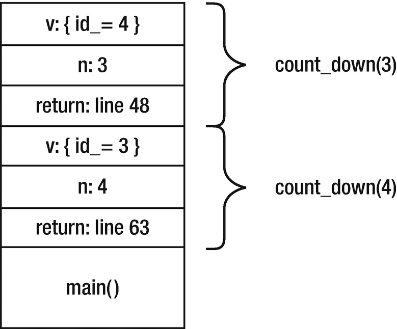
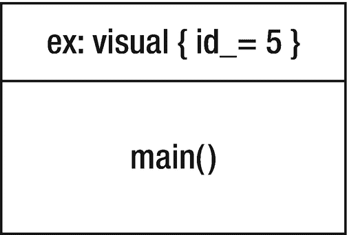

# 48.例外

到目前为止，您可能已经对探索中缺乏错误检查和错误处理感到沮丧。这种情况即将改变。像大多数现代编程语言一样，C++ 支持异常作为跳出正常控制流程的一种方式，以响应错误或其他异常情况。这种探索引入了异常:如何抛出它们，如何捕捉它们，语言和库何时使用它们，以及您应该何时以及如何使用它们。

## 引入例外

Exploration [9](09.html) 引入了`vector`的`at`成员函数，该函数检索特定索引处的向量元素。当时我写道，你所阅读的大多数程序都会用方括号来代替。现在是检查方括号和`at`函数之间的区别的好时机。首先，看两个程序。清单 [48-1](#PC1) 显示了一个使用向量的简单程序。

```cpp
import <iostream>;
import <vector>;

int main()
{
  std::vector<int> data{ 10, 20 };
  data.at(5) = 0;
  std::cout << data.at(5) << '\n';
}

Listing 48-1.Accessing an Element of a Vector

```

运行该程序时，您预计会发生什么？

_____________________________________________________________

试试看。实际上会发生什么？

_____________________________________________________________

向量索引 5 超出界限。`data`的唯一有效索引是 0 和 1，所以程序以 nastygram 结束也就不足为奇了。现在考虑清单 [48-2](#PC2) 中的程序。

```cpp
import <iostream>;
import <vector>;

int main()
{
  std::vector<int> data{ 10, 20 };
  data[5] = 0;
  std::cout << data[5] << '\n';
}

Listing 48-2.A Bad Way to Access an Element of a Vector

```

运行该程序时，您预计会发生什么？

_____________________________________________________________

试试看。实际上会发生什么？

_____________________________________________________________

向量索引 5 仍然超出界限。如果你仍然收到一个讨厌的程序，你会得到一个不同于以前的程序。另一方面，程序可能运行到完成，而没有指示任何错误。您可能会觉得这令人不安，但这就是未定义行为的情况。任何事情都有可能发生。

简而言之，这就是使用下标(`[]`)和`at`成员函数的区别。如果索引无效，`at`成员函数会导致程序以一种可预测、可控的方式终止。您可以编写额外的代码并避免终止，采取适当的措施在终止前进行清理，或者让程序结束。

另一方面，如果索引无效，下标操作符会导致未定义的行为。任何事情都可能发生，所以你无法控制——一点也不能。如果软件正在控制，比如说，一架飞机，那么“任何事情”都包含许多令人难以想象的选项。在一个典型的桌面工作站上，更可能的情况是程序崩溃，这是一件好事，因为它告诉你有什么地方出错了。最糟糕的可能后果是，没有明显的事情发生，程序默默地使用一个垃圾值并继续运行。

成员函数`at`和许多其他函数可以*抛出异常*来提示错误。当一个程序抛出一个异常时，正常的、一条条语句的程序进程被中断。相反，一个特殊的异常处理系统控制程序。该标准为这个系统的实际工作方式提供了一些余地，但是您可以想象它会强制函数结束并破坏本地对象和参数，尽管这些函数不会向调用者返回值。相反，函数被强制结束，一次一个，一个特殊的代码块*捕获*异常。使用`try` - `catch`语句在程序中设置这些特殊代码块。`catch`模块也被称为*异常处理器*。处理程序完成工作后，正常的代码执行会继续:

```cpp
try {
  throw std::runtime_error("oops");
} catch (std::runtime_error const& ex) {
  std::cerr << ex.what() << '\n';
}

```

当程序抛出一个异常时(用`throw`关键字)，它抛出一个值，称为异常对象，它可以是几乎任何类型的对象。按照惯例，异常类型，比如`std::runtime_error`，继承自`std::exception`类或者标准库提供的几个子类之一。第三方类库经常引入自己的异常基类。

异常处理程序还有一个对象声明，它有一个类型，处理程序只接受匹配类型的异常对象。如果没有一个异常处理程序有匹配的类型，或者如果你根本没有写任何处理程序，程序就会终止，就像清单 [48-1](#PC1) 中发生的那样。本文的其余部分将详细研究异常处理的各个方面。

## 捕捉异常

一个异常处理器被称为*捕捉*一个异常。在一个`try`的末尾写一个异常处理程序:`try`关键字后面是一个复合语句(必须是复合的)，后面是一系列*处理程序*。每个处理程序都以一个`catch`关键字开始，后面是圆括号，括号中包含了异常处理程序对象的声明。括号后面是一个复合语句，它是异常处理程序的主体。

当异常对象的类型与异常处理程序对象的类型匹配时，处理程序被认为是匹配的，并且处理程序对象用异常对象初始化。处理程序声明通常是一个引用，这样可以避免不必要地复制异常对象。大多数处理程序不需要修改异常对象，所以处理程序声明通常是对`const`的引用。“匹配”是当异常对象的类型与处理程序声明的类型或从处理程序声明的类型派生的类相同时，忽略处理程序是`const`还是引用。

异常处理系统在抛出异常之前销毁它在语句的`try`部分构造的所有对象，然后它将控制转移到处理程序，因此处理程序的主体正常运行，并且在整个`try` - `catch`语句结束后，也就是在语句的最后一个`catch`处理程序结束后，控制随着语句恢复。按顺序尝试处理程序类型，第一个匹配者获胜。因此，您应该总是首先列出最具体的类型，然后列出基类类型。

基类异常处理程序类型匹配任何派生类型的异常对象。为了处理标准库可能抛出的所有异常，编写处理程序来捕捉`std::exception`(在`<exception>`中声明)，这是所有标准异常的基类。清单 [48-3](#PC4) 展示了`std::string`类可以抛出的一些异常。通过键入不同长度的字符串来试用该程序。

```cpp
import <cstdlib>;
import <exception>;
import <iostream>;
import <stdexcept>;
import <string>;

int main()
{
  std::string line{};
  while (std::getline(std::cin, line))
  {
    try
    {
      line.at(10) = ' ';                       // can throw out_of_range
      if (line.size() < 20)
         line.append(line.max_size(), '*');    // can throw length_error
      for (std::string::size_type size(line.size());
           size < line.max_size();
           size = size * 2)
      {
        line.resize(size);                     // can throw bad_alloc
      }
      line.resize(line.max_size());            // can throw bad_alloc
      std::cout << "okay\n";
    }
    catch (std::out_of_range const& ex)
    {
       std::cout << ex.what() << '\n';
       std::cout << "string index (10) out of range.\n";
    }
    catch (std::length_error const& ex)
    {
      std::cout << ex.what() << '\n';
      std::cout << "maximum string length (" << line.max_size() << ") exceeded.\n";
    }
    catch (std::exception const& ex)
    {
      std::cout << "other exception: " << ex.what() << '\n';
    }
    catch (...)
    {
      std::cout << "Unknown exception type. Program terminating.\n";
      std::abort();
    }
  }
}

Listing 48-3.Forcing a string to Throw Exceptions

```

如果您键入包含 10 个或更少字符的行，`line.at(10)`表达式将抛出`std::out_of_range`异常。如果字符串多于 10 个字符，但少于 20 个字符，程序会尝试附加一个星号(`'*'`)的最大字符串长度重复，结果是`std::length_error`。如果初始字符串超过 20 个字符，程序会尝试使用不断增长的大小来增加字符串的大小。最有可能的是，大小最终会超过可用内存，在这种情况下，`resize()`函数将抛出`std::bad_alloc`。如果你有很多很多的内存，下一个错误情况会迫使字符串大小达到`string`支持的限制，然后尝试向字符串中添加另一个字符，这会导致`push_back`函数抛出`std::length_error`。(`max_size`成员函数返回一个容器(比如`std::string`)可以包含的最大元素数量。)

基类处理程序捕捉前两个处理程序错过的任何异常；特别是它抓住了`std::bad_alloc`。`what()`成员函数返回一个描述异常的字符串。字符串的确切内容因实现而异。任何重要的应用程序都应该定义自己的异常类，并对用户隐藏标准库异常。特别是，从`what()`返回的字符串是实现定义的，不一定有用。捕捉`bad_alloc`尤其棘手，因为如果系统内存不足，应用程序可能没有足够的内存在关闭前保存数据。你应该总是显式地处理`bad_alloc`，但是我想演示一个基类的处理程序。

最后一个`catch`处理程序使用省略号(`...`)代替声明。这是一个匹配任何异常的无所不包的处理程序。如果使用它，它必须是 last，因为它匹配任何类型的每个异常对象。因为处理程序不知道异常的类型，所以它没有办法访问异常对象。这个包罗万象的处理程序打印一条消息，然后调用`std::abort()`(在`<cstdlib>`中声明)，这将立即结束程序。因为`std::exception`处理程序捕获所有标准库异常，所以并不真正需要最终的全部捕获处理程序，但是我想向您展示它是如何工作的。

## 抛出异常

一个*抛出表达式*抛出异常。表达式由关键字`throw`后跟一个表达式组成，即异常对象。标准异常都接受一个`string`参数，该参数成为从`what()`成员函数返回的值。

```cpp
throw std::out_of_range("index out of range");

```

标准库为自己的异常使用的消息是实现定义的，因此您不能依赖它们来提供任何有用的信息。

你可以在任何可以使用表达式的地方抛出异常。throw 表达式的类型是`void`，这意味着它没有类型。类型`void`不允许作为任何算术、比较或其他运算符的操作数。因此，实际上，`throw`表达式通常单独用在表达式语句中。

您可以在 catch 处理程序中抛出异常，低级代码和库经常这样做。不使用`throw`关键字，而是调用`std::throw_with_nested()`，传递新的异常对象作为参数。`throw_with_nested()`函数将您的异常对象与当前抛出的异常对象结合起来，并冒泡到下一个异常处理程序。正常情况下捕捉一个嵌套异常，但是如果你发现异常是嵌套的，处理程序必须一次剥离一个，如清单 [48-4](#PC6) 所示。

```cpp
import <exception>;
import <fstream>;
import <iomanip>;
import <iostream>;
import <stdexcept>;

void print_exception(const std::exception& e, int level =  0)
{
  std::cerr << std::setw(level) << ' ' << "exception: " << e.what() << '\n';
  try {
    std::rethrow_if_nested(e);
  } catch(const std::exception& e) {
    // caught a nested exception

    print_exception(e, level+1);
  } catch(...) {}
}

int main()
{
  std::string const filename{ "nonexistent file" };
  std::ifstream file;
  file.exceptions(std::ios_base::failbit);
  try
  {
    file.open(filename);
  }
  catch (std::ios_base::failure const&)
  {
    std::throw_with_nested(std::runtime_error{"Cannot open: " + filename});
  }
  catch (...)
  {
    file.close();
    throw;
  }
}

Listing 48-4.Nested Exceptions

```

打开文件流将在后面介绍。这里只是一个例子，说明当处理程序可以向异常添加一些有用的信息时，抛出 I/O 异常的常见方式，特别是打开的文件的名称。嵌套异常的工作方式是每一层嵌套嵌入一个异常对象，而`rethrow_if_nested()`实际上将该对象作为一个新的异常抛出。因此，处理程序递归地一次一层地取消对异常洋葱的感知。

如果您只想执行一些清理并重新抛出相同的异常，请使用不带任何表达式的`throw`关键字。再次引发异常的常见情况是在一个无所不包的处理程序中。catch-all 处理程序执行一些重要的清理工作，然后传播异常，以便程序可以处理它。

## 程序堆栈

为了理解当一个程序抛出异常时会发生什么，你必须首先理解*程序栈*的性质，有时被称为*执行栈*。过程语言和类似的语言在运行时使用堆栈来跟踪函数调用、函数参数和局部变量。C++ 堆栈还有助于跟踪异常处理程序。

当程序调用一个函数时，程序将一个*帧*推到堆栈上。该帧包含指令指针和其他寄存器、函数的参数等信息，还可能包含一些函数返回值的内存。当一个函数启动时，它可能会在堆栈上为局部变量留出一些内存。每个局部作用域将一个新帧推送到堆栈上。(编译器可能能够为某些局部范围甚至整个函数优化掉一个物理框架。然而，从概念上讲，以下情况适用。)

当函数执行时，它通常会构造各种对象:函数参数、局部变量、临时对象等等。编译器跟踪函数必须创建的所有对象，这样当函数返回时，它可以正确地销毁它们。本地对象的销毁顺序与它们的创建顺序相反。

框架是动态的，也就是说，它们表示程序中的函数调用和控制流，而不是源代码的静态表示。因此，函数可以调用自己，每次调用都会在堆栈上产生一个新的框架，每个框架都有自己的所有函数参数和局部变量的副本。

当程序抛出异常时，正常的控制流停止，C++ 异常处理机制接管。异常对象被复制到一个安全的地方，离开执行堆栈。异常处理代码在堆栈中寻找一个`try`语句。当它找到一个`try`语句时，它依次检查每个处理程序的类型，寻找匹配。如果没有找到匹配，它将在堆栈中更靠后的位置寻找下一个`try`语句。它会一直寻找，直到找到匹配的处理程序，或者搜索完所有帧。

当找到匹配时，它从执行堆栈中弹出帧，在每个弹出的帧中调用所有本地对象的析构函数，并继续弹出帧，直到到达处理程序。从堆栈中弹出帧也被称为*展开*堆栈。

展开堆栈后，异常对象初始化处理程序的异常对象，然后执行`catch`体。在`catch`体正常退出后，异常对象被释放，执行继续执行最后一个兄弟`catch`块末尾后面的语句。

如果处理程序抛出异常，那么重新开始搜索匹配的处理程序。一个处理程序不能处理它抛出的异常，在同一个`try`语句中它的兄弟处理程序也不能。

如果没有处理程序匹配异常对象的类型，就调用`std::terminate`函数，中止程序。有些实现会在调用`terminate`之前弹出堆栈并释放本地对象，但有些不会。

清单 [48-5](#PC7) 可以帮助你想象当一个程序抛出和捕获一个异常时，程序内部发生了什么。

```cpp
 1 import <exception>;
 2 import <iostream>;
 3 import <string>;
 4
 5 /// Make visual the construction and destruction of objects.
 6 class visual
 7 {
 8 public:
 9   visual(std::string const& what)
10   : id_{serial_}, what_{what}
11   {
12     ++serial_;
13     print("");
14   }
15   visual(visual const& ex)
16   : id_{ex.id_}, what_{ex.what_}
17   {
18     print("copy ");
19   }
20   ~visual()
21   {
22     print("~");
23   }
24   void print(std::string const& label)
25   const
26   {
27     std::cout << label << "visual(" << what_ << ": " << id_ << ")\n";
28   }
29 private:
30   static int serial_;
31   int const id_;
32   std::string const what_;
33 };
34
35 int visual::serial_{0};
36
37 void count_down(int n)
38 {
39   std::cout << "start count_down(" << n << ")\n";
40   visual v{"count_down local"};
41   try
42   {
43     if (n == 3)
44       throw visual("exception");
45     else if (n > 0)
46       count_down(n - 1);
47   }
48   catch (visual ex)
49   {
50     ex.print("catch on line 50 ");
51     throw;
52   }
53   std::cout << "end count_down(" << n << ")\n";
54 }
55
56 int main()
57 {
58   try
59   {
60     count_down(2);
61     std::cout << "--------------------\n";
62     count_down(4);
63   }
64   catch (visual const ex)
65   {
66     ex.print("catch on line 66 ");
67   }
68   std::cout << "All done!\n";
69 }

Listing 48-5.Visualizing an Exception

```

类有助于显示对象何时以及如何被构造、复制和销毁。`count_down`函数在其参数等于 3 时抛出异常，当其参数为正时调用自身。对于非正参数，递归停止。为了帮助您查看函数调用，它会在进入和退出函数时打印参数。

对`count_down`的第一次调用不会触发异常，所以您应该看到本地`visual`对象的正常创建和销毁。**确切地写出程序应该打印的结果，如第 60 行(** `count_down(2)` **)** )。

*   _____________________________________________________________

*   _____________________________________________________________

*   _____________________________________________________________

*   _____________________________________________________________

*   _____________________________________________________________

*   _____________________________________________________________

*   _____________________________________________________________

*   _____________________________________________________________

*   _____________________________________________________________

*   _____________________________________________________________

*   _____________________________________________________________

*   _____________________________________________________________

从`main`到`count_down`的下一个调用(第 62 行)允许`count_down`在抛出异常之前递归一次。所以`count_down(4)`叫`count_down(3)`。本地对象`v`被构造在`count_down(4)`的框架内，而`v`的新实例被构造在`count_down(3)`的框架内。然后创建并抛出异常对象。(参见图 [48-1](#Fig1) 。)



图 48-1。

引发异常时的程序堆栈

异常在`count_down`内部被捕获，所以它的帧没有被弹出。然后异常对象被复制到`ex`(第 48 行)，异常处理程序开始。它打印一条消息，然后重新抛出原来的异常对象(第 51 行)。异常处理机制对待这个异常的方式与对待任何其他异常一样:弹出`try`语句的框架，然后弹出`count_down`函数的框架。本地物体被破坏(包括`ex`和`v`)。`count_down`中的最后一条语句不执行。

栈被展开，调用`count_down(4)`中的`try`语句被找到，异常对象再次被复制到`ex`的一个新实例中。(参见图 [48-2](#Fig2) 。)异常处理程序打印一条消息并重新引发原始异常。弹出`count_down(4)`帧，将控制返回到`main`中的`try`语句。同样，`count_down`中的最后一条语句不执行。



图 48-2。

再次引发异常后的程序堆栈

`main`中的异常处理程序轮到它了，这个处理程序最后一次打印异常对象(第 66 行)。在处理程序打印一条消息，并且`catch`主体到达它的结尾之后，本地异常对象和原始异常对象被销毁。然后在第 68 行继续正常执行。最终输出是

```cpp
start count_down(2)
visual(count_down local: 0)
start count_down(1)
visual(count_down local: 1)
start count_down(0)
visual(count_down local: 2)
end count_down(0)
~visual(count_down local: 2)
end count_down(1)
~visual(count_down local: 1)
end count_down(2)
~visual(count_down local: 0)
--------------------
start count_down(4)
visual(count_down local: 3)
start count_down(3)
visual(count_down local: 4)
visual(exception: 5)
copy visual(exception: 5)
catch on line 50 visual(exception: 5)
~visual(exception: 5)
~visual(count_down local: 4)
copy visual(exception: 5)
catch on line 50 visual(exception: 5)
~visual(exception: 5)
~visual(count_down local: 3)
copy visual(exception: 5)
catch on line 66 visual(exception: 5)
~visual(exception: 5)
~visual(exception: 5)
All done!

```

## 标准例外

标准库定义了几种标准的异常类型。基类`exception`在`<exception>`头中声明。大多数其他异常类都在`<stdexcept>`头中定义。如果您想定义自己的异常类，我建议从`<stdexcept>`中的一个标准异常中派生出来。

标准异常分为两类(两个基类直接从`exception`派生而来):

*   运行时错误(`std::runtime_error`)是您不能仅仅通过检查源代码来检测或防止的异常。它们产生于你可以预见，但无法预防的情况。

*   逻辑错误(`std::logic_error`)是程序员错误的结果。它们表示违反了前提条件、无效的函数参数以及程序员应该在代码中防止的其他错误。

`<stdexcept>`中的其他标准异常类都源自这两个。大多数标准库异常都是逻辑错误。例如，`out_of_range`继承自`logic_error`。当索引超出范围时，`at`成员函数和其他函数抛出`out_of_range`。毕竟，您应该检查索引和大小，以确保向量和字符串的使用是正确的，并且不依赖于异常。当你犯了一个错误(我们都犯了错误)时，例外是为了让你的程序干净有序地关闭。

你的库引用告诉你哪些函数抛出哪些异常，比如`at`可以抛出`out_of_range`。许多函数也可能抛出其他未记录的异常，这取决于库和编译器的实现。然而，一般来说，标准库很少使用例外。相反，当您提供错误的输入时，大多数库会产生未定义的行为。I/O 流通常不抛出任何异常，但是您可以安排它们在发生严重错误时抛出异常，这将在下一节中解释。

## I/O 异常

您在 Exploration [32](32.html) 中学习了 I/O 流状态位。状态位很重要，但是反复检查它们很麻烦。特别是，许多程序无法检查输出流的状态位，尤其是在写入标准输出时。那只是普通的、老式的懒惰。幸运的是，C++ 为程序员提供了一条无需太多额外工作就能获得 I/O 安全性的途径:当 I/O 失败时，流可以抛出异常。

除了状态位，每个流还有一个*异常掩码*。异常掩码告诉流在相应的状态位改变值时抛出异常。例如，您可以在异常掩码中设置`badbit`,并且永远不要为这种不太可能发生的情况编写显式检查。如果发生严重的 I/O 错误，导致`badbit`被置位，那么流将抛出一个异常。你可以编写一个高级处理程序来捕捉异常并干净地终止程序，如清单 [48-6](#PC9) 所示。

```cpp
import <iostream>;

int main()
{
  std::cin.exceptions(std::ios_base::badbit);
  std::cout.exceptions(std::ios_base::badbit);

  int x{};
  try
  {
    while (std::cin >> x)
      std::cout << x << '\n';
    if (not std::cin.eof()) // failure without eof means invalid input
      std::cerr << "Invalid integer input. Program terminated.\n";
  }
  catch(std::ios_base::failure const& ex)
  {
    std::cerr << "Major I/O failure! Program terminated.\n" <<
                 ex.what() << '\n';
    std::terminate();
  }
}

Listing 48-6.Using an I/O Stream Exception Mask

```

如您所见，异常类被命名为`std::ios_base::failure`。还要注意一个新的输出流:`std::cerr`。`<iostream>`头实际上声明了几个标准的 I/O 流。到目前为止，我只用过`cin`和`cout`，因为这是我们所需要的。`cerr`流是专用于错误输出的输出流。在这种情况下，将正常输出(到`cout`)与错误输出(到`cerr`)分开是很重要的，因为`cout`可能会出现致命错误(比如磁盘已满)，所以任何向`cout`写入错误消息的尝试都是徒劳的。相反，程序将消息写入`cerr`。不能保证写`cerr`会成功，但至少有机会；例如，用户可能将标准输出重定向到一个文件(因此有遇到磁盘满错误的风险)，同时允许错误输出出现在控制台上。

回想一下，当输入流到达输入的末尾时，它会在其状态掩码中设置`eofbit`。虽然您也可以在异常掩码中设置这个位，但是我看不出您有什么理由要这样做。如果一个输入操作没有从流中读取任何有用的东西，流就会设置`failbit`。流可能不读取任何内容的最常见原因是文件尾(`eofbit`被设置)或输入格式错误(例如，当程序试图读取一个数字时，输入流中的文本)。同样，可以在异常掩码中设置`failbit`，但是大多数程序依赖普通的程序逻辑来测试输入流的状态。异常是针对异常情况的，当从流中读取时，文件结束是正常现象。

当`failbit`被设置时，循环结束，但是您必须进一步测试以发现`failbit`是否被设置，这是因为正常的文件结束条件还是因为格式错误的输入。如果`eofbit`也被设置，你就知道这个流已经结束了。否则，`failbit`一定是由于输入格式错误。

如您所见，异常并不能解决所有的错误情况。因此，`badbit`是异常掩码中唯一对大多数程序有意义的位，尤其是对输入流。如果输出流无法将整个值写入流中，它将设置`failbit`。通常，这种故障是因为设置了`badbit`的 I/O 错误而发生的，但是至少理论上有可能输出故障设置了`failbit`而没有设置`badbit`。在大多数情况下，任何输出失败都是警报的原因，所以您可能希望对输出流的`failbit`和输入流的`badbit`抛出一个异常。

```cpp
std::cin.exceptions(std::ios_base::badbit);
std::cout.exceptions(std::ios_base::failbit);

```

## 自定义例外

异常通过从主控制流中移除异常条件来简化编码。对于许多错误情况，您可以也应该使用异常。例如，`rational`级(最近出现在探索 [41](41.html) 中)到目前为止完全避免了被零除的问题。比调用未定义的行为(被零除时会发生这种情况)更好的解决方案是在分母为零时抛出异常。通过从一个标准异常基类派生来定义自己的异常类，如清单 [48-7](#PC11) 所示。通过定义自己的异常类，`rational`的任何用户都可以很容易地将其异常与其他异常区分开来。

```cpp
export module rational;
import <stdexcept>;
import <string>;

export class rational
{
public:
  class zero_denominator : public std::logic_error
  {
  public:
    using std::logic_error::logic_error;
  };

  rational() : rational{0} {}
  rational(int num) : numerator_{num}, denominator_{1} {}
  rational(int num, int den) : numerator_{num}, denominator_{den}
  {
    if (denominator_ == 0)
      throw zero_denominator{"zero denominator"};
    reduce();
  }
... omitted for brevity ...
};

Listing 48-7.Throwing an Exception for a Zero Denominator

```

注意`zero_denominator`类是如何嵌套在`rational`类中的。嵌套类是一个非常普通的类。除了名称之外，它与外部类没有任何关系(与 Java 内部类一样)。嵌套类不能对外部类中的私有成员进行特殊访问，外部类也不能对嵌套类名进行特殊访问。访问级别的常规规则决定了嵌套类的可访问性。一些嵌套类是私有帮助类，所以你可以在外部类定义的私有部分声明它们。在这种情况下，`zero_denominator`必须是公共的，这样调用者就可以在异常处理程序中使用这个类。

要在外部类之外使用嵌套类名，必须使用外部类和嵌套类名，用范围运算符(`::`)分隔。嵌套类名在外部类的范围之外没有意义。因此，嵌套类有助于避免名称冲突。它们还为在异常处理程序中看到该类型的读者提供了清晰的文档:

```cpp
catch (rational::zero_denominator const& ex) {
  std::cerr << "zero denominator in rational number\n";
}

```

**找到 rational 类中所有其他需要检查零分母的地方，并添加适当的错误检查代码来抛出零分母**。

所有的路都通向`reduce()`，所以一种方法是检查一个零分母，并在那里抛出异常。你不必修改任何其他函数，甚至在构造器中的额外检查(如清单 [48-6](#PC9) 所示)也是不必要的。清单 [48-8](#PC13) 显示了`reduce()`的最新实现。

```cpp
void rational::reduce()
{
  if (denominator_ == 0)
    throw zero_denominator{"denominator is zero"};
  if (denominator_ < 0)
  {
    denominator_ = -denominator_;
    numerator_ = -numerator_;
  }
  int div{std::gcd(numerator_, denominator_)};
  numerator_ = numerator_ / div;
  denominator_ = denominator_ / div;
}

Listing 48-8.Checking for a Zero Denominator in reduce()

```

## 当函数不抛出异常时

某些函数不应该抛出异常。例如，`numerator()`和`denominator()`函数只是返回一个整数。他们不可能抛出异常。如果编译器知道函数从不抛出异常，它可以生成更有效的目标代码。有了这些特定的函数，编译器可能会内联扩展这些函数来直接访问数据成员，所以理论上，这并不重要。但是也许你决定不内联这些函数(出于探索 [31](31.html) 中列出的任何原因)。您仍然希望能够告诉编译器，函数不能抛出任何异常。进入`noexcept`资格赛。

为了告诉编译器一个函数不抛出异常，在函数参数之后添加`noexcept`限定符(在`const`之后，`override`之前)。

```cpp
int numerator() const noexcept;

```

如果你中断联系会怎么样？**试试吧。**写一个程序，调用一个被限定为 noexcept 的普通函数，但是抛出一个异常。尝试捕获`main()`中的异常。**会发生什么？**

_____________________________________________________________

如果你的程序看起来像我清单 [48-9](#PC15) 中的程序，那么`catch`应该会捕捉到异常，但是它没有。编译器信任`noexcept`，没有生成正常的异常处理代码。因此，当`function()`抛出异常时，程序唯一能做的就是立即终止。

```cpp
import <iostream>;
import <exception>;

void function() noexcept
{
  throw std::exception{};
}

int main()
{
  try {
    function();
  } catch (std::exception const& ex) {
    std::cout << "Gotcha!\n";
  }
}

Listing 48-9.Throwing an Exception from a noexcept Function

```

明智地使用`noexcept`。如果函数`a()`只调用被标记为`noexcept`的函数，那么`a()`的作者可能也会决定使用`a() noexcept`。但是如果其中一个函数，比如说`b()`，改变了，不再是`noexcept`，那么`a()`就有麻烦了。如果`b()`抛出一个异常，程序会毫不客气地终止。所以只有在你能保证函数现在不会抛出异常，将来也永远不会改变来抛出异常的情况下，才使用`noexcept`。所以`numerator()`和`denominator()`在`rational`类中是`noexcept`大概是安全的，默认和单参数构造器也是，但是我想不出还有什么成员函数可以是`noexcept`。

## 系统错误

探索 [14](14.html) 引入了`<system_error>`头来显示程序无法打开文件时的错误信息。`<system_error>`的目的是提供一种可移植的方法来管理错误代码、条件和消息。它很好地支持 POSIX 标准错误代码，但是将实现留给了其他操作系统。因此，请阅读您的文档以了解您的操作系统的支持。

一个`std::error_category`定义了你的系统支持的错误代码和消息。标准库定义了两种全局错误类别:一般错误和系统错误。对于 POSIX 错误，`std::generic_category()`函数返回一个`error_category`对象，对于实现定义的错误，`std::system_category()`返回一个`error_category`。

一个`std::error_code`将一个低级错误代码表示为一个与特定`error_category`相关的整数。从`errno`(无`std::`前缀)中获取整数错误号，在 C 头文件`<cerrno>`中声明。您可以如下构建一个`error_code`对象:

```cpp
auto ec{ std::error_code(errno, std::system_category()) };

```

但是如果您只需要相关的文本消息，错误类别会使用`message()`成员函数直接返回它:

```cpp
std::cerr << std::system_category().message(errno) << '\n';

```

要抛出一个使用错误代码的异常，抛出`system_error`异常。你可以传递一个`error_code`对象或者传递一个`errno`和一个`error_category`作为参数给`system_error`构造器。您还可以传递一个可选字符串，如文件名。清单 [48-10](#PC18) 显示了一个愚蠢的程序试图打开一个不存在的文件，并在打开失败时抛出一个异常。

```cpp
#include <cerrno>
import <fstream>;
import <iostream>;
import <string>;
import <system_error>;

std::size_t count_words(std::string const& filename)
{
  std::ifstream file(filename);
  if (not file)
    throw std::system_error(errno, std::system_category(), filename);
  std::size_t count{0};
  std::string word;
  while (file >> word)
    ++count;
  return count;
}

int main()

{
  try
  {
    std::cout << count_words("Not a Real File Name") << '\n';
  }
  catch (std::exception const& ex)
  {
    std::cerr << ex.what() << '\n';
  }
}

Listing 48-10.Throwing system_error for a File-Open Error

```

## 非凡的建议

异常的基本机制很容易掌握，但是它们的正确使用却比较困难。应用程序程序员有三个不同的任务:捕捉异常、抛出异常和避免异常。

您应该编写程序来捕捉所有异常，甚至是意外的异常。一种方法是让你的`main`程序在整个程序体中有一个主`try`语句。在程序中，您可以使用有针对性的`try`语句来捕捉特定的异常。离异常源越近，拥有的上下文信息就越多，就越能改善问题，或者至少为用户提供更多有用的信息。

这个最外层的`try`语句捕捉其他语句遗漏的任何异常。这是在程序突然终止之前给出一个连贯且有用的错误信息的最后尝试。至少，告诉用户程序由于意外的异常而终止。

在事件驱动的程序中，比如 GUI 应用程序，异常更成问题。最外层的`try`语句关闭程序，关闭所有窗口。大多数事件处理程序应该有自己的`try`语句来处理特定菜单选择、击键事件等的异常。

在程序体中，避免异常比捕捉异常更好。使用`at`成员函数来访问 vector 的元素，但是您应该编写代码，以便确信索引总是有效的。索引和长度异常是程序员出错的迹象。

编写低级代码时，对于大多数不应该发生的错误情况或者反映程序员错误的错误情况，抛出异常。有些错误情况特别危险。例如，在`rational`类中，在`reduce()`返回后，分母不应该为零或负数。如果当分母确实为零或负数时出现一个条件，则程序的内部状态是损坏的。如果程序试图正常关闭，保存所有文件，等等，它可能会在文件中写入错误的数据。最好立即终止并依靠最新的备份副本，这是您的程序在其状态已知良好时制作的。对于这种紧急情况，使用断言，而不是异常。

理想情况下，您的代码应该验证用户输入，检查向量索引，并确保在调用函数之前所有函数的所有参数都是有效的。如果有任何东西是无效的，你的程序可以用一个清晰、直接的信息告诉用户，并完全避免异常。当您的检查失败或您忘记检查某些条件时，异常是一个安全网。

一般来说，库应该抛出异常，而不是捕捉它们。应用程序更倾向于捕捉异常而不是抛出异常。随着程序变得越来越复杂，我将强调需要异常、抛出或捕捉的情况。

既然您已经知道了如何编写类、重载操作符和处理错误，那么在开始实现自己的全功能类之前，您只需要学习一些额外的操作符。下一篇文章回顾了一些熟悉的操作符，并介绍了一些新的操作符。