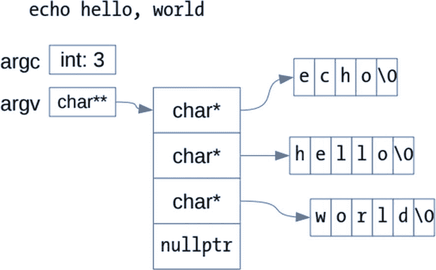

# 65.智能指针

关于指针，我忽略了一个挑战，那就是使用指针的内在危险。保存所有工件对象的映射必须比程序中所有工件指针的使用寿命都长。到目前为止，这还不是一个问题，但是随着程序规模和复杂性的增长，所涉及的簿记可能会模糊指针的使用方式。因此，让我们探索对程序的一个微小的改变，以确保无论程序如何发展，所有的指针都可以安全使用。这个探索更深入地研究了指针、它们的问题以及如何避免它们。

## 指针和迭代器

也许你已经注意到迭代器语法和指针语法之间的相似性。C++ 委员会故意设计迭代器来模仿指针。事实上，指针满足了连续迭代器的所有要求，因此您可以使用 C 风格数组的所有标准算法，如下所示:

```cpp
int data[4];
std::ranges::fill(data, 42);

```

因此，迭代器是智能指针的一种形式。迭代器尤其聪明，因为它们有六种不同的风格(参见 Exploration [44](44.html) 以获得提示)。连续迭代器就像指针一样；其他类型的迭代器功能较少，所以它们很聪明。

迭代器和指针一样危险。在它们的纯形式中，迭代器几乎和指针一样未经检查、混乱和原始。毕竟，迭代器不会阻止你前进得太远，不会阻止你去引用一个未初始化的迭代器，不会阻止你比较指向不同容器的迭代器，等等。迭代器的不安全做法非常多。

因为这些错误会导致未定义的行为，所以库实现者可以自由地为每种错误选择任何结果。出于对性能的考虑，大多数库并没有实现额外的安全检查，而是将这一任务推给了程序员，程序员可以根据自己的喜好来决定安全/性能的取舍。

如果程序员更喜欢安全而不是性能，一些库实现提供了一个调试版本，它实现了许多安全检查。标准库的调试版本可以在比较迭代器时检查迭代器是否引用了同一个容器，如果没有，就抛出异常。允许迭代器在使用解引用(`*`)操作符之前检查它是否有效。迭代器可以确保它不会超过容器的末尾。

因此，迭代器是智能指针，因为它们非常非常智能。我强烈建议您充分利用标准库提供的所有安全特性。只有在您测量了程序的性能并发现某个特定的检查会显著降低性能，并且您已经准备好了评审和测试以使您对不太安全的代码有信心之后，才能逐个删除检查。

## 关于`unique_ptr`的更多信息

Exploration [64](64.html) 引入了`unique_ptr`作为管理动态分配对象的一种方式。`unique_ptr`类模板重载了解除引用(`*`)和成员访问(`->`)操作符，并允许您像使用指针一样使用`unique_ptr`对象。同时，它扩展了普通指针的行为，这样当`unique_ptr`对象被销毁时，它会自动删除它持有的指针。这就是为什么`unique_ptr`被称为*智能指针—* 它就像一个普通的指针，只是更智能。使用`unique_ptr`有助于确保内存得到适当的管理，即使面对意外的异常。

正确使用时，`unique_ptr`的关键特性是恰好一个`unique_ptr`对象拥有一个特定的指针。你可以移动`unique_ptr`物体。每次这样做时，移动的目标都成为指针的新所有者。

调用`reset`成员函数将`unique_ptr`设置为空指针。

```cpp
auto ap{std::make_unique<int>(42)};
ap.reset();            // deletes the pointer to 42

```

`get()`成员函数在不影响`unique_ptr`所有权的情况下检索原始指针。`unique_ptr`模板还重载了解引用(`*`)和成员(`->`)操作符，这样它们就可以像处理普通指针一样工作。这些函数不影响指针的所有权。

```cpp
auto rp{std::make_unique<rational>(420, 10)};
int n{rp->numerator()};
rational r{*rp};
sendto(socket, rp.get(), sizeof(r), n, nullptr, 0);

```

为了加强它的所有权语义，`unique_ptr`有一个移动构造器和移动赋值操作符，但是删除了它的复制构造器和复制赋值操作符。如果对类中的数据成员使用`unique_ptr`，编译器会隐式删除该类的复制构造器和复制赋值操作符。

因此，使用`unique_ptr`可以让你不用考虑类的析构函数，但是你不能免除考虑构造器和赋值操作符。这是对指导方针的一个小调整，如果你必须处理一个，你必须处理所有的特殊成员。编译器的默认行为通常是正确的，但是您可能希望实现一个复制构造器来执行深度复制或其他非默认行为。

## 可复制的智能指针

有时候，你不想独占所有权。有些情况下，多个对象会共享一个指针的所有权。当没有对象拥有指针时，内存被自动回收。智能指针类型实现了共享所有权。

一旦你向一个`shared_ptr`传递了一个指针，`shared_ptr`对象就拥有了这个指针。当`shared_ptr`对象被销毁时，它会删除指针。`shared_ptr`和`unique_ptr`的区别在于，你可以自由的复制和赋值`shared_ptr`对象，并带有正常的语义。与`unique_ptr`不同，`shared_ptr`有复制构造器和复制赋值操作符。`shared_ptr`对象保存一个引用计数，所以赋值只是增加引用计数，而不必转移所有权。当一个`shared_ptr`对象被销毁时，它会减少引用计数。当计数达到零时，指针被删除。因此，您可以随意复制任意多的副本，将`shared_ptr`对象存储在一个容器中，将它们传递给函数，从函数中返回它们，复制它们，移动它们，分配它们，然后随心所欲地继续。就这么简单。清单 [65-1](#PC4) 显示了复制`shared_ptr`的方式与`unique_ptr`不兼容。

```cpp
import <iostream>;
import <memory>;
import <vector>;

class see_me
{
public:
  see_me(int x) : x_{x} { std::cout <<  "see_me(" << x_ << ")\n"; }
  ~see_me()             { std::cout << "~see_me(" << x_ << ")\n"; }
  int value() const     { return x_; }
private:
  int x_;
};

std::shared_ptr<see_me> does_this_work(std::shared_ptr<see_me> x)
{
  std::shared_ptr<see_me> y{x};
  return y;
}

int main()
{
  std::shared_ptr<see_me> a{}, b{};
  a = std::make_shared<see_me>(42);
  b = does_this_work(a);
  std::vector<std::shared_ptr<see_me>> v{};
  v.push_back(a);
  v.push_back(b);
}

Listing 65-1.Working with shared_ptr

```

创建`shared_ptr`的最佳方式是调用`make_shared`。模板参数是您想要创建的类型，函数参数直接传递给构造器。由于实现细节的原因，以任何其他方式构造一个新的`shared_ptr`实例在空间和时间上都稍显低效。

使用`shared_ptr`，你可以重新实现清单 [63-8](63.html#PC8) 中的程序。旧程序使用`artifact`图来管理所有工件的生命周期。虽然很方便，但是没有理由将工件绑定到这个映射上，因为映射只用于解析。在真正的程序中，它的大部分工作在于实际构建目标，而不是解析输入。当程序构建目标时，所有的解析对象都应该被释放并早已消失。

**重写清单** [**63-8**](63.html#PC8) **的工件查找部分，动态分配工件对象，通篇使用** `shared_ptr` **来引用工件指针**。参见清单 [65-2](#PC5) 了解我的解决方案。

```cpp
std::unordered_map<std::string, std::shared_ptr<artifact>> artifacts;

std::shared_ptr<artifact>
lookup_artifact(std::string const& name)
{
  std::shared_ptr<artifact> a{artifacts[name]};
  if (a.get() == nullptr)
  {
    a = std::make_shared<artifact>(name);
    artifacts[name] = a;
  }
  return a;
}

Listing 65-2.Using Smart Pointers to Manage Artifacts

```

我将 map 改为`unordered_map`,因为每个工件对象的地址永远不变不再重要。存储智能指针减轻了我们的这种限制。稍微小心一点，您可以使用`unique_ptr`而不是`shared_ptr`，但是这将导致代码的其余部分发生更大的变化。由于维护引用计数的开销，你应该更喜欢`unique_ptr`而不是`shared_ptr`。但如果你要求共享所有权，`shared_ptr`是你的选择。在所有情况下，都没有理由使用原始指针而不是智能指针。

## 智能阵列

分配单个对象与分配对象数组完全不同。因此，智能指针还必须区分指向单个对象的智能指针和指向对象数组的智能指针。当智能指针持有指向数组的指针时(即模板参数是数组类型，如`unique_ptr<int[]>`)，它支持下标操作符，而不是`*`和`->`。

## 丘疹

不，那不是拼写错误。尽管程序员多年来一直在谈论他们程序中的粉刺和缺陷，通常指的是难看但不可避免的代码片段，Herb Sutter 将短语*指向实现的指针*与这些粉刺联系起来，提出了 *pimpl* 习语。

简而言之，pimpl 是一个在实现类中隐藏实现细节的类，公共接口对象只保存指向该实现对象的指针。您可以公开一个更易于使用的类，而不是强制您的类的用户分配和取消分配对象、管理指针以及跟踪对象生存期。具体来说，用户可以按照`int`和其他内置类型的方式，将类的实例视为值。

pimpl 包装器管理 pimpl 对象的生命周期。它通常实现特殊的成员函数:复制和移动构造器、复制和移动赋值操作符以及析构函数。它将大多数其他成员函数委托给 pimpl 对象。包装器的用户从来不需要关心这些。

因此，我们将重写`artifact`类，以便它包装一个 pimpl——即一个指向`artifact_impl`类的指针。`artifact_impl`类将完成真正的工作，而`artifact`将仅仅通过它的 pimpl 转发所有的函数。模块接口只有一个`artifact_impl`的前向声明。声明没有给编译器提供更多关于这个类的信息，所以这个类的类型是不完整的。对于如何处理不完整类型，您面临着许多限制。特别是，您不能定义该类型的任何对象或数据成员，也不能使用不完整的类作为函数参数或返回类型。不能引用不完整类的任何成员。但是在定义对象、数据成员、函数参数和返回类型时，可以使用指向该类型的指针或引用。特别是，你可以在`artifact`类中使用一个指向`artifact_impl`的指针。

普通的类定义是一个*完整的*类型定义。您可以将前向声明与相同类名的类定义混合使用。常见的模式是模块接口声明一个前向声明，实现模块填充完整的类定义。

因此，`artifact`类的定义可以有一个数据成员，它是指向`artifact_impl`的智能指针，即使编译器只知道`artifact_impl`是一个类，但不知道它的任何细节。接口模块只包含转发声明。实现细节隐藏在实现模块的单独文件中，程序的其余部分可以使用与`artifact_impl`完全隔离的`artifact`类。在大型项目中，这种障碍非常重要。

写`artifact`接口模块并不难。以`artifact_impl`的前向声明开始。在`artifact`类中，成员函数的声明与原始类中的相同。将数据成员改为指向`artifact_impl`的单个指针。阅读清单 [65-3](#PC6) 来看看这个模块的一个可能的实现。

```cpp
export module artifact;
import <filesystem>;
import <memory>;
import <string>;

class artifact_impl;

export class artifact
{
public:
  using file_time_type = std::filesystem::file_time_type;
  artifact();
  artifact(std::string name);
  artifact(artifact const&) = default;
  artifact(artifact&&) = default;
  artifact& operator=(artifact const&) = default;
  artifact& operator=(artifact&&) = default;
  ~artifact() = default;

  std::string const& name() const;
  file_time_type mod_time() const;
  std::string expand(std::string const& str) const;

  void build() const;
  file_time_type get_mod_time() const;

  void define(std::string const& name, std::string const& value);

private:
  std::shared_ptr<artifact_impl> pimpl_;
};

export bool operator==(artifact const& lhs, artifact const& rhs) {
    return lhs.name() == rhs.name();
}

namespace std {
  template<>
  export struct hash<artifact> : std::hash<std::string> {
    using super = std::hash<std::string>;
    std::size_t operator()(artifact const& a) const {
      return super::operator()(a.name());
    }
  };
}

Listing 65-3.Defining an artifact Pimpl Wrapper Class

```

该模块定义的`artifact`类只有一个`artifact_impl`的前向声明和`pimpl_`数据成员。因为依赖图将不再存储指针，而是存储`artifact`对象，编译器需要知道如何散列`artifact`对象，以及如何比较它们是否相等，以便将它们存储在无序容器中。这两个函数仅仅是委托工件的名称。

下一步是编写实现模块。这里编译器需要`artifact_impl`类的完整定义，从而使`artifact_impl`成为一个*完整的类*。`artifact`类本身做不了多少事情。相反，它只是将每个动作委托给`artifact_impl`类。详见清单 [65-4](#PC7) 。

```cpp
module artifact;

import <filesystem>;
import <memory>;
import <string>;
import <system_error>;

import variables;

class artifact_impl
{
public:
  using file_time_type = std::filesystem::file_time_type;
  artifact_impl() : name_{}, mod_time_{file_time_type::min()}, vars_{} {}
  artifact_impl(std::string name)
  : name_{std::move(name)}, mod_time_{get_mod_time()}, vars_{}
  {}

  std::string const& name() const { return name_; }
  file_time_type mod_time() const { return mod_time_; }

  file_time_type get_mod_time()
  const
  {
    std::error_code ec;
    auto time{ std::filesystem::last_write_time(name(), ec) };
    if (ec)
        return file_time_type::min();
    else
        return time;
  }

  void define(std::string const& name, std::string const& value)
  {
     if (not vars_)
        vars_ = std::make_unique<variables>();
     vars_->define(name, value);
  }

  std::string expand(std::string const& input)
  const
  {
     if (vars_)
        return vars_->expand(input);
     else
        return global_variables.expand(input);
  }

private:
  std::string name_;
  file_time_type mod_time_;
  std::unique_ptr<variables> vars_;
};

artifact::artifact() : pimpl_{std::make_shared<artifact_impl>()} {}

artifact::artifact(std::string name)
: pimpl_(std::make_shared<artifact_impl>(std::move(name)))
{}

std::string const& artifact::name()
const
{
   return pimpl_->name();
}

artifact::file_time_type artifact::mod_time()
const
{
   return pimpl_->mod_time();
}

std::string artifact::expand(std::string const& str)
const
{
   return pimpl_->expand(str);
}

artifact::file_time_type artifact::get_mod_time()
const
{
   return pimpl_->get_mod_time();
}

void artifact::define(std::string const& name, std::string const& value)
{
    pimpl_->define(name, value);
}

Listing 65-4.Implementing the artifact Module

```

`artifact_impl`级不足为奇。该实现就像清单 [64-5](64.html#PC5) 中的旧`artifact`实现一样。

现在是修改`depgraph`模块的时候了。这一次，`artifacts`映射直接存储`artifact`物体。为新的工件类修改清单 [63-2](63.html#PC2) 。参见清单 [65-5](#PC8) 中重写程序的一种方法。

```cpp
export module depgraph;

import <iterator>;
import <map>;
import <string>;
import <unordered_map>;
import <unordered_set>;

import artifact;
import topsort;

export class dependency_graph
{
public:
  using graph_type = std::unordered_map<artifact,
                         std::unordered_set<artifact>>;

  void store_dependency(std::string const& target_name,
      std::string const& dependency_name)
  {
    auto target{ lookup_artifact(target_name) };
    auto dependency{ lookup_artifact(dependency_name) };
    store_dependency(target, dependency);
  }

  graph_type const& graph() const { return graph_; }

  template<class OutIter>
  requires std::output_iterator<OutIter, artifact>
  void sort(OutIter sorted)
  const
  {
    topological_sort(graph_, sorted);
  }

  artifact lookup_artifact(std::string const& name)
  {
    auto a{ artifacts_.find(name) };
    if (a != artifacts_.end())
      return a->second;
    else
    {
      auto [iterator, inserted]{ artifacts_.emplace(name, name) };
      return iterator->second;
    }
  }

private:
  void store_dependency(artifact target, artifact dependency)
  {
    graph_[dependency].insert(target);
    graph_[target]; // ensures that target is in the graph
  }

  graph_type graph_;
  std::map<std::string, artifact> artifacts_;
};

Listing 65-5.Rewriting the depgraph Module

```

如您所见，使用`artifact`对象的代码更简单、更易读。管理指针的复杂性被推到了`artifact`和`artifact_impl`类中。通过这种方式，复杂性保持在一个地方，而不是分散在整个应用程序中。因为使用`artifact`的代码现在更简单了，所以包含错误的可能性更小了。因为复杂性是本地化的，所以更容易彻底地审查和测试。代价是多一点开发时间，写两个类而不是一个，和多一点维护工作，因为任何时候在`artifact`公共接口中需要一个新函数，那个函数也必须被添加到`artifact_impl`。在很多很多情况下，收益远远大于成本，这就是这个成语如此流行的原因。

新的`artifact`类易于使用，因为您可以像使用`int`一样使用它。也就是说，您可以复制它、分配它、将它存储在一个容器中，等等，而不用担心一个`artifact`对象的大小或复制它的成本。不要把一个`artifact`当作一个又大又胖的对象，或者一个危险的指针，你可以把它当作一个值。用*值语义*定义一个类使得它易于使用。尽管实现起来需要更多的工作，但是值`artifact`是编写应用程序时最容易使用的实例。

新设计的一个优点是依赖图和构建系统的独立性。(当然，我们还没有编写一个构建系统，但是这可能是任何真正的类似于`make`的程序的主要部分。)清单 [65-6](#PC9) 显示了主程序的一个小变化，展示了这种可分性。

```cpp
import <iostream>;
import <iterator>;
import <ranges>;
import <stdexcept>;
import <vector>;

import artifact;
import depgraph;
import parser;

std::vector<artifact> get_dependency_order()
{
   dependency_graph graph{};
   parse(std::cin, graph);
   std::vector<artifact> sorted;
   graph.sort(std::back_inserter(sorted));
   return sorted;
}

int main()
{
  try {
    std::vector<artifact> build_list{ get_dependency_order() };

    // Print in build order, which is reverse of dependency order.
    for (auto artifact : build_list | std::ranges::views::reverse)
    {
      std::cout << artifact.name() << '\n';
    }
  } catch (std::runtime_error const& ex) {
    std::cerr << ex.what() << '\n';
    return EXIT_FAILURE;
  }
}

Listing 65-6.New Program Using the parser Module

```

几个音符。从一个函数中返回一个完整的向量看起来开销很大，但实际上向量被移动到调用者那里，而不是被复制。所以这是从函数中返回字符串列表的合理方式。但更重要的是，依赖图现在是`get_dependency_order()`函数中的一个临时变量。以前，它必须在程序的整个生命周期中运行，因为所有的工件指针都指向存储在图中的映射。现在，由于共享指针和 pimpls，程序的独立部分确实是独立的。

## 哑数组

有一个地方，智能指针和 C++ 的所有强大功能都无法帮助我们。函数拖了我们的后腿，把我们束缚在旧的 C 方式上。最简单的形式，没有争论，我们很好。但是对于一个要学习操作系统或命令 shell 传递给程序的命令行参数的程序来说，`main()`还有另一个签名。清单 [65-7](#PC10) 展示了一个简单的类似 echo 的程序，演示了程序如何访问命令行参数。

```cpp
#include <cstring>
import <iostream>;

int main(int argc, char **argv)
{
    if (argc > 1) {
        if (std::strcmp(argv[1], "--help") == 0)
            std::cout << "usage: " << argv[0] << " [ARGS...]";
        else {
            std::cout << argv[1];
            for (int argn{2}; argn < argc; ++argn)
                std::cout << ' ' << argv[argn];
        }
    }
    std::cout << '\n';
}

Listing 65-7.Demonstrating Command-Line Arguments

```

与任何函数一样，函数参数的名称由您决定。名称 argc 和 argv 仅仅是约定俗成的。正如您所看到和猜测的，第一个函数参数(`argc`)是命令行参数的数量，第一个是程序名(`argv[0]`)。第二个函数参数`argv`的声明是一个指向命令行参数字符串的指针数组的指针，每个字符串都是一个以 NUL 终止的数组`char`，这就是 C 表示字符串的方式。

函数`std::strcmp()`是 C 语言比较以 NUL 结尾的字符串的方式。它是在`<cstring>`中声明的，但是因为它是 C 头文件，而不是 C++，所以必须使用 C `#include`指令。

`argv`数组有一个额外的条目`nullptr`，它跟在最后一个命令行参数后面，所以迭代参数的另一种方法是循环直到到达`nullptr`。清单 [65-8](#PC11) 展示了使用这种风格的 echo 程序。

```cpp
import <iostream>;
import <string_view>;

int main(int, char **argv)
{
    if (argv[1] != nullptr) {
        if (std::string_view{argv[1]} == "--help")
            std::cout << "usage: " << argv[0] << " [ARGS...]";
        else {
            std::cout << *++argv;
            while (*++argv != nullptr)
                std::cout << ' ' << *argv;
        }
    }
    std::cout << '\n';
}

Listing 65-8.Alternative Style of Accessing Command-Line Arguments

```

从以 NUL 结尾的 C 字符串构造一个`std::string_view`是在 C++ 程序中处理这些遗留问题的最好方法。`string_view`保存一个指向 C 字符串的指针，而不复制它的内容，所以没有性能损失，并且您可以获得 C++ 字符串的所有便利。图 [65-1](#Fig1) 展示了 C 如何组织它的命令行参数。



图 65-1。

命令行参数

这就完成了你的指针和内存之旅。现在，您已经知道如何阅读命令行参数，您已经准备好处理文件和文件系统了。