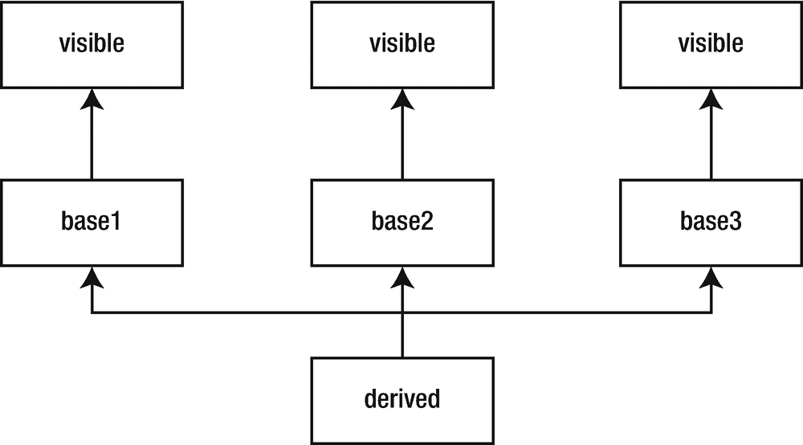
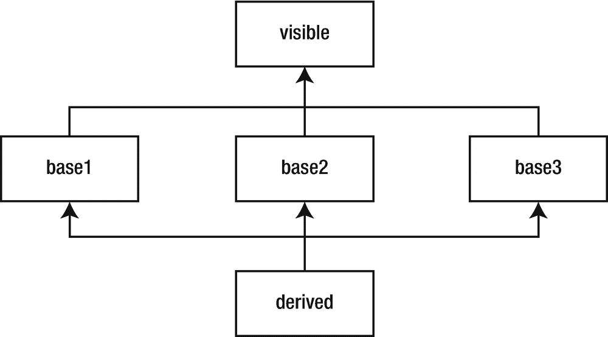

# 69.多重继承

与其他一些面向对象的语言不同，C++ 允许一个类有多个基类。这个特性被称为*多重继承*。其他几种语言允许单个基类，并引入了各种伪继承机制，比如 Java 接口和 Ruby 插件和模块。C++ 中的多重继承是所有这些行为的超集。

## 多个基类

通过在逗号分隔的列表中列出所有基类来声明多个基类。每个基类都有自己的访问说明符，如下所示:

```cpp
class derived : public base1, private base2, public base3
{};

```

与单一继承一样，派生类可以访问其所有基类的所有非私有成员。派生类构造函数按照声明的顺序初始化所有基类。如果你必须传递参数给任何基类构造函数，在初始化列表中做。与数据成员一样，初始值设定项的顺序无关紧要。只有声明的顺序是重要的，如清单 [69-1](#PC2) 所示。

```cpp
import <iostream>;
import <string>;
import <utility>;

class visible {
public:
    visible(std::string msg) : msg_{std::move(msg)} { std::cout << msg_ << '\n'; }
    std::string const& msg() const { return msg_; }
private:
    std::string msg_;
};

class base1 : public visible {
public:
   base1(int x) : visible{"base1 constructed"}, value_{x} {}
   int value() const { return value_; }
private:
   int value_;
};

class base2 : public visible {
public:
   base2(std::string const& str) : visible{"base2{" + str + "} constructed"} {}
};

class base3 : public visible {
public:
   base3() : visible{"base3 constructed"} {}
   int value() const { return 42; }
};

class derived : public base1, public base2, public base3 {
public:
   derived(int i, std::string const& str) : base3{}, base2{str}, base1{i} {}
   int value() const { return base1::value() + base3::value(); }
   std::string msg() const
  {
     return base1::msg() + "\n" + base2::msg() + "\n" + base3::msg();
  }
};

int main()
{
   derived d{42, "example"};
}

Listing 69-1.Demonstrating the Order of Initialization of Base Classes

```

当你编译程序时，你的编译器可能会发出警告，指出`derived`的初始化列表中基类的顺序与初始化器被调用的顺序不匹配。运行该程序演示了基类的顺序控制构造函数的顺序，如以下输出所示:

```cpp
base1 constructed
base2{example} constructed
base3 constructed

```

图 [69-1](#Fig1) 展示了清单 [69-1](#PC2) 的类层次结构。请注意，`base1`、`base2`和`base3`类都有自己的`visible`基类副本。现在不用关注，但是这一点以后会出现，所以要注意。



图 69-1。

清单 [69-1](#PC2) 中类的 UML 图

如果两个或更多的基类有一个同名的成员，如果你想访问那个成员，你必须向编译器指明你指的是哪一个。当您访问派生类中的成员时，通过用所需的基类名称限定成员名称来实现这一点。参见清单 [69-1](#PC2) 中`derived`类的示例。**将** `main()` **功能修改为:**

```cpp
int main()
{
   derived d{42, "example"};
   std::cout << d.value() << '\n' << d.msg() << '\n';
}

```

预测新程序的输出。

*   _____________________________________________________________

*   _____________________________________________________________

*   _____________________________________________________________

*   _____________________________________________________________

*   _____________________________________________________________

*   _____________________________________________________________

*   _____________________________________________________________

将您的结果与我得到的以下输出进行比较:

```cpp
base1 constructed
base2{example} constructed
base3 constructed
84
base1 constructed
base2{example} constructed
base3 constructed

```

## 虚拟基类

有时你不想要一个公共基类的单独副本。相反，您需要公共基类的单个实例，并且每个类共享一个公共实例。要共享基类，在声明基类时插入`virtual`关键字。`virtual`关键字可以在访问说明符之前或之后；惯例是先列出来。

Note

C++ 重载了某些关键字，比如`static`、`virtual`和`delete`。虚拟基类与虚函数没有关系。他们只是碰巧用了同一个关键词。

想象一下，当`base1`、`base2`和`base3`都从基类派生时，将`visible`改为虚拟的。**你能想到可能会出现的困难吗？**

*   _____________________________________________________________

注意，从`visible`继承的每个类都向`visible`的构造函数传递不同的值。如果您想共享`visible`的一个实例，您必须选择一个值并坚持使用它。为了实施这一规则，编译器会忽略虚拟基类的所有初始化器，除了它在最具派生类中需要的初始化器(在这种情况下，`derived`)。因此，要将`visible`更改为虚拟的，不仅必须更改`base1`、`base2`和`base3`的声明，还必须更改`derived`。当`derived`初始化`visible`时，它初始化`visible`的唯一共享实例。**试试看。**您修改后的程序看起来应该类似于清单 [69-2](#PC6) 。

```cpp
import <iostream>;
import <string>;
import <utility>;

class visible {
public:
    visible(std::string msg) : msg_{std::move(msg)} { std::cout << msg_ << '\n'; }
    std::string const& msg() const { return msg_; }
private:
    std::string msg_;
};

class base1 : virtual public visible {
public:
   base1(int x) : visible{"base1 constructed"}, value_{x} {}
   int value() const { return value_; }
private:
   int value_;
};

class base2 : virtual public visible {
public:
   base2(std::string const& str) : visible{"base2{" + str + "} constructed"} {}
};

class base3 : virtual public visible {
public:
   base3() : visible{"base3 constructed"} {}
   int value() const { return 42; }
};

class derived : public base1, public base2, public base3 {
public:
   derived(int i, std::string const& str)

   : base3{}, base2{str}, base1{i}, visible{"derived"}
   {}
   int value() const { return base1::value() + base3::value(); }
   std::string msg() const
   {
     return base1::msg() + "\n" + base2::msg() + "\n" + base3::msg();
   }
};

int main()
{
   derived d{42, "example"};
   std::cout << d.value() << '\n' << d.msg() << '\n';
}

Listing 69-2.Changing the Inheritance of Visible to Virtual

```

**预测来自清单** [**69-2**](#PC6) **的输出。**

*   _____________________________________________________________

*   _____________________________________________________________

*   _____________________________________________________________

*   _____________________________________________________________

*   _____________________________________________________________

*   _____________________________________________________________

*   _____________________________________________________________

请注意，`visible`类现在只初始化一次，初始化它的是`derived`类。因此，每个班级的留言都是`"derived"`。这个例子不同寻常，因为我想说明虚拟基类是如何工作的。大多数虚拟基类只定义一个默认构造函数。这使派生类的作者不必担心向虚拟基类构造函数传递参数。相反，每个派生类都调用默认的构造函数；哪个类派生得最多并不重要。

图 69-2 描述了新的类图，使用了虚拟继承。



图 69-2。

具有虚拟继承的类图

## 类似 Java 的接口

使用接口编程有一些重要的优势。能够将接口从实现中分离出来使得在不影响其他代码的情况下更改实现变得容易。如果你必须使用接口，在 C++ 中你可以很容易地做到。

C++ 没有接口的正式概念，但是它支持基于接口的编程。Java 和类似语言中接口的本质是接口没有数据成员，成员函数没有实现。回想一下探索 [38](38.html) 这样的函数叫做*纯虚函数*。因此，接口仅仅是一个普通的类，其中没有定义任何数据成员，并且将所有成员函数声明为纯虚拟的。

例如，Java 有`Hashable`接口，它定义了`hash`和`equalTo`函数。清单 [69-3](#PC7) 展示了等价的 C++ 类。

```cpp
class Hashable
{
public:
   virtual ~Hashable();
   virtual unsigned long hash() const = 0;
   virtual bool equalTo(Hashable const&) const = 0;
};

Listing 69-3.The Hashable Interface in C++

```

任何实现`Hashable`接口的类都必须覆盖所有的成员函数。例如，`HashableString`为字符串实现了`Hashable`，如清单 [69-4](#PC8) 所示。

```cpp
class HashableString : public Hashable
{
public:
   HashableString() : string_{} {}
   ~HashableString() override;
   unsigned long hash() const override;
   bool equalTo(Hashable const&) const override;

    // Implement the entire interface of std::string ...
private:
   std::string string_;
};

Listing 69-4.The HashableString Class

```

注意`HashableString`*不是*从`std::string`派生而来。相反，它封装了一个字符串，并将所有字符串函数委托给它持有的`string_`对象。

不能从`std::string`派生的原因和`Hashable`包含虚拟析构函数的原因是一样的。回想一下 Exploration [39](39.html) 中的内容，任何至少有一个虚函数的类都应该将其析构函数设为虚拟的。但是`std::string`没有虚拟析构函数。这是操作原始指针的程序中的一个问题。如果`HashableString`是从`std::string`派生的，并且程序的一部分分配了一个新的`HashableString`对象，而另一部分删除了与类型`std::string`相同的指针，那么`HashableString`析构函数永远不会被调用。这似乎是一个很容易避免的问题，事实也确实如此，但是在大型复杂的程序中，对程序的一个部分进行微小的修改，很容易对程序中不相关的部分产生令人惊讶的影响。

如果`HashableString`不是从`std::string`派生的，程序如何管理这些哈希字符串？简短的回答是不能。最长的答案是，从 Java 解决方案的角度考虑问题在 C++ 中并不适用，因为 C++ 为这类问题提供了一个更好的解决方案:模板。

## 界面与模板

正如您所看到的，C++ 支持 Java 风格的接口，但是这种风格的编程会导致困难。有时候，类似 Java 的接口是正确的 C++ 解决方案。然而，在其他情况下，C++ 提供了更好的解决方案，比如模板。

不要写一个`HashableString`类，而是写一个`hash<>`类模板，并为任何必须存储在哈希表中的类型指定模板。主模板提供默认行为；专为`std::string`型的`hash<>`。通过这种方式，字符串池可以轻松地存储`std::string`指针并适当地销毁字符串对象，哈希表可以计算字符串的哈希值(以及您必须存储在哈希表中的任何其他内容)。清单 [69-5](#PC9) 展示了一种编写`hash<>`类模板的方法和一种针对`std::string`的专门化。

```cpp
export module hash;

import <string>;

export template<class T>
class hash
{
public:
   std::size_t operator()(T const& x) const
   {
     return reinterpret_cast<std::size_t>(&x);
   }
};

export template<>
class hash<std::string>
{
public:
   std::size_t operator()(std::string const& str) const
   {
      std::size_t h(0);
      for (auto c : str)
         h = h << 1 | c;
      return h;
   }
};

Listing 69-5.The hash<> Class Template

```

(对了，标准库提供`std::hash`，专门针对`std::string`。在这次探索中，相信你的库的实现会大大优于 toy 的实现。)

这种方法提供了`Hashable`接口的所有功能，但是在某种程度上允许任何类型都是可散列的，而不放弃任何定义良好的行为。此外，`hash()`函数不再是虚拟的，甚至可以是一个内联函数。如果在关键性能路径中访问哈希表，那么速度会相当快。

## 混合食品

在 Ruby 等语言中发现的另一种多重继承方法是*混合*。mix-in 是一个通常没有数据成员的类，尽管这在 C++ 中并不是必需的(就像在一些语言中一样)。通常，C++ mix-in 是一个类模板，它定义了一些成员函数，这些函数调用模板参数来为这些函数提供输入值。

常见的习惯用法是 mix-in 模板将派生类作为模板参数。mix-in 可以定义返回派生类引用的操作符，以确保派生类的 API 正是用户所期望的。

困惑了吗？你并不孤单。这是 C++ 中一个常见的习惯用法，但是在它变得熟悉和自然之前需要时间。清单 [69-6](#PC10) 有助于阐明这种混合是如何工作的。这种混合定义了一个赋值操作符，该操作符按值接受其参数(稍后调用者决定是复制还是移动赋值的源),并将参数与当前值交换。这是定义赋值操作符的几种常见习惯用法之一。

```cpp
export module mixin;

export template<class T>
class assignment_mixin {
public:
   T& operator=(T rhs)
   {
      rhs.swap(static_cast<T&>(*this));
      return static_cast<T&>(*this);
   }
};

Listing 69-6.The assignment_mixin Class Template

```

诀窍在于，mix-in 类不是交换`*this`，而是将自己转换为对模板参数`T`的引用。这样，mix-in 永远不需要知道任何关于派生类的信息。唯一的要求是，`T`类必须是可复制的(因此它可以是赋值函数的一个参数)并且有一个`swap`成员函数。

为了使用`assignment_mixin`类，使用派生类名称作为模板参数，从`assignment_mixin`(以及您希望使用的任何其他 mix-in)派生您的类。清单 [69-7](#PC11) 展示了一个类如何使用混合的例子。

```cpp
import <iostream>;
import <string>;
import <utility>;

import mixin; // Listing 69-6

class thing: public assignment_mixin<thing> {
public:
   thing() : value_{} {}
   thing(std::string s) : value_{std::move(s)} {}
   void swap(thing& other) { value_.swap(other.value_); }
   constexpr std::string const& str() const noexcept { return value_; }
private:
   std::string value_;
};

int main()
{
   thing one{};
   thing two{"two"};
   one = two;
   std::cout << one.str() << '\n';
}

Listing 69-7.Using mix-in Class Template

```

这个 C++ 成语一开始很难理解，我们来分解一下。首先，考虑一下`assignment_mixin`类模板。像许多其他模板一样，它接受单个模板参数。它定义了一个成员函数，恰好是一个重载的赋值操作符。`assignment_mixin`没什么特别的。

但是`assignment_mixin`有一个重要的属性:编译器可以编译模板，即使模板参数是一个不完整的类。编译器不需要扩展赋值操作符，直到它被使用，并且此时，`T`必须是完整的。但是对于这个阶级本身来说，`T`可能是不完整的。如果 mix-in 类要声明一个类型为`T`的数据成员，那么当 mix-in 被实例化时，编译器会要求`T`是一个完整的类型，因为它必须知道 mix-in 的大小。

换句话说，你可以使用`assignment_mixin`作为基类，即使模板参数是一个不完整的类。

当编译器处理一个类定义时，一看到类名，它就在当前范围内将该名称记录为不完整的类型。因此，当`assignment_mixin<thing>`出现在基类列表中时，编译器能够使用不完整类型`thing`作为模板参数来实例化基类模板。

当编译器到达类定义的末尾时，`thing`就变成了一个完整的类型。之后，您将能够使用赋值操作符，因为当编译器实例化该模板时，它需要一个完整的类型，并且它已经有了。

### 受保护访问级别

除了私有和公共访问级别，C++ 还提供了受保护的访问级别。受保护成员只能由类本身和派生类访问。对于所有其他潜在用户来说，受保护的成员是禁区，就像私人成员一样。

大多数成员是私有或公共的。只有在设计类的层次结构，并且希望派生类调用某个成员函数，但不希望其他任何人调用它时，才使用受保护成员。

混合类有时有一个受保护的构造函数。这确保了没有人试图构造该类的独立实例。清单 [69-8](#PC12) 显示了带有受保护构造函数的`assignment_mixin`。

```cpp
export module mixin;

export template<class T>
class assignment_mixin {
public:
   T& operator=(T rhs)
   {
      rhs.swap(static_cast<T&>(*this));
      return static_cast<T&>(*this);
   }
protected:
  assignment_mixin() {}
};

Listing 69-8.Adding a Protected Constructor to the assignment_mixin Class Template

```

多重继承也出现在 C++ 标准库中。你知道输入的`istream`和输出的`ostream`。库也有`iostream`，所以单个流可以执行输入和输出。如你所料，`iostream`来源于`istream`和`ostream`。唯一的怪癖与多重继承无关:`iostream`在`<istream>`头中定义。`<iostream>`标题定义了名称`std::cin`、`std::cout`等等。头名是历史的偶然。

下一个探索通过查看策略和特征，继续您对类型的高级研究。