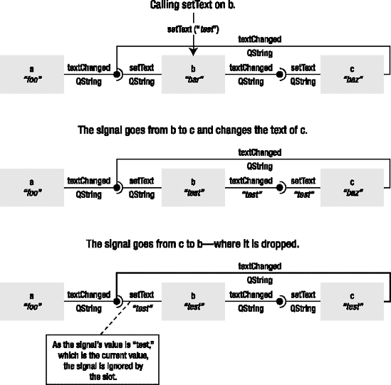
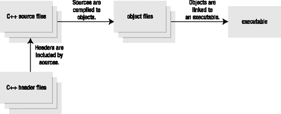

## 一、C++ 的 Qt 方式

**Qt** 是一个跨平台、图形化的应用开发工具包，使您能够在 Windows、Mac OS X、Linux 和不同品牌的 Unix 上编译和运行您的应用。Qt 的很大一部分致力于为一切事物提供平台中立的接口，从在内存中表示字符到创建多线程图形应用程序。

* * *

**注意**尽管 Qt 最初是为了帮助 C++ 程序员而开发的，但是绑定也适用于许多语言。Trolltech 提供了 C++、Java 和 JavaScript 的官方绑定。第三方提供了许多语言的绑定，包括 Python、Ruby、PHP 和。NET 平台。

* * *

本章从一个普通的 C++ 类开始，将它与 Qt 集成在一起，使它更易于重用和使用。在这个过程中，您将看到用于编译和链接 Qt 应用程序的构建系统，以及在您的平台上安装和设置 Qt。

本章然后讨论 Qt 如何使你能够构建能够以非常灵活的方式互连的组件。这就是 Qt 如此强大的原因——它使得构建可重用、可交换和可互连的组件变得容易。最后，您将了解 Qt 提供的集合和助手类。

### 安装 Qt 开发环境

在开始开发 Qt 应用程序之前，您需要下载并安装 Qt。您将使用 Qt 的开源版本，因为它对所有人都是免费的。如果您有 Qt 的商业许可证，您会收到它的安装说明。

根据您计划用于开发的平台，安装过程会略有不同。因为 Mac OS X 和 Linux 都基于 Unix，所以两者的安装过程是相同的(以及所有的 Unix 平台)。另一方面，Windows 则不同，它是单独介绍的。从`[www.trolltech.com/products/qt/downloads](http://www.trolltech.com/products/qt/downloads)`下载适合自己平台的版本就可以启动所有三个平台。

#### 在 Unix 平台上安装

除了 Windows 之外的所有平台都可以说是 Unix 平台。然而，Mac OS X 不同于其他系统，因为它不使用 X 窗口系统，通常称为 X11，来处理图形。所以 Mac OS X 需要一个不同的 Qt 版本；必要的文件(`qt-mac-opensource-src-` `version` `.tar.gz`)可以从奇趣下载。基于 X11 的 Unix 平台使用来自 Trolltech 的`qt-x11-opensource-src-` `version` `.tar.gz`文件。

* * *

**注意** Qt 依赖于其他组件，如编译器、连接器和开发库。根据 Qt 的配置方式，需求会有所不同，因此如果遇到问题，您应该研究参考文档。

* * *

下载完文件后，过程是这样的:解包、配置和编译。让我们一个接一个地完成这些步骤。最简单的方法是在命令提示符下工作。

要解压缩该文件，请下载它，将其放在一个目录中，然后在您的命令 shell 中进入该目录。然后输入如下内容(用 **x11** 或 **mac** 代替*版本*，并使用你已经下载的*版本*):

```cpp
tar xvfz qt-edition-opensource-src-version.tar.gz
这段代码将文件解压到一个名为`qt-`edition` -opensource-src- `version`` 的文件夹中。使用`cd`命令进入该目录:
cd qt-`edition`-opensource-src-`version`
在构建 Qt 之前，您需要使用`configure`脚本及其选项来配置它。像这样运行脚本:
./configure `options`
有许多选项可供选择。最好的起点是使用`-help`，它会向您显示可用选项的列表。大多数选项通常可以保留为默认选项，但是`-prefix`选项很好用。您可以通过在选项后指定一个路径来指示安装转到特定位置。例如，要在您的主目录中的一个名为`inst/qt4`的目录中安装 Qt，使用下面的`configure`命令:
./configure -prefix ~/inst/qt4
Mac OS X 平台还有另外两个值得注意的选项。首先，添加`-universal`选项使用 Qt 创建通用二进制文件。如果您计划使用基于 PowerPC 的计算机进行开发，您必须添加`-sdk`选项。
`configure`脚本还让您接受开源许可(除非您有商业许可),然后检查所有的依赖项是否都已就绪，并开始在源代码树中创建配置文件。脚本完成后，您可以使用以下命令构建 Qt:
make
这个过程需要相对较长的时间来完成，但是完成之后，您可以使用下一行来安装 Qt:
make install

 **注意**如果你试图在你的主目录之外安装 Qt，安装命令可能需要 root 权限。

安装 Qt 后，您需要将 Qt 添加到您的`PATH`环境变量中。如果你使用的编译器不支持`rpath`，你也必须更新`LD_LIBRARY_PATH`环境变量。
如果您在运行`configure`时使用了`$HOME/inst/qt4`前缀，您需要添加`$HOME/inst/qt4/bin`到`PATH`的路径。如果您使用的是 bash shell，请使用赋值来更改变量:
export PATH=$HOME/inst/qt4/bin:$PATH
如果您希望在每次启动命令 shell 时都运行这个命令，那么您可以将它添加到您的`.profile`文件中，就在显示为`export PATH`的一行之前。这会将新的`PATH`环境变量导出到命令行会话。

**注意**设置环境变量的方法因 shell 而异。如果您没有使用 bash，请参考参考文档，了解如何为您的系统设置`PATH`变量。

如果您一次安装了几个 Qt 版本，请确保您打算使用的版本首先出现在`PATH`环境变量中，因为使用的`qmake`二进制文件知道 Qt 安装在哪里。
如果您必须更改`LD_LIBRARY_PATH`环境变量，请将`$HOME/inst/qt4/lib`目录添加到变量中。在 Mac OS X 和 Linux(使用 Gnu 编译器集合[GCC])上，不需要这一步。
在 Windows 上安装
如果您计划使用 Windows 平台进行 Qt 开发，请从 Trolltech 下载一个名为`qt-win-opensource-` `version` `-mingw.exe`的文件。这个文件是一个安装程序，它将设置 Qt 和 mingw 环境。

**注** *mingw* ，是极简 GNU for Windows 的简称，是 Windows 常用 GNU 工具的发行版。Qt 开源版使用这些工具，包括 GCC 和 make，进行编译和链接。

安装程序就像一个向导，询问你在哪里安装 Qt。确保选择一个没有空格的目录路径，因为这可能会在以后给你带来问题。安装 Qt 后，你会看到一个名为`Qt by Trolltech (OpenSource)`的开始菜单文件夹。该文件夹包含 Qt 工具和文档的条目以及 Qt 命令提示符。从这个命令提示符中访问 Qt 是很重要的，因为它正确地设置了环境变量，比如 T1。简单地运行在开始菜单的`Accessories`文件夹中的命令提示符将会失败，因为变量没有正确配置。
制作 c++“Qt-er”
因为这是一本关于编程的书，你会马上从一些代码开始(见[清单 1-1](#a_simple_c_plus_plus_class) )。

**清单 1-1。** *一个简单的 C++ 类*
#include <string>

using std::string;

class MyClass

{

public:

  MyClass( const string& text );

  const string& text() const;

  void setText( const string& text );

  int getLengthOfText() const;

private:

  string m_text;

}; 
在[清单 1-1](#a_simple_c_plus_plus_class) 中显示的类是一个简单的字符串容器，带有获取当前文本长度的方法。实现比较琐碎，`m_text`简单设置或者返回，或者返回`m_text`的大小。让我们通过使用 Qt 使这个类更加强大。但是首先，看看已经“Qt 化”的部分:

```

*   类名以大写字母开头，单词使用*驼峰式大小写*分开。也就是说，每个新单词都以大写字母开头。这是命名 Qt 类的常用方法。
*   这些方法的名称都以小写字母开头，单词也用字母大小写来区分。这是命名 Qt 方法的常用方式。
*   属性文本的 getter 和 setter 方法被命名为`text` (getter)和`setText` (setter)。这是命名 getters 和 setters 的常见方式。

都是 Qt 的特质。这看起来没什么大不了的，但是在实际编写代码时，用结构化的方式命名可以节省大量时间。

#### 继承 Qt

您将对代码进行的第一个特定于 Qt 的调整非常简单:您将简单地让您的类继承`QObject`类，这将使动态管理类的实例变得更加容易，方法是给实例提供负责删除它们的父类。

* * *

**注意**所有 Qt 类的前缀都是大写的 q。因此，如果你找到了类`QDialog`和`Dialog`，你可以马上判断出`QDialog`是 Qt 类，而`Dialog`是你的应用程序或第三方代码的一部分。一些第三方库使用`QnnClassName`命名约定，这意味着该类属于一个扩展 Qt 的库。前缀中的`nn`告诉你这个类属于哪个库。例如，类`QwtDial`属于技术应用程序库的 Qt Widgets，它提供了图形、刻度盘等类。(您可以在附录中找到更多关于这个和其他第三方 Qt 扩展的信息。)

* * *

对代码的改动很小。首先，类的定义被稍微修改了一下，如[清单 1-2](#inheriting_qobject_and_accepting_a_paren) 所示。为了方便起见，`parent`参数也被添加到构造器中，因为`QObject`有一个函数`setParent`，可以用来在创建后将对象实例分配给父对象。然而，通常——也是推荐的——将 parent 作为参数传递给构造器，作为第一个默认参数，以避免必须为从该类创建的每个实例键入`setParent`。

**清单 1-2。** *继承* `QObject` *并接受一个父*

```cpp
#include <QObject>

#include <string>

using std::string;

class MyClass : public QObject

{

public:

  MyClass( const string& text, QObject *parent = 0 );

...

};

```

* * *

**注意**要访问`QObject`类，必须包含头文件`<QObject>`。这适用于大多数 Qt 类；简单地包含一个与类同名的头文件，省略掉`.h`，一切都应该正常工作。

* * *

父参数简单地传递给`QObject`构造器，如下所示:

`MyClass::MyClass( const string& text, QObject *parent ) : QObject( parent )`

让我们看看变化的影响，从[清单 1-3](#dynamic_memory_without_qt) 开始。它显示了一个动态使用`MyClass`类的`main`函数，没有 Qt。

**清单 1-3。** *没有 Qt 的动态记忆*

`#include <iostream>
int main( int argc, char **argv )
{
  MyClass *a, *b, *c;

  a = new MyClass( "foo" );
  b = new MyClass( "ba-a-ar" );
  c = new MyClass( "baz" );

  std::cout << a->text() << " (" << a->getLengthOfText() << ")" << std::endl;
  a->setText( b->text() );
  std::cout << a->text() << " (" << a->getLengthOfText() << ")" << std::endl;

  int result = a->getLengthOfText() - c->getLengthOfText();

  delete a;
  delete b;
  delete c;

  return result;
}`

每个`new`调用后必须跟随一个对`delete`的调用，以避免内存泄漏。虽然在退出`main`函数时这不是一个大问题(因为大多数现代操作系统在应用程序退出时会释放内存)，但是析构函数并没有像预期的那样被调用。在非无循环`main`函数的位置，当系统用尽空闲内存时，泄漏最终会导致系统崩溃。与清单 1-4 中的[相比，清单 1-4 中的](#dynamic_memory_with_qt)使用了一个父类，当`main`函数退出时，这个父类会被自动删除。家长负责为所有孩子调用`delete`和——哒哒！—内存被释放。

* * *

**注意**在[清单 1-4](#dynamic_memory_with_qt) 所示的代码中，添加了`parent`对象来展示这个概念。在现实生活中，它可能是一个执行某种任务的对象——例如，`QApplication`对象，或者(在对话框或窗口的情况下)`window`类的`this`指针。

* * *

**清单 1-4。** *用 Qt 动态记忆*

```cpp
#include <QtDebug>

int main( int argc, char **argv )

{

  QObject parent;

  MyClass *a, *b, *c;

  a = new MyClass( "foo", &parent );

  b = new MyClass( "ba-a-ar", &parent );

  c = new MyClass( "baz", &parent );

  qDebug() << QString::fromStdString(a->text())

           << " (" << a->getLengthOfText() << ")";

  a->setText( b->text() );

  qDebug() << QString::fromStdString(a->text())

           << " (" << a->getLengthOfText() << ")";

  return a->getLengthOfText() - c->getLengthOfText();

}
```

您甚至省去了将计算结果保存在变量中的额外步骤，因为动态创建的对象可以直接从`return`语句中使用。拥有这样的父对象可能看起来很奇怪，但是大多数 Qt 应用程序使用一个`QApplication`对象作为父对象。

* * *

**注** [清单 1-4](#dynamic_memory_with_qt) 从使用`std::cout`打印调试信息切换到`qDebug()`。使用`qDebug()`的好处是它可以在所有平台上把信息发送到正确的地方。关闭也很容易:编译时只需定义`QT_NO_DEBUG_OUTPUT`符号。如果您有调试消息，在此之后您想要终止应用程序，Qt 提供了`qFatal()`功能，它的工作方式就像`qDebug()`一样，但是在消息之后终止应用程序。两者之间的折衷是使用`qWarning()`，它表示比调试消息更严重的事情，但不是致命的。用于调试消息的 Qt 函数会在每次调用后自动追加一个换行符，因此您不必再包含`std::endl`。

* * *

在比较[清单 1-3](#dynamic_memory_without_qt) 和[清单 1-4](#dynamic_memory_with_qt) 中的代码复杂度时，看看不同的内存情况，如图[图 1-1](#difference_between_dynamic_memory_with_a) 所示。父实例是灰色的，因为它是在堆栈上分配的，因此会被自动删除，而`MyClass`的实例是白色的，因为它们在堆上，必须手动处理。因为您使用父级来跟踪子级，所以您信任父级会在删除子级时删除它们。因此，只要根对象在堆栈上(或者如果您跟踪它)，您就不必再跟踪动态分配的内存。


**图 1-1。** *堆栈上有父内存和无父内存的动态内存差异*

#### 使用 Qt 字符串

使用 Qt 的另一个步骤是用相应的 Qt 类替换 C++ 标准模板库(STL)中的任何类。虽然这不是必需的(Qt 和 STL 一起工作很好)，但是它确实可以避免依赖第二个框架。不使用 STL 的好处是，您可以使用与 Qt 相同的容器、字符串和助手，因此最终的应用程序很可能会更小。当在平台和编译器之间移动时，您还可以避免跟踪兼容性问题和与 STL 标准的奇怪偏差——您甚至可以在没有 STL 实现的平台上进行开发。

查看当前的类，发现`string`类是唯一使用的 STL 类。对应的 Qt 类叫做`QString`。你可以无缝地混合`QString`对象和`string`对象，但是只使用`QString`意味着性能的提高和更多的特性。例如，`QString`支持所有平台上的 Unicode，这使得国际用户使用您的应用程序更加容易。

[清单 1-5](#myclass_using_qstring_instead_of_string) 展示了用`QString`替换所有出现的`string`后，你的代码是什么样子。如您所见，对该类的更改非常小。

**清单 1-5。** `MyClass` *用* `QString` *代替* `string`

```cpp
#include <QString>

#include <QObject>

class MyClass : public QObject

{

public:

  MyClass( const QString& text, QObject *parent = 0 );

  const QString& text() const;

  void setText( const QString& text );

  int getLengthOfText() const;

private:

  QString m_text;

};

```

* * *

**提示**当混合`string`和`QString`时，使用`QString`方法`toStdString`和`fromStdString`将 Qt Unicode 格式转换为`string`类使用的 ASCII 表示。

* * *

#### 建立 Qt 程序

编译和构建这个应用程序应该与构建原始应用程序没有任何不同。您所要做的就是确保编译器能够找到 Qt 头文件，并且链接器能够找到 Qt 库文件。

为了以跨平台的方式顺利处理所有这些，Qt 附带了 QMake 工具，它可以为一系列不同的编译器创建 Makefiles。如果您愿意，它甚至会为您创建项目定义文件。

尝试构建一个简单的应用程序。首先创建一个名为`testing`的目录。然后将来自[清单 1-6](#a_trivial_example) 的代码放到这个目录中。您可以将该文件命名为任何名称，只要它的扩展名是`cpp`。

**清单 1-6。** *一个微不足道的例子*

`#include <QtDebug>

int main( )
{
    qDebug() << "Hello Qt World!";

    return 0;
}`

现在打开一个命令行，将您的工作目录更改为您刚刚创建的目录。然后输入`qmake -project`并按回车键，这会生成一个名为`testing.pro`的文件。我的版本如[清单 1-7](#a_generated_project_file) 所示。

* * *

**提示**如果你在 Windows 中运行 Qt 的开源版本，在安装 Qt 时创建的开始菜单文件夹中有一个类似 Qt 4.2.2 命令提示符的应用程序。运行该应用程序并使用`cd`命令更改目录。例如，首先使用资源管理器定位您的文件夹；然后复制整个路径(应该和`c:\foo\bar\baz\testing`差不多)。现在在命令提示符下键入`cd`，后跟一个空格，然后右键单击，选择粘贴，然后按回车键。这应该能让你很快找到正确的工作目录。

* * *

**清单 1-7。** *一个生成的项目文件*

* * *

`######################################################################
# Automatically generated by qmake (2.00a) to 10\. aug 17:06:34 2006
######################################################################

TEMPLATE = app
TARGET +=
DEPENDPATH += .
INCLUDEPATH += .

# Input
SOURCES += anything.cpp`

* * *

该文件由一组使用`=`设置或使用`+=`扩展的变量组成。有趣的部分是`SOURCES`变量，它告诉你 QMake 已经找到了`anything.cpp`文件。下一步是使用 QMake 生成特定于平台的 Makefile。因为工作目录只包含一个项目文件，只需键入`qmake`并按回车键。这将为您提供一个 Makefile 和特定于平台的助手文件。

* * *

**注意**在 GNU/Linux 上，结果是一个名为`Makefile`的文件。在 Windows 上，如果你使用开源版本和 mingw，你会得到`Makefile`、`Makefile.Release`、`Makefile.Debug`和两个目录:`debug`和`release`。

* * *

最后一步是从生成的 Makefile 构建项目。如何做到这一点取决于您使用的平台和编译器。你通常应该键入`make`并按回车键，但是`gmake`(在 Berkeley Software Distribution[BSD]系统上很常见)和`nmake`(在微软编译器上)也是其他常见的选择。如果你第一次不能让它工作，试着看看你的编译器手册。

* * *

**提示**运行 Windows 时，应用程序默认不会得到控制台输出。这意味着默认情况下，Windows 应用程序不能向命令行用户写入输出。要查看来自`qDebug()`的任何输出，您必须在项目文件中添加一行内容`CONFIG += console`。如果您构建了可执行文件，然后看到了这个提示，请尝试修复项目文件；然后运行`make clean`，接着运行`make`。这个过程确保项目被完全重新构建，并且新的配置被考虑在内。

* * *

现在剩下唯一要做的就是运行应用程序并观察这条消息:`Hello Qt World!`。可执行文件将与您使用的目录同名。对于 Windows 用户，可执行文件在发布目录中以文件扩展名`exe`结束，因此您可以通过运行以下命令来启动它:

```cpp
release\testing.exe
在其他平台上，它通常直接位于工作目录中，因此您可以通过键入以下命令来启动它:
./testing
在所有平台上，结果都是一样的:将`Hello Qt World!`消息打印到控制台。在 Windows 平台上产生的命令提示符如图 1-2 中的[所示。](#a_qt_application_running_from_the_comman)

**图 1-2。** *一个从命令行运行的 Qt 应用程序*
信号、插槽和元对象
Qt 给 C++ 带来的两个最大优势是*信号*和*插槽*，它们是非常灵活的对象互连方式，有助于使代码易于设计和重用。
一个*信号*是一个被调用时发出而不是执行的方法。所以从你作为程序员的角度来看，你声明了可能发出的信号的原型。不执行信号；只需在类的`signals`部分的类声明中声明它们。
一个*槽*是一个成员函数，可以作为信号发射的结果被调用。你必须通过将方法放在这些部分中的一个来告诉编译器将哪些方法视为槽:`public slots`、`protected slots`或`private slots`。保护级别仅在插槽用作方法时保护插槽。您仍然可以将一个`private`插槽或一个`protected`插槽连接到您从另一个类接收的信号。
说到连接信号和插槽，您可以将任意数量的信号连接到任意数量的插槽。这意味着单个插槽可以连接到多个信号，单个信号可以连接到多个插槽。对如何互连对象没有限制。当发出一个信号时，所有连接到它的插槽都会被调用。调用的顺序是不确定的，但是它们确实会被调用。让我们来看一些代码，这些代码显示了一个声明了信号和插槽的类(参见[清单 1-8](#a_class_with_a_signal_and_a_slot) )。

**清单 1-8。** *有一个信号和一个插槽的类*
#include <QString>

#include <QObject>

class MyClass : public QObject

{

`  Q_OBJECT`

public:

  MyClass( const QString &text, QObject *parent = 0 );

  const QString& text() const;

  int getLengthOfText() const;

`public slots:`

  void setText( const QString &text );

`signals:`

`  void textChanged( const QString& );`

private:

  QString m_text;

}; 
代码是你在这一章中一直使用的类`MyClass`的新化身。清单中三个重点区域的信号和插槽都有变化。从底部开始，新的部分标记为`signals:`。这告诉您，本节中声明的函数将不会由您实现；它们只是这个类可以发出的信号的原型。这个类有一个信号:`textChanged`。
再往上，还有一个新的板块:`public slots:`。像其他成员一样，插槽可以是公共的、受保护的或私有的——只需在关键字`slots`前添加适当的保护级别。插槽可以被认为是一个可以连接到信号的成员函数。真的没有其他区别；它就像该类的任何其他成员函数一样被声明和实现。

**提示** Setter 方法是自然槽。通过设置所有的 setters 插槽，可以保证将信号连接到类中所有感兴趣的部分。唯一一个 setter 不应该也是 slot 的时候是当 setter 接受一些非常定制的类型，而你确信这些类型永远不会来自一个信号。

在类声明的最顶端，您可以找到`Q_OBJECT`宏。重要的是，这个宏首先出现在类声明的主体中，因为它将该类标记为需要元对象的类。在继续之前，让我们看看什么是元对象。
单词 *meta* 表示前缀的单词是关于它自己的。所以*元对象*是描述对象的对象。在 Qt 的情况下，元对象是类 `QMetaObject`的实例，包含关于类的信息，比如它的名称、它的超类、它的信号、它的槽以及许多其他有趣的东西。现在要知道的重要事情是元对象知道信号和槽。
这就引出了这个特性的下一个含义。到目前为止，所有的例子都可以很好地放入一个源代码文件中。这样继续下去是可能的，但是如果你把每个类分成一个头文件和一个源文件，这个过程会顺利得多。一个名为*元对象编译器*、`moc`的 Qt 工具解析类声明，并从中生成一个 C++ 实现文件。这听起来可能很复杂，但是只要您使用 QMake 来处理项目，对您来说没有什么不同。
这种新方法意味着来自[清单 1-8](#a_class_with_a_signal_and_a_slot) 的代码将被放入一个名为`myclass.h`的文件中。实现进入`myclass.cpp`，`moc`从头文件生成另一个名为`moc_myclass.cpp`的 C++ 文件。生成文件的内容可以在 Qt 版本之间改变，这没什么好担心的。[清单 1-9](#implementing_myclass_with_signals_and_sl) 包含了由于信号和插槽而改变的部分实现。

**清单 1-9。** *用信号和时隙*实现 `MyClass` ```
void MyClass::setText( const QString &text )

{

  if( m_text == text )

    return;

  m_text = text;

  emit textChanged( m_text );

}
```cpp

发出信号`textChanged`的变化可分为两部分。前半部分是检查文本是否真的发生了变化。如果您在将`textChanged`信号连接到同一个对象的`setText`插槽之前没有检查这一点，您将会以一个无限循环结束(或者像用户所说的，应用程序将会挂起)。变化的后半部分是实际发出信号，这是通过使用 Qt 关键字`emit`后跟信号的名称和参数来完成的。

**信号和机罩下的插槽**

Qt 使用函数指针来实现信号和槽。当以信号作为参数调用`emit`时，实际上调用的是信号。该信号是在由`moc`生成的源文件中实现的功能。这个函数使用持有连接插槽的对象的元对象来调用连接到信号的任何插槽。

元对象包含指向插槽的函数指针，以及它们的名称和参数类型。它们还包含可用信号及其名称和参数类型的列表。当调用`connect`时，您要求元对象将插槽添加到信号的调用列表中。如果参数匹配，则建立连接。

当匹配参数时，只对插槽接受的参数进行匹配检查。这意味着不带任何参数的槽匹配所有信号。插槽不接受的参数会被发出信号的代码直接丢弃。

####  建立连接

为了测试`MyClass`中的信号和插槽，创建了`a`、`b`和`c`实例:

```
  QObject parent;

  MyClass *a, *b, *c;

  a = new MyClass( "foo", &parent );

  b = new MyClass( "bar", &parent );

  c = new MyClass( "baz", &parent );
现在连接它们。使用`QObject::connect`方法连接信号和插槽。论据有`source object`、`SIGNAL(`、`source signal`、`destination object`、`SLOT(`、`destination slot`、`)`。宏`SIGNAL`和`SLOT`是必需的；否则，Qt 拒绝建立连接。源和目标对象是指向`QObject`或继承`QObject`的类的对象的指针。源信号和目标插槽是所涉及的信号和插槽的名称和参数类型。下面显示了它在代码中的样子。[图 1-3](#the_connections_between_a_comma_b_and_c) 显示了对象实例是如何连接的。
  QObject::connect(

    a, SIGNAL(textChanged(const QString&)),

    b, SLOT(setText(const QString&)) );

  QObject::connect(

    b, SIGNAL(textChanged(const QString&)),

    c, SLOT(setText(const QString&)) );

  QObject::connect(

    c, SIGNAL(textChanged(const QString&)),

    b, SLOT(setText(const QString&)) );

**注意**连接时试图指定信号或插槽参数*值*会导致你的代码在运行时失败。`connect`函数只理解参数`types`。

**图 1-3。***`a``b`*`c`之间的联系** **下面一行显示了对其中一个对象的调用:

`  b->setText( "test" );`

尝试追踪从`b`开始的呼叫，其中有从`"bar"`到`"test"`的变化；通过连接到`c`，这里有从`"baz"`到`"test"`的变化；并且通过连接到`b`、没有变化的地方。结果是`a`不变，而`b`和`c`将文本设置为`"test`。`"`这在[图 1-4](#tracing_the_text_through_the_connections) 中有说明，其中你可以看到文本`"test"`是如何通过对象传播的。现在尝试跟踪下面的调用。你能说出结果会是什么吗？

`  a->setText( "Qt" );`



**图 1-4。** *通过连接追踪文本*

* * *

**提示**通过为每个插槽提供一个信号(例如，`textChanged`对应于`setText`，你可以将两个物体绑在一起。在前面的例子中，对象`b`和`c`总是具有相同的值，因为一个对象的变化会触发另一个对象的变化。当一个对象是图形用户界面的一部分时，这是一个非常有用的特性，您将在后面看到。

* * *

####  重温构建过程

上次提到构建 Qt 应用程序时，使用 QMake 工具的原因是平台独立性。另一个重要原因是 QMake 处理元对象的生成，并将它们包含在最终的应用程序中。图 1-5 显示了一个标准的 C++ 项目是如何构建的。



**图 1-5。** *一个标准的 C++ 项目被构建。*

使用 QMake 时，所有头文件都由元对象编译器解析:`moc`。`moc`寻找包含`Q_OBJECT`宏的类，并为这些类生成元对象。然后，生成的元对象被自动链接到最终的应用程序中。[图 1-6](#meta-objects_are_being_built) 展示了这是如何融入构建过程的。作为开发人员，QMake 使这一点对您完全透明。


**图 1-6。** *正在构建元对象。*

* * *

**提示** 记住 Qt 只是简单的标准 C++ 混合了一些宏和`moc`代码生成器。如果您收到编译器或链接器消息，抱怨缺少函数，这些函数的名称告诉您它们是信号，则信号的代码没有生成。最常见的原因是该类不包含`Q_OBJECT`宏。如果没有继承`QObject`(直接或间接)并且仍然使用`Q_OBJECT`宏，或者在类中插入或删除宏后忘记运行`qmake`，也有可能出现奇怪的编译错误。

* * *

#### 与新事物的联系

信号和插槽是非常松散的连接类型，所以唯一重要的是参数的类型在信号和插槽之间匹配。被调用的类不需要知道调用类的任何信息，反之亦然。这意味着可以对简单的示例类进行测试——让它与一组 Qt 的类进行交互。

计划是将`MyClass`放在让用户输入文本的小部件`QLineEdit`和显示文本的小部件`QLabel`之间。一个*小部件*是一个可视组件，比如一个按钮、一个滑块、一个菜单项或者任何其他图形用户界面的一部分。(小部件在第 3 章的[中有详细描述。)通过将来自`QLineEdit`对象的`textChanged`信号连接到`MyClass`对象的`setText`槽，然后将来自`MyClass`对象的`textChanged`信号连接到`QLabel`对象的`setText`槽，可以使`MyClass`对象作为一座桥梁，将文本从用户可编辑字段传送到标签。整个设置如](03.html#widgets_and_layouts)[图 1-7](#myclass_acting_as_a_bridge_between_qline) 所示。


**图 1-7。** `MyClass` *充当* `QLineEdit` *和* `QLabel`之间的桥梁

这个例子的主要功能可以分为三个部分:创建相关的对象实例，建立连接，然后运行应用程序。[清单 1-10](#creating_an_application_comma_widgets_co) 展示了如何创建相关的组件。首先，有一个`QApplication`对象。对于所有的图形 Qt 应用程序，必须有一个(且只有一个)可用的应用程序实例。应用程序对象包含所谓的*事件循环*。在这个循环中，应用程序等待某件事情发生——等待某个事件发生。例如，用户按下一个键或移动鼠标，或者已经过了某一段时间。一旦事件发生，它就被转换成对适当的`QObject`的调用。例如，按键事件将转到具有键盘焦点的小部件。事件由接收对象处理，有时会发出信号。在按键场景中，发出一个`textChanged`信号；在按钮和键被输入或空格的情况下，发出一个`pressed`信号。然后，信号被连接到执行应用程序实际任务的插槽。

花点时间回顾一下清单 1-10 。创建了`QApplication`对象，以及三个小部件:一个普通的`QWidget`、`QLineEdit`和一个`QLabel`。`QWidget`充当另外两个的容器。这就是为什么您创建了一个`QVBoxLayout`——这是一个垂直的盒子布局，它将小部件堆叠在彼此之上。然后，在将布局分配给小部件之前，在 box 布局中放置行编辑和标签。产生的小部件如图 1-8 所示。

最后，您创建一个`MyClass`的实例，这是您将需要的最后一个对象。

**清单 1-10。** *创建一个应用程序、小部件、布局和一个* `MyClass` *对象*

`#include <QtGui>

int main( int argc, char **argv )

{

  QApplication app( argc, argv );

  QWidget widget;

  QLineEdit *lineEdit = new QLineEdit;

  QLabel *label = new QLabel;

  QVBoxLayout *layout = new QVBoxLayout;

  layout->addWidget( lineEdit );

  layout->addWidget( label );

  widget.setLayout( layout );

  MyClass *bridge = new MyClass( "", &app );`

根据[图 1-7](#myclass_acting_as_a_bridge_between_qline) ，你需要做两个连接(见[清单 1-11](#setting_up_the_connections) )。重要的是要记住信号和插槽的名称(`textChanged`和`setText`)恰好与`MyClass`中的名称相同。对 Qt 唯一重要的是作为参数发送和接受的类型:`QString`。

**清单 1-11。** *设置连接*

`QObject::connect(

    lineEdit, SIGNAL(textChanged(const QString&)),

    bridge, SLOT(setText(const QString&)) );

  QObject::connect(

    bridge, SIGNAL(textChanged(const QString&)),

    label, SLOT(setText(const QString&)) );` 

您可能担心显示用户界面，然后开始事件循环是最难的部分。事实上，恰恰相反。清单 1-12 显示了所有相关的代码。因为行编辑和标签包含在普通小部件中，所以小部件一显示，它们就显示出来。当你试图显示小部件时，Qt 意识到它缺少了一个窗口，并自动将它放在一个窗口中。然后，应用程序方法`exec`运行事件循环，直到所有窗口都关闭，只要一切按预期运行，就返回零。

**清单 1-12。** *显示用户界面并执行事件循环*

```cpp
  widget.show();

  return app.exec();

}
```

一旦事件循环启动并运行，一切都会迎刃而解。键盘活动最终出现在行编辑小部件中。按键被处理，文本相应地改变。这些变化导致`textChanged`信号从行编辑发送到`MyClass`对象。这个信号通过`MyClass`对象传播到标签，当标签用新文本重绘时，用户可以看到这个变化。来自应用程序的截图如[图 1-8](#it_does_not_show_on_the_surface_comma_bu) 所示。


**图 1-8。** *表面上看不出来，但是* `MyClass` *在这个应用中起着重要的作用。*

重要的是要记住，`MyClass`对`QLineEdit`或`QLabel`一无所知，反之亦然——它们在相互连接的主函数中相遇。不需要事件、委托或信号类为相关类所熟知。唯一的共同点是他们继承了`QObject`；其余所需的信息可以在运行时从元对象中获得。

### 集合和迭代器

Qt 的类取代了 C++ STL 的类(到目前为止，你已经看到了`QString`类)。这一节着眼于 Qt 必须提供的容器和迭代器。

Qt 的容器是模板类，可以包含任何其他可变类。有一系列不同的容器，包括不同的列表、堆栈、队列、映射和哈希表。伴随这些类而来的是迭代器——既有 STL 兼容的迭代器，也有 Qt 的 Java 版本。迭代器是轻量级的对象，用于在容器中移动，并访问保存在容器中的数据。

* * *

**提示**所有的 Qt 集合类都是隐式共享的，所以在列表被修改之前不会复制它。将列表作为参数传递或返回列表作为结果是低成本的性能*和*内存方面。将对列表的引用作为参数或结果传递甚至更便宜，因为它保证不会无意中做出任何改变。

* * *

#### 遍历 QList

我们先来看一下`QList`类。[清单 1-13](#populating_a_qlist_and_printing_the_cont) 展示了如何创建和填充一个`QString`对象列表。使用`<<`操作符追加数据使得用信息填充列表变得容易。当列表被填充时，`foreach`宏用于打印列表的内容。

**清单 1-13。** *填充一个* `QList` *并打印内容*

```cpp
  QList<QString> list;

  list << "foo" << "bar" << "baz";

  foreach( QString s, list )

    qDebug() << s;
```

清单 1-13 展示了 Qt 开发者认为列表应该如何:易于使用。使用`foreach`宏缩短了代码，但是迭代器实例在幕后使用。

Qt 提供了 STL 风格的迭代器和 Java 风格的迭代器。清单 1-14 中的代码展示了如何使用这两个迭代器。列表顶部的`while`循环使用 Java 风格的迭代器`QListIterator`。函数`hasNext`检查列表中是否还有有效的条目，而`next`方法返回当前条目并将迭代器移动到下一个条目。如果你想在不移动迭代器的情况下查看下一项，使用`peekNext`方法。

清单末尾的`for`循环使用 STL 风格的迭代器。迭代器名称可以使用 STL 命名或 Qt 命名来指定— `const_iterator`和`ConstIterator`是同义词，但是后者更“Qt 化”

在`for`循环中迭代时，使用`++iterator`而不是`iterator++`是有价值的。这为您提供了更高效的代码，因为编译器避免了为`for`循环的上下文创建临时对象。

**清单 1-14。** * STL 风格迭代器和 Java 风格迭代器并排*

```cpp
  QList<int> list;

  list << 23 << 27 << 52 << 52;

  QListIterator<int> javaIter( list );

  while( javaIter.hasNext() )

    qDebug() << javaIter.next();

  QList<int>::const_iterator stlIter;

  for( stlIter = list.begin(); stlIter != list.end(); ++stlIter )

    qDebug() << (*stlIter);
```

在比较 STL 和 Java 风格的迭代器时，重要的是要记住 STL 风格的迭代器效率略高。然而，Java 风格迭代器提供的可读性和代码清晰性可能是使用它们的足够动机。

* * *

**提示**通常使用`typedef`来避免到处键入`QList<>::Iterator`。例如，`MyClass`条目的列表可以用一个叫做`MyClassListIterator`的迭代器叫做`MyClassList`(像这样创建类型:`typedef QList<MyClass> MyClassList`)(像这样创建类型:`typedef QList<MyClass>::Iterator MyClassListIterator`)。这个过程有助于使使用 STL 风格迭代器的代码更具可读性。

* * *

 [清单 1-14](#stl-style_iterators_and_java-style_itera) 向你展示了如何使用常量迭代器，但是有时候当你迭代时，修改列表是必要的。使用 STL 风格的迭代器，这意味着跳过名字的`const`部分。对于 Java 风格的迭代，使用`QMutableListIterator`。[清单 1-15](#modifying_lists_using_iterators) 显示了使用 Qt 类迭代和修改列表内容:

**清单 1-15。** *使用迭代器修改列表*

```cpp
  QList<int> list;

  list << 27 << 33 << 61 << 62;

  QMutableListIterator<int> javaIter( list );

  while( javaIter.hasNext() )

  {

    int value = javaIter.next() + 1;

    javaIter.setValue( value );

    qDebug() << value;

  }

  QList<int>::Iterator stlIter;

  for( stlIter = list.begin(); stlIter != list.end(); ++stlIter )

  {

    (*stlIter) = (*stlIter)*2;

    qDebug() << (*stlIter);

  }
```

[清单 1-15](#modifying_lists_using_iterators) 显示 Java 风格的循环使用`next`读取下一个值*，然后使用`setValue`设置当前*值*。这意味着清单中的循环将列表中的所有值加 1。这也意味着在`next`作为迭代器被调用之前`setValue`不应该被使用；然后，它指向实际列表*之前不存在的值*。*

* * *

**注意**当通过删除或插入项目来修改列表时，迭代器可能会失效。在修改实际的列表(而不是列表的内容)时，请注意这一点。

* * *

在 STL 风格的循环中，什么都没有改变，只是这次迭代器引用的项可以被修改。这个例子使用了名称`Iterator`而不是`iterator`，这不会影响结果(它们是同义词)。

不仅可以单向迭代，对于 STL 风格的迭代器，也可以使用`--`操作符和`++`操作符。对于 Java 风格的迭代器，可以使用方法`next`、`previous`、`findNext`和`findPrevious`。使用`next`和`previous`时，使用`hasNext`和`hasPrevious`保护代码以避免未定义的结果是很重要的。

* * *

当你选择使用迭代器时，尽可能使用常量迭代器，因为它们能提供更快的代码，并防止你错误地修改列表项。

* * *

当你需要以一种特殊的方式迭代或者只是想访问一个特定的条目时，你可以使用带有`[]`操作符或者`at`方法的索引访问。对于一个`QList`来说，这个过程非常快。例如，下面一行计算列表中第六和第八个元素的总和:

```cpp
  int sum = list[5] + list.at(7);
填写清单
到目前为止，您已经使用`<<`操作符填充了列表，这意味着将新数据追加到列表的末尾。也可以预先考虑数据；例如，将它放在列表的开头或在中间插入数据。清单 1-16 展示了在列表中放置条目的不同方式。
[图 1-9](#the_list_contents_during_appending_comma) 显示了列表中的每个插入。首先，字符串`"first"`被追加到一个空列表中，然后字符串`"second"`被追加到列表的末尾。之后，字符串`"third"`被添加到列表中。最后，字符串`"fourth"`和`"fifth"`被插入到列表中。

**清单 1-16。** *追加、前置、插入*
  QList<QString> list;

  list << "first";

  list.append( "second" );

  list.prepend( "third" );

  list.insert( 1, "fourth" );

  list.insert( 4, "fifth" );

**图 1-9。** *追加、前置、插入时的列表内容*
更多列表
`QList`不是唯一可用的列表类；对于不同的场景有几个列表。当选择使用哪个列表类时，正确的答案几乎总是`QList`。使用`QList`的唯一缺点是，当你在大列表中间插入项目时，它会变得非常慢。
另外两个列表类更加专门化，但是它们不应该被认为是特例。第一个是`QVector`类，它保证包含的条目在内存中保持有序，所以当你在列表的开始和中间插入条目时，列表中后面的所有条目都必须被移动。好处是索引访问和迭代很快。
第二个选择是`QLinkedList`，它提供了一个链表实现，可以快速迭代，但是没有索引访问。它还支持常量时间插入，而与新项目在列表中的插入位置无关。另一个好的方面是，只要元素还在列表中，迭代器就一直有效——可以自由地在列表中删除和插入新的元素，同时仍然使用迭代器。[表 1-1](#comparison_of_qlist_comma_qvector_comma) 将链表和向量类与`QList`进行了比较。
**表 1-1。***`QList``QVector`*`QLinkedList`的比较**
```** 
```cpp* 
```

<colgroup><col valign="top" width="20%" class="calibre28"> <col valign="top" width="16%" class="calibre28"> <col valign="top" width="16%" class="calibre28"> <col valign="top" width="16%" class="calibre28"> <col valign="top" width="16%" class="calibre28"> <col valign="top" width="16%" class="calibre28"></colgroup> 
| **类** | **在开始处插入**  | **插入中间的**  | **结尾插入**  | **通过
索引**访问 | **通过
迭代器**访问 |
| --- | --- | --- | --- | --- | --- |
| `QList` | 快的 | 在大列表上非常慢 | 快的 | 快的 | 快的 |
| `QVector` | 慢的 | 慢的 | 快的 | 快的 | 快的 |
| `QLinkedList` | 中等 | 中等 | 中等 | 无法使用 | 快的 |

 ****#### 特殊列表

到目前为止，您已经查看了用于通用目的的列表。Qt 也有一套专门的列表。让我们先来看看`QStringList`。

**字符串列表**

string list 类继承了`QList<QString>`，并且可以这样处理。但是，它也有一些特定于字符串的方法，这使它很有用。首先，您需要创建一个列表并用一些内容填充它。这应该不会带来任何惊喜:

`  QStringList list;
  list << "foo" << "bar" << "baz";`

这将给出一个包含`"foo"`、`"bar"`和`"baz"`的列表。你可以用你选择的一串连接它们。这是一个逗号:

`  QString all = list.join(",");`

在这个操作之后，字符串`all`将包含`"foo,bar,baz"`。另一件要做的事情是替换列表中包含的所有字符串。例如，您可以将所有出现的`"a"`替换为`"oo"`:

`  list.replaceInStrings( "a", "oo" );`

替换操作产生一个新的列表，包含以下内容:`"foo"`、`"boor"`和`"booz"`。除了`join`，`QString`还有一种方法叫`split`。这个方法通过给定字符串的每次出现来分割给定字符串，并返回一个`QStringList`,它可以很容易地添加到已经存在的列表中。在本例中，您用每个逗号进行分割:

`  list << all.split(",");`

最终列表将包含项目`"foo"`、`"boor"`、`"booz"`、`"foo"`、`"bar"`和`"baz"`。

**堆栈和队列**

string list 接受一个列表，并用方法扩展它，使它更容易处理内容。其他类型的特殊列表用于将新项目放入列表的特定部分，并从一个特定部分获取项目。类是`QStack`和`QQueue`，其中堆栈类可以归类为 LIFO(后进先出)列表，队列归类为 FIFO(先入先出)列表。

使用堆栈时，使用`push`向堆栈中添加或推送新的项目。`top`方法用于查看当前项目。通过调用`pop`，当前项被返回并从堆栈中移除。这被称为*弹出堆栈*。在尝试弹出堆栈之前，您可以通过使用`isEmpty`方法来检查是否有东西要获取。清单 1-17 显示了这些方法是如何使用的。当清单中显示的代码执行后，字符串`result`将包含文本`"bazbarfoo"`。注意，第一个被压入堆栈的项出现在字符串的最后——LIFO。

**清单 1-17。** *使用堆栈*

`  QStack<QString> stack;

  stack.push( "foo" );
  stack.push( "bar" );
  stack.push( "baz" );

  QString result;
  while( !stack.isEmpty() )
    result += stack.pop();`

对于队列，对应的方法有`enqueue`用于添加项目、`dequeue`用于从队列中取出项目、`head`用于查看当前项目。就像堆栈一样，有一个名为`isEmpty`的方法来指示是否有任何东西排队。清单 1-18 展示了这些方法的实际应用。代码执行后，结果字符串将包含文本`"foobarbaz"`。也就是说，首先排队的项目首先出现在字符串 FIFO 中。

**清单 1-18。** *使用队列*

```cpp
  QQueue<QString> queue;

  queue.enqueue( "foo" );

  queue.enqueue( "bar" );

  queue.enqueue( "baz" );

  QString result;

  while( !queue.isEmpty() )

    result += queue.dequeue();
```

**映射和哈希**

列表有利于保存东西，但有时将东西联系起来也很有趣，这就是地图和散列进入画面的地方。让我们从看一看`QMap`类开始，它使您能够将项目保存在键值对中。例如，您可以将一个值关联到一个字符串，如[清单 1-19](#creating_a_map_associating_strings_with) 所示。当您创建一个`QMap`时，模板参数是键的类型，然后是值的类型。

**清单 1-19。** *创建一个将字符串与整数相关联的映射，并用信息填充它*

```cpp
  QMap<QString, int> map;

  map["foo"] = 42;

  map["bar"] = 13;

  map["baz"] = 9;
```

要在地图中插入一个新项目，你所要做的就是用`[]`操作符分配它。如果该键已经存在，新项将替换现有项。如果键对于地图是新的，则创建一个新项目。

您可以使用`contains`函数查看一个键是否存在，或者使用`keys`方法获取所有键的列表。[清单 1-20](#showing_all_key-value_pairs_on_the_debug) 展示了如何获取键并遍历地图中的所有条目。

**清单 1-20。** *显示调试控制台上所有的键值对*

```cpp
  foreach( QString key, map.keys() )

    qDebug() << key << " = " << map[key];
```

可以直接在 map 上使用迭代器，而不是遍历一个键列表，如清单 1-21 所示。这使得可以通过迭代器即时访问键和值，从而节省了每次循环迭代的查找时间。

**清单 1-21。** *遍历所有键值对*

```cpp
  QMap<QString, int>::ConstIterator ii;

  for( ii = map.constBegin(); ii != map.constEnd(); ++ii )

    qDebug() << ii.key() << " = " << ii.value();
```

在[清单 1-20](#showing_all_key-value_pairs_on_the_debug) 中，`[]`操作符用于访问列表中已知的条目。如果使用`[]`操作符来获取一个不存在的项目(如下所示)，则会创建一个新项目。新项等于零或使用默认构造器创建。

```cpp
  sum = map["foo"] + map["ingenting"];
如果使用`[]`操作符而不是`value`方法，将会阻止地图创建新项目。相反，会返回零或默认构造项，而不会添加到地图中。建议使用`value`,因为它可以避免用来自一个很难发现的 bug 的无意义项目填充内存:
  sum = map["foo"] + map.value("ingenting");
创建映射时，用作键的类型必须定义操作符`==`和`<`，因为映射必须能够比较键并对它们进行排序。`QMap`提供良好的查找性能，因为它总是保持键排序。这在执行[清单 1-20](#showing_all_key-value_pairs_on_the_debug) 时很明显，其中结果按照`bar` - `baz` - `foo`的顺序返回，而不是按照它们被插入的顺序。如果这对您的应用程序不重要，您可以使用`QHash`来获得更高的性能。
`QHash`类可以像`QMap`一样使用，但是键的顺序是任意的。散列中用于键的类型必须有一个`==`操作符和一个名为`qHash`的全局函数。`qHash`函数应该返回一个称为哈希键的无符号整数，用于在哈希列表中查找条目。对该函数的唯一要求是，它应该总是为相同的数据返回相同的值。Qt 为最常见的类型提供了这样的函数，但是如果您想将自己的类放在一个 hash 列表中，就必须提供这样的函数。
哈希列表的性能取决于它可以预期的冲突数量；也就是说，产生相同哈希键的键的数量。通过利用您对可能出现的键的了解，您可以使用散列函数来提高性能。例如，在电话簿应用程序中，人们可能有相同的姓名，但通常不共享姓名和电话号码。[清单 1-22](#a_class_holding_name_and_number) 显示了保存有姓名和号码的人的类`Person`。

**清单 1-22。** *持姓名和班级编号*
class Person

{

public:

  Person( const QString& name, const QString& number );

  const QString& name() const;

  const QString& number() const;

private:

  QString m_name, m_number;

}; 
对于这个类，您必须提供一个`==`操作符和一个`qHash`函数(如[清单 1-23](#hash_functions_for_the_person_class) 所示)。`==`操作符确保名字和号码匹配。`qHash`函数从`qHash(QString)`函数获取姓名和号码的散列，并使用 XOR 逻辑运算符(`^`)将它们连接起来。

**清单 1-23。** *哈希函数为* `Person` *类*

```
bool operator==( const Person &a, const Person &b )

{

  return (a.name() == b.name()) && (a.number() == b.number());

}

uint qHash( const Person &key )

{

  return qHash( key.name() ) ^ qHash( key.number() );

}
```cpp

为了试验在[清单 1-23](#hash_functions_for_the_person_class) 中实现的散列函数，创建一个散列列表并在试图查找现有和不存在的项目之前放入几个项目。这显示在[清单 1-24](#hashing_the_person_class) 中。每行`qDebug`后的注释显示了预期的结果。

**清单 1-24。** *哈希* `Person` *类*

```
  QHash<Person, int> hash;

  hash[ Person( "Anders", "8447070" ) ] = 10;

  hash[ Person( "Micke", "7728433" ) ] = 20;

  qDebug() << hash.value( Person( "Anders", "8447070" ) ); // 10

  qDebug() << hash.value( Person( "Anders", "8447071" ) ); // 0

  qDebug() << hash.value( Person( "Micke", "7728433" ) ); // 20

  qDebug() << hash.value( Person( "Michael", "7728433" ) ); // 0
```cpp

有时候有趣的事情不是将一个值映射到一个键，而是记住哪些键是有效的。在这种情况下，可以使用`QSet`类。一个集合是一个没有值的散列，所以对于键必须有一个`qHash`函数和一个`==`操作符。此外，键的顺序是任意的。[清单 1-25](#populating_a_qset_semicolon_then_showing) 显示了你使用和填充一个列表相同的操作符来填充一个集合。再往下，可以看到这两种访问方法。您可以使用迭代器来访问这些键，也可以调用`contains`来查看这些键是否是集合的一部分。

**清单 1-25。** *填充一个*`QSet`*；然后显示按键并测试按键*和`"FORTRAN"`

```
  QSet<QString> set;

  set << "Ada" << "C++" << "Ruby";

  for( QSet<QString>::ConstIterator ii = set.begin(); ii != set.end(); ++ii )

    qDebug() << *ii;

  if( set.contains( "FORTRAN" ) )

    qDebug() << "FORTRAN is in the set.";

  else

    qDebug() << "FORTRAN is out.";
```cpp

**每键多项**
`QMap`和`QHash`类为每个键存储一个项目。当你想为每一个键都列出一个条目时，你可以使用`QMultiMap`和`QMultiHash`。这些类之间的关系就像`QMap`与`QHash`之间的关系一样——键的顺序被保存在地图中；散列更快，但是任意排列密钥。
本节讨论的是`QMultiMap`类，但是我所说的也适用于`QMultiHash`类。`QMultiMap`类没有`[]`操作符；相反，`insert`方法用于添加值，而`values`方法用于访问插入的项目。因为`QMultiMap`可以包含一个键的多个元素，所以`values`方法返回一个`QList`，其中包含与给定键相关联的项目。在请求列表之前，可以使用`count`方法查看有多少项与给定的键相关联。

 **注意**多集合`QMultiMap`和`QMultiHash`类只是`QMap`和`QHash`类的包装器。通过使用`insertMulti`方法，可以将`QMap`和`QHash`类用作多集合，但是使用`[]`操作符或`insert`方法很容易意外地覆盖一个项目列表。使用多集合可以在编译时检测到任何此类错误，并降低难以发现的错误的风险。

清单 1-26 显示了如何创建和填充一个`QMultiMap`。这段代码不包含任何惊喜。然而，`QMultiMap`和`QMap`的关系表明，如果你看一下从`keys`方法返回的列表，`foo`出现了两次。找到所有唯一键的最好方法是将所有键添加到一个`QSet`中，然后遍历它。[清单 1-27](#finding_the_unique_keys_and_then_iterati) 展示了如何首先找到所有的键，然后遍历它们，显示每个键的所有条目。

**清单 1-26。** *创建并填充一个* `QMultiMap`

```
  QMultiMap<QString, int> multi;

  multi.insert( "foo", 10 );

  multi.insert( "foo", 20 );

  multi.insert( "bar", 30 );
```cpp

**清单 1-27。** *找到唯一的键，然后遍历每个键及其相关项*

```
  QSet<QString> keys = QSet<QString>::fromList(multi.keys());

  foreach( QString key, keys )

    foreach( int value, multi.values(key) )

      qDebug() << key << ": " << value;
```cpp

有一种更快的方法可以找到一个`QMultiMap`中的所有条目:使用迭代器。一个`QMultiMap::iterator`有成员函数`key`和`value`，用来获取它包含的信息。迭代器也可以用来高效地查找给定键的所有项。使用`find`方法，可以得到一个迭代器，指向属于给定键的第一项。随着键的排序，你可以通过迭代到达属于一个给定键的所有条目，直到从`find`开始的迭代器到达`QMultiMap`或另一个键的末尾([清单 1-28](#finding_the_items_for_a_given_key_using) 显示了一个例子)。迭代器方法还避免了必须构建一个包含属于该键的所有条目的列表，这是使用`values`方法时会发生的情况——节省了内存和时间。

**清单 1-28。** *使用迭代器查找给定关键字的条目*

```
  QMultiMap<QString, int> int>::ConstIterator ii = multi.find( "foo" );

  while( ii != multi.end() && ii.key() == "foo" )

  {

    qDebug() << ii.value();

    ++ii;

  }
```cpp

在这一节的开始，我说过所有的信息也适用于`QMultiHash`类。[清单 1-29](#finding_the_items_for_a_given_key_us-001) 通过执行与[清单 1-26](#creating_and_populating_a_qmultimap) 、 [1-27](#finding_the_unique_keys_and_then_iterati) 和 [1-28](#finding_the_items_for_a_given_key_using) 中相同的任务来显示这一点。突出显示的行包含所需的更改——只包含要使用的类的更改。结果中唯一可能的差异是键以任意顺序返回。注意，这并不意味着`find`和 iterate 方法失败——键以任意顺序出现，但仍然是有序的。

**清单 1-29。** *使用迭代器查找给定关键字的条目*

```
  QMultiHash<QString, int> multi;

  multi.insert( "foo", 10 );

  multi.insert( "foo", 20 );

  multi.insert( "bar", 30 );

  QSet<QString> keys = QSet<QString>::fromList(multi.keys());

  foreach( QString key, keys )

    foreach( int value, multi.values(key) )

      qDebug() << key << ": " << value;

  QMultiHash<QString, int>::ConstIterator ii = multi.find( "foo" );

  while( ii != multi.end() && ii.key() == "foo" )

  {

    qDebug() << ii.value();

    ++ii;

  }
```cpp

总结
Qt 有一个推荐的命名方案，因为它使得猜测类和方法的名字变得更加容易。所有元素都使用驼色外壳；也就是每个生词都是以大写字母开头，像这样:`ThisIsAnExample`。
类名以大写字母开头，Qt 类以 q 为前缀，这是一个 Qt 类的例子:`QMessageBox`，这是另一个类:`MyClass`。以一个 Q 和一组小写字母为前缀的类是第三方 Qt 类；例如:`QjColorPicker`。
当使用 Qt 类时，确保包含与该类同名的头文件(在大多数平台上区分大小写)而没有任何文件扩展名(例如，`#include <QMessageBox>`包含了类`QMessageBox`)。
方法名以小写字母开头(例如，`thisIsAMethod`)。Getter 和 setter 方法分别被命名为`foo`和`setFoo`。如果有反映`foo`变化的信号，通常称为`fooChanged`。在这里的例子中，`foo`被称为一个属性。
关于信号和插槽:setters 是插槽的天然候选对象，也是发出关于变化的信号的好地方。如果您发出这样的信号，请确保检查 setter 接收到的是一个新值，而不是相同的值。这样做可以避免无限递归循环。
插槽可以是公共的、受保护的或私有的。这些部分被标记为`public slots:`、`protected slots:`或`private slots:`。信号是信号原型，放在`signals:`标签之后。插槽实现为任何其他成员函数，尽管您从不实现信号——只需在类定义中声明它们，并让元对象编译器处理细节。
当连接信号和插槽时，记住`connect`方法不能处理参数值，只能处理参数类型。参数的值必须来自发出的对象。
当使用信号和槽时，必须继承`QObject`并用`Q_OBJECT`宏开始类声明。这将添加所需的代码，并告诉元对象编译器该类需要一个元对象。
一旦你继承了`QObject`，你就可以给一个对象分配一个父对象和任意数量的子对象。每个父对象负责调用其子对象上的`delete`，因此只要您确保删除所有对象的祖先，所有对象都会被删除。
Qt 有处理通常由 C++ 标准模板库 STL 处理的任务的类。Qt 等价物更适合与 Qt 结合使用，但是可以轻松地与 STL 等价物交互。
对于处理文本，使用`QString`类。它支持 Unicode，并且与`QStringList`类交互良好。string list 类提供了在列表中包含的所有字符串中进行搜索和替换的方法，以及用您选择的分隔符连接字符串的方法。
为了保存任何类型对象的列表，Qt 有模板类`QList`、`QLinkedList`和`QVector`。各有利弊，但`QList`通常是正确的选择。当在一个非常大的列表中间插入项目时，当需要固定时间插入和快速顺序访问时，使用`QLinkedList`。`QVector`擅长随机存取，当项目需要在连续内存中按顺序存储时。
对于队列和堆栈，`QQueue`和`QStack`类工作良好；它们提供快速插入和从其名称所指示的末端进入。当你使用一个堆栈时，你的`push`和`pop`到顶；当你使用一个队列时，你将`enqueue`项放在尾部而`dequeue`项放在头部。
`QMap`和`QHash`类将条目与键相关联。`QHash`类以任意顺序对项目进行排序，但执行速度比`QMap`类稍快。地图总是按关键字对项目进行排序。为了管理每个键的几个项目，最好使用`QMultiMap`或`QMultiHash`类。
如果您不需要将任何条目与一个键相关联，但是想要维护一个键列表，那么`QSet`类就很适合您。它作为一个散列来工作，但是没有任何关联的值。

```****