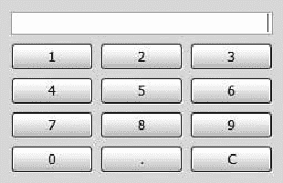
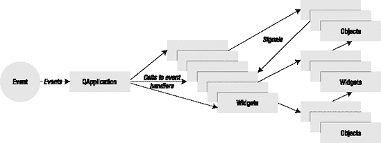
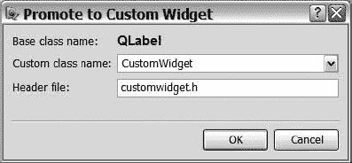
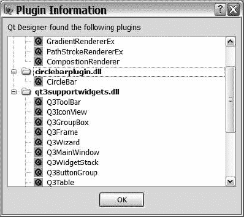

## 六、创建小部件

**T** 术语*小部件*是组成应用程序的各种视觉元素的统称:按钮、标题栏、文本框、复选框等等。关于使用窗口小部件创建用户界面，有两种观点:要么坚持使用标准的窗口小部件，要么冒险创建自己的窗口小部件。Qt 两者都支持。

除非你有深奥的需求，否则你应该尽可能地坚持使用既定的小部件。当您使用 Qt 时，这让您的生活变得非常简单，因为标准的小部件在大多数平台上都是原生的。但是，如果你想在野外行走，你可以利用 Qt 出色的造型能力，继承小部件并覆盖它们的绘画；或者简单地创建自己的小部件。在某些情况下，您需要这样做，因为您的应用程序处理无法以其他方式显示的数据。本章向您展示了如何调整和创建小部件来满足您自己的需求。

### 编写小工具

你每次都以同样的方式组合相同的部件吗？复合小部件会有所帮助。一个*复合小部件*是通过组合已经存在的小部件并为它们提供一组良好的属性、信号和插槽来构建的。

例如，键盘很难管理。[图 6-1](#a_keypad_made_from_a_qlineedit_and_a_set) 显示了一个由一串`QPushButton`和一个`QLineEdit`组成的小键盘。设置它包括创建一个网格布局，将小部件放入布局中，然后进行连接以使事情正常工作。



**图 6-1。** *由一个* `QLineEdit` *和一组* `QPushButton` *小工具*组成的小键盘

让我们看看小部件集合的哪些部分是“有趣的”，哪些部分是“不有趣的”(“不有趣”类别中的所有内容都是不必要的复杂)。这种复杂性可以通过创建复合小部件来隐藏。

应用程序的其余部分需要知道`QLineEdit`的文本；其他一切只是混淆了你的应用程序的源代码。清单 6-1 展示了`NumericKeypad`类的类声明。如果您关注信号和公共部分，您会发现文本是所有可用的内容。私有部分涉及小部件的内部:文本、行编辑和一个用于捕捉按钮输入的槽。

**清单 6-1。** *复合小部件*的类声明`NumericKeypad`

```cpp
class NumericKeypad : public QWidget

{

  Q_OBJECT

public:

  NumericKeypad( QWidget *parent = 0 );

  const QString& text() const;

public slots:

  void setText( const QString &text );

signals:

  void textChanged( const QString &text );

private slots:

  void buttonClicked( const QString &text );

private:

  QLineEdit *m_lineEdit;

  QString m_text

};
```

在了解如何管理文本之前，您应该了解小部件是如何构造的。您可以从类声明中看出这个小部件是基于一个`QWidget`的。在构造器中，一个布局被应用到`QWidget`(`this`)；然后将`QLineEdit`和`QPushButton`小部件放到布局中。源代码如[清单 6-2](#creating_and_laying_out_the_buttons_in_t) 所示。

**清单 6-2。** *在构造器中创建和布局按钮*

```cpp
NumericKeypad::NumericKeypad( QWidget *parent )

{

  QGridLayout *layout = new QGridLayout( this );

  m_lineEdit = new QLineEdit

  m_lineEdit->setAlignment( Qt::AlignRight );

  QPushButton *button0 = new QPushButton( tr("0") );

  QPushButton *button1 = new QPushButton( tr("1") );

...

  QPushButton *buttonDot = new QPushButton( tr(".") );

  QPushButton *buttonClear = new QPushButton( tr("C") );

  layout->addWidget( m_lineEdit, 0, 0, 1, 3 );

  layout->addWidget( button1, 1, 0 );

  layout->addWidget( button2, 1, 1 );

...

  layout->addWidget( buttonDot, 4, 1 );

  layout->addWidget( buttonClear, 4, 2 );

...

}
```

您可能会发现前一个示例中遗漏的构造器部分更有趣。每个`QPushButton`对象，除了 C 按钮，都使用`QSignalMapper`的`setMapping(QObject *, const QString&)`方法映射到一个`QString`。设置好所有映射后，来自按钮的`clicked()`信号都连接到信号映射器的`map()`插槽。调用`map`时，信号映射器会查看信号发送器，通过`mapped(const QString&)`信号发出映射后的字符串。该信号依次连接到`this`的`buttonClicked(const QString&)`插槽。你可以在清单 6-3 中看到这是如何设置的。

清单还显示 C 按钮的`clicked`信号被映射到`QLineEdit`的`clear`槽，`QLineEdit`的`textChanged`信号被连接到小键盘小部件的`setText`方法。这意味着单击 C 按钮会清除文本；对`QLineEdit`的任何更改——无论是通过用户交互还是按下 C 按钮——都会更新`NumericKeypad`对象的文本。

**清单 6-3。** *在构造器中设置信号映射*

```cpp
NumericKeypad::NumericKeypad( QWidget *parent )

{

...

  layout->addWidget( buttonDot, 4, 1 );

  layout->addWidget( buttonClear, 4, 2 );

  QSignalMapper *mapper = new QSignalMapper( this );

  mapper->setMapping( button0, "0" );

  mapper->setMapping( button1, "1" );

...

  mapper->setMapping( button9, "9" );

  mapper->setMapping( buttonDot, "." );

  connect( button0, SIGNAL(clicked()), mapper, SLOT(map()) );

  connect( button1, SIGNAL(clicked()), mapper, SLOT(map()) );

...

  connect( button9, SIGNAL(clicked()), mapper, SLOT(map()) );

  connect( buttonDot, SIGNAL(clicked()), mapper, SLOT(map()) );

  connect( mapper, SIGNAL(mapped(QString)), this, SLOT(buttonClicked(QString)) );

  connect( buttonClear, SIGNAL(clicked()), m_lineEdit, SLOT(clear()) );

  connect( m_lineEdit, SIGNAL(textChanged(QString)), this, SLOT(setText(QString)) );

}
```

处理文本变化的插槽如清单 6-4 中的[所示。`buttonClicked`槽只是将新文本附加到当前文本的末尾，当前文本保存在`QString`变量`m_text`中。文本保存在一个单独的字符串中，而不仅仅是保存在`QLineEdit`中，因为用户可以通过在编辑器中键入来直接更改文本。如果做了这样的改变，你无法判断`setText`的电话是否相关，因为你无法比较当前文本和新文本。这可能导致`textChanged`方法在没有实际变化发生的情况下被发出。](#handling_changes_of_the_text)

* * *

**提示**您可以通过将文本编辑器的 enabled 属性设置为`false`来解决这个问题，但是这会导致编辑器看起来不一样。

* * *

**清单 6-4。** *处理文字的变化*

```cpp
void NumericKeypad::buttonClicked( const QString &newText )

{

  setText( m_text + newText );

}

void NumericKeypad::setText( const QString &newText )

{

  if( newText == m_text )

    return;

  m_text = newText;

  m_lineEdit->setText( m_text );

  emit textChanged( m_text );

}
```

`setText`槽从检查是否发生了实际变化开始。如果是这样，内部文本和`QLineEdit`文本都会被更新。然后发出带有新文本的`textChanged`信号。

任何对`QLineEdit`的文本感兴趣的外部小部件都可以连接到`textChanged`信号或者通过调用`text`方法来询问。如[清单 6-5](#returning_the_current_text) 所示，这个方法很简单——它返回`m_text`。

**清单 6-5。** *返回当前文本*

```cpp
const QString& NumericKeypad::text() const

{

  return m_text;

}
```

使用复合小部件和使用普通小部件一样简单。在清单 6-6 中，你可以看到如何使用`NumericKeypad`小部件。键盘放在一个标签上只是为了测试`textChanged`信号。标签的`setText`插槽连接到键盘的`textChanged`信号。[图 6-2](#the_composite_widget_live) 显示了实际应用。`QLineEdit`的文字始终通过`QLabel`反映出来。

**清单 6-6。** *使用* `NumericKeypad` *控件*

```cpp
int main( int argc, char **argv )

{

  QApplication app( argc, argv );

  QWidget widget;

  QVBoxLayout *layout = new QVBoxLayout( &widget );

  NumericKeypad pad;

  layout->addWidget( &pad );

  QLabel *label = new QLabel;

  layout->addWidget( label );

  QObject::connect( &pad, SIGNAL(textChanged(const QString&)),

                    label, SLOT(setText(const QString&)) );

  widget.show();

  return app.exec();

}

```


**图 6-2。** *复合小部件直播*

编写小部件有很多好处。使用带有`main`功能的`NumericKeypad`小部件比在那里配置所有按钮和`QLineEdit`小部件要容易得多。此外，信号和插槽创建了一个很好的界面来连接键盘和其他小部件。

后退一步，看看小部件本身——您会发现组件远比如何设置解决方案的知识更具可重用性。这使得它更有可能在应用程序中的更多地方使用(或在更多应用程序中使用)。一旦您使用它两次，您将节省开发时间和精力，因为您只需要设置一次信号映射器。您也知道它是可行的，因为您已经验证过一次了——省去了您定位 bug 的问题。

#### **改变和增强小工具**

定制小部件的另一种方法是改变或增强它们的行为。比如一个`QLabel`可以做出一个很棒的数字时钟小部件；缺少的只是用当前时间更新文本的部分。由此产生的小部件可以在图 6-3 的[中看到。](#a_label_acting_as_a_clock)


**图 6-3。** *一个充当时钟的标签*

通过使用已经存在的小部件作为新小部件的起点，您可以避免开发绘制、大小提示等所需的所有逻辑。相反，您可以专注于用您需要的功能来增强小部件。让我们看看这是如何做到的。

首先，必须有一种方法以均匀的间隔检查时间，例如每秒一次。每次检查时，文本都必须更新为当前时间。要查看每秒钟的时间，可以使用一个`QTimer`。可以设置一个定时器对象，在给定的时间间隔发出`timeout`信号。通过将此信号连接到时钟标签的一个插槽，您可以检查时间并每秒相应地更新文本。

[清单 6-7](#the_clocklabel_class_declaration) 显示了`ClockLabel`小部件的类声明。它有一个槽，`updateTime`，和一个构造器。这(和继承`QLabel`)就是实现这个定制行为所需要的全部。

**清单 6-7。***`ClockLabel`*类声明**

*`class ClockLabel : public QLabel
{
  Q_OBJECT
public:
  ClockLabel( QWidget *parent = 0 );

private slots:
  void updateTime();
};`

你可以在[清单 6-8](#the_clocklabel_implementation) 中看到`ClockLabel`小部件的实现。从底部开始，`updateTime()`槽非常简单——它所做的只是将文本设置为当前时间。`QTime::toString()`方法根据格式化字符串将时间转换为字符串，其中`hh`表示当前小时，`mm`表示分钟。

在构造器中创建了一个`QTimer`对象。间隔(发出`timeout`信号的频率)设置为 1000 毫秒(1 秒)。

* * *

**提示**将毫秒数除以 1000，得到相等的秒数。1000 毫秒相当于 1 秒。

* * *

当定时器的时间间隔设定后，定时器的`timeout()`信号在定时器启动前连接到`this`的`updateTime`信号。`QTimer`物体必须在开始周期性发射`timeout`信号之前启动。使用`stop()`方法关闭信号发射。这意味着您可以设置一个计时器，然后根据应用程序的当前状态打开和关闭它。

* * *

**注意** `QTimer`对象对于用户界面等来说已经足够好了，但是如果你正在开发一个需要精确计时的应用程序，你必须使用另一种解决方案。间隔的准确性取决于应用程序运行的平台。

* * *

在构造器完成之前，对`updateTime`进行显式调用，这确保了文本立即更新。否则，在文本更新之前需要一秒钟，用户将能够在短时间内看到未初始化的小部件。

**清单 6-8。***`ClockLabel`*实现**

```cpp
ClockLabel::ClockLabel( QWidget *parent ) : QLabel( parent )

{

  QTimer *timer = new QTimer( this );

  timer->setInterval( 1000 );

  connect( timer, SIGNAL(timeout()), this, SLOT(updateTime()) );

  timer->start();

  updateTime();

}

void ClockLabel::updateTime()

{

  setText( QTime::currentTime().toString( "hh:mm" ) );

}
```

有时你可能想增强一个现有的部件；例如，您可能希望一个插槽接受另一种类型的参数，或者在缺少插槽的地方。您可以继承基本小部件，添加插槽，然后使用结果类而不是原始类。

#### **抓捕事件**

小部件通过提供对触发信号和提供交互的实际用户生成事件的访问，为处理用户动作提供了催化剂。事件是用户给计算机的原始输入。通过对这些事件作出反应，用户界面可以与用户交互并提供预期的功能。

事件由事件处理程序处理，事件处理程序是虚拟的受保护方法，当小部件类需要对给定事件做出反应时，它们会覆盖这些方法。每个事件都伴随着一个事件对象。所有事件类的基类是`QEvent`，它使接收者能够接受或忽略使用相同名称的方法的事件。被忽略的事件可以通过 Qt 传播到父部件。

[图 6-4](#user_actions_passing_the_qapplication_ob) 显示了`QApplication`接收到的触发事件的用户动作。这些事件导致应用程序调用受影响的小部件，小部件对事件做出反应，并在必要时发出信号。



**图 6-4。** *用户动作在到达小部件之前通过* `QApplication` *对象，并触发驱动应用程序的信号*

**监听用户**

为了更好地理解事件处理是如何工作的，您可以创建一个小部件，它发出一个带有字符串的信号，告诉您刚刚收到了哪个事件。widget 类叫做`EventWidget`，信号叫做`gotEvent(const QString &)`。通过将这个信号与一个`QTextEdit`挂钩，您可以获得一个事件日志，您可以使用它来研究这些事件。

首先快速浏览一下[清单 6-9](#the_eventwidget_implements_most_event_ha) 。`EventWidget`有一系列的事件处理程序，下面的列表描述了每个事件处理程序的职责。这些事件处理方法是一些最常见的方法，但还有更多。在列表的每一行中，我保留了事件对象类型和事件名称，这样您就可以看到哪些事件是相关的。例如，所有焦点事件都将一个`QFocusEvent`指针作为参数。

*   `closeEvent( QCloseEvent* )`:小部件即将关闭。(你在[第 4 章](04.html#the_main_window)中看到了这是如何使用的。)
*   `contextMenuEvent( QContextMenuEvent* )`:请求上下文菜单。
*   `enterEvent( QEvent* )`:鼠标指针已经进入小部件。
*   `focusInEvent( QFocusEvent* )`:小工具获得焦点。
*   `focusOutEvent( QFocusEvent* )`:焦点离开小工具。
*   `hideEvent( QHideEvent* )`:小工具即将被隐藏。
*   `keyPressEvent( QKeyEvent* )`:键盘按键被按下。
*   `keyReleaseEvent( QKeyEvent* )`:释放了一个键盘键。
*   `leaveEvent( QEvent* )`:鼠标指针离开了小工具。
*   `mouseDoubleClickEvent( QMouseEvent* )`:鼠标按钮被双击。
*   `mouseMoveEvent( QMouseEvent* )`:鼠标在小工具上移动。
*   `mousePressEvent( QMouseEvent* )`:鼠标按钮被按下。
*   `mouseReleaseEvent( QMouseEvent* )`:鼠标按钮已被释放。
*   小工具需要重新绘制。
*   `resizeEvent( QResizeEvent* )`:小工具已调整大小。
*   `showEvent( QShowEvent* )`:即将显示小工具。
*   `wheelEvent( QWheelEvent* )`:鼠标滚动视图被移动。

在前面的列表中，您可以看到相关事件共享事件对象类型。例如，所有鼠标事件——比如按下、释放、移动和双击——都需要一个`QMouseEvent`。

只有一个`QEvent`的事件可以被认为是简单的通知。在`QEvent`对象中没有携带额外的信息，所以只需要知道事件发生了。因为`QEvent`是所有事件类的基类，所以共享`QEvent`作为事件对象类型的事件处理程序不像鼠标事件那样相关。

一些事件处理程序被排除在列表和`EventWidget`类之外。尽管缺少的处理程序并没有降低相关性，但是它们与类中使用的处理程序并没有显著的不同。

**清单 6-9。***`EventWidget`*实现了大多数事件处理程序，并为每个事件发出* `gotEvent` *信号。**

```cpp
class EventWidget : public QWidget

{

  Q_OBJECT

public:

  EventWidget( QWidget *parent = 0 );

signals:

  void gotEvent( const QString& );

protected:

  void closeEvent( QCloseEvent * event );

  void contextMenuEvent( QContextMenuEvent * event );

  void enterEvent( QEvent * event );

  void focusInEvent( QFocusEvent * event );

  void focusOutEvent( QFocusEvent * event );

  void hideEvent( QHideEvent * event );

  void keyPressEvent( QKeyEvent * event );

  void keyReleaseEvent( QKeyEvent * event );

  void leaveEvent( QEvent * event );

  void mouseDoubleClickEvent( QMouseEvent * event );

  void mouseMoveEvent( QMouseEvent * event );

  void mousePressEvent( QMouseEvent * event );

  void mouseReleaseEvent( QMouseEvent * event );

  void paintEvent( QPaintEvent * event );

  void resizeEvent( QResizeEvent * event );

  void showEvent( QShowEvent * event );

  void wheelEvent( QWheelEvent * event );

};
```

在继续查看事件处理程序之前，先看一下`main`函数，它显示了带有日志的小部件。源代码如[清单 6-10](#creating_a_log_widget_and_an_eventwidget) 所示。日志显示在一个`QTextEdit`小部件中，`gotEvent`信号连接到日志的`append(const QString&)`槽。这是显示小部件和运行应用程序之前需要做的所有准备工作。

**清单 6-10。** *创建一个日志小工具和一个* `EventWidget` *并使用它们*

```cpp
int main( int argc, char **argv )

{

  QApplication app( argc, argv );

  QTextEdit log;

  EventWidget widget;

  QObject::connect( &widget, SIGNAL(gotEvent(const QString&)),

                    &log, SLOT(append(const QString&)) );

  log.show();

  widget.show();

  return app.exec();

}
```

当应用程序运行时，日志窗口显示在包含事件小部件的窗口旁边。示例日志如图 6-5 中的[所示。列出所有事件，并显示某些事件的选定参数。例如，`QKeyEvent`事件显示文本，而`QMouseEvent`事件显示指针位置。](#a_log_from_the_eventwidget)


**图 6-5。** *来自* `EventWidget`

[清单 6-11](#a_simple_event_handling_method) 提供了一个`closeEvent`处理程序的例子。`enterEvent`、`leaveEvent`、`showEvent`、`hideEvent`和`paintEvent`处理程序都只是记录事件的名称。show、hide 和 paint 事件有自己的事件对象类型。`QShowEvent`和`QHideEvent`类不向`QEvent`类添加任何东西。`QPaintEvent`确实增加了很多信息(在本章的后面你会更仔细地观察这个事件)。

**清单 6-11。** *一种简单的事件处理方法*

```cpp
void EventWidget::closeEvent( QCloseEvent * event )

{

  emit gotEvent( tr("closeEvent") );

}

```

**处理键盘事件**

处理键盘活动的事件是`keyPressEvent`和`keyReleaseEvent`。它们看起来都很相似，所以在清单 6-12 中只显示了`keyPressEvent`。因为大多数现代环境支持自动重复键，所以在看到 `keyReleaseEvent`之前，您可能会得到几个`keyPressEvent`。您通常不能指望看到`keyReleaseEvent`——用户可能会在释放按键之前在部件之间移动焦点(使用鼠标)。

如果您需要确保您的小部件获得所有键盘事件的*，请使用`grabKeyboard`和`releaseKeyboard`方法。当一个小部件抓取键盘时，所有的按键事件都会发送给它，不管哪个小部件当前拥有焦点。*

清单中的事件处理程序显示了修饰键和被按下的键的文本。修改器存储为一个位掩码，几个修改器可以同时激活。

**清单 6-12。** *一个键盘事件的处理方法*

`void EventWidget::keyPressEvent( QKeyEvent * event )
{
  emit gotEvent( QString("keyPressEvent( text:%1, modifiers:%2 )")
    .arg( event->text() )
    .arg( event->modifiers()==0?tr("NoModifier"):(
         (event->modifiers() & Qt::ShiftModifier      ==0 ? tr(""):
            tr("ShiftModifier "))+
         (event->modifiers() & Qt::ControlModifier    ==0 ? tr(""):
            tr("ControlModifier "))+
         (event->modifiers() & Qt::AltModifier        ==0 ? tr(""):
            tr("AltModifier "))+
         (event->modifiers() & Qt::MetaModifier       ==0 ? tr(""):
            tr("MetaModifier "))+
         (event->modifiers() & Qt::KeypadModifier     ==0 ? tr(""):
            tr("KeypadModifier "))+
         (event->modifiers()&Qt::GroupSwitchModifier  ==0 ? tr(""):
            tr("GroupSwitchModifier")) ) ) );
}`

**处理鼠标事件**

当用户试图调出*上下文菜单*(右键单击某个东西时出现的菜单——通常提供剪切、复制和粘贴等操作)时，就会触发上下文菜单事件。鼠标和键盘都可以触发该事件。事件对象包含请求的来源(`reason`)和事件发生时鼠标指针的坐标。处理程序如清单 6-13 中的[所示。如果上下文菜单事件被忽略，它将被重新解释并作为鼠标事件发送(如果可能)。](#a_context_menu_has_been_requested)

所有带有鼠标位置的事件对象都有`pos()`和`globalPos()`方法。`pos`方法是小部件本地坐标中的位置，这有利于更新小部件本身。如果您想在事件发生的位置创建一个新的小部件，您需要使用全局坐标。位置由`x`和`y`坐标组成，可以通过`x`、`y`、`globalX`和`globalY`方法直接从事件对象中获取。

**清单 6-13。** *已请求上下文菜单。*

```cpp
void EventWidget::contextMenuEvent( QContextMenuEvent * event )

{

  emit gotEvent( QString("contextMenuEvent( x:%1, y:%2, reason:%3 )")

    .arg(event->x())

    .arg(event->y())

    .arg(event->reason()==QContextMenuEvent::Other ? "Other" :

         (event->reason()==QContextMenuEvent::Keyboard ? "Keyboard" :

                            "Mouse")) );

}
```

上下文菜单事件携带鼠标位置，就像`QMouseEvent`一样。鼠标事件有`mousePressEvent`、`mouseReleaseEvent`、`mouseMoveEvent`和`mouseDoubleClickEvent`。你可以在清单 6-14 中看到后者。处理器显示`button`以及`x`和`y`坐标。

在处理鼠标事件时，重要的是要理解只有当鼠标按钮被按下时，移动事件才会被发送。如果您需要随时获取移动事件，您必须使用`mouseTracking`属性启用鼠标跟踪。

如果你想得到所有的鼠标事件，你可以像使用键盘一样使用鼠标。为此使用方法`grabMouse()`和`releaseMouse()`。只是要小心，因为当鼠标被抓取时发生的错误会阻止所有应用程序的鼠标交互。规则是只在必要时抓取，尽快释放，并且永远不要忘记释放鼠标。

**清单 6-14。** *一个鼠标事件的处理方法*

```cpp
void EventWidget::mouseDoubleClickEvent( QMouseEvent * event )

{

  emit gotEvent( QString("mouseDoubleClickEvent( x:%1, y:%2, button:%3 )")

    .arg( event->x() )

    .arg( event->y() )

    .arg( event->button()==Qt::LeftButton? "LeftButton":

          event->button()==Qt::RightButton?"RightButton":

          event->button()==Qt::MidButton?  "MidButton":

          event->button()==Qt::XButton1?   "XButton1":

                                           "XButton2" ) );

}
```

**使用鼠标滚轮**

鼠标滚轮通常被认为是鼠标的一部分，但是事件有一个单独的事件对象。该对象包含事件发生时鼠标指针的位置，以及滚轮的方向和滚动的大小(`delta`)。事件处理程序如清单 6-15 中的[所示。](#the_wheel_is_separate_from_the_rest_of_t)

鼠标滚轮事件首先被发送到鼠标指针下的小部件。如果它没有在那里被处理，它将被传递给具有焦点的小部件。

**清单 6-15。** *轮子与鼠标的其他部分是分开的。*

```cpp
void EventWidget::wheelEvent( QWheelEvent * event )

{

  emit gotEvent( QString("wheelEvent( x:%1, y:%2, delta:%3, orientation:%4 )")

    .arg( event->x() )

    .arg( event->y() )

    .arg( event->delta() ).arg( event->orientation()==Qt::Horizontal?

      "Horizontal":"Vertical" ) );

}
```

在`EventWidget`类中实现了更多的事件处理程序。通过在小部件上尝试不同的东西，然后研究日志，您可以了解很多关于小部件的信息。

**过滤事件**

创建事件过滤器比继承小部件类和覆盖事件处理类更容易。一个*事件过滤器*是一个继承`QObject`的类，它实现了`eventFilter(QObject*, QEvent*)`方法。该方法使得在事件到达目的地之前拦截它们成为可能。然后可以过滤事件(允许通过或停止)。

事件过滤器可用于实现许多特殊功能，如鼠标手势和识别按键序列。它们可以用来增强小部件或改变小部件的行为，而不必对小部件进行子类化。

让我们尝试一个事件过滤器，从事件队列中删除任何数字键按压。该类的声明和实现如清单 6-16 所示。有趣的部分是`eventFilter`方法，它有两个参数:指向目的地`QObject` ( `dest`)的指针和指向`QEvent`对象(`event`)的指针。通过使用`type`检查事件是否是按键事件，您知道`event`指针可以被转换为`QKeyEvent`指针。`QKeyEvent`类有一个 text 方法，您可以用它来确定按下的键是否是一个数字。

如果按键来自数字键，则返回`true`，表示过滤器处理了该事件。这将阻止事件到达目标对象。对于所有其他事件，将返回基类实现的值，这将导致要么由基类筛选器处理事件，要么让它通过最终的目标对象。

**清单 6-16。** *事件过滤类* `KeyboardFilter` *停止按键为数字键。*

```cpp
class KeyboardFilter : public QObject

{

public:

  KeyboardFilter( QObject *parent = 0 ) : QObject( parent ) {}

protected:

  bool eventFilter( QObject *dist, QEvent *event )

  {

    if( event->type() == QEvent::KeyPress )

    {

      QKeyEvent *keyEvent = static_cast<QKeyEvent*>( event );

              static QString digits = QString("1234567890");

      if( digits.indexOf( keyEvent->text() ) != −1 )

        return true;

    }

    return QObject::eventFilter(dist, event);

  }

};
```

为了测试事件过滤器，你可以把它安装在一个`QLineEdit`(它的源代码显示在[清单 6-17](#to_use_an_event_filter_comma_you_must_in) )上。像任何其他对象一样创建`QLineEdit`和`KeyboardFilter`对象。然后在编辑器显示之前，使用`installEventFilter(QObject*)`在编辑行上安装过滤器。

**清单 6-17。** *要使用事件过滤器，必须将其安装在 widget 上。然后，该小部件的事件通过过滤器传递。*

```cpp
int main( int argc, char **argv )

{

  QApplication app( argc, argv );

  QLineEdit lineEdit;

  KeyboardFilter filter;

  lineEdit.installEventFilter( &filter );

  lineEdit.show();

  return app.exec();

}
```

尝试使用行编辑。按键被过滤，但是仍然可以使用剪贴板将数字强制输入到编辑器中。您在实现和应用事件过滤器时必须小心——可能会有难以预见的副作用。

如果您在设计过滤器时非常小心，您可以通过过滤、响应和重定向事件来增强应用程序，从而使用户的交互更加容易。例如，在绘图区域捕捉键盘事件，将它们重定向到文本编辑器，并移动焦点。这使得用户无需在输入文本之前点击文本编辑器，使得应用程序更加用户友好。

#### **从头开始创建定制小工具**

当其他方法都不起作用时，或者如果您选择遵循一种不同的方法，您可能会陷入这样的境地:您必须创建自己的小部件。创建一个定制的小部件包括实现一个信号和插槽的接口，以及一组适用的事件处理程序。

为了向你展示这是如何做到的，我将通过`CircleBar`小部件来指导你(见[图 6-6](#the_circlebar_widget_and_a_horizontal_sl) )。图中所示的应用程序在水平滑块上有一个`CircleBar`小部件。移动滑块会更改圆栏的值，当鼠标悬停在圆栏小工具上时旋转鼠标滚轮也是如此。

`CircleBar`控件的功能是通过改变实心圆的大小来显示 0 到 100 之间的值。一个完整的圆圈表示 100，而中间的圆点表示 0。用户可以使用鼠标滚轮更改显示的值。


**图 6-6。***`CircleBar`*小部件和一个水平滑块**

 *`main`函数，如[清单 6-18](#setting_up_the_circlebar_and_the_slider) 所示，设置滑块和圆形条。代码首先为保存滑块和圆形条的`QVBoxLayout`创建一个基本小部件。滑动条和圆形条相互连接，因此来自其中一个的`valueChanged`信号导致对另一个的`setValue`调用。然后在应用程序启动前显示基本小部件。

**清单 6-18。** *设置* `CircleBar` *和滑块*

```cpp
int main( int argc, char **argv )

{

  QApplication app( argc, argv );

  QWidget base;

  QVBoxLayout *layout = new QVBoxLayout( base );

  CircleBar *bar = new CircleBar;

  QSlider *slider = new QSlider( Qt::Horizontal );

  layout->addWidget( bar );

  layout->addWidget( slider );

  QObject::connect( slider, SIGNAL(valueChanged(int)), bar, SLOT(setValue(int)) );

  QObject::connect( bar, SIGNAL(valueChanged(int)), slider, SLOT(setValue(int)) );

  base.show();

  return app.exec();

}
```

从`main`函数中你可以看到`CircleBar`小部件需要一个`setValue(int)`插槽和一个`valueChanged(int)`信号。为了使接口完整，还需要有一个`value`方法来读取值。

因为小部件是由代码绘制的，所以`paintEvent`需要重新实现。您还需要重新实现`wheelEvent`,因为您想要监听鼠标滚轮的活动。我选择添加一个`heightForWidth`函数，它将用于保持窗口小部件的方形，以及一个`sizeHint`方法，它给了窗口小部件一个很好的起始尺寸。

清单 6-19 中的[类声明总结了所有这些。](#the_class_declaration_of_the_circlebar_w)

**清单 6-19。***`CircleBar`*控件类*的类声明*

```cpp
class CircleBar : public QWidget

{

  Q_OBJECT

public:

  CircleBar( int value = 0, QWidget *parent = 0 );

  int value() const;

  int heightForWidth( int ) const;

  QSize sizeHint() const;

public slots:

  void setValue( int );

signals:

  void valueChanged( int );

protected:

  void paintEvent( QPaintEvent* );

  void wheelEvent( QWheelEvent* );

private:

  int m_value;

};
```

清单 6-20 中[所示的`CircleBar`类的构造器首先初始化保存在`m_value`成员中的内部值。它还创建了一个新的大小策略，该策略在两个方向上都是首选的，并告诉布局管理系统监听`heightForWidth`方法。](#the_constructor_of_the_circlebar_widget)

**清单 6-20。***`CircleBar`*构件**

```cpp
CircleBar::CircleBar( int value, QWidget *parent ) : QWidget( parent )

{

  m_value = value;

  QSizePolicy policy( QSizePolicy::Preferred, QSizePolicy::Preferred );

  policy.setHeightForWidth( true );

  setSizePolicy( policy );

}
```

大小策略伴随着返回首选小部件大小的`heightForWidth(int)`方法和`sizeHint`方法。这些方法的实现如清单 6-21 所示。`heightForWidth`方法将宽度作为参数，并将想要的高度返回给布局管理器。`CircleBar`类中使用的实现将以高度的形式返回给定的宽度，从而得到一个正方形小部件。

**清单 6-21。** *尺寸处理方法*

```cpp
int CircleBar::heightForWidth( int width ) const

{

  return width;

}

QSize CircleBar::sizeHint() const

{

  return QSize( 100, 100 );

}
```

处理值`value()`和`setValue`的方法如[列表 6-22](#handing_the_value_of_the_circlebar_widge) 所示。`value`方法很简单——它简单地返回`m_value`。在检查是否发生变化之前，`setValue`方法将值限制在 0-100 的范围内。如果是，则在调用`update`并发出`valueChanged`信号之前更新`m_value`。

通过调用`update()`，重画事件被触发，这导致对`paintEvent`的调用。请记住，您不能在`paintEvent`方法之外绘制小部件。相反，调用`update`然后从`paintEvent`方法处理绘画。

**清单 6-22。** *移交* `CircleBar` *小部件的值*

```cpp
int CircleBar::value() const

{

  return m_value;

}

void CircleBar::setValue( int value )

{

  if( value < 0 )

    value = 0;

  if( value > 100 )

    value = 100;

  if( m_value == value )

    return;

  m_value = value;

  update();

  emit valueChanged( m_value );

}
```

在[清单 6-23](#painting_the_outer_and_inner_circles) 中，你可以看到`paintEvent`方法的实现。在看代码之前，您应该知道`autoFillBackground`属性是如何工作的。只要它被设置为`true`(默认)，在进入`paintEvent`方法之前，小部件的背景就用适当的颜色填充。这意味着我们不必担心在绘制之前清除小部件的区域。

在`paintEvent`方法中计算`radius`和`factor`辅助变量。然后创建一个`QPainter`对象来绘制小部件。先将钢笔设置为黑色，画外圆；然后笔刷设置为黑色，画内圆。钢笔用来画圆的轮廓；笔刷是用来填充的。默认情况下，两者都设置为不绘制任何内容，因此仅在绘制外圆之前设置笔会给出一个圆轮廓。

**清单 6-23。** *画外圆和内圆*

```cpp
void CircleBar::paintEvent( QPaintEvent *event )

{

  int radius = width()/2;

  double factor = m_value/100.0;

  QPainter p( this );

  p.setPen( Qt::black );

  p.drawEllipse( 0, 0, width()-1, width()-1 );

  p.setBrush( Qt::black );

  p.drawEllipse( (int)(radius*(1.0-factor)),

                 (int)(radius*(1.0-factor)),

                 (int)((width()-1)*factor)+1,

                 (int)((width()-1)*factor)+1 );

}
```

`CircleBar`小部件的最后一部分是`wheelEvent`方法(见[清单 6-24](#updating_the_value_from_scroll_wheel_mov) )。首先，在使用`setValue`更新值之前，事件被接受。

`QWheelEvent`对象的`delta`值表示滚动移动了多少度。大多数鼠标一次滚动 15 度，因此滚轮上的每次“点击”对应 120 度的增量。我选择将 delta 值除以 20，然后用它来改变值。我凭感觉选择了值 20——该条的大小调整得足够快，同时仍能提供足够的精度。

**清单 6-24。** *根据滚轮移动更新数值*

```cpp
void CircleBar::wheelEvent( QWheelEvent *event )

{

  event->accept();

  setValue( value() + event->delta()/20 );

}
```

定制小部件由两部分组成:对应用程序其余部分可见的属性(`value`和`setValue`)和事件处理程序(`paintEvent`和`wheelEvent`)。几乎所有的定制窗口小部件都重新实现了`paintEvent`方法，而其余要重新实现的事件处理程序是通过确定哪些是实现所需功能所需要的来挑选的。

### 您的部件和设计者

在您创建了自己的小部件之后，您可能希望将它与 Designer 集成在一起。这样做的好处是，您不会因为使用定制的小部件而被迫离开设计器工作流。另一个好处是，如果你为其他人开发小部件，你可以让他们使用你的小部件和标准的 Qt 小部件。

将小部件与设计器集成有两种方法:一种简单的方法和一种复杂的方法。比较这两种方法，简单的方法在使用 Designer 时需要做更多的工作，而复杂的方法可以与 Designer 无缝集成。让我们从简单的方法开始。

#### **晋级**

您可以使用您在本章前面创建的`ClockWidget`来测试将您的小部件与 Designer 集成的推广方式。因为它是基于一个`QLabel`，所以在你正在设计的表单上画一个`QLabel`。现在调出标签的上下文菜单，并选择“升级到自定义小部件”菜单项，这将调出如图 6-7 所示的对话框。该图形有一个类名—头文件名称由设计器自动猜测。



**图 6-7。** *将一个* `QLabel` *提升为一个* `ClockWidget`

为了能够使用 Designer 的这一特性，您必须提供一个采用`QWidget`指针的构造器，并使 make 系统可以访问包含文件。这可以通过 QMake 项目文件中的`INCLUDEPATH`变量来完成。

重要的是选择一个在定制部件继承树中的部件，以确保 Designer 中显示的所有属性都可以用于您的部件。用户界面编译器生成代码，用于设置设计器中标记为粗体的所有属性。在[图 6-8](#the_properties_marked_as_bold_will_be_se) 所示的属性框中，将设置`objectName`、`geometry`、`text`和`flat`属性。这意味着如果您升级小部件，您的小部件需要有`setObjectName`、`setGeometry`、`setText`和`setFlat`方法。如果您选择从自定义小部件的继承树中升级小部件，您可以通过继承免费获得这些方法。


**图 6-8。** *标记为粗体的属性将在* `uic`生成的代码中设置。

#### **提供插件**

如果你花稍微多一点的时间实现一个在 Designer 中工作的插件，你可以跳过 Designer 中的提升方法。相反，您的小部件将与所有其他小部件一起出现在小部件框中。

为 Designer 创建一个插件几乎是一个复制粘贴的工作。在开始创建插件之前，您必须对小部件类声明做一个小小的修改。(对于插件，您将使用本章前面开发的`CircleBar`小部件。)类声明如清单 6-25 中的[所示。变化的前半部分是添加了`QDESIGNER_WIDGET_EXPORT`宏，这确保了该类可以在 Qt 支持的所有平台上的插件中使用。另一半是添加一个以父代作为参数的构造器。这是从`uic`生成的代码工作所需要的。](#changes_to_the_circlebar_class)

**清单 6-25。** *修改为* `CircleBar` *类*

```cpp
class QDESIGNER_WIDGET_EXPORT CircleBar : public QWidget

{

  Q_OBJECT

public:

  CircleBar( QWidget *parent = 0 );

  CircleBar( int value = 0, QWidget *parent = 0 );

  int value() const;

  int heightForWidth( int ) const;

  QSize sizeHint() const;

public slots:

  void setValue( int );

signals:

  void valueChanged( int );

protected:

  void paintEvent( QPaintEvent* );

  void wheelEvent( QWheelEvent* );

private:

  int m_value;

};
```

现在你可以开始查看[清单 6-26](#the_plugin_class) 中的实际插件了。plugin 类只是由`QDesignerCustomWidgetInterface`类定义的接口的一个实现。所有的方法都必须实现，每个方法的任务都有严格的定义。

`CircleBar`小部件的插件类叫做`CircleBarPlugin`。这是命名小部件插件类的常见方式。

**清单 6-26。** *插件类*

```cpp
#ifndef CIRCLEBARPLUGIN_H

#define CIRCLEBARPLUGIN_H

#include <QDesignerCustomWidgetInterface>

class QExtensionManager;

class CircleBarPlugin : public QObject, public QDesignerCustomWidgetInterface

{

    Q_OBJECT

    Q_INTERFACES(QDesignerCustomWidgetInterface)

public:

    CircleBarPlugin( QObject *parent = 0 );

    bool isContainer() const;

    bool isInitialized() const;

    QIcon icon() const;

    QString domXml() const;

    QString group() const;

    QString includeFile() const;

    QString name() const;

    QString toolTip() const;

    QString whatsThis() const;

    QWidget *createWidget( QWidget *parent );

    void initialize( QDesignerFormEditorInterface *core );

private:

    bool m_initialized;

};

#endif /* CIRCLEBARPLUGIN_H */
```

首先，小部件必须处理一个初始化标志，这是通过构造器和`isInitialized()`和`initialize(QDesignerFormEditorInterface*)`方法完成的。方法如[清单 6-27](#handing_initialization) 所示。您可以看到实现非常简单，可以在所有小部件插件类之间复制和粘贴。

**清单 6-27。** *移交初始化*

```cpp
CircleBarPlugin::CircleBarPlugin( QObject *parent )

{

    m_initialized = false;

}

bool CircleBarPlugin::isInitialized() const

{

    return m_initialized;

}

void CircleBarPlugin::initialize( QDesignerFormEditorInterface *core )

{

    if( m_initialized )

        return;

    m_initialized = true;

}
```

如果你认为初始化标志处理很简单，你会发现清单 6-28 中的方法甚至更简单。方法`isContainer()`、`icon()`、`toolTip()`、`whatsThis()`尽可能少返回。您可以轻松地为您的小部件提供自定义图标、工具提示和这是什么文本。

**清单 6-28。** *返回最不可能的简单方法*

```cpp
bool CircleBarPlugin::isContainer() const

{

    return false;

}

QIcon CircleBarPlugin::icon() const

{

    return QIcon();

}

QString CircleBarPlugin::toolTip() const

{

    return "";

}

QString CircleBarPlugin::whatsThis() const

{

    return "";

}
```

`includeFile()`、`name()`和`domXml()`方法返回从类名构建的标准化字符串。从`name`和`domXml`方法返回相同的类名是很重要的。请注意，该名称区分大小写。你可以在清单 6-29 中看到这些方法。

**清单 6-29。** *返回小部件的 XML、头文件名称和类名*

```cpp
QString CircleBarPlugin::includeFile() const

{

    return "circlebar.h";

}

QString CircleBarPlugin::name() const

{

    return "CircleBar";

}

QString CircleBarPlugin::domXml() const

{

    return "<widget class=\"CircleBar\" name=\"circleBar\">\n"

           "</widget>\n";

}
```

为了控制小部件出现在哪个小部件组中，从`group()`方法返回组名。方法实现如[清单 6-30](#the_group_to_join_in_designer) 所示。

**清单 6-30。** *集团加盟设计师*

```cpp
QString CircleBarPlugin::group() const

{

    return "Book Widgets";

}
```

为了帮助设计者创建一个小部件，你需要实现一个工厂方法，名为`createWidget(QWidget*)`，如清单 6-31 所示。

**清单 6-31。** *创建小工具实例*

```cpp
QWidget *CircleBarPlugin::createWidget( QWidget *parent )

{

    return new CircleBar( parent );

}
```

最后一步是使用`Q_EXPORT_PLUGIN2`宏将插件类实际导出为插件，如[清单 6-32](#exporting_the_plugin) 所示。这一行被添加到实现文件的末尾。

**清单 6-32。** *导出插件*

```cpp
Q_EXPORT_PLUGIN2( circleBarPlugin, CircleBarPlugin )
```

要构建一个插件，你必须创建一个特殊的项目文件，如[清单 6-33](#the_project_file_for_a_designer_plugin) 所示。清单中突出显示了重要的行。他们所做的是告诉 QMake 使用一个模板来构建一个库；然后`CONFIG`行告诉 QMake 你需要`designer`和`plugin`模块。最后一行使用`DESTDIR`变量配置构建的输出，以在正确的位置结束。

**清单 6-33。** *设计器插件的项目文件*

```cpp
TEMPLATE = lib

CONFIG += designer plugin release

DEPENDPATH += .

TARGET = circlebarplugin

HEADERS += circlebar.h circlebarplugin.h

SOURCES += circlebar.cpp circlebarplugin.cpp

DESTDIR = $$[QT_INSTALL_DATA]/plugins/designer
```

构建插件后，您可以通过访问 Help  About Plugins 菜单项来检查 Designer 是否找到了插件。这将弹出如图[图 6-9](img/#the_plugin_has_been_loaded) 所示的对话框。在图中，您可以看到插件已经加载，小部件已经找到。



**图 6-9。** *插件已经加载。*

为 Designer 创建小部件插件只是简单地填写一个给定的界面。这项工作很容易，但也可能相当乏味。

### 总结

自定义小部件使您的应用程序与众不同。您的应用程序将执行的特殊任务通常通过一个特殊的小部件来处理。尽管如此，我还是建议您尽可能选择标准的小部件，因为应用程序的用户很难学会如何使用您的特殊小部件。

设计适合 Qt 编写应用程序方式的小部件并不难。首先，您需要找到一个要继承的小部件——起点。如果没有给定的起点，就得从`QWidget`类开始。

选好合适的切入点后，你必须决定你要关注哪些事件。这有助于您决定要覆盖哪些事件处理函数。事件处理程序可以被认为是您与用户的接口。

当您决定了接口之后，您需要关注应用程序的其余部分，包括 setters、getters、signals 和 slots(以及设置大小策略和创建大小提示)。确保考虑除当前场景之外的使用场景，以使您的小部件可重用。在编写小部件时投入时间可以在未来的项目中帮助您，因为您可以避免一次又一次地重新发明轮子。

在讨论了所有这些软件开发问题之后，我必须强调小部件最重要的方面:可用性。试着从用户的角度思考，确保在把你的设计放到你的产品软件中之前，在真实用户身上测试你的设计。******