## 七、绘图和打印

**Qt 中的一个** ll 绘画是通过`QPainter`类以这样或那样的方式执行的。小部件、图片、代理——一切都使用相同的机制。该规则实际上有一个例外(直接使用 OpenGL)，但是您将从`QPainter`类开始。

### 绘制小工具

使用 Qt，你几乎可以在任何东西上绘图:小部件、图片、位图、图像、打印机、OpenGL 区域等等。所有这些 drawables 的公共基类是`QPaintDevice`类。

因为小部件是一个绘画设备，所以您可以很容易地创建一个`QPainter`用于在小部件上绘画；简单地将`this`作为参数传递给构造器，如[清单 7-1](#pass_this_as_argument_to_the_qpainter_co) 所示。

**清单 7-1。** *将* `this` *作为参数从画图事件处理程序传递给* `QPainter` *构造器来设置一切。*

```cpp
void CircleBar::paintEvent( QPaintEvent *event )

{

...

  QPainter p( this );

...

}
```

要为另一个 paint 设备设置 painter，只需将指向它的指针传递给 painter 构造器。清单 7-2 展示了如何设置一个点阵图的绘制器。创建了 200 像素宽和 100 像素高的位图。然后，创建了用于在像素图上绘图的画师，并设置了钢笔和画笔。钢笔是用来画你正在画的任何形状的边界的。画笔用于填充形状的内部。

在继续之前，你需要知道什么是点阵图，它和图片有什么不同。在 Qt 中有三个主要的类来表示图形:`QPixmap`为在屏幕上显示而优化，`QImage`为加载和保存图像而优化，`QPicture`记录画师命令，并使其可以在以后重放。

* * *

**提示** 当针对 Unix 和 X11 时，`QPixmap`类被优化为仅在屏幕上显示。它甚至可以存储在 X 服务器上(处理屏幕)，这意味着应用程序和 X 服务器之间的通信更少。

* * *

**清单 7-2。** *在设置钢笔和画笔之前创建点阵图和画师*

```cpp
  QPixmap pixmap( 200, 100 );

  QPainter painter( &pixmap );

  painter.setPen( Qt::red );

  painter.setBrush( Qt::yellow );

...
```

[清单 7-2](#creating_a_pixmap_and_a_painter_before_s) 将钢笔和画笔设置为 Qt 的标准颜色——在本例中是红色钢笔和黄色画笔。可以通过`QColor`类的构造器从红色、绿色和蓝色组件中创建颜色。您可以使用静态方法`QColor::fromHsv`和`QColor::fromCmyk`从色调、饱和度和值创建颜色；或者青色、品红色、黄色和黑色。Qt 还支持 alpha 通道，控制每个像素的不透明度。(在本章的后面，您将对此进行实验。)

如果你想清除画笔和画笔设置，你可以使用`setPen(Qt::noPen)`和`setBrush(Qt::noBrush)`调用。钢笔用来画出形状的轮廓，而刷子用来填充它们。因此，你不用画笔就可以画出轮廓，不用钢笔就可以填充形状。

#### 绘图操作

painter 类使您能够绘制您可能需要的最基本的形状。本节列出了最有用的方法以及示例输出。首先让我们看看几个经常被用作绘图方法参数的类。

画画时，你必须告诉画家在哪里画形状。屏幕上的每个点都可以用一个 *x* 和一个 *y* 值来指定，如图[图 7-1](#the_x_value_increases_from_left_to_right) 所示。如您所见，y 轴从顶部开始，其中 *y* 为 0，向下到更高的值。同理，x 轴从左到右增长。当谈论一个点时，你写( *x，y* )。这意味着(0，0)是坐标系的左上角。

* * *

**注意**可以使用负坐标移动到(0，0)位置的上方和左侧。

* * *

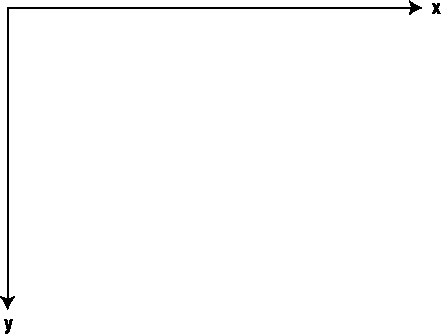

**图 7-1。***x 值从左到右递增；y 值从顶部向下增加。*

[图 7-2](#when_drawing_on_a_widget_comma_the_upper) 显示了在小部件上绘图时，小部件的坐标系如何不同于屏幕。在小部件上绘图时使用的坐标是对齐的，因此(0，0)是小部件的左上角(在设备的全局坐标系中，它不总是与(0，0)相同)。全局坐标系处理屏幕上的实际像素、打印机上的点和其他设备上的点。


**图 7-2。** *在小部件上绘图时，小部件的左上角为(0，0)。*

屏幕上的一个点由一个`QPoint`对象表示，你可以在构造器中为一个点指定 *x* 和 *y* 的值。一个点通常不足以画出什么东西；要指定一个点的宽度和高度，可以使用`QRect`类。`QRect`构造器接受一个 *x* 值、一个 *y* 值和一个宽度，后跟一个高度。[图 7-3](#a_qpoint_and_a_qrect_with_their_x_comma) 显示了一个坐标系中的`QRect`和`QPoint`。


**图 7-3。** *一个* `QPoint` *和一个* `QRect` *及其 x、y、宽度和高度属性*

* * *

**提示**与`QPoint`和`QRect`密切相关的有两类:`QPointF`和`QRectF`。它们是等效的，但是对浮点值进行操作。几乎所有接受矩形或点的方法都可以接受任何类型的矩形或点。

* * *

**行**

线条是最基本的形状，你可以用画师画出来。使用`drawLine(QPoint,QPoint)`方法在两点之间画一条线。如果想一次加入更多的点，可以用`drawPolyline(QPoint*, int)`的方法。`drawLines(QVector` < `QPoint` >)方法也用于一次绘制多条线，但这些线不是连续的。这三种方法在[清单 7-3](#drawing_lines_using_drawline_comma_drawp) 中使用，结果显示在[图 7-4](#lines_drawn_using_different_methods_semi) 中。

在清单中，创建了一个 pixmap，并在创建 painter 之前用白色填充，笔被配置为绘制黑色线条。两个向量`polyPoints`和`linePoints`被初始化，其中`linePoints`通过将`polyPoints`点向右移动 80 个像素来计算。您可以通过向每个`QPoint`添加偏移`QPoint`来移动这些点，这将分别将 *x* 和 *y* 值相加。

* * *

**注意**我把`polyPoints`称为矢量，因为这才是`QPolygon`真正的含义。然而，`QPolygon`类也提供了同时移动所有点的方法，以及计算包含所有点的矩形的方法。

* * *

为了绘制实际的线条，调用了`drawLine`、`drawPolyline`和`drawLines`方法。比较一下`drawPolyline`和`drawLines`的区别。如你所见，`drawPolyline`连接所有的点，而`drawLines`连接每一对给定的点。

**清单 7-3。** *利用*`drawLine``drawPolyline`*`drawLines`绘制线条*

```cpp
  QPixmap pixmap( 200, 100 );

  pixmap.fill( Qt::white );

  QPainter painter( &pixmap );

  painter.setPen( Qt::black );

  QPolygon polyPoints;

  polyPoints << QPoint( 60, 10 )

             << QPoint( 80, 90 )

             << QPoint( 75, 10 )

             << QPoint( 110, 90 );

  QVector<QPoint> linePoints;

  foreach( QPoint point, polyPoints )

    linePoints << point + QPoint( 80, 0 );

  painter.drawLine( QPoint( 10, 10 ), QPoint( 30, 90 ) );

  painter.drawPolyline( polyPoints );

  painter.drawLines( linePoints );
```


**图 7-4。** *用不同的方法绘制线条；从左至右:*`drawLine``drawPolylines`*`drawLines`*(两行)**

 *线条是使用钢笔绘制的，因此您可以通过改变钢笔对象的属性来绘制所需的线条。一个`QPen`对象最常用的两个属性是`color`和`width`，它们控制所画线条的颜色和宽度。

当使用`drawPolyline`绘制连续线条时，能够控制线条如何连接在一起是很有用的—`joinStyle`属性会有所帮助。[图 7-5](#line_segments_can_be_joined_in_three_way) 显示了可用的样式:斜面、斜接和圆形。通过将您的`QPen`对象的`joinStyle`设置为`Qt::BevelJoin`、`Qt::MiterJoin`或`Qt::RoundJoin`来设置合适的样式。

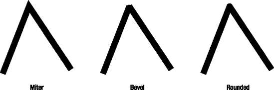

**图 7-5。** *线段有三种连接方式:斜角、斜接和圆角。*

`QPen`可被设置成画点划线以及完全自由的虚线。图 7-6 中显示了不同的变化。


**图 7-6。** *线条可以用不同的图案绘制成实线或虚线——既有预定义的图案，也有定制图案的功能。*

通过将`QPen`对象的`style`属性设置为`Qt::SolidLine`、`Qt::DotLine`、`Qt::DashLine`、`Qt::DotDashLine`、`Qt::DotDotDashLine`或`Qt::CustomDashLine`来选取图案。如果您使用自定义线条，您还必须通过`dashPattern`属性设置一个自定义的虚线图案([清单 7-4](#drawing_lines_using_predefined_or_custom) 显示了它是如何完成的)。列表的输出如[图 7-7](#predefined_and_custom_patterns) 所示。

`dashPattern`由`qreal`值的向量列表组成。这些值决定了破折号和间隙的宽度，其中第一个值是第一个破折号，然后是一个间隙，然后是一个破折号，然后是另一个间隙，依此类推。

**清单 7-4。** *使用预定义或自定义图案绘制线条*

```cpp
  QPixmap pixmap( 200, 100 );

  pixmap.fill( Qt::white );

  QPainter painter( &pixmap );

  QPen pen( Qt::black );

  pen.setStyle( Qt::SolidLine );

  painter.setPen( pen );

  painter.drawLine( QPoint( 10, 10 ), QPoint( 190, 10 ) );

  pen.setStyle( Qt::DashDotLine );

  painter.setPen( pen );

  painter.drawLine( QPoint( 10, 50 ), QPoint( 190, 50 ) );

  pen.setDashPattern( QVector<qreal>() << 1 << 1 << 1 << 1 << 2 << 2

                                       << 2 << 2 << 4 << 4 << 4 << 4

                                       << 8 << 8 << 8 << 8 );

  pen.setStyle( Qt::CustomDashLine );

  painter.setPen( pen );

  painter.drawLine( QPoint( 10, 90 ), QPoint( 190, 90 ) );
```

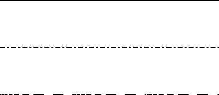

**图 7-7。** *预定义和自定义图案*

**方形形状**

可以画方形或圆角的矩形，如图[图 7-8](#rectangles_with_square_and_rounded_corne) 所示。这些方法接受代表左上角( *x，y* )对的一个`QRect`或四个值，然后是矩形的宽度和高度。这些方法被命名为`drawRect`和`drawRoundRect`。

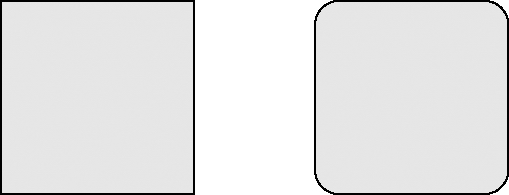

**图 7-8。** *圆角矩形*

清单 7-5 展示了圆角矩形和方角矩形是如何绘制的。前两个矩形是使用方法调用中直接指定的坐标绘制的。坐标指定为 *x，y，w，h*；其中 *x* 和 *y* 指定左上角， *w* ， *h* 指定矩形的宽度。

* * *

**注意**如果 *w* 或 *h* 小于 0，则 *x，y* 指定的角不是矩形的左上角。

* * *

第二对矩形是根据给定的`QRect`类绘制的，该类保存矩形的坐标。在`drawRoundRect`调用中，直接使用了`rect`变量。在`drawRect`调用中，`rect`指定的矩形被*平移*，或者向下移动 45 个像素。这是通过使用`translated(int x, int y)`方法实现的，该方法返回一个相同大小的矩形，但是移动了指定的像素数量。

绘图操作的结果如[图 7-9](#the_drawn_rectangles) 所示。

**清单 7-5。** *将矩形绘制成点阵图*

```cpp
  QPixmap pixmap( 200, 100 );

  pixmap.fill( Qt::white );

  QPainter painter( &pixmap );

  painter.setPen( Qt::black );

  painter.drawRect( 10, 10, 85, 35 );

  painter.drawRoundRect( 10, 55, 85, 35 );

  QRect rect( 105, 10, 85, 35 );

  painter.drawRoundRect( rect );

  painter.drawRect( rect.translated( 0, 45 ) );
```

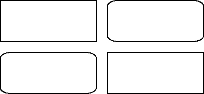

**图 7-9。** *所画的矩形*

**圆形形状**

使用`drawEllipse`方法绘制圆和椭圆(参见[图 7-10](#circles_and_ellipses_are_drawn_using_the) )。该方法采用一个矩形或四个值来表示 *x，y* ，宽度和高度(就像矩形绘制方法一样)。要画一个圆，你必须确保宽度和高度相等。

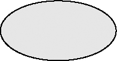

**图 7-10。** *使用* `drawEllipse` *方法绘制圆和椭圆。*

画椭圆很有趣，因为你还可以画出椭圆的一部分。Qt 可以绘制三个部分(如图[图 7-11](#an_arc_comma_a_chord_comma_and_a_pie-sha) ):

*   `drawArc`画一条弧线——圆圈周围的线条部分。
*   `drawChord`画一个圆段——弦与弦外圆弧之间的区域。
*   `drawPie`画一个扇形段——椭圆形的一部分。

所有绘制椭圆部分的方法都取一个矩形(就像`drawEllipse`方法一样)。然后，它们接受一个起始角度和一个值，该值指示椭圆的一部分跨越了多少度。角度以整数表示，其中值为 1/16 度，这意味着值 5760 对应于一个完整的圆。值 0 对应三点钟，正角度逆时针移动。

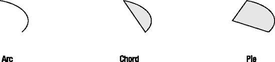

**图 7-11。** *一条弧线、一条弦和一个饼状的圆*

[清单 7-6](#drawing_ellipses_and_arcs) 展示了如何绘制椭圆和圆弧(结果如图[图 7-12](#the_drawn_ellipses_and_arcs) )。正如您所看到的，形状的比例发生了变化，最右边的椭圆和圆弧实际上是圆形的(宽度等于高度)。

如源代码所示，可以通过直接使用坐标或向绘图方法传递一个`QRect`值来指定绘制椭圆或圆弧的矩形。

在指定角度时，我将不同的值乘以 16，将实际角度值转换为 Qt 期望的值。

**清单 7-6。** *画椭圆和圆弧*

```cpp
  QPixmap pixmap( 200, 190 );

  pixmap.fill( Qt::white );

  QPainter painter( &pixmap );

  painter.setPen( Qt::black );

  painter.drawEllipse( 10, 10, 10, 80 );

  painter.drawEllipse( 30, 10, 20, 80 );

  painter.drawEllipse( 60, 10, 40, 80 );

  painter.drawEllipse( QRect( 110, 10, 80, 80 ) );

  painter.drawArc( 10, 100, 10, 80, 30*16, 240*16 );

  painter.drawArc( 30, 100, 20, 80, 45*16, 200*16 );

  painter.drawArc( 60, 100, 40, 80, 60*16, 160*16 );

  painter.drawArc( QRect( 110, 100, 80, 80 ), 75*16, 120*16 );
```

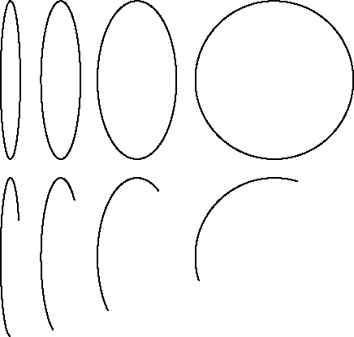

**图 7-12。** *所画的椭圆和圆弧*

**正文**

Qt 提供了几种可能的方法来绘制文本(参见[图 7-13](#you_can_draw_text_in_many_different_ways) 中的一些例子)。当您通过用于创建它的代码工作时，请参考该图。

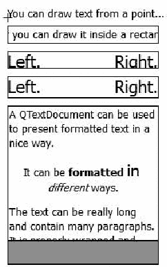

**图 7-13。** *你可以用许多不同的方式绘制文本。*

首先，您需要创建一个用于绘制的`QPixmap`和一个用于绘制的`QPainter`。你还必须用白色填充位图，并将画师的笔设置为黑色:

```cpp
  QPixmap pixmap( 200, 330 );

  pixmap.fill( Qt::white );

  QPainter painter( &pixmap );

  painter.setPen( Qt::black );
在图的顶部绘制文本，该文本从 a `QPoint`开始。下面的源代码向您展示了`drawText`调用的使用。下面的`drawLine`类简单地用十字标记了点(你可以在顶部文本左边的[图 7-13](#you_can_draw_text_in_many_different_ways) 中看到这个十字)。
  QPoint point = QPoint( 10, 20 );

  painter.drawText( point, "You can draw text from a point..." );

  painter.drawLine( point+QPoint(-5, 0), point+QPoint(5, 0) );

  painter.drawLine( point+QPoint(0, −5), point+QPoint(0, 5) );
从一个点绘制文本有它的优势——这是一种将文本放到屏幕上的简单方法。如果您需要更多的控制，您可以在矩形中绘制文本，这意味着您可以将文本水平向右、向左或居中对齐(也可以垂直向上、向下或居中)。下表总结了用于对齐的枚举:

```

*   `Qt::AlignLeft`:左对齐
*   `Qt::AlignRight`:右对齐
*   `Qt::AlignHCenter`:居中水平对齐
*   `Qt::AlignTop`:顶部对齐
*   `Qt::AlignBottom`:底部对齐
*   `Qt::AlignVCenter`:垂直居中对齐
*   `Qt::AlignCenter`:垂直和水平居中对齐

在矩形内绘制文本的另一个好处是文本被裁剪到矩形，这意味着您可以限制文本使用的区域。下面的源代码绘制了一个以矩形为中心的文本:

`  QRect rect = QRect(10, 30, 180, 20);
  painter.drawText( rect, Qt::AlignCenter,
                    "...or you can draw it inside a rectangle." );
  painter.drawRect( rect );`

因为您可以将文本限制为矩形，所以您还需要能够确定文本使用了多少空间。首先将矩形平移到一个新位置；您将从`QApplication`对象中获得标准的`QFont`。使用字体，设置一个`pixelSize`来适应矩形，然后在矩形的两边绘制文本。

* * *

**提示**因为你在给一个`QPixmap`绘画，所以使用来自`QApplication`的字体。如果你在一个特定的小部件中使用的`QWidget`或`QPixmap`上绘画，从小部件中获取字体会更合理。

* * *

这并没有像预期的那样结束；相反，文本在底部被剪裁。字体的像素大小只定义了所有字符绘制的基线以上的大小。

`  rect.translate( 0, 30 );

  QFont font = QApplication::font();
  font.setPixelSize( rect.height() );
  painter.setFont( font );

  painter.drawText( rect, Qt::AlignRight, "Right." );
  painter.drawText( rect, Qt::AlignLeft, "Left." );
  painter.drawRect( rect );`

要真正使文本适合矩形，使用`QFontMetrics`类获得文本的精确尺寸。font metrics 类可用于确定给定文本的宽度和高度。然而，高度不依赖于任何特定的文本；它完全由字体决定。下面的代码在绘制文本之前调整用于保留文本的矩形的高度。参见[图 7-13](#you_can_draw_text_in_many_different_ways) :这一次文本非常合适。

`  rect.translate( 0, rect.height()+10 );
  rect.setHeight( QFontMetrics( font ).height() );

  painter.drawText( rect, Qt::AlignRight, "Right." );
  painter.drawText( rect, Qt::AlignLeft, "Left." );
  painter.drawRect( rect );`

使用`drawText`绘制文本有其局限性。例如，部分文本不能格式化，也不能分成段落。您可以使用`QTextDocument`类来绘制格式化的文本(如下面的源代码所示)。

用文本文档绘制文本比直接使用`drawText`稍微复杂一些。首先创建一个`QTextDocument`对象，使用`setHTML`用 HTML 格式的文本初始化它。设置要在其中绘制文本的矩形。将其平移到最后绘制的文本下方的新位置，然后调整高度以容纳更多文本。

然后使用`setTextWidth`将矩形用于设置文本文档的宽度。在您准备绘制文本之前，您必须翻译 painter(稍后将详细介绍),因为文本文档将在(0，0)坐标处开始绘制文本。在翻译 painter 之前，保存当前状态(稍后通过调用`restore`方法恢复)。因为您翻译了画师，所以当您调用`drawContents`在给定的矩形内将文本绘制给给定的画师时，您也必须翻译矩形。

`  QTextDocument doc;
  doc.setHtml( "<p>A QTextDocument can be used to present formatted text "
               "in a nice way.</p>"
               "<p align=center>It can be <b>formatted</b> "
               "<font size=+2>in</font> <i>different</i> ways.</p>"
               "<p>The text can be really long and contain many "
               "paragraphs. It is properly wrapped and such...</p>" );

  rect.translate( 0, rect.height()+10 );
  rect.setHeight( 160 );
  doc.setTextWidth( rect.width() );
  painter.save();
  painter.translate( rect.topLeft() );
  doc.drawContents( &painter, rect.translated( -rect.topLeft() ) );
  painter.restore();
  painter.drawRect( rect );`

如图[图 7-13](#you_can_draw_text_in_many_different_ways) 所示，文本文档的全部内容无法放入给定的矩形。再次，有一种方法可以确定文本所需的高度。在这种情况下，使用来自`QTextDocument`的`size`属性的`height`属性。在下面的源代码中，您使用此高度来确定绘制在呈现的文本文档下方的灰色矩形的大小。这个矩形显示了文本的实际长度。

`  rect.translate( 0, 160 );
  rect.setHeight( doc.size().height()-160 );
  painter.setBrush( Qt::gray );
  painter.drawRect( rect );`

* * *

**注意**尽管使用`drawText`方法绘制文本相当容易，但是您可能想要使用`QTextDocument`类来绘制更复杂的文本。这个类使您能够以一种简单的方式绘制具有各种格式和对齐方式的复杂文档。

* * *

**路径**

画家路径可以画出你想要的任何形状，但技巧是定义一个区域周围的路径。然后，您可以使用给定的钢笔和画笔来绘制路径。一条路径可以包含几个封闭区域；例如，可以使用路径来表示整个文本字符串。

如图[图 7-14](#a_path_has_been_filled) 所示的路径分三步创建。首先，创建`QPainterPath`对象，并使用`addEllipse`方法添加圆。这个椭圆形成一个封闭的区域。

`  QPainterPath path;

  path.addEllipse( 80, 80, 80, 80 );`

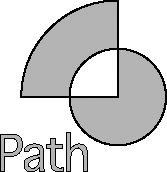

**图 7-14。** *一条小路已经被填满。*

下一步是添加从整个圆的中心开始并向左上方延伸的四分之一圆。它从(100，100)开始，使用一个`moveTo`调用移动到那个点。然后你用`lineTo`画一条直线，然后用`addArc`画一个圆弧。从(40，40)开始在矩形中绘制圆弧；也就是 160 像素的高和宽。它从 90 度开始，逆时针再跨越 90 度。然后用一条返回起点的线封闭该区域。这形成了另一个封闭区域。

* * *

**注意**圆弧从 90 度开始，因为 0 度被认为是中心点右侧的点，你希望它从中心正上方开始。

* * *

`  path.moveTo( 120, 120 );
  path.lineTo( 120, 40 );
  path.arcTo( 40, 40, 160, 160, 90, 90 );
  path.lineTo( 120, 120 );`

最后要添加的部分是形状下面的文本。这是通过设置一个大字体，然后在调用`addText`时使用它来实现的。`addText`的工作方式类似于`drawText`，但是只允许文本从给定点开始(也就是说，矩形中不包含文本)。这就形成了一大堆构成文本的封闭区域:

`  QFont font = QApplication::font();
  font.setPixelSize( 40 );

  path.addText( 20, 180, font, "Path" );`

当画家路径完成后，剩下要做的就是用画家来描边。在下面的代码中，您为画家配置了一支钢笔和一支画笔。然后用`drawPath`方法画出实际的油漆工路径。

[图 7-14](#a_path_has_been_filled) 显示当区域重叠时，笔刷没有被应用。这使得通过将其他路径放入其中来创建空心路径成为可能。

`  painter.setPen( Qt::black );
  painter.setBrush( Qt::gray );

  painter.drawPath( path );`

路径可以由比前面源代码中使用的形状更多的形状组成。以下列表提到了一些可用于将形状添加到路径中的方法:

*   `addEllipse`:添加一个椭圆或圆。
*   `addRect`:添加一个矩形。
*   `addText`:添加文本。
*   `addPolygon`:添加一个多边形。

从线、弧和其他组件构建区域时，以下方法会很有用:

*   `moveTo`:移动当前位置。
*   `lineTo`:画一条线到下一个位置。
*   `arcTo`:画一条弧线到下一个位置。
*   `cubicTo`:画一条三次贝塞尔曲线(一条平滑的线)到下一个点。
*   `closeSubpath`:从当前位置到起点画一条直线，关闭当前区域。

路径对于表示你需要反复绘制的形状是非常有用的，但是当它们与画笔结合起来时，它们的真正潜力才会显现出来(接下来讨论)。

**画笔**

画笔用于填充形状和路径。到目前为止，你一直用画笔用纯色填充指定的区域。这只是可能的一部分。使用不同的图案、渐变甚至纹理，您可以用任何可以想象的方式填充形状。

创建`QBrush`对象时，可以指定颜色和样式。构造器定义为`QBrush(QColor, Qt::BrushStyle)`。然后使用`setBrush`方法将`QBrush`赋予一个`QPainter`。

画笔的样式控制填充形状时如何使用颜色。最简单的样式是图案，在需要用线条或抖动阴影填充形状时使用。可用的模式和相应的枚举样式如[图 7-15](#the_available_patterns) 所示。


**图 7-15。** *可用模式*

一种更灵活的填充形状的方法是使用渐变画笔，这是一种基于`QGradient`对象的画笔。一个*渐变对象*代表一种或多种颜色根据预定义的模式的混合。可用模式如图 7-16 中的[所示。基于`QLinearGradient`类的*线性渐变*定义了一个二维线性渐变。*径向渐变*通过`QRadialGradient`实现，描述了从一个点发出的渐变，其中阴影取决于与该点的距离。*圆锥形渐变*，`QConicalGradient`，代表从单个点发出的渐变，其中阴影取决于与该点的角度。](#different_gradients_and_spread_policies)

不同的渐变定义为两点之间的分布(锥形渐变除外，它以一个角度开始和结束)。梯度在这些点定义的范围之外继续的方式由扩展策略定义，该策略通过`setSpread`方法设置。不同传播策略的结果也显示在[图 7-16](#different_gradients_and_spread_policies) 中。使用*垫展开* ( `QGradient::PadSpread`)，当到达垫时，梯度简单地停止。使用*重复展开* ( `QGradient::RepeatSpread`)梯度被重复。使用*反射扩散* ( `QGradient::ReflectSpread`)梯度重复，但方向是交替的——导致梯度每隔一次被反射。

* * *

**注意**扩散策略不会影响锥形渐变，因为它们定义了所有像素的颜色。

* * *

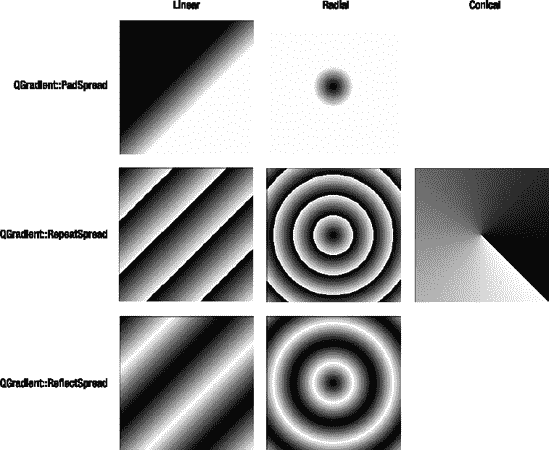

**图 7-16。** *不同的梯度和扩散政策*

[清单 7-7](#setting_up_gradients) 显示了不同梯度是如何配置的。请注意，线性梯度是在两点之间定义的，形成一个方向。径向渐变由中心点和半径定义，而锥形渐变由中心点和起始角度定义。起始角度以度为单位指定，其中 0 度定义从中心点指向右侧的方向。

渐变也使用`setColorAt`方法分配颜色。颜色被设置为范围在 0 和 1 之间的值。这些值为线性渐变定义了两点之间的一点，其中一点为 0，另一点为 1。同样，0 定义起点，1 定义径向渐变的完整指定半径。对于锥形渐变，0 指定起始角度。然后，该值沿逆时针方向增加，直到 1 指定结束角度，该角度与开始角度相同。

* * *

**注意**可以在不同的点设置几种颜色；设置结束颜色以清晰的方式显示效果。

* * *

**清单 7-7。** *设置渐变*

`  QLinearGradient linGrad( QPointF(80, 80), QPoint( 120, 120 ) );
  linGrad.setColorAt( 0, Qt::black );
  linGrad.setColorAt( 1, Qt::white );

...

  QRadialGradient radGrad( QPointF(100, 100), 30 );
  radGrad.setColorAt( 0, Qt::black );
  radGrad.setColorAt( 1, Qt::white );

...

  QConicalGradient conGrad( QPointF(100, 100), −45.0 );
  conGrad.setColorAt( 0, Qt::black );
  conGrad.setColorAt( 1, Qt::white );`

要将其中一个渐变用作画笔，只需将`QGradient`对象传递给`QBrush`构造器。渐变画笔不受调用`QBrush`对象的`setColor`方法的影响。

创建画笔的最后一种方法是将一个`QPixmap`或一个`QImage`对象传递给`QBrush`构造器，或者在一个`QBrush`对象上调用`setTexture`。这个过程使画笔使用给定的图像作为纹理，通过重复图案填充任意形状(一个例子如图[图 7-17](#a_texture-based_brush) )。

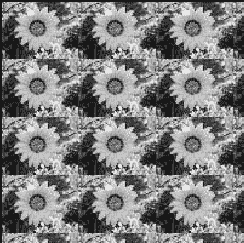

**图 7-17。** *一个基于纹理的笔刷*

#### 改造现实

正如您在讨论全局(设备)坐标和局部(小部件)坐标时了解到的，Qt 可以对屏幕的不同区域使用不同的坐标系。全局坐标和局部坐标的区别在于原点，即点(0，0)，被移动了。用专业术语来说，这就是所谓的坐标系统转换。

* * *

**注意**我将设备的坐标称为*全局*，因为它们是在设备上工作的所有画师(以及小部件，如果设备恰好是屏幕)之间共享的。然后，每个画家都被转变成一个与其目的相关的点。其他常用的符号有*物理*设备坐标和*逻辑*局部坐标。

* * *

油漆工的坐标系也可以被转换(这种转换的例子如图 7-18 中的[所示)。在图中，灰色框是相对于原始坐标系绘制的。坐标系通过以下调用进行转换:](#translating_the_coordinate_system_means)

```cpp
  painter.translate( 30, 30 );
结果是在黑色矩形所在的位置绘制了矩形，坐标系向右下方移动了。

**图 7-18。** *平移坐标系就是移动原点(0，0)。*
painter 类能够进行更多的翻译。坐标系可以平移、缩放、旋转和剪切(这些变换如图 7-19 、 [7-20](#rotating_the_coordinate_system_around_th) 和 [7-21](#shearing_the_coordinate_system_relative) 所示)。
为了缩放画师，进行以下调用:
  painter.scale( 1.5, 2.0 );
第一个参数是沿 *x* 轴的缩放(水平方向)，第二个参数是垂直缩放(见[图 7-19](#scaling_the_coordinate_system_moves_all) )。请注意，用于绘画的钢笔也被缩放—线条的高度大于宽度。

**图 7-19。** *缩放坐标系使所有点更靠近原点(0，0)。*
旋转时，会进行以下调用:
  painter.rotate( 30 );
该参数是顺时针方向旋转坐标系的度数。该方法接受浮点值，因此可以将坐标系旋转任意角度(见[图 7-20](#rotating_the_coordinate_system_around_th) )。

**图 7-20。** *绕原点(0，0)旋转坐标系*
最后一个变换——剪切——有点复杂。发生的情况是，坐标系绕原点扭曲。为了理解这一点，请看图 7-21 和下面的调用:
  painter.shear( 0.2, 0.5 );
注意， *x* 值越大， *y* 值的变化越大。同样，大的 *y* 值会导致 *x* 值的大变化。`shear`方法的第一个参数控制 *y* 值的变化量 *x* 应该给出多大的变化量，第二个参数反过来做同样的事情。例如，查看被剪切的矩形的右下角，并将其与原始的灰色框进行比较。然后比较剪切后的矩形和原始矩形的左上角。比较这两个点，可以看到根据`shear`方法参数的大小，一个比另一个移动得多。因为右上角的 *x* 和 *y* 均为非 0 值，所以该点根据参数向两个方向移动。

**图 7-21。** *相对于原点(0，0)剪切坐标系*
当你对一个画师的坐标系进行变换时，你想知道有一种方法可以恢复原来的设置。通过调用 painter 对象上的`save`,当前状态被放在一个堆栈上。要恢复上一次保存的状态，调用`restore`(当您想要应用几个从原始坐标系开始的变换时，这很方便)。给定一个指向画师对象的指针也很常见；您应该在修改绘制器之前保存状态，然后在从方法返回之前恢复绘制器。
**维持秩序**
可以通过依次执行来组合几种转换。这样做时，顺序很重要，因为所有的变换都指向原点(0，0)。例如，旋转始终意味着围绕原点旋转，因此，如果您想围绕不同的点旋转形状，您必须将旋转中心平移到(0，0)，应用旋转，然后将坐标系平移回来。
让我们用下面的线在(0，0)处画一个矩形，即 70 像素宽，70 像素高:
  painter.drawRect( 0, 0, 70, −70 );
现在使用下面的线将坐标系旋转 45 度(结果如[图 7-22](#simply_rotating_the_rectangle_rotates_it) 所示):
  painter.rotate( 45 );

**图 7-22。** *简单地旋转矩形使其绕原点旋转。*
如果你转而平移坐标系，使矩形(35，35)的中心成为旋转前的原点，然后再将坐标系平移到位，你最终会像[图 7-23](#by_translating_back_and_forth_comma_it_i) 一样。用于平移和旋转然后平移回来的代码如下:
  painter.translate( 35, −35 );

  painter.rotate( 45 );

  painter.translate( −35, 35 );

**图 7-23。** *通过来回平移，可以围绕矩形的中心旋转。*
如果你混淆了平移的顺序，你最终会得到[图 7-24](#mixing_up_the_order_of_the_translations) (你绕着错误的点旋转)。

**图 7-24。** *混译的顺序绕着错误的原点旋转。*
翻译的顺序对所有的翻译都很重要。缩放和剪切都同样依赖于坐标系的原点，就像旋转一样。
绘画小工具
所有 Qt 小部件都是绘画设备，所以您可以创建一个`QPainter`对象，并用它来绘制小部件。然而，这只能通过`paintEvent(QPaintEvent*)`方法来实现。
当小部件需要重画时，事件循环调用`paintEvent`方法。你需要告诉 Qt 什么时候要重画小部件，Qt 会调用你的`paintEvent`方法。你可以用两种方法来达到这个目的:`update`和`repaint`。`repaint`方法触发并立即重画，而`update`将一个更新请求放到事件队列中。后者意味着 Qt 有机会将`update`调用合并成更少的(最好是单个)对`paintEvent`的调用。这可能是好的也可能是坏的。这很糟糕，因为您可能已经创建了一个依赖于`paintEvent`被调用特定次数的小部件。这很好，因为它允许 Qt 根据运行应用程序的系统的当前工作负载来调整数量或重画。几乎在所有情况下，你都应该使用`update`。这样做时，尽量避免依赖于被调用一定次数的`paintEvent`方法。

**注意**有更多的理由不依赖于`paintEvent`像你呼叫`update`那样被频繁呼叫。例如，你的小工具可能会被完全阻挡，或者有什么东西在它前面移动，导致对`paintEvent`的呼叫变少或变多。

在你忘乎所以并开始实现全新的小部件之前，让我们来看看一个按钮是如何被修改成看起来不同的。(按钮是一个很好的起点，因为它就是为此目的而设计的。)所有按钮都继承了`QAbstractButton`类，它定义了按钮的基本机制和属性。然后这个类被继承到`QPushButton`、`QRadioButton`和`QCheckBox`中，它们实现了一个按钮的三种不同视图。

**注意**还有更多抽象的 widget 可以作为自定义 widget 的基础，包括`QAbstractScrollArea`、`QAbstractSlider`和`QFrame`。注意，尽管前两个类是抽象的，但这不是规则。`QFrame`可以作为新 widget 的基础，但也可以单独使用。

**一个新按钮**
新的 button 类并没有创建一个完全不同的按钮；当用户按下按钮时，它只是让按钮的文本变亮。按钮类被称为`MyButton`，类声明如[清单 7-8](#the_class_declaration_of_the_custom_butt) 所示。
在清单中，您可以看到该类继承了`QAbstractButton`类。然后它实现一个构造器、一个`sizeHint`方法和一个`paintEvent`方法。`sizeHint`和`paintEvent`方法覆盖从祖先类继承的现有方法。这意味着它们的声明必须保持完全相同(包括将`sizeHint`方法声明为`const`)。

**清单 7-8。** *自定义按钮的类声明*
class MyButton : public QAbstractButton

{

  Q_OBJECT

public:

  MyButton( QWidget *parent=0 );

  QSize sizeHint() const;

protected:

  void paintEvent( QPaintEvent* );

}; 
你可以在[清单 7-9](#the_constructor_and_the_sizehint_method) 中查看构造器和`sizeHint`方法。构造器只是将父参数传递给父类。`sizeHint`方法返回小部件想要的大小。这只是给 Qt 布局类的一个提示，所以不能依赖小部件来获取这些尺寸。
尺寸由`QSize`对象表示，它有两个属性:`width`和`height`。对于按钮，这两个度量取决于要显示的文本和显示文本所用的字体。要了解给定`QFont`的尺寸，请使用`QFontMetrics`对象。所有小部件都有一个返回当前字体的`QFontMetrics`对象的`fontMetrics`属性。通过询问这个对象关于给定字符串的`width`和`height`的信息，然后在每个方向上额外增加 10 个像素作为边距，就可以得到一个合适的小部件大小。

**注意**给定字体的高度并不取决于输入的文本。相反，它考虑了字体的可能高度。大多数字体的给定文本的宽度取决于文本，因为字符的宽度不同。

**清单 7-9。** *构造器和* `sizeHint` *按钮的方法*

```
MyButton::MyButton( QWidget *parent ) : QAbstractButton( parent )

{

}

QSize MyButton::sizeHint() const

{

  return QSize( fontMetrics().width( text() )+10, fontMetrics().height()+10 );

}
```cpp

绘制按钮的任务由`paintEvent`方法负责(见[清单 7-10](#painting_the_bevel_using_a_style_and_the) )。该方法从创建一个用于绘制到小部件的`QPainter`对象开始。所有的小部件都由 Qt 进行双缓冲，所以当你向画师绘图时，你实际上是在向一个用于重绘屏幕的缓冲区绘图。这意味着你不必担心闪烁。
有两种方法可以绘制小部件:直接绘制或通过样式绘制。通过使用样式，您可以使小部件的外观适应系统的其余部分。通过直接绘制到小部件，您可以完全控制。对于按钮，您将直接使用样式和文本绘制框架和背景。
每个小部件都有一个与之相关联的`QStyle`，您可以通过`style`属性访问它。这种风格通常反映了系统的设置，但是它可能已经从实例化小部件的代码中改变了。小部件本身不应该关心样式的起源或者它与当前平台的关系。
在使用该样式进行绘图之前，您需要设置一个样式选项对象(在本例中是一个`QStyleOptionButton`对象)。要使用的样式选项类取决于要绘制的样式元素。通过参考用于`drawControl`方法的 Qt 文档，您可以看到它期望哪个样式对象。
样式选项对象通过将`this`指针传递给它的`init`方法来初始化，该方法配置大多数设置。但是，您仍然需要判断按钮是被按下还是被切换。这些状态可以从由`QAbstractButton`类实现的`isDown`和`isChecked`方法中获得。如果`isDown`方法返回`true`，则按钮当前被按下。如果`isChecked`返回`true`，则按钮已被切换且当前处于选中状态(即处于打开状态)。当按钮被按下时，设置样式选项的`state`属性中的`QStyle::State_Sunken`位。对于选中的按钮，设置`QStyle::State_On`位。

**注意**使用`|=`操作符(按位或)将`state`位相加，不清除由`init`方法设置的任何位。

当样式对象被正确设置后，当前样式方法的`drawControl(ControlElement, QStyleOption*, QPainter*, QWidget*)`被调用。在调用中，您要求绘制一个`QStyle::CE_PushButtonBevel`,它将绘制按钮的所有部分，除了文本和可选图标。
`paintEvent`方法的第二部分负责将文本直接绘制到小部件上。它首先将画师的字体设置为小部件的当前字体。然后根据按钮的状态确定笔的颜色。禁用的按钮显示灰色文本，按下的按钮显示红色文本，所有其他按钮显示暗红色文本。请注意，当按钮被主动按下时，`isDown`会返回`true`，而不是当切换的按钮处于打开状态时。这意味着文本只有在按下鼠标按钮时才会变亮。
当画师的笔和字体配置好后，继续用`drawText`绘制实际文本。文本在按钮中居中，并包含在按钮所占据的实际矩形中。你没有考虑在`sizeHint`方法中添加的边距。
`paintEvent`方法接受一个`QPaintEvent`指针作为参数；在本例中选择忽略的指针。事件对象有一个名为`rect()`的成员方法，它返回一个`QRect`，指定`paintEvent`方法需要更新的矩形。对于某些小部件，您可以将绘制限制在该矩形内，以提高性能。

**清单 7-10。** *直接使用样式和文本绘制斜面*

```
void MyButton::paintEvent( QPaintEvent* )

{

  QPainter painter( this );

  QStyleOptionButton option;

  option.init( this );

  if( isDown() )

    option.state |= QStyle::State_Sunken;

  else if( isChecked() )

    option.state |= QStyle::State_On;

  style()->drawControl( QStyle::CE_PushButtonBevel, &option, &painter, this );

  painter.setFont( font() );

  if( !isEnabled() )

    painter.setPen( Qt::darkGray );

  else if( isDown() )

    painter.setPen( Qt::red );

  else

    painter.setPen( Qt::darkRed );

  painter.drawText( rect(), Qt::AlignCenter, text() );

}
```cpp

要试用这个按钮，可以用它创建一个对话框。产生的对话框如图 7-26 中的[所示(但你离它还有几步之遥)。](#the_mybutton_class_in_action)
首先在设计器中创建新对话框。向对话框添加三个`QPushButton`小部件，并根据对话框的图形设置它们的文本属性。同样，将顶部按钮的 enabled 属性设置为`false`，将底部按钮的 checkable 属性设置为`true`。
右键单击每个按钮，并从弹出菜单中选择“升级到自定义小部件”。这将显示在[图 7-25](#using_mybutton_from_designer) 中弹出菜单旁边显示的对话框。通过在对话框中输入`MyButton`作为自定义类名，头文件名称将(正确地)被猜测为`mybutton.h`，这将导致用户界面编译器在创建按钮时使用`MyButton`类，而不是`QPushButton`类。

**注意**因为`MyButton`没有继承`QPushButton`(它继承了`QAbstractButton`类)，所以保持属性编辑器中`QPushButton`标题下的属性不变是很重要的。否则，您将会遇到编译错误。基类(`QAbstractButton`)及以上的所有属性都可以自由使用。

对话框名称设置为`Dialog`，中间按钮命名为`clickButton`，设计保存为`dialog.ui`。

**图 7-25。** *使用来自设计者*的 `MyButton`  *为了显示对话框，声明一个最小的对话框类(如清单 7-11 中的[和清单 7-12](#header_of_a_minimal_dialog) 中的[所示)。对话框简单地从设计中设置用户界面，并将按钮的`clicked`信号连接到显示对话框的插槽。](#implementation_of_a_minimal_dialog)

**清单 7-11。** *一个极小对话框的标题*

```
class Dialog : public QDialog

{

  Q_OBJECT

public:

  Dialog();

private slots:

  void buttonClicked();

private:

  Ui::Dialog ui;

};
```cpp

**清单 7-12。** *实现一个最小化的对话框*

```
Dialog::Dialog() : QDialog()

{

  ui.setupUi( this );

  connect( ui.clickButton, SIGNAL(clicked()), this, SLOT(buttonClicked()) );

}

void Dialog::buttonClicked()

{

  QMessageBox::information( this, tr("Wohoo!"), tr("You clicked the button!") );

}
```cpp

该对话框与一个最小的主函数相结合，产生了如图 7-26 所示的对话框。在图中，顶部的按钮被禁用，中间的按钮被按下，而底部的按钮是非活动的切换按钮。


**图 7-26。***`MyButton`*类行动**

 ***完全定制**

如果您需要创建一个全新的小部件(其行为不同于任何其他小部件)，您必须直接子类化`QWidget`类。这让你可以做任何事情，但是自由也伴随着责任。所有的内部状态都必须由你来管理，所有的重画和大小暗示也是如此。

让我们先看看你想做什么。您将创建的小部件名为`CircleWidget`，它将监听鼠标事件。当按下鼠标时，会创建一个圆。只要在圆圈内按下鼠标按钮，圆圈就会变大。如果在指针位于圆圈之外时按下鼠标，圆圈将缩小直至消失，新的圆圈将在第一个圆圈消失时指针所在的位置开始增长(见[图 7-27](#a_circle_shown_by_the_circle_widget) )。

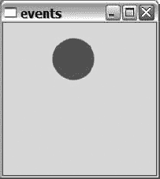

**图 7-27。** *圆形小部件显示的圆形*

你必须跟踪鼠标事件:按钮按下、按钮释放和指针移动。你还需要有一个计时器，随着时间的推移来扩大和缩小圆圈。最后，你必须负责重画并给 Qt 布局类一个大小提示(所有这些都可以在清单 7-13 中的类声明中看到)。

查看类声明，您可以将内容组合在一起:** 
```

***   基本必需品:在这里你可以找到构造器和`sizeHint`。*   绘画:`paintEvent`方法使用变量`x`、`y`、`r`和`color`来跟踪要画什么。*   鼠标交互:使用`mousePressEvent`、`mouseMoveEvent`和`mouseReleaseEvent`捕捉鼠标事件。最后已知的鼠标位置保存在`mx`和`my`中。*   计时:`timer`指向的`QTimer`对象连接到超时槽。它根据`mx`和`my`值更新`x`、`y`、`r`和`color`。**

 *** * *

**注意**`sizeHint`方法不是必须的，但是我们鼓励你为你所有的小部件实现它。

* * *

**清单 7-13。** *自定义小工具的类声明*

```cpp
class CircleWidget : public QWidget

{

  Q_OBJECT

public:

  CircleWidget( QWidget *parent=0 );

  QSize sizeHint() const;

private slots:

  void timeout();

protected:

  void paintEvent( QPaintEvent* );

  void mousePressEvent( QMouseEvent* );

  void mouseMoveEvent( QMouseEvent* );

  void mouseReleaseEvent( QMouseEvent* );

private:

  int x, y, r;

  QColor color;

  int mx, my;

  QTimer timer;

};
```

清单 7-14 中[所示的构造器将当前圆的半径`r`初始化为`0`，表示没有圆。然后它配置并连接一个`QTimer`对象。计时器间隔设置为 50 毫秒，这意味着圆圈每秒将更新大约 20 次(这通常足以模仿连续的运动)。](#initializing_the_custom_widget)

**清单 7-14。** *初始化自定义小工具*

```cpp
CircleWidget::CircleWidget( QWidget *parent ) : QWidget( parent )

{

  r = 0;

  timer.setInterval( 50 );

  connect( &timer, SIGNAL(timeout()), this, SLOT(timeout()) );

}
```

`sizeHint`方法是整个类中最简单的一个；它只是返回一个静态大小(见清单 7-15 )。

**清单 7-15。** *返回静态大小*

```cpp
QSize CircleWidget::sizeHint() const

{

  return QSize( 200, 200 );

}
```

清单 7-16 展示了跟踪鼠标活动的三种方法。在仔细研究这些方法之前，重要的是要知道只有在按下鼠标按钮时才会报告鼠标移动。这意味着除非按下鼠标按钮，否则不会调用`mouseMoveEvent`。

* * *

**提示**将`mouseTracking`属性设置为`true`可以得到鼠标移动报告。

* * *

`mousePressEvent`和`mouseMoveEvent`都根据传递给`QMouseEvent`对象的坐标更新`mx`和`my`变量。它们由`timeout`槽在决定是扩大还是缩小当前圆时使用。`timeout`槽与`timer`相连，因此可以通过启动和停止`mousePressEvent`和`mouseReleaseEvent`中的`timer`来打开和关闭`timeout`槽。仅当按下鼠标按钮时，计时器才会激活(在此期间，`mx`和`my`值有效)。

**清单 7-16。** *处理鼠标事件*

```cpp
void CircleWidget::mousePressEvent( QMouseEvent *e )

{

  mx = e->x();

  my = e->y();

  timer.start();

}

void CircleWidget::mouseMoveEvent( QMouseEvent *e )

{

  mx = e->x();

  my = e->y();

}

void CircleWidget::mouseReleaseEvent( QMouseEvent *e )

{

  timer.stop();

}
```

当定时器激活时，`timeout`槽每秒钟被调用大约 20 次。插槽的任务是确定它是否会创建一个新的圆，增长当前的圆，或者缩小它。清单 7-17 展示了它是如何完成的。

如果当前半径`r`为`0`，则创建一个新的圆，其圆心(`x`、`y`)在当前鼠标位置:`mx`、`my`。新的颜色是随机产生的，所以每个新的圆圈都会有新的颜色。

无论是否在新的圆上工作，插槽然后通过使用勾股定理(比较`mx`、`my`和`x`、`y`之间的平方距离与半径、`r`的平方)来检查`mx`、`my`是否在圆内。如果鼠标在现有的圆内，半径增加；如果在外面，半径减小。

当对圆的所有更改完成后，将调用 update 方法，该方法将一个 paint 事件放在 Qt 事件队列中。当到达该事件时，调用`paintEvent`方法。

**清单 7-17。** *根据当前圆的位置和大小以及鼠标指针的位置改变圆*

```cpp
void CircleWidget::timeout()

{

  if( r == 0 )

  {

    x = mx;

    y = my;

    color = QColor( qrand()%256, qrand()%256, qrand()%256 );

  }

  int dx = mx-x;

  int dy = my-y;

  if( dx*dx+dy*dy <= r*r )

    r++;

  else

    r--;

  update();

}
```

清单 7-18 中的[显示了`paintEvent`方法。该方法所做的只是绘制当前圆(如果`r`大于 0，则由`x`、`y`、`r`和`color`定义)。因为圆的边缘有时看起来有锯齿的趋势，所以你也告诉画家用抗锯齿来柔化边缘(通过设置渲染提示)。顾名思义，它是一个提示，而不是一个有保证的操作。](#painting_the_circle)

* * *

**提示** *抗锯齿*意味着形状的边缘被平滑。边缘有时会出现锯齿，因为边缘位于可用像素之间。通过计算要添加到每个像素的颜色量，可以获得更平滑的结果(取决于每个像素离边缘有多近)。

* * *

简单地绘制新的圆圈而不擦除任何东西是可行的，因为默认情况下 Qt 总是复制背景图形。因为这个小部件不打算放在其他小部件的上面，所以通常意味着纯灰色。通过将`autoFillBackground`属性设置为`true`，可以强制 Qt 用样式的背景色填充背景。

**清单 7-18。** *画圆*

```cpp
void CircleWidget::paintEvent( QPaintEvent* )

{

  if( r > 0 )

  {

    QPainter painter( this );

    painter.setRenderHint( QPainter::Antialiasing );

    painter.setPen( color );

    painter.setBrush( color );

    painter.drawEllipse( x-r, y-r, 2*r, 2*r );

  }

}
```

在讨论绘画事件时，有几个小部件属性是您应该知道的——它们可以用来进一步优化小部件绘画。您可以使用`setAttribute(Qt::WidgetAttribute, bool)`方法设置这些属性。布尔参数，默认情况下是`true`，表示应该设置该属性。如果通过了`false`，属性被清除。您可以通过使用`testAttribute(Qt::WidgetAttribute)`方法来测试一个属性是否被设置。这个不完整的列表解释了一些可用于优化小部件绘制的属性:

*   当小工具重新绘制自己时，它使用不透明的颜色绘制所有的像素。这意味着没有阿尔法混合，Qt 不需要处理背景清除。
*   `Qt::WA_NoSystemBackground`:同`Qt::WA_OpaquePaintEvent`，但更明确。没有系统背景的小部件不会被 Qt 事件初始化，所以底层图形会一直亮着，直到小部件被绘制出来。
*   `Qt::WA_StaticContents`:内容是静态的，其原点中心在左上角。当这样的小部件被放大时，只有出现在右边和下面的新矩形需要重画。收缩时，根本不需要`paintEvent`。

### 图形视图

到目前为止，你已经通过`paintEvent`管理了所有的自定义绘画。图形视图框架考虑到大多数应用程序都是围绕二维画布构建的。通过提供以优化方式处理这种场景的类，可以创建一种定制小部件的感觉，而无需实际创建一个定制小部件。

图形视图框架由三个基本组件构建而成:视图*、*场景*和*项目*。视图类`QGraphicsView`是一个显示场景内容的小部件。场景`QGraphicsScene`包含一组小部件，并管理与这些部件相关的事件和状态的传播。每个条目都是`QGraphicsItem`的子类，代表一个单独的图形条目或一组条目。*

 *基本的想法是，你创建一组项目，把它放在一个场景中，让一个视图显示它。通过侦听事件和重绘项目，您可以创建所需的用户界面。为了避免创建一组项目，Qt 附带了一系列准备好的项目。

[清单 7-19](#populating_a_scene_with_standard_shapes) 显示了一个主函数，其中一个场景用标准项目填充，并用一个视图显示。让我们从函数的顶部开始，向下进行。

首先创建一个名为`scene`的`QGraphicsScene`对象，并将一个`QRect`传递给构造器。这个矩形用来定义场景。所有项目都应该出现在这个区域内。请注意，场景可以从非零坐标开始，甚至可以从负坐标开始。

下一步是用物品填充场景。从创建`QGraphicsRectItem (QRect,QGraphicsItem*,QGraphicsScene*)`开始。构造器接受一个定义该项目的尺寸和位置的矩形，一个指向父项的`QGraphicsItem`指针和一个指向父场景的`QGraphicsScene`指针。使用父项目，可以将项目放置在其他项目中(稍后您将了解更多)。通过传递一个场景指针，可以将该项目添加到给定的场景中。您也可以使用从`scene`对象中获得的`addItem(QGraphicsItem*)`方法来完成这项工作。当矩形被添加到场景中时，你也为它设置了钢笔和画笔。

* * *

**注意**如果你不设置钢笔或画笔，你会以标准设置结束，这通常意味着没有画笔和黑色实线。

* * *

您创建的下一个项目是一个`QGraphicsSimpleTextItem`。构造器接受一个`QString`文本和两个父指针。因为构造器不允许您定位文本，所以调用`setPos`方法来定位该项的左上角。

添加一个带有构造器的`QGraphicsEllipseItem`，该构造器接受一个矩形和父指针。接下来是一个接受一个`QPolygonF`对象和父指针的`QGraphicsPolygonItem`。使用`QPointF`对象的向量来初始化`QPolygonF`。这些点定义了在其间绘制多边形边的点。为这两个对象设置钢笔和画笔。

当这些项目被添加到场景中时，创建一个`QGraphicsView`小部件并调用`setScene(QGraphicsScene*)`来告诉它显示哪个场景。然后显示视图并运行`app.exec()`来启动事件循环。产生的窗口如图 7-28 中的[所示。](img/Chapter07.html#a_graphics_view_with_some_standard_items)

**清单 7-19。** *用标准形状填充场景*

```cpp
int main( int argc, char **argv )

{

  QApplication app( argc, argv );

  QGraphicsScene scene( QRect( −50, −50, 400, 200 ) );

  QGraphicsRectItem *rectItem = new QGraphicsRectItem(

                                QRect( −25, 25, 200, 40 ), 0, &scene );

  rectItem->setPen( QPen( Qt::red, 3, Qt::DashDotLine ) );

  rectItem->setBrush( Qt::gray );

  QGraphicsSimpleTextItem *textItem = new QGraphicsSimpleTextItem(

                                      "Foundations of Qt", 0, &scene );

  textItem->setPos( 50, 0 );

  QGraphicsEllipseItem *ellipseItem = new QGraphicsEllipseItem(

                                      QRect( 170, 20, 100, 75 ),

                                      0, &scene );

  ellipseItem->setPen( QPen(Qt::darkBlue) );

  ellipseItem->setBrush( Qt::blue );

  QVector<QPointF> points;

  points << QPointF( 10, 10 ) << QPointF( 0, 90 ) << QPointF( 40, 70 )

         << QPointF( 80, 110 ) << QPointF( 70, 20 );

  QGraphicsPolygonItem *polygonItem = new QGraphicsPolygonItem(

                                      QPolygonF( points() ), 0, &scene );

  polygonItem->setPen( QPen(Qt::darkGreen) );

  polygonItem->setBrush( Qt::yellow );

  QGraphicsView view;

  view.setScene( &scene );

  view.show();

  return app.exec();

}

```


**图 7-28。** *带有一些标准项目的图形视图*

[图 7-28](img/Chapter07.html#a_graphics_view_with_some_standard_items) 和[清单 7-19](#populating_a_scene_with_standard_shapes) 展示了一些有趣的事情:

*   视图的左上角对应于场景坐标 50，50，因为`QRect`传递给了场景的构造器。
*   矩形项目被多边形和椭圆遮挡，因为场景项目是按照它们被添加到场景中的顺序绘制的。如果不喜欢可以编程控制。
*   如果您尝试自己运行该示例并缩小包含该视图的窗口，该视图将自动显示滑块，让您可以平移整个场景。

Qt 还附带了其他标准项目，下面列出了其中一些:

*   `QGraphicsPathItem`:绘制一条画家路径。
*   `QGraphicsLineItem`:画一条单线。
*   `QGraphicsPixmapItem`:绘制一个点阵图；即位图图像。
*   `QGraphicsSvgtIem`:绘制矢量图形图像。
*   `QGraphicsTextItem`:绘制复杂文本，如富文本文档。

您可以使用图形视图自由变换形状项目，图形视图也是项目的父项进入图片的地方。如果一个项的父项被转换，子项也会以同样的方式被转换。

清单 7-20 显示了函数`createItem`，它以一个父场景指针和一个 x 偏移量作为参数。然后，这两个参数用于创建一个包含另一个矩形和一个椭圆的矩形。外部矩形用灰色画笔填充；内部项目用白色填充。

该函数返回一个指向外部矩形的指针，而外部矩形又包含另外两个。这意味着指针可以用来操纵所有的形状。

**清单 7-20。** *一个形状包含另外两个形状*

`QGraphicsItem *createItem( int x, QGraphicsScene *scene )
{
  QGraphicsRectItem *rectItem = new QGraphicsRectItem(
                                    QRect( x+40, 40, 120, 120 ),
                                    0, scene );
  rectItem->setPen( QPen(Qt::black) );
  rectItem->setBrush( Qt::gray );

  QGraphicsRectItem *innerRectItem = new QGraphicsRectItem(
                                         QRect( x+50, 50, 45, 100 ),
                                         rectItem, scene );
  innerRectItem->setPen( QPen(Qt::black) );
  innerRectItem->setBrush( Qt::white );

  QGraphicsEllipseItem *ellipseItem = new QGraphicsEllipseItem(
                                          QRect( x+105, 50, 45, 100 ),
                                          rectItem, scene );
  ellipseItem->setPen( QPen(Qt::black) );
  ellipseItem->setBrush( Qt::white );

  return rectItem;
}`

在[清单 7-21](#transforming_the_five_items) 所示的`main`函数中使用了`createItem`函数，其中创建了一个场景。然后，在场景显示之前，向该场景添加五个项目。每个项目都以不同的方式进行转换。由此产生的场景可以在[图 7-29](#from_the_left_colon_original_comma_rotat) 中看到。当您查看应用于每个项目的转换时，请参考图和源代码。

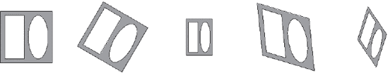

**图 7-29。** *左起:原始、旋转、缩放、剪切，一次全部*

`item1`项目被放置在场景中，没有应用任何变换。可以看做参考项。

将`item2`项平移、旋转 30 度，然后平移回其原始位置，使其围绕(0，0)点旋转。通过平移项目，使其中心点位于点(0，0)上，您可以在将其平移回原始位置之前，围绕其中心旋转它。

`item3`项目也被平移，使得点(0，0)成为项目的中心。因为缩放也是相对于坐标系的中心点，所以在平移回来之前会先进行缩放。通过围绕其中心缩放项目，您可以更改形状的大小，但不能更改其位置。

第四项，`item4`，翻译和复译为`item2`和`item3`。在平移之间，它被剪切。

第五项，`item5`，被缩放，旋转，剪切，使其变形。这个项目展示了如何将所有的变换应用到一个对象上。

* * *

**注意**应用变换时，记住顺序很重要。以不同的顺序应用变换将产生不同的结果。

* * *

**清单 7-21。** *改造五项*

```cpp
int main( int argc, char **argv )

{

  QApplication app( argc, argv );

  QGraphicsScene scene( QRect( 0, 00, 1000, 200 ) );

  QGraphicsItem *item1 = createItem( 0, &scene );

  QGraphicsItem *item2 = createItem( 200, &scene );

  item2->translate( 300, 100 );

  item2->rotate( 30 );

  item2->translate( −300, −100 );

  QGraphicsItem *item3 = createItem( 400, &scene );

  item3->translate( 500, 100 );

  item3->scale( 0.5, 0.7 );

  item3->translate( −500, −100 );

  QGraphicsItem *item4 = createItem( 600, &scene );

  item4->translate( 700, 100 );

  item4->shear( 0.1, 0.3 );

  item4->translate( −700, −100 );

  QGraphicsItem *item5 = createItem( 800, &scene );

  item5->translate( 900, 100 );

  item5->scale( 0.5, 0.7 );

  item5->rotate( 30 );

  item5->shear( 0.1, 0.3 );

  item5->translate( −900, −100 );

  QGraphicsView view;

  view.setScene( &scene );

  view.show();

  return app.exec();

}
```

处理图形项目时，可以使用 Z 值来控制项目的绘制顺序。您可以使用`setZValue(qreal)`方法设置每个项目。任何项目的默认 Z 值都是`0`。

绘制场景时，Z 值较高的项目会出现在 Z 值较低的项目之前。对于具有相同 Z 值的项目，顺序是未定义的。

#### 使用自定义项目进行交互

对于自定义项目，您可以使用图形视图创建您想要的行为类型。这种实现自定义形状的灵活性和简易性使得 graphics view 成为一个非常好用的工具。

本节的目的是创建一组手柄:一个中心手柄用于移动形状，两个边缘手柄用于调整形状大小。[图 7-30](#the_handles_in_action) 显示了操作中的手柄。请注意，您可以一次将手柄应用于几个形状，并且使用的形状是标准形状:`QGraphicsRectItem`和`QGraphicsEllipseItem`。


**图 7-30。** *手柄在动作*

让我们开始看代码，从应用程序的`main`函数开始。这展示了如何创建、配置和使用句柄。`main`函数如清单 7-22 中的[所示。](#using_the_handleitem_class_in_a_scene)

该函数首先创建您需要的 Qt 类:一个`QApplication`、一个`QGraphicsScene`，以及通过一个`QGraphicsRectItem`和一个`QGraphicsEllipseItem`表示的两个形状。当这些形状被添加到场景中后，是时候创建六个`HandleItem`对象了——每个形状三个。

每个句柄的构造器接受以下参数:一个要操作的项目、一个场景、一种颜色和一个角色。可用的角色有`TopHandle`、`RightHandle`和`CenterHandle`。当你创建一个`CenterHandle`时，你必须传递一个指向另外两个句柄的`QList`。也就是说，如果你选择其他手柄，`CenterHandle`本身就能完美工作，其他两种型号也是如此。

然后，`main`函数继续创建一个`QGraphicsView`并设置它来显示场景。然后通过调用`QApplication`对象上的`exec`方法开始主循环。但是，您不能直接返回结果。因为手柄引用其他形状而不是子节点，所以首先删除手柄很重要。当`QGraphicsScene`被销毁时，剩下的图形也被删除。

**清单 7-22。** *使用* `HandleItem` *类中的一个场景*

```cpp
int main( int argc, char **argv )

{

  QApplication app( argc, argv );

  QGraphicsScene scene( 0, 0, 200, 200 );

  QGraphicsRectItem *rectItem = new QGraphicsRectItem(

                                    QRect( 10, 10, 50, 100 ),

                                    0, &scene );

  QGraphicsEllipseItem *elItem = new QGraphicsEllipseItem(

                                     QRect( 80, 40, 100, 80 ),

                                     0, &scene );

  HandleItem *trh = new HandleItem( rectItem, &scene, Qt::red,

                                    HandleItem::TopHandle );

  HandleItem *rrh = new HandleItem( rectItem, &scene, Qt::red,

                                    HandleItem::RightHandle );

  HandleItem *crh = new HandleItem( rectItem, &scene, Qt::red,

                                    HandleItem::CenterHandle,

                                   QList<HandleItem*>() << trh << rrh );

  HandleItem *teh = new HandleItem( elItem, &scene, Qt::green,

                                    HandleItem::TopHandle );

  HandleItem *reh = new HandleItem( elItem, &scene, Qt::green,

                                    HandleItem::RightHandle );

  HandleItem *ceh = new HandleItem( elItem, &scene, Qt::green,

                                    HandleItem::CenterHandle,

                                   QList<HandleItem*>() << teh << reh );

  QGraphicsView view;

  view.setScene( &scene );

  view.show();

  return app.exec();

}
```

既然您已经知道了句柄的外观以及该类在场景中的用法，那么是时候看看实际的类了。清单 7-23 显示了类声明。

清单以该类的前向声明开始，因为该类将包含指向其自身实例的指针。然后，它定义了不同可用角色的枚举:`CenterHandle`、`RightHandle`和`TopHandle`。

如前所述，`enum`后面的构造器包含所有预期的参数。但是，角色和句柄列表有默认值。默认角色是中心句柄，默认情况下列表为空。

从`QGraphicsItem`继承时需要下面两个方法。paint 方法负责根据请求绘制形状，而`boundingRect`告诉场景形状有多大。

然后，类声明继续一组受保护的方法。您可以重写这些方法，通过形状与用户进行交互。`mousePressEvent`和`mouseReleaseEvent`方法对鼠标按钮作出反应，而`itemChange`方法可用于过滤并对项目的所有更改作出反应。您可以使用它来响应和限制小部件的移动。

私有部分结束类声明。它包含所有需要的本地状态和变量。下面的列表总结了它们的角色和用途(在本节的其余部分，您将更仔细地了解它们的用法):

*   `m_item`:手柄作用的`QGraphicsItem`。
*   `m_role`:手柄的作用。
*   `m_color`:手柄的颜色。
*   `m_handles`:作用在同一个`m_item`上的其他手柄列表——需要中心手柄。
*   `m_pressed`:一个布尔值，表示鼠标按钮是否被按下。这一点很重要，因为您需要能够判断句柄是否因为用户交互或编程更改而移动。

**清单 7-23。** *手柄类*

```cpp
class HandleItem;

class HandleItem : public QGraphicsItem

{

public:

  enum HandleRole

  {

    CenterHandle,

    RightHandle,

    TopHandle

  };

  HandleItem( QGraphicsItem *item, QGraphicsScene *scene,

              QColor color, HandleRole role = CenterHandle,

              QList<HandleItem*> handles = QList<HandleItem*>() );

  void paint( QPainter *paint,

              const QStyleOptionGraphicsItem *option, QWidget *widget );

  QRectF boundingRect() const;

protected:

  void mousePressEvent( QGraphicsSceneMouseEvent *event );

  void mouseReleaseEvent( QGraphicsSceneMouseEvent *event );

  QVariant itemChange( GraphicsItemChange change, const QVariant &data );

private:

  QGraphicsItem *m_item;

  HandleRole m_role;

  QColor m_color;

  QList<HandleItem*> m_handles;

  bool m_pressed;

};
```

在[清单 7-24](#the_constructor_of_the_handle_item) 中显示的构造器在设置一个高`zValue`之前简单地初始化所有的类变量。这确保了手柄出现在它们所处理的形状的前面。然后设置一个标志，通过使用`setFlag`方法使形状可移动。

* * *

**提示**其他标志允许你选择形状(`ItemIsSelectable`)或者接受键盘焦点(`ItemIsFocusable`)。这些标志可以通过逻辑或运算来组合。

* * *

**清单 7-24。** *句柄项的构造者*

```cpp
HandleItem::HandleItem( QGraphicsItem *item, QGraphicsScene *scene,

                        QColor color, HandleItem::HandleRole role,

                        QList<HandleItem*> handles )

                        : QGraphicsItem( 0, scene )

{

  m_role = role;

  m_color = color;

  m_item = item;

  m_handles = handles;

  m_pressed = false;

  setZValue( 100 );

  setFlag( ItemIsMovable );

}
```

因为这个类实际上实现了三个不同的句柄，它经常使用`switch`语句来区分不同的角色(参见[清单 7-25](#determining_the_bounding_rectangle_of_th) ，其中展示了`boundingRect`方法)。边框由所处理形状的边框位置定义。手柄没有自己的位置；相反，它们完全基于处理形状的位置和大小。

**清单 7-25。** *确定手柄的外接矩形*

```cpp
QRectF HandleItem::boundingRect() const

{

  QPointF point = m_item->boundingRect().center();

  switch( m_role )

  {

  case CenterHandle:

    return QRectF( point-QPointF(5, 5), QSize( 10, 10 ) );

  case RightHandle:

    point.setX( m_item->boundingRect().right() );

    return QRectF( point-QPointF(3, 5), QSize( 6, 10 ) );

  case TopHandle:

    point.setY( m_item->boundingRect().top() );

    return QRectF( point-QPointF(5, 3), QSize( 10, 6 ) );

  }

  return QRectF();

}
```

清单 7-26 中的[所示的绘制方法使用`boundingRect`方法来决定在哪里以及如何绘制不同的手柄。中央手柄绘制为圆形，而顶部和右侧手柄绘制为指向上方和右侧的箭头。](#painting_the_handles)

* * *

**注意**在绘制顶部和右侧手柄时，使用`center`方法找到外接矩形的中心点。

* * *

**清单 7-26。** *画手柄*

```cpp
void HandleItem::paint( QPainter *paint,

                        const QStyleOptionGraphicsItem *option,

                        QWidget *widget )

{

  paint->setPen( m_color );

  paint->setBrush( m_color );

  QRectF rect = boundingRect();

  QVector<QPointF> points;

  switch( m_role )

  {

  case CenterHandle:

    paint->drawEllipse( rect );

    break;

  case RightHandle:

    points << rect.center()+QPointF(3,0) << rect.center()+QPointF(-3,-5)

           << rect.center()+QPointF(-3,5);

    paint->drawConvexPolygon( QPolygonF(points) );

    break;

  case TopHandle:

    points << rect.center()+QPointF(0,-3) << rect.center()+QPointF(-5,3)

           << rect.center()+QPointF(5,3);

    paint->drawConvexPolygon( QPolygonF(points) );

    break;

  }

}
```

在您确定了在哪里绘制，然后绘制手柄之后，下一步是等待用户交互。清单 7-27 显示了处理鼠标按钮事件的方法，比如按下和释放。

因为您在构造器中较早地设置了`ItemIsMoveable`标志，所以您所要做的就是在将事件传递给`QGraphicsItem`处理程序之前更新`m_pressed`变量。

**清单 7-27。** *处理鼠标按下和释放事件*

```cpp
void HandleItem::mousePressEvent( QGraphicsSceneMouseEvent *event )

{

  m_pressed = true;

  QGraphicsItem::mousePressEvent( event );

}

void HandleItem::mouseReleaseEvent( QGraphicsSceneMouseEvent *event )

{

  m_pressed = false;

  QGraphicsItem::mouseReleaseEvent( event );

}
```

当用户选择移动一个句柄时，`itemChange`方法被调用。这种方法给你一个机会来对变化做出反应(或者甚至停止变化)(你可以在[清单 7-28](#handling_changes_to_the_handle) 中看到实现)。我删除了清单中处理不同角色移动的部分(稍后您将看到它们)；清单只显示了外部框架。简单地让程序性的移动和与移动无关的改变传递给相应的`QGraphicsItem`方法。如果遇到用户调用的位置更改，您会根据句柄的角色采取不同的操作。但是首先通过比较新位置和当前位置来计算实际移动。新位置通过`data`参数传递，而当前位置由`pos`方法给出。您还可以确定正在处理的形状的中心点，因为在处理右侧和顶部手柄时都会用到它。

**清单 7-28。** *处理对手柄的修改*

```cpp
QVariant HandleItem::itemChange( GraphicsItemChange change,

                                 const QVariant &data )

{

  if( change == ItemPositionChange && m_pressed )

  {

    QPointF movement = data.toPoint() - pos();

    QPointF center = m_item->boundingRect().center();

    switch( m_role )

    {

...

    }

  }

  return QGraphicsItem::itemChange( change, data );

}
```

[清单 7-29](#handle_movements_of_a_center_handle) 展示了如何处理用户调用的中心手柄的位置变化。通过使用`moveBy`调用来移动正在处理的项目`m_item`。在`m_handles`列表中的所有手柄都被转换到适当的位置，因为任何右侧和顶部的手柄都必须遵循它们正在处理的形状。

**清单 7-29。** *中心手柄的手柄动作*

```cpp
    switch( m_role )

    {

    case CenterHandle:

      m_item->moveBy( movement.x(), movement.y() );

      foreach( HandleItem *handle, m_handles )

        handle->translate( movement.x(), movement.y() );

      break;

...

    }

    return QGraphicsItem::itemChange( change, pos()+movement );
```

顶部和右侧的手柄只影响它们自己，这意味着它们不使用`m_handles`列表。形状的中心点不受影响；水平方向不受顶部句柄的影响，垂直方向也不受右侧句柄的影响。

清单 7-30 和 [7-31](#handling_movements_of_a_right_handle) 展示了角色是如何被处理的。清单看起来非常相似；唯一的区别是他们行动的方向。

我们来看看[清单 7-30](#handling_movements_of_a_top_handle) 的详细内容；也就是顶把。清单以一个`if`子句开始，确保形状不会太小。如果是这种情况，将当前位置作为下一个位置传递给`QGraphicsItem itemChange`方法。

如果手柄形状足够大，继续限制手柄的移动方向(不允许顶部手柄水平移动)。然后，您平移正在处理的图形，使图形的中心成为坐标系的原点。这是缩放的准备工作，根据运动来缩放形状。该形状被转换回其原始位置，switch 语句被留下，而`QGraphicsItemitemChange`方法被赋予该事件，但是具有受限的移动方向。

**清单 7-30。** *顶部手柄的操作动作*

```cpp
    switch( m_role )

    {

...

    case TopHandle:

      if( −2*movement.y() + m_item->sceneBoundingRect().height() <= 5 )

        return QGraphicsItem::itemChange( change, pos() );

      movement.setX( 0 );

      m_item->translate( center.x(), center.y() );

      m_item->scale( 1, 1.0-2.0*movement.y()

                           /(m_item->sceneBoundingRect().height()) );

      m_item->translate( -center.x(), -center.y() );

      break;

    }

    return QGraphicsItem::itemChange( change, pos()+movement );

```

**清单 7-31。** *右手柄的操作动作*

`    switch( m_role )
    {
...
    case RightHandle:
      if( 2*movement.x() + m_item->sceneBoundingRect().width() <= 5 )
        return QGraphicsItem::itemChange( change, pos() );

      movement.setY( 0 );

      m_item->translate( center.x(), center.y() );
      m_item->scale( 1.0+2.0*movement.x()
                        /(m_item->sceneBoundingRect().width()), 1 );
      m_item->translate( -center.x(), -center.y() );
      break;
...
    }

    return QGraphicsItem::itemChange ( change, pos()+movement );`

#### 印刷

Qt 用`QPrinter`类处理打印机，它代表一个特定打印机的打印作业，可以用作一个绘画设备。这意味着您可以创建一个`QPainter`来绘制到通过`QPrinter`表示的页面上。然后，printer 对象用于创建新页面，并告知打印机何时可以打印作业。

看看该类中的一些可用属性:

*   `colorMode`:打印机以彩色或灰度打印。可以设置为`QPrinter::Color`或`QPrinter::GrayScale`。
*   `orientation`:页面可以定位为横向(`QPrinter::Landscape`)或者纵向(`QPrinter::Portrait`)。
*   `outputFormat`:打印机可以打印到平台自带的打印系统(`QPrinter::Native`)、PDF 文档(`QPrinter::PdfFormat`)或 PostScript 文档(`QPrinter::PostScriptFormat`)。当打印到文件时，这在创建 PDF 和 PostScript 文档时是必需的，您必须使用`setOutputFileName`设置文档的文件名。
*   `pageSize`:根据不同标准的纸张大小。包括 A4 ( `QPrinter::A4`)和 Letter ( `QPrinter::Letter`)纸张尺寸，但支持更多尺寸。详情请参考 Qt 文档。

让我们继续进行一些实际的打印。

* * *

在尝试打印时，拥有一个虚拟打印机驱动程序或打印到一个文件会非常有用——它可以节省大量纸张。

* * *

**画到打印机上**

向打印机绘图最直接的方法是创建一个`QPainter`来直接访问`QPrinter`对象。要配置`QPrinter`对象，使用`QPrintDialog`标准对话框(见[图 7-31](#a_printer_selection_and_configuration_di) )，用户可以在其中选择打印机，也可以对打印作业进行一些基本选择。


**图 7-31。** *出现打印机选择和配置对话框*

清单 7-32 显示了创建五页打印输出的整个应用程序的源代码。打印作业中某一页的顶部如[图 7-32](#a_painted_page) 所示。


**图 7-32。** *一★页*

[清单 7-32](#painting_to_a_qprinter_object) 从创建`QApplication`、`QPrinter`和`QPrintDialog`开始。然后执行该对话；如果它被接受，你将做一些印刷。

当您创建一个引用打印机对象的`QPainter`并将其设置为使用黑色钢笔时，实际的打印就准备好了。然后使用一个`for`循环来创建五个页面。对于每一页，在`QPrinterpageRect`中画一个矩形和两条交叉的线。这是一个代表可打印区域的矩形(代表整张纸的矩形称为`paperRect`)。

计算`textArea`矩形的尺寸。(这个矩形的两边和顶部有半英寸的边距，底部有整整一英寸的边距。)分辨率方法给出每英寸的点数，因此`0.5*printer.resolution()`得出覆盖半英寸所需的点数。在文本区域周围画一个框，然后将页码作为文本打印在同一个矩形内。

如果你不在最后一页，也就是说，这一页不等于四，调用`newPage`方法。该页面打印当前页面并创建一个新的空白页以继续绘画。

**清单 7-32。** *画到一个* `QPrinter` *的物体上*

```cpp
int main( int argc, char **argv )

{

  QApplication app( argc, argv );

  QPrinter printer;

  QPrintDialog dlg( &printer );

  if( dlg.exec() == QDialog::Accepted )

  {

    QPainter painter( &printer );

    painter.setPen( Qt::black );

    for( int page=0; page<5; page++ )

    {

      painter.drawRect( printer.pageRect() );x

      painter.drawLine( printer.pageRect().topLeft(),

                        printer.pageRect().bottomRight() );

      painter.drawLine( printer.pageRect().topRight(),

                        printer.pageRect().bottomLeft() );

      QRectF textArea(

          printer.pageRect().left()  +printer.resolution() * 0.5,

          printer.pageRect().top()   +printer.resolution() * 0.5,

          printer.pageRect().width() -printer.resolution() * 1.0,

          printer.pageRect().height()-printer.resolution() * 1.5 );

      painter.drawRect( textArea );

      painter.drawText( textArea, Qt::AlignTop | Qt::AlignLeft,

                        QString( "Page %1" ).arg( page+1 ) );

      if( page != 4 )

        printer.newPage();

    }

  }

  return 0;

}
```

**将一个图形场景渲染到打印机上**

使用 painter 对象在打印机上绘图可能很容易，但是如果您的整个文档都基于图形视图框架，这就没什么用了。你必须能够将你的场景渲染到打印机上，这很容易做到。

将[清单 7-33](img/Chapter07.html#rendering_a_graphics_scene_to_the_printe) 与[清单 7-19](#populating_a_scene_with_standard_shapes) 进行比较。[清单 7-33](img/Chapter07.html#rendering_a_graphics_scene_to_the_printe) 使用与[清单 7-19](#populating_a_scene_with_standard_shapes) 相同的场景，但它不是通过场景显示，而是使用`render`方法将它打印到打印机。通过比较[图 7-33](img/Chapter07.html#a_printed_graphics_scene) 和[图 7-28](img/Chapter07.html#a_graphics_view_with_some_standard_items) 可以比较输出。正如你所看到的，这个场景在纸上和屏幕上都表现得很好。

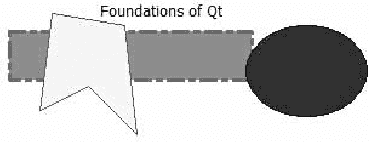

**图 7-33。** *一个打印出来的图形场景*

`render`方法接受四个参数。从左到右，它们是要渲染到的画师、目标矩形、源矩形和确定如何缩放的标志。在清单中，画师绘制了一个`QPrinter`对象。目标矩形代表页面的整个可打印区域，而源矩形代表整个场景。缩放标志被设置为`Qt::KeepAspectRatio`，这意味着场景的高宽比将保持不变。

如果你想让场景拉伸以填充目标矩形，你可以使用`Qt::IgnoreAspectRatio`。另一种选择是让场景填充页面，但仍然通过传递`Qt::KeepAspectRatioByExpanding`来保持其高宽比。这意味着，除非源矩形和目标矩形具有相同的部分，否则场景将超出可用页面。

**清单 7-33。** *向打印机渲染一个图形场景*

```cpp
int main( int argc, char **argv )

{

  QApplication app( argc, argv );

  QGraphicsScene scene( QRect( −50, −50, 400, 200 ) );

...

  QPrinter printer;

  QPrintDialog dlg( &printer );

  if( dlg.exec() )

  {

    QPainter painter( &printer );

    scene.render( &painter, printer.pageRect(),

                  scene.sceneRect(), Qt::KeepAspectRatio );

  }

  return 0;

}
```

#### OpenGL

在本章的第一段，我提到了使用`QPainter`类的唯一替代方法是直接使用 OpenGL。因为 OpenGL 是一种编程接口，不在本书的讨论范围之内，所以您将看到如何在不直接编写 OpenGL 代码的情况下使用 OpenGL 的硬件加速。

一个`QGraphicsView`是一个给定场景的视口，但是它也包含一个可以通过`viewport`属性访问的视口部件。如果您为视图提供一个`QGLWidget`，图形将使用 OpenGL 绘制。

在[清单 7-21](#transforming_the_five_items) 中，所需的更改仅限于[清单 7-34](img/Chapter07.html#drawing_a_graphics_scene_using_opengl) 中高亮显示的行。代码创建一个新的`QGLWidget`并将其设置为 viewport。`QGraphicsView`项拥有其视口的所有权，所以不需要提供父指针。

**清单 7-34。** *使用 OpenGL 绘制图形场景*

```cpp
int main( int argc, char **argv )

{

...

  QGraphicsView view;

  view.setScene( &scene );

  view.setViewport( new QGLWidget() );

  view.show();

  return app.exec();

}
```

要使用 OpenGL 构建 Qt 应用程序，您必须通过在项目文件中添加一行内容`QT += opengl`来包含 Qt OpenGL 模块。使用 OpenGL 绘制场景和使用普通小部件绘制场景之间的区别是看不出来的——这才是重点。然而，在提供 OpenGL 硬件加速的系统上，性能会大大提高。

### 总结

使用`QPainter`类很容易绘制，它可以用于绘制各种设备(屏幕、图像、位图和打印机)。通过缩放、旋转、剪切和平移，几乎可以画出任何可以想象的形状。

`QPainter`类是创建带有绘画逻辑的定制小部件的主力。如果您想在单个文档或小部件中表示多个独立的形状，图形视图框架会很有帮助。通过创建一个`QGraphicsScene`并用`QGraphicsItem`对象填充它，您可以很容易地为用户创建一个交互式画布。可以使用`QGraphicsView`小工具显示场景，也可以使用`QPainter`打印到`QPrinter`上。*****